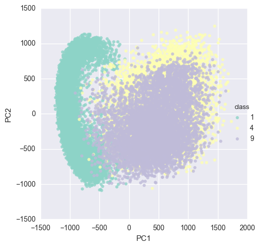
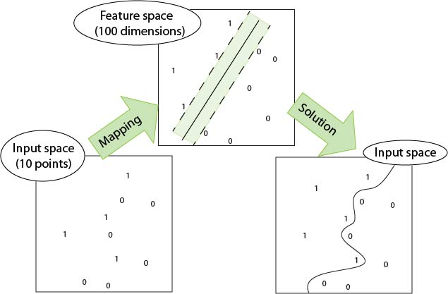
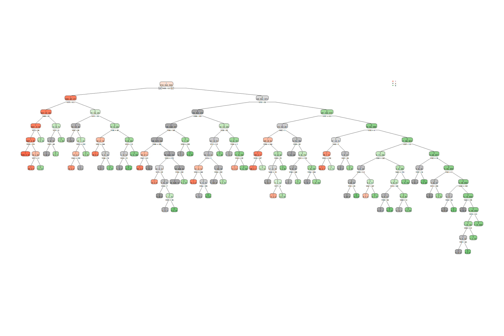

```{r setup, include=FALSE}
installnload_packages <- function(packages){
  packages.new <- packages[!(packages %in% installed.packages()[,"Package"])]
  if(length(packages.new)) install.packages(packages.new)
  for (i in 1:length(packages)) {temp <- packages[i]; library(temp, character.only = T)}
}

used_packages <- c("magrittr", "ggplot2", "feather","plotly", "MASS","dplyr","reshape2","readr","lubridate","cluster","fpc","scales","knitr","gtable","data.table","DT","e1071","class","rpart","rpart.plot","nnet",'maps')

installnload_packages(used_packages)

library (RRhelpr) #this is hosted on gitlab, so must be installed seperately

load_image_file <- function(filename) {
  ret = list()
  f = file(filename,'rb')
  readBin(f,'integer',n=1,size=4,endian='big')
  ret$n = readBin(f,'integer',n=1,size=4,endian='big')
  nrow = readBin(f,'integer',n=1,size=4,endian='big')
  ncol = readBin(f,'integer',n=1,size=4,endian='big')
  x = readBin(f,'integer',n=ret$n*nrow*ncol,size=1,signed=F)
  ret$x = matrix(x, ncol=nrow*ncol, byrow=T)
  close(f)
  ret
}
load_label_file <- function(filename) {
  f = file(filename,'rb')
  readBin(f,'integer',n=1,size=4,endian='big')
  n = readBin(f,'integer',n=1,size=4,endian='big')
  y = readBin(f,'integer',n=n,size=1,signed=F)
  close(f)
  y
}

train <- load_image_file('mnist/train-images.idx3-ubyte')
test <- load_image_file('mnist/t10k-images.idx3-ubyte')
  
train$y <- load_label_file('mnist/train-labels.idx1-ubyte')
test$y <- load_label_file('mnist/t10k-labels.idx1-ubyte')  

show_digit <- function(arr784, col=gray(12:1/12), ...) {
  image(matrix(unlist(arr784), nrow=28)[,28:1], col=col, ...)
}


trainset <- as.data.frame(train$x);trainset$y <- as.factor(train$y)
testset <- as.data.frame(test$x);testset$y <- as.factor(test$y)

trainset %<>% subset(y %in% c("1","4","9")) %>% droplevels
testset %<>% subset(y %in% c("1","4","9")) %>% droplevels

write_feather(trainset, "trainset.feather")
write_feather(testset, "testset.feather")
```


# Data

## MNIST dataset
We use a subset of the [MNIST handwritten digits dataset](http://yann.lecun.com/exdb/mnist/) to demonstrate the machine learning concepts. The MNIST dataset contains "pictures" of handwritten digits from 0 to 9. The "picture" for each of these numbers is stored in a 28 x 28 matrix containing a total of 784 pixels. Each "pixel" is a black/white value with a range of 0 to 255. When plotted in a heatmap style, the darker/light contrast reveals the picture of the number. Here's a few fours from our data:

```{r, shownum}
par(mfrow=c(2,2))
show_digit(trainset[1, 1:784])
show_digit(trainset[6, 1:784])
show_digit(trainset[9, 1:784])
show_digit(trainset[13, 1:784])
par(mfrow=c(1,1))
```

## Subset of NIMST dataset
For this example we subset the original NIMST data to contain only pictures of digits 1, 4 and 9. The last column is a label for the number, but it is not used in the analysis. 

# PCA

* Principal Component Analysis is a method of multivariate (multidimensional) data analysis
* It is used for data exploration and dimensionality reduction. Other applications can include clustering and variable selection
* Care should be taking when interpreting Principal Component Analysis. Diagnostics are available to understand the model output
* Statistical inference is possible from PCA, but it may require the use of other techniques, such as KNN to complement PCA and form a conclusion from the simplification of the data
* Please do not call this method PrinciPLE Component Analysis. That is wrong

## Basic Theory
* PCA aims to capture the essence of the multivariate data
* It provides a high level picture of the entire dataset in two or three "Principal Components" (PCs)
* It relies on the covariance between all variables to extract the essence of the data. It uses matrix algebra to calculate eigenvalues and eigenvectors from covariance matrix
* Eigenvectors contain one "weight" for each variable. A linear equation can be formed to using these weights and the value of the variable for each record to calculate an observation's PC1 value
* There is one Principal Component for each variable used
+ The first principal component (PC1) accounts for most of the data's variation as possible
+ Subsequent PCs accounts for the largest possible amount of variance while being orthagonal to the previous PCs
+ Not all PCs should be used to interpret the data


Mathematically, PC1 is written as $w_{(1)}$ and solved for using this equation:

\begin{equation}
w_{(1)} = \text{arg max } \frac{w^T X^T X w}{w^T w} = \text{ eigenvector}_{(1)} \text{ of } X^T X
\end{equation}

### PCA Analysis using R

PCA Analysis is conducted and the Eigen Values and Eigen Vectors are generated. A "scree plot" shows the percent of the variance explained by each Principal Component (28 in total). It indicates how much you should trust any one component, based on how variance they explain. The later PCs usually tend to explain noise in the data so it is not as valuable to interpret them. Below is a picture of the scree plot. Within the scree plot the goal is to find the "elbow" which is usually a good indication that the PCs up to that point explain most of the variance in the data. In this case, three PCs seems to explain the data well, although they collectively only explain about 35% of the data. 

```{r PCA r}
#Data has been loaded above

#function: prcomp from the stats package. The stats package is installed by default
#  since all our values have the same scale, we will not scale and recenter; this could be done 
#  by setting prcomp(train$x, center=TRUE, scale.=TRUE)
unlabeled <- trainset[, 1:784]
modpca <- stats::prcomp(unlabeled)
prop.pca <- modpca$sdev^2/sum(modpca$sdev^2)
plot(prop.pca[1:28])
```

### Python

```{python, PCA python}
import feather, os
import pandas as pd
from sklearn.decomposition import PCA
import seaborn as sns

path = os.getcwd()
trainpath = os.path.join(path, "trainset.feather")
plotpath = os.path.join(path, "Images\python_PCA.png")

#load the data that was loaded then saved in R
train = feather.read_dataframe(trainpath)
lbls = train['y']
imgs = train.drop('y', 1)

# train model
pca = PCA(n_components=2, svd_solver='randomized')
X = pca.fit_transform(imgs)

# form DataFrame and rename columns
X = pd.DataFrame(X)
X.columns = ['PC1', 'PC2']
X['class'] = lbls

# make and save plot
sns.set_palette(sns.color_palette("Set3", 10))
sns.lmplot('PC1', 'PC2', data=X, hue='class', fit_reg=False).savefig(plotpath)
```


## Results

Each PC explains some essence in the data. As seen from the eigenvectors above and the plots below show what is captured by the principal components (only PC1 through PC4 below). Each captures a different "story" and they only account for `r prop.pca[1:3]`, and `r prop.pca[4]` percent of the variation in the data. Althought they are not precisely recognizable as numbers there appear to be groups of curves that make up the digits. PC1 seems to show data that looks like a (nine), while PC2 is a little more unclear in that it shows data that could be a 9, a 4 or a 1. PC3 shows data that could be a 9. 

```{r PCs}
#plot eigenvectors
par(mfrow=c(2,2))
show_digit(modpca$rotation[,1],axes=FALSE)
show_digit(modpca$rotation[,2],axes=FALSE)
show_digit(modpca$rotation[,3],axes=FALSE)
show_digit(modpca$rotation[,4],axes=FALSE)
par(mfrow=c(1,1))
```

Since each observation is made up of a combination of these Principle Components, we would expect the ones to have low PC1 values, which we see is true by this plot below, with PC1 on the x-axis and PC2 on the y-axis. However, most of the classes are hard to separate.

```{r PCA plot}
plot_ly(as.data.frame(modpca$x), x=~PC1, y=~PC2, z=~PC3, color = as.factor(trainset$y), type = 'scatter3d', mode='markers')
```

Similarly, this is the plot that the above python code generated:



# Supervised Learning 
Supervised learning takes pre-defined classes and fits the data to them. Often, these are classification problems with a classified training set, and attempt to classify another data set into the same groups. 

## Linear Discriminant Analysis (LDA)

### Theory

Bayesian Probabilistic Approach
$h(y|x) \propto f(x|y)  \times P(y)$

In plain English, the *posterior* probability distribution of a response variable is proportional to the product of a *prior* and the likelihood of the predictor *data*. A prior is the probability of the response variable for each of the classes. This prior can be based on a guess, or an actual proportion of the data. For instance, on a two class dataset, the prior probability could be 50/50 (a guess) or 30/70 if 30% of the data is class 1 and 70% of the data is class 0, or viceversa. The size of the dataset, and the proportion and variance of the different classes are necessary to be able to define the "prior". The likelihood of the predictor data is based on an assumption of mean and standard deviation of the data. More information on likelihood, using Max Likelihood can be found here: [Maximum Likelihood Wikipedia ](https://en.wikipedia.org/wiki/Maximum_likelihood_estimation) 

Linear Discriminant Analysis (LDA) and Quadratic Discriminant Analysis (QDA) aim to predict the probability distribution of a variable based on a matrix of predictor variables.  The response variable can be logical, numerical, or categorical. LDA and QDA are useful when here is a need for separation between the different classes that make up the response variable. 

In order to avoid overfitting, cross-validation should be considered for the LDA and QDA methods, as well as any other predictive methods which involve classes. Cross-validation will allow for model tuning, which is the process of setting a probability threshold for each class in order to decided which class is to be predicted. More on cross-validation is explained in a later section.


###Outputs 
LDA calculcates the "posterior" probability distribution and predicts the class with the highest probability.

LDA outputs a set of linear discriminants. A discriminant (or canon) is a linear relationship of predictor variables paired up with weights. The canonical value for each record can be calculcated. The resulting numeric output (canon) of this relationship can then be sorted to separate the variables. The number of canons for any analysis will be equal to (k-1), where k is the number of classes. 

LDA and QDA (Quadratic Discriminant Analysis) both follow the same approach, but QDA is utilized when the variances of the target classes are significantly different. If the variance is not class-specific, the analysis becomes linear.

### Use Cases

* Predicting a "class" from a set of input variables
* Feature selection using the magnitude of the canon's weights, and correlation between each of the varaibles and the canonical outputs. 

In the example below LDA will be used to predict #of cylinders (classes) based on other vehicle characteristics.


### Examples

#### R

```{r LDA}
data_LDA = mtcars

trainindex = 1:((dim(data_LDA)[1]/5)*4)
train_lda = data_LDA[trainindex,]

cars_LDA <- lda(cyl ~ ., data = train_lda)
cars_LDA_validate <- predict(object=cars_LDA, newdata=mtcars)
data_LDA$PredictedClass = as.character(cars_LDA_validate$class)
data_LDA$Prob_4cyl = cars_LDA_validate$posterior[,1]
data_LDA$Prob_6cyl = cars_LDA_validate$posterior[,2]
data_LDA$Prob_8cyl = cars_LDA_validate$posterior[,3]
data_LDA$idx = c(1:nrow(data_LDA))
data_LDA$carnames = rownames(data_LDA)
data_LDA$traintest <- ifelse(data_LDA$carnames %in% rownames(train_lda),"#004990","#a7a9ac")

data_LDA$PredictedClass

ggplot(data_LDA, aes(x = carnames)) + 
  geom_point(aes(y = cyl, colour = "Actual #Cyl"), shape = 1, size = 5 ) +
  geom_point(aes(y = as.numeric(PredictedClass), colour = "Classified #Cyl"), shape = 4, size = 5 ) +
  theme(axis.text.x = element_text(angle = 70, hjust = 1, color = data_LDA$traintest[order(data_LDA$carnames)]))
```

#### Python
```{python}
import feather, os
import pandas as pd
import numpy as np
from sklearn.discriminant_analysis import LinearDiscriminantAnalysis
path = os.getcwd()
trainpath = os.path.join(path, "trainset.feather")
testpath = os.path.join(path, "testset.feather")

#data intake and prep
train = feather.read_dataframe(trainpath)
lbls = train['y']
imgs = train.drop('y', 1)
test = feather.read_dataframe(testpath)
lbls_test = test['y']
imgs_test = test.drop('y', 1)

#initialize and train model
clf = LinearDiscriminantAnalysis()
clf.fit(imgs, lbls)
clf.score(imgs, lbls)

#predict
predictions = clf.predict(imgs_test)
df_confusion = pd.crosstab(lbls_test, predictions, margins=True)
print(df_confusion)
```


## Support Vector Machines

### Theory

A support vector machine it a binary classifier that attempts to maximize the seperation between groups. It fits a hyperplane between the two classes, creating and maximizing a gap between them. This hyperplane is a linear seperator, but can be made nonlinear via kernels ($k: \eta \times \eta \rightarrow  \mathbb{R}$) and modifying dimensionality. 




In its simplest form, the process is as follows:


Let $H_1$ and $H_2$ be the closest points in different classes, $y$ be either 1 or -1 depending on the class of the point, and the hyperplane be defined as $w*x + b = 0$ so that points on different sides of the plane will have either 1 or -1. 

Then $d(H_1,H_2) = \frac{2*(w*x + b)}{w} = \frac{2}{w}$, and the goal is to minimize $w$ to maximize seperation. 

From the definitions above, we know that $w*x + b \geq 1$ when $y_1 = 1$ and that $w*x + b \leq -1$ when $y_1 = -1$, which can be simplified to $y_1 (w*x) \geq 1$. 

This can be solved with a [Lagrangian multiplier](https://en.wikipedia.org/wiki/Lagrange_multiplier) and has only one global maximum, which is the desired hyperplane.


### Use Cases

SVM is able to capture complex hyperplane boundries using non-linear kernels, but can be computationally intensive. It is most useful where boundries between classes are complex or not quite visible, as the hyperplanes can be calcualted to find the best boundaries, and ought to be more robust than linear methods when extrapolating to new data.

### Examples

```{r SVM}
model <- e1071::svm(y~., trainset, scale=F, kernel = "polynomial")
res <- predict(model, newdata=testset)

RRhelpr::printClassificationTable(testset$y,res,"SVM")
```

```{python}
import feather, os
import pandas as pd
from sklearn import svm

path = os.getcwd()
trainpath = os.path.join(path, "trainset.feather")
testpath = os.path.join(path, "testset.feather")

#data intake and prep
train = feather.read_dataframe(trainpath)
lbls = train['y']
imgs = train.drop('y', 1)
test = feather.read_dataframe(testpath)
lbls_test = test['y']
imgs_test = test.drop('y', 1)

#initialize and train model
svm = svm.SVC(kernel='poly')
svm.fit(imgs, lbls)
svm.score(imgs, lbls)

#predict
predictions = svm.predict(imgs_test)
df_confusion = pd.crosstab(lbls_test, predictions, margins=True)
print(df_confusion)
```

## K-Nearest Neighbors

### Theory
* K-Nearest Neighbors uses a majority vote of the closest $k$ points to classify any given point.
* The distance metric and value of $k$ can be modified, but a relatively small $k$ value (often $k = \sqrt{n}$ to balance speed and noise in complex sets) produces acceptable results without requiring too much processing power.
* The only assumption that this algorithm makes is that the points are in a metric space, which most datasets ought to satisfy without any modification.
* A one-nearest neighbor algorithm will have a maximum error rate of two times the dataset's Bayes error rate, the irreducible error of a set.

### Use Cases
KNN is often used because it is easy to explain, and it is most often used when the concept of neighbors translates well to similarity. As data sets become more abstract and complex, KNN is still a viable option, but may not be as useful as other algorithms since it has no model, just a distance matrix and observations.

### Examples

#### R
```{r KNN}
modknn <- class::knn(trainset[-c(785)], testset[-c(785)], trainset$y,k=3)
pred <- as.numeric(levels(modknn))[modknn]
RRhelpr::printClassificationTable(testset$y,modknn,"KNN")
```

#### Python

```{python}
import feather, os
import pandas as pd
from sklearn.neighbors import KNeighborsClassifier

path = os.getcwd()
trainpath = os.path.join(path, "trainset.feather")
testpath = os.path.join(path, "testset.feather")

train = feather.read_dataframe(trainpath)
lbls = train['y']
imgs = train.drop('y', 1)
test = feather.read_dataframe(testpath)
lbls_test = test['y']
imgs_test = test.drop('y', 1)

# Fit the model on the training data.
knn = KNeighborsClassifier(n_neighbors=5)
knn.fit(imgs, lbls)

# Make point predictions on the test set using the fit model.
predictions = knn.predict(imgs_test)
df_confusion = pd.crosstab(lbls_test, predictions, margins=True)
print(df_confusion)
```

### KNN on PCA
As discussed above, KNN can be used on the reduced-dimension set output by PCA. This ought to reduce the running time, as there are fewer columns to consider, and increase the accuracy, since these columns correspond to the principle components.

```{r KNN on PCA}
test_pca <- predict(modpca, testset)
prediction_pca <- class::knn(modpca$x[,1:28], test_pca[,1:28], trainset$y, k=3)
RRhelpr::printClassificationTable(testset$y,prediction_pca,"KNN fitted on the above PCA transformation")
```

## Decision Trees

### Theory

Typically, a decision tree algorithm seeks to split the data as best as possible at each step (leaf), maximizing the difference between the two resulting leaves until no more 'useful' splits can be found. For classification trees, these best splits are usually calculated by one of two indeces: Gini Impurity or Information Gain.

### Gini Impurity
Gini Impurity measures the innaccuracy of a split for a given class $i$, and ought to be minimized:
Supposing we have $J$ classes, $i \in {1,2,3,...,J}$ and $g_i$ is the fraction of observations that are labeled with class $i$.
$$ I_G (f) = \sum_{i=1}^{J} f_i (1-f_i) = 1 - \sum_{i=1}^{J} f_i^2 = \sum_{i \neq k} f_i f_k $$

### Information Gain
Information gain ought to be optimized - it compares the distribution of observations in the parent leaf to the distributions in the child leaves using the following formula:

$$ IG(T,x) =  H(T) - H(T|x) 
\\ \text{ where } H(s) = - \sum_{i=1}^{J} p_i log_2 (p_i) \text{ and } p_i = \text{percentage of class } i \text{ in a leaf} $$

Although these are seperate measures, they almost always produce the same results, so either or both could be tried in most cases.

### Use Cases
Some of the greatest strengths of decision trees are simplicity and ease of use. They can handle large datasets with little preparation, and each leaf can be described with a list of inequalities, making the model clear and easily interpretable. However, they can be less accurate and less robust than other methods - prone to error and overfitting.

### Examples

#### R
```{r tree}
modtree <- rpart::rpart(y ~., data = trainset, control = rpart::rpart.control(cp=.0005)) #cp = minimum gain in fit at each split
preds <- predict(modtree, testset,type="class")

png("Images\\rpart.png", 3000, 2000)
rpart.plot::rpart.plot(modtree, extra = 1, fallen.leaves = F)
dev.off()

RRhelpr::printClassificationTable(testset$y, preds, "Classifcation Tree")
```

The r script produces this tree:



#### Python

```{python}
import feather, os
import pandas as pd
from sklearn import tree

path = os.getcwd()
trainpath = os.path.join(path, "trainset.feather")
testpath = os.path.join(path, "testset.feather")

train = feather.read_dataframe(trainpath)
lbls = train['y']
imgs = train.drop('y', 1)
test = feather.read_dataframe(testpath)
lbls_test = test['y']
imgs_test = test.drop('y', 1)

#initialize and train model
treemod = tree.DecisionTreeClassifier()
treemod.fit(imgs, lbls)

#predict
predictions = treemod.predict(imgs_test)
df_confusion = pd.crosstab(lbls_test, predictions, margins=True)
print(df_confusion)
```


## Neural Networks

### Theory
Artificial neural networks are patterned after biological neural networks, with nodes and connections taking the place of neurons and axons. Input nodes are connected to hidden nodes with calculated weights, and these hidden nodes are connected in the same way to another layer of hidden nodes or to the output nodes. These weights are calculated via [backpropogation](https://en.wikipedia.org/wiki/Backpropagation), usually with a steepest descent or other gradient method. [Simulated Annealing](https://en.wikipedia.org/wiki/Simulated_annealing) and [Genetic Models](https://en.wikipedia.org/wiki/Evolutionary_algorithm) are commonly used alternatives.

The theory of neural networks quickly becomes quite complicated, dealing with much more information than one needs to use them effectively. An exellent demo can be found [here](http://playground.tensorflow.org) - it enables one to see how changing weights and nodes impacts the model and is more easily understood than the paragraphs that would otherwise be needed.

### Use Cases
Neural networks may be most useful with complex data which do not have an obvious mathematical solution. They can be used for both classification and model approximation in a numerical application, and have been adapted for robotics, pattern recognition, decision making, and much more. This flexibility is a great strength, but comes at the cost of intensive procesing. Software like Tensorflow and H2O has been developed to spread these calculations across CPUs and GPUs to enable faster speeds and easier distributed processing.

### Examples

#### R

```{r ANN}
n <- names(trainset[-c(785)])
formula <- stats::as.formula(paste(c("y", paste(n, collapse = " + ")),collapse = " ~ "))

modnnet <- nnet::nnet(formula, data=trainset,decay=.05, maxit=100, size=10, trace = FALSE, MaxNWts = 8000)
preds <- predict(modnnet, testset[-c(785)], type= "class")

RRhelpr::printClassificationTable(testset$y,preds,"ANN")
```


#### Python
```{python}
import feather, os
import pandas as pd
from sklearn.neural_network import MLPClassifier #requires 0.18

path = os.getcwd()
trainpath = os.path.join(path, "trainset.feather")
testpath = os.path.join(path, "testset.feather")

train = feather.read_dataframe(trainpath)
lbls = train['y']
imgs = train.drop('y', 1)
test = feather.read_dataframe(testpath)
lbls_test = test['y']
imgs_test = test.drop('y', 1)

#initialize and train model
mlp = MLPClassifier(hidden_layer_sizes=(10))
mlp.fit(imgs, lbls)

#predict
predictions = mlp.predict(imgs_test)
df_confusion = pd.crosstab(lbls_test, predictions, margins=True)
print(df_confusion)
```


## Naive Bayes

### Theory
Naive Bayes is based upon Bayes theorem regarding conditional probabilitites - $P(c|x) = \frac{P(x|c)P(c)}{P(x)}$. It finds features that independently contribute to an observation being in a single class, ignoring any correlations between these features. The impact of each of these features are calculated using Bayes theorem, and then the influences are all added together. Naive Bayes may have some issues with similar classes - think 4 and 9 in our example - but should do well with more distinct classes.

### Use Cases
* Small data sets
* Uncorrelated
* Lots of categorical data - assumes normality for numeric data
* Text Analyses
* Reccomenders

### Examples

#### Equation for our Data

$$
\begin{align}
P(x_1=4) &= P(x_1=4|(1,1)=\alpha) + P(x_1=4|(1,2) = \beta) + P(x_1=4|(1,3)=\gamma)+ ... + P(x_1=4|(28,28)=\omega) && \alpha, \beta, \gamma, ..., \omega \in (0, 255)
\\       &= \frac{P((1,1)=\alpha|x=4)P(x=4)}{P((1,1)=\alpha)} + ... + \frac{P((28,28)=\omega|x=4)P(x=4)}{P((28,28)=\omega)}  && \text{Using Bayes Theorem}
\\       &= \frac{P((1,1)=\alpha|x=4) \times .458}{P((1,1)=\alpha)} + ... + \frac{P((28,28)=\omega|x=4) \times .458}{P((28,28)=\omega)}  && \text{P(x=4) =} \frac{982}{2144}
\\ & \text{With the calculations left to the model, this simplifies to a number very close to 1 for this first point.}
\end{align}
$$

#### R

```{r bayes}
modbayes <- e1071::naiveBayes(y ~., data = trainset)
preds <- predict(modbayes, testset[-c(785)], type= "class")

RRhelpr::printClassificationTable(testset$y,preds,"Bayesian")
```

#### Python
```{python}
import feather, os
import pandas as pd
from sklearn.naive_bayes import MultinomialNB

path = os.getcwd()
trainpath = os.path.join(path, "trainset.feather")
testpath = os.path.join(path, "testset.feather")

train = feather.read_dataframe(trainpath)
lbls = train['y']
imgs = train.drop('y', 1)
test = feather.read_dataframe(testpath)
lbls_test = test['y']
imgs_test = test.drop('y', 1)

#initialize and train model
clf = MultinomialNB()
clf.fit(imgs, lbls)

#predict
predictions = clf.predict(imgs_test)
df_confusion = pd.crosstab(lbls_test, predictions, margins=True)
print(df_confusion)
```


# Unsupervised Learning
Unsupervised learning takes a dataset and trys to fit classes to it. The focus is on the data and how it forms classes rather than how classes divide the data.

## K Means Clustering

### Theory

K-means is an unsupervised technique which can assign classes to observations. It takes n observations and identifies membership to a class (cluster) by associating each observation with the nearest mean. The desired number of clusters, k, is defined by the user. The algorithm is usually seeded with an initial number (guess) of k clusters which are then iteratively optimized to the desired number of clusters by minimizing the within cluster variance. 

Different seeding values can produce different results in terms of cluster membership for each record. Also, care should be taken to ensure that the correct number of classes is chosen before reporting overall cluster results. Cluster memberships can be overlaid over a dimensionally reduced plot (usually PCA) to visualize cluster performance. Overlap between clusters is usually an indicator that too many clusters were selected for the analysis. 

Software packages usually allow for a range of k over which to calculate cluster memberships. 


### Results using the NIMST Data

The NIMST data was processed through Kmeans clustering with k = 3 since we know we have three types of digits (1, 4 and 9). The cluster memberships are overlaid on PCA's first and second components to visualize membership. 


```{r Kmeansclustering}
##K MEANS CLUSTERING
nclusters = 3

trainsetkclus <- stats::kmeans(unlabeled,nclusters,nstart = 20)

plot_ly(as.data.frame(modpca$x), x=~PC1, y=~PC2, type = "scatter", color = as.factor(trainset$y), mode='markers')
```

Points belonging to digits 4 and 9 show some overlap. this is due to the nature of the digits 4 and 9 being too similar in terms of their pixel mapping. A better example is shown below.


### Demonstration using a Different Dataset, World Happiness 2016

K-means Clustering can be better illustrated with a different dataset. An example below is provided using happiness data from the 2016 World Happiness report.


```{r Data, echo= FALSE,results='hide', message = FALSE}
happiness_raw <- read.csv('happiness/happiness.csv')
happiness_std <- scale(happiness_raw[5:11], center = TRUE, scale = TRUE)
happiness2 = cbind(happiness_raw[1:4], happiness_std)
happiness = happiness2

myheaders = colnames(happiness)

#Shorten Variable Names
myheaders[1] = "Country"
myheaders[5] = "Econ"
myheaders[7] = "Health"
myheaders [9] = "Govt_Trust"
myheaders [10] = "Giving"
myheaders [11] = "Dystopia_Res"
colnames(happiness) <- myheaders
# test = colnames(happiness)

# PCA analysis just so we can overlay clustering results for visualization
happiness_pca <- stats::prcomp(happiness[5:11], center = TRUE, scale. = TRUE)
happiness_proportion_pca = happiness_pca$sdev^2/sum(happiness_pca$sdev^2)
happiness$PC1 = happiness_pca$x[,1]
happiness$PC2 = happiness_pca$x[,2]
happiness$PC3 = happiness_pca$x[,3]

##K MEANS CLUSTERING
nclusters = 3
happiness_kclus <- kmeans(happiness[5:11],nclusters,nstart = 20)
happiness$Kclus = happiness_kclus$cluster
happiness_kclus$KCluster = as.factor(happiness_kclus$cluster)

happiness_K_ClusterSummary <- as.data.frame(happiness_kclus$centers)

#Overlay Cluster means

# happiness_K_ClusterSummary$ClusterID <- as.factor(rownames(happiness_K_ClusterSummary))

# adding the word cluster to the cluster IDs
happiness_K_ClusterSummary$ClusterID <- paste("Cluster",rownames(happiness_K_ClusterSummary) , sep="_")

happiness_K_ClusterSummary <- happiness_K_ClusterSummary[c(8,1:7)]

happiness_ClusterSummaryPlot <- melt(happiness_K_ClusterSummary,id = "ClusterID")

# plot(happiness$Econ)
# plot(happiness2$Econ)

```


Each cluster tells a different story as explained by the cluster means explained below:


```{r}
knitr::kable(happiness_K_ClusterSummary, caption = "Happiness Data Kmean Cluster Means")
```

```{r}
ggplotly(ggplot(data = happiness_ClusterSummaryPlot, aes(x = variable, y = value, group = ClusterID, colour = ClusterID)) + geom_line())
```

The cluster data can be visualized in 2-dimensional space by color coding the individual values of PC1 and PC2 for each record, as shown below. (For this example, PCA is only calculated to overlay clusters on it)


```{r Kclusters_on_PCA, message = FALSE}
happiness_plotme2 <- ggplot(data = as.data.frame(happiness_pca$x[,1:2]), aes(x = PC1, y = PC2)) +
  geom_point(size = 2) + geom_point(aes(colour = as.factor(happiness$Kclus))) +
  labs(x = paste("PC1 (",scales::percent(happiness_proportion_pca[1]), " explained var.)",sep = ""),
       y = paste("PC2 (", scales::percent(happiness_proportion_pca[2]), " explained var.)", sep = ""))

ggplotly(happiness_plotme2)
```

Similarly, overlaid on 3 dimensional space the cluster separation can be observed

```{r Kmeans3D, message = FALSE}
plot_ly(happiness, x = ~PC1, y = ~PC2, z = ~PC3, color = as.factor(happiness$Kclus), colors = c('red', 'blue', 'green'))
```


We can form some tangible conclusions from the countries that were placed in each of the clusters. Under cluster 1 which overall defines the "worse off countries" we can find:


```{r}
happiness_cluster2 = happiness[which(happiness$Kclus ==1),c(1,15)]
datatable(happiness_cluster2)
```


Under cluster 3, which encompasses the "better countries" we can find:

```{r}
happiness_cluster3 = happiness[which(happiness$Kclus ==3),c(1,15)]
datatable(happiness_cluster3)
```

Cluster 2 contains the average countries, so the list of those countries is not as interesting.


## Hierarchical Clustering 

### Theory

Similar to Kmeans, Hierarchical Clustering aims to separate the data based on similarities in each of the variables for each reacord. Hierarchical Clustering, unlike Kmeans, uses Euclidean distance to determine how far away points are in the multidimensional space and it then optimizes the clusters members in a way that their Euclidean distance is minimized. 

Hierarchical clustering is a form of unsupervised machine learning that aims to distinguish types of classes within a multivariate dataset. It takes all the records for all the variables and calculates distances between the points in the multidimensional space. Several techniques for calculating these distances are available but the most common is Euclidean Distance.

Hierarchical clusters can be built up from the ground up (agglomerative), or decomposed from the top down (divisive). Divisive places all points in one cluster and on each iteration the cluster is split based on the member distances. The agglomerative approach starts out with one cluster for each point and begins merging points on each iteration.

Different methods of "linkage" exist to compare the distances between the points and/or clusters. The main ones are:
- Complete
- Ward
- Average
- Centroid

Each method has pros and cons to account for outliers. 

### Example using World Happiness Data 2016

For a dataset with n number of records up to n clusters may exist. However, choosing an excessively large amount of cluster numbers will be counterproductive as there would exist just a few members in each cluster if there is a large amount of clusters.

A dendogram is an illustration of the breakdown of the clustering based on the Euclidean distances. In this case, three clusters are chosen to characterize the data. A scree plot can be generated from the dendogram to help visualize the magnitude of the distance traveled to make a new clusters. As the distance decreases, points closeby are becoming individual clusters, therefore, the optimal number of points is right after the largest drop-off. This is called the elbow of the scree plot. 

The dendogram for this dataset is shown below, with a color-coded border for the three different clusters identified. In this case, the ward linkage method was used, along with Euclidean distance.

```{r Hierarchical_Clustering, message = FALSE}
# method = "complete"
method = "ward.D"
happiness_clusters_hier <- stats::hclust(dist((happiness[,5:11]), method = "euclidean"), method = method)
plot(happiness_clusters_hier, cex = 0.6)

# Cut tree into 3 groups
grp <- stats::cutree(happiness_clusters_hier, k = 3)
happiness$HierCluster = grp

# # Visualize
# plot(res.hc, cex = 0.6) # plot tree
stats::rect.hclust(happiness_clusters_hier, k = 3, border = 2:5) # add rectangles with colors
```

Similarly to Kmean, hierarchical clusters tell different stories as seen in the cluster means below:

```{r, Hierarchical_stories, message = FALSE}
hierCluster1data = happiness[which(happiness$HierCluster == 1),5:11]
hierCluster2data = happiness[which(happiness$HierCluster == 2),5:11]
hierCluster3data = happiness[which(happiness$HierCluster == 3),5:11]

# Column Means
Cluster_1 = colMeans(hierCluster1data)
Cluster_2 = colMeans(hierCluster2data)
Cluster_3 = colMeans(hierCluster3data)

happiness_hier_ClusterSummary = as.data.frame(rbind(Cluster_1,Cluster_2,Cluster_3))

happiness_hier_ClusterSummary$ClusterID <- as.factor(rownames(happiness_hier_ClusterSummary))

happiness_hier_ClusterSummaryPlot <- melt(happiness_hier_ClusterSummary,id = "ClusterID")

happiness_hier_ClusterSummary <- happiness_hier_ClusterSummary[c(8,1:7)]

ggplotly(ggplot(data = happiness_hier_ClusterSummaryPlot, aes(x = variable, y = value, group = ClusterID, colour = ClusterID)) + geom_line())
```

The cluster means are tabulated below:


```{r}
kable(happiness_hier_ClusterSummary, caption = "Happiness Hierarchical Cluster Means")
```


Hierarchical clustering tells the same story as Kmeans clustering. There are countries that come overall on top in terms of happiness and well being. Other countries are average. Others rank lowly in all the happiness characteristics. 

Below are the countries in Cluster 3

```{r}
happiness_hiercluster3 = happiness[which(happiness$HierCluster ==3),c(1,16)]
datatable(happiness_hiercluster3)
```

Below are the countries in Cluster 1

```{r}
happiness_hiercluster1 = happiness[which(happiness$HierCluster ==1),c(1,16)]
datatable(happiness_hiercluster1)
```


Overlaying the hierarchical clusters on to a World Map you can see that the way clustering characterized the countries makes sense:


```{r map_visualization, message = FALSE}
map_world = map_data("world")

happiness$Country %<>% as.character()

happiness$Country[c(23,13,125,127,108)] <- c("UK", "USA", "Republic of Congo", "Democratic Republic of the Congo", "Palestine")

happiness$HierCluster %<>% as.factor %>% plyr::mapvalues(c(1,2,3), c("Top", "Mid", "Bottom"))

map_world_joined <- left_join(map_world,happiness, by = c('region' = 'Country'))

ggplot() + geom_polygon(data = map_world_joined, aes(x = long, y = lat, group = group, fill=HierCluster), color = "#000000") + scale_fill_brewer(type="Diverging", palette = 'RdYlBu', direction=-1, na.value="grey50")
```


# Ensemble Techniques
Ensemble techniques are used to combine multiple models to create enhance results that ought to be more accurate and less biased. They can be used with most methods, and even with combinations of methods.

## Voting
Just like it sounds, voting involves taking the results of a few models and selecting the result that was chosen most often. This is a simple way to implement an ensemble technique, but may be more computationally intensive than its worth.

## Bootstrap Aggregating (Bagging)
Similar to voting, but each model is trained on a random subset of the training set. These subsets are made to be the same size as the original training set, but are drawn with replacement, meaning they may contain some duplicate observations. With a large enough set size, these subsets are exspected to have $1 - \frac{1}{e} = 63.2\%$ of the unique points in the original set. This method tends to improve performance for methods like artificial neural networks and decision trees, which are heavily dependent on the incoming dataset.

## Boosting
Boosting is used to improve poor models by focusing on where those models perform poorly. It takes a group of models with imperfect fit, and then reweights the observations, increading the weights if the classification was erroneous. A new model fit to this newly weighted set is then added to the group, and the new, larger group is again used to reweight observations. Once the group has achieved the desired accuracy, the process is completed. This is very prone to overfitting, as it can over-weight rare observations in the training set.

## Random Forest
This may be the most commonly known ensemble method. It essentially applies bagging and then majority vote on decision trees, but at each node in these trees, the splitting feature must be chosen from a random set of $n$ features that is genererated independently at each node. This form of feature selection ensures more variation in the trees, which makes the final forest a stronger model.