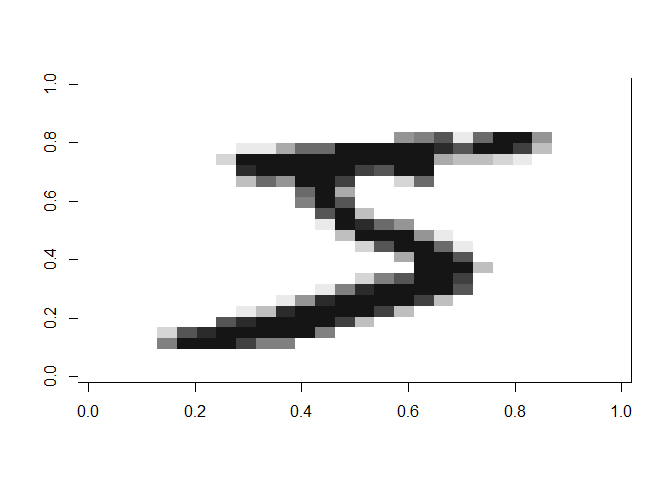
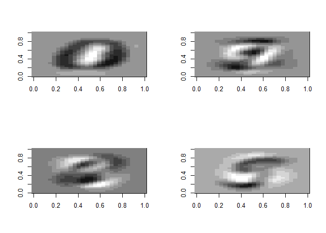
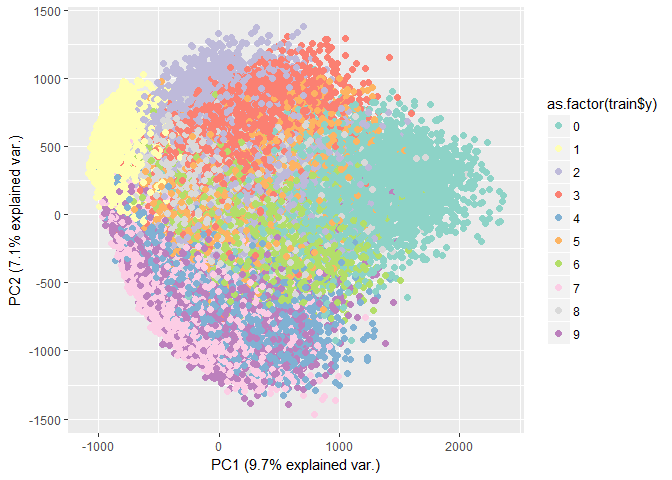

# Machine Learning Techniques
Graeham Rieman  
`r format(Sys.time(), '%d %B, %Y')`  


# Principal Component Analysis

### Theory
Principal Component Analysis (PCA) is a transformation algorithm that attempts to find the Principal Components (PC) of a data set, such that the first principal component (PC1) accounts for as much of the data's variation as possible, and that each subsequent PC accounts for the largest possible amount of variance while being orthagonal to the previous PCs.


Mathematically, PC1 is written as $w_{(1)}$ and solved for using this equation:

\begin{equation}
w_{(1)} = \text{arg max} \frac{w^T X^T X w}{w^T w} = \text{eigenvector}_{(1)} \text{of} X^T X
\end{equation}

### Use Cases
This method may be best used when trying to analyze multi-dimensional data, as it can greatly reduce the dimensionality and keep seperation between classes. It can also highlight which variables are most important, based on their weights in the PC's.

## Examples

### Data

For this example, we will use the [MNIST handwritten digits dataset](http://yann.lecun.com/exdb/mnist/) as it has already been prepared and offers an interesting, commonly used classification problem. Each digit is a 28x28 pixelated image, stored as a vector of 784 black/white values ranging from 0 to 255. This also allows us to more easily visualize each data point - having each column correspond to part of an image rather than to the readout of a sensor allows for a simpler understanding of the classes. Everyone has an idea of what _four_ looks like, even though there are many ways to write it. The first digit in the train set is labelled as a 5, and looks like this:


```r
show_digit(train$x[1,])
```

<!-- -->

#### R


```r
#Data has been loaded above

#function: prcomp from the stats package. The stats package is installed by default
#  since all our values have the same scale, we will not scale and recenter; this could be done 
#  by setting prcomp(train$x, center=TRUE, scale.=TRUE)
modpca <- prcomp(train$x)
prop.pca <- modpca$sdev^2/sum(modpca$sdev^2)
```

#### Python


```python
from mnist import MNIST
import pandas as pd
from sklearn.decomposition import RandomizedPCA
import seaborn as sns

# bring in data and make pandas DataFrames
mndata = MNIST('C:\\Users\\riemang\\Documents\\Blog\\MLExamples\\mnist')
training = mndata.load_training()
imgs = pd.DataFrame(training[0])
labels = pd.Series(training[1])

# train model
pca = RandomizedPCA(n_components=2) 
X = pca.fit_transform(imgs)

# form DataFrame and rename columns
X = pd.DataFrame(X)
X.columns = ['PC1', 'PC2']
X['class'] = training[1]

# make and save plot
sns.set_palette(sns.color_palette("Set3", 10))
sns.lmplot('PC1', 'PC2', data=X, hue='class', fit_reg=False).savefig('C:\\Users\\riemang\\Documents\\Blog\\MLExamples\\Images\\python_PCA.png')
```


### Results

These four plots show the first four principal components - as noted in the plot above, they only account for 0.0970466, 0.0709592, 0.0616909, and 0.0538942 percent of the variation in the data. Thus they aren't easily recognizable as numbers, but appear to be groups of curves that make up the digits. 


```r
par(mfrow=c(2,2))
show_digit(modpca$rotation[,1])
show_digit(modpca$rotation[,2])
show_digit(modpca$rotation[,3])
show_digit(modpca$rotation[,4])
```

<!-- -->

```r
par(mfrow=c(1,1))
```

Since each observation is made up of a combination of these Principle Components, we would expect the zeros to have high PC1 values, which we see is true by this plot below, with PC1 on the x-axis and PC2 on the y-axis. However, most of the classes are hard to seperate.


```r
ggplot2::ggplot(data=as.data.frame(modpca$x[,1:2]), ggplot2::aes(x=PC1, y=PC2, color=as.factor(train$y))) +
        ggplot2::geom_point(size=2) + scale_color_brewer(type="qual", palette="Set3") +
        ggplot2::labs(x = paste("PC1 (", scales::percent(prop.pca[1]), " explained var.)", sep=""),
                      y = paste("PC2 (", scales::percent(prop.pca[2]), " explained var.)", sep=""))
```

<!-- -->

Similarly, this is the plot that the above python code generated:


