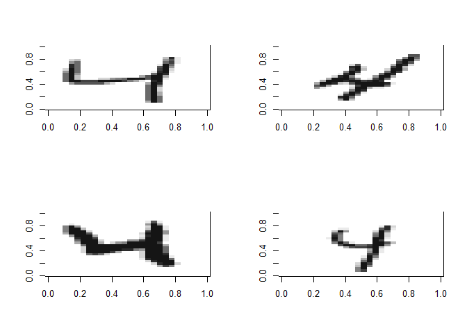
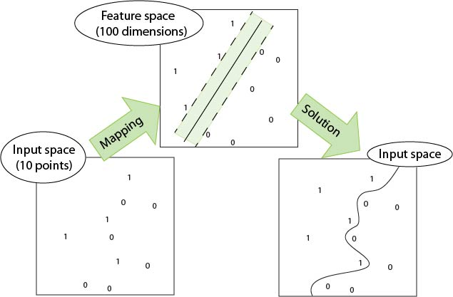

# Machine Learning Techniques
Sam Gonzalez & Graeham Rieman  
`r format(Sys.time(), '%d %B, %Y')`  


# Data

## NIMST dataset
We use a subset of the [MNIST handwritten digits dataset](http://yann.lecun.com/exdb/mnist/) to demonstrate the concept of PCA. The NIMST dataset contains "pictures" of handwritten digits from 0 to 9. The "picture" for each of these numbers is stored in a 28 x 28 matrix containing a total of 784 pixels. Each "pixel" is a black/white value with a range of 0 to 255. When plotted in a heatmap style, the darker/light contrast reveals the picture of the number. The first element of our set (labelled as a 4) looks like this:


```r
show_digit(trainset[1, 1:784])
```

<!-- -->

## Subset of NIMST dataset
For this example we subset the original NIMST data to contain only pictures of digits 1, 4 and 9. The last column is a label for the number, but it is not used in the analysis. 

# PCA

* Principal Component Analysis is a method of multivariate (multidimensional) data analysis
* It is used for data exploration and dimensionality reduction. Other applications can include clustering and variable selection.
* Care should be taking when interpreting Principal Component Analysis. Diagnostics are available to understand the model output
* Statistical inference is possible from PCA but it may require the use of other techniques, such as KNN to complement PCA and form a conclusion from the simplification of the data
* Please do not call this method PrinciPLE Component Analysis. That is wrong

## Basic Theory
* PCA aims to capture the essence of the multivariate data
* It provides a high level picture of the entire dataset in two or three "Principal Components" (PCs)
* It relies on the covariance between all variables to extract the essence of the data. It uses matrix algebra to calculate eigenvalues and eigenvectors from covariance matrix
* Eigenvectors contain one "weight" for each variable. A linear equation can be formed to using these weights and the value of the variable for each record to calculate an observation's PC1 value.
* There is one Principal Component for each variable used. 
+ The first principal component (PC1) accounts for most of the data's variation as possible
+ Subsequent PCs accounts for the largest possible amount of variance while being orthagonal to the previous PCs
+ Not all PCs should be used to interpret the data


Mathematically, PC1 is written as $w_{(1)}$ and solved for using this equation:

\begin{equation}
w_{(1)} = \text{arg max } \frac{w^T X^T X w}{w^T w} = \text{ eigenvector}_{(1)} \text{ of } X^T X
\end{equation}

### PCA Analysis using R

PCA Analysis is conducted and the Eigen Values and Eigen Vectors are generated. A "scree plot" shows the percent of the variance explained by each Principal Component (28 in total). It indicates how much you should trust any one component, based on how variance they explain. The later PCs usually tend to explain noise in the data so it is not as valuable to interpret them. Below is a picture of the scree plot. Within the scree plot the goal is to find the "elbow" which is usually a good indication that the PCs up to that point explain most of the variance in the data. In this case, three PCs seems to explain the data well, although they collectively only explain about 35% of the data. 


```r
#Data has been loaded above

#function: prcomp from the stats package. The stats package is installed by default
#  since all our values have the same scale, we will not scale and recenter; this could be done 
#  by setting prcomp(train$x, center=TRUE, scale.=TRUE)
unlabeled <- trainset[, 1:784]
modpca <- stats::prcomp(unlabeled)
prop.pca <- modpca$sdev^2/sum(modpca$sdev^2)
plot(prop.pca[1:28])
```

<!-- -->

### Python


```python
import feather, os
import pandas as pd
from sklearn.decomposition import PCA
import seaborn as sns

path = os.getcwd()
trainpath = os.path.join(path, "trainset.feather")
plotpath = os.path.join(path, "Images\python_PCA.png")

#load the data that was loaded then saved in R
train = feather.read_dataframe(trainpath)
lbls = train['y']
imgs = train.drop('y', 1)

# train model
pca = PCA(n_components=2, svd_solver='randomized')
X = pca.fit_transform(imgs)

# form DataFrame and rename columns
X = pd.DataFrame(X)
X.columns = ['PC1', 'PC2']
X['class'] = lbls

# make and save plot
sns.set_palette(sns.color_palette("Set3", 10))
sns.lmplot('PC1', 'PC2', data=X, hue='class', fit_reg=False).savefig(plotpath)
```


## Results

Each PC explains some essence in the data. As seen from the eigenvectors above and the plots below show what is captured by the principal components (only PC1 through PC4 below). Each captures a different "story" and they only account for 0.2034138, 0.0926872, 0.075171, and 0.0562521 percent of the variation in the data. Althought they are not precisely recognizable as numbers there appear to be groups of curves that make up the digits. PC1 seems to show data that looks like a (nine), while PC2 is a little more unclear in that it shows data that could be a 9, a 4 or a 1. PC3 shows data that could be a 9. 


```r
#plot eigenvectors
par(mfrow=c(2,2))
show_digit(modpca$rotation[,1],axes=FALSE)
show_digit(modpca$rotation[,2],axes=FALSE)
show_digit(modpca$rotation[,3],axes=FALSE)
show_digit(modpca$rotation[,4],axes=FALSE)
```

<!-- -->

```r
par(mfrow=c(1,1))
```

Since each observation is made up of a combination of these Principle Components, we would expect the zeros to have high PC1 values, which we see is true by this plot below, with PC1 on the x-axis and PC2 on the y-axis. However, most of the classes are hard to separate.


```r
plot_ly(as.data.frame(modpca$x), x=~PC1, y=~PC2, z=~PC3, color = as.factor(trainset$y), type = 'scatter3d', mode='markers')
```

<!--html_preserve--><div id="htmlwidget-06db8b2c3a86eccdc1ce" style="width:672px;height:480px;" class="plotly html-widget"></div>
<script type="application/json" data-for="htmlwidget-06db8b2c3a86eccdc1ce">{"x":{"layout":{"margin":{"b":40,"l":60,"t":25,"r":10},"scene":{"xaxis":{"title":"PC1"},"yaxis":{"title":"PC2"},"zaxis":{"title":"PC3"}},"xaxis":{"domain":[0,1]},"yaxis":{"domain":[0,1]}},"source":"A","config":{"modeBarButtonsToAdd":[{"name":"Collaborate","icon":{"width":1000,"ascent":500,"descent":-50,"path":"M487 375c7-10 9-23 5-36l-79-259c-3-12-11-23-22-31-11-8-22-12-35-12l-263 0c-15 0-29 5-43 15-13 10-23 23-28 37-5 13-5 25-1 37 0 0 0 3 1 7 1 5 1 8 1 11 0 2 0 4-1 6 0 3-1 5-1 6 1 2 2 4 3 6 1 2 2 4 4 6 2 3 4 5 5 7 5 7 9 16 13 26 4 10 7 19 9 26 0 2 0 5 0 9-1 4-1 6 0 8 0 2 2 5 4 8 3 3 5 5 5 7 4 6 8 15 12 26 4 11 7 19 7 26 1 1 0 4 0 9-1 4-1 7 0 8 1 2 3 5 6 8 4 4 6 6 6 7 4 5 8 13 13 24 4 11 7 20 7 28 1 1 0 4 0 7-1 3-1 6-1 7 0 2 1 4 3 6 1 1 3 4 5 6 2 3 3 5 5 6 1 2 3 5 4 9 2 3 3 7 5 10 1 3 2 6 4 10 2 4 4 7 6 9 2 3 4 5 7 7 3 2 7 3 11 3 3 0 8 0 13-1l0-1c7 2 12 2 14 2l218 0c14 0 25-5 32-16 8-10 10-23 6-37l-79-259c-7-22-13-37-20-43-7-7-19-10-37-10l-248 0c-5 0-9-2-11-5-2-3-2-7 0-12 4-13 18-20 41-20l264 0c5 0 10 2 16 5 5 3 8 6 10 11l85 282c2 5 2 10 2 17 7-3 13-7 17-13z m-304 0c-1-3-1-5 0-7 1-1 3-2 6-2l174 0c2 0 4 1 7 2 2 2 4 4 5 7l6 18c0 3 0 5-1 7-1 1-3 2-6 2l-173 0c-3 0-5-1-8-2-2-2-4-4-4-7z m-24-73c-1-3-1-5 0-7 2-2 3-2 6-2l174 0c2 0 5 0 7 2 3 2 4 4 5 7l6 18c1 2 0 5-1 6-1 2-3 3-5 3l-174 0c-3 0-5-1-7-3-3-1-4-4-5-6z"},"click":"function(gd) { \n        // is this being viewed in RStudio?\n        if (location.search == '?viewer_pane=1') {\n          alert('To learn about plotly for collaboration, visit:\\n https://cpsievert.github.io/plotly_book/plot-ly-for-collaboration.html');\n        } else {\n          window.open('https://cpsievert.github.io/plotly_book/plot-ly-for-collaboration.html', '_blank');\n        }\n      }"}],"modeBarButtonsToRemove":["sendDataToCloud"]},"data":[{"x":[-849.728195966163,-529.017422017959,-651.072684248459,-785.322849316766,-779.626732628723,-429.278512743008,-988.36586517151,-941.101921507981,-1025.69465086034,-621.180380830246,-914.513981696054,-1061.0529852621,-867.709492242418,-863.589004916917,-863.115591937788,-459.898682741298,-1153.64593151442,-921.70574291964,-1044.11740735856,-942.418927081471,-935.707095041773,224.748047895026,-1131.86266774703,-997.869537081083,-1045.16450641985,-710.705347309426,-552.388868674148,-701.066257021619,-936.913729479433,-1069.33944870272,-1181.19250162207,42.9504137543198,-1194.70608062372,-435.248070387188,-1060.33958450105,-1201.33289348621,-912.244456089484,-959.875313204445,-1148.19558245914,-1070.1931734044,-899.277371373285,-1034.08814008389,-941.836507345123,-836.689467931004,-924.889089761157,-952.321796165896,-578.574044853001,-952.993217845055,-860.439714370657,-498.836893689826,-921.011437730268,-776.771347361646,-510.574651609044,-961.494241332371,-890.359614032029,-889.874881795764,-891.1153034516,-1039.88428716004,-821.121899918694,-1025.81934213844,-934.487998615705,-439.111100199462,-774.927445276677,-812.009747137826,-395.677865285584,-971.065637353438,-739.41125351927,-712.956065673082,-1052.99006914806,-324.133767180117,-497.993662865276,-1043.1333673454,-979.817838414555,-935.94601964299,-870.328785496989,-953.206835278067,-869.702543338661,-635.424278371515,-788.984557272666,-828.801454235564,-868.082465998024,-699.361994051826,-695.173160294456,-732.824724422999,-1063.18248888797,-947.340343985296,-1048.60352911155,-865.212410784569,-918.692467691158,-1126.99430786065,-887.046014878791,-885.083255471836,-505.496572587834,-834.128688117554,-1174.2487081235,-959.857579696773,-767.356309910713,-907.974726082507,-1090.21366717055,-703.419617130802,-1121.64665175224,-1044.05295959207,-960.414419897975,-181.224989117111,-1006.58091744469,-961.24184922921,-765.370528017588,-950.059028430626,-1149.70135561898,-832.104211562414,-822.535744148675,-878.201579816674,-870.089205214597,-500.307954292367,-809.215384697129,-804.180143851789,-663.49794380988,-691.849402080386,-1118.6667238558,-810.651883539524,-625.198343417249,-1004.7613972526,-804.282154026146,-908.477522331489,-898.760412032944,-979.417347521355,-575.154126351264,-722.097143921042,-889.837555010155,-1083.84127503986,-893.60208401086,-808.81150273118,-709.97298567612,-1111.28114326841,-529.465379563844,-681.887999552501,-1069.78544227643,-568.021388344123,-626.757714971033,-1044.6436738546,-1131.01164632847,-656.431790672565,-1195.44839066193,-1073.01735521642,-963.6902250415,-1006.55343051917,-858.019316568545,-824.980698625789,-686.873397836586,-888.881385638003,-744.82275663761,-978.559129277975,-674.778859819885,-915.83002343129,-1131.17940216915,-1029.83037788617,-708.680477725611,-737.687132592638,-1072.8277951828,-587.165053203096,-886.350836892246,-695.653886870423,-868.953247768894,-1124.42134896653,-973.968566233102,-489.625162569437,-1098.77461121184,-829.478000557194,-634.955788988766,-922.478643793443,-1137.30438372804,-814.71098454195,-791.220044714856,-836.560075075053,-770.441212378844,-423.869584873647,-580.236586865603,-647.617954956933,-893.866249717251,-579.136025990531,-700.865008096283,-935.739310346236,-913.117937618546,-941.260946429701,-1062.92206238107,-711.081032511411,-1113.21866437216,-947.546861819984,-200.656403846519,-996.38903858774,-920.014878055081,-506.854793472725,-1011.92093551863,-1049.6634788736,-819.143139713111,-993.11305364999,-675.387522307478,-650.618166408452,-1116.44832941146,-1096.53211510885,-516.127516598585,-1075.67356195919,-1133.41838449532,-819.209473936882,-769.036058556802,-883.306942959044,-1023.31907945619,-661.614675319352,-905.471292175861,-1157.58673458374,-761.610847165447,-907.404669389218,-898.605358083271,-1013.51296571851,-1026.5584506445,-951.787340935377,-925.917954467549,-1019.22861144565,-1054.39138793596,-1001.09415195164,-876.334609757608,-662.964303946505,-1097.86609429704,-923.916606103809,-71.2058223262379,-1058.53942453327,-1006.66051359883,-1099.02239798929,-1065.55271774337,-805.520335702762,-1109.23217126016,-873.455862917437,-1130.07940520315,-1098.12441146727,-773.599761131726,-1009.32276193072,-1112.59315331977,-1044.74913883952,-1178.5840657728,-761.974712486958,-902.656684957208,-995.560026611556,-873.965233996442,-1023.68663105835,-848.843451354112,-528.374093856945,-931.092564679421,-1064.78643823111,-910.34542767597,-686.151031315643,-1067.34211098536,-566.835176609825,-810.390860865023,-504.395526546724,-784.691027738847,-901.782046440783,-958.281096959984,-736.394734148838,-665.907217477944,-932.555878736394,-849.765272432861,-684.756034678909,-1207.62119907732,-636.839801201564,-1018.51435691885,-693.47982011469,-623.568937250473,-388.477837850596,-678.691850835654,-954.194778888183,-458.327955773644,-970.46509458599,-629.349174051774,-1046.77213576744,-962.112791887361,-933.185361677134,-901.322154227792,-785.181507562775,-954.972793920097,-578.027994686588,-964.355456521573,-1024.24272700695,-1109.08431875494,-1010.40492147097,-737.960617363368,-1018.28916629115,-742.024136671691,-702.814389284058,-1142.53322665868,-1047.59289754884,-797.470877517581,-1096.12715793004,-460.538863493008,-881.49312525996,-1044.7513685356,-582.364796799257,-1018.69496366637,-976.390203163566,-739.363266689805,-872.234005576024,-935.992270260682,-945.415401144632,-1155.30834924095,-688.015936421612,-626.857947149248,-638.013126374654,-946.105024231473,-967.656606888774,-517.087250722815,-1100.99221683897,-997.608182180469,-1074.22216884796,-1168.13010014625,-701.14260666982,-549.62601018528,-622.79104157463,-800.501012890952,-810.715839877785,-590.282364420406,-684.230336485331,-1065.41136898571,-892.852966940938,-952.1581775407,-1153.65634972065,-1054.24515633032,-1169.12157320367,-937.820059424791,-789.02124624606,-368.36317773636,-918.447556406924,-998.431365835883,-1072.7221311896,-943.699346282632,-1107.8405551256,-939.933325235488,-875.403455329406,-1035.07494761692,-853.525771027411,-610.853365902729,-857.971653890635,-386.54929210983,-741.308699318782,-899.248619391256,-995.269641057478,42.3946181641164,-977.087581262869,-769.025510792504,-816.955987909095,-949.008774888069,-794.234422126437,-717.575968926526,-742.639424090296,-1014.34409694134,-984.005843975144,-1130.83148787855,-1076.78942205814,-1187.09583520172,-1117.25071443631,-812.579440335188,-942.768166959247,-781.738011841451,-610.641329250975,-1168.37823122733,-544.070775439669,-1123.17838442995,-533.935088583312,-1024.97372297037,-799.651271946011,-822.790230282724,-1165.94348755712,-1049.42627710457,-1088.51862031938,-813.877489882249,-891.875167895125,-532.734357772622,-924.204944628359,-946.790796229619,-667.02252321978,-856.506641936411,-964.78349731127,-901.475138352994,-1104.53194715028,-974.684851579693,-1087.73426236469,-574.669611297982,-643.513464880429,-1074.93263379357,-762.956619976596,-1063.89772704861,-813.099779770349,-888.733344001982,-581.845744153741,-770.825757209372,-617.002902517525,-396.3679438604,-998.957321822739,-748.858005585303,-829.549654568839,-896.260956048769,-792.361311013316,-1201.22763135576,-1025.51174992993,-928.036458938375,-921.010698732016,-1039.30851891603,-932.654629847439,-1035.8538095225,-1019.87345482305,-352.537738831173,-1137.62134626258,-1002.59126573376,-994.293465958637,-900.05846207822,-1068.65538418371,-932.585873804816,-997.542349601803,-1105.29063412616,-694.649822191788,-1099.30067334765,-981.368110281783,-831.040361851282,-671.474627329639,-672.576373908308,-1065.11700338285,-697.227138374183,-1073.415179913,-887.249375604484,-866.275608463146,-1009.03768052767,-840.019636329758,-947.726793505456,-836.474498384991,-952.382198824043,-796.719409295602,-915.073192448716,-924.102102377971,-798.49890138986,-1047.85156102487,-989.910699534475,-878.875354254344,-1104.48204225799,-949.352739394085,-1067.42951510388,-833.650940953801,-1136.06020145394,-837.046546584839,-649.533226006759,-922.143400387112,-383.751460659969,-688.120411710403,-709.354034094111,-676.247592284137,301.902368539308,-735.249830589894,-1046.54408217963,-1004.68086834575,-751.410107591421,-624.389795660302,-1018.67107855462,-624.930426130602,-844.705666169905,-790.606226441663,-933.783546921314,-852.833258118861,-856.775394346245,-724.124691801739,-1017.76350748433,-612.360815080494,-1122.69194484402,-963.053773586886,-975.744770481775,-750.47683303072,-887.802638501026,-633.183780561951,-729.011924434366,-645.058444987141,-1165.31813157033,-1186.69509547277,-1058.82459695075,-824.307431880075,-1117.93081058814,-980.453309789152,-894.463415934123,-842.398919394825,-1001.74997470451,-859.836840985841,-946.720869651517,-892.426658823173,-879.191931133964,-1059.23563535829,-743.189580455431,-696.309839375857,-646.051606723257,-906.491134577995,-592.290511672016,-970.646582377152,-763.476708449145,-742.533028977524,-1111.49202465257,-815.688853216199,-90.8691975647921,-656.700604575917,-1207.55958583873,-976.475548036275,-568.254441484255,-1076.96983334688,-1021.29457452864,-1143.19298930263,-1072.82000816817,-958.492882366247,-1126.12962570194,-1164.04200291323,-1043.30301598028,-670.91379829752,-1053.80492187324,-1179.92950860016,-890.607880799173,-749.732374719,-1108.78188833005,-381.083981569338,-989.89011580274,-468.223105960395,-1020.02128773139,-693.013475309145,-397.427267321886,-769.686116316407,-822.877019417071,-548.078531076608,-623.347332859745,-791.720888192644,-958.420604517462,-1031.40552113587,-601.728297397424,-642.345956290494,-740.359521095062,-1065.79100922472,-711.425821215576,-776.834781333957,-571.641303006676,-651.561505831176,-628.937845318808,-711.735242362688,-983.670426788703,-584.97657111755,-875.009348871649,-1131.68338443187,-866.261966154532,-966.946523449367,-1031.56017460267,-522.254388673538,-906.692783048572,-877.485243527242,-1218.8996705364,-454.600831842392,-905.59255555181,-241.78497127326,-991.335604057629,-1045.98457230447,-654.577499058281,-990.339732834755,-945.165083858342,-1062.08913121044,-883.172897172268,-1094.85949311639,-1169.68102028994,-753.469144082362,-651.771775717552,-1172.39563683308,-986.335553288944,-587.038142901007,-739.781578330573,-834.779681412497,-998.825752629903,-818.857369198605,-881.155544483082,-1081.89813513738,-1066.54104551165,-865.170932837394,-748.080367731083,-798.928616332108,-905.049669735693,-515.349414194784,-81.8658168483504,-1088.5267391393,-687.639765578937,-943.38928537848,-811.341864076887,-824.250012690538,-499.008946074932,-974.679986014885,-880.925051178192,-1013.1677545705,-973.04562559026,-411.380969911211,-1116.36051634411,-1031.83406859162,-631.607546285665,-485.019445549592,-424.209763885478,-487.030929579182,-609.629793983985,-1093.90058088759,-1071.89443657194,-1090.1485335681,-396.550244307515,-1059.1426091711,-624.998754541992,-1032.79438557073,-893.561572716121,-852.134474427086,-1010.97047471132,-1117.26174698972,-854.763646059856,-1096.3421699056,-970.471426750779,-1183.75047638121,-187.104861259103,-839.987179587345,-931.118484776292,-922.805596469961,-863.776989962523,-843.253084890652,-799.326949931996,-948.598418629323,-727.141206389926,-914.066126163946,-892.580483032127,-16.6738155406847,-1162.44664987742,-775.696373465788,-581.367336346048,-666.185756642311,-966.727247614624,-915.710861309939,-897.955271664087,-982.026629463981,-888.754098508718,-923.209859179422,-1155.46100460521,-934.537706188702,-977.225907176874,-1075.31279419282,-903.392462242034,-665.062663216768,-692.708713360987,-1016.57402796534,-822.515799195901,-1097.27578547992,-673.984399108948,-835.314433057612,-899.851469095516,-1109.40209499772,-528.766033640908,244.316789727511,-713.514784058027,-851.832915593797,-786.533804276881,-772.129924947386,-757.330281691252,-741.60305465488,-975.660227801952,-828.855312335781,-875.069733333384,-877.399548182804,-972.338076548611,-818.768471248301,-991.350459296926,-990.19760259249,-594.255478194609,-1005.53307308159,-1016.46133956741,-363.004185423454,-902.581864373733,-849.225774816547,-1081.40892875131,-1072.71159932329,-649.114340665334,-1047.80561209819,-1065.78565087776,-798.756804242104,-838.382287734294,-852.729804505433,-830.893996194806,-854.669245058466,-898.337644081826,-711.407588758991,-913.258565092869,-1010.28727461188,-923.026556449605,-1044.66844194539,-1138.48108212202,-1140.02402243051,-763.660084839835,-921.486612714525,-888.623357532812,-638.704743007316,-1093.9627130064,-1212.69152086053,-835.234642011768,-1121.65228571998,-1001.47781961587,-893.330218365986,-1080.87914872678,-489.777858046932,-964.431745678949,-1171.28502312251,-1153.40134743868,-917.034452168939,-1048.11656431034,-898.880386422673,-1030.29029920038,-929.212030066237,-850.880967709636,-942.63301441351,-852.538954852693,-953.188671276748,-1043.86124300235,-998.525990241954,-1085.24427918748,-1111.80680217659,-1136.13968262158,-1213.92707747347,-997.392395071619,-1022.82784392169,-581.332158484638,-793.788128239096,-698.40316294294,-935.8632903706,-1200.74633218205,-1177.98216735318,-1035.19048153659,-1166.47214979828,-932.228471846964,-968.290735144551,-755.654815649187,-754.833002703304,-1099.40051405379,-937.922554734372,-910.649425989663,-1060.41039736549,-725.978231383984,-1172.718667787,-1184.89264276454,-1066.80542603398,-917.398866989121,-999.054320063441,-938.606578488109,-900.385023233973,-762.243216172952,-934.679026001415,-1015.01774829033,-710.9487336527,-1091.02554110783,-586.653398656286,-1102.47646383584,-752.172623894746,-668.39327840559,-987.014035823492,-888.126383375494,-885.492477022856,-1149.93546518892,-947.244552098061,-956.220849862928,-1025.5968337952,-968.82204986042,-739.20191937917,-931.367428254286,-675.915706998479,-898.083570828921,-811.870746690164,-1022.0380791032,-1074.72411096413,-217.062920695377,-957.950979576372,-954.662164159302,-1056.51151257204,-738.534555066204,-1179.72773405394,-808.937707194613,-1106.93659914614,-929.063826500473,-1019.75181432853,-979.861714390402,-1115.80975477663,-1134.75441614927,-831.603780167904,-1006.85900707559,-1160.38006840197,-878.076319715562,-1004.68353116752,-814.806616346846,-931.891805422592,-516.075615151518,-518.046128281555,-850.52561359985,-985.069399729483,-896.938568127101,-846.543564720504,-799.43505685311,-952.884443494418,-1024.61778782055,-885.839601947389,-970.649995739857,-160.054784615513,-831.846416427918,-821.670709725153,-868.257050181064,-938.043401950165,-1094.5064560923,-793.059561564302,-760.458960380854,-640.088386429386,-334.828199208764,-752.394918492203,-779.010094551703,-811.622941292094,-803.199183609492,-683.001614960765,-882.965260486634,-938.672521112058,-1041.19757474516,-922.636573756579,-720.914907724906,-453.069701660603,-706.125738985369,-961.431356934309,-673.652841948165,-1124.0262067135,-420.36509024094,-560.740923104441,-1026.68409530321,-831.24050420213,-759.532654024715,-1034.04222301322,-1137.30453076912,-651.081435084143,-1014.21507889488,-964.300989945707,-1119.46842049269,-1037.75863698334,-885.674907653941,-1026.58048782828,-622.116500571662,-319.295777712359,-911.356913689605,-1195.78438807013,-786.623812031635,-941.45125209304,-545.965646193139,-1067.83457035463,-877.714233473029,-726.313135095441,-868.851659937214,-762.385415818139,-647.594781886684,-975.504828071557,-1012.80276703406,-522.979490614548,-438.990721837382,-552.753755614674,-679.889437440932,-660.27212361674,-586.736399802742,-747.551046785321,-841.767083450434,-1028.04505795457,-260.333828129881,-604.097810764544,-546.784186711439,-411.750080621787,-985.974980136519,-92.2427734929167,-595.123691733138,-568.789206414112,-565.983506568201,-733.332953297394,-726.045534003318,-562.831224726932,-1078.43223798329,-958.403587916608,-529.739015252268,-884.988465959793,-644.334118790258,-414.625584507776,-509.829007350669,-779.709680134332,-833.959655895383,-1093.76989555808,-940.645629896739,-457.576495327351,-1159.21922353116,-639.967791716793,-351.929435303409,-966.119290760133,-818.927517553852,-785.778680519918,-1071.7153430459,-964.411645028466,-1157.34949722539,-892.245736452763,-1122.58150413167,-794.472252675645,-946.619695772829,-1113.09490754689,-1120.44845949708,-1004.80762145837,-848.255028474652,-529.316664052455,-754.844514088018,-1119.06117492325,-1125.24916293854,-1103.28417203902,-771.717560853568,-1007.50146644967,-790.545955422455,-617.816000925232,-1131.24162536214,-949.987427931159,-950.049804944172,-573.206474038004,-825.248950479451,-975.211020696778,-1026.89827305028,-904.372211337493,-799.148908392673,-946.776518103606,-865.941977409569,-876.60381180314,-745.295679741763,-524.598765071799,-940.262688155436,-606.109509494158,-716.015288691137,-922.18047732827,-307.323424723114,-913.226305535181,-536.107059127977,-817.894999022714,-575.852826696557,-638.781863509847,-936.841900890873,-810.107570842338,-885.179054058878,-615.398703079317,-983.919198936479,-905.757180019975,-405.277585770576,-1141.19649896338,-949.427902375887,-387.167069615986,-683.894980735286,-807.747895576669,-1015.09774973878,-808.665102886969,-1172.09031132882,-468.146019620238,-795.42844470707,-953.766529434273,-476.055109845097,-833.579115195002,-758.637318068239,-1079.05973739581,-683.448950773831,-978.391872158308,-871.576920075695,-974.254806095689,-798.350871275685,-1043.9139748897,-1191.74831169009,-1068.39882688408,-777.874628067171,-975.751967427918,-927.727674713191,-1116.38659837919,-799.772477608788,-930.894558097458,-1127.42107892841,-1012.86417266383,-993.526960702469,-1012.83141563317,-1150.21334624987,-1016.98437149276,-860.030419673803,-955.324082397977,-927.8631491785,-817.911958711791,-947.477282730367,-986.27612514978,-663.095096709844,-1039.38508483197,-102.100102294959,-982.005575154618,-1141.54673515928,-589.869158236963,-925.886740357884,-818.006900759005,-1047.64044028344,-931.466767292331,-410.400988460868,-662.972632932657,-919.091260576992,-975.017595822083,-906.518590945139,-1162.18021214914,-837.8218083022,-874.421150004868,-566.923731134583,-663.923308939147,-603.466665741449,-261.158967913949,-1226.44838300585,-418.442072115885,-1016.35393378312,-1164.3870640363,-457.559090393611,-1158.58021086078,-1043.03139754244,-1048.96615796813,-808.15973324836,-980.452072451307,-964.815917359703,-1054.43573443695,-1069.67325214224,-1007.25204860371,-362.211422195848,-1072.51495632566,-1115.13446282713,-1071.31179427875,-807.271851892797,-994.614140587885,-1055.55854574923,-1084.79978060413,-890.787691168111,-1092.99691764643,-1085.995787242,-1043.59234757797,-998.93671175805,-797.320545091102,-1005.57559125843,-899.497548054025,-987.875416820147,-962.558334988315,-1070.31893352467,-1030.11788979725,-853.355352552316,-911.357591379222,-841.31606744905,-1008.31668332661,-997.752175365447,-29.325109768187,-658.274257145632,-901.420412547625,-1071.69524610319,-1040.67735540592,-940.364864173062,-893.956646718685,-1033.40491234136,-1095.5108905686,-1231.46584923965,-1078.84303393344,-1013.8438222715,-953.170426725919,-742.740251954176,-1125.84697636026,-187.004720380089,-966.381410049331,-978.668338233894,-1043.84912812264,-1084.80104088023,-944.622404616856,-839.653443096466,-1064.56667573204,-1135.5978178888,-725.481463611063,-814.756551250812,-421.675415653527,-898.169481430132,-435.417629282113,-802.576075462839,-1064.8716207725,-515.053949367531,-685.500680600702,-512.670449312243,-826.854301744243,-905.003035329123,-724.664463943209,-906.736118517406,-539.671835964632,-673.089747682591,-717.951307260895,-1202.99392945088,-885.198009087365,-985.436059081601,-386.613561345972,-751.01811228617,-836.182361405775,-950.369091502131,-831.291645868736,-890.68632861369,-703.969010191435,-890.808885259064,-919.093249941945,-1048.34025470274,-1095.19630725096,-959.587965332968,-988.140302562906,-1119.11283406259,56.253278631419,-1065.7970703492,-912.754965967688,-710.727295285206,-692.958079823951,-907.62591260158,-946.06225403234,-1181.94938601565,-741.009484537742,-1190.1096270985,-788.345331266276,-1085.43954451771,-715.900549424935,-1097.30084806366,-897.411209995328,-958.109072208931,-855.769255062865,-992.740155200911,-929.917912938089,-1148.30494204593,-1020.43699197264,-928.340780046144,-639.763496955039,-793.595724862525,-1072.45352166702,-783.727543707377,-824.943724524691,-604.431554669803,-546.208999820701,-1033.7460225774,-638.834815058918,-871.846060691151,-932.053751062037,-918.847223925339,-624.696894952077,-1058.78078208948,-540.147949563025,-945.305114858294,-896.082283118676,-636.405462687351,-1014.0041407908,-676.124195433596,-919.227684092009,-933.850150081402,-403.862484463162,-526.450550625157,-917.443472764194,-817.293216377601,-466.476998387564,-510.51458141361,-1027.20548958148,-1128.70947239695,-967.181812696104,-647.744193056283,-1027.29208457196,-1082.02689603044,-694.592111919043,-902.598979845982,-1066.12322634224,-933.418103852689,-1074.55424487018,-717.749166922324,-714.973505566108,-1028.08418891229,-1054.23399373152,-890.186336019949,-920.857507964701,-1117.65523726962,-331.49940033509,-1213.70110699542,-1130.57339923815,-1063.72323818964,-700.201625053109,-936.126308286961,-1206.54136830911,-1007.47949589161,-1170.75732220686,-997.744072165457,-951.325476946828,-903.346837700591,-1148.47019706012,-1044.62168171826,-1098.74062008454,-845.802442736063,-557.138168542954,-963.04398643877,-725.457364394046,-968.679204726342,-931.486769079859,-849.214436659346,-1027.85873849854,-539.335705198706,-961.267162462142,-947.850581233496,-965.513247665556,-900.187775390513,-1074.061695746,-958.422312277908,-997.401993634587,-660.239576717438,-948.818590297651,-725.361282805949,-852.804112935683,-1190.5101129518,-986.958165534215,-953.635623764854,-930.61669558315,-855.937737383673,-1202.73964765262,-1084.71945570237,-1090.17378020547,-912.757108338666,-883.695838483259,-898.954589710246,-177.292872283525,-1034.81591421498,-999.781267456532,-1061.7511568269,-1131.58306203907,-627.261142510908,-893.356937946253,-1004.06432512048,-1040.40095619923,-764.078291031691,-704.289702597586,-982.795281183851,-1232.12480101791,-1140.66315016956,-1179.50511167024,-305.454091536198,-1192.55623708004,-1042.16426813107,-971.063965262423,-905.190385798884,-867.392298003536,-931.931763468984,-1177.40110315369,-674.82903686702,-838.086152619698,-1174.11581484024,-1020.3172412254,-1097.3857133772,-381.742818362824,-1107.73549180612,-949.42464037286,-802.419851624587,-884.585893088279,-1108.43388117338,-1076.72585954851,-784.016550110743,-1056.95470830007,-1061.67934443434,-948.310675049871,-774.780368176516,-992.932043976954,-902.919979417825,-923.708002769189,-743.343621572265,-1098.67814999051,-559.870047604527,-906.689642142299,-854.763159032112,-731.140957298712,-829.626864126985,-1050.90436057074,-929.948493491852,-724.937203876877,-981.358437681891,-867.536524540118,-707.11342925732,-1174.33448836472,-913.77820124634,-1052.52897821592,-1084.20026355761,-778.394593191528,-1180.66314144958,-583.261256010446,-1046.59078212709,-926.006443999333,-836.281266898467,-1025.90153675538,-1102.9089793641,-971.03958419305,-785.954859463798,-611.447902838594,-1044.09212103122,-886.228885346697,-995.70281952133,-985.631817397313,-1143.67695711048,-964.925278125439,-876.665314268232,-1150.11145752388,-920.309080947997,-904.834847358906,-782.101859831361,-1142.52211535781,-673.548228728613,-688.842162661924,-1100.58230216348,-870.7575564694,-1086.56413367035,-781.559764575475,-1016.32229811034,-894.687167287789,-555.04465441025,-997.914399458974,-508.138325700216,-1152.4562633976,-1130.52894769554,-466.118861663684,-664.384322571723,-880.387285502597,-934.322889571237,-1069.97671255333,-1104.42577716681,-976.537598463494,-1186.86114067214,-1141.18818805423,-156.321074434572,-857.029373255888,-1057.98527981023,-859.211595823427,-1051.69103184359,-898.191295557897,-875.639758838934,-1054.73226348274,-1161.54335104389,-1041.82526605415,-1113.72725747836,-963.289464916899,-1052.93924133019,-1005.48822190552,-1132.25850270294,-1032.3251689883,-1112.6867738308,-741.5962061771,-1107.47604485124,-602.441532502686,-1014.04899235702,-564.006182614244,-893.424544603549,-971.564305194452,-884.763081136613,-965.390018138805,-954.654464036561,-776.336326733428,-846.977656209535,-820.70263220766,-899.892932613702,-1020.33922610564,-729.654190923256,-1097.5259245625,-994.523735995062,-722.557435166626,-130.293829398246,-933.376768503092,-1016.96332641622,-862.957053430086,-814.799319327096,-1078.71954958385,-826.499493119033,-1055.28372719047,-990.422603774565,-779.995675205356,-799.783568107574,-783.479799454537,-813.39896789254,-1060.24357168961,-783.808861335124,-612.158656003457,-915.849075751059,-1133.79436636922,-678.107203422363,-970.745630970485,-894.029311058821,-1044.77453142673,-1065.08663887241,-475.907801729786,-1079.60370630641,-672.684196047583,-942.526575693316,-805.182366579014,-592.736481654281,-1128.67811182953,-481.777660128116,-918.195963898968,-865.779018772082,-619.427906819218,-771.88159763141,-471.182298395323,-891.45718410494,-613.009023012697,-255.032831307195,-914.260082941891,-448.087059938395,-661.36198807296,-502.50196587731,-971.072776136242,-684.407324001016,-1099.15761488096,-1085.57504770393,-812.665683633063,-1006.84110312124,-762.343423078317,-829.810711623261,-534.716958825384,-822.778490263531,-869.382180190643,-933.870116580925,-935.771533510148,-922.985148192284,-857.079832124836,-805.734086086167,-732.909206321652,-944.312655109709,-815.99041864974,-756.973891646173,-756.565663434514,-977.51421946474,-785.938627119533,-930.299280716064,-984.637425937298,-924.957162187514,-570.526025719708,-1054.86664002148,-976.96855556123,-763.683372862944,-981.596015164062,-974.027605636726,-1117.92103176149,-1083.48272491907,-862.298351017643,-1099.22908717546,-955.811216495447,-846.77924211356,-1006.09977127863,-900.870669175851,-1174.00609833363,-1048.01224811943,-1062.86265532417,-769.810220240127,-1133.36930389477,-958.562592200359,-948.498797047007,-429.597878140096,-1048.41242058309,-920.204409723831,-736.934811476804,-1059.87215493434,-1123.63920213138,-1070.14534424352,-893.930289934941,-934.239349769657,-916.259078457558,-804.662420478826,-816.415951819052,-579.132114170988,-789.658565460562,-1122.02613604917,-1013.40113931475,-539.689660380372,-713.388064023522,-693.838052648215,-1001.1651489275,-1033.05226949211,-914.663348709748,-616.565199580411,-780.210606967159,-423.102244786466,-586.255944352134,-892.744247441419,-489.160234306655,-616.608183807654,-751.165708644818,-1084.15461251712,-529.714032815549,-700.713838918728,-537.95495876069,-760.096245105151,-850.354804833845,-473.199674382227,-733.071384678599,-926.098626554228,-875.249608127929,-542.33614064837,-546.480466871938,-1057.22590831916,-683.214525617685,-371.556579278174,-604.915611272933,-650.440210735536,-913.097523638408,-595.713326303044,-968.150697396279,-902.854592372649,-471.344801993631,-1088.39793872517,-518.104547955901,-1080.8553053228,-1170.07022003223,-1062.01771039196,-898.911392443512,-1068.03750940188,-876.565638506581,-794.344755158736,-992.51466573521,-998.418744303509,-1070.99162703635,-1037.87251977511,-1152.59977989955,-910.833286644331,-1170.01116890611,-958.239775322814,-1017.00782424369,-979.250290518453,-908.355915689913,-908.770967340686,-1108.0377887973,-686.05413592504,-689.94630972536,-559.089339306401,-1209.80047373956,-1169.8449062122,-907.211895085073,-1035.37489348294,-649.010070885312,-1121.5395338152,-425.169225838844,-919.640834099614,-1020.54836361047,-1048.05119507372,-932.297330020797,-1018.9699482867,-771.259721125505,-921.868252352914,-916.554716109077,-938.901112952413,-750.261175502876,-690.134372646982,-1029.20934747117,-1125.34906822373,-837.39036184555,-1068.70931660329,-928.812047023828,-942.371985769366,-1097.15906270708,-831.440013988996,-1202.54867563589,-619.366239827541,-759.139520826897,-489.195422102309,-789.986113946595,-946.894144156155,-909.17007050452,-501.171484749565,-771.865826390986,-334.805166680129,-866.891795058237,-1075.08188290262,-510.91765297535,-611.043709584732,-290.732383115777,-991.440446009966,-181.053161598472,-437.375046824528,-782.708884763381,-336.034295442497,-813.315034944489,-1047.27167049013,-742.169359467661,-312.450327393956,-1027.28106517741,-736.688747989466,-633.706142167533,-127.56439866537,-832.870377095856,-928.226600698545,-512.320386591989,-438.437084306207,-1040.82110802623,-426.492760449277,-745.832033665615,-1059.44175985541,-1052.32308917767,-1028.76408586249,-905.515579422513,-1000.43306944985,-1002.0692406999,-725.692609552828,-679.02868014203,-766.410031608014,-1028.64839746165,-752.820782044512,-760.86599380438,-884.142063518733,-731.123986178354,-1146.74279822788,-495.019218903412,-808.66531270633,-714.712056032203,-638.973339765113,-491.279798698857,-986.558957139886,-942.016387158892,-1038.0707514392,-881.156145754832,-904.218802740474,-760.066897419014,-1004.35123505546,-754.728264150816,-355.930239692952,-829.076263324484,-869.361790883033,-947.802433231134,-1049.46811771247,-513.922060470252,-788.946090586177,-934.780910827695,-820.842939165672,-930.456688702389,-953.660441334413,-946.87306922847,-1104.53524229159,-959.939590248142,-886.860653758669,-962.566192984374,-1047.52924721876,-897.693089074213,-850.99554944299,-1175.35706583485,-803.68145486249,-620.288559608357,-1201.68215743822,-854.631653560318,-302.426997780758,-173.596601433518,-302.246506796517,-289.765510756462,-1034.0841220498,-586.338588656655,-840.32243346679,-382.132458502032,-1025.90663325109,-360.383508899655,-979.198204610115,-405.219249427957,-666.883548998645,-1011.61366274141,-232.527701976334,-153.130337473188,-799.750614948651,-836.199396275647,-179.594348808751,-1054.68211828036,-658.10737588315,-539.139100830186,-561.728461765449,-1087.22494554394,-984.934554569872,-506.072175151944,-1140.15310528649,-823.005620619749,-1080.00356673257,-1110.68675369063,-893.254503611766,-790.652888810009,-625.26523766828,-474.349480027731,-889.9979578318,-453.433898483149,-1032.7349624518,-1142.36131859635,-490.748713633106,-1136.39280214012,-752.582893230456,-733.936739422436,-1070.71201750991,-988.214927725903,-951.006873748373,-967.030878893303,-1053.03965506789,-747.433971853551,-1159.26541640509,-794.190110125486,-1161.97418962438,-916.20003745785,-690.82572255075,-1116.98352456628,-721.871547057405,-670.935556562299,-330.040461942299,-1024.58264884475,-968.862115967532,-1183.63539052681,-1076.82892785729,-1055.37776187812,-960.081355281194,-1065.28930351969,-667.6449374653,-1153.12938155867,-776.177903179077,-250.993717441193,-1165.75842253792,-260.734569231943,-1054.82616651213,-552.814731702533,-1005.76654594834,-1074.17661026976,-1093.7352509901,-1114.38060000591,-355.038142831104,-1107.61392622647,-778.122233236864,-924.095442334311,-488.420541710993,-1004.92030657483,-1016.96933239919,-846.517308629944,-826.663401610301,-890.613080947479,-919.507221170916,-880.538999439689,-942.22707249979,-910.31826044343,-616.889618338132,-836.646714735779,-852.225621217637,-774.306313724629,-866.639687092314,-870.034773637418,-972.040441312276,-440.464018232692,-483.925240499949,-674.627543935326,-1124.06519396516,-984.755671914338,-900.837477734828,-1033.99350535865,-935.543045318858,-1102.55007215067,-906.19712696562,-971.079486319901,-1146.90451765378,-736.176974403701,-1018.52708314279,-261.146737810057,-992.50168774882,-785.740383388354,-908.305366194126,-1120.14867105439,-545.502124037365,-1055.89403733527,-1074.1500917717,-1074.56120947072,-945.442313269098,-1089.70331878854,-938.084239215705,-864.784150438926,-743.1241334802,-693.809987989827,-829.119103298703,-1035.5529965915,-587.650255323481,-674.263111450736,-182.019544064247,-922.032402926487,-834.916277669702,-496.858044434888,-550.452569129996,-705.822845895627,-724.565121489618,-985.705212710176,-545.945656159871,-492.018716319459,-180.691434146963,-306.472967720767,-632.952500619011,-477.023347893123,-292.837735064208,-844.84199850379,-611.042908492455,-1075.09462523064,-358.175978282035,-1213.47905274759,-884.668445617673,-601.768218846987,-1092.63463949055,-677.697518644843,-1144.09988404458,-989.382412751639,-676.30856956377,-1045.44359198708,-978.068031424506,-1073.56541463721,-844.759288279141,-955.182198990145,-910.063429956706,-1145.98888760334,-811.628943102069,-928.572616544876,-745.940592238551,-1097.75215057926,-1076.52349439386,-760.168133333874,-1130.09436754195,-934.169161931586,-1117.19608272909,-715.501001925322,-921.20752375018,-910.205617761198,-1166.78222635851,-1026.8494550771,-1046.82672332175,-757.389816401637,-1046.50529634252,-843.62396291114,-816.090226585699,-1089.35512742741,-1163.97872401829,-650.073766434335,-980.463503860638,-517.371899406967,-249.234361439542,-546.747507547415,-735.207919566943,-1147.21192125739,-984.567709312497,-1141.26207398208,-1043.60150400804,-1013.12112793436,-1168.66555094017,-720.411854463756,-1110.15253937896,-1094.99672615253,-677.101146525885,-913.164501271224,-933.994035859194,-790.307600559009,-1111.24601960142,-1013.34105599292,-1092.14246985618,-947.560040871151,-1043.4360458495,-843.12363900934,-974.408330325401,-978.350959997568,-721.943537657263,-1079.16256236286,-40.8462083691061,-1221.40355181125,-1059.46810042186,-667.870167037546,-730.618402638875,-1111.70593496411,-1075.21819201671,-1101.51957244147,-859.660808424335,-918.933742139161,-854.554043727209,-899.822816729993,-1039.22311825512,-601.292495943305,-943.958515192748,-1039.58891364789,-771.932798139761,-1202.99072847602,-1024.48174139542,-470.268464417164,-1147.44301626574,-968.79112967058,-927.24170588011,-973.290680071819,-919.433852584953,-720.05893346531,-1079.57580394161,-1002.55042993784,-860.112768557764,-748.039954202677,-1215.43251634637,-1026.8531031353,-894.999094643598,-793.098822587531,-1061.38685677542,-752.065790757376,-1023.58312702419,-1061.56282470861,-686.458440932765,-436.767551755738,-515.474761621453,-802.642098016656,-1014.41335997019,-880.048271031761,-1063.52854633133,-1078.11644267471,-552.60965573442,-456.631578154357,-749.034240768231,-786.125284758175,-967.646697736945,-613.518575943903,-363.322771228708,-895.952292430814,-837.790641148945,-695.325052221173,-624.666771734647,-1022.99127698254,-838.644592633801,-939.590722516619,-981.51288604596,-1201.43841244494,-739.840497821421,-916.486913518159,-999.312065444314,-1158.99297239235,-826.339039244214,-914.007933195241,-1030.88646822872,-873.773541376379,-645.700784995852,-344.575187819585,-598.318584142704,-1052.9302319125,-927.402933043897,-609.93041495458,-980.817434646973,-1028.21173927994,-1101.01236350453,-829.781762798137,-752.900692682337,-919.59228785454,-1007.51611870165,-274.835380625703,-1049.26420178031,-675.449884255672,-429.133863121063,-1015.71212283952,-1088.32156632202,-164.924832194239,-985.078475825946,-768.248284030429,-1026.35336457805,-687.154028522867,-668.560046248975,-537.36060019923,-862.086121864681,-356.130445251024,-310.843121261617,-785.811579022238,-1015.19512349919,-968.941209598854,-1043.87535484891,-857.643894271379,-945.816702003674,-664.885425383484,-471.332297905671,-707.804139806704,-664.424897311436,-794.369058788784,-560.116527241728,-788.757557064154,-754.8074004673,-666.280694733008,-513.531286446066,-808.344525309679,-1060.53258924801,-838.065956887975,-648.753402286788,-1097.65696938421,-1033.77946123235,-832.794976271086,-959.185513681313,-924.043753541841,-973.19223006076,-1128.1791364854,-765.830809225669,-830.190885299268,-801.924562201567,-1007.63339359577,-1081.15967935029,-845.021770449068,-814.382278182937,-774.384535699949,-340.327210761057,-984.861622106578,-43.9418005592157,-553.487653952249,-1125.97131028249,-584.702125831297,-775.71926710783,-595.804451833691,-1073.37826456449,-477.233325615244,-384.597719477185,-909.132388202559,-401.024975350403,-812.219400492446,-1063.24708443905,-462.03646928653,-667.544227506789,-419.368835790576,-678.279299697116,-661.317492012228,-431.107425036286,-482.179654220698,-793.976445144561,-1135.2238563168,-386.348068623215,-895.273579671562,-779.196565121994,-994.524704208059,-469.764997013112,-859.969317368471,-1009.98313847793,-921.677040149181,-735.91604061988,-772.902785204667,-346.364250371946,-1049.5148225725,-849.794353858585,-1069.32373077937,-861.278710876043,-629.893442790921,-822.256785753356,-679.859741384925,-1017.08437096289,-852.311141753447,-375.427504411278,-757.483396683123,-766.131541966813,-678.697693166255,-1034.13339009969,-557.200398322073,-950.418689637284,-984.870511727265,-941.595466225835,-1053.26228701812,-948.998404431686,-781.828318659457,-999.485119398967,-1144.5134844118,-692.554261580447,-733.689463870736,-705.020473743331,-931.991782100534,-902.828780654682,-1142.90783930119,-893.458001629666,-670.086557215133,-1022.89418613827,-553.23359015938,-949.464520195026,-1012.09529966524,-973.215225646141,-1063.60145847603,-1060.15949655479,-746.366074521344,-895.592529725858,-1104.09301315887,-1093.6819253472,-584.90305101455,-900.772739949918,-1091.53167526567,-1173.59755104895,-843.271451474698,-781.082108949517,-1170.46153829987,-838.468942926884,-1085.29384316928,-1040.36134824622,-352.687002478502,-920.533703059044,-967.812023819637,-1136.14999809154,-1015.6245007336,-750.654686273562,-677.72643892419,-1007.5664911393,-548.182451963056,-871.422279150667,-783.981644745362,-1128.78258537952,-868.996381614824,-1105.14914682909,-1077.29303525891,-1106.45488103536,-844.198955120941,-829.456671200684,-835.495766657858,-1000.77080705646,-1140.58354685549,-586.264063084093,-1080.85011083166,-1091.68210348382,-796.90351632758,-1066.36590050406,-765.206363575239,-899.80574175139,-844.493242021767,-900.639318971934,-861.375804469519,-778.803377252277,-769.374761691141,-827.102390666594,-942.625199109739,-1018.80496405961,-756.919977589506,-586.390654763711,-855.755534685359,-1082.34468885218,-1049.94605900453,-719.626689275894,-1040.58985975477,-811.053594908516,-827.939089502111,-1094.69300506784,-442.580138707955,-970.776502115499,-1120.57320936845,-522.244485844817,-1004.13871952215,-1089.30802123355,-897.01138892941,-1053.95335193448,-434.515267955094,-1127.33434500614,-883.21685068315,-764.579022484404,-954.072473510697,-1131.45568692288,-898.313685427078,-1041.10319678347,-548.91755097559,-1033.51619375448,-937.537299415333,-560.315472466838,-833.562848627107,-1109.05805484627,-582.635876890251,-437.576850905737,-872.218411933686,-893.208902270531,-1046.68848369229,-1004.28360327799,-818.117466835152,-881.494378734045,-784.722104685561,-724.016865211053,-369.59080911976,-774.515859574568,-1210.16422036591,-1059.64607506219,-896.753935281448,-786.403816098728,-863.185800693956,-875.564268793345,-614.190651563045,-1014.32284352155,-605.197627169993,-836.334744898548,-1046.03043241238,-1017.30407330663,-905.986213361742,-664.423170111582,-796.012202403233,-728.532173700079,-476.846869474968,-1072.28902609705,-961.030036972486,-846.854529181029,-701.25278248471,-429.339286940409,-423.994317095434,-787.318662237176,-432.345948957648,-321.062101161525,-858.446116287614,-540.44979476475,-983.034416473051,-795.33904553365,-1074.95029661936,-885.627833176195,-643.460208639386,-192.859165070106,-1093.08418693263,-706.312712323288,-962.440182607851,-707.311750182695,-965.557028725656,-1125.30054353192,-998.121087435792,-1107.19111383407,-1219.98792673118,-958.687750143975,-857.673589920684,-1127.63718081173,-935.840715575923,-576.089906775733,-898.876732463026,-1128.17117772843,-898.95098800601,-783.040600100538,-1153.34553704791,-953.842501903235,-844.879655737505,-812.018620396654,-730.646800835034,-1109.29238767254,-1096.22733896159,-878.537319190518,-968.665322347925,-647.192116138285,-924.225199319393,-908.294747482441,-544.803226169285,-1041.42486154144,-608.982589490152,-534.631600277846,-1124.27322463333,-1002.70618729883,-750.368154553928,-1121.97629028088,-1044.59396505863,-602.642107071478,-1069.39564235209,-1025.48894031995,-1030.11525700461,-1119.82938374271,-1057.86053284753,-614.603554645701,-831.611691130677,-1048.27938944852,-893.948945242118,-741.373373612406,-1089.0151204816,-712.442830615183,-501.620432433734,-1106.26139782167,-993.305859974808,-974.065537692635,-982.913563778222,-1050.40130697381,-785.591794466988,-1171.86838840901,-953.053816378801,-518.265401397008,-794.576690192449,-1126.73932555349,-862.507847530281,-1236.23277805766,-954.225132640264,-747.304725501041,-354.686881198289,-922.969886921622,-925.123879109363,-682.253318123533,-586.190022831052,-1059.97382873349,-882.140510292004,-1052.84140071533,-738.206029673046,-834.554871849715,-627.339066231297,-991.374304646249,-451.188334664906,-341.794514726403,-638.689136682831,-232.801405506526,-685.862355013687,-761.092046530529,-980.436911051914,-888.600639297795,-612.046254342595,-420.021660445633,-428.049316105159,-146.894953696666,-537.434092220253,-688.996504954215,-349.629876796641,-547.281001326521,-627.658230572331,-1130.14511609615,-874.225119341347,-1086.04815063216,-825.008189101136,-924.032731590229,-353.542422195602,-1058.67868000905,-1055.70835133725,-580.525132384296,-567.23004733519,-370.453238743292,-1066.87871897413,-696.091221140592,-862.737125652802,-1077.34421373103,-904.173397122923,-677.642791264222,-915.704936106764,-514.054045412655,-724.81338395009,-704.561752714528,-1130.02612395817,-590.217147119771,-973.65291101678,-1050.810148913,-1143.44609301261,-1030.08050413825,-335.991282973277,-998.780278079107,-861.902778326276,188.767307920689,-968.75814690546,-425.049904592523,-403.55012109813,-966.51861199305,-604.859034545929,-759.611554469681,-1157.81687815628,-1063.76756012349,-1121.45490070032,-908.44321017572,-1032.65534653792,-1100.12845882374,-824.433325147696,-1186.10244943057,-996.854895886059,-742.535316570941,-729.664402823942,-1092.90773532701,-1064.8633528875,-1104.71808058249,-987.949747928436,-982.536649292242,-666.712877982309,-1119.04189390428,-896.652619767344,-962.695958261998,-981.015789817107,-1212.2970810828,-1189.6179074352,-1056.98931768829,-477.674244042053,-1131.282273668,-550.030239206282,-1096.48385252283,-685.666136853493,-1167.81893994349,-904.102298994453,-1026.30770790331,-976.872900856136,-977.309080384179,-1131.67369136483,-1099.64526368037,-1009.03043599228,-739.229960973024,-1148.37792581654,-742.941114733962,-755.566771968878,-1019.61929027896,-924.675054749641,-1169.49572024354,-361.987230824121,-877.084312232524,-1039.00491023445,-869.247134029824,-623.3749196569,-934.318608778688,-917.621194016098,-708.87041459293,-950.779931978325,-919.468173173167,-1009.07582549105,-900.099658308265,-916.400716685036,-463.5994663118,-933.591305009397,-613.881381395885,-1050.24783601607,-598.293294471983,-975.15427670696,-640.045911714636,-1013.71444599923,-321.39841484196,-1038.04787818138,-746.954034022243,-995.461250402418,-1076.48016797071,-822.172490781252,-1125.66709213213,-1119.62405621749,-825.927203304288,-1023.73771110661,-1040.53465177444,-993.549280868675,-945.86635175042,-788.949732102114,-635.190666434855,-661.487131137105,-921.310782314775,-1113.91296493849,-1045.84556582733,-1068.1602790496,-1102.7729663346,-869.744329408431,-1032.95635325062,-1093.30499616048,-1014.40460882198,-965.121812951921,-1114.74227614423,-1015.32824378435,-1137.82131350785,-619.001124783188,-368.517376101835,-934.107337005621,-950.132138922585,-753.770530935016,-1116.67143561231,-839.623361626185,-875.942859944698,-586.610637556339,-783.487388153819,-999.222805420379,-901.772295114526,-717.755341311351,-1087.47928394076,-873.764779957781,-945.610070696253,-706.439360674841,-689.373419304004,-1002.73955104003,-846.565729013893,-879.228582513244,-1030.53599070754,-1042.60547592135,-224.842038745763,-777.693555319849,-803.040953921291,-951.729199567254,-837.261423065982,-1107.49419041741,-784.542543002516,-835.551370235345,-471.517784163271,-868.545414413678,-753.260329081218,-1134.05064839083,-861.942621441398,-1047.06835908444,-802.636087819452,-1071.57031632038,-982.792808622207,-891.922993715735,-584.909854904138,-998.716914502369,-895.323527315386,-126.737963689309,-582.941277702804,-979.518173689531,-889.687456468858,-618.646207760485,-989.680935162592,-1054.59908089982,-667.046518515039,-1111.01556347971,-498.452705025593,-1100.65810735343,-993.160150524634,-726.293099528183,-893.103756125431,-570.239774850005,-987.034071005427,-590.495922625475,-883.054957515703,-781.659809507687,-791.452798363247,-967.791775461883,-1005.16991577905,-888.653559809909,-953.034287301868,-944.272375642191,-1040.99281204356,-1068.07808011728,-1058.78542277166,-847.48301134316,-1065.03686700939,-865.685896105346,-1019.40363911261,-1074.77471765618,-793.434939296977,-905.647172789134,-1088.53085594585,-825.875368237601,-784.64149099762,-503.354850751588,-1059.54864475504,-873.022196420563,-743.63211565952,-1028.87255047153,-1146.42653568137,-1120.54744950528,-423.389916819809,-1142.56279757937,-1056.30141739453,-433.181089595506,-361.744356278546,-398.085129065133,-834.552986350985,-571.808581963703,-399.188443354919,-150.215602119807,-324.895680478731,-459.435476445088,-391.573265164207,-578.032776467824,-500.363149644892,-523.268737184264,-1081.51953105766,-772.540876280316,-719.152284507768,-270.246895510583,-514.77466493711,-872.720587469054,-510.494983149931,-999.45424993547,-894.13478660451,-1091.17120533585,-1054.35233910514,-993.608310462298,-893.765461076692,-857.168793003609,-1062.14755881371,-473.696383852245,-890.551784992422,-1140.93072214506,-1172.26151246819,-1021.96667478939,-1067.31908352109,-961.359732626621,-892.854711940833,-819.06855655953,-617.155651653765,-779.43550315908,-758.420048854101,-538.576359302346,-1041.66510090676,-1160.99361279658,-907.537168076035,-950.483426317053,-838.281058211737,-1051.02128677319,-881.033409035989,-561.362258449215,-502.069815765854,-760.071048363828,-560.083435400736,-734.440339485541,-634.019566224608,-582.016674464694,-635.829824293234,-1040.8756406913,-638.7161545366,-663.491383672058,-397.940960259458,-602.309290874855,-1127.31062582899,-760.295212875059,-614.537182123896,-802.33867043387,-1096.52957959502,-1114.14306700817,-1017.06536139234,-559.738220866693,-573.054032175289,-1004.04208847379,-896.885527040389,-1044.30385281362,-878.913503578249,-886.93786054265,-1064.36028743537,-831.804852796177,-641.420550824353,-996.974568105124,-761.892554900287,-652.399777677343,-1142.79921192191,-893.966080058138,-1070.88785448705,-676.279239865256,-903.872854963405,-780.782141461946,-960.858660564276,-1006.7999105314,-805.763138766142,-1012.63003740844,-478.436815068979,-762.036255340952,-556.150803469067,-834.708241726949,-885.972036187958,-422.406026235989,-713.159378443485,-782.836214762604,-990.869693882815,-697.082383521015,-419.451617188712,-990.872576093019,-1091.73609265152,-591.096978144122,-970.085938865984,-862.008223598927,-808.455442427555,-955.281634656405,-782.121649370893,-926.118669243046,-891.357026995975,-756.957698640667,-71.4478089901402,-1170.90948989157,-897.349298394251,-1106.65635781149,-477.357900784714,-1088.31956761929,-639.842053459344,-802.946508476058,-947.106412218501,-1073.13137441023,-1028.47625042842,-1158.0738515787,-575.146805766327,-1078.88227558626,-937.906116517027,-973.337971240282,-932.961097721846,-886.908425849515,-995.717232462023,-744.224398581183,-994.9193694181,-407.41788726418,-1114.40273622923,-897.714936822641,-567.550190043083,-859.978237537015,-1044.3862926025,-659.986567851946,-891.770049876075,-564.975956032199,-531.631753955246,-277.106321982585,-744.373453133393,-965.558042028601,-1134.16291325518,-405.027172594088,-390.605393374103,-838.29000546783,-843.610073427191,-912.10644066201,-584.541153293404,-657.488924046932,-722.35987937454,-658.733114912749,-985.429787640103,-58.3827011836334,-608.829183113612,-851.611799083425,-616.006316093584,-938.342672246286,-1055.78740792946,-954.590692110158,-968.420323319463,-380.837987733963,-699.707703344164,-1192.81325632407,-1057.48311435637,-749.2726667489,-1013.32464591341,-384.918917150125,-585.189795493011,-653.234158209723,-795.040738645033,-902.163423866133,-888.242133903052,-997.851671499465,-584.976468261098,-644.06098518572,-800.176104517249,-654.851157208349,-759.073281483878,-552.524024024402,-521.557272388279,-1111.95668103433,-588.015297234693,-671.336391209802,-1050.73198027906,-646.330720135184,-986.530021875158,-648.518635778663,-621.737976898757,-558.341040510457,-1097.38343919063,-828.718199312448,-1146.4760500832,-1011.0704743729,-975.523735659307,-1006.05896915632,-925.330567741684,-930.058662045418,-907.989120256951,-345.28675651971,-763.941842584358,-958.235864374312,-995.438806882713,-424.189101273147,-541.485926133265,-630.52530165077,-559.516971784314,-1107.98297781841,-771.939995995544,-1122.31652349222,-797.171209359922,-1002.21635417267,-1158.04334354141,-1079.12496622097,-467.445874962726,-1141.28443816903,-1154.06535835449,-652.687656887811,-299.185218922031,-682.441960006521,-1138.8390924402,-1117.51693241039,-725.818417284049,-981.759200319803,-1012.06230121723,-1175.09535989775,-388.835113408054,-825.357541270652,-1033.71698148492,-1164.19185286805,-362.805605792671,-1158.52039206155,-1218.30694474304,-1164.85657924644,-1201.34761482275,-1016.85291352789,-1166.73725079961,-847.956614165264,-1079.69661715509,-627.334881366948,-92.3364662110924,-905.677223111135,-757.854651968911,-921.862526163503,-1095.27141347503,-1026.390955696,-748.754754510156,-932.131366583501,-241.282853340817,-996.115120725977,-514.509488117808,-821.623379941122,-862.629806882883,-809.774406895274,-1004.50099976994,-840.256002240137,-823.012157669206,-839.945757267058,-689.315803221648,-738.655668169471,-1065.28506175463,-710.438868655456,-209.494448429162,-1188.09661636222,-1003.78948227656,-980.80700187975,-884.824331420984,-1023.80825289358,-616.229843420613,-790.117220779695,-1073.15217844547,-1160.38693862798,-1003.97337189047,-1069.63006249599,-511.774469905673,-870.574830295726,-1104.62441300384,-917.947691327693,-1121.12594317826,-495.599941129912,-817.464771569602,-1008.13939409396,-920.177314373123,-831.211874028098,-511.092699535436,-1019.12692063592,-592.132976194767,-918.545163594053,-819.505221622342,-1086.31949607419,-908.182574679671,-907.140682655927,-586.091867512834,-828.009804458634,-1053.69906928996,-883.367776114516,-730.937016588673,-1191.69032355516,-719.319391213608,-1141.92845710912,-797.71700943286,-874.267811089521,-1134.8214217618,-1072.5491026186,-1181.98365217488,-622.026999074742,-734.447638014399,-990.449284316242,-1007.17979591422,-1100.68049626799,-960.495442483645,-836.071368775965,-1075.43793799831,-531.814138134407,-966.270081765878,-1091.82121814867,-879.421736879442,-1023.72720975235,-891.783799082634,-367.908344882735,-1116.34550381299,-630.548969942503,-896.687383952425,-745.325937279754,-834.82962016649,-726.274987288861,-896.762061894881,-578.847118172767,-864.642237581488,-314.491141756848,-994.521204600572,-1098.34225687599,-847.36603937793,-974.851568974195,-830.399843912893,-205.202086822408,-925.585638726538,-1073.52626106177,-1041.35839534553,-678.632257274672,-782.47482173758,-931.129129605606,-1003.8477567433,-513.620455700894,-715.868934819426,-1057.31286165255,-1120.44354693003,-1110.99337853048,-632.46723951345,-800.056097569704,-1077.99073594996,-848.816763077182,-731.321078132922,-1037.08286899073,-1050.58206468138,-639.228403384185,-873.874961382217,-969.366300489959,-954.099968607283,-959.002982508711,-945.794949240563,-1126.1645588508,-1045.14818764441,-1044.92359732682,-620.212227727275,-1066.97252362783,-523.585723907658,-1114.89087447569,-417.549122988589,-582.174732575579,-1023.88234798897,-458.019727257011,-615.635277051209,-823.111490011538,-854.976077651551,-1012.64196380381,-947.471469684129,-901.640505188846,-1034.52496627279,-1042.76471584547,-162.011227578341,-698.949087720518,-922.735402750402,-939.979696049806,-891.68083083504,-1066.48024199103,-978.947222952329,-868.804177904252,-1074.37214628384,-833.818981722069,-787.492744297083,-1032.09561039663,-1150.42777128867,-990.477695660631,-560.233073246856,-293.587295622883,-322.708344429398,-1013.50977191964,-1098.60924199641,-918.292290758344,-854.462491864651,-926.384691751939,-1111.40791741665,-996.792484000131,-577.564943605109,-696.09754219317,-980.09323268113,-858.083870405576,-877.071503276108,-945.986294565732,-1120.13340516437,-927.808451757527,-954.890504264266,-534.88716589903,-1036.7013470915,-426.812925732498,-1018.13899364034,-131.28444728084,-510.555733514127,-1025.54485191277,-1208.70742808506,-1164.9802402155,-1025.34361384794,-1054.5576528679,-1079.11475391936,-1053.8287519441,-640.949462357928,-993.644098646883,-1115.47294509917,-480.84783230168,-522.395146642044,-983.697686540295,-482.127887519976,-719.049880967695,-696.589676868223,-1003.12505691071,-846.027975931003,-795.431771540616,-773.559502952073,-684.661471082957,-795.062081212383,-995.129875118334,-569.024612259542,-901.188714147832,-917.94527993185,-775.066745973463,-931.804880769126,-719.983441412807,-780.540150046816,-688.090454688297,-744.034610261866,-758.826207449559,-766.348051573889,-768.017171049541,-725.240626681012,-1070.19717848398,-788.862387014146,-839.359114404217,-1025.6780172741,-997.274214633154,-1064.7318931126,-1034.49672575505,-1070.95289268882,-888.378881874901,39.9677240144054,-1094.20629685066,-1064.92047344453,-1144.66636285962,-1088.95759862457,-694.458756862021,-1134.91460218766,-940.257001609344,-843.228767910627,-1152.17299406294,-1129.65247977141,-982.645171075184,-1186.80329384914,-763.317778828603,-1211.56060502979,-837.152243554074,-845.84416696779,-1132.66817421981,-1053.6615728504,-1173.91085024378,-934.651839445052,-1016.25721382029,-1048.05216037159,-647.374041784085,-874.154924222544,-781.842245719523,-764.198865232542,-991.710596895941,-792.741845844596,-1126.08866773314,-1090.03592484132,-836.284649714745,158.863642386719,-1057.88057066529,-860.119172709449,-951.138349531718,-801.48860113754,-992.693533934998,-802.146573644746,-1029.61297989518,-1162.59378049065,191.819779283373,-1195.96334292983,-1160.33157171206,-881.679451425599,-1014.69024733101,-950.297488293942,-1020.15226179245,-1053.19704895753,-675.178213175368,-1005.81931413921,-402.546591462502,-1067.55525118557,-873.361225198753,-1108.02909906093,-941.38121862985,-1036.1369698448,-814.817921271203,-967.216604308969,-943.777213434387,-894.701958810246,-927.573159148396,-758.638458296051,-681.676149202762,-973.971873251095,-987.75655592125,-862.79794800499,-884.232458946708,-1008.99508996048,-721.841419399361,-861.768803061831,-1062.05133052712,-1103.22055511116,-883.473029273632,-572.390610638326,-927.438873632118,-1032.79780981155,-811.88344689641,-508.498389862138,-1133.68731336403,-1150.84808363271,-927.427840822117,-665.032340203168,-1109.11051310498,-689.343690354003,-846.54602970563,-873.021941901733,-545.993449781765,-1049.70213229379,-701.125380910308,-705.667566956492,-973.729233247985,-896.965701647157,-1062.25043895297,-848.398960577321,-1041.10199888089,-1082.1538946891,-940.286533841365,-1137.8352205536,-443.464536814088,-1104.24302364513,-1138.50279344333,-776.608648885746,-1129.05004101634,-1022.8482077109,-975.26077796738,-384.415191842933,-1079.33679958205,-863.154060236906,-968.107759308869,-1183.97598826977,-968.156667826716,-1011.10136374143,-1056.54363077332,-1033.37389714835,-1017.77132874556,-397.247695622503,-520.562708675108,-432.059401257929,-733.120300524351,-544.892043893686,-679.262908518163,-853.466281802548,-999.387051857419,-487.437970569141,-830.780467372176,-317.92701845423,-456.683328381712,-556.886525246083,-873.744392957474,-685.761907874199,-823.622876741024,-753.250591847384,-649.861857839304,-1008.01576872168,-862.086453495148,-588.449718682049,-934.354220751126,-733.695665681619,-561.066462381464,-802.860477846324,-497.303192429987,-302.342475845751,-569.237197455608,-524.252790979489,-311.330066759006,-500.199267583325,-599.901131573773,-498.033712168082,-807.427793841333,-442.658687757788,-529.737554964147,-703.9723214011,-902.586728271897,-365.585473029165,-404.25365167435,-930.899347787857,-854.756867411346,-332.242875570322,-660.931453897753,-553.047271874324,-783.414377272793,-677.129753877053,-746.142217330789,-836.196234861598,-1122.16157254759,-968.385069427381,-924.848531507158,-1136.99305264014,-1061.28641587267,-1053.21478114008,-507.376371671268,-1077.80062655669,-536.851108340553,-1177.59437113307,-1172.10538347691,-911.710916222885,-400.58766898703,-976.999364121394,-876.220348060657,-1107.62969251344,-1118.06231797603,-963.326611097675,-1100.04378806557,-1062.89484744251,-945.239271232927,-864.770471917407,-1138.45458438362,-225.979765932364,-659.364990703172,-807.757755780377,-1111.70529348619,-1008.05245230616,-457.537249848873,-1131.38965529436,-1130.05039648737,-1047.91022449018,-451.715548174487,-756.504325775688,-1016.27145044231,-1133.85433520237,-825.361848019795,-849.59489303448,-924.283241268568,-1068.08088422617,-1128.455514692,-1129.96820948782,-1078.1309220715,-988.387690784237,-1206.37209359097,-1040.88937312044,-959.344188393774,-827.452488037107,-845.436436678899,-1164.29180630355,-996.918111397921,-984.981673405005,-921.6286986308,-966.126602871787,-823.166003101249,-987.924909399519,-1200.62429315065,-776.26814401337,-978.709772674396,-875.93700932033,-835.362488105902,-935.798093113937,-1136.51783868038,-1081.85285594891,-1051.0885558093,-871.509631551547,-754.140191609312,-1155.58928984967,-541.557799837763,-954.851001415168,-661.286629461924,-617.843997152519,-997.354512978522,-1201.63191421577,-1043.2539164722,-1124.1266849288,-689.399319510779,-1034.71623017055,-1131.9178031825,-897.34705003184,-1097.71417195904,-848.2084707972,-963.920026829619,-1140.79777640818,-582.179758035723,-1092.40409372376,-1059.49996878739,-998.462129425567,-1076.57708906337,-916.844799603504,-522.413023675742,-869.577038847981,-778.00661425008,-926.136845148063,-837.317982471495,-722.377079832859,-926.338700822045,-1119.35707313093,-779.870393540537,-920.898321472394,-841.161469113815,-934.16139119151,-937.400539023596,-678.966914126583,-1156.07927129993,-916.123752853749,-13.4056697817306,-968.713625780472,-1034.71135125136,-1096.70429554998,-988.514593365737,-921.015870423579,-854.521774302233,-1023.53890021137,-1021.25000433813,-1027.22182050867,-703.772465075079,-1053.13230170527,-1089.87476671739,-1100.36512536739,-686.930946135407,-830.599422953288,-1171.88390784254,-1014.07640146281,-949.187723553865,-711.68485429668,-1153.41254713514,-969.140102914275,-947.668990182205,-844.332769216296,-860.737403350213,-509.708949236873,-980.123584101614,-955.714108090801,-1090.8617554797,-951.258939112003,-718.801347833974,-827.927587546796,-928.059689585916,-1053.68716987165,-1055.14821280248,-987.335992066862,-762.809098013765,-671.050866745893,-939.765078302946,-960.856476317992,-869.451432314433,-674.994050936074,-1070.04971854729,-246.125563634885,-875.975520633261,-914.503742794516,-464.297366577582,-681.769996766042,-579.366885454922,-820.978066118966,-667.094815410542,-1026.18409790462,-1126.28664169642,-704.140200225437,-831.250002475697,-847.80033530309,-430.055080382896,-853.591968403072,-965.5560426675,-848.675194135256,-857.095749330622,-698.968871672746,-477.546368980061,-726.545850672635,-995.001190880818,-709.106891631805,-787.039245217863,-787.18527733102,-830.252938589124,-722.318005411884,-453.981598894856,-815.277674277702,-1006.76512120857,-627.278347416311,-805.314299388436,-720.263741721719,-574.844463605999,-913.533591361215,-1078.26392323729,-1126.15764461986,-854.538198581706,-736.470846870862,-722.007185219872,-381.43606271758,-1029.00969159013,-813.308261349972,-1148.07101379359,-837.577081008483,-791.00043191279,-853.229769645181,-990.621251018334,-1057.68962040271,-540.417305569068,-1083.74051203875,-1043.91509336228,-653.141598316005,-727.993552755727,-956.279927656025,-993.06119652004,-1147.22721643458,81.867910273877,-1117.69312975135,-1043.22853738669,-947.928742668083,-1072.68522950742,-961.966410215909,-1019.75097507891,-1194.09649319356,-1072.91459890759,-1152.63763637692,-1059.2405313885,-735.821714161852,-272.87807845342,-1179.14266218707,-816.43706913039,-1112.49279267777,-936.82073792086,-1028.24006161381,-1139.81830177661,-516.093246913587,-1097.01810139818,-1012.76896827049,-375.593011235421,-860.915538312994,-766.401064451242,-1017.41956189848,-765.974867515993,-1053.90725162916,-1056.82706111072,-864.238434369248,-982.3800154375,-885.3038934761,-945.579833618123,-661.082745940954,-1029.2877706905,-983.440112256174,-972.167404605908,-610.180598565174,-930.962959629336,-991.428065530751,-719.210202420718,-1020.12858839431,-1100.02896282848,-850.278798926323,-713.59751823458,-1042.04874740675,-583.949233001546,-920.788522330792,-1087.51429647013,-719.869142405817,-1086.45588127717,-988.46044082293,-924.250654860633,-522.999655982314,-944.667522659971,-991.847392769586,-933.105361452458,-702.554912602691,-920.540547512384,-1020.56066384494,-878.619547926482,-768.482133507324,-763.263583956106,-936.918522616508,-602.071763439474,-694.610150716211,-698.013604655724,-933.007267512642,-831.065111582721,-917.375593143808,-979.360616647281,-494.891422708406,-1003.66895189067,-937.665096051269,-642.665510429282,-603.539854101007,-266.55492889394,-956.242369903361,-640.119716828534,-626.232190800302,-403.384912400478,-718.5126290318,-440.76613129153,-645.232496654972,-788.842815015824,-822.365483112597,-880.385023567022,-673.469505619381,-564.923190753652,-595.325311629977,-945.935550167671,-965.557591292547,-1085.06590362706,-401.560403691719,-361.919941072911,-556.556515508061,-697.242006595222,-856.748917702753,-597.851615389623,-914.522230940086,-1124.64709893511,-66.9566721550606,-404.011578803881,-872.474047072135,-1008.93057682548,-979.062569897104,-793.687357138514,-735.961234021824,-843.848341329909,-921.408317669835,-575.21037710953,-644.281302676177,-614.546190855221,-603.772617883658,-645.766750421312,-842.266677689784,-953.511304999134,-981.328573570705,-416.257299364243,-855.227539588327,-974.114410331981,-1083.32150189975,-781.951231655381,-907.04257451176,-635.492038635322,-1120.44344939606,-540.379627326302,-903.78450288977,-898.008106613929,-981.296541479706,-931.503180106242,-1094.61164029846,-632.893524009156,-977.566425088415,-440.293311959903,-992.207208750347,-958.59014553107,-313.91272020489,-967.082890546542,-414.649082153202,-780.549764733311,-635.547416312445,-1027.66120421477,-1023.03527576689,-825.4742507359,-792.075903331916,-991.904606048702,-695.086495119893,-445.932317457373,-645.62336870805,-533.215659584017,-738.938299645663,-713.853408399833,-904.696034538609,-439.485423959524,-836.652288244779,-967.462120909915,-1063.40457024444,-878.962858617807,-825.332655476575,-187.531879673125,-845.08969714975,-838.418772509546,-1109.56860718842,-1052.81317412372,-1163.99977664518,-1111.93830091029,-1047.91598808627,-218.694174151487,-602.958361317214,-1099.92262548437,-1051.49488530779,-710.238576584995,-750.063261345869,-1037.70097629457,-411.763623716034,-914.253207308972,-825.601917235381,-577.766911880295,-656.250808780062,-755.864369097106,-967.491880319543,-535.569406254789,-972.101103063242,-712.409335476948,-918.639616721537,-1068.66519604431,-1039.90181399611,-971.770138126637,-1156.31258289765,-1135.52659267757,-693.996563987084,-1037.54419277047,-829.151683614037,-855.986097280219,-1137.54820474904,-1089.70730912004,-939.34204779448,-864.114715260327,-1028.47154369865,-885.245959689481,-1183.59249186233,-220.546345686915,-1128.84898185978,-955.818394329114,-1215.9309113091,-734.427827782129,-1091.51826058896,-1129.98834609262,-378.150298501559,-956.335799660873,-1125.75264351039,-398.287485155554,-785.230050701086,-725.72528343554,-249.961448761568,-733.19341935788,-822.099285172758,-710.133985704872,-516.548082545717,-1086.15375771476,-895.240094104421,-1000.19009188801,-704.696668516007,-667.196352926982,-794.955696618068,-928.468697407932,-1062.76115163811,-1033.45518349516,-956.44130762503,-707.067125572368,-224.922352583669,-1107.21552182044,-1054.21176730102,-725.596678768547,-568.258614991063,-761.846941785292,-1025.25561646751,-452.625106347527,-887.640884521968,-990.965936767745,-938.686323222179,-836.798818712404,-652.079965697572,-1051.89084943377,-820.594471247714,-929.379941135828,-778.611295892469,-770.116311773902,-934.518182611883,-1002.3415966724,-863.382431192315,-1142.28141857084,-462.992629496552,-629.644133015552,-806.228330567117,-688.29108513925,-1062.36563013505,-727.694279249243,-947.725288663591,-768.894355646932,-787.248344183231,-769.173295099382,-782.515428027336,-895.443372594521,-794.369283871036,-1041.77988615562,16.0616314629239,-935.419128351199,-514.978885573294,-945.35216472646,-826.294731498572,-827.743368720203,-1031.86234021319,-994.270753489189,-572.17462725663,-827.731378722642,-715.281678679247,-627.370958848148,-825.987899279465,-553.564561213318,-834.379286654922,-787.430705827378,-851.758593768582,-787.64467695339,-886.496996646746,-1072.74972293683,-731.605410658207,-837.094639936709,-723.434071013169,-710.023189942688,-750.633534956153,-1048.03440146259,-913.629612279576,-719.95428580719,-553.638462457738,-979.694621158087,-975.64028629599,-614.977018042594,-973.421285301957,-1184.14485472524,-1081.53761355956,-1071.99270210175,-946.031395635756,-1113.18376491594,-663.071718769767,-755.999313739534,-1105.83677381706,-951.807511517118,-1154.24323887095,-718.277798956961,-1004.50547800539,-1134.46609154653,-1061.71545077142,-863.133406484387,-1067.00806556239,-335.585627230764,-1073.28544993842,-1001.9805535311,-1201.29362746612,-759.992218173929,-695.664862985378,-636.449193064364,-692.921534745998,-729.631781247469,-961.482601336388,-674.128005842333,-1157.31312931523,-563.435801953764,-730.376502691911,-875.874253484508,-989.816671611691,-700.894343974361,-727.520947652,-499.811299861504,-850.976505846771,-881.474733236407,-953.093592479687,-671.192263417799,-716.022085422209,-954.770955607283,-874.412590690225,-1163.94849319153,-474.309342758237,-945.152224472226,-1030.24315323294,-1030.92686278277,-789.128888428697,-837.130858599591,-1045.13499947459,-1113.51504237659,-770.625076900506,-468.402990784782,-477.259067439089,-651.09118698485,-603.680323849834,-673.863970377794,-307.660662852691,-431.959510063271,-935.373682287574,-831.84542902145,-547.462571412474,-1101.3786233065,-835.466457994235,-737.060305464239,-915.985662889958,-906.200844462241,-831.029114818093,-848.264714555649,-472.194887149219,-902.600906449932,-945.766628195311,-1002.37179058942,-805.274249628993,-1140.17397588318,-512.475575165399,-960.5192656953,-1012.9738762985,-849.274213998125,-911.315203713123,-984.251668350046,-942.292375086792,-856.034296385022,-700.057462642384,-1092.01984423895,-801.756328865663,-1089.69948633343,-1103.0747696496,-826.869696780756,-648.138921177284,-547.314998382258,-802.667349302457,-903.57645828558,-851.947474796236,-1067.12568920076,-1130.75073682582,-627.505017753597,-105.520533315775,-943.753054274307,-1121.19982574347,-579.325857940612,-763.44772507679,-999.070262824822,-1064.71781379042,-1139.62015824893,-977.555280423058,-1197.10251520672,-857.830636299326,-1079.79921477001,-922.827439880606,-747.344446025934,-959.553912406826,-1059.3572783022,-1127.75708859263,-856.730042152221,-967.007628286682,-916.719825555963,-553.724408283459,-1132.08827470514,-1084.53748712875,-852.026496384232,-693.362671760106,-686.038030181844,-198.688781598644,-886.371964004508,-896.504877335401,-294.531552162776,-1105.26471100045,-1058.87807433877,-861.815453320971,-841.143312056205,-973.363448267699,-499.48049672967,-1086.67980155682,-1003.11779045775,-784.747434649526,-765.821049737909,-783.701967351159,-1023.92742170653,-800.530951827792,-1131.34955143965,-944.735679018574,-817.020630880498,-950.612358043889,-321.052053617273,-1161.87258319247,-600.918723876924,-1185.63524036995,-841.146325942783,-710.0146035002,-874.915950879842,-626.884858373103,-675.304012465169,-508.134812115256,-927.781488437549,-473.764981382347,-1044.76451119383,-615.593686047546,-579.804250099804,-1079.0951248616,-949.637272557642,-277.247826061248,-939.344630182212,-820.461594432191,-1003.69347260364,-568.952902330116,-670.882995276252,-865.815708221199,-646.408174395261,-491.414447829827,-969.396129565505,-912.892017435665,-856.739465442439,-195.474744759408,-959.508921272429,-880.868112261225,-928.11637147982,-937.508462900046,-431.646178339934,-800.198221805703,-652.523912888481,-765.363633645889,-667.088631623052,-1076.2132994623,-975.317887630349,-1071.68903582202,-236.376455611071,-801.065942379091,-439.930873097801,-814.756013746391,-915.893709687673,-859.339711968046,-784.271277424144,-985.542725027735,-798.552057707324,-671.018938445175,-592.091407806679,-921.124311579205,-1000.66105352812,-743.636394311188,-889.441182125045,-909.399735244724,-455.707659235754,-794.933369851539,-531.70167347466,-554.278224573859,-685.091223163404,-924.443879193558,-847.398957497677,-859.994805111485,-887.829476159465,-930.158083507131,-1172.11237626996,-696.598221109067,-1040.98792374445,-897.682526744321,-869.160820496674,-414.496058361227,-990.845803031091,-989.494869835068,-1089.54374226071,-1100.38597477176,-1051.96001525024,-1123.56614958291,-1091.87956943317,-936.214078711447,-985.876115647329,-539.8460467369,-1152.20706172049,-1209.9636314652,-836.298581844381,-1198.31553163563,-620.66675820409,-324.046626970065,-835.853594149747,-1082.92257342094,-776.105278032697,-1028.79477851231,-862.6421529496,-971.041933661346,-1060.9081500107,-713.548067600869,-550.435626168175,-917.546903207197,-746.817643722754,-918.336594571495,-832.314420516951,-251.561744994256,-917.280781301886,-738.239937460187,-575.157921651871,-857.773701586146,-1175.96136453575,-661.817835794138,-1035.40702525925,-694.925730760458,-555.0210874296,-507.237017898618,-753.284097546733,-244.611406587121,-1032.27354937132,-985.347347834508,-936.986278197944,-766.646613305453,-1092.86878566289,-614.554496520737,-609.482070697065,-823.397774180646,-588.485762101188,-991.488529340383,-972.972366554696,-853.501080134222,-878.746306871313,-849.112282336357,-798.665338620068,-716.107065828482,-818.406004318341,-727.309564210013,-841.901792010219,-855.601107535933,-1106.43236747685,-816.81206105066,-974.981145132604,-956.699145613234,-1077.48609917085,-707.62611967026,-844.58708818926,-872.63304013719,-903.235129726573,-919.107897629847,-1139.68600526381,-1041.84713315003,-882.632908939082,-1089.36242945674,-842.933941939156,-1096.86607272532,-1065.40490962089,-653.257959416307,-1084.85134843065,-1027.93733186335,-829.223488257195,-243.079399315895,-1075.61282256784,-910.288317289508,-740.9517934507,-574.298414942366,-999.459985157109,-1110.24183496351,-975.187279248833,-1029.17315235472,-858.294212432571,-1016.32833050124,-1061.96934495433,-612.225930167735,-920.10848303759,-586.1308671896,-847.013434329259,-793.325737025282,-892.515106456084,-631.157513615581,-843.022547436958,-714.567493092381,-503.1025801152,-1067.63223034979,-619.561857725402,-698.023681061455,-1260.57369114885,-876.628182197002,-864.470647352612,-909.823603686399,-1020.3025289699,-1049.62156076369,-1041.93999860595,-1122.35270971181,-891.577988757215,-943.025337165317,-1024.44943714174,-832.404521796801,-959.375491271015,-1014.57079911782,-850.603758134831,-1039.53166992547,-679.94728757962,-1045.84249291833,-938.102571217644,-1014.86241282491,-996.546962571706,-584.37941756903,-871.379812015194,-729.755647819674,-788.167473888706,-769.568836285707,-1032.21636691613,-548.645439789428,-497.139363696469,-844.907709756575,-535.331263484426,-850.632540577713,-879.289284471926,-437.891105022743,-705.571040855752,-1008.91191599823,-473.949723415031,-538.661200825088,-776.471088764344,-443.230513256565,-814.88950613971,-765.108268332494,-1044.9781882743,-759.242657981188,-585.246580163831,-954.798168338817,-874.360206745804,-675.129981829153,-877.547474075476,-764.140732240402,-996.624096119495,-776.721830773651,-878.238428274509,-1030.836957343,-849.700785587291,-641.645807625463,-663.032293191602,-1084.36044765028,-584.076727112277,-856.399496973625,-1040.62275164338,-485.375017953051,-1056.75904345782,-1185.72276974301,-480.772306057009,-937.349229538958,-812.877582259201,-812.591889560989,-981.68771883807,-704.473121580821,-1006.54444741375,-483.144053173674,-945.812363296351,-1090.98131251987,-728.02179167784,-731.253893153819,-297.285232363379,-835.0156981862,-841.678983121308,-1043.63210649728,-947.696025311062,-837.083274008023,-901.428133435694,-1013.23418277086,-645.793309030823,-684.2384019892,-586.567696532228,-1038.16123072108,-780.39101464021,-825.595571208847,-921.744631246578,-858.130451615443,-712.402194576014,-1081.08330339174,-899.167491867623,-1123.85372875439,-739.73965461876,-1024.86582331097,-256.867318283556,-825.379895531802,-822.034377386225,-762.422750732897,-814.001483696041,-1022.51493282386,-834.320633102903,-878.464951885586,-922.261730865057,-979.23345608161,-1102.52948617927,-1157.54811751181,-841.224685568895,-827.175759718618,-974.50528127512,-1071.29455024902,-822.835738010569,-1141.39963331649,-1172.16036587917,-729.642280840806,-964.183591087707,-1011.22622068392,-1033.99635781184,-625.574730399074,-832.287249294489,-738.822878776173,-1035.94550754926,-1098.04589747715,-1107.61362234041,-908.481724768488,-680.406546845962,-764.354116949099,-887.357061080374,-362.975363758952,-949.613183999274,-874.174469194244,-263.290444114746,-903.033808737551,-754.27117380635,-945.909615698409,-797.094957582204,-530.860359531548,-822.762794548386,-860.880151429574,-925.461139790692,-649.476526317751,-859.659428266528,-907.17077380373,-757.255465772214,-1183.01099550809,-615.90961311398,-869.783512859375,-651.889580567062,-677.497863724282,-666.786597007047,-932.740289644562,-778.16938281047,-1132.03424989987,-728.710766470409,-994.757638003854,-950.269289685456,-1147.96014557878,-754.357454729213,-970.643317254547,-1088.47970806522,-915.630950419111,-894.442439313795,-677.572049624008,-1009.29965003462,-1128.44045654975,-930.817132428045,-1201.15568919564,-1225.47497730542,-920.169598096604,-971.345935240865,-1051.88994607976,-1018.8147662111,-932.659396128024,-895.476821682758,-882.297749544354,-968.536362611941,-312.279153434889,-883.328455691101,-1080.26260849237,-442.872758009062,-961.75474300644,-988.887457533281,-1000.94748891331,-1084.0658562613,-1132.04182696665,-906.717096687276,-873.731008018843,-945.868770624676,-1198.5245700942,-615.145104286687,-820.617083234562,-1124.42671774589,-1063.16683141761,-860.579632475161,-930.986251428898,-975.824686913178,-612.255943170258,-1118.93351375656,-163.55690746977,-602.476278139832,-906.789635221022,-968.338345387348,-1038.71454714814,-1078.73716179677,-1144.73837948948,-958.63543504212,-686.700477288105,-939.130501338208,-1110.03396358105,-1006.63890664699,-830.736518625116,370.359971994684,-696.053404712007,-591.721908157379,-1092.04187553245,-787.816276593088,-785.361480332301,-1185.51189336492,-474.078142368481,-893.520808237699,-1062.88278921721,-1029.67618774285,-797.168637366941,-210.961356081579,-1097.72053736497,-374.475304360863,-1078.57348737586,-502.852636247342,-1184.24583420793,-1089.95154810521,-1056.27644361865,-1023.44091393446,-1043.89773146894,-736.391407060039,-934.285201162523,-798.727831469609,-1084.75084903187,-1168.90122765663,-1108.3283183159,-1045.58901400605,-1126.36717450897,-1003.72246468847,-1026.96162946704,-976.312136052693,-754.189557478793,-594.404290244571,-1035.39457796113,-1019.23839400323,-1193.9446767329,-719.841475270556,-715.859159499136,-479.799996637283,-715.601825788961,-912.716945092777,-730.199238192964,-535.239082343722,1.7472107408882,-801.503853832892,-1033.73264394585,-1126.80692640784,-689.896339989981,-615.347176388308,-941.439827527987,-898.876514047683,-862.722789891613,-989.122933454846,-731.074740940477,-323.80846153461,-972.250567486486,-643.098290912486,-731.319244877098,-1018.31336035156,-449.480325746926,-1072.75132170993,-221.523985617448,-990.042092111523,-576.390403219099,-889.428627284828,-1032.47231889404,-885.224308854879,-753.991744522065,-1097.94729517876,-1142.2446756714,-928.635722081287,-690.235949345094,-863.715643011463,-956.274337328668,-865.645148837206,-767.686169362658,-848.109909004982,-550.029425927339,-692.772414299862,-872.678291415036,-827.266589107905,-577.367765253606,-844.947190427753,-905.72619530245,-782.241951395629,-795.074683161938,-939.033887579059,-656.879115045734,-1052.53672680101,-1062.32985719711,-1072.18802978048,-776.366228934247,-600.265738168196,-904.399114800814,-827.939679919052,-778.235640264663,-856.16924008332,-1126.84553642089,-737.780174091244,-919.290387809706,-1090.1537566402,-1074.84437215277,-667.231804859422,-836.809804597426,-952.524532953118,-987.94571564232,-443.331849778233,-975.487627119641,-960.942169488598,194.790868852403,-723.532451028607,-987.663786870073,-676.021915811584,-830.329443422343,-649.41828517093,-446.172385020324,-334.350058452416,-596.932083827632,-1038.8587259201,-659.447533452634,-596.152420640166,-709.127844122895,-961.756505984215,-172.826368185724,-865.081121620231,-895.97847757231,-1102.9588107193,-984.058042321462,-838.597933127121,-896.276114027731,-792.520809990856,-1087.2731683151,-580.126094026891,-1025.70575638635,-955.128819178632,-1088.21102837828,-1148.0881184092,-980.313352645067,-674.702736073033,-969.067990016198,-906.908760313103,-1050.95769172627,-755.415679929527,-970.766915351646,-862.170156125794,-1150.8171175455,-1056.40114803643,-918.758875634394,-1148.771296463,-855.659641500781,-610.341974457744,-1061.21425173862,-896.702709165622,-1158.80624849844,-884.526146340143,-968.459128029417,-847.027226110446,-828.690953417403,-962.474616379545,-666.168433712808,-1025.13070614993,-1023.13046676665,-704.397644809179,-612.061719114668,-929.08430627044,-708.440054537109,-559.40861157106,-919.283497446176,-633.5694045418,-944.030947410109,-861.899075455125,-1043.2344005568,-918.089426244213,-496.413567742091,-962.147642855241,-1039.85670193547,-903.413985145685,-1021.32393568962,-623.30112079809,-920.883943913712,-994.629389993692,-901.965085071821,-1008.4661753663,-896.253801582001,-666.05442114442,-1098.39205251883,-916.800749526291,-998.701261231384,-538.700823872113,-505.187904893747,-1166.47213343931,-717.479402663419,-766.382868736465,-1179.17208365735,-220.420604103647,-651.335757397072,-738.573102134976,-905.763136490222,-948.293313698865,-999.996457286621,-593.916521298091,-827.178642741608,-684.234594795039,-864.858352028449,-551.072454764483,-1069.06729209968,-1090.32357593172,-1012.21552834935,-783.560670849282,-642.070629272202,-1052.91241982347,-918.494759952455,-879.672353399564,-1075.28047336106,-871.33302647326,-741.546448706437,-554.988499013607,-504.544385870295,-809.013806445703,-1249.57866189673,-374.968166910688,-633.993731700284,-1217.15133995967,-1065.62644313369,-653.436258967056,-1074.78745831226,-810.851549170443,-1045.5963501431,-493.210658568316,-1019.80078373524,-1075.27605956002,-400.373786351104,-924.544251890167,-181.863012701468,-971.035329884746,-988.191584455469,-1092.42296001978,-944.372137756281,-1122.67374872465,-1212.05059686691,-874.448287607821,-683.400894928509,-1171.52493150496,-1158.66457006749,-1055.88823542557,-796.797711093028,-1102.95191818436,-1012.83952792687,-945.363678487697,-990.938904812027,-457.533204140639,-929.537551296253,-967.323893825398,-833.355878696269,-981.274616142383,-820.005546938478,-777.520328494981,-1020.19221994554,-521.128237570266,-1018.92315906391,-1110.33684957002,-923.068138441721,-901.538031851018,-951.416710588142,-1010.86422065229,-892.49832201568,-475.525256870994,-1060.92542723094,-680.209557814524,-946.73429267801,-1073.83243010427,-797.207675542216,-643.158472996551,-843.632204828611,-1169.20805921225,-1091.68134566154,-325.505172417152,-1034.4994343059,-1200.70228835223,-1076.50813606088,-1067.80306054324,-916.339852018962,-1073.48481708678,-1101.99354576308,-1118.87171170831,-521.253724956724,-854.058830072694,-932.47058161015,-748.472584667831,-776.495723423488,-983.438591811478,-864.492194090724,-1015.64363780161,-820.078134026085,-858.3448732823,-639.837674322824,-599.369051267439,-1035.19283134125,-616.434918167551,-891.15868394222,-935.572185808787,-968.557715972008,-704.442559173642,-630.721083250411,-375.83225637213,-847.747975777186,-446.873924319269,-958.030680788004,-974.969240133269,-1061.83948416057,-633.631108403701,-1016.49200701688,-1149.12196578409,-1064.91150493041,-1002.56572813236,-1121.88049527866,-1073.04527937229,-332.514739083673,-1052.65679231933,-1041.6552205744,-1051.21521715553,-1127.20895929021,-462.963718923672,-692.301752317896,-768.524737474012,-986.768778276521,-690.124485352706,-1018.6092671596,-857.530692576358,-1084.12554101512,-822.842432683413,-879.99601706306,-950.608273604101,-889.550071855371,-987.914933685174,-840.457605937104,-829.035074380085,-1056.44575754031,-1002.36635539009,-361.632500710288,-58.333963094703,-820.216462698293,-913.024190679257,-1014.01921785248,-642.434726595195,-914.480877908119,-542.305138404978,-1011.65078445897,-1011.45349003561,-61.6382390539881,-413.569292169595,-642.664072125256,-1091.40712044737,-823.563459950518,-949.789427211743,-921.062375883865,-907.086763322234,-963.508845448483,-675.087578099797,-1051.13398517822,-918.830886366867,-958.687699763277,-1058.44717034021,-572.448662976589,-1148.87092648354,-1099.62633238126,-1091.36361628692,-651.565994305071,-1112.17723131601,-1028.60902926946,-1085.59916112082,-1043.11298325553,-988.404323001416,-787.459693574153,-987.561971457542,-1159.85170046374,-321.039521752802,-737.629102100665,-842.563800992252,-1057.55727927559,-1211.58566508314,-542.465094160259,-1167.55142200914,-1162.44804267666,-1037.03054971257,-1071.58751854328,-979.89489809342,-961.005442251753,-1202.48786337296,-624.141278344384,-1095.61949487154,-762.12659342175,-824.827329211897,-802.92668450582,-811.005378921494,-973.539099496079,-1032.26072986643,-854.95921936803,-1034.29556103521,-982.083027357219,-961.558205570919,-951.822485832528,-950.257960250035,-919.339145853303,-702.510330922483,-785.767240381199,-229.065824952824,-912.384423133984,-1025.08170576423,-937.948649351549,-1019.79198210912,-376.0017192157,-856.499614758127,-1005.674358434,-1028.30725416636,-1126.75542784051,-786.003621895106,-1018.31884638152,-1073.32588645323,-810.457863391852,-822.257464782544,-793.0330019894,-442.847735131636,-667.591774808848,-1071.91995416793,-1016.73561048732,-616.543143753268,-940.192878624487,-610.333053138626,-958.902847181123,-916.233567770264,-842.778958926316,-939.257478296029,-799.580252729655,-1138.72820902179,-629.84552689436,-1136.61170293494,-1205.29758700538,-922.315471100574,-656.631110535028,-853.972624615879,-875.464773646697,-744.477765816879,-884.980521206305,-497.451169416997,-1098.09618475582,-983.09874272952,-838.071212441629,-1039.73990188812,-1002.28501296077,-596.290455771673,-709.155761060993,-670.103754601278,-951.305796685875,-813.239729430413,-859.990562171957,-925.614533020673,-846.942997687877,-490.966113274683,-505.949416218154,-980.652252579808,-1009.83718186461,-786.152161471211,-851.80975827522,-463.923760121337,-801.30804887476,-783.134126694773,-949.744374417196,-1094.43772377055,-1009.30605983905,-1101.7207358474,-1022.47704189197,-877.330224802862,-854.234713920313,-1155.24499568073,-1049.74483863234,-868.987631006085,-1041.98257452461,-799.090527651316,-1030.19834028021,-959.240709848614,-854.789425266457,-818.838072927783,-866.309702562286,-280.750803700133,-1079.67673526978,-834.45374658276,-920.612929428633,-1079.46252997676,-879.62558128636,-883.895441446866,-760.057030059856,-548.626660370882,-851.347138443638,-791.39698700248,-595.115359197399,-877.637324932642,-1056.54114586141,-765.197559175232,-798.876608781257,-917.003321453339,-630.537208407902,-828.319285651712,-768.889239297781,-493.198269010899,-445.206413441139,-409.388064110407,-882.894438655807,-616.393103627612,-873.537068407889,-582.968447530591,-957.701825353116,-730.848034859731,-570.820081278079,-741.151836459223,-720.955714058582,-668.975788136705,-918.625835650699,-906.31006604991,-327.900376126924,-588.835784051269,-526.926415895971,-829.30622856373,-946.855222454828,-607.995620645556,-439.450503394512,-991.8194212039,-432.07303428584,-645.784778164017,-448.627956780588,-1084.27988312073,-989.08214699785,-686.769852403313,-515.109346181766,-793.968950744503,-173.531102907357,-835.471050228021,-476.500453687278,-739.745407007015,-570.307564252804,-751.242338587209,-1040.40324330679,-637.035376235174,-755.933347953079,-1032.62409190648,-854.074065629809,-610.961612654837,-398.235557084332,-523.563029382093,-668.47806042465,-692.347409406887,-994.587591758098,-725.63834902495,-631.893026113027,-367.353230577914,-1085.52786043054,-942.040852456165,-502.645210358298,-958.937137161108,-721.242631106705,-731.157721592454,-777.845102714469,-772.679098250137,-669.932476001465,-763.538165748623,-678.206174764707,-1001.44534886074,-893.651411535237,-667.038149937893,-324.940119731853,-964.295731573754,-996.696127958581,-754.693625471481,-700.863968904876,-1009.4553781322,-894.63553311123,-989.584251415029,-482.563716724739,-544.643286818802,-785.444931528614,-671.258613783453,-503.076765657462,-596.487090553594,-774.485701138194,-971.646854973616,-594.159266374959,-616.61071850688,-836.265084467912,-761.203956885571,-758.472742198904,-448.663652524644,-661.864186299633,-436.496189684007,-260.653321911302,-743.986955527926,-1065.19549647297,-830.611742623202,-980.453116574778,-873.219342463529,-894.690838716836,-828.200504679956,-239.57342745961,-735.572135871041,-997.242213801201,-869.740042330922,-852.182644723326,-1052.78230867229,-862.904157160325,-824.134401494209,-1002.80629038187,-528.06557301754,-770.862209094842,-1097.08555800807,-814.070427412075,-757.140685073722,-958.995937593668,-1052.51600742422,-980.763492840764,-953.166269010453,-853.048620635588,-832.867524822927,-521.767317621438,-974.863579995049,-784.862544617862,-900.231437689446,-749.596034455355,-863.451573683264,-701.222654948808,-635.224471517638,-831.898733113829,-951.691537626913,-635.61169715607,-1146.74597172706,-1029.12279436123,-713.269660257789,-712.385889694482,-851.875848294704,-475.135056872981,-1006.22885868613,-818.900367179795,-1126.23637927706,-779.078355435037,-188.047727099094,-1091.65591189771,-586.816453032672,-694.311708636028,-1014.61913561511,-767.605567831843,-988.696779246667,-1039.09269509229,-945.495040363516,-879.755828079769,-1057.54615831756,-900.772393873074,-920.380989715963,-215.237547318485,-841.863589359161,-468.390146305112,-1097.18455408433,-806.661832415551,-1080.46821532758,-782.204890384317,-1009.71302564071,-786.295369833094,-874.778646023417,-862.928347703001,-679.325126569754,-805.83929405983,-1059.27843583146,-981.266693893966,-896.602372532751,-942.645520165422,-1189.38845243819,-1048.40873883961,-866.190636778813,-738.324758395423,-725.606470214412,-1049.1093112515,-906.107011251488,-406.039694136555,-1057.40427601774,-379.159368059984,-477.195112827077,-976.017943288241,-896.443205875758,-847.443481238303,-918.132605880679,-242.674930510249,-1140.50301581634,-664.283765786224,-556.32684016846,-739.636873192564,-870.384673838171,-1104.98435350271,-619.108743712188,-906.99079935756,-997.1995510863,-966.2110261067,-1037.22625873845,-1009.51529098375,-932.172287558,-1207.3615775,-707.135992026275,-1104.26663049098,-1017.7058473622,-1168.09830184975,-950.47515917386,-928.56922120964,-514.408598890502,-872.106491956569,-1146.37924850055,-979.12700094502,-1098.68625305104,-1113.29300101051,-889.655381969025,-1120.02550594634,-986.856275166616,-905.423807265443,-982.165676380655,-1025.40508157778,-1000.17207005555,-900.245958933571,-845.699078677528,-873.652521238967,-894.604060546911,-879.079149331204,-812.695795317347,-1002.16369880906,-968.294382928802,-946.804321342204,-336.342614222202,-890.193186970845,-1148.06767808839,-961.545975318978,-972.506371142047,-932.652955689578,-886.792648924942,-1066.52612192846,-1098.66240504076,-1159.75920194599,-833.331199328275,-600.211537037283,-936.483100444838,-894.714082284274,-887.161268880489,-902.590463827306,-541.184375494979,-898.426446897225,-896.396865589162,-856.347412060983,-829.55206848776,-1045.39735759628,-509.84808764513,-823.816789384526,-1019.32210652645,-937.515782544831,-816.540774658952,-880.989924892005,-931.916475287214,-1126.41240644924,-929.933134811475,-505.448168503754,-1035.32086247722,-973.645155381279,-684.186798360758,-954.8954424676,-866.630839110066,-889.012972518726,-826.619900986253,-803.389116684373,-1109.85340222583,-667.283130985987,-1109.81366255806,-857.903196448901,-805.762876494302,-945.542509166526,-935.667572035422,-930.999325577095,-884.473647166395,-667.392728989894,-1043.18115886073,-798.564443256184,-638.650437548417,-1025.43082318163,-764.853535427207,-868.818791012082,-980.902116675131,-1152.41291296552,-1040.05366683792,-1001.79298765877,-941.091257121778,-888.425841849437,-601.27184930046,-882.085006054742,-1015.56376543741,-669.972189989034,-1118.08813687159,-355.698664682636,-832.124855851679,-1189.14118032831,-468.549712178593,-980.60407487646,-945.117837882314,-984.911696913311,-1081.14752061567,-678.766670168824,-590.194609369533,-1142.05938882206,-863.785417243539,-799.431051073429,-1030.53811757986,-1009.30754133268,-1027.7112765201,-988.744354728297,-1052.43776083338,-1152.18254719699,-1105.5159978283,-985.415131415399,-453.40210586775,-921.773812569427,-1122.24842210382,-1023.73846761187,-697.214206034549,-914.037955445818,-1063.7798910908,-880.65154769851,-960.068027510696,-1093.95250052589,-844.419141158818,-1029.01610199389,-1015.22575067292,-683.354359519476,-1074.39647751792,-1011.72230657125,-514.842364784459,-339.604452148501,-296.931313357848,-417.331664893391,-893.117169828152,-524.6399746304,-836.065734768614,-229.469252755913,-440.967600918241,-638.977572096004,-682.40758596181,-1115.90599587787,-257.228412376886,-845.831715848692,-515.164764631636,-967.615471122738,-585.815481919008,-1058.07411532105,-878.04578806233,-889.337957124613,-922.922101843053,-501.044038460533,-429.715759800522,-870.794209080436,-362.964328419152,-638.2323079686,-427.599332853833,-617.216581831014,-817.537618993901,-240.745364905598,-811.536427382056,-1070.29684011383,-601.552229267668,-366.487785875989,-176.663354766196,-592.65641609302,-313.059094709326,-985.082272372536,-480.190904726771,-516.914514444812,-771.972657890241,-248.187046123678,-209.310601610163,-1121.55182707912,-782.238065717621,-335.267491453121,-442.508347985552,-1033.93957221692,-761.196380168354,-1183.65198026255,-677.7940095799,-987.775021474221,-1248.34577797438,-916.892340324215,-1212.41680827379,-694.844435511983,-700.773717505997,-891.132007457588,-1124.26824110193,-936.862279441633,-863.193501428679,-1075.08174611817,-1139.67734642378,-723.341223158167,-1014.72035224724,-974.669988305096,-968.039930862801,-836.989376728344,-1077.84759193349,-1017.74132989873,-759.044924777587,-1008.82548515518,-916.713856585045,-355.883367640203,-721.048011930866,-444.029823799971,-690.495672939609,-856.464764107239,-980.276230279102,-1069.48657420027,-783.124550374333,-634.618789820239,-413.544995530738,-966.556616089785,-960.110366764108,-232.759062779566,-1062.99683665151,-817.747840747263,-749.493850243065,-866.623154926999,-1161.03159507031,-1130.64306024676,-939.463164482445,-1137.75915201088,-1093.82848163342,-756.283579543363,-950.983065694101,-1040.78587848432,-514.368437031881,-586.501945270998,-1044.76571593198,-881.335696598395,-723.414833967403,-611.604390046639,-1128.71355993515,-674.740515445214,-1016.01211467372,-1169.18595763898,-1154.4045753636,-1046.75120028723,-562.358222552598,-690.366387882922,-945.253918363062,-787.116347153283,-1021.63729860903,-900.770107140817,-927.890818097434,-741.732970683912,-469.69277383464,-1037.98696115124,-614.002794079834,-1027.17298039075,-675.863151322757,-757.151482017813,-924.706878751887,-725.343412196234,-742.608915247034,-698.371520129243,-491.58038729988,-767.540137125501,-1075.0370851975,-937.095449694508,-615.738338739257,-699.240569326227,-1038.42051845134,-921.784140485489,-648.765474583562,-1072.93761994676,-992.4086531794,-936.381164254792,-219.922384481033,-944.737019644246,-662.368359451619,-810.45422239688,-767.434774780389,-547.441654736267,-427.384924821854,-694.595292057835,-929.564987912656,-757.498835290549,-846.891110135101,-636.204526891066,-140.852393424865,-659.297522833348,-785.757886111424,-616.888466241325,-1086.92252193109,-743.733224175548,-565.872354035328,-930.734568822561,-560.399556868948,-776.817725685392,-1099.6513471191,-869.802126896755,-1061.73677409692,-1026.61866620369,-896.474099375017,-1021.42071521103,-1004.65422500134,-1091.42105191812,-655.218820618403,-1028.8394930693,-946.05167215105,-691.610644485685,-1010.43747160995,-1017.36049555137,-936.215538050025,-979.27971214292,-992.955788822235,-713.107238057026,-853.678454218779,-967.480938289164,-868.884086730279,-918.921059658311,-588.812419905369,-1078.61624622284,-900.533218515674,-991.493311914411,-829.786299038866,-634.600041048493,-768.414906024457,-924.472483987535,-802.878971951764,-848.674924988399,-705.340537355989,-611.16437226532,-978.162240772281,-801.84551296709,-777.468405355676,-519.915831675547,-688.767124238229,-463.493320338743,-865.000429058274,-1057.50661297057,-785.864868672871,-582.858499261603,-881.894141906439,-629.887981596359,-523.585511275554,-950.360355856423,-340.787404625639,-1055.01772581194,-814.490671778946,-624.367372649574,-929.583816031875,-435.125499667216,-658.665775344013,-688.694576968663,-875.143855327034,-680.390031975026,-694.044449183759,-633.494356251856,-1020.21636030786,-1189.34070282,-1130.71290608492,-1102.72950649745,-788.63398522021,-1082.66853325888,-1142.6064295764,-1065.2482125426,-766.627520505858,-1009.07824526343,-1133.18531681473,-1012.95038489554,-1134.04444292559,-857.724671543123,-993.962253455422,-1094.57138811328,-983.335146034435,-860.187336861952,-780.097126928691,-938.703995088858,-626.719870401514,-1046.70072143406,-1021.90103138155,-986.353448637326,-850.33169045785,-605.568761173071,-499.358465957295,-970.151466965408,-715.794996688374,-1009.34173044906,-1064.94569009573,-687.293076688034,-679.885913277331,-787.498378202108,-666.630194169942,-1048.88255506062,-718.92806967119,-558.041565450417,-842.887418814822,-635.202454015198,-460.407146829176,-928.732067595861,-319.710899956183,-1023.65460837316,-623.977750486549,-978.740542722506,-881.777929135348,-913.999086995068,-1052.3355004283,-1005.74252964457,-1003.75092597927,-960.297453940554,-954.61641790834,-1001.10388720169,-554.611002214278,-891.602838899859,-625.736554141235,-924.074977859039,-1138.82137636072,-641.058735914328,-961.176268188135,-1037.53840405399,-1042.77241962987,-925.412232684117,-991.765667303289,-1137.41978057546,-909.906403123861,-604.985192035152,-969.222286654918,-412.117840697414,-1029.03554666608,-1021.47194588348,-845.860725734349,-698.974453198766,-959.77627994607,-1018.44542183942,-1207.53207776643,-1035.43329040615,-1210.28144459271,-578.061576224527,-534.563983130575,-936.895770052482,-1130.83738553533,-1088.72651413834,-649.488752105915,-1121.47092245596,-1153.72733110649,-1022.91698759224,-773.328131978793,-1124.92742779367,-1135.68736864044,-1193.15581655514,-1080.18084419797,-789.158681810325,-971.975296191299,-985.681204190765,-916.035387875824,-732.242105884708,-872.936856217406,-273.150008022009,-1152.84263981681,-1070.22175142186,-690.148811766985,-979.391281641626,-1146.21212084089,-1169.61224731489,-882.297589532837,-1067.82701373984,-583.643202499282,-829.295191802584,-1167.96783200329,-1234.23209090475,-1189.37199912151,-919.740869054815,-464.739048303233,-507.528697954271,-1084.08098729061,-1132.36228358588,-886.751075495949,-913.182213148496,-993.360988663022,-493.645003723886,-912.695558863188,-1130.15302721532,-1099.62468992701,-527.062869591579,-862.55850599023,-1060.68520247208,-1047.58796257202,-420.013281637091,-534.284362235006,-940.074381460943,-337.52687389237,-1071.61682977412,-1079.9426681326,-970.597124578783,-515.099154574577,-135.783281387842,-619.656341243538,-828.954532304196,-690.049277546985,-1044.63117214965,-1074.68799641391,-714.580619574097,-447.254863467382,-1080.02388990298,-1001.52911591088,-715.100321655887,-744.727799896498,-928.298677595571,-564.935214285117,-989.366176424498,-723.101214255332,-572.875823428353,-852.005395411352,-780.444533768225,-720.339758409065,-876.118145042187,-909.14852704745,-757.260527224384,-1016.16885993749,-1111.95973432471,-951.124028053947,-893.250210123102,-804.454741734863,-994.28757804339,-745.393293343249,-490.507105230007,-172.713451676772,-293.196214211894,-364.093608683461,-1078.61061541655,-682.505777339876,-894.638676561855,-652.220230311521,-868.369647045055,-1033.15497534594,-915.628885557661,-1052.51522693143,-944.017923592718,-770.928988060242,-809.26007962405,-871.138479157869,-870.125685412855,-1056.81570462335,-667.481838400206,-1044.21835206075,-664.974228453283,-870.192300755371,-1059.02422836772,-767.523776737812,-785.839316269068,-799.102170878635,-1087.23278307634,-976.289647116106,-1094.384796867,-1195.56113287771,-651.192852925174,-921.929562575119,-653.732511247152,-1103.2951659886,-1000.52145907032,-998.684168107359,-899.905841680487,-645.159201903132,-1028.15149420852,-577.894644781516,-839.096430025395,-435.511770294492,-1026.40880410844,-694.604610036508,-937.755524212158,-943.416030066342,-1025.12921621363,-1076.079624422,-935.649378803824,-831.563398611012,-950.932604357156,-913.756015860325,-575.652831285925,-511.075893547412,-1092.41401254257,-932.695543599194,-980.00367336314,-852.20703423035,-1051.90038568928,-843.385112596339,-1115.65640848791,-782.609481715709,-1187.03136325171,-1206.17804448003,-1148.27707611653,-801.191703956734,-1084.84613377046,-822.93536283224,-999.906362097045,-1062.33953361204,-1095.88835841677,-956.973770529238,-1120.04456109788,-764.466223031767,-1191.58154976317,-1039.62104163575,-502.732172900405,-1039.08316333903,-735.377539286323,-909.576972097228,-1091.44425675061,-617.960006291943,-1051.98027659524,-1051.32879670355,-997.829871632022,-1174.28092362636,-724.535508830728,-1009.10835948292,-790.516741513011,-1114.55510048448,-1203.81782946709,-1134.03347566471,-1190.26189941687,-824.716918606606,-1090.86357406451,-1116.67232540835,-1095.66888502605,-955.048745860995,-500.342099432358,-829.101037105189,-665.211606815872,-1205.83398027814,-842.592389259942,-498.523469870904,-915.825453714547,-640.260062602144,-332.532444340815,-1091.98341161306,-1053.90213210777,-1009.58295091764,-796.682887617422,-1125.91255633274,-865.691896059573,-773.458358127385,-1014.64686690705,-1014.26911021843,-1182.06071964051,-771.06358005912,-1157.06840186904,-722.352706752822,-535.961823700568,-1000.79002617063,-685.052900600224,-1062.98562146442,-1150.28435974502,-1093.9736604513,-1069.9217312665,-1071.51997574266,-1049.29942977148,-839.86459212773,-1144.60182767741,-1008.99639864315,-922.475985445224,-997.80726924898,-1097.74103482842,-1007.30312118237,-1046.15224655389,-802.391671811638,-407.346708470569,-1134.28396836762,-764.483856728675,-1032.73633047944,-242.797684650177,-1044.10912818881,-871.442012763751,-878.917233421193,-730.991356587596,-617.050099073988,-554.364125386007,-999.758979036303,-890.082924978657,-888.555535426101,-782.994045846247,-954.504097360538,-488.476884367423,-764.601081099218,-911.078110367211,-864.612122371493,-697.10034448882,-785.51265200959,-972.85677867181,-712.606032659815,-481.561996337733,-498.611530063923,-878.867496673578,-1199.03364078072,-751.270992737114,-838.492689539288,-908.584806392749,-490.578001312979,-875.921651319917,-948.241872971963,-449.03124092914,-949.181318098417,-811.784314046754,-725.250112013793,-679.115373371451,-1079.66419957739,-1032.97263009872,-787.440415916477,-1163.22900700482,-1065.19896237393,-1061.31598064054,-891.335617952732,-993.404650334053,-1066.35651360529,-987.935589284525,-1032.561193829,-1056.94380951064,-811.120517975017,-1155.43231147132,-1178.44299510677,-668.386448740099,-1092.04055537056,-936.423703558773,-661.783038915407,-831.630364399364,-250.382108810565,-970.991008292441,-826.216269203529,-1145.59832737873,-949.680508684215,-1008.06430872741,-408.747272572768,-540.925363021784,-469.277683166656,-268.675607174609,-669.787162783914,-963.598085605394,-217.335306376103,-322.126618009167,-508.087166253739,-797.855644719592,-679.003929560905,-538.026130980156,-295.766981235366,-914.506506162639,-1137.28772827358,-402.550875118795,-974.636798430194,-904.911002075773,-629.432945676194,-707.059739977925,-1107.17040011204,-434.928150466127,-872.320240492133,-682.587556583589,-889.106964154422,-873.198966415352,-645.740295106414,-1167.3333474496,-702.703144227903,-1206.01851987454,-814.153226813905,-649.158170629129,-987.655870506673,-763.108771379937,-955.756488442568,-360.904901854135,-1058.4500216795,-1029.238936419,-712.30391339867,-785.255393168272,-593.890336264312,-1021.47869312237,-849.789546472897,-768.473811072279,-655.474865523368,-968.924758276323,-1015.91798184379,-527.519665432239,-960.238824874946,-768.434262445772,-686.56189728466,-391.398454878092,-760.739342964162,-1105.26963575836,-834.545249864535,-768.780677117307,-619.040548598396,-919.012046189861,-1080.93269574223,-335.986629572615,-550.66066688233,-1062.01157388271,-605.204694316129,-727.598474277837,-620.376180354281,-1087.9406207068,-1168.54777963248,-514.064311536485,-1177.50568498004,-531.932197876819,-963.25695520582,-153.882792964149,-1197.57432373642,-1005.81657698931,-949.658253376023,-891.625685485658,-1105.3999290687,-912.08856111612,-319.806270098523,-1166.87931759535,-976.378527923616,-696.491354896242,-997.233735399941,-861.322373082975,-993.804670509851,-850.985996138708,-1151.77818308322,-842.180569247667,-798.103087756895,-1002.51121786437,-1151.7695564154,-1100.47220991789,-986.950397217112,-1142.60417220127,-719.351449281203,-1050.91988456692,-770.023693761976,-562.421322609176,-1129.55152218227,-461.406929626291,-1166.24578709039,-980.996074192546,-695.581247784125,-1076.63434218955,-1008.77841828539,-1172.66254110075,-1169.38276917,-1062.00128449305,-1028.98412425564,-864.8107485178,-702.928796215379,-905.802535290754,-869.83509130305,-851.787106953713,-725.412186137324,-860.309602780468,-1092.19085967706,-778.789791486799,-176.330018927632,-717.889132607213,-1016.05880281059,-979.161536417649,-801.316088265389,-824.818079782313,-566.361925714371,-846.606014786341,-816.00677677406,184.558837771246,-964.966034243386,-725.438373246849,-990.857942148739,-794.803293410443,-640.969092969291,-317.648743646436,-1060.52148222068,-705.5243783163,-987.99559708592,-927.343245757512,-804.432795723409,-1022.24924480487,-825.802406479894,-1110.20832378502,-699.177712323566,-754.62093408405,-1010.48621200717,-670.766529313417,-714.123128670021,-1030.32962458246,-977.235790564185,-902.394626170208,-733.826258044752,-440.904549522271,-1035.57682408717,-959.851256851214,-1071.36394303626,-724.653213385721,-1062.71033180077,-935.732916468451,-1149.12976093628,-920.759640071226,-1107.31605962229,-898.975597855059,-1050.36295726739,-882.837686240248,-1141.99112205804,-737.909064617631,-1075.25191550132,-1072.7447905868,-901.398001703555,-1165.71610445635,-1117.74638268542,-1116.38749161485,-651.369712481711,-1184.807708588,-729.708480826776,-771.342159169475,-1168.40985261301,-917.876690829321,-968.720536257811,-796.68311312201,-952.961031991951,-528.930971519662,-862.761309689687,-978.057528683564,-794.762077519439,-307.858866342587,-901.771289555366,-693.077711508743,-807.170905478554,-770.971191740315,-807.62835016909,-792.121607393847,-765.896522442481,-553.934209263397,-1057.88630488177,-870.315101586692,-911.992687426599,-928.860988892986,-910.779484401731,-758.303694219648,-851.236632201524,-952.349063365314,-720.084348177742,-816.18683142447,-983.619027924354,21.88524966427,-570.951735708928,-875.772518612976,-1085.35942111368,-598.739924449345,-770.988936324213,-881.036911087458,-718.698631025974,-929.767291225955,-782.325279418335,-939.365239111088,-868.692601361981,178.14203690339,-530.753987363169,-557.943961685486,-1134.02654868476,-870.631009764931,-989.330422762348,-880.767518511846,-683.989047210547,-725.264622983441,-989.559188163401,-580.127327477775,-658.856732507405,-972.263016350648,-459.813716272633,-921.483628493317,-652.309068328707,-563.411573569058,-548.356128194963,-640.392704197621,-537.210023306789,-985.218202764611,-962.650253903885,-724.843247042492,-805.018654294665,-781.211845616087,-766.778310768211,-835.218595337338,-996.831398832495,-738.956311862796,-835.103987633888,-1121.01299449403,-954.126107798699,-1043.03390942121,-1036.24106472205,-815.087464972912,-929.654192271694,-1027.10250947591,-1101.71022325177,-1051.71223624095,-1037.53342465837,-1017.10767759801,-902.016979206241,-1175.97411347673,-637.444664943527,-1110.94020748318,-964.837458495234,-1016.91589174919,-560.17518724407,-508.43582851207,-956.1748404574,-881.964027572737,-802.576280001402,-669.998975121656,-988.541640529455,-1037.87344683676,-990.704218434385,-1040.62675985158,-1000.27935175663,-1077.70128453512,-420.404965981195,-997.149009366363,-772.87324074428,-768.194246378872,-205.54473875661,-279.996158411473,-725.396205917977,-696.611893147154,-555.396435382891,-500.075730971565,-263.260328052469,-803.193432086537,-353.635064780571,-470.504260034039,-1104.53713188848,-875.440731070791,-962.656750212999,-906.894432596857,-1006.51335060514,-710.384515723684,-710.941983120435,-826.525379369915,-951.800133846866,-1049.48085327041,-663.557337796961,-1010.08981320641,-1018.52924783063,-824.333988425935,-1221.6609841709,-934.360913628781,-983.605251409216,-1069.311070631,-969.159020870773,-1012.32552425695,-929.997919146313,-761.859873343334,-960.897105674624,-705.907605619117,-982.05141182586,-747.195747725247,-78.1052869656439,-1065.8328617967,-1184.70713403034,-508.381054321044,-1115.85837229768,-921.184181493029,-809.963987209021,-518.013167615719,-1145.88080888235,-504.608089534778,-1097.51449436135,-1060.64001864195,-1088.7734932356,-1061.65092590509,-948.975145324701,-916.409217297095,-1180.11423800522,-1050.2008732263,-1143.72182848387,-671.867551426046,-1063.52158364594,-1087.66168818703,-335.211096695535,-965.857845914248,-1181.39532099825,-685.468769619336,-1198.49819420596,-684.063352481567,-0.802221847643663,-1061.50413201139,-743.418206463538,-990.258635468452,-1036.17510845298,-927.696173037863,-1001.29232932824,-975.603816303502,-635.355886545727,-689.812414388834,-1055.53898691372,-297.599303946572,-858.899185564412,-845.008085998774,-685.503012842204,-1082.57172515378,-358.236905997867,-1125.25521808425,-1094.36238786453,-862.052775002356,-1016.25777138286,-1122.8646470919,-1090.98829171597,-922.715622827247,-1147.60664968577,-851.719537646978,-1078.52691363615,-495.631103343843,-980.28114493076,-726.651714413518,-887.474575820874,-498.131068931501,-565.010362181731,-1032.56574702403,-1040.80116048387,-916.601019940833,-1171.37512928564,-1102.54017165784,-467.866946602557,-824.026260820171,-1170.71616811413,-880.851187174497,-1067.45912499459,-949.056240234231,-756.922080465708,-944.986189346458,-961.848990873219,-1039.83351930749,-837.406188039408,-204.874973372166,-939.604519979532,-8.63735963299369,-918.306464007151,-761.863053319491,-1024.18878139313,-577.237201392634,-741.320411252731,-672.278872948971,-785.987074625539,-1099.17006926081,-385.126885067509,-975.758225645611,-745.435946236338,-949.118631564506,-1047.99134745377,-599.84612230714,-888.452483841112,-698.421751370147,-1081.77536520125,-801.492332294583,-1108.6147561217,-1133.5670183739,-950.017826884908,-452.679340532276,-853.244114636806,-892.481396496161,-967.17923553361,-900.099899190988,-455.809859887885,-1017.32740117934,-607.120224571837,-1117.50455714466,-1089.85421100275,-1070.95849714191,-1100.71519386097,-1113.4991258833,-881.670906225435,-972.244214501236,-982.305965566456,-1056.00445798324,-1079.44423141046,-1006.56389442219,-937.998729062102,-1058.56545013251,-792.992142162756,-677.726078253539,-825.897780506536,-1057.25025084539,-663.290633548658,-902.855741367985,-957.891461392303,-1063.3088709974,-916.516339820698,-1062.10288503567,-439.809331392352,-738.088598819734,-1051.32297684874,-1034.47459626492,-861.689798820973,-1103.93799792782,-629.234150501859,-1078.73451368244,-703.651817177789,-670.055661576163,-767.718439915449,-504.44038530933,-1108.14624203098,-1052.04184257418,-1022.61951064684,-1114.69533396967,-888.044707564792,-705.603265224093,-804.939752738932,-1081.56603847409,-521.858745482829,-1056.12145869929,-953.876769583967,-394.122140605692,-972.750488700273,-1095.30987784732,-653.881626735233,-1080.62830531197,-938.770528701887,-968.587509098677,-995.068751626091,-992.916219359054,-992.97512123763,-1088.23507562189,-968.070419638343,-1072.78912009578,-1007.77328886511,-1109.98565908192,-741.834575633856,-815.496411002955,-726.184768835106,-798.609140441074,-760.011411252839,-463.040738905127,-656.857404175074,-929.205108101088,-750.038066033543,-893.50484264759,-761.821270338524,-544.315814509118,-497.340170520667,-159.80357845374,-1042.13857331184,-653.236686794843,-738.447289736243,-1103.39485340571,-1086.74383908688,-1185.25524234237,-1082.84646047086,-700.109663797396,-1061.10666398321,-1113.11455622309,-1017.60085009802,-547.354277027397,-531.13347393659,-1025.38426130881,-1039.91383221513,-998.402972640967,-895.369259977682,-979.732027231042,-1047.00303393113,-1058.5977350096,-900.386313347577,-663.910883884999,-1027.54195197929,-850.377829054276,-905.522747909822,-729.517371273178,-653.903714102189,-992.902347353909,-878.867275086524,-208.703822862566,-778.691630367263,-571.494926445255,-790.968624374878,-847.595643928851,-1103.37899972701,-1031.54536435161,-1081.91396197531,-867.633105327498,-702.411329480218,-702.95265607206,-924.005163212014,-1133.52073661265,-1208.48386783199,-463.887321716404,-956.652486140817,-1001.01352057133,-945.779843415775,-393.302311302388,-1157.7080306365,-814.762407033969,-1042.83544813717,-722.605232360914,-810.101539241825,-799.335012722006,-976.254831478743,-847.242351939663,-1013.23814495775,-1041.19481839453,-824.969251561574,-991.378347766464,-1094.41326800354,-1041.3307000978,-1222.30879527282,-881.572682569394,-920.589995522131,-1012.33470442486,-867.377380146064,-771.720278932856,-1201.82125672572,-1165.06434771507,-1124.36097288626,-1167.84867930818,-747.216660548087,-1080.31222008549,-1082.68022377068,-960.68246164939,-911.472521364547,-1133.10780008452,-909.973826940895,-977.125499361355,-616.171001241497,-796.699352976232,-635.73645761734,-973.147177732692,-656.010380715696,-470.689447316504,-379.620675894129,-273.348746501144,-421.821171271615,-814.104926000918,-921.466892149829,-1086.26612097897,-613.197849032548,-851.43566294281,-1031.69237433042,-667.133734110732,-826.895815224992,-1223.62714678072,-1021.72668921498,-1032.69020460821,-972.615841843391,-1070.94804096054,-886.620251838827,-877.662502809703,-1025.70243004868,-986.458736105952,-949.640630106835,-922.394549321351,-854.46489576502,-1070.10983325485,-1108.51848166013,-1052.22152011498,-899.540142098883,-752.958514373865,-940.961559853493,-974.782327427139,-1104.2045460857,-666.05142784003,-1004.57122970594,-1024.85680414632,-355.70205502164,-1091.38897291359,-739.047813551491,-200.582768487142,-1013.33570102319,-907.10342243532,-885.558626180735,-419.480086107372,-989.669930667432,-884.169161181445,-989.633590817149,-869.212360751127,-898.471210079734,-1097.34035185691,-1024.04731160659,-1093.4924801481,-830.945538799257,-1109.26058977606,-930.150051235137,-1185.07683195579,-1068.66007979748,-609.240308861921,-833.674111651011,-665.305815541298,-855.85836543812,-939.374576354151,-939.891568799377,-1195.76086840171,-584.057734706328,-1188.9167481158,-855.592390116273,-810.584508488637,-1086.1897533403,-989.839681841789,-857.914657997723,-1085.59661344013,-1069.16310803981,-1020.06929590995,-958.645115663426,-926.2456227395,-969.936601450424,-868.723940789284,-815.566263516412,-984.587341850292,-946.53415783217,-999.074399988645,-1087.01273616325,-1008.61093798823,-1095.44985654219,-1129.47583509269,-988.989750764571,-749.741831275515,-1094.08041726177,-1247.53661512311,-1241.46665476736,-1120.66682770572,-1028.98893096171,-1041.4637536001,-363.182033709974,-949.012760803584,-1126.34966409633,-980.749289131202,-1166.40293464844,-1124.14860245534,-997.091323031139,-1226.31354030871,-1201.92016036211,-1091.11441415958,-1030.80927433421,-936.728754513705,-998.385394109677,-1022.93155580227,-1024.49096830512,-407.122969990988,-1046.64004874439,-818.268466254453,-539.759802987731,-1045.6707922619,-863.377555793892,-770.611352481042,-913.937814172594,-948.748100705582,-750.03054465015,-866.919600189313,-756.09256313624,-858.583954461383,-728.629449380271,-877.434407738078,-719.298596325726,-581.065100412466,-863.598461257167,-453.890195443674,-841.824931547513,-418.829703323791,-869.262413109612,-1017.21353268063,-979.364900795661,-972.213758891888,-622.07566110714,-1110.22162919025,-1005.54971994934,-986.152257923181,-696.745697444665,-846.263112437462,-1093.82777433456,-373.995026177049,-799.8940916763,-894.093920654838,-900.162560898559,-923.040914392755,-950.610750175009,-717.422031266542,-853.095057879582,-1022.38904794962,-939.042731224702,-1027.4140046535,-832.937252577689,-543.221310928969,-1065.31282611095,-237.661573394991,-1030.34403461851,-484.17707385098,-643.46842633109,-772.109647581017,-672.242413725265,-884.506629166038,-1002.17352270944,-938.952670156687,-458.693512876306,-763.519379312492,-801.587071128894,-750.315099164198,-766.161570009727,-872.616794181481,-999.967511615379,-770.585924932486,-985.926984410088,-612.50252002651,-1084.98799638694,-894.651719162457,-613.251434655855,-898.563235538163,-692.320610663398,-898.609934630405,-170.501631597958,-210.402523987376,-410.858203254253,-723.912853238847,-279.380708871594,-947.391076748511,-1000.12281437678,-743.940287492623,-896.413320578176,-537.660680118442,-535.800935088917,-1084.52182050688,-1102.29303754889,-722.068136547343,-901.098857276132,-871.953975534874,-590.147342763122,-774.466479725072,-1067.5742101486,-609.459197238492,-965.489997619169,-1048.03292282167,-1111.43236784195,-1039.00847521359,-866.836232107204,-789.553722818272,-871.000597444205,-719.488066588208,-663.976118270326,-799.216973646593,-1154.13032961571,-957.175678084148,-984.527235929714,-1054.27513665738,-577.74289934125,-813.52867315635,-871.960380675584,-1012.82052195119,-970.51791702864,-914.230652578953,-929.385594474341,-971.181195607854,-948.501339450139,-872.003973490411,-975.58901249144,-858.105443685751,-901.055019852144,-887.921539522207,-923.749868295703,-814.477427700529,-481.266114062189,-716.821786687613,-1122.83205081935,-913.184860929728,-973.579064406915,-1082.06116870863,-863.467186122477,-1051.13952419065,-959.991668341153,-1055.29573268982,-1132.99471085377,-558.934012258346,-784.542598376392,-719.482017398792,-1058.18104115077,-1111.66925151532,-1011.67080248333,-977.546544104935,-730.099163156976,-1131.42506538345,-656.366191076361,-1104.29443517793,-474.793857389341,-754.245313957093,-783.983537801186,-955.697904029508,-1020.39734938657,-861.658216168884,-705.182426886072,-506.957209398751,-806.597522693409,-676.750990230619,-741.999960519424,-570.041569055294,-716.043470789974,-1212.22472530001,-856.898856169872,-704.805721010814,-676.646308728579,-831.975869459371,-794.873096031888,-396.155983387683,-130.268502357318,-900.108543933924,-876.670881141736,-593.422580357988,-889.433066481252,-937.724985806568,-932.135781805797,-955.80628353765,-1083.05560266031,-899.266009368502,-825.822608298443,-1168.92345250112,-988.464683601473,-851.226185541459,-850.54319263835,-731.308937839781,-1010.30151821913,-1028.84803396094,-768.40339468535,-1019.36167064045,-866.025243929617,-707.819030864812,-755.922398897038,-738.137662912132,-1042.09759667491,-945.545020729694,-991.057926736477,-756.384767760441,-1141.45515807816,-795.55501616338,-746.13273451481,-943.066275363641,-698.004866218104,-1025.43702004742,-561.706607813333,-766.36827193202,-939.192167177221,-647.756500220486,-763.43084509968,-636.981132528086,-978.647638313886,-726.350615507995,-801.141569134383,-663.962123904983,-930.609111638421,-1003.83995648989,-665.27736950756,-872.851936803588,-525.032461850826,-579.216557341786,-928.020836599514,-1015.39992490422,-525.132598138185,-767.235728974636,-832.056549638854,-678.638145440067,-1031.38152660919,-998.30835248243,-665.253116584564,-841.139995776396,-618.395123109185,-1006.25883707728,-732.825450913748,-884.0820138532,-751.752003492822,-1035.3652310428,-792.016440195085,-844.580803217224,-571.882979014902,-682.299839093699,-723.774377473968,-1080.20165573525,-1039.55912557958,-1074.58773975245,-1100.70580487044,-995.006967482796,-1201.83716789606,-1109.57857671862,-979.835224696297,-903.950298207818,-948.561870163758,-1094.9857294729,-1044.53840504122,-1004.70686344124,-790.907040897234,-806.01292349473,-717.987006104393,-561.348016070771,-715.07344828803,-644.925640861723,-746.258783162122,-554.034311624511,-854.310855888743,-776.26007923962,-759.367303367217,-1062.82971094127,-994.691730813356,-1150.09355940995,-1189.69859526228,-945.959523118207,-968.245532294038,-1010.24906050791,-1032.21552012029,-1163.97855233676,-1168.22279248189,-1170.27372176651,-1051.25958435133,-1149.14038369763,-1072.90502203304,-978.056111962027,-1070.90336108734,-970.292775409475,-931.657535091952,-974.667639725704,-889.089634149962,-929.956406158626,-878.919749254151,-981.035081536097,-849.378887728753,-940.998497113247,-1025.14097187021,-1059.05421932192,-1008.35122761481,-994.272897665146,-935.94805157266,-1035.72123076286,-1007.40297765185,-1074.68013584673,-1038.05848100383,-850.140364417441,-1051.08980576517,-1120.81946317179,-1011.20992810285,-1068.89936409323,-896.717603262685,-953.468708705574,-948.54977639352,-775.496929876934,-1055.47301042012,-776.275223519185,-742.617232475146,-809.567765554304,-850.265701177279,-605.175171157694,-958.875353706517,-993.123359572175,-1012.29659246673,-788.556633763465,-936.575842258168,-1053.08400921333,-1133.93480028452,-1166.54587480039,-1094.4098908447,-1150.54559202658,-998.155016830143,-1144.62450363257,-1070.88259626129,-1093.5514596652,-1170.10798332301,-1168.14740455095,-1227.90216152464,-1030.54597038203,-1220.31056773759,-1127.45731476664,-1186.57969882759,-980.314347908397,-1058.82992249514,-1128.57745558032,-1108.9441015757,-1051.7063834541,-1047.63232241576,-951.55605942787,-961.968962791546,-953.27586491779,-1062.54607801704,-1002.3804611976,-904.559445219521,-938.95618158522,-1016.0883672128,-911.710971372387,-918.587365478192,-969.761414836857,-947.42108732985,-1071.11083543632,-1084.33921826529,-942.842926516148,-924.847431440297,-825.089802505413,-935.166035130442,-1119.78387607497,-934.143159387798,-807.364815595238,-951.818528629975,-837.537391409249,-867.47464122997,-507.193162366399,-758.014154370654,-667.446105097249,139.287425640396,-384.567047751878,-701.878180350508,-231.292306203684,-779.790835617465,-645.276255172441,-681.898723531675,-664.860489123569,-364.264753142757,-971.939862014482,-622.716144813795,-335.094461385485,-1021.82291024396,-1128.27202965828,-1159.97798456478,-1077.41224726118,-1018.43157867329,-1019.06125764244,-950.066178643678,-1098.77359269816,-1124.52972492288,-1096.23489015247,-1088.20963228557,-977.53034790857,-944.308718494882,-1031.6547122165,-917.477220915296,-877.386804813846,-726.319880333894,-930.388310150702,-578.783886790068,-385.18978667028,-1065.52753957955,-844.15241747879,-799.821043127935,-1084.04994464934,-787.072304546948,-1083.59862300826,-1109.40953616015,-857.768851521474,-648.82171323127,-996.572458023319,-666.291075444166,-1014.38884735774,-746.69754593538,-580.945178230247,-245.142872458704,-1184.85426813756,-1242.29052685191,-1136.51108653209,-1145.41106459749,-1168.24318959578,-1142.31256063781,-1015.54504007368,-1016.10393633078,-1017.23502764843,-808.772817818648,-1152.88447377446,-767.921765224392,-697.267602609475,-232.649679892161,-217.461823253111,-398.471916279662,-506.729967143039,-1003.22878737871,-480.821155710866,-784.514994116809,-528.990329170096,-664.035851109711],"y":[1001.91948859707,-744.685450849922,-633.093018412757,-545.643595811629,988.787734374761,-75.0467320662443,-510.856929973373,973.068592605178,358.178975181157,-499.400359850315,-379.919054549412,769.078900867384,560.500836578817,562.997615138674,-518.551734300562,-559.67827897065,612.300185292628,-455.646166135329,830.478681306412,-133.646563813247,-646.697466360054,-56.2943307430691,-168.589621927526,-234.552799009306,392.024517824947,-692.439744940762,-901.973943008041,1006.02057379097,912.5643196034,-244.270140010342,-183.604612172446,-111.436759819288,-9.83628645387925,-684.317686749949,-148.727891142982,390.22710422104,-9.14201999080322,-27.5680690271616,244.803990839254,686.877639659752,-379.874780389998,783.251844172208,837.202659317382,889.214945770337,971.656682370353,663.877577452795,-657.307268438369,-378.69285071826,-824.147860396353,-495.732716090912,952.272564670553,-660.878232999157,-622.244866258817,-262.278677017149,217.694060328166,937.612797010821,967.720777411033,-402.582427240497,-411.815878036205,728.366381622734,410.827310653581,-514.999448946647,926.460922433317,-564.970208566968,821.844352427189,673.039154042308,1010.69014223348,926.543418583795,511.55970456833,709.91769060682,956.603323197767,544.800427084225,-448.947360464129,888.464189901511,-708.382734610773,-487.512880457957,887.679165116937,881.316164385791,917.483267112683,125.216829045487,932.433122843614,-645.675646846475,891.510274939371,-702.732114136207,244.164117884576,845.318462652222,-178.045201434084,-653.222488034542,852.808779609587,738.907756205989,-606.147383826656,958.801133972805,-467.711679796261,969.787304312263,703.669548769636,963.444059674483,-705.9634134491,960.421298414345,781.316170574025,1042.99548515774,833.786925028798,823.176116159492,-393.72416754212,-596.083775686363,936.935367030261,954.073259700329,993.048093438523,990.314494264731,-284.385214938213,764.037512099029,973.677396556961,1050.13489664307,829.316155167189,-514.358316256153,-786.505259676752,805.396324969059,-504.467784984269,838.54125853539,-40.731501935926,734.712606278541,609.081023401766,14.9326562053656,956.722359387184,-533.426597719307,-571.938392670061,544.897209753262,1013.0439984533,378.277912676369,539.218598368271,-382.032032972005,822.90634954209,700.652047788131,1003.6872599113,50.583835553832,725.633352410754,737.559972569628,-90.4842917848901,-15.5206058661658,759.97873131112,-339.017172243202,576.283476528237,-809.261832781786,389.577256362783,-250.928286269208,812.693044645784,-527.599838291816,-661.750027784133,-356.270455251089,-595.300084774312,-705.973368340845,-35.2098729000777,204.015682330866,22.6764980492424,-305.945194305853,517.756352595231,557.797041100532,-750.561867613702,484.045258689218,387.504458544419,-131.211738811209,-675.586892199482,927.647717299047,1023.90572904536,400.516492199086,-676.999611524278,-509.265993887123,-46.7886355531108,585.262875441212,-918.607446087408,784.785726922574,347.383156152676,905.211484230303,728.575695218991,935.20809798931,-755.858902931329,751.620026238069,-666.077721430431,-852.893625160147,790.432949225575,880.035559099463,992.73597875604,-157.840979776313,566.885088790674,-475.339411394231,527.214187686136,-528.953782499388,186.520358963401,590.162620216527,-576.632953211541,336.790822179335,406.402771999433,-768.836531041256,284.544078125902,171.154157344656,-547.479661698681,348.121623300455,-812.066030359057,-399.145594159159,444.793209671195,282.981460029336,-453.161460130421,494.920312228258,411.213334558064,771.230794601964,-791.178500329034,-605.388180811443,702.979203416836,-771.272583672539,-486.361324171395,-81.4798123672655,959.451155951762,-153.750203992403,496.454680475197,-519.161821183476,989.99869534776,-295.457597466794,-550.101201474053,-456.793156324889,85.7176706006745,-119.278145585787,-642.092176907106,-510.631943440563,-473.227085642842,336.552317048185,-706.886078301846,831.438323364499,665.767628035893,348.27597467868,383.312557184615,-950.72667479409,-36.7478922801996,740.626254045822,378.324824513342,657.188882777518,-377.346721892183,-343.242559203568,-25.3467428099889,-385.637085019919,232.450409074693,-747.232795814141,691.774250937482,452.979714323648,-223.161151633574,-373.653822853169,-243.179628737079,-836.68960846079,-584.622134367268,-297.267502623565,-641.681894662619,-729.403221365406,207.313627192368,-615.690794837595,-715.967605839941,-624.812429504575,-392.464428066816,-845.542268256859,963.554483462784,-588.773068800553,1134.02536014008,168.027240547944,-819.624684257801,-604.293067670254,158.770812774172,955.830375038133,882.000495424821,-118.891759957941,1006.9496947268,872.717294761761,420.188653131164,951.477622785343,-841.77386847068,918.067614798667,-551.607199646773,-349.823785665682,679.651635228085,927.306760837128,946.107745998219,1040.99505971802,448.346345824355,1073.26816947579,478.549601161262,622.016306148391,89.5276762749879,916.349733126917,-649.989554403822,826.666335183794,881.531674368831,-679.128419865184,606.146317092115,437.58678289616,-658.80594399947,558.911811556329,-734.581845539731,826.694358057559,812.147934135593,-626.701357468682,282.887838275582,879.387766484446,-695.473197233717,-556.627172647492,897.855638483012,841.709023412914,547.767640424403,-674.455028368223,-844.258001736097,-563.084901843509,-558.988494618869,-541.516006188077,-541.091515423033,541.329125300682,358.915650629378,-277.541823034486,367.580247586609,876.184352196989,902.580456382005,-488.536117346357,519.830442704511,411.767862934178,1009.01496723051,-779.942768969479,215.742185172474,-555.225104113838,-707.757499930768,130.104427539409,163.704453269109,-117.461745545508,-256.708390280019,788.216243454718,-497.998725329962,-508.330566004492,639.843194661038,263.494970216147,-83.0131981028414,529.53014708907,-360.364296894533,948.454291732127,132.39425375847,636.351744907163,-562.145981224714,-781.617359038355,767.540792915077,903.130842305867,709.799122108973,-179.744801045142,-94.6161614319313,-420.926927667023,967.260065694907,932.325147642207,958.72558557243,-452.705074589957,-627.430759904528,-444.439110145342,-150.904935947997,669.886905204951,528.387151579784,718.960650200151,199.496479208865,654.615097464836,-371.528902846788,-289.519836099956,-395.950017588575,-574.987935396781,278.974246864431,-532.709672528372,385.447248124426,-533.546607512779,-330.003695200035,872.508646247312,-690.565276071794,301.417357102287,640.338014650921,678.817329669176,955.574024314698,-256.578486164551,803.543440598461,-635.557549757156,-422.59003974895,944.468433907845,-602.182987685027,-394.819472873328,871.848166884269,-241.630730628879,580.315779483654,27.4322535192679,-865.917968383911,-599.916125116821,325.507031625269,775.289678539013,-440.142922601376,741.21594855808,68.1443266194538,857.627488830601,-400.958124105273,-658.884518894481,812.429064935386,-326.458027822328,850.375900346734,593.342177273975,-557.467914474038,901.934980300367,378.948864608002,-353.249753662517,555.467096520571,-244.969131048679,371.034411432903,-467.479613130367,629.846978331705,-107.966587023677,23.645741206353,189.192075632468,104.108870612665,-327.464085787458,856.807323581773,728.442930591262,974.199942515078,794.85868964803,271.250090892902,-886.747149894242,451.588917720934,494.565476516106,718.839478194971,-765.629193833313,-807.563624756738,378.734141650096,-616.014721185674,737.189681473998,-735.535105357295,940.719426782745,20.9560304817173,835.813569944796,694.944262461826,1047.201379093,-7.55597865971421,-684.505685574395,982.180793766145,-323.317415062379,-520.505574357561,634.528555055016,845.118444410264,-707.337400844577,473.133683890309,4.9020108992653,688.049878991695,-478.686097917225,467.431048010354,-313.420654018065,-736.641617670787,722.859788073399,-832.693718705454,983.491947460521,969.957327687771,-224.585241336202,-403.770930172013,1016.62500619222,-279.096874118243,827.871797149548,975.732587521813,1001.98831899929,178.241985157984,-871.260951290274,920.395160272712,688.457097122896,-485.024842926355,779.832459582839,422.556428051701,-875.680331894088,-414.616223629401,989.301229682226,-79.7109779347726,-104.080985875505,728.933917615506,814.438984261403,-456.030060937617,1004.40255257776,965.814150123908,-934.86501217549,687.259053188733,302.515729631808,844.849753551559,-719.094767984482,-128.721841066448,932.100559496111,962.834892155194,970.056751803478,807.009614770793,914.31147454207,84.7178947867487,901.596281336493,815.292823883405,622.392528732697,837.855131354501,845.79784403724,803.217153093446,674.19620323844,-950.249195539911,-527.751907707671,-107.170888686993,-958.237830266094,151.52177352637,-734.324095933263,203.871951641178,-515.803168576639,86.3163180361754,329.203845250129,-694.650260592291,792.89158235435,128.221395455608,432.098937235793,801.27753816027,315.760813494112,675.413227004757,522.067444642976,601.045240317694,-734.871187975509,611.431154352733,262.824708515352,-675.984997500641,203.297112853349,64.0563842030196,956.771445495473,615.482725125119,-455.499689999358,207.416854444633,-430.830896796183,-858.655309191745,-894.609050380887,-474.694243519505,-898.547012528751,-922.156849510143,-713.329701682154,-538.79301308149,-291.243819623233,-888.624068512729,-760.702465146858,-807.177606573177,-321.099123733122,-911.929892152261,-728.905717281414,-778.164243172304,-784.089115605192,-1007.20578051056,-788.804286796363,-601.996506120997,-304.584698294105,-733.513376142634,-81.6860161028105,-190.184848989788,-583.365846697529,845.783497374728,-409.220792051237,-740.289689211987,-728.806849046069,301.326632560166,-416.37734475897,-734.551439380864,-657.747678729189,-452.222082375905,14.7291913527402,-493.163132761331,-217.490629163922,181.356114750344,452.154473335969,-71.5445654284384,-40.1611381248498,-26.8947914362694,-773.950682009836,-459.545760464574,203.095523556696,925.612831241222,-732.457924678871,-676.013304881509,821.508539858686,903.146596187623,-528.668864458019,1032.8121064677,81.8892631655834,356.994422542143,-627.866078951883,744.923514876189,1054.57274788682,909.373709241042,1004.15523220299,-615.729530606295,-15.4423002283512,999.30410507949,-147.70259763101,1051.14582851221,892.214334460823,-465.136264342964,914.505654360303,901.865729530255,668.046054537684,1001.01737552983,-647.649039074349,-89.5149600042884,867.342121727524,976.358951013851,-819.611271807927,843.003730331491,-422.090258588649,950.083083598265,329.708915272996,367.168395387146,724.811190325988,993.877027386513,576.417838490398,922.75483365083,825.72846969492,843.749784160427,759.44773391879,863.23358807241,720.969840646023,-546.548851135747,193.436470041501,-369.052685840771,370.371089511587,-997.025230448001,-646.543049957884,848.209016018549,-373.781661729435,940.72866149444,-408.782263411287,-484.805343792152,816.628888407241,-509.76363296241,809.823569219197,-617.655945563166,-541.931993099265,667.763028224797,827.171511572892,834.254607619381,-531.141729550053,676.764656175682,717.951257892865,920.775949327487,999.363944468427,-52.0209765643771,-641.254228540436,591.236702111701,-289.976547994194,947.586072540554,188.052941469757,927.921552006458,-615.516865216447,-338.480158559814,230.166007346198,982.208691586962,653.003258498585,-654.882661995027,-486.396689243546,636.680694790851,-192.946355405708,-941.090822402474,-22.9952409868625,-562.454393148584,1009.02676891127,-618.434685219016,-645.253652653107,29.3530503270744,-539.494645388954,853.140157246558,959.595800160096,-804.469848294276,825.059047489648,-22.1384292469568,966.334587056954,786.001445707859,333.653769307575,-385.023954072903,-142.988129498648,112.406199755234,-669.706623283249,582.066980786062,-732.55055784728,335.719161666998,88.2505843965249,-707.334275027222,-280.560098141874,668.388718994938,593.958207955575,500.868337114936,828.955936467928,-602.767719103917,706.669106940904,-255.897975771414,-877.061576513614,96.6193502310243,991.801234519777,-496.199704212513,810.368942014638,-217.19658294664,456.288776933295,-688.762042835039,-183.161015340776,555.895826263491,-855.470931767085,44.1143010957196,407.056966258632,-154.164473493957,662.160258871245,-237.983836411874,-683.828281880466,321.207809689699,-8.68241132673197,373.409187796064,348.858950041576,505.567417795832,-164.277388551066,-427.03190815887,-410.273392147813,535.739504505876,381.852553367752,-470.105171640946,676.532357371196,480.268009795071,219.306051989304,-117.195284563544,15.8474618613925,-374.990108973421,471.832753422667,580.401034447724,200.163440591885,945.989735955739,-539.91565710379,979.477275706665,-611.739534626918,896.665072128149,-521.177211768382,545.941117942711,240.267602389935,632.185458855933,119.292070736579,817.395883327622,569.828257750037,791.806373138524,-727.278161590252,575.904299262491,624.387804833139,-579.070376093236,-295.210001646186,-745.571282046405,25.4923619833639,465.970168433777,261.122090228272,-261.732477231101,-410.708209544223,-559.526955524716,-635.800356852706,-586.697351183589,-599.827345663665,-374.43550095925,-626.414003094874,132.111354510585,-651.373434831624,428.600634731182,-813.68432481864,884.043065129362,311.011691365707,453.411045988623,-383.763214133724,-1.49667825739179,725.447977839318,621.119200965279,-188.942641367357,-232.300196467933,-508.111040932596,772.696187960088,-874.159982448126,-368.847135198187,-871.292126089225,190.187194411942,-227.311210866475,27.216411929621,651.791624750803,-297.645638332936,431.440263098716,-721.641916649533,145.139733084602,894.505812725895,312.565172858027,-354.661090593631,725.211323788532,187.959165955574,-192.523469528049,514.386879734182,-547.762542363334,128.705575508493,437.614223478597,870.852761530809,-258.56167276756,839.044048036312,-604.916763692076,-844.881276080055,1085.2430282302,-88.6197435578114,-635.906517427046,863.641193301381,863.202951984243,-705.278285836905,566.526147709171,701.018618252152,-444.776411457888,460.416381315673,-665.789788856876,882.782701464236,850.932359400471,107.621352638555,587.179534453705,477.61761308132,700.37617930168,748.257383474773,-412.507952967184,-478.912703236859,631.705886592229,-755.148877485697,722.683938783348,731.654336868417,811.119292840867,619.068540578249,480.817577468083,-442.701984217149,-271.551612087981,666.280039046424,652.321877767479,660.609515353701,-377.168103946788,-351.622937080985,253.405732515083,-673.923410330332,-658.804290379582,-202.918691116811,1056.90473806325,-640.528005542656,-98.8742097615993,666.035171098155,-447.749335295028,826.580133133406,49.3574942098092,355.676931007266,356.953383963703,112.828481095882,-111.428325375723,-894.083895821172,-275.24047953709,751.7063257272,258.736870494708,-862.699842756815,-192.270103076669,-974.167634103842,-198.428699962474,-411.641803433849,-665.968243333166,-495.003812499214,-395.077109254641,223.098932486896,-268.70752743972,421.999689038283,-897.755552346281,-774.48496891223,1089.50212057689,-700.495574513025,-536.120576473342,1035.2399365089,-316.068923082448,-711.576365073522,647.928372038044,1028.1482717691,963.811834663871,1025.35005915822,-645.328176666933,307.834147522788,-765.272962856855,1077.13967148525,666.026630406206,969.749327654998,-557.691219889962,791.066139687464,1002.3332972047,-2.56940884958228,-390.697832213525,892.671104821895,-329.747089268406,1035.15451498466,985.351164468146,-923.809889699445,958.265539847457,-680.995365851006,367.943922163103,-535.453315344372,-726.905949034245,440.457242261314,-508.643401678119,-325.328295628225,269.538191138571,-417.642375548033,-309.523616904576,69.026517971301,264.341464332459,18.8240197764283,-276.55802820943,291.97391953827,897.473837403005,660.766570752891,212.539617415689,458.791612485697,586.581116874195,-386.789504112651,-721.981304979122,-610.684472219505,675.534669933395,498.978794903546,57.5671060689501,-7.43671656045342,891.921424895663,956.34930907083,-811.780307192284,705.938838023537,-214.424755340378,517.839060473486,-698.081034638061,869.352258233426,-606.233916410288,-711.828791428699,728.580921996487,-72.2208117193809,-677.795131004469,-262.071049844807,851.950215265556,-838.704976514234,818.716682603075,838.461925787526,-737.198672411798,794.658895620348,-278.047385141704,688.471306990045,-495.955738883142,1002.38533473686,726.703870540088,981.728436386216,942.806065084171,-350.535092126627,971.012308545228,66.2941418270584,1054.45965974368,-546.964421692204,-710.295387237298,941.947163556832,733.022868068568,917.193037439792,-160.3172298971,1058.38629627987,912.509005115312,-132.89279693237,45.9774030108057,229.125210469307,-436.265115708897,933.121114595496,749.209230787967,1019.27276217682,-469.263997651297,-957.589196577354,-212.924151769244,-898.149355831401,57.7937800411367,-605.66659401556,-342.100570898603,-529.403758379872,440.701485344054,154.879940882299,-114.013487908738,-441.313512475745,-643.533327943883,-600.155695714335,-180.892769386884,-823.602072580582,-283.949075554904,-272.956853874654,-259.228745502768,261.595515519355,850.335438955958,-182.370891030746,-314.293814986987,-238.496858401748,255.253531647455,509.380517688496,-741.499398857816,-378.021361492385,161.32754087161,-745.6667804303,323.650050758433,-10.5436310252286,976.558787275342,-321.577896944445,-334.481305500436,709.235623109775,956.327201881722,-1.65857361367345,761.742032336173,-679.789524651822,-878.892995196589,894.836797289708,446.749267107592,993.427601460106,239.574400325646,979.211112702662,-566.768850333041,896.339650254306,1049.08464143791,1011.64004711352,855.026815160419,386.839645002514,264.63093681147,-83.8563948331613,317.096415216994,-161.722792322481,529.333094911985,175.403349252987,457.484730694373,-542.387052813027,-407.03212286325,-240.351205735106,-260.096138173915,-225.642878623213,689.697396868303,-730.366596144648,623.773200327372,538.199357542972,-193.122476641682,871.087533116534,-397.274248803138,-622.342032168491,70.2399577488363,-756.821826549273,55.7933985042514,112.493449026564,-126.250974908426,-185.68860763234,-449.117154306734,-102.985981043265,-280.104704784826,-480.825490267382,-486.731756334632,-62.9356505624687,-308.067106482982,-394.064696306845,-177.030397589153,-660.634898731156,-23.2338433899041,-451.167350030915,-905.052426473228,-490.755931759093,-657.85040560255,-185.930405746317,-447.084734934323,-109.189320109965,517.53716726939,115.632189034389,192.354343977978,230.798405604801,750.178951948308,547.823481271554,-104.39721575194,-384.831235597136,880.40201737187,-58.587574471591,924.93392583742,834.561496628504,568.439787878917,-410.358952959756,-690.228478471687,9.8239270649478,771.94243981369,729.975391195473,-453.971716851919,-508.400920067234,-868.934351942559,-148.401735990325,-771.90171697859,-895.822383313907,-0.390673493128202,-865.887790596982,-699.02411367099,-926.454297514779,-258.090449333278,-744.837591489217,-607.375542346663,-431.494972351201,-833.956644453922,-882.740433823182,-836.351248239975,-83.9052070423031,-555.119173560525,814.368403885266,-767.254216892886,-899.270699456778,-909.409489749666,960.833036527553,-463.562900092088,-689.912173839441,-840.167459594547,-738.48855765991,-346.092021023589,610.505751505228,773.930473719356,1014.5449441482,159.256584146196,242.993637683884,-490.136546781668,172.035412235466,793.786563285527,-897.085703739541,-769.303924208849,682.473342015139,-574.13823551247,471.640582876594,-842.536994376101,181.375219154162,-590.965525384963,429.81281699462,-753.630817337031,-364.589561995567,-696.483719031137,-111.108813333825,937.78559065445,898.938186376908,987.551653979773,301.523082770507,-206.524882432686,596.277977159359,-620.88312761262,1023.2117011621,-53.6435673122251,10.4865305874538,-631.640687287028,1002.08267923521,-954.728687163161,36.1043796298072,-627.309186804886,-594.442765265363,-588.553205978506,779.237391721617,1004.51906992296,289.997886229658,-787.632039638136,879.037628206072,931.003822327869,-855.516422531335,651.910222455467,914.133092703622,833.086490420324,-389.146740788004,-382.937480230174,-581.285196022136,61.9001490251339,339.425514560049,-351.134077955798,1066.99617012248,-295.733089857096,53.9667055234383,466.5880528039,-13.2304924978883,-645.532548463576,-32.7787816513956,395.659423542565,-804.842026959209,-65.9733782941005,202.907671142685,824.488303683899,-756.307907359418,-683.747598284509,-531.562159671101,630.30406000283,-50.028535428706,-721.54189099299,363.834923115587,-580.133574345494,515.316758291489,452.773274596475,-147.115658759897,-670.520377197657,379.636712947917,409.833945672963,-243.525152794502,391.794564442978,22.5885600997346,-199.592501901836,908.690704569287,649.944672621228,782.155056208659,829.665218844545,652.347758853972,-695.169529745888,140.608740845648,815.858741815341,680.587730533589,333.16415342192,944.291899722783,676.696727756251,-756.791358275425,931.098861548458,-147.456828895417,977.877167458482,-57.5058127136396,275.607334320506,-149.168241231236,672.622072968991,909.270804018482,959.869676024426,-704.516108146042,-860.957843828421,415.087059285364,-86.9388136402856,893.328099135493,788.914511128293,861.347204145571,-118.706912444013,328.990661909993,380.057239171525,-688.177413641275,-496.382066644278,-362.20187647209,137.089024563925,-45.6879464014319,-335.789428308005,163.869102090543,-140.402725790524,-445.228112191354,-436.241138040223,750.087402100103,797.80475802948,909.942676416754,-841.085114730869,-319.356828977782,278.251984079553,472.598774267812,626.387677616531,-378.624702870319,86.547842032216,778.87490158278,-517.386050500075,437.344033354172,958.030628215293,715.38313135197,341.810264474085,943.657833290044,-607.318127918767,367.608955223777,620.563427108003,395.411727401298,-636.648493590543,743.010866851668,964.218784201658,-371.478863455939,-799.336085645262,539.303778616363,767.925428838722,-824.24878898971,170.304171426329,617.219723561444,-431.474300526661,-737.267563794812,939.212057061226,-743.380034039136,-52.2658802786703,1038.78803520274,-218.635664431757,-672.275709319058,953.84568255742,677.032679313825,-686.489127918036,-560.671987968358,291.56718236678,-394.877094712222,1023.34399824413,803.687342755298,1020.38534623755,-281.304108864718,-116.113515676665,17.5101678483465,-75.4299294769308,22.2082885599324,-406.00361867087,219.995165410206,-519.526439717349,636.643778753445,-711.356965873125,-805.936806281562,391.361144556697,604.319997147021,379.902470790363,701.245011792752,-853.500520250259,406.612921836264,-622.742806141796,-371.354502784481,-629.950630396608,91.3175147374196,546.772736487988,-407.879505680045,251.512638021972,-130.928611970588,-719.444291931539,687.128610933189,531.446671181819,-750.680333980217,569.926047977127,732.182611300312,521.699886403967,476.817447229772,-302.142204361864,941.028620904001,922.762490542354,-433.864331089842,-254.014123713267,1052.8227081807,101.87004774627,-273.604568791252,-766.777503730434,-818.198063905644,788.816243191857,1005.61873264383,-219.012526483063,573.862927715014,-213.601469142384,415.520472543636,215.891363507386,-21.7651027909792,884.236403929617,679.715110841823,963.656007967892,424.691278678882,-71.1029290936072,918.424145358576,164.919393477879,424.654237758603,236.947028095422,370.593234520655,951.002090066701,416.285046797734,-577.851085113052,-21.4520020393967,29.9749108328296,-4.75984083653208,874.651589514045,630.29426963189,1024.09759434842,57.1739049325964,-720.802897396437,982.229488556413,-605.26332948441,831.519072253709,813.212974759978,-615.898827861964,-547.240953605857,-306.835076226844,1001.95256040332,-322.806752181593,844.261573911165,-530.146491861091,-339.645702037695,398.870739441389,-433.776307392896,-52.2258214990386,209.51859637007,475.541637829067,-385.375245536651,-418.431226715144,806.950023916151,-560.159240364607,475.676410935621,992.598055859562,-642.72780495774,214.704075988162,-401.350600401103,-749.891309102676,221.627796150248,1088.16261532141,-753.002507878257,1072.47286709169,483.888439730977,-816.833349651383,481.665082253263,872.240711426211,752.080521596963,775.917859949624,-509.155857001814,-232.648834471244,-707.022973305045,872.187598732263,-839.504309130828,-562.634361428569,130.855685931331,934.531213762212,987.857384560851,693.172370668979,758.742001255841,-321.047639620548,931.534019392584,1062.83044203741,-862.63600308906,738.023187700358,984.652805793425,-913.199755500843,1039.23570817749,-500.348425364363,-356.135159369004,1007.4118852987,766.630419852465,891.412871211896,-565.287284281601,925.010022433475,-546.679109505063,-759.187271391909,-526.43961935862,1041.8374025572,-100.783238758133,1015.51623702359,-276.138335444009,306.245232761612,-689.46786596064,997.450887800951,-704.493467060644,-176.554869458643,-438.846134212253,1031.15448527581,978.240781929604,1015.12769733396,-413.333891334032,1011.3999896642,21.8376684307579,993.419718228912,934.520165299465,-406.762800341215,-410.809684931905,-749.600448262761,-459.917772767016,-538.67260907397,487.141026791795,-422.606694750032,-141.854596577145,-165.508345274566,-434.715856416501,-488.771929474789,-656.727252722175,72.9316057429274,36.0819367882834,-198.964623865419,-206.057507971972,-646.646646566555,-134.213282171862,49.4792329785845,-110.777517550624,-703.846040042568,-262.519229956948,-224.549319681859,1024.38070423235,6.73431879393871,472.649731327433,522.623522457736,-198.354705214214,683.545459361623,-563.535782232504,948.661392328383,835.366950780127,1049.3194925736,964.912137118308,548.972525052562,579.861173602624,1006.96377716579,-762.300290325312,-410.994761132219,90.355457979528,125.222510248353,603.136708446009,-803.909998788153,1021.04206206132,980.626441167552,935.249390293822,-273.463385438005,-747.477075742053,1071.81338110547,-736.583264463355,-13.48734623993,967.523959774745,1041.02626065598,1032.90237636751,920.80233466169,-281.722514140259,335.934009674779,-617.312476015038,555.651409229746,-227.026865389612,1081.58350749845,831.622223184489,132.064321319335,986.715913256359,864.231880612668,1063.35050964812,-374.311628787451,-707.229684994515,1039.32332112965,430.178371296163,725.938700620341,-305.768194810028,499.151361618527,-718.049358017704,-113.368142924086,607.19427760136,548.043093863608,640.58188812188,414.54611512545,-525.515253726534,-430.166737230963,-54.0237101710409,984.487295964735,562.29904085425,137.26725106996,49.0564773833014,330.407559375511,508.162329552557,-581.35656760307,-37.0778489599884,-132.950123197499,864.6719052186,-405.409752905029,699.083991728661,-487.926031497102,-767.705101398144,-208.324939465854,13.2248367569062,370.143316989399,494.097896426127,746.948971620567,-549.891547457189,499.428535818251,-806.121182056242,689.487724297922,187.565081316576,717.209604904236,864.964982657809,645.932088563677,838.154106449284,871.983954917036,173.866345368161,720.927104079201,840.59085121286,890.643702350783,356.011122348134,590.081627813596,-697.697516261193,624.454614260644,581.401960982669,585.349911940771,587.550883049835,901.786321453243,455.563489057112,-684.579117666752,1026.67385697569,1051.47348108762,-556.723797923117,452.294690485873,-547.376920712285,937.001927589601,952.449005162679,807.465475624611,-746.388223335728,-316.648882136729,831.898518970648,888.400294701805,911.415515965752,696.938258496696,814.029322558777,-399.227891966227,-585.556231136793,686.358695965243,-87.3409501524886,-649.313200883941,-524.176511023083,-909.753874245733,-464.590425759208,-390.729029755525,-1013.03680556376,-148.33577984218,-767.624876860213,-832.394703286022,-812.683993133875,-969.97315741931,-301.39817261427,-815.975871994844,-628.276005166059,250.856255100655,-483.214297930451,-638.443630264458,427.457111178588,-526.571083281296,-613.17059595807,-815.473504481189,-893.260911200576,-117.384264697781,-325.861043044616,-435.822811282307,-874.353567693188,939.212060300405,1051.96992304095,273.09236811116,992.053949654039,-217.522327631208,-693.07761748174,-801.338188730024,904.469601779112,988.763859041555,234.408159420023,520.837958971235,858.441396609382,-176.226546265033,1029.97025365388,695.404833852427,1136.77450395226,899.160152724681,-583.802867874574,-539.541791407536,548.26672395111,-109.123718170745,-785.416119605886,885.854971086319,-745.416487071466,-661.216060211738,-503.610260470422,408.93809228696,892.108565859264,52.49610378074,111.768591973587,845.180939033246,-397.632603141241,437.153328848684,481.867535923232,949.935484662213,322.439202937036,806.248492805568,832.290652046789,319.827752954182,-784.697677294781,-425.926067522522,-235.970331279511,-433.081412033231,-809.837697355457,-275.769356448303,-753.723722088187,-161.512122803672,-621.529822456607,-31.9443019576678,-526.695968702221,-184.653174675815,-464.189662693602,-189.239431180243,-25.7466245629178,-468.177660185713,-372.672452901155,-695.109767816873,-735.699873139247,-588.595555191726,205.14089226124,-843.79944841729,-876.190070700401,-918.494082950061,379.690615790233,796.742855819981,-455.548420839385,70.0371699726175,-817.509065406345,779.550225450156,-12.9322665541909,766.97372136518,-487.355759310774,-681.06360255754,-598.485947152571,416.339084727182,-463.812122402195,-510.386875642785,712.771252166007,-602.652493321644,240.036115312876,-936.623789571217,-992.228059510661,-326.452922175474,238.035601343059,436.96257888946,141.721079670858,337.73312396542,-709.134634091214,5.65897581376159,-864.227814113214,-154.354186775459,-167.902728229981,-553.96172067036,-392.561321606361,-754.609529301381,762.850670080956,-497.36200435726,-124.867868454469,-132.008890925869,271.550641220094,307.745841023324,-77.128404429236,636.450027461335,446.059030131759,-424.917392855024,261.542214744833,-721.173657910328,-503.08981450404,289.563727343508,-490.622563529253,641.91465537827,-981.08474201055,320.99429665851,454.077880979194,437.285816863462,537.176616663865,-730.698772067733,117.966148636412,-780.495721562617,781.146601933941,-526.214584836404,422.872091004176,842.974758609359,815.612161365418,932.462069183249,-851.82627458602,-279.531049816113,534.647165810258,746.398218120167,840.78690298664,-747.397332502058,602.941894046598,-584.262074986254,797.818844429257,850.463234615889,-353.312587566497,-516.786350991924,968.727617118015,1019.00775906134,829.108962472397,396.999155651218,701.56377983018,467.25679166137,529.636966547814,645.429752106584,-60.9671035830741,633.722445053783,900.644806181929,427.150613712207,-552.579537664265,524.68973156117,-266.135320225904,376.627609864683,969.056284288689,909.317624149626,557.988357607421,-420.615800785182,633.792327789606,-505.431257202597,152.8852560822,592.621566813341,219.316583397139,992.884200376898,876.041204998974,984.784632227026,1081.63008235069,-714.46543972429,-380.631414382827,963.438795816073,-487.096404293098,767.851444019211,-252.722841208326,-557.141945589042,-730.786399311038,-565.127436287527,925.538151382136,-624.189649217648,-537.935508985556,892.2553084866,-589.188409107674,695.296922145082,766.048185201211,903.427572109397,880.505530173686,638.175744946692,-884.329160174162,938.430702794472,83.4484209700062,-370.156258886178,363.303558193298,-571.801793267809,-648.204289985278,422.684612649379,-491.634964578466,269.44747624495,435.296187544957,962.995709995693,194.195567082165,828.507656062798,-3.92485965761657,-544.193472187216,693.135514874123,216.943201803239,586.146470121664,1027.28712200083,366.369463059251,-366.836200733382,685.717297899933,429.478841305129,-438.812101317608,-74.5026257767497,-324.00072692245,-42.7721038275282,-569.433482369631,968.957496587715,538.738601004575,590.708561243901,-163.579169070437,750.48762040531,-321.773763072205,96.447345155371,-770.325354756073,685.137740292667,90.2458254936863,179.898800264203,-441.765965177468,792.350879489865,-820.787821376895,-537.803896871619,-824.215862820606,-575.356307291148,639.120857729181,-381.817523134955,605.989818304224,623.953548709685,686.033995652254,582.605218732254,-712.811482862947,626.233835602782,172.758699957563,-763.019542089219,-800.479606436781,-223.217880821366,-841.913544486562,-430.356360764866,271.03466470382,-250.769134913275,-454.471571941316,-415.257256685944,-457.52311465356,230.391569990855,45.8416217475367,-859.613726737307,246.764120932795,-760.577839333779,-127.599563181346,738.971767289551,-1026.77144490254,-764.387059735276,170.689618304407,140.814680525633,409.484638115176,-629.800193166543,-314.816672257375,1070.71539346211,957.204555332798,809.614071160539,-561.610005788407,493.636778882767,-92.6640208197985,-442.3616931392,260.82136636021,299.622519726269,-807.664077864116,351.722435056951,-132.069622923619,-433.106246802099,-74.4083479472088,-222.938256798079,-728.602316721514,-70.1731820169573,174.515953062388,-443.517093535721,-805.153174949235,-13.449102300029,-116.664838413264,-489.569373802617,-96.9380449430093,62.1556567457443,-663.093570314547,-77.2389829863223,468.643515856835,741.085545353267,-716.969972083989,-727.172010665614,-647.020273554898,78.8663916906852,-795.493295861398,511.414450982006,618.717788161033,858.952964908791,859.975639632287,967.934244064284,914.30055341871,544.945472162134,810.194000998535,724.535040854769,839.993935733863,-752.22054205122,786.597182057328,908.022202896155,-309.13006222056,-220.250927326563,-737.432779512119,-565.404867566547,129.748389051921,-257.967883966009,-355.798856290779,-146.7137126281,355.060956485118,213.4106717758,-585.535558256265,-114.007144400862,-633.116846198465,920.046706960883,930.137337676802,-770.605199350716,-353.375292120817,655.31606979139,-571.848687991436,-481.105816317036,-266.861989890984,10.1809115711732,-572.775138041904,-481.71689857816,956.798312713794,563.099029562968,979.506722542049,-115.155368160272,-623.109586365702,-650.693537963287,398.039116369957,583.786402114084,991.981110327904,-320.284362282131,926.909276278525,910.613095042452,1050.05182997754,-616.458761958227,-952.981954977012,1000.22735365551,1010.36826240581,808.788211779529,955.456394316487,-326.593742078712,479.194044643963,665.346262027159,-517.481929403082,981.332427278674,805.756002744509,-1090.04736830661,836.604954951792,-605.568981924888,1093.00559720013,903.184886116203,1024.25088498125,844.471742676004,970.386818062386,-807.042746287079,-740.074010478601,388.598892509374,971.658937036644,758.219966858962,-302.916495252956,823.604605465293,853.680176391148,500.262406369276,118.29836647748,661.455505736522,352.711279366721,1003.35327236398,942.843821124335,835.865142886154,-171.816105840984,510.085571568,907.593128697753,979.334516934759,-888.193746877692,803.911625110098,604.137757943993,-443.34673517475,781.867551309118,-86.133007941689,-715.152890879516,-803.317235996979,629.774446967435,354.848219759068,786.278648129919,624.735016155709,-198.547722721331,744.702466420825,716.518979410467,-75.0064046569267,614.699848294912,-452.405820581614,646.513676370643,-897.294955449424,-174.538520061156,894.281232998387,791.760695905641,-618.544802179857,419.002097024056,-582.759278701198,-381.907553857689,-749.559145228352,463.890032836247,-889.614047887418,-403.106365803502,490.621281204197,-460.019806924564,-803.292065166032,-332.729608713774,-770.996060679741,-312.320324691056,-376.114814834359,246.200668013134,-319.583036843703,-927.341960412364,-410.915297092465,-633.964818804387,-112.575015114833,-290.385510676266,-899.895808741647,-614.604113105169,-657.021239170115,-631.899880807302,-230.813804118799,-352.227824876512,1001.14990218476,894.607264530474,-474.280379542149,330.42569690147,-473.940498673508,1087.13252510018,-726.383478909568,184.199780849643,772.151872472631,-719.252202249745,-524.15952108329,823.81066220803,298.743127125363,662.176745388676,1010.32545648839,-662.361650914763,837.008452553747,-665.062647781561,-210.409951960501,-6.67600681543262,-273.223046014006,-416.795773040191,-441.137704777037,-633.818610904687,731.050384486419,63.7027282141076,-129.85792216042,-597.733686357295,-626.736258490694,114.052469507811,-160.649819517245,-279.686781447481,832.712553532304,236.332750035363,-747.117814554434,-119.068457940896,-428.827590665914,-326.304148282696,-696.046577694194,-286.915879291669,96.4509754858541,800.818748539763,-637.275349788047,-598.564629379224,298.250494392386,-85.2654245150143,-60.0813540152444,-852.197635939034,-64.0930466046411,-604.381908793901,-282.872496533336,212.470960886957,228.329778231344,-702.436439772999,-432.784050180974,-527.979207014994,-482.572892051517,88.1181512113811,-721.097000069993,-209.788803320376,-219.135003464377,-513.781337629976,-213.128752331459,-381.48755989452,-676.806707794483,-253.646920810752,461.328288904917,-724.597246239937,-844.087004819092,-607.74827046225,-733.140630173061,62.8519641008319,-353.862493569533,-721.805682152539,-824.545518058874,-688.324161952016,-408.280407113472,426.133716321666,-777.640180704447,-273.954051302918,-756.357456455719,661.137707872772,-65.7570410554532,-715.10479625971,-500.993372210093,60.9870871466546,-969.670964284818,83.3077885114935,-31.3727771678509,-605.275285911985,-466.461889761756,-539.130573583398,522.643916606174,-827.588340063999,-756.436389319364,-536.239599849045,488.726297076556,32.7242076762693,-215.821222449959,-561.928129933571,74.8483303104179,-226.661656003646,-643.633665641301,-542.188493276009,804.623215125622,-703.526215767117,-698.174507568468,908.920023000485,-554.635558521249,705.978184942065,868.901472778778,-675.97815959635,33.8158946950919,-533.32042951017,1024.81236635277,-568.543759529845,-688.513468171165,296.474582333288,681.883655601307,962.707443534092,1000.65461978127,-409.995186564486,883.586189158514,-813.298056707703,645.956316833412,888.320721425203,669.801625169372,620.386095114876,734.874598853188,-99.066837869771,802.65418772262,-1064.6948014679,802.176790260309,900.318049060668,71.0436879001093,367.901211879789,682.219686760013,-772.601868824495,728.641491392715,746.555549215859,-907.090908324868,-809.248496603305,831.915543631545,-693.955298737573,-458.895611558637,302.884174056032,1036.69492917609,798.695009460986,949.873064496777,-670.669113109488,-754.834496417807,840.988196611959,-801.500939291571,502.204594405814,-359.063090696431,-116.919345740378,454.723912562639,463.911958653115,288.683500806098,325.696516711343,287.911236769378,-269.335193448013,218.933388160608,626.73846209863,-921.885001261072,749.904489255406,663.272237582487,998.956851021456,-850.521441757086,640.665953558802,933.680460624766,-811.628502841201,-720.898593875611,1039.75709777403,-439.707644739612,720.743456695979,-669.908059862235,-656.98299833668,-814.855912543782,-341.46444435851,-459.773530618412,-520.344623518788,560.867531585394,-331.664507219472,-495.067643379813,56.2048700557539,54.0151047460203,-745.010644853621,-259.355471167652,-150.559969435527,-669.860718577143,-216.938063567781,-227.241320470332,761.417618851763,-393.93860993535,597.470609419494,-792.45988962947,-720.220618581419,747.128739940427,-704.794162310182,-857.692340996109,705.704174149781,-654.194865137668,769.718617635402,-512.482113084106,-392.699042515404,923.153742943616,344.510574515321,-103.691834044344,-359.030348700193,118.367210282711,-110.588756770349,-620.341564139782,-789.069586014866,-313.389781320604,-829.153876542287,244.264686984054,-183.903988937006,-766.864933704446,85.8226023693878,-530.967602089262,985.521729681108,-809.259651039753,-1007.95076004539,-534.405296348888,-376.64986927106,319.660981875413,-453.21323917688,180.314554284991,906.006114127797,-579.523079218627,-805.901869842777,-505.786333824136,-264.62642158183,-687.887166630682,-779.374057026597,-737.774543010955,410.505765812,270.668281295394,-713.444553263778,-796.922915808088,-288.080851959846,-567.111152994839,-579.422273745636,-782.872800138144,-733.848345800588,-399.501805583214,-799.912178420714,331.500679244003,-634.499628160795,49.8610665214607,-362.433352484729,-669.555639323569,-804.622810582193,-185.792024276794,-374.701764130957,-808.544653511267,-277.643017315925,-546.033190906928,613.25351334566,-453.494063029106,810.597663954351,686.69600645651,-756.989219826605,-918.616691794742,954.996062241406,-444.42758523496,1048.26032540999,-646.765706574065,51.7529950108235,894.519756620281,-146.444683516744,773.683894795608,489.996227609897,632.61863823929,-558.483283925651,-20.2060100980731,783.238219648678,-659.390143838322,468.495084082951,-880.230089141121,-734.782993468844,232.169560988204,1051.59262179192,1042.01651791001,-164.666353675874,-528.121284648544,718.775179238457,713.27205658851,933.07439455845,505.118059898885,-713.742295847738,350.296186217012,41.2207149983622,975.980405201041,991.871973560094,382.749813059776,17.6894955877231,674.23255765701,649.730949517406,-377.454279953108,-787.229209846001,708.589329199598,943.814070381706,-453.538842769812,232.142326909006,440.479094832665,278.036217999359,696.570180859793,-677.533966295001,642.728042121421,239.618667079173,493.027138059903,-845.52639482764,-314.249005183569,696.572616589526,540.011841406093,113.082747373932,490.553511434804,642.164567866835,728.235678169831,-419.978726513135,-894.247740113283,725.525035302728,-163.851785274565,-527.335666178876,260.339468306051,-659.455532867339,69.5338946086138,-260.927151200897,-722.529789096808,422.116199536589,-695.180064836664,962.047251123334,254.352306696911,-518.637628864192,1034.4833607567,-306.054173296052,705.849012747039,761.477370785739,750.171481574647,-225.344058137261,-770.706226543417,987.089188021001,1025.50760297342,728.074579362595,937.417508356072,990.083101152444,956.781728842011,242.7244984413,991.934699370832,-12.8901368525273,-784.740082440707,-175.111742512923,69.5013126361588,915.37156337174,-259.431277651487,70.3587501495477,-455.598068914347,-128.988619368056,-473.523116269827,-227.434698205292,435.63753276531,950.774069874478,842.314632625578,-329.709342625124,286.454646324736,-152.313552563142,34.6986641594821,197.053911866503,-13.6041856764,634.833538184884,769.425057746472,316.658311207328,49.4019844571673,-193.669171980642,-119.568569903951,126.333510634607,537.691416805009,-641.922642913311,-536.117452398551,859.586151585857,376.996187054413,-445.101345580196,27.7611310369881,-777.877583551948,-692.348417062056,-482.739021985019,-561.806969753072,-606.12779552272,-637.48574224281,-575.797876626524,197.159543413281,-762.695774608698,-363.433923118098,-371.775549030633,-614.706876232195,-547.632087589089,-734.519942181543,783.646945744513,-483.151995193817,-511.863745433932,-834.053732648909,-646.730110566206,232.095248285916,-674.431514828775,-481.656463348442,-87.6220232652797,-755.904734777527,-607.747739034003,-594.150830440798,-523.295294520399,-711.912634661683,42.9670358772801,-519.586458701304,89.4164337458983,3.18548843838578,632.791614400245,466.0456967373,-309.631211594992,-660.126890049674,405.206235091858,-749.053990937433,359.83771702117,-237.060150382209,748.677717753948,-255.945434210008,-633.638097323553,-15.7859073348565,381.953236504522,874.384778126992,350.113345942748,-907.515706328177,624.309166494775,143.963906076713,-652.588384791558,533.953374699523,-710.194504618507,439.087866597719,-611.964416932659,601.396813946138,729.915816595506,784.390098629379,-511.142878730054,-345.88049052449,-761.608008876217,-719.29469468015,258.289056100591,-616.40200439994,-45.8653146320222,-467.528689414037,661.418690313386,-487.55635001503,-575.308488299876,-240.462741853176,-259.537898549707,-756.513609880595,-605.330193703653,-400.887670740885,-764.420024554385,-632.455045218291,-147.210976995171,405.37087998686,-644.118511935145,-492.700259521368,-118.118647585695,112.185267195445,-450.445485683705,-162.902405290127,-215.794464365508,-50.8019713153435,-690.899447143925,-721.913898481522,-696.597807829749,-284.571320199849,-755.586067948765,-740.65924645959,-237.03349173631,-622.739689023005,-776.408420546117,-591.475822855578,-675.135729196425,-498.281229287703,-441.480429929615,46.6637215022897,-696.223871128734,-638.570098529714,-643.838476234884,-724.644052719691,-551.982664188006,-615.401318721567,-88.173600275149,-636.187647929025,56.065038503934,775.334246335479,587.610879410425,974.500311051084,818.635076531699,596.684767211902,-805.937546851254,-743.691211344304,21.317075601054,539.065985322624,555.572906733008,584.727841434504,-504.861518837456,-71.9447948696774,-606.31155412737,-651.243374146769,984.348847519387,916.790966435463,-976.552092123593,566.175583256082,-58.8867516255768,507.264402019433,-232.584761466737,934.134814877767,446.31555737513,-716.532830200164,920.145987711828,-943.978298834865,-161.703102269635,-817.060023239239,1013.16657703728,-146.334738291157,1075.51401617302,933.307492000152,-377.606129373089,-658.893434523461,-640.17501635895,786.852524698611,929.952863053219,627.769652293542,-667.606283982871,1040.16243187118,-402.642266279789,267.813419732782,302.794375776019,854.404241955467,1064.77068177182,909.979035236031,50.4436059424617,774.102441366029,741.807607895,359.040060880337,-358.22406952345,2.78959123182458,980.76653244929,-572.545443744695,-437.343461928484,-608.187043025992,-415.60786774758,673.775942904734,-454.485534081997,726.021717858762,996.852799996734,1019.07702793926,916.309378042304,-34.7038351468627,-59.3317757457847,313.814377739731,-453.935355901287,1083.58514108548,-690.870092440053,-867.63517057269,-356.755989918788,969.535022383258,-618.383190765669,-415.134136424378,-618.526847738906,642.375656335225,1068.64063122958,876.750962644065,-390.289929839412,-36.7491910963675,-777.800652813528,925.739532781969,-346.336372629302,-457.717354995103,-688.917049580719,-740.372473062104,221.34623370774,788.020275714695,-684.837772676392,782.384163113028,142.730589861737,354.322389124283,333.068730568885,-606.782045263219,-232.588816106766,-572.97613172394,-767.212515429837,425.891460027164,109.330145598735,281.135755791843,-173.600772636355,-660.813075865691,557.054174026826,-534.48705873752,504.925343105974,-689.634759075307,-749.055973991383,47.1226516488628,-389.432062333958,545.225153972117,-462.626539172924,336.517664292215,447.875431094443,-750.634129154799,528.252165798106,702.764778906443,-688.063000473555,447.082040593818,-656.977754502727,-661.022289714782,-500.315411812655,-351.290768282241,542.076242544759,-49.7548148039868,-691.951227326351,-792.557655441806,-549.762703931933,129.207446772952,-331.749540044611,-870.895090767311,-724.477803308877,-760.794077964799,-803.335107970107,797.777538692443,-653.099830015074,-537.818535893973,-738.050781058295,-840.869040784638,-459.09988688386,-525.115516029572,-494.496735867177,-510.203122521163,-461.476335526088,-854.539068635146,372.535889354383,-51.6946031603815,-757.044276589269,763.665617174516,-645.530623336217,884.296944619355,-748.876906550932,871.380331516157,-32.9645216685393,-641.686342466947,-145.923831002624,839.495926103957,-569.445471875971,-558.720397502201,774.722049192293,866.406228376784,716.913855242285,711.969341040108,495.40591965776,770.876715430769,789.911639379091,827.718111169501,-797.779065417683,463.662815702292,1049.97774924995,-868.716679433059,1043.56533430633,70.4898986515036,-763.665775846084,271.609402360947,711.815415052492,887.903240420862,270.591042011344,208.039350499673,551.557487104674,-217.597031732983,-364.618908593769,980.926536002801,221.525111796043,906.635635545814,-426.816122561326,-741.299231151174,-634.607126918267,624.659588351197,463.061711236438,947.721309421679,685.083434442411,-852.485891783845,385.724130459959,426.265939985277,71.2387299755417,-440.757349142183,207.97005679447,222.61041801782,767.283385052032,-452.69162956353,-521.963856862066,85.8067677518411,-334.644477360545,-537.917374576253,-299.494368492988,210.938491718876,-64.0740097275668,-177.41655153516,-390.503898434551,203.718461533879,17.6474572543869,-716.276153824568,37.5778004577902,336.796462841045,106.954489557169,313.916217597449,183.999364323944,122.609349770038,-677.762153009533,-182.580478130907,-715.967155790083,-720.603905788885,944.889405003949,1080.27356394582,1014.20777424601,730.144593998342,-246.711097153339,856.620391598446,982.475857637374,-308.851971929261,672.366510837001,-905.233910349334,909.446153644535,963.173926946188,883.646764984227,-659.879452163765,957.961895089198,855.925369996343,-446.845736042728,-732.151121938303,-915.008124620211,517.145215010173,884.801674222282,81.5953703144442,75.143615326479,193.367532759961,-224.295368355403,-798.681993605018,903.637185724077,-787.486284550228,-418.309825251686,381.45877265509,171.531174170337,-232.945233683974,-106.386869482629,-690.190610490473,783.425663965148,-307.88533511147,193.025311793395,-231.250827621214,-565.93651324704,-685.692208637399,577.761513501054,750.089890543443,-152.319878072949,1052.22418178518,306.015622485768,-625.100333551777,877.062804552639,-733.748521171329,831.60195968851,1039.64756124469,-398.722330514857,-198.988834253463,1014.02486707014,-247.496361560872,958.875331718945,-751.837379409867,497.943290992092,1046.22846590788,618.449353160441,-88.6637800695019,-667.420769253012,691.595439352439,-199.648340073033,344.584365844424,-697.558612314596,-607.712474979262,902.073569824746,-356.414464084637,48.4608663303367,609.704585952657,-112.179058906594,741.831248215972,-588.557536632833,605.398149097732,355.345432404676,-805.186313232525,370.360673340762,-361.918339369212,-797.263399412862,391.314368413439,-785.485447339363,840.810560242341,-732.833248585427,-879.132994990936,-576.510872883023,496.700535736612,-522.103281094248,-457.176245632333,841.152566200235,624.099308775783,-378.527030199244,-761.164206267888,503.732284380868,968.144502632508,-703.987388952249,-617.810236013692,347.882011221509,778.194397346799,-786.659913389049,720.876626492382,613.270646596292,841.082098739099,-893.723922035756,-860.224573032515,-227.503156967944,532.468985219453,375.271788766165,-614.538140550233,-788.729867388079,-175.909037739893,-703.855366012314,-738.033408401729,46.6266717464711,-90.6652860870254,1020.50639636089,-123.226716680668,-426.999348876305,-437.546587264247,823.690845619356,-762.729298150776,367.757975637098,186.552270463154,-246.26424400522,944.342404593315,-233.771072637305,-818.379809686211,448.960869583624,-858.022158230734,-983.720397730561,603.382657745709,-720.762977091994,-896.355517587753,-751.463179044422,-86.7061434448938,-140.228679948255,-551.152969831586,-453.528562166371,-431.599205672635,35.5024054833062,-576.406879373455,-793.532361415293,-492.725456335285,-213.553312939707,-80.9623992298473,-624.330949925785,-645.126420832689,-730.686670874915,-100.786796545292,-321.331718650566,-865.704527611165,-411.91985643323,183.41762862475,-586.323963995797,-801.053832270001,-429.839150692351,-958.856126234259,311.148813253738,-197.119979187103,-221.511268160227,82.0772930004885,-531.617544608993,-287.214502356105,-89.9826877571495,-323.069304899025,-836.249265902951,-638.15552558227,-475.356299176996,574.502965181037,314.109400607348,-35.1720224361142,-86.8309979695057,-450.147742693998,-819.298479951865,-170.854256955632,-796.194763363859,-674.844656610862,-131.855465610404,-343.467519333563,444.694941760596,-130.452367660942,-46.7298919785676,506.672942505733,553.714809747392,423.16664976925,530.513786662294,-535.570403387591,554.406628990901,730.981898608524,-550.619347236636,-856.51165244744,-156.606950074376,-34.1505153193114,-539.218025884039,-627.229545374098,-303.714211051789,-666.520045274976,-672.338336562081,-340.017452154954,-520.626121220774,-619.81902407242,179.26073657701,-602.309529611101,417.772082066435,-477.867541798984,-553.350624845732,-533.80676260761,50.6377669030298,-632.935283956256,-606.839466625573,-410.307718330869,-654.141399953004,-287.859845003476,-605.0586207103,-589.854584948088,-417.470432456823,-702.208696602049,-545.429731724755,-530.660242310954,-67.117832864049,-208.924090827056,-231.740847588833,-315.508226847667,-417.020464427498,-111.61628245508,-156.094513860856,-350.918347850268,128.724712910092,465.662771791206,-741.985936492352,-212.142511524413,-263.631641460737,-381.818557800219,492.07313602959,293.515106090958,-404.68566457722,-81.1920382483115,-343.141975854669,317.035844000171,-502.601735696465,-830.420941962451,-211.631912662872,-26.9840772063486,456.698286496559,566.136563861927,-193.208448112489,681.467413110815,-627.048686626526,995.979169435643,-222.856980037522,973.130242432042,480.084649514176,-245.509552609708,371.137518789758,-180.281370573079,-496.188980097687,-100.406722388908,-422.68780724899,47.9269574950326,392.708454877397,-883.583812456926,745.054729588602,-688.423178300253,652.882742465349,355.550296921864,-597.934486367004,219.623994786188,460.759440686345,-50.7577806226939,313.947213906642,423.014729271144,351.085823952608,297.905227715432,-432.744290770687,474.754717089649,-386.71318122533,498.371817853276,616.803250623809,554.59079312977,685.298030326698,693.044694926748,-474.440955831098,199.45700776029,-559.752864029974,319.126356500065,531.151034030305,-502.42981615138,-385.314118847172,309.968538312275,697.339806658471,-610.518859915044,-702.64834131602,-502.745512197675,-694.102525532417,202.585172294956,-515.528443910853,132.984737208809,-781.959754479271,-636.924738996093,-621.422868128692,-65.7666740343972,-420.149489815494,-640.09932048768,-134.147864440524,-319.311419551329,-191.43500218838,-475.889883685762,-520.00961784157,-923.855732159231,-794.29926738032,836.022458913759,-524.453435114883,-213.717493044544,-905.312844297764,-779.128650709504,-150.990975271509,-548.104461918993,-139.883163653505,-631.826936982266,286.771338465113,451.173621208619,-272.254321096713,-91.0265717812602,-561.39386428123,-57.404192572851,348.109575988957,849.634545223791,536.607029908669,690.386722148345,46.0333873443552,-690.873635550074,-131.186097162814,-726.104324960888,731.358878098389,0.404711169502238,-637.102026671979,389.481848835422,129.042907995013,-226.273087884894,-322.431995672016,-823.167002710654,-648.696402183626,-753.669080536208,-679.495401129738,-709.142694862094,-580.007180170447,-652.547985127545,230.750614441934,-710.471286948362,-814.021882271253,-594.290997061149,-602.821107720695,890.597820990778,-741.485083966552,-612.632551683101,-660.640639276505,-776.851038798001,-548.711819965386,-291.956471435249,-795.222226753593,-629.587261021646,-510.341800771771,-603.586083620596,-614.959609929232,-688.662662847975,-707.382495984888,-768.427550380493,-747.52466286825,-659.336123135332,-807.235099981054,-760.289842903035,-668.622008551917,-383.223463381562,-296.260658442273,-626.141805403602,-521.355338993276,-794.642615911993,544.336895573511,-514.468931122376,-579.597693951485,-747.555690016133,-805.002617493673,-319.998443595336,-615.054886550402,-456.578049469386,-689.138447278234,-169.02441321333,-632.018760259198,-828.328516563784,552.660918196728,236.708637800171,-425.843336840406,446.244800655782,-120.779603547561,-525.011186210364,-244.357376504801,687.475508403976,-826.287856831326,32.6756264288009,548.316424502029,944.998387557943,-595.741652064642,421.813139258593,833.951932716457,331.240875173225,502.453132923903,765.01668773304,776.482886985675,743.820487630894,202.970049045627,944.812564368963,623.924758326478,-682.284346267436,-555.136424942748,-438.306067493204,768.215286915583,442.883476994597,-367.982776295888,287.410770401734,533.461992584467,708.622668456434,-738.843145439885,454.654981566631,-66.5917060261997,543.737423493264,977.178786664585,-143.561802131739,280.051920548348,75.0756752134791,593.863256714811,550.47916091753,599.434852565208,39.3527218128765,-211.984857904684,676.545390029658,-531.322288224652,-612.15666956279,967.926014097501,-122.090473541012,-632.896961046989,-592.242063199399,-813.71298151098,-554.661480046248,-580.906182220969,-205.587562365459,-149.953244771296,-566.595359806222,-470.306446086815,-594.237293824655,-555.014140673953,-372.975755253853,-288.964219515039,-423.095637793481,746.792872640216,-378.44331828917,-395.796582848862,-15.64229805413,-679.477969766366,126.567990789947,-699.613180792174,-889.557247574157,-539.234558953227,387.375386305723,-479.785737333276,90.9870434333629,-697.2684569012,-409.254090461782,516.919474530086,-712.4325609813,-35.4171243811694,-821.409106213265,-50.4333710897911,-186.655347948037,-766.817462869875,-93.5192275977246,470.144715186663,-274.734682544203,245.790960476603,1013.29210385291,755.105634497445,-395.767122060285,-564.90172008981,-306.933173088954,690.989345002775,-439.066440441494,728.204335466857,312.821329788391,843.302274411976,547.794355266087,-813.342801274234,-183.432017337827,-209.167541469038,-793.078743837883,-290.964000244992,-771.002424573473,-109.942640886684,-575.656530101925,65.4139799956772,607.183615540083,621.446698009301,208.049542412756,-671.65972130345,10.7057048333135,-312.139436334908,-378.032427858952,-760.397889001371,650.80934712718,-34.5689736135167,-175.155655670618,-531.375923112863,-671.350941086946,463.293792995189,-249.194512815357,891.890370392556,-644.056826012407,719.191808487758,-49.5002998425956,983.393874549211,-29.1365427037491,-441.944347405259,-791.147343482425,853.313408791214,1015.50298918918,627.504088357389,21.761579368437,-745.985896186037,-640.090212486774,-274.385013690478,751.089430289681,474.08556173669,236.722573349803,964.447259527944,-524.899413302017,-92.545001109535,802.02669518351,929.630402002003,-811.222640045424,695.688172816144,-144.965587127372,960.366998567542,-545.914154870806,-323.670419629319,1046.9375901151,1080.50845881915,902.299699248128,1115.21044385612,-91.2228682264308,584.034443108396,-514.504887209145,1101.16854729012,-474.59343175532,986.140593711651,-140.626026211007,897.137137104096,1031.52065874141,-466.20052569354,1075.78166400473,-880.823157650925,1024.91384651824,960.454437455199,-916.800652948071,1022.51658048956,-558.54625581334,324.780235398485,717.426363362619,-139.894685413471,-556.146297192073,789.716899912366,-736.899355746173,875.662763250024,-689.28384985012,872.130675133141,-465.618335823671,-300.829115779683,-20.4779390537322,808.942509745595,792.315699909193,907.455037298114,892.297267372919,-405.004714162043,787.4093299269,397.93596387382,673.156209155188,836.042378008748,858.934745759416,780.256766779196,-405.725302145885,-624.322955488086,21.4934588684122,428.569694978695,-517.076892136103,-209.771301434973,949.565197220526,-419.363274352793,452.629561243688,-12.2932395060813,603.039368191399,759.595775516139,-46.8682557919639,-60.9894412904076,319.250375286736,-297.056395354062,447.507844120426,-324.380427432835,12.4160133862338,380.882561728669,1033.91729454911,138.253007492299,-196.466317625,-719.89006538147,476.65817577061,-765.056394474245,-387.344806414692,-469.632603667944,-859.43032710901,-170.488668400374,8.85406525931095,-620.104745797793,-575.426505822778,-793.708611533803,97.20758976553,-440.045873589489,35.2723162843927,217.920577402285,-465.85643451252,-39.4988500044938,-281.736376782047,-195.930598467902,241.449166983386,253.570716722125,-489.406781533687,381.343286485734,-551.503503320408,-437.668264692423,-446.268829437951,861.343622205047,785.1241772511,154.315792964311,803.816783050579,858.287675144053,-140.752217235001,-756.819529469939,851.507590008144,650.330819925689,-1026.74475271509,773.595213896583,-510.09058613677,801.465253824129,-790.52665127045,529.200051596822,761.064269972576,822.635606237121,894.934584426961,862.185705537786,-182.217669428763,770.784418107668,982.034110626037,976.917235379726,636.142915962648,938.198248361308,811.420808333085,816.141019792304,-305.486804178886,-283.728332864708,-240.618296641364,-174.435161236977,819.798477107941,788.936344760866,503.948500324869,830.542669583375,834.130169920019,626.163203031306,878.280523149369,-627.10603185824,1040.35640977843,788.137183773324,-418.606502247458,-453.883307060155,915.436044649558,-848.844108579303,1007.95761400558,925.279728181851,-617.750085754001,904.628446237301,959.37302208459,93.8966693569568,-327.213856982724,-78.1573220306307,751.15729432013,-560.720729677346,870.424395232246,-903.427596196849,-624.816319595615,-725.800982344112,-646.461177407167,654.396426068683,-644.142243510618,-913.289667708566,-584.421420148489,-358.633034948019,-321.831957108913,-752.632556478818,-485.018215573219,-663.132504119467,-415.009857258796,-720.80551419554,-225.300557437521,-816.942576514679,-659.978320315017,-564.503150140663,-663.380637442819,-449.54255372202,480.042631629211,-723.50380118783,-544.080482552394,847.869671120256,-467.267531264283,-617.596582493839,-525.151579689428,-669.953938420377,52.2964430315171,-467.786823966735,416.004526415156,873.869660143625,721.833518917986,-102.122538427331,435.419257269983,-512.516501551744,563.034344539273,208.616073044766,505.117211688486,496.441402265103,-627.041668485359,689.743904437205,-550.954944463011,-834.972876038161,-852.751078041997,-115.463209550166,633.442279968508,-726.487414338168,-488.930439122989,557.437772042909,-737.94985977349,-884.540077402559,-875.528942909615,-478.611660318629,732.372943065018,815.768446647435,773.100045579689,-453.291098905806,805.020977818563,704.606534925139,580.384312721956,719.123785864427,848.680796739106,-792.991103999959,769.595087681043,802.328510018186,-241.567460812757,221.780224838657,-167.646901288227,-148.671174953353,-178.050609769224,-469.386971558341,-759.456743010678,-245.217976261609,-287.567408169318,-442.185806246238,-832.371531183008,449.979728373149,-861.874751369642,-145.527557728237,-846.142837845251,-447.586679267753,-777.703247014992,-895.865030304323,-539.153887579777,-803.308590475049,-371.098097512155,-832.854480578523,920.534189509287,-81.8557182890359,253.445850214507,-495.556262452862,46.4426841421235,86.4985470923976,-546.209811660729,-459.116848305248,-778.299403404967,-649.732591101828,342.267384418981,541.061448568068,-364.772529308605,-270.699651622264,-256.059088163499,836.429704429024,-105.11393501949,347.800450376172,-139.819006982844,155.152079418929,504.27063149577,-870.872818360789,-61.4156346560206,-245.666632665468,-25.4167621072278,890.352845146899,135.388853468342,-860.29467297863,1006.08319689966,-790.163544604667,-481.938211235116,944.92019199584,-397.473461347913,886.168150040872,-652.521752279603,-203.544118979054,-347.62277263259,536.826317589825,870.464847216609,-647.504633141204,813.379960603009,-537.622184062246,-236.743693863654,758.56525062787,600.089622790184,56.9599269330414,-495.005325692021,687.228161031996,-154.249096341276,-558.192449964241,-547.208336734734,-578.687724415691,111.692632103831,991.309755504779,546.909907558696,-190.737854336101,225.565919688084,863.531664903241,-286.508990682127,190.485270066332,-220.324973435586,-537.212938068483,782.944599303601,-723.255268572614,-14.6886466939821,351.02130808022,676.884213302345,145.406408368759,-395.557402044055,-482.884432031688,-601.896607029115,528.401071139793,-29.5573131082396,-554.756729539227,-332.068885534413,820.874450399843,-785.987806162561,-555.72558145829,-682.750997998855,-441.813709937623,-452.576580503844,43.4061633244751,-188.154254688587,671.437067732124,694.034317137503,555.879682433348,-816.103298922417,-709.857178420944,-49.6866295525852,-266.902932710157,-783.759279278237,-592.64095420207,-658.759852832632,-774.553867653617,-742.634449547775,-574.752185997811,-768.654464114771,-772.692280902053,193.571000791171,-328.269404081476,-797.009417303887,-101.404149538515,-800.941255858832,-829.436831992823,-641.169203379056,-733.066239244365,-811.184103401673,-392.71075770849,-793.321682657258,-719.991106172304,-813.170054829914,-514.690701544378,-321.597744796389,-623.397558003981,79.4381402988058,646.467229800986,-90.1819213529742,349.290200004201,-568.261809552443,453.279498455725,-577.975151754771,-636.828024640008,543.294240318959,385.3437961426,435.961399082537,-492.744034744169,-219.877028601388,643.47875301463,-219.765556852296,665.966677441616,-93.5701040571578,-444.360859001961,699.755577425535,477.554573850371,229.301233943805,-682.913921258342,693.913518130353,1033.4791971434,-692.677952948273,984.002283266855,799.792017474265,1047.97099132056,454.196609054684,1031.31979676084,1008.10601324608,612.428759583735,-294.346906068008,879.895589878416,854.398890359741,937.272949559087,-644.304011562778,659.914758894009,860.712854470577,-862.850651755208,974.444525583708,737.927865569028,-648.978304466279,323.165295779478,820.41788311298,-676.889140577305,-335.768274085589,-8.47718992175484,826.768996068892,896.317850826425,-16.6590720215909,394.074677274482,-394.246877825036,1010.27281237339,732.768071775224,947.34655227347,-825.813027949181,-662.158421989463,884.786046946439,1033.97093551637,660.173888072121,1046.52774830976,840.454224857237,153.298449838499,-674.947577891793,-766.726089005682,88.7232112974078,-584.108739746759,-765.181069234793,-688.430098785328,1016.7740869518,-235.212418486082,-129.034873889878,-489.982542779514,-653.181860011204,-320.817186080752,-778.108052759677,-658.141656947338,-57.1166852988764,-580.041536892696,-709.106178958587,95.7838337439893,-675.138303164132,-450.537260422666,-570.573511628993,230.305134052547,-446.327341889445,-260.995022700087,-102.834995781763,-32.6798107801502,-403.376612380693,-333.036420941541,-635.033731097034,-478.253862548973,-287.32415803503,-314.584356698717,-4.47799747573663,-702.536019713488,-205.997390281975,-179.292249447447,440.052298831421,-782.780083033956,-778.614385970889,-263.256250491905,-352.632440132732,-44.9277429750693,-60.3181436151936,375.799061160174,-367.628370718877,321.836597051259,-126.111528552613,-623.091672061407,-416.921947839875,-399.522908244729,-143.252611588912,-216.712827665445,891.081546611978,-515.137916236131,-601.583382005884,753.215430415782,128.658271229314,-21.9750370451404,1026.8209468117,1041.38136554485,-291.902851778482,1061.82594775108,-373.964971974143,-359.336093246942,410.521672300259,-53.0235798792514,896.215366759348,1002.06062064813,-12.1004318139318,-892.187405895949,818.49112692559,126.208617643115,-294.886613681885,-268.823292815006,-392.254038159527,559.9388676557,-496.504992352732,289.918056926048,-312.04069946114,-581.484082195426,640.759067791085,-703.525665748709,487.009918511427,1028.83995862276,423.666627214547,-216.039192146318,-584.636380735794,950.388732098582,1065.16683380691,-474.90842189227,-550.31630313666,969.897542904794,-999.870287033431,-483.057812335117,827.08205726113,963.552548778409,421.660003355856,-631.395653551421,652.609075836729,-158.188112273456,-523.616659591246,692.855836710986,934.445072240409,923.74910951572,-100.312362354762,-577.013092505728,-427.976238033757,76.2080935043173,961.055398199918,-198.771210882853,1029.16525878516,-482.434415092368,1003.45583321078,-458.277374060666,374.604254986857,-612.658498005879,-428.302453075194,1023.91000371572,-722.788287400684,-720.785616707763,-43.432945797135,116.125712826937,-53.3921559201153,-767.996110488395,-777.968733558341,-692.630874711188,-214.073458967352,-380.51148257435,-590.34515460562,-455.160868013645,-247.953363350779,-425.76672897743,847.324209265196,-613.169495457728,-330.735071703336,-203.204167436471,891.732138321257,192.410000861348,-573.208695521016,-653.859971296245,-649.338818132152,-711.085177752764,-865.341635722593,-840.199249750031,-253.474694497267,-420.53191178282,-788.263142709618,-495.188428495637,-584.116682366383,200.701617483103,-266.981842990106,-214.411369780646,698.522940464369,651.092445043539,87.5665228377467,-606.224279475816,-541.122674824475,-377.812769770863,-367.861083262336,373.775639614303,-124.228513524795,-178.678031315818,856.550278454717,-532.706438622336,-477.432051702623,-54.0535216080022,352.461056125942,-692.702168037767,532.562959463342,-929.682788894221,-637.430740922382,-267.222389332799,821.048368029919,-687.282163472826,164.990014246445,-366.138387753602,610.798462362642,871.364368834774,826.540503750701,877.101381038831,-431.029841762943,-318.751778125387,627.108841888055,-723.590719188796,-42.2074497275236,825.190124997753,903.218133626032,-724.736259717361,895.9435334107,-166.313340750537,1010.55338083815,-57.9042064476434,824.713724934804,879.732301014625,-558.10408739479,816.316744737941,-377.647995357641,-174.843575274895,192.303806471585,-731.925829361619,1006.65548240633,-475.741759469908,993.582881846511,949.108331340034,-761.390205557552,-795.349743375376,-544.433367440287,-250.875298349073,-360.294188343343,-515.341745941579,-828.473521016791,-777.052327798808,-811.72387094492,-671.968378827145,-384.627859325055,-283.931722658125,-598.75928028558,-272.787271367288,-453.342502880062,-724.071282734832,-610.741404625971,-369.240000210903,-894.286836959252,-504.366751074869,-453.515464374741,-729.705133852537,-544.636533787477,577.195152415036,-466.544377527566,-431.078320907176,559.33700146325,-488.976291867477,-360.269689502142,-197.470086924066,-705.448924690548,-40.0869332852642,-191.443878141239,-463.914722650849,-356.213446675552,-308.720204440931,-352.61296213095,-609.470237511354,-690.892856432535,752.869638564037,-146.336670637201,-474.79148016765,680.050996532252,1014.82247338169,501.941384658859,-304.525739784866,-465.10892677908,932.232957474528,1081.35377702836,816.60009180443,1032.65263324828,1037.71904491501,856.749896333778,1038.90375534724,1010.4589081658,809.392628894467,-393.554459826213,990.371601000705,1044.22595686536,119.207609811861,1004.13610912612,-220.74612947788,-702.091314774684,-428.832237393335,-131.320723844815,9.9146299851134,768.537608657345,-252.859828300388,912.569986082403,-285.983189241674,-581.018804826006,755.394164114069,784.192669516771,-554.46632308365,772.429770497767,-614.20347365244,868.38615230659,288.384928303861,174.523570668045,692.094020051191,-551.372856573772,-764.996722029287,-504.34713857526,-863.778522068946,-710.332437055018,626.48346830717,-780.608886475486,-629.815548532703,960.99352065443,-534.790471387928,-826.43307123096,986.968032983064,957.780739595513,-828.46640634212,-370.672431556483,913.925497854154,-608.058194620458,876.007832756176,957.55966151413,915.712972047589,962.909848963542,590.781289456654,-522.816359106735,-80.8284939314843,-327.478281524768,-252.159695846688,876.703329452417,-4.41853295627742,-552.201626630304,-242.339271887539,918.850288720818,819.28985645228,-264.478108067327,749.391442189241,874.039311389817,889.416060572544,619.611744820593,-758.71326391335,749.049291169327,796.70610914906,-388.664901203588,589.347402675359,208.423976835769,-741.951944075219,645.831309341685,-747.343565602902,-681.879737575178,668.629682894031,1014.01919026379,862.576639274128,1009.78319818499,462.851083480406,-104.835384504891,941.04879789596,1054.65971234452,925.935073827812,-663.884479693752,82.0522600767282,859.388392284832,-441.659657244948,980.04497276488,-534.393734916984,61.9186092319917,1035.5211522187,-585.301284093816,-427.420644299899,237.011183149633,-582.458046714622,915.457876312806,-127.730205663364,983.130787811113,-544.464720165595,544.722381248027,-650.678425308019,379.318152216567,930.682326803517,-269.585433267861,-556.344663474176,916.815305739357,988.432886099348,998.556054638035,-407.174694600845,-600.199058426077,676.605390658591,-581.4255920647,-626.246102970404,-412.180761358403,-221.279241564529,-120.599407291809,-633.869269133167,-332.597365720037,103.26042172561,230.620166482813,235.562678416958,606.567907268599,259.473209236646,-719.941456274485,-624.318415384898,-391.771601027637,-355.67434453562,-348.449520303357,-508.200627743188,-734.992702264649,-68.1385434117693,-131.445621806897,-21.1002723298641,659.563912266468,-796.220172853713,-672.748515263924,84.8494309359288,-642.759628888884,560.379870699993,704.361217268438,-598.943850575311,518.811665248875,-631.286292605221,657.153001288576,706.307909933718,-304.979616864715,794.260980552534,758.036488503205,626.101754995803,-733.086754496949,372.809446328962,-556.972336230669,-481.016866887944,185.700700271862,-639.749924362221,805.121835718419,-961.072753154371,-546.909639112236,-702.564264315307,-292.052496627464,-610.854752253419,-413.820860686727,-942.146481206363,259.940688855638,-299.223739750767,-264.921414331908,-478.195474623646,-772.610441318879,-390.40760445698,-571.504125065478,373.320223410816,-705.963408978981,-503.532016648211,-306.337788972577,-737.89302543983,174.074535570162,229.000077875668,73.0193237126958,712.432305025706,857.706483023423,-30.3634943162905,132.137657109334,172.304916210796,559.970424678211,-305.373185991394,-294.468362197002,-717.093994662245,358.653435637409,-941.406321565618,-451.355700340514,285.466173883877,872.323324036498,673.000318148167,481.91729864646,-442.854213727897,739.414674297819,878.847762549895,4.08646020612516,-699.716410869627,-486.971790398525,809.430371515749,-215.462745380921,0.618317986167773,280.96068359158,375.578974704222,838.304309035744,34.1517753175613,-596.203471751859,-592.36313981354,-58.375927452521,-555.091401502399,771.624948396143,-209.981174833662,350.540290502472,140.201467291949,-438.584732205845,-262.758909202707,138.92012398155,350.007857222095,-613.48619195414,2.50366327724719,902.465537480977,-934.995639354323,314.221925971259,709.491495504113,497.940512185476,102.131158273134,-266.018279246076,266.175819288951,-149.19649922285,522.048045618615,-675.397140680868,-1037.02609949184,38.9873784146732,-320.202755596986,204.474225495187,-701.99012356107,162.396725199248,531.801341309353,236.575243798024,-179.618879554592,51.5006006122138,-587.191407852291,-514.356490829448,-664.076418618278,701.396498346282,530.837960198787,-66.0065669588733,-502.074189541555,330.802363873845,-344.814809471223,417.294165293781,4.63998400554753,-593.857950828719,217.487661686298,-300.236182971411,-496.269021751616,424.002809880465,983.020205143734,1024.91927603236,-912.98169780575,-262.559641285569,329.680815273127,-790.571228027048,1062.85603823437,-188.703421507918,969.766700478245,645.883097771162,-239.410966210113,-574.45550754565,1015.45707131087,-161.602196122337,-743.775457189539,750.255115227029,290.927204405964,872.791900876874,978.601688298405,-424.20608824326,1002.09096684493,-550.055459666552,-288.10833384152,892.066576064576,-345.14375166252,907.230755504881,-405.054422896509,936.790649351295,914.888295050573,-358.760011824368,1056.47986757328,-669.011992053054,349.882788018873,433.044044483867,1026.26956448686,930.648707575029,666.755557770958,820.846127086545,935.901439776662,894.122535008853,-628.869941527343,-897.036209460523,-747.108261428482,-517.445932895209,-510.026564011863,-773.737060499299,-680.73753364994,-442.099152860549,-718.259369485841,-653.367541273468,455.784755924212,-662.904740972132,-530.553767031514,-486.328323649873,66.9665248157852,-502.949308910445,-544.716960618804,-668.224156163625,-663.435742783175,-581.386073253799,-720.178203439093,338.421779281357,-420.728914654592,143.025811427553,314.061741791891,193.171569320014,-627.362349645332,883.253278424833,571.524952799372,815.950708274951,900.756451244651,-454.878600088948,961.661449784446,-584.771389955072,-669.029194782382,827.739035532702,1000.77106027201,918.830431699075,-573.190339281139,966.239858177188,995.219519310377,-885.176831801035,737.009862156102,1060.36599085628,923.680565073684,-98.4395384824419,-377.736552039677,-732.600898329795,381.416854516981,-727.580652463234,-30.0079715407382,-373.461019040832,-661.163564607669,-74.7764376006015,912.252806293338,-294.935457741009,-594.979507527994,-321.917190374526,-231.658469290877,-41.2638922307178,56.3863341998843,-116.830694270308,-800.516140139942,39.5403828123048,707.756979036817,765.320526723455,880.002506545009,856.554211630793,1036.46385828672,558.256653616651,741.795676901332,-719.336000951115,-225.038328043517,649.802528617703,-450.396814746122,262.139934566203,920.792142493303,341.523237234241,-600.943602179432,730.855630447476,893.118073643731,-589.08848156617,-686.643920456608,-652.138667792042,908.090755478556,939.886288202482,1002.13331580012,-880.384355555012,-529.987983410879,-884.923696676231,-651.363567637136,-299.577163099233,-533.270692382543,-120.21288527948,-757.148912885834,-102.172757207359,485.230479759937,-721.461213699161,316.443277009809,-270.015685091866,-222.187039082837,337.932020860042,-661.13527277947,249.121914982857,134.952557921497,-295.586759683648,-186.7658528356,-87.7361284917373,-365.557217099574,219.880887603738,-124.644086023169,383.448516749861,-426.104876641036,-641.208098754329,1.95544420323984,-724.613442906777,-895.209267384409,198.48845187527,-724.004791795205,-786.285577572281,-779.766876384758,-624.019520953099,966.244603445128,-31.9585286283948,-773.583717096025,1000.43299524654,-914.915582641433,631.733553544421,-960.000492797411,831.702144873595,334.60704075596,912.413010445243,802.45991286307,-708.707683021199,172.261427305097,974.893286777016,120.675322893235,803.833073429641,-380.863264205982,966.116837384827,-748.477761541593,897.361665208723,911.768685567446,367.672726755388,-668.655662036924,-310.337433310429,556.263806474268,328.832974900933,-650.104085640915,669.83987973235,-505.051058703897,431.75111731974,-260.272997502927,768.31691124492,236.583391312824,-430.369917155665,907.707107392243,-172.267640286387,-711.168868905123,609.163332189292,527.826705684401,-510.042957074494,276.769700738942,481.606207876175,344.198215801051,-549.719089763977,346.833063080361,249.503253258893,172.755345565417,-479.193936364063,-207.40256697462,-235.250316547995,-215.356965556497,-276.893890826904,-192.382383743229,157.984378912607,310.090893890809,-430.757929363721,5.10498565735718,890.775929297042,-391.477014427646,738.976091783665,-883.110566158711,649.330703077124,129.666212738119,587.939479110498,706.505555576092,-378.497931047332,-487.957019079207,-315.035938968521,-658.60526572099,-568.713631797042,-439.743508473555,-704.129933743738,770.30113851976,606.201036805321,-579.617461145028,-782.009228064179,66.3446986879971,-271.572504561376,-343.068747553044,494.93106944883,-77.3465771189694,780.408192236041,535.442950860247,-676.445922823958,695.271201607402,-111.838772841427,470.465712441044,-654.453602526713,968.801821872178,-443.252294849986,-820.055694450261,965.73473829752,-358.31459909495,849.746122586612,96.6879648375972,-656.673381383256,-295.845102798267,-203.774607830445,-799.437950818923,282.193091784446,912.098841953564,673.063518215273,-542.461393613695,894.298016210765,1080.98273364704,1023.09813819382,1066.8083195804,844.1308732269,970.383651187206,-203.906389002657,-19.6295680058821,229.340770197049,-565.031809719953,-541.936153785082,185.797434782141,-134.947334365892,334.102038242034,-96.1842641730877,-125.520525300973,-707.173489743549,688.168590888932,-299.993436785619,102.686601924333,685.369783259409,-852.943833264711,-879.257238404023,-825.088638340778,512.937845606198,-573.522665512964,703.425368532661,-471.753136802964,356.179392896966,186.05664233027,-534.028896122227,345.409154394747,821.623515073489,915.807599988991,924.640820485937,-475.181583917099,-358.875062358808,549.174952545463,763.189520137568,-996.344205719075,-447.796846563338,558.640521143668,-93.3581545661765,877.84077650592,-105.059198569582,-312.399183247341,831.259931073194,15.006689046666,-559.802596495017,-815.998013971708,765.836162929829,-303.461681306779,923.868729954577,807.351130747378,-231.396122711265,-245.627420480511,-233.852931935716,877.506541768106,667.449624340601,826.130945368478,2.33995056137076,454.812224743601,-468.796470023728,86.7240533549716,609.73973948614,619.466053899828,-680.42306738746,-38.5318382830361,178.536229963892,13.702814106387,871.753407507759,643.71944645822,-719.032469375491,438.779017447893,303.932340206748,-354.138761781931,-512.11213514586,201.874900015744,400.538635662841,139.35228353516,-570.472558517041,-208.510811224821,148.321704908394,-263.352955615349,-77.2711168387373,-414.201725464212,219.107587253716,1.32146745552556,-454.412778706876,80.9323420852648,-497.428229376104,861.730801597608,-553.706870631581,-436.51757663787,925.996504889391,-44.6252918635693,1012.68175180398,139.207209397342,-85.0733630916111,768.502743647287,824.916985004983,-363.393676205076,883.312729899311,-663.678034589289,-754.492801566896,-493.268318074692,515.774826497016,848.875532498878,422.482413431182,-556.386358916483,-402.415640939543,743.954368135842,279.467688181321,456.106143604486,99.5506856426028,-304.997680165064,679.064575414115,574.316894061194,-735.181294393937,994.175119722787,1029.89961113559,-364.244536553977,-620.477643992744,300.149011918672,477.33383038508,1076.73441366584,-638.829885685861,1003.73844714628,915.977843543099,722.691516426036,193.120514861899,302.195752557902,1024.92110169037,220.990362637837,1040.30415523864,351.38950862392,-12.8430029532299,1053.41921005557,-20.4722134849012,993.325116824577,-119.709686724912,134.554366233569,-395.991019040197,-700.416144097496,654.89275273987,-293.31619744123,139.662077201397,-138.108337335251,240.577155377747,-672.247032814038,888.313152796615,920.335489568533,-680.323439165784,755.199604044321,-383.681708399256,586.254512603053,-199.287547717528,-658.887826855101,-674.276372106861,275.184939100232,756.786525510153,-758.450109531513,573.228393584881,-659.779868991101,-621.441676920128,-910.126607388419,-398.382277958273,128.138101674529,-593.80964456261,48.7018663790172,-377.497644827723,949.581334316134,-749.467136158138,74.6791637769917,-290.990548053008,-725.093529058582,-326.455136506835,590.722623464304,-213.190015283988,-497.347035238912,-755.009445626738,-632.809536773521,-20.5641930858522,120.779334028392,466.522003350436,-662.65918459608,-560.526305663363,-380.675615142363,-574.181471121984,-561.712143510844,-620.34914680082,-739.10850306403,-576.583068502597,-546.076267643331,859.09190823758,-291.551316377906,303.033398164806,-750.220657335837,973.876061236641,924.91455810036,-551.676362204352,-707.994881211994,944.342632988037,963.857068494036,818.070980594415,772.317702122902,-210.742742799172,-631.860336818578,-490.200803653336,1043.78233938543,16.0977504856192,959.393869558447,-343.362060652311,1026.9570428167,-156.244936292733,916.682380793955,-680.895448055789,975.066506851424,-458.539434194546,907.093288937289,-745.129087806905,487.130645664361,-89.6753844916479,-727.594928153621,816.592004516787,354.721978058472,848.7147770304,-897.398957167754,718.237405813938,158.304817429321,970.575837070345,-989.440966915431,930.876469455048,-508.05151245212,827.844695384891,292.261315710245,-586.331573522627,-486.358837629635,-644.398115652701,995.024740140268,-538.62323784433,-504.505872622917,-277.057700954934,-187.116742384325,965.516380884931,1041.28080718124,802.236617299007,1010.34785299542,897.229795222911,-421.18707634002,-200.935193620619,934.594895265986,834.353451346757,748.870929934033,-380.760828246102,-372.924527873026,867.209062432233,55.4406105671443,-862.016896713437,725.79088530071,671.148411189287,-835.781336922602,683.31042079088,701.80915843741,-516.609273421309,760.217699921656,312.616240243566,763.813171531345,-719.663517554368,-205.369304564806,-173.205763300339,736.93827872181,-714.110555816617,634.036443654977,497.675726787986,924.772638805221,-720.390149461021,-268.025007519235,-98.9181865153392,-787.881569027189,-545.415745190178,-873.850980792066,1035.5063801632,-560.295445053462,-472.651220144616,933.101110364414,267.794266708556,982.933940517312,-620.746658476783,-342.981430162708,574.419341198163,856.963056630017,-421.506289659676,-364.556789413878,646.206903752821,-820.027996757702,625.487311729347,-186.237068479788,-448.510661259765,409.297170334899,851.277836277312,990.085675070937,579.851148581788,-873.591573392107,-805.096813153549,-129.823704058867,-682.819241951979,883.980904306226,-300.554592519252,-737.62106716216,930.692324147107,864.304237083305,-725.846988688261,-376.460148946321,720.73538293815,620.770714395054,428.674195502923,221.514212939986,1060.24354201402,-553.196493099541,1065.12080060088,-142.456767770912,1065.96569051303,1069.76086496929,-780.198402193478,995.61828285203,-605.903009260644,-798.559394532397,1042.23488861026,349.549038979517,1053.93623252245,690.570249487739,-169.015909041702,1049.08006191368,-784.409081309133,999.277869400364,-754.989743180182,-237.451724722775,1029.3480627876,256.222904115199,1063.60947239091,-333.867679796249,-103.468411589276,-772.199064867072,-840.454332959168,-127.398937049819,-861.396622829813,-651.913273886284,-342.390920345279,-677.012284166751,-709.803831338207,-455.861669106576,-764.784211450787,-151.524187858942,-796.704236860553,-741.480509443306,-920.815907028625,28.4725850609022,-675.747445109214,-287.626386971364,-525.029657976179,-436.228915123154,-523.551842840393,-54.2104104749879,-278.679137751995,-654.839707242323,-572.482820201248,-11.907003257587,264.950487580425,-161.224498018828,395.558975089587,659.744709029324,70.190263079508,931.831722217053,-833.908527981088,-833.373113195421,638.29354659817,-226.799477093996,-727.96615234831,662.670316557034,-607.459603037518,-619.386304561864,337.435640556588,785.642118434944,-533.885564058802,62.9057202123517,-582.480712664561,257.528033443689,-898.985688371058,1070.52920089191,-526.343015842769,808.747530005713,785.131426841518,-557.98949846044,1046.37657156031,198.012302949937,883.195505331341,478.369807426959,-512.644215221006,-346.482122842248,224.00664022687,-559.136169149849,248.820523104024,203.859670790803,323.348572388292,84.1369415672926,929.297176289757,-376.080975815706,1007.06539047859,648.611743202132,-438.159617601095,595.54250992469,-126.363790791778,828.621926869435,277.050161806761,216.24662883646,-140.667739891294,424.783092834947,473.124931931206,451.389453560466,-565.809975744874,21.1223028064833,672.993052552046,803.752015058885,298.633409138354,913.660233747506,-258.781547199188,642.164554399891,381.681885919983,-513.400520162769,563.21537876204,276.068453641872,670.607876836301,430.798325042941,655.463604908817,414.064061308598,226.486251127185,585.246948843289,-2.64196956985292,974.236954087688,-577.65605231359,989.459385675982,196.849243078995,1012.88297542651,-659.352121660908,-895.74833304923,931.809886934007,630.306504259101,942.690736653182,999.242550138807,-441.751518280834,-581.35365997616,697.987163583558,854.317953802854,921.61513084018,-669.890162897322,741.62315029455,764.544714556371,425.638922903789,941.159454895781,-915.999998840655,821.027553490428,262.153040007617,917.841611811501,1017.92837241281,-660.830865428147,915.739172057883,-618.163686496477,1062.80179680152,30.6136929094312,-824.553109314256,170.160612406887,869.647620619198,-663.330354534365,201.358690493736,-91.2743478543711,-161.672624165189,952.333062246302,1056.68643846138,772.580147817435,978.019093847698,-548.551288051224,837.584418150103,-710.265273724353,954.417982106528,-554.834840787282,-299.377159292537,-11.2301147198253,672.755626568971,-669.287515833272,789.733450844958,-832.66502918207,756.680184499465,-114.414200347506,-696.764990040695,325.639020126306,-868.511558656172,-669.421533534841,-111.509984884338,-908.213037704052,601.901236429611,-382.58618435223,-538.311816813225,566.60829434123,-551.520053141813,-850.441547735064,296.939599434517,812.241143527965,-788.157086879928,765.240527644914,843.63241113634,-143.151959888171,221.37454566568,529.559199304679,271.703652641742,279.803245905754,406.631532162842,186.441969295869,706.058788216896,134.274385147148,130.072996609629,718.998572955911,-582.806970573548,51.8802311814159,754.513478422232,476.268103000742,10.5337464036378,-144.458851524877,575.00010132728,-374.997600892248,978.172356883869,530.220990808157,168.687344749451,-307.028395833418,726.218805451005,759.366098912028,865.89876940463,690.142240499493,839.361369651623,-382.546805154614,754.403453528389,592.414558791981,-720.695034705683,936.519069733703,743.643254094748,703.596532589584,-608.683288426878,717.418058102441,-367.551994860087,944.667204492715,-47.6101138353962,982.761854864506,-500.885866219601,329.667309299458,-671.20507826201,1001.0529762848,-455.057443261446,552.063652224779,992.614782155003,951.850199380038,984.449753036515,-491.693792743715,-516.692490095155,-422.919772902616,-234.9222504668,932.695052907001,-321.762326730066,971.457138329182,913.239476853938,837.350085233211,-95.2797309804093,-637.414347644256,766.09466288681,-339.522580269625,834.355718030782,-495.924524587744,370.081203458923,-834.126613808702,-756.878067615732,-864.417802517011,-504.647251952647,-801.378757921786,38.0873682805079,-983.348434805669,-460.690090566678,235.413473440909,47.481160562971,112.548443985172,-637.399538536469,-664.326858257537,-300.016537906587,517.242884670375,-592.740223996833,-747.625085304113,130.798251645765,-150.789457092269,-614.7264705373,-341.4845474715,-307.978271378343,504.039287693424,274.364818261896,63.7624304876434,884.591862236959,-621.409256819942,47.4557473395386,845.653727913662,-151.742884536386,-693.88905846149,-393.351617434042,-670.580813048859,-557.773493695015,-491.479584496493,-60.6077764143171,-742.231499523574,-697.77276986995,-616.030072752219,-179.145806566808,-443.08793372203,-596.268207101363,441.274419997595,-775.645582941883,-850.8971408383,-813.001152007252,188.723128803928,614.30884598653,-205.243372778391,596.962654721379,379.880829638439,-796.148287796236,478.26091154793,99.0742635632314,906.407554385186,-969.950729930152,-309.059432784621,638.242771953907,-700.93216878875,-588.217917684233,328.263433492708,-256.363895409516,199.742340424422,548.495570870827,448.50740576375,653.62244373358,927.980535389673,-915.553057153842,747.115383407484,-868.880277931004,839.121617536085,-805.894305577948,-620.727773745444,-917.74090914971,-839.717365673505,341.310500669681,-588.824136310277,-392.32161492827,-790.329848762876,-927.685660356896,-398.86052717235,-661.258473555145,-799.324671641101,-848.458173525371,-528.193458122024,-829.379572670607,-227.348301132123,-365.447730415943,-875.57834927651,-416.641563844431,-627.468880704058,-336.438904909817,-872.742331028888,-446.693208354134,-505.397649762232,-577.154031483376,-790.554249992362,769.280383484282,911.548310946456,996.685205545868,805.002622944729,506.380354510412,-821.731084399217,-698.890340636402,619.904306972473,758.216834796221,798.351930676467,785.551760194721,469.64699738897,-597.038774808399,-95.7011232316444,853.784890321735,-383.333455737088,-604.329093937727,-528.251509235725,-366.691520784587,-837.026466023838,-755.540268628014,156.644679580527,-687.781159588349,-286.272871586722,-226.895233590721,-540.874145323352,-372.525368006149,-421.021313003464,-78.3407263922335,-652.610393841334,-194.756964155115,-563.838034649618,-384.459870392407,-368.953978328775,371.635799812444,922.416184916373,-516.398857293483,839.971734110222,-495.403665175073,857.584429355337,-544.083637295595,-623.195132699263,67.0238831634066,953.190012668008,699.57275659599,412.822850367685,-228.342438076668,952.72160148079,-695.490346671911,520.828686596,876.245365172092,-330.200307397903,821.606660393159,957.260893295862,800.939244856041,-325.017635315255,759.194853231084,746.852039644486,697.077529210461,687.915339871433,517.390822259525,-644.311531202349,-496.225365626703,768.180326181,-733.29930330728,-211.527564210953,760.192833935693,-874.005064468145,-402.806336942511,458.872086184931,39.4637742029784,714.192245208557,-186.301762038128,685.954532870258,-235.560827960278,778.649329409139,684.604523414948,712.679935173585,807.331157376148,628.097244647342,701.062159396213,493.841088116813,686.414245686877,688.227692146849,-310.50525514799,-831.493057048011,539.889908894432,559.079645301179,-37.2321804993806,-673.623567530876,399.19900486398,479.696217842912,-348.53598301476,482.360174263842,777.260701791305,536.570488581095,621.869214008208,433.634185902801,-444.675739388281,-512.247209135777,730.902901046845,-913.188533390549,-354.282372135209,775.646574091539,26.53736953278,912.536556418722,-667.347922848104,874.277199709018,715.328941130889,-636.801998581131,-445.811911681544,0.749477020945206,946.308685953189,-714.364895583294,990.442649768702,-895.650990228482,155.47760614434,965.961219806905,926.004562920091,-321.073208864569,856.963374126689,898.943789203463,-372.304179199532,827.995542411638,-472.031928304336,-962.245334978333,-611.264341742317,-276.275085467337,-430.594740004074,-66.9887430024224,-511.963348160917,-570.863186585516,-572.558548047353,257.357327909439,311.567920298645,-713.655126556648,-575.281082056913,-495.19109409191,-432.485143245696,-236.394368936516,-695.094394553023,-387.958887787122,645.876805143704,-349.191465432109,-671.076401187488,-467.161393280516,-352.477452634692,-486.623969730741,-864.317453436203,-616.52661405207,-369.943400559707,-144.177714451926,-228.086928462356,-677.842382183843,-566.251281677627,414.633780445872,-432.665459417814,224.860851246784,-223.6845188065,33.0099502939404,-578.956392848159,-402.195242915938,584.883431514756,-138.41174928697,-173.879140842997,-772.191460905259,105.651320311825,-197.634933283189,-578.278927935953,-851.905165764862,-72.2132435578443,-354.500023955006,-92.8151636108862,737.3530678979,-730.650202064373,959.950781413284,130.378432121793,-354.6998988888,-262.426117390325,1083.88267460777,-210.842965651822,679.268867071989,385.653618429,-720.642847998954,509.644847116099,517.394571892734,448.708113871421,991.502375454789,798.686432939347,-472.790796528495,-709.383999967575,598.803086406699,322.167016247386,-177.477820654616,909.316050342441,-685.438090432555,949.603366785671,39.9856022410476,-90.5272843333729,-647.016413874353,43.0026507391364,570.325629617768,-603.384541552482,81.1618268045522,286.29761996851,-264.757291154447,-751.385527727032,-846.523725207386,62.6356349820114,442.81468687402,-527.170863382899,-283.816221552084,659.258239232465,-842.336202426151,-156.259139314066,374.992218686004,205.829731083147,-623.625863020272,-652.813663696018,-644.564579245649,-257.494230082677,1014.42264014617,-100.523653757854,501.808321636117,-564.845456959282,991.851983167208,11.4965953999715,62.0639605360974,1117.33338410733,947.149169308878,-522.872465691608,986.434504754306,-362.77445970814,-550.810857602689,-905.009519389553,1051.97779525587,-622.62635884468,992.848498859544,-811.695509739591,-657.934595978609,1010.31929374864,502.644124481159,-126.772896148248,836.053275250464,1015.66117150948,963.560924376936,559.926977217634,-203.240178639326,-1074.79355091174,-653.922647676238,-921.259357225619,-220.572432914645,5.94811973042005,-590.297253541424,-426.171194955986,-567.500894863089,-409.832107363879,-595.698523198861,-604.809718827739,-486.179129222518,-409.56814143662,-755.600538860449,-782.796089373553,-800.230332010642,-837.638396535458,-511.457903611505,-807.612106308146,-56.5385967235377,-874.840232000694,-633.303210439806,-162.265335612376,-838.625989378587,-808.562027085381,-868.709683579402,427.658540723716,387.850600284237,386.391900059833,599.658391386001,-888.762483363444,1013.02602584416,-852.004198737134,50.4177447958518,758.88679705555,845.807109287336,-413.931989833433,-557.788422699786,908.932820239384,-689.749395033515,642.338251297534,-233.387991276187,858.437413839096,1096.83816212071,464.30926076901,996.349065835654,530.630483075433,27.3130752393028,868.20151696523,-482.472856130086,915.594185028432,844.617823328551,-533.330478660812,-698.384424164094,428.703738669409,-143.313496493483,-528.99369691571,916.066202141728,-323.63784926193,-839.612713684261,-282.178780292941,-461.93759526568,-162.057365107777,45.0122218069107,-58.052775395978,-863.510709608655,-428.345699281671,-466.721327219271,-528.880933615975,-385.733176203237,451.182243314891,642.280032577436,496.423657546043,-188.224436376014,392.833841088604,39.3314165458175,-600.189801802949,451.951674847911,-657.649707293639,-602.291338775782,-15.0701462256615,-699.302621654426,-306.727988211094,-225.858375411553,-388.829133579955,198.52072734085,-604.196454283963,-500.469141506275,-750.125809328786,-108.1125446831,76.5567256755491,-358.034431883635,7.22168714447336,-768.435419371862,230.886562043706,153.926397076476,96.7636661955941,-404.279515652765,-1082.39203277196,-594.67930051716,-851.77886572573,10.5722434444114,-667.453607379458,-658.476281894423,100.89561710368,-814.633675676012,1019.94327691633,679.609400618961,10.164673434614,-447.03056696273,925.572488934878,558.93432068738,585.523083648486,861.289786713737,-450.764854399411,-528.842275056582,468.474586290281,887.254348228887,313.399275291113,908.587224632361,-560.794809006197,-143.378315132587,-542.927885471166,-332.669871373474,-372.808181802152,545.833472318055,-241.609260671371,496.720697092508,-124.43519218347,-845.679030015109,-206.09077762065,62.7789486110354,-739.012784297089,-553.726600483469,-336.387847674759,356.878014342578,-264.423912109216,-691.834399442453,-787.344259888135,54.2625180572397,-854.523413475877,556.89098710485,-846.364859576272,-591.263377897214,-745.749871316934,729.508043857199,-762.736634730066,789.385725757665,685.909388945311,780.701819963231,-151.889982177961,-160.837095163243,575.597909804183,618.086013305507,-391.020184558214,-735.646898626071,551.737387344367,611.782470145489,-875.596495831946,-478.707150405013,-191.345589559718,1022.70062606851,1014.91298474612,1035.97148072588,-698.901309617385,508.857713264681,1060.74192929128,144.589644875164,725.079825769482,-454.660244777552,761.366588564908,-222.281516933232,-692.772599243181,534.728108671592,907.717569846299,-760.509277215799,-879.07503665177,-540.820648295592,291.990274944769,-632.8360862371,-163.889488745875,797.120551762491,-384.476003470603,-198.727316340765,207.133598247106,804.104573749304,-356.292866748031,116.872553280782,61.6329588465369,373.397156770242,189.684143381624,171.278723594742,-555.92212750659,-299.150232765372,-549.482369999451,-729.814899331204,336.726453581665,791.209829787328,772.316992202409,-85.9347381358311,204.766747845923,-455.228894167581,804.586693203696,1013.45812684539,-839.566210136827,-529.845924573627,684.258276875854,-722.635934967219,-329.47564271363,882.339286528966,942.388495806385,-453.598251264815,-685.04655617542,1125.77327547172,958.331054563422,775.670255652985,-471.504208062981,97.9943680065787,-876.867254767021,779.89284540741,-668.390533368814,-671.582883889315,-494.622301506042,624.885801622714,-719.707069440284,874.603173324259,-724.904824262207,604.871068893174,-479.952423238123,853.087841659469,406.188547472645,-793.64390468405,246.839071495391,953.897931752353,964.168950737246,975.770676458325,-421.084330114784,-351.159042584626,-346.401835205852,632.227014739645,702.391231629577,-821.654044988882,-473.44072274611,-758.880846762867,-4.61391585447963,658.566118292631,-568.498652948546,-909.45659712603,-501.809183505738,-479.564955713085,-875.296523708514,-120.93418053173,-458.134783956685,-483.897408834431,-522.120494606516,-310.728803564222,-176.002342640288,-524.457858776763,-563.516417196107,-508.877085152029,-480.340426079228,361.739924487202,-859.171479027769,-640.778024072781,160.901851238885,-582.401215857209,-631.067215920521,-450.188344800981,27.5373111133519,-142.379712559608,-561.760888049862,304.000152497486,-855.34638483798,-588.912349579333,28.9611842723763,255.588417247241,183.697323626566,-564.686344616255,-258.812017318396,511.626310158837,-444.792893960098,-658.862412078173,-135.473983186853,872.250786680213,-709.249504260119,-86.0531507397413,-101.463747108001,-493.827457109045,-490.968719655719,113.890783406325,-467.071512470852,-529.071585761827,-365.259762045476,-394.497649496931,318.403095555799,-621.554703810416,311.198043419344,939.730101833142,106.359751391934,-766.691370557605,-895.549474900953,64.9292625048666,-462.903677590901,-1.69197377802902,688.127574483036,-489.096506555686,717.905754683572,915.993863981636,-133.765664777924,351.20296476716,214.152032576188,769.453537205927,671.424255083669,856.527088784493,789.634584661414,749.406511019058,847.330135667847,-898.623700820321,-849.108155403239,535.681189086932,-811.196213605751,-125.934689111739,-887.483603482221,-589.7738076292,-765.073644059854,-752.305316137914,-867.744587969709,-697.359084805862,-711.179134507511,-702.002456754726,-92.9639672391805,-280.023285785094,-769.59403223788,-174.230834978187,-775.653281868592,-771.8372440634,-494.200147306183,412.528577511449,-661.777514125929,-480.345514235238,-800.651526766363,-823.289546117934,-586.35168647532,-320.845736785219,355.498268584018,-403.025729961123,-898.945620893203,-685.554948275787,-615.132137123462,-856.450600078434,543.658802594929,165.921023048408,-659.374005951384,-1010.34126194529,-816.395206823905,-564.395341752811,-540.107724687255,-118.283100001289,-762.242734453181,157.595691565579,-381.696766243869,395.892282850967,-639.708143114971,439.953028620724,858.366488220248,383.583093445314,-108.081332064268,341.069738214303,822.63945328108,783.867666038651,104.050334061886,-191.796352234275,100.858383442302,490.976017118484,720.143037635345,-866.514072667238,423.111570846019,-544.897443387256,933.269922650414,631.766143890273,-577.206139128989,503.070458066875,-258.321820446314,837.97202864901,-383.93000456265,1062.59979882446,995.056441962557,1038.68561007039,-498.261284990431,-648.216404294342,1134.8678137234,1007.65358380829,-528.239137330866,1121.86643929824,1119.61272036545,978.054083574019,-835.825209230864,921.141799503906,1077.04181452061,1037.13419709052,970.2901274813,1016.25466269892,-795.502831824139,-464.911407920227,-459.287360769498,-690.056326932605,-666.456778442464,-547.234343796509,-161.44340084251,-905.569686213556,-577.57037727162,-278.490114103751,-647.782642867619,115.963904350941,-616.137200238702,-583.409206438691,-645.426321993362,-555.410221394465,-387.037004736728,212.067820533604,-111.640967008293,-966.578302156532,-954.520421144941,-172.401114130167,-734.054044148215,-243.519455792412,-636.499426780514,-502.209799201195,-694.250339928578,-208.744660029678,1027.60350780536,963.900757448336,-52.0218698906103,850.547152018712,-274.797741028792,-694.595038357794,-861.739699055827,-329.614942582126,989.845771166666,739.729078780049,836.516459750511,866.055830582604,-922.016940250516,914.690904385992,-393.200857635948,1045.42371415224,1018.72307412584,-383.591671883203,839.502009961328,895.677891480935,422.066470137683,-148.779369436046,630.050614166968,628.522574081745,-719.728370617203,-667.085328100636,-587.057063963265,338.789149005275,229.767561545269,308.044343087822,-130.337195246061,-677.611554832525,125.64437312046,-933.928262510191,693.868562283763,-625.646883610481,462.466244797165,-396.530077628496,-710.997606037912,238.235965354584,-722.859980664937,-619.784251727134,-569.052163320684,616.599387746757,144.086802335205,150.303809591948,437.594013570478,358.79525668223,-283.099609005727,889.209362794397,-407.21627702806,-344.913025603545,-644.838200712681,647.253796231552,772.457263681464,936.205747248537,-824.445941937497,-741.841822960906,745.098067382841,635.697426481433,-799.567331043251,1038.15984477115,767.75619875106,227.140823590966,599.817977931741,281.93348666817,656.951138874978,-184.683135445039,-829.94083821517,-742.792635705157,-564.063922081995,544.221391361087,257.745430577485,-774.253796285796,757.638539934924,761.629559454597,868.456194327127,435.422910299324,332.247776272427,-134.729702316615,750.555533886061,849.29308654002,773.120738419669,-507.210503656904,-491.214181439876,888.159960636977,-856.291594977879,796.529547515959,-533.967389109091,-406.004397641908,907.144143336972,-303.519268631086,-700.271201817601,13.0057390441395,-771.406466402521,-275.476582222441,875.938068675523,-234.271242766866,-770.517225224403,-8.73152481971257,459.442900371204,-4.50610459271461,-25.792536747757,281.933130141925,-441.741409983921,195.478550965624,-148.557440035835,-205.931044724351,-672.460687218425,-36.9276242916986,-153.092598096519,-204.010640408448,-183.587483647237,445.766820330755,841.818636955723,2.54867546426374,-449.159813823705,-132.103090607633,236.14887473192,-576.72238976429,-508.905102198797,702.815135234509,-390.986002929627,746.252323299477,799.496629792758,-541.443848280146,873.056410331461,517.891931420937,105.66926744806,929.18074665423,866.142215845514,-838.946083746518,472.820630028545,-755.6933858794,747.993354139614,672.575992077023,815.317806418489,515.129935283389,88.5875190365718,257.48724883157,80.7489919379991,374.556593102733,-725.849198325433,-193.414935270479,-897.210879320134,-337.524951756562,549.015349485002,9.06739088125863,-761.545762188487,-560.726773456959,-152.26415044423,-391.828747553929,540.264752039365,506.121156826754,127.56136458682,-374.989137924382,-739.113352236068,518.934107765771,319.714944458753,-461.3214160858,-242.985546717663,-413.028137411339,-410.650416722862,890.540853506769,671.071149519443,-672.593591732685,-441.793798688231,1005.91499053465,-848.432045282695,969.722171201213,844.356896030042,837.926331106177,-856.253269328407,1069.61056102459,959.48554402218,-876.15394474119,-98.1395010123002,-620.858934191336,-94.3654345852237,830.905380514887,-316.786562315444,-153.155727115251,954.145999823765,-823.055648902453,900.256915516864,-311.142514910543,980.158827245472,710.392570063831,512.609267717373,-725.008963198893,-427.099154782788,-11.0796941912897,-371.353673186204,237.306044420374,-680.192747690589,-1032.26689957713,674.871201775911,-748.84178364342,417.617913989322,247.039237227278,600.650051603614,633.421963626179,646.889537722992,-384.389258543827,-286.485849696176,972.641522605487,547.530850482928,632.083375436908,-280.541390063745,-522.703289650516,262.794626567667,-475.535743777586,-767.024383821251,932.462847211733,-229.345059033405,878.135531917887,-491.807363135538,640.673521271867,-186.837850644464,830.946959238454,558.509380906152,825.661936269831,939.300382087979,395.85320238232,172.548011819459,150.057673511087,637.369834535388,878.09510953054,-392.123487289219,982.652354161172,1032.31243081689,-663.586225472653,-693.220702320556,270.901561660233,812.405215249503,806.317744707109,312.399333963613,-538.250424550538,-941.570404562868,-465.977559776505,463.410654307007,-734.75943076535,579.258847930723,496.728644132754,-196.447770953363,-583.834147139084,268.00837230526,-598.053970698701,618.989913869913,324.024786871838,845.940840670841,775.54541256895,782.772292308418,-188.559582918641,352.352346970571,587.481062838498,471.313961115679,-267.709341895627,662.566565305694,-732.556710107957,-535.795450210976,907.801126194751,-403.188134295351,930.980899804775,-318.307892412972,-812.189767054197,828.294637641437,960.86222188277,892.8352900694,911.572150611414,815.786397423629,856.372842996794,-114.579641622472,633.545755122031,970.880610680482,936.140404485644,254.27209474166,190.039731054162,-71.5600992509315,-205.035349416511,-579.373189535978,171.855301152161,138.406256987767,155.509079625826,-870.499985618253,-656.215472000091,87.5770607626508,45.6803475062074,-253.048124017733,-626.30844359171,-475.610776969857,174.189455387207,-29.986364809111,893.638938394093,-295.774437437476,356.132605358096,-365.779047220173,-594.940894286133,-772.290648646626,-772.198431064299,-85.6597556908293,-601.025437654704,-767.643797049156,-929.127815984792,-526.341361208975,-645.262503691687,-160.411376394184,-235.738364814047,117.965706808852,0.41623117429787,-221.194823774653,-750.360905950141,-702.289954652563,-404.831026487579,-268.837794007329,395.269288838647,-0.0633998342900033,-598.717765654443,-588.956220910285,250.32909441349,-556.014940975598,577.221269119903,-164.575057055205,-605.135986398639,-820.769008199501,-816.724512284258,-626.72019668572,-539.620615205991,-641.580005176112,-391.83671323827,-495.252670466958,30.5022788802528,214.773931173997,289.342830457088,144.466709960673,313.467118025338,769.461684410754,184.16715604742,-569.080623045738,702.975270118292,-663.899946559275,481.237312528792,458.896372991568,397.351764049034,21.0797688475809,-787.192940800782,-317.350743517989,-82.0981608982401,-461.480681543889,-750.671416872708,580.832126407996,970.411556538721,-159.747773645866,-887.626777908094,939.376555015559,-450.942334302585,-135.242746941698,917.520446728571,808.569645893617,741.569204688569,-655.708170143337,712.605394707942,968.495560682789,-572.405800822627,-180.87109769493,989.166732160309,865.159916819289,220.481404919205,-690.53692073385,-879.253221231612,172.452220998522,-165.998948145045,827.706607724443,-446.647537414311,75.6719044250916,-18.896183910444,999.675295995788,666.227000176191,-291.273542768239,-58.2465438993307,665.90392786114,867.961426622533,777.065528869237,729.407931432181,169.841548230297,858.585359327683,-391.624047880435,-669.813200154688,18.9554791960668,-77.8695001921581,958.530090407224,717.914953199259,81.6063543610486,-436.50768430674,608.858249143485,-852.760307053396,-806.695891870059,546.166958025142,514.234923826801,-306.535990483993,-813.809915355047,-235.562091981916,-558.533656587326,548.076549536146,586.045373406665,728.366069958151,-26.4472870548966,30.4596020500778,681.810860830452,553.46279285605,483.468861111623,-376.796814207442,99.6846215967049,581.518683390712,-558.515782724354,-553.685984286777,163.149717558103,819.178020340969,-746.98511133073,624.761868889911,350.375362569078,-730.622917208893,-17.1839143601921,460.201109215651,-772.03095890909,-290.714040225366,529.839703606236,990.251303791693,609.629632711939,-332.082900010017,571.017048663538,-525.532366565697,927.858796972399,-215.139431879471,696.42291343522,-557.766467251127,-144.895743772586,-383.762176721127,946.994516906032,-432.546845017825,-698.624627852336,-577.427093379569,-84.1464866100219,40.6103263930373,-394.290868302402,-451.095131030402,69.9167823754375,381.035534043683,839.512066728997,-292.431936724582,-63.5001236270881,-120.347312833429,-110.037368796318,433.114273856383,-262.921606863387,493.784467440018,730.488063199516,841.404964391464,192.523149434303,-123.892289206924,152.595156507039,506.580427301381,450.484224635079,699.557272590034,588.488056142829,391.70016034788,-400.828944166026,771.281795830724,-227.190193252249,-638.993931696204,677.162052117912,468.618835636292,404.670977131911,772.753087627367,841.399552789189,-608.633564959001,-610.428760060592,765.155260123478,698.140041455788,-507.13209282949,871.573582257768,921.62952193786,832.914619407055,-544.414631578216,-614.168552735269,-476.361494402097,-609.218904905778,-524.368485719262,-96.1411375207979,-260.716102291079,-249.363543034939,814.014137260681,-174.386917972642,-73.0841144806678,-214.139025877232,832.461800789483,607.49853695161,-24.1697149342404,-626.213487691957,-825.916082051081,145.465404477665,-26.2198638939663,-288.719865410085,-200.373603079495,-443.258658168883,-687.448365739708,129.933898144967,45.5106731143428,463.56603692804,-422.704003534976,-703.389960614471,-172.081325837517,-296.337387262855,-122.664914975636,-694.543085892328,-735.988604071337,-203.519322765738,-732.260472378101,-512.960708056017,543.358033478767,-359.412679385132,-899.320381864135,-919.652709459597,-245.204551000169,-484.627076976101,-638.435277269425,-501.73360001142,-402.447117495857,-898.020834729325,27.4131228478949,-641.081289332231,508.04484460768,-176.297919097166,-545.748607475213,-527.330990838718,-747.548593094553,-607.965730235611,-714.697883155659,-718.3018791716,-723.561229991964,-716.385936912398,-905.304175367436,-381.765783429278,507.271476777451,-773.011882166491,-432.59597618238,-461.645751239726,-645.215871945158,-377.292539927061,-396.562349952657,1033.89422257451,-859.55049553303,-337.497370783769,-912.281121965061,-866.513725598097,-481.959591751084,-456.165383836743,572.26072586256,58.6605718001127,-333.007942997271,374.059659072145,-29.8636949977218,-732.242760068436,-739.617717968763,-933.138049342185,-571.271928421877,-794.241636622167,375.186946913745,-258.046634518905,105.427255939058,639.495057952577,897.809048021175,-485.251791882504,-374.557360346468,617.490848484175,1.3193498408063,605.239639090411,7.84628772468344,688.93080587793,881.056872312894,323.857454397017,665.102414243339,865.659353836013,736.860413980644,143.216644219503,849.218343932308,-150.443634202252,-697.71498041015,-820.766380495788,558.150089351814,924.912271175203,883.923815430816,210.831279774496,-564.802215661511,743.10097179301,796.456534903016,350.056612473408,435.53303453754,-502.813258943306,-624.407878521143,998.140171155141,774.550497428639,563.463881867283,776.444821855468,797.37764088517,-469.900304978831,581.544132121379,-850.452236415025,223.128643511681,-623.402695016142,-237.912473971174,-646.705803000286,796.852332935831,898.266820800843,422.890125131586,-585.689597129332,-670.396729689954,397.721576474951,-938.124359097528,853.368934076606,-896.557951943607,1078.73100912499,-51.1202084688571,965.055727900608,-477.634994356052,-476.050662732914,-733.873877297786,1064.72875785238,924.984958427852,-450.612240197682,883.593653266588,962.505053496259,-769.372654646147,996.526146079167,910.649719196039,885.061160584661,827.300160186596,570.283516631102,734.529305847633,-514.799098363337,134.673136932802,-297.205740364408,728.746455978046,884.985914969399,726.677835746625,442.557396260726,482.36252680545,-463.019026699725,762.336716448263,-569.618802501421,-735.478640776719,-396.352928278918,974.76952953633,423.933664008006,758.886060952312,475.439353931858,-684.483144240209,542.954393625978,-476.91705181747,-635.498542038467,-516.275368000045,-716.232884551987,-293.33561267316,-744.701779955965,-555.612730197915,-426.622691345706,-586.134616981925,-821.81867071313,-619.226040240339,595.22617780172,-619.96683983446,-609.802518077193,-760.726031868269,-214.857409837761,-448.446109080737,-721.411961202645,-423.315929383169,-550.501307286895,-567.516534547134,469.724165274108,546.680148487029,-627.835772308498,-674.357852773972,775.759475813462,-663.277164034842,594.562655539255,369.695396993731,-913.709495981258,-505.085191179737,-279.515571160297,130.811759894783,831.384143951041,248.838904433468,849.470407861085,535.99641256918,841.230418906967,570.903940161415,701.352410282182,876.069783074245,-818.215582987342,-238.327206113693,-363.435955206285,-505.628011537147,-167.564173064204,-381.150959616062,214.343309388886,-302.422905222473,849.578775445665,-600.274678459217,-219.995413483453,-291.380862493912,-532.360116604937,836.652459295933,959.49708936688,969.872582383341,1082.29211773461,847.431865451133,1033.69528289585,1002.0098299173,907.429968861512,966.741307339045,882.584498963725,838.928308453689,1015.573238999,-480.129181353351,-287.3119211098,501.517946798144,-176.917394633764,-599.438056858356,949.761019558574,-626.331543916826,127.889371520536,625.668534920129,-3.62531710378035,300.192324581936,26.3329878060198,501.5260268338,-120.98976985042,-238.486652942489,540.64866528037,0.291576103058247,300.132174020497,541.794307934954,-496.249077062318,30.0240667462233,533.225905325392,395.708690816086,40.3816643052921,531.381009553313,272.367705932293,-152.566954650166,6.76524740414333,486.362314155493,86.0881965134234,213.498253120932,-103.89713291383,348.908892424152,316.344062591905,437.505369192858,273.113267580939,201.033728783742,512.296328783412,323.847773111459,619.616136000802,-16.4658070988523,238.994429873817,755.768115322213,503.556891112201,829.130569228857,922.251365019011,791.815700834683,703.671391817823,697.846145356582,-645.780586088642,-664.787787257269,-448.215519935051,-521.800824988147,-513.951695528438,-148.285538739443,-46.2677082902415,51.1389223261509,128.429252952812,418.864823850664,-80.4643043473433,283.35347673631,-267.746218050921,-56.1592694429919,-127.628573803063,621.190711151116,156.581831159306,27.4561774955266,198.024131955832,729.213507908817,458.57749348441,873.553141030904,-82.7499481496,462.456528326212,-241.114170490425,-328.601511866941,325.416069925903,752.152024225475,870.225940129295,826.553500402027,600.518319758893,478.41794379097,785.133517442142,911.985771304655,789.248156836266,865.047408372241,651.528001561276,808.385942745972,932.463202736242,281.371144861732,724.052449988988,572.840157267594,841.336235421526,843.214976611793,719.187260375769,592.025675221201,929.114500965031,930.507163016484,733.534672157153,829.773765226728,876.606397118933,253.650123822181,545.188879091465,445.792866712839,-732.114676796501,-906.527538876157,-948.923499042242,-921.521835472044,-924.714975835549,-811.536647473123,-1007.19259431161,-946.334923138911,-968.755400963274,-481.70636164613,-873.449971322748,-971.648863340633,-424.62666185581,218.441494022261,355.761927292517,530.949112923278,642.030121672151,682.800192221566,-132.036396753261,292.120008918657,465.483314926023,445.804071467196,492.254422375811,697.831555022024,-361.731266350492,820.630395014172,794.713203906451,846.172084162922,967.06931918809,804.981243297008,1025.33955837394,949.142348775001,602.361908736048,911.76284683611,776.775322471737,764.103465345017,992.605772433214,638.367344934443,597.326464551557,1003.95062977025,788.821776924766,699.524023366021,969.171815804629,213.61767198714,742.136698980244,921.525575656974,634.847094448937,164.181682938512,353.693280929162,751.110858608383,603.881346594044,-159.652063176139,433.614778658716,486.550139483774,664.474993109602,678.876255428123,1047.25600589044,765.852893572856,1136.32478045233,916.590801863165,690.463767447654,670.492890581854,605.877165905173,768.878754666265,689.466061515571,905.59802095472,779.619471576315,841.892483203787,661.06754751031],"z":[356.613210697588,-705.92652109647,-559.501848907137,-410.416166107066,323.766631238181,-71.6672189362332,-218.086055775094,258.260466912734,25.6066873730047,-585.174976774432,-298.034566949612,149.7294999902,476.854458129061,144.735784480908,-405.621354318225,-573.342506984363,251.035950796174,-353.184971065108,146.597961020945,-274.54860373141,-169.679184575273,-674.454750328408,-118.688650424156,-223.104417171605,547.694020520912,-541.483168403392,-486.632357421778,449.782894858363,107.034772559161,112.222642707161,111.777611940618,486.914810271034,-38.6606344929061,-684.342423172649,233.341998352838,-32.2969368125582,-328.510103450219,-205.375088678263,-23.8620650507447,-44.4610565902194,-395.586898375958,334.44539737335,371.063539771626,533.068230877222,299.005741570639,534.939346755264,-433.317507436645,-205.560205431113,-218.398515447213,-507.318581366183,130.212122112058,-539.359681478092,-656.520466616377,-334.194763239451,359.956564448338,175.666043598697,140.647542728712,-149.088841063905,-462.167602356633,244.12672286323,-36.8299755361815,-385.154028744222,65.934235669379,-491.434011783968,110.294286988082,509.470829387748,250.496332912853,172.485887411536,-66.5370311963248,70.566213313747,253.658239968195,-72.7985249796961,6.27044847853879,120.171351984037,-215.347657097288,-443.790175112703,309.311268215786,36.4185108923499,143.774356771339,-220.895813545697,346.040456822581,-536.632899915027,138.511943144709,-573.10821004898,-124.805564964919,547.936137061298,-145.876282846774,-337.806036074603,563.723427500777,210.796616468945,-456.70414469683,278.223552832322,-655.500352864355,185.177215940439,117.018852755029,105.186177258458,-333.526221275373,107.919085336567,34.0790042341705,395.962306149522,151.341262222818,-1.31662114044242,-190.095233638046,-777.433496781525,145.918618442841,141.517465163286,352.658784986869,104.223900131397,155.123208030098,-140.856724095196,90.6172585030169,542.556228978576,-137.142165782881,-531.706007141125,-311.666397415566,-136.719568915747,-586.732279041506,-97.7183986365522,-77.5812793369425,-152.198216752968,83.8627630419729,143.380987084118,218.264649249324,-479.840616596547,-241.877529376177,-149.684191886498,202.586792637647,-185.957840920205,-4.01760706954798,-190.997901960863,8.1539965755032,73.7214822723867,89.0239440781409,-199.836087677132,-135.199838527646,-139.376992132817,-190.157089016594,259.210600539433,-71.8070583642872,20.9575043555895,368.679097353711,-388.077780494654,237.098855050486,-59.5787094214005,420.244614583176,-119.525483472054,-438.863263282243,-381.925401862041,118.346672632173,-320.77240441033,665.303613765447,565.291482754597,700.927414175726,381.890463603539,231.530410410604,470.108256119076,-527.220858412505,852.666990309192,467.926568141384,819.812115984847,-289.877170468374,535.511826867253,460.629738135882,379.498574959671,-220.839759888163,-692.108142417776,-84.2063359204718,70.899891755504,-303.341745962122,-14.6750495537263,66.3073818653215,422.397297134481,80.7811299531565,137.548206029155,-401.318045477684,53.7494675009102,-599.138551454784,-538.413582748206,366.072997857267,348.149764793786,273.851011207481,-29.0489730206927,262.138111394817,-385.190705992736,-66.7310061574969,-438.408136817871,-76.0664146408399,-211.072008069649,-680.259952342771,263.646801670936,336.048635135438,-599.370116868874,-71.3328339321087,-153.221743150678,-530.270626041875,72.076011213257,-532.92329422069,-551.811460315095,-41.583401715366,48.0328875460979,-600.042987183712,-1.00194422683776,36.1149015118394,-168.830196321216,-345.349429075969,-315.838314561396,20.4604733902456,-541.053500503243,186.309525777318,364.48876487967,70.8023536484961,313.710319005269,696.848377329312,-237.474037074952,350.903845524689,-343.653116090315,-219.629248947546,-132.646875276595,147.450220718013,369.471806571443,-124.122019752672,-556.6586827294,-89.9944030606663,546.526012559155,-671.175064751153,436.753299822224,310.592768772285,32.7598182458823,-111.072343026488,-177.676927297828,-177.280172375989,88.2276389665379,137.635721824882,-45.2717894609533,-311.515772008726,-183.457685040594,-126.721670033268,-176.753268014394,-41.1509459758197,-455.483371936694,533.825098834344,166.55262156295,-402.260247548082,-129.766055829977,-228.539960938068,-10.332852412471,-367.94169976612,-150.63651641891,-425.000548510749,-596.885688366992,45.4121988340887,-487.17687629667,-453.343607670254,-563.089401045053,-409.801325827626,-215.852257775327,182.681274165441,-403.880161341365,461.277813074099,-305.005836130603,-400.995919808819,-599.447548862653,48.3914182626782,320.045561361224,68.1449991310141,-484.521591424261,238.093859248036,238.674468409595,716.701578901395,310.223238635512,-736.186544407266,38.2707172865657,-585.476477319,-4.16746588887113,-48.7734893231604,209.105387854984,34.3692664410014,257.556405615827,-48.8038533057922,324.246098737433,135.540202387059,271.180941600245,-159.895035401603,345.272174809795,-630.03389549379,-12.6550603425539,143.216704723686,-432.377071335143,-15.0956842494777,282.809905344001,-431.618402122531,296.130919779264,-431.765756316055,227.264173615653,73.1825140478949,-579.858575746038,-190.421857724927,224.268010442204,-508.490400479684,-487.752228679226,386.869021727194,301.896250639408,234.935303876479,-369.407352357227,-396.655918076348,-749.639084650884,-310.617182963731,-106.684564667626,-691.127556263804,118.095268527268,-109.458497917645,-83.3691310598084,191.277906603913,-12.5622727888017,748.962090164907,-451.293811485691,191.917009006001,599.940915794886,294.016331207405,-354.896170044493,69.4957296959187,-134.598795988177,7.77209094146268,190.325150674634,379.768971506427,-4.21717506734008,-286.648627362617,498.916109616824,-589.81094271411,-309.973438326929,148.483243413013,253.822351093339,-350.128207284577,-29.4685742243681,-322.206149285121,5.34585400379531,-152.762301144758,-38.8430671647146,-461.876155976939,-291.414090801902,51.3266593775694,234.464813880226,32.8555274901697,-35.3539891980959,-666.12337028077,212.710286119402,102.811933545991,96.1685453345277,65.6580424851758,-433.913955634706,-654.203415984029,-369.397879911583,-186.044191483388,223.337790279726,77.5975605675528,104.472517435512,-83.6675201284875,72.3535104442237,-390.13117652424,-297.086904194421,-431.714574054998,-628.460055462263,71.3296004743686,-601.19672071656,-90.0117643053586,-623.080598600696,228.770780973235,805.766829065739,-373.060456666117,8.19221049686667,163.81796805255,-69.1948392075071,163.725714101458,-387.36896026909,-15.6180183152551,-276.221318243074,-314.906242933677,116.726703885797,-216.902053949736,-225.592996097025,126.590696745128,140.851797634929,-142.90174126093,82.8142920178962,-420.544408909434,-685.999873447581,133.838379341576,-147.586264350315,-94.0723416811334,241.26482058671,-383.557856096192,83.1427718470961,-332.108203085582,-594.126625672704,132.848078287059,-180.617226231926,33.1427831740364,209.596731100354,-357.595193294575,35.4885799252635,265.479386173365,-198.559312115138,-267.203884273279,-232.300846223919,32.7064308302572,-349.518064737064,546.120072542922,-221.752136740048,-187.347637523121,-180.121623703197,215.648367537103,-283.459481582033,-74.5145489759586,-6.73275853278937,168.213805626591,86.1811233837789,-38.7400348916999,-403.479912575911,58.7089077597202,22.7236760043532,250.363823749369,-439.070455929976,-601.384483577339,178.260140284022,-588.843738253025,115.274634525614,-357.396657613976,36.2642523843154,-117.464790398369,81.80571507408,381.898155497681,238.01387508949,-231.726571030044,-422.584808601135,96.7531852943227,-327.420728819682,-427.56178408411,162.875786798335,391.211285750037,-302.752844196947,142.560723510411,-174.825162333988,-55.0074693539582,-385.843144099641,-155.136917286465,-334.597502494312,-623.169236636964,-7.67932332639916,-341.07585343426,568.255893856316,74.6165243797901,-485.386041156103,-470.132175551632,224.722129934744,-194.528975908471,128.704343834884,220.991372610011,356.48430087704,-150.943385277045,-339.465996829554,568.427135967331,429.671645475859,-102.278047457905,407.103594913133,-159.407759897905,-162.376059639166,-157.971330263961,264.459916511738,-25.9204610272121,-334.584858135879,23.3807677652244,548.97059203001,-348.756667737392,374.69886646304,220.663940608144,-298.560362859702,142.604383371685,15.7904899457832,107.328876220167,-489.461358923784,-142.511402336811,54.213482474074,185.239872102658,140.462866520243,-18.259649341698,-27.9529413459794,-281.635234414851,13.7126592937643,165.925714321132,124.894255505635,-85.1153162475015,158.376079922859,150.425799647644,302.819110097496,-563.823864521579,68.4747413665121,-366.045362651065,-309.854437234306,265.005480158711,-333.704391074485,358.800766947879,-650.348990990144,141.24458179536,-229.656571180451,-472.291712309451,181.480233573934,-36.9110932543324,210.3642434498,155.894890794921,-250.576502141797,264.259061341294,128.652479594867,107.426662773305,-424.468750008045,449.465699340778,-42.0684976825157,-288.073052995842,-20.5565654254758,76.3048805426592,366.699372388104,709.142873977505,-665.54655336746,130.25244330151,-610.25211875902,-412.523268180228,-262.783931262453,-561.360653470968,-546.613681194882,-362.45799924117,-526.695251720903,-312.856010680823,-247.001271086963,-628.40149100575,-433.51242770419,-452.548540555211,127.975045828034,-309.173029544987,-438.881608129594,-619.868051210767,-579.898913766868,-415.357042831924,-572.988095719468,-31.1634515141034,-611.466809853655,-355.616056790915,70.7633909127631,-377.97084014681,-144.787818059258,252.045144042073,-728.496524834569,-343.163841836179,-497.707121244363,44.3180436386013,-423.726461366753,-212.09077355107,-678.528516741199,-295.758934417289,-257.264318229092,-563.868843467406,-178.803614232505,132.513120957016,51.8085855600917,-365.531580181233,-170.168398152176,-56.1182529851212,-454.420310896738,-478.708874263465,-91.057342908736,318.869652289516,-394.821500947734,-498.201715571492,476.978255402022,270.882623523304,-332.16806791929,199.645058189034,123.342458176749,-144.888226470562,-554.357308542195,-20.5492026900929,311.116194501512,239.114149058374,270.293503383046,-132.833394072755,-198.489223295268,302.392249431026,-15.1836994562995,258.780975725259,359.434472141841,-638.378984194592,151.504817558344,217.92260710469,166.03295995002,308.602274534885,-665.981515929687,297.791915380663,48.1236835031111,214.896224746005,-607.966313504009,270.07937962302,-704.481607823987,298.549600979298,487.691368320688,411.877216162483,312.93650005043,586.594566964468,-38.5894394385261,793.639389666525,215.765681191954,566.396965196394,852.91484891459,-7.57407086594925,234.873461331707,-341.545265618957,71.378048082181,-363.309139890139,3.98570982607582,-414.08047998003,-481.237607076268,630.917015961974,-261.231955818701,189.750196737971,-389.103320544841,-552.80409116598,383.023386872112,-511.500435344969,320.062616878689,-394.26870391547,-609.972978405971,128.143059115416,435.00316057296,-29.5581539023222,-566.006015997882,332.980475880713,361.672714688081,72.6251866500744,281.606099649602,420.860898553112,-306.754124644804,213.882173233793,-272.604026584222,258.774274751108,63.5780249065167,343.246455928609,-536.671987802753,-534.236443997885,286.689592854705,144.736628248462,152.913668557605,-536.043044539334,-481.678797300056,-22.3070616382422,133.972262850719,-484.2849569966,445.220291371941,-560.766580274382,211.462539656764,-207.968071524191,-585.30652055862,-172.016379817789,-436.287731380201,24.6953035016005,24.9771112909681,-302.552994916501,-11.5192298960981,-232.288336554842,111.963876362163,54.2386398432343,622.073657110502,-546.855347734529,460.227223775775,344.715770277737,-704.465138400842,729.794258996123,-388.743764265217,394.462051720419,420.796190893134,-732.921480704685,-236.920318766997,282.105743572423,843.233320001355,-190.085605652829,735.326042828832,-489.819563185816,-177.96369808216,-423.532395649584,-263.512781391433,7.71687430420162,302.402092931184,-509.671782041132,325.178373175662,144.770839763798,419.60467541298,-453.335486756339,-325.228365082338,729.438503503179,-542.190014729406,155.4158449354,30.4583877955154,-435.970128461825,139.38023146515,88.1218110327784,-387.924686418589,386.903561368566,396.461694277288,6.27935297921405,274.047031995809,383.643675861337,599.07656134961,-77.8391181799165,-160.924236798044,415.492638158489,605.229867332822,-407.436918197427,587.224857560987,128.570665465641,-93.285309533673,-226.802053941414,366.363616693511,-111.822353984658,392.236351823738,296.738108779801,197.895244408022,420.254932660353,-264.845336233839,352.151119036555,-442.562873072392,352.412078661583,-323.396529327058,290.749767200347,-6.28537834475957,340.271936563361,94.4563248035245,572.419768230251,258.729448312221,-81.7947628616981,-519.953867763109,155.080742713133,-262.637987561198,-427.661378206855,-131.966109817795,-461.456061432065,29.1289248060565,262.502497038031,320.794600154826,-363.88229956993,-176.368366432996,-235.644079021006,-370.051183840211,-505.535156996991,-152.160325777978,-162.604017443322,-537.465451223914,-181.318881442506,-692.056714579193,-162.554937641917,-467.137339278433,72.2521532504639,-226.641421415738,-130.615791222505,-356.141327887618,-86.9254973444102,-103.729636764441,-95.1270458033124,-294.78952079679,-339.985289928859,-474.268719775506,-168.93634760402,-89.9968694434335,-355.977863476,-180.95570356014,660.003857340668,-37.0357702808537,1056.75446854552,344.235789147909,321.57081491424,433.016457065405,-325.21689241587,153.735183795878,220.943615262074,109.138968058346,88.0918475406327,-53.4284584916602,64.248162156344,-105.250112868935,114.59835042702,-386.064888581623,-60.1013326440432,-88.1011821990148,-84.482931155198,-289.088946654976,93.4099903958131,-309.61495821976,-239.364743766023,407.848009292383,438.460259092286,-346.714012998976,-46.368120961996,-66.3280686770609,-557.022923939021,633.004479834509,4.98146968958311,-375.027820415571,167.077630732244,-126.322366498716,-64.1620438766113,-108.591836025613,-189.488557113108,241.391321693787,386.31345055573,-52.68883511698,-16.9806452288641,-508.416109032282,-729.847282340467,51.7433780116224,-513.228444066307,-31.2481861728318,-95.7132044170573,-43.5551525489385,-189.145947840803,-211.947945002932,-207.404253311471,-349.085755270401,-233.069202176577,-93.6201405822288,-224.10644671901,-185.763676740754,-42.8456963819636,174.904968164129,-728.788730827822,-577.463845084593,-253.932800663948,511.456159538974,-479.588398365907,-254.51125963715,280.548105012885,-476.947713041221,442.800996783932,-113.858267173136,-48.9456373226324,-121.680868548317,114.615916792505,-246.33052611212,-335.035395639947,-713.408542201662,510.243835179904,72.4101127052004,-316.260179355042,-302.003187945031,-322.293064183403,-167.097805897151,-311.455156072637,-429.089844141326,-394.854972569987,-338.765698897312,-146.765508301375,-291.516429071718,-94.7563849273878,-410.143330218012,-594.880011050544,538.822053246566,-438.863135480829,-437.24788359493,283.609720108028,-480.859936052964,-446.970344713392,25.1313376652805,475.02359798986,132.177165584049,379.107256192149,-737.055829905911,-25.0909075284154,-616.042116938843,524.550959028689,-178.609401111578,214.422326595657,-546.925537304256,-38.5782928207377,172.811274340477,-85.1872672425261,-72.6847047534272,265.871444604389,-387.441127792132,221.611867294259,363.357354358845,-368.907841765334,117.263772646315,-404.367528514373,573.793326181923,-314.847207068736,-445.388600167809,534.139654622823,-348.580543582034,-693.896510163588,578.385330496332,-549.817111651373,-566.394801997748,8.24361254050485,73.5818776369919,27.1298974961866,-360.577138503516,280.214092718636,797.531739409828,607.333247453935,188.053679077402,326.227103403738,25.1420493622105,-353.393495750226,-516.472832327341,-484.370328988813,319.596260269217,199.866478829723,188.332696046033,-424.459219251885,196.961524114334,576.034291493197,-490.127477425637,164.964115137297,-243.567638801717,599.646811094278,-561.820027667073,-75.6405871093421,-91.6783063469021,-83.1345845271958,141.543660628397,-434.901087409915,-208.923324278976,-337.009249001539,-91.6658833711572,-504.118549711757,308.614469041863,-7.81801076292976,-558.459491782224,136.743701538246,-402.76482787413,65.8522743686143,-508.877464427843,753.545686132364,759.478754858462,464.296142868046,384.1092491394,-308.947970596662,127.498436151029,-345.762471110886,283.848097278285,-288.962466666181,-401.453490429367,298.442231977134,171.749983609433,527.331273813086,-699.622467071729,566.186291710627,647.360303974913,-258.43786372733,-269.4917475878,-10.8861915465282,-618.947975312254,336.816286269798,253.508098127717,510.095558928982,357.215984105966,-452.241169341752,26.9762126328183,-49.2110508176613,652.010676862279,-415.759472900081,449.31510040575,-376.56005334255,440.382637197898,336.624860923899,277.951102002067,-527.593420994758,-284.915470927689,-245.380037014141,180.465336762518,-458.118732581198,-220.421839561589,196.237334688656,-302.494517159626,-84.5628653707159,474.562613769986,312.725727714781,-131.117016861901,-418.413455111172,629.703091661724,592.410394478144,-394.052691034863,7.55176695090845,-239.810642691622,-667.290472752456,-222.245685101714,-618.596298051085,336.81920529999,-36.9367095034247,-92.1003433919144,574.262977422503,343.804618960879,-200.31275340674,227.884279396676,626.998422337722,-425.068734548378,293.47100131093,167.885786328584,365.836822386167,266.232226500016,603.046687913567,-208.384436892736,429.904853656005,303.559567001323,263.497128163963,253.726532400587,161.764739014377,100.365539673294,-26.9705953010572,64.8960929174376,326.744396527664,-17.0386030105474,53.4732026352165,-117.628414957212,-415.793325322855,-164.755313932087,-113.347429283656,-167.899786252562,-77.1161669819737,178.291720549163,-729.172568231692,-144.753078416044,476.666926364015,-214.699157730596,591.207843597213,-109.438292335347,-190.118533271448,150.071051457782,-328.983443157969,206.63368601568,-102.470127593481,-221.907510528803,-251.213844451656,-442.596542175739,-96.3366573158193,-212.445152749548,-166.947933436487,-305.934368330515,-188.919747579323,-218.474282413797,-320.618718375173,-27.3144905382863,-430.478096462888,-54.3676243543915,-325.505651961697,-202.258883710147,-593.099737300463,-404.53774756774,-225.905596162277,-145.017348834282,-314.234416084456,-223.703840401289,423.768635362234,195.743283321631,124.370012727241,525.404933507639,226.702665574793,-287.951540135078,-475.102832419148,408.727909281892,-665.496096026578,303.547802718029,515.864914804841,50.792045677503,16.6752468430064,-47.8440955808071,-279.535912843695,445.259510711706,231.753304074905,-546.196594993143,-492.530154720417,-619.585852250445,-35.0015113621149,-617.563990750157,-257.7879926387,-195.750304748019,-127.642940021968,-552.964544397559,-636.031927033768,-455.771221324206,-333.286443599052,-349.243161512967,-335.02975554652,-621.231483688923,-557.613927206201,-473.596391269993,-1.90009177703188,-429.243562671001,-33.9440540713571,-775.150969114968,-346.438251953385,-365.112116866215,148.182345675401,-304.630878662931,-282.617767134369,-461.243349734546,-405.281222462313,-329.717958369091,291.615044007852,97.5953230748064,250.362002403153,202.632956270615,-130.671704316287,-757.3428633912,166.936449985913,267.372954865336,-449.418065608868,-258.973590757175,100.329747385337,-371.645296395667,163.764326601139,-543.646026655427,-53.8207286871558,-440.938899899121,-125.263016935848,-581.185288975417,-158.016887624487,-334.845965089408,-291.687853927603,242.078745620917,92.1820128015603,256.867649843218,58.8309067841415,-229.552281062812,195.750990150198,-449.221451729817,502.55208228883,-217.556815738585,-64.049041916758,-514.501098719561,189.826632024554,-486.47705614696,16.8234671574289,-473.249456522001,-461.047888574156,-444.660177446271,209.799619964459,274.173451510208,439.25509060368,-602.779743890637,32.313722521467,34.4430078260468,-397.058008058189,266.113393089246,229.599869570977,34.717923275395,-42.6872549997818,580.535702757544,-698.215151663818,581.08350501614,810.952252857029,-665.02248150294,757.591872566452,-189.360092966256,505.003688669074,113.068968689112,714.193566699003,-139.766721597477,433.076621200771,833.709964626821,-405.408816280608,183.872947870652,-101.641836251592,96.3368430931775,-434.481840834846,-605.747274049417,-281.726657153165,271.114802686217,-285.590335067787,-241.133838189911,395.46245143406,-710.399722213273,110.146454360363,58.0605016984241,38.4032795145565,-385.65509685752,-191.713957755244,225.245099531803,-242.316121683875,401.767036731413,81.5729803971158,-279.873267403748,477.125793144685,142.786671069571,432.74782370482,308.217025147965,264.096853535571,-646.25546928224,-191.454758578185,657.59533418097,-35.50130527182,22.1387057470613,94.2055805228194,16.2513966300413,-605.105396834215,28.2359121386744,-200.741167726222,315.192911132236,-233.022889300209,-73.6248959163756,-330.97986014877,171.753829021256,516.159686717184,224.12554325251,-598.640538699352,-356.828774789386,138.65211492162,-65.2296661683829,114.196663425786,102.198875794509,137.464621885543,4.92389820008924,290.361257435015,239.110889605266,-164.92260918959,-551.126103136308,-452.129543800237,-493.568919819293,124.37803050427,-213.527229799577,-158.066963134633,68.0945263933052,-265.446605363602,-304.946350513826,448.869568004119,60.9069636997049,142.876814633044,-460.418843402353,104.91359760419,40.7467472687937,-77.3526277959266,109.36896833104,-390.924255182773,52.3477572700049,-66.2599024017251,-327.424647970129,275.254934309792,23.4411464689655,-25.6295479138921,321.012700434664,713.150140337107,-446.070619231845,-86.7518303534241,346.543234197472,436.994164557131,-776.071761764506,315.882758732118,221.867865212893,-523.708564176339,-266.009139761222,221.102308728967,99.9143311064608,-514.2098476647,-54.6369437332302,52.2416893698661,-377.925496502649,-511.619816992758,178.238630214599,-379.554054374264,-279.443513350984,414.827659746408,-193.843151915574,-660.450263129315,282.318821943988,-58.6637972815781,-518.228489036376,-298.750461134776,180.697859479273,-238.352189720803,223.597138385803,-30.304214643475,213.994659204697,-381.994009411279,92.7594596049175,-197.374186537445,-136.319916517854,462.91484504814,-386.072008811081,192.505357607949,-128.924794043193,-1.39315890642333,-159.127254390245,-446.207877351121,53.5802924994709,-87.3888573589707,122.361263263402,899.775118738219,-442.33485794268,282.026953957699,-170.113546403573,-249.701124013698,-129.839935463307,-144.13003456213,482.998568036088,-385.154900210699,277.18045079328,-436.020310393838,-273.157729718615,-57.020058100945,84.4911876276762,-375.372922730162,-179.286905950811,339.070498580481,502.741997520788,-30.8596520545598,-443.817719719351,149.464080557902,302.148845743072,-569.418976397804,-165.481551650909,316.354054726756,-0.761608909812599,185.638553056814,-711.181659001669,-113.474338405038,320.399474731991,264.657426430617,-101.76015045371,-81.6762674824542,-336.09240991904,6.36950294433566,13.5679355939689,138.074375848994,335.315281501406,42.0273124420419,59.7812503954999,-96.5663196059909,-208.551768127329,298.473004559334,135.808387786145,-38.7739665868711,-20.907182410076,44.8071086123307,340.38650380807,-68.2140188549993,-22.7836569035199,-156.167831563616,-22.7408814075904,-83.0610144680726,485.447849970335,-7.58820456213029,446.98685874299,-118.302628818887,-689.824115995982,569.495196736999,-262.992312109168,571.257608367718,644.013100293179,-100.132604292816,-481.936577487812,-315.336312643467,541.218586460541,-412.554014137785,392.840144880051,-439.389639583959,29.4606324612965,515.240033115205,-448.078973977079,-645.232051278981,-215.805644412748,-61.063428471906,-451.756919910401,-195.851928237284,260.635912857134,-382.204971679031,542.242396909689,280.396708711319,-476.345521170702,-214.669377453492,-604.184979982788,-262.213829710026,-135.202274177327,424.642789066606,-587.773362639098,495.789566641435,341.838942349189,-568.866745003187,-170.686018751438,145.644845344063,127.75817990096,345.154055626828,-649.26184265349,-159.847902535556,-497.734536289717,-17.4542083484275,-442.934582251255,-614.76594588461,-81.6933296768121,385.188528638105,219.860471804874,220.70955325637,425.084350027889,-418.891072092522,223.146835863105,306.376874739653,-301.753759256371,106.094937133731,138.942391128147,-651.72621368492,327.640689654022,-706.116636000955,-278.932668046017,352.055669403193,282.366586984428,297.201813145033,-388.754628031882,109.276004220207,-285.104070470286,-367.738504314643,-605.064015816426,371.080680375637,-324.288884875328,277.796011002312,-116.415102301645,-236.824638015645,-431.262346982024,209.849888185744,-374.357820602004,-97.6491900275549,-414.747988320656,249.7065631746,231.204080756874,190.434620253996,-563.395868565837,202.486697573462,-297.343677730719,185.898785372628,262.164200814818,-134.637349531677,-280.92221557911,-371.487509394455,-259.249873528513,-283.749814093922,-84.2085741593636,-133.094758164333,-177.074798356759,-6.67593149331936,-58.8183461602436,-332.218697728705,-189.042698295136,-219.127556677915,-53.5924236772352,-233.051131353958,-221.67056976391,-487.360162217968,-14.5874133216054,-167.3267664725,-253.973496264348,-675.986409367058,-231.280503375881,-139.093626884194,424.31502522704,-174.746748720827,537.779537399868,260.721084737852,412.951129115987,786.317271525004,-208.875789445274,762.479458068162,568.671394358398,389.68728878704,424.621232857749,-6.98851657849241,597.664320954603,762.587212351898,242.17177791945,-522.400435604457,-188.250042996807,47.9805271415112,710.428909551267,-622.099952152041,415.044047675331,638.027438349649,430.129954380153,-183.128434774169,-582.624299687898,413.781028350062,-602.61868921448,461.768661640311,852.695078706263,273.997397147477,716.148828597565,-5.42322351372081,-320.762490226685,-204.403090555871,-405.153016984893,-242.964835568693,-384.843035176391,421.823234536239,-13.1783111297393,-228.874544730424,144.221480476454,242.686158331369,566.672798374118,-599.395637856738,-128.666273544763,513.372573432588,-264.556520710537,115.339483251084,-632.776156212667,-105.386556417695,-702.619300354566,439.65094635377,193.585440955601,-103.813082871409,-201.234747609642,190.761888920235,-366.5143285605,-389.1574602485,277.618069425203,349.133560443752,123.537854715466,-28.6860552970272,-38.9449671156553,75.7397596880166,200.615028276001,-282.467935941886,-196.719675351633,25.8150847194552,677.3111165603,-336.573567815367,133.304169717811,-582.671681865467,-17.4189495763181,-443.058679522682,-13.6001945032978,317.059542351574,-251.982333180582,158.353613986314,-544.48330254296,56.7525668383087,-705.204496321663,90.2521587503873,-98.3954817327483,418.486592012383,38.7904504425283,-59.3901793984097,699.910387777884,275.788288891509,-306.284671572623,18.5453269178773,-38.0640550777902,97.0170586617066,164.014059143577,256.085929542508,-382.58440238554,523.239410143776,-290.006075625064,-211.153018754793,377.165895734644,196.673770002304,234.722691696494,-648.622095634414,157.780639288597,353.192498107139,-566.516259227013,-71.3217858164734,-407.377215694937,254.770506005187,67.8485807448049,172.136514922947,-402.335628558527,-127.577189804802,18.3773431654775,61.4300229314892,404.456619978678,-4.43014584492044,233.978154313341,-573.902677117291,-486.216858180471,100.870497757975,-258.826454195024,27.1668943776891,-346.861430286145,-395.122327188919,-323.623664029331,-470.486136259009,-77.9044049293867,-655.912751013664,-374.049553907259,-288.070248691592,-229.974190731199,-460.090396657425,-244.221815132208,-572.036760408951,-547.967084985931,128.350506517377,-137.381591115691,29.1417792300598,-61.957999701173,-317.834959322243,-43.3388977467803,-557.406545984028,-307.364203468794,-393.349563984443,-144.022101908839,-424.552211714333,-399.335387405495,362.007278082644,434.119823395088,-69.7714026283883,439.346823587392,-467.61535567854,-462.805149131763,-47.6428820859346,355.471924382386,243.39918849732,588.673528396622,-74.2181343684693,403.126106695402,407.834857951202,552.210201695778,-56.6431189223118,380.293018016269,208.063795250404,-415.271311767221,-381.366016003981,521.003414667271,-125.189149823681,-560.510194087506,54.2343741665359,-158.831250791661,-451.189031868236,-369.109332114693,119.927177427879,206.654188099767,171.672549450342,-37.2696929646419,36.1225318680346,100.737290979287,56.1398687368456,120.487659032877,6.98069641231788,224.173808980649,79.5050559911229,-35.4739899522369,236.402494349969,-319.526332651624,-770.979902778587,-752.474470861934,-633.207740167079,-441.195159701333,-247.291253984578,-634.871148325114,-406.510603219193,-627.686752801541,-174.959777393707,-652.637548094656,-265.706652237038,-308.986892458603,-378.81485286379,-182.952766199219,-654.88215595588,-644.287122488955,-435.686580222636,-394.267898567085,-622.94866458887,-171.171165697156,-511.274294303316,-571.856064210827,-562.258461386796,-62.5357291424673,376.094219324952,-694.153251523557,-96.8583130344978,-454.06521182066,262.395899216642,362.925961615019,410.81476824103,-388.829667038113,-490.344347697338,-675.263017346937,-165.325981952508,-513.38045040127,-215.439326135284,229.067524279728,-684.406705252832,-32.5873215453351,-296.112883107679,-127.783065526841,-125.855743634165,40.8904795602545,-101.082374201603,-107.506869469023,131.6329943603,-585.496089244205,-71.7713448024809,-446.554799176114,15.2865217984782,-328.546052145034,-564.243588277135,-23.0472296723035,-472.412581983487,-152.010539369471,-179.635158938302,68.3006631042612,-237.147590936689,86.0785387229256,132.388747649369,-185.234157789601,74.1312962435047,164.018545610013,-576.475105571277,36.6315613522122,-382.825032832683,-700.999154071701,-65.896618033944,-180.357631485863,25.3452623420484,-330.760883547827,-90.9817824330331,13.7132485357567,-166.105069216441,-93.7671354940856,-336.279026834023,-45.241367187529,-146.966706621285,-122.650817603072,-648.332892691149,-90.50878327219,100.554262271402,120.475845033646,236.13888102296,-205.928906590284,-316.036796029868,734.367084787473,-169.688705418688,-11.2922012266751,251.873080268265,19.0022241731438,-370.60824682859,110.47950011188,18.4788886797221,-381.411693721252,-278.55909971417,267.883679705608,418.553114518096,6.40807775216787,72.2596850598624,-39.2347382604496,-242.685269245041,-8.50851496526801,-226.604488368675,-9.10217751506528,336.696761087517,47.3996188766908,-69.0430979100761,-609.873505467552,300.223125258057,-495.208276298632,-210.184023921207,67.7303278707676,165.520528846088,115.729785391827,-665.498456575066,15.28209751718,-78.7771868522169,-181.822674682332,161.156888280456,94.7438684209399,204.02315695231,298.273194789074,154.560728612847,316.725438155904,-329.926107084134,-182.814387078875,126.958730074776,-653.313855227739,197.281456730816,-281.650877756944,-434.457083229577,122.927037357659,-564.228354118394,114.287039060159,-589.743172386179,-129.122737767419,419.29141624023,-737.227183985751,154.292534867037,112.605985778705,189.269087960527,72.5774424143789,-17.296524981473,-284.705266898112,272.59307695709,-177.917012620483,-436.657422102935,42.172271825638,-334.838950086295,-687.2237063356,411.521448853274,-678.536398990624,357.869656518628,294.425121013668,298.683504926553,-218.414918158454,30.5928675474493,196.919908283817,-227.528005928049,-62.9597545786541,-242.951514964912,68.9765318186472,170.645564719686,419.467523740725,-505.126457160179,202.535797457844,87.7015378986643,-328.431243405508,-74.14194250639,-421.238531035431,70.6064661041987,-455.378779332454,250.298206291561,552.867528533399,153.24310036327,-157.685693604404,463.82155903594,-186.764314930332,-297.625349300377,33.2754261460078,680.137901768655,364.771345684909,279.549822648713,-530.74144478343,434.11428694176,-637.636991645208,-733.248098487357,-501.122421778227,-528.652896893912,236.621415176289,-266.726278939882,40.4316054234281,321.1687024244,383.54550989997,137.897968832453,-363.091179751605,192.832692918921,274.667320964986,-643.318960140791,-279.924219307421,-250.755207933291,-353.98350850364,-85.7933685902187,-156.817819154834,-77.0669099044211,-106.626439583112,-174.285799463267,-430.004672744531,-8.23014041675054,153.687552871293,-449.810678310313,185.913531099657,-172.282023287331,114.74169708729,122.240036941033,-187.187344188959,-335.290832013502,-37.6875071938588,-66.2150093950398,111.195357126695,-508.036532342711,-366.447851234894,402.91692755639,560.029893845358,-63.8965726492947,-669.136696241144,339.22149718764,-34.8805180071607,-518.696397748155,1.77747933395561,220.549405109258,-469.601878962425,183.894981268901,-205.361412098198,-339.155532309983,-320.197841782692,-363.063035238233,-507.961618705893,128.736393767358,-116.12623097964,-357.091628213996,-320.218075090171,71.5173641372382,-75.5245026740369,-311.891931606528,497.776976671522,-102.128460930915,-558.651076325879,-237.563466208152,366.102284321415,-151.178339878071,-678.141971285553,-621.965742827069,-446.882383713282,-242.086528281901,-245.714360837365,322.571655572467,8.2335688539084,42.2815503878903,219.599084048444,79.0459986552282,14.4206624934722,219.166099507178,266.818546264558,6.25158302822816,91.6450685182483,-397.803881745995,16.4481881410239,103.270670165533,-287.120832591002,-388.610964446674,-172.348554775359,-275.421462536165,-14.2117685860559,-491.143656235031,-245.218463176886,-281.502921888101,284.309371492236,-217.465102503633,-308.452048897881,-216.420718771532,-450.590589658077,108.208957221652,475.282406771937,-360.857438468892,-113.946780774803,391.918762945507,-511.757214913648,-265.4626954339,-253.581392140659,22.7603136198055,-339.665637974028,-499.492648565631,296.684387054751,-4.31843498032576,452.575443069567,-106.857924374879,-540.579784209789,-705.356424798686,229.751483022605,265.772110222507,558.217170712827,-372.916509490303,711.084776932672,247.751187200626,377.906277396456,-500.066952661667,-406.812105172629,209.583445722242,392.773725476108,404.49701659227,152.109615033227,-249.823325121867,-52.3863421415164,-18.4180016085793,-455.322964027999,242.685126621487,40.4280535023067,-236.147067946619,684.987570668857,-662.253214852516,383.608187997879,76.176453293343,233.040306203277,603.524895374164,455.379500886044,-630.216432106773,-311.797946450925,-93.4778048298515,323.824809321704,172.27933509852,-77.7489095549746,118.016651111398,365.939834401844,347.590811412867,-164.650593342772,253.82707663589,-84.4279552128733,360.692131535157,268.105327583727,281.37502920849,477.767842820136,224.638906416575,510.794588705692,96.454304598674,-146.776306791617,164.810896086561,-99.25743722957,-486.286943739345,-52.5899374112683,-126.671223316061,-632.450643345771,-347.869113204352,-186.247553247301,-37.5926098219534,28.667007272767,-81.5200854580948,-315.688537630157,34.2462226982124,-192.389291949154,-228.92936515327,-83.1085888393405,-588.391247799925,-105.836527388144,-479.808496652112,-471.154984730218,160.13978685428,53.947631679435,-376.881052787848,174.759438446654,274.258606848557,-280.644886722924,-487.277788407485,-167.999394614156,-581.797235325859,-318.351156571838,111.536363061733,270.573482650098,-565.099953650146,-563.391483126669,-510.214208785471,299.789016382749,-441.677905156414,122.462643762885,-416.293403730714,-446.313720848499,-419.260912138789,-385.968845069433,58.2846625742215,-385.089225425688,-482.892296966898,-484.299267812424,-492.462927876155,-447.278714638123,76.9262870375754,-644.201835595735,304.285020400225,409.375989278881,-241.27803885899,-81.4267445473029,-396.491362698415,355.443747982028,-175.461920355944,206.121995290954,915.324543410857,-641.400823589994,-530.612874093868,170.964155961667,-150.319540937688,-18.5094958119157,189.854175903592,-699.820591020788,-35.5619434426664,-661.311573378272,-53.4261245629599,-209.359448526919,-175.833886695034,-235.123908881258,-150.870005010851,-402.217746779402,-47.8283094619272,-172.778900926607,-137.822765300918,-690.867873589979,-363.477019831414,14.7151065794781,120.713460646641,-331.379102648674,721.71272929486,-32.1414893131269,-277.124633524418,-222.676277255141,-89.2276513279543,-660.270496920469,-142.998000810091,-144.31478335134,-106.545973243017,291.587845769947,-564.81457932131,-701.23606578751,83.2589557120433,-4.3909996524095,-339.769070135425,-511.60588086853,-59.4534157554745,-351.144999457395,-86.3877232742038,443.634893133562,-202.275992592545,-394.489765493571,-491.251891619091,-474.034198570276,-236.831155116182,-141.337268495195,-454.638594464859,-202.880651261834,-134.193792317933,-347.928355974913,-53.4694164064647,-405.411485696846,-440.338431047661,-357.458922589267,-206.950043822723,262.094862403487,-539.89724459766,-560.439871489235,-290.127619196837,-336.285258593698,65.2230781163374,-143.087058973638,-493.825206364809,-218.724076120162,-172.45839730309,93.1882217434342,-406.415162853003,-253.500256580795,-277.780330383438,196.533258721115,-178.885394572408,-682.536351272997,-208.666560108002,283.237145886893,-52.6090390294394,10.3581124985681,-82.1283796846435,-423.387764367484,-183.927236982469,-535.397127745705,161.176591696792,-183.215833611651,-453.345193540983,-329.323008946963,-21.849256220637,-290.726992064955,-31.1703260128952,-658.666108050548,124.007520687122,-355.098281248094,-595.778775554239,-490.060304061874,182.004826033848,-530.469435425089,-662.90336469608,-19.9399833573925,-277.488669560226,284.144829836622,365.735296980257,-547.772001221367,-308.5224292651,-577.358131032346,321.870599331768,-587.440444934199,-446.702029140183,-17.3855743697689,279.28398001564,195.987523572644,251.012271027307,-341.133443448338,87.950604984293,-545.330345394622,219.216612771749,40.301520799749,276.267226144517,439.075197743554,-25.3894044831789,-317.795483633552,-124.904168339312,-114.680420856829,-81.6249876078133,225.263551795514,-140.70483488444,-280.12312545041,233.783323765066,-594.659136424682,-23.9453175468212,58.8673657054943,-231.740933117116,-247.844205546696,190.479022645438,-288.624713054947,-642.07546118129,254.57182000443,408.264832115927,222.475301324477,55.4391646308788,-653.961406770887,-536.698054526377,284.184487896595,-75.574805809946,-264.068547034277,-303.826404135848,192.321471326344,340.736563278374,565.11509905136,179.852628880496,317.961076290816,483.42327226253,-375.515656469939,-23.1514519316595,392.725254754535,-505.249983349833,400.768381324979,73.0861226166392,486.415021639419,-487.761952988202,164.591856326081,270.839355177632,-406.447338886704,-552.165596764887,309.242268040094,20.4171993420455,226.357225977273,-387.171827906503,-143.665363506931,-718.945052167917,197.44559022564,-294.387944618976,-572.242473796634,605.096714969181,-590.82946379177,-509.143684184919,131.414710230016,-201.879813826391,-461.549286903758,183.175038753596,-53.9395825326394,-499.407809405874,-209.747988789098,-171.91513702389,382.494643446585,-103.277410227571,259.10124037845,-493.315152871778,-410.524423041811,267.372241626986,-427.282941357087,-165.36689937306,399.822929295805,-607.918232080259,885.839421826865,-60.9008704974598,-363.654692122419,492.882616490896,-156.509062421778,183.185143838673,-466.629360692293,211.632161062417,74.0228900268657,-583.15655411972,-519.667963407408,-14.3411367129322,-190.126501601114,59.8096120096482,-222.653346388751,-411.509347437335,102.013621343754,-138.262209266727,127.182960331076,-611.781211870447,-165.582770058652,-25.4954735457237,-405.756510994464,-16.5900376519842,-541.616227581032,-293.534636664578,440.533710637241,-239.598705665633,-543.115377231944,-702.028824838,-513.640132897248,-699.895631980996,-409.27613068336,-507.445555998852,-161.271361420241,-129.952425512532,-495.199095981941,-591.621646620289,-211.03514754627,-697.645702939089,-132.631360059905,-400.702454884239,-716.677420200411,-494.033677192597,-418.266203532707,109.619631436501,-191.985792047653,-37.6708730202634,-421.482620363616,-237.867291041514,-582.542724812772,-37.7160513124793,-182.281030303831,-573.648475807825,-620.228558126282,-520.529389648435,148.971458586889,-383.71463084874,110.123656411383,131.655452120367,-393.087584651662,-167.219155688998,250.264815713138,-607.097013391265,272.014552037632,-408.738196377284,328.667862703048,109.848076820069,-231.235284725995,63.6895842787094,-32.524552381172,-24.307534969771,-727.086651209669,-305.109077212558,185.3957911427,-734.619795065841,579.682748305436,-492.420137355122,-652.472313355452,-237.729394987253,483.001613342001,226.130434220845,24.340005378153,-65.5449295541865,67.8226606440186,-43.1412952436314,217.797912776618,32.4633115132989,15.5971979121943,-27.5884448672778,-307.833573584297,78.1332016872206,135.844380198645,82.8324374239553,115.854076787061,-38.4057164063298,-32.9042805198574,-216.966669159037,-594.077683711454,-26.8042679504369,79.2055537966513,-10.7591339157253,-252.383085308443,270.12272881853,179.977777556685,415.538763512361,-709.038692489505,370.091012413914,-221.035826394016,97.128586078372,-352.151337899609,-68.953265455248,624.177650968064,484.976969740587,-281.832800451463,429.936758830306,5.15698394781254,273.464923431674,-276.635776884356,-379.775719724532,199.5095981569,-512.214775988076,-481.912678013016,397.705452540876,-198.936295008786,25.6650417402362,-650.628091135181,-354.794157625116,293.232893655107,-415.582139275923,329.724005801857,-246.474447783691,-253.561715587419,538.905860074263,-200.076704925715,216.306780625984,208.186192535929,543.79209276236,-213.697641453519,-704.838315485204,289.174787912117,543.423864199122,344.517724922337,135.18585741313,329.316982904994,130.536830808759,-9.56862415603254,480.000314151167,-46.6706900744087,4.19877090494568,-266.241169088844,-238.656581805772,517.430107835779,-125.710517285885,22.5075852124911,-406.309679769378,-248.474652653998,-240.863031306193,-259.366208381471,95.6183273253889,309.938323022727,38.1432403246538,-476.65968860807,-70.6464302220531,-45.2172818600588,-168.096112994211,-200.519084902001,122.910941563663,-126.617038288823,-41.1176689015758,-155.26651303259,-21.7514528421775,-223.754134799639,-138.592267421135,-174.179898178631,-27.4151955839488,-278.768648258091,-767.224272076543,87.5092269844052,-53.0508806387585,-576.400973371596,-156.850932791106,-509.118192661774,-134.888868041861,-580.353778784498,-469.609902563667,134.954021977326,-338.205498043733,-666.957327809001,-60.5783367803706,-244.048120680176,-401.860799555191,-540.882886418462,-536.586876927115,-244.585306069081,-441.787730187018,-56.6502050478872,-193.439416189683,-208.897587548478,-462.722745750217,-168.765318374259,-344.560934484713,-358.955275533137,-384.69870514815,-72.149783237803,-556.733958752027,-294.186231256201,-699.448869053489,-399.509294290641,-386.814792342184,-110.305914721762,-312.786240834771,-127.290007686447,-381.875876065522,-92.8054757162579,-79.011843147547,-331.540248954071,-495.822580398224,-14.3096157745029,-387.575332785794,-38.5312029215803,-603.855356530242,46.998230226506,-265.209068819445,-649.870990852031,-71.1763608176607,-193.655875311114,3.88415116823652,311.615276884176,-346.688543731079,303.025089748346,-294.207052285758,-595.975830623431,27.2715215201476,-609.299671485414,13.5906200061976,-640.418960244719,-150.818550867039,-240.865154248612,-133.082668737969,-34.8750745340871,263.692122034309,-419.934725095012,-29.8352124474431,-189.109250843488,-24.6212425661005,517.489345382383,183.046644963122,12.3973725645059,18.0582502695599,482.254640493951,483.547985895249,476.010737604123,-448.84040813227,170.022230220886,46.3250214909135,-431.285041219927,-474.501878190251,-487.603757868682,-13.2634494726267,-411.078074290399,-554.586731470959,-144.260829453858,380.474559351783,-88.6084396551885,130.454032540384,205.103142444353,-160.332781915926,-572.076799986981,-767.056152410404,-664.203124019063,-141.501970685639,-592.207533431667,-649.64427366314,-740.869838237433,-683.092291344705,-721.272232640011,-744.708316059805,-591.213643520614,-689.210543284765,-544.304643378625,152.001606900669,-527.124875335414,-573.359940493055,-721.480725759617,-677.049869407834,21.4331186290561,-629.564023446021,-104.671892253029,-372.906985328917,239.319714257596,282.520977783551,308.596260870167,186.321076162351,-57.346944537774,149.729371924466,-265.992520846741,-430.248998112089,-64.7933138097813,-17.2656994253181,262.702792892796,-127.841688032244,-303.559248606194,-333.272682228297,-486.960806294016,-607.310317691194,71.9243008585252,188.662713329049,-400.643411632227,208.311364099384,223.293578264868,25.8141153876569,126.042872219518,233.239450510983,-211.4461109052,-369.932122666629,181.099422742934,-309.92997056034,-404.661313777231,-394.190793575,230.420289273786,-514.102806874908,572.256835385408,203.620752416488,-157.283228870638,-477.804653509685,-586.873355033384,103.646808633645,192.87798143928,239.041644806857,-348.267471447677,724.21006607565,-455.663671534007,-24.5059096610661,-154.443000916302,502.141113998515,654.124080611855,750.442385622511,-92.5690777145165,440.635741216161,8.15475837617982,194.516999621907,-349.011438306124,-221.322135262101,346.253293973663,-625.564964569187,-131.634221064941,-617.671609856679,-591.075429823303,48.5788365314181,-434.543352235189,40.0772131893636,231.224801856204,478.729222167896,211.814323778648,-211.155832795811,-100.285582667857,809.231232655365,-226.52252851085,695.60982126846,-399.152759230679,-587.778460048179,-358.795701316903,254.252626809388,-543.074488826045,-591.257084202305,-460.869329456118,129.930415105165,472.229646658721,162.827696189275,-214.06728351065,-124.250717457573,-493.560390176077,441.586979051655,-393.549050156375,-509.676404432008,-280.283971382423,-357.138747989385,530.498009621065,551.33935695686,-451.895342796225,346.193261451381,-121.783737531145,564.182866776003,-95.487887810077,-700.467225668626,-176.369441915993,-585.164326221285,-596.794446100216,-153.326432695689,434.946900664973,-5.9398372784776,28.8732627272063,-503.902030784327,226.237508830757,-378.98295253013,439.080845710633,-376.823776146892,-180.198477527138,-247.320090029848,-543.754595976053,131.040346325905,-575.141824643939,76.3425360554528,-206.432200366914,-620.485605554664,149.667823272358,202.929379779973,-451.808054186518,489.182610809419,-658.694753840912,-541.723357347749,-765.704830807739,-610.603246583081,-17.9009379864999,-127.862634508576,-655.550079056493,-430.938142802943,-549.244216023356,-410.953401512974,-353.947421381638,-425.194507721416,-635.266218737842,-592.346864571109,-524.595840354232,-14.3114773431146,-537.200369117424,-478.533229605895,-49.0565625416312,-637.608321981226,-286.03134139035,-155.327577453396,-278.904438313039,-214.739601813095,-773.180785260769,-525.801639038753,138.832172034099,-93.6578918865854,-561.157931790828,-94.339607621309,-637.615439830282,106.107157355053,-643.748700277804,-32.0035091137748,-410.799049280088,-216.039544880946,-273.20238709113,-12.686518138754,-531.152245096404,-515.41130681851,-130.359334141425,-67.5427432286749,-124.404744890152,-138.95058083729,-110.65564533994,-97.1020031587392,-98.78352147073,248.565465788301,-456.709121099366,29.900158461048,424.319361409387,-81.3302996773917,438.797728450909,-213.625016233307,-353.870448338202,142.185481225525,142.11975144507,520.057059725955,34.5319987934334,-299.564437532795,405.52078593544,-313.898143229363,-704.146322089528,485.323086198145,188.006178102098,145.337284837273,-586.616286484446,-545.00407400622,-455.470701786649,745.913081404219,227.076251172828,286.916040193155,129.501438088942,-471.090795050666,-192.258481061722,314.578547482553,26.0367062337824,-686.333552313126,238.189327887425,189.877477773566,-28.0376993891618,-322.32539761604,-585.724223101564,-131.169370705485,-30.9285124779754,-401.20581343848,-263.533266207151,1.67779259339835,-30.0580484124483,-547.449511371616,-478.952946384885,324.905269520329,-34.906310004788,-612.89854321371,-79.7695041765235,53.4691650902746,163.596569947676,106.024200565863,-126.492348307142,43.9456056146667,-459.571308856157,91.5521752767245,-404.323183359666,-323.068532986701,171.853089292853,359.65218661597,212.633565739859,76.3032782143823,-106.585309159563,446.182172937757,231.277269869316,-717.80021397228,284.631748884715,-634.490302748099,46.7495519484187,122.452069565166,335.240131413935,-258.050786246999,86.2290469017032,-115.222864503969,-355.845274365583,-581.098080936601,-441.494887063883,96.9987597336279,98.297841276784,588.580305089698,163.463146595934,-278.614639876596,209.67563644126,-397.453034207662,375.99293418487,-700.834350598793,-494.248649313944,77.071625586532,96.6337255434552,-42.3358148689336,-34.5338621316559,-602.307654542817,474.005251044736,1.37614593824575,98.1409070941899,-140.608110450478,-575.556515311719,-515.423510922253,151.253564508881,337.53047081222,-360.407427342986,312.120031897443,-64.7437383814625,-624.917202211501,489.735777332166,-353.799111629878,129.157860749557,246.148836019485,-308.965517124769,-281.5538887226,318.982302009138,-84.3413901288027,529.323183389976,-503.33385367555,239.111969839415,629.39755359272,247.818561297161,-186.33113694757,-422.834350336454,53.2778113895563,-205.415624866579,-44.8756878692456,-573.831782728904,-540.966569713447,283.716643619764,-117.520574185839,-22.1326983023061,-28.0632319746492,-413.894977245792,98.8761078456068,-687.294513674018,121.540946228881,-112.514760742215,38.154098525511,229.075673867641,-274.590759099008,-429.760937056028,-116.14159128996,-578.10148917871,187.32643102836,-509.939335258308,-230.912031965773,-561.360800896631,318.535528032633,-628.767936778857,-339.069558150597,330.195661599696,113.024014725709,21.7380087164198,-257.932016950599,151.616642955907,163.855788742327,-624.206350900186,-342.714732407688,-159.173997606658,14.6657411117244,-570.374135884003,123.479491319761,500.04276733442,47.2516854430705,-524.112828389274,-446.944116882297,15.6440369147575,34.0744753788992,244.800656778843,-587.298783112837,-250.245479052574,-200.945877696306,-384.385424392405,-343.572361171917,133.114468955806,-129.520723552345,218.145048494499,-367.675208968869,-173.155917637382,-299.98467455921,83.0419546569957,-81.9319822055939,-13.7846113330981,-9.01819948482953,-100.144987064399,129.362465696553,-152.239584926266,-149.874803004944,187.403528719408,26.130898166399,-70.9672174436909,145.584263239846,-579.196632469026,-187.548758512101,-341.689918581946,-167.616247233017,-173.674697368621,-326.697157880989,-351.372459214638,40.8451488987012,144.257038569955,-620.250101936646,-211.500915269402,-345.225861323735,-323.589962435139,-273.217478053004,-69.326123595759,-47.0467362517944,-193.907412065045,-206.483970871743,-500.182332167309,-301.397829520533,58.4107880540995,198.519127682145,44.5175935233195,-598.04210855757,-674.227443044677,-544.887868138705,-130.375311599267,20.0950018778104,-173.244328356108,-121.846936824306,-197.019097475441,-79.7092809962524,-158.36380115724,-235.517123665456,-397.188707214661,-132.395994767613,-451.64056615339,46.2070701034981,-164.125775287833,171.631148476801,-268.444210954337,-303.229649058225,-375.16997384854,-112.639878787107,-540.51645735119,-242.916192164257,-766.476445615173,-664.512306594967,-222.866899601255,27.701141431935,-18.8934026578269,7.49936494822722,-150.731734007553,53.0158682051262,-171.311753254533,-578.231623273965,259.591725115687,48.6858287589428,-591.12486780557,-495.702092076539,-279.504145470983,-447.250480007043,-472.286606981692,-536.751660824101,-85.8386382000193,-367.422412743522,-527.485101427204,-369.751919562521,-461.99575324839,-533.649997783012,-228.848803561958,-720.516532898143,57.2290643620667,-372.616175346944,-448.925363879549,-370.976611627612,-210.526456762372,-564.864371913175,-603.070730363184,-392.978762675939,-465.268700463858,-326.619395960443,-599.610414806936,-575.490363192398,-22.2196227684007,-556.310751114278,-519.360733320591,50.2622818992791,75.7545420898404,28.1160960345726,-180.339773946959,6.49403673983005,-375.092680133298,-528.39020858205,-126.77047279456,-184.93437111633,-58.3540678125333,-53.1071970132653,-530.336216586747,-50.3377154121858,-188.197110274653,-286.062980512581,81.9241336922602,-9.62952192325818,-254.895673686816,-2.12397653409275,-428.217911619835,81.9476926047044,-473.890309864374,-277.731992419986,-51.4707092854144,-104.270363957818,382.482976171118,431.434677453196,-224.635490047931,-91.7306133767658,-549.479573161113,249.403209249517,-397.962574924145,199.363041562995,257.474535803817,-396.93814354666,54.101998932816,-141.334296428821,-418.950091491616,-722.146167127218,-239.28077128145,-143.460836277563,-13.3745037340549,-368.367040056983,-9.42038982617963,-553.109095568016,-51.3867416768539,119.797221119363,-459.865944828709,-6.29859755557228,-36.4858221721675,-222.136392566866,-188.517595981375,-280.395615782704,103.755499514308,-177.715302838277,-524.147275042595,-76.1706526072003,-652.945850040643,157.098822973332,-245.680502094403,-40.662464246814,-140.05304287461,-125.298219549938,-431.027975542251,-259.250004646961,-210.091285202361,-99.0697432775204,-291.430080721893,-425.073004114084,-481.793311408663,-286.804448782567,-104.424883972889,-18.3088373450209,6.61404394276103,106.151518303479,-595.087403739887,-205.635078135004,-65.8830353560052,-49.47851861261,-123.756851534227,-648.489022488039,50.3863831686106,215.101300201259,-384.829387839047,-680.346726226272,-115.255289343119,-49.1620530104622,-383.406407413657,-447.692668007202,13.6844039651527,-316.160778764042,-203.785574361972,677.295077273401,-704.915732821077,42.2292693164811,-361.5064382982,-608.19282010444,-228.33909501936,-201.285051653665,40.263430665683,-438.692048845863,197.992906258319,145.694521138557,-303.046462200122,-69.9508125853113,-709.016751996263,136.798872880639,153.59156582451,199.228355544608,-37.2627346954086,-136.940829646801,56.5015463398764,-727.49919813937,-213.592731782536,-312.986999388924,-83.9082558181397,-83.9830277948338,-316.80298310746,-87.4059558091517,50.3304336797796,-241.671489989431,20.6916930616509,-635.366087124599,-709.489770931128,-712.880187261912,-518.506809920642,-591.98106067953,-567.982765868451,-318.04821589662,-146.540759410756,-672.400186434563,-386.144558319277,-669.83150826179,-663.534452966279,89.0004444478742,-424.886863877849,-476.019495730758,-417.090719577697,-553.581590242346,-582.567462828789,-73.9780830754421,-419.373779128243,-510.85350714497,-184.552947388612,-542.004646173635,-673.797671456652,-348.908845275431,-598.438001692872,-669.749174798846,-637.419553771573,-655.314123929228,-735.657839164486,-462.232794494762,-604.753574774491,-686.862401958758,-225.254673456576,-667.427786484875,-689.502522799712,-542.82048429771,186.086233306917,-629.272480041207,-659.867717287017,-272.699013854349,-399.103439621292,-645.493174426775,-447.601692631499,-451.93490905979,-587.163337225535,-193.789073698346,-577.543273707722,-473.310832048262,182.835381706988,-274.730502238042,-356.052704916666,-43.6168840290087,192.156962758069,5.11806712247554,-674.721223756395,342.502805978294,-452.842883847358,19.8377349020712,60.2891184386255,359.840799967274,-704.466131763537,-244.844959299142,15.5270245016283,-32.3400345147372,229.39533260892,192.916174635382,49.8462203781279,127.31332854849,-135.231495839482,208.346734170088,83.4571357803312,-745.530991606758,-535.538274832732,-475.118930506959,252.359783899282,-172.830393232811,-671.067861069716,-122.199558714233,-75.2090408291091,167.890298271147,-548.000931659369,-395.75517500697,-123.577153564358,232.763663868534,267.980597460063,-410.768613436998,232.744582402093,-16.3778960727837,-30.0505025314996,170.095059611614,-68.6222827922912,97.5717940669898,131.802028717772,430.83678641521,-8.18281781626853,-349.876929861843,155.885728431268,171.862693319097,105.8305965238,-28.0672559035497,-69.8483236827964,-142.555777989349,-385.689293623677,298.46999964843,127.732331934598,-465.511182968306,104.990645617953,-59.7044082671466,-414.65626107204,-209.876420850448,123.708030892534,-13.1209081976979,259.809339532211,-350.712414018852,-409.86892335353,-102.389463652248,-540.353284745986,-213.821157015702,-612.907286930109,-430.670910622443,-393.287553273959,124.248132395317,-172.679649505221,325.815924453736,-550.118792719328,-21.8020757253279,396.535793380592,-341.255988617703,-135.324977911031,-445.663028627999,46.4543089609919,99.3217547540095,-537.174544947551,209.250371620101,-16.9305863049791,-95.3112258995879,-72.1905773444806,259.250533274546,-32.1810760644638,-369.566865850991,-431.759083308384,-373.539150241376,302.844435975327,-568.068598743092,297.539244502052,-133.080482036719,463.32073421481,199.512540720161,-198.905113173588,-365.277443786347,317.781852337667,-592.504049981874,-48.7653593109333,-195.52054024482,-659.541206963282,-87.1744280413612,254.939941557248,46.363043771216,97.1095322456903,-66.7378358770012,-394.078309711609,-203.726294481994,294.38805122846,-273.104559919659,-347.260360795202,403.123415827959,75.2657913116803,127.360546449956,-494.064383367604,-292.236571504594,142.681744624356,-235.090228233875,503.531635872409,-395.458196831008,228.68775311291,-279.797492758983,414.386330360055,-547.757731044554,-443.32817165796,-528.337624805695,189.280096637455,195.849863388806,214.915843523124,-53.4287090006141,-626.391123771603,-431.46014901666,-69.5676596837774,-85.9018451722888,-104.553416341899,42.3455417407109,130.220771261758,-681.012276459234,-285.053950632502,222.836812590712,168.145706880415,-580.241189070537,-54.6363738912915,-612.227543031137,383.343250590558,-417.963758512551,-698.17803682751,567.707062117819,475.242171468344,63.7898501325004,631.810549131749,-222.278960760727,-28.2348356433768,-432.058841188995,386.629748835868,-489.254012521928,370.463140757415,109.667540883555,543.751180473166,294.57975438449,-378.958856163476,450.015419067496,-576.912985821531,742.890048153663,459.841563589491,-383.9539472219,350.569359168664,-502.398734291797,240.787602047545,147.66315050828,-410.526481798074,-464.820728764826,-56.4777577069727,-603.188378508993,-4.11761761245401,-426.50277495353,33.1074426484265,-329.369531036356,-169.124697399467,-35.1450274343621,-107.507862616514,219.676038921755,40.1721740029328,203.642453835608,-134.018744059922,181.657060186253,30.6406195635864,287.619859210654,-55.7698219426064,478.048853337974,85.7153493076678,191.610442317845,-490.488935626621,292.64463360328,-82.0684851713108,-531.646858603929,-484.011016478255,197.855490331053,-206.651542659193,390.891477352927,458.641737186143,356.474196771419,322.270733869945,265.97058326182,154.995047905329,536.518554455802,-280.185734426461,110.209432126009,17.2152431138241,-131.766194033686,-80.0721612064027,577.943855087944,-385.19903114454,74.4643047685032,-352.398488304489,328.69463801036,7.24659691336548,-106.389069565804,-49.3271194654347,-703.797175050662,-135.337067564716,-90.8940968738384,-798.693151340237,-304.878822302427,-498.96300340408,-222.726099808293,-409.854597251708,-195.363903575288,-165.179214883589,-483.514963200201,-130.194277933208,-362.841247901015,-221.106841720681,-637.834439097715,-246.439385886294,-344.918719668842,-24.8298556988552,-626.497642280849,-283.700143937885,-257.190295744671,361.562679173183,164.718838624896,-9.02323695438944,205.616326599829,40.7406102672838,-149.724476490946,-308.528779345003,244.148623384578,-55.8633238253592,-152.824896484413,91.9917344430959,-354.678494843811,105.200483978781,-64.5309516123773,116.754804593591,32.6335601848747,205.057672014002,287.608359463053,276.268831423125,-220.775831175038,106.704253314099,83.3990432353646,134.521516684239,79.7283521753037,608.744836830327,-96.4807608917981,141.779222238707,-30.6992826151436,-458.394902829303,-412.018035232975,-250.441884424354,196.440986420557,-58.0207318808759,64.5746565535673,173.384031277292,39.8820801504943,42.027645719935,232.061042293393,-98.4605321715625,344.682820411279,90.6550442286089,-486.107721089529,-669.486946523,183.394097696865,-359.031113316553,169.56934957845,-14.3584856329788,-418.091648693314,67.4177488153547,142.178327391726,187.084909630029,-304.279069540743,-123.668902140251,1.88459586027641,-588.00445327437,86.3298531900918,-430.067264174319,-364.761708919012,-338.606949786737,-351.024831370972,205.58586559079,-345.936993088798,-561.546401789734,-332.283657607701,-67.7291052382472,64.7086602764257,-387.194485548746,-562.808237091797,-470.248330317419,-261.657791414242,-593.845547190547,-185.926640261895,-658.445259612681,-648.004685346049,-638.498999660135,-509.330118085679,-318.445194191598,18.8482464379963,-470.940894597626,-438.675840901497,277.638031923694,-233.373008635583,-464.788620955062,-252.857043977032,-544.965855460713,23.7953969561181,-636.772389914755,-44.9642081461644,705.696457000149,413.773654436574,257.109691373453,138.137448692222,-608.625909477273,270.366961748663,295.469401574823,434.543201200193,-124.163775290788,-694.812762174372,256.148888153064,-705.51336867281,-130.385174825104,-641.447701623057,-50.0745784796635,-159.281475370358,-355.110915271592,-464.101398501255,-147.831938918582,-568.549315447296,-335.415830884355,-483.711738612485,-688.678579174819,-40.3722292460309,-10.1479428254518,-108.543537880193,-652.484812790768,1.28612052753461,76.5791842715854,-150.118672605744,25.8226444569089,25.7598107354705,-594.483010961236,-8.8018245758648,-16.4634592974894,-176.728030670708,161.964784660891,67.2570881365848,-152.215210835266,-20.1286940724385,-541.400159189517,-565.167892219399,-81.5993386713358,-145.670631806403,-528.443724027223,-492.998729509508,3.24640588896911,-641.692194223006,-79.2056668968658,-111.368520924466,-599.003989474754,-604.868616274554,-364.84000036551,-192.628810509255,-531.546844398826,-48.4268765932466,-496.149076330917,490.634690768672,-169.767828261449,-255.328650925725,-270.256529515013,-91.7901109882933,-102.676694910842,-614.616935255936,-52.1538245460333,-459.074985964618,-512.540073082887,-44.8198763889326,12.8716545971695,-310.091975208522,-300.076202631302,-121.062203048162,-0.631153646023139,51.4053595137763,-374.255371689676,43.2453386523793,-248.290202022351,280.182200633247,-415.436184996758,-122.525980332092,-45.2606520140845,-263.162791931617,55.6864863568613,-131.166591054616,-657.818016474813,210.341238121299,-448.054782541064,-371.846527709718,26.1678131207482,-517.213316512631,-50.4185590414984,-434.12179459518,-120.139440043869,-267.986968573577,-76.4930341527696,374.29700893899,-519.5308315121,-18.3128603080629,-335.982705401957,-140.822914638664,-93.5253657071446,-233.390933118358,938.828654044965,-647.196459786252,-4.53875336037136,-14.45840631212,-464.334019903502,-546.043004262807,-556.227854861664,-166.100053981178,246.803889528207,239.755259994955,-223.232400572672,-205.129872014604,93.0766109887692,-519.858869252129,45.6196449839318,-437.355957870929,-239.468754042855,-172.159240206928,-535.944338083288,82.5464071760525,-90.063878951031,138.125055940174,-19.9122601717326,-668.437983360838,-663.018449469855,-436.364288171082,-327.696146140471,-151.142861698655,-440.290880021462,-347.438946087011,-121.766711637884,-508.406439350594,-583.469883494363,-459.748607921413,-395.512392223365,-506.915150182876,-97.3065513651571,66.1609079937173,-26.6581776659745,-69.0782869342973,-201.988649604382,-275.023915831465,-528.917613563567,7.09813672367158,-247.46122878932,-687.44698116445,-550.609577034964,-394.620081384493,-459.482365128091,-281.837899358081,-662.660796100039,-526.764966371157,-405.388797512539,-64.0139586795283,-411.485638027565,-382.105237275615,-77.7231272071743,-571.863731244692,-377.927517584472,-519.771284824944,-595.335961868975,-562.474420565367,-201.737485702542,-147.16602449562,-534.538522815543,-633.853277429417,-266.165421383992,-324.709350228695,-149.44061070697,-281.583057605297,388.323328662459,-157.274615435907,625.788639762703,-372.530944446685,319.423303536442,-570.40083959955,-439.812598773994,286.490818210003,461.516643414204,344.119739871043,-440.039218130993,-122.025547071458,187.941676987116,-171.454332228113,787.627700477988,248.933266011686,-328.944689258096,408.232691737563,458.474948339214,-24.8124579850465,-532.564774757611,888.183464410207,444.766485570013,-534.630950234962,148.176153852996,281.456814443902,297.634469743088,16.0500158200703,244.555825896713,152.74195831256,-256.818607278373,-310.235484344334,-25.3002511367978,-52.8688976524536,202.255177178898,-414.021271689278,800.890654314062,195.195213159448,-209.000722503447,511.083970990576,58.9807153319021,-440.139470381654,299.792691606599,445.460643388559,79.3859850771076,107.484203206484,-226.117146902912,692.970343005467,634.382208153192,-114.848607936928,-153.90807769217,-495.630451447186,666.081579494642,819.721242476974,576.279384174778,-167.709620069528,-560.102966054414,302.739936080977,754.468556996127,333.797350910706,230.11076074259,146.298133324699,101.797134619188,27.3103952891628,-268.355127663113,-242.039651466967,-339.441224661889,-427.747084056775,-343.043889669694,548.082619914592,-312.804247387156,-299.153523042894,-240.934571238857,-530.390888355571,46.702051044742,-580.570859864349,-244.266898061463,80.7330705343759,-293.213902584363,-65.5926097113091,-94.5519868164462,-381.969613606619,-377.056490853935,-513.935878355637,-205.818734617552,-414.392844885921,-187.20555106036,30.5163858720123,-323.839637026538,-512.127368819933,-633.784203945889,-461.591999325931,-359.66117974908,-435.286227265274,68.8413968335903,-83.6979966802033,-680.809256838675,-294.149801714794,-91.040697736079,122.393056614278,-626.739635268083,-423.316185431617,-213.536442054194,-134.629178522852,-73.0106839181261,91.4774789123325,118.966387879571,-379.68678561193,68.9876457180575,-392.250443210962,103.481943729228,-299.507511119389,-206.276568353318,-139.385677132034,-205.52888914107,130.37434223368,-276.975828665478,-664.907317775274,174.145248204769,-142.446692153251,-54.0785085955393,242.434438366313,503.925332145379,-725.9601252342,404.682614412571,-330.231599572663,-713.53547687275,296.590085627339,-171.921330615255,393.092492607937,366.306487453762,-121.032813028397,-398.796569247065,175.054925019711,-26.5419884526327,-517.777456650257,-375.348799130673,-524.08415910731,446.888467367581,-536.945830632107,86.6055395528916,-361.609656622171,-429.861485591286,451.791987613162,-400.892566960983,41.0612174943513,370.756682397576,272.311090766693,-303.546964079851,-546.461981730462,400.923100959709,279.020925760827,-562.25880694328,-661.879511396525,102.145829907875,-566.049767664313,-118.504234091692,-28.5464461689776,314.808106636856,-181.891716020748,-310.55928008327,28.912652769389,-319.308215152815,-520.94114088729,109.084294950805,223.320437468799,179.386307592102,-261.636859260452,-452.149034859707,-593.008287690012,-281.822957104813,203.445119925087,-293.641440468143,786.236024335459,-350.350264185318,251.737378326396,-469.991867028397,305.213815151016,-698.794843928854,-585.228036731693,264.469420960699,-465.976704028439,-574.609736965852,-254.280763193326,-197.026407840264,-153.992290781999,-552.937501983887,-461.042013263661,-621.90456413426,-361.794630458486,-336.617061279636,-346.524404371931,-445.786013681017,-229.666969463928,-439.02221495019,84.8577636574083,-601.6924676386,-337.271966504116,-37.2875147658564,45.7048479809789,-229.006116256683,-454.534247785253,-795.567312869975,-652.092291765697,-486.459481877918,-561.264834172536,-421.687317113338,-141.949385494705,-494.919198657998,-447.755512682399,-419.436628062272,-299.644216801129,53.4013096281288,-526.936860174063,-255.063592053686,794.706926938918,-248.259757078077,222.690267505883,-243.018561860173,-169.261629541148,-56.4844297382792,123.061041541156,60.0777415619287,-97.1295392601989,11.1841284018245,340.950323579469,37.2385699363945,-351.266600212474,183.155500786453,69.5541299715514,-464.715616902521,127.929823998415,-201.978423491223,-710.589602386285,-402.241338376554,278.256188467626,-427.192173767076,252.897528097729,-317.980310801254,534.047140194543,110.479394555513,-105.902911647183,137.373279657761,-328.798689263539,-467.931082312292,17.8012983695078,-439.969440064226,-49.971200897021,77.80279753756,160.853895534724,-357.156086350434,142.108230114544,-33.8343246174614,337.697747773268,95.4397067559832,-92.7039763279848,99.4575297697355,-531.725796663909,463.239785219479,-709.165055049298,-203.132447509835,-113.617888013974,-335.345515407318,308.668546433657,-84.4601003474062,185.096526553763,107.825190319004,-372.071526523399,-593.776837445561,-171.617231593518,-111.072379626764,-360.086489265523,-380.349025361984,-247.889307878685,-277.028667603863,-448.522412822456,-357.18334797202,-526.612758010539,-256.881496558309,-183.270623658168,-100.094142300672,-391.966259923313,-251.522306034959,-279.343571671061,220.222964800837,-252.289995686048,-372.29130290906,-441.834868697445,-200.018505561238,-426.588338634898,213.013135211873,-233.343701886349,-317.659180128237,-56.63554935973,-387.091605186893,-51.0558199355211,-1.78551722170976,-465.496052825108,-174.469700426618,-261.955111932407,-402.597204372045,104.220740361781,-185.871187359168,-361.301759200062,-572.17224340938,-476.942901708304,133.804322263686,-197.112781856402,-258.105515021297,-161.275850284598,267.50833999353,115.728395788484,-207.836892818406,-254.628280266052,68.238189905745,500.354908068281,180.454653060935,453.767753356335,413.648454213597,-110.232704549792,195.210693675617,258.007565731153,237.459660341478,-236.693533604082,306.911991457581,507.98115847768,134.945721682285,286.961344565828,-423.712933037036,-237.744232224034,-259.060953732939,-220.169782885533,286.130373445951,63.3478789893089,-402.627297375537,345.186902237851,-296.186803734637,-440.473587943139,524.50992649503,-70.7104783861869,-372.174146539286,-52.5168761748775,-516.322650037074,300.127617809529,143.651562669152,-98.6021127455962,62.588441440068,-674.85301352517,-256.289332207654,-438.855823429193,-196.458474281866,-573.839271039923,-91.6243740888928,-622.073399214552,-577.59018454276,345.637090154372,-656.150228040734,-284.326450537208,120.642506918986,403.226664815634,-512.601803386217,-256.542144744171,494.455038413279,-449.443225639912,225.774334913352,237.66571883889,-27.1450889155849,435.398223697195,-9.76490237170442,-573.440384956893,-380.916059115179,-314.472265873887,-345.493531162227,81.1661606180393,-317.223376299799,-611.027168578136,-369.58969294729,23.3420098019898,78.6545914184711,-254.765621466349,-151.524300693669,61.4857078525174,196.809178887817,198.505272264152,-611.374599774617,537.958625063106,123.054994583252,-560.373271704122,-91.8037893255029,334.693805762744,108.651050997247,-150.155279100442,-429.149069859124,-509.398099487742,463.576479234918,161.876552362905,314.250391146736,431.720143536182,-171.897608426849,-104.293036290819,52.2251453614686,252.7326099625,399.599830544163,-264.511674924696,-363.489615177017,48.6480736255017,-274.140745777569,420.375110897322,25.5350110320847,-289.765663873749,222.928955973909,-450.009901354794,-530.611431538731,177.632090500893,-502.506480840838,396.634685959896,-248.217468267005,292.656920628147,-486.710220921475,394.919408514274,-244.447994145592,300.463117878895,-23.1978152624895,-162.74815701819,-471.671016438385,-28.5710899725655,119.140769444553,316.749259316297,-432.994858036769,-252.631286814418,329.695241841311,-326.13963054246,-444.292979686921,-263.935648621778,56.9795849130924,-10.5421416209482,-306.721860301107,-372.610870014238,-176.180428958966,-173.329270621886,-154.548566653637,240.944774854316,-67.0204369996736,-420.737518648671,-202.3335990197,-112.33189102545,1.20170465893937,-601.187016067366,-379.3695318462,-497.024604121993,-128.073588863629,-210.874290234948,22.2809936325415,-181.040425427924,-538.787278370994,-550.732205477895,-142.000490336506,-584.370907575144,-210.181601436981,-71.801630175969,-673.594482289538,-232.48911840172,-546.035881305633,80.0166038283025,56.636388676083,-691.834769039853,-90.0013247796005,26.0161569235696,-151.317001542144,-652.177085541953,130.483629580107,-456.453209344711,-397.498305890988,206.074632705063,-548.800532097817,38.4722726885676,-434.595830938652,-449.617524940126,13.9527968481983,-227.580890282504,0.341903580990685,110.020865159995,-265.723483813141,454.833590071618,-267.534632391382,204.628136237083,-521.983474806676,49.3016661363614,175.275100151733,176.940934869107,-243.420281953366,-569.062348916441,-46.6097657273134,189.445074344734,-45.4506534485211,216.807936015867,72.2335528844927,-72.1910711185434,344.517617833285,327.708694260106,-51.2516611464359,-177.365066632643,-285.929375839567,143.459163323416,129.090658771234,-648.112030805153,-412.229228743339,224.903101806985,-167.973628300094,-384.00237897872,334.236439512799,31.0030242915336,248.265325695096,157.016260241011,-326.339431582499,281.351632232898,427.407086771747,33.4196060056677,-611.488307207033,-457.735364920574,239.012774815318,-45.3006164016031,663.603603612316,-110.046245455137,517.423191777479,939.53985176376,-97.2720813552696,-723.757394820215,-530.68619427676,561.050420880761,-154.074305953025,465.971749643312,362.680276492478,435.837628263774,670.707268157163,-548.350032921567,363.487099255536,454.477372196553,652.653756761552,-477.476711334768,-663.312120534493,808.529586813445,-382.674310628983,51.4837189656965,-73.3909254037926,899.340012176198,-107.240725936304,-569.719284266976,-55.1388403535597,-5.77097809158983,290.966750145844,-441.193489030231,-418.068956395026,-187.346497229785,-374.149357435167,135.380052984335,-626.963806366648,-38.1530580532527,-15.0654436204815,145.293172799049,48.8749340840308,-30.8943831029609,-347.198819609293,-321.062209685241,-561.266221864774,255.12034565381,50.1508483178739,-0.903548350829115,-201.481522596667,-54.7434429727869,-225.171168426831,526.650079947313,-223.213053706948,-448.55949424147,-446.69208746866,-46.8875489952574,-346.520855316568,152.368789764749,642.888418827967,422.505773819244,-504.808533913649,-492.113743234083,-79.8228087117517,-337.998618246265,503.839559190556,-700.322561923991,528.178906207504,397.75491524011,-71.1244609317985,-576.605037108483,791.295227550539,-270.311538211872,-351.904386402299,699.035560901306,592.879384115567,830.039295633128,783.735409044244,-351.273519435308,601.348698386704,-519.811617883139,-333.427046785408,257.307894941457,-72.5915121845674,319.740186598632,-169.50732987628,150.280983010898,73.5565563545268,124.442061534494,397.337553690679,-377.838190992212,-74.9136942109769,195.650141658633,245.452369944674,69.6798758779887,-261.712235241759,78.5805336463463,169.136095926426,163.28456581279,-444.613953928595,-593.023209844703,-378.44661643846,-354.741531259519,-438.09941302895,-614.703968669094,-445.119222030894,-297.929239265373,-465.081217756618,-604.204229887864,-165.218597302905,-457.72615007127,-160.211258214584,62.2432864499332,-130.200891228382,-416.714582880609,-445.050114979869,-236.745906475423,-447.64820520092,-518.308666319145,-462.575715902871,-101.221432506078,-442.201831960026,-292.4427272333,555.573258920969,389.911936090572,-569.613207159363,657.223161117732,270.503389327216,635.94045918945,162.233002445706,-333.059814236791,219.0962565333,-360.335039962902,-470.620298129377,586.251751417832,252.434003088483,594.7893468487,-542.226652082329,299.929949695435,502.754495069812,-296.094213790898,202.365523764439,341.932005782098,680.287950004273,-466.762548357247,-234.621684250772,-137.380825511324,-222.444019417335,-233.136670766936,-3.70912255731721,-308.013138331612,124.530836284106,-317.310546067429,621.130798870495,-40.9230356309789,-658.468098002937,-31.9309594330296,140.607069703905,-75.051381914251,37.998270941727,-281.301957982805,-474.160259757982,-250.115097230789,11.1760489070726,170.818595371645,-58.4165331859259,553.028947390363,415.99270678883,219.635735662919,133.328716155812,-296.147718142148,71.517616990079,-195.478258842053,-574.17983676307,23.8511685421001,264.706158554991,-76.5543728173176,-410.911783482339,71.8515876815111,-58.0463257617109,-530.63377883933,-70.0853678309475,-499.984736727993,155.366329090581,192.482999543171,714.883590229863,-445.039405951609,-283.569478888085,-270.579927536828,-701.441142413675,-254.994917659661,-621.43624956201,-339.134450052205,-363.686641049689,-189.13166362383,-278.513615519418,-448.065820822169,-279.218388322794,-90.3101418247141,-171.49764754294,-211.454064335955,-565.305879551213,-203.758955626695,384.716458115551,-278.295359666233,-274.879092791638,-216.784204392831,-543.787883973776,39.2536315727691,-151.5108389142,-249.1067096529,-749.462058397893,-679.309210387211,226.933203361008,-563.061686447887,-471.732015808881,159.905216746363,440.803661351627,-577.676182259285,-510.181354928912,-367.917633531689,137.286914709941,-144.641107997768,-592.807498549146,386.679921790363,-281.17327781876,25.2451548232004,-116.012696274386,177.867481758932,100.729307054361,178.061356116337,567.76447250171,-558.131244264458,-222.469854164416,142.92083328792,-127.245445454889,183.563725977293,-325.004554849813,65.1674199088597,-356.928631552874,152.216898963682,174.671553768942,179.612249775818,-398.095121790862,-498.34144914799,160.876404154995,-103.478765987665,-629.102233354998,-87.8007430801597,-268.555622050602,-16.0426601601138,-299.897270248613,500.601165615412,367.832606383733,-660.252908846579,302.284133106716,-679.976304500235,-375.670701413708,527.949085943285,382.420054975997,-148.608284015927,409.125321677602,106.720107487636,110.103894829583,-573.86219594595,-76.4313702244652,156.097565175888,-137.232996708945,-531.238588196143,103.572944890664,-282.43460616729,-183.383807154556,-282.783702800309,-341.035613991629,-218.768767870275,-208.792160999215,-272.05704489409,-138.729956766768,-0.604917389982874,-485.345270277227,17.9021267980037,-532.678984545414,-45.8260458806626,33.5572174645615,-214.195981441142,20.8820335276721,-346.187592450249,-90.8204384815786,-372.292770962151,-499.13124913082,-42.4410849250593,-569.436416243112,-245.271639406203,277.335753626935,-104.346499547472,-634.048712141998,-423.873474283058,177.773004709086,88.4944147384203,-762.222052980651,313.773623177395,75.1555754201059,299.820852189797,418.56068470938,-263.919096719251,380.532169740796,-148.003028488831,331.358040869787,-616.756070090835,317.725239130683,-286.60608899375,-349.633972936528,718.523068503231,-267.930503533247,363.088813717923,-127.465475016693,-465.243843680086,-369.899756717445,-129.624585993854,-535.704995665567,-123.350208620729,490.785455650176,743.468555846202,-365.335941271061,511.010604614545,563.343559278636,335.610736814727,781.215179251239,262.427332175365,433.947649050201,-282.686479950794,-316.981583257685,549.92040537942,-624.097163768405,99.1626751620769,328.571649128279,-200.957522647933,331.927068661501,225.704149525903,-219.084666283034,-414.488513242559,272.408069698147,-215.595860045592,-103.686055563788,164.030416594404,-720.903399725663,-373.945452067315,-211.577090036437,485.683399661048,-652.838368450553,225.097245461681,-431.415509558835,212.019525579031,642.807667585395,-460.083747694509,421.734281324305,644.719112487525,175.119606155573,454.792374423759,-496.776692296584,-216.142225819463,88.9928625281262,162.57257706245,-307.981540798304,-432.343935724623,-278.038189525395,20.2049012883497,-7.73204941229119,-138.175005855336,-41.1423768959983,128.907518264345,211.837188115039,-660.768621660085,-588.642326091837,-79.8915135464131,152.546642765981,133.15060712883,-59.9311280028024,-353.884291629655,-178.564132467824,-486.511380035619,-23.2945520203657,6.03509078746829,204.94920119553,-289.620905015315,301.583496887258,-649.183572410992,242.940178351696,182.513700711528,125.934948693618,-576.491875599427,-164.484534639335,-183.227528096235,-117.32780378331,165.196087343324,445.391186614304,-473.11565863536,407.36144852912,-33.5523173277177,-658.504473624013,-523.901824926856,-303.368737223122,420.330935562963,74.0269854269532,-643.85984677078,-63.1006205398249,-144.528098333061,65.2040095197893,-50.5159685781297,-131.527616897686,-25.8923021199708,8.45431018273035,-431.543989575458,208.21337426887,-449.591360428341,457.072170576584,-420.848217187766,-469.498221112141,364.508854106363,-198.813121793616,393.380446081651,111.988872589858,-292.376320735962,227.437734832833,-117.024284395085,-389.190375007386,-12.7800766950765,-587.384420281156,-410.405962088246,-695.769349036456,340.502014552041,-20.9887432725557,320.026912069719,-89.8773501590987,-730.315130316691,175.473407548843,-45.4605943974991,50.2697526905388,-152.664376203447,-391.061593428972,-156.780788247932,401.033920290805,-431.682641638073,166.388154794908,184.739485063645,-694.563974519446,-668.726671310675,-207.702796512823,-183.939006467067,590.328234302298,-196.007263314077,185.741023923171,142.837450321232,538.56560480578,480.231323195747,-44.8046338359874,145.59490835665,94.1610518590899,243.699418283079,9.46453527620219,41.6095620231455,288.211874158644,-196.807487406378,125.003642318059,-351.16736498805,-529.882010713334,-405.550781363292,-615.125738541242,88.8047842357539,-301.859292705803,-325.22912679254,-149.382140220348,33.1016057992573,-348.767212956204,34.2305955683549,184.664255232494,-289.162255550808,-177.312272897682,-300.878607121903,71.8130026685743,-371.831988967712,-516.717881456983,-528.236891823355,290.042224006943,289.816784468319,-397.39905171113,180.558148809813,-518.474287212657,-451.404004491232,-493.700433244527,-131.018233913924,-92.9511023406178,-194.003937617454,-73.2525380129467,-297.38713491317,528.970769145387,-144.998089178788,-124.426873841022,78.9227819016705,-451.486282549266,-56.8542480232438,-97.5964468252525,-49.0236367062836,-386.694629377424,-446.218457164078,-464.336670867526,-342.825442555343,373.217293906929,409.974163364723,-397.979369040999,-314.951868662693,-219.832959223547,-263.876342083735,-364.259131345798,-367.446729963166,-651.149810069125,-333.942850625416,-357.092816417279,59.0501825256985,-338.216262781504,215.318751473421,-499.861956267384,157.005755432578,150.588103093912,-674.011282214974,-497.307782798661,308.5971368464,249.408455937746,405.68049423133,63.1178983504321,-318.113683912227,-623.128051684668,-547.577560547629,462.785819734879,150.012759997246,63.2802510594417,-611.354192274193,430.452438468326,-187.023308330111,412.174046368871,-394.951231857494,312.15638289282,-614.801386302251,139.599848174806,-679.129373458836,-37.8315237355081,-323.612958508594,-362.126365371664,164.896975011455,-178.71117439485,124.849717796944,-144.686418369945,37.3636714666548,-20.0396306252333,259.095856885427,-333.608647554181,346.379653911234,-499.490919414282,348.593865648492,-228.553141628191,-609.751615833949,-447.902120467088,-710.863718354222,260.742110322019,-117.176858571981,-412.851372466059,-483.183044407323,-117.732305717524,103.647083005594,431.227522177765,172.886502166081,222.466215999395,157.480166551586,-522.995543501627,-156.814202437034,50.8234792604094,223.767729547714,86.45073111748,-94.6704714571027,-343.590746259906,92.9266713854264,-158.795409450283,-441.310492490567,-84.4750923286698,-93.1413419747563,-168.969389192872,-193.344341124442,-167.055935401281,-527.285852036538,-19.5072073710943,-183.437449305539,-137.266897173607,-150.149339048033,-311.909101598472,-256.996573562448,-141.755761632206,-421.209573346695,12.5186006562826,-205.828732730886,92.6918440109658,-698.886195509719,-434.091919962454,-255.64067459772,-561.500830673927,-677.253007593004,-385.635242703846,763.126928629646,-91.8977659493359,-479.445882176831,171.380670540291,-29.2882991219077,226.178109902218,-447.582185716046,-707.398665776412,217.377750748739,511.568570438494,-602.155373925729,-476.993739024697,173.106641677558,-407.730465430473,384.920516367437,-384.239168823865,-353.904813594661,-335.854202105437,503.769775697314,250.712719358791,299.080139191128,-304.650200652367,-174.593506901897,-226.1798822988,-383.21491607346,278.12308944222,-199.056214900723,-412.127076962034,592.91269859447,174.617924835176,-465.499883645397,-459.822482932355,102.293924862928,555.134217826028,-4.85611309021344,-24.5501490478475,546.342363775848,-388.549963570311,557.203546173249,-140.605872003322,294.384126354629,277.966548512037,-534.833864819046,106.287003789673,-528.199502223312,-703.478656763125,179.22616160604,-277.312123894434,597.061354748372,150.990525360255,-169.040289904063,204.57771863228,-447.031266036307,437.2744116404,-585.088956507211,-105.445682764187,431.109502026984,61.0442736886046,371.151787698575,-673.935002852508,-226.013485584174,-608.723642425233,-505.79520623037,-185.095443766515,-443.043514121203,-306.673714853539,-190.236387495872,-202.57215192752,-441.33023621156,-150.891892036736,-161.022124751333,-341.33363607965,-633.339602102845,-216.056967818775,-528.127210832554,10.1432965901076,-423.938825877927,-8.65465820295668,-485.182433407951,-328.942126275288,-392.918656056523,-172.886097609227,-399.791837075263,-525.820549827967,-448.134012104381,-174.009870837361,-199.547200409198,-260.112764998121,0.239773127969433,171.875575441804,57.6370062230116,477.719740108543,-280.331930725439,-219.702024517345,398.749633047716,-301.592047414859,-720.899393425869,375.655542526219,-568.261228900094,-716.523037093546,259.580458393011,431.604771549121,-244.958899796402,393.553402221257,-739.008912507653,64.7727178810468,44.7093657733631,365.821738502397,-421.296904130603,656.760641318248,236.835762765024,-637.898414575302,413.582596921766,-187.473982568387,-36.1431488554801,-155.838315991006,-131.55200730655,-440.779530086183,236.046862729937,-453.296564756865,83.4304350580653,58.391198450566,130.347190634608,-254.048454221138,201.701844185866,-587.117755941055,405.599314736104,201.448512646809,-318.102693918645,170.061370882557,-128.647694324877,291.170151628566,61.5167614927505,-149.734573133853,-233.148972711117,-86.5385774840799,-130.023453125316,-84.4583337697134,-293.840568385606,-522.599423955389,-135.295099997184,141.035112682603,-201.908787179263,30.6622862466289,-48.8316874409244,-41.4388037568986,-264.229042479538,-552.032431973022,362.349453180613,-79.3003932755768,47.5455608075564,-59.6334749851071,56.7277057222761,-105.394835211259,-39.3468922660376,-55.6297484895871,-50.4318190386723,345.110953618136,-659.953324601993,142.871964562211,68.2782358030231,408.197425224656,-312.703333318638,-514.320758467143,200.412466645786,-13.7298514885182,359.566793262372,259.968027118628,-163.646467797563,-687.278331732559,121.93334044703,145.34774241571,-3.13297120983869,-472.785009910856,90.5880461603399,217.715668446669,6.45806328341693,49.8117909638706,-285.429611073891,510.916433111983,-168.695487221658,471.856643460212,245.189847235264,-248.885186942368,248.326594217708,-482.358109094969,280.851244930337,-147.859063558361,-500.207819559498,-134.352768106996,309.349350960671,-514.455426927466,-288.375091727974,-308.020114026333,-336.820378198382,56.7445155502992,323.537260058516,-69.1173328802981,81.1838277674408,-403.655029964899,85.3530237547767,-446.189498385905,145.940137074119,-228.964193044683,-74.9049901808775,42.6340301916013,564.13330773199,-273.018619344706,319.121360552873,-567.639442755039,540.04830084711,-275.754853302364,-574.688788407428,168.434169001998,-396.659617343772,-418.74812177957,71.7287277147567,-477.541262087752,-34.6800461099879,17.1855261415428,-238.26955390835,-86.2984977352165,-578.562234861378,-564.906888131364,-23.9099757328385,679.404110647567,-400.845577312373,219.733316303329,-28.2211341948991,-274.468367930111,-112.967806293918,387.688943538318,224.34918784102,92.9800219674461,-210.438173589493,-373.597378139017,-6.7112120681059,-19.9935414395165,-153.620480355743,18.0177021772119,-155.403738763119,-92.3057956037959,-130.663410175929,-145.61224488359,-197.289810525736,-387.339107679871,-30.4523590846315,-289.743117866148,202.458238832638,175.287431042813,-130.764329007844,-553.964759847138,79.5744070720483,144.48508969885,164.339649892234,65.3420571219074,203.064368059129,-425.432019690718,175.649218318768,-164.641037301533,-617.510132206192,248.348625023213,206.218269535405,121.869671937457,-337.89621673855,-55.8980875891463,-223.618804305229,286.843227025809,-115.755958872044,285.150397150219,-323.183500315788,209.841022725465,-627.434614440766,390.596507710062,-423.673864670119,-146.036406380599,610.056925491125,238.829782567623,233.438712429117,-447.54846109834,-548.619687287906,-449.543083201823,-135.847375551615,175.964814559284,-555.528498597616,553.833426660099,41.1255077064499,185.18177036704,-264.920731658587,-660.492573854251,82.8858217561061,-360.408258746374,237.590656140968,-740.186934624917,0.164217172294057,-309.556135497361,-286.430180897312,-569.723728269755,108.367798800636,-438.43902602655,181.668070906833,-285.584453230759,-200.531601077527,146.047164752462,-330.396836411252,105.457706406341,-500.156591217018,-591.077442130603,-219.395560954587,-64.1153237302111,-328.355124565212,-114.847345189444,55.6706417051444,-74.3526417811446,-530.041649792413,-59.4225899090935,-256.973842344661,-88.9877211807177,-120.038601649536,-29.7228004028974,98.8452799241911,-451.690725286036,-189.322716528671,161.466849726641,-103.52735549471,-566.516201516223,-647.108439695537,-584.512430649605,-450.759705246869,-8.12061801103381,-168.18198622391,-407.71955029143,-485.093778587858,-579.173016656175,-179.236227596251,-317.683184356576,-742.939251916829,-123.611725511058,-393.212763207936,-490.507691202784,-324.71746585143,-57.7633523990663,-1.5412926892243,-318.195250331555,102.870206673056,10.1963908202897,-459.846055219748,95.0958921300873,-219.334494059649,285.639548117806,-225.964024744424,13.2112897036593,668.203414330218,-539.665318538588,-595.104195853949,103.654539729735,83.6037494405635,87.4734591387979,265.952248129098,-63.6742596310573,1.94253841774899,228.522152943411,-411.03510957821,186.174349191333,-461.963411920273,-10.0736896497955,-44.3914533857036,-249.939173472905,-298.361967212503,-638.427206934542,24.6021725228959,-576.603565357887,-239.985717344087,-512.355909974933,-349.702489483396,-291.574780098853,-559.018127276986,-327.742032822266,-348.772417248173,-623.217648139114,-505.10281208241,-212.056170728347,-142.082966299079,-252.212559748217,-572.059612525438,-197.247689152912,-276.837051358217,-262.835964594753,-217.481514004822,-335.975296901317,-342.463440010941,-560.49326899916,397.500336252566,298.152861243287,168.761827682325,-139.696339329519,263.420166724974,-749.863767540305,-346.882070806595,93.4328690658301,-88.8623455257112,-112.409938368266,101.970157993768,-97.1990892263541,-162.050690705403,-152.332061911006,0.231577978738357,-129.417458962353,-516.575246639874,-644.433217065395,-274.776225388224,-667.240325769009,-527.316957015392,-20.8018158895928,-358.957583974752,-122.282913035859,-208.939687514804,-379.313944918299,-245.417986509383,-261.208035199267,-50.6412167398013,-515.015219430858,-219.673944171045,-261.181980734056,-511.579764469631,-222.951627111841,220.266855909425,287.135728217805,28.4371112800842,235.66163597071,-446.797371887624,-76.2703909185845,-412.859793044118,-527.395075215344,-281.985633000575,229.861133427608,185.323189804937,-138.272223536084,-251.555914816715,455.038881873895,-592.515636471687,155.148550216867,54.9224342296631,-432.702234448792,290.878241910677,94.0415531126268,56.8216584728408,-266.204081300496,-74.189408587318,-186.601391750816,-138.727777408342,-230.758177465475,-191.186376358435,-96.6333130122472,-49.5434129700049,-77.7597124825138,-593.609489731725,-288.731398469839,-125.445257492734,-485.057021049989,-372.574267889622,-257.001997028628,-260.482753849335,-238.381438804664,151.111989760464,-21.5966118008219,-549.035399328108,-140.12631424014,-217.086818517507,-116.993081304067,44.1304316416484,-139.78129530099,-178.32142072281,-83.3387754862522,336.321467348103,127.914721628367,-66.6568212987289,-392.998841456394,-6.24746516566946,55.1324794775467,43.9385086202899,-403.963459921825,121.313491982355,-43.0776357353864,-97.1900301300297,-20.660324655033,25.4882025522587,522.177110354471,39.5428291651809,180.079099928523,-403.918145234718,228.250500848738,174.46214647278,-387.632597314383,-255.170799717607,210.706117598636,197.537046723702,464.696350588771,-621.869310945955,150.179727475615,74.0730463170958,-557.545477926179,-229.510798538591,-17.2723460224953,109.119855818473,-388.684531557029,185.799601988276,-177.705130848979,-172.24296514942,163.852830728152,167.906965607435,-252.531200448062,-42.7498779221547,146.52931310559,-329.413805618016,194.037940393425,-78.6147334838464,-399.049711091668,-315.953258015898,-260.262157155842,-329.897923135989,67.7212357274262,-246.343378097318,-219.544382377671,-348.485117091807,-113.457768605674,-85.8475242434108,-662.732723155035,-349.48947159405,-615.37424418812,-137.501510916759,-127.839891578425,-487.419051505317,-355.474287837363,225.510923767635,-194.355123443555,-210.179179065497,-250.112180999182,-21.5447609063905,176.928325854128,-228.790929360078,129.467846815909,-720.90632657191,-282.93398162144,291.624314731061,-454.283198814518,-226.218518568799,498.074899996609,-293.331868428722,187.387025778399,4.99723172728767,12.8111270182161,-637.865371117744,-696.340695900002,-40.854660460084,-40.0756656414067,-54.7090846295261,-555.350128190481,-86.8594158580056,-95.740062987832,-265.270026058755,-376.043521476773,-107.060336651522,-44.3550288790653,11.0530944095491,145.631054892678,-302.207411811162,483.402384716085,-193.865243258267,-293.347676182115,-239.550107761584,348.911881008741,-576.111458607152,307.855994915423,24.0687467317061,-532.66971728917,-102.561716836857,-38.9370165969488,25.6160155479841,519.402014422878,36.5325872498981,-558.197986692206,-479.065000011085,275.756296802652,66.6271195820042,-23.0397102301259,368.326307724605,-487.002834280925,527.173805056152,15.737219941344,-120.463840687789,-412.3290613803,-319.526486090378,54.4840553623119,-657.611284130292,-1.85422583983755,15.28528454505,92.2300594123023,-253.513476904816,-421.569466318887,-103.560398572848,103.475603066338,-649.911695285111,-594.995998854912,-119.762589126298,-513.032455970916,-182.088269973773,-188.60523376818,-180.959935228723,-662.871834523953,35.3248551759136,-664.698882969513,-302.006163520677,678.750021517855,-148.189206935707,238.203772782458,-467.275917756235,450.683647762982,-61.1871808561931,-247.970281579572,449.081056640944,354.211118339261,-213.251954727071,899.488330521212,-301.992538996422,-458.254016824478,-481.228916199738,337.434107604702,-472.843422079379,535.253722252268,-381.666034054373,-399.629650856977,321.255571963124,467.168432156669,-185.252335908968,-54.6439259297056,358.378176231982,377.518920173683,-41.7363227353341,-400.631504896775,-153.08929366893,-633.028275473108,-478.292925161314,-665.239946120441,36.5231053914501,-673.352060433908,-318.380342112553,-579.677025429214,-294.979097507289,-66.3369367629688,-335.435338471986,-240.395137181553,-401.598315144482,-474.903044112014,-502.737566613403,-267.964107807713,-334.675115176814,-82.6977970061311,-633.912839761906,-150.573845736842,-191.910529309211,-418.527370477678,-207.777170284693,-411.725404937606,-461.134352961036,-305.312254335082,32.4406961901766,-283.650599630939,385.721274862464,137.906193083712,-320.207218507572,233.421565800128,-467.615831377893,-27.8711710346027,369.256643545349,387.561850091382,-408.855581810495,-657.992599901754,133.262377014811,-727.003574887067,572.468207240777,-615.351223121611,212.713156969753,394.666199344969,125.927424289006,187.052121700727,273.321722559693,-156.193243204537,226.545423506873,-523.403808914562,26.0463573503441,302.971766585591,-650.298413760594,-687.55787566977,82.0574241483548,-94.0899222883662,-109.63551026751,119.363653658966,91.1719636486691,-303.301112619738,-44.801675074181,-477.947609290957,78.8567075815714,51.5221412020323,-25.6527661174903,-52.8628459812292,-71.4154073562155,-385.233676921314,-173.138161418089,-129.852826701204,410.753395604523,583.617236132279,345.124399843578,-398.680556976857,58.364913318899,501.840543634931,-519.011425858157,476.770343563136,-598.57141338128,-425.699979537082,30.5632234562553,-637.679047665603,8.4063595835807,-173.680504072412,4.92472254438921,302.694568448235,-328.067797694922,-212.702176405154,-398.038065251524,79.7841035543619,36.1696182036648,48.4169126344494,112.430896966214,-464.722773158664,112.147455746483,-98.2452732093694,189.446446169674,-304.836939357362,-293.066882981622,-503.312231433018,-549.588583104415,174.473063992582,-477.16062857642,-469.408681112437,531.810551122762,-432.128307145779,500.076284171004,147.065888938254,-151.692646493491,-215.15370682487,-8.97814283348456,54.6534148610279,-421.456885442137,151.633120624006,-226.161082169579,-36.0413155356205,238.902884324776,94.7437095734897,-76.9305930591479,392.242598536422,-607.122338575312,-14.4518082733058,-651.518103378349,-99.9851210044892,-62.3635033426636,199.764494140158,20.69511200848,-3.2589451878454,-198.306384057303,-206.749775459705,106.411130192843,-10.7881970776308,-299.647927371752,-243.48798652028,-57.4070655246698,-14.3116010975507,129.915234168732,-581.213449703524,-12.4606318910174,128.501191879655,-350.346116127881,-153.600449261174,-393.063583715282,-99.0018053022934,-408.159359795328,-108.888319229654,-445.931511351186,-22.884951899359,-5.08760854176155,171.941866623998,-33.6779097466863,-227.065912441626,81.6787171445596,-108.7049788185,317.424071097514,-428.685020768992,-146.211963740705,39.6087509038252,-345.875008502786,-524.563934450429,-266.442428965877,485.784750727699,467.484382463191,379.955538902827,-289.295968734908,136.286041947868,212.559328590095,-279.306615505987,58.5574950304932,-546.582868307805,270.96388825467,-316.502938527117,-617.21459651944,-0.759500382670039,-23.4177655042063,-475.705692199905,-523.824825683806,28.4271738631986,-157.209250729888,-388.995606175234,166.536104602749,143.23181128631,92.6763859714579,-195.578590097334,-226.822693272483,192.962218205676,-0.627822626921256,-66.3490997391946,-128.201964986143,-22.088003367149,285.206918649434,124.146884421351,-420.877060481562,8.9224204351619,-291.352628386824,-528.438659635024,-226.753051701335,406.219146539985,6.90475620820404,-347.374770703729,158.793795796637,-249.476230224145,22.3620218582767,554.728305300034,-239.398571386564,221.343014090018,69.211571963541,-498.284107592474,-185.432721183746,369.481175666949,343.275617416763,-545.175376351625,-488.503265546335,422.834409188657,437.193578048399,130.531866087575,-437.740842815623,-47.9780523393717,-408.867161866477,266.097810467462,-263.482327420129,-577.019084257214,-466.576674955331,108.560758911722,-600.190376331862,492.210919103749,-481.49937766009,234.467074277816,-389.895434201913,88.7851782911469,18.4704414252792,-317.971511204831,-4.21433286705299,46.4848393003536,106.254915847292,480.779746091402,-414.587550420776,187.907957793785,-666.442912838739,137.218218307513,278.351949829061,-520.670076384796,-537.420775448689,-578.859399306044,27.4495976302765,50.1807221563022,-581.390061148545,-442.144668840922,-262.032346560526,-121.933114717325,-535.268717361597,-149.482383944926,-486.617441836095,-695.367657837719,-637.844962349704,-474.285641924596,75.8287031638669,-508.369630216616,-510.441929777932,-626.511684495885,-134.719747828087,66.3235930659083,-542.541643641315,-513.654348194387,-162.056479683261,-547.796747598507,-591.190550234967,-571.400149074467,-154.641848663464,-85.4916785890844,-667.321688544118,64.9678069176459,-368.765210269334,-97.3156072275157,263.105262284014,100.88432614353,-64.848431543039,-161.980147406386,-352.102364924221,92.1256518438426,-357.646018289532,-582.73292757333,-75.4428384505646,-24.1577230211625,-468.816420267317,-33.916947673734,-121.37542480127,-268.850192554841,-339.421141090415,-138.443869085635,-328.132771326778,-292.897332072408,-240.155050520436,-14.3196552929294,304.905440448851,-167.853630307798,7.69288766382061,114.717718257897,-242.616383425194,-532.016594221271,-515.475923658917,-154.532829118513,-403.361401314134,109.882078923669,87.4353247620791,-584.412072066958,96.5679014682859,355.272084962787,0.130687479497307,389.085766391498,-223.986576918633,374.947684294838,774.308802604316,290.160380944464,261.390961559499,217.580601721593,233.140322438137,-324.791736596133,-259.377683271864,117.672296653555,-510.386075359169,296.551422002003,-511.978626165107,-11.6514062731597,-320.361978672665,-413.20628616713,-442.97351902864,-400.287153521798,-266.951673413902,-477.530826570165,319.8132857617,-365.916309057561,-472.464615586568,-216.240408212177,-499.779047021115,-591.614880832901,-779.701681582251,90.6522351771365,-541.084123952294,-223.787272488858,-13.5607834982085,-258.180579196435,87.5451141924025,-284.618070340029,-56.8355292616016,-448.220290968249,-180.557211271994,-91.9670633278947,-344.405977373497,-198.098178258986,-119.715212061044,-194.805387303012,-380.23070538413,-274.502952420054,-666.102134622863,-41.6787542202628,7.36561412977778,-65.8685957590345,-229.38959959922,179.303998350525,-334.920297491637,144.060240955926,-118.19186100079,138.999854380048,232.876520615025,413.609837720998,-322.379156269354,38.2650030948767,465.211690900681,-86.0693211478272,-5.51335523580227,-271.484939576496,-23.1151074015292,38.82959959135,248.474836920372,-355.008222851579,30.6356645456834,-541.452448858262,453.203542807115,261.449942758723,-46.9260709817552,279.331500447392,-488.868629670066,613.773573521988,-728.982566714535,500.141314872311,366.245087572123,465.435862430474,-684.570186324152,-297.607350681739,392.341969597297,614.777593320239,-513.007963752283,443.079516017424,615.094591167246,526.980120175302,-537.769568590957,351.577199056477,265.508543264702,422.202339859001,370.205504041894,132.682519862827,-268.855833879101,-376.815942397701,-316.267872063632,-397.263383754975,-421.218271441501,-259.538779950092,-664.090807588322,-365.471965333827,-269.18797681704,-133.86032391141,-612.165846705766,-381.638256476307,-378.43049343577,-299.894374479278,-225.368114834748,-382.520475273858,-342.511025480202,-252.91942633577,-553.430277637225,-395.77865980809,-406.424670795501,-96.7976325663252,-437.886843845682,4.78531133386861,-416.525311251454,-485.505531266818,-516.66823369188,-280.523806170895,352.753906748961,122.464871628335,-80.389009917859,90.4930343104028,-387.873308254129,-562.316473525326,-554.159057501218,-518.971575272795,281.852012793483,-6.15338983613488,-68.0631033803455,-49.4457736262103,-410.852012798038,-38.5397110081927,-453.74499619011,293.686419000796,160.402289647583,-71.1649962506386,-46.5681491470525,-29.4957267784206,-60.6459628096555,-233.393823380565,140.844103679372,-117.394909100931,-460.086125347795,116.43763044765,-158.470677705682,-72.947565547463,74.5545192550619,-226.903768827781,-50.9314657555043,-378.431020819677,-82.6427991887499,-202.470520064134,-13.0394315264397,-234.203577327238,144.652373942804,-563.305262942366,-615.644878805277,-278.82769701035,-350.840943734682,-469.820044119636,-550.875562542195,-100.489869903177,-174.02441383464,-281.377735927268,-113.627782367159,-183.671558121692,-87.1124588032894,207.551517074076,-291.775328621029,-208.719640242179,-600.967039921797,74.8093390709852,107.906057122987,51.0780763979801,-568.063951987245,-573.468006595233,-66.6557383390937,-15.4962944963311,-358.97832851418,299.514105166368,-13.8100971800074,257.222656688709,430.840366813178,-108.66882931776,287.338491015669,-325.425051917034,-434.634913508572,-375.6216409366,-480.539998682231,-20.6809290796873,68.6571827140742,-625.301189633238,268.928420212716,-73.9889636884575,-93.6903721891015,110.808182357896,-227.792857066747,-271.196747275223,14.1433880869011,229.959744465877,-36.5664944412869,-382.72699229658,-494.724830670152,241.56522233759,-407.289172920364,52.7062541294947,-549.702760770598,-118.711533306274,231.1832377018,28.1244906817677,-530.577601123572,22.3740279683319,-77.23380103058,-374.387927899881,306.078406178371,198.428890901384,-440.360445398248,231.174717795098,-4.53548251990071,-28.7361845736552,47.033480103847,122.690976315589,-402.080858927644,-51.726612486364,-72.2297549035934,-64.5975498513316,-595.644428757007,93.4886374964624,-175.008005715507,-727.471245399369,-277.038753575682,36.15222771122,129.727886654908,60.4252658582973,-449.903120842288,-606.054460091496,38.3756984777226,-513.760523336615,-255.413123485133,14.2923369220777,-288.900735531325,-43.9871040099453,85.7401309514309,-469.968690440995,229.840155014513,191.073479101496,147.184412706531,-20.0778210910525,281.43957534109,-609.531230435757,-34.6502649148318,-596.290443086185,99.9536617865661,19.5984674634335,74.3505069741345,-215.252452529249,63.2540198059632,-17.9094815994554,-191.416903823024,147.743214324126,-283.507784793387,-106.206083886363,-366.358673889502,-296.829857303777,705.010587154402,-337.611110922695,-709.476346522161,-573.857667464582,104.66788541339,-115.10039300316,278.335015252025,35.7994938020216,119.743382617265,-598.961721393839,-431.51736223456,160.12880867309,-127.594925915051,106.182715010466,-466.296448025112,-416.862825504473,-313.025208785257,107.245648925634,214.034701968674,-437.880117800122,-741.938135529247,271.656000381753,-396.909075459418,105.965408562759,698.977877346354,-15.9081865838693,-442.016187835494,341.828134036587,473.400778550624,-314.736231250894,-97.2114640315015,-425.573828565662,-199.152297504265,-115.403049435937,-379.908181778486,28.9720134627028,522.223710087416,-147.133601915469,568.073310618649,-78.9859793329605,108.485184646801,-14.9751232361144,137.764700390902,-250.894483057591,-645.863959921399,-380.514945915691,-336.847570495297,229.134887828344,-385.489672541408,-346.067792776638,381.074153587246,-493.527184192942,-127.567916384771,-4.97626729643084,77.0499775375671,-24.9693326339287,223.915707109403,-381.679878572838,290.406672034448,206.806417411026,72.053281630402,130.29522509965,-266.517702395546,-383.678341467013,87.9688445697404,-426.924071921865,-576.578432434746,243.495356231868,283.317418824384,158.931224953223,-502.164102082342,84.8110991603749,-256.957152739405,175.880457268624,37.0941702169635,130.58758394594,71.1669443677333,19.6459375323919,-166.995496067457,-285.549787830118,141.36141392225,-31.5626584637644,85.3767772644411,243.305407608287,257.60733134588,-470.868481016996,-677.826292396585,-129.434380740315,121.095162007633,-24.7402065833085,-124.846458771228,-327.022023889819,-62.2605701720437,-393.517072334136,103.019546323438,-639.888019278301,87.5969712172095,116.551733248939,-582.602539888213,-318.672824498222,-91.3179636249827,-400.099754658039,-13.391062561858,-48.235830793708,85.9752304435188,308.598237062552,4.29262786351895,-223.553392517283,-129.062151454988,110.469730852369,-130.347579167737,-93.6968769172651,-39.6800203181158,-414.736499177572,-508.977551279685,-50.7815802496922,-578.091084534966,58.0657070407279,-720.995384176945,-367.00536471936,-18.0879606994451,302.441362779833,194.799197992929,101.021319501504,-30.0265749910937,95.1161476174279,-648.070618336109,-163.787449417702,208.5235965737,44.1559021783649,23.2788176284751,59.6474399957085,19.3003408665441,-38.3049822011357,-560.928612062167,33.7679961090679,-118.729514493458,26.9553865687645,-435.267833078794,-480.810794085378,-205.317727228673,-104.69359293542,-170.108933874134,-390.70229109791,-359.05059052089,-28.1035301918638,-222.044050750331,124.498467637514,-553.001535907494,-167.935767946761,-392.301833793207,-183.921003558154,-362.319738420481,-558.067297301205,235.39247224835,-349.700990536715,-525.812152221901,-410.111512490793,-629.615902825339,-444.220834623331,-333.92802683265,-88.1012718674308,-231.421168166916,98.0436417158192,-127.858059795361,-577.277165891528,-368.47710729507,-304.511650045309,53.3421316895585,16.4932242808672,-738.696878234421,-166.623923978872,-208.609048127222,-55.5014353498146,-692.023347420071,248.068574629939,-234.150474049455,-122.57204199104,-424.574056046019,-264.668697887217,-288.800203916115,-47.8087266215439,-419.151658008257,-133.653152412772,-258.681558926542,-374.437075379765,200.560776461031,106.729532816547,-52.828494474901,19.5180999165184,9.00746973864606,-261.460509090416,43.7881095493327,41.9594801271113,-318.05003271459,180.20219261801,130.149218413286,230.310752131651,145.335151436423,-440.976392424518,-167.411422403216,152.50312843005,-232.583754581989,-271.31202251259,175.736131838104,113.466925700028,-312.398379449546,-591.193334547495,355.728782893823,-560.302250551426,-133.601600297467,44.7007552235214,267.583306867961,-35.4231445867545,-527.979302174836,-74.8997304388048,103.086618684569,-409.792468650011,-227.347916315433,210.097772753592,34.3664163313257,-97.7278297536221,-586.462936226498,-399.874874439174,16.8851380506224,75.7679221919399,116.180319727965,-285.400273874745,-152.207047166468,-42.0687332069388,314.425280221511,368.411146525038,-281.614423082179,-303.410525027454,-53.5788163806008,567.645931108981,86.302653385661,83.7163251163054,-36.1330447218937,379.438722896789,-519.15957912133,-286.324193190707,-275.475048751236,-70.3564910116046,77.2659310646463,194.470010583214,-117.540174068908,-674.00045335922,55.819294099514,-514.7228602247,-454.005784188786,-44.0812621689242,65.3457282270248,-228.572778884006,-657.001227092307,-222.350954065164,-394.313412680074,-60.8442447812556,-124.337773581405,-92.1406801098833,-212.788271991867,24.7235394964076,-2.31204059485691,270.329186023506,10.944740959682,-181.049669612678,-42.2592158282324,84.9367568746585,-504.364791481335,-522.274982552108,933.91502671594,521.32813489567,-411.001956016172,762.829389524592,127.982890113624,-692.74178010369,164.263122689477,664.511057487059,-294.807023140468,-197.17277424552,327.282100807958,374.632675902871,352.742324027662,-188.428974385413,611.947653379201,-336.161790221976,333.496660970595,-348.334517951827,257.130174773557,-511.949445310493,-261.171341122592,-466.595341945388,292.803110430429,-109.141586778899,-15.9224784050968,-64.1058568637037,-116.371877133276,-221.074225818825,-503.412685641204,-10.1671411432742,77.9876233929318,98.7284746122774,294.096928476248,-73.8334908782243,218.30790858655,-354.754002389745,-92.1300026619781,257.451068803107,30.590763898433,19.1239530066311,7.43154385068376,449.019876983598,99.5841763750455,139.233727504262,-35.4374875381186,217.628316657656,-33.3466314765317,126.896617648659,421.062527879734,-140.396446263602,-608.227092086987,56.0756797802757,-469.654089320233,-685.00298504313,-139.407449846278,-336.74948780638,-366.948014010735,-50.7400828611268,-29.4215268583779,-582.419911220558,-352.727743906972,305.983064935278,-228.844888872091,-313.135550801824,-52.5237882630667,281.646907677489,-13.2399124217233,-328.331069605981,-137.466034409855,-375.741898167425,-642.613159277268,-305.523939100611,-183.150989244366,-258.368614035102,-240.74458913078,-16.8985261265662,-179.737766842334,-56.4941935722784,-240.336456743325,-30.9544314143829,-69.6611623673356,35.1779567247721,-713.012152097385,-425.497707307475,-147.876822415221,-103.560988989367,-202.822030761832,-191.588970627727,-531.038854840951,-327.121359329794,-204.972434482378,-289.865284865364,52.5722044717447,358.55269140721,-582.397945627206,-236.612728125011,-755.406577563342,-267.216027745294,-699.932731455538,-439.071151346481,-434.568998527641,-473.054424250694,-221.113106942382,60.373155570615,-342.451175260798,-172.37711345202,-257.570145963804,-394.873470438587,-469.897216950162,-393.564452675434,-258.756187684719,-211.220492341218,-325.122126470043,285.359865962526,-658.860251842996,-117.037915889978,-352.904294345243,-495.852329903756,-330.419065565586,-516.449531693495,-373.234222069052,-505.325164998453,-172.283325549706,-558.224226297713,-595.755551806142,-222.660564794805,-322.08204077262,466.892718985937,28.9348541529461,-327.153975912329,-637.157580538443,-690.339578494055,-106.865174643179,-76.0483254598049,301.90270067213,-139.791348751589,-245.089663332844,-219.83276746258,-276.989477878693,-52.5609243241195,-520.237486823333,-41.7904719903912,-23.2596015814116,-109.736700771483,-47.3561090960847,-312.193087390391,-234.910496704744,-267.570908591578,-356.68298493163,-521.697883962935,-186.698925348237,283.599345158364,-222.459295294629,-276.865622714729,-166.117975369266,202.837174377008,-445.4784401921,-334.993201999346,-123.117656844404,-234.407973600851,24.0533208615683,49.9215873176488,-59.2220046813742,106.400314205533,120.335997920748,-173.972793704781,-114.861898489208,107.878582380585,-54.5211298889283,-103.432034591615,-366.857330215791,-679.340078263888,-419.51093883854,-51.2184201248477,67.8269517967804,149.412946218468,228.774548205326,-381.934715247293,233.606471673956,220.849956634391,-125.234740502862,48.7848548889514,-646.277029516723,-429.44254927165,326.313460683243,-3.06388174656606,121.992178922949,206.729960283902,356.644826166325,-542.633244040457,67.6516192630803,-582.778625798838,19.0729171848656,-517.882779960354,-479.054085950805,-155.870545301835,271.232260401302,103.857165264722,-197.680807608238,-476.094392294245,-610.058808842834,43.6575326269002,-509.521826943321,381.393412030309,-466.604268786784,445.623622621313,132.798751453602,343.161949633423,-524.159455631828,-523.70621987325,-442.663060138309,433.249642998953,417.901938106568,-701.18814475119,392.205053600087,156.520633556554,-597.156911683696,124.170990954598,26.2308392783372,192.003488586596,122.451714637669,-40.6479425493916,12.7363293174531,-424.553367314602,-38.411413010545,-203.736815714519,201.617327362843,93.6228572822181,-114.062076065101,-65.7001323989318,-98.902455002897,-339.302583906495,113.262200644548,-433.046799557155,-499.480355432067,-387.411286789712,160.836849757658,86.3459509568909,75.0859111736617,-144.686195424157,-579.378357454676,-82.9701000645266,-432.107549687053,-453.753303680757,-213.729965224673,-461.372458348624,-204.157638577171,-646.778493512061,-449.135024822001,-259.607071059487,-405.283710377543,-109.757593301595,-623.826435979781,-117.287021792051,-524.123744517433,-401.670127956289,-398.057674270486,-310.629862106778,-192.743969598993,-535.705524800155,-459.788020927988,-508.203643850684,-686.137951029781,583.174549780939,159.804249994199,-457.512103467842,-502.871299611638,206.567102555898,-95.1712424055329,82.2653557320627,-0.0938570185680255,-494.140358221491,-393.895638184133,-320.673781088442,-148.854189574756,-80.5267942526529,-265.939271452372,130.246955855635,120.134611886519,-65.7162732182994,-207.466948585573,-123.084707943469,20.3941905257881,-557.323807328794,-197.376779023018,-231.865406189297,-167.166484279549,-102.458430724159,-271.547955779765,-36.0666027248808,-34.8814273311339,186.676373268529,-320.867869629079,-101.777218468787,-197.362469657941,-216.95948644251,402.723382492895,235.935042820038,246.827677758355,576.622122173696,201.754627432499,291.360901202028,145.121489676814,198.59532382978,395.835486841017,-20.4575661025484,-82.1118115323276,178.490407089868,-106.753766718629,320.73612420331,399.846810622411,48.7996641380127,-148.492639486048,329.517872080065,-81.3894935573962,177.084110408634,169.983515467229,185.718115110772,66.4299098926187,90.4327578482944,172.475119947251,-123.638301343605,-319.877388869597,-96.9954639171062,-258.484026715916,-312.1762823195,-86.5463350028761,-182.02897138852,-235.513445074982,133.656832848182,-248.016497992889,-205.461637261752,-249.319740549509,-134.44455618553,-152.185196298124,-242.332360784773,103.628063391931,-71.6368116395029,-15.8189119948483,-162.929424519475,-110.129501352333,-136.141156766201,94.4498646723188,16.763293175784,-63.2774121960154,-194.451052593499,-155.872861837483,-54.3898721531636,-72.2066718087879,-150.703482576326,-81.7769553463868,-159.628971611675,-29.2341852747674,68.4336387226411,-101.892102346805,-135.057522361891,-40.6683148641112,-343.807346455924,-181.467857598627,-229.757699467532,-277.084593084669,-458.117893274928,-22.4078667016933,-3.35316541054144,-57.8319598981556,6.77851235053617,28.2843582252225,-151.878877603467,-34.4459232385596,-3.23903371997718,285.736895349251,142.229346416653,359.03892406153,229.551738333945,231.203176743741,113.990332974722,296.378615816357,81.8813118999709,4.3692889620422,-62.1662348170546,-75.6138123357161,-148.106989446071,-258.259874504851,70.9107464466868,-155.73592667183,137.548815394292,88.5380983401577,-74.7665413681611,130.58538341619,300.150460882643,150.583134317002,160.351378643778,235.101182382828,498.05962902243,149.732088028851,214.784289950381,-149.55351371017,248.702931946348,288.486752607611,80.5880112913199,-74.4317491826253,-115.83611090468,67.1163456730273,68.1994233476788,40.8742330214909,-43.0530406395794,-87.8299970154027,-20.6150999557671,598.415331710959,452.671394789442,599.557027718399,-439.35240114624,-452.227120275577,-353.837595439489,-364.619783792218,-200.049520622851,-123.655663868256,-72.8243728334113,-66.2952816060979,-540.175431510954,46.4628312897205,-456.537938576023,-256.653037936649,-86.8297591462948,109.630664514097,118.238489509973,4.24650563282138,108.395954005872,159.931170953669,-106.417384840981,-73.580188041893,-85.8546799269693,-87.1081448025557,-57.8409952276598,132.987549336171,-210.580884564903,-39.1472301460104,93.8441732080316,213.84524027002,60.5801163239477,490.931254503124,344.793534157679,319.674979646323,216.775514873443,436.834741999673,392.155020894792,305.149462641739,220.292226862264,227.828876764912,-30.4988457019019,286.623350080516,-80.340311091498,139.262925723495,331.449679368752,236.820651342039,-138.417832920207,140.663078597876,30.9986257716893,380.871626224377,187.677399986923,299.53527061956,299.237652593759,-104.30906637846,67.3370651771089,100.736600035294,125.262865706113,379.102429266613,373.58211702546,228.055180258379,380.860752460661,108.216335331974,93.2449411686783,101.414236118156,-101.209672163262,-26.2649524453784,-70.5765258180785,161.393624731987,153.428806159155,49.8186986437573,-76.4580376251533],"mode":"markers","type":"scatter3d","name":"1","marker":{"fillcolor":"rgba(102,194,165,0.5)","color":"rgba(102,194,165,1)","line":{"color":"transparent"}}},{"x":[452.976456146671,252.357991099569,973.769298785592,115.347751283366,-542.149939854758,1092.49543916863,551.390351685206,-198.316332780792,713.881400101925,652.801893525749,578.360375095745,624.09835543246,142.010709212103,441.405114023086,398.507461182258,447.433027207939,-186.212471272863,101.944824738539,1245.6080424988,336.255652276627,1272.53651660182,734.99183079925,1010.36504540071,789.960177580061,646.916768198512,354.970319925086,894.84520844895,789.544353572958,506.409751268646,192.584836958782,883.001728393843,646.548560165227,697.846619199138,803.026464013578,395.228889293038,691.966483166761,24.1470163792111,293.738987827254,9.86439754067611,777.607670265414,365.778151892284,396.772187198811,77.0826577699158,895.429163188581,812.319783955457,-225.564571413354,434.776814582894,133.720086444484,1174.73935871358,482.635266082401,794.256804081987,362.499093530274,302.168111802807,535.92615943849,1024.20771587291,337.376738358002,185.599518582297,477.189809075653,65.9992617671955,21.1245180594603,661.338236698894,1477.32483794544,66.8495292191264,506.385492921806,-102.228205502557,302.328879167211,1016.7947742453,421.148849194892,133.992900116704,1038.05100076037,641.191080752803,347.194104222323,559.132314584325,1032.21950018176,484.522323706508,884.610485205374,716.043947778618,-182.471536885457,322.066921133573,-118.695786679116,733.554124189153,917.555666262351,-56.6093395301629,606.749158917485,698.465606270796,971.386772310553,658.417092128565,252.521195066861,1000.81403158757,891.267396256209,1138.79657708028,811.211141401016,145.665307981634,717.745611469289,820.258728586638,414.778565115825,1151.17280110684,1053.40971170505,318.096906792598,309.616673701553,824.436045905406,636.786119115655,1016.27307553998,1136.66833925425,700.786309780478,-123.798087499704,585.210811261534,837.168491214695,784.837314951032,39.1230429264507,805.912864315653,253.028772682154,-792.022757897,358.080479882131,332.601230105496,451.244159928566,407.500776833972,-1.52339403907633,38.7014042340363,358.971202225179,203.311826098931,214.093315614938,108.530908090473,558.262315794516,1535.07751513496,531.729359642769,1222.30310530648,369.974710824068,529.827686723256,987.556080114509,796.492077187317,1302.59607530463,837.975407762047,-87.3185122320499,455.336160375263,698.814643878732,1239.0299457389,1055.09587271806,862.740821692356,1145.04984951808,1318.3677824475,1020.74775121997,441.197702962571,638.473757055869,1055.0334391354,692.270144498491,1043.55232438996,335.935594766263,833.429407650828,153.094885173333,575.412544570818,205.162062573511,680.276671635514,898.292434059943,504.578003476032,30.4273699034583,-313.776739191173,-156.505936525369,279.24190809579,409.429378651359,1134.61103991304,420.430048495099,413.054039305978,313.645407178267,-306.96399882236,1164.73534258809,-400.382089473105,303.304723698282,870.098811984027,195.214576135262,783.214590187757,856.89486326118,584.420805270331,977.54462584529,747.169364392588,623.098778670593,1182.70522638076,858.449502730232,236.296357458846,48.5612532291774,629.183178818929,765.289225642633,997.547368197575,544.426835894485,-385.771104491984,314.819744200046,948.184894039851,-7.80462608817844,617.607655039827,197.734977817257,987.966811930119,158.561418119059,127.748638393123,572.903037452264,9.71408578984332,161.250361109989,-87.9200964167643,439.694525466078,479.21799770142,419.568876607508,1512.04298491914,127.97084117067,842.257504478466,1123.72037588224,966.828353595906,729.131020883426,-213.851645097869,994.52542361756,594.860692073305,801.992858793341,793.541405384522,791.307268583083,1606.33406388171,-175.277673871749,800.451020432326,815.347153315745,469.852491397498,642.796118847455,1073.21169847873,804.155887252137,102.518135746594,807.987944275168,982.901974454946,1180.0008303964,307.939144295146,802.946655843246,1161.47013562444,1217.22775514879,998.963194299024,764.888227042061,821.048447617659,557.869189609742,544.394591993791,981.890392206091,638.032709841527,992.685491112281,1056.69173211479,50.7569220700833,-188.060857759631,464.130082798733,-209.62609461078,370.569262692338,487.088634582916,938.403509634592,387.262004019796,954.205985886059,320.284128820425,1503.25229747353,909.38300705025,324.318079424512,258.645330551207,1104.48196064939,717.307737895063,33.3225261395713,907.934057773052,745.944564950217,142.644515420902,782.122051342101,551.480690256179,289.86226313394,766.548266808362,417.253322542963,-8.46937929930517,85.3958740866456,495.05317001878,1072.2374600358,1018.91415627702,198.687009835903,225.002563942497,111.188976094422,161.841282875529,-275.663321210897,430.264725320008,955.866365319774,608.562818601013,1092.45206086551,440.805843969369,407.116806122581,412.597018536773,881.046341578147,584.065898132539,144.355796626906,-373.16803604743,536.164708592974,1080.10641282745,612.960173671994,280.980407754717,560.763607380095,376.341647583667,789.450650171709,155.422581550618,1213.71468307722,659.119707246409,483.240302032996,241.110778396171,322.95400241235,926.880160180474,861.690312770431,786.755713104929,886.278473814688,501.219244300785,764.106204895837,662.733585789078,373.113443794566,922.554337949201,772.17445696645,1022.78993376684,1123.28097560448,937.8328281555,1097.76186998717,644.732306138233,557.966209272556,1100.65202305655,631.568584057278,322.363814699475,1249.66245388734,468.992663693027,389.809328423794,-23.1982473626337,633.051397875233,532.940208975373,1222.36923105345,490.778367564542,642.230840971279,501.001498611384,364.249208667008,587.762905691198,531.289039618583,366.399486920884,432.71373635069,108.205535326064,72.1182064852568,467.301829417965,123.239003291537,40.2958858507291,530.43610702163,47.1161965602316,288.644681082269,323.685860924601,978.057100458065,483.049773792119,1187.21546799724,849.397477958636,383.828895319187,875.62016235307,356.485338904721,132.612962905635,396.738528648998,423.87552514329,486.079633734334,932.621743932834,497.550008844935,875.674698646681,913.641238477828,484.954691375189,306.647878549387,803.926386237225,541.982300108333,489.767712802547,299.837855304805,537.894326321452,72.6174409594292,274.981731067816,264.827236496451,521.890123113461,14.4206648695796,-555.524324980136,172.084924835743,847.258248477529,406.582925653131,1076.61485962094,246.619810141562,170.145904837417,127.315676845508,520.355155153625,-31.8764294229762,436.231190790779,662.970538209831,-156.737019842882,-302.673673293774,252.510595785963,619.878000716321,168.954763550066,545.909392742813,264.114897588381,1036.87165189513,79.5246446303803,-91.3956768374096,184.67547477348,1252.35300202365,1219.94226027144,824.642216016283,1112.10300897671,877.189512493354,1020.06170653986,730.025800097955,660.393262275006,493.506815937389,596.917902564671,502.99099995161,854.845495453597,1095.29665516136,475.117214528974,1292.9205420918,605.247850700381,834.128034329201,716.100333459998,217.404627537154,479.273106695118,1061.56672528486,870.055279159267,1003.82033354994,898.285253220179,922.084733474628,164.029199771175,580.575105205332,260.135243762283,1011.94371371001,760.946578425409,645.118100807497,630.277764612207,633.240369994902,379.311589031519,195.981236194328,619.502660722826,487.253385230212,504.513295161961,902.469755051633,107.296837917347,570.924130598268,971.159388583141,951.93929084898,685.540732163272,615.323387456403,1091.97865397248,940.252053044649,529.061251473834,941.079711954969,589.712469495878,832.906368859692,844.713091105705,968.377622372239,754.23863655942,1124.02331176691,106.220099656117,399.030844541397,751.89522962269,741.068228118735,-250.897081621561,418.104651581958,724.06313748305,794.183857924517,-383.359720234729,-200.505694073718,956.816947490344,535.769097362143,644.903961898514,275.514492862561,627.615868028421,937.808433792588,1175.70097746604,749.214441013501,839.879583351253,388.05021564077,505.656315799498,833.503689720765,177.297834438933,426.334018056554,-47.6345064858877,1015.71476221377,883.940943431019,703.715401663218,697.973579596101,523.578641329598,776.986618450408,683.198364282808,162.69395304722,826.950901133642,898.944659832917,72.8311163264393,433.29711037451,800.831706202093,518.549860526078,1016.5007272611,-144.605685639269,758.076365312719,342.074011320852,442.776715513566,544.796384215952,168.997891700331,409.000010782853,411.02493640148,1060.06426334792,1163.45714107612,523.669065306346,12.1711727872355,494.112757082506,1111.27070397202,-367.501224090859,1221.24125293805,1218.91378656242,1147.5800205619,866.268521795388,770.069223848508,1042.67737305449,151.339171305083,1027.51326706357,1288.95350996933,-78.9003224266866,1036.9195669019,10.721463822433,1116.2477091369,625.841308233516,829.717146229099,868.955705601995,928.868288742435,514.071089294067,691.954206341329,579.516418491483,-95.74307335172,45.2924224240637,982.346262186294,1257.24087726758,810.601552536457,830.088495422699,1064.95239420806,573.49965273329,1095.80711163923,883.172391157362,977.852308654555,1270.9071404217,373.118281742498,106.633051643207,1001.92987882661,939.887766743697,790.089070396862,434.27784937524,399.574936409711,118.491321448062,705.820798824578,482.813334275822,978.834779459822,399.187819235229,838.87349212359,668.945872972264,991.590091233412,823.581930624476,236.93072288598,1032.40957102413,756.671663190985,669.898611496121,413.134079920313,-411.071073720118,684.965638524785,583.287986474284,185.851844205045,-485.424750768069,-224.628151144303,565.86375886213,-5.73262008953333,539.290442500885,-29.3979000108606,-154.689921721576,416.053509257258,-160.165796060611,64.7801659644401,-242.595300570895,341.160334773156,560.067720138703,-92.6868636037894,-112.665603730376,439.841338008224,346.310519291052,701.081638597127,24.7338303535861,646.803839026089,969.05960799684,1014.89994829828,709.036700594836,-133.958175431815,-70.2025266726275,529.303552975269,1165.94961853398,699.636723426885,680.388669428831,410.13268507637,443.353386491625,447.405937208263,517.149085559438,227.715077773073,350.890684523524,493.611755540564,1011.13382208659,712.33457313232,868.403983693001,521.841944381941,993.864241117413,109.462148536578,775.230514385584,16.2534150622889,344.583924050791,-203.370659259028,470.532718933742,672.700768215128,846.928636909416,-37.2618523342787,725.823023979664,266.432900842809,779.293827361776,377.512972740833,752.583121384205,247.700008283378,24.8331379790744,256.706389753215,619.047866638586,-498.666063959542,406.260659934626,107.612807831396,169.524554287144,92.5953886223146,1093.27381893663,1069.13636950387,1286.12917119178,672.611419574234,1607.6987385732,1094.19712683874,831.771921689396,693.054627097883,920.841820198155,933.044397948583,594.755406549785,1002.07552203747,137.55811220227,1189.90680079513,803.947485435604,1184.56925069967,428.517309643094,-106.887399760729,660.045306469329,990.97863769187,881.794557220489,741.159338177946,700.559151697771,456.973616889364,468.636767533728,303.501749011829,1255.32636872454,766.412800292386,826.188250924523,-49.9834731631052,713.913500150975,640.570983909076,457.321052466473,107.330149882538,470.983347123631,636.107665574855,462.895379799374,818.897542911839,291.636660261806,369.90707789533,506.094701831051,722.549428693748,-48.5539204109213,750.403262151261,1169.07355996519,1119.82088919983,768.515221493849,-190.503021820134,828.590793877187,14.5057822025342,1205.07185570204,392.414461719977,539.403240805627,-232.39917635428,877.472867036798,498.998682926762,238.119406704173,1186.57509108514,447.417474534256,368.790846314714,305.799652412007,283.735477847825,223.490700796291,1053.28869972693,142.794919646229,630.376123070258,358.015022260548,242.049615918799,567.565164970864,1059.79175314334,1533.81970909858,-49.2207262870341,280.246874528934,212.894229453903,595.264798619739,585.481094129942,26.643924338026,770.86935444622,-90.2227378853234,36.3709755998959,994.771948016866,-271.817723658464,133.366671260293,-224.797909160575,245.228222476432,1282.88366935935,-55.1044043948883,1442.51972581109,558.117728112382,989.74980123895,1464.17224874166,579.031426986179,1352.6084322339,532.303672957897,777.712560980437,27.0037797514603,455.375878422372,429.279356092689,-155.416322015195,815.076653888129,166.445830950935,530.591680068035,-81.0935518406023,29.3312389229006,419.834652944261,525.45250954337,1321.270564127,55.2285453015189,174.761479478221,1146.02853869362,483.881979350892,519.891632710882,692.947194660778,143.305568425968,1045.14010786702,-33.718415362382,-75.543133942364,425.807965146255,879.345311913979,333.506452626596,65.7533095014511,643.203058188257,-498.359315019178,-186.971658363219,167.290043055144,58.3329420299474,245.715920860951,-416.974566905415,219.670971424547,438.965959488201,-77.420797245504,551.231739877214,-80.1769962338697,357.03733381573,-278.287408609512,597.880035659622,-80.926629284976,-156.718676500295,636.676974263866,251.05573600679,1208.57105539998,-216.140488286464,1053.30342750194,327.995948853028,650.808388852194,-150.345410532097,1005.03255817378,-0.973599149321236,543.032378778821,610.646116552873,110.458180769938,180.950778946549,761.504854702647,275.631278923621,470.92170553843,512.81634032223,183.916262547927,636.105445420477,432.46321027285,438.275192439549,268.186137774405,552.294732363232,1104.76285037853,286.523435914016,690.114298289048,868.200517337451,469.093802430166,886.261787290416,966.280688463836,1057.74937882873,1231.1140049695,694.664306194106,894.787798971747,852.132818033651,237.873234301669,1130.1393180717,638.078839015471,156.447215205861,1205.48441040074,857.252517616007,998.3218324799,1249.71678212444,703.65874621543,1127.70672417863,1177.67508858864,966.388076080951,575.389159530192,920.05339667176,635.192160708257,230.389801544439,432.957672044108,522.990216167174,248.449479784772,48.4562526760875,172.435748913481,-21.8872237144363,1165.29179713962,173.414371204673,464.185758782738,1328.61022133851,555.270652590152,605.829986267273,265.581174931621,130.958960612209,634.153254435755,70.3883966071955,555.992116236288,528.804609455249,540.314539033806,723.212604198548,40.0222700562493,458.888648950974,755.497786184333,82.1928765593363,617.243469487735,93.4785029471176,334.164371170954,1629.33036120977,-78.90008714909,819.578153481206,1594.32126510587,1097.16759181246,1202.60018303756,1145.63848319417,1537.26317826445,1246.58767509265,51.5890432481407,1265.28429384635,1033.60054719152,612.615614191192,1295.6156440243,1414.28858845224,752.614337167244,-302.899150820602,1446.93982099661,428.867761605062,654.193028173329,682.352603633771,801.684014789354,801.005297794842,828.466669994603,406.722028397215,1153.81291396178,667.284793498706,270.435461078539,1194.58908086074,690.022973491697,607.901053306305,838.333946043414,1132.50790980763,1005.17169191405,615.238999095324,1020.11232803441,430.655987251887,982.146311320136,562.668529587198,460.413550000398,590.487707790809,306.632861008969,191.881574018834,426.789477673178,183.051832250397,693.300158264977,845.418108350738,-210.130048216892,267.314595349243,1009.20349526081,282.804742871655,213.021737704964,825.857421047392,209.480635602306,432.104893363958,369.899699229427,874.568032191166,785.576950542747,1240.77051165192,759.245851180356,343.588694134037,410.315756275059,31.2104232330675,1257.50235969144,0.234832680781787,22.6867131880539,1165.21869108058,1673.26681547682,1033.47939423915,335.994331046746,725.334776084491,-300.481881092433,777.632782355464,447.008166073637,790.364747215199,526.227789080326,259.228872732547,366.667076700517,447.938558418314,185.158359992652,1068.69914351193,546.795543310571,96.7475232437071,-542.250268757996,417.9326425955,1181.97571400186,1203.03629927424,1543.4318567709,830.593613202862,841.128142395375,342.716568186321,-294.276039411023,1346.56273994256,1487.1546374456,1006.39834957289,1128.10060779665,930.522954421225,791.509536276432,1044.47879320782,585.305067042551,-111.314577973368,367.983619344002,687.288113710206,775.516639509654,365.67729558991,514.954398421934,634.037533281977,331.04179898839,-8.91538859821289,779.153058843989,899.561135159038,222.899394685115,588.772405576546,1032.28398174572,159.388781955369,476.881186034413,616.532171660357,1161.4287058377,712.878705511439,611.89295413293,738.851922002056,1078.59852178697,1248.02623873208,425.52606846655,682.23694583067,651.453315389845,796.774598266899,862.735818721338,540.883144773417,-103.938003756435,779.047136085626,-149.793508235667,666.31869473713,322.852037979307,308.045040190073,571.472740443101,1231.32100601042,-53.3958872881941,483.527056768139,315.333223535474,648.27040206093,1125.80244639614,289.598802822543,1110.00126361591,387.24634033192,797.252411472913,512.450017879606,-533.364933929188,524.604561513854,78.415983517671,150.635703799397,731.511258811478,70.1261653639728,136.178342862993,-395.314636137737,151.154299192759,31.7552862263689,-324.084191281634,633.534814278952,943.993980085485,883.820519966655,740.555729895398,722.121259065393,1523.09331574949,736.017767948599,563.5120468674,870.799371428962,1253.6202215813,1618.79136860028,1139.66547238521,599.399022992779,853.1615343424,156.450150405184,949.579492966232,1107.19906218029,950.940015562728,448.935002683794,1224.46370840955,287.368214683819,493.729085332126,914.001902047614,907.682574955996,1007.51371956546,11.0031932377259,442.943272909529,1025.16682810281,625.827380818405,1097.10265352202,835.709090143773,518.350634093996,836.790352002484,890.536400884562,440.225491632272,1113.84538977317,917.680686947678,467.138100976774,616.237920710995,853.94014024469,696.018901566461,1079.89993567474,487.763115495284,555.153013148584,-380.301011705423,532.556525289068,515.722984150255,274.78116959474,502.877359820714,-181.614965072482,759.028779294369,640.847285394205,742.945838832845,629.209621885526,-270.189520089427,264.998367869583,577.246583184704,310.537114060542,857.702002729634,880.937768516141,259.360483828235,547.501903282178,572.478536620932,709.50395003212,512.915548874789,262.609874235966,857.072881125518,1064.47004991234,1244.60436858345,865.668622861171,442.180238186534,10.0129085996246,572.846993840157,1147.32782658297,1258.25616775735,762.242610094604,1078.31000398555,995.658081608952,493.981887571261,691.787361169746,793.187789938452,-5.3851507812841,170.171718196923,71.6893663682367,902.141269481604,-126.87128341225,330.028470351444,850.352818416988,149.018080492186,280.654358665792,139.122305366941,770.952591806475,961.573853142597,236.046882091995,361.339837070902,794.077660453382,835.224227099796,291.931775796457,376.250021938741,769.642168160692,278.545951749277,284.11403442331,676.707290383923,-158.320948913463,-263.499427356152,333.356447965917,882.226977136608,854.422594281691,-241.558722342084,523.1735353149,870.300998653184,512.352795204923,946.432677049696,893.366871558831,421.998950459646,426.78014418965,934.662316447027,535.091631133107,-154.410133541226,868.72914399539,937.401483705394,691.134342682431,855.192437283088,316.36681874065,645.573914817079,1169.43677899411,373.027916120251,454.295419260277,319.546747189046,610.458044904289,1131.85016140096,189.675632081293,745.287533526672,577.734120738422,1435.81732817089,-268.90887997322,-133.132244493176,700.821395943842,1074.84969405519,685.761237265354,182.34511747061,369.392628688073,762.065218707838,709.593432369646,527.694826895514,433.751364155075,-728.116371273037,1106.74214977523,238.138155011038,554.577848427192,703.420447162174,1336.37077039046,732.736145905153,692.577434434177,180.704756003078,426.881978485592,1016.66133890811,391.496614606587,1187.6985412858,584.802870726839,-88.4024568232036,429.908316883692,626.702224839053,538.955613779829,799.447100872943,-620.158501098678,141.053959803807,345.285978402401,553.138936351607,-138.201108006702,861.730618495062,1088.26210855587,1221.90949777789,297.350496318371,506.901518906868,671.324753049076,646.595497792349,250.998040164984,978.051235334717,916.790615979171,-441.023378868755,215.190631140356,836.498425705799,594.807082245775,-35.4084130762012,-239.580581712462,1268.27534908534,448.885526919291,116.502073511567,1068.83968542574,874.745208910081,952.881145354411,393.49946410633,666.10943877168,220.408787539953,597.990817336094,849.866631023652,871.98885917146,1014.57152826016,396.970551746547,1177.58328794465,1033.09347961695,461.258140457488,514.661469598785,850.603857481918,1129.84279027478,354.862450043785,1028.35762016448,667.50173918475,671.323052475957,699.266276084055,802.599186086346,1254.40738779559,1367.02703939295,727.669314844602,637.334985781361,1672.70794792617,565.468827995709,648.220958171493,293.1257083594,196.418233722623,506.671432812952,886.88932384204,889.814162751577,1155.81657503845,339.306048916442,602.979197822856,154.373583611237,529.209253260012,548.754051876345,489.368538659499,856.226490409921,677.775917593085,407.20802554258,559.752713540481,1210.82333703255,890.322488025528,363.356691936098,986.923034698109,554.18457151632,762.601488297992,-95.5138538328455,626.897893715533,392.173709878264,285.296160519653,570.78938603453,127.551814392689,114.532923994632,504.712878513603,425.164554456908,558.031987442609,819.647279441445,792.471723233556,401.03289023023,-68.2875670414062,564.715513292577,193.872381152714,531.821631363806,323.519681618648,310.325176460719,724.714416617375,259.373205115491,326.654250183936,342.425349962079,538.855983071935,23.9072949567705,387.699614276643,61.8535591772558,517.093732147773,-97.2344422842445,785.084869629089,-355.845645890752,-324.186220902811,140.064994798671,75.0312722504982,260.425467283818,1396.02317451517,-318.092558818999,659.042817745689,370.966294988422,57.7616884972624,76.5601937701602,637.069071937494,859.911064741159,266.638081684091,1267.89273757814,152.976654037079,1011.41314062413,711.918359796573,912.004161051773,829.5662158637,371.475842080817,672.695837329477,649.39338603435,44.8402934648685,699.649021855526,710.515328474316,507.782739692797,430.093327446213,727.330567501348,755.232903104955,965.845682264823,796.664353599971,948.65716212299,737.633792034594,873.88520735764,913.358292711928,392.760523174918,997.509225743324,948.820931294963,688.087815780715,1076.29354657997,737.373778433281,557.65650253202,537.297672842039,639.755777987426,-313.057069850406,886.516782795472,416.466137919516,837.658145561501,121.454591516496,1094.56551073407,792.619844429963,993.275528736123,239.153127520919,933.452052041432,701.548420415629,1046.51596198032,986.915463378771,691.57143788914,529.328607679379,1353.10195441,159.316410143541,730.967031194903,1168.76646039882,321.246350946577,1133.81526503235,575.388169028148,88.3544823343636,663.242409668359,765.05210380401,439.299046965961,307.281836542802,1442.61503043804,552.671280342177,587.275047998624,359.906601234442,552.705632177903,-272.854132921291,738.255307251872,790.363016087575,409.073613490585,718.392922209939,732.211560470689,371.291190089703,185.491872736197,567.219537130412,553.171321379849,113.906617604562,74.8554641821322,299.113926049656,1250.91499905955,696.313418973717,356.707093918959,-141.484890940335,258.835666860119,706.928625143471,327.372801560055,171.961429249756,138.817076576955,126.229964598041,39.0266020381904,891.524992459689,182.45920676611,114.432634050505,945.366062727678,1208.89705264853,1074.37542526116,759.797644478904,825.166343980026,1129.19514904254,299.243586137507,1131.31907526426,1056.6007388419,94.557352687784,1226.26921453042,1022.75519232067,954.395875422802,1374.2600301646,1276.04898860333,625.881748434432,806.643736358774,482.352304868522,950.272958726797,149.350894353184,1042.20878716566,340.005094480305,1001.18571614024,720.502326651105,724.179998732879,748.365987419151,603.682030623239,689.820639150471,461.096279250029,381.805069294348,200.050047349295,850.860416081942,658.702500393972,663.804717039871,487.53984938106,1285.05292526871,301.879362396165,-4.02489796039059,607.358382854172,455.495427096302,-131.848488169149,665.403545731085,897.401312456566,-320.28742834741,701.282557007837,749.466018595254,856.588030996635,705.281210972296,214.837584681076,1077.22118627656,400.589718257696,630.502992760324,1160.58928062813,637.667507160193,562.478788632565,451.464412909985,318.866315500128,660.159966439814,487.456307180079,701.924528088522,-52.4366551697874,633.320912743739,523.137101559434,172.627138875331,283.014480226625,-681.968997741905,402.018744216781,159.158320592949,155.613151859598,585.696714149923,33.4908098356727,414.526129324587,269.730314099042,773.413083724992,878.454451900263,520.600626423395,262.669444210455,103.271079976052,479.346728682689,536.937973755579,-130.180163788893,894.744280839231,279.189766933941,59.3506442759336,1078.28365029605,1167.27492578486,905.545918377675,-326.745889334763,1210.17070337729,979.003373547928,519.747991117356,519.579117881447,984.403048289669,1129.36759918779,428.761327268715,680.41907702396,1152.84713442278,391.229920852908,1086.84490995784,888.851461618878,607.450302277136,910.345542703422,633.200575272015,982.768265004997,202.920513733174,1069.1734341033,938.884191245312,1109.45885809347,-392.676934287331,-443.631601788648,-222.681270278089,22.4958327985011,384.540345646289,175.359673782723,-391.160315823674,823.049202800822,664.436525576362,-183.966052017894,1158.30907015678,304.114063369122,773.975187928921,920.942773878575,224.63282071382,699.635136318306,441.421085125215,168.785516410955,314.331061441849,306.897111954715,-99.8937992248404,145.179758616239,582.155387903616,416.236491300431,299.199730765591,627.601792053076,414.549277896234,783.709409989769,-94.1614441036294,649.830005262925,420.994920034912,858.610347579898,1407.17250668662,62.1992996770417,1142.03081597104,879.997125962952,719.611694797714,506.693106120929,23.7617666781523,332.598877814951,114.285437123456,696.234780065253,755.609849859668,563.428471504618,665.802603363979,545.3112122068,907.189606984817,1319.90977405158,192.339811693001,104.400985271535,609.346485667487,243.68555830435,256.282520768137,231.747871848047,263.616117150867,454.386504823063,327.099438070783,471.652337105193,373.185718423792,437.412167399207,815.527290030388,95.5006264393426,5.43813524085661,639.747793332254,662.214103612858,185.961685031718,834.215353842822,431.928577643309,905.203634270576,829.505973977881,24.4930381293049,-334.640552347295,133.082579145819,152.071742816181,-83.3770379194567,687.278150889269,567.961126674481,-144.527086858007,182.574069673241,612.841660873779,1468.14101363556,690.457482048946,110.923763569726,2.84811149515748,351.083467740139,626.991401358223,50.4225226973497,-21.577117184234,1160.06850930916,487.922373110852,810.398656581105,385.581427610833,-97.5256544431532,113.870974149909,792.682962831968,1237.30832687671,68.280685349721,406.193497496712,255.352137401391,553.564522455321,686.065331279163,318.128492694342,519.152140766682,817.465458743191,310.694686689207,634.029509758072,-266.296287674026,191.751117625954,499.304954611115,101.180896596592,320.03959962538,622.662578013946,524.050454147227,1033.73586311438,362.868681723588,738.345235790463,83.1190233946771,520.98550140631,476.596931894594,930.904094405776,327.525687130038,1083.8760042761,286.963270605407,722.693086212894,868.751672247782,975.385200421728,2.45398597999706,832.09839905945,1157.4209076698,561.963697369157,1051.02786154238,-33.7056295816585,243.074350528891,621.324089162826,-190.029886491927,736.857550324757,-211.767979543642,727.16812739756,160.798269038078,601.532594160778,43.2800888241133,1085.28901363752,1032.68479396482,176.460791241334,1174.31895862175,149.600098568354,-274.465336794654,791.203878087675,239.069904618515,431.679998771679,178.52388404126,415.020191426574,644.022162816235,449.166591560663,740.980700227922,25.2464606439593,-417.802172361694,259.279829711499,540.863410679834,462.437376593633,-13.466811676773,545.297766502845,636.426955971182,610.081074801075,275.539946689693,-45.6230209907003,-99.1546126169966,730.367970414578,790.149497468829,266.754956180036,-691.680084035389,707.10372500216,967.919116908221,846.312398373631,1049.69189015821,-169.027707095648,297.180167539711,612.404887486652,533.528738668233,981.288843386679,403.612118078864,913.063171734223,1201.04374158427,441.615375837998,444.439893233813,256.174740493712,846.250935861612,866.440801600879,698.329053361369,899.598462341708,707.123175866865,676.954593386054,77.9862747473106,1227.21766539646,21.2879894130882,-672.897356064362,819.35103291066,159.434431977963,249.547636243068,865.671741656603,1388.0756480319,-12.8329217307674,2.77152655996406,207.754685487569,658.243226739353,573.382800345057,322.292644316672,349.10723360648,389.502314631546,308.447258046092,67.1277308606591,319.389081933514,683.905574412179,211.404984028775,-85.5417880237021,1322.24411355064,270.355470992262,96.268788762889,147.04012967906,934.475896918089,729.488152378915,448.506795327392,193.629059970874,274.267057429265,773.768480450032,920.564165239902,718.441949579283,-21.093420852076,97.3248988685232,-200.145881860696,1466.01760037132,-19.4207750468318,545.105029710245,-142.096880050241,-62.6892651283994,364.707164515325,-95.4569207622348,1069.38535637499,752.952047655716,1341.2347764734,77.7836280305251,453.469830397245,24.3590015006141,578.90583648828,34.1842570954218,1386.21942192235,-260.33610418483,959.360679796646,-11.3800200801016,375.234402806203,323.746019381046,702.723671725858,901.079813454896,674.331020334526,125.202481500978,1135.04682769047,812.659575704416,247.802366302012,1096.97187173946,176.825455769393,280.278457869795,177.706543786652,424.125182602493,816.915393953855,-87.4918598198567,1188.11234441486,98.3337900006841,912.269477629156,6.80940727750851,975.34307394925,-171.936457311387,896.193241965937,509.283453324952,-350.911749560691,70.7236549998348,-120.137128563822,837.531930995589,227.52738380917,596.541755081262,327.882601337841,1118.927453208,557.228389070535,854.981837064645,978.881741636658,1262.85474434184,377.458064636951,605.611750870345,568.085294871571,816.08797089779,1306.76782718585,-259.373669722305,342.378116943239,623.005736304289,1033.20766302591,866.823744697711,840.216015214654,877.575809881271,30.1718023792673,892.013946784144,1059.08332890975,23.6814608946848,-116.039677082933,855.31421833446,235.681918191963,-265.51664586942,805.484762603611,-73.7647119279866,785.829889592241,-112.874377376678,91.904969437946,218.341694328414,162.894444699278,466.645675788481,287.383854683739,-271.715953457496,237.042126610848,-294.649726621377,579.918955771374,1085.3244766399,-539.358845163649,468.743990327994,1027.12227078871,-224.113082030605,442.006661584196,771.806421388906,-157.19664399552,488.757742775081,295.241721765677,834.479262691325,704.750425454738,587.78578155443,420.110309526655,691.731645497315,1390.0301008394,828.436221242933,788.171267830919,515.222872288451,800.383898277284,897.625442672421,750.383682023819,596.317040196586,205.628684716603,373.806180672765,-96.666998641748,558.724134334856,698.831766510238,416.584124833963,1025.4012329324,682.687736117384,1076.8105573062,770.020529040992,1031.80134641309,425.816227770506,528.962858098576,958.630920519051,539.791320405143,618.246727019,882.515483930349,512.774869077601,537.35232533236,652.975950369489,704.592706472911,573.381784564251,1200.68521343443,675.009433240141,737.745074650423,28.376388986194,698.995912620521,560.451078470674,113.067110068097,746.517955539305,31.1391571727,350.602201730665,429.348572985269,294.82124484715,720.641441040562,213.063885961295,725.492439965497,63.7129528989266,0.733273690067995,207.356659861545,-8.92445966114128,296.68458459361,76.9085438504363,632.949359561138,132.469273593572,77.3032118519553,500.329980074097,433.4395672782,-32.8082643816274,948.887856139611,670.132451084927,561.565496846591,1025.42909174354,1283.41975870321,872.554650982327,1199.19806004295,-326.650095502316,1232.67668468191,212.455627978301,1061.85355777581,294.301982315065,1024.5630184048,851.385502933472,20.8153581904046,1229.17647715176,589.262102548668,860.153286136596,707.040009159608,1097.60400680417,1103.38314336925,339.369801803342,648.159460868534,1064.46149259767,296.125091495979,-53.6291341452222,866.976619248388,1388.61038164732,1580.46204300553,350.864260641771,785.754724737895,761.538511051869,495.321572641389,711.186766562092,975.0679456965,487.881492193065,1466.28679578787,704.886354536519,782.164991504783,1117.27657827809,779.926344367722,312.103759267489,1079.52603135805,1038.78307185307,1395.23069800661,540.733171666049,285.990401464842,847.909278264499,887.1037508123,1164.65867307696,773.379038566961,787.580147087638,496.591426153772,918.593637260935,945.106913323513,937.336170177943,938.614686487951,86.4784702552028,386.8799461991,1075.15480207505,1105.92293524893,409.088559350816,43.5398342573068,378.794914785614,1078.35617829151,657.975308476339,655.338470321438,879.486232415476,379.088143308776,932.709517497781,656.626012010497,817.01055672454,859.156129178807,955.965127566665,747.232850307969,566.840389924217,-43.4486621430979,516.489433079022,860.96111624586,529.236160021714,599.57870899707,1006.5679421814,511.559864568854,474.588729967183,505.185677584753,319.390891742417,76.4601429305695,635.707288327993,530.749557005002,549.605653670139,1104.4927237808,307.211628101217,23.0094131297915,352.506264660632,599.446969419671,720.110286562694,1008.15692552591,652.367319125078,454.884715057186,753.142603061884,393.301361927071,276.595943857459,190.982132082579,282.184734490572,358.792740344735,82.8528882668857,-133.574116351335,519.653818523255,460.909505463311,1115.08105662444,805.151126784561,380.810733189916,567.49739857709,984.109962047819,540.141321290695,-53.5866937581197,199.749623275659,244.214378818154,415.045696886702,606.293956973114,534.314121773197,899.653283808934,763.330087444617,660.292355182983,363.34659908499,756.369104965368,747.177269649617,376.573955665098,483.326373576158,-227.47652789261,396.765177564562,695.809409519059,478.718320766058,886.226955705268,286.317177396481,-50.7636602079469,-156.76109218213,979.375603677389,164.269380025292,245.358435387094,636.320679823386,776.435933095381,935.640107574935,-9.64468962748691,782.913555624632,492.552609363964,487.022697540271,102.576574520883,1232.81568718205,-145.130465574329,341.295123884753,-117.619649053155,-105.29294135467,806.026317007116,822.000612397759,475.769434429212,1265.16587669459,244.621072474748,433.839818848238,213.536282942344,996.133178114818,1316.32572311786,160.189528270947,149.662810543733,978.942410203483,383.595827444678,1185.69775305974,-76.746034448688,62.4625601166105,396.07027271199,719.147999572558,721.053077907028,498.845506349401,1173.24038826626,244.325551296436,491.876319033314,190.600673512001,58.3025882762708,-28.3250496306605,779.351480270829,-123.171933508986,536.270447630963,810.884619831905,-277.375131239374,642.502614836649,862.237365098944,282.828192211061,544.963326546724,-52.6493202684942,160.445510938086,1133.82639629142,1460.62494384032,397.428343176004,94.1765939714829,837.295555786132,-205.730958895343,335.887531015874,595.956518705728,696.532727707331,-77.5669350277286,314.64518295019,529.13963623492,745.518505580921,441.960123649454,756.633506649015,470.922937668565,780.05302153172,-82.3082270639833,201.588349499912,542.691339545949,605.226929056042,535.704390951795,616.991935361846,263.816746066941,816.221520749825,237.128197846127,912.275947265515,299.096145053457,60.8840206833356,412.036752581965,1060.03782160476,753.479866241315,672.402609888024,498.243161035906,488.146052845972,167.440030826149,405.695651386328,546.822578975754,-88.942847561213,329.160852056606,149.88514577748,157.736394993241,13.2813605065158,235.804297982502,63.484907449628,-180.765479144794,676.524214301469,771.286227016813,614.436612084942,102.811330764485,879.477965680633,84.0250393437946,-97.5121610995642,952.627836044499,623.956045036397,502.244926552284,1183.40696645767,794.849773838046,1176.55368652503,1237.04953923032,1187.72261649915,643.277120931736,1421.45675861862,769.504732798244,-115.429669762038,1258.4865342597,1067.17339509687,398.916812922359,777.250636364768,995.90403123973,1044.1513112201,1464.3420257332,777.992350290778,929.33456946974,1256.54049269768,940.752615666778,934.014464111829,692.645119422391,258.264981776676,1422.75647790348,1508.62028203935,262.86923058601,233.092412295068,1582.33688335881,613.935244319922,1083.01073782257,586.527928380013,941.63158517343,575.600278695855,1108.81808018407,1143.60658648299,226.757344494346,436.008460633539,1013.99402165173,606.202677434601,855.77991755459,509.792235579692,570.323705933082,77.2836044665712,840.283857251314,537.972555610713,514.229773690891,398.67090619113,525.646798547506,368.120422391197,566.096433308651,876.05562633279,545.220013671607,293.885384257736,575.952658294305,171.274724502823,400.188127900164,732.076038971895,862.368699821053,1092.50973891103,519.873292137783,409.177808168394,861.557842089132,395.75128425224,-2.04514719148028,182.425991819003,-141.777110049751,1220.13299645314,691.624816031669,597.206770841767,-295.671732236764,626.348710581798,503.604080813737,53.6072642205621,310.606358266846,376.523329341952,255.347721157441,787.338009618918,116.578454788859,398.670526413633,309.577286777649,100.182991276715,-459.261792727209,204.652600128982,512.862923131741,789.383583762904,169.755852172283,778.665570399847,651.869848108081,775.672877134007,139.983305929218,762.853155915505,332.763674858928,-352.891882279363,508.120580865159,234.830622962598,259.021528366666,-159.245571001722,759.43944360097,833.33234726657,860.922029440382,662.035875959689,974.685622692776,273.980319835048,599.110849562182,1024.26922575408,665.698550934676,150.597390768653,1549.9351823262,773.079017681874,1102.57122105155,694.949915527269,1015.22261601336,179.783745220191,-57.3485054055541,1087.28630894431,379.700481679065,907.979774059939,1127.76183846322,-143.751082556561,868.618501967165,831.510642664634,605.84256247883,1205.03694616498,595.663724807104,896.352904693347,1181.95084586789,1085.58874791947,679.639651295969,952.611708627476,1007.04049079091,1105.59728441263,957.215585778722,826.23736960084,828.578323514933,879.748888675225,899.312868087279,749.886159697782,899.849837676428,1726.98524101107,1242.02279596111,867.206963256942,1086.07617062819,1023.12051155805,588.918598505158,1275.23502489982,1268.71914773328,-122.943172506125,1071.89457682939,1000.79206904086,357.019247987197,315.502163884729,829.093406421036,776.363131109762,34.0917931601216,791.397450823924,775.753353776251,1086.41377547784,536.851263731063,404.012215079137,786.500146961337,1155.00969502893,686.287247113522,415.96801902644,87.0538367215703,728.969699818956,629.475416833947,582.648875120334,555.841647949027,436.192101743866,1020.41617915885,371.360059800402,184.104457246554,803.414134549596,647.281761163743,701.843015353018,687.33413280904,-85.8596843250401,526.5614025862,181.309490993782,137.694850631295,327.120296731284,466.652726592519,530.110197599364,1057.11881931071,521.764020007588,698.469269550316,861.431948395089,50.8280054878786,482.534199719908,233.097712757629,49.2439660931546,252.119541370599,255.475725538784,205.46009871365,424.127017218983,-96.6688838218538,497.667963025328,243.20741043149,-0.315808055620533,-74.2075892601235,-342.647723535211,70.1498766725527,1135.95932470498,82.4479667354233,948.702928271424,988.062854412176,676.256679811199,-387.05786484937,1229.1757749047,37.915984539004,550.016191042787,943.941633629762,-195.615733918283,371.331279696301,843.294029084849,359.21631973489,509.234401324134,509.345055117956,71.1447302045928,840.598172850725,918.425568985004,478.73090080721,810.28485535739,551.495584178563,278.410788922809,507.6415848632,361.629826570635,757.01236549207,143.615550137951,-280.399353194854,1156.56125574736,1519.15617947279,1418.290407768,303.814797688158,860.693111103343,223.849670805569,525.943513012607,578.812247948444,98.5121867691713,283.184412627937,1212.03281104074,166.743122877485,547.658423577108,1089.14458737562,1247.8161921077,977.052302957973,758.606872408006,967.520917728495,750.32627915429,381.240262149736,1011.2669180223,505.657688979738,76.3804423795822,397.389038829994,710.296252996277,445.829776632734,179.0862386016,185.173451686268,518.084015644759,500.831100979401,895.755421000909,763.212540574285,761.498749858338,-610.214080888557,181.886496848821,475.122583323764,1103.85217391347,-15.6500097317124,202.893489842363,1014.48180187188,738.08801111301,693.186368825829,102.645277814139,324.870735864046,635.03134810907,1001.66618513918,1138.57789234976,750.090102339999,698.405738712824,841.419748247034,847.630289757318,1131.35305450377,711.589867458231,144.845681366885,475.389233874667,174.589143887389,519.937663246696,634.639230876609,791.64798580083,571.348494882142,570.612072191778,805.373811033493,1320.82891243484,-160.745249648865,604.137498368342,494.907311315721,76.9380024132895,-411.938654173565,-145.176866254248,-193.102979288152,64.7542524498597,148.539793714922,530.409267300949,354.161310578104,575.864098793665,642.461223073575,-297.933909884187,856.805835361859,-517.002334583883,-72.7028262824097,6.12707673873204,615.585148938429,903.162141319401,-348.035136949437,140.516701793384,1057.82802529959,1077.19319488364,391.809371005357,730.530695360831,764.120039095049,639.152458041876,507.406326641194,891.674929444256,225.024809687534,756.463136175868,892.520861455268,598.807182016341,680.184792634504,77.3384968674867,706.440993963648,603.563979321533,-161.065103932981,803.979858514326,434.228142598203,139.970856156413,433.404479712706,37.7943609590294,849.880930666708,663.967531067071,1450.18845474008,1017.89404315266,576.306673268437,895.343785488498,835.590387456645,152.959699906081,332.353848305857,500.002191842756,1105.42778264912,463.720893086688,794.726996533201,306.094962183976,686.341057205845,533.525976122945,661.010290470842,202.316690908212,1000.4159565238,-109.792021493461,697.018175967198,926.919392663066,829.830623500917,476.428929871736,331.530522065834,1280.92817831883,1416.06765021528,1325.71892383534,1421.10725268802,1356.20072632185,156.636874527154,896.772831563176,425.981370697391,1059.89795801477,991.476942899797,387.767844921602,1152.56734654842,973.016812714074,743.336444587831,903.584863098146,867.046795865737,599.323884879579,187.378047142422,1208.57162694366,397.931535455912,657.618254279085,685.429424520512,622.998548654867,53.9121415590143,1198.79507171259,535.157311786244,483.572301045753,503.833404280283,1141.10781041881,862.567370884932,864.620759420401,372.597142537565,919.443101035402,341.390064029768,-106.545584689908,1153.19075270297,842.251387257805,60.5224093361782,705.042155302816,638.377476553314,515.520529410118,1054.36277064804,862.977827639533,757.081986329694,287.327059150532,975.189879518448,731.233329094444,439.466962874906,379.108400623731,-84.5440174182222,814.175353110108,226.230292695488,947.018792423593,280.764089071536,531.532010036151,599.277260901615,196.171077941637,596.871016077673,537.212694202536,510.937437390307,889.598506164391,386.511706769276,1344.30911443433,501.487885517308,469.155532172772,575.750668031103,662.660706857335,731.620020970648,786.75652751701,738.121904233752,748.255210850867,385.553033704563,699.683267166809,114.650779297795,287.51413825406,952.438109137043,-243.545818734666,332.927828579151,37.4920229461877,178.653051263817,1429.25237792025,623.011347576838,732.652811699033,1199.98185590874,753.623061373827,1356.34405402918,921.315754799063,-248.816658060081,867.2448559193,1016.26643101576,907.749165405638,641.765919974105,800.016737584756,416.417900814174,399.571568882722,-232.206294158025,485.631669822591,254.900006743999,542.87239304571,346.985088618647,322.887469267004,337.561965444298,1178.37193555941,346.133272404533,-11.9012448680477,-20.2340885138082,-140.275096558645,-11.5611200089405,808.587609640819,339.920678665829,723.510632396337,303.412615598639,426.688148723273,738.742541975731,398.632355361007,789.376094602144,-80.9641227963561,1308.11931994573,-32.0531501156258,742.954431640421,899.785744270647,833.121544510074,378.17633260095,248.662227641054,314.543180403476,573.325796557472,772.273582842854,788.992231622611,901.677636569158,-250.123418286665,-296.681204773919,643.729306181624,386.859039081623,517.34103568302,672.580553581471,509.734284838153,459.049280930175,1046.32669192298,-137.627275572148,595.924758055694,841.253303820521,517.397318650819,398.142846231261,478.093509705023,-64.8557970844191,1313.00155723526,826.589361715773,352.737120623584,823.780778638036,889.542176293241,1059.41864346038,-24.7485628774545,683.89844403853,94.969603652054,81.9490594628406,1431.87523745578,-312.763880881041,1059.72446156311,494.519691173081,410.303234496493,1210.79424132095,-22.1883666253985,201.108713478479,80.3623081772918,857.110883198846,-102.962806168415,704.946138702558,606.963404096411,912.651857769486,340.31407511874,271.734815172751,641.277227802933,142.636089465135,644.506982363584,980.575229937543,417.179478274469,617.5016372657,180.711252629043,711.958447621837,271.454987645386,715.522017838008,737.714881366525,494.425259246892,601.683843893581,924.774309807243,547.737790327001,-30.4665655112175,560.6929892251,749.419482859974,942.20481004673,271.595034889631,749.874460693979,752.275895264938,1094.81468361908,1018.75050084418,297.522683302497,424.205437584603,985.85170724616,-4.43984267639233,367.123069446411,1168.88994356527,140.449959441485,923.42164625801,662.037907407701,102.339900390536,451.13971936995,1200.94205675494,566.550732008332,525.218883662501,381.380023832315,386.809942428511,1192.3524233471,615.228078253239,576.413928541787,804.261425781513,518.422846914401,274.297598662526,305.591673638179,431.80958327775,898.970075314411,676.918319232135,904.078221747644,795.472394216535,747.114986754865,225.292422350665,350.405897393446,561.547817516783,1064.16600229657,498.692857837368,-52.0432846559736,396.081082909157,822.805640034198,471.456801506846,-204.542225552955,668.584044257814,-169.190385762051,830.81528219021,1000.9071085023,14.2017700198962,400.739300621775,1156.79395052712,105.027469810336,1053.30417218858,1011.43630314604,446.032750294931,758.988793189695,333.405738167077,1233.404663694,1240.23495985813,1090.87410797686,323.892172818353,464.264079622816,576.112298602707,714.126445614791,884.53874078249,232.183216144462,626.682561382847,-46.8412373485249,1041.29348985506,-425.168326804925,1157.41058796782,105.957323013833,1400.62574637315,1409.54556680751,602.926886571914,534.432990761547,668.236488634847,418.162747712993,952.329819904012,676.881897838525,1063.47482245053,-426.917571291915,729.656009252478,999.240126358916,1108.00458056199,235.954705812268,846.884233330327,450.223568526978,1330.37529460579,1008.17587661963,400.697969615675,1234.62300382282,927.351415892564,896.741969395865,312.44080085651,-22.8627923388149,648.076355256557,840.683394621142,871.781688336413,889.897153728379,213.183851437999,1184.12629177675,1156.76363841938,1293.86276768929,331.58092229167,534.348860643418,753.233591023633,61.4519605125519,1150.40030507644,1326.77682386981,1205.81552004711,785.488192892527,1443.79591383805,165.117946000442,750.871996090622,414.639855375703,1150.80030165581,830.679108268602,239.938373982638,1257.9249689268,498.644662342504,537.477957390878,690.235510547685,834.958183611285,403.710552299601,1113.10539655838,1141.33497496589,690.174455526292,700.027773096251,586.074856050219,756.938076570684,239.385618512058,384.614252069728,445.276016668154,304.655705051005,630.32205137834,628.020059061107,229.724000387596,684.259664455554,508.883152053983,36.0897345828826,476.707057469658,352.022940693601,605.615997205566,1010.69018929023,236.993345183777,422.712071286601,744.650398869074,791.8038908555,546.674660935743,20.4453158553434,1110.74997989196,170.143159462367,82.2025077411489,96.0495442944329,439.874400912869,237.296335031263,324.195065536839,681.472580707491,450.849649202975,320.301550672325,905.780596447362,588.050719555779,219.899246641159,584.363996002093,-63.9260300145972,511.477563219254,311.166734145319,799.483736835821,359.480597543555,1645.85146430142,271.841313433392,1061.98390343102,-384.407546227763,262.677960486836,287.028603544098,1288.24680858357,-55.0949788049288,1241.66175376371,-121.580688296165,884.427503971209,396.640093372912,1240.64887146123,592.074262661158,1215.08403073489,1526.82523760515,308.729290292673,-59.5380526491012,363.476824941148,300.238324201566,654.494855191478,530.504302891784,603.534053446193,1041.36590839795,917.887548750072,197.980866302052,919.444930612565,912.733686738166,1404.20863219387,1135.58819932956,889.824673683322,794.652231426957,618.040149289336,389.703315917013,586.683759511023,53.0297642720984,-405.22314615543,1111.46401183762,121.054492011385,626.261212077762,564.022362536372,516.643839711451,177.463211252894,106.876774682006,-118.991076221154,681.865960383247,1333.75301678558,247.864622823521,296.21518514545,-109.409084994582,-46.7853345209609,-133.693867551223,1102.32267101858,-110.490464730886,948.833117384671,342.418525624562,290.450301040851,-135.928869808904,699.626928763977,1028.00739266343,189.212892146408,159.976847080257,764.704435541947,480.856532386832,714.996831386588,364.965996141714,833.253242710809,-239.414742387048,954.460349447625,938.457934648065,263.491285741843,70.0233099866265,907.012491576695,-508.061146167903,766.349472791366,457.613521840627,487.885198921929,-276.823079569891,736.812652185681,267.605982732169,1136.78146264695,999.410985166109,822.51100578304,73.632954887779,491.219364711893,-145.864655245747,671.530116539831,152.55297658657,-9.22207270776322,955.366403108002,85.3818237226145,695.445976762341,624.044489945584,115.572545268092,751.566958990114,438.316499871404,884.888516389055,253.126940538825,307.690165334476,353.136567215565,-179.305848713599,583.564740710753,67.3582840761332,799.385785414481,17.8281969290113,-313.993956829675,1401.955525889,979.0734437372,30.8568553804502,910.026161760482,41.1082316248778,585.429003308435,323.605179470688,282.195316488339,565.289506883093,870.430746304383,2.56626458118033,783.665981905573,547.021137551438,974.483796542597,734.458968610387,982.676539604595,828.011102984514,736.338399060538,886.498763301562,522.303247481303,73.2837344374846,582.62639903863,479.220699237941,602.080643890058,251.263816108121,969.280653995209,-60.7052068628561,907.634277170295,-397.061917072758,685.048247970287,463.226647162663,1007.10791716095,264.728101364162,623.257007121414,1108.95166198767,248.357116299852,215.702649300647,361.258280220281,512.548424518137,287.068739613165,660.861096652152,-8.47900807291919,22.0408059993043,64.7034975705309,1202.76002017003,297.932133446215,461.596611033992,164.01574515194,-48.1239312965672,1306.92856579754,319.429976404249,-373.86188918697,367.489755166165,357.696746899038,250.109178289413,-72.3562812719408,-289.992662157168,147.179705545896,620.399021506281,602.993265785682,1251.81651313382,387.295251707714,507.540748647142,168.999474357864,-391.166294955427,199.765509038999,1205.09537973844,707.449773907137,-471.832251592889,352.909788969736,94.6388718604863,71.9340995005053,751.894775343303,-87.8873524224527,-386.059011676512,34.387087868095,531.764820438949,646.482987347473,605.49406283627,130.894412845204,52.4708736959962,850.509995144353,880.930988819494,499.39837934651,1030.83234459333,199.437476739799,667.35785209001,717.500977649755,411.743291962535,785.049816351746,-119.807511836012,-7.81562387372178,-88.3814665690051,-359.690778227237,366.259915644575,602.600848902346,-92.8206805436527,122.875983672812,445.972781803486,691.67244520101,408.386683976558,168.437639901433,933.80198116166,643.260952496355,340.302824117344,108.314870932516,497.852229913328,275.238297893031,464.987201008734,1124.25071636952,702.117777905711,-275.472828598508,443.819624238122,195.923022679238,266.466800909168,724.232161991888,740.262912922054,113.701025051715,191.405885059691,1357.89490382756,576.62487672613,648.410745656365,-257.376232297057,87.4369626153092,357.929029895346,724.821278288223,591.32755794627,729.401307974336,223.821207927373,269.173907664485,1408.37541230152,309.934510311523,908.369528266582,925.449050686331,1012.24586767034,-100.864024382444,462.562929733746,902.405279042903,331.225032076229,-130.450114000681,828.861625218236,160.289942795179,106.950227060503,696.263589397605,603.133927933146,1.30437873720635,684.421888000373,-11.1852574795728,391.596952515194,1344.7632525838,-25.4781788648151,715.222922718218,121.215863291494,924.806742777126,434.173925822405,357.819667710156,795.398629433914,362.466096878031,994.665026186766,235.712774583836,1323.13787333494,315.78779360527,515.010719456094,109.908374237085,129.106307316622,821.540781492194,-244.05201703319,1045.68301564174,571.089420452585,985.955771726375,799.760280475173,294.182091597454,1457.06120883888,981.726692189306,428.825166095285,640.08645975605,105.129666371723,387.030269967683,648.319476857146,779.782105559781,793.152378497149,917.761396533013,564.554150728153,730.195366427049,455.120567227663,658.010593056721,831.88105934387,505.493060549908,131.896923078292,822.028284201867,-258.556137168153,932.767167049204,324.105813987051,306.174578802853,68.6574976586518,462.261366245081,1050.11253940066,1010.60156872688,904.169537523697,276.910776415286,301.338608872643,913.161323980238,832.715827247791,374.446489825985,1084.88204062623,852.377608350268,288.408800125262,1219.76021029906,87.7414738178239,-23.1513730603553,258.581678689697,311.740631998384,915.146151796507,626.36950418259,127.784502898589,553.538641430533,499.122861166086,853.118313535378,-259.152520676621,179.546054776971,133.316565287551,1357.95250791038,410.456032863345,668.313323069749,1.49228041214778,292.765454376423,463.88890903744,325.551616663039,-159.163216919664,946.932653804322,344.448745030159,164.991656954379,262.132981014663,998.991731798535,131.015589357724,377.121892883606,863.823052395145,1213.7867527537,812.995314395658,-446.702537685828,537.498331270879,508.45390840127,478.571305597596,273.729153009782,548.197558404532,450.892978591739,689.193292333869,644.327839297475,332.839602981031,577.662624421508,322.131290719875,967.062205876267,-73.0872602657986,-154.401760044791,825.612950532168,917.646606899469,554.77968476527,259.575100474137,-113.498828819702,171.920908637278,838.304614656049,580.821304522625,842.760111843993,486.85825071074,790.171985747522,465.06153180525,293.958244772722,232.344078285789,471.279355774435,1155.17490516571,75.0617742654168,781.164929636235,1124.66825429795,936.196074516533,881.779954132827,832.645821671729,163.996759667881,516.424918287874,710.149605902451,463.484031437627,1211.97992768029,839.488343779936,530.510480810501,455.756940655093,877.217784427136,686.386353032355,894.203354561909,706.20210961469,1480.39591220723,177.549555783636,619.877934706492,390.157945949965,753.133835171231,896.702700328857,391.981970929036,424.095676127432,218.295871410607,1412.21748924116,201.200775491916,740.091774546957,1180.50933501427,677.850903843559,172.17818008701,375.342177724353,289.760525964654,-112.25019487959,389.682099200558,45.9140955409092,406.429946091892,936.712249833285,729.853484531027,915.981969937049,-576.627577406939,710.853017538694,157.583847537184,828.671767672042,700.300453055517,636.048924951571,822.914549908838,606.280631338471,732.793468250618,730.226992769736,682.452882742862,800.855887523795,76.7849731132307,1309.76731819564,841.544191020049,456.340534217108,222.54278529767,575.312551652397,705.717133794216,309.976920356778,-2.12369802910813,1415.94449035839,477.919246707898,421.646108662654,241.452755370411,303.510770809538,1195.6668055174,403.696221992129,1252.92302426248,772.968899812109,1197.21582413686,603.281000067719,1459.59805060984,1126.8072220448,647.946642118225,563.181121086158,1132.26795839097,872.757271034342,1374.24801260263,519.865365929913,832.909718502959,632.477371776296,1105.5102237849,1103.14961422516,1031.29770406217,164.001976111075,692.747299288013,1099.20919638331,1351.84463044236,867.104488622387,1118.68958175379,434.285246130702,481.326327509735,1329.31025257746,365.267624254765,188.516367157699,578.148903329311,220.370076734322,565.063502022396,676.787565456153,309.196925100081,800.127262578861,-168.001856408162,791.781020765117,523.985634426679,762.978282769267,137.777159953152,-75.281627421059,14.115816596932,1125.04363216032,263.266867323458,1103.69783478298,370.696768128711,-103.821327232109,1051.30493529848,951.739709053218,734.975120755451,1080.322265856,506.140970136621,1413.07924233308,236.043499244049,520.278271350294,358.303667616625,263.754698042251,1266.0675218737,112.09993432858,507.838614082906,685.672649526583,507.631768475383,883.835784499126,523.506076608964,206.19753898492,612.07343156393,663.982976146728,302.118410775203,221.327391829991,712.918567545275,1305.86881142676,265.093600399172,738.555202449859,893.325074889345,479.013761477559,1149.95927183905,766.361334261741,888.704581644256,52.0644704293437,84.6963048745059,641.744717963762,317.142602808982,1104.85802487911,740.596081077796,1104.32258468447,527.825145566816,951.006158986272,1000.42379129735,755.279604230004,973.777072921467,527.857273239113,373.322003627831,983.064900927607,762.831232749747,1070.38549438665,719.105428067658,509.380824368602,777.620452075497,605.521362526378,-145.992779157321,556.51416131196,365.482386283266,641.648442041358,432.819030076066,175.601876107053,456.585129095624,1010.36255300212,329.336868872695,848.864215340748,212.199367118316,1146.07774223948,151.546954922423,317.786111121708,522.190357781324,514.798909212485,149.652118953255,205.184988147329,1249.31372808336,392.56411198324,521.314253609292,515.596339172217,444.606078732764,585.527838634364,190.936004838759,480.152571572329,359.975111083928,880.891134020849,763.615520012326,605.945771503459,257.402834608517,502.9268496515,405.065307049045,247.423750027431,87.3268475129925,208.545884669091,-26.057260547378,681.57580989443,22.544147206552,1180.7654512888,738.265395393008,751.77685027472,140.146319454352,150.688613891786,429.277909736961,368.599776692329,347.817764990797,303.695301521518,324.99058103124,168.322683700687,-7.84529893237567,1157.54084376074,988.909624527542,735.844609829865,243.677707527154,33.5205454868931,58.2167736319915,633.59525479624,944.83231444782,1109.94924766034,732.695128331408,1371.61807644854,531.782827585849,315.872023471986,-142.460885914983,493.923327698041,559.554223473861,640.713274013032,825.314650357406,-65.9507180277981,822.497752110528,-5.14588862151433,891.258483196828,345.724745190944,596.122942376574,264.828471904768,-39.9344896398062,763.920308687462,525.874586761016,234.885286553483,771.655067527611,987.658817751444,126.822418163304,667.702879046125,89.4978607128249,336.194951811311,238.564743010855,585.988055290018,-119.415831210244,1013.70446964879,111.949311331753,-113.801041903969,541.690693456778,604.902478622727,306.543144184132,-653.786424118036,1035.10031640767,456.149220520878,463.519902064243,89.7546212279804,482.566051963788,734.763475011797,734.665087312888,765.822224288631,803.91433931517,354.79037053944,59.788571284847,1084.04054957653,444.963470321546,988.204276960702,863.293468588505,732.403938852736,356.049101837445,106.811914559763,703.334124005944,1431.09844700399,802.809126957797,119.395587349694,-4.65169938258668,1318.23912387523,84.3288538041782,381.490055444979,217.145338646444,812.754805319526,444.595243242725,686.120781134651,219.620122730652,-231.258312412857,209.026320695766,300.518169908661,44.2591654050569,254.25323812188,560.657481182027,475.223565342633,136.120747210817,1060.75493131413,578.476913867545,1099.10048688804,252.9862517336,1021.09622770677,1190.38135064144,446.296543862057,567.959528004323,1043.35394371457,55.4613938302306,-579.171432796196,101.628583547946,304.717778391046,973.812416889998,1009.39345590942,1337.37342927334,1109.05877428067,623.024118571672,155.814183920678,300.086093684304,712.103590328111,512.299428054156,110.015502222317,821.377019245506,249.741870772001,1115.1605350837,70.5766314757023,991.800042392053,655.882887441773,690.272375013819,591.591289216349,926.409945068943,1005.81147913894,533.728690215885,971.738831144413,698.064158119347,527.331391665836,428.789950386504,-296.095474752557,668.706637012554,598.001665664582,725.231823594807,1494.43177367062,-145.39055175133,86.2222107807597,1281.70504435072,1304.29985919624,458.602658006543,981.613168081288,189.025648880805,1101.29451321301,1312.69457456361,1229.51513940566,352.889521302673,818.988103574133,1125.94431759754,1047.2125966118,897.223131934681,280.353395942251,703.294628415679,366.020200209479,756.597559685862,1118.36715150643,1417.52948114639,-346.204384029757,-156.267961533431,831.195656390032,1031.62036807814,967.810298368585,50.5365357098918,649.093877529055,1472.52944472564,913.753488423727,648.892994058475,921.508935474674,450.170176387997,381.179002864936,399.590257480244,673.880494079682,388.073026550333,583.329000516663,324.364502728468,958.069572042479,440.072384251582,382.137140221581,601.18978611155,91.9238915338211,934.344738867988,712.384339138726,854.541368172371,700.598366580465,1045.45561509822,17.1743121651973,1115.54152708041,1290.34297975663,82.2196680914515,1045.48400194098,724.455773984016,708.479336051524,613.857446760026,1121.7488054716,1058.47668179945,1022.71045493857,350.564381060164,540.523563934095,862.795837391007,622.368625162084,1171.11694258338,884.46901924449,962.130383587045,439.453997966244,496.534980597415,788.968153249774,1003.47928404525,567.767413071001,606.684448719443,572.9755616201,1058.06605994451,1105.62871625455,518.696383201169,446.71825657109,482.818338578793,604.546613745401,621.546453089118,669.42238878744,896.578951565877,257.211837768892,640.369303029119,1037.59450956841,486.598396236191,843.164797795529,882.222805770041,220.75353158849,448.382378747584,-234.812860953016,678.898423075145,166.614258665406,488.921319607769,54.8238791767151,561.431960771074,602.163300356489,479.076257858973,676.788077877487,91.2007602825248,545.998030144763,571.788047405855,403.014493126643,591.007939914034,883.722012377725,620.489994641988,590.7380816065,111.566640974229,755.668057073859,400.024658221511,306.070933153405,66.1544619711262,3.93133392231201,914.267141532334,562.440847522784,-165.204364196679,-397.408626910538,211.158448270451,181.0759556286,450.243381776337,59.4162727101408,1114.29451144116,888.530945791292,1016.61198131132,1300.0788311802,686.811231148461,348.252739189763,1020.91758843046,683.644663646491,645.585444013849,894.621945009757,937.596165378789,104.902434472078,294.058848082505,919.764029159035,1033.50954046009,202.446151676048,856.304804456266,613.604635504721,971.016386412567,692.658997668877,848.121305785323,302.965868954331,847.086347590172,-173.826657301544,93.0522046389682,507.376931085812,257.563154304954,659.056061149189,825.751373368333,631.937827251019,-106.277587195515,53.1977510562374,117.549702143202,30.5563523394113,-380.982293605266,767.419412349157,237.667050671149,212.091647343791,859.107349888076,-210.430570574171,381.263707026087,648.684117993406,795.880563896589,-167.137507336754,300.52530284913,812.014265265852,645.122410724974,908.490225100042,443.600352109121,263.926002049326,533.439355463724,807.330193010519,405.679567972642,120.28823973303,1096.26342714079,761.572220591619,905.172909077768,1229.01831663174,145.40599241147,723.250885479445,380.475990693057,491.151198148919,1181.58339181311,-147.803749641026,81.6287027139138,-236.815513603219,652.58056617722,274.17404297788,574.142609692741,-418.845193425336,216.087448170487,925.024328541414,502.740860774437,75.5510843545774,425.206406235589,1207.18283751903,459.681713926647,1251.82402855888,248.695826985238,446.948958211547,-13.4052926427723,-1.68431345484584,1083.21436814413,924.884789995344,427.958725777998,677.185804744546,795.003531648627,292.882403392075,559.457308230045,219.999869341506,1126.39460609445,541.14529919587,895.6683623793,560.998008558654,797.19819525207,594.026206898346,1169.33606408633,858.8265540905,-212.173747688296,189.724938534448,105.778633119579,136.353129828621,295.259357955655,433.835315220035,695.573240840596,143.170005264543,734.678036933516,870.788910343571,221.025344485724,582.17110627778,177.34740916785,551.040048128862,699.731839767031,821.831183310798,1257.26623760568,831.688855670505,1020.72441625825,495.363421092516,-98.7869047123401,552.060697265047,386.748933924618,675.741835973124,757.571201838446,710.128265578951,697.246454117445,532.084804141146,499.736199335548,-23.2040674632726,1150.34530266701,946.61937883206,502.159064552259,244.994044461328,794.872208597347,575.525807738204,628.741528512733,652.306947928851,1001.0472997802,113.47479312002,26.5009041338621,577.202097862608,876.969883676169,311.655946817226,1054.09365234694,154.431940524235,1212.42835573017,322.115387942204,822.75523177829,679.201786505307,4.92499246575151,562.369163946598,-117.889079838136,366.548141838631,596.612088083918,166.029464840123,486.486880756985,968.660144848867,438.393513929281,928.106294229997,717.624538015167,192.695545905361,757.151625573071,867.269439701917,708.02785895469,824.876026938593,814.77522158667,896.608516098497,347.205896032724,927.523356406667,483.274080115617,690.435716914163,1230.38830698768,749.28692187344,470.483857873832,523.751699580513,609.439571557376,929.975217495824,1231.05892674564,780.44153442129,223.137265903804,542.778753928349,412.997396960974,845.562772147909,-77.928706231308,1233.56561759932,82.7605818626243,508.846492644652,1098.48172787304,1149.67423017764,427.609754501269,1026.80890356938,592.768594456476,206.294034910238,941.550555548984,202.117143467374,381.182413284124,468.51172935878,1242.28354907119,1088.38678843507,5.55461420711027,500.981075621602,484.657043902892,-473.939531460531,584.459219662082,558.076519489539,860.903942284481,588.463728421565,451.886044954259,926.626069120463,731.674873292479,272.995083543856,263.654220995427,424.837524393939,686.999634570337,1005.48855233499,684.446002323093,742.293271746914,159.656404272458,393.818069304068,27.536377422399,-339.630956463382,-13.4581865626845,404.627412464471,-115.666335398639,-96.9075271637435,655.13221160534,-65.4090552625845,208.061156624985,195.49646307679,900.897746986626,550.138901679145,270.993816621045,374.529354361252,868.58488061969,412.876784038458,724.60003307338,701.516554950952,-395.497369199725,591.134417146411,670.737233310328,535.650387497593,-68.0601214681187,994.372826400243,368.738851358653,868.712911842969,901.446792265012,334.408205824807,450.164357931569,701.151665962409,648.26523959862,405.449879558261,971.202109315006,978.153264995541,5.23099229063235,-180.332184008998,-66.3035466658712,-473.900985341351,640.482916058797,-32.0688160186189,63.427950423635,891.557156730727,-90.2057012073971,670.222795481296,482.435648152967,-102.118459258082,-139.579991632246,-427.198774388107,865.930142562288,354.075366175059,892.711725870898,650.418875535363,239.815417149336,764.639754447491,783.8710867747,848.140191852498,646.248560591095,653.490975553055,276.019830699905,940.74785565252,694.690452233409,1137.2186220279,-109.787526516644,372.346392300742,363.384254468219,287.784059397695,450.496258602248,548.048544323305,382.367883483185,464.025931218886,712.205908324271,725.727258178491,697.536666757377,-354.592914879903,-51.9326345329535,821.125609981534,342.88858617038,569.459120558806,350.812406544212,280.466434419185,713.767220193443,937.155961485657,1068.43728747055,366.428337960857,392.936633584315,95.2891130089541,470.797326104766,-74.7294004297793,1134.10023675185,495.997379076327,624.266270677752,671.583164830152,440.290763528378,555.14787737367,-61.415014277162,985.885042679156,915.632148249691,623.963291973886,618.218988819224,360.519727111537,272.794550945926,996.997749023493,293.474375219104,622.376669444511,217.385705773368,810.870968181327,731.475463520788,1015.4619548986,408.286581264199,833.323429219659,-115.226457192424,1082.37472770102,287.217520876313,154.423656121023,435.073051082458,421.547796934312,373.316541393914,-342.065656736947,533.994706784888,1178.99389210814,-228.877927892905,464.525741249642,585.990506059821,73.3901327116512,556.456739761768,363.513019985478,388.826801247211,409.05327222632,106.43412643691,-0.760443906823934,859.898295013341,815.161527213005,48.1402371378385,124.15607483822,380.763520245147,196.551120531385,636.507055009266,578.959153288018,45.6031735918721,103.65289310156,18.5903048937885,621.647607348944,797.76917384815,53.165664973702,223.171805875029,434.406930256739,348.542643765196,553.68869879654,-142.98910756358,249.576725800865,1243.21776162929,652.157773002484,-248.008607922261,286.989754222393,458.469604775624,637.999982145491,673.406671976849,-40.0146871285847,23.0617009362232,1156.72886440109,654.480112540151,31.5687167572389,447.046261973793,241.920999381008,738.26019511225,1056.25257478716,152.942796367849,647.170078113947,1109.71361341209,353.786608420061,1418.56576086033,526.096956280108,208.957685374493,229.145737217745,538.98761614611,616.918426753335,1030.83171923982,568.70102546575,187.92164643038,578.620427156748,485.628364580192,656.654798874873,788.525252228437,165.162630287681,409.591834673909,690.256900272382,1083.95529131327,809.287837865658,-50.4883730738941,127.361050640654,603.748865741347,377.426748728396,525.92291501833,1025.50132458304,-278.940589393213,609.416029175268,731.063455643335,257.491805277244,882.246379342667,1130.78915964407,-45.1726169125155,445.196496599452,129.789995242283,1046.54036391629,154.359847733153,178.259976057531,391.141608213507,445.422541794187,1199.28724842681,221.436022567738,291.499744173741,428.432999409194,-186.423392934217,1212.56622744578,890.148995034793,221.135841707394,398.948970365429,151.162510795556,899.741381375491,379.510604171838,251.50722228908,647.412902525281,256.154191842261,639.149676540154,1145.77540887319,1023.06492082938,322.778851368498,73.5755757833283,859.03888194661,547.212417680883,547.434894975956,810.588782004392,806.640346567187,1266.20622500382,940.040577065321,1073.24013509603,934.868316745484,1129.78732192193,701.726087748433,-6.26328096664378,1569.67792605807,624.701735437389,1199.81391540301,154.445965097435,566.783873370706,411.019947467807,495.534727176748,553.946701677065,1199.20187706862,870.383357257595,838.928531212171,431.951969738115,827.856317861204,256.659670340097,320.128458484781,635.087212477577,1102.05859265326,1173.7701908327,728.54783679397,802.963232081861,201.79839707463,278.404562216021,306.745567712609,784.613565520536,272.989715604292,366.496937853013,630.189179170827,433.902167564127,347.373284817748,842.297687160607,1178.36743562286,533.808974766131,80.3576436377948,-33.9984495091372,910.739387691249,-285.226389604604,242.979604005078,245.109418183824,394.881724432434,-186.80642380081,1231.46495082008,-416.747324606972,560.722156118824,180.402043235346,-148.113717645201,159.52910447539,1006.7889038321,-338.035306898115,964.376342980324,494.713957123273,570.383163219943,147.215772917378,689.850993037499,80.6452468379301,744.628435011346,1106.02328123883,694.187947210738,-88.9263508498311,-200.598075936462,340.823891801841,773.478144222551,741.155008095411,971.554316783991,98.2785680251843,131.243293448981,166.976943662139,151.457433282719,694.317184997751,29.1716075779476,748.477193286085,603.080269293684,422.102993093948,887.244473875327,207.965263793104,714.535181998348,443.149374509264,-10.198263101935,680.013176214187,898.598582573571,582.495789730921,530.435190492434,712.494201530915,715.979455476491,511.880731485295,284.82197030137,-170.052087850949,1276.97831072936,245.422322000074,625.872488723355,175.942370383511,101.390608064861,653.199470309927,773.573568566474,1128.38425645661,221.68693744449,603.754621254247,409.480849272137,605.644987360052,317.299403345758,735.916223745175,863.598035087126,489.713304293604,301.127019549973,1275.54381510926,455.274363199023,452.281945931252,407.14842121322,617.973335251137,725.023690827222,-9.34640180728535,250.208929868238,154.015361079255,1221.25038409504,217.969744382661,95.5921640610124,73.6234510707335,1237.42166417742,907.93893208805,613.024621230367,556.668377633702,34.4531124123074,-324.502808496347,231.219241803502,887.121715318307,687.218743747598,575.069019049844,420.60203752604,702.81499651004,377.099608592515,1381.4904907265,-367.225446206203,971.11508042457,-105.041701328822,885.417018700772,-575.17032799974,727.199852539617,515.442446494925,-234.04741834909,220.437366317777,847.771189269207,191.164412378323,614.023674323534,582.38337453508,357.230490495893,509.119499862757,1200.28400133809,414.390032531168,142.857257393283,166.88094024086,70.9117908114807,1318.61612293409,1102.10680259739,226.727951541679,235.612577161739,-421.08083948823,102.592307110149,275.264969854957,299.757499678942,182.113776698053,1095.14926889964,411.854510977802,970.903909083028,738.077534847959,729.701764133622,266.935629411368,221.821627629423,-70.8652273709508,899.033574644927,370.455156981679,-346.204643036495,105.847895521776,875.754633606581,578.988581754256,-345.332297954228,1227.27155165777,-33.3675743747375,95.5190055443258,587.311502979193,-75.5477527129345,-234.812914558917,159.925970817755,721.666659074411,477.447325864892,1079.91202683744,1166.22064009944,439.431249932506,1017.80246101566,1002.06774650198,1106.45889539717,617.176744744582,558.6941318402,223.986824976364,983.902624272416,1160.81795509153,909.552022040176,430.090772090064,820.809231115455,1027.03431020968,278.549916504961,470.89599743147,330.364794027768,887.217678215078,99.3488345810176,722.972447519813,500.708439466121,977.535700002926,1060.46948892143,524.763643576563,309.530799813604,645.163636951998,527.161270526428,688.344010014987,955.593573963027,372.031160059927,715.425816497592,782.874521833651,714.222045473824,561.098042244003,854.667083655469,1557.60088167397,616.984523288195,522.259256032478,552.233422337785,716.581641414982,638.609231679721,344.120514362747,566.349074435789,181.021468638403,565.156025190905,588.772192852778,719.653489456291,421.975328477285,38.0138725666937,959.63696194428,1377.2824134134,757.968056851481,183.922359060276,978.454959261124,-86.5049490700202,812.172113426674,57.7356319327859,46.0429416768496,815.148024900152,185.571897023949,12.9366159113797,965.14846745266,-120.315568841828,-194.894152611969,624.149858627417,1014.67421089166,1027.14740377164,1440.30722817351,803.148008673462,762.966346519648,869.520928542043,889.598971688338,1145.83539400535,828.994134798764,751.408932017085,649.966410065107,607.905160958204,1108.29803784272,755.572768861553,890.75011719179,-58.2984855415649,157.86069943297,282.38924769212,810.67960486696,737.997208828215,245.007258532079,1145.93495039792,292.563669825991,735.564017076522,521.875951895395,739.034180786601,280.269232314891,23.1989240191055,876.376692517627,1305.93465811267,72.2690721641061,376.259864658487,-17.2995449522828,147.367260813769,331.161249723329,90.1005800531408,1057.25849608849,419.369601749799,-149.13255158492,-0.759432749973101,125.816654027204,752.217059138619,231.055324247454,239.608706273626,600.693774179379,917.034170026725,896.855708908817,73.2319434483799,373.655435565539,977.122645854265,1089.912385772,590.547208308682,647.092329339232,622.083332844946,509.895670428198,834.103988652864,-360.456158967187,700.107921136724,569.376885533889,974.685008951377,597.12560606049,372.144219160862,296.502110597797,1095.32274249219,98.281867136865,268.975569793679,113.631246837281,447.126033639903,786.011432840797,1049.56169413803,549.9039866035,582.85883649609,616.462807833876,514.261436610165,-81.1058551561131,216.287522518935,536.073355000357,1326.28338339033,814.972020721332,-405.973717340561,109.763971778451,129.479041854684,1120.16886456827,17.659461804852,342.543025208732,185.700971759097,1276.66330069222,691.684622252925,179.86897904627,360.90231251124,888.741751900273,552.05790212289,882.845326914942,465.302492018063,745.882204008681,1168.026430084,611.164756323378,977.390818950081,318.159426725614,450.330810346765,409.860534317235,197.117098337281,-78.8298020803109,801.658113477369,418.274001361099,176.799892357775,664.677887817225,471.867453869944,365.029825019362,88.8583788274532,1033.00509021963,1048.84169488004,662.47838777152,305.877112478892,557.352136627281,336.175255964552,714.791033392606,642.563272955578,715.867810453032,664.610679742072,338.402626557013,601.94389825084,931.832308190968,-213.009958014554,397.103801897552,270.300628330321,867.102097322231,1488.22378236772,717.485681808945,175.929346444699,1002.94361110032,321.850129792242,135.183385620993,449.474148119407,-231.373032089871,295.707020660251,69.3950745441025,856.799653491243,766.800722645033,492.664868756673,1179.55382114257,1021.01475288681,811.239473337458,63.5739474492691,501.337292189557,1174.38914045102,-397.298853147633,748.240219791026,1236.92090953677,414.411464389481,1199.68575108528,1357.91926771896,514.716820693484,1046.56200419388,671.405194608358,-228.37936058391,895.245171968734,1309.82706336435,1275.4931523775,67.9290376757042,137.973398144086,1102.54162953852,449.436740824502,1064.55044682754,404.324419784617,331.446072447183,896.193499196372,764.544427222715,854.376554635914,546.803115605261,541.891255727399,650.200022642603,1105.06852521124,736.209591537986,-126.399158978201,1255.7182906148,907.177384686486,691.163221520087,862.1485366411,1383.69962533861,658.831307157671,795.39316437656,686.27988578639,473.061598021486,588.068545702042,85.8235745602,583.109156679713,-101.451691111855,461.048584636215,1051.95570277769,358.636080187962,319.44549647558,854.65396785091,602.94662154335,548.126457795693,252.985606899304,628.974470675535,301.378248630703,428.399785909495,603.113791676469,645.49346291509,1050.12917162644,205.67309013449,392.675808832544,75.3263420536137,530.765730164224,408.706772466674,637.713308943809,1046.46201907013,232.83490678188,396.503665463938,701.449643145238,656.626522712082,914.182345218404,333.503627460749,841.114440015165,1342.77190821078,506.761234586626,65.8393579985962,670.781123852914,264.095998323709,414.224527150246,346.987144416463,306.756731219961,943.93354001549,774.902399545234,246.936796325945,796.44293367763,-61.2178572401236,599.559570739734,298.662972000593,682.377525928251,1242.24994015143,296.293299641662,463.163899524724,219.257530171627,935.897276939593,501.636322025953,931.222073693778,979.553201375183,432.715775785303,591.606657507179,682.482340592305,894.505739043532,684.229925824592,566.727739272573,762.11923813988,-242.799098430277,-138.436818461436,680.378922739204,880.292787816141,1033.33778821652,829.668911481926,610.175924257518,762.493114315507,950.585192355775,859.777385992955,1231.55190255887,430.790656735407,820.342895665856,570.348866229039,927.12884750823,1007.24525052027,835.059494761412,950.092254564438,861.176275695698,937.862049431855,615.687328695322,414.596124883401,866.105706642644,521.316537247344,1278.40333078075,-337.733723603418,198.834202588097,-99.5272108502635,709.862716949149,673.468957569771,617.190980663806,1103.23057039808,886.461050856908,-75.6290548548099,748.234954045682,1505.274350821,874.585898381727,341.193215249425,1050.38374119755,12.5263137379548,410.713359548069,408.789419578897,1203.48798771382,1215.25839123783,1096.26847444071,906.512663451129,285.144585115641,1175.00995227606,285.432518308744,361.843978501277,679.891220439132,655.202474690203,969.433224541447,476.923542915889,1201.16037696548,260.777415185053,178.840486527755,1020.58198203136,490.765223901098,1196.16238145933,465.663923419598,505.335036050734,1115.66926197598,505.816923141952,758.10293920883,600.016709148014,640.468644777011,430.024317577151,543.53724969773,863.440090310748,-22.5014250293718,943.965125570312,1240.58485194537,-260.219234936533,224.547680397461,-142.811048102501,1221.59206720429,659.865228679571,359.669754248517,635.176229729673,913.280148880244,503.263233682099,476.270347831944,-60.1922628067638,761.271839736329,921.439411620749,564.303477187581,951.310812676414,808.579658984065,-200.953485570613,797.055355016702,732.166613917383,709.983310662075,1008.07117685731,616.680031260316,879.658981819227,1120.33876545592,870.972934214112,1133.84622366474,975.06710119615,721.725716872849,588.614497005573,1013.52241101432,794.035906625401,802.25827432374,678.45241373394,1219.28402749878,892.474159151723,1102.41398879909,169.85745091937,1108.14456411649,1368.62471560036,1166.20352839131,989.822702251712,305.237174263385,898.278967093887,880.869445036755,101.621332944059,338.154269596357,521.319959569868,492.224316349567,1424.11355438287,373.892677739586,341.688633937416,713.181803613315,164.0211930309,953.093764575888,1073.08010735066,942.005441267678,665.896382109834,-277.445618536011,-297.226471446314,-464.868844774243,396.884203498972,298.286297318781,889.707393479633,466.951828560982,610.23968453954,90.7285191122056,1196.40244547849,540.223437028485,-288.148584033484,109.242725044544,-185.785868120952,806.626898234341,1134.65098103368,924.892653577757,1089.97893926711,337.646583082624,598.715347016134,730.276037984661,1401.29831478849,959.880574157392,434.560055406439,595.248800182657,1105.86302764894,845.353369687177,386.159350736569,570.697204251837,722.436384618842,98.1865757025942,477.246000640729,492.7199484759,1019.36790215667,911.264383334233,1060.92836176625,601.603876508038,1146.25312770583,1014.99622588288,493.198265647079,991.576767432171,772.215584870891,905.42433347446,1268.13463758057,499.575750619708,1255.21542944664,31.6114360064218,886.835887461863,768.761780879063,553.57901319823,-167.991495635524,89.773534622633,158.020185084622,-245.375583714491,297.352626567018,915.602332353221,376.573567349644,66.7513342339816,379.158019811055,665.151416657436,-114.105929371121,-291.391822462523,-101.843682674816,608.0779696946,68.2753153633083,523.466925282004,64.6107079388777,798.10834583141,-290.43230644838,470.423193023185,227.454625519842,32.916531413474,66.0482755097199,-121.983656182333,490.080911817821,273.918347129055,-356.131200565774,212.345062619706,384.706924418815,822.642586539109,489.633698360223,478.883433219625,946.106373719142,-61.9437744265897,206.712582820649,-25.8028224925431,578.040897911047,70.5337273182212,1367.97244198393,572.262408538271,564.945498830898,-16.4505537742788,1047.6971692657,920.22785497992,232.79648965431,90.1731776724604,21.3589249004391,1062.70614417693,678.485144776177,181.97321271863,-245.85106676925,823.376724285929,734.207575004774,577.969876877725,1248.66492959667,-111.940904575847,704.576772656214,61.1876525904284,770.488436430536,193.682474865785,1073.9747530375,993.698346081277,1501.15948069797,1162.72932563355,910.127612078742,1007.94182476494,868.481648079448,752.658359984133,434.745045813364,761.88747101583,1057.42854155718,1369.07229052139,534.365500378056,740.304278810558,335.981087169032,843.018469620288,750.891499692924,781.248235175194,929.30397486059,1494.29904380876,551.312314766318,293.905701480583,526.299428125507,-31.7148461552243,731.716350524203,1011.95679074687,181.474500849657,455.027826128355,601.438114594894,204.591829746265,812.382462538578,834.797341042933,1254.84537460775,241.868097252183,441.929969619091,491.355948767807,168.798464676617,532.755863133082,355.057132233147,121.935089616181,-45.2770397785985,688.533014242382,334.119762343872,1070.45201634738,517.242161728669,453.510955122504,559.80733358592,117.755422311218,594.692932027778,855.839972303041,586.857613073941,873.774885025297,720.786138878036,422.740559076352,449.058790147795,88.4696135695788,173.399835323871,211.665448266506,-4.83210882570609,-61.9432220656424,-124.181178844123,389.234303276499,487.767021128741,-67.2471090427725,689.909863044631,282.344734054893,440.763597100147,657.629425627874,684.37180276223,600.702433195853,338.055910271904,417.184812645256,-267.59536152874,664.301773523038,126.387947910335,477.358878542447,368.335625049104,785.400022828981,160.869217465178,176.635544905273,521.615825320859,507.1452612308,109.294612094868,500.835302101602,218.493549265782,1205.13156835853,495.561448341659,936.702275746171,285.53942386288,1105.61949600533,1207.22805037377,820.330050408641,334.908412257687,875.085868338854,710.107116026577,632.618182332466,422.738343088288,427.010250677069,417.623213073981,504.190450232764,79.8954906989187,165.265807551175,747.619152394303,542.259759329037,658.848904929691,553.890792247785,426.099428744946,421.359368419441,414.041891864994,208.623560078728,824.672799039193,768.247232224339,505.717986288512,974.645853800394,806.778248006971,-93.745546810868,169.49307447517,599.27505590159,461.75866113768,698.872549088961,864.777097727764,974.328430127195,629.670116218032,246.610538581047,-216.286529950225,1005.558740841,429.810990428839,433.760514954293,195.053605893866,412.625941714383,383.873188248058,870.923000782301,1414.62176707651,613.384046624323,402.313288491817,450.120323661627,493.891789452102,295.086104557735,725.678243341485,443.75062108177,-72.6262789720281,266.517771973647,921.757967828489,39.2430457707882,931.787380928765,-131.804721845368,132.68587331738,705.470601526744,245.386234378769,743.731248939438,-41.9934543456183,746.615826351947,328.625104424479,276.134035607559,638.660078374223,609.317551086795,96.4981571908254,575.143720633338,266.35237870275,246.246708023073,945.402816437538,236.458238911102,991.268480071573,679.085269449095,924.106111976634,251.664428696278,10.973576714956,819.413928314742,90.2255388365949,1216.67533623109,847.29213345051,566.968495025465,689.333816579795,973.047984156593,291.397134118052,869.533438461242,84.3169999302385,350.197989025239,709.238911312536,337.832393732824,329.169718518969,292.89827622581,734.678307451334,230.038410172696,640.533838262456,662.824276588353,426.607852212184,650.944257870871,553.593198845062,-276.6957522072,-76.6359544206999,981.599565867297,-17.8168163388374,1185.43276002551,203.281500866807,-606.121705465977,301.292073589791,1101.10235220659,697.501480246591,-234.513687566231,468.400295370116,678.499608139127,529.490991454009,687.210762365256,1013.54765714845,577.371964732999,65.3165949977744,846.18371384816,932.893109801189,1381.44582629989,778.707444501847,1184.81517141352,1335.3729088953,24.7819682582035,841.867492475936,690.968329219877,583.614139823377,177.107541106206,1276.94093773609,436.735910543629,1017.74242201326,143.652995499877,452.092689774414,677.120024497714,761.354930147122,523.764121894722,281.690386092004,652.561493734489,1352.43869410721,781.251508002547,1494.39589771126,947.862613769566,303.845474058036,486.158348362655,1081.37840993275,249.358866284169,393.394249077155,776.74192510161,-156.207280581792,712.647567479281,715.815285067501,387.752932526099,792.006454263559,163.876547989637,11.6709704834685,-85.5830792160048,-176.869870748636,384.657413568554,526.806909668517,1029.79179966594,235.678644347605,501.616522983682,352.343504181775,1403.7534964266,1083.81276759905,1033.10637159101,1078.87939598047,709.26785335744,1089.20447275179,858.466050714523,632.316251262958,973.881410432672,638.423754602313,604.523271170639,-9.00898252852091,1047.00012141642,1205.99991932502,200.289519217806,502.11007328818,688.654827852095,407.556798759567,929.632259014421,828.012853009734,761.023133514126,486.934154684158,145.511347618087,256.491418939725,536.117420681704,96.2170423470567,732.253415127401,515.546342066201,586.37456696505,625.632858314642,268.304452651552,316.342050072756,207.444380357513,-95.2793510720294,448.484572592727,348.38280511244,366.560524857685,-266.165424451098,294.652694378609,443.770267918446,459.280914207921,783.928880068987,858.372632882933,527.664446706336,919.372769894026,618.690366161917,684.698409378357,270.292396383953,549.158545738997,-49.2784776183277,403.430435199995,611.831469553355,367.817021105444,277.272292900565,268.516741340951,545.65403334716,652.059449897599,1079.53337772497,943.205388440045,906.120941168166,416.109189559977,-427.201561554968,424.668674838624,188.673619218535,451.297388155145,1044.8339663146,1115.58781354276,-140.85078901284,528.111815590975,131.489552699598,-537.00545748814,419.99371216893,35.0167453843225,837.930536661272,861.901196718323,921.765138836586,576.53028889379,817.024292610168,751.379419314009,763.769393439332,1020.84359863643,328.065841258537,-160.703704712392,413.859278416865,399.210734964297,920.710619828794,598.551088887844,313.623050364721,366.450933096807,718.941205705519,883.041865357337,288.203561446137,563.638691372485,119.055490980598,195.295815959932,749.559061928974,885.179244003126,501.951645468265,674.359390405665,-268.386798997901,197.637533226684,752.528977175327,-239.762347329263,400.014006572296,458.586856959114,462.981435277375,769.629455645343,912.217638912566,247.922091355922,621.376496649298,845.832601810843,-110.656954661599,847.080280734017,749.619580592802,119.45040917181,121.775749317899,620.247419208958,609.464328990039,421.069214998291,842.665221173931,-174.788005072077,406.076317457392,3.79983760681633,115.247845611547,1235.74331002486,968.576019594536,152.889181856514,171.948129333934,601.273107853666,343.291615099157,-240.908913603251,1225.9266249895,915.222994249704,1584.65513375537,904.004253111325,656.460259755764,174.683020985383,-130.251226104512,674.621405838885,1121.50173988489,89.2926447526658,-290.320524577134,-285.147331828611,589.193106797259,470.491251495133,835.303525138932,323.50267192322,-39.8292632937889,409.514088799963,749.739006730195,764.364713189064,871.617612149108,622.386366572224,990.649835057686,879.148441062892,341.996413804105,214.982927704634,741.249514883866,885.66028526934,1129.01198462124,283.593484831553,1026.32702099366,245.148894269957,-439.328021331017,794.249717100872,761.607268264771,796.754822497269,-410.876441211983,996.066560188305,505.648430726941,878.962141270361,1123.04196037829,791.641719793029,-383.107201838003,244.499788856992,889.232068356121,151.681159501548,924.15077662788,471.364670850287,1241.75137148002,667.459925551249,943.87966131744,149.524681147195,1337.48722645961,368.245784815708,482.1935664444,684.395156627937,378.064040793946,963.50580506046,258.83401237534,-38.805633635702,787.799134828763,468.985734759037,139.617329936323,1129.76399035608,1122.77692901791,353.303015010674,400.826022022181,180.037203623894,304.745097987729,95.7966864863475,181.203917557661,-233.772434070226,257.975504170538,377.80645601081,-34.0237293102274,-23.2130276894101,1109.45550100842,-197.275201428325,554.993613561246,344.63797415068,-259.215100626882,-68.4004863338185,162.900310978984,440.625577101283,774.817600009116,771.851600778056,243.017173975465,653.134346088072,17.0689944541507,882.681083442916,930.641362941729,836.732343294327,544.288460315022,863.297586655092,424.404422659795,1177.1142526706,1175.69550923211,1061.86169651211,708.986103345991,646.104292074333,848.179708310144,877.384445820299,982.563530800994,391.288377019433,650.356608702222,803.430742673937,389.94042434389,316.064199692326,1023.63548055303,171.04410743471,1308.7093256401,691.082007808186,602.843804087255,656.061717633292,626.964768157513,159.54882919642,285.283929492682,481.662227512841,594.968824997569,861.510304401084,582.090584715052,450.070546836182,-609.573391750072,601.564712675583,374.533827488244,565.462525858798,-5.19666276397924,-43.679204126978,923.055666735229,316.582878322309,149.353459407756,714.917220118793,670.080450394444,492.41161475441,701.417422475358,518.266948132607,630.983010802545,745.890542364356,137.013875214707,494.277279853515,1298.73675057707,1026.32419518511,843.088266022297,1122.3665639424,1553.62743714866,1313.87254298605,1024.79269279003,977.237718135691,26.7006020028772,879.066478412448,990.395255632711,407.849721984304,747.374168308659,1161.65718953786,519.30821587704,1062.0511511031,1072.48980249367,742.09015573476,906.70181607688,532.759255875422,-316.425704795627,766.004900432316,1189.24954770692,897.241028603817,572.501652773309,675.463386706506,710.009170496262,547.441758897678,283.456552034738,1044.37638167981,-19.9106664365559,8.65774190175683,1228.42478169792,-30.6839670273904,758.047624060536,13.9800434155716,-294.995517055179,401.490706991793,870.643240116541,290.507028456867,72.905674993559,1150.89535533462,-169.829822454497,433.714937703534,474.659043176995,889.327262311133,458.762872175137,-46.9567958486814,695.56453750178,706.381405600068,286.130426171392,442.943308841631,-59.0793450691761,699.491998387707,809.37920967107,1121.15561248601,581.053477493882,676.615023488577,-380.534206192444,545.760589443824,384.550870098328,689.623231831337,-241.611903017423,675.620654189488,659.649295818287,210.748308948481,-68.3838470880389,1023.17026060982,312.990037680173,505.286245408415,908.522015537649,80.3180188906993,979.49581593371,659.129696185607,845.311124295034,57.106053750501,1471.76171500471,416.980093889059,464.858348210135,1006.68678058942,692.596105570409,-296.890462639195,599.824685100732,352.502046949968,-8.37294353609819,728.961445805475,462.249081685553,967.81097854489,784.766624272047,284.176804766448,334.960100573092,277.659699749983,-373.149821520245,-206.986342228244,515.876016679721,547.790043083259,969.480959061369,621.660581111492,437.363429745572,539.184833280327,547.28023523821,-824.569791862743,520.653802648992,748.474932183533,300.43266332976,636.909495800183,1171.97740712611,249.214926519282,457.859663293524,818.300424021461,382.796874908274,747.923911333461,998.553911373756,863.348076121386,118.684875244806,1089.9741764388,184.031611443043,116.777811513699,447.417291119868,474.11072525837,960.401593110202,1166.03913510979,1437.79026401461,638.759504272339,352.329409882793,555.338897820122,369.828846144614,562.616638021575,1123.48885121545,547.400925206565,1348.58822353144,660.477241025474,70.1126223542182,1138.26836219094,977.572681375102,971.283478667313,844.598953018532,260.956738685294,768.555969577792,1353.25680771794,782.419716620034,754.489611137619,1237.22603897694,859.790051431889,322.938372796251,1103.07258002444,861.044200988987,723.232727572822,804.036877035977,1078.15496096094,638.304072508516,674.717786238757,292.968215069047,539.615831455746,913.223190767892,708.876045749593,46.2307811791339,385.039838027569,-210.206621440595,-73.1353402078961,69.7944914541205,-848.828214302502,-92.9226690240134,450.256131968427,122.530958464465,273.716096092724,648.294484832943,855.808442439488,603.892932752356,82.6023414035549,434.602357090227,-277.438282727491,-19.4367244996704,1399.25689887573,211.398966597521,767.531077325817,241.058545012723,257.488954664546,411.163400669413,805.860541976579,468.316009127969,1233.71990280789,307.688670262387,729.919038864935,739.079044140086,14.7797465715914,558.588443003168,274.625317644667,669.85172730957,1086.99054292008,517.592637628692,242.380222967473,582.711457861385,475.527612287104,136.279446441781,559.960851997036,1167.77744694449,910.093960652478,-7.62397982227786,659.401750473193,424.369832442141,1665.64354504059,372.647921156541,1004.2877002292,890.111110877381,238.399503849567,1189.18260509194,124.366679309281,243.684729948128,301.780622294226,545.043315070036,413.844844886739,-238.764817609751,470.979907971212,468.438083697569,912.411477478371,358.477208828574,81.6832253910207,1142.19573390634,-214.608487079868,180.420431589914,39.4389182821666,756.327789690945,-228.711382561658,602.188119116497,426.277235539636,472.166249762265,350.685118568774,749.708738257054,384.129942815565,454.307264890764,271.666065582128,-28.4800782568027,313.887086160417,442.286100947798,765.457344853012,267.705796884709,210.463659502015,272.923315914046,691.273728395911,561.772841583113,950.912254165761,638.613091080699,768.064947748118,712.16056818975,554.526590540267,347.001719000421,842.71619324793,-107.443537060686,835.45333217757,290.80062239761,517.486340478676,-70.5524706558709,80.9316999600525,427.876059861946,450.960710039507,-647.734054249065,-658.309787845186,320.824656046194,72.4169577671367,140.498019056563,1256.74128759457,991.607670204184,1181.23877433678,245.708687124491,844.196791142371,1099.5557433211,638.054150453271,758.775242531577,1012.44245433987,778.507233526556,1081.64870066551,1166.12913912671,562.034027063254,514.188099077491,317.125598624007,368.604799170139,555.433397167091,331.721440248241,387.408467830987,850.471717463514,132.86813014432,1162.98473085671,437.592895938976,651.075723826499,846.860511728874,926.981047281873,834.578126765008,840.269702783888,739.412313845267,698.164657524337,1076.8326975634,1088.0566865154,1057.71485140555,663.304291848821,839.86250436689,442.884153036328,497.693833708147,611.579425341475,586.716673714534,580.943106028119,-240.209155313094,649.359674701663,629.651151530083,627.134949276804,617.816750141684,363.960846448901,834.831171963167,198.290752032498,-77.0168709367144,324.837519425283,107.322586581384,-165.903188656768,163.499788068552,-228.274926538952,609.66545659103,225.806212001658,625.807865533293,520.386426646526,672.085269666751,143.397688135137,281.191464375302,767.383004469922,101.869385033476,-138.877251350613,1311.84756137237,1163.86804129412,1008.68733250881,1043.67271325146,1026.37394461169,1011.45571609113,823.185479183145,702.504969808833,1001.7133242263,766.635236522363,999.239351696251,955.788349644684,559.880788777974,1030.09768948914,1188.9943612465,1198.32098750561,-391.984713721672,26.3912983213062,812.078826947696,814.476180873079,518.224874047669,218.308769124112,804.79117073841,50.3452965042239,18.5771097668742,448.234941324338,298.643172820969,700.422068099168,929.681179420726,219.252923690326,642.207310702497,363.068076802397,354.10674714885,583.441533382318,581.766768571026,197.463260863531,624.507838896749,474.819294745265,507.562490005293,202.946177647401,276.680686713557,443.038391996086,415.281327127259,570.751642664712,512.01213705504,423.566177596747,240.447610691443,362.629554993574,286.927381277345,454.569209615344,178.785684339848,216.456364198812,69.5778106362808,458.660400938092,770.874212091535,740.956846997334,851.744220940345,384.640931068784,1521.63495274426,-195.49755642202,1457.81056672695,741.888355977726,899.626789146971,1066.76582306365,1231.59283520195,1446.1450711725,1096.08423897015,798.941977763237,983.78916923555,707.650090305514,603.715320582623,731.163219843831,588.921802665784,399.933759077074,800.159635305155,369.201466845641,886.999018922406,626.277617588559,1281.86033372959,405.771604251401,148.544069401411,672.177016154102,-40.6966827427431,402.495626437485,397.29071820713,674.374866049937,903.356954365606,199.992853604987,-253.551512287171,-211.102425723474,-412.549718414715,495.997191231567,-335.85439211192,-266.973793495447,-172.850834146845,-308.024977135568,135.107386433112,-137.122542116417,308.748768521136,114.431564181645,894.799744156126,611.346544590426,-62.0563164056699,179.2857699137,694.860129062293,613.799671776055,513.73717232886,107.533528758231,227.756542646869,-250.586913811938,135.396874646784,37.4053470745184,255.368112518714,-39.0168484384774,177.310985238889,-68.5719089135387,267.385045847856,207.806755824262,-126.727629880351],"y":[512.850391420367,45.4958102409446,1004.81043206013,-166.26009496652,198.632044148274,534.55819159229,829.750894909475,560.463102933275,50.2591137419129,1.50307409899263,460.977556794035,-226.933169384077,202.818193398449,107.317736437646,106.880803454693,-194.262715349988,-319.098468486506,535.982130269846,1103.33753856202,-51.640314588361,599.884694433177,39.4073700714411,1088.70705680282,102.972054636725,-173.353019823887,-39.0677337220833,-237.004861748125,-102.046428864911,-120.102236539119,-373.51857144292,922.488903456702,-137.912233031877,228.36265988236,-135.411456409687,-214.426156510417,-126.030053591862,-241.914230076778,-361.409317808814,373.693250079914,-284.228554024802,-28.1413325321564,58.7804808874172,178.388247112784,758.733783159441,-228.661053655391,-245.034656222864,-325.782419631919,52.6750654359814,353.536020516069,-112.470725179284,80.6431784058788,133.731906060827,380.323334137128,4.33298934751742,-48.1801062500437,441.638757409948,-10.6340758153196,-145.763858956795,-254.607236595995,415.191833103134,783.834247094453,511.953379101263,409.70022603952,67.3336542940352,432.795235710124,141.590506922717,-562.076371848154,-481.808680422763,417.222478753955,415.470000626199,-606.355373535706,-364.517579443415,745.522933216864,-207.157886174467,58.5240742509889,-573.440436219812,126.124111285681,-603.598543313126,-498.116348154623,-234.565246407469,-50.3212007747498,756.736785617474,595.369193861106,4.80537161825642,273.851555586823,-76.9549024542118,801.103037880934,-247.266637468161,-344.95592238566,-426.588798757088,149.167240862305,697.350285113432,-25.7404251097032,-339.145440817148,-109.604360820043,626.605559998622,755.095673431575,861.575979395899,-9.49168603704522,-126.515386095897,-441.086651878044,-353.336826890444,400.512854651804,392.11881899671,-778.488613520297,111.696121419454,287.694235233774,-144.019430528091,285.85901672715,-91.1351389910254,428.623566147156,-134.212934003595,296.127662333955,-93.3473325691728,-4.97069765216861,354.905657387516,-22.7752485007498,34.7275164977524,-516.242707235333,506.438074258504,135.335779116055,139.447615026482,95.5500922826014,612.057832259889,460.523505112773,-123.388704270232,178.097792942896,570.911623726515,446.714183379924,136.789070228488,460.245807727527,-221.166226352807,499.997069502675,206.085329377487,203.169560729843,600.572410132034,95.891143217382,309.788063420149,-189.739024713302,19.1314720291307,70.4218078172274,-482.937066436493,-224.071021449993,570.957509568059,50.5215698281995,117.956262459235,-214.270608948591,859.070622515162,400.359155455934,665.797683070966,210.705465752056,600.820012095894,437.073917239105,642.031133399792,798.158863796614,874.961800133798,699.15435955535,595.360018636703,-0.902933909674446,95.63048972347,328.856806105947,808.12042340042,779.995512877931,633.898032629964,675.717820478714,539.311848622084,-432.597128341847,516.200694187871,322.34768553924,341.688654562661,206.071502847731,404.082636864528,265.846156576964,254.807720411869,344.074151388701,362.381300763599,1042.09439576284,-30.6236318656744,201.11740430039,183.803608651673,782.142478698415,212.920786893642,609.132403590729,-135.178144549205,-234.088224220183,-9.63304185712511,4.53158282372339,-221.106948352945,-14.8897203870222,-88.4520144227953,496.920236645704,153.159804180979,-24.4498123935087,-112.225625411246,-556.026556290094,671.804174462451,110.872691581686,78.47851134034,702.518854957387,297.721133206821,377.02996428609,-287.918457583242,220.322573555955,-29.7998706375779,308.456766126805,449.987792517308,-303.030969019168,575.036546687562,241.776785568201,-320.424497226243,-362.95996008342,341.84528829467,619.291708952586,-262.001042892878,-400.53191280532,277.812667633229,504.836897038001,631.254343213648,993.812559247508,-436.606793496369,-134.651942447958,297.7044058339,360.592167034705,-591.640953925669,139.782628146865,-469.331147213882,86.788824310611,-317.516670803088,-97.8290965143533,-278.611145619847,274.013915368127,-260.371314859117,576.958463002647,58.7530905930423,-672.004574898707,492.300635913715,709.707319567346,-357.6546243644,69.0765546218512,-197.117076589722,-163.511172890375,-39.3207707027797,-207.741993261504,-118.241961407809,619.390766549362,417.215322403578,-78.4226369078216,401.315638914268,882.138780405621,-425.901283884043,-688.322326224899,-17.7451553073669,-277.369039310155,-403.961458452398,-22.406059483675,-545.798858452383,-294.466552031585,93.6363636752467,-543.420243133629,672.507247468866,-382.856936178621,633.551969402825,-2.73634510341015,592.556813799209,-521.683469965509,-324.061969613718,638.761556310445,540.479389706375,142.989510664343,-385.285213926217,-618.27892796355,-76.0151275015807,-533.313287318593,244.270844394642,244.422501813905,49.3498523785448,-255.780841632572,189.988188531101,-459.319715348757,-217.659471559334,466.097954605786,-353.010961439494,-458.467072820192,709.626943595864,-508.681730800073,246.284025145417,-131.253448278668,312.579654284131,594.369921352475,299.916737344714,210.550001812808,-135.438218593113,-48.0795420601752,-248.936773125857,24.0710790567623,-213.002353146078,953.325222546546,795.441383071863,-38.7017831215088,265.858991245379,256.32509560371,790.369173959176,37.8398333600227,-258.57550772924,-285.203588802477,554.385216645499,-237.333561009711,421.195071972374,-282.429829046827,388.79486206562,-82.9510409839094,-477.221004414267,-112.677983772308,377.453277912698,-159.201578914757,181.653203848727,-551.581145808346,-92.9866849819501,-63.8298866691429,458.273825215093,287.004366180537,1073.61174897426,-14.1486230494259,-35.7085324180279,117.587919522373,27.151498659363,418.059655225255,-226.946401957833,-336.320632555634,284.073118625317,254.680068472245,185.916787190835,122.195287541349,-117.342184193823,-235.13618233062,85.2157948042666,-246.187853336238,80.5089469716384,465.870870287253,-163.926653573866,-156.686783299439,32.6961627213974,-347.354849334206,215.282402693646,777.276110256687,-24.3465679526728,16.4465375445427,-181.212862113276,-169.482121531091,775.187779012119,-56.9833093268959,-440.236558761876,464.762476075339,438.063707895368,-381.782383517346,-284.891022800882,157.308704386208,-34.2161484335188,-57.1180085394962,631.864430181215,-206.749133917189,7.25799907296975,433.921446406383,261.645479401788,351.420432964067,241.085262881569,122.99637046053,-201.299276478912,136.355580584451,-209.596410628729,987.262524700434,-210.434376929591,-37.9129182658163,71.7698415490919,564.262573558755,178.783983954342,60.9900989571949,230.072883830787,388.22839303403,425.622511600047,-78.2174147624402,-314.30517531564,-47.9726426772569,-152.077222647807,-327.129176935011,194.41403855826,141.304428228358,-245.117055609512,67.7808478359805,-357.89043177119,442.636310448541,209.777112793017,449.601636483578,-397.80320763027,282.402853522242,184.41797092921,-67.0313212306712,136.218891140612,-146.993873478073,-169.303715882971,570.736509625311,954.119039404599,-445.488380598185,745.164527520411,68.8462147740867,554.664959785094,191.075363726507,-106.76571511176,541.499848722549,642.677670562584,564.134650911251,96.5582504360415,7.23853099907537,26.5921826661173,-424.331414332762,292.676067194837,-364.892225445224,-138.005467498593,334.531801738632,62.9951264168965,170.444166748375,51.9354179588169,166.582181927938,662.343221806389,-716.474743987281,-256.684337907376,-157.707136870237,219.048182622906,-242.078460490097,681.052112636102,-240.761488818873,729.084799010918,-168.421266948429,-12.0983068905639,-445.779723871436,-315.248807423181,340.775121617848,284.532345434846,-474.218754513912,824.275355700731,-398.880915364757,713.517031717139,-414.212426989251,-519.796529984833,-99.1590115814349,4.23361033199809,-25.8929618605065,655.846066601046,137.456422300027,-127.151311863934,-104.196688658328,-183.545101259683,457.242359620858,-173.549039613607,743.337656388069,405.596684795142,458.4179224132,-183.540595649799,454.730648877573,-331.214955232991,115.272041161973,-188.886421093613,145.58260420496,570.504932014434,-451.277289998596,-170.189208606863,-390.237655298057,-341.447978510322,-81.3264704379747,393.570037167144,-359.695511893588,703.718451319624,-298.850719668999,-147.134604869678,-208.57498274195,-54.425946945767,-278.721187064152,-338.526645528595,-203.819455984238,-453.579650357012,159.773873271314,1002.95135916703,136.213304585687,409.828278093689,-181.907239702115,252.082823170338,54.7125339352524,532.714571431487,439.79640671332,412.41850342079,392.54690790947,-185.952927637984,190.741037379717,899.863753126253,651.674182177991,632.767565737472,830.338264996169,-4.54408335861049,155.432504060579,383.340335012161,-176.26750112675,39.8704402954881,764.921833629882,750.796692452592,875.0118112727,277.479819524614,1098.10177635044,526.931424594516,-53.0436155235828,864.894442945121,-167.707769975144,1028.29580172013,-221.206921485105,910.481581572299,684.653165308556,798.595473469883,818.249754330604,43.4635426857789,-133.148805229709,-425.214217297146,-352.636791446721,1165.27149588702,901.187249215891,906.71893892672,493.493952889995,1026.39586790778,246.387124585496,1044.17935317974,63.8188159496561,677.700148795331,48.6692770192321,-430.456651587082,574.89389014655,709.84115710373,-528.04762336991,-502.667748697816,148.509443395789,-576.424872987141,-358.452846371458,237.668972512421,-514.539028639162,921.483397170243,-482.080204326151,-690.613205379001,-435.608314712766,-520.36445207191,-700.19562836717,180.658379563548,48.3152547925363,-461.864431479852,119.996550580569,-321.711282788555,-333.436035900085,578.343246618118,318.713740131646,-220.091177741134,416.454140302786,595.769155464963,-529.781113437954,143.371719017626,510.34248066884,675.888937591242,610.023673510234,66.2876179542117,681.806566464458,894.04699921279,519.16489243154,199.421246895877,64.552957394461,-567.389773704231,295.486960296835,-345.130647909435,243.373308076757,788.738407958622,577.78825955798,291.395447259577,776.619697800873,650.049973851134,193.389974440113,381.267362587284,47.3856228447821,-8.01172091531623,169.820257173312,-8.58538534661205,-462.415172465356,68.2521856486033,560.540022916043,-339.184737935139,359.408859725916,-182.371405331291,72.2482306139963,-387.037879049511,203.209626996656,92.0618383970028,609.66147822599,614.882616814395,-381.867769555442,285.507727049393,120.832247232876,507.591357159376,-38.0224746117637,81.3645277243278,-359.859323064342,117.75804520492,647.647232791968,128.743758199424,-500.839040430545,108.036915366902,110.270803303789,-310.06246014526,606.615711814967,-461.947706272497,98.9065309634398,-479.124526389157,-416.186172662634,-754.761439222075,285.434979226834,-29.2570703077575,-262.592474180132,94.0769527252878,-17.1937533531202,1062.29710735356,-397.011595184402,68.8923507557379,68.7851776323227,405.206036176057,24.553915899809,57.1587981779242,-176.914695174193,-758.43974948996,-183.6283198189,-596.997243881868,349.765330768636,1130.21302172089,-204.934008692868,-24.8105695260912,-192.447175250186,-372.028095914611,334.874059464965,-231.202217063539,-156.602522770991,481.824184910107,170.568746487439,-307.631477133229,-685.73095944426,13.3672397797024,168.573060380992,728.064915831645,506.219058045543,-471.288552410848,254.152586269859,-40.0175289902605,100.838799830115,409.11811985155,-180.275615816975,578.431768978548,296.186661831026,-15.6657278899678,175.048176483341,6.74440370227033,808.398538090206,125.099774467402,-78.9183049728113,-174.545905053749,21.5788702596952,740.957332831133,206.929939029699,-14.0948714688554,373.054995301217,-21.6554177720771,164.954703318931,189.451969464164,659.662106703175,184.485033282995,535.190286243562,71.0934134958135,377.28434439179,688.134883656276,798.713807080004,-61.7158008911686,231.453482662085,210.324152598251,126.948415160433,960.45039635248,3.92768752117107,550.485378500875,-468.064188919747,61.834492769961,-201.452597615701,741.276596007156,663.861122521613,280.916388104981,8.91169488073424,396.459611881307,-46.2336799737908,134.535580633892,-320.44271817515,169.039747494575,181.667879097327,-117.951492908486,384.149359632321,-167.91675229706,-42.2694456988721,378.871184386388,64.6761597525773,154.780015081453,-746.158337869603,-650.7755400754,732.210954350793,-382.376915235209,530.312906267687,-143.403874555977,-192.420731300039,0.845394514943401,-340.155105901021,-251.788193619483,706.37400144918,-726.831134319586,-59.8065051136482,-357.511510053416,-392.354906260451,-571.52140315719,31.3066122637009,99.4023735948175,797.702374517922,593.483409281281,787.670937843776,369.943811539031,124.342431717946,477.600594087372,600.414025186024,98.6327601589789,507.533863544293,190.464558730934,465.98257575359,518.230235664867,535.767200577234,486.80874059795,433.209807602532,-56.7746819558111,451.114254107862,-215.482345486948,444.369496487429,407.571637922021,224.590550269509,345.853779201505,-98.0916325450051,44.8555420172005,1.5073237135425,132.780556091837,-292.091847175014,-33.4009631374286,-57.0527501605974,121.598597341195,-30.7970204987041,-166.90172566256,-191.364798433375,-198.413945446624,-305.760715122319,-148.883672054312,332.371243687499,71.6587569926529,40.4567384285132,-174.602938138644,-257.349899540451,-114.738244964451,513.917958877594,-277.285020379454,219.753373612442,99.8389007207566,432.207312912058,210.874056926231,108.814354260744,383.567048617558,74.0740567664546,97.5988249899532,24.9976483567656,-289.739939449323,82.9520682421112,23.3978988983764,262.527842795099,-336.679805817019,908.675933163489,25.2884216532393,-33.278067446612,720.295270300993,173.073489037155,272.852825068475,434.495260343371,-208.667920956219,298.955402555922,454.5402187601,207.41319569548,-320.687486999698,447.966782725473,414.751473258554,376.126413707668,-228.278115314306,656.957809615608,-136.898614433075,-98.2351568309282,-127.013583089495,-212.61780658878,-561.397900647336,-124.599557571153,-58.343398345622,-26.0766011945319,-122.381534699899,36.6682149585341,-564.872914743605,-331.662100599545,-26.2316935063175,-498.353023878348,-2.08136048889628,66.1627124040905,208.928272898649,687.229201965918,-227.641900275449,243.111441628247,434.260109979684,-342.490675066179,729.792106603113,203.941855857152,-525.799270542916,161.493144504991,328.266015845708,647.025120151087,-469.671555335463,-23.1452375102411,640.361625582188,-269.190309068711,264.334431521998,137.671613329219,202.881445980068,-392.5858087513,588.321182570871,-430.395729475781,418.435786460951,-419.061705500452,640.724042344421,-97.7787305910944,90.2266440839937,640.916973547727,-194.606280827143,584.258146191432,522.980029516646,-269.698357066649,738.229663674173,394.055060911117,-138.969094203525,509.027656843942,-288.097150851767,235.683141891738,-99.5982678471024,-304.151038399543,-242.203552812686,-123.576443203459,562.252433379662,563.227778516788,-331.901538930818,-111.701850886705,-6.34408008523077,533.096746051735,356.104362674426,-253.807369338149,36.338978161362,-48.4738772235387,-494.104258909407,-232.332918517235,985.939922560025,-624.035155932651,-854.504586547772,-381.757541728145,86.889033648435,-176.526131402301,-325.46017800566,79.350737323836,69.1937119901756,109.884722623587,-842.054044651369,160.827305378905,178.656306811759,397.997900611958,-732.237681852281,-325.782841257879,374.450408018447,287.222321857058,-158.055584703895,347.161302154738,-278.784696304898,10.3259014422788,444.019891308919,710.454153077563,416.730513268046,0.706673207180539,917.722691283809,-210.148753457676,37.4141958189752,365.485924453695,-141.007995658796,615.92753773208,168.16573910984,-277.418477502574,740.144820485723,327.001049839892,694.455836222831,-119.187509055334,808.447003344,-178.219758489753,-153.393718410055,687.476108643369,-158.353778870877,-208.929301850443,-435.695074685576,-69.4995302155175,414.451889226079,24.321797648059,945.302029289359,14.7013051045497,-200.860193298383,-41.3187465636066,-254.801814716174,314.854218971633,594.406345690427,415.60810143186,91.374484032243,4.65403488912082,-465.349125915316,-134.173513926279,-40.9116935362408,-111.835880443637,203.940404872767,-102.754221821131,446.22254791631,955.733298162046,-251.663422675948,12.6201723040517,-211.670597123788,137.011317024775,-232.832013811129,695.731052941414,398.395072348671,294.147906827273,318.27265777865,-163.599365923833,-101.172027634041,-68.6027914797291,110.465429962809,488.741240270748,296.187603696141,-244.969176468703,176.781476242295,484.244444451691,217.187231454627,675.709256978718,913.851329456045,829.264634841013,535.213950928651,600.324016420922,816.869869052971,617.380099742468,-24.3960219335731,-83.652751084386,-200.586854456176,26.2059728827034,548.021038760314,241.257781675605,-61.6075305878939,667.664987064941,647.535047950038,112.523191310953,319.492266994629,126.361238958193,-151.661494702261,-185.559936103513,246.390448643486,-376.67380083557,820.887220978976,1017.16646423401,29.7946304189203,207.308035144653,-184.803188895909,-162.988631671038,-600.205716984185,195.836592294397,525.710238742689,-539.581634595079,-33.7833812831768,-241.523796401397,-104.503365977047,641.401299406894,437.74814967957,338.4713727103,63.9597611216738,403.916441929293,265.936605194884,89.9502369710264,724.297294761485,-81.6607554820872,-133.643481382795,-64.5800418307842,-112.246683998944,-92.3303200280908,669.222333305087,221.270496062216,138.799485490455,667.784406964319,-172.841721910921,-157.373843716368,61.3513523486327,-546.693529342088,-226.540991395752,796.622487354691,-332.493452935777,-148.395025723512,-93.6405983903228,235.013957739531,-581.101020103033,-22.3141151742859,-394.441225717074,83.0583160913653,-287.237122749431,-688.946705563403,-189.976107373964,-119.536046778854,333.769575750188,-704.895339706082,-358.779869132636,-272.547264957055,-292.212043090472,-500.080070443314,-13.9146488148309,-333.637819423436,435.812544588832,119.346200405974,-302.387243230269,-527.583773718638,643.445850008792,720.916890693934,173.120854059584,-489.854532269172,310.640364038302,176.678722687096,-122.590982992748,356.565368366997,279.219174365778,-276.168001478467,299.606258971561,-417.947446134711,204.180454690818,580.768942192444,-402.681979331073,-348.224926777699,680.394272840209,276.884574943892,536.331072797068,-611.256492601647,135.168946437931,722.066461173817,105.455664622287,-404.261249202413,-133.504734496359,450.941339540621,-550.33043896547,548.467333334495,-656.466964565647,33.7018794727903,330.077100899282,285.218401318975,-220.211400515592,266.103543408815,401.556385397813,-750.350063184417,29.1411536063553,-417.663398708517,343.415094462973,50.1528636802895,89.7207146689761,-374.637509724459,276.120328847962,200.091102235012,676.966193649914,-107.509334789427,404.03442541347,160.498797044377,20.2750775342075,-350.939644450833,913.570671994702,41.938183367822,28.608713911887,-460.300444194204,-74.8910415662701,-92.0959916077107,528.332735439367,497.90683045521,40.6168016168457,-66.2651464299867,499.343762168117,-316.436889538186,-246.629368410509,-323.636514347153,347.378729087985,-399.730500832071,-11.3345254946314,-74.3970501702837,-239.478985496243,-452.645121799935,48.2112187899492,-722.910556925048,-225.497966437476,-674.848117569503,-221.371732188097,214.103593047884,82.7585757248269,307.091557193259,179.546765646883,-193.063408189095,-106.304274896219,-116.590176822151,-354.493520982981,-380.186273403224,-331.764942570762,733.443225879633,-93.2540610660512,-522.589465693484,869.918629731244,365.581155985567,434.660239496892,-256.386061692777,618.162585639756,-47.4489929817457,-189.408892612721,-259.940838227374,797.47921676099,-318.386984777886,200.78317223858,-658.114843243749,-92.0737227627476,22.2743469435703,76.5287269907719,-486.105113504341,418.048810747529,926.133573221128,214.986918020512,-263.608006488423,-388.507916179519,935.265386963544,70.2900932376269,763.297727821457,-95.2956155998432,-606.551208277859,237.980746596867,-140.286369872554,456.137683306105,252.52366486948,379.237600535473,241.267589939105,-67.3262499461125,11.5034665215882,149.103678641276,485.018432067741,-160.32578036005,57.9022907462211,4.33800882932564,255.862302042993,306.850408689908,392.464734186757,761.262457942308,135.781345242993,278.878756677729,3.13086251169333,79.9462369424033,-47.7496855065641,327.397587447048,94.2400844485672,421.721220727755,-55.4976684,233.827170894252,452.707032231078,186.962787313925,148.034031277364,126.072170877655,9.13589284252939,-164.581657836852,-376.603678756377,-329.560258643929,-209.86836948891,-495.924336055397,51.4222273844137,671.465279613542,113.011645044222,-408.368784981627,-350.11173248953,406.818806183709,-7.02480654718608,-231.918672641419,-402.649189172091,67.5572764052856,575.71167763456,-370.113857402447,-413.839652443531,-116.341086553515,-235.340279798399,-370.944340744006,-361.675821732001,939.081677227091,611.756390980365,-584.857491871831,394.795898651942,222.141374426897,-205.6348734932,569.319108108157,-15.9048709322666,-4.35277840579154,113.424458669055,-98.9394689476938,-26.9509433852428,920.138145996035,129.054670077279,78.3247572028512,-260.804090436845,977.419192711431,362.940976107664,463.764415090079,1045.29421149975,172.427149030893,159.908917606777,842.748215048805,-371.274476575996,569.289835913941,-116.711221534055,706.562798142332,123.362042936886,163.245774110094,188.851402923262,13.0673718283391,388.66349199373,607.779674631371,224.718077216666,-31.3920827478096,330.694581852872,46.7491158829728,477.204822939468,182.408102318834,560.261859367795,230.866589709513,369.046329101456,163.151424686453,516.131751121872,143.794846343352,779.185745479317,-457.318165691842,-358.835124091312,187.946395681206,250.466515937657,903.053872722086,152.810711682657,275.247924707198,513.270344898755,180.337225105495,140.71239369684,79.7085828676413,-305.284421176879,-452.202282361206,-575.205695861729,781.133181177133,-46.0559442907068,-166.243087653105,150.331972655629,-274.23173645637,131.974513974273,848.267876121224,260.211802181281,-46.1326290367231,111.58515635278,555.408752608302,363.776258485298,2.98831366371512,166.825771975613,-80.3168104486736,164.800694374944,549.086140677208,-75.2167778747153,424.42167534477,-388.286928468848,-406.750615612399,542.07029813814,-446.764962562081,164.365359504117,-109.097749547745,628.040487366744,-234.600307533779,-67.5494010777846,-478.421870157529,133.474058229363,59.8655589234985,-80.186117129944,59.5650575885385,340.497457894362,304.162611955237,-278.530909064165,140.986656277856,480.269073426098,273.003783691291,742.689799134264,559.873645986617,73.7226017412478,353.298478519202,647.763685592158,422.594948795393,110.2993408551,193.888941315367,-360.961027232274,252.300891558679,-185.433151350278,-8.47006714265026,468.818260886253,-76.1136982878136,527.562924451525,-65.3981274297128,-140.829114092004,16.0355107637915,146.055699969436,-325.730768772036,295.527996847657,-88.7761843038241,159.715705117339,175.067931037411,188.057951291058,-501.027016536394,859.446771299077,-191.127562440846,48.9202969401259,-863.388524378724,-104.158029360617,194.179147936347,-527.769312966036,220.705688309345,734.372956228633,-58.5854096818101,581.977416586381,208.998003958455,638.440374392571,-498.154697560527,60.2254719932249,343.710928614552,57.5794281676566,101.421404125117,96.3143354251322,-187.471532264,-51.9170472423468,730.879873189841,299.763005961214,-484.123228090089,303.120470643415,433.220869814495,-17.8648089443928,963.390759465486,-404.405282250608,-420.82170960047,99.0468691869831,635.309132971589,-362.123037360577,273.837523125515,254.132690436081,-12.1204039447767,430.591883273996,674.952838969963,92.1281282572134,563.960206070764,784.838485526258,525.596850621665,1010.24376380273,-197.833983880921,818.64557662878,830.411758021022,616.979549056192,680.393118305339,648.71754035797,-10.1003946981014,454.564685316516,798.330433808672,331.481672296906,403.648054337761,579.88119623734,413.798092792053,317.095726441775,111.112255429342,-163.010254559871,-792.613916922492,631.592885404349,512.222540734192,195.156926068849,-177.813815043775,424.048021426258,901.120636196236,204.399007451706,640.055067763402,54.8540011663393,196.492315806212,-89.1409497826146,892.340423994887,458.26157879492,675.318340056706,491.353179563931,572.594232267629,538.170302791427,-254.659050070621,-214.386498416136,10.7140409195385,-291.619525896847,36.7320796367212,212.121167305002,-812.182750785788,-10.6386420094292,-214.310471553237,514.830133449068,180.459086948988,-196.176270953258,852.890071301415,104.107224013113,-228.929992069579,778.835290326949,-268.443409411988,196.879454240616,398.946338281891,457.820024850325,698.406308150861,-84.5531485561545,392.80271590909,152.959392596694,278.787291860605,139.341656249697,7.87942740850153,156.460450682473,-646.155170320733,211.377202973136,262.076878177734,-418.188023860053,561.276432749071,-261.409441719599,-508.979733219411,205.949655142049,896.472475216184,32.0925801855473,142.956527601688,206.856849990918,23.4800270434339,233.354775855277,364.213171547185,-551.422775872638,482.788844074376,183.04832807154,-377.451496963435,-294.712149879858,651.755213844188,-500.617395801448,-363.406027614165,-453.530427999296,136.735201059611,-436.481374669798,-132.652814667486,-131.738031360691,892.306254681999,-149.761635404198,-576.660631489903,-330.667545258702,-22.5800292838535,-190.246930808911,-158.244231042881,-326.101110485037,-491.03346067317,74.60906028548,818.961740568012,222.90735947854,105.706470276484,295.420692508025,469.676266962596,483.910774910253,496.155089320228,133.039937815705,15.8189170353124,-319.378386589799,-319.266259649826,168.082964854253,-197.896689504118,637.391584725986,367.926236599161,309.982684638765,-161.835634086304,-22.6840127593132,100.818907518227,265.341203785688,858.537165108015,-122.459727188223,98.3988685459507,166.287928992048,-178.349217711531,199.23359744999,553.22282413502,392.423232598896,188.025866381843,14.8661337066975,-173.153947747567,-249.505234347053,39.9349192129809,296.359939433404,616.869665908198,452.551304252245,237.999906883572,431.220974521151,796.56973689671,-277.052802750449,-133.068397477016,561.295875485748,744.980070757714,711.66369073913,-249.458270016517,343.114891026224,579.673538101352,-16.9410226541216,317.16612289957,-227.49968724012,646.276737071715,-334.753423670108,-60.8004967356846,-239.699057395553,161.040526333222,45.2025143692305,-69.3969020297094,332.218596487191,152.291661609053,167.277009511807,-330.139801730034,348.509609333381,200.160839703681,18.4001692405869,247.640161325793,763.179914024182,-162.254990529179,397.689174759665,-354.06307089102,577.751564346875,-34.816409948778,-265.589964424419,-96.898883533129,75.1636617171097,-303.269745340726,-126.264505916441,-293.360306104392,391.995703681241,-367.541452192672,82.0010398404016,-263.635076866291,666.158433516119,287.249774802719,601.798546773408,181.985598788198,14.0909904434184,523.671012459425,621.97946909354,474.915896968195,-364.83214821847,-306.588642380459,452.337311060737,-363.769962383446,349.390894497781,654.612309200676,-251.859489785185,11.4394545021885,280.841628884018,-611.251618590794,290.691640116297,535.461205994604,-149.828287093265,-211.828022798914,647.323046342668,-235.104323982741,-498.830429559472,-108.0226145409,-447.785805121197,-519.506710292286,-321.765704874825,-63.6269090396728,-46.5979434518813,-153.1282621097,-620.837622204234,183.445344216063,-273.722453892269,-21.1192531631847,841.03862471173,-224.657700726279,-121.264202685663,45.2978086284064,-583.639481075037,28.3633659582437,249.279513573665,368.251942148192,111.339664648057,473.216575248511,295.831056767982,334.919909674931,207.269692748898,516.750690075378,-334.672709385395,62.0173523960239,319.603051632024,452.462883133567,678.513734243649,-168.018416249545,182.326085164818,79.3288544425825,-528.264004056016,-221.746657754778,-10.2913064498533,462.472820667081,-50.8417712822163,876.374151839022,414.657268530118,452.700819831276,382.808840521481,-241.681655547642,724.220344401578,516.438331581215,432.756034428143,953.791469393494,259.988104879626,48.9713673633011,377.889514317655,165.524111442959,71.0565395922774,271.056156690451,77.8534334639921,552.497684204732,671.580839123149,492.285981101185,135.674628661505,827.720352101119,548.605155642839,433.62046795058,503.105303819968,557.26888513073,-226.082311732568,658.936956875977,579.591331326361,160.484605368024,490.191744997084,453.128145112358,198.029136846322,784.886113106309,-47.3384385372312,-181.838961657534,760.812950259271,-38.0587285993831,-143.638056912266,-191.301553075798,-248.215215245708,370.636261401391,-497.016491933679,572.05835515675,368.788648991469,835.208052994491,340.786366319931,93.094291916349,58.6242393393448,-61.8756659871049,-37.072762342759,-244.92567358384,-200.274084478421,24.8642804010241,234.030456153377,896.625861738333,564.081837678551,-311.193355090398,182.768221866033,314.825445311405,183.753322910601,1115.86092996955,248.091400899757,-518.053851710578,370.380469862361,155.089288473168,-146.95994590934,-58.4272936949621,18.1898182391436,762.529552376751,-119.316200291727,134.698347394387,534.949154203498,-522.423154602669,230.668157977611,744.152508581456,428.09339576889,540.112021540822,7.75207257524175,639.75754013548,4.56785766295266,-676.31232133803,-215.564602103103,-553.059260385383,315.765302262458,234.664941542927,-626.285596564745,175.006762932176,326.858616343235,-118.035983642084,-29.649172232607,-20.7371739433436,6.94352688740487,-5.4258256710887,1163.87722632571,-300.944900923089,-794.922327733668,626.981325494706,38.0549009875595,139.677379667057,-135.38321206975,943.624942807657,101.638722850276,-165.601169652122,-269.654449210261,158.396621988462,-76.7084671991097,879.985071069157,-174.42369641153,296.892029839829,-112.37706742379,199.747072358936,18.5722846215518,-242.841321464779,889.417850385107,330.275572520349,-645.228222049617,886.574484701679,-245.779636202324,-485.984061097288,95.4317790717064,598.93439831968,601.415577602163,-532.475411000563,86.4804675983572,749.274168850161,426.572140614869,209.402915147989,478.971451936818,-219.752274860019,412.536633193739,155.538527821468,-506.411310125353,-244.188639360034,897.091158002132,671.983553184052,1.69047737687104,-122.458165389567,276.871737612511,-240.554517352215,460.66898185979,-10.848034137176,160.849828510248,369.077452117376,-22.0830275190346,-58.6786080814526,81.0317464787909,202.182327828837,-69.6473640338911,-145.432013413662,414.376392957095,323.565611838465,-347.690779127622,118.606333499165,-38.4157472807146,-451.36518278926,-393.195564212833,356.684491915152,-449.549892276777,-208.349616005877,-381.697833292324,-73.214876229894,9.49933197918992,-421.291944340925,744.96069705713,68.1989495904961,10.1323940245985,-342.560560834937,-49.8635382042381,297.702459199823,-45.7266025771381,-154.395238465929,45.9839108801994,-70.6958585209417,191.567705092242,-262.093168996391,-368.154310219752,257.579819393463,-61.6589550411889,-1.82717270431725,950.873598932957,105.358809408101,20.0977852188008,57.5286851583537,582.36672261196,-128.144483791788,928.945963440033,549.812558018799,893.678217005257,260.351424713321,-57.7943242069568,332.271526052196,198.114333148695,374.302976516428,394.720620096565,525.904612114863,612.52545927373,-565.264274920705,-328.79599757635,478.799599679328,509.044670594007,-281.104619383658,279.319507867353,-161.243966929537,84.976024729785,-441.70103258438,46.7081886910585,-255.521548298603,394.215886214119,848.684896169161,87.2529123812506,-94.0102050416577,507.788270460256,177.413462174508,149.659405990764,349.763003971765,-126.548061419158,678.655776638179,1034.70241357377,849.426733175618,10.7577559620374,687.91103862417,292.915813905783,575.362512751678,-194.909197863032,17.0752290919978,-97.8935640472003,-131.821178319448,292.355186457504,691.325650746065,9.45000609516973,870.89304306788,308.676143626695,74.8115959228139,-590.135013945625,-197.519679870485,-117.954079596023,855.789803411421,-33.5286964633678,-356.968498951176,506.579388740319,-13.5252717635924,-61.121948704075,-375.645626803586,-35.9568498135897,-241.751832852232,-538.177326601253,-313.997338138534,-400.502526822109,-209.659716490678,-276.599511569931,104.520583639051,-258.689126656937,255.465582149533,561.708722541267,627.699260491789,464.595667906332,-141.664497225641,196.963602152348,-90.0692319624238,-94.1963225310456,-408.29678219094,122.707547615823,491.405052627008,-154.6045202084,269.683436022612,-55.3095884115343,88.110297104571,-314.546351823695,360.214744346185,795.08063805091,97.0331984491409,429.593510203799,492.719443977519,306.376620006565,100.536776819061,15.8841895960785,119.224399015064,-131.166625138117,-5.40389878008921,-157.297600316692,-283.237058118179,-23.3478375333067,-290.615926156614,409.252939321449,175.925174081691,449.73767422065,162.574948166739,119.681050726022,-84.3719338446143,51.284241959999,-201.158641154455,296.161321620998,-83.8451571092553,-147.156743766442,281.39356539193,-181.382800459209,-316.576651688413,435.301891473421,82.1795935358907,-243.886213116636,696.465331243636,389.879463278057,-36.8178471746875,387.673197671101,201.354753049167,-157.554674121065,-289.811796857648,242.622076832601,58.4917839733327,607.678339410195,-70.5967284649024,627.585630154541,273.40362987915,-55.8742303803981,104.422794538697,56.99169428231,-139.431309276599,483.926398992455,403.205802404606,346.442990270856,909.159898490568,657.888033156563,841.700511538235,895.636937920209,854.689783190042,740.634809618616,610.647438090587,55.0717618245455,546.183327441139,737.065449828209,543.701786140678,509.857929472837,689.739508201464,159.467052780646,-252.156586957576,180.150918434373,-46.3730759609568,-331.861746047102,1151.4118011401,302.819017351907,510.086423975876,49.6617473455619,495.121056371904,242.881590766004,-383.351191951852,198.721897129404,566.952277544607,94.6217785406332,-163.809551908727,-26.1945275600394,592.554313949334,-299.3005369937,600.665624175956,9.32388770515543,642.567115674099,-234.335200684787,-739.18126015444,192.820644641967,152.999439711794,-503.712580794969,480.558311286773,86.9778914904412,295.72820168988,766.270386750464,-290.343527826087,-217.646899642624,893.368509396602,-327.625265067018,460.569185706863,-402.406900815541,363.323596243485,-268.979598758687,-208.634711421651,363.854347716568,-350.899819973618,-276.075491363537,-482.477134781322,54.2499652120226,-365.829195886732,89.1323343838323,515.099245428386,-298.896766647506,549.721468270674,-534.482126719193,192.093545942555,6.7195760399877,47.4498659778761,364.146907745077,599.454081737601,-3.94418340966051,-160.972005697946,-279.770869155227,539.371557091628,-16.8061952379639,-122.534457496211,189.647531826623,-393.365870043844,-239.380707079785,-528.991947188964,466.650020658091,-324.188422051747,-73.8811321617564,-233.744288916497,214.92961466324,571.162941408497,-534.249475720776,898.779627546042,1010.1384486045,599.297900470491,-8.54370321894606,546.648153618522,30.8083180081499,515.288250854394,-490.121810291778,631.162312987892,444.547376947988,451.284976940953,378.286231283481,768.924627064156,319.557341956317,702.263336498549,-264.420053834689,818.281814131983,11.2889680258477,164.456934789493,-280.163780013991,134.569284360765,572.271906394901,-17.5833052602491,644.915553432758,284.153405527403,-248.420568629841,-132.892579415374,627.040353930916,697.450205407761,629.525642833158,259.671711742124,-198.557473099865,-39.0110856222824,153.485077085856,303.100330965564,1029.86846489999,734.645723442786,-74.6085461166321,93.2759764630929,504.298100261907,62.2406433748097,-318.185988539945,-173.477884657102,619.703085832512,452.573913666154,86.7344549927171,22.2359754751648,830.289953087389,300.823510886763,-64.256145144786,472.799406461572,566.26749861102,-82.0219497256828,-453.005102027171,216.355506918097,206.887632231407,207.676341671473,-308.319511373931,-373.872318839943,24.2460931904796,-322.166762189852,319.650424719055,-216.955434089266,633.989963487372,-139.645516783782,928.877704282725,396.111362716576,-137.928290100449,389.708140575628,-258.858979098767,-51.0563022518732,84.8233156408043,257.92416845805,-111.404600435347,-244.52278291271,-112.378566564443,-291.874110059461,-47.1149848423405,-125.676202292246,-282.209671517065,-244.588602044166,572.290595679041,764.78628190623,-253.939404272589,-55.0685185401831,408.681331862146,466.066641521675,185.043632252692,767.79230021771,-225.040348846068,305.516747265514,833.96745574563,969.540784088784,-143.923247098794,763.452828951979,390.25384855726,499.802567116215,583.370873741812,396.796510937489,68.1169964090003,438.417051839577,133.362120614476,736.047438970879,-394.883323950424,518.906114228148,-242.144236193097,144.933428169814,391.03596293191,440.476105710669,196.197878662859,500.645276273581,255.236313767481,345.556931693702,-141.359231815961,170.88849421244,677.994306055329,-180.960885530351,-163.785943281881,775.942092909854,118.389439400796,-328.413580479009,-242.271344674209,541.056445740422,-190.625899115907,-408.774065099885,-26.9852497213253,133.574081287139,307.678166279419,-78.3803296267669,716.103168097059,485.384721108889,629.247824015275,729.396845876798,-101.076178260997,-82.920912182828,652.113517291596,307.094869449392,323.632212393394,556.969171231172,315.72853119149,-433.959767657887,-55.5131740100731,-631.157658895015,345.896719403186,-695.772557733504,422.884682690089,-438.403828566314,-504.517602012598,-480.695757273629,-356.022037319791,-524.793879959314,-146.615460222818,-321.617124315096,-419.2172293079,-404.197900178515,125.461726649741,-344.032370214915,2.68942457503989,-275.813512702285,-235.183843365659,-308.443355186925,-231.022291262646,162.831255196646,48.9026494188899,281.090208903372,76.8833911683208,394.47239741583,267.989878492074,521.547571232232,-412.386769916136,-260.205449335906,303.179835223986,335.554918066488,64.5307064379511,688.69048983117,233.585142314383,261.21960429631,-363.152114095583,206.69238421668,43.9819173844927,-308.609122512891,324.679683196608,-3.91231519002817,-154.292217253723,-105.016595334807,187.361768175455,-214.234913672445,464.924593425193,-24.575370571241,-96.1418671167039,384.635360169444,342.834121798078,276.601538415015,452.487389976414,55.8790061174309,611.218221773764,569.452815031871,-428.521979370856,306.587478594464,641.292130604493,320.233623698566,-249.873408817757,254.884966913392,-724.954831352361,-229.474325157227,-371.488603142745,101.138984853485,709.565469449332,792.936520996467,6.75446237036826,856.018489526817,-637.250650969543,116.115519684076,-424.748561882195,-45.9996611597646,-194.127334679742,-318.276828210977,204.395961714886,162.474995618722,538.152407168505,112.85527878608,739.580093907921,-294.053347705419,531.674151445901,168.033865638991,958.118859849489,-292.464239246594,-392.183423674386,-558.203763721944,-104.586366913108,150.423127650649,-225.195871807451,-387.362059144696,-748.465137301337,361.970191457705,155.853297598995,457.186157240434,-198.737568219771,236.120244240941,113.298647939472,-105.824335069505,-551.254161078845,345.949806787282,872.543827866622,-468.225534643752,307.920179542439,289.810184373103,-218.400160348769,-323.60926279173,178.337307175164,44.5937171817089,834.808883616817,734.297775104096,21.8725750961262,-3.71566799889057,234.069165007342,-208.067086722417,-237.175488283481,488.427559258804,-249.750850925225,-242.682357510362,187.977100923838,-59.5456186642343,664.002746161358,-80.6054864577871,97.4079629402163,523.599814870629,-300.755395248317,328.094654526932,-66.8280491816277,-605.456794132709,66.5695482512095,-6.83718307616408,-218.541427460348,-230.64143348178,685.538763004776,485.933131074456,764.758571203053,119.285451372307,-185.786053017286,22.7276044867899,470.458071414169,118.904971704605,108.588965323957,-1.40401757742762,-273.030004072254,196.532135983246,43.1888260272401,369.833996742972,-174.894630868951,262.174969577333,-476.321724295118,207.316872409136,248.448842414091,204.053215447112,575.417150287846,663.425321645251,-269.660989569257,-13.5641208348108,-690.251771596101,-336.767936870631,608.220787317163,975.193909126915,288.34963022509,378.500830914725,124.809733158941,507.12414927714,320.065128176136,437.620388779203,416.815123233376,110.090840427162,316.258262629144,452.281103925408,360.295406917972,569.417415831134,133.748232083393,92.5505745047601,641.527089329461,335.063867728891,750.461474387554,-85.6622855077458,-25.2769260883934,239.321955114142,489.407083692322,-174.101232355802,-458.649740345666,-112.220423333088,-413.624353855325,-226.810584036338,-255.813032410398,203.931822418789,748.336749543069,-186.016190825765,-620.195867422751,-335.077574170787,213.410270754451,-361.899774332734,486.11475157463,4.14122534096775,-49.1254771432309,-389.699578314843,213.97816955559,-23.0770281678387,-262.913896078448,376.9944166424,866.698133791304,313.648915205563,-284.403803467513,-136.978661537187,541.512248136594,-242.325737145673,-171.233001732625,8.51116223204906,418.681824858576,342.498482291215,381.535892933169,572.293740963074,679.878660524409,-124.576398294316,-288.382049630021,-333.594255157625,-143.719177338596,585.763844545909,235.151949208202,361.519091574574,721.983405879001,-133.585012016291,85.0182474722901,-270.549231050769,74.4878233786694,789.271041567982,-303.652043315911,196.34156786259,-287.125706549923,256.448440933735,-367.118644169452,-415.115321606831,-286.185735963071,-81.1663409189879,205.207362150238,359.196535583255,-157.014983362209,647.126306471461,133.79477108871,-514.451168919179,747.640536202404,-738.332224693856,-42.7833570050676,-462.468263844252,-132.438645851802,137.941378640917,301.11017725462,76.1281173914566,608.325761897194,-81.5725748043635,76.0781496805403,512.530232571181,74.9688210006382,-197.291560604599,30.0572695836174,-455.280024759396,-338.522931678165,496.977293872212,751.610704724206,-409.194319234552,349.481148798512,942.636490349489,68.3641023561211,-412.070622779529,597.51837422386,167.045171305916,199.579927861654,257.283108642245,-669.284039036731,598.440849011219,-228.540359032613,-369.154015266896,622.117533384033,-129.440501235846,-257.680082446614,-404.720713504978,572.863148453223,443.023900827429,-219.066762007396,828.337999798129,-374.603783679523,-126.571206913927,66.1697689273541,391.799923666163,302.123247281293,292.307901939146,201.284066117367,58.3304741844558,-200.767980100169,-727.23913064595,167.126317118707,171.375762325478,-238.683726661477,782.186271301992,-154.247848977201,-305.463301273454,-190.357992616989,1032.50695356667,444.341358169907,-451.801660582371,-244.156546577252,932.756704373759,632.038236799247,797.56634386722,358.969823858946,103.874293024234,712.224404305423,222.179182146083,137.075317192371,-112.780514448916,192.570082960965,481.200220243313,805.664198043374,508.808717282085,-322.824591947676,-114.025805782853,167.284934918186,-463.6631111694,-151.651813874046,20.9338051031824,164.143839698582,132.622602373516,797.975219566035,121.489266836872,-342.95226075587,-118.545871319228,-148.148184803434,-460.275720628784,-157.045734055805,567.893350968478,635.494559568326,-376.648661935373,474.868229809644,-793.357332095363,-127.402281264554,-235.826698690876,660.92061104552,-70.126691874406,138.347493659082,-68.3266345392479,-289.184058250801,461.947539242702,-363.547350786865,302.120738518872,-100.609990767098,-106.421352625499,176.848822729663,-371.678178077382,-34.4686024290915,82.9226946742437,573.522081278925,795.896661774349,511.477115678567,304.256605786985,-340.649363247041,-220.412383937377,-418.114067301907,-120.699884214624,495.962097749348,-448.076116170639,151.623105087464,-340.499980319844,321.892702536521,269.246342971629,487.217872613605,128.494198001145,494.295334690996,95.5635696752549,531.178399034081,435.26863748926,837.050759501155,46.5424348566093,-49.2632755370621,184.153574410286,71.899607307289,910.878395936361,393.213308213368,-126.790169545874,707.624881072529,252.70001179965,592.105587312207,-80.4520470698381,-226.904283460925,449.558624171744,-43.6819844730803,-397.499594076824,-542.003365264624,-276.718590941429,287.087325571663,-210.150954416944,-35.9409007949454,907.559587963687,-170.03584089745,224.47336553115,283.075173614113,-240.658810489225,226.863925330119,-382.811049110333,-285.072753403859,-283.531552725247,393.485889124702,-292.30592096536,650.821953223739,-259.440719370546,-230.739743179589,44.2412888215725,48.0667589374187,206.805494849923,524.510375847414,-414.982443888559,757.963205651928,-714.442620871332,-440.829157853015,-533.125622970006,-668.116644140761,219.393845381213,-521.961975942857,-431.565036489263,-285.786588017843,21.1230239734321,343.738467409667,-451.690727834484,-489.014087340262,-127.142971331082,-206.640806725882,-52.6625021031118,-32.1599420097019,-199.249987883902,-266.066130847312,-352.043558919284,-494.570866043372,-85.5013960124999,-396.090237373212,627.045619786896,209.27798231231,-15.9359144104972,154.938037396927,-308.004631997535,-541.787969232143,-163.863225838059,-0.889380297332062,210.926135389238,296.775674698086,618.174926789141,-263.493894786683,-23.0718569934332,-352.982392455718,-424.27811372904,-297.598004862493,13.5487874667331,842.122995890914,-344.602266311209,-495.711212783832,260.91003352344,-234.769929054114,131.772831986823,-77.9389155887054,554.253473935069,-380.422568257481,-368.374533847617,-489.088389319127,-16.3446279371247,-92.6196424892998,349.790665249451,-159.533975421726,-595.688222724255,176.220288685251,208.287909481544,401.296109702638,-386.239041958127,-94.9059427539425,203.782898927483,124.681777741643,153.002655831202,777.527586827686,-209.15106411371,-422.933606741523,-128.024331774794,158.985366502694,-222.242484957485,-75.0102938069757,580.668046456433,387.870437837131,258.758577121954,640.793037537656,-649.981677413366,645.92023686475,10.979523306477,873.254003807357,428.492739516459,567.438013319837,493.083381630746,-474.676010705173,452.603862420905,-496.73901909578,469.331118908224,818.016602903729,378.697927454741,194.890059067317,674.756948190868,712.237996414227,795.526937423285,705.623358848558,-235.315472554782,-394.825662550147,892.581289024044,-260.40899330696,478.357331176956,579.262763930267,-102.565094726447,695.548739745528,916.898819895401,-323.836800914432,712.086210451846,551.805246224474,228.334622723008,388.440101651156,75.5597902325103,-87.7502998436402,496.120736888968,-87.3623819120594,41.6092929047539,113.660515109353,526.364954967098,-338.40130358286,183.259858070395,498.754353229892,-165.5847787239,100.580306628937,-119.95330531821,27.1653088504453,413.213763559167,245.021969200336,399.428162546968,481.527857686899,775.251907485674,409.953823777292,-186.411728542129,691.427062929102,459.983698953408,432.019575132217,493.485384642529,517.019415478065,245.42294469798,681.058377533759,347.150850562941,312.3094167267,644.910023666716,-344.458000876937,-228.037983378803,211.953445012179,893.645493128447,-140.569216605072,827.172307194718,-325.513297197302,315.998165304289,511.35807779257,21.7204315720781,-151.9031664671,175.825888902896,-200.009849596061,582.191606815999,610.74866174026,-157.846405630679,-34.0064952373988,-551.403599831395,-33.7415238866736,-593.178647704448,11.4497720101366,461.102202411819,594.325026056732,208.777929491539,-92.2381018796199,876.151524526049,-32.5859524210567,-515.563223324268,288.369127359644,-107.809462535551,92.0672490680831,222.714131022685,-3.3413631425931,443.553889770062,712.370558559508,-154.418819088749,75.3798950674378,51.0590660700362,500.448700635539,851.180013073526,262.637939363012,358.916184998437,-44.7228766555203,472.252026487076,235.732866888588,468.588591613801,433.393615418104,235.875604959647,537.266807728146,431.999474887028,105.363997317095,116.982220124211,303.927091214005,74.9568173530661,503.087493874337,536.217309806205,-37.2959462735815,-16.3478713152065,36.6591637345786,326.035356601409,847.694096787844,360.031050803329,716.280996534919,-66.6462629018254,-445.94474173379,-111.508481820947,320.93994346919,173.079457249986,-461.094512479899,167.649748503075,-590.494807282389,-436.441014820336,584.899660721636,741.512242441618,-5.30723926851062,-260.48596441467,93.3253651141086,-227.036848318544,63.8728991400705,-240.642706088259,216.565759831748,-62.3160916148505,-261.338576523347,259.543966457191,-106.043925484859,-305.242052969227,-11.4365877512711,67.4829638481547,240.995557439136,179.216724752633,689.513822324908,138.915709452371,373.263745346827,464.793758190223,679.767861180013,351.755341746275,-337.960241483325,234.693545166118,390.663354272598,-139.325621060795,-209.39130551227,654.766972168007,463.689659097952,23.6772209721627,-305.895007494817,868.630219647524,410.463954420089,101.058669273041,312.484905186887,107.819183188848,74.0657087267779,606.075269365866,425.638202482003,127.836600913762,-10.3348191997996,-615.081368005162,-358.655600309732,-363.055711268683,61.4541280718204,-114.506526248658,442.771044561384,30.7002478312117,-213.352153781282,-676.564212544253,27.8513521615356,549.470617723357,836.277850431837,76.9230711983301,334.174450356827,-181.6394849128,274.452245655388,226.606840224001,33.4654109219447,-452.532356679153,265.127582141503,-244.37715681612,-245.931368539507,-407.641019353511,194.012228596088,-114.770741761259,-206.95146079215,-215.919973797434,201.554665784766,-171.007581234303,640.951583799442,-100.778230475553,-191.233925410462,-403.950936918889,-198.847981906434,242.941038886623,707.638878442814,-113.410597755209,557.563083121728,-37.0019986822808,550.58996418576,-199.624447009112,-213.792620924329,275.858703280504,-101.620900342125,494.614630425198,-173.885983580693,-102.44004318097,-442.452459812381,-209.591393421055,-164.41315158741,491.076764770746,776.920027715985,103.427764415725,-147.662736036318,85.2939448501019,528.723901566688,240.966711322427,96.2446995391392,-306.714608674221,219.096367433204,-276.461201022959,273.736465818083,-166.350154249704,-635.680768163251,543.406030049416,172.48693692893,522.948442494992,856.510936511229,-317.481301437648,809.121254516744,693.966228413687,-84.6387398606995,340.910342788608,-767.146355849286,37.3269301343561,-93.6036586363219,-594.313788111595,-38.5238983020882,322.485056871948,821.688678797771,-219.359210715368,-421.121334484355,330.387491110676,613.487369924669,114.236995690769,348.512498960014,-50.1103446399861,287.689040338708,-207.358429335428,-389.501904882498,533.957777562057,427.264139804219,-317.143683940907,-85.4754179337813,134.346231554066,184.861203100781,19.7016723300433,110.894333062754,172.559506442189,627.56671432459,178.799918501863,-54.8287764913995,13.3886373940589,-255.441304434463,510.721147020357,326.745010266513,534.148552393715,292.533069213742,1088.44154851375,354.833611849551,448.988205355251,111.670530771907,1087.1271987356,-112.335416137519,766.611560564397,107.678897539144,263.020985307218,95.938568711277,-362.389692777723,328.829021210025,742.428519920652,507.724013381528,482.201481311096,16.3236345121444,543.354566118439,1033.90516506664,794.004666089573,364.311802596104,636.045164162415,-413.741052036647,393.608506069812,314.68370010655,364.472007071402,117.050919787891,402.862613295038,-403.802838253456,-253.002709927659,243.701315194986,261.671847210049,-187.036585533481,-362.260911524107,-167.591168059734,602.148606240375,-43.8532097597299,651.93581920771,911.241019243019,3.11846248996121,93.9793990141414,206.31066594858,164.635041999197,56.9953041863621,-449.156169311429,335.323296969362,210.613388107749,-733.324983755779,225.193613105519,-89.7999038712202,29.9635587452278,60.6116816008845,-189.118934390323,-692.435269870393,-137.652286835602,-195.946238048138,-180.221017152838,136.101627443418,-202.46272125569,529.990620042928,449.195732922463,-62.4103564119439,5.1053732517225,-22.9682795771217,-53.6618113815787,-51.727083149431,486.14904201821,-236.977613787111,-389.852260312286,-140.809479830507,259.778497048699,-110.136974853944,79.1767682048898,424.434024463813,-482.19507202242,-237.005759201708,-15.5641252822611,-103.357646255518,-29.2160996150156,-43.4364654333966,-9.54490624595814,903.220052504326,661.437992510397,-224.05243658453,114.035377221498,116.752455952697,-72.0443395853639,195.599973812047,116.520924460575,-39.6969107938445,61.4894240743949,190.508417061129,349.055331383017,712.994602205489,43.120867085225,694.023214855681,104.93446647386,-7.01504367860715,-200.783091344881,-87.3908170544781,311.004329608328,-235.124001241447,-161.365378275795,-143.929616423042,-30.1420281580433,121.125481123155,1000.66544047689,-274.626959627609,119.047702091785,61.4737922535055,526.815309506982,48.4179228427874,533.011190934528,63.8746116280588,234.306319637253,434.381773646394,301.073333543449,226.974905250618,140.679887597705,689.587254174953,382.109352364142,233.990380268855,26.9508291861194,966.673416607663,714.750085764893,-100.503322092306,63.9217526714094,-435.572309196471,-74.1381051641146,141.55831722567,-327.390688492669,756.651569640302,-271.422557172536,171.300844814568,74.6451956388689,-113.890562576993,227.10205815962,-11.4406828635657,69.5886768196036,-121.886327291595,-199.901419766499,440.52827296128,655.176822551022,325.505545771357,474.968250374838,41.5588325061541,-353.255915297925,547.012990674796,230.406782754605,-212.41243660119,486.090447655991,715.946259449538,35.2533950036111,-201.974354567994,410.491183837834,635.993428277723,-645.024296359382,667.93870253703,615.88430468454,-637.222778793361,335.576643685123,-384.691127017239,874.608558154336,-407.888952611419,222.019259414659,523.136595546774,-7.49296733780304,-754.033002479883,-494.339496423762,-23.4558867164064,-735.322914739907,-143.133126953133,-124.336258494011,-344.020220802076,179.533861220746,441.239045173085,-52.8308945216312,97.4268009350887,-95.5035408119227,-273.786257581341,-313.339031383559,369.318615759973,-502.219868272405,-154.345684300181,-243.450294671803,951.08249529658,550.26983494598,615.229190974109,-56.3015058397862,-356.020350148158,-274.953133239233,118.561715301477,-382.087891993826,284.063457459288,673.791577857485,846.090657705464,212.451467584926,683.408362355364,506.816949416307,128.252725041183,725.720151626906,19.341962351027,360.69499480935,-98.9045546775909,404.387390192288,917.396659322077,773.678051125033,-407.01355506946,-188.054082316542,141.677279145949,-359.515311498098,230.998499923349,-503.172908491462,-223.554469617405,-696.027650096657,33.7655116480695,271.887719800254,-416.715645054827,-517.782258867129,533.057125693633,-170.40358360933,-566.107174952668,161.767809164382,-380.250242828554,-237.471164727754,396.70589971363,-131.784527009978,-167.412377883667,308.310530579492,-485.152075340348,-601.986492959768,-135.408129998955,96.3176177730023,387.671114497096,-768.716453803426,-154.223648905838,-145.39660175229,375.381333619611,-621.366218917394,422.571923745618,652.860728732331,951.0320373834,880.250885990514,110.009134298287,58.0499833405936,51.9947018598479,69.2168970918499,-232.335210007954,343.819070996667,-335.788222561497,778.003151849686,419.514640892369,257.119707247704,-0.639875322201001,-219.521176722153,706.974228092875,740.010076997768,-410.398004873352,27.3513323925963,74.1934345055594,40.0785943644258,-220.609636465028,-371.662662096806,32.8090903730726,806.96101208854,135.926631291312,161.499203880014,61.9693572572819,98.5547291329668,-131.261124103166,-83.0164443860345,168.816585191522,86.8688321393202,572.821133510725,-6.05823259873282,169.398184730255,-616.18947198559,-529.235036422769,-624.316847221188,226.020300664871,-242.769525906055,-419.374792587335,985.789833475084,-260.171476329477,-229.825372892822,-631.111498208257,-433.60578919424,-504.008533406727,-463.380690476056,-429.860858144013,-568.933465092629,-573.579405444401,815.079989568421,-438.237725501064,299.893575719787,-391.89773628961,-205.780557592551,-325.972206564061,-438.398963487587,-328.499220385372,97.3368618002786,356.680534674442,-233.034343944506,759.523280353247,674.37573400614,-168.841115013527,634.55418080766,297.685696615286,-94.2806574013213,331.504024699612,-533.294391959296,-181.733253462575,739.671352284331,733.014455174393,-76.7703647292291,464.760418045765,-313.959678957623,411.115630540744,-266.276656971543,667.248698388041,273.140675008681,115.897909465334,516.298642822171,-196.62064595268,-135.438086461995,93.8519596206025,615.464265395132,488.18570103201,-227.963982445969,511.362677571843,227.52230135917,-7.03242462740935,-381.033052875237,734.19587314261,283.489020593448,-340.549772949877,-416.954369054517,-0.908105100662314,421.976001108919,-234.219173158087,41.8995939909126,104.480700347589,-68.3675856671914,169.841557763337,-145.127533519132,-142.864228389784,-156.768024343756,565.5796494226,-94.6311573104914,-293.254118028211,540.604049810423,171.576225221779,-175.509368943959,333.770354115081,-364.025162088063,879.630000719289,-323.030511749425,-501.925787650345,203.535354932439,94.5003001610791,678.747884986023,-573.682107573943,618.237730142137,-622.713758341445,-189.376175358334,400.419216044161,-413.714459067664,-35.7783802114548,-80.750169851976,588.439254697044,-111.348657672507,-325.654772990955,155.173841090638,66.797671768109,122.173643451592,-3.33459989801374,119.515819527079,210.385685248075,732.605001139114,316.942304372176,-49.6097443372869,-264.926759793503,499.342210307059,297.526429320368,621.764069879011,736.576593122005,139.759351164784,470.788822640133,84.1477896595338,2.72921666538361,417.65868441639,674.215205807457,101.801398200891,-238.104899745564,82.8149020063992,-170.568683694495,607.520154638802,414.00345040908,-279.254595242358,-121.660996884513,228.161371336099,461.689627022839,-149.185395888109,395.230676909147,-52.4721096137837,242.198563325044,-23.3474410885221,-300.261714190987,-417.006795478933,732.005401848092,-149.326719016755,-55.7124362748122,-86.5570964062276,309.176257026163,110.201963932355,-0.38525744306667,-440.501534109823,621.137353697668,91.8208621393899,593.712760371408,147.678754315056,-300.954312840068,-454.587107284266,-185.862277171332,392.941239552457,22.5852846563889,961.670879849017,607.672903990015,11.7706833463627,730.693443911612,-9.11425025274848,148.168235244242,37.9590126913703,66.7473568597128,-130.048034741478,-319.830840466453,679.914214046779,211.029812456031,390.919832604369,-36.9431631297055,86.2436745149503,-200.402781828889,525.629813518197,2.50585981578615,466.920889025528,-186.158987072305,-314.952478021765,-97.4131691266689,-218.627972906608,-280.057151008339,476.285453111734,77.0802264845202,295.816304105198,1.83379301814074,-426.030998671001,475.729493221474,692.24715063458,-540.813714837656,-162.771983830732,-146.1331584024,-382.088619186231,-258.047060699867,-55.3554050053389,-128.547491022362,196.677808881864,149.88647449413,6.43653285969336,-349.381840916152,-116.240582997465,237.149759320026,-309.649948251486,-680.908194145418,-273.698178539463,-417.384616032689,-37.9483276882421,-102.653238375793,-127.206228457156,205.307865544264,-580.438217568122,102.144686520617,117.483768597869,111.390511190089,312.709955609246,-136.429618560577,-171.575684106439,-294.227168409268,-303.009741769428,-340.53283509666,-537.303586913976,-97.7089150668577,-183.589886264388,233.646854995152,-43.5870781367619,708.505802890525,294.420302381022,-200.639102407203,-80.18724357879,-160.826479405252,-96.0317715954472,113.451947224694,822.455541276794,975.798733705028,258.066532233704,455.61195703973,58.5443434713713,-78.5436633441914,359.867007798823,-108.95561625805,-246.307741309771,368.764448537479,238.245085459628,-482.289747039107,-837.0297270013,452.357411741338,718.410741272177,384.350408583888,708.533236880651,-446.237754760952,-246.850707269625,-244.253359046896,-589.287039980829,22.30844387802,681.732093378673,902.246931616974,-388.63598641711,-108.811530831804,-257.11568907872,-165.140234042427,-150.198344143656,275.503160913269,-320.947567792221,-246.452684813455,-300.1364311755,-128.734323499455,1058.64369514408,-483.046268043571,-480.485400695369,-110.444087787169,695.513397640141,31.5862493056772,378.153803148659,243.877393100143,727.382517386403,342.651949942314,-258.430933884602,-37.583844101712,657.703314024559,-212.791911178271,30.0899492886783,541.073519598538,199.339093231666,-87.0321719491593,283.398310434577,591.552762988938,-440.541364200429,-51.1812695666423,555.862409503437,696.837482753867,-21.7005331237837,353.461389294263,178.23978722229,200.10934783626,410.480347384681,572.759529711226,236.57379811425,457.394176123712,595.269637532654,-13.1916892738452,14.4486750700413,278.237906475745,-305.842954992108,538.538660874278,-10.6960183725766,379.924795882181,508.122944861806,4.68286297722004,-288.102983249056,525.882362846247,187.020981198294,256.9061811718,1.08194432819077,299.555089764883,354.912441972016,559.731813412477,79.8049611884167,-317.405919656833,-26.8064223831333,177.947413766207,-322.109085055998,171.289988316392,-332.062501330308,870.345751815796,547.938377818725,322.877619473117,182.272256874857,-553.867011185455,699.057406818578,69.7198315971188,789.352905365496,-3.53524409601293,258.588123885098,471.238605661601,-398.074739120896,212.747902473468,439.906987106131,-151.343547244491,-253.20320224199,-37.9961792393288,-385.913772891431,768.386184865381,147.519448068422,-534.837385249025,391.40786649608,75.0584197828046,369.212858162147,-464.297079866586,-25.2154372048083,-345.156641159623,-404.349422983819,611.344135753603,137.571186216087,-162.061104702973,-191.790209684108,-476.573998723348,278.211654657565,269.681592916064,167.813551640532,679.994497007291,-208.618718513617,-283.526271770488,80.8184148738587,231.155338266289,-165.557274724779,-399.870172260596,412.886500865584,-391.077347349821,-358.0580654782,120.531044592285,-105.201507097231,-272.540060572233,-382.456042195501,-118.473107308716,-212.609148032429,-260.444629466104,-96.5507528075918,155.817296256055,-38.9628534104384,63.947896123742,-374.606091237568,208.867636841821,0.84409511134982,-424.958440958624,-475.533336755944,-244.42305976096,366.996824201995,92.3848766501716,12.4734191250954,-167.775013592186,-347.665611296722,-320.078460901297,-36.8544360212248,-283.974498079055,-212.147459457281,554.57349011685,549.10693765521,746.505977862122,933.856252223157,-58.098111818033,380.906925633064,180.88959698465,683.31691817263,297.765247093304,529.352357466726,646.442270591191,401.389586231394,-96.6276442203968,-346.950354932543,649.135874496344,-802.185358111295,494.136571625951,-32.5503871152956,-434.444402322914,785.338377289951,642.67931759781,18.2702999708428,-221.323175231288,58.6290005503897,77.1573498689694,-176.064673765922,439.91787746476,224.423161245358,-277.187813988012,-561.295317792203,162.373774119573,566.022096100834,862.199909637355,-83.8267214371402,583.106099847732,92.8221412720961,693.492319461292,702.639182336809,700.76290294064,-569.281535947896,673.536481940276,53.1951979309892,562.622835609977,385.073536238775,509.094378965829,640.135900861595,-547.03338520879,389.906830670318,15.3817848110114,841.273139042093,484.417776418226,742.18860476475,-258.90315433709,1063.7482255476,745.838295369982,518.785681848757,415.112874624094,-139.771313019291,683.446503507233,-258.037207257194,169.988382959613,210.332412636346,-758.319021158162,176.502480602556,-283.071098628945,76.9332073157654,625.096530708579,508.508587844441,434.9897935937,187.368192527844,100.017820925388,446.718044957901,397.240360392687,85.4569940605396,-188.790544635073,-37.312791902343,117.484033791662,-123.740301582949,-316.454283620584,-242.125734066209,686.304609335331,-79.8813506721718,66.9008457696959,-516.168866524312,-269.032109381919,459.191186436477,418.07081799668,395.568266818313,-758.393550402195,652.045667553174,-275.542166256142,412.522287997984,-102.419352746884,879.665162865241,115.889174882895,40.721785449833,164.747752664577,64.6895465407925,409.586488262607,-74.4253790048796,-100.582166391686,-440.912492139029,-228.412040349344,-41.6013714445552,-389.108152873515,-75.8301129026264,397.744586664157,189.289871847952,271.457281614809,-79.7211611007094,-799.662339906464,-165.558041340757,239.0153811811,258.932937067984,-112.994060032095,-459.646593006404,260.004451462946,-143.505901138146,606.908712824655,658.389643074981,-872.092077170096,214.512965150344,453.351953820216,295.88527353049,308.594303452845,-281.481208519197,62.2508469921325,551.220386493566,372.261392950794,84.752330701847,758.626364438472,-210.610955553834,622.963346507785,494.194464571501,1032.70447558624,848.265067232815,585.556184193577,-124.934410822079,-402.57735556189,94.7235477913205,96.74111573028,1127.35464419038,-376.122006143316,-74.2992328669711,-546.04367818009,-649.747541623656,78.1836276952818,25.2368240329612,377.523451439106,-77.1048096068039,41.4122693712175,528.187682634186,-218.796151346459,-307.913241645749,980.072885349775,153.944354784657,163.060556179493,-60.2953499340052,-217.895267253388,-241.790240517209,252.81953681859,-251.6469771094,148.961048188207,-260.14399542007,410.59446919833,49.5127537907334,86.9331589911676,13.1572169319477,-396.678559421316,-237.085231921353,389.713321291799,875.856734075473,351.224062500311,-78.4104611168605,-194.416305848886,278.547490170265,349.813440896324,278.624273891189,727.961034204098,482.313800039952,176.913981655418,-65.9113894970642,-166.069465251998,394.637476901125,643.900015322468,174.770676810855,-17.2442183253235,100.427141024127,422.643285841384,599.999215156904,-160.626061717853,29.5886724229906,117.553403218827,423.264928451128,168.829677946698,966.204319463149,660.828424443538,429.621203796318,93.8512634333722,-94.2847231973065,34.3775860304985,930.377694307056,-37.0236055978828,159.672796704284,-308.672785500736,591.671853658018,502.220745379194,408.328410166876,255.928708265995,-332.982847464635,-299.200013615655,482.007189637048,815.770885891492,-190.090849729865,-300.282153011879,689.782701354191,-550.605130879365,-572.239243539562,755.11855720732,-262.326938610751,-260.752021697936,176.306654569699,-504.092402715074,233.535186769888,228.612303953914,857.966041471562,-153.1452583257,-466.474203601829,-352.579366755665,-37.7689674772291,-349.593927594446,-122.0854854339,-346.243867581574,137.929355432332,-563.010030918561,16.1456674634536,-596.090704168374,316.885618592484,59.0503051096982,-15.5334999514126,111.368547155322,20.8929664070149,55.7211539863819,425.270110844134,91.4723526243932,500.050165646524,723.888240980853,-55.7852192718393,490.932580272006,602.097999332854,-272.434766686445,415.332606555635,673.327427815889,-136.199434704734,-175.653453592654,650.860600460248,-420.566224042125,-153.456860451151,75.0769785805247,575.97727182205,899.266914388349,-50.7057338501481,-59.5308626337257,451.644046432556,-336.686754536344,-110.434175238189,198.379187676451,-133.345555759435,9.5348237033897,861.514439360108,-134.988487219366,-208.89639879668,394.375778584837,-136.010526480294,-200.088064399291,93.7490562411781,-235.750689571785,-115.393652651863,181.472547927975,291.283075171049,-89.5219350546276,4.31853074379183,-86.6163807449689,358.224670705595,590.315718898992,-10.0808692946849,-58.9282064589778,-174.670163416509,-375.972654408396,-149.216708226468,-255.196408234421,-270.293163105553,1020.85814741339,-363.029521735935,583.650633419718,208.271967030984,-243.956857512653,-95.3665582280914,85.7296054620947,-204.992134493538,-564.435224499568,-107.852704418095,-444.612623846609,271.550004902322,97.4884086428055,-10.6066912841221,264.459877851582,60.9058154975776,-247.147349158364,752.545819060141,-202.489872123166,101.339338420458,247.099505171588,-210.491578478353,613.920710016144,-132.466644484059,489.935044801176,-312.823123413638,-45.3603230137143,364.667210740883,317.997844377821,342.546824592509,797.241587132326,161.06748156884,-196.629612974605,380.773889488531,606.91019769686,-235.507103554821,114.912860530224,160.873424005622,30.9478707158353,-235.875658377911,429.580308826707,337.33368628325,-368.364899525973,-399.517808145151,363.143370824759,243.256822601389,472.529831001276,566.838864494968,656.821265786042,-260.195757589825,382.964729173552,264.961687959409,-284.784685822096,-133.157080446848,185.173962113984,925.928813441165,-69.2201319533935,-358.47331011485,242.137894923827,844.315541944193,446.3543439449,-204.621711270668,-171.318047781884,420.003741262705,-266.898324878843,-124.067007238943,-618.706155798589,-271.456419890643,667.895499472921,26.7559554415171,-21.7585655160103,-670.41272861104,641.156055633251,-155.103796998555,837.39487587558,264.253052735632,204.274250666203,238.740012257143,-506.514372539954,465.505142275347,46.0962286611404,552.633708682871,235.51923531446,-295.584290666591,226.36909975346,9.54439906916335,-136.006269200178,141.683411634983,439.329244754636,836.972431668177,256.820883408727,100.450476061867,354.552504795421,417.189561383777,279.724628004499,678.647358756699,249.799313624894,382.239316477957,224.29181417716,-470.867592449035,700.718361744779,-141.944089106205,12.8541420782311,149.099925315657,112.967741451399,52.7426655172464,-45.6439995698808,-408.372274112983,623.65661512594,-344.716311592426,845.949191371016,301.092349289338,-224.671571237156,-680.986252928983,305.735583943807,205.497087796284,569.652951735455,172.165204886017,-185.933634106989,-256.622958075405,-129.593471267599,366.179666465981,-536.718886890768,478.200637489372,213.459472744476,-213.227752257679,532.09090964314,561.9411874248,683.385449623592,206.719517186848,48.2135995388768,-117.395274270888,358.519150480982,652.129292926868,-330.265390207145,79.7663836553152,146.651006348032,567.590135141994,280.876980631053,733.409894539753,382.971383254199,886.442621511553,-0.60134403762513,232.177537068796,430.240853548783,200.097309550597,-227.624896868859,-425.75512359015,-96.5945021199563,845.380743353395,38.0612959891709,444.730708050511,-442.869075212716,-274.440327431223,-66.0938257091112,-239.877441831823,54.6099176878628,-147.054130300209,259.050313867176,-312.997180438828,-566.970317928072,170.490399383237,140.421706094743,-305.158989165264,107.995677895401,232.355879112519,274.022780730971,-295.641045642599,232.880431069163,849.291619275056,-33.5657852798631,-425.44470338438,-203.81634472212,873.594168625581,-367.529156796996,474.981393418301,61.5725010194884,-150.869220757197,-325.561787363627,387.126649001857,481.363294316052,114.245367655915,-17.5259907816183,-68.3179218201689,490.192302399224,333.910777723533,952.413462157161,307.161080843355,340.233681365877,68.4660582251931,712.556943638591,243.326789308132,-103.393580773384,546.215105643063,468.737162169553,188.610850739971,176.790104050038,452.69345595476,546.083951789751,-122.083862466097,-319.459141418416,-79.1486986844132,305.448384135421,479.577895916306,-79.494558396951,398.684891849503,-350.899572935661,-344.810919500509,-196.056015178231,-96.5008669918318,-405.864734159726,-1059.04451353762,408.717376444228,-635.706117501694,99.5822206054389,-403.443521288652,-586.319142444785,-224.72239377815,-474.098804788914,918.521153985455,-351.32488217575,62.3853421715923,-718.844106624461,415.522142855206,-214.740675665752,-542.882451821808,-552.016801850792,537.152663906034,-125.38377528369,289.083532834571,273.60078461264,706.203255663753,-381.613894945596,1043.36797832627,-295.26917236803,325.900162795434,155.275339849706,925.933426943157,652.052564343407,80.1637228693734,646.710368888715,692.291640760347,632.704852351751,954.840645348785,-224.945304666316,698.978269197042,551.118133641106,-74.2688206035591,37.4294796232665,-370.157008644605,141.070069286894,316.290618314741,330.415518558369,-397.582807095426,159.046231042326,-403.361338657581,-797.470352664678,203.69584538017,88.075837392726,333.260678988088,-125.142837356196,898.855426267593,561.328167547357,-59.4625966179643,644.086415642191,-286.538899195544,-114.635258908972,-43.9025193027283,315.712607565197,-439.011139924789,-37.4894473331958,-465.457065363701,-366.172975303486,-625.686519745638,-747.475335381531,408.33874555627,493.922699389005,-138.04561344414,93.849614416291,60.3984826843872,208.098239305446,-224.330244078999,-20.796436567324,28.9579869576403,165.740859005461,108.929285494797,45.6360768101633,-12.7111929199112,-498.777746731511,50.6452218796644,126.456243119434,957.592603505328,217.528554469083,543.409986806299,172.707311594372,500.4061834441,-145.715982482458,479.970659973102,-196.210998136729,-71.855923260439,-193.761282758885,667.450553389779,-37.7254478702893,33.4216172084859,559.251408918644,145.758751862573,393.72588433577,731.165625370331,216.316566795542,693.223471078675,319.53500001869,650.143769939913,-95.3497756508454,-116.941580463375,399.35139189186,176.487038247635,139.995786313318,12.306961996606,40.8244236285827,801.714550110266,25.0812849873751,543.253729846932,445.463208260281,72.9276012561633,475.716749040221,-116.40833248497,412.031554437983,-93.4185391059579,148.944819920623,-157.167316035164,735.271155876841,1123.37753802458,308.909544870478,-250.54290981363,488.992533248726,506.797635495078,114.793179994988,309.737764378829,-24.6144021467939,445.644425331843,38.9954272994121,315.572265069389,265.394515447126,644.677551876616,549.987283373611,365.738185056134,583.387493785754,-18.0140665603991,663.924184191091,504.872084273406,970.153392371784,1129.18921990928,-41.2644875497732,-99.6815719099524,446.43873198422,-118.681859546317,50.7441452133929,-45.7287309544305,570.297611615955,666.281954352774,197.123757789395,370.431635761392,-128.465277410197,23.1966917468581,606.876562232308,-17.3669965871125,712.196727076139,70.6235688421419,-439.956274877557,-539.717037042891,902.200666713129,44.9109599018124,20.3997919062319,-105.100887952024,599.239129804025,142.437255114577,111.135327125377,164.223173714687,438.00244149677,261.400453606543,-272.772284908463,611.435430690369,-234.920170463469,-430.13654823492,243.183591475223,144.530643610337,-166.93688202673,332.037481222086,275.789783599249,-253.673417170435,732.456628922223,683.849200466229,-314.781442583757,-182.833949177042,-33.6694698220425,700.234283067869,-85.9568878798824,131.401042046986,270.93143705552,590.483255689225,432.684099035721,-6.01833049572727,-132.604930601134,116.987798441182,-467.839849075429,-268.269317549767,-532.697463617163,679.179332688147,662.158646568937,382.171523750945,2.78161741476589,-8.98475658195907,120.878452360118,-268.762227663363,-433.959239683714,-285.756544330962,390.089721139396,487.780600006306,130.780101488516,488.609504293475,-371.534120047974,-85.2161309543594,269.761145325619,115.526814944284,264.179899777151,287.223594316108,148.579801237169,588.33440133169,365.895338373508,409.37163652721,729.164589711534,434.458235931255,113.279574975811,134.841153107335,-41.7857708158898,349.649378934389,-10.9605295900672,466.991891226611,1048.79915825254,-144.512939497423,-90.8037183707843,244.983619171414,603.001167536986,35.7620101043811,-224.242433553367,71.5813392848046,1052.126282072,-86.1431709183738,625.748823706366,63.7917687789466,-153.738759451066,508.424362601346,-67.6575760519483,-256.907374805152,453.662809463262,839.031873541178,689.291064117059,573.111036037226,-263.420385366025,-178.657519480672,-172.077355479598,274.839593697377,-139.24685973277,464.823339559119,388.457587149272,440.464943233253,203.629269811818,22.5727506509449,-174.20035845308,206.704854661685,-415.214875880938,-246.209415523879,-386.50214340644,43.0200652942968,-188.869538863502,10.1689100608743,113.658466894295,-73.0768345967573,-231.542115683547,-416.806778812888,-171.859231897862,676.089439431681,-279.595421694551,-427.267640111681,-419.551029525663,-161.470267587861,-24.4726997927005,965.930962109613,-80.1536670373239,593.842626050556,-531.131543020965,316.563723326151,-49.074546623014,423.198520299371,758.47629060089,837.801121046092,409.092950313177,562.438185743987,-298.952877292859,552.633095316562,969.974708670422,883.314776679096,596.602800437612,710.11126973559,287.661440234075,360.76005428699,31.1063807959927,-187.315387601351,649.601926792991,-295.047706489201,-102.772104541125,-342.32149498916,102.28620324297,224.924514915982,-340.387610411896,413.077683881143,-310.972760218755,990.053613761583,276.697667638551,505.839850283678,-186.187934021756,510.934248935336,436.05059849498,767.753459450219,399.509777838562,-21.5313284145618,-286.837542835861,234.869605060419,442.815001036127,-165.709390709717,553.695856667456,59.8447427847012,-272.463660757205,-170.306740888491,-488.626949051288,-322.474781109046,-598.660301114001,131.440185420345,19.7844603657559,-289.582741626214,573.84806714377,-17.3558171806128,8.8303013961053,-24.4839403434013,188.822095352354,293.335739267438,-352.124333541681,-18.6874127919312,-251.762982498987,-161.572037117965,-135.289378863592,-124.065684939718,-425.592823958463,196.885803564543,-480.882869080801,488.244274351356,-58.3752389377914,-356.659615254525,-95.9731383643986,-579.468667789675,-414.748036596666,14.2912562276653,129.967808017288,786.471573918658,61.8401915682223,378.791176313016,541.334048824985,367.068368384639,-277.042138059959,-127.866648148239,733.039361342952,733.440059110135,653.609638270843,-47.1534095224489,-179.967987520768,54.7326733814393,249.913829463234,-185.911012837365,-132.556631279744,-38.2377464760751,462.284961024977,-303.705649499333,-345.163355193594,547.501062715226,628.72064669231,-373.082331656965,719.284000393942,638.59182293459,366.334304052038,440.500971031805,34.3302295405679,627.731667583612,11.9631255257218,248.792448802236,262.401868639004,441.463026786294,230.436003666589,-106.609581138863,-282.672271735839,533.653672473493,66.1085366836495,-74.925729920868,210.078891181665,375.046590697211,415.901746037488,-25.0589435254001,697.229062978338,3.5281323901118,-502.123557937114,369.515099587409,501.680633899459,164.27301029017,748.092440684536,523.533557849882,-44.5350455453722,751.379700865516,463.938953638102,-419.936588732636,-238.28675741384,430.420484818944,805.936313657217,-52.3259053885097,421.247934537493,-227.827513400309,128.068177800913,134.636959965165,5.67797001397042,-616.390399266256,-238.834519910036,-192.161220293246,-74.5581297211734,72.0130212377251,629.801684700938,107.293113573057,823.624347145529,851.170229783084,54.7414558158081,610.800338978303,404.245501976883,234.982618914235,131.394623794398,502.632130447284,548.621716134852,636.769101635552,513.913538747885,380.521258500437,472.276529115893,292.142386749156,74.13865989654,-37.2258684885443,506.146509933789,239.204006371752,917.940418276071,-527.668410010201,-432.008228005732,672.250320106162,802.68782397241,-105.222620623184,-44.2646210042287,-350.514120242108,356.083290053312,-489.077379450641,-151.444246921247,441.513035793427,-268.149333057753,-131.915783999098,80.6538478584055,157.648334921753,-76.8699001128818,-281.136064294999,-272.258304069199,-63.0266760187112,246.990124308315,691.345908139326,63.112559957113,207.228722691347,669.004600184949,391.220504506437,-160.430826596939,-571.15657876826,983.360297483247,677.289884643561,485.2490370572,211.016749313578,-299.668532291947,286.995553742766,138.748614811702,-109.562332647223,22.1977741143727,251.859018095424,214.517304204843,308.234884102348,158.547822941201,678.181118545537,638.999638569387,270.991949222382,385.606834276906,305.769399201598,325.724446963903,216.297855236558,-143.044409646905,-87.1573262403398,271.208208344506,-260.103895257969,-23.4856545203745,-111.964222815116,-189.616614862373,-168.8020931326,-71.7024342228355,-52.1221151141135,861.355333192711,310.772294867785,-50.3314169234955,-250.212453058221,-173.975600503847,193.481038820862,-142.422794708275,-444.336120127689,-369.458630750932,-106.965192375267,231.977800039644,288.246978073285,217.943784681824,197.989192016471,-2.78952352025092,109.278850798575,222.547651636883,-66.3697311057582,345.677821601597,95.6945389604176,87.0932390180594,917.52413485338,414.696073787492,166.722793404282,-216.587213132133,-70.2825574304794,966.370870703752,45.1389315937901,-334.191377470907,144.727732381906,-64.7062848530055,-2.69177842614252,-650.761531803493,215.766550659823,45.44420727573,438.103929997393,546.2121860627,-95.7140461234581,4.05299533533455,-174.536610044987,323.264785349524,-226.827072877521,-325.458283861604,-211.908267199901,207.423337012313,386.189885837031,273.165151178776,-29.7821778398501,-64.4745197510042,20.6588953852814,0.700102883068916,356.233095647961,40.7223235021504,190.130809277759,151.675465814615,656.378869739985,-416.937774438158,-49.019219334326,408.587400757507,686.532268247865,-400.84448988848,407.468358108823,-346.290033996022,-131.393169473959,-333.117947483757,777.869928610035,-89.0920243268209,524.069108334867,-100.637178092559,330.299460381354,-236.361607861516,38.6837029698684,-391.973245125702,412.044441538452,69.2621558390352,828.856884777273,-69.7523438878736,-568.133382106658,266.63993016741,-456.902569396048,412.912859038905,429.365534235926,-422.78107424074,554.1853518921,22.868815994505,847.569338407297,-93.5329928779452,-187.962160299886,352.890400635506,298.831071582253,332.242940780924,-182.080492632747,-290.436015627472,210.05847910618,87.9892928181988,-56.8008463403688,316.017246265113,656.660394494945,-420.943583922359,27.1319823664078,160.54778560607,108.864157701042,-685.323685074451,-214.207624900589,-253.766992123542,388.808935176412,-644.991526644305,23.6327068026088,574.467763429842,-152.940407781526,-477.628173930035,-193.251803403385,-552.490177359672,-39.3556145726645,-597.055874261068,109.880473103639,468.59335905138,-32.9211946105547,734.411908628165,-369.9713535625,-220.220972048443,693.174158258721,-93.8567439973679,-163.52017288196,-41.5155192442534,-266.719428111376,-113.718806974772,801.734585269415,-10.3756403398069,351.925557858434,530.592463466561,20.097579798449,192.186262582919,464.458915856099,-522.235733471461,-342.524554403578,539.626737665615,510.705946322264,-390.148434048051,770.211651934454,-666.08119755311,281.465426896008,-51.0231919158561,897.378522254127,881.613226574006,-422.496424597674,572.587107032266,-293.52982467913,-488.663124678995,-151.347397640798,-186.282782264421,436.494173739142,55.8345977431872,-140.999927695228,107.880149581919,-97.4282367192786,-11.6624460533068,-98.8812109719928,418.200367060119,-162.781501050551,290.731335978963,216.324150602626,-152.955224427227,237.785241248408,42.2426608107095,-180.951657239885,935.608749426019,294.895130209512,680.14481620748,245.163728458643,-439.229210351475,-190.6023769152,-89.6529664299738,-87.4369884355649,130.73087578309,657.059531424066,817.683210412231,7.25998536082559,775.827564086003,406.16635124231,-479.382945916258,-512.283866445105,730.680318470312,824.995542199497,305.34860954672,-98.2171077004515,-523.180282280301,-276.688444802548,-106.293268350181,54.3190159090995,589.967184284871,-480.608902240547,-12.9486033794308,-467.635292393743,451.631902120817,333.466947191549,740.498632145809,366.023267168212,425.920871345562,62.2071404993909,-617.814560573536,-509.860943541542,-271.239409470855,-501.605599500318,116.41245567897,-628.171829497836,393.377167860576,-237.881749568573,-495.852793205749,-262.313050766623,225.574285781606,143.785268476636,486.470801286487,399.543406640078,-537.969350018923,-298.535554221364,40.675471310841,548.651006751088,717.381823811932,-214.544083991067,-186.038372690148,-301.659201041824,309.581941197906,299.357126024537,-156.637849536341,214.776050595946,361.655112585425,9.36844867021387,-172.430277318147,426.610175755093,211.564637040121,402.605595607393,49.709307634737,151.617570106433,415.157572304047,-161.455681241808,156.843453205264,400.999282701883,30.574815528526,427.716547540487,632.168177835107,610.445796214913,175.203136088218,-486.848061711793,5.6628019457336,286.821485356603,-80.9894843589605,610.342184526155,10.4015859925313,36.3138456618808,815.173602669542,594.495099619204,-216.970861811551,-170.263429715078,292.798349123384,124.332660754487,-74.0416382652239,-53.0783400850341,-460.97425934092,49.2323846582049,133.769640713472,-40.6623907963533,-67.9330965618183,380.158066954068,166.039567972988,767.653890040526,-138.266077345753,233.625885454768,-290.914127885007,428.221014785892,422.143251288702,443.796092545464,647.116535637453,1008.6609723316,738.222057379013,-296.086047390983,550.534599959677,-214.3821633728,14.5200627286558,454.73219523664,-53.1838232937905,694.496167106513,256.409389399941,57.7684673791401,530.015556174293,66.8670198680904,271.335204574702,-111.858721273763,-384.852376257084,969.530354828311,315.668596159697,135.994778901739,-231.961828349154,260.912040490818,-33.9752567232708,-248.224207384572,590.251150922578,331.90405528769,52.6802218296553,777.359573662209,550.50698995961,-244.363855556066,60.0735910704575,635.574973572302,714.718828288624,465.047121513022,467.048740940456,-435.836158506684,352.341048503106,-289.166139916994,-438.363300951967,-393.745783013802,625.77119005108,389.19688874997,473.605093667472,325.898749203194,678.465681322798,-91.7982193101878,-245.616662647314,207.829623141986,132.610785279967,186.121835162914,503.654223397668,-330.857273077463,184.891531784506,-645.996729523308,-774.951070993522,-760.983689993361,-704.919854024411,-814.501090494454,-805.838592754266,-785.019401046353,662.630240386087,427.303319993384,-257.746894315056,-762.766435061705,-779.196016701186,91.3493552136905,-296.225458757798,-115.265582798662,483.691266138168,310.751713553942,393.218601240578,-573.652405221747,451.785336406855,-762.36928285861,106.458946807053,-151.382438185569,-388.182498926399,-410.615345709492,-330.188578656398,49.0338393706556,-300.602343540959,-11.6165189894147,-280.40161243245,-199.296342890401,376.740178001885,-518.483332519097,768.442914961319,-389.963742996204,284.662611645203,275.336313534106,849.017713118903,816.378925039347,933.74673589345,186.461522183213,755.533131926513,256.741566431652,939.979809732241,694.235461041241,588.574780095961,797.681797641519,575.001043702038,-128.539237776066,162.807881613936,761.623105952576,804.138499123186,38.6640821271525,567.2054677744,-96.0745471510164,1044.57534148173,463.786292985063,958.065163550932,534.951379363742,-818.015022155512,125.908403477514,-470.857198344,193.528381770365,357.159165203029,609.375006397006,445.42233374444,447.725620031952,210.662483533247,165.509157215035,-70.6184692520674,30.1974426284498,990.607625819525,175.515729301888,-66.961249774082,-283.547891014273,216.015507977045,36.2414246429104,-8.23139460866438,-403.020920072161,215.463189563613,207.553494978369,38.7910192730636,444.922929425567,478.572852589598,-84.5110810959757,-147.285825680153,225.271805461574,-87.9766158449621,492.182666595164,158.831445936309,333.616492268188,-128.989972187169,202.485099446936,-183.068499206167,401.462216591083,850.679832164351,497.174886239833,650.029865036667,45.8524602960523,-366.066058063644,490.676869492695,477.77653875493,-25.5897417479568,393.524455032576,50.7924803749004,224.023441267817,311.477576450057,225.661845633161,-425.794812131891,426.910493018694,-203.670157731855,293.852853981905,-678.279267744846,336.050994839074,-369.583300085542,879.999132814715,94.452522581069,178.25325236302,-216.46757423719,484.381574646906,-187.962756694247,277.990718707582,431.16343531598,365.077080988614,-127.422669259303,229.263519128639,-25.4908080748509,182.852714994531,-1.74971924417602,628.167489189802,-335.041138616936,617.911456314143,51.1777402884082,-175.46078229663,-145.028511147697,80.0690848205847,-225.666809392898,141.319304971573,248.822010072529,896.976985626052,22.5104186226181,9.34883358889875,128.198887580604,-318.022327092672,996.414100094901,420.578043243502,-174.654940160981,445.721425948148,526.653068302239,-189.711440701284,338.601402456482,761.50492595597,-48.5184668843277,107.582472329444,595.93054583825,517.191488051948,224.368030830405,7.19553843917166,-267.402221355385,99.9096947566813,-17.6245725292757,-285.483131375828,-468.709372401218,-257.474161184818,-378.761728272736,283.750241861166,921.018826110804,383.098402252944,77.2195034071899,276.000802816359,-182.484854468733,314.937985300007,-151.480248981017,-12.4964441733741,-101.663527637707,1188.49583584531,144.712073889414,755.184087941847,-51.0974750910593,-284.380949292917,417.911236757595,-15.7414592185532,649.37029705761,635.955546525509,411.224910624996,-254.291075835408,-85.006256006233,-31.1176949487649,857.118489993794,-115.75191501156,113.514732995669,485.394948556773,403.639827451557,338.388319268166,277.54813454421,410.410365685907,347.216705499139,-278.100207069583,191.22924162602,-130.799113695861,103.283673068594,681.064154626083,-230.37539872166,-74.2555410497271,-227.837470040693,934.575754105554,-303.563614034649,-247.187998812887,-570.532384499395,75.001905967224,-79.9103961152668,-367.584143524308,112.688001993609,-433.699230360274,-477.279528008225,-180.258698608833,-275.937035523912,-156.058439245984,481.270185041016,498.794888912142,455.168425851182,-382.285946642802,331.68470771109,424.598325158115,272.822537733061,97.1203901223799,43.124831754881,492.950072235394,658.392752261356,703.407141348885,-54.1549783067901,-204.445204125835,647.592781076291,-82.5080928887534,-292.1730409373,364.178036087288,-12.2636606194574,-12.2139115123597,810.305245823509,207.625965387128,345.799772951313,481.745957765242,-383.504476745557,114.477412667201,-1.34386978504846,868.353682996062,-134.092726073654,764.461245677128,-303.939896004534,-553.527028448853,159.194140480646,537.399900974469,-494.475596999538,-129.148763064099,-134.599335163992,-216.865574286226,199.287263483972,-90.3037890133548,-108.255307345862,266.65732107922,-346.657682303764,358.214788595047,-171.871465635091,142.546744197123,340.296553930918,229.525602415004,-340.171143226286,143.122604483479,182.593274118125,261.856629249815,77.832232716345,57.2876690162036,85.9256436387441,358.683011636272,16.1951996684043,-17.3590387907026,57.8910768543698,725.560502852214,32.0471191758297,273.137140909015,155.915437155423,-207.354931333107,-419.440290901326,-272.035434187888,819.556920652783,125.69009091119,700.495095286935,-357.875845615741,28.6458367948282,681.276194619027,-333.651383806335,365.234857058164,-103.71121581142,-374.438894821823,236.728240933212,619.237413322163,-136.184028476616,-409.647992173554,-114.941114048019,-6.55205036741595,141.541178344249,-429.441122142193,-434.873658182817,-58.5289175099195,-497.88521373946,-248.033413676866,355.669449005807,-428.245172679468,-214.720298214611,957.798166034087,-92.8611937464522,-410.352078974562,94.1542151899783,-189.497642586962,306.06085815032,-39.1870582691886,183.200709402873,-442.670020544702,399.509616336407,453.160486192988,-438.218608371068,-178.450790851611,264.602240692429,176.140377480605,155.475485891483,-314.905995146014,166.154659062054,506.74584943505,46.705249679764,-355.084545733547,647.568951390846,-105.821653538144,522.259794623915,188.557071279084,400.872155809023,-245.570564490929,-223.651960921955,611.053428988293,-191.309306894892,-146.958677389802,-874.989858490562,-58.6072824927172,-85.1040606070238,-186.873845394254,91.0020848770976,102.74559809252,-3.59045646214736,-212.58799216692,-376.89468996119,303.058392963211,-403.846839777324,690.420148638763,542.020926534329,216.960337777099,-314.515394666465,-397.593664739567,759.438653776007,655.180327172744,550.706590729403,69.6738738533162,850.640672213882,-298.754263159368,-290.888834086764,438.55737453296,795.382821899678,780.006234363262,-33.8083390247946,-366.037229891111,-272.956714006986,-11.0918877723877,398.886013229993,-86.8833371057842,-652.249553216466,26.2653325267643,-201.645875936933,-487.356530509142,-546.151351196954,496.680042838291,424.548770895594,336.022695154877,262.702342683298,-400.765963229279,175.583075424851,-274.779462662832,-314.429439960089,886.438934137636,-648.89152252857,78.4810194113454,-752.254059789508,-133.089102918829,-692.792779482326,-398.866283386371,-513.426348436819,-205.019399459786,43.3978139275116,480.23006201477,-807.415964815612,-46.8852294340348,-70.4795073993153,205.848214749053,204.727598702767,-400.040720206633,297.165585769107,328.006731182051,443.125030242595,142.89463792444,454.555169836068,266.961140079407,-183.372765808474,504.343916256939,-439.622925160391,501.157692683279,348.82212974608,-389.192494076709,-236.095663869102,-289.116761738716,460.032827694757,879.896346677636,338.268890477912,558.592141273486,387.759126752977,-306.863421576595,653.502789556548,265.568143214222,-577.07291940107,-302.927010185981,-271.250986165487,118.760680745877,544.593405264757,103.743099741551,-339.503131894303,276.721897146486,598.57793060613,-48.8757545642987,-603.154549583243,-592.080588990873,-114.506028560637,334.332990360741,-411.589010986726,-303.370310236505,233.121003239332,617.811139478284,-169.846878317773,67.6235283341464,-17.7877090889282,-383.966023268543,-94.7963221902997,-368.515710472632,-17.9228210323306,662.368934476903,-206.675031818174,-408.090935375412,-578.265275896924,-474.09608240199,-278.178736635126,594.409373734961,237.26972871708,-331.760641016555,-303.272835949881,-165.745167473561,-289.010500990707,-237.112075302426,-30.2798087221794,579.452803553959,-387.390976545787,590.163246472961,-20.765468176734,-521.982335239766,-371.70935990136,-304.200129990121,826.747171531267,-472.934571563714,39.0306937518145,1103.0232589224,89.0896668286223,7.7973589177779,-439.445694180336,-427.162021091673,-567.684362417447,-635.237631800497,-465.630586246815,435.30930627815,-232.577579864783,514.056099047583,249.650152137141,-255.127107681688,-322.588535524708,-94.4397096120272,-161.328144310905,-384.406685093916,68.1220468190139,420.793968656198,-1.51892314471248,120.377946948529,982.128442839405,257.017703698555,561.444087349803,224.71525338625,159.454463621261,294.012975033928,188.564178780528,-146.646734435598,676.909702047311,385.689385468004,-94.9745419980483,96.6111795427549,168.673146836965,13.2331609943754,672.987034962434,337.377597926801,481.498553229019,434.777684257216,102.796998688349,-295.319622457339,277.008827309783,431.161408073537,684.77377841871,188.719304145444,-256.142733572847,74.7206344060085,-26.8580895594327,379.833366127632,468.19362794335,463.342110894028,548.492999063501,822.617832178293,-431.889932316992,719.764164327148,-112.986145314556,33.626735281507,272.902270013409,-386.463751303756,-127.802430926439,-142.925311070569,140.262485118844,363.132560902346,543.869745858921,426.812316341389,246.012577926746,12.7461860628386,606.952898136857,272.922789277724,373.62586658081,571.315116949259,227.334892089673,199.645784343201,-74.1539344980844,174.813279203828,-451.491741626501,595.486597061362,-355.850498899376,35.2736449034211,-851.88445012313,-229.919322856497,-405.802543035893,-457.754815482829,-32.9984298714032,200.904604394399,720.073805542468,-139.567407877053,23.127678188838,-374.58602761806,-372.422162006946,-477.377956247569,-93.4578326803372,-200.533856701977,486.005594457073,-54.1423820060331,275.245928660581,374.464763267122,-474.504081424806,366.41584633413,728.330599530075,1044.59214717096,282.571627278621,733.062432545921,869.202818844256,474.304090480274,750.077643771877,353.163336508305,757.131738148533,904.488283191572,277.626578447821,627.724609243783,-656.458588808651,453.701632049628,-462.959451819566,452.924555740169,49.014817009089,152.675009051618,813.682669012778,215.485454814075,726.785861070437,815.169498701875,402.567172654295,807.343246506333,-248.09829879167,-149.245991735303,455.409395835363,195.642911058045,912.083893428108,800.567157291849,-73.7874443358102,-9.24081075676939,99.6756613891448,-154.503741011723,270.296804257104,-123.148159732199,-179.584763061519,1111.21988538746,107.558956408294,126.018032324789,991.880208376638,28.0008190541115,-409.146811818911,764.003505459497,397.708281597984,-448.874017530266,510.59927846552,417.577161825295,599.113639116896,463.057796653085,-245.135758389903,75.9934754918424,605.149492555666,-179.676144209773,341.640807832765,56.0870183725929,455.04044846411,531.048191330311,328.501096840638,-79.6171300412253,-470.790469476756,-92.5965487529472,455.712675522591,31.5189451598164,-149.291827913287,-740.678834787937,-105.557768978846,120.868027725475,500.337983112645,-123.010759634109,483.116395985887,314.525098114722,-589.391529111547,-449.387150807475,46.0035088670507,-174.409053824488,-212.978569166435,-172.859567861401,-62.6650795778348,126.119984842066,-267.758865920717,524.876339458573,-396.763441132963,267.513607281299,380.828931144728,-182.202885110348,-471.890773688629,259.057705869463,-129.894371589638,-555.003177471817,642.903060485683,62.5697404853103,930.389012809836,226.775555905269,335.606122099234,-248.73169186113,-225.843830837386,586.196401051784,726.471398633528,457.84484128929,58.5611002760853,783.603221114431,93.6816684302793,522.017225293873,-89.8547495382075,956.537582345569,559.077633929945,135.273011293857,-144.715526144869,-60.2856866390632,382.027697887879,39.0269542982094,114.098617091485,774.476523130175,421.541415674772,40.4652041476913,-152.924589236936,-247.170347848579,31.6492370774004,-132.192155880609,-83.9818759833289,28.0205124030365,-373.683909813093,420.197823631483,515.272107277062,341.874769235884,219.224389789855,343.006890847022,-465.962220095295,71.9447888981245,-255.022384654428,-76.9166837642413,-70.9110481983826,201.379277418304,102.107916861147,76.2780219263372,-35.8418448954239,-217.217003648959,277.13740721249,390.90156195278,310.254081182866,-124.603239121555,-95.0165429102919,519.96876106715,487.579614443975,1039.56909200568,-112.597856615412,626.115447302318,84.317727225065,198.901244442396,131.724128802148,62.550486590623,-46.2628310891666,414.035107200416,442.713696047702,213.112352242243,127.781361405142,438.094358769842,-217.613527456806,545.734085247229,186.58795099532,287.963959132839,-21.9748948787669,127.90018120389,32.1349300366254,-13.2256443516383,552.688155713427,273.092060514125,-49.5672979867853,232.861249612517,877.871742156131,248.086332792806,-3.50410237922202,58.7862893319693,-157.629285408291,407.796339491725,55.4010962818444,146.680328127026,-199.584720787498,595.77873495106,80.3627588877314,315.357595361897,-155.46582718741,10.0550313572655,-164.223241894166,-154.542938791,90.0138770244676,-35.9537904001266,-242.009734335739,137.227499270758,-192.79271453649,-154.623277486305,424.540285835861,160.317995930692,-178.199768827327,-103.433593506506,-98.0595274811523,-290.635815492314,297.116918955563,-140.538208191098,212.254561884995,90.9969939592312,-69.2837963507113,114.615812582669,-160.265666351914,-25.775989614126,-91.5581347496677,407.628127097736,97.1511262891618,35.1116457259156,123.075998108442,-35.0919772497172,-36.9327881405489,-174.813204886598,-199.770798139597,-217.64667755381,-75.4471727492074,-53.098800978996,18.4134429940287,77.5899209627059,-66.7620536476798,-39.2471483948862,372.858846207493,565.617676290468,174.581799401276,441.967299911475,112.428296927507,343.445408999874,88.6326736149291,721.027249190424,-423.199857663564,345.276217255386,671.683504654446,502.796924550751,-2.83231859648757,424.664972842025,-68.1401113302857,-50.2341791968708,-440.185508501895,481.731101130555,42.9287093107237,-525.735202196449,-402.735573789412,-119.962878556211,-315.682292334067,-600.566464892802,-158.323465007028,-193.942524471106,75.6024826829087,-190.819395382392,-337.112126513581,-164.896882165406,-385.567413060453,-92.1942116020189,-162.450160296453,19.8743377808282,-46.4955092898902,36.192848348273,-41.4626362948888,-187.848757249634,-237.542428787828,173.084268025178,292.064999845126,19.4091016890947,-87.3048335299189,-93.8860474914222,-153.846165701975,-176.545552427001,401.334595387517,-125.81865467766,-228.840100971799,-103.181995027472,197.556392285045,372.306108640456,288.455246907454,138.196922005256,23.4775347789088,551.771204528493,155.505152224831,725.967767225299,-216.754951287254,1060.92240260449,-877.120644151758,836.439516593978,634.864088826797,500.980975675522,969.71270907055,1118.63283031596,1250.05550082301,-202.382146664811,-429.787314561884,-144.8511331594,58.0687849389609,-221.452778641395,-278.36951458018,-411.115990132814,-160.906869187318,-116.362307909975,-48.0987099652763,-522.750774802509,-34.5316911163353,260.308445218799,-457.981014941263,389.537514079045,-390.642887945421,333.597635542428,-239.994168282378,962.156807958198,173.451258735118,334.803570490587,335.197855353116,284.22693804509,-57.8447203752851,443.860491811138,114.55783474443,422.719855381132,297.638479606957,182.989531117429,656.945413972216,96.7499523757017,299.451530480093,-10.3614236854966,-336.997740747829,-115.20017432786,-560.917326812009,145.633431630489,27.1836970837821,-413.367482408717,-60.4630193498716,-420.282681079358,173.265635203325,-25.6245632322354,370.625959157598,205.400402653908,245.315499712234,583.077595772024,280.244376519656,301.853546425674,415.749992550158,-216.157555401632,178.443010821782,427.387005842271],"z":[-486.179555626018,582.515301635067,-182.215891922874,-16.665816553874,222.491996487621,-350.476126426627,-441.887001908884,409.432968793908,-407.578517635658,600.840532736999,-293.119288600638,634.654607714698,357.849817506315,790.114768965755,705.037766689863,146.871872291132,58.6973112054694,561.553501140893,-306.489757242271,679.046067973047,-277.917143578877,111.592953451976,-485.292858657035,4.17393012210141,500.065332940987,457.02568015474,-69.4229809949133,194.192085220312,329.553054855195,-172.448844229101,-144.908357886766,385.898048843942,-518.10579449313,494.643057954358,269.448638280835,-51.8592158472575,22.1007719614373,-187.100373376526,656.919680220601,420.88473158284,-127.203900142167,555.296172073465,610.852073153964,-636.528541818238,110.09274204263,22.6303652820972,435.027663613463,-136.14881604863,-28.5968597592004,-73.2979728434917,134.836828853165,360.699043430911,226.75217698028,643.925107398719,-134.069192679814,782.35114529154,-624.355267354694,355.614974586083,132.615278547937,161.933802392315,-112.452035323465,-263.589042984497,119.937100104548,592.260819584026,288.958161080048,306.217001457986,-80.6483887057996,107.558488198117,-683.733894096647,-408.315822069523,227.568489734636,347.104740945413,-463.370456494353,458.10797704788,-722.247680555229,-183.863832527391,-408.988470547652,-32.9388564642312,543.780818591,6.958656667941,813.909599173553,-486.827588214707,-657.671836269384,187.847415158163,-156.883410657202,293.1153590923,-446.84713872658,72.0261870653572,-99.1427731694619,241.403408919885,-218.720825740373,-503.971493479768,750.72956474845,685.121480226263,51.3482284901168,-631.101068969111,-445.80156877803,-227.616140961521,502.511394668486,659.758195504655,162.030894561482,659.583680562144,-261.781723593262,-93.1118783335725,-151.874137224105,-508.002120509883,-188.956785110023,179.629934374559,492.77478679204,304.210889328199,-345.133333505851,419.877553535075,-42.7475933507556,-298.80477568423,-167.22438654287,616.25077948046,-254.415795287601,393.411423684137,-294.576581822054,-177.035334973942,358.978939230035,-448.990295798894,485.542934839018,-334.080459721082,-404.893452213815,471.612745673953,237.649392949973,-295.721131204047,-595.798274078204,932.137737311085,-383.996756715977,524.426152966139,-152.50322533377,987.063812206919,-298.05281846334,-113.392540883973,72.7003962977581,-656.790096736808,224.120062487787,825.377805603216,363.297329993058,839.20808256531,392.901545244689,-545.932808191236,710.013483685252,882.456402152283,553.029548332955,-210.740827122469,-772.712526576013,465.824868021377,423.648890293727,-452.601542054125,-535.478167207851,-478.343866809015,-363.456538436519,144.020414617691,117.367284613046,447.480190685577,660.869469034956,-446.851703226443,-148.390741671567,213.490796824849,545.922812414076,252.624267400168,213.821821039175,-448.959161101019,-600.983228732536,374.090231712187,-175.195013259354,-596.757776194112,-212.699695148074,-649.361608788555,-152.1006814921,-294.847013580626,-387.541452741407,-286.639129194849,-537.005153908364,-149.221073663332,17.2191131333712,252.266516757656,-381.625349411164,-380.547316026478,-318.46949355364,160.979721579683,-239.609070655209,167.805192066716,-85.9745967708331,-718.203644385512,1.20075505201422,437.033539844707,-593.684809936209,460.848440627781,590.929277680897,-175.37911782393,-450.454841267306,-78.1887068512395,438.490454388319,120.304348032717,-358.703873734709,-508.696708177773,-217.077477942772,130.468133604366,293.464792561306,173.603848340076,46.4540159920756,-340.809811896059,-143.171588300227,-204.590529918385,-288.216303086967,520.313169262254,234.476106356032,-550.151254860994,-97.4739235740869,149.882661446288,865.255326261798,-232.93300494532,-460.223145921003,-226.671102449616,-175.750583535231,599.644152078341,-238.615751490978,-409.708341977395,28.891995346088,610.717587555877,-475.652296980009,627.008544686712,98.9287271390245,-40.0529213375331,91.7119910247149,100.903271036291,-479.657760051504,925.303230187333,-532.46189736016,-44.0385508756709,243.19478973765,-413.583093252546,-228.660532235943,179.051730472691,211.424331986575,501.56899975504,-420.459337703664,92.8622995063603,442.514086794647,187.590960131824,-634.94175588502,-482.920236485595,-131.759700693447,-294.710193918802,-360.94755867405,269.473101837296,556.151155124804,-39.0172812193788,48.5850246475732,272.228239994064,154.24115458097,124.872350762223,26.6265018777734,-138.704503991459,765.576189828765,-309.857767753382,816.40460913215,-518.183663161916,398.74285153534,-100.798622033842,693.640004581647,-49.3579388267056,-421.355393939353,-522.732500466303,948.263620479718,903.384291764023,880.832395908,720.592739139207,929.023569505749,-412.699061161462,-350.115160396181,-338.965610041495,1078.244145631,699.313903566142,845.6811605458,-181.128897372866,-235.914612247411,332.551034219722,180.191312527825,-158.295988099096,328.487637478603,94.6360644445812,868.974294390648,400.788402514413,-272.144613604224,-802.832597397454,694.014943976858,58.0395342688777,390.343864389257,323.354387113972,498.067446118346,151.681788745124,-244.764807934601,-471.083630735815,-33.9998254632657,-268.089854316651,-253.374326858416,-757.681752285762,127.327038603559,-385.234081306898,-45.433616716024,-290.929243431712,-59.1367610219531,-852.015444639335,84.0445846656267,-293.967825149446,-122.499621254196,356.68167193484,367.182347734805,-590.102067377037,-91.6510576077549,-83.1492880479132,551.488130673473,-204.516281152187,-342.426844595072,-518.317168126775,741.298646015735,-296.216271370335,793.453411910957,695.034827907574,-10.9555197632317,703.712683721011,-101.666178767278,598.544063038802,-30.097864177554,714.618765096181,-535.790945659427,-463.990664974532,412.22799857973,885.247022840329,-396.52206785709,-132.379056054014,125.276174767048,843.168358070917,-445.916268393042,104.570302468796,739.971342592579,-315.884742575361,499.331755067021,383.484168816663,-344.314394229748,682.171862369253,439.459860499405,414.799336356433,584.799969136061,-616.346599357618,671.896516989144,981.097168354463,106.457591887329,-538.575557523371,770.669558284556,862.708527428056,-103.195448803028,-290.983856958562,971.554272183516,-496.378776167811,-81.7723317521458,-326.550069632094,-443.578894177118,916.675729326704,-338.936798348839,507.190295319236,20.9688041187437,741.392668960088,-402.312957154365,74.7546325255603,-54.8873087335147,-105.725165669348,593.526389758711,417.093806652865,-458.102460349574,597.373979319681,323.760282560186,-356.21438965033,524.614182816302,486.989838139249,-157.497532050377,524.232159720269,822.486530330812,682.920562468513,-191.51518404385,-570.615210256095,606.257848170953,-318.020780868721,653.826586928829,87.7190104060847,-543.61446599173,-276.453940459939,-742.892953388312,-77.8111194885479,-224.008477342931,-215.91520211103,237.566832206908,-279.662168824387,116.759591083038,589.47290192416,-394.443137304656,-666.328991345045,475.870141765225,-366.551330711166,-297.755857507588,-101.457377999501,-703.281495198059,284.955725737509,-724.948610472379,-662.24819126176,-663.759004314525,-105.986532844374,-92.6558329288884,1094.56869866421,-358.531063454645,862.180252102592,-246.010714282358,262.649069531986,-120.309457220843,685.696549201626,540.903606639783,635.587322084449,785.893142277358,768.78446517979,-25.9360329137334,517.60203643834,762.063257362089,-233.453448058506,-264.93348143076,-435.001712992824,352.704778791521,-413.549039760694,423.291062188604,332.383069068537,-3.5068035555662,-0.581458473793888,674.83196784315,-397.80351844769,82.0083018183052,-320.23712612124,128.133682859708,-425.713475306412,-187.30253972361,251.056505849359,-252.014344180512,822.280202418037,-213.534922417232,-591.064581575441,491.262111943979,-34.0681635682063,504.910241385861,574.166069142119,315.877710779089,242.668857504271,-482.299843795232,-239.589285126074,-459.111211468857,-418.146005576203,-537.205840262621,-81.5192943120817,-366.816805964078,20.2722514973057,-528.647652945972,-551.12830454057,6.75935472224971,220.832757540253,467.466222163472,303.784156741958,-407.321839266135,-376.840086322431,34.7903155153036,-459.180973657856,265.28599916957,452.082431566075,139.661753671192,-18.7273986103252,152.511875706373,161.918663561176,282.215188419076,526.419877865942,-280.451034086572,-305.87526804893,240.980792209002,-345.193184786876,-467.491094873901,18.301487413489,-251.592042871264,-489.354947291282,-508.440052431684,229.448945450846,-215.858750466717,455.722680153224,-152.269917495382,-418.969244422542,-566.795324467727,303.04366024428,-390.977547984733,-134.876658208536,669.172572338765,-16.1294265098561,342.173358134109,-177.551416884393,-487.734948140005,-404.774329176632,-432.94411601974,-477.47768935851,-272.47784541916,-589.817434589257,-327.853499681808,-319.961580395966,-98.4262685873262,-306.933589844196,-67.258457283501,-201.946223285583,-479.591086307046,-411.303310188109,-447.458410367872,28.9889144867828,-417.957872667279,427.119204527653,40.5068526201447,-383.150527305749,-299.837562081565,-174.193633980854,-629.397169526113,-484.582471224803,-378.655950566285,-368.717652347145,-101.390595804096,-417.512260479126,-370.765735320464,865.489873616016,-341.098112890814,-488.574546466581,334.221234289356,-199.535285555421,-335.941523580988,662.969685669789,150.01810579232,-451.274601343281,497.050523810037,-669.425315582641,900.371843649812,409.96232587411,132.862281287747,-110.481714745617,321.679188948208,868.506993104986,-61.638263751304,-101.01785243098,-223.912356388265,270.3957786775,-453.564559046944,-626.377919763869,-347.07027560121,271.133435735627,122.740593570766,204.493966217285,-44.6568700238579,660.472079487496,-398.641080996635,640.304574173364,575.920186279533,-653.198381636893,418.371241542779,664.624541074942,83.6447061730151,797.626903311414,-165.874656238849,-258.004869388622,650.495607651906,242.384439200708,693.499538577449,-425.807238064613,740.61833972076,971.774580782091,-433.393757733997,103.02088728894,-343.455119649096,844.953705428748,111.585894340571,-138.745425832363,-110.715250284074,824.129312562722,637.25453538259,753.88413501955,-251.275878142803,782.119375436267,-192.27889151982,794.23547375581,910.855613435463,746.050786489557,-180.872452343845,880.368175223753,90.072385923669,815.854298359353,514.084657414242,-159.299877988277,-297.185919460595,683.945640221399,695.177136637494,70.636470352884,689.895134267885,-251.53821016002,-370.108483946281,525.664782325174,536.963882833168,772.536543290566,-563.877534173451,195.552072640543,-475.238882532523,517.170057622955,-308.900755319176,411.123969384493,470.524295051496,-151.726893954067,-367.75868827501,644.704455418545,746.439915457607,362.996069133209,641.59833060901,10.3817991593845,648.260113501259,1188.60121139601,-223.052091572217,-84.9470873018178,1174.62974881341,1065.07809476382,321.58598650531,582.709696707212,633.283067950552,758.595661178636,978.663434118714,-303.104629945536,1033.49220336985,134.419871990696,-35.2698924764964,-62.4712161446674,-272.697144088409,453.760041802864,720.871342369053,-335.064790124191,502.986526215699,-406.57104861286,374.377008895566,704.133938006736,448.573629294661,-768.996640202582,-580.363828997916,-126.60187125986,-268.576040762869,654.183149455217,639.762339847463,-285.38237011256,79.7984689849216,-665.957945893264,574.925479462781,672.143749479444,22.2321455192709,763.655723302042,-314.755426321581,683.850478658365,97.3921404768125,736.918689479913,-77.3094439254499,-267.387739703384,582.939930790714,646.833623869503,-584.58968754543,294.996384184031,106.047366107206,-267.830148536925,-383.230888177137,495.680748766245,-502.811909204004,-566.851551805269,-575.480037563403,-445.926968220545,-313.135390925588,-431.941333636731,773.974983859584,-607.751539350682,-38.8058160633017,-612.206583528005,230.330233123959,-229.129491782311,223.512690382835,211.73636132881,-258.71647209018,-161.092492453145,-551.059929854061,290.336843627372,379.619151664096,342.157473752736,525.086523176778,172.095434423649,162.218056604529,-211.680388093382,424.412574616065,-433.849432077315,-427.702331396575,-415.10487893549,349.158423707391,267.464947671334,592.794156986203,205.210349800316,665.265875908783,173.813058130507,-555.39767971963,122.91363839495,-415.473855272998,915.444846866949,240.646264278482,-401.113281773905,527.693115680699,-362.198829004784,-555.303751171501,577.043254886659,508.372437648753,-181.397360812688,-184.725305553642,605.758711283444,621.871360029703,290.307556201086,-687.325922017385,-420.449527416254,-279.273024477793,-584.509581731424,506.977118202207,-227.723055796537,-530.056475655712,75.4792114960511,-614.645345914805,446.09779501773,-330.375705252001,460.971236999114,244.382751923068,-588.449240608562,-556.809411711493,-28.0960146004044,294.09409027562,-247.417637818369,117.174976391415,177.297232722102,409.307758263976,330.434510491924,280.272820641113,383.508762248208,324.436850612597,70.1177894801411,104.698535270829,-188.834421420286,33.907078699196,-77.5271518583252,449.767095795638,-198.955764070977,464.794625952242,493.076984000972,325.929991102341,-78.0795579535784,-255.534041238265,444.126160750774,-353.81379676942,214.417573926908,-11.5413959894438,468.448785667216,166.88919013332,152.632288496455,645.473594226237,-170.122783042108,612.594676694997,350.299335794838,526.024860703776,599.025437195634,-291.093921256199,799.165729486476,647.099606585201,267.40991320685,-73.00538119298,640.427471625988,560.762045584067,132.82401617174,-273.391464616771,193.515498707978,27.7386476076608,-746.657395895537,-102.498435418985,-534.17783505004,-462.83380746135,-176.104852066994,-277.494341024845,-423.379459231648,-424.087242651155,620.436326339263,-438.840037657276,-873.509685001414,-27.6275979153937,-695.660012819762,-841.851512704774,-323.835526226296,-273.178588123242,-285.834022487317,267.792888640597,10.8352118618246,82.7518106065241,316.038263728739,-291.766325316656,487.947888016725,213.220112542782,13.0135349435238,404.077649802253,8.21491094708479,-203.582668685655,450.42957725607,381.949033009307,312.56636565884,-422.830998705526,615.504229860484,965.541903087545,-69.813321331183,375.103120558388,-573.776149205165,626.821526251709,-312.53151464237,874.005238006743,621.072425214702,563.159974260622,866.539683616406,-240.543189216309,-572.992898166755,300.686208647182,-534.364345563323,912.46810929019,-58.9568407264484,-75.4522842847445,688.398966486396,177.284088683887,-253.476057282072,-532.785726118173,-857.256235578998,146.74290990681,340.078951902617,-416.988423868599,-133.858958099376,-147.832790008678,-21.555815581063,-387.279520086434,-68.705308760538,-260.85211020151,931.542524170029,-493.969147048643,639.472437856833,910.860011642593,198.605800104779,369.769196353192,329.527003468817,-331.470807513651,-424.202756862463,-504.025508396724,696.229426265089,749.770718854241,1158.35179173637,-416.447070558367,-647.831584930815,541.97040804463,13.4216065224359,-15.4523025882291,165.36518358152,144.404281089989,-544.359449470802,336.188592382092,504.781713856685,665.592785892468,-309.76925738,460.551724504911,232.310193376342,776.380329995014,-398.751031134951,787.435765692523,917.477557481574,731.629420307155,-684.560845340189,-247.202815670444,468.520714490802,742.207078475638,-324.452769837875,-306.416622959205,-155.955411865518,401.729946339757,369.844329391348,787.764167847123,-464.871056949038,-416.811262417641,-181.004590661872,-250.604739510425,-29.469735636337,418.691871848119,593.977888962581,-423.003185017296,337.036116663718,-510.769845260022,663.003278548338,-119.32023434064,-384.027934742267,-8.24623241311233,-268.171176398921,137.491933338038,-244.770681148499,672.317273690514,207.906418894504,-260.204744090241,151.194104048957,493.569677021343,599.59664013248,683.630692953206,-443.701422397442,667.818961380149,-99.1501320014376,-198.560780852891,-252.611224670086,-200.566159148107,262.223705435961,-164.968985769277,-378.700226614196,-477.805193211889,-189.193982766473,282.526998140074,1049.15614374183,278.646719374263,-214.287233144659,-311.797621797649,-71.4155271248264,699.748826580299,-629.038149321782,-175.6027600001,415.281139349001,-757.368621557015,412.266250060856,887.318268083696,344.596928030219,-433.682505991022,-549.553823145068,-420.965184399208,-380.060318710993,-248.418158465586,-294.108717766799,-375.253918512025,-327.801158031233,-373.287999963984,-431.939149168903,-364.49416114989,-374.92115640674,-574.119510580066,-216.212134591094,-324.433433938122,-381.566268333193,-379.056035069187,-314.997232476185,-462.87731864437,-309.147979190061,-527.843307226335,-598.34608570392,575.516039803581,-225.69357269804,580.410497789621,406.483184872407,604.985524020813,385.720678002184,497.113025106081,-277.601311434099,626.847693072615,533.897720707067,-167.780127706098,-154.821131307871,537.201344311365,599.050242013151,875.628320928363,-405.953090982518,-347.175068837986,674.355863277506,-283.736807824339,-274.73287794642,545.151183705005,704.997374223341,632.521345485986,-387.100068778023,-176.825803755519,629.724397864351,-120.47486477703,493.39854109035,333.148990278419,328.742195445109,666.645228513879,620.401106481886,396.526855560042,-322.806163797456,1126.8639407633,-341.691207991259,-77.4629355800247,1136.19813619528,26.8962947774021,1228.67026071058,197.966512402803,-204.343791280006,1132.64083079006,-233.906517219484,-347.751920596426,1069.64066472908,671.575332573223,461.925947500603,88.8665057273745,-370.77023634754,21.2141742644568,15.0831423125131,-238.807773863166,826.390053679537,-363.716277861661,635.604673196138,251.094467577136,411.421298157761,598.79781807549,-112.891035852424,594.940673630178,296.266609269554,42.2322246138026,-781.315294637407,143.627413832482,368.683625316721,447.209511867483,330.311153159652,22.7132282360614,236.057058502425,681.657856819923,415.45482883118,-498.787345170909,623.287885487926,461.705629115579,-401.436003870715,-645.264905024962,431.20328103121,733.794048555699,-313.043783164087,-441.550221633768,719.147537126035,593.208944997396,-48.9754447853034,12.4013493634835,-543.216582969639,519.636005209796,600.662448458844,-316.971467702551,612.961229459192,802.293996946659,-563.688773301874,-405.480922008492,-527.33880664598,671.405092516447,51.8486293365342,-566.397633457258,-365.047737605186,1004.29488271573,707.284208326028,-481.829916947302,460.812357963923,-556.173967910419,657.431874187176,-38.7304284742553,-374.754121114319,-156.582196861516,-213.549112585436,-96.9570508943292,36.2112543233783,674.780592397857,-217.008283707622,-217.170330966795,101.2664299945,993.150036145194,-240.55435794272,835.494851635563,-231.807431954649,82.6856846132125,-543.145186849323,571.567987252704,949.533889297804,-393.56915767598,983.737135595409,866.914852866794,-262.766394937269,987.240221957892,-15.4007349598003,560.515557975908,524.261442202277,-38.7050749168577,-660.729328476664,-591.374833382913,667.350631097512,905.82310621958,-294.426605507725,547.451351026044,509.35478780063,642.61714564117,-248.703377666616,-82.4922389961936,434.749480418126,297.246442944332,516.585667785257,866.637011459524,187.345601509553,323.606549645345,765.879739132113,599.768752565787,-199.959281478488,-300.493863323965,592.65236347168,-359.661455307556,-173.33488050107,309.279685078733,320.395956474546,836.421529972988,120.444581565106,470.59376351241,749.450367278342,-466.563328841729,751.133465243072,599.974090283444,-536.067270905161,-620.18439365199,214.232939717418,720.925359562225,-342.33609624742,769.318128057884,-252.007972731338,753.864536320664,-318.675576869747,679.262090272611,841.857375237572,89.1120715415866,44.2118559559045,588.764216379815,-200.22679126448,608.562739015174,477.898023900203,-250.415684761381,404.868135006543,281.247996499977,619.42284636418,-376.789449112673,276.912260559467,-326.54363596315,661.74112804055,-59.1956622444702,-108.12496888687,899.027395620538,-379.952173486903,-466.035610696476,565.547650650562,431.776273105863,-15.4630693230249,-331.159066150897,-280.616069637941,187.286723225851,225.542307752847,676.72615411241,96.7771603699801,376.955032016008,-275.27447800639,-311.010230348547,-616.839396530032,252.047611224103,135.579695649104,-473.021669794679,25.8392245113413,589.811494561426,-401.684224982953,-56.9467629584178,199.478979652376,351.504596309192,-395.896714816943,-287.476119361596,368.843201570878,225.502932493688,-310.869719743613,265.957968665185,164.580240224647,319.586138591817,333.705501008849,-346.008081198559,884.554964946336,-192.5264917452,-375.728249215554,-267.977628904753,424.38884899937,-1.34278760422848,-293.908916745609,-459.593993845677,467.299516768841,674.108322033356,751.700279693004,-498.182223018487,708.414769684025,313.693151909443,-60.0856707890112,832.040835792051,610.783921438298,618.749743247255,-369.69602783506,-601.630142864033,300.677379763624,-514.773865859792,741.06111859207,798.10021245609,-309.750545770945,635.901612140174,1198.81196517166,635.338159967744,720.586955014531,-157.244860020525,-628.062899070541,-115.249026158089,186.947824675911,44.6586972480922,-199.418619019078,547.908526985677,-295.551527908987,-131.861344050274,290.0674327857,-111.419630080057,-551.726206656688,806.046751340652,-356.665514827521,-146.198232684909,-290.875348258068,850.448324702497,-67.582948960322,293.320882218756,599.75104403478,553.455654828651,-594.481593237284,-340.346563120214,542.6600069721,-285.006921677846,346.548419655218,396.86555027791,517.145236332295,501.962544317491,-291.493608051285,-181.222997702986,614.143315361123,-619.365578672106,743.169662784935,-330.441730975797,776.290847608608,596.399805310268,634.27712970996,-130.667930181433,-660.628160730786,-77.1842150530065,239.030598562593,-406.430833189413,-248.367296335479,93.4113322222687,87.296313754904,1005.67456521259,387.991406537265,-100.684285554701,-350.30838168907,95.7243590210788,819.789048295219,490.225535978021,-323.900954922801,144.779358281805,-274.363377977374,-28.5846259315166,-261.764238666826,1158.08883819958,-697.524818498603,745.972100816436,-278.227525003676,1005.83462268078,295.052081321764,-254.019511074213,-565.210650522238,676.92153023352,-58.2201146709554,615.552308080402,690.214708323666,-448.977476640961,613.613678581296,-427.004520711789,-165.936414906545,663.710765237644,702.919967967603,703.765112714518,-189.421403216287,602.014261040622,604.38695128362,-90.6464173274447,846.535708154375,914.269002438309,984.623791993935,610.577324032184,-170.082497009195,827.819906423102,1015.52600101793,-667.284647814061,1028.03569635825,460.900873149344,1016.57061698713,534.391342456622,-507.145139759236,719.48912201141,790.567887597519,-223.938898741292,703.180534760483,48.8797041193177,650.923343374877,-589.787955706997,326.30509147913,-171.091972216791,147.859251130122,276.703692219123,466.265259650547,-23.7089534353235,11.6036604129337,-47.9641995537176,503.143997615273,-342.476478108513,366.239998661958,-122.309062256189,415.956601357757,-305.835915594933,-195.774363319789,849.959895875625,-76.146452087483,963.465338270332,307.34436638106,884.360029888869,-67.3320880218464,50.5854731248017,-477.100851159137,-397.6386857781,198.606803773137,-565.607134414012,-355.383837624445,-43.5561647221471,-556.601387885688,-183.344718874126,-341.137251359921,282.099447028943,-332.609903958856,759.882333737256,-472.144815510119,-118.652273143531,138.14300081227,-435.135566472782,478.318411392524,-279.295821223714,-450.412898067323,356.145368382435,-395.135853605185,471.328310882105,-249.993883642483,-112.950139193509,-476.830858021708,257.870735567241,-270.370891259973,68.8261166033314,-580.040188385484,242.147363410988,-525.842766938307,-324.117651088585,-14.5987191711792,-114.255061239916,686.269987600266,-412.550464985347,-367.237843967852,-422.016694508013,-292.516861178058,-522.682745684257,256.708682690524,26.2611897039091,-293.066343053537,-71.5189278241119,-320.759939940582,-371.772216740811,-260.592191512917,-400.082744545828,-321.019210564149,662.932941350365,444.28260861397,-476.241516613065,-580.288283713392,-182.874620506427,5.19375864259174,-372.805435186602,103.944130804441,54.1460838332294,-474.228286920507,925.412182426217,-213.308220146387,-115.271478758638,-501.056956929627,-363.01777907861,386.610745990126,985.812010988529,-637.071505295094,847.601681164311,1049.89259059186,653.930194800893,-438.777143865413,132.752904743652,-16.781907892511,-85.6995408126767,-149.864765573566,-30.0056798603197,312.603949219207,-259.435311781673,-507.767554709398,230.348848273043,-197.805649982605,-633.615247132682,-110.939340524493,-695.203586427465,-80.1352800903106,-274.698720122289,-622.788285836975,-423.153611156895,-361.94458492202,39.9552856098806,-230.080616396498,213.349387872028,-406.621223350379,-515.065110094109,-518.711020006807,-600.681584845098,272.548733223811,-83.1459139408007,623.369976874377,-597.58085593219,-247.675464174662,-454.781662414009,-108.022526944453,-534.178355108101,-120.436349011671,-605.757640123489,-411.957217258492,-537.163941501312,-711.682123046521,-207.981462541656,-411.211813500612,-403.197399302249,-436.14573924059,-372.852071654283,-541.910654233058,-291.787449201119,-242.94462590156,272.420951044179,-228.826494416976,188.855835654548,-287.280278448319,620.307944778323,975.634718423061,78.1497322367637,-155.466850786775,333.156448398412,751.853559192091,202.617746602935,-228.21275805082,142.23653618795,-10.2373094425355,426.570592588288,487.188188801749,-302.757943993555,-370.734421356792,681.152921614147,-342.65102128658,-282.788455928586,-199.033756315444,6.63761808323708,-135.481653047127,338.150349489363,291.933587712018,-401.29438938407,-423.846955378736,-97.055303301506,321.810172593506,-404.129125630381,370.300341117543,-378.653055582717,363.749030810765,-159.261293186693,-47.0644568175288,626.721754665341,-467.491498268361,421.323623676947,567.629467662072,-287.113721814365,369.449452181124,375.697936868601,-442.370794021948,-212.179594885873,-312.19914623639,449.120365700949,-13.5138351696769,-77.7131973406412,-190.62483932284,545.238262062198,-358.015579391702,-585.21824008446,50.2038747498323,-533.8238104029,373.345970064739,362.596979744899,432.987477243889,256.22815774219,-451.372358433171,486.932225401428,-255.173326921678,-460.208365279461,-571.050167521509,183.568286098249,574.23129262604,364.306371416985,-467.336910438534,236.431631719928,-202.831077774642,-381.156077448215,842.230883839562,205.054117974072,457.717466961317,356.158072129405,611.976382669444,591.629223700541,113.799195446438,212.191996059478,-78.2840255243932,767.504341512767,804.928303064463,-425.901762100708,-53.7686225215627,388.547192977918,83.8678645816256,-295.355181509946,707.891104805428,132.678135478159,806.332713358556,-419.910390025504,499.780503160867,596.515690996863,-232.645435183363,860.586438636716,844.668552303058,856.855206532272,856.296839007462,-534.385534238795,975.070833344824,-501.453701807374,461.07419767078,-131.038598269743,-145.980001464125,705.755206024426,483.575388677604,-232.678663779758,-176.99617850507,807.018332655766,-91.8341170421229,66.6012978786571,-438.901676308125,460.745123468733,569.707368368981,366.690624824902,-114.681673130513,-44.810549491171,84.9588207717428,-259.674612712091,-45.6905894825261,-530.478241669479,300.513681918671,465.776293699865,98.8189539788513,558.180270838355,366.050046960168,804.667770663315,720.022594959607,430.121681580143,783.127436364761,662.415517112489,43.5927621298652,621.294717884243,864.255014185584,-473.649434258833,191.891569478753,1067.63854373471,-209.189971950228,836.886135074478,10.1625670468721,-396.672483517306,-495.800843754759,174.859540108288,-609.796617929713,-424.788239106068,-92.7883267383789,-383.917635622075,-536.478721860136,-408.454620394457,-19.4722866121246,-565.049329067109,-535.718299164701,-402.885951037315,451.083965824568,-481.34058738982,167.350534896691,188.965813478558,329.313360101388,374.85370776157,-329.07442831591,272.779427208722,-534.161192930828,365.644046928462,-136.060831627134,-412.521126549536,723.5911456432,-488.113161075261,236.481952586973,235.38830173445,-165.457668708471,589.042046823416,-243.937001839478,379.140197411723,-210.576764326814,370.70012082048,617.916884998644,-375.480402486675,800.199745283153,467.113284652944,439.681864264738,-17.9922890581163,206.351657847476,806.572746827009,-151.1230698797,528.971535281443,-200.359543326433,111.105229330367,312.599794073029,625.383960971087,748.313292446132,-2.84883314156784,-498.676502196218,140.478105126416,-297.390492501529,310.639119893898,199.919323227544,-527.182746766962,374.077359012895,-284.326349626659,87.5092191571599,561.63559674616,-309.319268908667,378.257328766412,-512.919697860834,-614.84353187682,-282.711015923771,-388.888394033661,-289.59636053922,249.795027434941,318.819916400903,94.3200195203047,368.605666774408,446.297718568595,637.639730116937,698.190267287728,-414.751153420938,759.587042830248,350.019761534438,-78.0229197500547,546.312450225319,328.693006592175,-299.589591232403,-582.257771879331,-217.340154302844,265.209005435536,566.164302931138,310.843950667872,66.5910387912287,-201.807646652814,239.058183743325,393.05955783662,284.936951679292,167.841929910743,225.12739766829,-170.797807207236,166.086057519158,221.401474661879,-386.205789155228,429.606012880754,-461.852700214085,291.984166792581,213.7678726901,516.799781699783,-255.15459314224,161.436748909163,122.722490158912,-55.205091009494,-433.347019904416,-560.743823393574,673.142059929827,-336.532996759503,-220.751423558293,-147.611909458982,165.638038932286,-429.50326864831,-300.588102208972,116.912093986813,-409.136531842842,158.606498638589,-190.3823894056,233.716186490888,-361.206192321942,-68.8017972597119,-131.78477041423,-372.494809478834,9.55710078138156,16.0152775624546,-208.280524831737,-0.329482857154706,-150.73621587499,-357.184267519033,-270.87403583561,-59.6980995936676,-123.439387296916,-224.253166149559,-12.1943251693687,115.957147696727,-204.078128096563,643.366051631916,-50.3667282939795,-325.397619073947,-515.902607802049,462.4354610905,120.227217431964,-661.445852180228,-493.246819868277,609.091748628694,-94.6265868939251,-547.668986955376,-228.605050401852,710.026942656663,-155.09299310785,-393.33728736159,364.448089389038,-422.191666560211,156.513923204912,-448.290817251456,-619.454290086216,-654.228169232834,497.352266712256,-464.497315041053,-146.744822531475,28.4146100025761,-203.926618441523,-274.0136022404,-329.254456129232,-17.7032420286036,-255.155893148014,-286.070661844075,79.3273775256629,-335.385415897656,-495.93976941406,-478.23584643185,-647.89198592559,-466.728943728126,40.3591690601978,-78.0950381117458,-563.574256477139,195.634069051165,-168.056554002562,-3.3816485500658,-31.3954776796936,-564.430056352154,572.784804734715,-534.522342074963,-387.253740538555,607.934636067879,63.1227640051331,782.671276619812,-430.49741508065,776.181427428315,823.183034367827,-601.332364466499,-245.985942678271,-326.127136044176,-346.936369349991,404.812387159179,644.154325863117,672.662489812708,369.780430785183,-385.042750216611,622.400617971364,-217.286142209428,-353.208018820491,473.257957786731,-427.54450236948,-410.098859494336,746.107456511073,-337.420598538356,-518.848907543769,205.496347756155,-436.1437773367,115.529417476855,-587.532071084638,-974.358128092206,-501.182505183482,-232.96867430225,69.7994939918141,70.5384613883249,-846.093424020475,-601.091667511758,-173.599694190776,-840.317071245193,746.184056545786,-403.176071673726,-5.80057612354603,-58.4782088556681,-125.962034761792,-313.145778779265,-469.542186800143,-151.599760345167,-206.316219032281,-965.909964344213,57.8709918615807,836.025010177807,951.828557393869,598.807350635755,536.263713165592,-226.734880830316,-271.298610431764,-286.915859658296,422.506835483257,394.227697376417,-667.111289026234,68.6189532357015,166.154400615338,850.659493156374,752.411730251245,657.346432645619,-279.407320283854,672.345752521609,227.433902676871,-155.826822130708,-243.155435578433,622.531222503029,707.462133913937,-244.702648109783,-445.304203685646,529.76053018091,384.742156285208,-639.951807649452,548.619982087124,599.040868275552,-424.876055754406,-39.3383068244949,-9.3138318542948,549.692225894495,890.83122107702,459.810572202891,400.539786761403,595.029452548654,-687.672440642148,-45.0057474304892,-554.115380693466,-600.455649576431,-538.078287579665,-39.5495376387927,756.480103332157,157.102160785438,48.0860426133583,-12.3717260060531,-34.8859989443165,455.417524870905,-720.877605456387,418.788783640615,469.214408361432,-346.90047387942,41.2699445422966,739.671766437892,-450.451780529032,-205.360711003062,499.786862011273,-204.31601176952,-486.232332685178,536.795995585757,-429.733681156275,-429.287135443109,729.957496296065,686.708754774526,199.94758892339,-67.1553225258394,-105.13236666207,260.757120078997,50.4960414309157,-340.361309725809,870.606703478532,-189.183906957892,-164.376061807891,150.571355411259,-466.476986773486,1059.95873642886,930.848070300661,-315.067350779978,1115.74751609995,483.985366755464,-149.352605819752,159.256340768164,112.187833227569,788.134799802053,183.159606693998,-234.79944264079,-204.069000147467,348.160558231655,573.901728923711,-381.103376280623,174.237058278528,-176.616557772261,91.8954094629359,54.2441573311448,-251.374705896309,464.2069575998,-619.339929065728,-592.020932887426,576.59413179712,-310.861249249187,389.631703667085,45.2204945721603,112.105821325605,-489.806828121505,-407.968097797293,-466.696213419072,-260.803952538389,-321.978718559848,-433.241872947045,-353.572101853266,-138.044283095412,-255.978762763595,-381.757715409433,-151.546848724679,-253.100908851298,-428.024584138036,-434.469165799308,-550.931050992339,-415.421587061897,-660.066304440668,-538.396585713168,-613.245950882083,-19.6745847814009,-265.788177743945,-268.349666981608,-752.079750555833,-268.000654345672,-243.501379861751,392.800705578459,764.409031596426,-12.3218741666139,-400.947931834847,-372.828959755641,-255.480525399504,550.063292098501,651.674320393597,-506.166154663152,788.855351005833,-25.3078980612127,-547.582556077247,-545.263587763149,198.620704161346,-12.309164820872,713.723871323278,-162.638518173133,247.795199361444,367.146883607738,-219.533703717372,-176.221490296573,-492.664687553222,159.497489639356,457.346567145565,193.787995715533,-169.18821601675,297.942509972972,195.433538015517,994.885250972038,262.462998290979,646.613675577662,408.368437582535,834.222661264439,902.857152290775,660.481270043185,526.5752746861,643.078575327205,-407.922463110732,634.148465018187,420.117741666527,-353.387892284808,80.2852766038969,-391.094577514618,813.322907644756,748.089550869511,479.853818087464,58.7837018008331,534.562913664941,590.929082160926,52.7614556668392,-448.571276916301,307.047210341027,185.177607931226,33.2584168766445,434.359999868323,286.106404267217,404.987257594199,-205.258590695951,507.170552775142,-352.530082678015,470.41951577551,666.502631647714,-812.655694068018,715.331878246796,-165.419049801061,-313.191104829039,924.46667459016,-295.870370542305,-523.770628989647,475.399076036312,-119.774692346412,521.453331382492,436.855258321899,-300.223573788073,370.403351580182,-123.554546038734,441.226268023309,381.912434827243,-394.556058195053,-381.781303757818,-478.336034461013,6.89882576978036,-163.743528770127,251.483587846815,-138.329790074641,485.357903038141,655.097565605529,468.912919985045,-217.002713664854,137.088877937549,322.411576904323,-176.696895470319,264.671042896148,-461.516685913939,-43.8011063097848,363.997343396444,-410.278303474787,471.726433773044,21.6965604336179,-449.169222712884,-634.359981137032,214.057226004459,502.937922005345,-290.458238719762,238.938641440497,-65.1718825388294,374.341066790335,-477.253720532506,331.92437587221,243.581588990663,-18.5302446746749,-331.345993863437,-267.310669232217,-289.946461746029,27.6880232303475,-98.9806232583477,-222.478590908298,-37.7534160715797,-137.9079947367,-278.347700925435,-85.6846850905792,369.188722827529,-129.178167605833,20.6988891371506,-445.367370494808,19.9556113633512,-434.090002449349,881.577634463993,4.58697091284137,-338.167443208385,-555.359494752029,588.961816997355,-89.9581024260916,90.3647695674603,168.303412806813,-50.5803423149508,-29.2249582504048,714.436945789287,760.720327909912,764.257875037665,101.046541548317,571.225748065183,411.424744131657,645.311034183824,-368.787041147861,-245.631377612299,116.803070833068,524.923171267206,486.167949151924,-268.785047998098,301.512608176207,549.679643083417,-149.344242660912,415.312477041252,-421.750546887847,-528.915216553921,-109.330004176179,-123.667626731492,-756.650708225806,-240.720552670468,-573.439180175486,-272.761227026896,-633.749791304938,210.997406859374,-417.008837658346,-190.221965384828,-415.723546032985,-72.9207315283228,12.1043736209284,476.13127510827,18.0828795913532,-159.327465364386,161.361956779532,-139.967741232068,-574.562236896394,-455.660854604639,-188.905123388601,14.5322673539172,-99.8368591431211,-643.28222312833,136.184373903057,168.370321387568,-246.51851123594,8.52436808394617,322.691110595436,721.707834516924,-631.751791453822,318.15395548217,593.413474192193,-19.3207142169811,-279.755936220012,-703.803410922443,-547.647387754715,-528.659131174794,-159.570623956274,-586.539244474812,-389.626924051026,129.548384836326,-441.418870864835,-438.351630776859,-478.457269029721,-545.263613158687,-750.060336254111,-775.199720823997,254.944215699725,-165.072946472186,790.725050468059,-604.786048959684,626.307149457951,-527.794258153274,925.059307676419,448.316014950946,212.582123615224,274.579401008235,702.043209930331,845.557838290211,641.460051480487,654.548669462829,284.250375746097,-628.69919599219,450.995702459546,-36.3854064875201,457.312768742427,673.893781256055,47.5816959353113,481.336014860136,-311.068215201662,946.103157007881,-294.056950513294,759.833019434109,-979.857637159632,-512.329414925737,801.953483732957,-66.8608678248386,-212.961090010556,216.158646257867,684.823961652936,940.774851114975,596.446029946993,-274.349994087132,819.650907660404,621.239368030451,514.995999320351,-404.563088134904,639.540369832722,-394.271894845017,-231.607029569646,-545.25029994305,-141.759841433545,342.294249984252,-215.019346063862,299.219060342732,-84.4152921248015,398.356636149532,1042.51496173707,-452.917628302131,-626.695947933504,-187.165246940199,-47.7001348721249,-587.228424629059,1197.59412383892,392.793837883507,254.743252383811,758.901438480313,-384.279195274748,-196.406246095197,567.641249809524,-199.196679386728,424.177367705254,42.7095150631867,698.286516629764,-671.394082981715,-447.6399399342,457.179187172671,130.124616053444,623.262965258915,754.432452101253,65.2467316715231,774.157709707374,273.081108229764,260.280155124694,260.868204762763,-302.164777133931,-513.225570312819,-530.015328432358,-255.100388450899,-47.430682452658,-97.311798285764,368.515924165456,-494.402495264936,12.8235629032931,352.095212682425,346.422557896083,69.7675343159184,124.61436704423,131.515606702844,907.386852602998,530.458661740269,-349.850569889766,21.363772640107,104.247478986445,474.228642817504,-222.637460635654,-300.747426579137,116.596650611908,65.9280035480124,-566.354237811868,-357.383350502962,10.0492817607503,54.8236173442412,645.882511911404,176.70249904658,930.626069762475,826.78313720775,-252.956419232852,-182.640505135493,-487.490816885411,-282.095489448964,-399.185310630558,-219.381065839721,-24.6473270883999,473.777401149464,-687.52873761785,570.947028161364,56.7147963967223,-330.27388367192,-403.098152414778,-233.638102307009,262.392268411815,-663.749531304574,-475.831605709009,-457.863294803772,-11.6131293606755,276.305525544443,-19.3301440433623,-252.314887103067,-718.803610075203,188.388037670816,157.860602292904,-358.067072035932,-80.9670062813307,-436.519370772545,685.398449176354,292.589134629692,709.423316071483,426.868133349922,-448.356735344552,640.908443235187,445.344731480279,238.709033028547,265.537877692672,-18.3528527031105,386.097207045698,630.604639633607,494.442826857783,-18.223096756576,551.375985014644,-347.767145696576,321.674773634816,-120.914916016122,-745.254377848669,-92.5550404868533,407.939831038662,290.884221097094,573.55931537905,-827.982069972296,-343.398215855481,233.382495234688,-344.492930482803,689.586907376867,550.381187676121,874.293521519089,-331.066914284879,217.585283230089,380.063708202068,153.595213143173,-468.508158359684,-189.460327100881,-132.695500551723,-474.082895178374,556.896256253066,659.617491296677,-287.239652939514,253.216900370601,497.794625475987,62.2540460399162,-427.257844933723,-451.233366685493,-276.162659820046,311.083888933388,-21.7648674701121,517.903259072567,600.371527309335,186.843517346058,305.851205858704,-52.9751183003186,-49.6669537867514,343.37864861766,476.424842527509,-168.520508045804,530.809107860031,-478.251650001051,107.057610369481,143.71106194013,514.783402294845,-567.415877849626,-286.702984762718,655.989115266757,686.728627736187,-512.132336222389,695.687548778683,75.8518280968463,-193.241886925304,-289.18458118455,872.896314500303,-450.062112870268,-207.235045656654,1088.99590016318,-0.655342540983246,743.395377357121,-365.188056252399,-244.302943529356,-260.372765542822,131.594365157695,441.404423996235,-172.44636526829,-656.906627210553,484.716414963392,1005.44976918081,381.660942869457,-296.950253228701,3.32899952677098,513.192650268694,-228.661491454076,-330.607312326825,23.223412269619,-91.4599212372895,25.653024368877,-434.658795089249,20.2949231052511,343.021025381487,-234.178251220717,134.740433971082,-108.284357496267,-399.278581031232,-80.8561603748083,-403.542657010297,-10.7012873655917,495.782151212864,-468.461983706149,507.011535547384,833.902104701197,-159.058131823357,839.711432605673,889.563736127493,858.949798341196,1170.98944284008,-469.899054894442,-60.1492175620691,978.655422355016,-247.897656237546,711.222565586184,41.6630776581956,410.494089399386,653.147144058343,778.009115005796,23.2748177134963,-229.767161252297,-55.6840481082167,701.479127841325,-462.112754714934,-263.49488480881,207.637805702915,-244.226856250911,200.870996656218,-199.773148036944,490.232139314724,206.059103700103,-546.046418955436,242.703058207244,278.884408817275,-574.570837932006,123.906632128772,-288.668899243759,145.398665292536,-937.519575589684,492.189389301536,509.214347866593,-409.368428939473,-27.9110986701522,1084.3544497099,432.750166148115,-107.082614570054,-297.208405478123,-632.855796955228,-310.270940011729,-448.466568960718,447.922214104355,295.730530088758,-459.087631307778,-373.263612880453,646.851867974085,-366.672027496753,581.638529884452,671.030708324041,-368.650787685224,-488.375951331179,-469.186763359456,410.314783490905,-6.60697307045753,-437.35198477414,373.997652090919,-131.173175815212,-507.19473836955,-41.6940529741596,-338.710818875794,586.777277341066,-173.231182332151,-218.288659333936,133.91355243618,-181.497429861216,-332.796723640197,-374.613492735897,348.350051662668,31.2801105453641,-12.25565685189,243.069166509818,-118.117092532299,102.979574101626,-41.2577269284569,-431.907595172751,-333.067789353227,-115.722161533271,-256.234889825454,-196.128066660383,140.122597287747,161.531874241575,521.446065139914,-520.559109545431,-313.07492351302,804.054824592667,-41.7688168439243,106.318193459466,-47.9012834133473,96.6217529546851,-781.416259330753,80.3017166824156,-110.683410432724,-344.94363636616,172.443173821683,-412.419335252619,522.306483493178,87.9973614001074,-218.353438015537,171.950406914929,-223.574715522077,193.888308094088,-126.780018760533,90.1942567183302,-260.166003218973,-253.322432460477,-496.952298470719,-302.403883459155,217.201972146754,186.594162716689,337.041323543869,327.993911942062,-431.55214632755,183.009867793714,-365.811884158356,156.776477428793,-368.154771179119,-221.126013599803,-565.98406792518,192.313824742096,-95.1079806467271,-167.870654943013,-323.432375007655,-92.9096031780255,-304.601167261291,-17.8871314799446,108.509411494213,-45.5233165800786,-587.392132535633,-54.6610912873235,-270.584806025239,51.498552660583,-473.225530866467,-261.310387123569,-508.122262374871,-155.683804115556,243.017257479359,41.5905657629287,-106.6447243191,171.575451451956,-67.0412131447989,82.7624620475582,-107.366368609484,212.689885980152,193.38819587333,-239.689436321013,-529.567982249722,30.4391520568066,-110.700485000335,533.095011997045,98.9731897192475,706.492952188299,-433.314607213539,413.646504203512,-281.924323104702,317.677538833066,-543.478516433941,588.085383237199,377.658378660652,301.825508208724,458.718665198425,-28.6872668896908,-563.131742704505,640.457433839436,-36.0113066819098,444.649271298456,716.169776767879,238.471610747283,154.200067015515,-520.557550155922,237.295530617491,66.6141906357948,-145.701256713211,-300.732833050663,-363.747673441047,455.865041806516,472.426207934793,15.2835370806451,497.755078873151,-289.606548956757,-431.963742306279,31.3568212123559,31.2935256817907,92.1624819669117,-13.1815859486412,-329.461437199798,475.732170966323,-139.046335654291,-363.518283579071,-383.367027024805,-380.256600703204,358.018928031842,-322.506868847362,-81.6951157575368,-259.754534965749,-323.844128397373,-436.096300897243,-542.349671189512,-148.18556182819,62.276541980493,271.941119372169,-0.508733376149437,161.696939538078,-468.852256800584,-425.852581803799,134.285706166277,385.646468240424,-38.2896344120863,-24.2063902068566,786.884434952383,-139.504106766344,-356.582414098437,82.6639820991309,616.964154970996,699.683045329827,-265.740082259484,-339.604632229662,-161.971944359091,169.149295922968,588.801293508029,-200.839576788979,1040.57724444874,-353.210887318618,198.704957589873,520.467699143738,560.986181757611,-253.051406390562,547.569914334094,-152.691825766271,140.561055612184,150.308116381775,615.691712263922,-223.987687914389,349.758193521795,-440.961420922471,-141.452715986819,-113.843060935418,-222.119085841613,-204.285137450542,352.48421723863,-229.317213563106,-449.888700726192,-300.991807040169,-374.358085062757,-450.294368672125,-250.252019908266,154.266219215721,-264.365970952701,225.789961073387,-336.468198946175,-291.171433119448,-256.973916367151,-298.675143976189,-317.952085282708,-485.342816471984,-518.085704186588,-296.919746466844,135.363062495854,278.079760766477,-295.801733794497,-267.973906600756,-365.603504174353,-426.537241760312,-420.695462934439,-283.191577945006,-301.780484867806,217.72423576983,-533.228516124826,-364.671219500754,-261.863558341593,-503.736932908435,-292.816553318949,-100.133746722858,-575.338126221152,61.9202529346727,-172.862542462705,-264.955394253899,-426.778001532939,122.710341364685,100.421726275765,-524.554990001853,-77.3101342203103,-361.199147596106,-171.833196777352,-371.435872685278,-499.57879000353,101.430713929257,-558.25440574921,-733.768376414688,-97.2814543066887,-126.408993920685,247.982771124728,-387.866296221766,-454.260006430982,-400.947539340974,300.115045807779,-471.234055360248,207.205905647702,-653.657604909479,-248.381231758485,412.086133182932,-622.998119256461,547.860025991768,33.4292076578273,316.266705171208,-505.959635790903,201.512374892528,-535.373346653945,131.520063947779,94.1901692416541,-34.674031951884,-306.263214931682,100.784779362344,-68.2853813273704,14.5648661254743,-530.058519025514,-443.899932275181,694.925982262409,326.908179275289,288.858891543665,321.434662654349,-25.7921947724358,222.99378284286,-569.117572380832,-78.4507774258383,127.812389006332,-8.83994431451455,-372.641024799052,195.107221921785,682.655584497869,-641.618367104061,463.103505898208,-447.608921554319,449.564319485807,629.528899222901,20.4675808671716,-166.321743811787,117.575702164267,159.941830503418,751.462363643983,-248.386925908353,-418.895127748254,-210.14759508685,-462.973689806718,78.0358423448683,-744.299825190871,540.344992736984,532.690827933278,-409.165956352044,-10.1352596536532,-437.803727598121,-24.0149117573598,199.262018523879,-321.899921370751,-48.7736960255723,-103.394112490138,-492.313493885766,-885.326995599808,15.9317775063394,-22.5675282118603,-16.2718504587031,-37.6687710208792,-261.900585801178,-413.009637502513,-551.573794233755,-486.112570038059,514.388208037395,32.0338446904722,-350.820327516719,81.4814278680543,336.685874216437,-469.101677797879,137.784107496974,831.736770439144,-577.450622967202,-541.515627324639,799.029732958318,555.597248188563,-802.128023828113,813.917951899221,719.86267981649,904.510527890275,650.626964621413,-48.4034184622093,929.980761832427,832.227005950655,-104.594376406847,725.833590108322,397.076838898308,740.194329122204,-408.757876300538,-115.942409064215,221.629234369952,808.977479681077,-559.101229018078,685.586309047192,-382.221546759341,481.043358848528,-273.157596389374,850.460850931649,892.741448576379,-63.4874529925107,353.400629803795,-821.113882718724,445.075158153432,-412.735728300706,594.046717039678,-418.506978259018,438.286242791872,552.279843679248,-60.8495419831554,-429.077948230168,233.180624742169,-771.483685251233,400.158210005865,652.921751504685,744.907166248371,260.925299914143,581.932044902428,-295.234639393868,500.058583908475,233.270749227953,-360.605440796693,599.256730600745,-350.086005810404,-496.529024182097,363.984357234014,-333.166205075023,163.196067095906,358.687040998192,6.65284824604351,293.778478240484,-420.854704325448,-350.830230198495,31.2111160407707,600.611379814975,-133.271631050207,501.536764343285,-413.890880951542,-40.9540981011573,1122.33912019329,-288.561693970965,774.962911299717,-67.6404147626508,611.832888655674,502.852115030447,-122.852312273473,-232.912898612232,502.720178031356,181.428735767421,177.28772162943,-152.598170878265,-375.708789518201,232.600245148765,-52.9535662647177,84.701152213083,-439.013019423154,346.405983058776,204.296487629326,-144.401326674868,274.639261855807,-354.911618523489,154.509823036264,85.6443476537301,645.874135599918,84.0231018915245,48.1578465130885,-752.397076767061,-213.243522333974,-136.859638550922,491.754423695094,633.046090691844,927.417011742711,381.60645998282,-220.691922913634,-126.777822791977,-184.235172808647,221.87274210826,822.317442349631,592.142211445427,380.545954517694,-282.126511472403,-221.277162315167,461.66210758788,-427.735679592766,329.370419370786,-669.034435359335,275.422147939268,318.650301583321,289.573002017743,341.778114993927,-362.941232616748,-436.149075489718,23.5170522078209,-108.418131907064,441.802836797603,-363.759641256671,152.889572818268,-49.7505748880513,518.099921473007,-452.533620153643,716.223821443244,-112.232956573723,-97.8731179795027,-201.351162470642,409.538447007566,456.716983165222,211.839023715173,-236.527228942691,-225.908987257066,323.179244979501,-87.0831563776034,464.532940930929,-68.2654388020464,-317.503874488862,556.576085340769,-626.183480509835,669.706479361298,-434.826023412976,873.250275490075,269.206045338074,850.549031164384,581.200095247502,-606.398570135059,461.442254726033,-322.252219803039,838.258313123444,531.149734167646,-378.936080557272,-249.735826077631,134.57971055334,-505.938535026939,-266.429198045212,-417.247330424663,-653.23192128226,544.577573112188,-318.083087086592,-452.94192097677,-467.134840412836,-379.367300583452,-249.854191675507,-433.088895515325,-319.636460678456,-469.287422117589,-404.623884238373,-512.698083097434,-83.0463979849259,-568.958255336394,-510.415743728792,-604.284627854013,-330.283166104076,-442.937596742049,-270.511947491198,608.708975154681,603.643379623458,304.093038521977,284.558021700907,312.277377224564,-180.167376816065,-89.2489741495842,-385.685224682161,-417.667244517998,-375.998118154875,143.242003785367,312.77118893174,-299.174268418517,-227.611810252389,362.580837867003,-292.067942170835,314.383175396119,239.555613308728,-44.675863295394,-217.276150247993,447.427853452866,371.546665715576,443.092576619335,-132.692652693004,379.221062740958,71.4107848696367,75.6729196168675,486.319470875079,424.71563812294,197.147864248906,198.620740032137,101.790062532351,-273.60583404128,-21.117470802283,220.472431072388,153.372772008526,151.498263582425,-196.400818291754,60.5253518543946,9.6214165574108,25.8338169884621,-315.968678778377,73.7125460532512,541.528625555551,-247.581479931468,-318.209400116495,-38.0927182825988,-331.140926934681,390.523103205473,171.560909807661,390.85847239877,-235.51997534281,-325.527008896867,-375.445759325648,255.015997567995,497.149940623575,-496.514194149096,-71.3738640480567,43.2157068464776,-491.894547469213,468.463367027849,178.305573914175,-130.88104223236,-571.387435940652,-596.03234394768,514.295495236727,-445.31438700533,94.6114632494848,282.476428013191,-61.2260425876966,685.008359741498,-184.715183505883,125.635784802947,400.801413999934,-386.702911912893,233.884961659436,437.864457609904,-305.258555864585,617.444377964487,767.218062172336,524.834391771245,231.098933555135,449.594205188627,-458.836407929182,-353.382267902805,-472.263650874647,430.304370405537,-333.519429192768,573.359326578016,484.004711106935,-429.228755361441,-300.30978716471,464.102729492001,629.075355066147,-122.030852836339,-577.156147408006,-34.0529101042458,376.025724158423,-123.772433543935,407.165912147501,-41.3163188200377,405.488819598098,-768.04643024764,525.82601935267,-278.821810356867,-350.592892754948,526.024681833812,-605.910051952012,93.4028431169815,-384.039278927703,-146.878485758259,785.599907530563,61.4951390590423,-387.818549728133,505.191233969913,-470.976032779257,622.255657507535,-122.975355733073,-409.960789732215,-235.596773309561,-332.02905821475,-168.074337034982,-262.111934440789,39.4278068832842,-513.21301908223,20.2923142487896,-795.832167542114,-148.628777887239,-474.990536316235,-487.435049870459,-401.873623886659,-643.830464245956,-371.105733797911,-48.7974848937228,-452.884128305067,-46.7466009502597,-486.902167959771,516.674336828873,-285.857203968627,-303.282379753803,-335.45488596512,-124.598915211037,-33.0273437619208,-51.8922857006048,621.694885586434,-460.605640319162,-685.708983532041,-205.262664288314,455.573326855052,-97.1242812826846,707.101593314328,-61.1667627406461,855.877822492474,351.79865857494,901.551096292347,325.88099920403,-352.166159629897,777.232759390551,-462.489794005097,382.443715996266,398.486686712012,794.108534328609,-456.787282356582,-336.815571248773,-149.028660802998,722.61947045537,-784.167784099881,673.274885973845,-508.630420638299,-500.277607739192,-425.248616928221,-217.678068139591,-124.996878871862,-430.323838897135,694.982868096773,395.817606408117,-52.3320981135639,-783.948826723605,-259.284630212002,-320.82600936482,-243.310193189146,188.623486397468,-753.093282793139,-377.947191334772,9.27695330868667,395.048371615506,-481.111743185912,-412.728764044891,544.379764526318,528.558799370805,-226.939734534169,440.911724438649,678.219899480146,405.429370433945,749.531421853926,400.093912640037,-83.7470958015143,-294.236577481755,-283.425114168667,-515.705431657196,647.027858823582,415.585929804683,664.991454445034,510.877420263851,-222.884522152893,-58.4421123586363,511.691829001599,-122.990896663531,-425.190930894346,-66.3079403634625,-472.784670018069,-418.87448504554,-230.002667615666,-568.419868274123,293.060403574967,-277.794780737414,193.579531131644,265.250156892556,163.007909193697,-64.6018320323673,-212.574408691381,-404.014154845328,-392.874577843382,-329.225980303371,121.283866438533,-200.397820135234,-261.827605243109,-216.501220091136,-281.12357434795,-384.115303347083,242.924400471769,-170.115779695587,3.87368225496205,91.6708364270812,-204.06047163901,-388.371213216949,-156.489693056463,151.498495104659,-371.308862431639,99.7021245443098,348.59535078515,516.944480997138,-84.2163643082187,490.986218376905,-275.839440526224,140.210306552505,139.163469659627,640.058158016877,33.0441539689406,618.77328392516,-170.925850076644,-146.698103036026,822.161712208217,-578.389897296105,972.971600757637,138.903025017191,242.628788120194,742.886446266762,397.030378258169,445.995727157069,736.587738705269,311.124305392958,756.488418101231,-161.038981621153,284.585558665457,-503.983696486586,-234.357208566265,264.045969958658,261.602891224058,916.819152763351,901.256419800439,433.402301455342,-616.528842415033,842.765381321917,-452.358061234605,-343.252142879741,604.668900307251,622.847432825873,604.056359242415,-165.994842664475,360.220610727524,751.243531086566,736.862022850837,-465.749694345801,-420.995502671952,497.488296148991,-719.106366752326,-299.316050228025,-357.903741061942,283.470742974327,-450.992108594908,-613.964960892574,-322.809406603855,-359.410779756057,-20.2484663402515,-58.3457608994216,66.1309874323602,-255.5482876901,-796.963983426381,-411.385443707429,-576.811864816312,-302.079346407485,-415.335719208092,537.130744418991,-538.770609239814,-282.443992004376,186.493008123263,107.822739085212,129.60367127936,-393.803561449952,-33.7773128719086,-301.604511497276,-282.020572308819,297.307896277088,-112.00230406815,70.7617876578701,189.509632715839,115.627417441826,-692.446741859386,201.523513853366,126.698077516589,-258.578071162134,-322.76314901326,65.1152358468673,-569.568920997938,403.912024287079,-470.748506213207,252.655441228688,287.748826519437,-139.717791878108,-332.237994042945,-338.986228773077,448.634604786007,-56.5794574411569,-19.462786367597,215.740640838222,-69.6914716802598,440.025194506794,-25.6549977528936,-108.792983867098,-527.32492137903,485.176346179797,26.6912163061591,654.81009426655,350.164253151778,-269.389329390577,-100.994646057222,608.564142783933,-171.029232303227,444.597402295844,-158.80688347189,557.579202642752,450.394131600567,473.626261070371,291.590292745195,176.467698220839,-346.958414728431,350.143651398522,-593.880454539194,693.507275010974,261.101646407222,-301.235172559696,-14.5205370166467,-56.3593177683744,415.923222738571,-256.828027465077,-99.8241355290725,-371.156651733,-414.30018125706,-129.584303999143,-381.898126254311,-314.166222462214,-466.297277965076,135.438894823089,-291.262598870943,-85.8555525573417,-222.365689102671,-482.315935658393,269.720329172367,-43.3825485738015,-578.860067032614,-289.67892738942,-211.570905313325,-35.1486258331426,-178.04716009478,389.224281149111,330.601353678691,6.02930357363685,238.660546571123,-362.024470598283,-481.471431126792,-723.591606293662,544.167119323454,375.061006470006,103.729937267777,-401.672715432169,-302.77726643387,-364.46827931049,-693.602621627593,47.8771237738893,-606.381454681139,28.9848463155075,337.17648465052,67.7184518498759,778.068377311891,-102.381535149441,328.348235646493,-334.715503437466,-296.456232302864,-477.805505478611,-62.1451774626366,726.211533148865,394.8828138599,379.676179385716,579.197450530016,-2.58811033637553,15.3530197867881,360.047865390103,-227.123545806289,-73.7426147174855,433.846752460999,-19.1538421430839,-590.02060486771,714.798413994895,-153.856055026772,43.8031674009696,393.646412092442,-372.518410500019,1051.54591698974,272.464402497678,752.269361644039,98.3533304950698,921.881259241508,726.073373527469,870.391780156722,-530.428952684332,960.172049038846,806.915525847297,509.92880870941,816.71249473233,-323.118415572768,559.026008853993,333.874624433964,457.066102558032,625.333011285176,-120.014505807258,778.815411712777,-181.103646164025,677.60082818915,103.715407386603,-731.764392818158,535.860412729484,-194.241693805889,-398.316568494833,75.3584506214451,-369.208863824484,165.754890444539,237.042212167399,456.14066661744,62.9560618681899,526.277819566801,571.432901806928,768.929031237865,-233.597644976429,-235.705754647323,-581.826180913707,-164.030933593524,605.661277556905,521.563925145243,293.343004614749,-546.960926288751,-398.821258693526,-361.965692234008,227.642074108094,-13.8919124859542,507.225353603175,914.030222253995,681.698992525193,5.0484474503872,71.7596844298458,-175.207121816268,709.999987262337,-48.1342671015211,360.855022545149,364.991731157469,-365.426739489573,438.227353790673,-392.930820427936,-434.097691289722,-196.921297727654,-140.530194918262,538.021908999968,526.755775441192,-438.191888435303,-520.759624942522,716.999435830408,994.632745004952,779.380496524614,73.8340113115375,698.289495240034,-28.5490602952493,113.229216037822,45.2896198675362,658.698920361314,-227.845588199263,-291.897967989911,471.937965503418,519.880820229774,75.7750897572939,-440.906760864801,40.070116207486,-318.834985814255,906.377910113982,-452.161471438914,-264.852526186973,99.5424905986366,-85.6015680726076,-732.165590112994,451.482015224431,-347.625612021525,-468.253379432491,-451.285162840268,-51.8867369395322,-94.9406830486532,-408.752837960979,-42.3122492283187,-481.782528104435,-379.981870288632,-303.959856848151,41.0549060089585,18.1570534891191,184.24368540752,-245.618141901246,-56.8120363302518,-644.694023596978,186.273186635914,-500.203499367394,-514.22319036152,123.401820296332,60.3835288375038,196.718449175416,261.783116319293,19.3548270366914,269.811462508611,-95.0689894423285,-383.843980833941,142.058957926156,181.861754452998,-265.457937263029,-384.954665662056,-538.135130845249,31.9072679402518,-248.732722691922,-18.5591925255901,-399.766211242514,-104.700075390459,632.279198892901,-384.046898346322,432.303471009481,168.832503265785,-415.463391176486,337.63485838642,-497.420010581697,-293.73678933443,-169.967776449461,-251.042515868514,311.465768581121,-384.482558740362,-465.336862509004,-437.933276548934,342.887586730219,-580.855345908681,-496.108679863121,419.592084104444,404.674115300285,-486.890713309147,-29.9995049958325,795.462461403809,-223.485733292631,490.641398016647,-345.177626155853,-83.4396270062502,818.87663684774,-408.906415954379,779.256109914721,-666.551313664143,-173.655594196213,630.940199236061,725.053501649783,741.531896894337,-187.017410813279,380.797454659737,589.825726884087,-195.042515744059,164.833563858992,-425.208322340933,-344.489696939827,-24.4808796800768,-584.846804649915,726.587824878034,810.69267800234,-242.535838916674,-178.208698243703,967.873227249334,652.465772819171,-116.839069160667,579.221035333458,163.544577022483,-200.522664045359,892.904637877534,989.538935644397,666.577182303759,-73.0504309634778,-315.675174738615,609.439391160288,531.317806281391,-323.071032767563,238.982696745502,-207.76562670959,427.190737788198,-320.674988311535,950.61551034342,555.30426127324,749.679810442283,694.807999219389,1039.07072564768,-297.385091848798,172.736067133325,757.919465164446,493.155595256704,772.719827602055,439.435640847099,391.583859005481,519.892983244913,229.599747516023,-456.809171476056,-616.010284277448,-365.287491575598,377.00394816761,84.4814047515736,537.131312417015,-570.362007592803,-389.583457300374,371.28343572371,-167.073108996516,-425.400093642626,133.850635322208,1005.19009136626,70.7113313573675,313.023093301128,-91.5224375522788,1089.7060797099,271.530553041803,-288.933482586545,-152.722376409224,-159.73080669643,-135.348988009533,841.081118361383,-199.83945554722,1039.13453401972,478.165396333812,557.831708259008,-46.6763517435921,702.973683109116,1085.99111965148,-552.28130103151,-470.627090501796,-376.684249282252,168.896593030328,-38.1733741153187,228.623091849572,-388.368703832953,243.448044882697,-160.991821194836,120.720847245907,-291.955232020339,-601.221358335144,289.048135851699,530.855572642194,-20.0171641481243,-87.7606280353239,631.637771500734,363.055380926359,387.8992572216,654.350567592777,275.160504378547,-421.646587864596,64.6318974211317,680.418537132326,-371.565776166886,-204.932356144334,696.772745704123,-527.65703342839,16.2291785384308,-287.895922062043,-191.398564499977,284.187620196608,-291.56488990859,273.400372357857,-267.320084885668,-493.00259342192,-420.173919345211,-512.14226900928,-505.714339669394,-595.060377933548,-533.640870474444,-339.524965410961,-288.921348190741,35.6726713998155,-42.9455681224445,-269.396839692812,880.477563159851,-350.419944150914,593.783040097583,-496.114561823148,401.956428512288,-79.3920486176657,887.285879746258,1044.10981420414,-184.375174218082,638.340324848285,-260.93855946404,561.068800888768,-352.405772813608,-140.425481578121,-482.616502043361,492.542703034425,-490.128906675763,-349.595659855318,824.354541366055,805.580323084975,198.461618904471,-314.15468282948,-500.582819798149,47.3334385073499,302.256158438048,665.060190618386,-767.29676656348,563.010592802029,61.5159276610579,-237.187954681479,-599.273415597151,-410.112992599012,503.877069556498,-394.757316297798,46.4719707110177,633.795346445522,513.631642218193,634.672156504192,-91.8637610559124,837.421758482498,249.224121249321,461.649500590739,-349.693938876967,289.180219378882,282.23011214009,599.578961928864,795.113387199587,-23.2382437284193,593.865469903498,280.53499144004,624.236011241929,770.971060212291,935.176095310548,-459.811725800337,606.901543265647,-398.237170319856,-501.985710941646,-469.742518246622,-563.431975002552,-206.439926736007,-386.67231414228,294.441267699148,285.377747261557,246.424073912102,-416.647290201595,15.9135380276651,66.8856469059881,-253.961917613333,672.998666441892,402.923179918209,320.689065188291,432.134750792916,-140.07868927902,-481.907168292825,-622.419210817975,472.320642905023,388.93344310998,-325.912718518411,-354.551967719881,-164.381020775359,569.198469902401,570.447274227015,-208.573247133597,775.835706036381,-91.8257444417591,-293.745708033741,-229.587040664885,-282.397777520077,504.74380436296,202.130466953056,961.458067825651,482.302874590578,524.908044584859,-488.095557835692,-792.42189779836,348.319932291982,103.069943468964,-142.029893682456,-388.576943325065,-415.617490017931,716.969114000755,-128.877399754215,433.370053508067,625.516629635625,438.284141165163,640.015818228382,-132.258364472285,761.237706452551,-22.9956943185396,-387.521909415472,656.264579902456,-316.783940186463,-473.497817135555,287.994383617641,818.196422596361,461.396789190587,-197.944320892697,160.010835673075,-63.8489196689047,-410.528193340485,738.6727141562,105.765024916114,-28.3464416197709,35.6276343934277,-66.2998694318576,-332.067350264934,-277.923594869814,293.57087161265,-327.013042608311,121.718130699822,-588.265149984286,-415.222893837707,-272.612165357545,488.392860497343,-288.016945423994,-674.707250428676,-113.763557796113,-228.213010609699,-372.680298383908,237.652968611597,-0.130243123882629,-323.402293845088,916.531568867173,452.028045528501,-566.367881955054,13.4796232652786,-464.667330960942,1019.51708329888,-653.189993164024,179.788421975368,340.585926425378,591.391753260748,-442.801005655426,767.18073794182,866.58146575547,42.8949702994398,1245.98808440801,62.2230550887351,-63.1004180153267,86.6537585535775,-87.1640902578779,-88.9134074967197,646.323264618479,637.222059506446,517.467990060928,545.283036757556,-691.92299576955,508.458840194763,-396.758002572388,-195.060957409035,-274.90385815036,354.632798114121,-357.572431250053,884.052153350562,840.215828131956,883.849774688785,193.564324999301,246.235493526667,-402.520943231067,786.001248008753,-11.9453698730607,1055.6701489322,-384.205278153423,-210.853974712941,879.698516999063,21.851056179281,703.650927914249,652.120049511885,-182.914497157861,-214.679573980906,418.677706832239,604.47556326448,-616.13580063871,555.967156945786,675.520992347031,-286.170816365679,432.74132353302,174.953621314137,-242.550090785327,419.670585520043,544.037747071019,-253.256938412745,-390.891398619349,167.639099912299,928.614339745328,-191.287491532678,-500.901285667632,-872.277532790148,-259.886582362083,-148.042880371837,205.680509567955,540.31525167971,242.525571101271,225.074772165781,-113.766133802172,-450.475885614947,-70.0730124059122,-561.823888861704,-380.26571422325,184.298053126809,267.678705035914,50.5582117674478,153.030707985776,214.866690873347,-201.102460192531,-109.893928345561,-27.9669336035388,490.409763454593,63.8313189449764,594.345640165107,-56.1550297244719,658.060131728643,492.803809415752,-538.537286044012,-75.3979505120321,-404.724845027906,961.9542082139,-525.741454729824,-333.622251296846,145.771566370322,516.013138742004,-357.726960326754,754.055676477782,-266.963013134376,634.006116945194,-294.580947452835,-616.7934766249,564.899853861833,660.465443298051,-216.874047478182,619.62257202429,-119.294389114505,-609.50063463123,-152.528355298923,-193.01116624302,314.5732943904,509.912556017652,-294.640400517958,250.798487057782,540.703850900159,-367.428224885316,-467.947661017461,339.774492100166,-438.62940930011,521.941968627064,446.907597540374,495.08100622136,225.867592873461,146.655808084417,-218.000150525767,-221.214950114772,1140.57692088567,811.720882976049,816.721857468639,-772.106613938539,-487.899397810559,831.663860795069,636.647081791604,-505.933501914503,-151.056835709049,970.85435171923,254.880117262274,-555.777102670981,-588.370816416754,715.262477741615,-403.740289947044,770.084608219084,-530.922742898192,975.426322033952,-548.851945835303,-576.928856597828,107.022722281968,203.224140701156,-310.18547954572,156.389441819767,-153.640409576094,462.47281523944,-361.509817454877,213.58929380252,498.754418476503,242.781868066253,143.628995324457,-86.1937618689998,362.675589332184,-511.89883563423,379.961127266943,-352.49133052222,395.045852925943,-294.459868579896,146.558381719318,-411.670770736377,-75.889979658342,-459.00029898558,-481.109570888047,-252.072460840364,-479.491858556459,416.37040476149,-54.5667928589119,-39.4962032581445,-128.2916293295,-470.829562707312,-242.288539985424,384.607580669762,-309.671812311129,-204.4798704673,-541.382737026558,-563.651961647209,-73.1188762836559,-34.0174439682855,-259.8253246358,498.245605567972,7.62962857489516,-435.574809586927,-51.678009001555,672.474497702297,337.273483186125,-420.650029287069,-74.0983684568035,-265.176095351903,-548.49367339263,513.774944093827,458.196996099167,-475.367080262647,481.614942834588,922.57856990558,753.10493196973,695.549333110197,-489.088758488212,406.201545362026,-263.430463145104,-226.537030506601,-718.486053989791,262.545541855421,-557.357576073229,532.850169293051,406.943593253229,-278.795640627758,-393.76476396512,494.473577882314,-12.8233715668232,146.421618217973,597.883302343946,-94.5674397263989,-287.913473745316,777.252212447863,-260.415504690543,517.152383497799,629.01387678895,634.144213321713,428.074225953161,-339.917475327158,53.6641601061444,324.13495847558,259.797048972508,391.068553628179,612.867248477191,-522.165037667302,412.737295314585,95.6595057152099,198.339620173393,-619.25355076311,181.786032172138,-140.57833547627,-328.001394133117,-624.974035143221,-184.807122806458,183.087086360024,257.140139750895,-517.41381733792,-266.139705264797,-459.024526875797,-533.454136929401,-259.347528856854,350.936604764632,-447.751581244625,-458.075973114727,-32.3329985115492,-298.47301041798,4.87247154607082,-168.137488608445,1302.45850603042,-277.596063776538,-515.179581200672,797.863410840053,-155.014396750491,866.115917576126,-518.988907343829,-127.236206967803,884.739814926398,777.000399628559,906.683140106586,720.636205676472,856.638499690237,-425.844579679884,-723.887651633706,-227.567736706545,1074.58021446615,1096.06633118461,-313.415667364525,1002.54710949311,854.240199337448,33.8102454174482,728.615690283129,353.326406453222,-583.10420650508,-638.831941225039,493.252528125603,-478.470879767188,318.182345778238,-286.568876229714,617.319785984726,957.125367537989,899.946915413496,230.064898053884,-139.642976275083,969.556703111131,-287.566383168534,827.65412027968,-177.843080219896,957.988492597719,720.9672670341,502.397712745074,-386.362667933381,-247.446123194059,-16.7457853094513,-513.149781808625,-458.817994655556,697.251249130814,-484.544660757958,541.107027597809,-520.602127739008,-283.101651700651,-492.127201863826,-413.048431447105,43.4876388033416,-398.677490361574,-639.129069940252,-283.228040696837,-362.315297573334,-5.51441937573759,-544.307457790105,-422.841459355157,-124.656325672066,-69.8587285239147,537.088250594032,-498.533320738909,-140.415193882419,-201.352324462861,439.197108918079,-347.151135420246,203.519084037727,468.347059335752,-320.853872721494,-527.827748561536,-199.143041544011,329.263847826681,-499.278819699526,-655.711319561759,337.718770905287,-92.0730506169054,225.018073661782,-205.134695347299,-69.6198869471172,-703.41714867614,67.0796919905683,-400.669901428373,527.224048244757,178.085207564124,-105.60852708553,61.317018632957,-200.209807050374,-410.58112890058,374.866411896413,524.040591730617,412.871694859746,361.764068677838,595.581031279388,-47.5131078175323,771.501958639321,439.976460946367,-278.713350932203,335.145570416614,-243.782808310697,331.864219901817,320.648530117811,515.997160447544,-404.362143923827,525.417633969268,-312.626552566558,1012.15117949746,-783.909920372574,568.87583696506,-342.312542974049,559.733186360587,-178.878963498656,24.3090178657744,-435.155403561659,346.652576018413,463.309776413374,-524.915424096709,628.880001745179,-192.750247794723,-438.942740882073,-285.234366245094,499.616908357476,600.360493670828,678.283128347447,304.062632828842,-69.7095352487266,546.145544928503,585.394969253027,-353.724432166727,-178.021354844643,761.428507521261,-453.588762765491,799.96650806219,555.226898273862,-398.063356045684,648.422992965744,-1012.62807245706,-471.82569494603,734.638491546566,758.856780406588,-491.417777903989,647.695784884613,453.645716466416,-199.322235696665,913.806613152424,669.413483103481,689.707257523008,800.346398659138,634.674917441811,-291.060154225713,-63.9961303612244,666.04427879817,690.271354634804,-366.421411017846,262.677613313336,-377.349745203329,-169.669298688187,-475.313025455957,-346.219130232678,62.725990454929,-368.679445847927,-637.596494028514,-377.170803636305,-84.0194388208468,778.869015471041,111.242283664819,776.265970243907,-180.985746566988,-299.351277032667,224.018218490769,675.875325655453,290.787410453369,788.615850528358,-187.185040415613,426.979052487872,-197.619446804011,-337.105559775488,631.721691873577,545.402660048436,645.55320537447,159.883237290661,579.497049726113,-352.612782512538,447.67525021506,-96.4577442158599,266.564968061722,-382.305877467743,267.74597418285,-253.404425934027,533.476637341936,-450.846955239035,138.102804471562,-68.664513051623,-410.981792190378,224.122617033898,346.160989578506,271.428642241762,507.825356384844,586.170969574667,-164.476412817448,719.713256652039,818.447605760013,-585.915581619595,-515.620827342208,371.606305294283,-723.021937778308,541.282059449662,-127.107952465167,305.984866548009,709.977668156907,605.990404385333,262.753792686287,551.113000415045,-195.862099650257,654.676156596802,-327.725301068887,24.5556322865641,856.87264498077,202.40162851348,-288.545017444323,-491.548518758322,764.035991316828,814.658237379242,567.603110644722,-152.189139618995,582.582836662639,28.436864945812,657.107891934658,-240.526764055048,139.3490466031,737.404097594125,-216.7867875937,416.312279433442,324.511750022212,-438.955317940995,454.733723293808,817.27551877824,317.466555582539,-243.538074205121,-291.36014326728,38.5583459994722,-237.068095225424,-185.194222142651,-627.262756707242,-147.48956268433,-167.442538196118,-51.1530099954134,-559.310356987686,-153.756268577149,-689.900317214714,-266.151540530916,-28.5992029338282,-357.293513610458,-225.717867626461,-260.297809783669,-223.046375542235,399.751510251416,-353.720101051495,-335.767092076582,5.25707459535764,-342.972882406034,-257.068220612983,0.872530010067209,-273.462210499013,621.571466187771,-255.995764058949,-389.749366512722,-251.247449109144,-449.723249289969,-341.669390785327,-112.32594621419,145.991990274457,-136.563730929824,-172.970013830164,-119.605891772253,-286.063911318715,-651.668753990044,-418.533419235088,664.305028069555,117.800606021983,523.196484443999,13.5075509911006,-3.69367930380799,98.0190877178457,834.032275858389,-271.301317368591,560.708230001025,-295.187276548365,-205.335868865857,-149.578278397787,66.459186743073,378.108385926939,352.42702404147,-483.263952938567,787.541482179281,693.206503917128,637.757793359655,818.236906084859,16.3161815847138,-267.444782740468,-354.301116048052,571.000915324699,468.316665035453,683.549646498483,601.71475643899,-494.060515003097,-448.203560540993,-565.150567855129,-734.938119860341,-453.374384702605,-163.553384422419,-562.149998965935,-389.986080127076,-15.2870178818359,-420.958439751309,-482.203435029449,-403.994592218312,-372.108677174575,135.125612072708,-383.573196322974,-521.234601059642,547.070730562701,-64.7532900700734,114.004702808713,-358.906173882533,-216.820157789995,160.407228572358,-386.212739704004,-49.9261357589223,-334.306828943738,-291.376235929717,-465.454501109101,-70.8031648352237,97.4686766133971,-264.635357080164,-375.205368620629,-128.458032316027,345.578014440939,31.7799149901731,-33.8134473245989,179.91316657004,86.8976611802796,-342.189829079804,575.084124129372,-139.094486011761,377.121432344796,161.20386731979,361.007509006236,-231.924616023796,-167.244613453785,15.5201416398211,47.6954267120824,-427.41473965658,-50.6403102096816,-37.9856976371642,-158.938339808303,-512.8661195453,-349.112866576003,21.6379872065348,-277.142790670156,569.821746065592,482.291192858332,-55.4365490543119,-614.656829168643,-76.9541324570669,-284.879115168709,411.481492191643,-480.396866358613,526.939932355602,-73.9003559879313,539.221804861081,86.5631427869454,311.76883051724,-213.524007468071,-144.777584060063,-272.191417607553,-432.006645697254,-254.453770042077,-201.512578189048,-382.618198405815,221.407946666392,-83.2740851188507,126.459216687856,-322.159279014561,-328.919094096511,408.696686396002,550.642866993929,-181.991699854757,-55.5321041749435,591.790386642337,556.274573609559,-167.879642160624,-307.79035201125,691.214756478514,36.7452712993374,-416.320411798524,-527.136611672078,446.274797575647,-340.403074024805,-396.443067438418,-251.772092645565,-180.80174416496,-92.8041347855132,-472.061945571642,-155.216293495159,450.309486679379,268.540597457495,799.15611590457,484.569860021768,-197.024944570908,-318.129294061697,595.596017804397,-274.133086447008,100.645315358368,851.822130040543,705.065475170643,-421.380731704822,-404.32979417348,-816.166476451772,845.573766271215,235.689649723025,562.551849143553,813.480302255261,-75.9852648055476,-199.651511226356,-484.145171575819,-333.828308784859,-981.421018751098,-180.423310832569,-176.924106891499,-160.857471458343,-477.009669978477,-180.642837455651,-132.76898244899,-390.337801206205,126.268832502161,-327.498032919773,-205.013231301609,-57.295015496278,-90.1205726727059,267.302736428381,19.2412213672164,278.890301593044,-323.629834860468,-648.383467198344,280.607990424213,-243.321738470995,-399.138927152084,-78.5088051879873,971.603053250409,-781.474366276629,-209.298061768806,-88.9574732766631,-539.653981795885,-220.194847097523,-431.285789067996,-595.658868764144,-307.163566307563,-348.352066720734,-430.109707926812,-324.533573653919,749.842764467798,-644.654682901611,-172.662622070504,-492.544733544492,-52.3286632885123,199.241116203665,-441.910857885439,-534.382367124237,-54.9408658339256,929.324893693955,-313.915518796544,-335.453845885408,96.1691351983632,-103.246895568481,-116.378980806121,622.943440136319,752.185490003502,280.620900881076,-396.68789723928,-454.809627258556,249.685345166209,753.814685930985,923.730080978505,-260.984402512793,-222.992397663577,540.875238383459,940.708160230207,-332.310032672384,-230.208445900928,-92.6857135561032,308.855254794154,-408.835550100917,561.174017788158,-450.374205713756,-129.572579967548,643.215068785392,465.697998381336,-397.409279261055,-40.6480997202439,212.16692801632,-433.418778788652,-482.543079110473,-228.139895529766,-105.783217996746,-314.236739783427,-323.828633594191,-518.832440487519,-740.530446439215,-578.835928263462,17.059059991097,-166.329236091234,0.917342844607169,72.0013143030757,-634.14400648484,-320.747493743218,-332.902298537541,20.3092060084035,40.3572040190638,676.353581785915,385.225052209732,260.778833816002,-622.54504842006,445.935797289325,325.320612931907,107.184763754586,416.95556974541,630.4838411213,386.689506982381,380.132047058966,-200.848238799996,21.4179665673965,766.071597399552,-340.538068095883,615.345722483065,512.239540658726,-324.944416375448,806.49939197342,-430.021813985569,340.085815149002,635.301910938166,873.168356299786,36.1069583775174,-345.796130190629,-688.853869225811,120.851305010784,175.628072724651,-98.1713867849196,-315.031800956666,-576.104261232764,228.858226331719,107.097822639877,-6.03991627311772,534.781736317845,-48.4712816424424,-146.895387957525,-216.79830909229,-398.180005919505,-281.444825128129,-220.814474394969,-181.149044015698,1041.26681731175,-416.798076801121,364.129173222783,-117.476204909777,833.933711747037,857.109085524727,62.3777718508126,766.353296234015,960.868241890023,646.216396127274,759.96597871077,720.698466023873,-231.311380588677,-122.933566413073,631.7518539787,925.528723514389,-305.271039779506,346.837488803492,403.84270706426,-474.522187320228,-630.625554933681,713.901029693387,-501.919265674958,522.007924053833,734.908020936212,835.636394590054,-421.446205238453,325.570777305495,-581.329997840038,-201.175575049138,-88.2228493589161,-175.714492227414,-242.871879993049,193.347786646461,-164.346878161663,-173.491086800082,-475.112042716101,115.185806945163,-80.8783829813785,-209.244301591308,163.915476978888,-403.1700260975,218.094962064242,-29.6188302953952,-571.025469399748,-227.392975399212,-441.638745868645,26.1210670476395,346.047763025082,-79.6729168671518,-361.641654772866,-146.162704970337,-111.321078552454,270.961861175967,-229.280517604058,-463.616146561545,149.522965165219,-299.121563177844,-489.670175323614,200.593849002559,-144.641612945728,642.440606240573,-529.997441270861,381.674503580334,69.8448561914539,9.21115617122656,-714.627371455776,-184.976641020015,-86.4930619964193,-321.08565159335,755.817859377588,729.047252420347,-154.13937823256,171.717926556043,808.252944551187,-172.586121236108,786.362114392403,-260.692781251432,638.220259575664,-435.55644645151,673.236044606443,200.782747186302,-184.016584877646,376.53578999912,-333.848005450839,769.060582124153,-350.654640703981,19.2416844324377,-766.33168132697,-94.480207825466,-441.376317851802,-349.176611585495,902.894096925922,-285.281199791382,-447.457513004757,278.533091302629,379.443695764678,-404.084808924767,-446.395702855838,-55.1766672881151,-739.729604086274,71.1315026358414,-4.75864942885621,73.3839699761984,-490.480920163537,-740.639101294437,479.388376109613,-667.573696098289,714.995001072064,-11.1393869980124,-37.6866210897112,89.5929497795585,-773.972809396764,-486.096179485553,40.3625671817057,-271.550290280295,264.176690328787,503.756101426394,-290.101686366837,-361.459585894203,-153.308468067781,-212.314365903926,281.996110149153,205.40891577749,191.98939216942,212.867918382519,417.76954396195,-269.15593734276,-224.036737626808,-588.439550850109,272.527108899788,133.538195766359,119.360585928767,426.439986305046,561.179718009523,327.727128385808,-577.215940223318,-298.349470871755,-268.075249925262,-358.613736294989,-452.021158413365,328.19608548552,-73.2427324368856,-327.85810093625,-436.694563930583,-288.525903933618,456.852655628014,326.54500760171,721.473544951596,90.1829092917042,760.820796191282,73.1537658954373,398.462321146832,541.924629501602,580.168050591668,-748.382869142038,-608.617145530084,-755.518412660386,-323.991604354931,-536.581442445814,-366.251796008163,739.347139073227,-8.85706692420984,2.60633238490386,214.675562785067,-480.70504186933,188.96007943091,12.0172740623505,-385.081257511892,158.806284122252,656.405585031787,806.044388695928,171.137169740255,40.9744237951629,223.195397828459,79.6460258356163,501.140174615541,-63.021490067912,-487.041977179698,244.017717526804,234.05767898272,257.760045156016,49.146874452251,544.30677137764,542.508088867367,-240.5906419556,562.73373581264,-454.024652555285,-296.810612684555,18.4339075551762,556.212986886017,-233.565291756673,-584.679455497413,41.8039714067837,760.469076436048,429.936414682695,130.753982327482,-189.386437859544,387.379842367959,-350.191805331663,-457.412064184128,-652.41680356589,-550.153515081811,-224.675451893492,132.899234012764,-304.47993115377,-300.141947623024,313.25419145225,-426.879049248351,-406.86996718285,-6.3092386565512,-516.324086165293,-350.441306262184,-269.672156816715,-128.209451836826,-161.552184051354,36.197795339737,-390.656791808164,-385.245421780139,314.484215911083,-300.505153630869,-524.432645263439,-402.924151985821,160.980696304795,38.5962701342955,-540.362855730567,-665.22745337746,-494.876918133574,26.7426923282467,224.853638631832,-377.012389513208,-455.668351472745,-555.258756180418,-170.776743221659,-99.6588202171101,-432.268768816564,260.094885295988,-678.12399649899,-74.9899968363199,357.428278294296,-269.633959255833,609.021887945143,-193.450460349418,-231.149231222099,928.275856316701,-404.139944429198,-213.331971927679,-554.297929232251,210.034941947621,-108.598222097332,-408.742597487847,-157.48713958131,246.035234751875,811.983982868009,-531.837779131542,535.213414154668,688.829639136702,-320.118032545917,610.386496620438,35.5515369689752,-409.59990008641,753.835381403804,184.928661303243,27.0732226202233,-149.039539799681,701.968904999061,-737.82035353424,-623.243487824229,-409.241946402025,-674.020189052342,-213.071766009886,-300.2613529528,-333.922578711261,-532.616975868959,-514.031709175174,-518.249073387304,-69.7880473667342,-437.676458879189,139.382143785971,116.149819254948,-352.381805915677,-406.381071161897,18.1036251266441,-175.575612345378,270.993193508887,-170.345334048865,82.2436499113686,36.4323207858647,302.891169636516,-125.903155030917,324.318261966491,136.708348983237,149.915245348075,-297.66404710782,-471.28348593024,1025.82530400185,11.6675947492289,60.9397091444123,-525.897056969468,688.592687824407,621.290947791638,-355.376891997537,1156.21729488218,-379.812790372279,8.13012136843294,-295.538244187508,73.3237558123652,-32.9467421729871,86.1220605532801,575.901887433287,182.996789113707,75.4499791876079,-103.778546445755,108.219225318035,370.286846593662,-13.5372531288685,482.691502025701,-140.176941089251,634.442264181069,-89.4641011351586,543.917043265781,507.035426789184,-178.696923329538,723.964501677189,-498.813587953375,756.014868650818,-404.130200375724,829.707547705327,-480.37097490133,463.502467070656,1001.47912410171,858.742683178242,546.36057446872,776.697414545371,672.197228462629,-378.445293278199,-312.585886100589,777.92573875094,27.3380658605829,880.61317810296,101.535819204785,148.745554710114,-375.78891091966,-408.09722030069,835.452159411947,386.935579483176,-179.281041960864,368.47040689334,-175.391212643728,-143.070887767679,-542.511225353112,-139.417802990801,33.1835088707435,-19.5928812354881,-186.608986058941,-226.902013060073,525.788907210986,-391.630088548245,-137.463125827176,-116.982578579369,-21.0442086479242,-266.872242059547,-375.15798962856,5.77774632263585,173.129710918008,-151.377664783532,380.580101180666,79.808478026594,532.130665863916,609.995144406416,-260.657512624026,761.617722483417,541.289875465555,486.54768700003,-267.738965105812,369.148220941311,-98.406817631503,-90.9703923584725,245.157946229825,-312.245991417093,549.059996313185,-314.838107229619,557.33974492183,-203.32224400527,555.925169028005,-32.1448373758856,393.809378778952,-419.349306652459,-355.565322362128,775.663851575541,476.245145386443,-463.484928573787,-218.808102574637,407.710855954239,319.230821119276,-283.65510412005,-189.887374034262,576.958681892506,-2.52504961602856,291.969756523006,304.120359273321,-532.937488565228,-608.596771211016,359.144044227402,668.08536067078,-353.115415160872,467.685414692589,-343.517211550981,43.1671591804918,336.65737286115,425.829897177431,-589.278566129429,118.345730790166,423.630095665927,836.198302337171,374.404250766996,502.135215840853,-413.40955451348,235.351847476302,-354.130512262167,334.740034954079,89.7145922005421,-146.22307970438,-98.828987153195,540.881750491718,-597.515551318806,166.037980395585,-61.0117899975977,816.233487415042,72.149305505081,-431.134864809909,414.496620019195,177.961795070691,-607.023546971435,-314.180488493364,-184.619552846722,-536.96973116746,-552.530814196813,-210.813086175121,136.493189446338,-433.652121765116,-222.258122449413,-239.505838933896,-259.102501927414,56.7874205114453,552.313781422273,783.495021753647,596.453155549251,451.083664999245,849.838746041592,-77.5071510710129,-199.953456241389,-209.592617706897,-219.055194845042,-367.312800369161,-101.126571648419,391.80141421026,-550.055788726347,-222.840328766134,496.616052977653,99.6475402420112,-174.261385564532,-516.116401185899,-723.977993264579,493.500300040739,367.413014195322,-227.405383736056,485.5099327231,-430.918304908857,73.5943552493566,402.281392768849,573.254998131362,393.152238770406,-275.715689246197,-447.591117173119,-423.581530474056,639.870812087735,268.923618118293,496.015645322609,-265.554117872088,-85.3547291825182,-529.482129925848,441.556370416048,-325.500936637152,758.03164392047,-346.734601337886,33.0237748863718,-572.541715299275,-86.6591518445472,533.344835085939,203.425946934359,-359.141653855915,560.519078064646,340.532832114433,877.629595787175,-153.331732853148,441.675012720624,230.252541775061,-467.406085633042,-78.8589865273985,-35.960073804828,-313.03759886927,819.229714726119,643.135880343587,491.323548357221,552.721694738736,-295.794463182959,452.320900187508,746.199363038336,820.933815067934,571.197957984261,879.842177250895,624.144597140167,494.731057435474,-536.487988891824,450.85463817179,-111.286583168073,334.96705853302,574.264013057748,-303.840875368967,-168.650830338074,621.882040600609,-46.4997993499177,284.669629232241,466.97700389141,-308.602272978737,-288.552871319051,-300.297114863261,258.576321688579,-233.934959444925,-190.645166546195,-750.171532712937,-358.48768114429,-373.575144407166,-228.251583664035,748.878483706349,71.5964262217102,-180.715538239407,528.935338789077,-441.451664955077,301.129974765842,435.047429821359,-444.392282798575,-233.527957986408,28.4696558029596,863.503078539911,-36.6530972620982,855.064719402686,-336.345542821596,522.15594047132,-363.308672979587,-97.2533747293405,19.2882156173539,861.396874891582,388.722643559418,240.199413930714,-319.415821191259,-229.681305938086,258.887511576091,-583.859099049173,-351.064443141575,-294.74382647604,55.8343860509912,-462.69746622017,-618.532407942968,-770.653826324768,574.971174567656,-93.7835434507712,577.094126148746,4.00861211690792,-53.5763442733476,-149.110601397699,-571.931444505084,232.844381835431,-108.804751466791,-179.478404758633,46.0013571463097,-331.445729022642,-504.828350222523,-33.1467145523494,-618.562073897709,-557.097528241281,157.490418276145,355.884965318585,353.948070181439,-453.057876601678,-63.1904838480417,185.739610190638,83.485748953166,94.1259719216037,319.368539635963,168.257369664,-474.729936684695,-379.004305179135,421.518583628497,-151.60937382412,-71.3350834274374,627.904029794775,479.55041086206,760.406677468557,717.299929183,5.90363806578396,393.443975439732,910.021159874175,-382.154662010445,713.089142965765,453.400903642795,621.931476139777,733.681456537517,-210.071123375024,-263.289664011512,553.23999028917,902.090521871789,-431.729020212,560.179124794017,-211.727943713832,-916.358600168886,-71.7261319211095,-194.50754374786,-165.486697957468,-428.282317396292,505.914447584878,366.182927066117,-635.868468048364,503.147973316866,57.9807754902257,-184.910757758658,258.253180706936,2.51931269574741,538.477643057992,-213.28659057527,70.3201043675533,367.437352775048,485.623186186138,127.75544427992,-535.717836891896,564.020687047024,-454.676217158737,-282.811934542376,-127.04334705528,520.251726689605,78.5461307976172,-279.31802820677,-75.1439810487738,-403.514325182078,-394.098579189112,-263.751115194164,463.832765325994,-554.400918657561,-315.710245624229,-109.179250827102,-173.566623940243,668.05412334746,751.558764327987,857.427043796729,85.0813079055575,-275.298523650167,-127.204068351352,-416.537523357322,-351.012905604101,-114.354704953565,547.9038635311,221.272831761583,-381.444169100635,-227.079591856451,-422.937692045659,-728.629901790489,-9.14815284659144,-310.465132914844,536.727657970912,159.677557338438,-687.7833166171,813.392087814355,-63.246033841029,238.606580028662,-418.884439936461,348.047797982572,1025.56049599618,207.659751353623,155.672672548253,95.055209464217,118.884662339173,601.124498665517,-62.6653595798754,398.345058269374,287.281465402337,291.20743746735,-223.568990271181,367.459305941971,536.346542864204,431.788390001492,305.493522360011,-681.778891321244,148.443509277315,-137.174917346541,523.103057740127,-55.7844547060064,-564.973003758901,329.821681921918,-89.8095344499767,139.237832019224,717.615975085887,360.870660540971,-401.501011060482,344.701464651012,-249.118167451832,-620.168631707224,-82.8691754945347,-454.637088999675,-61.769792916948,473.043019303819,-75.9843819280189,-53.7482396525277,-629.039822627572,-481.232939741239,-313.072484630914,-2.8871180713821,-201.271254067395,-261.638379997088,758.775742339874,526.974670087064,35.5805033977213,779.240754428653,-385.066044065172,143.81919096294,351.944522705973,-666.444090232461,-650.829277951618,-215.907713033678,-155.098486256877,867.928424317086,-295.542869652702,-537.756354390335,524.380481617772,-27.5457491439506,-529.783184983339,389.925174513395,422.494494331741,-107.585871728275,715.340423122602,465.319518106242,430.66466779594,-494.777605492102,-169.444345410403,411.075784048839,70.4993743165123,219.473917552578,505.587779022414,154.756200942389,-1056.92995209971,415.192668216061,-280.485564481295,-411.914355287326,595.854069581639,-306.692758717396,34.3468519694538,-307.737937845758,24.8161996355736,-335.253573679195,-257.42663515341,-114.209473216194,278.222502007664,-111.535282313123,344.667241184166,-7.37777624778089,488.435150935768,466.416860719742,-288.778511668223,644.717500611245,-169.45704577192,321.785307787436,370.609855573305,166.99142096747,-23.6275665465255,-66.2160902940524,730.277010731177,266.789868497434,-223.853774074371,619.663404425379,829.713112576008,-247.012729119701,-362.510476132152,-409.164553011337,870.525795971544,-279.208109763793,-568.023736546337,476.315826364878,-322.809991634344,-362.410463442869,282.380765872197,657.853246323906,755.805097500857,633.531776327036,-358.630925415757,-313.352802881317,867.046990881308,802.1935691325,-342.748773200784,484.90266995277,118.863247647317,-307.993617008676,-197.287110974595,-312.35778322387,665.531849087442,753.393002669506,-294.795029784531,558.491956740016,477.400492155133,429.12937107258,-138.240739654167,-653.068791892572,-302.755836745555,976.993408128189,-519.528142439551,507.526735293997,-263.651344103486,-348.525919838897,114.010081278539,468.313713570087,471.271871099939,-263.807391552719,260.115127319385,178.537923545435,-188.360267632721,203.578660013112,-597.848877479268,-130.538422743187,-348.48374683325,-115.132564814263,-450.806299985446,-209.766970230847,-371.296102140658,-105.024732249005,-283.167325149198,240.260199131418,-611.065882347338,119.644281002761,275.298577107352,231.004100698401,321.421787830406,33.992739840825,636.314725662171,540.672676248009,-8.16500818722469,-483.531442313284,-342.676966142879,519.121876941787,453.024997921593,128.591952769644,-331.151826300607,237.299024831945,89.4885693172064,-230.144451663802,316.815639919409,-68.8059831788341,-32.739645783317,366.084136462382,360.925532258285,-207.578620925087,-302.067744871443,588.147657291768,-285.971947374693,-345.052299728522,-491.22880691999,-362.035945869265,-450.191716897888,-336.133744882706,-341.455852531741,159.094580473514,-509.193039092732,-28.758420584136,-244.825964319325,-12.9346111370707,757.503649105457,-424.714976626687,-20.7207392090192,-405.136955484444,-455.985506692588,-572.598565110648,-344.148756666809,-502.398461200082,-202.081545146713,-343.853963052403,-92.4222575268852,-368.922611403352,-160.970063270931,-324.241244577553,-449.712311259057,93.958632094596,-260.126926942968,-258.147460571607,97.2451452581463,-8.35909044862088,-155.370239283877,104.312468743345,-511.229688992092,-389.946145121059,188.40192114991,-642.605888681059,80.3797235075378,30.0339522676509,-858.672898878152,-312.631998929265,104.904421291592,-218.06317187512,-450.672139951521,-593.87134800119,-576.769200587889,568.65449035882,499.247605715313,-174.262086209946,363.554765961781,-80.3736841562557,440.062418627419,223.973236684547,245.458398691471,508.879693944638,-83.8392103893172,354.605175568388,273.330043435747,424.949757294338,-29.7150649684705,202.770359917719,752.544193108963,-46.1983805714816,616.704288872179,-265.12277733855,296.522956026483,459.995242213808,-464.351312018095,-478.353309367055,338.921762167842,-315.852273462742,-206.959368779118,718.666772294212,-330.709869624081,709.15256759149,-189.211471135356,621.76275500419,-419.919407636034,350.103178933415,-463.797163374479,-279.898695572362,681.30098340652,241.620449174953,-560.97597374517,651.982346694319,644.937565756514,-430.584467924724,1032.14079456633,801.236307435208,-378.356837639279,-301.713643552001,380.073344530749,369.616738917766,-321.44025310179,522.682936557314,-422.996993030619,165.699851019721,-439.488370808959,548.608958573938,674.576215692676,151.015236317657,156.220129607231,718.214500139568,-271.767692875743,143.218824226821,138.057251258424,338.272739195836,21.5459444984005,485.643490668481,-263.817659911077,-509.129884733593,592.677604428188,-181.5449869721,368.156391982312,195.016358654715,65.1537686110278,-218.464831852532,614.582235512429,143.693294975901,-333.105971007791,-486.256166839565,-523.34598811747,-357.177546218792,-222.200362223987,306.795771165664,-237.042372785891,-200.375465478745,-266.132141381131,-155.849744334018,42.7811885151382,-169.888408950946,214.190651821993,46.5004821077861,67.8029051445594,-335.78720933066,-203.947051716684,-174.082967585589,654.433803196011,-71.8230507831367,-510.2483494057,-547.471479977469,-563.619417834448,73.116582108957,-219.967401734787,449.228674743668,242.446194035998,68.164384125533,300.050477946253,85.0770768299777,-243.057943510806,-124.00270633765,-22.6515683853429,376.449547722391,139.5505817519,-269.455535290381,-517.757828388295,-363.415689950037,-195.164001362172,277.78016454087,-104.818173999647,-93.6536464898566,374.677210407378,-442.799852338874,-85.6090632272011,603.009748555702,-666.17984863606,-488.362016753965,790.227534487549,615.050824674308,266.865721710201,431.436652606066,622.080719108013,381.477091031286,416.966212144301,577.413489120921,422.931394345397,-222.392642193238,168.38376827495,269.626494342053,67.8896146967262,16.7053994653654,213.200095757705,-176.609983116473,201.508139921131,707.203927399329,-253.933722639968,473.322159436177,-143.155220197811,682.733871683068,-233.476423682496,287.799362097117,280.592208592187,2.56845721722115,221.187061004992,344.182467446768,318.13029406848,-344.096680373433,-296.970612481234,-141.922707849093,275.813010528562,582.953740641243,352.981152484018,422.671664304353,290.044627715588,250.795921017276,172.398637475063,305.189372590522,346.806109908506,202.630659406036,110.602078117544,461.765594227098,273.505475163359,615.726493088873,-127.017210253727,442.219284097072,499.608271487146,62.850224384403,-184.084171373127,266.984313838857,-403.481097518092,-33.8128240589724,-183.758952100977,-191.621137897483,-450.107544673548,-66.8361916048779,-790.665779604601,87.9369941618212,-335.137792575973,-573.53339435159,-583.211636230468,-177.626841472646,-298.972218714676,348.341680015295,60.9806193635917,177.078429727692,494.257119689956,928.029509348405,554.135607797448,440.068678587458,669.318619573674,994.528210206509,554.286498824453,1037.26934185166,474.39271901901,128.923707617833,115.696201967081,-103.970399417048,8.2506199070547,205.933478365243,186.118664236012,274.779971712253,192.923869030635,116.583735543317,-39.8497790950846,701.2272147056,178.36373887181,662.950483932446,724.141379634851,772.337227524037,727.818784620542,485.444237119552,675.590144203865,436.359759573714,676.528561182482,591.858337374253,787.934627884075,596.01140447857,1001.11351042382,815.622247912544,825.455554033671,340.415038534562,611.149921734952,416.368057921388,-623.815105835117,-608.564728526288,-318.580936634482,-804.66872326947,-286.475691512296,-308.294425827125,-318.614157387604,-408.797694843362,-398.234094452701,-521.000256344613,-267.787382729632,-331.064249000601,55.4603575040457,110.913480386569,247.96464507717,396.866147507493,635.729176507748,42.0864121832436,361.031111910615,656.003883280579,-91.2306245817155,733.821325252489,542.941072357291,346.312765914176,-478.147947133075,695.118610271783,777.877535299302,-71.406794187638,746.694221438314,715.777853984739,546.419998541081,141.379153054021,398.368645947265,890.35222101595,680.047609459283,913.126638184713,415.919383898639,825.000965669666,669.562750944967,687.143453942024,692.324433547903,234.598546609926,552.686535650805,356.523782855536,331.033001168825,667.539753563289,421.276899378537,508.779134775094,833.019803949383,953.963106085994,513.14788659327,795.10808128663,720.683043022387,825.963268976723,821.34294591218,573.058899806024,410.148195160078,512.453286993722,142.13481056538,-19.6729571613511,168.925389431133,231.432787629023,586.567321930511,319.428696624836,289.059206963851],"mode":"markers","type":"scatter3d","name":"4","marker":{"fillcolor":"rgba(252,141,98,0.5)","color":"rgba(252,141,98,1)","line":{"color":"transparent"}}},{"x":[383.566413243398,-446.226479185726,-173.383676992228,-261.250560843252,-400.24839835001,579.923109183669,-108.143550632941,554.024546301794,159.936276243493,110.701554580087,564.644578995452,751.409925642118,920.746023151652,-154.264687756789,-231.663571054679,584.784836660626,598.048920231941,488.050829048037,692.416829602868,717.236962529578,104.673334873393,555.697030987186,-4.02711250747648,441.288680394934,164.681705122739,132.176461128917,467.12611954022,190.093897012162,253.006171163601,244.626536842949,11.5443901069623,71.0405506189767,-71.6293319068689,79.4178785014131,700.800732837226,874.759502578995,731.431061882048,175.284098748426,684.192294803241,525.543968530981,124.241039182854,798.781861607599,639.22568020826,175.58181156981,212.993195802819,280.732746804915,27.397288075095,397.674556556626,490.265093778218,402.232860073978,126.211578290749,567.480774889202,-29.7474174401336,288.683727289158,-57.9622842077776,-319.178898208334,1039.32519253912,188.025111549254,-57.3855967014178,899.568760862123,434.040625016567,654.697009918929,-345.676383331639,-4.26528604329153,-191.278808736262,-270.794117050291,-174.973363673235,120.713482074749,773.00513242989,-138.691705315664,-525.279822041614,739.449842783388,478.852859675981,343.62070546855,603.082376569317,654.915463473211,-82.3645733380819,529.275946297373,1217.92215845192,778.566931925362,992.501045639822,323.507786461737,328.173875957579,789.619931440182,777.160818612594,943.466785931653,659.996236218225,-453.535776210166,678.520093696114,50.7539342884792,-599.962673517024,838.821106949986,-267.098600798919,617.651135272801,634.258945768812,988.911504972847,628.871847231067,916.432245233888,168.809577664335,20.942227319035,721.494557143229,-388.927368095858,57.9846643748595,902.678599681203,331.169749130131,136.66053820867,-216.904752483735,749.367710497357,713.885381628236,759.976925277484,1201.9287471644,563.922728772113,-280.972498110177,522.536650737773,840.547166307108,554.456273815743,434.023990529074,350.024032785979,168.667412274162,759.784978173334,669.084040437998,819.665890482482,-205.543683985119,75.251900594266,329.261330321503,774.941080096155,274.661671234835,-109.132459874894,-378.339089009986,453.458655201322,1002.36697935323,112.122792880258,1071.91065341743,200.809337445556,-43.3351956881583,825.480884166842,53.0396052425522,442.993240061272,542.093530408831,863.511939536663,680.03867311604,446.380285360985,209.707028280625,1039.74197270772,1211.90503492666,205.230411791814,-341.233464478682,130.69904905917,-422.747044603389,-387.011913212956,-12.143260573131,944.75513899037,-171.43899313352,-31.4278763592714,71.4410026100663,288.262183273053,23.9919193662586,228.06037272087,27.0416972045616,994.203080255059,4.31836684470421,1169.31968692975,-384.262955552902,388.560982042446,-137.59980803409,-152.144245068838,785.355053070354,1248.61468186653,93.0796682680955,835.881608390879,167.716132460017,88.8033634947281,376.53506368076,695.022215095692,1026.44125881605,757.264210751685,497.375461651757,-164.684744763721,490.872804757739,499.960468512636,136.649757140968,328.277223694337,675.161563262054,879.343120215697,608.84210716818,904.316658096632,934.892158861205,541.403883329956,762.596788775615,1176.01224708512,-28.228429637644,980.17845730056,-516.369974319615,389.818489259689,717.608064700813,925.419096770096,-60.4721712536447,477.041898168569,515.116953713808,924.630955173771,780.185818033368,-239.197634234104,211.327617720587,1023.43468638901,439.232346112015,872.458941136376,540.100623419624,373.560986224691,322.047503525534,839.355468349943,94.1525723119386,839.83701812869,482.200137763782,563.723886279144,252.139024552633,327.834066731065,357.951634479725,747.789463587995,262.789404724457,-74.9607049861128,815.447294112077,560.665202091214,512.973567866041,496.401604988177,598.371717163262,830.074431957827,230.770500170985,615.073701610721,984.303377410202,826.665878053776,852.991999628751,600.345761185046,75.6490486282995,364.940278256183,338.357555142307,-138.444001162082,73.8267982541368,359.366583308406,77.9701288916779,62.7334926166643,516.118241971233,912.287308564632,26.733831839586,98.4010500407021,24.0864521303741,127.600329747476,8.0448009766162,341.64363131634,115.667240875025,-37.4493850830986,787.325840012322,677.433903176977,-182.44306841007,-165.004427212484,27.8913753087552,662.498492005364,782.746198835075,627.649143358611,131.379311735627,340.593214069138,439.629980238051,845.360123176021,932.01271406546,234.055460038444,441.138623807283,277.096382677631,212.022496819829,1063.07259856475,373.717043578564,753.230628694131,909.062987602744,691.596547354902,711.804497172345,392.181073930991,344.557960074484,1127.0204009845,982.789326552889,847.734217473346,-240.224562469491,933.278238530071,333.349153574792,298.232065690752,309.572028504258,193.018334361896,215.500826893912,-125.42802081392,-64.2267285324682,657.182515656305,421.943976244143,778.504222345674,352.489905361835,553.83723451329,321.398901197536,454.564454987649,126.430035690864,689.96893585638,504.602443630229,664.977557602379,1534.66028548384,-195.347120672534,96.0126764507277,283.839172624745,73.242089639346,-419.876648360235,458.561606696645,-173.330486045936,-80.358927802396,510.728784675714,395.037317199434,-403.725030564056,212.072658599619,-284.552902624189,722.983011969454,766.362265978935,1049.7916696638,-19.513806553658,398.060202937406,73.9152567022033,501.825270593896,251.440400417821,518.353384016827,1266.61211069026,681.397459272029,4.75739412307647,-275.760542937035,-138.457020259128,229.133724513674,983.717397166534,758.069891772092,570.673495818223,-736.630023559189,-358.775180211248,611.510270808348,106.440343673758,58.5778910268654,366.677533580816,901.623275804851,554.548632500541,-82.018421703187,265.396156492573,-54.3107224046573,241.400885398756,461.733914711817,431.373812119733,-794.706783110404,-310.77140515605,160.13987302142,858.510055030794,260.152171529832,1137.01570614333,638.553862103631,677.342090000396,343.474304475272,691.341395329737,-548.123422041288,-352.214239426516,205.257947032196,1126.93820518858,105.4743740392,987.763453106781,-717.990330659201,526.502253341418,369.661613768939,-330.80808652769,794.869654120313,719.547877168117,113.196155655611,465.878320564088,1191.68927344564,384.312622744926,576.976406647334,748.237816034592,681.58956195327,521.521804982811,1194.2095589882,227.500864244994,738.345239736365,909.742930924581,-186.425344411273,343.911826328847,321.109496017059,273.698080755472,126.04111437085,954.280628120624,136.317848993485,-278.487394752015,94.2901406973208,210.085647388121,530.391283332255,485.321288530051,364.887258745533,635.288066167381,-102.126538108892,-216.86793121177,101.486802822155,183.595314480937,1087.95788469498,261.735328003835,-18.81161001522,620.304063240591,933.108971231705,352.951903000489,519.407790441733,687.56600566128,564.48559988891,678.483078321453,96.4879971389627,593.574922818297,-9.02439492606298,1112.79039159966,728.763915270565,670.130454718184,-61.7046481614451,371.2439459783,239.617783356095,248.571409338163,1042.61014029191,460.679481024845,548.363742239003,240.239597301957,-79.9192513529906,781.915717236554,379.75265251362,730.724731030706,516.518461198742,565.585825248542,352.05473605892,684.133487514229,463.395699374155,655.512855533407,556.350949791974,255.467043287875,655.820212010858,221.65618878595,113.465970104492,603.237546056372,53.8995012602655,472.404242397262,519.300025303483,-336.926646804428,328.159570891996,112.663127664722,15.3361684978681,978.636239808055,658.182292724786,653.52673113794,887.12285297175,241.471567789976,-238.871077339186,547.464681191054,1040.64690511094,416.384923091656,1109.0364345342,653.652391839634,580.905980611945,1030.31208872569,1397.40124801326,772.50111154025,492.825508236636,781.031648991045,59.1574995954386,663.050538772839,245.149997761761,831.338844473525,805.72157448557,46.8568846627306,911.019846853156,640.848258645212,911.995144205409,408.284429776782,916.415979548722,782.97626762498,1286.99872083869,752.854776386166,262.966416086752,683.735403890018,217.387861394557,552.74448088445,1009.34153074155,893.635950942589,547.140537162063,881.046811650688,1001.2065534381,221.884226953958,429.321728975474,470.306364925211,868.210154718101,-152.563800862428,674.209060233757,423.456802139511,80.6213223552409,288.483126707111,437.988776458866,591.460286996062,411.055485519076,603.897709874088,976.558803489761,193.332235162337,551.14631933516,737.44996036848,959.956647204438,189.397514504824,888.924331467263,768.209780414324,683.470129042583,555.618745049837,184.855094337768,733.681620957009,346.900946603485,471.417290789877,739.71069226533,364.752544261832,44.6983352536891,450.279705692991,439.788179717029,284.986026638451,622.797233678449,-370.2956877463,348.855903054537,-308.203216562594,616.686252459078,102.962006306836,674.069546431372,701.004854210741,1027.26057413035,138.177637750936,-131.666862026152,929.308434450507,642.372213065715,617.260649451797,1305.38683807502,-718.958772159502,335.018919343689,315.648711614707,34.1968510883111,220.577047440082,81.7219318989027,-150.472820375801,899.463164905946,506.423367470309,1163.06701547535,513.043893709449,890.573648270432,740.24496828553,116.007026396335,659.336524607015,209.027358710162,1188.00942997093,-195.511080003413,211.148087260661,307.540345328678,-200.581965136926,268.125692258456,1005.07273106431,694.69984457503,535.984448925451,839.074368114306,13.2966190477376,680.548633816209,714.559563960912,500.614821726887,605.637631680808,-502.416601054718,880.651526993027,641.271353580989,725.05219891163,355.647933309443,265.196086798154,728.83784029524,1082.93250961005,468.55625897883,1040.91304624832,-310.583971900687,80.4824711070173,-75.3280724772817,349.440129865875,858.874095308396,498.935131019412,529.050949082537,514.873163418917,988.479539096728,698.629435162578,-155.907787828982,759.04675250956,674.202237179881,958.244517783072,507.656029517913,-113.447581747717,571.10397647615,163.347134006635,-551.647718217269,-79.1128971496534,403.898560538864,-1.23927950957157,175.682548275804,668.977283479745,932.462141114032,376.935442099102,331.564337329285,460.591440490768,749.959099812575,29.4687064032353,892.685223970009,-9.2211827236787,331.063996732575,500.471857663232,1338.62973447368,996.347180095131,868.845247668575,277.273850589762,627.280242060139,666.573583210409,1183.33090394548,793.394888236639,837.843833815304,1083.83667252325,1389.07784278296,692.60349416989,921.056295833096,495.54627895623,747.140759151879,640.465566414693,626.975277509768,1062.27544183715,803.603121930299,796.226914934284,1193.01364600178,857.221542124898,333.377659139765,-244.999139204161,1197.87741121549,33.7269607769693,980.482471585811,1333.49239013885,972.316282013956,104.453388634511,45.1904983527287,1082.91142281695,471.02238041097,1028.97336912711,1029.70882163662,161.711504571206,1350.74702907727,981.249912977303,185.16329594872,-155.317586522116,319.100148587266,193.320053493775,502.347815966368,856.442296315762,1371.17493330801,920.97921977313,411.490074712624,322.475321883153,828.262407978449,927.656946789325,730.78769804436,96.1326077894203,306.136681613776,387.565174917987,540.143114273462,501.826181484818,194.316073755287,58.9528979519775,-109.115233893496,-78.6468171924965,604.023284723657,-201.387867423216,-191.035556005641,828.508895843953,186.378212555158,415.613944709197,297.267030967033,217.48180501201,49.3672390626534,265.676941044222,733.090195919023,-113.426969943212,327.940210029048,383.176577978734,802.090480214754,406.352402260586,265.074948467052,912.647644302521,587.916580371314,90.7925685076469,113.738134476516,214.54804225742,393.307838439104,389.305566843842,750.8879774606,474.98019390434,604.892773058388,981.281242076773,958.632652268539,126.403119365329,896.412596778716,547.324533779431,455.558960404875,2.11603404594592,919.930598058445,-313.754684793074,79.9975244846805,970.985738180284,94.8107759345111,-368.381275847188,277.329780038242,788.088895482146,457.404161727795,430.461284436358,535.066351197502,109.131695412282,-188.523972118498,-217.453578785065,144.034686576635,798.138048076159,564.968125305988,879.336569616494,-163.702947537734,-201.772545866591,30.910501632119,-381.097091117394,-526.241618364187,-197.205787746904,-194.69915608953,-153.762685190162,-144.848369258238,526.464175271565,710.294721721639,486.250209238048,-17.7721893067218,14.4625076941752,925.347866258066,609.193054740418,-57.9131309510157,-172.240739244158,-389.018257298656,-184.245454173396,350.146714026295,834.889629733872,775.070095461017,179.286467337343,919.127465263954,795.356594215804,-126.385235660329,397.789665732065,414.940571416431,479.339075541936,-597.959455473023,541.401827897992,498.949505659296,-9.77325329038979,558.579029916263,1121.05885162662,-335.764212970657,650.587487328944,441.691342553494,1035.86633157668,731.942162706881,368.687542139462,24.5291321497662,447.472729701591,256.318541015181,396.29176922455,591.358388599198,355.368924543794,268.016254252344,384.93885122753,486.87629879457,413.282198518007,-86.5377782311662,372.717933447526,346.813817731431,882.96763486379,169.698997289236,222.861356437731,830.173102491939,604.057573790461,321.739595149688,684.255324076327,731.883065419021,1005.08885653609,202.11898896652,924.551414912629,923.436471670699,1032.54331059273,-357.621510772968,-487.661184660622,344.286212069355,899.031846272238,328.16277952529,883.427834382666,875.13440820892,561.696191194796,1315.16785495311,1515.96107144101,571.087557338868,672.81419472904,778.071260627345,665.910761616787,1327.99374979174,784.626902563167,589.317077005024,772.747887679908,1475.40934037986,270.18490707338,36.5268344061367,183.759971342141,556.86346406961,465.901194837063,277.699325818517,317.07410846303,584.904321392856,433.301114115652,125.796896279295,739.808432779536,53.6618019343112,1409.74414385495,-388.927316487145,-91.501763472247,859.749237037827,-304.899790392712,277.359284530983,1073.65608888627,-142.614694992248,696.497492783243,11.334024631617,1021.82178505549,1012.43061793548,593.850850540373,-282.943363261685,433.094820774723,730.995359281397,269.57674600534,365.729358692174,412.131165042634,-76.7297294646591,930.507518911936,671.554109581821,824.511836516954,1042.77083138224,847.675856874441,796.912652427188,1117.40142742201,437.447806031947,1079.6665002267,728.35758518203,446.816619392901,152.973658521585,213.815410768597,484.439623532091,-20.1664086484536,41.2039021515848,284.081877185187,367.185761563893,640.694696939851,730.360012238132,410.232100955712,737.606879148889,1026.72655816859,708.253984911701,206.491834184864,293.178849774282,545.416662864036,469.649707345304,566.009680713182,751.243420698707,100.76234050978,794.853679539873,452.767712612466,808.333672077719,390.914920573435,-257.795778450476,747.555061268044,-167.935513743203,132.256310259832,353.133681325463,298.417969624981,-428.514012835296,-101.599746952493,371.096086386994,269.821001353565,212.949500083371,810.389668526543,-16.7440458110037,231.787961673313,339.981037179799,-284.71651616183,-224.455724705662,-9.74468460909786,215.054269002962,227.36205113124,816.646216103848,43.045193577579,281.830666252727,289.090827706912,-168.448409960451,65.3277443391127,-132.759482234998,881.508168091643,190.280707148098,-112.200877425698,560.50987322131,891.228871971453,765.27007467787,410.542129749743,379.529318131444,587.862829862566,631.935448378045,316.298982207063,342.185556866587,304.444085904587,471.0523735744,855.690903071248,669.665706393954,853.347223714722,937.578704984695,551.773763944808,770.130292386419,1272.73648630698,234.294704616218,788.898369352078,897.779749818359,522.90320995821,437.720032047634,733.438467210497,886.222784445331,591.304532475443,44.6395872064678,403.379580523841,509.380980786811,525.298376634096,311.06151659801,-166.858379290606,950.706605156559,269.495032688354,666.099475914677,654.684333740429,270.323742316899,737.496175148467,111.209396012218,353.497140541359,787.358548683563,600.163584655343,532.598999576699,360.277336295865,343.548288319591,414.128359384912,546.250129214638,885.066639128368,140.293136578078,188.239189773381,446.566925911536,372.403756539741,-347.154548560923,714.241323123296,135.485959921803,-92.8738262185784,835.747022328823,-120.48932819612,256.033346249852,320.114392378358,273.913845726304,698.973644236184,737.239895687851,670.772380643295,110.656434352963,625.884685224106,620.00949906746,977.298589364385,260.307342335748,-299.809993657698,490.42514222855,482.183054377391,408.906447835758,955.710805991539,92.8215052808747,360.075320795442,238.198773617238,747.675490860082,633.36231873763,995.759878653895,321.437470246153,212.790913938213,530.104602703137,-239.810076523968,-222.542061646109,955.559105391066,-38.5858471840397,625.683482180148,1118.13421123716,64.9693904653912,-430.992906336991,151.548739723739,93.9119173338762,-273.138079219999,311.918392656568,406.198287991573,267.243267114363,674.576836587285,1098.83539539743,810.763508847605,-297.047613618357,728.185058564011,468.018197945079,403.393432558426,1115.92007499574,1026.15781084017,238.964034756698,623.037421908619,449.814338039102,353.21125001775,706.847011004949,663.976170158615,468.741211765567,83.8552573159276,1112.57595895172,925.370676532333,271.26972968,984.763886706595,168.890666274308,762.39044212857,-84.5715648307964,449.818408666495,153.663299679498,-0.0281580369818774,1215.41462048761,917.31829056279,1009.75535198568,30.8718217981162,802.677939123578,1024.43117893708,764.750968993917,959.216822352122,1065.39157192067,255.795410129627,1141.50775492868,1255.37150974874,179.112748988923,454.043171034365,656.945150985239,0.150701362306959,518.709171767267,285.519125909301,114.072935906417,837.814988599714,290.182065124911,105.061323858429,339.925425463948,309.645688378722,755.671603366271,317.303130847683,642.332258327839,442.517353653228,436.01004854702,-688.951670167313,668.471684758207,413.14764782154,18.4825483253953,195.665771691939,327.139929618345,339.215510556113,-62.73625309361,1132.90206333053,617.012366028312,259.769946294677,671.710209517065,106.587853556113,141.557786858172,48.4336845410876,604.023349345406,67.5658551863693,434.704031778945,160.58700350868,1035.89546867786,629.149335953871,-21.8244565255948,101.295790521639,887.301400377429,606.202348203182,3.60386376297544,141.504689320858,629.28476315739,567.419007352168,1277.28409459956,266.847637453053,-33.4881380472606,248.112640992292,457.477457067715,1108.87504515996,-15.8098952717895,31.5070097809771,-37.2674158775015,-73.7294238734936,713.315309345953,-438.089429500665,20.6634499982151,133.598868679838,443.018849672358,14.8801475630916,348.442848260111,370.154758812454,1155.82806670819,-90.5368647158909,768.571156031641,-144.093913315298,350.181858968377,625.790049302047,13.2877070010175,472.084321615257,320.47834631147,-18.787353667557,460.708812368212,394.409277072372,344.214338387494,477.136981820135,409.89800819568,236.966621096543,681.035692127704,108.345126938016,466.718701225593,513.03277584111,-473.177054258871,767.955866788671,509.327715515356,752.462436798481,765.432986294646,145.113246583824,1116.02197806803,660.624948208804,245.518884988909,659.255806338154,407.167843810295,904.499429806997,-481.139725056143,1209.42762588648,841.817039939547,597.681208830681,519.840302335299,616.294340146095,950.135733830744,602.606002475014,471.730760295322,-483.911968818,-97.6819270548053,698.231668804504,1044.71817827668,-218.522755623316,-324.311867774916,-536.164598569391,998.463414713521,657.468820532582,-261.274559429505,-144.337115915353,995.518433693325,11.6643867782332,-14.1696884486823,357.556236520201,825.656929601368,556.065548579544,-811.005820218368,743.876671955936,587.106413777448,-447.396100508499,764.200281108331,261.927037830344,508.712393329256,76.2963791143263,277.574257568803,410.471704099693,503.62601076074,-504.351186760467,405.672395349721,956.900484489327,710.397419231201,-264.239712207817,407.714615532763,-110.456404958482,528.969375350538,486.830993691381,257.71966539413,683.679802149629,-268.325918699471,-398.145983498901,442.712605725317,-432.928822142251,796.921784853211,431.557713475749,450.027007755329,814.527345557487,933.020850043992,-248.970968247969,-552.505755048935,364.493504293038,671.623639499427,314.65658858049,403.376172097018,761.995778364585,670.305773217331,-218.26663637731,932.655256064501,-235.792082756215,639.532007315284,629.699764735409,858.930499600307,893.254749309091,96.2935661665855,239.701480705319,933.133057080545,489.04462465483,1084.27906598587,701.561569497484,401.146835613209,978.887126972294,919.44025105379,429.724595829835,467.311345583065,304.322526067645,567.970101257981,531.150743349748,-88.9191237118612,-51.7448606746549,476.022915397778,206.720427017768,157.505790788775,294.712086077256,727.14103920749,649.75222148868,888.074623831144,420.527219536393,264.294555566301,408.322516318914,1045.76744237387,894.435438763142,596.997880533458,1008.6308280472,-126.53749350786,-130.082072708989,395.7960187817,528.579804869627,314.330468381082,798.840806810587,670.150843801921,447.67874232101,868.75115346081,743.170168356996,567.253362341644,1006.83207542786,238.276684711902,254.995692704129,602.742609793333,23.7048619088484,884.481627876355,441.734995636274,83.0633866861667,777.552741415105,48.7889775956413,375.261532824111,609.785883614704,733.649169953174,602.726900013891,1207.15168766295,723.954368150935,-14.4265365597861,476.603377846998,434.155153021483,567.070123540937,-0.391776510945706,295.047458236387,640.921035935393,822.326307281211,340.241884687181,662.73304236515,1137.6153359931,159.878032375863,435.794030126118,417.767857342542,460.425688280945,431.26146586218,-96.970100935007,269.506926843774,617.211651106398,-55.0123380441086,445.464019451495,778.236661155834,-125.038977259252,65.3942790767657,532.194430358471,270.402997858829,287.078676001397,741.428508841218,503.250807579498,-773.070337997503,418.537634561103,820.308753653895,570.59421815372,352.181641455353,253.921656122645,-462.103069580031,-527.139187136223,714.989923079392,533.049746158399,953.216304363888,231.558227858638,443.230738602386,115.76602206292,939.46438575092,305.252105277183,333.766760854088,544.337204912876,-140.141454842194,58.846869420426,164.895949861692,105.540254400284,311.493624308111,48.8267013274785,574.040689320915,105.556971775887,20.1682199344939,735.149291694284,590.560578458369,319.609943163125,261.766101975041,449.933883890792,-95.0787666312314,529.639506219638,820.703234687302,308.599706816092,792.417979345498,318.315749056238,-238.657017332402,1123.76948591929,358.898756765579,286.758785423143,860.616177318441,1196.59875485479,663.31222036796,-17.3149524239169,223.034329279408,129.475712818999,362.298921727727,75.3625286780622,1002.56140981333,585.480289357519,839.582116806443,-155.094276148795,800.70349618728,714.072332977922,301.189767223442,680.118382449899,519.013435139738,513.845791543534,82.4618914729716,153.101566872334,345.914051164438,744.49374782102,1064.93156645118,403.849677974779,812.801818925375,417.660515994368,350.451598200006,723.359284605521,4.18296642379205,841.347614739541,709.552195589433,372.993587537606,362.183020066403,603.288324914841,-45.5411071205955,618.109562919449,733.514003682538,64.8544054718663,-506.042870445863,609.208383988678,760.652613219481,-191.167131304574,242.767148918503,195.265639038624,396.844724549557,289.030852558735,-49.4308464376119,133.967072489762,610.997519642658,304.467916504358,524.225857246958,242.584325096932,689.100395832023,644.098879601679,544.618218412297,585.901021097269,438.94798289351,235.902057335056,299.528224140012,-164.793544433187,150.842370766649,277.970483512671,407.962321075075,634.329035690989,241.92011646262,1226.88069695944,431.740684126091,1236.60427598505,1142.32124957759,1250.61500078826,347.382466231892,383.055491158398,1056.22055325972,157.403255492596,1105.76368343318,174.889663598972,245.362124612965,861.644634816997,556.24215229654,138.765663005205,377.869188948755,150.163904931699,1355.29512106463,-51.6339813678223,1140.49438491827,990.753682370942,469.033788576807,1451.34792730042,1320.45481541596,-568.514978441523,571.7231580249,785.396369370776,-415.994136600703,741.484613473047,335.217863380511,787.511022607008,15.420402029379,675.755443332761,561.16472402963,-49.9173696986013,558.817638516764,282.337405794261,384.333176049974,879.902601673342,482.939718959985,16.8248220002634,522.501431180041,379.992152062977,781.339250543297,427.602258233385,478.442839089412,712.585829333198,484.993697642801,140.652114202976,16.5098610490326,491.159298212358,930.684661751871,424.742653946812,611.301054686473,238.313440520431,1064.81129900457,227.185973524153,245.243870488972,338.0589329081,659.896063129377,180.207413154987,239.700449094787,168.954648088455,218.789194769302,946.243730970972,135.877906984859,740.773392633997,-342.175228772394,322.092103743369,82.7295839913299,-203.126164479826,756.693908908788,257.187326953671,269.891901557272,-117.517421118957,-257.766690587199,17.3460138800923,286.918970895128,457.465890503149,95.4032933588521,395.439407847203,567.366042921842,128.443974864408,770.37158341338,623.60012687726,494.133705809769,279.188703033244,1158.90156160707,234.52595289019,199.246591336038,499.665204237614,1035.83378324619,609.112855401735,682.579435053504,830.783079730212,408.33087353189,-233.761071177344,155.498350242319,628.841308229558,445.195346632231,531.567923659547,-48.6762295567078,687.441624444221,93.7400169783985,522.412400625768,701.169705493839,540.241612386527,1017.71667507186,262.117442275969,561.057173367796,525.535916292473,78.5612059560699,345.680818679767,754.810354079819,354.299735419623,-13.3426247283739,-388.332674872666,218.252349496606,472.846068458354,169.393648889391,-612.966888244059,-173.088262515749,624.733599544163,23.5446648045696,307.571542581448,423.506999190234,-184.109899851285,499.032189283428,380.066539439947,625.834883583297,48.852850917405,902.618946987986,398.406177462302,-426.106003104877,106.242340587447,196.675989321126,486.803298461678,239.242170204131,-319.0557359493,30.1134855821392,133.237059856614,18.4350089926353,-253.044678447116,173.663191092132,267.653739898758,409.01679340582,-107.058221227888,822.535384578971,767.451569103528,350.489433447139,680.936676692686,964.42269774193,906.856552771166,842.448001268284,812.495510178597,203.486391389827,436.750595933801,296.684718589181,845.749037409605,-58.6466037760061,56.8031872728446,466.042185958155,13.0502523660789,346.983077658743,547.655681346185,702.506061805071,166.137824021327,538.296579472444,268.838962034569,378.661475197022,741.983404075077,-66.2651934241564,302.758116806568,753.934833452663,1069.67230265276,526.41681139038,503.766544383492,-801.857716341396,700.923482413752,582.029522448079,-223.040124361895,356.225583437921,415.671572384676,128.44247082116,445.669705617738,814.135450623224,335.180780395954,-477.993571765248,19.8048556374596,-160.626907746214,-116.068773164677,429.419793974886,-361.90348781716,454.386558483346,-139.037185667821,568.292285361231,-840.340904370774,-620.39678920355,-153.285292357311,818.05646219175,-415.667474777315,1053.19735762025,528.652345433578,-533.444165103106,-170.740889238456,-160.152427473918,538.754686070121,261.197992094417,770.334492283702,679.655974616084,-204.960517750873,290.96194002929,-225.371198303979,841.253264819428,-228.434092610983,-410.046995455429,1105.62527659383,718.637227436377,812.714478165433,51.5587295939143,356.219742881539,1080.01427669922,228.820726622014,1174.55950615609,543.473877064032,669.273520340932,556.960934756328,329.978387983904,626.132259895481,721.893390118349,987.915185287919,227.23875063823,572.666427374176,356.239492568942,789.210852655937,309.74393153142,77.0337740186569,208.14727695079,158.68371685746,-200.39900578883,-218.394454246664,11.3966756192017,877.028036126711,876.768808813189,574.370842468414,540.866479992433,814.159249463066,430.846638668515,584.733992648149,300.525960792204,-2.39598984790165,644.896716621947,641.897276168927,543.54313350375,563.843980076532,216.463302870429,66.1711642824943,-400.679612153793,940.668257213592,1127.15466634779,796.420341812795,420.334782042915,-286.478907319682,357.964672516281,310.590374851009,921.683057656921,642.288324346191,1199.83230162744,953.540113919545,758.492262798031,750.492657743219,818.563610040621,685.619860195903,818.898499766567,749.7157281062,102.757659590567,-23.8720261182022,471.610026215321,477.238832715454,-396.68404971527,350.460735059325,721.996530270466,65.0878350152305,104.176014501961,525.969096431828,50.9129730056431,689.58664745755,228.167055988806,208.675177408268,859.202464774295,689.274013629728,156.712366102108,589.725755274683,-81.5413539459649,450.075085677344,983.931793368666,284.532741869215,288.258636584474,-205.469936890321,-4.66043142279345,620.37226294078,320.100328486613,158.07774626258,90.8776426097221,432.756240523412,107.993469775466,139.111470916075,481.454007774518,365.661010500787,-422.994004913269,18.641929721286,712.606174841504,1116.17710292919,186.190682871221,135.002434859437,699.524889119127,204.242669601534,597.66960526776,918.950209701277,452.967716281498,477.93830644241,494.667396377981,-483.884038429876,144.980451667649,489.703997333321,81.5130055227568,33.0728337248655,821.596469019717,634.255769197012,210.607434001371,264.017365053774,717.812873371968,1166.79652394089,941.985106322302,326.583580217354,694.584504061552,754.634042632655,586.033681464692,-290.844910231297,11.2134460557459,-251.696427128009,-294.563595116527,131.983261707296,510.954472062235,-25.292814794184,768.554319427177,779.12635009065,333.301868148065,639.604602918203,191.706363089933,239.749715029401,666.799116354966,526.208228302437,205.595635068438,513.925526684098,594.620869738136,-103.452616854607,240.616269092974,328.143767815805,-295.31684075425,626.110213790106,182.902700096757,540.549525011054,109.930116152527,1034.2909213639,749.097706230364,1011.64262368438,736.60251885942,541.10939647451,916.083188488162,996.186855505139,296.106102977433,306.450830008167,169.728885312591,1051.96499193952,143.209460928923,616.417175666341,327.320076978231,227.538703806527,317.644133359845,-280.708096472486,194.780274632579,515.210046562218,572.934535696845,99.4669605075489,806.192553726914,79.8363023626609,400.893921098414,452.998980442833,493.976165395442,713.070487764187,305.277987468826,71.3982369119284,107.709386683274,9.2673668612201,451.16750972081,-28.6514739874836,287.234838812017,507.934475742585,797.984938914053,169.78016100492,130.762055409295,787.388685347837,957.201843098719,225.636599562551,166.337396982345,510.405799521838,200.145223919232,-13.982871395387,54.2048992561238,715.863631609543,-22.6332324198078,-342.334594773776,-78.9169681449774,-383.956083106903,806.797233769605,278.425464642283,-193.001316950625,423.977789647821,160.641744540923,835.707744382975,611.378106461738,373.983719898064,-381.379751674544,903.745864211129,153.881931623755,162.600017124762,305.55086716606,-298.792409251014,58.5952617456533,562.358022617,940.473382958702,-616.482372600418,192.302246139603,196.198472780936,523.034389387705,159.512085734329,859.536448366675,1164.63845208058,572.797815155885,-124.32391837411,489.461555295809,820.041819726588,880.889245616299,912.057606304581,307.230471651184,679.714611437122,925.1960747191,292.863243573486,329.846489499484,554.021305928621,873.198473784204,-198.575891598072,995.113970207756,221.428269877393,10.8543599870644,568.991008680496,812.796961766736,740.588719617151,578.275089414687,-142.513413001238,614.411981353881,722.205679581722,-67.2487445586709,89.710737266766,837.74846793806,897.574790578631,738.480255989999,994.28642188404,742.865821436646,626.849217598682,823.168062970396,591.915679917722,798.642322325875,990.07376666945,-58.9569055140574,-316.747865106081,837.464576122846,833.041036766709,166.671136512923,737.441164224838,354.626645807558,525.865340446045,617.584237039178,448.79226687125,634.026730089204,600.032141493917,12.4514091956364,-65.4756590625919,478.072444425418,385.333964397674,-156.422078977229,555.066078942449,285.667561357373,189.286266106095,1083.08703270428,-21.4323359915744,652.293302849758,50.0486272656152,871.122017496095,655.497113908931,439.070394324604,-4.85045026331378,68.0391003909595,632.426637305841,510.419132859687,471.890144442767,454.620879215267,142.420363670392,431.587259520541,445.702551285771,628.970285935091,-267.752538234191,960.606331174764,373.349410305826,924.068326866395,-243.01149861515,59.3954684275034,241.611179276224,229.620414858342,163.390161290786,-28.9200525309297,850.872051067646,923.893044890708,621.149815426917,591.219798057464,101.399834278445,725.489427094198,300.579953000176,-410.451299332766,594.670000962673,425.428095985911,548.097571115025,835.234781421564,13.4921695331262,1006.35902369443,473.650862341825,237.469539257684,-76.5197913583096,737.005801456787,729.669533656583,633.933722611626,1064.45820785259,1140.36958665145,402.085258447766,996.049319835357,29.3358709989878,137.230858700375,754.183852611715,1057.28712089984,591.545008326962,856.371410726911,763.079197787361,218.80283006765,347.867486230158,472.343172683302,1088.0884519401,956.34665097304,926.439934756074,-352.360786107706,380.225741739576,-144.126642158414,723.403118784379,915.497522760204,995.311090177157,879.554426141825,401.988316033085,-365.724505731291,625.258389227778,760.240244842245,765.393724291936,755.161171305233,857.071084358058,-280.821515742069,569.910291858761,537.743803885076,266.788411130811,1081.45142985317,-68.5119231060255,428.462703153247,157.742382734986,995.575033594906,178.358554363116,364.269482279669,476.331949691302,818.505422876603,889.248981868768,1079.54541845414,1140.63472888736,1109.62482870169,-87.528508372371,849.547309149242,1039.46013937168,1200.06223113077,956.149422424449,101.204672646041,549.723815374669,1022.06239825853,190.153532781281,531.050260513873,121.326396100758,179.734169851177,117.104297474065,191.166069620821,1117.834692867,866.02362429815,516.495072397955,868.959314127395,153.481437786409,552.102777678217,922.890654595541,663.993462430286,712.625206297917,547.158759050747,582.485012750914,678.309373717788,-52.2005399342203,692.207349094825,745.12634856361,-337.992687809094,951.014850993694,636.538659356744,778.878358899492,179.988656389526,638.135761009641,647.48104937533,-42.8880121398694,720.670595735861,356.012832348211,837.2089625033,469.263132990871,733.591469046127,658.296021390124,982.063326413053,651.111169509026,-175.293361698249,-129.577777004591,122.70610585154,-395.793746003523,525.738392903879,200.232481316834,282.058996785602,625.634867492047,-318.598896503268,-237.841303950377,509.069697624287,709.5629737092,-202.09262081571,645.631769569511,882.155920302688,867.4772423953,498.122627523071,946.585700921722,493.330959706688,353.787049774215,643.885626997065,439.963089552199,325.904637281263,61.2290094563212,1172.05686132658,478.675721207223,185.821307523329,691.479712195373,469.5616333604,960.576084809886,401.150862409945,105.967304784172,286.907878574096,-582.79657350324,861.169280778825,-67.3177323219038,823.028489413012,-121.403031999634,812.481256424188,602.955930324719,-406.511721826502,630.652772340211,1090.52351595909,341.926994242221,756.32158338234,661.776530540805,556.718793404368,666.21911995692,752.498569892078,129.210082475897,842.469037693695,-193.26209614494,763.069345133308,1051.38455911745,858.401649484743,30.6539272112595,237.501979565946,469.652051339172,-221.810473857173,575.545228266452,-234.212053304669,237.6043918872,465.55791379911,1071.16549634974,1469.63890184259,853.427509962498,829.469240912796,-369.274305029171,-199.631845908477,-480.401652298364,-631.284854076847,700.408206375675,420.324445832502,312.78294354748,-246.916862254116,118.400103227235,523.75556574798,-441.733974531499,759.103837361669,933.805064974858,126.554638242716,484.308839239142,294.804745346832,-63.8148037842245,-204.580965680503,224.403056835434,294.273200324809,288.93735303993,835.001752260393,481.503511611828,562.438697114642,336.600264576244,429.348548694986,663.246766424817,1007.40766432811,1127.04834886739,448.777666087689,409.918881510795,393.443421642868,417.445460603755,298.756265340717,424.45102238221,402.876513886061,276.931840718824,701.90693118583,300.127902077112,519.093358249429,861.974052785844,-406.464801515934,511.476713208249,882.450761930923,582.305996260787,-87.8857312723918,1426.02616438647,951.836599413727,592.913411702208,94.4434231348462,700.253893949413,604.038678499177,314.92808851876,610.502821801582,146.106915123797,987.121933674911,-635.023973539031,246.157023606564,-3.70901368924921,-255.823031752979,-148.317877918801,480.471244961139,-10.6049478003477,27.4653509696458,-80.9843076103638,728.276694068042,384.632343750799,54.7016303645742,-15.4480328416757,478.067614345241,575.586356296101,244.927940098601,381.543065488292,123.524894150737,303.173504470295,688.001382721249,-354.58451031764,632.416644075079,-86.669482252598,-301.895603495322,-181.932566956375,99.7045909219182,328.529964156277,-179.634314683078,-83.3676263965923,476.30944092617,885.238375353594,-71.80567455155,31.9102848125811,400.787104083884,413.325978081424,434.962624221047,760.116033663826,616.380120497006,-55.6471436993206,784.936883677815,396.26954160407,875.485142565172,696.394828022187,612.874014710455,1045.39416085854,759.898010391356,470.849596032409,1012.16105106867,1259.17831299477,248.414305097981,1062.32244818392,682.812579215375,1220.45332556207,1299.96746897731,1412.68810510392,420.150714047587,1127.38730016697,1381.87592369655,946.321855134375,1140.13497449035,853.80742080191,602.81090198791,-271.142981022682,450.531101237978,160.792115316436,206.095102778617,784.844208691158,629.798795274555,1253.25599263002,-62.2170469350452,176.375796203046,424.586808206938,423.648089232078,755.251955763729,569.258413503917,562.938115212103,466.827375274064,554.433510818943,528.142639198798,425.683671646218,578.393460817392,919.069170283229,926.048012826482,603.688885324423,1029.5234565733,-395.832515222606,-3.52302956130917,541.981885203399,-261.156549712076,-696.755518911813,180.228267211131,264.91144471515,301.598514380667,-1.93332906285421,-494.845827498732,-182.922134875973,656.703099241058,601.949374558542,479.133402476439,474.837152070806,1297.08687060073,-302.422206536521,528.812755500003,1178.06312563458,765.177112618043,-532.357723295048,-42.9558185025358,-497.834982361205,-436.127082590745,240.250765178292,-424.719504695107,-38.7715788514934,-55.9645574079781,301.063817331264,341.169252318112,-419.928575274395,635.667623885883,727.093403646157,446.415394598553,1184.06953570926,-13.9136051954287,146.532876267574,-690.387286789608,-443.486292165143,943.120635379501,748.285179899217,54.8728852176971,170.536246557064,-284.530843996232,582.282746735601,671.515671555087,-236.278110461458,350.464339734709,177.476862199505,338.622042554137,1062.0083871611,784.645340723382,852.04928070987,-103.852031518611,690.428262861975,1011.54282175195,558.899601866813,-127.512959344044,766.515705042881,746.123549656613,106.641083302146,385.220879630258,-25.32206096879,497.428755844429,452.749001754774,-75.4326063536073,916.940977352951,681.168231139748,134.173027446108,543.917747156822,651.35685898911,662.594468957331,749.643970078928,771.070386720799,530.646613404247,947.020276177295,404.374219316535,845.290748856302,1417.04773449049,1275.35157833523,787.265159838187,435.435508137053,688.41989285955,518.187341937547,373.517473654079,1250.17022729011,1360.25325669504,31.7230458359327,799.209153990679,563.29392049375,-102.222220427447,922.864616904711,286.304254665014,1064.51007094541,452.408499812941,169.586298781843,554.776763074974,725.711308131323,391.443754440384,625.447294359851,429.411868303683,1082.02635724296,385.260725788326,-316.926196661044,307.597094890932,-434.502229738963,1142.50404270689,700.186020487395,-597.855926289879,317.216028397976,988.31735872312,311.279900149936,739.807066925691,403.67098066436,770.977238920205,633.797696071233,649.651602202197,356.030946494627,-59.2097556152331,956.645203644077,829.495336966084,76.7065343488256,61.2563433433525,375.450790679189,903.894699617583,667.204070814738,7.85325438149659,641.54166017363,-98.4273305734485,161.530156217634,-246.027357665638,117.603851555111,844.719029437331,-297.960206937622,312.398420377812,159.370099558164,119.767324230306,712.948933348458,-324.559535918575,161.910032078566,-105.621088100398,-153.040826240688,867.492235566954,-152.413388397085,389.415343445228,44.9746092754938,83.7797831154714,960.800203597627,695.83843332461,767.543393151616,793.601604803752,948.970566120438,734.465655149941,615.069713031739,745.809004805605,-354.410568183646,1192.53265678923,51.7315905802141,602.824042192493,401.488415728522,551.88158274177,757.958183299345,332.881147324867,759.439635568394,784.394362318101,452.239272980834,433.730515460568,308.694642883262,-23.7830930195892,-513.870657725796,450.800698339139,-204.083467120499,50.7121862779874,328.253615654854,778.013618932325,270.606034291072,402.873804158139,569.589104281225,91.5893714251739,-94.139598859008,-125.044001391327,794.807744205423,-847.422082507592,905.862560579251,686.779061067794,703.927634812224,-59.0294595311053,477.62874749474,-505.048397059742,536.087665359178,675.455644003486,259.625833811024,128.182390522588,661.902729772866,-444.872339432956,148.351612416161,-377.880117631705,682.154715505783,-146.753740183053,-171.887591509634,629.81020332153,-99.6204660600272,224.675568233532,226.776714870933,495.934493736566,77.0791613484164,569.624851332297,1118.75049478705,722.924142033903,392.140067911805,1134.46787754717,223.388244515365,476.526018570794,1012.63443461102,628.884931641144,349.690635009597,872.123496156218,884.519422062291,916.926071926039,187.105715291747,465.972787395713,574.569409403775,689.969811508481,749.017222975444,384.30540164991,424.097983046056,188.352147341255,843.752747107432,1211.02022579857,532.779500254043,418.268672731356,752.232468737771,1319.32907248409,-513.545520539874,337.097039855124,324.562774870987,706.019101783946,510.711447547826,347.2797576205,657.424164600515,433.343597876612,145.050394737477,618.785781916273,581.838772582562,52.4295884110771,491.093908356565,390.947681598132,462.066332491981,833.454822902013,580.247586208682,757.59243134231,-224.368019441778,-526.781657223416,249.558526468204,-318.359486985748,221.719758669862,-49.3120362646856,639.86348020282,152.995379607057,423.120504844645,-263.546319946201,-449.054643868324,576.905959144946,-258.4720809369,-223.535303844736,-78.9195019257998,920.099673717111,77.8053731897777,849.157321447527,-215.649451957517,649.738349287951,-241.779481844146,652.534741268794,450.646816844137,555.692410432801,809.896091970728,754.122272075681,120.317083499827,835.281297871814,431.907414814114,579.329470304413,801.576503885178,962.703822533342,763.594352033627,544.742704341091,595.358616389695,892.238871664008,180.490987699464,512.40226588564,627.136768058003,765.647697369731,-43.4360818309176,1160.29423451736,1273.21123102765,1634.86138866334,1230.12036851578,1336.20287837913,1232.04281231915,1340.94577955759,293.317031826983,880.795040765354,571.864033590426,717.179197065475,430.773476500819,944.603765930156,1132.41647896336,-577.666251860467,1326.01586241052,1365.79496206173,390.062119058719,977.181138403025,252.777394552773,780.116908322138,-325.3996750706,155.617681145525,-95.9823009743406,114.780953148527,52.8538828445802,492.22221716816,772.091906568047,782.177957775969,687.928179670729,913.179378891756,962.828268528226,367.137423623282,853.79765556636,890.987416623597,1205.36481672517,479.339324714475,-27.4866047758799,743.344357358928,701.768445635592,355.326755545702,123.3455809507,156.649336626037,786.714255597411,-124.695589619048,-278.43215582893,151.37314432102,-34.2941213859831,741.848809403457,615.897882681442,266.237718891801,-617.169176885252,582.794864766195,-99.898731928257,684.155999751498,211.058964045381,240.358930952858,82.7518549315601,-116.130680593959,344.027626993564,35.038175101173,599.268342615261,248.764202549893,598.38048547815,596.49195141596,350.126367352534,268.453471520204,878.634873321067,527.208039218416,359.345153967459,641.851855700318,26.5180799911526,752.196064293645,721.064982394167,220.449474639323,631.600981913831,972.452070362305,1247.29755840931,181.665657519765,1002.01321483753,112.439130923448,1267.37210486634,891.041043626616,950.846911153061,630.295341268324,205.184713947016,546.236054460233,120.173995659018,253.973110771704,479.878074993077,559.585688593988,422.227659234767,402.743032539095,526.781544241972,766.648077075824,-29.8523917342616,-157.787936401678,176.58712006132,-206.447388817916,451.730844276772,865.584592711136,877.939378662154,826.732077886434,642.1000786388,549.333791582158,226.70158933885,18.4597982988338,472.61264371023,1166.57748408681,704.125852095336,161.72902076498,478.706119575599,-144.838813625749,1163.45471675997,182.871068463788,578.347719021622,408.378173253748,279.067191739098,879.60752869514,258.021734131866,-7.37756824658387,-83.0708260103566,577.036389790893,-196.631708043281,613.059710543377,112.779738245321,600.019894795608,-323.145282276948,1025.27296490097,342.299821675235,183.053753471774,327.598544932205,1087.91623929372,185.252402422102,568.015179269267,431.858991678178,482.992506982342,549.27551800256,100.55902375674,980.124806194703,844.260638945758,767.354348781102,898.047550734966,-245.01458263162,513.939720793767,328.35966209669,47.6825372260248,222.043080868692,174.2587899928,-185.126564971089,98.5783061002782,108.818632463988,251.78819836927,353.822817477451,382.271270169046,865.068922798309,717.560208777068,734.939327727844,346.258744000159,842.745433829232,809.234666334261,655.400119154058,884.742826904651,985.493367761743,499.16641678305,699.406287854167,198.984454702204,99.2890595521805,573.352538840514,365.921939245763,1133.14659953799,816.540581208143,356.695830539472,771.780876433677,1190.27392067147,628.188237688727,735.27779522959,1041.1308745545,257.73536892955,-31.09168342597,929.397685687853,532.069201449477,988.842638596715,440.475066481019,365.249181581374,568.448918777915,740.379907976524,304.137690793427,86.2298212291955,519.685306759616,991.851525144486,1111.21245375321,499.54498250445,493.464946133081,170.989741018311,326.038006254447,821.966418367701,708.930153544258,881.982087942675,888.760163537735,863.848769989405,-115.578027438893,-245.993843086162,298.512772298213,118.134003636065,565.430482494363,872.183572743385,741.123614597279,723.009457465742,720.657615300365,794.789616307359,160.706457264863,862.89686022744,269.457937556072,-278.220068046507,460.264067112723,-128.579037121061,175.312574433635,170.41381249039,896.825524618532,-214.500538258829,179.881800685371,950.139753384293,715.166759437623,402.976358197987,-348.340519427134,606.597273932861,-237.006715661687,59.0296829615328,-297.621779006445,774.297483280037,292.297628770209,496.024282439714,-354.638330786812,534.012457990368,925.55831575774,220.225604478467,969.782826193939,-17.086342872152,378.362128667025,312.021237016017,749.760865391868,815.475646786121,564.354849433008,361.318016077388,835.389905764242,676.594123349253,236.821880361768,535.013833484513,679.655371774541,432.991631925045,-269.058837544651,671.772599106657,1086.51178581788,386.619512713079,469.890299794126,251.078344705351,815.971184631016,-179.234798200433,-571.991977671167,776.642332294503,556.035377685782,1377.45996966505,277.395230097806,-59.2496061558424,1277.2071384494,688.407693191896,464.574240618077,1207.26925164334,10.2546101758615,648.654082031257,475.766038436136,841.089386253936,71.49240383872,551.160822283135,65.3791367949712,314.589649324008,51.2689247198632,404.026052628772,-401.988768609357,1001.14542256122,1314.40805460186,782.292123200915,451.886623563594,550.268100377955,73.8850613924907,-238.858176120748,115.327036366792,688.464226801587,1128.28986829475,687.61379673338,782.426873534029,863.330011495333,389.554431249128,1053.06965256285,43.9344935989555,353.942714692602,125.010632074798,106.534439567179,830.840149757101,732.468325967056,931.453065349841,312.552041821822,1097.80939179179,1090.52031346159,1036.92667639265,436.32298161482,191.062551514094,437.587712429689,269.157767160157,857.492297511028,919.491294386589,-41.7527154290511,-163.393469130935,320.22931352487,458.103217746297,-664.618693950203,394.332359084912,727.52698626918,47.4119813740415,833.63636993568,422.335288377336,353.868625900107,578.220946274781,-96.5828986857851,1002.85374025983,358.286581586774,803.597268631152,928.914181308441,129.095656014388,520.487636065759,1099.26762790673,724.622489787981,1082.50848948326,896.081249567985,502.528346724968,683.133708477469,1083.39387038731,949.047139466563,880.619088976665,966.670994775033,560.204048862351,214.973827842271,354.55649547229,11.2101123957657,618.445118531066,1125.09188221664,539.557822037685,400.282203024828,987.775613752583,937.311621833152,662.925587163266,677.001034405513,979.639531058147,335.50025569132,134.872511381137,-70.6000937663847,289.013834119695,-16.4841423420959,715.260430243099,10.99023832339,554.407052586434,522.3475796001,353.387287588475,585.325654317457,724.344313154416,46.3185525715637,598.388859271348,213.015352478812,36.7754951966897,614.607314794501,456.793183335368,403.610769628952,403.106935159919,879.736330794316,441.143472745684,242.87117938611,103.529753290383,862.923220137767,524.82794358018,939.858904967859,300.308149092863,-146.551350993068,252.332904024383,-293.388811013362,680.701293171066,579.911032759471,-508.167152724055,1048.61987377584,947.767158429843,-595.796794668321,874.259420521276,1345.7159384181,833.631853648115,1289.94790945924,354.226288334785,-263.504964107196,1431.30177741216,94.6992503457777,251.268863247355,944.636542802374,1189.25514179888,554.359223724425,127.31376736557,1249.20665144704,944.32918594727,202.697071580771,608.096040201787,594.196993056035,571.387467432653,897.539799777887,624.313867312329,230.832037860466,1018.56135982793,428.660145414227,613.782816826616,795.913905515394,945.884498254749,1048.36090067618,913.533915039874,895.162780975046,550.443981294066,131.421880737903,334.393775881303,732.637373718916,776.886999085561,721.902710563013,237.51069780259,485.381726514941,115.613529465092,-560.556858518537,82.7794092788983,384.740916779216,1085.39209578158,-514.252116292773,310.246052172781,-71.7043183531672,343.056497584079,338.207345916996,629.072560501874,-457.991170482457,685.574676972666,-97.6288783907893,537.219968731847,312.246977459695,96.9246740488195,213.349272099761,512.749408413746,774.541952464018,224.399552401268,-189.613217929472,-312.41316522864,-716.981909599859,-147.942499425334,448.84298172193,-261.794528823614,388.641899149114,72.3063214047134,262.34755944258,272.912200706224,388.928328123165,1022.68270959956,117.424844056543,291.125073591891,533.262125793496,150.122466977439,-262.730770227835,246.056186645452,556.544916127168,626.57739023283,-98.9183014975112,-256.291243671322,547.590261890725,-359.935428868825,-496.273593302714,-461.019480044207,911.915917852434,34.8303939378758,453.385447362847,960.716962853469,58.7159370072604,-62.9880354488328,677.629840933868,-580.266812756848,170.596590258937,547.908975078759,706.572148790975,456.966349929947,763.500590004634,535.075461794464,752.89993235158,640.378870973481,774.753719407581,664.870901774644,251.574569033566,594.204920131408,831.502985663644,-42.3632067793039,396.05980817894,859.550317907372,24.887918400566,1126.17400334774,882.666449758345,533.530517291032,784.374448148318,408.63412005959,779.184290021818,147.566547821744,-346.936425406737,481.485881373837,-441.895761896432,954.181563788448,257.346548400218,1196.71527086477,666.701928324201,528.089128972724,951.704181566655,970.453491740597,869.044359536088,460.224072275357,1144.35851757991,1003.29582905246,389.658940052524,565.181695646509,-340.662018801491,168.645386110581,367.606782748866,115.427768560208,246.803543834303,66.0844191536123,48.9760443294904,573.450435972213,493.08873698437,46.9433672193704,-150.424012716285,167.365388399579,825.160464995696,408.837642631802,310.377750259121,-181.742719039414,306.388110793408,-100.34034315901,70.0165991129655,425.537008768617,17.6817366801384,-555.614213056469,831.972941055585,34.1441085581172,436.34622765855,882.371943617654,389.412780657622,464.924716465349,132.933685640863,622.803567177175,381.50551225546,700.140434480955,452.569250785635,1015.66394566566,-52.613731665125,-69.2176263657496,595.219227980939,872.773711876082,757.217416433555,809.292547774342,440.849504853003,560.255834410541,487.770488991764,383.859655816146,578.968840806214,43.9570549084929,5.55825081415481,-259.72299259331,955.030056432924,574.353237350688,260.282325586654,-137.066733878439,229.239613505752,268.460932170035,773.570516634871,-350.167858537282,-22.5461125988629,920.516076047438,-156.252176867221,708.201721510748,-48.1152051813146,149.323452543961,425.774434161669,1276.59478004782,516.125818652619,832.739755435493,32.802177966143,368.055295243433,-7.3030793420911,-254.947516966683,340.530731311567,528.205007870994,301.485395865999,272.942300263871,569.503235059525,-359.596434752747,744.004751546699,93.4166772581324,-171.218688829115,598.042442172117,484.965378120801,168.72135678312,839.165569934311,386.166579422328,55.5366711642473,111.421887606545,517.130493312426,778.000084997756,28.6029959365427,123.789482199456,797.240465341151,-67.5795913764969,798.140517455388,-106.652447985422,655.770800615273,270.136631161192,764.686960225302,1133.39655288183,-58.4935202245358,1035.96341970422,449.37444381488,584.630430900969,-481.638664843945,-310.198315699632,536.135778531642,950.645629303786,569.330169068517,131.279713593998,699.869525099393,-143.766355442378,953.439290793604,732.672225006827,-126.385313546162,-166.581493389238,195.234476307631,107.929900251338,579.150510614944,-535.280602859823,-277.117833593264,-132.572605155889,208.913519317558,499.972649326213,359.781959827117,154.50697503401,174.103142541965,70.7548707476843,409.726090218066,541.368952155576,650.754207312903,297.335329626042,743.956749841108,784.418067339623,922.031457317558,-172.479153600089,710.235801291585,929.340276042188,362.754044004005,520.774677762814,523.664533900129,655.581185923083,679.496202253354,1071.03939961468,936.201423608756,-17.991547555488,1042.29656689168,620.874105990564,-228.991843261953,1131.6754604037,1001.54257477249,744.751906848772,433.075014875909,437.883069186517,544.324909032986,502.85470829143,676.36059640342,771.799109297691,-507.817518316976,127.826543324467,451.890260053407,437.415482631674,-264.27897646106,501.313436642385,942.549420124847,468.668564711505,260.846149118278,309.031743580421,910.04116953879,338.150536762835,265.450363564937,-421.701244365647,632.483257180553,624.037650138363,641.565277124932,472.921521793515,565.011191213334,157.045585712173,576.917530127393,740.653933611698,-380.262056723521,8.43951793734718,231.488211611829,164.332741366404,106.40920855495,83.2777224563208,32.566271120264,81.5690876431798,298.853636625903,-379.119391682106,717.680750667743,499.205664327945,589.054627722391,149.286788507109,855.534856553166,346.849681070317,546.16481230996,310.440963938657,101.528718873259,563.198746514822,318.284816283804,655.735926355374,635.813320225188,305.943018907334,648.491746186607,1151.75225636704,792.946158911149,851.534967856052,-78.9556764498022,293.141653546491,554.514327451226,670.272432876809,583.541784365287,620.809377638973,199.494725974689,870.730585599728,500.830153907035,474.085844119575,-126.74822735755,345.435544368826,613.373889440531,910.919867642904,24.4952134625902,6.72884667422231,281.39140595589,395.92062978821,441.197359970404,48.181725145325,643.576618510861,840.446898005167,540.911425901913,335.495055675499,467.729696486227,823.170292146877,529.856195800781,269.885332981251,520.410425706489,525.875287990482,358.58960546181,574.696407390136,485.043354680575,629.574640752678,538.106724724457,200.912708513601,264.220820200164,647.122902001686,-61.1505608920324,836.236644769477,-15.9355575860302,522.698469869686,708.283721520463,298.372450589527,808.479220382,888.917476463104,97.9045357751704,261.603418150448,344.64632314166,378.392607973849,727.340906509603,111.401317503708,287.238868237949,832.126672502788,155.575826621669,1249.0889155088,521.479593230503,867.160780370609,1068.61838881005,98.0077103428214,948.139570806423,255.635474512247,370.294688018729,926.473860543241,711.251368264433,904.002255850697,170.377623498605,485.609323030013,525.901458712133,898.059225923733,762.953329017232,576.563994774272,538.223444240838,1039.51466279796,261.924885221385,395.282447459733,-281.970573918856,812.433530890155,1174.65002016946,632.098704296454,740.611881426947,602.721634799274,508.590787656584,187.411127128175,84.8481207553145,617.891367844935,187.2013700948,309.917548702333,462.613191144525,1033.45403645275,562.376403716778,1119.07552040103,704.250149440122,725.256679502422,89.7380230719926,719.931274298889,1288.52142471529,687.80165211772,159.861513094673,452.332801969235,-486.742821320285,-530.378616920799,389.632077446137,1028.67497464248,285.639962952709,295.25784256952,781.919689496117,228.332257915404,-221.945186490994,649.489905575304,496.515494425894,473.12187285806,335.743429987056,365.506562027107,-44.3617723765965,964.596112426474,522.849268368906,-301.574900459772,589.157266027099,554.762904425347,1101.05814379565,366.549279193725,610.898447675327,330.425113058585,156.065745908836,-3.2582227445301,589.769959998095,-366.845806692702,-9.53516677956318,764.57955131421,791.14648854726,-303.71141303842,-36.6352367564147,426.644118521826,578.413001766051,665.676098331503,966.497741072377,217.087575136228,540.554005845405,1119.64243113754,1228.90328047151,853.322709341701,384.778299461707,123.19248125844,736.4551810093,682.099840850596,727.752008467577,178.826686723542,954.685599538268,-248.742272509567,-431.681313381092,1054.48742772705,-256.24837146247,863.130688885637,-256.586736065811,-199.432236066846,706.592664758153,257.181857197443,655.555197950173,646.125442173533,-112.031270851493,568.272013541776,707.905841018548,-685.701282949115,344.991032635608,783.887881519549,537.730621827161,326.850395452594,901.143495765801,394.768823560478,782.545989992695,644.611496965984,261.667242220712,408.450805337603,0.358427588425087,713.252927008989,413.560170405768,-208.974243361362,396.247011543623,634.908331922588,-178.534200218426,530.884196736079,-267.294515020989,1129.38825994346,-226.501614514357,724.018840317221,74.0183705792082,715.303384876029,1030.66381665269,575.453493966156,1005.64836182465,1215.88529613167,583.439036572745,915.304450929096,681.703000610626,-393.424771116016,307.61897634474,-62.188194176658,390.092880893099,744.098964079194,690.434378927083,758.452876157489,726.3360124108,501.825849138684,1047.59529481817,571.480284026325,698.647843921999,675.274018083577,298.590214239606,870.526096883539,494.205848408018,631.280222319015,233.42818576428,902.098994116813,182.383165774566,545.448693048751,800.930260060842,432.375120444425,385.444551243584,282.99749451937,-424.330886009017,-355.829594130652,92.4714491476027,100.823400685062,305.793843574812,458.033994432334,591.706657508655,-721.386937633981,-133.140010134834,584.427386102236,393.435646731437,406.604555469153,181.791836985709,1183.50001664772,769.388946694644,737.239139894148,626.043089231649,901.981533348804,517.037600814334,836.543347834856,373.08985969857,856.969643389148,315.020408976397,857.072449547769,45.4303275030954,-17.8318237868306,493.215045662901,825.528706707959,726.043197558726,186.626570453848,33.1910485198992,-331.016246177988,-321.354779688392,1040.85135662686,1114.5839283192,593.240649508732,106.995814554662,247.188128520449,142.121310110202,505.69719668781,783.613963688198,929.674936313823,111.368421293558,210.239037526676,831.112345786103,-170.112583581993,379.397609984124,549.584574034121,27.2227989770582,-38.4614291486554,724.926876173028,-99.4831466054618,1306.79596156778,490.892814109867,-242.696594032357,962.750816053888,-54.7246020167383,478.288606076134,604.442884700554,-337.395490645996,705.964860504772,438.632462243538,356.768212394738,385.734367933071,248.077074927529,70.6975016518724,428.01891443709,-177.599478381143,-214.616317630063,220.700905054756,283.41741570329,252.051350420367,390.424095981658,258.593238968361,850.297477646135,511.307265477222,-577.64861205987,147.599007975495,555.950625581965,634.914983918207,814.486702230964,577.507435047233,637.027194579861,636.310519435957,384.223030819338,569.162062125388,763.33052822961,302.64307382836,129.626904504714,64.9785364020441,377.628787835942,68.8260201783514,566.573013604451,-335.470168517237,-235.985930675798,769.548245989172,-290.519849612691,364.773775920177,958.304126619005,-154.828155664106,668.658420159418,185.009901171307,768.548247383759,179.926503919877,60.5026191380504,136.820987026901,-238.411275841387,-93.597969692282,712.530490593981,958.136893093513,935.456448647049,-121.12258500607,-10.2761062825699,71.8847734597877,-201.103810037372,177.783271627375,518.147664759472,653.523125870986,658.631065952976,590.01381131909,700.417184966824,-52.5110114710101,597.972297712587,435.31748938571,697.40616634421,0.133860397715338,675.318386444393,-105.34597798209,264.71648614956,664.251348954919,469.653257283331,636.924290745657,176.336488727405,236.399495623381,482.651130160561,392.225280152309,248.996772583013,997.733485092015,-134.794296383355,544.582261387359,-77.8373560972809,628.65052815096,-138.317548225777,-173.193037839494,-189.180952407146,427.283603308776,145.39388784446,469.660158767207,436.139956455747,802.611604681357,186.199581175802,451.677730532396,869.394981316741,752.722332847866,94.4236150899887,905.30125567097,252.118075672697,676.761159527994,1042.03650983925,1104.49548129811,799.063196888388,369.40501467788,-326.643051946378,1549.56234592485,888.118523030624,891.52475680408,507.371671779697,642.483428784604,1309.22487906574,1214.34391781884,1063.13226308096,1384.74265558024,381.103829606779,-632.813442812756,682.911378068174,1264.18002431816,167.786364630625,-467.493535669161,463.054276338618,462.360568155626,42.3970343046113,-559.940353224813,277.737384460597,574.135876532012,-286.131598424848,524.128020267093,262.362512648357,671.40452003337,528.102849614062,216.838443354535,510.155346379068,543.646218032776,878.736831827112,24.8584748245516,256.098885915679,667.816332616634,362.251280237842,236.602480778954,441.789685250684,-95.7293673111575,307.766198930831,-34.5813946963005,138.759405586718,375.408772302768,267.244738752913,1504.22274246605,987.919128456089,524.384703447557,921.329898172254,590.76396634588,732.780223040294,12.4990302173742,589.833073530237,616.125881164919,1226.0402665076,655.629645538184,841.55863983065,1043.76537485036,537.169526294489,1060.27881995669,1000.04257006118,549.750143865781,688.178585538962,947.033709554358,873.560514512753,349.355854618134,956.346656541627,252.072406174438,386.581236357009,345.964683068059,317.533729828129,368.663592127987,45.641150640462,260.843987281276,503.69131181619,391.097673152798,169.79111122353,-63.3747630302268,-110.859826035238,-73.4472568908907,1159.6507484211,-9.12252868532618,-372.901022250042,338.797565404852,480.225330013055,251.673194234143,467.863845578171,875.945177822284,336.254976275984,-231.046601646675,-390.255618268529,627.850449422155,307.850348659599,531.029350911533,-547.648369840367,-458.224657880629,1104.38998272994,151.38762600771,782.431653845602,842.531430386239,735.671110218764,566.59627600916,295.975348586996,66.3488911701423,1006.02256578733,470.303082676609,535.341994405695,-236.154511489866,125.915749273724,839.635826787058,286.02006674712,784.069708339795,106.351900867248,898.180791028708,171.544862682192,781.968515833516,635.328048521129,850.834110234274,858.098147651096,626.920661250065,1001.79164961277,1028.93682424097,728.616863096706,824.802671463739,503.052252517453,1180.48139053611,631.883403660619,1164.07369179342,992.473800730952,851.378764565829,676.661257796016,872.8483580998,246.372135622058,-96.9543349305082,779.417206869424,788.694034877374,871.400651918298,267.790938162195,428.82808095568,593.576000406646,145.037813230992,559.510671587742,147.579061698857,605.862405155809,701.646976552102,287.18978465999,365.042203166977,521.582051090797,407.814160056838,471.586863559683,572.523226317766,172.925239580775,696.121777943665,153.765506339512,871.527952359358,899.255406509063,833.055206258606,493.23783587246,760.678595891375,339.128747074845,1133.81598123826,310.027749818235,354.865829657076,-112.400744099546,-56.5785037904518,-125.6991231478,201.172466248424,136.156968184471,452.145244581563,561.281972752705,439.684319128722,3.94524007714535,46.3368956566325,7.48830336181331,309.188971531462,-358.936642967226,604.655750516118,118.751796752358,477.886351900267,630.738603325827,393.214673312996,1182.68391157806,1066.71038406156,722.418406479243,728.984172788062,967.887475350267,874.886846324731,619.286181916659,851.847754002095,602.797612529113,468.206630360418,544.614744074491,406.0839137507,264.159389689825,519.93676201026,858.573518464916,173.19481704108,133.907619677905,544.493431006576,663.032013265669,335.683685033055,167.060033424165,894.589556739392,520.648614278193,-36.0554081784161,-298.045945498071,522.546151462962,13.7383703804337,302.984282264775,648.680708958786,301.166086267025,151.262245286694,1140.66497160876,536.329177706984,222.577450763649,582.71566603995,772.82391728997,-157.252803682032,430.44380733721,9.68235226182123,834.875794737012,827.459348745148,869.153702375061,-81.0449700233504,690.195519086,262.94049423315,741.822855730802,284.251915762773,696.563317336879,818.744804925931,374.580127239006,503.87246361485,1032.35790265488,864.765832055731,757.842309363734,993.83839737531,681.430766129485,508.523689975783,773.852437607688,566.43151429489,582.228722392696,-237.374291325639,796.929799671242,936.921253103405,536.045063319378,680.21507869936,-58.4278921532671,-53.2353087764559,1107.60438288644,567.970467646062,405.614069358092,432.191474853229,866.794318289888,-95.6318115233164,-320.211427216106,480.464747967221,208.365110800865,296.566520983896,236.216482174452,-26.9433445574276,-96.4829510132426,327.345361649478,978.039495468799,698.141253658288,540.436249482052,204.27384250856,1054.03187160032,-588.941804465498,901.357993382078,-186.519893493868,-303.478525822264,643.587203145798,780.365683940031,-215.943770728228,297.741785950768,523.084085402621,549.550815671647,565.558101587218,-427.358024698456,927.832052074313,651.488314830385,469.268688394627,-210.167341065272,1006.596685867,193.677743336813,245.236870512933,534.410477396916,1150.79920435089,140.375647066341,623.207713727436,263.01280283171,1175.83368873584,876.447004527506,-411.405730961925,-70.37380287999,857.486484580887,723.889189695214,1239.67659542821,-181.66073976899,-343.879802325582,-301.60058207636,206.088526304669,513.649422483717,587.859443377673,143.099830805324,-94.9227403240249,-478.793531982856,-238.207468611866,677.932266008354,531.43654342117,-136.643181107101,319.993026032127,350.431018334952,227.879194410908,128.814757288229,41.9392694562487,609.060797963759,-488.188875811797,-128.465406039649,77.8540029816179,-80.6918709315749,-151.049399313305,-351.474092925337,245.774718176297,863.205023061188,-517.125638392574,263.876671676471,449.416743551168,261.405090037664,168.820784201756,941.253109915458,844.642560973143,745.312818570589,634.529366980315,321.250629472845,113.954074494362,599.755410774671,1071.96878713393,428.490302087572,197.360501698617,-524.261596695721,104.453989784881,566.88009761291,114.607963013941,671.382953547076,495.828105003058,-9.15861443077931,463.828008850701,358.21394628302,575.641668797929,524.409601498697,503.906653588617,323.376313651966,422.169763138942,-290.741330575356,89.274417596902,-371.268846084781,251.875374328054,95.2464551972578,493.152624581005,249.383954254626,261.412691828078,512.460418085026,466.002698919338,325.97557826289,516.142948256848,691.975869765973,491.729106107263,442.677926300332,495.334661506903,828.873020444228,1193.89698713979,1043.55979189905,158.97217311427,354.122906640123,314.464737587107,-623.443140616002,-158.4659213069,518.466606432382,161.338065829609,533.438027772216,256.766698861909,575.002800679462,947.532306177001,244.207293473354,442.966397828865,146.118765448919,212.602752897334,-46.933475158692,-76.1951130946542,103.707304492919,223.977270769846,678.193219186283,93.5508033936918,225.068214180851,638.109884049888,301.711997628677,-51.9949019506178,362.971631304121,382.243515408543,-180.907217138106,1008.46277594437,539.14627213484,814.626941060611,920.653593951048,415.528887745117,176.858650710067,349.886481286205,840.710695547777,271.857816965282,-158.001453634754,654.155807715937,425.325589813335,961.024833205591,689.607031794776,881.388906825989,-48.1709103099115,600.364583134216,325.289795683384,880.887767924892,-223.551261120539,471.321708447637,-161.333764120394,711.731093884522,913.758216928148,524.413671076494,899.656804850491,482.286178505294,428.86432017097,197.391910506895,227.075502284868,231.247984934017,298.60851969025,803.42199109809,-63.0072970278446,423.175879285819,22.2882570257243,1106.33594440809,836.211760319248,180.401907050127,-4.69857608037968,630.021656227881,947.661396971073,942.587095086423,277.28039186343,673.469037641521,131.288254341532,-59.6722763778165,-383.000072666698,518.773192214917,304.328330213038,135.417559302453,192.950259802248,-7.10719461900587,724.336947968261,393.331623873413,110.158856228929,657.574189460843,521.38811954398,418.556573958847,975.170799210785,762.113733534717,512.558799546954,144.718854200122,923.724699433934,466.264692914268,519.65632085787,334.390797585093,941.490579472244,101.005190727586,499.684716522135,587.642428272249,929.797416062611,61.2877193154068,248.892753639252,546.766080875267,420.347780319632,965.200795765063,229.758306448852,349.287482390913,-363.197108017914,-115.562780160886,577.468631954628,315.047344084009,1247.71003865692,637.545810988615,261.34473554227,556.897038920684,359.777409916672,585.94738096244,632.5905557697,251.283126761358,289.116001377966,274.030168179565,837.996482393142,536.401002530755,591.603697641132,578.301576392208,259.345297684284,441.058843245853,357.963362018944,-131.689885808448,-113.895373105674,494.186557574209,132.653556948315,-249.416552838833,-116.169362868717,-242.084421136923,127.042467312632,-281.353963525365,698.634808556456,-365.261923202255,654.545922556131,814.695047767002,-139.140428077512,132.433855720851,-517.194344466982,701.630648847472,-33.3250754095929,244.401883968369,-143.515030813233,62.1288352898667,238.456030985457,191.81398236656,935.443090260239,439.327745103506,186.82437120479,81.4821574908509,-365.310540848357,340.300928824996,892.749365416728,274.291778982154,141.808304643737,290.614694247229,285.247199856219,247.333142587362,191.962350860925,589.903452952641,412.594691717954,93.0590603351797,830.107095048385,237.367773323031,153.726557721426,-78.1806534160325,196.673831566363,585.112817479062,-504.700383631362,324.991055157752,-97.9799672903998,296.011977949616,1059.67725371528,562.549851451269,557.623111530953,830.007262728592,380.144347303107,212.495311330724,270.316633406148,-20.6347385829677,11.2992905471243,672.615128830419,420.23111109461,614.72485103021,865.186611374069,824.272709555235,136.788377513084,304.804716430729,221.342776689795,460.151478825941,419.273533927178,877.489574846323,346.580405749738,197.422956672734,560.819728278652,819.208388504591,-517.414562666355,960.430397602985,41.3744001506143,-270.606282827089,-144.839118250992,647.310038273891,-192.32680614915,994.55529247756,-277.040756423972,775.737575160798,171.695827889546,137.402286833246,59.8298984560643,-563.451746663536,734.148193707627,35.5401420344723,746.212075009425,300.279486645044,738.769715854017,78.0236188007598,5.16695374640413,-21.2241206473678,-7.90615674387181,872.870052152121,373.669916813419,-94.0000279265252,-238.861739074167,782.158538115643,228.415891104365,312.261115912918,651.034168971083,583.367832911821,27.3826949096332,694.607362630299,562.966687196066,738.810294591555,592.03022718918,6.47286896634228,462.134387807185,355.250622453288,453.393561900427,424.763722203594,896.769831392496,149.472433904838,571.696875174951,851.383510972251,135.278107106571,-37.1374211765819,703.539163169213,593.097807473619,461.624421119377,793.588297193825,728.538221165592,946.309017815852,1030.88850851841,869.187957692453,427.810329692452,1067.4861902893,512.110753363918,293.087598619669,161.817150199526,509.697800733709,106.808883713227,788.346591563381,143.496326446761,-566.232488321899,805.166733788852,611.862349051402,-255.105031541529,1124.77085486453,285.672885393183,835.919132396669,70.0561754144226,76.8662260227272,-70.4523712131952,546.142659838466,924.083300131697,243.061533931742,579.341620015799,606.313152740985,-521.019559381383,174.341061323647,438.838638021807,980.456203618904,630.245954095061,477.915612716744,189.153617318965,358.210426861436,231.312248845695,246.668718639726,456.637056660498,554.031256095351,673.993635083716,-598.983227280568,-355.287504964258,117.907516524342,-37.8427174669306,-508.397123061502,506.109655472505,-290.641908464126,371.596314756192,46.6608260791694,-136.611446567077,-424.465300490256,-167.238397499379,748.477438040099,-402.452537612705,-290.848804521772,-560.515442960734,261.320299293563,-68.7403582971358,948.246655354589,625.966567638366,-355.225799206607,710.555766697354,-274.070824212516,-400.398279245902,-51.3384634604412,-48.8737520462931,-124.399044682202,-348.90201111589,826.13174548214,273.629677814792,984.192598011049,241.945339640675,-420.200938663637,-21.2354061228304,508.582190583177,483.810898928607,-95.2048251227724,-212.283319608967,236.627385501746,435.26936363324,348.905750582798,274.492047104708,700.397941646375,460.809058348287,-250.146036375712,554.340605187755,614.520479531314,801.28720772582,807.949782133204,392.826953102982,413.127669437044,684.99832355895,454.392528351486,655.548445373934,424.454511548,738.086756972861,135.090652736396,182.146546368655,483.143327641805,848.78615124452,365.263509770345,877.390702593905,649.172034967482,349.152230471593,759.767741375981,570.631187090857,74.5140528754766,713.058123240454,704.258442529186,893.490361699999,-67.4514453307439,963.247892253268,790.502403290804,207.305431325327,245.849757518366,276.145175283486,456.92885264602,836.359683567676,427.038178071369,397.22658895049,751.767408440138,-3.94584109928951,1106.92982912599,320.080219025131,403.554887755584,192.195530846132,246.765773856628,205.486463009547,479.034529903895,583.601243873176,279.142652497619,334.073175571529,646.087817953,-189.785261487064,645.030016153261,704.292680419477,62.9942472820809,-237.467576451068,480.553520984902,585.437697090417,130.753996344655,664.681205051185,574.129155951309,927.266806245172,280.318003346111,516.151703854209,498.000530905904,624.998375438557,228.181847120863,712.512836555171,-522.647573406424,682.332779288092,577.23077673176,932.163766963931,439.227194470983,159.451551268184,405.907360677082,802.850447679062,324.013082283345,870.639051585127,907.296420258554,296.095779215703,800.461286288883,553.935093474218,659.300122619486,429.20247350716,522.572995829213,423.230242486211,767.221355706161,490.310432428522,515.402093016304,110.796324495347,459.26450702319,482.414760535884,154.072598672207,176.48697723895,154.595213740786,-625.931594807879,-31.1412074758758,215.262708001448,-551.637192130654,1333.16542286331,-56.6473774258946,392.274802500028,-445.03374481096,27.1452512506286,186.564058379707,287.147929173578,392.552069984166,610.554109491274,-61.2546390585588,315.019636382488,-409.704649960138,-135.141480422397,449.48868342042,-84.1379775650959,154.582006533554,437.303456658905,-143.462574660258,1071.69678836965,1047.48904816589,366.59633879783,983.078054786872,-146.553065487009,1076.43221361593,840.908156944473,903.688328790412,983.092804316863,582.452998915703,187.925077431006,213.616571892747,418.781710422392,849.147300161819,-52.9010776082158,1073.39426436568,761.82990206094,747.520334939764,912.460187515991,628.567597359518,194.261508298306,590.057323066542,773.83121670044,612.084358407686,687.739032754423,637.950369215556,841.730757705206,836.409293861735,767.963409083995,1047.21440686398,-494.226630660356,192.544830782785,631.771314823719,239.42636804778,-312.205357157804,249.006868045946,-154.864203163088,120.7564479267,1072.72987300642,470.958365417799,542.749105921911,723.587241262881,750.591926043063,-286.552328171721,678.543488072423,439.3831165758,502.272032479217,678.841729977324,173.814972923357,520.257655354614,335.987023865609,1112.86711499042,146.672973199193,464.965476124073,108.800164827543,276.962707895696,245.194469906902,100.10185575264,894.970812861773,611.683584371987,461.306863675522,912.077461012877,205.975442824061,-148.795927751629,576.1916251667,987.498193205461,436.369551073606,179.724202963408,524.496546901749,274.546802271158,802.812115379166,134.664397123463,688.552719338302,800.232110326812,398.212767015501,347.824397998601,367.341034571826,667.045588535976,234.670013046745,554.172017800841,848.305180440715,118.063283199465,625.752443639691,838.203508293624,959.247959211131,188.577728226627,736.478421782974,790.537319108198,892.781238566674,543.306763249178,529.67663808521,31.513339957586,906.975691425246,641.449896628672,310.185753400081,9.69910902160034,141.795735315016,801.760187665274,29.2683700677147,109.796781120166,151.453383352496,280.839374065055,233.924840730208,-59.3081384047614,925.264761331716,295.426846291622,618.023862691267,-57.4916410974907,467.763889376514,354.859418820583,1231.31743727546,413.699690645915,707.211246419379,756.953071176344,707.314123403152,553.279048421064,938.305347983925,759.000042052066,1050.5932907085,-147.902087871224,269.095894828834,972.768533160315,263.803698003038,204.2909815148,311.708967258983,594.792753360516,696.813815807268,112.364072878137,67.5139068108253,-67.9880311598257,634.778957098557,248.116446320323,941.011922973686,365.525882330946,855.009288692556,856.182833442317,260.195235766081,232.02238369973,169.241199660918,765.81229095973,50.3408061751575,252.281828389245,359.644145700954,185.829543264352,43.9037486137575,880.414625507255,175.951040901233,1137.70736321759,196.046016361682,450.402516750767,467.287540364875,-339.379245521891,357.68521658206,629.85494744555,246.59023380412,274.685806616906,-98.0954759245941,802.36810819559,-364.832364778679,168.324366766202,500.409843657776,188.835587385879,-396.248882410178,56.7363329429913,401.378367839616,41.2810906965539,887.714587212878,623.84695219528,423.017028829305,262.973002636545,650.688349922981,822.97627310819,777.296600789482,695.276302453825,425.802589232367,754.984622310355,709.655404855512,662.698201211957,860.764303055514,593.686131002545,1187.3474606591,618.428991042875,232.231760429485,137.568476111751,737.498247321669,40.465138806177,483.702046267537,108.639010331713,-638.552722238564,553.738282619966,116.036860681209,-94.9909666990098,164.071744112506,984.567692205087,411.082630597779,85.0695364022022,55.4505633390266,54.9209876470114,-52.4856800914638,945.044522493973,379.927029162739,643.967626618398,942.340036578262,-52.2314520471059,-93.5985218691171,227.171926895986,-47.355274202027,-309.664872426244,489.927407550263,89.2466293296842,-140.000270674861,-13.7329562760606,704.509942839085,468.139313433589,286.388773112088,352.554627480835,302.387647736424,588.388830279536,42.4415679286908,963.053828722099,1119.54814311915,447.757910354914,684.018558637768,728.461253506492,928.102155474367,307.843260977154,974.513442298675,-29.5277945489159,503.280947493101,775.083297665093,681.431575762826,891.989984640098,-118.441323935362,1251.77199036954,512.240670012833,871.405507936078,538.752041056672,720.220674216645,1037.73000768539,706.60874414136,985.244983604713,-149.940997471436,475.002357756101,-239.227964645036,-19.8087462052913,166.594431827077,638.181942352721,-29.1669202897768,799.503738785507,833.445475146434,492.714507629041,723.823195527464,74.9281404885487,207.831650532393,549.500130842171,441.966111945519,100.013782642146,238.053654182143,439.624456886794,231.187961075422,917.945622773247,225.527270594357,13.0855391720391,418.820179041656,536.958910590325,779.626524966694,383.181517625632,340.819286490738,459.341126726731,551.445093008094,272.932338024628,720.44779742626,119.3293053647,864.228348109416,-571.698780393778,-135.798464453737,479.141177522068,1019.66333332664,467.957475968057,-48.3278121774893,-274.987559633031,591.316904278595,909.973072227662,-340.905548544416,-161.141188887592,148.015080943483,171.69376395558,-55.7759175318631,533.250272839737,146.107945747589,1038.34146669855,186.568290327875,-181.942731064835,95.4538383053021,522.300142611819,941.400577419028,732.769237911102,672.049122211512,910.166753828343,1195.85903013731,1183.28113717994,476.205345386747,317.01421159093,851.22355271054,522.482688794781,764.964089928483,951.623737745068,627.471642208421,1124.16705745427,-430.675573919149,237.632315605983,477.981437445951,515.495925200774,564.586057682193,705.014851799301,-311.819341520256,374.929562219199,206.748976630706,248.242405134454,220.909961294838,701.276498927427,309.861516858884,752.431454280376,426.706116886111,838.825646706374,432.85949144615,711.915073654207,-362.319283587727,651.012425692391,588.289129385835,-309.480932012513,705.274436858807,1148.7403246819,319.435361461833,216.39346740516,-575.368920955869,1141.48714837505,-446.848443358507,279.745127376257,-272.498822324937,-325.744936484891,512.114484353525,5.73543962193489,831.01108077449,1024.36377770562,204.538493272222,450.730138675607,277.406308285196,660.200436538269,494.216179983135,-387.163580227687,350.323932111529,661.725534626347,1026.88513634987,940.785052923638,681.887532089678,575.27268293466,748.53786099775,7.04168852368715,-219.441855886224,341.24961545889,376.90158788497,-78.1126140811173,-482.061205398642,820.808012349799,261.483034979928,682.330355831182,219.149414971836,660.916585262176,663.748695878493,1192.27239073005,1175.45840879602,929.47372895594,648.698307211476,451.922930839957,271.789722249802,670.000313899707,849.224275289832,515.324066475982,461.303216054637,524.983049888482,430.017174729332,606.332618347095,687.816943516378,864.210637658638,822.495810783744,414.456863156168,502.00775481799,528.26270820506,368.796483488996,877.627032400904,-467.761001649834,284.888777592213,-189.856206270428,638.36125412119,-149.778537319345,684.179570253926,791.412105005732,1065.32693762167,773.292642687263,829.490337461081,654.725444811077,1017.01701918572,1009.55130081748,552.109768403674,819.674486001128,447.449046315758,675.090080164354,1076.32193398006,245.557806895941,324.472777886606,637.063818247066,418.808589463796,-265.422017914524,394.085327263819,767.196539014759,736.574298048938,1140.16901037302,44.1450698941639,-291.24620704819,1055.80018610356,-40.2252629777595,-345.883550959423,-389.525448761795,560.653360334747,-423.532654898061,-507.972602321164,-66.5696909746947,445.601787359975,-1.33918589634084,646.747441152224,237.932012306373,553.102391415245,360.141177894283,487.222175122881,472.905742019835,107.129416689001,166.677670423715,564.976543057159,426.287984409405,126.827832926008,858.136141491483,316.547659349675,253.369305730767,416.318893215713,904.426249758852,475.671218489615,208.118123911679,876.215844933649,431.230526473499,1260.53351492253,559.194834587354,12.5121294896344,970.266823232113,1181.46498529519,-446.805853014071,1065.13500299631,424.453303482305,611.70140302494,-800.392643294357,281.483081373087,424.849244051123,709.864663691717,-256.219589313295,801.096899857827,-185.171688128871,589.439158463191,-259.329657084373,406.675311184995,931.809386822442,384.785324336411,338.469645882077,924.778769825725,131.944251749277,299.124809259233,1169.29141544898,622.382194393566,50.4719569219362,362.907528311098,457.598470745479,66.5355861035399,50.2279373829772,610.740985959876,29.7013397977778,392.249873671796,151.546246662992,-441.610390223767,1147.07809716966,230.860180997335,887.27933570347,1119.47270491702,630.427752600482,763.792230397332,865.021273054664,583.351738768946,1138.12463102491,775.085418534156,447.782436890749,470.85608849093,592.229691446399,859.540648963738,662.925849440003,567.028462436349,825.90544600165,195.4360956693,900.679826831933,449.186301911003,793.227217849813,762.059990386952,1360.37668981672,2.93914445907504,39.5986618063582,162.102752828936,579.80007957125,216.136729614981,313.749489750838,943.489492160478,688.868254822619,628.260615317419,-125.821450009554,489.717119810686,627.636401047504,204.584778421942,448.150553453246,537.168079268729,576.349148785886,864.292917901127,-619.688046073187,618.135123160167,89.9171631268614,-85.3249939383568,336.566336388369,663.391730935786,271.177541520822,394.872354104013,847.655775988744,613.403142872571,843.044066236239,104.655545367144,662.369050510649,705.944941969052,506.217279644728,121.319216730463,642.643404827922,542.920911633768,853.427884956411,393.072780077082,768.601588340126,346.466133483111,330.749161238202,758.762870533037,601.466437934446,390.242453894659,543.09057828458,97.7336013554265,897.318757646194,828.557656456354,731.828226567302,93.4931657787379,727.32569671852,578.357790465373,73.9115216427688,235.358298855012,669.313414400062,481.341104328344,840.281268456949,295.929086303761,862.311865336697,495.539201478724,303.001234610381,229.597307461132,458.93133722418,-357.456648373402,893.743290056998,668.559873751417,621.315949639428,724.270261109466,782.651099642804,300.93780883244,-68.7851450981086,819.376087625485,488.158420204183,910.748632527578,-152.801006329283,457.758959246771,793.813540910936,641.057699306992,861.300734871294,324.456902172767,-80.7587326631188,669.831779721446,691.56813395752,409.558156980337,545.035559236354,427.457644403023,750.803124158894,675.225559266167,506.557233097985,934.263971157356,677.781721479484,825.66626586773,104.56511367492,834.068229618402,700.463428002427,759.739551019169,612.193252750894,560.685643804165,918.724392348988,1146.5414944443,444.125261216871,842.083364297454,592.188180262954,251.506542829118,443.221926552106,694.044459915744,479.937437981574,669.836344088994,445.9976753008,601.608069173784,106.81109168,610.661421929287,903.966560355772,986.232056042031,595.2873831603,636.673873012649,604.812523829034,613.777494424479,309.975551944151,-26.543163864914,-185.398679320697,235.636859120672,332.716697039618,568.990364925474,11.2065637075879,319.446602286482,186.673791297828,-516.813245733009,300.471573164605,-129.566818102686,-136.954126319154,1060.69088704021,290.554896803966,149.069011162141,890.50366805671,-430.767582539799,758.407175297029,1156.22655088154,317.766843970897,863.93642145194,634.3627221336,587.055534870801,588.154597965694,946.028278969521,819.065594881235,725.355452474155,420.536838809526,-126.064824501491,860.985184133505,849.744804039904,449.636020020779,1248.06608325484,313.225575356855,765.076635231152,341.432819352071,689.634758017615,703.724156661175,851.660278131312,381.559004602355,763.100991948409,321.682187694557,464.232428416077,566.352184507716,512.305497968691,611.577797691784,981.786354068175,780.179780274778,817.078402097828,1103.52606304562,-71.3756825074654,6.90530026505996,300.564392575135,361.176175574999,228.97884484809,368.946289720471,481.438828212811,1084.88155294036,1502.61058037304,523.87312493694,963.740768489733,274.516008957088,718.656915573323,722.003577946595,511.321067985395,533.833565443856,633.916376847623,-620.552553024196,519.302854528285,418.937393779138,-154.165160015288,872.126575101821,560.716571010517,275.894300027791,539.900225555422,995.873904740061,-335.259777892173,387.642912632281,815.068105266972,282.727282278824,582.169784471572,234.060909433812,88.5254932474801,613.654281319115,-158.031489434581,801.219293871255,6.67530382577837,456.275059983433,-71.0209783437113,492.459327287602,197.029747939568,859.515530440825,65.5058917485715,246.7500638226,185.035699946843,-67.5693299408945,206.456700149714,1186.91420692816,266.256404131954,30.6907234709393,801.444570680737,-569.75553169119,3.27754246018232,436.532304099881,-531.433005813251,253.978834423264,-183.036533955843,731.184476390025,340.424535574228,647.665451216441,-404.124020383106,838.169482100921,-71.9483618955177,478.648060123636,79.4796458081874,87.8546010242411,-58.6374198639191,589.349651209671,271.413884062058,574.40220401834,654.966425313652,7.61859402655057,739.755132237565,-60.5752093203312,247.108895302247,1300.89706572589,1265.38178988023,29.1706778240864,1136.5037812813,296.614247228778,631.691032713509,890.891833071343,617.54908174935,371.989124373334,543.263344330927,752.609070018293,520.954702595007,555.437226000516,696.161125940664,1127.19246018455,-218.278234802594,333.591330604498,1028.06700152725,984.332094297202,231.951771632013,742.617105367461,329.444582644099,207.418899713737,715.434552254909,891.394984078575,345.959821517717,609.91687303524,446.613791589708,473.991352824368,421.099554984298,645.970963534752,449.540981173171,-572.564342164255,-273.755780283832,575.428358794519,316.336775916617,-90.6480028276346,-108.365884451975,800.732492486804,451.08613488674,-36.7429782554086,-202.959386818937,414.066194419235,645.05344920243,564.50014771429,1111.4069409159,468.14198221575,1140.07657329114,1010.36401553324,1315.32014560211,2.51439482571081,668.60124749427,903.625798857557,701.347898472379,1178.38415764497,406.105429866287,253.964119684878,1008.62240188522,1012.90670824547,674.705156623079,405.527220068644,676.453520935117,688.818055383746,103.126258380794,119.222695125046,520.942948487641,1106.1139937949,597.365329962001,-688.496154004162,1027.53151119606,950.289066163544,-300.890906066797,439.339754835983,341.614161105669,779.614121971386,447.054432604212,-115.485646126953,364.305674528926,436.465686271104,327.153397614587,73.6425166730151,187.371411232945,714.813476518242,135.437088341056,176.397862637229,503.246462270214,222.13844163573,144.303201592279,758.256374027754,284.216061211885,770.082030536415,922.641710788277,379.935060599458,140.75026310268,565.763479894777,439.280443333912,741.375489723569,185.919063367799,554.177994665749,371.482725690038,-417.102009722534,1034.08917769058,673.23625829858,590.31837513962,801.742440478841,952.340837939964,812.686896691845,469.345872964161,461.403342024621,795.526299513801,459.197622474806,779.616964058933,185.113294183622,-121.141853381633,158.045376325726,580.763323274395,680.205992034183,223.852544481947,376.240642272727,66.5204278157809,558.341154303053,1004.67096461639,82.1511318085056,-238.978414074375,601.98080094126,313.045028956323,-917.370562550824,-68.5919715334583,374.863122998538,436.545865054379,480.323823655389,164.023756013532,1179.23061791633,875.858182686784,655.239164749386,324.887410095628,811.812336399477,629.076020802552,1031.76122075116,355.223200548563,740.866464330651,-113.179893661084,214.495056928353,313.841470332253,1005.41216561734,254.559063385178,-283.061036213249,943.313825054553,765.877035227794,762.239528016765,-221.946852559558,491.001691534267,601.696213445993,-216.486615424749,240.580629541011,-310.661665485695,716.701197103904,-218.173278808671,596.772345308073,272.059585483695,888.338087758032,-56.0768729760168,134.7868047015,797.187334898969,330.537096281052,599.916905739994,443.375530704459,819.465022545342,889.127877928212,154.218477642158,596.464675813678,206.461279573393,803.640233459087,216.368095281852,242.138009651051,642.491688627096,190.156263949251,290.823747032828,93.2695119318927,-103.862692866142,1002.17845323496,307.454575695076,230.525868918288,401.799552523899,-197.840067147458,9.33485394967263,-74.7043098577833,221.201970592538,218.627507825132,-97.0229497647007,415.358361520143,439.198894183612,-0.943978396738397,519.347971790214,646.83833804138,789.73965636293,390.993202111789,443.725521773521,454.333291463302,-367.074705673614,951.348026874774,973.651189773874,202.04855828155,690.034264167957,411.271568272455,82.1542167667436,1040.98518505733,911.496640300252,747.557587501106,1054.26756121039,-610.627200288006,971.59159914617,303.600505884706,485.935730871648,358.824674213434,-185.589803966818,633.710899389776,1140.68155630752,1029.54315611541,687.404272152919,261.07463615256,1112.81031366248,320.292245389058,758.820956829041,-3.2203385877525,238.47148970204,34.7971382484116,1410.41998742342,306.59008196574,-171.969987536976,645.409170995657,89.8446267023908,1068.29088897052,-86.266213491866,492.146549730969,1117.32465310394,417.0807639302,638.726424256513,655.840377910934,510.713315815711,470.865712961655,496.448400504022,-36.3376522607542,638.310381066872,593.698375051771,447.626844603003,345.957527580906,898.029601237645,468.951917025135,998.487862642834,92.9667445696334,1020.12274626294,979.364975501338,123.989009808799,569.002383278982,411.729991515361,-301.676325011153,530.442085491481,1125.11289549376,558.700393983275,729.86241335264,924.906507984969,-104.63751507954,975.734706367122,-15.7788192627959,523.361238965237,805.825140217293,717.094880244778,701.300055402943,-559.919521372461,888.707661768527,641.409719829261,582.743844397893,310.828934712573,738.625026160369,587.519403461776,745.508944252174,672.26171474243,178.060939320499,419.651751363816,715.207233134209,11.3410289019397,915.67773097456,612.513444493967,616.500009819766,1199.80348828561,774.305521173627,861.873539692222,142.529526980451,594.246590573768,361.77989300315,572.299653308191,1194.96323124979,1020.84850559117,692.192278314154,817.632974174433,463.203152333357,991.854692889081,969.247181370228,811.127071836254,627.752451451633,1192.12476722178,192.62919243022,536.508913360518,283.326560503712,417.897762442231,689.390241111936,261.794145365529,536.118351870511,758.959127405315,566.84438343582,545.777817849279,1199.09972789258,186.436539112625,725.494910724122,-181.551621735735,552.817966464735,624.328915942474,-92.3341184166041,943.496937300747,32.0182878367639,854.888723960118,623.968498580313,401.782949793049,-522.396457188731,754.292799136708,642.299431565224,747.642395643007,269.795938583243,311.921638170078,911.566053460938,381.977896712275,441.69459709363,1155.1133477704,254.567667204509,533.124809037154,580.800887353411,317.85451413362,253.307652867367,-213.645081960394,712.992558617215,619.98933660583,997.382773404267,780.781501190348,85.2481880526192,-79.6171621428487,611.082340511402,866.216826049428,113.724223963984,184.886086574218,437.828601644037,-336.177248300873,1255.58102457027,660.366999373531,124.57154457388,1097.79124059004,224.172843234992,620.684520816997,480.152018225688,648.296020100698,799.54458150023,814.531227812354,23.1742647022524,834.361331344424,127.191109484545,12.5784124237149,701.281786886072,-699.400583370026,-374.453515817559,-718.380623700877,162.767546391585,-515.258242207296,452.439974514518,205.910731678832,-53.8648813189394,739.913753922845,697.834158710055,518.956877466556,1282.36675127381,226.999672050841,817.652094693914,90.4085458489618,399.402932191845,211.666031405737,-176.002488894541,212.449687778528,472.727656678318,60.3036319912541,592.083349032437,120.23716398953,294.561876844395,133.015875041318,-653.31610261911,147.431167235305,223.34717768173,488.611470159438,-96.9753278114373,209.232435252415,156.515753369204,160.789871431218,868.869664278896,318.994223051187,1072.48023141332,327.320772762489,425.08487763345,310.74990210047,1386.67170900566,798.097166388244,549.246778912572,345.371684610921,259.028951439245,462.076262751039,902.254784525779,700.041525675912,1052.84220910808,645.310754698994,688.590556509782,-12.6952712034265,72.1163085737492,706.831790635951,959.611966044602,-226.481886738684,609.850489919835,877.299965305385,658.048260177046,485.414584657715,859.397122974649,919.094201373805,497.076833497191,1121.40122077919,1013.8743867675,768.441283286998,832.326478545001,438.336178923714,949.761172717161,940.409864922911,269.127864070966,669.09322695573,531.753304056932,-87.2311625640012,878.679645928335,387.05730006973,720.623596640972,501.923753199987,361.597477299726,-6.81121719122801,218.304847982569,800.819075134749,863.803412437481,336.773604247275,145.232802839556,-251.556705889929,570.145246749341,804.890633892108,219.244836798626,911.164613539718,370.417371525744,1286.51198199189,329.329927168198,176.584549112005,592.428699094086,716.479157352204,746.666213883179,200.803972151614,750.356268143873,-156.845841041998,549.058557334146,62.1781800923834,-110.594555063812,408.207600286517,1368.53716156444,569.158070385018,995.158676537135,286.090235325527,235.511304795163,736.788051428997,314.336797354913,524.951622161853,59.1090476321473,229.666863741808,-183.882315609605,384.863609820632,975.432575082796,66.5519069761018,-210.842897294686,480.876346824807,-434.258207552725,682.945877588242,730.65553560996,498.24446422654,548.456120136955,667.183720927374,111.81572004083,699.46207980953,527.423883177723,591.851080645156,381.47906953063,796.259452121616,769.988561705281,961.319325476488,106.07979797477,-291.021434434375,1057.50708294768,309.209858114948,544.824771877472,109.850737778756,761.010708487961,666.239337215371,216.619998112983,71.1843601471168,368.234828549364,658.891258860878,-229.579195994076,618.076655695398,629.889783032024,399.084506728616,457.133202372002,401.525074538925,175.125384816346,662.690808898202,397.916156705131,873.358523926055,500.859621078428,410.039867787496,673.469523711083,494.506429290864,-9.75861398358551,817.96869337473,-394.223885460626,-217.988867804945,104.45880364039,411.282170792149,124.891643545584,-55.9963491348682,-320.342629318989,969.491598878552,-123.677967466224,391.245596492582,636.444623650827,29.1328906507044,36.661325171259,-464.455642130568,-130.656214022451,-389.000994982688,-551.485140263461,799.971018650121,839.450655611029,-157.973716491788,959.339883479165,895.158471854062,799.533779355534,895.003380373757,1042.6002001796,907.518605480297,847.621914779685,398.30224629173,345.278482327039,106.530724667425,492.172195828484,-259.121844048531,-233.174440867529,-165.438013626584,-448.998246082091,71.0830380936907,229.061880577981,644.959621808898,12.8581617599657,167.327457292161,-349.496423411855,1077.520309943,937.237945354211,676.006653791984,727.336891473442,517.772038738809,787.118074083433,1149.36274107613,738.528230883553,1010.49423938905,930.55463986534,816.914944017201,375.582090554609,479.891032108776,577.391677803091,647.11807332022,225.838639392364,696.238033966934,505.950923683056,611.487018435244,336.37363148135,482.079296580052,60.6644007563818,72.960623230097,659.714871759143,219.999936003239,496.467905489605,83.6641494437978,44.0208590507278,481.25524109651,171.158465043764,358.094313156768,617.283606500916,-98.9079106854921,290.691770143265,-152.495847326693,681.814306673413,472.831845522333,709.612272484079,265.391066283265,431.015320353214,-122.269246205063,661.386715230247,755.684791408714,395.999486751406,623.940508358284,446.636064137512,559.965100540681,281.1888648814,566.376000538505,289.647490754181,778.03414030268,203.748656423876,258.038217438969,498.148501534097,-528.628162440744,525.988451179411,580.184494662949,721.67094797747,339.803771160312,429.364601527115,-4.87365604253542,743.586842358434,283.308134195388,123.632028010722,237.712655470121,-623.783120131854,440.373067099661,599.658140830056,-224.280211213204,702.712420108439,499.985858486356,314.933790822191,563.622874570121,859.816725634243,232.380188131998,127.706327155935,249.727315327412,88.1493953696724,212.476419064459,266.602175206568,-34.201433130155,347.435432356664,-273.181513501666,746.189982595666,681.922137906974,271.984626105422,127.089109544303,-98.3370545685242,450.061023158377,119.998638192176,377.055217888395,219.171916395757,166.017165094023,121.466579221829,568.156774515156,875.103909085862,389.124750559513,1087.30038026725,1148.80762647512,799.967079645606,1299.29211334691,1231.4022044078,810.008517933531,950.344584062982,1008.5077254777,899.757488110419,656.239337637877,669.452117347477,900.750945298421,577.617331247578,403.371157771611,371.341450589055,669.311942826728,525.392517133067,684.532262254336,716.585407209528,140.392310369299,891.537390644945,448.467548503331,356.655937725883,608.257447423782,478.437905613592,1122.54580123789,569.909837559482,899.725646469412,120.507198922174,422.706576369003,962.458812706855,10.2203758678339,414.368959066198,551.126236806034,709.390344266172,810.081461645894,227.760091642099,600.113326787195,122.55779480042,-110.730198127247,-440.007519079799,915.683090153985,622.634974381072,836.150763434741,-317.066695017933,335.912571198151,-126.915643397587,73.3245106493089,180.012491869414,458.913038553271,17.6774015095618,-147.580944431977,-295.161769635365,168.28802615782,-183.551902011331,-182.417929835057,167.719681753513,332.739870474686,-46.4992280036533,-181.625603650968],"y":[-415.940111245211,-213.75643111471,48.457913165679,49.5742281801893,-343.861908623019,-479.527406442226,-360.081288638556,-498.153734661966,-251.923704325667,248.093026468694,-228.096213027167,359.104855442006,-292.319822895778,-616.096613020554,-242.958236888276,-224.816345137145,-408.958023545656,-433.127843886079,-177.096827519718,-338.10418948088,-482.715893091495,-535.288682106202,-377.324688147049,-186.747734339858,-679.179980870788,-642.683367122855,433.405459753446,-592.027540745672,-490.340017812845,284.514502995006,-687.741420683233,-289.257710536016,-419.136533882976,-369.901212760964,506.328532231718,226.127244099436,-24.5283504787564,-315.736074313557,-222.543063714084,-597.6274364453,-311.391478508259,-226.774649627185,-433.471119829273,-572.094665433088,-298.225864113001,-532.96523948317,-386.507113295018,-81.4836653929611,-30.6495808554132,478.233703199472,-685.557262396846,56.294919240392,-210.479355205425,-418.802542410947,201.465432473675,243.317670502687,-96.2214833293033,-82.0811696489328,389.44347558944,-85.7603010788686,-351.269512510814,-247.101917234256,214.875374803704,-37.9766089149043,121.942089832149,-585.906780316027,210.255892343799,-269.729235043285,-2.80078885447324,312.878637095624,291.097745785104,-525.002828117893,607.393354405851,-594.121264554463,-669.259657983468,-596.413064906082,-239.487339007636,-379.892001892417,-524.439652606142,430.350489983323,-42.2666591998954,-197.470166005075,14.4454549010796,-619.167867625096,-276.360440574188,-571.443811296099,-221.088742683251,-474.509357824586,543.699525323457,-337.42525589469,-244.597980599447,-289.271787054209,-395.291321366167,202.259505002143,-251.574286067752,-489.993982011967,256.751278591285,249.08321237041,-32.3206697849589,-696.944898336893,-352.555569397055,-125.203010223588,138.571107217579,339.943116464167,-247.560525649339,-170.482097859961,289.044294558256,42.5216130384658,-244.628178698903,-535.921764887913,245.956297078007,-744.062480455038,-626.539394506773,-309.698428222073,-164.320006613749,-389.784253877663,-308.209670801123,-496.38325175849,-236.123259296587,-315.766110710623,522.862324845381,-531.441113545936,-506.93261710936,-556.84717493613,-311.455520107059,-122.108445431143,-209.640392081475,-473.605658840315,-184.500004128747,-452.670898244191,-478.701384740495,-607.750471106062,-445.603054109161,-724.331337590253,108.072405988006,-304.875628544924,215.427966838366,-686.451268117036,42.3694290940642,245.428830112835,-40.8026405319616,-834.599719229439,-429.341824296414,-684.759445463656,-254.924732657834,-390.47470012444,54.8052334620331,-437.98879710073,77.6011435355698,366.20596434165,97.0464363487691,257.108506475394,116.731656431092,-523.6638101188,-54.3110679656084,517.43663715748,373.757613996317,-303.083565999873,-396.8455936761,224.190547491595,137.116108084993,-254.035823125528,-72.7378306193363,-171.195488272243,139.743732870122,-595.912121423476,681.212932476595,579.101305481103,-382.777835372744,392.638554021884,-318.321557657579,-476.444578390131,52.8960089350055,-433.405184094999,184.845251384172,-281.464576447346,-0.935413548600358,-350.918314267674,251.212018376288,-295.844785401695,-537.894127677775,99.8297280171782,-321.378328025339,306.011263004868,-199.019287519863,55.3795966034692,259.512347085573,-430.629957176597,475.436941871481,293.551698945379,-215.030805322191,109.010891374185,-71.071794141333,-43.141139753882,-172.908727747797,200.203155148778,-500.134175330205,-712.251119519413,-695.050902096934,503.01400912884,-354.18245428081,-675.028300929523,-742.297005776192,116.011215773899,-715.027203060155,250.309129983643,165.767358143601,17.7083857805239,-264.554350739923,263.684044713852,-410.296946793727,-554.445180280544,-534.966168616562,283.897665766432,-716.61196068869,-385.427464058929,-486.242967900174,-477.580282278362,-379.337956632143,-758.662777095502,-284.490768566841,-297.627263914924,-424.864721704248,-422.830593600303,-132.411874915793,-544.557057398066,384.175688132541,417.67786042298,-191.049499608282,542.068055271862,-298.979485984146,-660.709396475696,-296.478269895178,228.346195394325,-351.199378180446,38.6458855005205,-100.618354293219,-150.773526286407,-537.690382392063,-453.314555529667,-272.010352403373,-332.428589900027,-153.959412262923,-282.837630404333,-382.654418854977,-373.657298857443,-507.870962311055,-218.073887635081,-18.6235927492852,108.435873434257,-87.0105418617549,-607.066962201311,-224.318096235471,-884.583304025167,-185.904848066684,-413.071148127174,317.743132356446,-592.763292916737,-333.297474959296,-574.140911477443,348.987839028178,-368.567841768054,663.680673385786,-2.33578795719669,-594.581009886861,-175.394879014636,670.00487780305,150.91512577237,-481.222942143491,-305.473422433651,116.87631593589,-378.731059892719,-327.669672474994,-572.20461552313,726.82083106904,508.949592184183,71.6800206173781,-411.443721568279,-434.109866211615,-464.88274367648,56.9973978015108,443.475379121127,-248.333461004063,-483.093187857548,-364.840896336321,-304.522876925783,215.752805518677,317.640844056144,-531.471279603478,-262.996270892123,405.094227842009,-331.751914608461,8.70271552507616,104.885194678844,-169.903487630587,-254.300320684694,-404.24239833999,-575.482488419033,263.155148027432,1.4319142890264,-151.838008714566,-51.7186596649943,-308.943103846901,312.748667207606,418.152453004582,-52.176131098223,-172.681596395006,229.660219409232,-76.8192215565316,-152.89769684798,20.6006419862335,23.0694130108366,-225.259568044199,329.588372745175,213.083149306745,-234.158627047953,-606.623028336556,-618.715562705908,-711.578789745088,267.260343328995,-604.923673406476,213.670985450975,514.468164901076,-278.986331465582,-363.344628338617,228.881354455011,-629.897578798824,105.4681437253,499.861050803717,38.2395893660945,-236.72082298267,-379.522459615008,-186.915204691511,-132.51960939173,556.702823885348,-454.230613469405,-261.887135494808,59.4631411624595,-575.433470932678,-202.529313266083,-43.8533050584836,-282.981080652305,377.398851911038,-173.17520307318,627.525199303496,61.493211748095,-701.215387369811,-241.87555878253,-332.228731883221,511.224933448535,467.592428250388,-27.7248246821746,297.71729126849,518.041489181944,-79.9063792919667,15.5423269230968,164.118089302159,348.900312261537,-393.881618501469,429.214779561786,-345.457595299025,-544.741391690979,-449.637911615933,-619.536046607008,627.751247031068,336.803688890341,-363.727912927617,-95.9806381303879,340.887838475776,-595.284274616924,-374.360986353531,-125.463139618729,438.916342448217,-30.3359661298009,-132.142864679236,-490.530528424267,92.2633445557874,536.958238087522,-483.6166184873,-338.146356418056,-746.581687619953,-537.610355867786,-492.955088647849,241.012202594343,515.366773023081,-644.254353238501,-575.429243041716,-609.813383931122,-716.066982201694,-447.752757684691,-405.512924303301,-334.842105337853,-561.817605980561,-438.883657352064,96.1182839276237,-138.186248366444,346.056862540861,-543.121944733958,-383.291778254398,116.42546881185,190.816080067971,-726.634580748495,402.952198749871,336.969616788105,4.40190488919653,-406.671086004899,-103.357951357014,-602.787162623876,-570.924317818567,-244.49747856046,-605.771636472448,537.5620557529,-478.951024072698,-130.086829269736,-588.264609669521,383.519125206226,-506.926642951388,49.5580687169509,-658.092444163762,209.938168707567,-730.582976941039,-454.690075587687,-74.5770734664878,-509.428042828104,150.99525069248,535.901265473478,7.50963776219772,-417.341983960768,-32.033697816389,-142.714693677855,-276.183066881869,-48.7890314959377,-166.610888729241,333.733448075636,-110.88257530088,422.988184075998,260.575263891262,233.14661410048,43.1243829540821,-393.103756790115,184.421005839644,82.3479486064026,-30.4141909572246,204.983093336404,-230.820189058613,587.781005056468,269.450158905627,-834.060761963282,-607.160409477763,132.019834575106,-520.548908751289,-887.998385141473,329.607857925447,-810.672172516897,-124.139720008658,646.449830688748,-353.962689974327,-783.787899129293,267.484843251998,-761.298454188932,-678.948968365508,629.463230751704,-732.983217998427,459.437867120968,-454.932355492587,-775.607479529888,-302.332122135885,-896.793761380694,63.9900784912206,-270.71779336823,683.963624784017,401.88397930278,411.870077466639,239.780686905263,-539.764734225111,177.120165261235,-154.368361271169,-357.241816979942,677.451354831857,582.423400874268,-554.113360297518,623.974106156508,642.470143060168,-48.5355568243234,-319.855504503904,68.200971099416,-206.585020751719,-350.415912803243,-44.0938756101078,25.677891682174,-43.6680153561331,-418.948070738035,-343.36568541133,-373.701709448965,118.978484471379,216.802101740373,-13.3862581447634,42.8114139070031,-234.046146592487,122.908367366954,490.351175515352,43.5361342091165,11.7951562742899,449.026412742545,-232.051097030428,426.206712294417,163.844254469835,-184.437777964806,-559.474099278042,-196.28662988616,-341.21736552963,-135.537380086112,-536.885539439161,-254.951057496185,-664.902582454534,-358.777317877331,-512.864814854833,-428.935075210135,-271.120155117754,93.9664895809175,-539.334537254832,-251.866248337235,509.787582992741,686.614774513701,566.99891088111,-70.2647869428995,-243.878484059145,373.724813328893,611.90624173735,-626.849257466466,580.92120551914,-283.673232873473,-531.876698136225,416.422941756343,-437.457189078748,-187.041201890613,-432.56734010357,218.610922894548,-526.360753754993,-495.452056581352,-121.031204042572,265.506882560279,-364.937445410183,-159.544729670327,-79.0036412261092,452.878614525355,-433.50787682922,156.362243628044,-382.143945976842,-350.790730671213,-158.701827918891,-202.928084453894,166.214525058631,624.987327638841,-406.826290658409,-610.158691701909,29.8287269649978,-140.75794398347,-337.6540174855,12.5930947395294,-175.098784556603,260.631407031737,-419.491015004524,-391.18288170505,282.936729171468,-503.470548063552,-315.984372005954,-251.023326833458,662.170243434197,668.738731647786,-616.334568739753,455.610436621713,20.3346339741282,-71.0756861710049,4.85280336730867,542.387851562909,-707.029938728142,-732.779884356673,-460.011093737771,-810.489456828357,-432.855670325442,336.571445823127,-764.766386405153,-712.960229225902,476.229190787945,-558.721145261822,-454.833289183472,21.7161896143323,309.666017102038,-401.791980268629,-172.101095322234,-341.821413891859,237.499698532438,-597.842694569034,-416.763519264366,-316.000892625182,-456.541668003241,125.788944434828,-868.738814021964,-281.656456279004,-608.743943452822,-655.675366249673,-441.960913873963,-396.624990769585,404.31738906422,-704.318168790127,-456.739267160854,-603.024805328109,-756.340779908576,210.636061782982,-254.028289492413,640.657158803712,208.314263198829,-773.605892295193,-756.409924590582,-555.568317274913,-194.658294736237,-732.024348745292,682.661746690906,124.794591648428,147.81284733833,-55.1936827878572,-199.900260588146,-587.744874123213,-554.932432460402,-358.40022540462,379.600481946589,603.176253728124,-629.656143568843,-854.415259545577,-110.483494836341,-570.380314077811,-146.113066117915,236.327772462952,595.700543689314,-195.380393837452,-603.317710351227,654.679513405849,147.059802487271,274.159443853101,-372.720704928722,-348.538643690163,190.52246447761,373.241877224956,-636.988781045768,-156.418354788321,-356.865751234015,-606.655514463473,-678.033865258211,346.051453145457,576.300089516534,165.716525394326,-529.901237992602,-595.660902647331,561.726012179903,-338.249615557233,428.220966808479,-637.852932398802,-644.330284917277,-644.585826669891,-484.700116620478,-477.867445663081,-180.087495253741,-357.831459368348,-409.27239956196,-377.43938034539,462.345820572568,-179.825743844744,-164.099328982574,62.6752618320453,-387.316137401842,-329.568165930278,-459.251209505798,-344.338965186077,-236.325022420684,-236.669051012367,-129.740118813152,-378.041759388706,-190.871481712412,-215.403193345536,-604.854503727281,-156.410393462296,-510.786997326642,526.867373789896,-391.79138206196,-174.165424351038,414.791980382122,-334.667659380195,388.823998049646,136.043017709175,-711.193370766082,-416.714857264776,-747.797142499114,-602.4414402099,-534.696508697365,-449.731439522252,234.53680298758,-297.422513448531,-564.276857964381,-259.469720966204,-376.948753183579,-0.415662569371826,-555.277950592217,-394.548021025068,-428.44870426036,-209.63666901932,-113.52591384416,634.87131759049,136.346987774415,-69.7351451260924,-276.157200975358,-381.936402607328,-317.128312342832,-78.7010275478703,-399.866369468336,-319.628671032433,-380.552549844125,283.372835261853,-695.486248847571,-167.113052374752,390.087495000776,-113.197006678684,484.913372724289,-84.7233817699589,-163.871524065241,93.684176292405,-113.652182767182,-452.363087865487,-363.114431478376,-485.130197882797,-337.112057985424,-246.780979639518,510.728232925525,-677.520917114723,-442.478627162752,219.076465704283,230.046809563644,3.22711000583759,-545.148076134203,216.094982848455,-82.3075047606536,-564.557482408005,-375.40537311279,266.143384321582,-519.977829499141,267.1823704552,-395.773270343568,-141.791540031089,-231.356323081581,-397.095900676876,325.289855736499,-210.216337284681,-433.643928135989,342.019952193708,-296.16938214673,-43.6396736448527,-210.979307340018,-224.566223272624,-547.761611146083,600.219545208724,-771.478741494416,-491.047510781971,-648.655722439138,-408.617854899496,-88.6772820685449,17.0372585317675,-372.454745305107,-201.424762930388,-541.577230169813,-378.419925784133,-372.520272782205,-6.29653139916839,2.46554863735331,-600.996097706309,100.635468148703,-956.331775665516,-209.275697216918,-299.909739029073,-274.670638470931,-297.54728252975,-406.318652258545,-391.161003977238,-101.561185311718,-278.439911002368,-747.95378950165,286.09538328995,-205.042305445038,-607.795476853746,-749.733906766113,599.290050332336,-375.722520688831,-0.414639968872773,432.539168856067,-660.411015743791,196.488511925433,168.545804084059,-762.132001135451,-270.009342843927,-458.691163711204,-97.671847128721,262.033931819383,355.130804985397,-574.06924616396,-415.704538152956,-8.30909224418382,-595.402328312146,-254.893214287077,-477.289974771686,-290.196198962709,-358.49177668423,-115.919886625713,636.121986983075,-359.118710485879,-171.106769437914,-317.806300630444,-230.75896105883,-500.752838712194,770.314462137286,283.635779294136,239.020134168001,352.392996992151,-169.796466121647,-459.628708108624,618.273321691127,226.820508158661,-240.487592235966,-174.308547568637,429.133979478669,134.402711534536,-44.1480891450786,-357.336945868615,-524.753798386749,-217.082494501677,-258.069655263813,-820.579787668899,248.390292359031,159.091228958789,134.932735735323,302.318755650025,248.463282729546,-507.333825884452,-186.757883758994,-150.432688930135,-497.638865710719,-967.749536605665,-809.203240732957,-5.38527084135987,-408.198469144616,-477.332011393427,-613.901581146884,-719.572314471396,-470.029819371503,-197.433812139996,-874.500196005871,-722.896142576993,-530.934732309759,854.195583158705,79.513967794547,-695.586841844479,268.991383224975,-4.2166214897603,-599.267158142944,-279.322634771702,-599.778379081491,29.220611458016,-417.681445326828,-889.547491479625,674.704975884283,610.348557665867,315.729361585513,-319.342764649229,61.5577043091362,-394.482446949283,316.676371976128,-351.234080924873,-474.295980041108,-600.704835097902,-615.710430414072,-239.098409785592,-435.209236639984,-589.306099272051,-153.049241249513,-587.662958772445,732.983440151943,-630.972666322864,77.1307647254293,-704.266910421445,-281.207494144473,-308.258204554044,-564.151731152439,-707.920685519084,230.775919152529,-197.838842465721,-178.295268867206,-601.913171685639,351.486430360093,-368.880058994463,-457.438806766328,-472.321327027877,-49.3422160139428,103.903526387547,-403.622799946029,55.0433515212847,130.871160884456,20.7672608078441,491.557936986194,39.972905311068,211.127860247848,-177.167786917941,-283.031716399843,92.9134745447897,179.449324440153,255.426963559882,-133.885568225287,586.445630714851,473.696663697721,-710.308354812113,494.830133701868,-339.373883789236,-206.844339813779,-286.68198149004,558.634415135478,243.676418330613,-524.080945581467,-809.204856050431,343.10178693251,-299.102146516567,-577.285724401875,-365.698087256848,-293.259022970727,37.5032469587409,-2.95526906302034,-107.117958447812,-326.871138215633,512.066939672547,-115.992830167635,585.007305780237,199.389666626543,-411.857231311208,205.874335561318,-83.8796986508491,381.503957816623,216.162049625864,-13.0233047950428,186.53090051865,69.8964003859727,-696.784472872781,-112.895986654511,-639.510403373722,168.886162355512,-126.117161593844,-555.912250578336,-31.7261991091062,-753.182718526871,-457.89307284481,-447.129178631255,-511.289992807364,146.586322128791,600.075311322618,-495.484982768579,-325.662586075768,-647.37755663311,-357.501712763616,-279.541714105809,-49.1776600063957,-558.689150508659,527.718519279804,-242.596771410525,-440.360173242729,-27.7743789505591,-505.129640438528,-368.557423382593,-249.393333987269,-15.7983622523349,94.9589974078201,112.695352687865,-351.225114475904,-333.657172506609,-519.523300181927,336.129802663688,-438.43836525216,610.855654660575,731.210185196838,-610.296893185646,-406.247166277843,-198.228614115447,-186.377179601038,49.7154000843167,-549.933275569422,61.3299113224725,307.304243504519,-601.270010927007,-236.756568483484,447.702578819632,-307.336195416799,-453.202427646642,-472.225964169855,-390.464595570848,108.183242269609,-296.990364226131,218.014491542306,387.914350054908,-121.569578599895,-693.90840634081,-435.422509437023,-481.456082683493,-667.643984003657,-327.473714050898,-678.453831704804,-795.043741303284,-979.057217085147,-314.806266068353,371.815059695853,-838.771701143416,27.4442467279862,34.1183567381869,-241.316138016694,-244.356308549706,-569.308639668207,-394.529860657884,-276.625799143887,-184.138322810636,-114.653590238129,-37.8738989349784,-173.221592679756,18.0621014658333,-144.024588623019,-453.185890723863,-238.831620039857,-504.582345134515,454.41180737865,-484.929338664556,-386.430088410959,-402.260403584542,-500.933962716631,371.243109963934,-460.241536472517,-3.48168837612587,544.911628032597,-617.043035761972,183.179898282697,-485.990683809718,-482.146608914696,-57.3847845387445,-455.034674959799,-342.939493762586,-233.512589490927,-377.685088667782,-61.7039202483372,15.2972004600922,-427.011587114008,17.3310407398369,-420.738690633475,-471.114488840261,193.587707163539,-213.033362488705,-523.022386150289,-204.441974042875,-48.1444281474598,-156.892086760806,-433.506398021165,73.1800797593243,-901.659327100308,706.387809364812,-32.0581798418722,-683.341485085781,444.620929876523,-593.743625491574,-729.331854854312,-782.216282261469,-97.857401603431,-720.452147766779,-689.796727471424,-854.528630225701,-601.537433769456,-533.147482300163,-503.821331412458,-807.660475670616,-637.291091876818,-617.635122838139,-213.134762559761,-398.920165863256,-750.259544210162,-778.155627305299,665.612758456143,-75.1565306197564,-501.711450754426,-475.3567980662,-646.872840490025,-184.881272682776,-432.42014958263,-390.058354257041,-101.442350467158,-393.092735900017,-67.3138174665,60.5465562373912,-356.242029077991,-46.3245266042264,179.958757084802,-394.956010810737,-322.171986392454,366.772910414479,352.74540111029,-54.3278111330614,389.043305193709,-227.922158413179,394.396373048154,36.0494628857554,-153.593205152166,-619.713870207866,-378.106547549471,-236.93644897046,-462.648357790717,-557.048770118976,-706.62919739859,-115.631473353827,-148.350332488386,-612.199936360539,553.8829807643,-463.313634046765,-794.975095503352,-647.827445869183,-607.450754721723,-260.237991205775,517.3360204103,-247.999826870324,305.456018694497,-588.765446697758,376.191424195685,-251.919095096912,-573.010454484273,-703.397200972961,510.764437412063,138.700499703727,-341.8432958775,434.712251127764,311.180680352897,-492.156932677856,-619.807993004379,-326.405851224203,91.6041035659737,-70.2248108889653,103.243361984904,123.33794933002,-686.71448237396,670.714323343253,148.437059158086,-385.289362974877,-333.569297074247,234.17251140817,735.901010278129,246.623840718601,-321.551754474292,-184.306997425867,287.877771237641,-616.17336105752,-441.988540027276,357.600067857857,-252.064542961687,-186.882730751039,24.503901264088,519.658619089552,-424.486523249974,-466.321279144327,420.466115015372,-298.833170362252,140.513707413962,-332.215609014838,33.6387001174914,-250.642601609125,-440.934266739512,248.941911681974,-328.610345034489,643.684573780667,-334.340717989403,-678.231900088072,-241.419018867102,-816.012562192181,524.245354733334,-633.58924643515,142.176329474862,-3.92701222892405,-416.805684769315,-541.026856436399,133.396673007999,-725.717621861369,-772.961021059302,-197.560285621034,-753.595152395596,494.491499324706,578.094493960211,-504.233923400719,-227.190395985991,130.82424698242,-439.975650519545,-641.009253281968,-339.19254537464,-263.13144804359,-370.045600053938,-417.371142375347,512.979984882725,-230.832860995264,182.755919648239,-689.787879373678,-236.592513616346,-311.965428959592,135.841488291608,-353.957463079117,-448.601750843704,-314.811003470401,-180.154435604169,-258.45730868871,85.9530374884646,625.113385595844,-443.204365802724,-144.433491268229,-563.963208672369,-396.422728119972,178.415828578896,510.361327314592,303.132643032416,-400.216273782375,-346.892572416455,562.112374073763,198.450188894478,458.143574239181,-314.915272145258,476.817412693124,604.484746200956,327.408648485469,-453.574600923327,442.759524012817,-41.9788077838226,-269.048545425301,-87.3261551089627,-193.406180561141,309.14829770449,-82.1436850931876,419.014206626106,-254.969356692333,407.999024490677,-381.576040192959,-550.469097467093,-198.075894854784,-514.630019997471,-540.790608796056,-655.516089740773,-400.103879691899,-469.869714316904,229.704722919219,-95.0574431935143,0.416248245537463,-595.119713506722,10.1929897941471,48.8404501658304,196.844177167966,76.9292770191337,34.2276914487909,-614.296037129661,-607.87847166909,369.721733213453,-484.840333442337,192.209400145151,-256.426861541633,13.0557334221951,544.923888795338,544.641057524073,538.347194541447,-450.108390852766,-158.553957325296,152.763678697662,-732.262145424277,397.639761978281,-366.137982269002,-124.306439061071,421.253141408107,-489.409939937654,-40.4342538261501,-544.598147747215,-432.524777146863,-126.257911334611,-266.883152654302,-625.689382793682,563.010122924525,-489.246931909083,-540.387470442352,-275.010510739182,-527.758754541157,226.653170231702,199.575691412266,20.4691756458968,170.799024971988,-359.913062185898,-237.111931218049,-505.742407553813,161.899092552139,-615.062566383076,-552.038315902738,66.1080675658325,-434.726631696782,-42.8735984526477,-273.023425808808,20.1071067100406,-669.17603835033,-220.916464808813,-241.724012158013,-458.343663669628,259.956926464597,42.7611288510577,658.258868320164,373.176019901744,182.63913641075,-113.998639547947,228.718399519112,-286.049202559192,-135.666419813813,45.1852029506758,-94.7472311382033,138.667192931364,-1.98915295925683,188.846574080178,-144.26439985533,-142.501317324285,596.579941091741,-463.674457345458,-596.320329865379,683.949944190499,-72.4943896959176,99.3356714206438,-84.1871786268682,187.255291037467,-179.35095014317,-585.215393128351,-665.032418002631,398.555370635076,-337.72655917056,397.344416720716,-297.417356877825,-170.965786505832,-302.868627872752,-389.261568462435,-577.086699464,-404.541425246554,105.334992264759,-736.429688541586,-438.574217867297,282.704409807812,-533.832394419985,-126.908566240359,676.779840265475,-87.2942285756777,-548.568101076624,-326.687348482242,-604.73472281699,528.799802900964,191.874251097974,-381.652926126167,321.237193134776,798.034504688224,-304.935153864799,-738.056048064488,268.827009969165,-494.211744733724,197.611326420575,-269.722632447521,-222.848355256316,-444.277511462636,351.756188868553,-426.626099753984,-565.338789521231,242.374711709171,-284.284860773165,47.5498324648716,-437.32080577301,691.556759030198,-162.919504209678,-459.255136776121,-681.798156393442,-486.22156263831,-167.0623957304,-304.914393226391,-61.4473118288419,54.2055870995564,-258.016300320037,143.893445089936,-17.0936847106777,-47.0639942028637,747.66043488278,483.609306049707,494.748797617816,214.530291287413,41.8156656636001,181.538919262517,-521.105519029907,-67.8633908351577,228.868984036422,449.340268296725,260.647766525907,249.887805223842,116.963906650815,158.848493697871,272.198769248474,408.959118329509,30.0566042525121,-335.660493723885,190.560113363085,517.667597410858,-71.4475776696326,641.762630949617,-238.845805810556,89.4926165656201,532.544344695982,695.609622777815,-328.169925422235,-385.316649308533,-224.197852592608,620.450289386412,-634.173386013497,626.85469455128,315.993824353188,209.158554605555,359.484661403421,524.670372439296,-340.357699961433,-595.754268536626,-399.868632418332,6.0341542573345,710.452391127352,-608.575824302833,617.364891186473,-95.7935927815219,431.225644007585,-211.390021709983,-417.645351987066,345.8632957189,-332.820765192209,-242.919144253655,-548.128928051262,-591.501576362172,-134.383076960526,259.472278517542,-778.01755261979,-420.523947000961,-385.253745506861,-145.496732821132,-241.532570239806,-265.862729486703,429.460083527777,-637.478059275274,-542.918521757309,78.4514894156485,-467.854102648507,-86.4304200710824,294.111594094329,660.788697852363,157.277369611511,-72.7555037484196,217.335510392323,-197.162624731086,-86.2732629286351,-367.058991162774,-13.1622190837703,14.0783106844392,388.607151773288,210.642096013561,426.265805913013,-985.787995087566,15.5676292543959,-82.0816309934526,-641.442809688082,-60.9856171712335,-378.827482531616,-106.370705229001,348.681672348913,-725.269587030383,-114.934672589493,-875.729171493384,130.219981340938,-512.114003806295,199.649118538785,-134.563042179689,1.96121908628242,548.186171126564,-660.57631441435,390.374651368121,-1.08264455511387,613.022764263068,10.9674922992205,-282.422739516946,442.679815942851,-129.940381931512,144.154473442539,-219.668423822902,-603.596609858286,-606.426709264327,-371.231717746799,-353.598698569567,-170.042732136606,-519.99230988104,286.158980093696,-373.024845562937,-498.697550845586,-59.0759449520408,-190.820631382086,150.617766439805,-564.338134671344,-205.517737057936,223.412220433452,-613.894637924067,-519.311866645946,446.87085049515,-407.299143378896,452.866055123325,-38.0832127411367,-258.51654314137,-444.640180451384,-211.030326884439,-132.467261355211,-603.551615629093,345.57030583443,-365.949916616337,-252.625271090149,-483.285415753961,-458.966244226979,-338.995531932802,-590.56122521664,-247.686937222767,3.42764106336034,-626.188039120274,-603.880641020468,474.863605849908,-132.698044510882,263.416933280691,-326.710698487573,-548.69233224892,-99.6232616493881,-258.096204962426,-374.929781960161,-95.6052684088005,78.5134896486776,96.5782311271738,173.112824702121,-221.650015733936,-114.443752169394,-106.966873371383,-271.372763542363,-97.3063079484576,-17.5838795437518,-576.598683627179,36.2370765751194,179.976876320829,105.377805521249,223.095251964072,-379.809585828069,-653.027001261277,-97.7975884636683,35.8168378519423,33.5616899279518,-142.341961381085,338.266195336577,-550.265914903011,282.658252144633,-415.518347975406,-463.98069474972,-33.1028855637741,263.627823845209,-361.800959889119,-304.427833228346,-492.386238524822,213.440358467825,-470.992201171349,-66.2646959415696,569.582737848524,-86.6904307573457,10.5909472931459,-95.4729600422686,83.8890850168616,11.3042835121409,189.257979726921,-393.125203970744,-122.896363918455,102.993257447819,389.634433240435,-201.096709053995,161.164309294125,-289.42873730869,-486.712902775677,-540.366441622937,-262.207600987311,0.935164253707145,-216.369160723904,585.372558723109,-202.696816883138,-547.479534525479,26.4171031841303,181.711873616872,280.913812463291,-415.41399520422,413.710725601759,-67.5786259928449,287.309345451016,-752.150339339444,85.9374954624693,-287.457666026474,-400.075356884315,-676.814007943486,-842.813544901907,-408.406496052408,306.42158727782,-325.698298611424,-336.105119709545,-828.016269317054,441.918814622684,-195.030775550627,-305.307672125477,-61.050592246135,619.227491730288,576.466416871248,-30.0145838146558,-540.253563980148,-5.81284872314847,-561.100457165469,611.466694085319,-477.645567483244,-189.126221876905,-491.320012428903,-423.836620523277,-403.273305501998,-307.388916816552,340.528608355699,-636.481968905708,-18.9004681289481,82.8900977951434,515.766171807981,-222.299540887603,-506.536719572291,-603.183838704292,-574.832567838552,-491.322879714248,-334.103210957938,-744.659104167326,-26.7877614124122,215.837089937552,2.7649360265048,-553.189136868116,-22.6601402325816,-587.665548568612,120.21802934449,-743.32386360745,-574.619378136269,-92.2376801992273,-307.220078716775,-643.45592525789,180.732362402696,-299.652789436013,-676.685186898565,-532.298284334665,186.043957431121,191.151342794169,-351.977517530242,-598.285873072051,-622.248124597622,-338.269870527985,-491.123850909961,294.031158787036,276.167027858974,102.904485464056,-237.615485434668,-397.849362327111,-53.938451365172,400.900819832874,-651.9625492974,488.849499697901,-226.385216243982,-496.113384767768,-50.7725430391307,-164.795005627963,476.435530906121,335.567609781813,-298.018243598635,-269.059911348506,-555.131660347039,487.879329796668,-578.650880575723,106.106096338084,468.814791909976,-496.755163760749,-558.076904701569,-252.620774853773,-293.846051649291,46.6882422056769,-128.478068032303,31.2014068991451,232.589573180557,287.400655347626,-189.61748201678,317.859478704491,-112.681484161631,-429.623001055215,468.250201950329,-509.893969289647,-638.396040711593,-695.227072593312,-161.811198925058,-238.826711040875,-755.548226045171,516.858461643583,-442.41837184099,-492.482541972937,-940.662317992157,190.863607189526,-225.423327301776,-573.021980128133,-726.466304861793,-292.791632047645,-74.9534317737558,174.894857083301,-463.608484205429,-373.439047123888,-239.632960641684,369.676339729598,-815.215842423656,-236.84346553184,-125.187267149391,-577.348319692926,-896.023219244609,25.4567521060605,-263.454998052128,298.217218026451,-439.049448352031,-12.8055773361307,-214.54781634738,-240.724130584591,-516.999705958326,-142.924196124796,409.714267569014,624.822877356878,-191.135380919063,-162.136435261579,-31.5387279600417,-504.78081176956,-518.390845181519,390.707943442358,-382.37817263006,-466.254424624198,-383.347297411502,-139.453299731174,-454.31919519962,-366.128864637694,-580.376113494019,-26.8956221181148,-37.7513951694557,-134.301502192221,-312.540799861277,-345.222939452073,-601.891517422907,-119.332288677648,212.842011239218,-349.490770320998,-281.124613747638,-225.568394274425,-264.042587123541,132.143552002161,175.73304558892,248.424143091313,-382.817893208537,-689.184067014843,88.0695384779933,-53.247935282775,255.740648125825,-25.0794379947068,-294.132247290575,-596.307046347458,300.646170770407,-796.22065549414,332.31255482679,-732.405190330505,-586.205808198047,-282.317167591104,-426.868429058646,-300.457584482892,614.069305918625,-485.770743721355,-679.137307363392,-192.786380878859,71.4614814523979,-74.5458116515776,-572.682896311299,-62.0695180030459,445.56898508507,656.528132920913,-142.712744117816,-578.937890248738,-932.504876549369,-589.176570088808,-672.305357327348,-558.788206786245,475.289131573462,-586.57833524918,-149.238914257787,-419.675113320206,736.589983069972,384.222543541878,-759.998861578138,-269.472701421153,-82.8709377828738,-8.80264005902041,-494.47328500779,-332.056921026057,-145.305067987189,-80.0935122537429,49.964434067576,104.220268860066,128.619383617258,557.016301299208,-618.423180729949,-679.171741761034,354.122448518717,-697.826049638532,213.291059409763,-562.014816913864,-780.122878955372,-576.198340163755,-422.927392559277,-666.091722534724,-386.039444908712,-747.035304807887,-987.77962820922,-838.764881848111,-447.573392366365,649.912268754684,-581.865664447003,-806.370548835401,-818.007362850738,-195.227287563598,-465.244977969501,-392.362131377905,-346.526585399178,-428.935000527115,-546.130415581208,-333.602457170245,-432.373285986717,115.665515251902,176.297293127767,-349.361530004385,-413.159953932201,727.242572042054,370.616811167284,-699.748067776672,658.443998925287,420.403114677194,-401.393510884218,-315.06069285481,-263.637219065595,-203.484027887298,-765.752814476125,-440.595505582099,62.2831600309054,392.460849101344,-486.186642134195,632.03929781579,188.322956329018,-811.583363072599,-5.21711105525029,699.558136094455,-302.512478354375,-315.759211678225,438.369004293168,52.8194933314493,255.866549828181,449.684562326223,364.957863927545,256.151174377398,-407.833011392502,-261.040344563891,255.397894935864,300.238078308205,574.832222923305,-259.071085044764,-172.211978652331,-202.610299764586,-290.85588104302,52.7222816490771,-80.1815474791763,-379.977136305113,-281.589492584935,165.184228894852,-553.630019273163,280.238784802283,-494.675309215834,-221.839692600391,621.600044616624,305.228534711583,426.167336022031,-482.216039684084,-520.173593715633,-461.779149746306,-511.459288816412,-480.569541757268,-684.198555795875,-116.957822518233,-729.099739724526,-523.822803249574,-664.762036547392,92.4606998786531,-717.613249772555,-636.346972568962,-19.6643677358217,78.9542826394018,-305.576572240714,139.022563961302,357.633948599019,407.696160154494,162.130545911009,564.07204878904,39.3171781774714,-141.430958757031,-308.054185825108,365.266447206169,264.011244892513,-27.8104507315337,-411.33054122494,660.354034272584,501.107333511728,-87.0860418820971,-775.809015003368,-162.751654334976,-316.398438881804,-15.5318573175191,491.883886320582,242.118025334758,519.61862939248,-404.274294728913,-245.203152086353,-360.022349941008,17.3633355745866,-249.655365693297,-554.751225815128,-461.522514328523,458.234133946351,-734.215984392053,-492.713720349115,73.5006654312337,-573.87197902909,-329.901997771719,-266.330871710014,-286.824399541145,-710.88299765308,-490.701457504258,-655.821610963439,-566.680174079759,-687.585863343827,-701.796108517776,-573.505226312073,359.945395597155,-388.45085305735,-683.164707997428,-670.728555916468,-769.602028654452,293.064719345584,-596.187182862072,-683.762863618275,-360.580481738764,151.48991903448,-226.77319554776,308.365284189456,-268.275632318592,-273.647244073778,-197.530966820476,-457.854908641048,151.365061802773,534.961375614321,-684.358635678175,-644.917293902276,-744.071910205482,-627.1554315482,-290.188539155979,-800.411420702758,-275.927003919148,-499.21356670649,734.90054181286,176.99724386055,-756.273064504286,-454.279890138548,408.567792335848,-124.497372437544,-201.703162135073,139.738780209712,237.133978538153,-762.196681345945,181.751736996979,73.9874932924829,-323.688543637921,307.506876968526,-731.455068661711,-593.834627242332,305.175384323064,307.689426712905,475.487397475228,298.346187899722,-467.477074763227,-549.174696258689,-591.574166148683,95.602067117708,615.038335141943,-402.015883222443,519.774055788287,850.671405223796,-237.486694005378,550.735586301626,333.656146458775,641.725173209271,66.3690208069583,462.587972025888,629.962210953592,-639.723905682701,442.725982093845,288.060809747252,-609.988197719059,401.672657974048,131.116684955519,-69.0578302512144,-319.792282227863,289.431551830103,141.735937697422,-632.746214678319,295.286138241791,-159.328785689285,373.69850677688,329.001233847319,-418.704741126519,-272.817156276342,-393.789885031336,282.368764922783,-379.615666939579,-329.830298545017,-475.984927442168,-192.152648023567,383.360415040378,-649.826415895268,-45.177952473931,-333.418902543145,-172.047238806628,35.8764128420458,523.881722566135,114.766800377861,-579.803140723535,-237.122616416207,173.841993983501,156.929031661669,646.318530293206,-381.721720522279,-394.835338977498,86.7513216754152,-421.526570564443,403.590669181522,-190.44418739485,-56.8555209867758,304.596067924543,510.736438456276,-78.3333310832362,-126.600575842343,-651.068815396167,359.435098441189,-491.411676349794,-601.593834899872,-310.357905171605,-334.564668333473,-651.812383440645,74.9533879319021,-538.067328234522,-438.757438145243,-567.104100814598,-689.114830274954,-434.08659248578,-432.474468231237,713.124478555289,-375.391377995651,323.968281939655,234.265771662365,298.927014210393,-321.835603139799,-402.81723563058,-363.944589020461,345.72840281307,-669.196666125068,488.27490548617,-213.033440730155,-392.808352095293,-462.60923403634,-720.509624342866,-263.909129078223,-602.062151323216,-201.885810590755,-13.7920461785574,-606.752083268621,761.920536703321,227.428720070731,446.909078890875,158.116248354465,-164.383553831287,-711.114637995845,-131.551214893005,-81.0230906542421,174.436937411883,-177.580661964911,-338.79318202643,-12.5699737345465,-646.915530446439,181.941948073372,546.429494497391,-254.773612810633,370.430271188982,347.87430034571,-405.437354926856,40.1128093083109,-622.530846303625,46.0484211033787,-241.081145022692,-565.833161055725,26.771814343501,-188.474550902329,-566.694523868961,-391.826392713642,74.4572149677809,-200.533952765457,-103.171360070655,-306.535568483637,205.320995421988,-353.119909315238,-374.26793225157,-321.67821063981,-277.290326299245,187.305466760297,-324.874658627357,-255.52103494871,289.296896938504,-726.908114706664,-524.891640843086,-265.080770666019,773.58513031051,-336.809718993618,-624.911046268208,253.265233952409,-32.0048647300893,-398.425788018321,-758.954818713564,375.530671477696,34.5046964347264,-296.600631663324,-418.691847109068,775.611837445561,-209.290794754652,-448.990311731868,-506.96570143688,404.231847407552,-166.342509692359,-665.759205645613,-27.8417326796158,-403.86230134183,-66.4424526014981,285.996991004792,-9.15851473044216,239.474639133254,-181.418213348631,-241.244580862595,17.141952181539,132.581298270992,-62.0965796611066,-75.6517646125783,-197.560527607549,-325.387365217664,-195.690149175211,55.195335118256,-426.128729419949,-550.413588501308,391.572145290534,31.7744284367612,-700.828198373116,-310.93805254345,-193.422871030676,-493.020635049062,-513.602618279713,384.371023833873,-238.040158490479,-131.241862589104,-444.774691831632,291.223195491536,-191.946547095184,-392.036409154603,293.112987352981,100.806922286002,119.111868001278,-804.904885019724,-494.855924911345,-322.684818698035,-117.548293200503,3.70660475686387,-588.638871991307,-690.986928756781,-741.770749741214,-198.928503710953,-23.7575427465343,-230.899529054431,-294.816161883751,-158.932075841561,-3.51973522865543,573.78406550089,35.854772580826,-266.661199233816,343.29107854945,-124.106033472489,-720.745753719828,-251.461347237443,91.0244518609267,-507.159382977757,-618.80933373868,-558.025805249717,491.117430582921,-208.549242515996,398.095603591756,-424.996855217502,-286.427612529717,-137.717784984558,289.992182591436,711.146130755895,-363.320427918424,-2.19029883124315,303.445456171472,70.2052819027243,566.027502509156,524.453437741183,474.886551378116,-604.355724133705,621.46347332304,489.114210625418,-698.515521014704,-579.739134309614,423.532722478568,458.672470155469,200.791316561396,168.573674661626,-630.98397172137,15.4846458564959,-546.997257033155,-471.837207608526,511.03598868377,-16.8041905886198,-277.5552559007,-521.458385041816,50.7198690013231,167.404572876626,-433.525334204869,-423.116525500537,-161.380689527502,-204.426235918141,-147.312423605292,347.711074222787,-596.561883264406,465.72705327671,544.280552351432,-184.626962351389,139.249510430011,-126.624863053913,59.1022075227788,-74.3881141771141,-102.666509842987,-238.146139023225,-193.916934520009,-94.5025857482852,291.214843797832,270.08597225551,313.629511581147,475.745423559492,140.451548103525,202.455078825987,358.936549349122,58.4983018681989,521.450866862849,-304.74519906282,424.291839193425,-205.736575659924,-20.4914545121264,-718.911589133155,-224.662802861567,-626.991754649042,-608.167038603921,388.259840139729,-109.584558109599,-256.196159823316,-471.929389226341,-379.876500173703,199.32145188869,-850.327255408138,601.870479298173,-695.337596859153,-380.598974161972,-500.059993186324,-301.004171709941,-532.955504878599,184.831101745897,-431.785446419961,-467.649554531362,-629.18544516006,-375.88444734505,-407.218832459202,36.4581993345907,126.212136887629,293.143143834477,-498.357450330738,51.6225167716964,-451.973470369934,-272.146723351567,-292.153398989475,95.0375689571105,-684.378914434785,-603.36033698382,-427.952381124497,-293.437056503,-534.23243983131,276.552555676977,-218.151261104219,-667.816031468299,78.766706296604,-213.461179398387,412.78905166605,4.09022573523189,-7.56218382608068,695.457797425498,-795.767684159293,-306.44472168602,-683.444110596233,-484.516539411759,245.218195942782,442.747002838422,-290.771088814092,-100.705079110298,332.288454165982,-837.932442748227,513.306469127853,-288.901673036636,-598.467804014388,-102.924603774765,-310.916210632476,-686.879237842549,-543.810169456941,-618.708146093544,-387.913742233126,591.598222607507,72.6400189250049,-414.318483718409,62.6046463358149,-266.183932358736,-246.272102249456,47.8544008220118,-611.546490997868,306.560940703091,139.709507279264,316.864906209665,-233.256531112293,-721.03016363665,403.496617809168,111.453458744789,-625.808107534548,-181.290480608237,-43.6638422807553,-35.4055326150928,-275.969973528595,272.655717539759,242.127435308541,67.0758979172275,95.2294284863843,272.183577316773,192.994892646826,313.520632367439,-137.958946502011,-450.237672354084,60.0908124872852,209.998891924114,499.452179781454,-386.282506912902,166.12483129346,342.988742229605,-675.33947806051,626.389118185966,191.134734524907,-389.234451553019,201.09146612534,-318.39403475813,475.495794330711,366.319181701928,-208.834569919423,463.33535300406,588.564899795997,511.979244104872,-523.039618873043,505.929502173819,-602.012141247263,396.833884165118,-327.119852416778,64.2919468701099,585.013049338096,655.541754292744,338.646196249041,24.5710107772209,-183.228750956738,-104.981163051868,-136.486743927114,-500.049674439435,277.111653290102,-244.597659890059,-353.691848684941,-582.022879601768,-439.082737616056,-538.59193381336,-385.778525051445,-398.056571184323,-861.648953488883,-353.412299779767,-387.398882506549,-527.60466016615,-712.98582762129,-740.120376052704,515.337731396116,-36.6065442901184,-55.6016166452201,-480.386435783929,-441.619585634263,369.575861857475,-469.503590030562,-456.104311921643,556.986638728966,-507.604287242983,373.746028687954,-190.911143487856,40.4974871159819,239.839691577642,-870.521913607302,-49.3694271883563,300.764081711476,-100.410881343952,-319.236777043318,-659.029498530852,-267.0543135766,-363.078839037748,-764.966226623465,-689.895645460613,45.965520461989,-631.208251338607,565.250940022279,-718.536595180011,-630.597721107538,-291.903999990439,-468.999991668136,192.656537377738,-242.346553994869,14.6928288229371,-375.212427289338,236.042602645291,-411.652741171934,-360.712324845101,524.327396447115,-215.113791030809,-392.509414219695,-275.019428370292,-569.60022770478,497.850799043735,-65.6173734276073,-979.322294220121,48.6892442333641,617.810005763592,-160.637056087955,670.687359463121,-310.45227945679,-153.785961514811,-606.221764371172,-321.048115938816,-433.635346497866,364.09232515758,139.958811429373,157.045559276131,-545.74373027178,-437.100966383807,-497.661577292503,-501.20244170474,-598.984053973273,13.4929907065364,-429.742522909437,-442.585532324005,359.067667787014,-608.831680269864,494.793509314758,693.99924490472,-501.706289108626,-375.674424500566,-164.080037553309,-480.627074295925,-501.066711517878,-675.324422013517,551.39076689424,74.0688642292154,-296.951788471683,-649.493624711151,-606.953769922949,-427.330668631155,-543.868566740741,-505.193530457459,-591.802320827829,507.810182298573,-659.413570030681,-536.485488623578,-538.187202262933,-458.33137229785,-553.796717082995,-244.238410102637,-224.110165862854,-360.532527888023,354.275106099914,-583.039115769265,-373.218076333986,12.2769291945341,-258.715198065735,-217.630200665983,-154.571543037607,27.5235151625226,-89.1814126824751,-276.609958453067,-281.640724749862,112.344794925499,-294.889116955465,140.479910470923,-309.17524479216,203.046649907719,-656.911250658645,-197.732305343624,-163.292902608908,323.422423186428,109.080182512147,491.434586903062,76.2069520667481,-21.4090767841257,214.875323082229,-190.873820435503,-324.239025782522,418.37160643191,196.544197641992,3.4128946083394,347.532087035019,-710.461242256017,383.766785910085,272.256526376407,65.4201320595354,-225.52648411946,173.828664990898,-498.736621963624,-280.397862619698,-593.550140245507,-465.771756374996,-444.637322241221,-598.712870304202,-529.094187625468,302.42225928031,344.03024473882,-381.739438297057,599.319015630684,-11.9323863560531,-617.876168755739,298.27737168081,-105.287591154094,399.131730223725,-510.717147929725,-265.366987352034,10.8247915708285,350.883873598053,-274.912100988945,-680.57298092494,-291.872347220925,79.8109599670809,-441.549892897098,-544.224051637767,-695.529426870208,-543.610310694507,456.708267525599,-34.6186919965552,-543.741248971704,-447.218920481359,-147.617641210532,-344.28366943282,-283.49197111359,-244.257546801102,-54.8374579039639,47.5475905474187,-563.868859464081,-489.15320124698,-657.435337855435,-256.716575911428,256.578186820565,-625.272241384889,-330.868602606892,-170.115689188825,415.597345181622,-153.476434136775,-358.444438668509,394.941439012523,-384.878058507826,-761.50466199246,-506.260261896918,-537.045720212494,-546.985526714544,-401.267593547096,-292.597910427176,527.265855915617,-66.073698955224,261.406706296073,-510.107828529917,-468.176170786915,-478.198122572916,7.6617071661677,-456.035554290924,-576.793626771485,-454.413938756443,-523.983809228743,28.0215352215681,327.657215993042,-364.370246622004,-558.293885136029,-641.610505669025,475.580830291997,503.274617628849,-849.448354437498,-470.993405300121,-385.089252801796,-394.47481761707,-754.957917155155,454.075974200262,149.342524238227,424.231155221148,578.472505790853,-292.222385093406,-387.479932762315,-216.58847523209,-235.474007286449,441.994396473026,-242.223471198355,-582.292926838461,327.964341951535,-205.206981649767,250.611237773036,-394.39722054752,412.060540048958,40.6905990534463,474.374606696424,670.149826967194,-524.017829740615,-154.076761658113,-350.136972123419,39.6862655918846,-471.50363533514,-164.362634108338,-306.361871513143,-438.011936829922,-818.869850660858,-52.3344470532003,-688.793528547571,-546.181715856808,625.903730141482,-497.425144538118,-200.663738424314,-707.357004629036,-650.851543143318,-801.483137676129,88.9260921774314,-578.995281349168,534.041189626681,120.298118600336,5.13996723078403,-289.507882184991,-224.539679979177,-675.4480146293,-785.537443960064,-268.490956237803,-853.836192786201,-45.377883882889,-494.941880360225,-914.991173664431,-798.480847374483,20.1369052647733,-476.217063291761,-608.389089286954,-261.095867061455,510.720652505758,234.7632994079,-300.994845195684,-396.10332528903,-294.841286375579,450.118154609781,-276.476145697379,-145.654533462265,-32.1580690699324,-269.107356599832,-256.731113833331,-331.983052474553,-163.139544928593,-288.562096007651,167.46094065933,12.5973225568597,-64.6294519481501,-57.4663039902222,867.11381639327,50.6966269219917,326.44028587408,404.282943463724,-409.91915758897,438.934419822793,56.8515935233019,-167.326639491779,175.302017670869,-233.024982724243,-252.073877460919,350.100090612002,440.664604061165,63.1897374207632,-470.26589947382,394.526211883835,-56.4747198133444,-177.251101954862,575.077206914642,-54.5373621570763,-634.044187349854,518.32053964328,75.6559506524358,353.881600600124,330.47991083283,-15.9058282728349,602.531752636968,-486.019954604481,-129.692756568129,14.5585525991357,-559.211696050949,205.911477334743,555.258774698027,163.764014684408,64.6003862563495,-345.82220067098,340.526377338991,-489.196105846127,672.879628475965,-537.42158619986,-358.138106486398,-397.318781762178,3.32158023502898,-61.4444026011388,-488.990621244685,-329.765080652032,-424.498773922475,-507.807599082926,296.241817052174,-93.6398317439025,-74.3103298952034,-334.043085418356,-544.918783153619,-32.9872236591623,-113.863044150036,-15.720792775929,-104.125737902458,56.8821128611133,-181.449680786889,-413.568873713292,-566.045189300147,170.860916229391,-26.0876582548083,28.3140163321976,-330.390505936122,-344.163598431557,-115.950673205741,-275.751238143966,-386.274997179481,41.9195855240046,307.183270219278,-369.34270091223,-241.964802850834,-408.697102786683,449.396325104747,-168.793841104645,17.4200919912427,-558.563100020519,-682.799822663303,668.047136269159,-797.35254157946,-428.838020337029,-775.350062383392,-271.719316412169,-294.672708650771,-292.471453727104,-502.763231315778,-896.280273361366,63.5185923228945,-811.213066384339,-683.830528116604,-408.471458497081,250.377673516883,-33.2464205371516,-96.0214799499115,-380.987111535064,-556.536675223041,-822.314591941798,-2.41334543153939,-873.244179522261,-806.858305393459,-435.729805063778,-329.958213718279,-725.78586366798,91.6915334214428,92.0321245206399,676.395058830155,0.534187004673405,-457.753873256473,-715.180905773049,-770.595519253969,-484.058535152372,-225.27263352347,-528.639590703315,-626.558036589459,-406.118762168395,-505.177720020491,-328.166534889546,554.713170740026,-323.232068274513,-395.44370763515,59.7885905053064,-229.588217492237,305.002309009697,-142.62953308622,-575.354439044973,500.298216819027,596.532170758108,676.860601619206,361.75961589916,-315.476095640457,360.054946776113,69.8165020662569,183.497921841638,-519.577204014593,-957.415417741462,-508.576234015761,-309.259309728428,-902.183849224309,-498.622498370296,-489.525009119858,-614.232645257044,-104.97635548526,389.477940130655,-236.19438841239,13.9215507641221,-366.56502647238,135.091548216571,-684.49920089735,-692.370930567916,-684.744909863209,-401.441416892093,-546.650910211133,-480.043979171711,-429.382463794721,-479.994168952925,413.491124639297,-330.903519708229,-376.766468806881,-136.95315937474,-201.321339529754,634.631549489446,-55.2427014592163,216.700936110677,-292.184716786974,151.029720004225,-120.572860306621,-72.2894257915877,-723.365241898224,-287.012132341953,-962.728119455061,-486.118454273792,796.733120037028,181.104002808391,-393.267171971136,-508.934943610309,619.889765155273,-53.9035253418919,-300.701031372068,41.928238713188,-141.946739617474,-730.103783534144,234.472323608593,-34.3166870639566,-344.401706202731,-272.707781726301,-518.418658069998,-405.619107228161,-496.316484213588,-141.719996503937,19.2348713519564,-314.844389025406,-683.526864828197,-118.116725686524,-201.811391212138,-23.3987822180181,327.08301645465,-47.3662767932748,-152.837301960237,-156.173657013644,-1.66573758866434,-180.473121139353,-252.93379701987,-20.5484311712515,-51.6693218338744,-429.600981571425,419.676478469188,-879.345115652127,441.974064537459,32.6288459771772,510.58705641326,-193.834893582229,-493.213173297209,-490.122924436476,-664.281422152561,-658.412751374321,-878.804367348239,368.876171487874,-142.030105293177,-316.483931859944,-313.769997002377,-509.434531763673,-492.371219636779,684.781700142125,-730.704904950648,-454.98612994513,-565.956772385086,107.647376893295,-745.408946676817,-648.193549667113,683.017206181729,-489.594602140653,493.268781691454,-423.823256569941,-810.958860963533,248.120914058607,-512.464531610793,-834.886085231758,465.03673092255,-653.129850363788,38.0658414933209,342.361753285518,-476.292944058686,208.720211843734,1.28673324158293,-145.224079804173,219.069382419103,-231.108186234884,-456.790549105501,-114.307587026518,-42.497324443092,-214.511532589558,396.72818627699,-451.950342146519,-38.574143588625,-144.497518804087,453.286835139915,-494.758093302372,-669.374103125882,45.686194120031,-472.686020882127,-545.764961776853,-605.101284895271,-407.930820066955,-433.336179513855,126.400954053073,-482.89424283988,-285.443535506637,-423.003410928657,-331.310897228347,-263.268133394387,-635.039624597834,-349.992323333213,-324.681533235348,-64.1782542598103,-224.618655572128,-378.973681426173,-302.326814377596,209.233858840388,-378.065973765071,77.2989100926793,-11.3162748388186,-289.197942447455,-111.26039673677,-375.366134581162,-234.506788043653,-251.020960537372,151.273084909355,-384.610324678785,-189.707412786814,-131.341490988799,-525.140785391869,-400.196363650881,8.7093892640177,-247.546860390805,260.068595372896,-448.138042073463,-16.5463431026115,180.157748496541,205.916110036338,420.941805544873,377.34818317022,176.974722756794,145.140175813797,275.02792070437,-492.614411316709,-49.9864215979213,-558.170301811795,133.657488451877,265.844559610247,545.548365250273,423.65237893233,460.26695189667,-698.904871430675,172.78871201276,319.845419414174,316.680066021475,13.8562344238028,-176.222080142829,-92.3447499950239,71.5762613054385,-9.94897544633076,511.736122726668,-510.993379375631,263.582317825192,-149.260486370079,-566.51009909543,640.367105919635,31.1392570828018,-28.8181050795613,238.273635118324,183.95406558399,361.666417433489,-567.917063923949,-295.343606275504,382.496817221192,-188.010630194684,-355.964731854706,503.308839822778,-324.369312799552,-622.028712570706,397.544583198471,237.557125920177,-362.89924385949,-201.13316906784,-321.07898634684,-300.30155079481,-565.447746412459,-550.005778297936,-308.491049212886,-426.79320170737,-161.217331440937,-682.302984424753,82.8353414104477,-401.896134201019,-233.548033079473,-43.1263709073149,137.975210300339,605.634955425917,65.0264821846424,-202.643505234323,-92.5139476679689,327.779589627422,384.30098802373,-263.856324284917,-120.095462026844,612.253106028093,-982.724603544503,-110.31736653251,14.7193741855764,3.13736641393018,-285.574467188647,363.95727365047,692.611409314411,-415.634616888107,601.442287665259,-125.833841190646,-724.306734984418,-723.149338775143,-334.26235866649,-39.4152585509916,-689.105569119069,-420.651784056446,-265.158554328486,-342.501497392154,-673.17568369383,-246.663412493781,-315.682916532022,-353.710679761373,-328.71700938703,-589.603770749305,197.706920470232,-510.516438905757,-465.735789869935,-240.978297496341,-577.098316199264,-748.089836612341,-630.853069080072,-240.464049794679,-821.886932487562,-622.873884135303,-530.784820414529,-631.165451218748,-482.912617322651,678.938808772225,-391.813517209796,-471.300798047139,307.123315981896,-407.379514029677,593.202826187231,-607.688609186445,-622.414096858756,-365.067796433842,181.41050320206,401.679774606763,630.323482838214,-513.145157615979,-607.460168551398,-739.997757092044,-601.147216116209,-293.189738693774,23.608367052879,435.97972958689,407.429772777766,-298.854265124633,-469.158848776015,-320.195507701741,-497.513886234654,-421.867643149961,-147.295788590609,-67.4426906672773,-380.278613897009,219.612689118957,-391.017500961336,-379.996574614681,185.438368382571,3.83845788463178,562.649762677956,-342.24225332636,-160.16897906179,315.997514399047,-345.686552370982,-406.352778898904,-387.464946978925,-312.219387912058,-439.138147410511,516.125271099362,-172.583938433636,-619.827783327675,441.28727517521,-444.36800333479,-28.0800900184613,33.6727300675258,-4.95204139333727,378.675402936974,735.043124173948,425.724286590966,-481.187705685078,-188.736582364664,-471.454826531142,-30.9271281083304,36.0841668750291,-111.267957634646,-496.154775353647,-437.679388826532,-456.557281430522,641.327372413012,-685.151252190137,-126.54639022921,-257.425979281821,-152.540519300199,-250.316320383925,452.806240527674,-231.424374774662,-359.603282499542,-185.445094016687,-49.9339147117884,-207.175079833178,624.553713517362,-293.909826049694,-119.689353128633,589.997993516642,203.3603389888,-379.667592317211,-6.67896004461069,113.566611066026,525.654290289362,154.612035956375,-610.980330000631,535.510004032455,-504.68326683125,331.005518904032,611.796690537583,-380.181287541189,-423.104880737603,-122.413057145192,-430.479202871417,715.488433809139,23.9113154508125,409.154177784229,-437.797013362355,139.527287467045,-10.5294723707775,-44.4835872749941,-83.7261681628519,-68.0851061212901,-338.454882478941,-402.844634471033,534.006341476899,-447.611066515606,-533.541833713647,-563.941342044662,128.105914479642,-780.375086638699,-809.938151432242,-822.812722495739,-325.634345660592,-594.223561462692,-855.026724652154,-567.268264747301,-700.548433067581,-419.866472464866,-591.961675250233,189.905951592807,-761.437183442302,-462.006686408379,-100.512848521945,-508.999916893748,-299.5084924889,12.8672048592301,-313.468433848786,-497.232104354621,-129.522127987259,447.078847645806,41.2703240014111,-37.0398948818767,66.4061801819191,-514.582630404225,268.356942525534,-181.46990622177,169.664258611526,-210.413721943807,-23.5379308383129,-42.5023356266411,-259.5921094063,-338.370065539405,323.412094081934,31.2552397673575,-403.014464168932,-40.6523945664988,-394.525766150243,-414.206033667489,-759.684159288598,411.629625252531,199.406203667569,-676.199845581954,-612.411664744128,356.334012610535,-431.124606594607,-136.903518342842,449.921346469613,155.242927537223,-36.0681009614923,-393.844878774804,-558.018767587482,433.968106787893,-745.000343962468,286.56075148631,345.064883147814,-22.0540322704103,-342.114101857193,-786.487214997725,-207.029132047096,287.77817958576,-456.169117840443,-122.558946883719,526.158847600618,-43.587400384126,-22.1643684461131,-256.173217187652,40.4632934282791,337.248303357526,-447.405644260642,-64.9638964563867,-20.5532664874297,438.547381161732,-176.290936566976,4.69319074554982,483.081110711604,-616.503544720132,-355.865101527668,-450.359112553737,-430.379413229093,-184.492054232118,41.4162272914325,350.720209907509,-899.596176588361,-557.869825911941,243.715906568215,188.756397125691,-164.421928038306,406.87275521727,-438.30642147577,381.715673834876,-386.630431743179,-660.917532062577,-121.996843590102,-422.358582731711,-68.8986041537178,153.559618826976,-208.706106698192,-276.623678909032,-122.132997169813,-293.249505780016,-271.682079802411,-121.228004507887,898.964243895402,69.0171299242194,-209.987798334024,-26.4782826111231,182.754616835307,-480.196209363492,-374.587757803938,-499.174471406701,236.829718304084,-351.216997951586,-355.318145720389,-629.177549160212,-136.554134420361,-108.071265554336,-292.259502163432,121.158040532098,-255.006481544942,-501.324962837071,334.686752497182,139.729858980859,497.744850472699,-465.615101906253,-61.7703101634797,-252.230876642732,-452.733825546642,-286.555861581773,-443.436893940029,-464.536057502168,-353.774948894249,-304.558523732275,-49.9290452631572,581.166929673913,-226.668198940131,481.389276816156,-416.912061685047,-334.849028499021,-211.634280289481,-279.542420246257,-73.1628738900956,398.825399936079,-143.718850106,56.4260492862133,-87.7666841053154,834.293316832943,-192.314279426418,-434.536310977194,-123.585897809434,-95.5238097870285,-474.463000990045,-183.941889069545,-565.409255802295,-350.19488974595,37.3420600465599,406.735425629653,-432.304171477976,603.868824954701,-192.741445401348,-495.624524282938,-319.653439318846,180.65793536113,-243.892193494591,-374.639270382661,-385.329328886969,314.99387285349,-892.925137845629,-439.381482900137,-137.254417035966,-454.431428096767,-247.481841992486,-526.407794921461,-106.560203945124,-2.0747317950582,-128.144623563121,-351.968178149723,237.618049818681,-513.664319191251,-342.708818553189,-395.206342308449,-271.023224300026,-174.448920019098,307.506524066842,246.221462372588,173.515020323028,-745.331280890983,-485.169250266314,-510.654707374266,-607.019415623893,-421.686544553215,340.230833073587,-93.4430486862107,-318.173621567047,560.023912693875,-647.547756162494,11.0455045811545,193.017546041423,-202.321480764818,-499.783379226964,-557.290618799074,-173.947659481216,506.653065183004,-501.340883256897,-279.505468904082,-192.03636248368,79.2833765375984,-177.181030680315,-75.1019145160102,-435.345853115601,-19.3437734431332,-253.011332715885,-127.694783882761,522.565410237149,100.192242549248,-223.857938729116,53.1989830831753,-622.834045825524,473.016107054179,-527.785005697472,-584.859934903513,-267.091711862515,-376.432656699495,-563.759989938777,163.015462220797,-115.902114387391,120.357783225407,-512.288502414869,-66.1200827259982,-523.689973421043,636.956638769815,229.936494710257,-731.694275135141,454.974631685322,-49.7136342400595,-524.417768793755,-496.794767148981,-818.554841053846,-110.975719411286,-144.876314487323,-518.337081463711,-160.63259190152,-231.646254577197,364.996452397736,314.125989471033,-127.368454229687,-520.990898579561,231.621097620915,270.131002361566,541.330993246731,-191.214413389334,-687.793494014557,-77.7206324892165,-555.716293860632,-425.637388933436,-511.27203337333,96.4559462419305,-571.632291776273,602.039126425316,-80.0383801458966,538.069453416409,-677.49113857996,-328.995708597591,394.307815959903,-349.813689703756,332.255497102152,-521.27386438754,-82.3696794232741,-398.931611712401,-29.687754517145,425.508458962906,75.7354560242676,-291.269513408363,-365.63379074256,-52.0444312870833,-111.361809449552,660.540612999053,466.464557880843,-325.88739012195,-487.661828653493,602.026492585781,149.229902075934,-360.728151618511,-346.673780526498,557.942257257229,-427.392656362379,-204.100551084954,-593.28040913869,-544.485329329075,183.166531628802,684.657506846085,501.728158331443,-78.2055006098786,315.319875123311,-770.516989415913,-532.089402943878,434.836057071457,-542.424789586995,-313.753110416555,-76.8715683000075,-100.069615051775,-145.065704744688,-326.149764705078,-547.21141204027,-475.25761918722,-269.263564069715,-372.142853287073,-286.233316453076,-750.982959931045,-577.569246932198,-314.157523274182,-58.9612805002614,-516.701276014011,648.792742553714,-349.606524484936,153.231807219956,-428.682063025963,383.386319086126,-281.708309591243,186.734515050937,-406.866132921466,-448.521011707361,-585.976818037445,-373.532343701279,67.5021381908016,-256.21116313212,-235.917815050148,-262.910318402674,-586.749317041646,-228.591457056398,-144.843361665629,-242.101293903184,46.0828749227503,-157.504457291864,-115.991295265716,-440.804706847402,297.370900982136,-519.695223584822,-28.0249455247114,4.75659739515575,9.63727492082551,-524.728265740769,662.047371871782,-307.461397316519,-68.3798835034127,238.407062201058,209.88636521133,232.838154571892,-396.43032672733,-33.9008964490338,-132.285345756408,-321.132939995651,-277.980432644236,579.509089532821,346.944210645832,-371.337272091593,-214.409327432033,-257.737319742473,-293.828669110124,-38.9545792113981,261.307409235135,354.046609577966,-265.169990767954,85.9472805707854,-283.322602686585,178.235000015061,-352.297582720332,-537.771504542495,-132.715307302335,-88.1932665137822,-321.034367032056,507.530876972796,-481.784339431026,-662.121473992848,-240.927565662312,-273.631839414149,-54.0029086684615,-399.931781998111,-441.08665396779,-342.068290723144,-202.830970973609,-191.709378150722,124.876158879146,116.337141086752,-674.230207990809,254.773444899026,309.520889165458,-631.391970350604,-184.699251010937,-599.486827105151,-204.338580960818,-298.558744924469,455.153950953223,-361.907271476136,516.633683989022,365.170575313325,-41.7546060659239,-580.16324441177,-491.615525448394,-176.236233803802,519.183839625718,-265.973646232334,370.747044982946,-341.58605738287,346.919605943223,-232.182503901452,18.3300977921326,-758.572386839594,-78.7890824909209,-338.658506008173,-431.977423539784,-231.279454892684,655.685261808086,-502.452883462011,-159.44638881374,554.904118324107,608.989863153165,-206.640596222513,623.125682379249,-591.497870733082,605.668090443035,584.537459400432,323.661250821062,-562.25822047495,-573.075282495617,-256.056308593862,-388.324933241953,358.624267485929,269.963298483528,-729.352233483338,-876.924518019236,2.45685243085519,-446.418389430579,-582.658955096684,-175.916069598707,-878.415732338694,-726.180216565495,-127.838376872609,-427.508857046908,-516.809351667255,-113.999444567107,-138.689325926694,362.748150936931,-128.103338893239,-350.392050498207,152.400357200106,-299.287455308618,415.242422917524,-327.81354244596,-266.533664882611,-69.1386170603472,455.373074406285,91.9870761019053,-285.994199390872,639.994659296259,128.013941408462,-183.417503366669,-47.3646625888328,-305.111227362299,-224.793331903617,-388.585335004635,-512.274780735317,77.8164664063318,-634.576644256052,-218.885714714151,-100.668325559003,-795.104754120148,433.096642329944,-258.307978778779,-377.78924160566,-552.535078157191,-277.696268767769,-602.32833709373,-781.990051973806,-685.279894758498,-61.2522353202973,191.129885093786,-553.753201964671,-331.505525023149,-277.920913440096,-18.9226381143225,-768.578210622315,-554.444460843371,-488.273580016709,-228.107455739387,-568.220800019942,-673.457453126212,-748.444920757617,-637.770141729621,679.72682594037,529.430456789538,-566.437232809168,123.094781069909,-651.374654458002,388.267890866729,-114.018851662142,-556.421623912833,101.308897453402,-577.628356742335,-455.780709951892,-245.36096034921,-583.080140888884,-745.432382179069,69.6666294194704,-699.879255776779,-321.178274819588,-592.19442810935,-345.170955264092,-672.832449484574,-552.934175484985,372.847550744912,-491.105509218079,-390.442891729107,-585.534638581669,-520.852392818173,133.769984085558,265.295570372601,-867.045858380734,553.85663601075,-294.196835859831,-212.900682527684,-666.861456329081,-507.230910829438,-49.4726174983749,-569.181609838572,-444.665601889192,-657.643813443663,-557.985436064716,-204.760643387348,-75.342820148525,-594.546780666562,-661.960367200815,-627.915846806313,-76.1772466687838,-131.728208880692,101.208267457006,-591.789480624358,-78.1368685172574,531.577637724906,-704.472133689547,-557.847891448136,362.647475467696,11.4179424480974,-39.6583204884771,748.849115467753,-472.769269427587,-558.620469162795,-186.530742512908,6.23183886000572,494.560602375297,-35.9810675812224,-85.674784949365,-450.207495388463,-44.6678453999752,-764.078482117627,-127.663616210823,10.5574789403173,398.619058036205,-317.264000994816,-225.227252937219,-556.255105668223,-628.806684838775,-17.2220141340596,-198.506814905076,274.18172457498,200.882437988866,310.419458687593,311.645139470006,-392.674551198927,47.7300506528533,-23.5731894993659,52.9584030396022,135.128044823367,94.2681268041686,-37.3094564894166,655.450519853651,-453.341796015621,-212.261690573967,142.249669730222,411.847265857695,53.971274136427,-262.421008825762,-67.2011044453563,268.227798721875,-302.84321779367,-41.1818025296213,-656.557849328292,-539.828915715885,274.721099918806,-121.269959305865,-206.59399073269,148.515844413973,32.0955740657407,-109.323774503241,204.220304345783,175.764165950541,247.840835654453,171.858971621385,-143.153616761058,-160.610954648435,-703.017485102726,391.231556771592,-509.515147510551,-345.880997571961,-34.7542622303124,170.176279333239,-403.909878414919,-170.873464524027,133.768694106238,34.6651713449581,284.221617083758,542.632534379166,21.6353841635328,274.166334572505,176.546729647281,419.545533707519,462.818428967235,-471.918323733442,145.47548560127,-69.2220805294991,-288.129423364939,-477.68749434516,483.687956647853,-93.6997988059285,-327.487111281568,94.2926854586419,-345.762179319396,-131.272191120668,-266.990218436331,-131.216886564946,-224.066720691888,-67.774512998592,-448.87129058763,-329.009133298001,-83.9168805152516,339.022748477621,-34.8969106164748,-10.8019910781115,-454.14579071718,315.065227396172,-714.060801303772,-236.120581695746,-497.057169515883,-337.767796036252,-172.383045835507,57.7100899056118,-290.549917438056,220.88563952887,-149.676576014923,457.961172974437,-331.847833390769,-627.90747801269,-398.227713878282,-382.374412454791,5.0928464583324,460.379029043408,-181.740689968822,-183.864380546798,-61.3237250466442,-307.787752581814,118.982827433191,-185.67811686419,4.65157094091299,-483.393207788536,-597.103632588549,-65.0752468573526,-165.813319711614,-189.72312519348,-574.663401485424,-548.01481997285,397.050664628142,810.295923045286,351.040022227933,-218.026272365934,-351.076647860441,-751.292925225909,-377.486186880159,-704.922918655292,-561.287627817205,-677.594104864406,-568.501102778784,-327.53464838048,-715.019791711592,-512.208037819138,-662.136645457908,-656.722672299033,-676.436657824454,-372.192381317821,-315.043821109792,38.7018451998155,27.542595130454,71.7405658520376,-48.4880505686714,-122.683559228643,429.917258170607,602.175064066919,98.5547226892014,92.56730170648,257.838474425448,-380.833734093363,-652.073285842994,-758.548641425769,-226.364214189307,237.846521242459,-434.786262802691,-404.14203611421,-401.594096521432,218.708735181492,-617.487626101135,201.814298541238,-215.120634714138,-408.92787120238,-301.28992462351,-520.289901179479,-348.104419986566,-534.336644725758,-182.812210197481,-606.382838112402,-686.512599180635,444.776539421626,-94.1406451690142,-682.650333978004,-341.946987015543,-356.449143267296,-578.262356991655,159.72053379517,-692.829162506521,177.332852880005,179.190362630819,107.375475771576,-370.651070951277,-773.423745501208,65.0960302146075,-639.753751993397,-23.2820002747798,563.614863285242,-782.848375613663,-660.700727217394,-504.324124313404,-629.939302862704,-698.056567654334,-509.950342704263,-882.724681880742,-887.970691376483,-633.476611451104,-897.275369576207,-443.639321545645,469.350738301503,-8.11116908463753,-459.725403632706,-709.436535261951,-693.414745381896,-778.089097898056,-651.917845602162,429.717596594136,391.090475169454,440.36974404486,-745.986323515694,-848.066053474677,38.8435946713858,170.208555399163,165.559701938586,-324.103666359645,39.744272269774,-625.941450843121,-452.498294007,264.495153902287,-256.265743875834,425.379393941567,-61.2535739936449,-124.6074571084,-286.937700601178,-266.078551263323,-136.212058660622,-135.065889880309,-416.686082256991,130.663060589648,-257.108995553483,-104.959518460108,-406.236742873128,-287.677970467275,24.6246870894953,-394.572049935664,-347.176593564632,-334.587801143642,189.827594271188,-96.8472858207372,-461.749692335235,-199.314421328584,-569.738846060217,-432.391232622167,-51.1162683459381,-645.258220606196,-502.85109943735,403.140120691446,569.087237995771,-4.61036036806661,101.016667072771,-518.546660539265,-58.0772935377167,-444.2369249773,-682.852496226247,-510.35304127598,-432.890938009336,-343.09390950333,-517.685080882143,-196.53187396337,544.972073965189,-412.091383508301,-149.307938967177,45.0122876382789,-236.32839644125,-329.63838726872,41.305540295302,85.3907619535208,-535.848692582348,154.621182854786,47.311230462977,441.424861176583,-256.713184145199,-627.443382697785,-523.87940447492,-139.509463743834,19.6427939583434,222.327462673244,-358.717649362406,-337.364263428959,-1.51789972107321,-127.095277788766,-185.965020258651,-246.508018508228,-243.624166940408,-63.5793687520697,-333.542604705915,-288.060322884632,-86.7968338493752,-614.380482931458,-611.44654009942,606.069850255164,79.7528090405811,-339.46506081402,-313.312809494626,-245.693748104227,48.9076455879027,111.553212941113,242.391869084726,608.429605496654,374.04174904423,-316.521488483176,-316.331941400031,-54.9451645256296,165.718318385528,-647.945784967616,-108.452308158529,-489.97674355342,-546.416203856348,-201.009859105281,-347.910877716633,-716.906851038301,53.8883958889512,389.562201053502,-264.759928104139,-351.270975470505,-247.333088604173,200.507354752102,471.680674530042,565.307346982488,-715.676332437949,363.591990526231,-343.96232067875,-375.47087732291,-353.488204820541,-523.281421747329,-336.34329445186,-611.381309472054,-244.825970399206,-285.085801991932,614.952576146225,-231.549952997623,159.605042665122,-281.616187344235,71.8224986047317,22.7965426521695,-124.032790793444,401.652514895194,-261.27661278617,-503.283060264679,-54.0946154884692,-16.7702823304715,-242.528394191146,-100.481715170045,554.753870366888,-440.826342466071,46.7701851476513,-9.61652212616908,448.017384651186,-425.558291114766,-174.176801315832,-400.602593718253,-29.7925564910303,-137.19220127783,-68.5842079958447,27.5396716111983,-297.356393474094,-240.344896780892,-328.777080960066,-423.165654437524,206.980425458442,338.071959838435,-293.415422923482,-381.580065644743,-608.230703902756,-143.480207268851,-454.632989737319,165.147271797409,-251.053855305798,103.705339832016,-244.681040613773,-549.746703426634,-32.9692947005915,-147.171598888326,-514.671971834833,-444.234534723047,116.368238234835,154.039236406387,-277.806022907602,342.558999428396,-393.515330854635,361.338171177773,434.137163364963,527.510800975698,-0.269614499814791,197.197484980492,560.126142165243,214.067081832892,145.998316746441,44.6399452165546,244.659750926958,19.6389495435656,-52.043822463135,-96.8743911151455,-372.204171587396,506.81930918998,-128.565826056709,-58.3480656188368,-108.880043657129,66.0800495161203,629.857929532841,-362.825296030792,-349.095868429309,-298.264051862915,173.412389628165,378.157919225649,-429.083712115333,-342.934862569331,-465.125039726916,-586.469209555107,-300.601480865016,-436.222000838995,-470.066198864342,477.98149416485,-365.46496669014,-317.453009012498,395.034772273869,-355.653586930199,-250.635608474509,-164.053505302873,-353.082604406731,195.423958825372,28.0956139788222,-507.5801480536,-264.980200999958,-287.508582563305,361.554940323013,-435.605265153745,-633.804414332595,-553.510139542604,-619.515170029912,-495.700007461414,212.342673539628,365.132192698813,-166.196311583885,684.316674557584,-292.910558931237,-596.485634961967,450.127033947335,-267.741746471267,59.1777144721729,-466.358759888583,-398.266893333553,-535.446406131125,241.798382268818,-174.225872889026,-261.112326053186,382.794314935545,-376.932534638103,-307.557628018523,-528.860185076496,32.1374128672718,394.332424052818,-839.752916813847,-608.34915810155,99.2027727666425,-878.614230033161,-259.6382246511,-503.762485658166,467.112205223892,-841.733547477231,-605.314081711856,-385.860192550177,-397.031333480327,-411.836976089364,-607.252242262314,248.347361316981,-656.432455528569,424.503657211105,-182.275114118699,-346.755697522093,-593.776080819641,-336.920196937892,34.532397861898,-280.529419151031,-476.932116628532,-97.4740580245636,-144.240885761027,318.052028849321,532.307163146557,141.905018570978,415.857902145601,-530.186350049286,567.72867982063,159.231981190031,240.907939911459,284.816762515664,110.443025445481,578.255495371281,-479.776219404176,293.238058461005,-41.6529845964265,652.906441340532,182.632528185633,453.677874196699,-277.080026993448,-426.653259473601,-639.792260867405,589.942610499412,308.891732551865,-366.475453934819,548.455822054903,453.512032085317,288.973268399855,-291.15624318726,475.533398754732,-882.952485416167,-466.546562286567,-494.846026904306,-534.369262137239,319.664860047164,-540.488019762012,-461.771130033682,-494.306358576359,-259.869829592866,28.4857610229942,-476.767228845151,-295.284706730209,-307.973457586722,-275.710598939313,164.459708946371,1.39677839167674,-509.920765815873,-750.426106651974,-238.469886509406,-596.314014660806,318.26450312479,-192.19555913356,-767.500072789732,-748.320473525437,-104.101977173082,-16.6313556649898,-732.23269788063,-475.360570193402,-471.031931113165,-658.373919143631,27.8180752777269,-314.537468975128,-830.669560181904,-645.418994210966,514.109966449068,550.14539469062,-304.618810930488,-231.113400501714,-497.290155672062,-32.4645006073186,-129.816533151093,-232.041397157317,-116.258063465881,-456.176284482456,-72.4445304745882,-199.822527796175,-5.27061721000526,36.8311357534757,-521.611022970016,-101.475022680034,-8.04893878937141,-494.261335593255,-299.625110326564,-50.2980316393286,-279.742307250359,-188.992699054838,-82.4609743151141,-296.289894891738,-473.073427258718,126.854350073168,-677.034592884435,57.4174519960756,-527.951684943846,-137.956232187237,-377.406235322586,382.082999724515,-372.193961180052,-512.500144094386,-193.731396473441,9.39484373963885,-618.134734453985,-262.636164254626,-4.45634540867466,-746.296846057581,-155.302731213108,-217.530489266256,449.768465877883,-2.79488234038085,-392.757127333706,-371.341470631182,-219.100394603814,-771.49169829486,-270.360950060882,-307.420979141228,29.3939947258306,-268.521791700137,-255.01479120098,-170.738894050146,365.578947396523,-246.764690275593,-516.967606952887,-94.8743726486965,-274.612397305265,300.480793575021,-446.950602079497,-435.771359702631,-395.128546532593,-318.899284688846,-525.891819738757,386.488368400512,-89.4865432373074,-659.950649355409,-282.47499971017,-407.712238397617,-744.585639211147,-310.691260721587,-51.6238703924247,-687.706809035239,-492.413304429439,-578.168700239724,-517.017444928667,-432.823189485955,-768.819149740855,-635.634338309818,-596.50629865288,-396.97230489891,-292.074426165605,738.370857035503,-440.419421731438,-149.198024889686,-467.538841155877,-105.003146805268,-504.795196417714,-90.0360992413976,352.861376190952,-386.267814630749,-194.183695602908,-517.030708087831,-399.119156267476,-96.9824908598165,-357.773897058067,-551.642404473477,340.513188369624,-11.8938546974826,-50.8770671299223,-426.937711365256,-589.352828123945,-297.462722073844,-410.387622900253,-283.337477749392,-293.571446709774,-155.905555854457,-338.376898797425,-222.640342379803,261.274922463532,-454.015664140749,341.175259013966,-691.905978384785,-331.570463856705,187.209318132595,256.378463389935,-70.9977000152708,-149.345225752766,-136.629404092399,-151.788457221887,-61.1416184559683,-63.3604009788761,-255.701806678053,-157.04776559987,107.81685594242,-23.4223434736753,220.500101321082,-60.26090677989,198.43855987977,-127.867863856385,121.7111898383,-84.0020270983152,390.902053718952,-163.290239620097,-361.735318414131,553.433790219181,287.49696064107,-26.7003369361215,-386.679858239141,351.399616938263,-68.3206503352486,-375.209812302273,-445.086749768647,204.715187893695,-57.6081443403412,-167.898630092219,220.932858502185,-35.4726520906274,-155.454657072531,-517.164167132393,103.644065417935,-373.487778851944,-844.628710985575,-301.994043820315,-122.490529312683,132.619890271173,244.349883308815,-56.9663611424157,-65.2771499014167,-463.743325874132,-500.170259447985,27.8237192239646,-7.44871583251917,-527.269826737628,21.6622576888405,-336.352666915565,-264.916881098502,-177.965149497267,260.538052032095,211.758030895729,-398.924354380782,-139.523897912424,-363.018585979875,94.1675644123254,-452.99631349868,-668.090599117435,-144.235852947594,-573.917951995222,-376.298610397393,598.012358421351,-424.45864071431,-710.914175770759,331.242082180929,198.536918311279,643.416920095305,67.6946542738849,-267.121962827035,-153.950252256804,263.471088116067,-567.748014141702,633.627025146244,-263.052309941849,-674.045797397347,-180.090304173452,-316.834509815639,-327.013684481962,-216.559068311621,-428.023419066719,-119.007759741675,782.729191443403,-254.662948143911,-170.46840306111,-154.005679638732,-387.79740419316,-638.790696330732,531.577234472893,-284.283999796134,-710.893822456075,-219.163068947496,-445.535584416673,392.413444706117,-152.451012951618,-193.777579867631,-100.068065574151,-764.425353390138,-298.376611440756,-299.599263475773,-512.154126487905,-386.274972406116,-279.20190141714,178.642291769031,596.310617271292,-231.529727042432,-664.263327278881,-504.152686739497,375.75895995926,-192.233316181923,-341.999578446913,-515.571205156781,-456.526887790678,-790.426856129471,238.284139584213,-323.787531087213,-266.495474444585,-464.371696355183,350.91137317644,-99.3539686658494,248.34059391525,201.110431914742,-750.431749288174,-397.465697094591,239.060747404925,382.843840948727,80.545554796889,136.189980064507,119.227559515392,-427.141807744865,-183.085741497245,2.21556709197187,180.2811717657,-124.706386258537,-220.440058014997,-592.315782999788,268.75646196893,-194.992433905119,-423.377838411366,-548.000427371859,-371.114759512697,-90.4664463573234,48.0228100860485,-344.292271552546,-150.696893651294,-621.752845158514,-118.219109920886,-44.887069442331,-123.129595983939,-145.332655363576,-127.656978919591,-405.092399078969,-478.202030703888,-455.266366438381,374.742647951268,-452.197568822683,-245.821269741671,-336.915730087299,-145.226266016256,-597.169012078714,172.449489560782,-80.5341570956769,25.3728586700353,-224.950842040807,-368.161484797499,675.359019902599,-455.794862082418,-657.686501385429,-7.45724286743808,-392.6420548579,-520.32143051504,544.905132742842,-437.289980158297,-526.983483905046,-114.853552318947,-62.2903339407775,83.6981010462524,16.1690213728857,-373.669420333248,666.533633200107,-323.409606020424,-19.5916347174037,-521.764384939231,-104.54767034576,359.197462195972,191.866832116824,84.6525523196507,-539.068889375322,-631.478107233747,-156.452645746771,445.174300153799,14.9427053234231,92.2574853119082,-19.4658417449891,-375.646989828864,-555.701976807609,-368.966584254282,282.768740142025,-1011.22345849728,341.263251399608,64.7352297704605,-456.139836136011,-525.401895202511,-558.204787750778,-209.361649535704,-220.762450367794,139.49963181777,-205.810611172593,-342.543206960284,-339.518192619455,-192.007134528276,-663.099708955561,483.024869197886,-255.821277320196,436.169700068275,-143.002647823501,-313.812331506566,-353.101903420905,-342.594203101334,336.265037473532,-91.7187258271211,-248.807137819122,-138.434782625639,-333.169528531299,352.942306484612,-234.113847334448,431.238940936152,132.052487776506,293.687244862936,-173.200509090945,-93.6270203074226,4.51135196892309,-824.457007097184,-136.249120160544,-69.2834944571614,-44.6635008779017,21.2260033441162,513.917894704987,-210.638194496766,-106.0667217568,-131.633709773676,60.985579782007,-249.58800603085,-279.01462670117,-126.757720056453,-396.946652554713,571.745271133137,-558.283936499755,-600.70452061287,194.908399078843,-216.48430382248,-436.443391600729,208.344487920831,-418.285053777154,-710.959356043307,-325.714124453507,152.180199248728,-446.998509547077,-105.001881425553,-142.471109257151,-480.922415158909,-192.669748540635,-478.118914918221,-233.265278031841,320.321001035145,225.582670573717,-431.292473608993,-33.3429715839724,195.759968280375,-426.191225431337,-78.1233902931422,-18.0559693557128,-71.3091749567949,127.72371143057,376.263566051695,276.623908979132,-917.557495619859,-55.9933556067578,-312.088414435348,430.215804861826,309.540313200605,-484.248713822049,-18.1349476238568,-142.054547820664,-350.194823535379,-751.214473931915,487.442286114288,-312.161356670406,-749.095067992734,-500.41074306412,140.378136432436,-666.078641322044,-559.136185958364,-469.247890617555,-499.405969556977,-753.927065887567,-667.361979307268,-84.7315909266703,-504.280177435759,497.637212388959,-284.648498740489,-290.650830611538,-548.848769010639,-435.283190350028,219.699372500781,-799.271916481087,-144.531606922323,364.462118337193,-487.516663358573,-121.922601999868,-489.490636637879,-27.7156524572072,-206.737005175658,-492.502483831087,-217.436002367058,-317.01082605863,-379.234482005413,260.956614900917,-627.013567810486,-356.338564555185,-437.484030420839,-232.314807309596,-326.186695886833,-309.457446798407,80.7079628476845,-519.414015344775,-411.762102400114,-148.814433506325,295.153837383173,-154.62103853836,527.657725159018,-581.063645907445,-417.50965047084,197.144426065533,-338.990325361561,-344.376888111005,-933.89196817092,-206.814528872127,-647.331555739836,483.193597804473,-259.563642482586,-311.716967209504,-59.5456891177799,353.873578169364,211.439432475294,135.004072237157,161.547535280143,142.760934485911,-288.93454859632,-539.069762634665,53.0073285340243,107.97782348655,509.171878968448,-377.193087139815,-362.076707419968,-309.42975799896,-315.410710433145,-660.026172093587,-229.411531455542,-649.090391505511,-441.095735213136,-447.445813138632,-443.290514125403,354.246786736128,-373.791626561718,-474.947152111465,-365.868208028367,-589.397969374744,-483.393837502992,-354.245711254723,-408.053824368053,-72.2520516612648,-638.667904431656,-512.962836916943,-588.549400340088,-532.767124748109,117.618333981739,-837.679668303729,-208.914291895519,-188.347047100461,500.88305725097,-629.55280013509,-692.952040929602,-729.291544311202,-692.146944415719,-428.701902364325,-103.266886629543,-216.037157871773,-328.498243660133,-760.264294163345,-130.901125711516,-520.691470409581,-173.150766448257,17.2452465292932,-268.631765881858,-679.821791405712,473.714990903687,173.758417174319,-318.93624733203,-2.88421716783168,-248.683458357557,132.315860478358,-51.401815694388,-31.1200273496235,-492.8756417894,-271.777239607655,-487.282225048391,499.486408440444,237.859205280807,-665.165769653261,328.219754785109,-209.846247140297,216.863999313276,-219.208881484609,-128.60988697579,-130.295913136136,395.540942564579,186.911840715418,214.277395999528,132.088107505397,102.398316168948,197.370138530735,-639.73219590508,-252.752636864415,-2.61927341747579,-25.3728837072665,-578.838202381439,-689.86229960534,-317.964021166387,-372.466090785755,-765.681261707201,-95.8310781703322,-173.187879313064,-191.084974023671,532.812725082993,-406.722212670906,-613.362961347612,-330.258845016888,-91.1569471409472,-114.87972398747,-519.819963587562,-9.03406589912198,339.630177452322,219.496822711495,569.962203764554,-345.286018074295,-518.660992232723,-252.717872269618,-541.73769783863,-104.980589862079,179.797649903855,-139.269849808139,574.047321422326,-567.39183824843,405.553425602855,457.710787874724,-26.3527888787335,279.183453014805,-307.101687867499,497.065657543827,-32.845128427024,589.252728020377,-557.417455934034,-240.336354370811,242.142113316297,-382.618598730083,-141.164456076386,-777.312748267125,-895.903912462509,362.193290737629,-102.463487654543,-379.85286141815,-170.294279511371,354.801966642359,593.21714827335,-240.153303953863,-64.2505072311484,39.501195824135,530.816959641907,446.163947611689,390.993526500642,173.054181807187,-48.8431395642194,344.838504979305,-112.290794004339,221.235125155615,-119.841675597376,-78.1656637602396,-99.3213673630948,-440.437029987373,-503.788322760209,-26.2197510456057,-13.8567935538553,-589.902692354764,-10.9097770790416,-619.579167479885,-348.479684807563,-109.472597945442,367.09393532056,-572.298542304523,-334.978034839492,-588.318540194351,226.39488913514,-598.385199793309,-6.22376166309377,-224.583263859424,-339.952175050858,496.426804748112,311.037894563696,154.991998163714,-319.624889533835,211.26899799387,464.134899158089,338.968419062174,-11.5426206066028,364.808763574948,84.8580740982009,-207.604025552791,97.7330578754763,471.503326649383,-202.665326855746,267.014086920902,-493.053393142961,-525.652888969921,-276.604846696686,127.861646396529,265.270785071857,37.3194915236822,-325.790416642875,5.39992828480575,-533.238588761345,340.120462589735,-351.040214634411,556.459795245845,-389.757406212137,-534.349935566489,187.51802947627,250.834900522042,-372.134300820711,-256.279085261842,-77.8950098368546,-39.0933663813658,-218.874258025792,-265.032956486644,-497.666761119493,380.055697518321,235.65427058974,-716.280877062075,-163.627068647041,679.955139592603,160.263387363728,583.674843490553,193.484891159025,-415.135835031878,-121.393360365071,-475.749014005575,-315.304457020542,128.799931404828,-11.7001487710323,113.737203404421,203.259693542363,-504.471387777345,167.359719823259,-575.281814580032,369.213122680917,-398.050516757387,73.4046787308409,338.845162951004,-10.3640487273707,-625.481144362729,460.353523685551,288.16428263298,-678.170920541009,-666.634822296815,-700.442636900118,-716.440547763563,349.863403495547,-181.709539030526,-409.667021665763,-655.059206278205,-574.725621758788,-275.279247750734,-857.895634227097,-498.304469963324,-160.91444080466,-741.021126869275,-721.818867661049,-498.467733443218,-0.786489397642371,116.008589004369,437.192180562165,-322.345178105158,505.976573013216,-760.304680319131,455.824174505966,-323.84432947787,-400.514060983171,-380.362750797279,-183.006057255268,311.24423020344,-433.267772114265,146.179247059167,-419.188148946634,451.830281828346,39.5171049765857,311.383089295359,-333.961645999673,-640.45515098713,-375.150782318754,70.014337980305,-107.487646258046,-204.413470637777,-203.846642267124,154.19154122398,-538.235625198361,-306.734101977428,-215.965591610928,285.306707448418,413.836850288276,353.756911157472,193.828199089417,148.934765191446,-274.897550357842,-733.273354457842,41.0964230832947,485.34151879328,280.616011632469,-977.728241014299,444.931469152029,284.614534958133,481.011281962613,-0.629070548065417,-723.715402865839,-528.142766480342,-289.163169261577,310.87150483766,-632.842271797285,159.012747757087,-425.8119654394,548.987838974295,-375.803645623619,77.1363075985602,772.905429697427,-337.831425748352,669.926722239058,-536.978978290965,-270.283117327313,-318.784857577939,-391.043809959172,-437.287496655234,-444.355361160998,-303.299889977576,-315.954866985443,452.252015757833,227.944278118419,-479.293507803513,-498.437745344876,-600.036803829834,-369.516448877222,-253.435374766424,-169.048245729597,-56.0552184733258,-42.8869574830694,-376.19454351859,-324.012493444753,-130.169961302278,-127.022880498401,-584.719818074943,-342.437459638918,-410.409679602876,-505.796512239637,-240.93000156859,-371.837095210652,54.2472333967691,233.296663088836,-54.8141325557142,-342.802623476591,19.1799776364175,392.595418144034,70.4128984246437,-505.748424663499,-549.763393262099,104.692107798603,-446.572414671435,869.281011838326,-566.734764199211,-383.503008188505,-287.564118528888,-340.323003070423,-567.124071135019,476.989502329783,-68.6879673489411,-418.151900908786,267.800484493123,218.329317752046,-674.870444521998,-53.5829202242525,644.178854689958,-305.145953530268,-262.784631093237,-566.067483889734,787.062412297679,-223.031976073364,152.956764572831,440.725703542477,-585.253743957109,103.919120019451,104.148046892881,302.14286500165,-88.7953162502773,196.205631033936,-389.618213731594,-267.758809259595,-199.241007933233,-165.926428346732,486.524730597622,-212.891414387447,-55.0415107178323,391.780004357966,562.730566677527,-23.3898800495115,586.207724040101,-614.959487649278,-463.085562757418,-469.442404424834,-187.807990620507,-639.978690693889,524.540434728332,-433.061051267169,-440.991719657784,597.831561269233,-176.201706832121,-37.464520461083,190.803039963503,-391.047225124447,-457.631123256953,-47.3223058594828,198.237024289649,-200.778754049812,-301.182545814762,582.37321990024,-338.403648671244,331.003322277761,73.9554908983471,-359.844740707809,-441.311186153416,-155.693550188436,155.103229906358,-873.285302158773,-431.377450061855,773.287011648711,-112.338505985621,342.234982719332,104.975400297228,-436.571643507538,-287.01201010713,-518.48027400685,220.050695053504,-836.964991718951,-261.559142853969,-487.801208621149,-246.038522076417,402.395752848759,496.035360422037,368.657553416737,338.957881344619,534.522124073289,-436.386390909987,420.545018598879,580.743386718553,398.183924645411,-410.199816424436,533.849324920183,-229.985522713568,-252.009568994,-392.934903720402,3.18937052413008,440.610259205904,-607.571548447096,-119.183116965702,-871.737997678521,592.561996253995,-450.335858300633,-559.51264649898,-364.247486881363,-272.093959340579,-398.034384571359,-210.806929803477,-571.450796201735,-454.863251350237,-189.265741382629,277.082384379582,-417.222310047749,-738.901987730254,683.869495690491,-482.232733436349,-362.573144833489,5.17555233991374,-330.037101985903,324.302377638916,-484.489440474512,-313.016102750564,-608.795497866557,415.171832690879,168.617095340891,-438.113193998191,-681.467619566943,630.428532415064,-8.68560471880231,-372.786738077504,-469.874727027487,-122.577195252973,-416.131291076291,-392.88070271984,153.567293677012,-408.61844779687,-652.234033394605,-198.159975156046,-746.604851687666,-401.101482943409,-92.6604576839293,-299.536691126094,-604.8963946298,262.897333798922,-290.868844554611,568.012020651654,11.1896201903469,66.2117757968235,-494.565908742935,84.8899633810853,-312.568575748566,202.440754978399,-91.119867559877,-473.987476171887,-153.059271380284,-399.443012021827,220.555043768935,-699.47568848282,-245.102738696619,-313.579997007094,-343.078492244721,-709.476242942178,-268.349980086518,378.534553664686,-334.178730966462,-329.554794483192,-191.347994973359,188.871526684236,-508.078661911543,-460.788875136444,-31.2107504752792,130.961829317167,347.264374704392,-126.771535438122,-312.683440094126,-556.588677078882,-650.570927117309,260.893314099894,456.586359227307,99.4344981624302,-433.98563923309,-294.178540522347,39.3822561704728,-760.599606008639,-349.142880369513,-416.48242314048,-454.250599953115,171.478211702726,-169.069790134813,211.765849315013,-55.7098771693576,394.189213892307,-224.94690261495,-478.440507501751,-132.333427727794,-323.293062814525,-149.116449411741,-664.725712725534,-484.001287941905,705.011048803179,-730.596046888286,-342.926836557456,-663.764550946912,265.866169620258,-672.94678209869,-406.125698113072,480.35062702619,234.695750164884,447.893663545017,-861.733016043703,-463.756474389674,-130.575315791403,-556.498642714208,-277.606313488571,-332.499692873476,-325.390077116122,221.904860895317,-715.992751337489,264.402978782697,-91.9579413597519,22.1816306022915,479.523001587608,284.86243812877,276.057773062709,403.566271042353,-485.264329772512,-347.880968997772,245.635603263036,-276.418278117806,-660.29793585204,-94.515066920311,-522.151289833986,-101.519749964587,82.4228603125016,-365.522419293804,202.194097884541,-562.989861127519,-649.015073263497,-157.768454325481,-604.443345228739,-286.495937298473,-517.482745539297,-684.090521393722,295.24332276046,-486.343651364502,-700.972632429944,-47.2924298906324,-218.943994564378,-562.300120348336,122.172456208594,273.623913956338,-242.465976593952,-389.735312224446,-83.8662877619619,-462.482451694424,-208.506293164319,177.910319023269,-4.86274395029277,-515.805557747316,-20.0782133840878,-472.032143641835,41.8963596173273,-386.327899275171,120.862998864909,2.16936980448895,399.160513441726,3.66670373466916,-181.471280049138,367.292306388219,-311.835561887894,-678.387042099079,413.545129614892,-179.444873130678,278.8683956101,-507.94913435691,-170.248462133938,212.523996489975,513.472359683555,-347.960871063232,-610.539897374586,-44.0555225274195,-146.031091004362,-69.0803693561154,70.5947671484235,-7.94160372204577,238.01185256686,-636.200341819366,213.357507242013,-97.9331337354051,429.815771607732,-558.502892951166,-420.714430857417,-103.223595440066,-167.402274633689,-223.60105730375,-441.597611002299,-294.441818414598,-80.1827727384529,-390.7893840841,-477.757802720002,-440.552311355446,-127.668769754207,343.469059965952,-555.528654229787,-227.134679654772,-598.137024359552,-592.617189148549,-412.546120289213,283.799021832126,-680.137846169131,-718.605752166372,-490.02401554066,-153.195291172972,-610.275048446415,-327.411087847311,-714.880483239144,-642.597843816988,407.597503247277,-177.54484077491,86.4459363332704,-32.90002634905,-179.553491963442,-264.037171905004,-44.8362368337712,-303.086808454829,280.876980568314,622.648848937653,-296.320802196359,552.703767352498,-251.713660647275,-256.054704102215,-551.265691568258,-738.703825663608,-321.800116235268,-381.745849110631,-131.38812983716,-677.02315624184,-712.957919728291,151.598161491128,468.922451431525,-377.331640552109,51.4219309854585,-826.282184258968,-516.640381728531,357.193920336424,-768.70626260887,-424.311303710005,-796.708748836272,-137.491562894219,695.342239817641,-316.504419951035,32.003391838816,183.04031242513,-203.420090333655,-181.781329174892,-81.6679644700496,54.2602100980192,-145.788952096503,-345.587123623176,27.4007856452722,-41.1535057287933,-291.789162494913,-401.720964050986,-562.044080808469,281.435909080629,217.672034715483,389.868743891491,-365.054859813189,108.437289665482,420.901448729111,-435.401578472356,43.1860412858813,-697.48782833187,-292.371347082011,-587.36227361119,-48.6757867932436,-104.010297823086,-517.109397937455,-204.472756667952,-394.867160457364,-420.539744096351,-287.285996660436,-497.447072652064,-385.758547762986,-502.905082264281,-625.426314723218,119.317320655124,-396.6908298331,-542.910014983603,-534.126522918204,202.820186424676,-552.288201718931,-43.4388339577701,-198.563876450258,-174.763640291028,-341.988038947244,-496.34420973921,-429.901601133725,-225.316412429879,216.588208664785,-492.830648410507,310.000234955798,372.203880975546,-452.202159590633,-131.984681704332,939.566842878049,164.826411495026,-573.30439805512,-673.190625777656,-301.52786831151,-411.024185642362,222.370494909496,-309.284050854726,-460.507144081071,-289.26740324827,-475.176138711346,459.904141115339,-238.208776406789,101.317058290044,-452.388569912471,581.405185628068,809.333324314192,-235.076219272515,-386.233975432299,-746.319326934383,-414.187867030401,-412.610792772675,-95.3056639348417,-702.506754183501,47.2433681780123,-196.766116867506,-656.976802701487,-369.778424255079,-673.014377627548,-554.974070081055,12.742136749749,-452.101041269662,-85.3046015799595,-534.860116456926,-490.911551909503,-684.587903995096,-99.4125059441813,-472.517549268316,-503.512561408632,516.566933192401,-738.612994188755,-546.769283730216,-760.963477056019,-537.564252291436,-502.078483574359,366.051313416805,-87.8402849265534,-22.8740147019612,-643.474857250486,77.0709948340205,-538.520827690005,-267.719148856472,-512.579071993749,-118.771435244693,-169.318182940518,567.914289713518,-720.0107273598,-472.622958778387,-299.440990126451,248.848182912953,-462.994479989491,-184.392550177927,-522.671521127709,-480.394293084653,-153.252809320896,-438.579289750803,-544.299715892982,-225.859832374729,-522.615169058783,-541.653450871739,-348.600298357728,534.84935066463,-218.997058716684,206.819423084381,-285.842061883346,-384.366647461007,-25.3235127919968,-447.457885224608,305.065869369367,-78.7992107920689,-358.537605361394,-91.2175196172667,426.237589588956,-391.09238942554,433.91690199069,-289.005908926024,-304.888061744754,10.7390169706984,424.666564861804,26.9383091891601,98.7963297899105,-328.424020696667,-93.2728534249875,-406.603578750407,-218.887168916989,-463.894471373021,-428.132722117964,-562.446563023204,102.59148214121,-642.751286341462,686.97446999118,-118.935095762587,-517.547082221255,115.031838870616,31.0700025403705,-83.6836034191991,186.235405857623,-478.463809202215,-732.199996782819,177.932629177443,-200.329694691532,-195.657925114447,-104.582893628663,507.390075797128,572.176808700452,358.725980843943,81.6644778576722,95.2766228017031,372.040712359327,306.807364172786,-469.309709372061,58.8361286440971,-203.756825809451,117.032336916371,411.446272201583,-58.8938157120233,518.013575509873,-89.5430416459082,43.2932920131486,-627.6816893384,-51.8578616599972,614.518399282687,105.570978514539,-24.899950375333,-208.227593082427,623.453164776271,669.320514738579,-263.619201165337,177.99028756607,403.763190262451,-331.349457125534,509.388958619546,515.852391557714,34.3430729669162,-182.579646829731,-314.177311756379,256.396262209101,432.65044851533,-322.131026855868,97.4942813926019,-348.134298977013,-396.557013756418,-618.808134714976,-273.995918572314,-193.979083445862,-122.202200081457,-444.881746821872,-367.179836119696,-465.434575661458,15.520467899231,56.8541098789611,-22.6419451098466,-514.131413851314,-72.2661275683253,210.120441489327,-328.937383693559,-535.013003758925,755.344260566347,-564.200087290029,276.39872108425,-381.230243140176,-597.644357237859,-615.286457962341,-397.374854142766,646.085393771863,118.78866063647,-521.891844977241,-349.082172697128,-399.138736434069,-340.888863373743,-636.975538186795,-164.180092752356,669.550682877569,-667.591740594304,84.8616689055151,-268.095863100533,-375.680834702646,-404.491461471327,-702.233476153431,-100.988560995769,48.590462446629,-215.077550135814,-470.196258792008,-817.620643171084,276.703014309159,-344.094203783683,-568.340754285759,-336.996068717433,-130.131610291767,-340.796825267977,-223.381519408364,-213.641857834308,-420.331354772621,-359.919717163284,-29.6649897247489,-196.846207746703,-211.706615457496,128.571545388174,-154.622102476628,-198.468277976693,-713.742481162307,502.843193333477,-170.659205589252,-170.365543172041,699.8179210752,-905.775316249694,-423.366133356032,-240.535538782836,-694.903205435333,-278.298097789955,373.059764639744,-399.153216333227,-128.68683314413,-528.019165680113,-88.8801305216679,-578.280308045752,453.683069252402,-369.092095712868,-535.55607424045,-59.9950417418659,-656.775558954202,362.845845017176,-206.746500245776,541.167108268638,495.987691171437,-158.576019550079,343.329831765261,237.412865266666,-662.580346054047,242.892057850116,-370.110712022001,-475.153285607878,-355.602867311523,-131.183228293409,-676.977164225247,-227.815051622653,55.4175403601554,654.146872044121,-208.343656083152,-541.30623553889,1.66841513592485,-178.203120807568,-480.88546877791,296.616574083482,-295.038671903215,37.2796930445135,242.100022958257,173.465842839311,465.61523669291,-477.612098234015,65.3493539488539,327.090226439712,351.072404901344,612.762677910542,361.192582195815,101.499996963733,162.617788747854,-351.277130438306,-465.090773550119,-564.126545209668,-131.790813316859,63.526267424924,319.018359377782,188.823021326039,297.280236478025,-322.078520621396,-430.832035430677,-289.745312788668,25.9946928644373,65.9417690455899,-76.7541705380939,-77.0028301071867,553.039196871351,442.833997496437,-215.774064398277,-69.9443658356017,543.861714291826,163.891989942093,9.7764546412325,-66.3217955295254,-164.461481374525,351.334136785247,-282.973454558207,-42.37696589591,-95.6710746791305,-225.538757696379,-66.8158935831975,-219.34556252767,-456.429092831918,-11.1157665719848,380.369944001482,127.595384433438,-529.675293860478,-622.22519259995,-489.742016817993,-579.823835125707,-358.386591664104,-594.019754087712,-36.8229848264302,-414.873939427384,-372.679829060252,-353.413121869634,-403.978779810867,-383.532430615865,30.6056944252866,-517.065806829907,-83.7621326865959,-275.572006421312,-104.645095153984,-30.7669950039315,-445.711153892184,-65.6253114440082,-119.611329493861,-305.229432608101,-446.689335386137,-327.389625166319,-441.046700150345,-118.40336501948,-223.401872915559,71.8124489266682,-106.048903658825,277.507873196341,-485.818381585637,-91.4532238281518,-441.715608306188,-124.691596571825,-340.371318139709,-620.476682979622,-385.75616487704,-361.315207681935,-479.099453230454,-328.990781803708,-489.101842453093,-489.01669180817,-356.077505819566,-365.321374337169,-27.8802976185686,-269.247614127334,-258.927334376743,-516.566676759112,-218.756228527391,-400.316254896083,-537.478272854514,-418.958427373353,-137.461192160248,-199.086747458576,-240.720324361666,-533.05790317198,-576.757128110861,-560.668398610037,-443.861438322431,-384.589997371459,-621.384219012206,-323.31620693295,-293.06519412907,-492.046590462119,-441.812001819047,-918.47199157865,-406.841805300894,-204.205602602779,-186.634725698089,8.04960411196848,-247.169849022878,-247.310795125629,-83.6192703264514,-189.006904512788,-252.774031990413,-158.397894842292,138.946121283081,-76.1559451740755,-41.6549330827673,515.884529998122,301.585657070995,-89.8656619158932,-0.74165720935266,104.997468803771,-206.195418849072,-485.717952637857,-342.976917782738,-238.773577775228,-396.447570120402,-515.349295054329,-244.247089554196,-161.095598918896,-442.649351486262,-283.646062068607,-426.003156887302,-575.590646711018,-635.160077840334,-419.168331239796,-433.946510053523,-81.3586129378408,-639.297963339572,-134.269833571186,-198.350397019965,-316.910215987713,-173.145868857601,-423.512826500783,-427.275010293547,-440.260178665183,-655.598125827569,-391.194716717519,141.692354752125,-262.227077549663,-500.569724502667,-381.115097929041,-430.514690187439,-638.841226467018,21.863411459145,-109.449847880796,-426.414834712534,-463.988661767608,-507.654737232049,-762.134955649046,-205.975176004374,-356.542598025141,-631.005039165714,-123.571025193299,-99.827344246927,-92.2012059525294,-64.3712185553475,86.3934096226074,-160.764130017366,-139.636517124455,-295.893107712922,-446.449033730724,-77.6664760397326,54.2483190687338],"z":[306.402546942627,525.494143845954,514.645447349552,704.125197669279,531.25729637041,505.658603628807,-634.648731360256,105.042465051268,775.436018326907,-223.452335293103,900.746620871457,-309.918154655289,16.2898362366109,372.818270204659,508.465704901324,-507.756880853851,-212.568195935999,741.027372544528,-233.608217485212,5.73580136704405,-272.5866347545,521.477217576802,780.822630170262,-461.84506927506,581.984915349701,458.779341777664,-546.731018648963,174.894142210424,431.49772837748,-668.975335823758,320.550995227546,-593.042898856766,653.950351260568,992.994373438675,-653.991809760326,-512.861405509199,-440.20169284646,392.398370720585,-229.892718490338,150.326895258606,177.448974684501,-292.541251135124,696.734884130604,832.408017773481,935.07363814375,862.869926135898,906.747799834372,-904.009396028646,-646.431573389834,-685.820901636585,431.87801844649,-261.662269557877,973.080995266511,318.373701087768,602.659031353375,312.657898584628,-275.731993326576,846.239134075127,810.150866156126,-304.338358402635,-153.862042711869,-104.323868520024,546.176809329063,784.644088542704,616.429545887975,164.418926918328,417.828543642754,560.423208433265,337.027690383955,490.23680469638,491.898772950471,484.949511560029,-251.861340013927,856.163714111349,648.100026714439,422.86654049297,-153.281556286057,1019.30116881072,367.044995756598,-511.1924502178,923.764643028852,-178.381053199596,140.598276396862,526.533152788809,288.039368922246,144.043801761113,-52.5769033537872,267.103955671963,-542.382455168572,881.410419318619,42.1565891925822,753.164022255885,14.614869287482,-425.617654803757,321.881498265757,447.888142285523,-503.761854241914,-312.076801535411,-578.163270587899,227.238348172928,872.824064875633,475.19046596827,713.4075853791,-746.248254076603,-57.7182981902662,764.615159040718,658.241603256091,-27.6005274501529,737.087667209545,-253.19315244371,-394.133573361994,426.910750566958,117.334203494967,-42.83052404618,244.532711966361,747.226818032901,786.860830605006,553.273910072985,584.925890526286,82.8937469549155,-536.959618660206,635.80480042703,1139.04947308498,619.571375504875,-187.681233287622,-348.014780440013,765.642756974841,-501.957325423879,273.418686390203,-38.1584342022028,766.951752474684,950.462867800658,457.758561128331,978.403485916157,721.355567406295,811.795183700483,-459.325126154123,926.226710418779,-385.729606521786,-203.874137930935,-619.057093457045,823.53576612498,48.7163023613305,76.8013956195323,-139.828873967538,464.44580449938,596.03119676276,-202.303430192363,560.57857149483,344.741830097621,821.655556717277,-374.488970563883,695.148744532748,79.2184353009443,833.453941605274,-507.777145825454,-231.646401451212,-357.435181098283,749.162943462668,-787.642008447015,898.589217540512,-127.96366268994,637.270864999414,810.380966556059,975.094879036125,170.116257103751,-608.408490719,-813.118195718861,57.834461245147,-586.767297256747,495.598648514129,612.408238185783,-359.200466826455,402.104790444471,-233.21996622062,194.163642148109,-280.510708110337,664.502609992767,-829.80895143544,77.2007100689594,159.222632026771,-493.542521668466,-21.0379873919335,-472.119751378531,106.104702504521,-161.221184952992,-200.910594101595,542.00594702493,-907.553408850333,-314.24833533754,-197.175929674718,-382.87881556762,315.278006937523,-190.19837214726,-251.086546726434,-234.060902066154,943.539763319234,155.383915430023,705.27644395074,-417.430615029484,-106.169116968283,398.339987483214,375.442065482568,-786.406968514915,199.993139082792,-270.382242308115,-133.832854514651,-275.747134994024,-433.098786670263,-594.122724591301,493.653384742906,751.610624938278,196.409094937948,-514.721826822253,545.766006763635,582.510634459443,588.904517485654,656.284045921081,481.661726879552,-203.239933115414,-251.429600104092,-243.622479379621,210.169359230542,2.50012025334096,673.999977659192,1.73515890657761,-445.668044426854,-765.257587413141,-141.833863603929,-651.148282114137,27.6954934709972,186.748190322237,991.72727049921,-601.55171233908,167.850316102595,715.971734595504,844.869828887786,-318.837279844087,-105.608804091804,-149.799400039076,1018.51832037214,-99.5777196679567,777.408930601146,1133.50882820938,1050.83483817455,732.748409307654,161.34735745717,996.648940023807,955.715466282602,797.972066514727,-272.354990521501,303.655021067031,815.173471152298,64.700341391447,786.683565796738,502.05066683122,-706.571776766133,602.101606742487,957.724365891269,712.187747415718,-195.152738388634,108.824483962479,-497.301152080347,1040.21238212951,-53.4226367717684,-566.206337360334,592.880767413995,-530.678658006495,-301.703907673158,-409.146199932919,-710.017291671953,605.350634264266,654.919294838538,739.886393252855,-858.036071058034,-704.74163868817,-655.489804716961,-83.1277333424447,181.059109205748,70.940985944522,1232.52966218909,-559.916605848015,767.929586042073,365.394801614096,700.854923978821,555.388936493651,608.068129126745,-362.391655992907,-32.3180714857739,-319.056939041599,-172.711706375764,-488.036195525542,622.977226839905,652.764627761114,746.631914446041,183.560727866687,509.968118053928,37.4463762480749,-437.056373271873,481.706931875752,675.116835640309,-689.691592246117,654.593940327201,892.25845258305,-692.373700893335,714.51491823126,688.496114260614,-403.081061090163,-458.270488291077,569.420263163099,-711.129276741801,660.962874792168,-124.913361891936,-662.16517517226,-261.39289264606,890.159886158186,483.50567422753,294.427863298887,708.249158810895,-600.502626616735,390.881671858426,-257.649068419633,-822.812610526583,801.261566368482,-103.583053023746,681.419834476609,-73.5754870622453,-330.632288613047,-100.255214323834,-588.644439381132,358.861679394437,448.360335420488,894.301476844892,-428.429157435639,-470.585720552478,392.435580547251,-76.4493637130117,-645.389640354293,394.125564309969,520.256676958154,882.198607471771,514.708775784933,-427.896173388602,-904.947545383788,527.057722844642,557.106066320772,9.07767707106327,103.206843756214,739.387419332908,-443.390952631958,-599.375254188549,-244.359283772678,-591.122481717985,-595.524319606935,884.738513568224,492.619307296958,-868.226691416176,-522.635050773935,38.1975683402646,-339.283178974876,-254.988362344533,-101.760206945752,-10.4534933242679,-291.797442738527,-730.244002657605,-74.5565567758456,176.669217612194,-283.654451180787,-480.740869142828,-348.726886825727,137.297155407476,-173.334140342766,-372.478386668903,-203.660401660268,-421.32640150006,463.752192989477,-490.528035907653,-472.170600745259,301.581555369822,34.047720386717,428.523492822558,-84.6011045521344,315.164751179866,-636.43271712203,-678.961039464376,235.069887905293,576.991062578536,518.250555677952,354.791454905535,230.236721015243,593.71766331858,914.646333609985,549.715118906189,6.99513981400251,824.513130233664,859.56629439296,-528.1560401956,451.417054074418,325.348871891381,-469.919699504326,-71.5380493581762,747.224726318833,-608.998904475536,-470.142721024392,-275.385825997168,616.728160358675,976.231632384794,696.010096537791,105.479726498357,15.8892462307938,338.442692488032,-794.677294338852,1021.98353887352,-394.92027354857,839.051661614485,-696.833522799408,418.776919296121,-521.582105704454,559.811288086698,-643.901952955832,260.408338505762,-91.3274385655255,-333.295103345439,690.684417988006,-364.37969143304,-702.021472762179,707.683022703271,-270.058307993551,473.383698609741,551.877590549574,-6.57011629904537,-634.789679543246,559.805079874716,928.275924132938,696.561468487975,-539.895048230902,-541.633336169625,-703.802865648788,585.434719399229,179.913886458379,779.612750626393,731.837613248846,694.395078325644,-252.092977947777,201.355268635787,-443.065173964276,-639.431690089795,129.001728530475,425.28409415633,-444.726504393801,492.161139993964,363.126937630914,-553.331018920796,180.129615317828,-375.961961772565,-601.187042537782,14.4458384499584,587.553762595207,-708.805978576865,350.908984875642,826.222146366667,-581.402612447933,890.194024982258,-643.14321151904,-182.159503316333,106.136938897624,857.933073270913,-158.50522812721,-686.702526013245,87.5930562939228,-740.597224960259,-680.163986831877,-411.708343895368,-552.619720882724,1177.33884574404,-369.82864430173,-295.51340900366,-561.875241306302,-596.433394931476,-600.257533644707,10.3121316222857,-643.312616208821,-752.076764822889,-467.636293991655,-201.381170303824,-369.085361595671,89.3242104457141,406.603906010004,-215.388615823797,758.058215848221,-371.053069388341,424.939288429064,221.284891264583,746.765470989437,925.869700552584,-533.651839053362,0.492078811689749,-781.021589507203,1010.61818532673,-605.583034992968,-812.769856645721,694.437398693058,-87.4046493842518,-780.680510218561,56.3486132866483,-388.351351304225,-430.455089639732,144.610990513917,468.906686182816,1340.2278565508,-102.398259800227,903.442495513744,738.020920817512,-504.090203624195,750.504270458561,463.288006698441,946.756145140779,12.4812009138697,1129.12498959902,1047.37224140011,858.243193119215,-173.786679018711,-733.143671574095,-641.604740252402,-477.509817249668,1001.26570670593,890.692812682234,-223.055678015591,-482.081885349093,539.356778034289,-634.285801634395,3.50512479580425,1020.90877264787,-745.838398798993,215.557756785417,1205.57746558255,-97.5406710400846,981.502126247332,956.848698391165,822.106406368982,33.3217768742862,-487.092132177995,821.900488046611,1254.28097086445,-563.541811412688,-745.025776550777,942.374930497418,-360.334616518431,-5.24942787372323,965.065942027379,-105.773998229893,1110.58600861727,1015.25681328949,-706.22485441004,593.924285865398,1079.47874986693,-345.564639459362,933.007080667931,433.127838540809,-538.381415011451,925.764219695457,-406.418616189868,390.461833456512,262.659431900781,-634.964470469632,551.547456207717,-408.96081272051,653.65022133274,-451.956988006228,-704.673205231275,887.111096630841,67.4767757099774,733.13906510947,-323.816813385005,705.001761445324,-495.815869418265,807.309989116156,636.477310308458,-200.900080194043,534.99408291121,221.948189159985,-130.407421510103,317.157592253346,384.287515149276,-810.040057688185,686.554575301575,909.183485065476,768.248166312549,-538.780158854125,839.209039038653,228.927181297412,886.917681102357,-462.176361505383,-14.1894235271169,848.231694262721,-215.002532635157,686.107619563636,-841.175389978548,528.080976973156,-132.238507345937,960.016433940822,-23.6514798882772,998.916740118435,-96.3835967501177,-451.587580315769,987.014804648303,491.537506504543,112.708300258563,419.928555604355,-808.884665416748,-129.877517852893,-616.349428253666,-404.845563989466,162.293744997755,408.230673848981,55.0002363657716,-210.408857567349,228.201639417958,-610.783695965981,-581.489703096445,-327.767176877718,-412.125345683615,-782.362147530631,531.316496493465,820.116716662101,405.515677070989,-545.728283385218,-710.839843536355,789.946864086826,-44.500565403254,309.380412217505,544.932417569553,273.77354631798,118.795688105838,-462.194265732262,-385.397358003556,410.490356863619,41.4900429637739,-552.820513555283,-636.116977893897,442.069969809925,-235.734031625933,-74.8590118355511,-791.070426806799,556.555514064325,762.081037820654,-465.862977934905,617.647679336216,270.429552696915,-808.254304993422,-190.657256495689,-259.971901819049,610.017077240038,372.170718381169,-899.974574013892,-31.9014163598286,-564.263922793566,510.182861183975,659.127869361836,372.025136398708,-77.786294537342,693.667036534657,919.10869225215,48.9714998000407,-174.985672764211,269.290348330996,-99.7091040613395,307.079166681166,308.6639853397,-416.027244890018,400.603927203781,368.307863367118,370.728917948396,96.6085105036872,455.457926840128,417.134353867466,-95.4779753864001,104.544111678163,-56.8817063648535,239.382054007537,-243.767773573358,99.9982991127684,-181.750622633058,-548.025231498769,327.458014420818,948.616497802902,-467.152084339193,492.354107572921,-343.431436087528,-160.252797955805,502.575121610434,241.095219127641,612.493651005627,227.23559949021,72.4478369688857,-382.60520669798,-384.885661328847,-439.28619324576,621.978885373365,619.364435713988,-211.801366663168,385.256029611338,485.919949311368,-176.277091898645,742.011320824314,390.171010532112,-517.67678338643,-737.587775086548,-409.977398324427,-433.703127145659,-461.047741706289,-288.727881363415,468.57404970405,594.348977550082,636.369572173989,139.160012985486,613.487162809026,-824.712626757243,53.3419215684646,442.023982913357,-723.101920702571,415.285363263164,235.47295116702,481.754883073275,548.333649873645,577.201242301511,621.832648027108,208.377342401569,-230.881810022314,-237.293957679234,-472.987021280456,594.166537039191,-710.398881099939,414.0333706725,8.12324269060262,550.679159160716,312.769039906054,355.001524605534,352.131162991777,-557.108672555773,-161.081982707072,145.159893227151,598.697769419817,-606.17997423595,-475.905563409036,-378.415005638714,164.126850431724,-85.9953445562991,891.425234934113,23.8931309248573,-263.296813232776,-300.240069520878,-32.9305243540796,-243.730065210162,-141.16126357045,-323.352332092399,-271.611601765978,710.251058550628,719.63713684523,-755.859490472676,613.968014818232,759.608961514219,177.432905133171,414.446540399487,1014.32385177162,-236.393727326255,849.089721170588,930.485814853842,506.992909280739,794.079508456014,-142.784380264632,889.593450058993,1086.26273522092,594.896903147566,845.57720319695,77.2259246954993,794.592546378232,723.071074518868,979.551504540843,-373.180206591675,-549.267768696108,-442.777033656798,-886.699151998444,18.2880767116856,-198.031572775264,-400.532135835902,-498.793353230451,646.170797024218,534.95968087158,-765.159260226619,774.231347907192,-525.062434599649,-423.975186959542,537.973041784308,-264.126800369422,-234.957114336998,707.82953223236,59.9770582648129,-68.8665197299492,-309.992368835594,-167.954548216105,-610.814325956302,90.4405406410355,-214.386449015047,-174.872943165291,375.4469043394,413.263044684236,524.456922470165,-142.577123567855,401.312416167227,519.553781473048,-649.424237693439,1176.23232737367,692.988266387032,-119.466594465604,-122.695547364981,804.211787738133,-500.086742922695,558.246715948705,828.638431871619,-410.67352022882,846.695609568849,-215.322068050514,-576.744904462245,1045.13061209162,25.2959039852697,922.069995335498,-673.057496828712,-363.769814351431,1204.4038534,643.037715051109,164.50121724538,-40.6347557705748,794.590890001395,326.707627005273,-752.818991800959,575.91484559873,-276.972464382598,-372.275929194638,-550.354657936356,-47.5890866951771,-343.778977224553,-456.318361836383,92.2742115780985,271.748188187146,393.395577648269,-142.82368584031,427.864976168291,-188.709836568302,906.265526078451,1005.20702002416,985.641110500174,556.155559814609,713.896074407737,706.726869206809,1139.88031998064,-84.6385608837039,-309.277798200681,736.310034490742,-612.651011115557,-95.162174874095,-110.921563758934,-242.79230410757,781.191680707254,117.73225123576,932.253250278533,896.424136964958,-366.360500293152,-491.181283696285,-22.0988391365942,464.044892245397,-526.908658670354,375.547799169449,-276.116864177771,938.636656858601,-160.646644145667,345.248888042983,1123.75347828914,852.206089478858,968.131568104985,1154.09732999845,-510.420768697336,475.310791540162,-637.704604878178,217.957803241297,-868.230311576149,222.965286268281,530.669470632869,692.841999746123,194.992044988244,492.409001687196,-607.774174658656,31.2566537728289,-712.207802083339,-174.130800977914,-715.535695020503,-417.900261533282,-81.4704960927453,-274.012261335267,-422.490235523479,-615.608737818491,359.895000887251,-787.550739398579,-658.458978117802,-126.217593000343,-619.438496784996,-201.420746165681,-510.655121366603,-437.948572208644,-351.171957007524,-400.287132373259,-145.399154125733,-78.8380808463971,-379.609151213816,-581.450335739642,-771.787335772917,569.423859830597,-862.917248363311,778.944180810947,-325.519552824209,-23.5953811197266,39.940882828294,-528.190710571819,1020.73085238827,470.074922574683,-33.3816966914652,80.9215933402108,830.326479388575,34.4883362703308,585.759037575917,658.27155406356,670.87941443763,-804.437418589672,327.917495888716,-50.5697465949701,-680.42228288362,-535.89140805855,-579.817214736636,-533.744021055876,-471.628994264623,-899.948357208776,-558.074045511094,-310.570940350979,-490.873607765705,-549.063451630644,-604.521031474203,-186.295714273663,-783.349819269116,-151.793283288796,-519.846895489118,-928.592200211613,636.806065967438,-550.67195955395,-44.5837023404153,-246.554827490987,442.97325785458,302.943524543349,745.481731670907,-634.492714172574,690.256892597501,498.172800394624,455.781326260227,876.762714514414,162.317659864941,-757.270804956788,194.481210132274,-685.248977007112,480.448734418591,365.627083686707,-578.468311394323,758.833566464663,-126.795029592022,257.575043277656,965.982669255097,-208.601517520431,-657.679363723521,790.738843170291,-91.5903283117798,-101.601170685749,-773.968560202728,88.6742158683222,-207.774683714307,-357.177058232603,692.392072083773,-184.152839225716,767.336993054646,474.028602387641,-380.980543715373,224.712443325897,-586.562858752557,-752.778256847927,308.493254041032,619.233704052428,-692.409078565461,-373.718267312681,129.306652865751,750.073652951707,629.392233771545,-103.239354621143,252.034225249194,-818.952676197313,-404.523729395022,753.295763067666,161.929987193222,686.174264591659,356.681520010516,498.395703676032,246.126445526032,1124.6358467267,662.36767385381,402.849175890615,-296.055657501191,-664.472008729792,702.769425228225,-670.388871656266,-393.445608634524,90.504228010613,284.646711834414,-227.864885561902,405.420759550743,11.7474950818253,863.139723540593,475.634182455188,-500.810731956298,-288.798058250497,-616.213255159051,80.2530440300896,566.277691875669,157.187961104978,-116.530291239514,-626.567893818282,315.557907749471,284.111261964572,580.034468891884,174.541340516805,-853.611038542161,215.289091168182,-108.04249228769,-670.430113481894,652.183776771708,-224.753308041149,495.741675751367,308.74153262464,-320.00377263305,651.808928116212,-6.22826442272503,78.3670453427446,334.593037112903,-180.286645660662,1004.96250175935,321.8191737252,-697.254967632376,427.204391774455,688.733173311099,-420.352798937895,438.841516249344,13.2977529750666,696.18580502324,-331.717115669793,-328.0532897928,64.7352683574837,-636.70301090551,-45.3433871367996,-295.985669214676,-257.39112456416,-127.82967832347,-547.546500292645,763.250827710571,569.110197253355,471.928333072706,-368.329811903612,128.202889473527,825.602212173303,381.584956771175,556.984269006577,-81.9849259351147,-382.744654786137,-1.24388781821069,580.545077310927,925.529873437861,-3.49435738367703,1299.27181239676,352.744998626794,59.1834306623401,-486.623137277154,-706.794151610341,-421.747135858476,240.39304981012,-159.929655005043,-105.444268227808,108.43342450629,670.490069687584,749.031396980717,841.037423779823,-609.491541948645,561.718045428971,692.703088245269,780.208504158637,-369.131234593569,311.524431301486,76.0382960661551,-682.101747409326,-25.5149934285474,844.924102241565,-142.196550207637,567.124852039738,-245.156081427596,-113.114163180153,855.549710723414,636.84975344108,-709.455739333043,844.217984668006,791.138146655689,502.425411592449,169.929382513903,-250.318075438678,-672.782501230986,786.333588887813,-612.755822802315,458.350047506313,194.137461972482,222.091470744717,15.9870548473481,269.746970299632,-794.888604881238,368.197210650694,-645.314826113796,700.787891898616,-659.657353059373,201.7466573763,-113.194164841863,138.919680958577,-555.779698027069,-531.720082874975,-243.778103697652,-677.765334786151,-458.380334067759,378.101405965379,843.24749210592,10.2013626924333,-141.729478767895,187.726628630806,-17.629945808863,929.033796689737,705.634833325254,-526.208474151398,-329.260797106892,764.781213391333,810.837702964678,635.998731167908,-528.759320125801,-486.591903435147,793.699834067405,1065.07939841729,-625.591330826801,516.725819811217,-167.382113656953,-667.316941177762,-542.678346582,-229.893352276238,385.544356638813,-615.814820025826,729.979129150809,524.662712251331,-745.330539052369,-2.87493824112309,-476.755390817716,496.295736690701,-791.201389706989,-205.053034919605,483.81076858769,340.071288558365,-36.1190079316274,-722.06779221072,340.407838686343,296.081475309797,-140.524827604219,28.8890613112397,-599.640184305274,439.337343870652,-368.724045429604,-109.424607789648,80.1825724923418,818.126944922621,-511.247439450836,102.017133812063,79.6660483842985,-20.5271623323964,905.478384063131,-848.468414133861,-826.650196649146,1115.11880276689,58.3242812090818,-754.608653790785,1001.72819189323,455.060747768641,1162.51015162609,532.030941812151,864.103196874193,1175.00103458024,-569.794476913887,1.22010198753396,-656.848983484854,657.679219447717,360.962085335318,921.068948741757,-233.454826939035,898.956042430049,283.571610641339,-166.03950328585,72.5321364554395,634.658907302088,-395.769417127075,-597.631121609619,786.889182371888,1068.77336439964,654.1848222545,-243.681459935547,637.381376362735,-637.239361055233,670.186280490836,892.317052012277,144.865357756424,851.828483033104,964.949180821352,930.076292408884,808.76033895041,-570.093148503394,-500.103592585381,110.979369038179,-32.5132653696546,820.620132618479,-264.807474622306,736.426304041208,980.295217082365,923.465086803608,900.613623996324,599.571686052367,-616.160531563487,-231.981070647542,993.911575087555,39.4112888941504,347.521164979028,-230.216017101442,448.386889991731,760.917518361106,798.904753239485,430.633777922275,54.637482582379,1183.28159578204,-231.569518742012,747.866078460378,570.166279618819,-490.031129587618,940.086144088861,-532.238044998933,129.328786286562,646.295239597669,832.917607711301,193.056334679904,-597.973420986576,268.780211021801,-218.961579248837,1091.22743813831,-210.787053998597,-614.418808748402,-525.126651174332,-728.47143746711,80.403754254231,-150.466124218461,-462.20488127883,-384.279878682616,-552.30515639839,-171.781243697911,-159.347848939799,-649.438471133195,97.4901559498511,-141.514791352401,-221.515390383539,156.636757604383,93.2171585155219,283.19235500825,-141.849111989836,-784.204703902306,222.915816935966,-60.598600895894,1078.18848873582,965.646914727575,-784.524817974456,981.564505186114,1217.39751582998,1173.00967725687,82.3041640155409,-585.071916461646,72.8573287680394,-393.388971237784,367.635323153911,1238.5808608655,876.016752139052,-20.3250510359917,1280.19439513154,1331.18477252257,-1.59737697837754,378.208877026477,-9.66837912941327,-494.965153501827,870.261972045456,1187.99552759981,-468.556117863139,-413.517677376755,633.189765810866,1143.64273319329,-332.31735900935,946.077815412949,-156.786116375403,1059.02220733344,866.226743869538,1149.71008518333,805.501188364635,1264.60593565286,-558.177305201728,-247.547561836973,954.751229494886,-661.544093451345,-519.946529818944,1170.21021879347,-960.668522813759,-579.474132396111,-626.914976631041,948.706480207882,746.693911945934,-93.7495470868693,906.28646846012,912.001295184238,-596.087539396258,411.806881652805,-538.14962890758,535.424857721821,757.236043490617,888.65677610188,873.472876760325,-206.118242380176,171.024804632771,-342.603612852911,217.112589946943,55.9903500677214,-353.678047328283,538.229464507011,-113.634547607928,-764.111467371191,616.467043857417,906.639163458731,783.413478796776,1056.07404728515,-589.471584175404,-652.581008658587,4.21132329515164,-423.454679796521,-690.619552848643,259.784614885296,508.62157473009,-674.713915744846,397.728895893887,-599.973973639983,182.300315968963,-580.197200095524,-112.993963192802,-443.468996204387,70.887549641892,148.778418571756,-353.483500978647,-143.824409573089,417.524618140518,254.799895674892,-531.35394183907,597.667360265041,550.658683025409,354.27900223441,-175.574891471158,-537.367628481911,910.071720583065,897.237826358612,729.131095597271,1085.78104111466,877.851323203991,845.939823258275,-391.37511715728,-656.751904096303,-718.582368238173,-450.488281657805,730.953350592945,1081.4597287148,894.23164658706,-38.0883624913845,-691.168461015123,565.157274914038,-219.395296620702,-554.969772374887,593.397374300437,-430.381761696536,-831.079828450008,-399.923345615437,-515.792337071206,-470.650154375547,254.718855980195,-532.349948966144,-384.681451786501,91.2336332184514,185.920931478021,-383.523012862333,-467.359873619148,-102.408599084972,-407.572190086025,155.258983214142,-371.792922359593,446.895729621498,-238.457298654485,261.500835251586,-49.9206781852902,-179.548051689784,-721.503936993112,-408.940661821518,-421.164952200378,-100.034777161907,138.479235203739,586.217239482089,976.989184139556,-611.526716540041,863.962987272747,-595.112603821596,610.693536400827,-497.91906390494,547.102778233907,631.896585046396,-276.912682505415,1099.6771709112,538.00494973569,-243.887713232696,442.539594477341,-576.157263750001,-255.304220379781,-30.9082775764005,276.416983149528,535.073193319181,347.329385741993,122.700067984922,330.481527752809,-646.595207217303,-4.78703877351894,61.7397635606915,-365.490963067482,-14.1476896366615,-493.48086914431,-430.780479464734,-483.168936262519,901.058173872434,-921.479061071351,-807.344659595947,-102.259209628731,-793.829750621489,134.11471984021,-729.318833613294,-641.496766869551,-423.217219395905,-699.553778093591,-628.666659660812,-21.0981382636119,-668.237339868769,-722.731298531082,769.643774381353,-591.96113327731,522.132372201668,-574.100822352542,-772.356832030397,5.0839968133029,-475.171868363729,495.703965958456,-442.698421766451,574.168240330906,-828.688113699733,-712.612442222707,-706.647011589691,-648.995405938769,236.511912562916,-858.748316954961,-402.671477760014,-711.119860162897,750.268329954564,650.299137369271,-758.572412894191,-272.845345408977,-254.933752852301,-264.411672879699,356.930368151087,331.323943684452,-179.605650146891,364.984560842811,-113.370671409862,228.028873016207,-686.974395002102,-343.0602878629,441.989617956537,-303.014884397067,-319.782670410958,-358.285751583957,315.134258136783,-96.0767617007167,-855.551538952578,339.397674933987,500.614174679473,-604.907242038707,313.778983645154,-400.717268643687,-294.416457177791,598.938990636535,86.7855611245778,518.320172229936,-228.71659816931,492.867127917098,401.066028893198,119.024363487402,-85.1934919025334,348.388694124841,390.58531721781,120.58198394816,255.244921612863,381.308477057121,608.195454419896,449.918728288577,326.592334501804,-701.375511311585,-567.645378705645,75.5468208435795,-192.613086822345,423.812080925827,-205.714621323931,724.536686722875,361.094148270446,694.994785628532,-598.480410499729,749.457451560818,513.260031660232,706.12904791931,595.54766470898,721.663561129982,565.362885792785,-800.020873446349,-191.791938712667,578.32896843117,-312.898893045366,-300.605039638472,-479.633468701559,-605.716410335858,-1.50847576564156,749.064797561699,677.419725659777,625.15228344805,-26.1358573142836,164.123509256765,-823.187373266747,640.000420639871,852.809956266083,-410.318697117043,588.240324213079,-337.983626779563,-670.514230490288,768.157227507576,891.305349122259,584.968700553211,-415.458508942681,787.241062238243,-98.329011414409,-730.210254011283,-179.82574296333,535.949414089178,164.895515094632,-34.1745533283477,763.848932490942,542.381199504095,83.9931419553172,538.794911415876,665.937600941899,-293.016679041381,706.664033750263,-330.846303651486,-512.138180718607,10.3239663961265,492.451485967458,-693.348383479927,735.77086244567,-306.970968877421,503.471663243547,4.1681241023335,168.855424942564,-775.47939198535,827.546910107809,659.39602259192,873.245251408845,-621.325179567797,902.220685277719,-378.515284684658,526.002260187013,893.402600719248,1191.87672189316,906.556047867588,336.495789913729,664.946929666001,-118.446592090752,-364.477560347449,620.837459536869,-258.88108191173,378.764886483203,-479.545134298996,757.564825450887,839.237614440953,-46.0511166176096,-511.610334661953,-748.73828772221,1099.4007899055,950.51593431559,274.938766204647,758.247271751743,-532.251148949079,785.642453704512,-322.432807419965,689.988883220675,143.70801448199,-145.094839842715,-84.6022306123679,-339.866925173304,1.44846937310787,-234.527988553707,41.7690985320645,-816.027700135787,-759.006550696533,863.463450433648,603.434726708061,738.951396927935,198.531621642252,-495.699306918163,265.16685689318,-94.7193031325633,-438.369118108334,-621.534253974584,406.813078105911,-288.703247581705,710.178295621993,-673.991375397687,669.5157485227,623.492617228125,-510.948400092016,-189.885347031612,252.360761060171,-604.795052555036,-658.920180121292,-348.498703786038,-28.8828330910807,-546.033034935151,-638.295497741492,-273.89923374265,-90.2891554294575,210.937564560325,458.672659730206,-137.483931799686,-837.680758296232,-986.261770118989,-289.060221801052,-103.67734425057,-219.029725642232,-406.533359989775,-599.685685960161,86.5752319836028,-958.529531829098,-390.700313515122,-134.28151540088,963.323335024681,-501.838783852072,-734.791251365745,273.84307616652,534.388736558716,-702.248571735287,-313.798979691982,-587.462506636221,779.573179255308,744.148267431692,59.1274270409195,955.438674606719,696.828330778888,-26.984075817195,-305.300143167434,766.419603742855,-608.798141610137,733.956321820244,411.686823664444,-393.87636043813,613.16252004203,-639.618184133227,-399.334596278341,365.86297567465,-723.036850288691,-177.219329179525,-559.749852742535,556.789832851547,-421.075794479766,1020.77543291741,539.486252570187,-612.859880533507,468.269517117614,317.863253542218,244.989553928145,-778.53117951286,226.271140250636,-371.726092417685,78.0895723967271,-247.799984182496,948.898641247028,-53.4310501870753,124.766025615885,1042.64477572582,651.058614825958,-910.454263050314,-445.547930160143,1022.7247413608,1194.61210205485,-381.263396008124,272.745328284897,602.457857943697,913.5386728754,-330.905500175529,1003.87631827044,-259.067375661973,127.489768143322,559.273881441325,903.023022764761,949.200179789912,-721.333127408031,-658.644230169803,838.351473163945,605.578881420864,744.901366749911,264.893496434692,541.746893786558,-217.216611710595,833.746202303072,747.695071415347,578.293417251444,877.289346006493,727.786929721114,762.344550569477,628.833998473503,-60.0954467435368,387.832796190969,153.396313982677,244.59009589651,-89.1075587090557,712.496027920121,-197.514387906225,-656.462232927907,599.883988328131,-203.26339906148,280.575701966349,-171.641354690635,-529.701695811354,-751.300966631622,-902.430047645277,183.915361482906,393.321948829008,177.163933894476,-132.845709851786,-206.293954035825,277.786168379216,373.182804643802,-395.940833524862,-402.461182029507,-198.820934695749,-434.20315810564,248.54867775845,-201.99578910906,-70.5590838903526,-85.4003605783992,-240.03436906732,-354.350488854453,-126.868053864646,-283.688812548943,13.6434669556113,-188.404431509967,-499.552351919246,-646.536454922877,-376.212442971649,-584.741528036087,-824.162498916626,-146.974897344418,-415.271919691277,-38.4675555523265,-311.73792358888,103.863493846527,733.606382235621,-655.756173392541,337.957909178234,-640.073720390521,913.242502766154,-523.178090130211,-757.544306697056,376.924333450784,973.478514367674,-480.350739836589,869.352875170908,723.85081908092,924.105857628205,-514.635590410981,936.672701389748,801.762178203308,684.702790418942,861.98035707899,-782.931892253829,967.298153661778,186.286978959782,-572.541039679959,359.685820992761,-289.02903311743,-14.7308370887161,726.458397897028,388.298652231706,31.779697891834,-36.000471418828,-133.326437712721,67.4852450141246,21.3560683901915,192.614806334073,89.17515446216,-438.819430307487,574.771990097847,-51.1335171369962,845.608807634396,-11.7133820706778,-62.6267464102893,-242.395040462076,375.10526686843,-198.319883011483,-15.760239527688,-289.261808159098,-133.132708274419,-290.640801046573,-279.748625954768,-559.039730204473,37.6199775185755,-686.589444286082,-672.519450686813,-133.811334686086,-616.40549534819,-848.173371688756,-222.338266675984,182.940820774546,637.046669139877,389.776723748884,124.928069258156,967.802561421546,-653.33598391266,-411.490311631714,459.762665606642,-87.5875000204037,-347.256248370769,-406.279588003809,-370.199367754722,-168.342041304591,2.15907372017702,-90.8386842499671,-509.660703300173,-359.255322499819,-797.233207638364,-449.23162706855,-490.820518090179,-716.379954417495,63.8529829556178,304.474463735545,644.236368555796,-627.52619975429,-208.176410866104,144.22583488193,-255.70809624779,-515.015089302562,211.80934270745,-387.575403916195,-157.650804996267,-81.0197738501971,608.05127665321,-705.811974319847,441.856904786415,-554.383879174834,742.64576480455,912.668933985302,-656.661333992774,-469.034852361793,-538.478988354199,296.856275237724,129.19098977527,200.032555939542,17.0309430997882,425.761817193844,899.558728484906,-111.179814711139,-236.576924084491,-125.42713637159,114.124012802139,-542.161525759027,766.842519273234,643.817766291726,-153.369578855625,-526.728405278748,1014.75494695163,-507.67254959074,700.266377944687,-394.544722392739,-647.107280027923,-563.862810001716,765.920952686728,941.826498130363,1089.24277267199,-556.884501575079,1066.1791481436,710.914813108163,33.4987429283361,-555.646343443136,-788.014912901817,461.576069459246,145.355471004858,-139.351013084944,761.646654254817,484.553889314509,-647.158617560913,759.916895790783,-472.535524930435,-609.818707867832,-162.76909741462,-451.297713899996,140.869650802543,-347.801114208915,537.645163915115,418.946847577319,-553.007500256018,206.476589383794,23.0041696508055,-56.3045544085082,-255.525352739251,145.440883610126,-521.68834271431,-598.106400379198,356.583613844645,-59.2966635326449,663.543382553043,539.937488949343,42.9529612618084,-365.609715167645,417.92547300451,-489.993374765547,-236.838452383429,614.877585037359,490.310754724056,-4.18529788561451,-475.909047909078,676.532328179516,380.47377173112,177.394732683092,89.9662923898228,94.8261435127758,-817.432215224592,405.139087951237,897.14051051614,46.0306403599292,348.846998035485,-82.2596258895487,-628.132726633869,632.982220319913,-385.669171390048,503.691722477806,840.42309616689,163.568787557424,262.786645365948,-701.078336629625,-498.96530356309,-934.905968447584,-568.035514449733,492.477962706693,-388.295605055987,-168.953180454884,-433.669245203725,-369.729238885264,-353.843225020439,-647.867692749034,5.76556731300093,-20.4195874463664,-286.543240047186,-68.1663689888979,-328.807446469707,232.699519410497,143.599616529614,-426.275423338658,-350.56453525098,-100.766823723093,-275.620295323597,-110.269177021011,493.931410995128,-283.823000292852,-139.458045113882,-714.977832248033,-701.967774745563,-512.506623104189,-578.167127800021,178.39193136487,-566.7156556813,-861.89543026081,-372.230955748817,-458.371510283186,-732.495441309007,-752.592048937138,21.2760911995006,-699.624541438559,-280.631103438721,-112.120302782979,-376.101213716068,-325.39888254593,-443.018594495241,-386.912080462546,-659.601096588859,-662.37038649769,726.026110460247,-572.857745134603,341.413257896093,-584.885347224311,-379.598939885462,198.153240979372,738.448608020464,-44.4723644935894,-90.8635343111464,-51.7992657540682,35.3233782040425,964.05156410979,934.291206620565,-220.843641918981,665.134107436363,-119.596049565551,37.2937670490795,623.580549673109,659.688424783918,-557.21398440559,-115.175681589628,491.371745665895,249.534539578257,-369.768351407635,-680.009551930091,-542.372332038329,234.152255504181,611.253934675152,-517.38570614075,290.029021028855,923.629093898196,843.761829882878,770.839070112862,-287.862365891534,-773.126600742205,89.7548735790824,-161.943615369996,910.123091935053,-133.75641265645,-112.593750458564,859.756157561641,-627.472678693833,22.1171669479,-52.642178510271,720.608177615579,755.626266769049,-38.9020724649521,322.394201254203,192.014954168048,529.024716852749,621.831320186535,-459.36867572827,76.2807578923575,-591.122175922653,-647.22686241995,-708.260312819055,177.760867695851,859.240075198318,861.886598406978,-576.473662677792,337.034902852353,-415.945222180835,-351.782978009379,197.559029190567,274.58716153695,592.526166907632,-839.404677232006,687.995119785205,1124.16165900211,513.916618409344,875.253826776066,-623.33880875653,-591.142025852561,-321.237412020765,-712.297667836597,280.570538551067,83.0934494031078,835.835321800749,729.688236606067,379.724118730389,-100.312277677688,414.058625518633,-112.108290174648,133.934914338629,-706.113298821804,-158.121447131682,398.137876533477,-546.916342850657,-275.054532129606,1148.79916991178,958.819611138132,451.924784637497,805.174403740387,841.558374766106,814.917511617771,-398.73959158994,716.250010123274,777.526440412883,-180.092462272874,-746.812774413605,1169.89370241042,737.727051340571,-167.463385396654,-541.337459361145,490.638893941,1168.7471329944,-407.959712264219,-542.294324122031,-334.448282598384,142.135221809499,-224.13016423804,-473.437467064345,542.830840808028,91.480055702612,-163.019073775343,-696.127342642869,76.0719638443847,-47.8729261889619,-571.490242116847,-174.475529668644,338.540390603084,-5.89197724836495,-278.835351830154,-494.103508674979,-94.9052143260005,15.8169132216697,-719.134835868653,80.651890134778,201.99284185563,207.058803638693,596.771345607137,-86.6481536342349,-243.029085611014,617.984802020016,-164.904517927384,407.664318316288,375.242844818008,267.184386987771,558.235459346291,560.534015552186,822.980651136318,-576.573317458542,-313.810995265107,-164.676192796398,1018.53173982637,902.713648316609,613.12754271224,850.501590876258,67.6038431817595,586.990817363507,318.002014778533,-706.339300403505,662.107924575482,381.951036479396,556.53159867424,498.838898539039,9.12948073424147,478.023528005763,-622.248419169372,674.288049311183,952.569573292764,583.580140659431,-360.442526012263,803.119188548118,738.62248599817,-420.287641243255,-503.355062720499,-278.747150555676,538.909169545311,649.165535073627,580.31949564785,-307.510897900387,827.181091063374,-77.0366735402797,-223.649810676353,72.5942484070806,-211.977352751292,-334.819693682625,538.523517652984,-612.548210189037,-127.259002555807,-156.382665153478,-430.900785373208,-334.106447364703,-54.856501926288,-617.02014842236,-6.90257300868703,773.732600205265,-310.366858525039,-418.494903680692,582.074561876866,-11.319322717323,98.3740406273028,-572.91835547896,-496.342780719735,-696.852990141757,-126.106307905961,-272.772656054063,-399.669181029833,-632.178741248386,-634.54626480056,-67.1093239047476,-322.310824713648,-339.821777562897,-389.574750077885,-734.238125480704,-770.699350785575,-617.737968028358,-192.498204649394,-549.112375450833,-756.310262147495,477.051553879109,-44.6443807575149,-689.590190717108,-572.881162184696,-569.494756573029,-252.242382633155,142.854615743218,-500.713076047404,-347.692271001448,746.606030668475,327.55589319969,-401.788638399323,525.021516111333,710.542083723925,-622.745018866447,576.355592968528,584.608515705207,697.349200395657,-40.8581212683129,-640.72313781343,-491.06762778489,-572.392404069298,524.001612526787,-714.588339858945,-383.421821130459,-352.253631119767,636.448658133235,916.441579851777,545.499448515021,631.167359076556,157.419255025725,153.032180301715,896.500087036036,899.948068102517,882.436043449074,800.88446779372,713.258221852824,-511.721206162529,611.299446928481,577.388404461515,-455.497751436669,1091.90128911707,-666.585572638999,602.196436906258,611.164508417492,-384.959262275946,321.144670177764,906.525664068239,-117.914160380377,208.247005616535,-313.343522576664,-385.555352602055,1044.46564348887,-752.586640090729,925.12179520338,-13.2747306384251,-623.338158304567,90.8554852963535,-759.394785018635,225.387287070891,977.340751618913,290.680556293826,757.699757027229,616.25395191157,86.958629978657,167.676550025236,-407.89428704684,-87.387364602613,1010.70205722168,1043.27734729651,-662.500703612398,924.192702333888,-239.117773002338,-156.939220942764,1001.75580446933,1036.86065247205,904.449122121625,911.937684157661,-399.656945804511,709.25159545755,311.167091057454,664.45193617808,208.440557288382,374.22519794836,-303.116299938706,561.032442249545,506.931063890967,-336.235288037995,-474.372810605647,-637.967087537873,-810.209017778527,110.998864601763,-564.660285370567,415.204204297588,-420.785707251892,-47.900623074591,198.038485891056,-487.007523822461,-697.948991805114,-159.439324849097,-195.964358623185,-337.021597614717,700.694045728607,-556.085507932135,-100.27822283639,-79.5900855577989,-491.203491296603,-143.711214282984,688.988477045955,-33.3811667760374,261.558149928019,590.076866262159,-1040.15108414016,-705.748115170438,379.574900259025,-361.73036947628,-395.105462358498,-712.945646210871,-384.148385140584,155.724223495418,-765.058260707565,-772.158406799194,-744.888094208626,-321.936757493744,-287.979734382093,-434.159979778618,-525.075113234055,123.329677362739,854.602328167122,-237.097951111104,-382.407898485766,-263.471911897873,839.247305341325,-652.91003711183,838.591966458089,646.297095213186,783.800917102867,907.304774103126,-213.056082807672,688.867842084634,408.505689347868,638.705292379276,560.572254177681,-658.245080871483,-135.490354509213,772.962582966668,566.42370874647,-49.2755952624784,-685.519121463861,437.932305694328,-323.184855281628,682.762111427112,46.1986882919413,-594.952802406076,-453.145885039194,-219.697630986676,-677.784702821769,-639.69242651015,-497.757676359939,489.045654149194,-747.357515741386,462.630201643642,-551.314515413987,-162.24919571854,-620.660582351801,-605.782443627806,-621.229820894889,-511.53879648126,-509.219416494988,9.4752762120606,-21.0243385054559,-132.782101184327,561.570247731804,-248.242936276659,929.010525212575,747.192338265896,831.073052885895,999.416151624562,872.397986225716,75.5233623955674,-146.489419754197,569.878030341398,181.541200322505,139.395315495676,288.577689893392,143.414646296867,514.647696637617,-830.519910559742,403.507779964164,-329.830537918721,-139.809825743368,297.134174564931,925.778503708236,45.5385664148267,244.421809793356,-491.876718818554,435.463257163321,-627.776081990573,805.406500200038,-449.820219952581,470.087194606553,226.566690994312,838.780591474728,-197.317182023022,951.837789441939,998.072051382611,544.393453357963,726.106719948559,899.325524932896,443.597069345566,-342.086788118763,901.762104223129,637.902395622673,-515.65254416575,354.921669541592,382.385599358057,35.2839982588311,313.655212692865,-787.800889637723,-206.937066959221,-87.7247769237568,-445.885388492923,-590.611512639715,-317.800208449712,46.5556653718727,-733.350040505693,-125.545093643018,612.798982593313,463.783327465352,-61.1531882227803,-754.6190772918,-35.6539986642537,442.898527719895,-478.41645647278,-420.740362150702,-758.101631800997,-383.028280091699,443.883759735843,283.51558154921,-161.769680348865,-103.034725445904,1106.42822592207,-710.44235024421,-157.219142292577,-517.495980411463,860.99496775143,-52.6645004066855,564.167577921929,874.004110617078,986.741017006595,1102.27474302936,1260.14380097585,1034.56809063664,-475.595619441991,194.84634548491,-501.651078752756,-507.795206659904,645.12222585939,-67.7033694168075,-496.90115324409,635.441094468352,394.011966374423,389.290102887218,-483.178539790874,-377.733449245766,-632.287910989247,382.320557740628,445.012068390943,212.706477490042,498.702755139018,230.934134878306,542.294296772687,-540.079178936618,591.980076725517,464.930479536773,148.756576852687,-349.28204053219,594.205032976637,-242.546380408683,294.690620932895,222.469034484408,-500.822516602571,-52.4659240776919,20.9821808013527,-510.285383727385,246.142282194155,-173.035758374037,-184.028402578585,-188.781213588257,-247.01366894689,183.192309680777,78.7432411064854,-174.102948050547,402.805124655641,346.933104038881,276.126662613473,-662.816957447273,-204.912219835152,-453.405435899788,-450.574540929869,-272.940108965665,-625.671143787318,-523.394989889779,-197.102762478498,-211.899314571156,-638.432095102627,-95.9404454942659,84.6282880423816,-620.651262079439,-306.762727806039,-377.606002596511,-640.541354984163,-43.9405930825494,-433.656025415322,-52.3603636821067,-381.326062125177,-67.1829606398468,-658.763456045253,477.007205935715,150.094817932903,82.9759164872354,467.405673682236,-158.15627852475,374.854534414004,555.589712612919,-662.75080611966,-431.715352266154,56.5968335505875,-682.39399756103,-546.611948194541,76.8913418534824,-685.749913438442,-93.450134967598,-448.217320849251,146.302935051674,-124.357801307713,103.097981689763,-775.072343600614,225.334111275902,430.796316656488,-105.674318618321,-470.453617645315,179.451267417595,-56.9946935769443,-137.128432458498,316.135064559578,-854.241417291117,-620.731051835225,132.923441465062,-110.999001762332,-211.123023159759,-102.908010476675,-184.793312143847,-269.56097106774,-425.63650307364,-24.8645864915693,-141.485107231246,-13.570161740515,37.6123902109885,1.13797889796756,-695.687927607505,92.4465798698699,178.534835071598,-401.93062496568,-804.029523551442,-702.033143541977,1059.01620920377,-635.491409731938,-311.658123975471,243.310416539474,10.3249120692817,374.585915796176,870.636748675434,-14.3776523813184,-210.934225037241,-168.961934691409,-700.835742702405,-331.497412660416,91.5534731322728,-211.024503368031,30.9973954451814,-668.841279174121,-118.116062840651,218.521755583629,29.5032577250756,-266.764951863482,-691.1142630516,-622.225402402422,-538.793432906295,169.7559609052,295.884218955703,-669.218738732976,-471.505558895258,59.3434094791236,542.226826525742,606.27473655909,608.3244919857,518.175571986418,-904.800257581246,-648.113653553637,335.433521897811,-278.753611610357,-501.421915560338,218.932347043966,-548.222592871045,-547.358821493644,-445.029089109893,-51.0151970165027,-102.428677610295,-589.510433473964,-119.796940991114,-595.106832903298,25.8797167545684,-607.827311597742,-510.413689128246,-532.52822383345,-667.062913106416,196.663452865321,-666.234784431827,-56.465146754298,-87.3467527220031,1045.502093817,-235.305088847798,59.0650284459175,403.323099133339,-130.137521083751,-418.305191059754,-184.318329954544,-546.15743257596,-500.573538897021,149.637715347725,-122.193648282497,-177.052099595647,635.696545438052,-54.3728990395384,-290.249897508867,-77.5234505434798,-482.643217559916,-445.361008861141,-554.530083049215,-365.258410720574,457.946578949087,-119.232528562158,128.774470045831,-201.799647324233,769.254720152255,-291.663739925123,873.317914204894,386.288293679735,456.509459156408,-610.071168404287,149.039110280938,236.462988087713,-58.4708817318756,-688.064218780192,-374.84714483161,679.335642330243,215.41942665699,539.146791744885,-658.580370469857,304.542562203119,-127.814771427968,-292.839947293254,-261.588142955339,1235.98198938406,215.673258861676,-262.337186843731,-471.901234983271,-367.31506379995,-333.640604863766,-566.902316969334,-78.8636420412179,-597.133055112437,-46.8560434473533,-303.014084702225,-407.789012781343,-42.251176277288,-792.590426052235,-805.974538844991,-29.0571908964011,-477.592145337152,-221.320820135231,-380.776488210169,-386.725871369228,-583.03497017863,-392.865245680347,593.682632419227,-858.881375493521,-519.926252664009,-95.4298916949413,-574.695004910951,-160.979678464987,375.548078029247,-614.327599516959,-436.258822187615,-858.940886936577,-250.897695396777,-286.45083334231,-647.534785496662,928.554035186506,445.551584412556,-435.825228485774,352.413528747827,-519.991908283151,-683.218153608464,-215.156437695486,-240.952067620784,-192.318112034324,-130.265854346617,822.67838171737,-609.997275066343,482.342091436537,465.585721303323,322.421818784789,738.962468938613,819.740202799679,281.162551700733,-4.69421056370429,310.702344671532,624.912228004349,-507.960402768612,-197.676251779255,-278.173754453945,527.036083893463,307.395181802433,587.581904190491,-314.802921318148,634.172170425909,-286.714150703251,-473.226771667471,-403.245318799632,866.192404428647,176.67833419511,-527.211778591415,-542.937249374551,-310.780766584169,358.425488660801,539.895121547116,630.790711944294,-159.37199934736,346.893218100064,-848.303260460679,-653.05610593432,13.7972643623326,153.498336103659,-155.66725751682,-428.198941511978,-120.811382256671,-117.516371250583,-274.522582256318,938.251773325749,-498.807711828255,548.88761908346,262.837668924764,753.749280586496,88.6257259060024,64.1957788308512,-172.196464822953,48.1221605863802,450.31880259737,-309.599951222604,82.2225245777728,916.65141713183,153.348224632125,802.626139321013,-576.799541052925,34.5233189141515,-6.49076867355553,1052.68386554058,198.603375348018,-431.430393219672,553.381248974028,229.471854943689,335.373999729897,556.311289309576,879.532197726839,-251.973088773203,773.576475070271,-743.638680316551,-248.501665560845,-434.45347037214,-564.528712610061,122.06224471086,-6.48303553441644,17.8233374883231,-381.479275124712,292.416906858946,618.366881685434,660.599396450246,-83.8310404230243,-654.366999301717,-236.024408909085,181.561797234283,-211.821385820329,164.716710004278,-612.623389548267,-248.917990013769,134.335373357005,-767.528088311024,-752.336815183595,-605.356199955027,-559.803402071024,325.425548906201,-584.949151121105,-548.450038755462,-207.895361141956,-257.664995625037,286.824148520923,370.059172329999,-445.238796656647,-111.194718611278,200.493521121036,-170.00488777509,597.197570764582,198.578872218701,-515.761250580051,-478.972593949911,-768.576005583145,432.076497505023,-510.756187638394,130.971469416283,98.7688493751963,-163.207070572194,311.68217563037,606.273003336253,640.941594340132,574.560185243917,-564.233532387208,-614.526561435864,575.114039415393,957.291469734869,63.9878674816258,392.061927827631,-714.047403480912,719.826859242718,-651.730120858056,606.57096575354,-142.937937203569,300.519333727409,900.4925926154,477.267110120739,769.737023254635,283.652035296214,863.334568133232,-500.350615844238,574.420801099725,897.716729262346,345.746933310342,-521.176890531133,760.650406257506,912.140412003527,-304.613745018774,1051.0530772741,309.466784094823,-620.808080877589,684.0843663168,717.076844963577,614.866662595051,-105.809255173151,-321.211225981474,-120.508832308794,1056.16278670278,-593.442417880273,-460.540320405103,248.244254367994,-262.432057499291,315.755399561218,382.185380572904,-704.557846231405,-312.35122013718,234.619236527349,234.211599385937,-423.157017326588,-306.822992093949,276.133524799735,-419.928596357055,-149.431261369236,665.834782394756,-326.446747152944,297.342023680346,796.463995611787,362.251125409949,119.19468566416,-137.237269202177,258.132380606946,118.470722760036,33.4918572900145,578.823392228583,311.992264484731,-569.306879999022,-344.571468661186,-275.010521231515,-354.594664172465,-156.24348533853,-233.70474951559,-180.457316988303,183.412388601327,307.253870815783,281.047511893169,-519.281161669539,629.184782882791,264.538769426148,-344.813566179216,-47.5924579371349,-576.827085025963,597.731533890001,74.4678106694146,-440.016200057439,11.3369554961389,560.287955712921,-594.68443793489,36.9845274458777,-506.607209510681,-478.721077584083,135.441219158905,-323.716740166575,-346.258855281994,-86.440446046909,-517.543894909595,-142.593712916105,20.9104296846104,-74.9642583421275,-228.855519579676,-483.529434722023,-335.418384669876,467.171601244458,-348.962484860885,955.595923906697,528.997877054895,118.309949309124,-72.3662111732549,-536.863555321968,112.486122426326,30.967267521822,-260.862835268047,828.787451055088,-20.9981137618569,-271.721173426669,52.3881471414657,-73.730007248364,-289.364054397152,155.105117516394,-617.072849481169,151.692765872261,-167.413168561777,112.022510895945,37.7857728267497,341.868141466211,479.925662124125,551.870870147704,57.9079446855125,-41.5070413002484,-237.693222644722,415.07026689993,402.044935955857,602.536264941385,224.878143455072,158.464915464779,119.405775086645,-312.992210598224,-31.5240295282138,533.7865160097,101.690947549619,-338.834149031561,257.318147228299,-722.217249707964,72.3748585317305,-702.746598061227,-91.9531079752699,498.013389225836,-479.608930357548,853.732239038029,540.767249794411,170.526124176017,-559.718282574029,1070.28379174429,889.567571945148,258.038904297562,1098.72545349229,235.76158981809,-157.78784915318,554.136900709811,-698.785452306767,-324.593012907534,-607.518781473147,372.774416180875,-325.33161815902,-758.883321876324,-634.165554335104,-270.50826983351,-429.945367589689,-56.3167244274797,24.7294929271121,-375.063825844773,-516.304384987501,230.059525450159,-851.103558946617,-515.221612241552,40.4392932898799,-493.154976249708,-433.277967922782,-272.333351016057,-623.376328323286,-629.615639341884,-623.000739397375,539.026924255922,1186.37370010954,-465.054267530945,486.558922964192,29.6147481306251,-543.896590246685,172.00642448645,565.702114741796,-729.035817554872,-458.993667684975,405.704656560485,670.264101715138,-368.426820031065,-152.11933713094,682.299950579262,243.302739529328,192.105218367179,-381.036355243855,506.929263753149,-97.9021318985409,510.400296473859,476.350757233684,662.182972731416,520.699772993593,-264.545861072599,-728.308592359576,-704.135809260985,184.755609218242,595.856422514465,-491.046171648957,-554.18597149746,337.478838919988,509.024510597721,-749.190665104266,-44.1947855214583,557.17491904086,-141.722928572173,721.154630964945,639.101478583814,134.206883876204,-576.814822366097,486.695714241676,-464.388154575139,301.342049135897,292.187361181448,512.501662322669,-243.423145391873,-240.649243021172,423.873033021236,-45.3846070078901,219.185114857656,-667.914336574384,536.24551072375,-376.418079484748,51.4627102475574,160.100363493643,160.927915773516,510.308004307846,-804.653813226348,369.910841639569,-289.761204097611,162.073257464247,23.0914302168933,-63.5313907549011,201.306382318949,-155.555582546973,466.3084192392,210.451419586302,512.481153134792,18.3376639273285,-84.9009383067154,-788.546085322949,153.533849256382,-459.737385001443,-388.695463289289,-316.23044061685,24.1298806158996,96.6858018324754,285.994588518837,-140.868062280438,-253.09400892934,-745.493548823673,-806.66056353286,-94.0956601154052,75.9469748607088,-159.354400760501,-131.510305373654,-34.607334800596,-515.466305746538,-689.76360887365,-493.223702322943,312.618557687782,512.697763724847,38.2724533713596,-22.0480987045455,-94.2687806785994,-198.869886629119,-394.536416917071,460.129530955396,-632.714702852736,529.993748430907,314.820451663349,820.890573430391,752.107756775106,-172.980036693396,-16.082686855926,797.938605554716,-779.417449062368,749.684662829832,727.21111470498,313.699556840272,662.113695810284,398.812423820403,-465.444987735846,-85.5531965600359,797.733659963993,-759.859062174072,496.174091187854,474.746567822436,953.678872325201,474.071789763268,-256.543821924519,-503.129328633451,-733.733417372414,413.820909656413,362.379719119252,284.136977895208,-426.811347651781,-263.009664972675,747.865499373625,723.429984468478,408.25435779862,534.8997894336,-411.370783432751,-67.3229069078011,499.321795591362,477.599261499593,-554.851248837007,-111.31333017009,-764.290935369166,-524.560430986208,7.69334585351167,-430.704044773087,-229.871879177775,-36.4950367833922,-599.650121801989,265.954464958276,-389.150352868789,-797.911118533244,-344.545478626484,-583.491849795452,-224.173228303797,-462.628575703209,-719.066944448567,-748.98511499354,744.33254534815,-811.994311775298,113.359673701507,-185.336945803548,-687.100787546896,268.623998275455,-548.774986609187,-276.488593589995,-661.30567589855,-766.727095976142,-445.258455341826,-639.142381927518,-37.2618658672821,-434.630604355816,-339.482865755315,-415.922938561137,-334.636762478654,-430.053124796596,-246.248221751734,-317.26263293919,-686.90181202546,524.386161319154,197.72928878439,441.559288808091,-83.8454966541895,534.957187472653,342.644812783289,137.310002361044,96.4665667092519,607.381427430827,443.984103685318,127.6205591647,452.529952386296,707.545328319231,896.534851666758,-704.229200303089,650.852499030587,958.917807419634,-147.446972559038,788.978285004947,235.431488663155,810.856252754707,934.215147380304,418.448756633084,908.177534228784,848.696021765705,933.337623061835,799.179627038333,1033.75256152521,-274.013598029257,-463.715706124523,1066.02554946426,-336.88624330067,1077.77377062101,-523.977027721926,1003.84960434008,-49.2607256552174,-62.8716249337197,1050.78774971735,-351.350865747385,-2.35658697850412,-117.155876876973,-328.983775323916,-94.1541645623529,806.831913851213,-622.088358725681,-692.845627194913,987.073499046025,640.847672257603,1183.62205118661,1372.43843422256,1167.74760026035,1023.39891091007,1368.93808702989,1420.25078423212,965.800712990718,805.957012795308,-433.150689224717,199.163689684035,-722.664200918588,-425.238259535571,-457.554442121579,565.895273580974,369.064671739135,102.948880317369,-71.2554150196906,-318.779615888091,-319.063341822398,-415.69260178402,50.3565472816207,-506.323050003939,-308.468480791653,-193.074225008011,-497.595644944724,-40.2046315551991,133.348376177357,-260.902876333695,-769.073648731265,-222.804059866952,-216.709047997297,-724.666196605777,959.559006084949,-45.2609246624067,427.997499461092,17.6559883999106,39.5505025022484,-720.174067293955,-850.489701363451,100.392113103037,-24.6979241366116,-518.121763722826,-550.525751651704,-294.144132797497,-701.595012468683,285.039582084279,-710.001854182551,345.652120371909,445.677537168694,-26.9753655769706,576.280411903561,-180.688331143532,-344.899242797725,-442.164975307747,85.5192500000325,1100.74608089552,-370.267899749917,884.963360532995,461.867684013124,-542.427635938583,1089.5285407057,-522.888156719049,484.415923970414,-593.338132411755,809.648845801735,1057.06193446208,190.417025708957,-465.059269385844,-180.546848230173,868.542040993621,674.799851659933,736.186425936398,-300.690543553565,1016.51841525216,-387.928904218646,348.308773979031,-150.53302040287,-447.394189656815,943.92080533262,-510.001649875685,890.184869952971,-447.851984477263,785.883122780644,-213.610504718743,463.315302662443,628.463979236738,491.722719709522,677.847737050263,249.753434089551,362.369199798352,-714.817402379749,322.900941593982,-487.341678888454,-189.214954882787,-211.108911491294,-176.26508834961,659.8565351008,1169.42727602814,-709.516816013565,102.85391796507,418.663583229315,869.790121251289,-540.696589492785,-536.37463520455,285.758533416727,-449.076003436441,-405.560793044203,-358.224897165574,-440.143716538029,470.655170158776,495.876898600059,-341.328883582444,-583.125726119911,446.536374909118,-722.28307907623,77.0543750696692,78.723327970829,-416.228685384814,-480.964956633116,240.639117505244,-118.602142792022,24.7389120317574,-605.472075423353,233.440870111999,175.258851146321,-461.204151660796,-174.061098536916,-248.044933162575,584.77270053348,-8.46748822399418,404.947105820052,226.250369267619,196.532570994715,-495.074132323375,570.320939696442,378.905882299696,111.609527731436,738.646384992893,-197.22587841326,-199.671043248421,-169.431884905421,-399.940248278584,239.245637122164,183.122018673842,298.955939453873,840.902926465742,203.501128059101,-324.731784523553,670.697202904734,109.611638900433,-229.122938735813,495.612058126319,-353.63047730724,632.778871587258,679.287699704912,481.296863861102,576.396691777848,-511.576529293542,-355.008289577473,884.428770119167,3.39123348473665,-173.688149896872,793.000572753427,1050.17208332086,82.9678634782626,946.364322068206,841.889570249919,-377.366159414535,943.3347102372,-846.561389581733,-296.081371045055,-211.457746785039,-297.483468234473,152.23473323459,-597.003338608592,178.101833676894,-165.878425297584,-448.408773502916,230.846841792194,183.930354580933,-578.996855192401,-235.074273128836,-511.333063589037,-32.0170712806176,-336.388985301458,309.22385730116,-781.555239766603,-617.480075737522,892.970734992468,-984.303741175576,-672.243886090181,-210.17673553323,-163.131834456712,42.041867519037,407.874945100279,284.197546183563,576.875880312648,-128.164859110207,-44.9312218890562,-349.504308180954,-679.197901458882,-551.427074662091,-122.420833606724,-664.462390526152,-504.319216910133,-766.019464714781,-256.818902987893,512.412982164804,-300.132272524459,425.966587382283,683.786035648434,-231.678266417522,-584.729436709869,294.635108951266,-571.275392948589,160.895249065312,-827.828843884935,919.989073377002,723.107178670148,-7.79466074346863,961.342945915285,-712.987480792864,667.316136699097,1178.68924312995,1045.317521858,1092.50845481208,660.829561865172,791.931023093769,442.534346430622,755.4949299963,-654.029690180579,1181.10340713993,-587.012914890851,-743.325662583599,874.14362132634,741.217221998776,-559.21420676557,-331.263881555104,92.346455721973,230.509734529412,-586.051087544231,248.683688042251,608.344148398155,602.272992679808,-42.653661971819,1112.06472223759,-526.686166030399,-812.585830656285,1222.98455138527,-331.76414609818,-209.313766489636,298.149790566199,-285.81721856214,259.07265010608,751.671964202422,-588.960754267894,1112.77079402533,1072.75475537821,802.058558387128,328.324954204253,-410.238520044492,843.852286389872,-667.091944286929,816.870390035541,74.5698174574581,-460.885649175252,830.075887128274,999.91269978149,-204.858434547749,-492.470556121801,201.288925837754,61.5525881135174,915.325019939588,193.891939540889,-264.597587642659,981.027635868291,590.890269236345,704.780955660253,-217.055910252941,464.590307194213,-757.089411997359,-545.7528827942,435.925901944388,609.752556471912,154.367946354979,-86.8678375071946,731.614807523308,717.316920383433,886.7953631727,823.60706955282,571.922417270343,-151.370569360252,-723.148753235318,361.729313251201,-438.72953607553,341.759714454101,1004.70270937639,704.709506090337,-484.132488768801,-108.011069365482,-255.666347405485,-738.657969017068,-670.912712178165,736.87572311854,701.632570283373,678.637022991795,686.76350238027,119.070651776452,813.873034537903,-248.704576871981,858.200264879035,391.254521370091,-793.444866287414,606.115248078445,1090.15439963965,691.174148305629,-558.200965281733,-180.054063464019,856.84181019729,-640.386158221792,813.071793941263,-520.478402570882,754.875695232376,541.79263371803,670.166242646777,475.757053778535,719.749974025075,-654.386523383242,-43.1767068588092,577.429366581035,856.027783249571,735.449755666988,-588.873323744591,628.231207524638,-349.055825710622,209.671066427448,-166.956516540018,-470.34221614334,-410.114164632184,-343.955983441226,450.748142915469,-637.832370517599,-529.675009858902,83.4941657826443,-520.107511243668,92.7910534371344,-427.042503714444,491.171821560158,-446.079211521824,-77.2059918050495,-413.991689640745,-459.372948098096,-633.943100998724,446.864973354225,-159.830245459051,-74.4061295004274,-691.749510854375,515.478514568578,-730.657730934729,971.024155916995,-630.971710460451,570.631217578111,540.019353750931,300.309221389479,213.081643568934,412.631573199528,322.648977293693,-615.684646053319,-520.044756396979,30.3054729073295,51.1814859619519,-596.619625600464,-716.572498897079,402.991053897907,-525.311763499083,437.778300075795,-441.751986799934,-157.612222899035,-462.996452815712,-395.950685473271,928.686924513056,-195.703219015034,-62.7587783710891,-162.274374111488,-460.664574604366,560.405173860242,163.686882860108,-180.526107183055,-87.0491287143921,233.198694614797,-123.636699960326,303.151791148227,435.149150729279,-561.895087644623,50.1030328059013,1107.16513371019,918.437694481836,671.184632802684,-413.087533056504,822.507525578551,46.0658645615064,829.487021563615,288.579574259252,467.243071797843,469.001594237718,-510.268467423813,-563.612097421985,-871.515733212013,-344.440679823566,557.020198961039,-833.54360445494,-636.601563473261,671.373999304059,862.225086033531,197.230376187075,455.926197610272,626.371134493997,-24.8095169927228,659.814321142802,-37.5718591339362,652.227716414821,-669.878642688857,136.654543311924,-742.206813598423,-116.85329797074,862.325594886945,-349.779884677248,885.716950066554,857.436583096447,558.330315413536,716.761007466583,-712.1047151398,-575.091122839623,33.8893736239293,77.93613638506,1249.90521663934,-409.733752232227,713.934329724355,686.820879239706,877.969360978742,-472.576683853122,699.061675830041,703.130062212362,272.957151116999,285.780840916628,-528.593519927597,-508.753348124953,443.655991591743,-610.107418215659,275.963868886255,-446.471265453312,-404.138012607077,295.776663278324,101.732082939156,171.576534193561,10.975304973445,-380.331087983647,468.040898490121,587.433486057232,-530.64854335928,340.642395824796,534.681880833209,552.374245977156,-235.410810348437,527.231835598127,749.165772006229,-636.499977135505,607.962856534204,712.479653074006,-298.577446428022,378.316384655651,-581.838848893305,-873.84972525767,-279.976115316922,355.021893760375,395.266287273403,-68.7659263005226,571.800604744326,151.818887590973,723.986472373923,795.291318621543,1214.54536116407,-30.7423119929614,586.354742525027,-484.126725293845,-90.916935431328,551.73312471059,688.639328648753,798.397004343753,1308.23691852007,-448.907516963078,1186.06889726845,859.830984859352,1177.80202305125,-654.870126300771,-174.82683624851,286.599562742607,-696.026550905871,-446.328610830871,-175.210863102514,-746.370600333364,358.266045689747,365.76847574392,7.13971869396986,-243.426049626209,-835.075455153733,-477.456887201898,-207.583218394442,-187.14975755325,-366.396847315098,257.410205112836,-389.987804535275,639.988356609131,-510.69711303552,68.2832707043883,-104.745215418501,-133.59763897245,-69.9812420373414,-480.656795794857,-318.671910836247,-615.14285602503,-566.594304140361,-584.292567475489,-786.545301378116,-563.964361192154,-108.545133642457,-600.570628629618,-680.005471209349,-281.571986118621,-242.871021464089,-409.292358142037,-756.299464585385,53.9958174355889,-184.930263867128,-183.674783586542,-773.719883803037,-217.804153443528,-229.209052120711,1172.26234872243,-352.98848321731,400.575028568977,793.72285194531,201.175970167908,427.906116670434,614.344453205617,1192.28447284153,1244.26958262656,-662.719571904029,-196.629659182283,949.839682274787,955.638085670469,930.338555514456,830.965759680324,639.860983663138,587.897617321994,426.889386232429,-115.083643330887,-745.029400776124,451.472672179794,402.707858287001,-477.741756966812,-457.602677523389,149.534588650052,-335.091369908432,-594.358114981143,-409.820120243149,-642.088906039255,-440.81299331334,-340.996476620991,-611.294704266173,-330.531992356132,-417.511872780687,-331.974403977173,569.823546623719,-236.09591856913,1087.8186225591,1014.4421187882,915.891160837684,-379.281794215751,-742.252054974255,697.216190379963,-611.171712146974,729.866028517039,-687.538111048851,873.849654952668,539.681627263553,-149.761885977522,696.061975845928,664.51113056653,-453.784581182802,1059.35445861077,-343.213953923594,-458.613930092172,-539.926154814152,-104.114200486277,-869.91027471925,-102.415670576612,-577.956760413484,-61.7966894826043,-453.759722873201,226.116835928838,-414.195882251883,372.382073609407,-552.498268286728,-9.34974939610509,-637.110932199559,210.886628132715,975.860769140461,-123.476630162993,72.5396832021855,833.6696335864,-793.200172016024,1019.71789623471,647.616229275068,-390.144654097943,106.795822632751,726.032470400362,330.256588565145,816.918021288378,2.10734552266094,12.7638254744277,-591.592014721915,334.36387783322,-176.075165641116,461.621292991288,555.074056708822,555.994723806565,-480.203919255707,-405.298895843323,753.242143308958,-270.719483886919,332.923311657203,342.804343882465,365.813036820694,13.1577540144662,341.262323988671,605.589014520449,371.455021027173,197.149228395834,560.335015377154,407.273805759212,-18.348206490422,127.110330288476,-279.959739721789,481.953145242074,-388.788571574614,397.715160848317,-425.306444032923,685.266497379603,647.23219505255,-770.518734028241,-994.02707354716,812.959137995893,-710.324929457196,-663.999864836563,-66.3463013786261,13.4248832396036,532.721943772149,-147.403264420945,-635.192886357436,570.261115705025,-10.2939092606248,506.42300364083,-844.818949474856,-269.318661855352,-333.427442383115,14.4431284828027,-167.779956662132,1097.51548349293,1034.12984217168,123.335125537412,825.805660253568,271.155622839455,597.032111736795,696.839630061766,-403.192031010463,187.761541508124,853.542178083557,951.813457635456,823.324699081113,537.76620902976,-561.551588823779,675.006115194487,-700.402686332593,962.380390846612,945.445135585533,444.790579139356,491.117694445084,-298.425808702426,376.396339400924,-457.489651208086,-267.492142553705,711.036198230805,389.996326893017,1147.43649524909,270.884913777229,527.346953648553,246.390955713113,135.400594791413,623.375270306573,760.348048935327,-38.575397089028,-514.407837962026,-533.927135949708,928.177831000601,451.976422999793,820.023770440286,427.018113176446,615.446774991812,271.016073450677,-669.968631240439,-368.011663860413,-743.859333359447,99.097905459977,230.196777259057,-606.453123143548,-103.331045540717,-255.251012779883,-429.038137168649,726.649082256524,394.771518406612,759.565170445109,-787.419442153456,-112.75754453722,-613.547435979267,418.965206675976,-387.300674187781,-151.042236960567,462.541355102302,265.390768767036,518.076459202543,641.049814902118,-397.987995118375,-469.079469606537,559.182350002141,874.863665790438,-517.798387749496,663.956393392957,362.362465924715,614.196521856012,468.508890097491,-730.836239885429,12.5979356256253,400.560574057121,684.703779754578,694.195177767803,645.316879139618,-169.882146275253,866.055803622539,804.675626457572,-604.095074478824,-777.271463991763,-414.138435282568,-304.668278644295,923.582743828238,405.153456442703,780.757010479543,634.950662870546,931.802417226482,52.2954414497516,964.148527913157,648.143152845357,-426.805290127819,-668.832978614761,989.495186265086,1103.76756518702,-597.21540441011,927.68352163609,713.507401635652,786.893075625909,729.961780571311,-76.9987857964168,-770.095101473127,759.675206847514,-289.752548919506,794.729642184347,921.970870154486,778.39240038449,868.548601135339,-615.977504321033,-145.758179268503,669.593019271537,136.666676866428,-562.0917404597,-326.032506425818,731.674297871681,490.143818575174,-85.4148947303872,675.863887304586,1068.50723051124,-215.854729700088,-247.465433766209,113.566510699586,792.369882134101,-624.188522318927,1215.8811312243,1192.32519787704,1228.44150353559,760.224870682736,1056.33009760123,1038.9571152031,805.667838350276,-767.771666119903,-251.626024194229,1008.63410885989,1103.14517303823,-343.940923083248,1194.51444411466,427.006243189408,-584.49387874531,733.624269776857,1016.70467497657,633.097490429,-316.327217515957,219.833102453567,750.327628888889,-562.413875669701,-29.9611383916738,967.837389965031,745.573339659137,-267.785615461972,-393.062422159831,-688.357633796087,358.845386962862,-463.269260959508,837.12319069611,-96.6002380113092,-33.9111449959223,381.225581572067,866.330464634743,714.231577662164,966.345420728447,817.196636675521,-563.114065322546,-276.82163024481,-684.476016916546,-368.887252310418,-683.199000236474,-362.773969363541,-253.479248055213,-522.938432692847,-658.437063624225,-370.143813499495,1.62812369044639,-472.580757559298,-527.097842127314,-677.728055022476,-809.353830898723,-92.181605075588,-610.88088809628,-234.126407185731,-595.23667246195,-318.848905322788,1288.28858455669,-62.9280801841245,-26.1795153062225,-282.928027768839,-597.425451628517,-283.794937849375,512.489788092973,815.806421518233,39.8041679933368,655.624821760414,-371.655576414553,227.193702183029,741.174338137641,469.312846357201,498.740765465418,544.365188219603,596.145361473928,-540.493486249496,-716.421958917234,-707.426521044503,435.031274852128,604.323254825763,-188.532481176776,719.704690584632,796.53803406071,844.959604584689,-593.24363464105,443.541501915389,-419.771638442058,-287.643927544199,512.108426065282,392.558668927717,692.546229658686,550.084870280138,744.622715408292,306.983079743978,-632.479214280227,540.197558367884,65.4564393097528,-333.420596574798,816.595206949797,942.998873285859,585.62000689292,-45.7372864497558,978.757496940023,-535.816739653147,242.460189267407,406.752568579853,911.667140765676,895.028372975351,-539.482514597468,842.832494138298,720.99825173623,930.098805146815,811.287999867224,-918.657320797974,580.020253190817,360.26461548005,306.556673952353,-230.738393495119,241.700490910793,566.58615296639,-322.665054024279,-675.598694058148,46.354997569161,-218.511297598749,-597.313137883741,-13.8492398509741,484.546849490244,426.334166885436,378.391301664959,-721.164448993363,441.735079587907,456.85482614459,470.859526943094,-27.6838363816235,-583.57437722952,1078.95667552942,737.826716694611,643.854289972486,624.707978781591,685.778941480762,-728.495304098551,-660.944600538062,449.395580227846,-519.661234676777,-82.3623673937838,1011.3400524159,-311.165287735365,-55.1075518690789,-223.844533531162,878.904954616659,1127.64512989281,566.822315985342,-504.876985538778,783.819196682495,-113.936275293755,-824.060784870449,378.273214594854,308.06333562054,177.55841781005,-93.1804149806157,-673.685050113791,288.615929902898,205.139960573642,-677.003034960476,466.512241909053,-322.635336541002,706.022600122367,-565.400348032165,627.884027128225,508.867108625105,-207.844739553537,404.064292810031,315.98245702766,24.7932624358822,-354.553529611937,629.142266584113,-646.765985879381,1028.73946839324,744.676831442211,760.283700006625,608.238217669743,-339.341838729583,88.0992237077609,569.121760273773,625.511553571359,-320.188774180169,-267.861957337812,-371.09329138074,-259.971281803551,-807.746088717175,1145.86847311447,-695.268992805516,-317.842540360068,9.32430800398454,-623.369143952386,-368.929055496334,-658.58504715687,90.0661215036189,-618.894558737645,-605.603706140147,-624.37000805404,-639.068080116926,-370.465876804012,-475.009159765445,-13.1971519961158,308.383838724543,-416.592031241197,-253.154124776431,-512.256351100955,-565.833597408599,-508.565376152859,-406.361455970405,-224.165186371742,-443.771374509387,111.186183351829,-395.15281984402,11.1423431498596,614.635503874612,-270.842831736188,741.288636278348,697.946136893186,527.352975822452,-278.38537309783,788.53559930889,369.809425674748,741.272361775029,292.331664463401,-105.031869837349,795.589182096949,-617.658819197719,-116.012636613908,830.85064870197,666.911342712938,868.413281808965,-641.917670120657,1216.11796410872,322.179081465216,-194.28352296749,500.812586206102,374.720177625927,182.508707066305,148.227160518915,529.866663442661,650.031523551358,-426.085485063897,-146.634320862454,670.144028812089,-9.95787394658502,-538.618745468402,-427.279092027253,693.500410659119,176.458790204382,208.613017349286,-637.910184710463,680.629159669373,499.44085299868,-714.017290619161,5.08504810404922,-686.227102073558,-473.597227246874,726.393359164023,687.330844898555,-38.3073696199638,165.28408266777,597.049547198142,284.475447140714,252.509973289203,460.548121477294,960.242714109111,272.23956772125,-776.929931355154,850.056867541243,25.7004479245516,1104.46880560639,-172.480692370567,1001.13186410657,323.391142184562,1164.9373946009,668.838915456355,-780.502545302667,889.957910832503,632.698294387616,-476.389934117044,701.784084608825,661.117397542706,88.8800583279349,344.637562112916,109.486311871345,655.740675959045,1011.04507487407,-543.266398059118,701.859840577137,793.884620847422,-485.671913424609,618.767639297574,231.523953393672,816.430241643675,756.390551412794,-247.86843745278,477.578098108168,819.338928608558,759.308063410285,-685.638898405974,-545.144991583051,488.824391572992,-112.631921901538,642.30242954441,-494.406865037876,628.233342558965,624.952204368042,295.595251865437,137.048996936583,255.444874953985,-460.218307067278,-459.140228922485,407.632430848309,688.872297461038,868.522419774863,119.912064246554,-200.348606130661,-204.234747174899,249.563459529355,-232.579162451961,544.284266221425,442.078185261933,498.720272052878,471.690707439717,55.1348655516213,640.92567794886,-456.713840137766,384.051370704907,-485.935516431456,587.272878430714,-409.92200353523,576.22654868785,-714.955625818135,594.397978980965,-232.078841602105,-659.310817985376,386.371195698806,-195.025417648461,378.586687172063,468.947484664572,-82.683780755497,177.877074693941,130.089243708956,-727.554580332243,-673.600953848956,525.759766525615,114.974124775787,294.557004652569,-266.944243253567,73.0567122505898,86.1677213493502,143.130749039702,49.1575378390243,321.956260960045,-219.500424470357,-663.262244859342,621.306442695958,-712.441909421252,157.205323929223,556.004379236207,-822.852758084672,-697.673832915908,615.737983825969,-300.720527983207,746.944475842974,548.599691117078,983.536344850764,-243.623097051922,13.0088763549766,874.578949321311,-35.551500299901,537.329297507002,-340.650581779653,807.650674568851,-642.831562594631,784.398575967339,-313.112530985274,839.206946593639,-758.885880410792,736.224555931022,823.127738611082,-737.110655946972,-409.14545113076,-337.110621695305,106.129002080775,157.254585470839,804.054703420553,94.5334592651402,128.200115683892,-432.024069454125,724.207084332465,558.107654127337,681.225404583285,663.84210461453,-257.862352581859,-145.978735719597,-542.174606351265,-261.014563311515,402.664456311769,690.470267032278,478.374354537045,737.695923453568,551.564526247229,785.059940988441,-533.677030502344,-303.810908961941,45.030693368951,-583.564160401335,-324.189742142891,305.182923812051,-464.211660139093,-640.370498591999,-220.918642688655,19.2772887246147,-437.675790756865,-572.994473965675,-211.982788294573,-915.314421753651,149.857080629685,-389.865536676082,13.8997912507848,349.840424657606,-203.201334037882,128.303601679643,164.990353701494,-698.787942328051,364.251680453822,436.368738061863,-754.063517772085,-511.465978832081,-576.212643236238,-258.182976846918,149.338613231512,-117.0869822009,-765.542017011712,488.206016099136,-344.660025990463,147.551142518775,185.371809144754,-46.6434306422751,611.158951181763,-90.5647888952437,-11.962603030932,302.899159304651,-455.443544190951,-495.46272574302,-660.291653433724,-376.491186285644,-144.312060067027,241.577222044481,-12.4491409921095,-621.826160345426,-365.080584820702,167.529113541276,-363.850014654214,352.970519626625,-1003.90516671679,502.395660278797,3.38791636731169,-377.764983796919,384.162258352085,-445.652625169613,20.0430526857087,560.574014990565,-313.599670173873,126.002873638709,-641.446727200732,-209.73723211363,-270.131158944887,489.668069375921,-280.045250492505,-626.49184969719,-295.465213773336,674.661543189435,-399.898187790155,242.822408429894,883.474153891024,-743.61361527906,-526.286928460338,135.413172403537,338.14919885427,-725.55057235979,-695.470389335809,-887.965999319818,-637.330109340178,337.091743341933,-274.59907078274,-606.803444802146,-605.541242476452,-641.241068748212,-289.351845704228,-574.531591775222,327.717521042394,-277.514070308048,-573.078365215796,-429.771268990686,-542.201077996045,-364.005565056445,-108.456083278706,-414.183787180325,-190.444172980864,-227.735682634433,-315.012002453719,747.936527134869,-217.774310872355,564.572802820818,318.195159911637,637.894671779376,236.218514246168,486.697648429007,464.236397876649,-652.740750163091,745.939342781143,9.24088903726744,420.713907280671,474.235611557325,456.182348999403,-354.12660643598,-288.215616975905,-577.050099814772,-450.519850906835,-61.7001398016105,179.268900452439,-351.262613187536,-306.733767515864,-286.098053980143,-20.9557392700045,-143.859971318759,-628.706269873722,245.686270813013,527.640699551592,-456.641220037756,-198.109701504324,395.62337520612,467.40034321122,194.870484742375,-116.436851296344,417.896434754335,91.5977219083212,-194.965777477881,614.651129781223,-31.7509975401814,-79.2380719235877,-526.000338025214,-328.630819827189,-40.9895583480934,293.723549570022,-350.133510053644,647.334917561834,656.979370158687,377.071017843406,-208.416658709753,-484.399657388027,236.294294933398,-58.6008788618515,304.035181881515,397.40923471193,462.49762526379,47.4107384917979,-214.31061188442,-737.734117609137,419.589758322465,-61.1683264558291,80.3963981986351,770.945940537179,247.03260599335,-63.6872115328743,-251.573535425014,-317.550964240262,169.602677164793,443.355904550368,-310.359675338435,763.122416339968,-156.880046414903,-459.988930867542,-631.074072264584,692.945315742277,-287.571282238154,-123.987271401675,158.137300974509,412.164710174289,337.44608334806,-213.370444931265,73.5659621128339,172.097427998377,-196.985631292549,288.052159581427,-123.724611890331,157.777960434809,-268.485578493823,476.14953891626,-615.262825810144,749.157532415025,-35.7914034004804,454.667157646631,-202.313593284898,-121.317149870561,-552.434111138676,835.134930414062,788.871381254737,-630.477701306871,486.10410683363,696.950318274767,472.589042037418,650.778965224694,-206.103455452534,207.605547484575,-14.4979490674166,112.188390591714,-824.332281465855,251.44353056072,-83.8890678861693,-33.8235804413252,-273.189410521809,153.066701967454,-396.147030786847,-238.684373660879,-235.845944590662,3.3775182437415,-333.656655490745,-257.395036132252,-190.078065477152,-222.586658941716,42.7537527990086,-259.281331049219,248.336147532015,-491.039747956827,-735.2865847078,-280.593546902983,-464.445112703374,-504.372366274617,-473.244410221041,766.144378876078,-581.324493483812,876.848327412505,-399.10837233918,-367.377389590373,-346.512440268221,-867.3004469865,57.007237637122,-411.743442141143,-360.785002477706,-689.180503388609,-539.781064432916,-316.389549730609,-588.606326316016,-572.143746550332,-132.616815563936,539.563485717644,-760.86758548421,-326.041997546187,664.109104125744,125.923167077314,-417.720797359058,560.337066745951,-150.888602501755,196.052371217601,255.43096941663,591.396935239343,436.184463920821,-74.198936358462,856.691410991896,-554.066053084481,129.53320848826,1032.48039700832,550.296241037225,838.907839684437,-262.426922368898,406.1504483189,633.808578913976,-772.699504472549,54.3780007779086,17.1793175774418,-429.8376971505,464.662897549642,-375.021477026726,-437.01556275266,-487.036700371246,-426.299678141123,-172.188734433128,-572.722812818398,-129.808745467901,-143.35413726162,158.486511110741,178.462117996806,222.886614189335,477.657714418993,763.209321549921,169.221561698988,-102.568155342535,543.307164557215,392.530417403013,1075.37418040251,907.155767567046,-109.917778030796,1142.42875561559,1130.35519001911,357.210311242952,960.53580864491,127.028545255394,856.044189643787,361.150713977146,-282.047669126413,-288.564771916558,-483.857100637587,-376.836071803003,-322.957545161654,-372.216298792511,-469.400323004685,-452.910850294502,-241.96703028196,-404.790197657946,107.380132187719,-634.549222959964,-459.653852481685,-564.12128048369,281.964687506757,-346.767807484232,-323.555762131679,1029.35184477066,479.24625160727,986.86918020922,257.008351620001,1014.70036386684,810.0379924836,803.886441989658,-541.254605188758,-23.6923295960756,-328.248225480622,613.085210567639,910.221343541665,591.059154611918,1030.36614451577,500.587462372007,417.853688797501,810.892614752735,168.570496897401,98.9133688485833,582.417857944577,18.8626165685022,447.954179312767,-320.528454795775,601.742934618351,-353.020016645979,200.496459041943,698.072629134664,647.022861529196,-190.596596578212,73.2795638126708,-8.63306039179264,-168.787693455879,-89.7463004756589,515.708176145887,-259.41289685345,108.098401752659,18.4134968663691,-131.997823967212,26.8714379189181,51.5367053097287,-698.760827767512,-470.23671524756,78.9515192513982,-226.858702710258,-437.92891192561,-355.552385030076,-740.111571941963,555.63187766872,158.370041037184,201.918405954676,-175.48800344001,484.74206012975,-403.99559361681,-71.4369468478079,-18.9821397753688,-157.855395361612,-245.024108616337,-86.0030912904736,-338.455014307012,-220.685652131235,-479.028169867452,-255.407589929731,170.578280973918,-839.144332396635,-357.653245151793,-562.734364304931,272.568825127044,607.160935593849,-553.412010745944,28.6465453891041,731.133408415302,735.543320755186,21.0755729250562,-76.7811961309422,352.184029534867,-705.629898564593,-504.872111230282,337.512013132573,-584.74704459526,10.34734312127,365.991733853444,83.4178940083129,-210.989784901029,771.920812008155,385.78701860072,-305.950447366431,-141.352064610648,-445.263304871081,-763.108667816721,-145.587175332193,45.3376056413119,14.5485042474282,754.979424439415,-182.947161245762,-565.050268135763,-649.947242529987,-723.070029300901,441.975831918307,-739.444652070082,-305.504248522042,-411.341938063388,290.77943091852,212.852903659988,-514.73316421079,-479.102716880715,-151.112529232687,270.135791839046,526.425824800967,-709.992311440547,366.971405510521,391.083044633578,267.966307326854,371.116854100312,406.830432702691,418.014287272224,158.74524827923,578.022796572177,-578.737317040428,-608.889140103542,280.018021576535,525.598644599134,772.395643416797,-620.331124876506,-577.094470615728,825.363362722581,918.382214130232,977.969812137604,-157.752104391664,690.047658068537,-730.64322415289,-614.994984080967,-217.410500612547,361.151020618563,396.892148075649,635.996275483137,678.626293425939,-284.09981129446,17.3014678221523,-21.2987402526615,122.856877634839,119.057893863007,-513.492234823419,-630.742409993368,166.598938573303,24.0962054292807,480.143284850773,-701.878039990659,189.071665402994,-492.302199570909,-327.443815184653,671.845682502644,615.141293173311,-616.036564621548,639.956967293116,381.222527545793,543.208120971293,679.788375854558,-786.42921219738,974.869249929381,706.734175241852,-337.347135025857,-754.63498970849,641.290164785288,-827.727881105334,468.662926646064,586.451250131762,-181.277856140821,369.503979606633,-309.411681692069,580.095377269477,-125.974067817484,801.245134614569,868.408304578086,805.826377635233,-98.482103375396,-554.247690820925,848.335626605443,-792.440493301222,-242.622063253453,-239.149985996864,-336.556558549797,-852.874708799439,80.8787277889095,-194.455697883913,393.203964973127,462.892526817785,693.632116985011,-388.130268143288,495.081581086702,-526.320048100012,-665.680715243238,-237.925137090398,665.938221542005,-509.761176065292,-607.764866932704,-838.320032267385,-450.662600731725,-321.357402312688,-428.763757450222,-428.424185179994,-580.625757192139,-680.273675036373,-576.71868235704,-657.092974704895,-442.673094977222,194.861370879979,-512.528204235663,378.75537515666,-466.108253850995,-31.9754239074177,-428.742834769518,-740.897809306865,187.514526745115,-193.688422947162,-688.652663949018,450.067380074868,56.5510764338726,650.960089241682,714.0777643921,204.4755349598,-683.338677346154,-301.253064284754,583.248742289939,-70.7557718357807,231.940810507648,-203.528708151339,522.165019443502,-386.069099978199,-577.463695015745,802.929203324241,563.261707303096,198.907772114849,-303.495984995781,-311.148339951551,-288.170757848514,-250.945364796474,-573.713021767172,228.162477904769,-475.597228451774,-492.983302354751,369.877865793509,-53.7804723622159,193.426347374945,-425.184558077042,91.9901397426196,-352.000703122409,50.9528137522537,-834.6857864963,-556.541288484153,-318.944624375688,-621.083147091872,110.024429732266,-84.2187554094993,-373.423858237381,-193.396691620531,-443.344282201839,-743.10156967165,-446.613870130795,53.6037128266931,158.655663744419,-245.50785897596,-210.269963060449,-929.792983471703,-288.695758308973,-730.276447286137,-590.832345396245,750.447513700553,-69.5819930738915,-508.596095412029,-786.631065951037,-544.067174301964,-6.93511010232376,-621.015513223149,-727.314768593031,-888.64354998202,-263.036245747685,944.5078830373,109.867425778966,345.769912618043,-636.415455781022,46.2340465314592,-601.085770434154,527.896211112482,-625.937564544105,624.744590993456,-279.296938319956,-317.816399795115,284.611417714795,-746.979423535012,338.220950864654,3.91938650742904,-134.120520272018,109.502396834244,-319.915520763956,268.177354808725,44.0657674478658,-335.379015816766,-702.277235342352,-106.425556742507,185.691847460557,268.121152100781,356.266562581276,-24.8667822738114,666.797841964918,152.217517258855,-286.41658519015,-48.8540172398969,242.784430730173,397.175284360885,-219.610402994225,-566.21726756133,506.501565923931,560.260826899735,318.005302289874,330.355338605184,28.3579240407635,-234.679264014008,1003.17204236068,-591.055095274156,868.819377448209,-195.763025668119,964.948154311212,-467.065861096004,-202.327271500323,-89.5714898398234,1151.04416027398,1228.73370287875,-109.367280663475,-532.621584426859,1271.54080348755,1234.55834390984,703.555321749327,-293.078252024352,844.980481160922,-282.967348758417,1140.30103546669,246.764340298688,-748.517764313928,-225.887334048054,1170.58409904212,-136.097832076087,-499.378658965532,68.1727383420979,-306.764183424003,-208.842879308973,-481.764182567509,-276.657436683649,-348.125138721888,-799.187865694648,305.598944346024,-378.828941592476,-317.143769112657,-192.889264347626,-274.672275540404,-660.820431123318,80.4550942773291,10.223223306709,236.890027973424,-218.83171239628,-317.161690122202,-52.0238898756261,485.133216463251,-64.9332607745462,-493.278216879214,-392.619485720954,-561.357652751725,-195.175307046376,559.63876514778,1107.84765731422,863.979578104075,194.051523610622,-478.360254691643,452.130462608036,251.85334562904,-248.801671097924,348.64882523438,-74.9296544026615,-670.936843327197,406.235832199368,111.073850248759,11.7871516136418,21.3724215676759,796.924508484722,273.558079286783,-507.874720277548,354.23421957842,526.433367588625,-418.158092794507,180.654438951237,78.9458315846407,-341.342564368696,-633.241831846015,373.199681561373,399.379835693435,-595.313682228353,572.359229465153,-643.010018694557,585.263364490111,262.563390966316,131.398362860764,66.0119133661281,-412.443037826704,-199.590132454814,-132.285926460712,57.7715409344792,-214.127836272713,662.427716304118,-530.435736326288,677.528875639973,741.361393050797,529.440597475028,-727.728467497308,870.716306385147,-495.355178523692,595.606886160112,-54.3363736283168,-735.206626252282,459.526168545516,-688.962937575634,188.238817074091,624.461358204743,-467.894363340172,478.097848834064,-397.206903934525,-260.01034249531,-836.032427645642,388.510491691335,406.498522906818,245.146338592473,-415.9810492515,-88.59441609677,765.088451389058,25.1260731407289,756.299769630827,712.096459315375,-554.506725530324,495.312334817812,415.316257428143,-589.544901811304,813.031957834107,88.6350111837709,-433.390460397144,62.8162555831681,-698.856948742277,-53.8107654197116,129.011901057178,513.01739223167,-603.687321578862,-63.8763446799908,-70.352770434529,234.8123460417,-875.38350896652,-345.243231625545,-483.238399355418,47.6967131509838,-493.035153914688,76.1878153246968,-268.318851037294,-751.905449359249,126.335202916945,108.573558039755,-238.479627187666,553.974717251984,119.292937699814,129.654139440473,-51.8031733635751,285.602382875709,-801.755977682839,596.807972318387,-686.696458652291,-644.748599785484,-487.822530719475,544.565153639952,481.613215342716,553.566456895113,-817.701144982335,-241.581360467225,274.559610362619,-795.362453354477,45.7348489095823,-194.917188534365,179.927755897544,614.030480562741,-179.533808692005,-78.3737056642162,110.332161726916,-11.7062717894747,-710.205067409523,-328.226907492009,420.372466174115,-144.715310440373,-679.108556624725,521.768921975166,476.138252945098,-72.2359069972018,-449.670830172272,-743.368651278226,-617.792168211357,313.235192723967,177.476339993728,334.9620844199,-671.589538593081,-264.753120320064,-676.568026297685,517.310776183748,1046.99582262616,-295.145510503279,24.5820006955659,-5.30980169778651,290.891976150901,326.444318647805,-811.510434886166,930.059706776064,-534.324331271575,914.422108247071,-349.106728608828,1018.76502193905,647.221836249382,740.908910424771,778.867701105197,909.986889087868,354.342083558138,856.643463634937,-568.529241460919,361.163140542863,-656.848160950265,73.2742370572638,-643.453006311374,476.893119250751,160.108124661905,-556.685011379086,-484.613585483355,-343.945624157314,228.791390882181,476.301941914672,-114.71509385074,243.033523815148,-86.2365070214799,21.337987041058,-29.9394073997641,-600.65650654615,3.74724426449827,-548.937863131895,-231.479817670952,-217.459722139117,-642.512693015128,-568.184693370499,-722.494527701666,-687.797251484587,793.615105391651,-290.64826046409,-632.496849506633,700.115868228252,3.52395705878798,163.98510466542,712.756031009636,-408.664373757057,-240.009719669124,-425.109824002941,-709.565205148271,309.566197002511,108.514239093546,197.916079290289,169.475681364672,241.432380569249,217.142377817475,430.267477824754,559.958147323496,-114.874272579951,128.025050988023,-241.049441991781,-617.184568111441,508.124952841215,-461.921038403728,-251.347129580321,197.972656640633,519.005350375191,-74.8200028689845,441.991874248266,-92.7114703400623,-192.76250402616,-331.181921312841,532.02658365362,681.606390681475,778.928355967903,-321.759121524357,-122.180890460008,832.363754704491,-31.5751671137089,-3.34877890720355,154.733721495091,835.69544417945,-385.433974348492,713.991347185094,-56.6082347979964,-733.299213447479,635.634174931661,-357.794516812387,372.788972062827,834.981387904124,771.482276222577,-603.049613464194,831.00500515826,226.076834528158,9.73258305924614,689.943788384223,-97.7987199853052,-650.99501222384,-337.184420055633,-569.240957128251,-121.296230950478,-646.846393382686,-552.123516100179,-438.493390900996,-292.144882287752,510.327894277245,-380.083271317082,-183.635798298673,-78.368521678482,208.607512173394,514.7863126104,-119.129581329768,-431.748090548308,-476.565171637162,427.369481102876,657.38232435871,-681.238726027537,213.274005527914,-132.874096720259,133.246123237647,-60.8126751059016,975.0373921492,-517.170909011066,49.0909250306483,664.526197752846,681.208938349565,-133.165775530228,122.14572068833,43.1875065286003,547.023608336315,198.434761967412,-492.981621168265,-207.172494491082,-485.438428032252,-242.043589275107,-201.96953713573,-43.8824436293782,-197.24854696508,126.599871570962,-458.344360050712,-663.316256881125,134.499169681671,-584.076951820356,-379.715084588425,12.8924514632783,25.4324914473887,124.158380691646,-242.878127085071,-137.150972034868,-121.722989643166,58.4906625156708,898.01254238415,-342.001457740627,-676.745938762075,-11.5586697680274,-727.817881608092,435.38873945771,1021.42006013446,-467.823906809691,666.896442608869,834.009324302061,431.39635173478,-227.122919833923,-224.444695951296,-400.139986642877,658.586855949025,-532.891185136419,1040.73265082694,565.10186410618,-336.120627550224,875.960530749102,-361.574517652421,916.741694144421,727.469663919653,646.19291142919,748.844800363934,743.009367489627,462.145975495098,-739.681293766802,-553.580624461872,-455.295247931408,-186.354168309383,-326.169405425007,-399.375925582303,829.014680225667,-184.880381649188,498.185215171185,354.694921137498,579.017220477969,-22.1681330405556,-254.631971601371,186.637064537144,7.124992151878,299.836817341499,337.018452532289,-169.387711988796,720.61269494113,146.991535673986,55.614089490463,405.573444161425,148.486903355856,470.669831821769,455.230347055445,740.124918265968,-342.30969202218,585.358803687612,-266.756659689347,181.95856043233,88.4743605878492,-214.861048072996,349.917678703589,281.810691656817,-566.616521635405,-552.360227872693,410.369428654923,-611.13252844293,-402.07286130435,289.267658021798,-314.113078243795,-233.348906133609,-600.792131132152,314.71549498656,561.983683127056,-87.4037810979273,-126.3306382221,-386.66954321669,-276.650167984591,-36.0738776963618,-152.905305011643,306.206704754222,-763.101133225711,38.5874002406722,-498.217298786246,-242.344095861422,-558.953231608035,-331.049829604861,67.0393720254074,108.156664408248,593.021740899335,390.582842459607,478.75156543291,-243.432812309196,419.524113686186,-107.786037205372,-548.574581859749,405.938027959953,-179.811360931128,334.451207270621,-6.71075642660264,489.870748094917,33.1236670638462,825.211438727323,220.784215804019,571.466514539915,519.221776658642,373.442963267195,532.764464309887,559.678382207442,-816.102641551067,540.23816489135,770.556969241914,220.096921029183,841.105037068324,503.248461466526,-548.239460119392,8.52559959192219,-654.287890323731,290.824996076189,-768.455537729966,-21.7266769036971,603.455915435672,291.788516453807,-581.940761262316,92.6230357582649,-698.332094726998,703.613716866025,-437.284127338916,-218.525283494525,-357.13027785932,-495.950615062005,948.610004149448,747.517621137252,398.319486621106,-259.813914445355,799.305848545435,745.850422942214,-405.699648006518,636.017490117278,604.181372561278,957.220672979388,-582.898862395822,-327.405953251636,-642.330952296503,30.7824160726179,-52.043488633427,326.94165583592,189.255563054122,-719.298072189522,124.459827397939,489.011888494893,-235.297800793976,-838.104164579963,414.661149121435,-596.028093361777,-193.555180320675,317.504015025329,-20.4007053758107,-513.520884425089,32.3245512087835,-308.646221195519,-143.71794833363,-276.825527552534,654.538123093514,-116.808958476375,146.445059300168,164.684940081089,-10.7459022165801,131.885702723543,2.89362902042992,-603.934927424322,-564.246887740298,272.249092056103,-611.726499938114,400.347084340958,-659.304156874122,-592.223838126435,-211.321347932594,445.143870283995,-443.227760293278,-510.201758510847,-307.650936926172,-225.943556418186,-835.457430348745,-540.000580198932,-494.663099619175,-665.243605260914,-486.070270305075,-334.44555898456,-411.219274976911,-369.616737305128,-408.747256674124,-87.0141185673558,-663.129415551115,-611.422669139893,-710.07505846372,153.915093793265,-574.789352284042,-369.23150537135,-610.365033420981,-333.489636957375,-743.750444415262,-474.348977402427,-490.087238245777,-408.484623362271,-684.204929608989,-773.979029440653,-384.907875598211,-633.26109184084,-824.534397882114,-325.40892067996,-357.84234316137,-581.572888972223,-437.681285186427,-405.41799047549,-748.851002273034,-699.43421472044,-578.680230668759,46.303472571408,-612.216012327704,565.48041335503,107.831865932862,-16.3266718884447,-125.548634259439,-139.443062962966,0.235332902773701,238.474155795307,537.006796526451,355.427259629894,-514.352762482721,-325.588229291296,-371.515145392315,306.820828022708,370.998506954225,-467.219794841258,281.040518953158,559.103629149558,-529.499261234112,50.384401339664,-151.651004244711,-9.64828560391514,697.556504898587,181.842949048781,372.355918932777,-725.953791321104,556.95708416184,423.343056591052,466.632789800732,701.706398705483,938.130299509638,-61.808994521915,953.013859200102,-609.510239305998,457.609377406511,-6.75328242912121,702.619066036033,982.051386517933,683.601399466256,-256.042541198089,-542.490413892818,753.342292492189,961.804318965846,215.617640394456,31.3215383396405,-518.823411185071,588.472854621244,-189.113651311088,773.372997343066,597.284675788948,643.065386542663,582.154241978749,769.882221453994,649.029154720715,579.679638838587,906.874435623452,484.695406826616,722.24230189246,-508.585408108265,1095.63055179497,485.379225648732,-13.0649796815737,-819.410123232861,674.354028840321,419.677479075782,-625.563726456371,368.846644213588,-393.815563270709,-524.775790244647,443.596917987509,-151.500958896601,-409.871752534122,-23.4823602683485,-738.085909943206,-46.5640987235229,586.374143303794,221.530492895681,-533.863729578658,-127.601818775761,-49.4188544533244,-345.296722152387,-101.222137759305,-720.212600231852,-498.259639390713,-516.730111162541,-654.266936769661,-112.121159203562,-491.570476286506,-582.272933437023,507.367027136112,-410.079898320314,160.133128094279,436.377182707571,114.706044137426,-269.61594208461,431.297113523721,653.501417833607,417.543303850935,-680.781441461901,393.732076639993,420.226793492923,-688.17648745922,580.288744669211,456.158871531517,423.432515300243,460.452049521006,277.329386148631,125.833668194219,-454.792924971864,-532.202375305433,146.974441330334,-274.383707095812,-592.830185540323,-251.571582835393,-700.797335193743,-428.35575710671,-602.7415292724,-613.691421239996,-300.578624419072,697.373370567781,349.864443244566,885.490527873597,638.541990248355,625.209357963726,788.750278926607,642.81455317591,804.249494186638,740.749566112238,732.32202608551,957.139318202077,909.033671748607,640.38811797762,-335.717738280576,-734.932945167013,-800.845557445168,-147.285759105596,2.28842678537968,-427.051360688297,-729.367592853976,-258.645668468958,70.9425179633304,104.353807175294,-158.589434441717,258.714517029499,32.1272758424922,-31.0944527987766,-307.691877275854,-669.615489375529,-219.210015607121,321.89020213306,-415.867142380323,-549.116875109055,-728.188734940759,430.085286313299,212.377281926869,57.7980485276807,329.243405255274,259.870916769916,368.982345641769,595.143485024399,248.740792729886,577.23462485598,412.078154717355,583.345659441646,555.990264908401,802.818249738252,520.864635438866,-110.308692259987,378.588373457967,-216.266511898044,695.151051412412,495.256370891687,709.074075587674,-510.261289828174,-351.866681993013,-407.54802228747,-454.391766894497,-423.684174674132,-433.84593826185,-597.343322821889,-530.036211881856,-783.281229814921,-663.206644423995,-105.625705198576,-557.227113132822,-191.510224782222,391.29044210627,517.85428886582,421.068920769792,172.819547322455,356.341853910805,286.66911549219,918.368754688922,300.341127788559,252.178577756251,437.485006782444,424.089063553757,410.53391224341,820.512623759931,668.712261423639,634.882192675296,647.264387118056,604.688711930957,476.270923245042,229.745878091394,348.933376037687,892.73076897518,859.664551614076,586.384026109166,644.316731702664,748.792565492,453.743618151228,834.793327618088,522.209669949676,700.922353576989,232.106484070593,469.849371062196,733.4744180369,275.058981575903,822.980994416413,535.523751646367,597.143445180488,386.408508041524,590.668271038102,544.461768514507,207.911074792376,-793.131516637801,-633.812826632702,-712.389372255201,-520.276721705289,-363.070112997032,-440.886296195075,-253.595742354111,-461.111036952068,-752.631887453364,-543.759186148017,-432.718219915088,-401.006670145428,-276.71266486354,150.240140054066,-192.762185406565,300.59797009635,450.470504984335,228.172868895805,-85.8583408840635,376.074003604539,177.428509934021,317.127983751285,569.445278729618,-21.0597569011806,327.751186222641,144.768225983677,-277.511714904097,153.415879127581,50.1355829011615,325.242049248356,-101.831667766298,338.009317727389,506.779179210016,288.399391227659,832.115760671548,447.010849919396,590.795244970387,-654.170898273427,-258.097865846983,366.114069631541,401.22363872534,593.048176305249,598.069376794814,720.794941592444,-294.035002927908,513.741862540003,183.17396919372,742.119822617433,669.354960609871,947.431488310258,888.687124312904,557.441333476803,871.500085525254,747.200385862789,765.581542096392,489.423254508159,213.385925682864,430.026617020721,279.40504575031,455.736833932162,622.124869212136,459.601832382386,428.310090400172],"mode":"markers","type":"scatter3d","name":"9","marker":{"fillcolor":"rgba(141,160,203,0.5)","color":"rgba(141,160,203,1)","line":{"color":"transparent"}}}],"base_url":"https://plot.ly"},"evals":["config.modeBarButtonsToAdd.0.click"],"jsHooks":[]}</script><!--/html_preserve-->

Similarly, this is the plot that the above python code generated:


# Supervised Learning 
Supervised learning takes pre-defined classes and fits the data to them. Often, these are classification problems with a classified training set, and attempt to classify another data set into the same groups. 

## Linear Discriminant Analysis (LDA)

### Theory

Bayesian Probabilistic Approach
$h(y|x) \propto f(x|y)  \times P(y)$

In plain English, the *posterior* probability distribution of a response variable is proportional to the product of a *prior* and the likelihood of the predictor *data*. A prior is the probability of the response variable for each of the classes. This prior can be based on a guess, or an actual proportion of the data. For instance, on a two class dataset, the prior probability could be 50/50 (a guess) or 30/70 if 30% of the data is class 1 and 70% of the data is class 0, or viceversa. The size of the dataset, and the proportion and variance of the different classes are necessary to be able to define the "prior". The likelihood of the predictor data is based on an assumption of mean and standard deviation of the data. More information on likelihood, using Max Likelihood can be found here: [Maximum Likelihood Wikipedia ](https://en.wikipedia.org/wiki/Maximum_likelihood_estimation) 

Linear Discriminant Analysis (LDA) and Quadratic Discriminant Analysis (QDA) aim to predict the probability distribution of a variable based on a matrix of predictor variables.  The response variable can be logical, numerical, or categorical. LDA and QDA are useful when here is a need for separation between the different classes that make up the response variable. 

In order to avoid overfitting, cross-validation should be considered for the LDA and QDA methods, as well as any other predictive methods which involve classes. Cross-validation will allow for model tuning, which is the process of setting a probability threshold for each class in order to decided which class is to be predicted. More on cross-validation is explained in a later section.


###Outputs 
LDA calculcates the "posterior" probability distribution and predicts the class with the highest probability.

LDA outputs a set of linear discriminants. A discriminant (or canon) is a linear relationship of predictor variables paired up with weights. The canonical value for each record can be calculcated. The resulting numeric output (canon) of this relationship can then be sorted to separate the variables. The number of canons for any analysis will be equal to (k-1), where k is the number of classes. 

LDA and QDA (Quadratic Discriminant Analysis) both follow the same approach, but QDA is utilized when the variances of the target classes are significantly different. If the variance is not class-specific, the analysis becomes linear.

### Use Cases

* Predicting a "class" from a set of input variables
* Feature selection using the magnitude of the canon's weights, and correlation between each of the varaibles and the canonical outputs. 

In the example below LDA will be used to predict #of cylinders (classes) based on other vehicle characteristics.


### Examples

#### R


```r
data_LDA = mtcars

trainindex = 1:((dim(data_LDA)[1]/5)*4)
train_lda = data_LDA[trainindex,]

cars_LDA <- lda(cyl ~ ., data = train_lda)
cars_LDA_validate <- predict(object=cars_LDA, newdata=mtcars)
data_LDA$PredictedClass = as.character(cars_LDA_validate$class)
data_LDA$Prob_4cyl = cars_LDA_validate$posterior[,1]
data_LDA$Prob_6cyl = cars_LDA_validate$posterior[,2]
data_LDA$Prob_8cyl = cars_LDA_validate$posterior[,3]
data_LDA$idx = c(1:nrow(data_LDA))
data_LDA$carnames = rownames(data_LDA)
data_LDA$traintest <- ifelse(data_LDA$carnames %in% rownames(train_lda),"#004990","#a7a9ac")

data_LDA$PredictedClass
```

```
##  [1] "6" "6" "4" "6" "8" "6" "8" "4" "4" "6" "6" "8" "8" "8" "8" "8" "8"
## [18] "4" "4" "4" "4" "8" "8" "8" "8" "4" "4" "6" "8" "6" "8" "4"
```

```r
ggplot(data_LDA, aes(x = carnames)) + 
  geom_point(aes(y = cyl, colour = "Actual #Cyl"), shape = 1, size = 5 ) +
  geom_point(aes(y = as.numeric(PredictedClass), colour = "Classified #Cyl"), shape = 4, size = 5 ) +
  theme(axis.text.x = element_text(angle = 70, hjust = 1, color = data_LDA$traintest[order(data_LDA$carnames)]))
```

<!-- -->

#### Python

```python
import feather, os
import pandas as pd
import numpy as np
from sklearn.discriminant_analysis import LinearDiscriminantAnalysis
path = os.getcwd()
trainpath = os.path.join(path, "trainset.feather")
testpath = os.path.join(path, "testset.feather")

#data intake and prep
train = feather.read_dataframe(trainpath)
lbls = train['y']
imgs = train.drop('y', 1)
test = feather.read_dataframe(testpath)
lbls_test = test['y']
imgs_test = test.drop('y', 1)

#initialize and train model
clf = LinearDiscriminantAnalysis()
clf.fit(imgs, lbls)
clf.score(imgs, lbls)

#predict
predictions = clf.predict(imgs_test)
df_confusion = pd.crosstab(lbls_test, predictions, margins=True)
print(df_confusion)
```

```
## C:\ANACON~1\lib\site-packages\sklearn\discriminant_analysis.py:387: UserWarning: Variables are collinear.
##   warnings.warn("Variables are collinear.")
## col_0     1    4    9   All
## y                          
## 1      1129    4    2  1135
## 4         4  948   30   982
## 9        12   46  951  1009
## All    1145  998  983  3126
```


## Support Vector Machines

### Theory

A support vector machine it a binary classifier that attempts to maximize the seperation between groups. It fits a hyperplane between the two classes, creating and maximizing a gap between them. This hyperplane is a linear seperator, but can be made nonlinear via kernels and modifying dimensionality. 



In its simplest form, the process is as follows:


Let $H_1$ and $H_2$ be the closest points in different classes, $y$ be either 1 or -1 depending on the class of the point, and the hyperplane be defined as $w*x + b = 0$ so that points on different sides of the plane will have either 1 or -1. 

Then $d(H_1,H_2) = \frac{2*(w*x + b)}{w} = \frac{2}{w}$, and the goal is to minimize $w$ to maximize seperation. 

From the definitions above, we know that $w*x + b \geq 1$ when $y_1 = 1$ and that $w*x + b \leq -1$ when $y_1 = -1$, which can be simplified to $y_1 (w*x) \geq 1$. 

This can be solved with a [Lagrangian multiplier](https://en.wikipedia.org/wiki/Lagrange_multiplier) and has only one global maximum, which is the desired hyperplane.


### Use Cases

SVM is able to capture complex hyperplane boundries using non-linear kernels, but can be computationally intensive. It is most useful where boundries between classes are complex or not quite visible, as the hyperplanes can be calcualted to find the best boundaries, and ought to be more robust than linear methods when extrapolating to new data.

### Examples


```r
model <- e1071::svm(y~., trainset, scale=F, kernel = "polynomial")
res <- predict(model, newdata=testset)

RRhelpr::printClassificationTable(testset$y,res,"SVM")
```

```
##          observed
## predicted    1    4    9  Sum
##       1   1134    0    6 1140
##       4      1  971   11  983
##       9      0   11  992 1003
##       Sum 1135  982 1009 3126
## [1] "This SVM misclassifies 0.93 % of the test data"
```


```python
import feather, os
import pandas as pd
from sklearn import svm

path = os.getcwd()
trainpath = os.path.join(path, "trainset.feather")
testpath = os.path.join(path, "testset.feather")

#data intake and prep
train = feather.read_dataframe(trainpath)
lbls = train['y']
imgs = train.drop('y', 1)
test = feather.read_dataframe(testpath)
lbls_test = test['y']
imgs_test = test.drop('y', 1)

#initialize and train model
svm = svm.SVC(kernel='poly')
svm.fit(imgs, lbls)
svm.score(imgs, lbls)

#predict
predictions = svm.predict(imgs_test)
df_confusion = pd.crosstab(lbls_test, predictions, margins=True)
print(df_confusion)
```

```
## col_0     1    4     9   All
## y                           
## 1      1135    0     0  1135
## 4         0  971    11   982
## 9         6   11   992  1009
## All    1141  982  1003  3126
```

## K-Nearest Neighbors

### Theory
* K-Nearest Neighbors uses a majority vote of the closest $k$ points to classify any given point.
* The distance metric and value of $k$ can be modified, but a relatively small $k$ value (often $k = \sqrt{n}$ to balance speed and noise in complex sets) produces acceptable results without requiring too much processing power.
* The only assumption that this algorithm makes is that the points are in a metric space, which most datasets ought to satisfy without any modification.
* A one-nearest neighbor algorithm will have a maximum error rate of wo times the dataset's Bayes error rate, the irreducible error of a set.

### Use Cases
KNN is often used because it is easy to explain, and it is most often used when the concept of neighbors translates well to similarity. As data sets become more abstract and complex, KNN is still a viable option, but may not be as useful as other algorithms since it has no model, just a distance matrix and observations.

### Examples

#### R

```r
modknn <- class::knn(trainset[-c(785)], testset[-c(785)], trainset$y,k=3)
pred <- as.numeric(levels(modknn))[modknn]
RRhelpr::printClassificationTable(testset$y,modknn,"KNN")
```

```
##          observed
## predicted    1    4    9  Sum
##       1   1135    6    6 1147
##       4      0  956    9  965
##       9      0   20  994 1014
##       Sum 1135  982 1009 3126
## [1] "This KNN misclassifies 1.31 % of the test data"
```

#### Python


```python
import feather, os
import pandas as pd
from sklearn.neighbors import KNeighborsClassifier

path = os.getcwd()
trainpath = os.path.join(path, "trainset.feather")
testpath = os.path.join(path, "testset.feather")

train = feather.read_dataframe(trainpath)
lbls = train['y']
imgs = train.drop('y', 1)
test = feather.read_dataframe(testpath)
lbls_test = test['y']
imgs_test = test.drop('y', 1)

# Fit the model on the training data.
knn = KNeighborsClassifier(n_neighbors=5)
knn.fit(imgs, lbls)

# Make point predictions on the test set using the fit model.
predictions = knn.predict(imgs_test)
df_confusion = pd.crosstab(lbls_test, predictions, margins=True)
print(df_confusion)
```

```
## col_0     1    4     9   All
## y                           
## 1      1135    0     0  1135
## 4         7  953    22   982
## 9         7    7   995  1009
## All    1149  960  1017  3126
```

### KNN on PCA
As discussed above, KNN can be used on the reduced-dimension set output by PCA. This ought to reduce the running time, as there are fewer columns to consider, and increase the accuracy, since these columns correspond to the principle components.


```r
test_pca <- predict(modpca, testset)
prediction_pca <- class::knn(modpca$x[,1:28], test_pca[,1:28], trainset$y, k=3)
RRhelpr::printClassificationTable(testset$y,prediction_pca,"KNN fitted on the above PCA transformation")
```

```
##          observed
## predicted    1    4    9  Sum
##       1   1134    0    4 1138
##       4      0  960    8  968
##       9      1   22  997 1020
##       Sum 1135  982 1009 3126
## [1] "This KNN fitted on the above PCA transformation misclassifies 1.12 % of the test data"
```

## Decision Trees

### Theory

Typically, a decision tree algorithm seeks to split the data as best as possible at each step (leaf), maximizing the difference between the two resulting leaves until no more 'useful' splits can be found. For classification trees, these best splits are usually calculated by one of two indeces: Gini Impurity or Information Gain.

### Gini Impurity
Gini Impurity measures the innaccuracy of a split for a given class $i$, and ought to be minimized:
Supposing we have $J$ classes, $i \in {1,2,3,...,J}$ and $g_i$ is the fraction of observations that are labeled with class $i$.
$$ I_G (f) = \sum_{i=1}^{J} f_i (1-f_i) = 1 - \sum_{i=1}^{J} f_i^2 = \sum_{i \neq k} f_i f_k $$

### Information Gain
Information gain ought to be optimized - it compares the distribution of observations in the parent leaf to the distributions in the child leaves using the following formula:

$$ IG(T,x) =  H(T) - H(T|x) 
\\ \text{ where } H(s) = - \sum_{i=1}^{J} p_i log_2 (p_i) \text{ and } p_i = \text{percentage of class } i \text{ in a leaf} $$

Although these are seperate measures, they almost always produce the same results, so either or both could be tried in most cases.

### Use Cases
Some of the greatest strengths of decision trees are simplicity and ease of use. They can handle large datasets with little preparation, and each leaf can be described with a list of inequalities, making the model clear and easily interpretable. However, they can be less accurate and less robust than other methods - prone to error and overfitting.

### Examples

#### R

```r
modtree <- rpart::rpart(y ~., data = trainset, control = rpart::rpart.control(cp=.0005)) #cp = minimum gain in fit at each split
preds <- predict(modtree, testset,type="class")

png("Images\\rpart.png", 3000, 2000)
rpart.plot::rpart.plot(modtree, extra = 1, fallen.leaves = F)
dev.off()
```

```
## png 
##   2
```

```r
RRhelpr::printClassificationTable(testset$y, preds, "Classifcation Tree")
```

```
##          observed
## predicted    1    4    9  Sum
##       1   1120    5   12 1137
##       4      8  930   36  974
##       9      7   47  961 1015
##       Sum 1135  982 1009 3126
## [1] "This Classifcation Tree misclassifies 3.68 % of the test data"
```

The r script produces this tree:


#### Python


```python
import feather, os
import pandas as pd
from sklearn import tree

path = os.getcwd()
trainpath = os.path.join(path, "trainset.feather")
testpath = os.path.join(path, "testset.feather")

train = feather.read_dataframe(trainpath)
lbls = train['y']
imgs = train.drop('y', 1)
test = feather.read_dataframe(testpath)
lbls_test = test['y']
imgs_test = test.drop('y', 1)

#initialize and train model
treemod = tree.DecisionTreeClassifier()
treemod.fit(imgs, lbls)

#predict
predictions = treemod.predict(imgs_test)
df_confusion = pd.crosstab(lbls_test, predictions, margins=True)
print(df_confusion)
```

```
## col_0     1    4    9   All
## y                          
## 1      1121    8    6  1135
## 4        12  935   35   982
## 9        14   45  950  1009
## All    1147  988  991  3126
```


## Neural Networks

### Theory
Artificial neural networks are patterned after biological neural networks, with nodes and connections taking the place of neurons and axons. Input nodes are connected to hidden nodes with calculated weights, and these hidden nodes are connected in the same way to another layer of hidden nodes or to the output nodes. These weights are calculated via [backpropogation](https://en.wikipedia.org/wiki/Backpropagation), usually with a steepest descent or other gradient method. [Simulated Annealing](https://en.wikipedia.org/wiki/Simulated_annealing) and [Genetic Models](https://en.wikipedia.org/wiki/Evolutionary_algorithm) are commonly used alternatives.

The theory of neural networks quickly becomes quite complicated, dealing with much more information than one needs to use them effectively. An exellent demo can be found [here](playground.tensorflow.org) - it enables one to see how changing weights and nodes impacts the model and is more easily understood than the paragraphs that would otherwise be needed.

### Use Cases
Neural networks may be most useful with complex data which do not have an obvious mathematical solution. They can be used for both classification and model approximation in a numerical application, and have been adapted for robotics, pattern recognition, decision making, and much more. This flexibility is a great strength, but comes at the cost of intensive procesing. Software like Tensorflow and H2O has been developed to spread these calculations across CPUs and GPUs to enable faster speeds and easier distributed processing.

### Examples

#### R


```r
n <- names(trainset[-c(785)])
formula <- stats::as.formula(paste(c("y", paste(n, collapse = " + ")),collapse = " ~ "))

modnnet <- nnet::nnet(formula, data=trainset,decay=.05, maxit=100, size=10, trace = FALSE, MaxNWts = 8000)
preds <- predict(modnnet, testset[-c(785)], type= "class")

RRhelpr::printClassificationTable(testset$y,preds,"ANN")
```

```
##          observed
## predicted    1    4    9  Sum
##       1   1131    4    6 1141
##       4      0  933   50  983
##       9      4   45  953 1002
##       Sum 1135  982 1009 3126
## [1] "This ANN misclassifies 3.49 % of the test data"
```


#### Python

```python
import feather, os
import pandas as pd
from sklearn.neural_network import MLPClassifier #requires 0.18

path = os.getcwd()
trainpath = os.path.join(path, "trainset.feather")
testpath = os.path.join(path, "testset.feather")

train = feather.read_dataframe(trainpath)
lbls = train['y']
imgs = train.drop('y', 1)
test = feather.read_dataframe(testpath)
lbls_test = test['y']
imgs_test = test.drop('y', 1)

#initialize and train model
mlp = MLPClassifier(hidden_layer_sizes=(10))
mlp.fit(imgs, lbls)

#predict
predictions = mlp.predict(imgs_test)
df_confusion = pd.crosstab(lbls_test, predictions, margins=True)
print(df_confusion)
```

```
## col_0     1    4     9   All
## y                           
## 1      1128    2     5  1135
## 4         2  952    28   982
## 9         5   19   985  1009
## All    1135  973  1018  3126
```


## Naive Bayes

### Theory
Naive Bayes is based upon Bayes theorem regarding conditional probabilitites - $P(c|x) = \frac{P(x|c)P(c)}{P(x)}$. It finds features that independently contribute to an observation being in a single class, ignoring any correlations between these features. The impact of each of these features are calculated using Bayes theorem, and then the influences are all added together. Naive Bayes may have some issues with similar classes - think 4 and 9 in our example - but should do well with more distinct classes.

### Use Cases
* Small data sets
* Uncorrelated
* Lots of categorical data - assumes normality for numeric data
* Text Analyses
* Reccomenders

### Examples

#### Equation for our Data

$$
\begin{align}
P(x_1=4) &= P(x_1=4|(1,1)=\alpha) + P(x_1=4|(1,2) = \beta) + P(x_1=4|(1,3)=\gamma)+ ... + P(x_1=4|(28,28)=\omega) && \alpha, \beta, \gamma, ...\omega \in (0, 255)
\\       &= \frac{P((1,1)=\alpha|x=4)P(x=4)}{P((1,1)=\alpha)} + ... + \frac{P((28,28)=\omega|x=4)P(x=4)}{P((28,28)=\omega)}  && \text{Using Bayes Theorem}
\\       &= \frac{P((1,1)=\alpha|x=4) \times .458}{P((1,1)=\alpha)} + ... + \frac{P((28,28)=\omega|x=4) \times .458}{P((28,28)=\omega)}  && \text{P(x=4) =} \frac{982}{2144}
\\ & \text{With the calculations left to the model, this simplifies to a number very close to 1 for this first point.}
\end{align}
$$

#### R


```r
modbayes <- e1071::naiveBayes(y ~., data = trainset)
preds <- predict(modbayes, testset[-c(785)], type= "class")

RRhelpr::printClassificationTable(testset$y,preds,"Bayesian")
```

```
##          observed
## predicted    1    4    9  Sum
##       1   1107    3    7 1117
##       4     10  336   19  365
##       9     18  643  983 1644
##       Sum 1135  982 1009 3126
## [1] "This Bayesian misclassifies 22.39 % of the test data"
```

#### Python

```python
import feather, os
import pandas as pd
from sklearn.naive_bayes import MultinomialNB

path = os.getcwd()
trainpath = os.path.join(path, "trainset.feather")
testpath = os.path.join(path, "testset.feather")

train = feather.read_dataframe(trainpath)
lbls = train['y']
imgs = train.drop('y', 1)
test = feather.read_dataframe(testpath)
lbls_test = test['y']
imgs_test = test.drop('y', 1)

#initialize and train model
clf = MultinomialNB()
clf.fit(imgs, lbls)

#predict
predictions = clf.predict(imgs_test)
df_confusion = pd.crosstab(lbls_test, predictions, margins=True)
print(df_confusion)
```

```
## col_0     1    4     9   All
## y                           
## 1      1115   11     9  1135
## 4         4  786   192   982
## 9        11   86   912  1009
## All    1130  883  1113  3126
```


# Unsupervised Learning
Unsupervised learning takes a dataset and trys to fit classes to it. The focus is on the data and how it forms classes rather than how classes divide the data.
## K Means Clustering

### Theory

### Results using the NIMST Data


```r
##K MEANS CLUSTERING
nclusters = 3

trainsetkclus <- stats::kmeans(unlabeled,nclusters,nstart = 20)

plot_ly(as.data.frame(modpca$x), x=~PC1, y=~PC2, type = "scatter", color = as.factor(trainset$y), mode='markers')
```

<!--html_preserve--><div id="htmlwidget-c739b0eeca914a0c3b9b" style="width:672px;height:480px;" class="plotly html-widget"></div>
<script type="application/json" data-for="htmlwidget-c739b0eeca914a0c3b9b">{"x":{"layout":{"margin":{"b":40,"l":60,"t":25,"r":10},"xaxis":{"domain":[0,1],"title":"PC1"},"yaxis":{"domain":[0,1],"title":"PC2"},"hovermode":"closest"},"source":"A","config":{"modeBarButtonsToAdd":[{"name":"Collaborate","icon":{"width":1000,"ascent":500,"descent":-50,"path":"M487 375c7-10 9-23 5-36l-79-259c-3-12-11-23-22-31-11-8-22-12-35-12l-263 0c-15 0-29 5-43 15-13 10-23 23-28 37-5 13-5 25-1 37 0 0 0 3 1 7 1 5 1 8 1 11 0 2 0 4-1 6 0 3-1 5-1 6 1 2 2 4 3 6 1 2 2 4 4 6 2 3 4 5 5 7 5 7 9 16 13 26 4 10 7 19 9 26 0 2 0 5 0 9-1 4-1 6 0 8 0 2 2 5 4 8 3 3 5 5 5 7 4 6 8 15 12 26 4 11 7 19 7 26 1 1 0 4 0 9-1 4-1 7 0 8 1 2 3 5 6 8 4 4 6 6 6 7 4 5 8 13 13 24 4 11 7 20 7 28 1 1 0 4 0 7-1 3-1 6-1 7 0 2 1 4 3 6 1 1 3 4 5 6 2 3 3 5 5 6 1 2 3 5 4 9 2 3 3 7 5 10 1 3 2 6 4 10 2 4 4 7 6 9 2 3 4 5 7 7 3 2 7 3 11 3 3 0 8 0 13-1l0-1c7 2 12 2 14 2l218 0c14 0 25-5 32-16 8-10 10-23 6-37l-79-259c-7-22-13-37-20-43-7-7-19-10-37-10l-248 0c-5 0-9-2-11-5-2-3-2-7 0-12 4-13 18-20 41-20l264 0c5 0 10 2 16 5 5 3 8 6 10 11l85 282c2 5 2 10 2 17 7-3 13-7 17-13z m-304 0c-1-3-1-5 0-7 1-1 3-2 6-2l174 0c2 0 4 1 7 2 2 2 4 4 5 7l6 18c0 3 0 5-1 7-1 1-3 2-6 2l-173 0c-3 0-5-1-8-2-2-2-4-4-4-7z m-24-73c-1-3-1-5 0-7 2-2 3-2 6-2l174 0c2 0 5 0 7 2 3 2 4 4 5 7l6 18c1 2 0 5-1 6-1 2-3 3-5 3l-174 0c-3 0-5-1-7-3-3-1-4-4-5-6z"},"click":"function(gd) { \n        // is this being viewed in RStudio?\n        if (location.search == '?viewer_pane=1') {\n          alert('To learn about plotly for collaboration, visit:\\n https://cpsievert.github.io/plotly_book/plot-ly-for-collaboration.html');\n        } else {\n          window.open('https://cpsievert.github.io/plotly_book/plot-ly-for-collaboration.html', '_blank');\n        }\n      }"}],"modeBarButtonsToRemove":["sendDataToCloud"]},"data":[{"x":[-849.728195966163,-529.017422017959,-651.072684248459,-785.322849316766,-779.626732628723,-429.278512743008,-988.36586517151,-941.101921507981,-1025.69465086034,-621.180380830246,-914.513981696054,-1061.0529852621,-867.709492242418,-863.589004916917,-863.115591937788,-459.898682741298,-1153.64593151442,-921.70574291964,-1044.11740735856,-942.418927081471,-935.707095041773,224.748047895026,-1131.86266774703,-997.869537081083,-1045.16450641985,-710.705347309426,-552.388868674148,-701.066257021619,-936.913729479433,-1069.33944870272,-1181.19250162207,42.9504137543198,-1194.70608062372,-435.248070387188,-1060.33958450105,-1201.33289348621,-912.244456089484,-959.875313204445,-1148.19558245914,-1070.1931734044,-899.277371373285,-1034.08814008389,-941.836507345123,-836.689467931004,-924.889089761157,-952.321796165896,-578.574044853001,-952.993217845055,-860.439714370657,-498.836893689826,-921.011437730268,-776.771347361646,-510.574651609044,-961.494241332371,-890.359614032029,-889.874881795764,-891.1153034516,-1039.88428716004,-821.121899918694,-1025.81934213844,-934.487998615705,-439.111100199462,-774.927445276677,-812.009747137826,-395.677865285584,-971.065637353438,-739.41125351927,-712.956065673082,-1052.99006914806,-324.133767180117,-497.993662865276,-1043.1333673454,-979.817838414555,-935.94601964299,-870.328785496989,-953.206835278067,-869.702543338661,-635.424278371515,-788.984557272666,-828.801454235564,-868.082465998024,-699.361994051826,-695.173160294456,-732.824724422999,-1063.18248888797,-947.340343985296,-1048.60352911155,-865.212410784569,-918.692467691158,-1126.99430786065,-887.046014878791,-885.083255471836,-505.496572587834,-834.128688117554,-1174.2487081235,-959.857579696773,-767.356309910713,-907.974726082507,-1090.21366717055,-703.419617130802,-1121.64665175224,-1044.05295959207,-960.414419897975,-181.224989117111,-1006.58091744469,-961.24184922921,-765.370528017588,-950.059028430626,-1149.70135561898,-832.104211562414,-822.535744148675,-878.201579816674,-870.089205214597,-500.307954292367,-809.215384697129,-804.180143851789,-663.49794380988,-691.849402080386,-1118.6667238558,-810.651883539524,-625.198343417249,-1004.7613972526,-804.282154026146,-908.477522331489,-898.760412032944,-979.417347521355,-575.154126351264,-722.097143921042,-889.837555010155,-1083.84127503986,-893.60208401086,-808.81150273118,-709.97298567612,-1111.28114326841,-529.465379563844,-681.887999552501,-1069.78544227643,-568.021388344123,-626.757714971033,-1044.6436738546,-1131.01164632847,-656.431790672565,-1195.44839066193,-1073.01735521642,-963.6902250415,-1006.55343051917,-858.019316568545,-824.980698625789,-686.873397836586,-888.881385638003,-744.82275663761,-978.559129277975,-674.778859819885,-915.83002343129,-1131.17940216915,-1029.83037788617,-708.680477725611,-737.687132592638,-1072.8277951828,-587.165053203096,-886.350836892246,-695.653886870423,-868.953247768894,-1124.42134896653,-973.968566233102,-489.625162569437,-1098.77461121184,-829.478000557194,-634.955788988766,-922.478643793443,-1137.30438372804,-814.71098454195,-791.220044714856,-836.560075075053,-770.441212378844,-423.869584873647,-580.236586865603,-647.617954956933,-893.866249717251,-579.136025990531,-700.865008096283,-935.739310346236,-913.117937618546,-941.260946429701,-1062.92206238107,-711.081032511411,-1113.21866437216,-947.546861819984,-200.656403846519,-996.38903858774,-920.014878055081,-506.854793472725,-1011.92093551863,-1049.6634788736,-819.143139713111,-993.11305364999,-675.387522307478,-650.618166408452,-1116.44832941146,-1096.53211510885,-516.127516598585,-1075.67356195919,-1133.41838449532,-819.209473936882,-769.036058556802,-883.306942959044,-1023.31907945619,-661.614675319352,-905.471292175861,-1157.58673458374,-761.610847165447,-907.404669389218,-898.605358083271,-1013.51296571851,-1026.5584506445,-951.787340935377,-925.917954467549,-1019.22861144565,-1054.39138793596,-1001.09415195164,-876.334609757608,-662.964303946505,-1097.86609429704,-923.916606103809,-71.2058223262379,-1058.53942453327,-1006.66051359883,-1099.02239798929,-1065.55271774337,-805.520335702762,-1109.23217126016,-873.455862917437,-1130.07940520315,-1098.12441146727,-773.599761131726,-1009.32276193072,-1112.59315331977,-1044.74913883952,-1178.5840657728,-761.974712486958,-902.656684957208,-995.560026611556,-873.965233996442,-1023.68663105835,-848.843451354112,-528.374093856945,-931.092564679421,-1064.78643823111,-910.34542767597,-686.151031315643,-1067.34211098536,-566.835176609825,-810.390860865023,-504.395526546724,-784.691027738847,-901.782046440783,-958.281096959984,-736.394734148838,-665.907217477944,-932.555878736394,-849.765272432861,-684.756034678909,-1207.62119907732,-636.839801201564,-1018.51435691885,-693.47982011469,-623.568937250473,-388.477837850596,-678.691850835654,-954.194778888183,-458.327955773644,-970.46509458599,-629.349174051774,-1046.77213576744,-962.112791887361,-933.185361677134,-901.322154227792,-785.181507562775,-954.972793920097,-578.027994686588,-964.355456521573,-1024.24272700695,-1109.08431875494,-1010.40492147097,-737.960617363368,-1018.28916629115,-742.024136671691,-702.814389284058,-1142.53322665868,-1047.59289754884,-797.470877517581,-1096.12715793004,-460.538863493008,-881.49312525996,-1044.7513685356,-582.364796799257,-1018.69496366637,-976.390203163566,-739.363266689805,-872.234005576024,-935.992270260682,-945.415401144632,-1155.30834924095,-688.015936421612,-626.857947149248,-638.013126374654,-946.105024231473,-967.656606888774,-517.087250722815,-1100.99221683897,-997.608182180469,-1074.22216884796,-1168.13010014625,-701.14260666982,-549.62601018528,-622.79104157463,-800.501012890952,-810.715839877785,-590.282364420406,-684.230336485331,-1065.41136898571,-892.852966940938,-952.1581775407,-1153.65634972065,-1054.24515633032,-1169.12157320367,-937.820059424791,-789.02124624606,-368.36317773636,-918.447556406924,-998.431365835883,-1072.7221311896,-943.699346282632,-1107.8405551256,-939.933325235488,-875.403455329406,-1035.07494761692,-853.525771027411,-610.853365902729,-857.971653890635,-386.54929210983,-741.308699318782,-899.248619391256,-995.269641057478,42.3946181641164,-977.087581262869,-769.025510792504,-816.955987909095,-949.008774888069,-794.234422126437,-717.575968926526,-742.639424090296,-1014.34409694134,-984.005843975144,-1130.83148787855,-1076.78942205814,-1187.09583520172,-1117.25071443631,-812.579440335188,-942.768166959247,-781.738011841451,-610.641329250975,-1168.37823122733,-544.070775439669,-1123.17838442995,-533.935088583312,-1024.97372297037,-799.651271946011,-822.790230282724,-1165.94348755712,-1049.42627710457,-1088.51862031938,-813.877489882249,-891.875167895125,-532.734357772622,-924.204944628359,-946.790796229619,-667.02252321978,-856.506641936411,-964.78349731127,-901.475138352994,-1104.53194715028,-974.684851579693,-1087.73426236469,-574.669611297982,-643.513464880429,-1074.93263379357,-762.956619976596,-1063.89772704861,-813.099779770349,-888.733344001982,-581.845744153741,-770.825757209372,-617.002902517525,-396.3679438604,-998.957321822739,-748.858005585303,-829.549654568839,-896.260956048769,-792.361311013316,-1201.22763135576,-1025.51174992993,-928.036458938375,-921.010698732016,-1039.30851891603,-932.654629847439,-1035.8538095225,-1019.87345482305,-352.537738831173,-1137.62134626258,-1002.59126573376,-994.293465958637,-900.05846207822,-1068.65538418371,-932.585873804816,-997.542349601803,-1105.29063412616,-694.649822191788,-1099.30067334765,-981.368110281783,-831.040361851282,-671.474627329639,-672.576373908308,-1065.11700338285,-697.227138374183,-1073.415179913,-887.249375604484,-866.275608463146,-1009.03768052767,-840.019636329758,-947.726793505456,-836.474498384991,-952.382198824043,-796.719409295602,-915.073192448716,-924.102102377971,-798.49890138986,-1047.85156102487,-989.910699534475,-878.875354254344,-1104.48204225799,-949.352739394085,-1067.42951510388,-833.650940953801,-1136.06020145394,-837.046546584839,-649.533226006759,-922.143400387112,-383.751460659969,-688.120411710403,-709.354034094111,-676.247592284137,301.902368539308,-735.249830589894,-1046.54408217963,-1004.68086834575,-751.410107591421,-624.389795660302,-1018.67107855462,-624.930426130602,-844.705666169905,-790.606226441663,-933.783546921314,-852.833258118861,-856.775394346245,-724.124691801739,-1017.76350748433,-612.360815080494,-1122.69194484402,-963.053773586886,-975.744770481775,-750.47683303072,-887.802638501026,-633.183780561951,-729.011924434366,-645.058444987141,-1165.31813157033,-1186.69509547277,-1058.82459695075,-824.307431880075,-1117.93081058814,-980.453309789152,-894.463415934123,-842.398919394825,-1001.74997470451,-859.836840985841,-946.720869651517,-892.426658823173,-879.191931133964,-1059.23563535829,-743.189580455431,-696.309839375857,-646.051606723257,-906.491134577995,-592.290511672016,-970.646582377152,-763.476708449145,-742.533028977524,-1111.49202465257,-815.688853216199,-90.8691975647921,-656.700604575917,-1207.55958583873,-976.475548036275,-568.254441484255,-1076.96983334688,-1021.29457452864,-1143.19298930263,-1072.82000816817,-958.492882366247,-1126.12962570194,-1164.04200291323,-1043.30301598028,-670.91379829752,-1053.80492187324,-1179.92950860016,-890.607880799173,-749.732374719,-1108.78188833005,-381.083981569338,-989.89011580274,-468.223105960395,-1020.02128773139,-693.013475309145,-397.427267321886,-769.686116316407,-822.877019417071,-548.078531076608,-623.347332859745,-791.720888192644,-958.420604517462,-1031.40552113587,-601.728297397424,-642.345956290494,-740.359521095062,-1065.79100922472,-711.425821215576,-776.834781333957,-571.641303006676,-651.561505831176,-628.937845318808,-711.735242362688,-983.670426788703,-584.97657111755,-875.009348871649,-1131.68338443187,-866.261966154532,-966.946523449367,-1031.56017460267,-522.254388673538,-906.692783048572,-877.485243527242,-1218.8996705364,-454.600831842392,-905.59255555181,-241.78497127326,-991.335604057629,-1045.98457230447,-654.577499058281,-990.339732834755,-945.165083858342,-1062.08913121044,-883.172897172268,-1094.85949311639,-1169.68102028994,-753.469144082362,-651.771775717552,-1172.39563683308,-986.335553288944,-587.038142901007,-739.781578330573,-834.779681412497,-998.825752629903,-818.857369198605,-881.155544483082,-1081.89813513738,-1066.54104551165,-865.170932837394,-748.080367731083,-798.928616332108,-905.049669735693,-515.349414194784,-81.8658168483504,-1088.5267391393,-687.639765578937,-943.38928537848,-811.341864076887,-824.250012690538,-499.008946074932,-974.679986014885,-880.925051178192,-1013.1677545705,-973.04562559026,-411.380969911211,-1116.36051634411,-1031.83406859162,-631.607546285665,-485.019445549592,-424.209763885478,-487.030929579182,-609.629793983985,-1093.90058088759,-1071.89443657194,-1090.1485335681,-396.550244307515,-1059.1426091711,-624.998754541992,-1032.79438557073,-893.561572716121,-852.134474427086,-1010.97047471132,-1117.26174698972,-854.763646059856,-1096.3421699056,-970.471426750779,-1183.75047638121,-187.104861259103,-839.987179587345,-931.118484776292,-922.805596469961,-863.776989962523,-843.253084890652,-799.326949931996,-948.598418629323,-727.141206389926,-914.066126163946,-892.580483032127,-16.6738155406847,-1162.44664987742,-775.696373465788,-581.367336346048,-666.185756642311,-966.727247614624,-915.710861309939,-897.955271664087,-982.026629463981,-888.754098508718,-923.209859179422,-1155.46100460521,-934.537706188702,-977.225907176874,-1075.31279419282,-903.392462242034,-665.062663216768,-692.708713360987,-1016.57402796534,-822.515799195901,-1097.27578547992,-673.984399108948,-835.314433057612,-899.851469095516,-1109.40209499772,-528.766033640908,244.316789727511,-713.514784058027,-851.832915593797,-786.533804276881,-772.129924947386,-757.330281691252,-741.60305465488,-975.660227801952,-828.855312335781,-875.069733333384,-877.399548182804,-972.338076548611,-818.768471248301,-991.350459296926,-990.19760259249,-594.255478194609,-1005.53307308159,-1016.46133956741,-363.004185423454,-902.581864373733,-849.225774816547,-1081.40892875131,-1072.71159932329,-649.114340665334,-1047.80561209819,-1065.78565087776,-798.756804242104,-838.382287734294,-852.729804505433,-830.893996194806,-854.669245058466,-898.337644081826,-711.407588758991,-913.258565092869,-1010.28727461188,-923.026556449605,-1044.66844194539,-1138.48108212202,-1140.02402243051,-763.660084839835,-921.486612714525,-888.623357532812,-638.704743007316,-1093.9627130064,-1212.69152086053,-835.234642011768,-1121.65228571998,-1001.47781961587,-893.330218365986,-1080.87914872678,-489.777858046932,-964.431745678949,-1171.28502312251,-1153.40134743868,-917.034452168939,-1048.11656431034,-898.880386422673,-1030.29029920038,-929.212030066237,-850.880967709636,-942.63301441351,-852.538954852693,-953.188671276748,-1043.86124300235,-998.525990241954,-1085.24427918748,-1111.80680217659,-1136.13968262158,-1213.92707747347,-997.392395071619,-1022.82784392169,-581.332158484638,-793.788128239096,-698.40316294294,-935.8632903706,-1200.74633218205,-1177.98216735318,-1035.19048153659,-1166.47214979828,-932.228471846964,-968.290735144551,-755.654815649187,-754.833002703304,-1099.40051405379,-937.922554734372,-910.649425989663,-1060.41039736549,-725.978231383984,-1172.718667787,-1184.89264276454,-1066.80542603398,-917.398866989121,-999.054320063441,-938.606578488109,-900.385023233973,-762.243216172952,-934.679026001415,-1015.01774829033,-710.9487336527,-1091.02554110783,-586.653398656286,-1102.47646383584,-752.172623894746,-668.39327840559,-987.014035823492,-888.126383375494,-885.492477022856,-1149.93546518892,-947.244552098061,-956.220849862928,-1025.5968337952,-968.82204986042,-739.20191937917,-931.367428254286,-675.915706998479,-898.083570828921,-811.870746690164,-1022.0380791032,-1074.72411096413,-217.062920695377,-957.950979576372,-954.662164159302,-1056.51151257204,-738.534555066204,-1179.72773405394,-808.937707194613,-1106.93659914614,-929.063826500473,-1019.75181432853,-979.861714390402,-1115.80975477663,-1134.75441614927,-831.603780167904,-1006.85900707559,-1160.38006840197,-878.076319715562,-1004.68353116752,-814.806616346846,-931.891805422592,-516.075615151518,-518.046128281555,-850.52561359985,-985.069399729483,-896.938568127101,-846.543564720504,-799.43505685311,-952.884443494418,-1024.61778782055,-885.839601947389,-970.649995739857,-160.054784615513,-831.846416427918,-821.670709725153,-868.257050181064,-938.043401950165,-1094.5064560923,-793.059561564302,-760.458960380854,-640.088386429386,-334.828199208764,-752.394918492203,-779.010094551703,-811.622941292094,-803.199183609492,-683.001614960765,-882.965260486634,-938.672521112058,-1041.19757474516,-922.636573756579,-720.914907724906,-453.069701660603,-706.125738985369,-961.431356934309,-673.652841948165,-1124.0262067135,-420.36509024094,-560.740923104441,-1026.68409530321,-831.24050420213,-759.532654024715,-1034.04222301322,-1137.30453076912,-651.081435084143,-1014.21507889488,-964.300989945707,-1119.46842049269,-1037.75863698334,-885.674907653941,-1026.58048782828,-622.116500571662,-319.295777712359,-911.356913689605,-1195.78438807013,-786.623812031635,-941.45125209304,-545.965646193139,-1067.83457035463,-877.714233473029,-726.313135095441,-868.851659937214,-762.385415818139,-647.594781886684,-975.504828071557,-1012.80276703406,-522.979490614548,-438.990721837382,-552.753755614674,-679.889437440932,-660.27212361674,-586.736399802742,-747.551046785321,-841.767083450434,-1028.04505795457,-260.333828129881,-604.097810764544,-546.784186711439,-411.750080621787,-985.974980136519,-92.2427734929167,-595.123691733138,-568.789206414112,-565.983506568201,-733.332953297394,-726.045534003318,-562.831224726932,-1078.43223798329,-958.403587916608,-529.739015252268,-884.988465959793,-644.334118790258,-414.625584507776,-509.829007350669,-779.709680134332,-833.959655895383,-1093.76989555808,-940.645629896739,-457.576495327351,-1159.21922353116,-639.967791716793,-351.929435303409,-966.119290760133,-818.927517553852,-785.778680519918,-1071.7153430459,-964.411645028466,-1157.34949722539,-892.245736452763,-1122.58150413167,-794.472252675645,-946.619695772829,-1113.09490754689,-1120.44845949708,-1004.80762145837,-848.255028474652,-529.316664052455,-754.844514088018,-1119.06117492325,-1125.24916293854,-1103.28417203902,-771.717560853568,-1007.50146644967,-790.545955422455,-617.816000925232,-1131.24162536214,-949.987427931159,-950.049804944172,-573.206474038004,-825.248950479451,-975.211020696778,-1026.89827305028,-904.372211337493,-799.148908392673,-946.776518103606,-865.941977409569,-876.60381180314,-745.295679741763,-524.598765071799,-940.262688155436,-606.109509494158,-716.015288691137,-922.18047732827,-307.323424723114,-913.226305535181,-536.107059127977,-817.894999022714,-575.852826696557,-638.781863509847,-936.841900890873,-810.107570842338,-885.179054058878,-615.398703079317,-983.919198936479,-905.757180019975,-405.277585770576,-1141.19649896338,-949.427902375887,-387.167069615986,-683.894980735286,-807.747895576669,-1015.09774973878,-808.665102886969,-1172.09031132882,-468.146019620238,-795.42844470707,-953.766529434273,-476.055109845097,-833.579115195002,-758.637318068239,-1079.05973739581,-683.448950773831,-978.391872158308,-871.576920075695,-974.254806095689,-798.350871275685,-1043.9139748897,-1191.74831169009,-1068.39882688408,-777.874628067171,-975.751967427918,-927.727674713191,-1116.38659837919,-799.772477608788,-930.894558097458,-1127.42107892841,-1012.86417266383,-993.526960702469,-1012.83141563317,-1150.21334624987,-1016.98437149276,-860.030419673803,-955.324082397977,-927.8631491785,-817.911958711791,-947.477282730367,-986.27612514978,-663.095096709844,-1039.38508483197,-102.100102294959,-982.005575154618,-1141.54673515928,-589.869158236963,-925.886740357884,-818.006900759005,-1047.64044028344,-931.466767292331,-410.400988460868,-662.972632932657,-919.091260576992,-975.017595822083,-906.518590945139,-1162.18021214914,-837.8218083022,-874.421150004868,-566.923731134583,-663.923308939147,-603.466665741449,-261.158967913949,-1226.44838300585,-418.442072115885,-1016.35393378312,-1164.3870640363,-457.559090393611,-1158.58021086078,-1043.03139754244,-1048.96615796813,-808.15973324836,-980.452072451307,-964.815917359703,-1054.43573443695,-1069.67325214224,-1007.25204860371,-362.211422195848,-1072.51495632566,-1115.13446282713,-1071.31179427875,-807.271851892797,-994.614140587885,-1055.55854574923,-1084.79978060413,-890.787691168111,-1092.99691764643,-1085.995787242,-1043.59234757797,-998.93671175805,-797.320545091102,-1005.57559125843,-899.497548054025,-987.875416820147,-962.558334988315,-1070.31893352467,-1030.11788979725,-853.355352552316,-911.357591379222,-841.31606744905,-1008.31668332661,-997.752175365447,-29.325109768187,-658.274257145632,-901.420412547625,-1071.69524610319,-1040.67735540592,-940.364864173062,-893.956646718685,-1033.40491234136,-1095.5108905686,-1231.46584923965,-1078.84303393344,-1013.8438222715,-953.170426725919,-742.740251954176,-1125.84697636026,-187.004720380089,-966.381410049331,-978.668338233894,-1043.84912812264,-1084.80104088023,-944.622404616856,-839.653443096466,-1064.56667573204,-1135.5978178888,-725.481463611063,-814.756551250812,-421.675415653527,-898.169481430132,-435.417629282113,-802.576075462839,-1064.8716207725,-515.053949367531,-685.500680600702,-512.670449312243,-826.854301744243,-905.003035329123,-724.664463943209,-906.736118517406,-539.671835964632,-673.089747682591,-717.951307260895,-1202.99392945088,-885.198009087365,-985.436059081601,-386.613561345972,-751.01811228617,-836.182361405775,-950.369091502131,-831.291645868736,-890.68632861369,-703.969010191435,-890.808885259064,-919.093249941945,-1048.34025470274,-1095.19630725096,-959.587965332968,-988.140302562906,-1119.11283406259,56.253278631419,-1065.7970703492,-912.754965967688,-710.727295285206,-692.958079823951,-907.62591260158,-946.06225403234,-1181.94938601565,-741.009484537742,-1190.1096270985,-788.345331266276,-1085.43954451771,-715.900549424935,-1097.30084806366,-897.411209995328,-958.109072208931,-855.769255062865,-992.740155200911,-929.917912938089,-1148.30494204593,-1020.43699197264,-928.340780046144,-639.763496955039,-793.595724862525,-1072.45352166702,-783.727543707377,-824.943724524691,-604.431554669803,-546.208999820701,-1033.7460225774,-638.834815058918,-871.846060691151,-932.053751062037,-918.847223925339,-624.696894952077,-1058.78078208948,-540.147949563025,-945.305114858294,-896.082283118676,-636.405462687351,-1014.0041407908,-676.124195433596,-919.227684092009,-933.850150081402,-403.862484463162,-526.450550625157,-917.443472764194,-817.293216377601,-466.476998387564,-510.51458141361,-1027.20548958148,-1128.70947239695,-967.181812696104,-647.744193056283,-1027.29208457196,-1082.02689603044,-694.592111919043,-902.598979845982,-1066.12322634224,-933.418103852689,-1074.55424487018,-717.749166922324,-714.973505566108,-1028.08418891229,-1054.23399373152,-890.186336019949,-920.857507964701,-1117.65523726962,-331.49940033509,-1213.70110699542,-1130.57339923815,-1063.72323818964,-700.201625053109,-936.126308286961,-1206.54136830911,-1007.47949589161,-1170.75732220686,-997.744072165457,-951.325476946828,-903.346837700591,-1148.47019706012,-1044.62168171826,-1098.74062008454,-845.802442736063,-557.138168542954,-963.04398643877,-725.457364394046,-968.679204726342,-931.486769079859,-849.214436659346,-1027.85873849854,-539.335705198706,-961.267162462142,-947.850581233496,-965.513247665556,-900.187775390513,-1074.061695746,-958.422312277908,-997.401993634587,-660.239576717438,-948.818590297651,-725.361282805949,-852.804112935683,-1190.5101129518,-986.958165534215,-953.635623764854,-930.61669558315,-855.937737383673,-1202.73964765262,-1084.71945570237,-1090.17378020547,-912.757108338666,-883.695838483259,-898.954589710246,-177.292872283525,-1034.81591421498,-999.781267456532,-1061.7511568269,-1131.58306203907,-627.261142510908,-893.356937946253,-1004.06432512048,-1040.40095619923,-764.078291031691,-704.289702597586,-982.795281183851,-1232.12480101791,-1140.66315016956,-1179.50511167024,-305.454091536198,-1192.55623708004,-1042.16426813107,-971.063965262423,-905.190385798884,-867.392298003536,-931.931763468984,-1177.40110315369,-674.82903686702,-838.086152619698,-1174.11581484024,-1020.3172412254,-1097.3857133772,-381.742818362824,-1107.73549180612,-949.42464037286,-802.419851624587,-884.585893088279,-1108.43388117338,-1076.72585954851,-784.016550110743,-1056.95470830007,-1061.67934443434,-948.310675049871,-774.780368176516,-992.932043976954,-902.919979417825,-923.708002769189,-743.343621572265,-1098.67814999051,-559.870047604527,-906.689642142299,-854.763159032112,-731.140957298712,-829.626864126985,-1050.90436057074,-929.948493491852,-724.937203876877,-981.358437681891,-867.536524540118,-707.11342925732,-1174.33448836472,-913.77820124634,-1052.52897821592,-1084.20026355761,-778.394593191528,-1180.66314144958,-583.261256010446,-1046.59078212709,-926.006443999333,-836.281266898467,-1025.90153675538,-1102.9089793641,-971.03958419305,-785.954859463798,-611.447902838594,-1044.09212103122,-886.228885346697,-995.70281952133,-985.631817397313,-1143.67695711048,-964.925278125439,-876.665314268232,-1150.11145752388,-920.309080947997,-904.834847358906,-782.101859831361,-1142.52211535781,-673.548228728613,-688.842162661924,-1100.58230216348,-870.7575564694,-1086.56413367035,-781.559764575475,-1016.32229811034,-894.687167287789,-555.04465441025,-997.914399458974,-508.138325700216,-1152.4562633976,-1130.52894769554,-466.118861663684,-664.384322571723,-880.387285502597,-934.322889571237,-1069.97671255333,-1104.42577716681,-976.537598463494,-1186.86114067214,-1141.18818805423,-156.321074434572,-857.029373255888,-1057.98527981023,-859.211595823427,-1051.69103184359,-898.191295557897,-875.639758838934,-1054.73226348274,-1161.54335104389,-1041.82526605415,-1113.72725747836,-963.289464916899,-1052.93924133019,-1005.48822190552,-1132.25850270294,-1032.3251689883,-1112.6867738308,-741.5962061771,-1107.47604485124,-602.441532502686,-1014.04899235702,-564.006182614244,-893.424544603549,-971.564305194452,-884.763081136613,-965.390018138805,-954.654464036561,-776.336326733428,-846.977656209535,-820.70263220766,-899.892932613702,-1020.33922610564,-729.654190923256,-1097.5259245625,-994.523735995062,-722.557435166626,-130.293829398246,-933.376768503092,-1016.96332641622,-862.957053430086,-814.799319327096,-1078.71954958385,-826.499493119033,-1055.28372719047,-990.422603774565,-779.995675205356,-799.783568107574,-783.479799454537,-813.39896789254,-1060.24357168961,-783.808861335124,-612.158656003457,-915.849075751059,-1133.79436636922,-678.107203422363,-970.745630970485,-894.029311058821,-1044.77453142673,-1065.08663887241,-475.907801729786,-1079.60370630641,-672.684196047583,-942.526575693316,-805.182366579014,-592.736481654281,-1128.67811182953,-481.777660128116,-918.195963898968,-865.779018772082,-619.427906819218,-771.88159763141,-471.182298395323,-891.45718410494,-613.009023012697,-255.032831307195,-914.260082941891,-448.087059938395,-661.36198807296,-502.50196587731,-971.072776136242,-684.407324001016,-1099.15761488096,-1085.57504770393,-812.665683633063,-1006.84110312124,-762.343423078317,-829.810711623261,-534.716958825384,-822.778490263531,-869.382180190643,-933.870116580925,-935.771533510148,-922.985148192284,-857.079832124836,-805.734086086167,-732.909206321652,-944.312655109709,-815.99041864974,-756.973891646173,-756.565663434514,-977.51421946474,-785.938627119533,-930.299280716064,-984.637425937298,-924.957162187514,-570.526025719708,-1054.86664002148,-976.96855556123,-763.683372862944,-981.596015164062,-974.027605636726,-1117.92103176149,-1083.48272491907,-862.298351017643,-1099.22908717546,-955.811216495447,-846.77924211356,-1006.09977127863,-900.870669175851,-1174.00609833363,-1048.01224811943,-1062.86265532417,-769.810220240127,-1133.36930389477,-958.562592200359,-948.498797047007,-429.597878140096,-1048.41242058309,-920.204409723831,-736.934811476804,-1059.87215493434,-1123.63920213138,-1070.14534424352,-893.930289934941,-934.239349769657,-916.259078457558,-804.662420478826,-816.415951819052,-579.132114170988,-789.658565460562,-1122.02613604917,-1013.40113931475,-539.689660380372,-713.388064023522,-693.838052648215,-1001.1651489275,-1033.05226949211,-914.663348709748,-616.565199580411,-780.210606967159,-423.102244786466,-586.255944352134,-892.744247441419,-489.160234306655,-616.608183807654,-751.165708644818,-1084.15461251712,-529.714032815549,-700.713838918728,-537.95495876069,-760.096245105151,-850.354804833845,-473.199674382227,-733.071384678599,-926.098626554228,-875.249608127929,-542.33614064837,-546.480466871938,-1057.22590831916,-683.214525617685,-371.556579278174,-604.915611272933,-650.440210735536,-913.097523638408,-595.713326303044,-968.150697396279,-902.854592372649,-471.344801993631,-1088.39793872517,-518.104547955901,-1080.8553053228,-1170.07022003223,-1062.01771039196,-898.911392443512,-1068.03750940188,-876.565638506581,-794.344755158736,-992.51466573521,-998.418744303509,-1070.99162703635,-1037.87251977511,-1152.59977989955,-910.833286644331,-1170.01116890611,-958.239775322814,-1017.00782424369,-979.250290518453,-908.355915689913,-908.770967340686,-1108.0377887973,-686.05413592504,-689.94630972536,-559.089339306401,-1209.80047373956,-1169.8449062122,-907.211895085073,-1035.37489348294,-649.010070885312,-1121.5395338152,-425.169225838844,-919.640834099614,-1020.54836361047,-1048.05119507372,-932.297330020797,-1018.9699482867,-771.259721125505,-921.868252352914,-916.554716109077,-938.901112952413,-750.261175502876,-690.134372646982,-1029.20934747117,-1125.34906822373,-837.39036184555,-1068.70931660329,-928.812047023828,-942.371985769366,-1097.15906270708,-831.440013988996,-1202.54867563589,-619.366239827541,-759.139520826897,-489.195422102309,-789.986113946595,-946.894144156155,-909.17007050452,-501.171484749565,-771.865826390986,-334.805166680129,-866.891795058237,-1075.08188290262,-510.91765297535,-611.043709584732,-290.732383115777,-991.440446009966,-181.053161598472,-437.375046824528,-782.708884763381,-336.034295442497,-813.315034944489,-1047.27167049013,-742.169359467661,-312.450327393956,-1027.28106517741,-736.688747989466,-633.706142167533,-127.56439866537,-832.870377095856,-928.226600698545,-512.320386591989,-438.437084306207,-1040.82110802623,-426.492760449277,-745.832033665615,-1059.44175985541,-1052.32308917767,-1028.76408586249,-905.515579422513,-1000.43306944985,-1002.0692406999,-725.692609552828,-679.02868014203,-766.410031608014,-1028.64839746165,-752.820782044512,-760.86599380438,-884.142063518733,-731.123986178354,-1146.74279822788,-495.019218903412,-808.66531270633,-714.712056032203,-638.973339765113,-491.279798698857,-986.558957139886,-942.016387158892,-1038.0707514392,-881.156145754832,-904.218802740474,-760.066897419014,-1004.35123505546,-754.728264150816,-355.930239692952,-829.076263324484,-869.361790883033,-947.802433231134,-1049.46811771247,-513.922060470252,-788.946090586177,-934.780910827695,-820.842939165672,-930.456688702389,-953.660441334413,-946.87306922847,-1104.53524229159,-959.939590248142,-886.860653758669,-962.566192984374,-1047.52924721876,-897.693089074213,-850.99554944299,-1175.35706583485,-803.68145486249,-620.288559608357,-1201.68215743822,-854.631653560318,-302.426997780758,-173.596601433518,-302.246506796517,-289.765510756462,-1034.0841220498,-586.338588656655,-840.32243346679,-382.132458502032,-1025.90663325109,-360.383508899655,-979.198204610115,-405.219249427957,-666.883548998645,-1011.61366274141,-232.527701976334,-153.130337473188,-799.750614948651,-836.199396275647,-179.594348808751,-1054.68211828036,-658.10737588315,-539.139100830186,-561.728461765449,-1087.22494554394,-984.934554569872,-506.072175151944,-1140.15310528649,-823.005620619749,-1080.00356673257,-1110.68675369063,-893.254503611766,-790.652888810009,-625.26523766828,-474.349480027731,-889.9979578318,-453.433898483149,-1032.7349624518,-1142.36131859635,-490.748713633106,-1136.39280214012,-752.582893230456,-733.936739422436,-1070.71201750991,-988.214927725903,-951.006873748373,-967.030878893303,-1053.03965506789,-747.433971853551,-1159.26541640509,-794.190110125486,-1161.97418962438,-916.20003745785,-690.82572255075,-1116.98352456628,-721.871547057405,-670.935556562299,-330.040461942299,-1024.58264884475,-968.862115967532,-1183.63539052681,-1076.82892785729,-1055.37776187812,-960.081355281194,-1065.28930351969,-667.6449374653,-1153.12938155867,-776.177903179077,-250.993717441193,-1165.75842253792,-260.734569231943,-1054.82616651213,-552.814731702533,-1005.76654594834,-1074.17661026976,-1093.7352509901,-1114.38060000591,-355.038142831104,-1107.61392622647,-778.122233236864,-924.095442334311,-488.420541710993,-1004.92030657483,-1016.96933239919,-846.517308629944,-826.663401610301,-890.613080947479,-919.507221170916,-880.538999439689,-942.22707249979,-910.31826044343,-616.889618338132,-836.646714735779,-852.225621217637,-774.306313724629,-866.639687092314,-870.034773637418,-972.040441312276,-440.464018232692,-483.925240499949,-674.627543935326,-1124.06519396516,-984.755671914338,-900.837477734828,-1033.99350535865,-935.543045318858,-1102.55007215067,-906.19712696562,-971.079486319901,-1146.90451765378,-736.176974403701,-1018.52708314279,-261.146737810057,-992.50168774882,-785.740383388354,-908.305366194126,-1120.14867105439,-545.502124037365,-1055.89403733527,-1074.1500917717,-1074.56120947072,-945.442313269098,-1089.70331878854,-938.084239215705,-864.784150438926,-743.1241334802,-693.809987989827,-829.119103298703,-1035.5529965915,-587.650255323481,-674.263111450736,-182.019544064247,-922.032402926487,-834.916277669702,-496.858044434888,-550.452569129996,-705.822845895627,-724.565121489618,-985.705212710176,-545.945656159871,-492.018716319459,-180.691434146963,-306.472967720767,-632.952500619011,-477.023347893123,-292.837735064208,-844.84199850379,-611.042908492455,-1075.09462523064,-358.175978282035,-1213.47905274759,-884.668445617673,-601.768218846987,-1092.63463949055,-677.697518644843,-1144.09988404458,-989.382412751639,-676.30856956377,-1045.44359198708,-978.068031424506,-1073.56541463721,-844.759288279141,-955.182198990145,-910.063429956706,-1145.98888760334,-811.628943102069,-928.572616544876,-745.940592238551,-1097.75215057926,-1076.52349439386,-760.168133333874,-1130.09436754195,-934.169161931586,-1117.19608272909,-715.501001925322,-921.20752375018,-910.205617761198,-1166.78222635851,-1026.8494550771,-1046.82672332175,-757.389816401637,-1046.50529634252,-843.62396291114,-816.090226585699,-1089.35512742741,-1163.97872401829,-650.073766434335,-980.463503860638,-517.371899406967,-249.234361439542,-546.747507547415,-735.207919566943,-1147.21192125739,-984.567709312497,-1141.26207398208,-1043.60150400804,-1013.12112793436,-1168.66555094017,-720.411854463756,-1110.15253937896,-1094.99672615253,-677.101146525885,-913.164501271224,-933.994035859194,-790.307600559009,-1111.24601960142,-1013.34105599292,-1092.14246985618,-947.560040871151,-1043.4360458495,-843.12363900934,-974.408330325401,-978.350959997568,-721.943537657263,-1079.16256236286,-40.8462083691061,-1221.40355181125,-1059.46810042186,-667.870167037546,-730.618402638875,-1111.70593496411,-1075.21819201671,-1101.51957244147,-859.660808424335,-918.933742139161,-854.554043727209,-899.822816729993,-1039.22311825512,-601.292495943305,-943.958515192748,-1039.58891364789,-771.932798139761,-1202.99072847602,-1024.48174139542,-470.268464417164,-1147.44301626574,-968.79112967058,-927.24170588011,-973.290680071819,-919.433852584953,-720.05893346531,-1079.57580394161,-1002.55042993784,-860.112768557764,-748.039954202677,-1215.43251634637,-1026.8531031353,-894.999094643598,-793.098822587531,-1061.38685677542,-752.065790757376,-1023.58312702419,-1061.56282470861,-686.458440932765,-436.767551755738,-515.474761621453,-802.642098016656,-1014.41335997019,-880.048271031761,-1063.52854633133,-1078.11644267471,-552.60965573442,-456.631578154357,-749.034240768231,-786.125284758175,-967.646697736945,-613.518575943903,-363.322771228708,-895.952292430814,-837.790641148945,-695.325052221173,-624.666771734647,-1022.99127698254,-838.644592633801,-939.590722516619,-981.51288604596,-1201.43841244494,-739.840497821421,-916.486913518159,-999.312065444314,-1158.99297239235,-826.339039244214,-914.007933195241,-1030.88646822872,-873.773541376379,-645.700784995852,-344.575187819585,-598.318584142704,-1052.9302319125,-927.402933043897,-609.93041495458,-980.817434646973,-1028.21173927994,-1101.01236350453,-829.781762798137,-752.900692682337,-919.59228785454,-1007.51611870165,-274.835380625703,-1049.26420178031,-675.449884255672,-429.133863121063,-1015.71212283952,-1088.32156632202,-164.924832194239,-985.078475825946,-768.248284030429,-1026.35336457805,-687.154028522867,-668.560046248975,-537.36060019923,-862.086121864681,-356.130445251024,-310.843121261617,-785.811579022238,-1015.19512349919,-968.941209598854,-1043.87535484891,-857.643894271379,-945.816702003674,-664.885425383484,-471.332297905671,-707.804139806704,-664.424897311436,-794.369058788784,-560.116527241728,-788.757557064154,-754.8074004673,-666.280694733008,-513.531286446066,-808.344525309679,-1060.53258924801,-838.065956887975,-648.753402286788,-1097.65696938421,-1033.77946123235,-832.794976271086,-959.185513681313,-924.043753541841,-973.19223006076,-1128.1791364854,-765.830809225669,-830.190885299268,-801.924562201567,-1007.63339359577,-1081.15967935029,-845.021770449068,-814.382278182937,-774.384535699949,-340.327210761057,-984.861622106578,-43.9418005592157,-553.487653952249,-1125.97131028249,-584.702125831297,-775.71926710783,-595.804451833691,-1073.37826456449,-477.233325615244,-384.597719477185,-909.132388202559,-401.024975350403,-812.219400492446,-1063.24708443905,-462.03646928653,-667.544227506789,-419.368835790576,-678.279299697116,-661.317492012228,-431.107425036286,-482.179654220698,-793.976445144561,-1135.2238563168,-386.348068623215,-895.273579671562,-779.196565121994,-994.524704208059,-469.764997013112,-859.969317368471,-1009.98313847793,-921.677040149181,-735.91604061988,-772.902785204667,-346.364250371946,-1049.5148225725,-849.794353858585,-1069.32373077937,-861.278710876043,-629.893442790921,-822.256785753356,-679.859741384925,-1017.08437096289,-852.311141753447,-375.427504411278,-757.483396683123,-766.131541966813,-678.697693166255,-1034.13339009969,-557.200398322073,-950.418689637284,-984.870511727265,-941.595466225835,-1053.26228701812,-948.998404431686,-781.828318659457,-999.485119398967,-1144.5134844118,-692.554261580447,-733.689463870736,-705.020473743331,-931.991782100534,-902.828780654682,-1142.90783930119,-893.458001629666,-670.086557215133,-1022.89418613827,-553.23359015938,-949.464520195026,-1012.09529966524,-973.215225646141,-1063.60145847603,-1060.15949655479,-746.366074521344,-895.592529725858,-1104.09301315887,-1093.6819253472,-584.90305101455,-900.772739949918,-1091.53167526567,-1173.59755104895,-843.271451474698,-781.082108949517,-1170.46153829987,-838.468942926884,-1085.29384316928,-1040.36134824622,-352.687002478502,-920.533703059044,-967.812023819637,-1136.14999809154,-1015.6245007336,-750.654686273562,-677.72643892419,-1007.5664911393,-548.182451963056,-871.422279150667,-783.981644745362,-1128.78258537952,-868.996381614824,-1105.14914682909,-1077.29303525891,-1106.45488103536,-844.198955120941,-829.456671200684,-835.495766657858,-1000.77080705646,-1140.58354685549,-586.264063084093,-1080.85011083166,-1091.68210348382,-796.90351632758,-1066.36590050406,-765.206363575239,-899.80574175139,-844.493242021767,-900.639318971934,-861.375804469519,-778.803377252277,-769.374761691141,-827.102390666594,-942.625199109739,-1018.80496405961,-756.919977589506,-586.390654763711,-855.755534685359,-1082.34468885218,-1049.94605900453,-719.626689275894,-1040.58985975477,-811.053594908516,-827.939089502111,-1094.69300506784,-442.580138707955,-970.776502115499,-1120.57320936845,-522.244485844817,-1004.13871952215,-1089.30802123355,-897.01138892941,-1053.95335193448,-434.515267955094,-1127.33434500614,-883.21685068315,-764.579022484404,-954.072473510697,-1131.45568692288,-898.313685427078,-1041.10319678347,-548.91755097559,-1033.51619375448,-937.537299415333,-560.315472466838,-833.562848627107,-1109.05805484627,-582.635876890251,-437.576850905737,-872.218411933686,-893.208902270531,-1046.68848369229,-1004.28360327799,-818.117466835152,-881.494378734045,-784.722104685561,-724.016865211053,-369.59080911976,-774.515859574568,-1210.16422036591,-1059.64607506219,-896.753935281448,-786.403816098728,-863.185800693956,-875.564268793345,-614.190651563045,-1014.32284352155,-605.197627169993,-836.334744898548,-1046.03043241238,-1017.30407330663,-905.986213361742,-664.423170111582,-796.012202403233,-728.532173700079,-476.846869474968,-1072.28902609705,-961.030036972486,-846.854529181029,-701.25278248471,-429.339286940409,-423.994317095434,-787.318662237176,-432.345948957648,-321.062101161525,-858.446116287614,-540.44979476475,-983.034416473051,-795.33904553365,-1074.95029661936,-885.627833176195,-643.460208639386,-192.859165070106,-1093.08418693263,-706.312712323288,-962.440182607851,-707.311750182695,-965.557028725656,-1125.30054353192,-998.121087435792,-1107.19111383407,-1219.98792673118,-958.687750143975,-857.673589920684,-1127.63718081173,-935.840715575923,-576.089906775733,-898.876732463026,-1128.17117772843,-898.95098800601,-783.040600100538,-1153.34553704791,-953.842501903235,-844.879655737505,-812.018620396654,-730.646800835034,-1109.29238767254,-1096.22733896159,-878.537319190518,-968.665322347925,-647.192116138285,-924.225199319393,-908.294747482441,-544.803226169285,-1041.42486154144,-608.982589490152,-534.631600277846,-1124.27322463333,-1002.70618729883,-750.368154553928,-1121.97629028088,-1044.59396505863,-602.642107071478,-1069.39564235209,-1025.48894031995,-1030.11525700461,-1119.82938374271,-1057.86053284753,-614.603554645701,-831.611691130677,-1048.27938944852,-893.948945242118,-741.373373612406,-1089.0151204816,-712.442830615183,-501.620432433734,-1106.26139782167,-993.305859974808,-974.065537692635,-982.913563778222,-1050.40130697381,-785.591794466988,-1171.86838840901,-953.053816378801,-518.265401397008,-794.576690192449,-1126.73932555349,-862.507847530281,-1236.23277805766,-954.225132640264,-747.304725501041,-354.686881198289,-922.969886921622,-925.123879109363,-682.253318123533,-586.190022831052,-1059.97382873349,-882.140510292004,-1052.84140071533,-738.206029673046,-834.554871849715,-627.339066231297,-991.374304646249,-451.188334664906,-341.794514726403,-638.689136682831,-232.801405506526,-685.862355013687,-761.092046530529,-980.436911051914,-888.600639297795,-612.046254342595,-420.021660445633,-428.049316105159,-146.894953696666,-537.434092220253,-688.996504954215,-349.629876796641,-547.281001326521,-627.658230572331,-1130.14511609615,-874.225119341347,-1086.04815063216,-825.008189101136,-924.032731590229,-353.542422195602,-1058.67868000905,-1055.70835133725,-580.525132384296,-567.23004733519,-370.453238743292,-1066.87871897413,-696.091221140592,-862.737125652802,-1077.34421373103,-904.173397122923,-677.642791264222,-915.704936106764,-514.054045412655,-724.81338395009,-704.561752714528,-1130.02612395817,-590.217147119771,-973.65291101678,-1050.810148913,-1143.44609301261,-1030.08050413825,-335.991282973277,-998.780278079107,-861.902778326276,188.767307920689,-968.75814690546,-425.049904592523,-403.55012109813,-966.51861199305,-604.859034545929,-759.611554469681,-1157.81687815628,-1063.76756012349,-1121.45490070032,-908.44321017572,-1032.65534653792,-1100.12845882374,-824.433325147696,-1186.10244943057,-996.854895886059,-742.535316570941,-729.664402823942,-1092.90773532701,-1064.8633528875,-1104.71808058249,-987.949747928436,-982.536649292242,-666.712877982309,-1119.04189390428,-896.652619767344,-962.695958261998,-981.015789817107,-1212.2970810828,-1189.6179074352,-1056.98931768829,-477.674244042053,-1131.282273668,-550.030239206282,-1096.48385252283,-685.666136853493,-1167.81893994349,-904.102298994453,-1026.30770790331,-976.872900856136,-977.309080384179,-1131.67369136483,-1099.64526368037,-1009.03043599228,-739.229960973024,-1148.37792581654,-742.941114733962,-755.566771968878,-1019.61929027896,-924.675054749641,-1169.49572024354,-361.987230824121,-877.084312232524,-1039.00491023445,-869.247134029824,-623.3749196569,-934.318608778688,-917.621194016098,-708.87041459293,-950.779931978325,-919.468173173167,-1009.07582549105,-900.099658308265,-916.400716685036,-463.5994663118,-933.591305009397,-613.881381395885,-1050.24783601607,-598.293294471983,-975.15427670696,-640.045911714636,-1013.71444599923,-321.39841484196,-1038.04787818138,-746.954034022243,-995.461250402418,-1076.48016797071,-822.172490781252,-1125.66709213213,-1119.62405621749,-825.927203304288,-1023.73771110661,-1040.53465177444,-993.549280868675,-945.86635175042,-788.949732102114,-635.190666434855,-661.487131137105,-921.310782314775,-1113.91296493849,-1045.84556582733,-1068.1602790496,-1102.7729663346,-869.744329408431,-1032.95635325062,-1093.30499616048,-1014.40460882198,-965.121812951921,-1114.74227614423,-1015.32824378435,-1137.82131350785,-619.001124783188,-368.517376101835,-934.107337005621,-950.132138922585,-753.770530935016,-1116.67143561231,-839.623361626185,-875.942859944698,-586.610637556339,-783.487388153819,-999.222805420379,-901.772295114526,-717.755341311351,-1087.47928394076,-873.764779957781,-945.610070696253,-706.439360674841,-689.373419304004,-1002.73955104003,-846.565729013893,-879.228582513244,-1030.53599070754,-1042.60547592135,-224.842038745763,-777.693555319849,-803.040953921291,-951.729199567254,-837.261423065982,-1107.49419041741,-784.542543002516,-835.551370235345,-471.517784163271,-868.545414413678,-753.260329081218,-1134.05064839083,-861.942621441398,-1047.06835908444,-802.636087819452,-1071.57031632038,-982.792808622207,-891.922993715735,-584.909854904138,-998.716914502369,-895.323527315386,-126.737963689309,-582.941277702804,-979.518173689531,-889.687456468858,-618.646207760485,-989.680935162592,-1054.59908089982,-667.046518515039,-1111.01556347971,-498.452705025593,-1100.65810735343,-993.160150524634,-726.293099528183,-893.103756125431,-570.239774850005,-987.034071005427,-590.495922625475,-883.054957515703,-781.659809507687,-791.452798363247,-967.791775461883,-1005.16991577905,-888.653559809909,-953.034287301868,-944.272375642191,-1040.99281204356,-1068.07808011728,-1058.78542277166,-847.48301134316,-1065.03686700939,-865.685896105346,-1019.40363911261,-1074.77471765618,-793.434939296977,-905.647172789134,-1088.53085594585,-825.875368237601,-784.64149099762,-503.354850751588,-1059.54864475504,-873.022196420563,-743.63211565952,-1028.87255047153,-1146.42653568137,-1120.54744950528,-423.389916819809,-1142.56279757937,-1056.30141739453,-433.181089595506,-361.744356278546,-398.085129065133,-834.552986350985,-571.808581963703,-399.188443354919,-150.215602119807,-324.895680478731,-459.435476445088,-391.573265164207,-578.032776467824,-500.363149644892,-523.268737184264,-1081.51953105766,-772.540876280316,-719.152284507768,-270.246895510583,-514.77466493711,-872.720587469054,-510.494983149931,-999.45424993547,-894.13478660451,-1091.17120533585,-1054.35233910514,-993.608310462298,-893.765461076692,-857.168793003609,-1062.14755881371,-473.696383852245,-890.551784992422,-1140.93072214506,-1172.26151246819,-1021.96667478939,-1067.31908352109,-961.359732626621,-892.854711940833,-819.06855655953,-617.155651653765,-779.43550315908,-758.420048854101,-538.576359302346,-1041.66510090676,-1160.99361279658,-907.537168076035,-950.483426317053,-838.281058211737,-1051.02128677319,-881.033409035989,-561.362258449215,-502.069815765854,-760.071048363828,-560.083435400736,-734.440339485541,-634.019566224608,-582.016674464694,-635.829824293234,-1040.8756406913,-638.7161545366,-663.491383672058,-397.940960259458,-602.309290874855,-1127.31062582899,-760.295212875059,-614.537182123896,-802.33867043387,-1096.52957959502,-1114.14306700817,-1017.06536139234,-559.738220866693,-573.054032175289,-1004.04208847379,-896.885527040389,-1044.30385281362,-878.913503578249,-886.93786054265,-1064.36028743537,-831.804852796177,-641.420550824353,-996.974568105124,-761.892554900287,-652.399777677343,-1142.79921192191,-893.966080058138,-1070.88785448705,-676.279239865256,-903.872854963405,-780.782141461946,-960.858660564276,-1006.7999105314,-805.763138766142,-1012.63003740844,-478.436815068979,-762.036255340952,-556.150803469067,-834.708241726949,-885.972036187958,-422.406026235989,-713.159378443485,-782.836214762604,-990.869693882815,-697.082383521015,-419.451617188712,-990.872576093019,-1091.73609265152,-591.096978144122,-970.085938865984,-862.008223598927,-808.455442427555,-955.281634656405,-782.121649370893,-926.118669243046,-891.357026995975,-756.957698640667,-71.4478089901402,-1170.90948989157,-897.349298394251,-1106.65635781149,-477.357900784714,-1088.31956761929,-639.842053459344,-802.946508476058,-947.106412218501,-1073.13137441023,-1028.47625042842,-1158.0738515787,-575.146805766327,-1078.88227558626,-937.906116517027,-973.337971240282,-932.961097721846,-886.908425849515,-995.717232462023,-744.224398581183,-994.9193694181,-407.41788726418,-1114.40273622923,-897.714936822641,-567.550190043083,-859.978237537015,-1044.3862926025,-659.986567851946,-891.770049876075,-564.975956032199,-531.631753955246,-277.106321982585,-744.373453133393,-965.558042028601,-1134.16291325518,-405.027172594088,-390.605393374103,-838.29000546783,-843.610073427191,-912.10644066201,-584.541153293404,-657.488924046932,-722.35987937454,-658.733114912749,-985.429787640103,-58.3827011836334,-608.829183113612,-851.611799083425,-616.006316093584,-938.342672246286,-1055.78740792946,-954.590692110158,-968.420323319463,-380.837987733963,-699.707703344164,-1192.81325632407,-1057.48311435637,-749.2726667489,-1013.32464591341,-384.918917150125,-585.189795493011,-653.234158209723,-795.040738645033,-902.163423866133,-888.242133903052,-997.851671499465,-584.976468261098,-644.06098518572,-800.176104517249,-654.851157208349,-759.073281483878,-552.524024024402,-521.557272388279,-1111.95668103433,-588.015297234693,-671.336391209802,-1050.73198027906,-646.330720135184,-986.530021875158,-648.518635778663,-621.737976898757,-558.341040510457,-1097.38343919063,-828.718199312448,-1146.4760500832,-1011.0704743729,-975.523735659307,-1006.05896915632,-925.330567741684,-930.058662045418,-907.989120256951,-345.28675651971,-763.941842584358,-958.235864374312,-995.438806882713,-424.189101273147,-541.485926133265,-630.52530165077,-559.516971784314,-1107.98297781841,-771.939995995544,-1122.31652349222,-797.171209359922,-1002.21635417267,-1158.04334354141,-1079.12496622097,-467.445874962726,-1141.28443816903,-1154.06535835449,-652.687656887811,-299.185218922031,-682.441960006521,-1138.8390924402,-1117.51693241039,-725.818417284049,-981.759200319803,-1012.06230121723,-1175.09535989775,-388.835113408054,-825.357541270652,-1033.71698148492,-1164.19185286805,-362.805605792671,-1158.52039206155,-1218.30694474304,-1164.85657924644,-1201.34761482275,-1016.85291352789,-1166.73725079961,-847.956614165264,-1079.69661715509,-627.334881366948,-92.3364662110924,-905.677223111135,-757.854651968911,-921.862526163503,-1095.27141347503,-1026.390955696,-748.754754510156,-932.131366583501,-241.282853340817,-996.115120725977,-514.509488117808,-821.623379941122,-862.629806882883,-809.774406895274,-1004.50099976994,-840.256002240137,-823.012157669206,-839.945757267058,-689.315803221648,-738.655668169471,-1065.28506175463,-710.438868655456,-209.494448429162,-1188.09661636222,-1003.78948227656,-980.80700187975,-884.824331420984,-1023.80825289358,-616.229843420613,-790.117220779695,-1073.15217844547,-1160.38693862798,-1003.97337189047,-1069.63006249599,-511.774469905673,-870.574830295726,-1104.62441300384,-917.947691327693,-1121.12594317826,-495.599941129912,-817.464771569602,-1008.13939409396,-920.177314373123,-831.211874028098,-511.092699535436,-1019.12692063592,-592.132976194767,-918.545163594053,-819.505221622342,-1086.31949607419,-908.182574679671,-907.140682655927,-586.091867512834,-828.009804458634,-1053.69906928996,-883.367776114516,-730.937016588673,-1191.69032355516,-719.319391213608,-1141.92845710912,-797.71700943286,-874.267811089521,-1134.8214217618,-1072.5491026186,-1181.98365217488,-622.026999074742,-734.447638014399,-990.449284316242,-1007.17979591422,-1100.68049626799,-960.495442483645,-836.071368775965,-1075.43793799831,-531.814138134407,-966.270081765878,-1091.82121814867,-879.421736879442,-1023.72720975235,-891.783799082634,-367.908344882735,-1116.34550381299,-630.548969942503,-896.687383952425,-745.325937279754,-834.82962016649,-726.274987288861,-896.762061894881,-578.847118172767,-864.642237581488,-314.491141756848,-994.521204600572,-1098.34225687599,-847.36603937793,-974.851568974195,-830.399843912893,-205.202086822408,-925.585638726538,-1073.52626106177,-1041.35839534553,-678.632257274672,-782.47482173758,-931.129129605606,-1003.8477567433,-513.620455700894,-715.868934819426,-1057.31286165255,-1120.44354693003,-1110.99337853048,-632.46723951345,-800.056097569704,-1077.99073594996,-848.816763077182,-731.321078132922,-1037.08286899073,-1050.58206468138,-639.228403384185,-873.874961382217,-969.366300489959,-954.099968607283,-959.002982508711,-945.794949240563,-1126.1645588508,-1045.14818764441,-1044.92359732682,-620.212227727275,-1066.97252362783,-523.585723907658,-1114.89087447569,-417.549122988589,-582.174732575579,-1023.88234798897,-458.019727257011,-615.635277051209,-823.111490011538,-854.976077651551,-1012.64196380381,-947.471469684129,-901.640505188846,-1034.52496627279,-1042.76471584547,-162.011227578341,-698.949087720518,-922.735402750402,-939.979696049806,-891.68083083504,-1066.48024199103,-978.947222952329,-868.804177904252,-1074.37214628384,-833.818981722069,-787.492744297083,-1032.09561039663,-1150.42777128867,-990.477695660631,-560.233073246856,-293.587295622883,-322.708344429398,-1013.50977191964,-1098.60924199641,-918.292290758344,-854.462491864651,-926.384691751939,-1111.40791741665,-996.792484000131,-577.564943605109,-696.09754219317,-980.09323268113,-858.083870405576,-877.071503276108,-945.986294565732,-1120.13340516437,-927.808451757527,-954.890504264266,-534.88716589903,-1036.7013470915,-426.812925732498,-1018.13899364034,-131.28444728084,-510.555733514127,-1025.54485191277,-1208.70742808506,-1164.9802402155,-1025.34361384794,-1054.5576528679,-1079.11475391936,-1053.8287519441,-640.949462357928,-993.644098646883,-1115.47294509917,-480.84783230168,-522.395146642044,-983.697686540295,-482.127887519976,-719.049880967695,-696.589676868223,-1003.12505691071,-846.027975931003,-795.431771540616,-773.559502952073,-684.661471082957,-795.062081212383,-995.129875118334,-569.024612259542,-901.188714147832,-917.94527993185,-775.066745973463,-931.804880769126,-719.983441412807,-780.540150046816,-688.090454688297,-744.034610261866,-758.826207449559,-766.348051573889,-768.017171049541,-725.240626681012,-1070.19717848398,-788.862387014146,-839.359114404217,-1025.6780172741,-997.274214633154,-1064.7318931126,-1034.49672575505,-1070.95289268882,-888.378881874901,39.9677240144054,-1094.20629685066,-1064.92047344453,-1144.66636285962,-1088.95759862457,-694.458756862021,-1134.91460218766,-940.257001609344,-843.228767910627,-1152.17299406294,-1129.65247977141,-982.645171075184,-1186.80329384914,-763.317778828603,-1211.56060502979,-837.152243554074,-845.84416696779,-1132.66817421981,-1053.6615728504,-1173.91085024378,-934.651839445052,-1016.25721382029,-1048.05216037159,-647.374041784085,-874.154924222544,-781.842245719523,-764.198865232542,-991.710596895941,-792.741845844596,-1126.08866773314,-1090.03592484132,-836.284649714745,158.863642386719,-1057.88057066529,-860.119172709449,-951.138349531718,-801.48860113754,-992.693533934998,-802.146573644746,-1029.61297989518,-1162.59378049065,191.819779283373,-1195.96334292983,-1160.33157171206,-881.679451425599,-1014.69024733101,-950.297488293942,-1020.15226179245,-1053.19704895753,-675.178213175368,-1005.81931413921,-402.546591462502,-1067.55525118557,-873.361225198753,-1108.02909906093,-941.38121862985,-1036.1369698448,-814.817921271203,-967.216604308969,-943.777213434387,-894.701958810246,-927.573159148396,-758.638458296051,-681.676149202762,-973.971873251095,-987.75655592125,-862.79794800499,-884.232458946708,-1008.99508996048,-721.841419399361,-861.768803061831,-1062.05133052712,-1103.22055511116,-883.473029273632,-572.390610638326,-927.438873632118,-1032.79780981155,-811.88344689641,-508.498389862138,-1133.68731336403,-1150.84808363271,-927.427840822117,-665.032340203168,-1109.11051310498,-689.343690354003,-846.54602970563,-873.021941901733,-545.993449781765,-1049.70213229379,-701.125380910308,-705.667566956492,-973.729233247985,-896.965701647157,-1062.25043895297,-848.398960577321,-1041.10199888089,-1082.1538946891,-940.286533841365,-1137.8352205536,-443.464536814088,-1104.24302364513,-1138.50279344333,-776.608648885746,-1129.05004101634,-1022.8482077109,-975.26077796738,-384.415191842933,-1079.33679958205,-863.154060236906,-968.107759308869,-1183.97598826977,-968.156667826716,-1011.10136374143,-1056.54363077332,-1033.37389714835,-1017.77132874556,-397.247695622503,-520.562708675108,-432.059401257929,-733.120300524351,-544.892043893686,-679.262908518163,-853.466281802548,-999.387051857419,-487.437970569141,-830.780467372176,-317.92701845423,-456.683328381712,-556.886525246083,-873.744392957474,-685.761907874199,-823.622876741024,-753.250591847384,-649.861857839304,-1008.01576872168,-862.086453495148,-588.449718682049,-934.354220751126,-733.695665681619,-561.066462381464,-802.860477846324,-497.303192429987,-302.342475845751,-569.237197455608,-524.252790979489,-311.330066759006,-500.199267583325,-599.901131573773,-498.033712168082,-807.427793841333,-442.658687757788,-529.737554964147,-703.9723214011,-902.586728271897,-365.585473029165,-404.25365167435,-930.899347787857,-854.756867411346,-332.242875570322,-660.931453897753,-553.047271874324,-783.414377272793,-677.129753877053,-746.142217330789,-836.196234861598,-1122.16157254759,-968.385069427381,-924.848531507158,-1136.99305264014,-1061.28641587267,-1053.21478114008,-507.376371671268,-1077.80062655669,-536.851108340553,-1177.59437113307,-1172.10538347691,-911.710916222885,-400.58766898703,-976.999364121394,-876.220348060657,-1107.62969251344,-1118.06231797603,-963.326611097675,-1100.04378806557,-1062.89484744251,-945.239271232927,-864.770471917407,-1138.45458438362,-225.979765932364,-659.364990703172,-807.757755780377,-1111.70529348619,-1008.05245230616,-457.537249848873,-1131.38965529436,-1130.05039648737,-1047.91022449018,-451.715548174487,-756.504325775688,-1016.27145044231,-1133.85433520237,-825.361848019795,-849.59489303448,-924.283241268568,-1068.08088422617,-1128.455514692,-1129.96820948782,-1078.1309220715,-988.387690784237,-1206.37209359097,-1040.88937312044,-959.344188393774,-827.452488037107,-845.436436678899,-1164.29180630355,-996.918111397921,-984.981673405005,-921.6286986308,-966.126602871787,-823.166003101249,-987.924909399519,-1200.62429315065,-776.26814401337,-978.709772674396,-875.93700932033,-835.362488105902,-935.798093113937,-1136.51783868038,-1081.85285594891,-1051.0885558093,-871.509631551547,-754.140191609312,-1155.58928984967,-541.557799837763,-954.851001415168,-661.286629461924,-617.843997152519,-997.354512978522,-1201.63191421577,-1043.2539164722,-1124.1266849288,-689.399319510779,-1034.71623017055,-1131.9178031825,-897.34705003184,-1097.71417195904,-848.2084707972,-963.920026829619,-1140.79777640818,-582.179758035723,-1092.40409372376,-1059.49996878739,-998.462129425567,-1076.57708906337,-916.844799603504,-522.413023675742,-869.577038847981,-778.00661425008,-926.136845148063,-837.317982471495,-722.377079832859,-926.338700822045,-1119.35707313093,-779.870393540537,-920.898321472394,-841.161469113815,-934.16139119151,-937.400539023596,-678.966914126583,-1156.07927129993,-916.123752853749,-13.4056697817306,-968.713625780472,-1034.71135125136,-1096.70429554998,-988.514593365737,-921.015870423579,-854.521774302233,-1023.53890021137,-1021.25000433813,-1027.22182050867,-703.772465075079,-1053.13230170527,-1089.87476671739,-1100.36512536739,-686.930946135407,-830.599422953288,-1171.88390784254,-1014.07640146281,-949.187723553865,-711.68485429668,-1153.41254713514,-969.140102914275,-947.668990182205,-844.332769216296,-860.737403350213,-509.708949236873,-980.123584101614,-955.714108090801,-1090.8617554797,-951.258939112003,-718.801347833974,-827.927587546796,-928.059689585916,-1053.68716987165,-1055.14821280248,-987.335992066862,-762.809098013765,-671.050866745893,-939.765078302946,-960.856476317992,-869.451432314433,-674.994050936074,-1070.04971854729,-246.125563634885,-875.975520633261,-914.503742794516,-464.297366577582,-681.769996766042,-579.366885454922,-820.978066118966,-667.094815410542,-1026.18409790462,-1126.28664169642,-704.140200225437,-831.250002475697,-847.80033530309,-430.055080382896,-853.591968403072,-965.5560426675,-848.675194135256,-857.095749330622,-698.968871672746,-477.546368980061,-726.545850672635,-995.001190880818,-709.106891631805,-787.039245217863,-787.18527733102,-830.252938589124,-722.318005411884,-453.981598894856,-815.277674277702,-1006.76512120857,-627.278347416311,-805.314299388436,-720.263741721719,-574.844463605999,-913.533591361215,-1078.26392323729,-1126.15764461986,-854.538198581706,-736.470846870862,-722.007185219872,-381.43606271758,-1029.00969159013,-813.308261349972,-1148.07101379359,-837.577081008483,-791.00043191279,-853.229769645181,-990.621251018334,-1057.68962040271,-540.417305569068,-1083.74051203875,-1043.91509336228,-653.141598316005,-727.993552755727,-956.279927656025,-993.06119652004,-1147.22721643458,81.867910273877,-1117.69312975135,-1043.22853738669,-947.928742668083,-1072.68522950742,-961.966410215909,-1019.75097507891,-1194.09649319356,-1072.91459890759,-1152.63763637692,-1059.2405313885,-735.821714161852,-272.87807845342,-1179.14266218707,-816.43706913039,-1112.49279267777,-936.82073792086,-1028.24006161381,-1139.81830177661,-516.093246913587,-1097.01810139818,-1012.76896827049,-375.593011235421,-860.915538312994,-766.401064451242,-1017.41956189848,-765.974867515993,-1053.90725162916,-1056.82706111072,-864.238434369248,-982.3800154375,-885.3038934761,-945.579833618123,-661.082745940954,-1029.2877706905,-983.440112256174,-972.167404605908,-610.180598565174,-930.962959629336,-991.428065530751,-719.210202420718,-1020.12858839431,-1100.02896282848,-850.278798926323,-713.59751823458,-1042.04874740675,-583.949233001546,-920.788522330792,-1087.51429647013,-719.869142405817,-1086.45588127717,-988.46044082293,-924.250654860633,-522.999655982314,-944.667522659971,-991.847392769586,-933.105361452458,-702.554912602691,-920.540547512384,-1020.56066384494,-878.619547926482,-768.482133507324,-763.263583956106,-936.918522616508,-602.071763439474,-694.610150716211,-698.013604655724,-933.007267512642,-831.065111582721,-917.375593143808,-979.360616647281,-494.891422708406,-1003.66895189067,-937.665096051269,-642.665510429282,-603.539854101007,-266.55492889394,-956.242369903361,-640.119716828534,-626.232190800302,-403.384912400478,-718.5126290318,-440.76613129153,-645.232496654972,-788.842815015824,-822.365483112597,-880.385023567022,-673.469505619381,-564.923190753652,-595.325311629977,-945.935550167671,-965.557591292547,-1085.06590362706,-401.560403691719,-361.919941072911,-556.556515508061,-697.242006595222,-856.748917702753,-597.851615389623,-914.522230940086,-1124.64709893511,-66.9566721550606,-404.011578803881,-872.474047072135,-1008.93057682548,-979.062569897104,-793.687357138514,-735.961234021824,-843.848341329909,-921.408317669835,-575.21037710953,-644.281302676177,-614.546190855221,-603.772617883658,-645.766750421312,-842.266677689784,-953.511304999134,-981.328573570705,-416.257299364243,-855.227539588327,-974.114410331981,-1083.32150189975,-781.951231655381,-907.04257451176,-635.492038635322,-1120.44344939606,-540.379627326302,-903.78450288977,-898.008106613929,-981.296541479706,-931.503180106242,-1094.61164029846,-632.893524009156,-977.566425088415,-440.293311959903,-992.207208750347,-958.59014553107,-313.91272020489,-967.082890546542,-414.649082153202,-780.549764733311,-635.547416312445,-1027.66120421477,-1023.03527576689,-825.4742507359,-792.075903331916,-991.904606048702,-695.086495119893,-445.932317457373,-645.62336870805,-533.215659584017,-738.938299645663,-713.853408399833,-904.696034538609,-439.485423959524,-836.652288244779,-967.462120909915,-1063.40457024444,-878.962858617807,-825.332655476575,-187.531879673125,-845.08969714975,-838.418772509546,-1109.56860718842,-1052.81317412372,-1163.99977664518,-1111.93830091029,-1047.91598808627,-218.694174151487,-602.958361317214,-1099.92262548437,-1051.49488530779,-710.238576584995,-750.063261345869,-1037.70097629457,-411.763623716034,-914.253207308972,-825.601917235381,-577.766911880295,-656.250808780062,-755.864369097106,-967.491880319543,-535.569406254789,-972.101103063242,-712.409335476948,-918.639616721537,-1068.66519604431,-1039.90181399611,-971.770138126637,-1156.31258289765,-1135.52659267757,-693.996563987084,-1037.54419277047,-829.151683614037,-855.986097280219,-1137.54820474904,-1089.70730912004,-939.34204779448,-864.114715260327,-1028.47154369865,-885.245959689481,-1183.59249186233,-220.546345686915,-1128.84898185978,-955.818394329114,-1215.9309113091,-734.427827782129,-1091.51826058896,-1129.98834609262,-378.150298501559,-956.335799660873,-1125.75264351039,-398.287485155554,-785.230050701086,-725.72528343554,-249.961448761568,-733.19341935788,-822.099285172758,-710.133985704872,-516.548082545717,-1086.15375771476,-895.240094104421,-1000.19009188801,-704.696668516007,-667.196352926982,-794.955696618068,-928.468697407932,-1062.76115163811,-1033.45518349516,-956.44130762503,-707.067125572368,-224.922352583669,-1107.21552182044,-1054.21176730102,-725.596678768547,-568.258614991063,-761.846941785292,-1025.25561646751,-452.625106347527,-887.640884521968,-990.965936767745,-938.686323222179,-836.798818712404,-652.079965697572,-1051.89084943377,-820.594471247714,-929.379941135828,-778.611295892469,-770.116311773902,-934.518182611883,-1002.3415966724,-863.382431192315,-1142.28141857084,-462.992629496552,-629.644133015552,-806.228330567117,-688.29108513925,-1062.36563013505,-727.694279249243,-947.725288663591,-768.894355646932,-787.248344183231,-769.173295099382,-782.515428027336,-895.443372594521,-794.369283871036,-1041.77988615562,16.0616314629239,-935.419128351199,-514.978885573294,-945.35216472646,-826.294731498572,-827.743368720203,-1031.86234021319,-994.270753489189,-572.17462725663,-827.731378722642,-715.281678679247,-627.370958848148,-825.987899279465,-553.564561213318,-834.379286654922,-787.430705827378,-851.758593768582,-787.64467695339,-886.496996646746,-1072.74972293683,-731.605410658207,-837.094639936709,-723.434071013169,-710.023189942688,-750.633534956153,-1048.03440146259,-913.629612279576,-719.95428580719,-553.638462457738,-979.694621158087,-975.64028629599,-614.977018042594,-973.421285301957,-1184.14485472524,-1081.53761355956,-1071.99270210175,-946.031395635756,-1113.18376491594,-663.071718769767,-755.999313739534,-1105.83677381706,-951.807511517118,-1154.24323887095,-718.277798956961,-1004.50547800539,-1134.46609154653,-1061.71545077142,-863.133406484387,-1067.00806556239,-335.585627230764,-1073.28544993842,-1001.9805535311,-1201.29362746612,-759.992218173929,-695.664862985378,-636.449193064364,-692.921534745998,-729.631781247469,-961.482601336388,-674.128005842333,-1157.31312931523,-563.435801953764,-730.376502691911,-875.874253484508,-989.816671611691,-700.894343974361,-727.520947652,-499.811299861504,-850.976505846771,-881.474733236407,-953.093592479687,-671.192263417799,-716.022085422209,-954.770955607283,-874.412590690225,-1163.94849319153,-474.309342758237,-945.152224472226,-1030.24315323294,-1030.92686278277,-789.128888428697,-837.130858599591,-1045.13499947459,-1113.51504237659,-770.625076900506,-468.402990784782,-477.259067439089,-651.09118698485,-603.680323849834,-673.863970377794,-307.660662852691,-431.959510063271,-935.373682287574,-831.84542902145,-547.462571412474,-1101.3786233065,-835.466457994235,-737.060305464239,-915.985662889958,-906.200844462241,-831.029114818093,-848.264714555649,-472.194887149219,-902.600906449932,-945.766628195311,-1002.37179058942,-805.274249628993,-1140.17397588318,-512.475575165399,-960.5192656953,-1012.9738762985,-849.274213998125,-911.315203713123,-984.251668350046,-942.292375086792,-856.034296385022,-700.057462642384,-1092.01984423895,-801.756328865663,-1089.69948633343,-1103.0747696496,-826.869696780756,-648.138921177284,-547.314998382258,-802.667349302457,-903.57645828558,-851.947474796236,-1067.12568920076,-1130.75073682582,-627.505017753597,-105.520533315775,-943.753054274307,-1121.19982574347,-579.325857940612,-763.44772507679,-999.070262824822,-1064.71781379042,-1139.62015824893,-977.555280423058,-1197.10251520672,-857.830636299326,-1079.79921477001,-922.827439880606,-747.344446025934,-959.553912406826,-1059.3572783022,-1127.75708859263,-856.730042152221,-967.007628286682,-916.719825555963,-553.724408283459,-1132.08827470514,-1084.53748712875,-852.026496384232,-693.362671760106,-686.038030181844,-198.688781598644,-886.371964004508,-896.504877335401,-294.531552162776,-1105.26471100045,-1058.87807433877,-861.815453320971,-841.143312056205,-973.363448267699,-499.48049672967,-1086.67980155682,-1003.11779045775,-784.747434649526,-765.821049737909,-783.701967351159,-1023.92742170653,-800.530951827792,-1131.34955143965,-944.735679018574,-817.020630880498,-950.612358043889,-321.052053617273,-1161.87258319247,-600.918723876924,-1185.63524036995,-841.146325942783,-710.0146035002,-874.915950879842,-626.884858373103,-675.304012465169,-508.134812115256,-927.781488437549,-473.764981382347,-1044.76451119383,-615.593686047546,-579.804250099804,-1079.0951248616,-949.637272557642,-277.247826061248,-939.344630182212,-820.461594432191,-1003.69347260364,-568.952902330116,-670.882995276252,-865.815708221199,-646.408174395261,-491.414447829827,-969.396129565505,-912.892017435665,-856.739465442439,-195.474744759408,-959.508921272429,-880.868112261225,-928.11637147982,-937.508462900046,-431.646178339934,-800.198221805703,-652.523912888481,-765.363633645889,-667.088631623052,-1076.2132994623,-975.317887630349,-1071.68903582202,-236.376455611071,-801.065942379091,-439.930873097801,-814.756013746391,-915.893709687673,-859.339711968046,-784.271277424144,-985.542725027735,-798.552057707324,-671.018938445175,-592.091407806679,-921.124311579205,-1000.66105352812,-743.636394311188,-889.441182125045,-909.399735244724,-455.707659235754,-794.933369851539,-531.70167347466,-554.278224573859,-685.091223163404,-924.443879193558,-847.398957497677,-859.994805111485,-887.829476159465,-930.158083507131,-1172.11237626996,-696.598221109067,-1040.98792374445,-897.682526744321,-869.160820496674,-414.496058361227,-990.845803031091,-989.494869835068,-1089.54374226071,-1100.38597477176,-1051.96001525024,-1123.56614958291,-1091.87956943317,-936.214078711447,-985.876115647329,-539.8460467369,-1152.20706172049,-1209.9636314652,-836.298581844381,-1198.31553163563,-620.66675820409,-324.046626970065,-835.853594149747,-1082.92257342094,-776.105278032697,-1028.79477851231,-862.6421529496,-971.041933661346,-1060.9081500107,-713.548067600869,-550.435626168175,-917.546903207197,-746.817643722754,-918.336594571495,-832.314420516951,-251.561744994256,-917.280781301886,-738.239937460187,-575.157921651871,-857.773701586146,-1175.96136453575,-661.817835794138,-1035.40702525925,-694.925730760458,-555.0210874296,-507.237017898618,-753.284097546733,-244.611406587121,-1032.27354937132,-985.347347834508,-936.986278197944,-766.646613305453,-1092.86878566289,-614.554496520737,-609.482070697065,-823.397774180646,-588.485762101188,-991.488529340383,-972.972366554696,-853.501080134222,-878.746306871313,-849.112282336357,-798.665338620068,-716.107065828482,-818.406004318341,-727.309564210013,-841.901792010219,-855.601107535933,-1106.43236747685,-816.81206105066,-974.981145132604,-956.699145613234,-1077.48609917085,-707.62611967026,-844.58708818926,-872.63304013719,-903.235129726573,-919.107897629847,-1139.68600526381,-1041.84713315003,-882.632908939082,-1089.36242945674,-842.933941939156,-1096.86607272532,-1065.40490962089,-653.257959416307,-1084.85134843065,-1027.93733186335,-829.223488257195,-243.079399315895,-1075.61282256784,-910.288317289508,-740.9517934507,-574.298414942366,-999.459985157109,-1110.24183496351,-975.187279248833,-1029.17315235472,-858.294212432571,-1016.32833050124,-1061.96934495433,-612.225930167735,-920.10848303759,-586.1308671896,-847.013434329259,-793.325737025282,-892.515106456084,-631.157513615581,-843.022547436958,-714.567493092381,-503.1025801152,-1067.63223034979,-619.561857725402,-698.023681061455,-1260.57369114885,-876.628182197002,-864.470647352612,-909.823603686399,-1020.3025289699,-1049.62156076369,-1041.93999860595,-1122.35270971181,-891.577988757215,-943.025337165317,-1024.44943714174,-832.404521796801,-959.375491271015,-1014.57079911782,-850.603758134831,-1039.53166992547,-679.94728757962,-1045.84249291833,-938.102571217644,-1014.86241282491,-996.546962571706,-584.37941756903,-871.379812015194,-729.755647819674,-788.167473888706,-769.568836285707,-1032.21636691613,-548.645439789428,-497.139363696469,-844.907709756575,-535.331263484426,-850.632540577713,-879.289284471926,-437.891105022743,-705.571040855752,-1008.91191599823,-473.949723415031,-538.661200825088,-776.471088764344,-443.230513256565,-814.88950613971,-765.108268332494,-1044.9781882743,-759.242657981188,-585.246580163831,-954.798168338817,-874.360206745804,-675.129981829153,-877.547474075476,-764.140732240402,-996.624096119495,-776.721830773651,-878.238428274509,-1030.836957343,-849.700785587291,-641.645807625463,-663.032293191602,-1084.36044765028,-584.076727112277,-856.399496973625,-1040.62275164338,-485.375017953051,-1056.75904345782,-1185.72276974301,-480.772306057009,-937.349229538958,-812.877582259201,-812.591889560989,-981.68771883807,-704.473121580821,-1006.54444741375,-483.144053173674,-945.812363296351,-1090.98131251987,-728.02179167784,-731.253893153819,-297.285232363379,-835.0156981862,-841.678983121308,-1043.63210649728,-947.696025311062,-837.083274008023,-901.428133435694,-1013.23418277086,-645.793309030823,-684.2384019892,-586.567696532228,-1038.16123072108,-780.39101464021,-825.595571208847,-921.744631246578,-858.130451615443,-712.402194576014,-1081.08330339174,-899.167491867623,-1123.85372875439,-739.73965461876,-1024.86582331097,-256.867318283556,-825.379895531802,-822.034377386225,-762.422750732897,-814.001483696041,-1022.51493282386,-834.320633102903,-878.464951885586,-922.261730865057,-979.23345608161,-1102.52948617927,-1157.54811751181,-841.224685568895,-827.175759718618,-974.50528127512,-1071.29455024902,-822.835738010569,-1141.39963331649,-1172.16036587917,-729.642280840806,-964.183591087707,-1011.22622068392,-1033.99635781184,-625.574730399074,-832.287249294489,-738.822878776173,-1035.94550754926,-1098.04589747715,-1107.61362234041,-908.481724768488,-680.406546845962,-764.354116949099,-887.357061080374,-362.975363758952,-949.613183999274,-874.174469194244,-263.290444114746,-903.033808737551,-754.27117380635,-945.909615698409,-797.094957582204,-530.860359531548,-822.762794548386,-860.880151429574,-925.461139790692,-649.476526317751,-859.659428266528,-907.17077380373,-757.255465772214,-1183.01099550809,-615.90961311398,-869.783512859375,-651.889580567062,-677.497863724282,-666.786597007047,-932.740289644562,-778.16938281047,-1132.03424989987,-728.710766470409,-994.757638003854,-950.269289685456,-1147.96014557878,-754.357454729213,-970.643317254547,-1088.47970806522,-915.630950419111,-894.442439313795,-677.572049624008,-1009.29965003462,-1128.44045654975,-930.817132428045,-1201.15568919564,-1225.47497730542,-920.169598096604,-971.345935240865,-1051.88994607976,-1018.8147662111,-932.659396128024,-895.476821682758,-882.297749544354,-968.536362611941,-312.279153434889,-883.328455691101,-1080.26260849237,-442.872758009062,-961.75474300644,-988.887457533281,-1000.94748891331,-1084.0658562613,-1132.04182696665,-906.717096687276,-873.731008018843,-945.868770624676,-1198.5245700942,-615.145104286687,-820.617083234562,-1124.42671774589,-1063.16683141761,-860.579632475161,-930.986251428898,-975.824686913178,-612.255943170258,-1118.93351375656,-163.55690746977,-602.476278139832,-906.789635221022,-968.338345387348,-1038.71454714814,-1078.73716179677,-1144.73837948948,-958.63543504212,-686.700477288105,-939.130501338208,-1110.03396358105,-1006.63890664699,-830.736518625116,370.359971994684,-696.053404712007,-591.721908157379,-1092.04187553245,-787.816276593088,-785.361480332301,-1185.51189336492,-474.078142368481,-893.520808237699,-1062.88278921721,-1029.67618774285,-797.168637366941,-210.961356081579,-1097.72053736497,-374.475304360863,-1078.57348737586,-502.852636247342,-1184.24583420793,-1089.95154810521,-1056.27644361865,-1023.44091393446,-1043.89773146894,-736.391407060039,-934.285201162523,-798.727831469609,-1084.75084903187,-1168.90122765663,-1108.3283183159,-1045.58901400605,-1126.36717450897,-1003.72246468847,-1026.96162946704,-976.312136052693,-754.189557478793,-594.404290244571,-1035.39457796113,-1019.23839400323,-1193.9446767329,-719.841475270556,-715.859159499136,-479.799996637283,-715.601825788961,-912.716945092777,-730.199238192964,-535.239082343722,1.7472107408882,-801.503853832892,-1033.73264394585,-1126.80692640784,-689.896339989981,-615.347176388308,-941.439827527987,-898.876514047683,-862.722789891613,-989.122933454846,-731.074740940477,-323.80846153461,-972.250567486486,-643.098290912486,-731.319244877098,-1018.31336035156,-449.480325746926,-1072.75132170993,-221.523985617448,-990.042092111523,-576.390403219099,-889.428627284828,-1032.47231889404,-885.224308854879,-753.991744522065,-1097.94729517876,-1142.2446756714,-928.635722081287,-690.235949345094,-863.715643011463,-956.274337328668,-865.645148837206,-767.686169362658,-848.109909004982,-550.029425927339,-692.772414299862,-872.678291415036,-827.266589107905,-577.367765253606,-844.947190427753,-905.72619530245,-782.241951395629,-795.074683161938,-939.033887579059,-656.879115045734,-1052.53672680101,-1062.32985719711,-1072.18802978048,-776.366228934247,-600.265738168196,-904.399114800814,-827.939679919052,-778.235640264663,-856.16924008332,-1126.84553642089,-737.780174091244,-919.290387809706,-1090.1537566402,-1074.84437215277,-667.231804859422,-836.809804597426,-952.524532953118,-987.94571564232,-443.331849778233,-975.487627119641,-960.942169488598,194.790868852403,-723.532451028607,-987.663786870073,-676.021915811584,-830.329443422343,-649.41828517093,-446.172385020324,-334.350058452416,-596.932083827632,-1038.8587259201,-659.447533452634,-596.152420640166,-709.127844122895,-961.756505984215,-172.826368185724,-865.081121620231,-895.97847757231,-1102.9588107193,-984.058042321462,-838.597933127121,-896.276114027731,-792.520809990856,-1087.2731683151,-580.126094026891,-1025.70575638635,-955.128819178632,-1088.21102837828,-1148.0881184092,-980.313352645067,-674.702736073033,-969.067990016198,-906.908760313103,-1050.95769172627,-755.415679929527,-970.766915351646,-862.170156125794,-1150.8171175455,-1056.40114803643,-918.758875634394,-1148.771296463,-855.659641500781,-610.341974457744,-1061.21425173862,-896.702709165622,-1158.80624849844,-884.526146340143,-968.459128029417,-847.027226110446,-828.690953417403,-962.474616379545,-666.168433712808,-1025.13070614993,-1023.13046676665,-704.397644809179,-612.061719114668,-929.08430627044,-708.440054537109,-559.40861157106,-919.283497446176,-633.5694045418,-944.030947410109,-861.899075455125,-1043.2344005568,-918.089426244213,-496.413567742091,-962.147642855241,-1039.85670193547,-903.413985145685,-1021.32393568962,-623.30112079809,-920.883943913712,-994.629389993692,-901.965085071821,-1008.4661753663,-896.253801582001,-666.05442114442,-1098.39205251883,-916.800749526291,-998.701261231384,-538.700823872113,-505.187904893747,-1166.47213343931,-717.479402663419,-766.382868736465,-1179.17208365735,-220.420604103647,-651.335757397072,-738.573102134976,-905.763136490222,-948.293313698865,-999.996457286621,-593.916521298091,-827.178642741608,-684.234594795039,-864.858352028449,-551.072454764483,-1069.06729209968,-1090.32357593172,-1012.21552834935,-783.560670849282,-642.070629272202,-1052.91241982347,-918.494759952455,-879.672353399564,-1075.28047336106,-871.33302647326,-741.546448706437,-554.988499013607,-504.544385870295,-809.013806445703,-1249.57866189673,-374.968166910688,-633.993731700284,-1217.15133995967,-1065.62644313369,-653.436258967056,-1074.78745831226,-810.851549170443,-1045.5963501431,-493.210658568316,-1019.80078373524,-1075.27605956002,-400.373786351104,-924.544251890167,-181.863012701468,-971.035329884746,-988.191584455469,-1092.42296001978,-944.372137756281,-1122.67374872465,-1212.05059686691,-874.448287607821,-683.400894928509,-1171.52493150496,-1158.66457006749,-1055.88823542557,-796.797711093028,-1102.95191818436,-1012.83952792687,-945.363678487697,-990.938904812027,-457.533204140639,-929.537551296253,-967.323893825398,-833.355878696269,-981.274616142383,-820.005546938478,-777.520328494981,-1020.19221994554,-521.128237570266,-1018.92315906391,-1110.33684957002,-923.068138441721,-901.538031851018,-951.416710588142,-1010.86422065229,-892.49832201568,-475.525256870994,-1060.92542723094,-680.209557814524,-946.73429267801,-1073.83243010427,-797.207675542216,-643.158472996551,-843.632204828611,-1169.20805921225,-1091.68134566154,-325.505172417152,-1034.4994343059,-1200.70228835223,-1076.50813606088,-1067.80306054324,-916.339852018962,-1073.48481708678,-1101.99354576308,-1118.87171170831,-521.253724956724,-854.058830072694,-932.47058161015,-748.472584667831,-776.495723423488,-983.438591811478,-864.492194090724,-1015.64363780161,-820.078134026085,-858.3448732823,-639.837674322824,-599.369051267439,-1035.19283134125,-616.434918167551,-891.15868394222,-935.572185808787,-968.557715972008,-704.442559173642,-630.721083250411,-375.83225637213,-847.747975777186,-446.873924319269,-958.030680788004,-974.969240133269,-1061.83948416057,-633.631108403701,-1016.49200701688,-1149.12196578409,-1064.91150493041,-1002.56572813236,-1121.88049527866,-1073.04527937229,-332.514739083673,-1052.65679231933,-1041.6552205744,-1051.21521715553,-1127.20895929021,-462.963718923672,-692.301752317896,-768.524737474012,-986.768778276521,-690.124485352706,-1018.6092671596,-857.530692576358,-1084.12554101512,-822.842432683413,-879.99601706306,-950.608273604101,-889.550071855371,-987.914933685174,-840.457605937104,-829.035074380085,-1056.44575754031,-1002.36635539009,-361.632500710288,-58.333963094703,-820.216462698293,-913.024190679257,-1014.01921785248,-642.434726595195,-914.480877908119,-542.305138404978,-1011.65078445897,-1011.45349003561,-61.6382390539881,-413.569292169595,-642.664072125256,-1091.40712044737,-823.563459950518,-949.789427211743,-921.062375883865,-907.086763322234,-963.508845448483,-675.087578099797,-1051.13398517822,-918.830886366867,-958.687699763277,-1058.44717034021,-572.448662976589,-1148.87092648354,-1099.62633238126,-1091.36361628692,-651.565994305071,-1112.17723131601,-1028.60902926946,-1085.59916112082,-1043.11298325553,-988.404323001416,-787.459693574153,-987.561971457542,-1159.85170046374,-321.039521752802,-737.629102100665,-842.563800992252,-1057.55727927559,-1211.58566508314,-542.465094160259,-1167.55142200914,-1162.44804267666,-1037.03054971257,-1071.58751854328,-979.89489809342,-961.005442251753,-1202.48786337296,-624.141278344384,-1095.61949487154,-762.12659342175,-824.827329211897,-802.92668450582,-811.005378921494,-973.539099496079,-1032.26072986643,-854.95921936803,-1034.29556103521,-982.083027357219,-961.558205570919,-951.822485832528,-950.257960250035,-919.339145853303,-702.510330922483,-785.767240381199,-229.065824952824,-912.384423133984,-1025.08170576423,-937.948649351549,-1019.79198210912,-376.0017192157,-856.499614758127,-1005.674358434,-1028.30725416636,-1126.75542784051,-786.003621895106,-1018.31884638152,-1073.32588645323,-810.457863391852,-822.257464782544,-793.0330019894,-442.847735131636,-667.591774808848,-1071.91995416793,-1016.73561048732,-616.543143753268,-940.192878624487,-610.333053138626,-958.902847181123,-916.233567770264,-842.778958926316,-939.257478296029,-799.580252729655,-1138.72820902179,-629.84552689436,-1136.61170293494,-1205.29758700538,-922.315471100574,-656.631110535028,-853.972624615879,-875.464773646697,-744.477765816879,-884.980521206305,-497.451169416997,-1098.09618475582,-983.09874272952,-838.071212441629,-1039.73990188812,-1002.28501296077,-596.290455771673,-709.155761060993,-670.103754601278,-951.305796685875,-813.239729430413,-859.990562171957,-925.614533020673,-846.942997687877,-490.966113274683,-505.949416218154,-980.652252579808,-1009.83718186461,-786.152161471211,-851.80975827522,-463.923760121337,-801.30804887476,-783.134126694773,-949.744374417196,-1094.43772377055,-1009.30605983905,-1101.7207358474,-1022.47704189197,-877.330224802862,-854.234713920313,-1155.24499568073,-1049.74483863234,-868.987631006085,-1041.98257452461,-799.090527651316,-1030.19834028021,-959.240709848614,-854.789425266457,-818.838072927783,-866.309702562286,-280.750803700133,-1079.67673526978,-834.45374658276,-920.612929428633,-1079.46252997676,-879.62558128636,-883.895441446866,-760.057030059856,-548.626660370882,-851.347138443638,-791.39698700248,-595.115359197399,-877.637324932642,-1056.54114586141,-765.197559175232,-798.876608781257,-917.003321453339,-630.537208407902,-828.319285651712,-768.889239297781,-493.198269010899,-445.206413441139,-409.388064110407,-882.894438655807,-616.393103627612,-873.537068407889,-582.968447530591,-957.701825353116,-730.848034859731,-570.820081278079,-741.151836459223,-720.955714058582,-668.975788136705,-918.625835650699,-906.31006604991,-327.900376126924,-588.835784051269,-526.926415895971,-829.30622856373,-946.855222454828,-607.995620645556,-439.450503394512,-991.8194212039,-432.07303428584,-645.784778164017,-448.627956780588,-1084.27988312073,-989.08214699785,-686.769852403313,-515.109346181766,-793.968950744503,-173.531102907357,-835.471050228021,-476.500453687278,-739.745407007015,-570.307564252804,-751.242338587209,-1040.40324330679,-637.035376235174,-755.933347953079,-1032.62409190648,-854.074065629809,-610.961612654837,-398.235557084332,-523.563029382093,-668.47806042465,-692.347409406887,-994.587591758098,-725.63834902495,-631.893026113027,-367.353230577914,-1085.52786043054,-942.040852456165,-502.645210358298,-958.937137161108,-721.242631106705,-731.157721592454,-777.845102714469,-772.679098250137,-669.932476001465,-763.538165748623,-678.206174764707,-1001.44534886074,-893.651411535237,-667.038149937893,-324.940119731853,-964.295731573754,-996.696127958581,-754.693625471481,-700.863968904876,-1009.4553781322,-894.63553311123,-989.584251415029,-482.563716724739,-544.643286818802,-785.444931528614,-671.258613783453,-503.076765657462,-596.487090553594,-774.485701138194,-971.646854973616,-594.159266374959,-616.61071850688,-836.265084467912,-761.203956885571,-758.472742198904,-448.663652524644,-661.864186299633,-436.496189684007,-260.653321911302,-743.986955527926,-1065.19549647297,-830.611742623202,-980.453116574778,-873.219342463529,-894.690838716836,-828.200504679956,-239.57342745961,-735.572135871041,-997.242213801201,-869.740042330922,-852.182644723326,-1052.78230867229,-862.904157160325,-824.134401494209,-1002.80629038187,-528.06557301754,-770.862209094842,-1097.08555800807,-814.070427412075,-757.140685073722,-958.995937593668,-1052.51600742422,-980.763492840764,-953.166269010453,-853.048620635588,-832.867524822927,-521.767317621438,-974.863579995049,-784.862544617862,-900.231437689446,-749.596034455355,-863.451573683264,-701.222654948808,-635.224471517638,-831.898733113829,-951.691537626913,-635.61169715607,-1146.74597172706,-1029.12279436123,-713.269660257789,-712.385889694482,-851.875848294704,-475.135056872981,-1006.22885868613,-818.900367179795,-1126.23637927706,-779.078355435037,-188.047727099094,-1091.65591189771,-586.816453032672,-694.311708636028,-1014.61913561511,-767.605567831843,-988.696779246667,-1039.09269509229,-945.495040363516,-879.755828079769,-1057.54615831756,-900.772393873074,-920.380989715963,-215.237547318485,-841.863589359161,-468.390146305112,-1097.18455408433,-806.661832415551,-1080.46821532758,-782.204890384317,-1009.71302564071,-786.295369833094,-874.778646023417,-862.928347703001,-679.325126569754,-805.83929405983,-1059.27843583146,-981.266693893966,-896.602372532751,-942.645520165422,-1189.38845243819,-1048.40873883961,-866.190636778813,-738.324758395423,-725.606470214412,-1049.1093112515,-906.107011251488,-406.039694136555,-1057.40427601774,-379.159368059984,-477.195112827077,-976.017943288241,-896.443205875758,-847.443481238303,-918.132605880679,-242.674930510249,-1140.50301581634,-664.283765786224,-556.32684016846,-739.636873192564,-870.384673838171,-1104.98435350271,-619.108743712188,-906.99079935756,-997.1995510863,-966.2110261067,-1037.22625873845,-1009.51529098375,-932.172287558,-1207.3615775,-707.135992026275,-1104.26663049098,-1017.7058473622,-1168.09830184975,-950.47515917386,-928.56922120964,-514.408598890502,-872.106491956569,-1146.37924850055,-979.12700094502,-1098.68625305104,-1113.29300101051,-889.655381969025,-1120.02550594634,-986.856275166616,-905.423807265443,-982.165676380655,-1025.40508157778,-1000.17207005555,-900.245958933571,-845.699078677528,-873.652521238967,-894.604060546911,-879.079149331204,-812.695795317347,-1002.16369880906,-968.294382928802,-946.804321342204,-336.342614222202,-890.193186970845,-1148.06767808839,-961.545975318978,-972.506371142047,-932.652955689578,-886.792648924942,-1066.52612192846,-1098.66240504076,-1159.75920194599,-833.331199328275,-600.211537037283,-936.483100444838,-894.714082284274,-887.161268880489,-902.590463827306,-541.184375494979,-898.426446897225,-896.396865589162,-856.347412060983,-829.55206848776,-1045.39735759628,-509.84808764513,-823.816789384526,-1019.32210652645,-937.515782544831,-816.540774658952,-880.989924892005,-931.916475287214,-1126.41240644924,-929.933134811475,-505.448168503754,-1035.32086247722,-973.645155381279,-684.186798360758,-954.8954424676,-866.630839110066,-889.012972518726,-826.619900986253,-803.389116684373,-1109.85340222583,-667.283130985987,-1109.81366255806,-857.903196448901,-805.762876494302,-945.542509166526,-935.667572035422,-930.999325577095,-884.473647166395,-667.392728989894,-1043.18115886073,-798.564443256184,-638.650437548417,-1025.43082318163,-764.853535427207,-868.818791012082,-980.902116675131,-1152.41291296552,-1040.05366683792,-1001.79298765877,-941.091257121778,-888.425841849437,-601.27184930046,-882.085006054742,-1015.56376543741,-669.972189989034,-1118.08813687159,-355.698664682636,-832.124855851679,-1189.14118032831,-468.549712178593,-980.60407487646,-945.117837882314,-984.911696913311,-1081.14752061567,-678.766670168824,-590.194609369533,-1142.05938882206,-863.785417243539,-799.431051073429,-1030.53811757986,-1009.30754133268,-1027.7112765201,-988.744354728297,-1052.43776083338,-1152.18254719699,-1105.5159978283,-985.415131415399,-453.40210586775,-921.773812569427,-1122.24842210382,-1023.73846761187,-697.214206034549,-914.037955445818,-1063.7798910908,-880.65154769851,-960.068027510696,-1093.95250052589,-844.419141158818,-1029.01610199389,-1015.22575067292,-683.354359519476,-1074.39647751792,-1011.72230657125,-514.842364784459,-339.604452148501,-296.931313357848,-417.331664893391,-893.117169828152,-524.6399746304,-836.065734768614,-229.469252755913,-440.967600918241,-638.977572096004,-682.40758596181,-1115.90599587787,-257.228412376886,-845.831715848692,-515.164764631636,-967.615471122738,-585.815481919008,-1058.07411532105,-878.04578806233,-889.337957124613,-922.922101843053,-501.044038460533,-429.715759800522,-870.794209080436,-362.964328419152,-638.2323079686,-427.599332853833,-617.216581831014,-817.537618993901,-240.745364905598,-811.536427382056,-1070.29684011383,-601.552229267668,-366.487785875989,-176.663354766196,-592.65641609302,-313.059094709326,-985.082272372536,-480.190904726771,-516.914514444812,-771.972657890241,-248.187046123678,-209.310601610163,-1121.55182707912,-782.238065717621,-335.267491453121,-442.508347985552,-1033.93957221692,-761.196380168354,-1183.65198026255,-677.7940095799,-987.775021474221,-1248.34577797438,-916.892340324215,-1212.41680827379,-694.844435511983,-700.773717505997,-891.132007457588,-1124.26824110193,-936.862279441633,-863.193501428679,-1075.08174611817,-1139.67734642378,-723.341223158167,-1014.72035224724,-974.669988305096,-968.039930862801,-836.989376728344,-1077.84759193349,-1017.74132989873,-759.044924777587,-1008.82548515518,-916.713856585045,-355.883367640203,-721.048011930866,-444.029823799971,-690.495672939609,-856.464764107239,-980.276230279102,-1069.48657420027,-783.124550374333,-634.618789820239,-413.544995530738,-966.556616089785,-960.110366764108,-232.759062779566,-1062.99683665151,-817.747840747263,-749.493850243065,-866.623154926999,-1161.03159507031,-1130.64306024676,-939.463164482445,-1137.75915201088,-1093.82848163342,-756.283579543363,-950.983065694101,-1040.78587848432,-514.368437031881,-586.501945270998,-1044.76571593198,-881.335696598395,-723.414833967403,-611.604390046639,-1128.71355993515,-674.740515445214,-1016.01211467372,-1169.18595763898,-1154.4045753636,-1046.75120028723,-562.358222552598,-690.366387882922,-945.253918363062,-787.116347153283,-1021.63729860903,-900.770107140817,-927.890818097434,-741.732970683912,-469.69277383464,-1037.98696115124,-614.002794079834,-1027.17298039075,-675.863151322757,-757.151482017813,-924.706878751887,-725.343412196234,-742.608915247034,-698.371520129243,-491.58038729988,-767.540137125501,-1075.0370851975,-937.095449694508,-615.738338739257,-699.240569326227,-1038.42051845134,-921.784140485489,-648.765474583562,-1072.93761994676,-992.4086531794,-936.381164254792,-219.922384481033,-944.737019644246,-662.368359451619,-810.45422239688,-767.434774780389,-547.441654736267,-427.384924821854,-694.595292057835,-929.564987912656,-757.498835290549,-846.891110135101,-636.204526891066,-140.852393424865,-659.297522833348,-785.757886111424,-616.888466241325,-1086.92252193109,-743.733224175548,-565.872354035328,-930.734568822561,-560.399556868948,-776.817725685392,-1099.6513471191,-869.802126896755,-1061.73677409692,-1026.61866620369,-896.474099375017,-1021.42071521103,-1004.65422500134,-1091.42105191812,-655.218820618403,-1028.8394930693,-946.05167215105,-691.610644485685,-1010.43747160995,-1017.36049555137,-936.215538050025,-979.27971214292,-992.955788822235,-713.107238057026,-853.678454218779,-967.480938289164,-868.884086730279,-918.921059658311,-588.812419905369,-1078.61624622284,-900.533218515674,-991.493311914411,-829.786299038866,-634.600041048493,-768.414906024457,-924.472483987535,-802.878971951764,-848.674924988399,-705.340537355989,-611.16437226532,-978.162240772281,-801.84551296709,-777.468405355676,-519.915831675547,-688.767124238229,-463.493320338743,-865.000429058274,-1057.50661297057,-785.864868672871,-582.858499261603,-881.894141906439,-629.887981596359,-523.585511275554,-950.360355856423,-340.787404625639,-1055.01772581194,-814.490671778946,-624.367372649574,-929.583816031875,-435.125499667216,-658.665775344013,-688.694576968663,-875.143855327034,-680.390031975026,-694.044449183759,-633.494356251856,-1020.21636030786,-1189.34070282,-1130.71290608492,-1102.72950649745,-788.63398522021,-1082.66853325888,-1142.6064295764,-1065.2482125426,-766.627520505858,-1009.07824526343,-1133.18531681473,-1012.95038489554,-1134.04444292559,-857.724671543123,-993.962253455422,-1094.57138811328,-983.335146034435,-860.187336861952,-780.097126928691,-938.703995088858,-626.719870401514,-1046.70072143406,-1021.90103138155,-986.353448637326,-850.33169045785,-605.568761173071,-499.358465957295,-970.151466965408,-715.794996688374,-1009.34173044906,-1064.94569009573,-687.293076688034,-679.885913277331,-787.498378202108,-666.630194169942,-1048.88255506062,-718.92806967119,-558.041565450417,-842.887418814822,-635.202454015198,-460.407146829176,-928.732067595861,-319.710899956183,-1023.65460837316,-623.977750486549,-978.740542722506,-881.777929135348,-913.999086995068,-1052.3355004283,-1005.74252964457,-1003.75092597927,-960.297453940554,-954.61641790834,-1001.10388720169,-554.611002214278,-891.602838899859,-625.736554141235,-924.074977859039,-1138.82137636072,-641.058735914328,-961.176268188135,-1037.53840405399,-1042.77241962987,-925.412232684117,-991.765667303289,-1137.41978057546,-909.906403123861,-604.985192035152,-969.222286654918,-412.117840697414,-1029.03554666608,-1021.47194588348,-845.860725734349,-698.974453198766,-959.77627994607,-1018.44542183942,-1207.53207776643,-1035.43329040615,-1210.28144459271,-578.061576224527,-534.563983130575,-936.895770052482,-1130.83738553533,-1088.72651413834,-649.488752105915,-1121.47092245596,-1153.72733110649,-1022.91698759224,-773.328131978793,-1124.92742779367,-1135.68736864044,-1193.15581655514,-1080.18084419797,-789.158681810325,-971.975296191299,-985.681204190765,-916.035387875824,-732.242105884708,-872.936856217406,-273.150008022009,-1152.84263981681,-1070.22175142186,-690.148811766985,-979.391281641626,-1146.21212084089,-1169.61224731489,-882.297589532837,-1067.82701373984,-583.643202499282,-829.295191802584,-1167.96783200329,-1234.23209090475,-1189.37199912151,-919.740869054815,-464.739048303233,-507.528697954271,-1084.08098729061,-1132.36228358588,-886.751075495949,-913.182213148496,-993.360988663022,-493.645003723886,-912.695558863188,-1130.15302721532,-1099.62468992701,-527.062869591579,-862.55850599023,-1060.68520247208,-1047.58796257202,-420.013281637091,-534.284362235006,-940.074381460943,-337.52687389237,-1071.61682977412,-1079.9426681326,-970.597124578783,-515.099154574577,-135.783281387842,-619.656341243538,-828.954532304196,-690.049277546985,-1044.63117214965,-1074.68799641391,-714.580619574097,-447.254863467382,-1080.02388990298,-1001.52911591088,-715.100321655887,-744.727799896498,-928.298677595571,-564.935214285117,-989.366176424498,-723.101214255332,-572.875823428353,-852.005395411352,-780.444533768225,-720.339758409065,-876.118145042187,-909.14852704745,-757.260527224384,-1016.16885993749,-1111.95973432471,-951.124028053947,-893.250210123102,-804.454741734863,-994.28757804339,-745.393293343249,-490.507105230007,-172.713451676772,-293.196214211894,-364.093608683461,-1078.61061541655,-682.505777339876,-894.638676561855,-652.220230311521,-868.369647045055,-1033.15497534594,-915.628885557661,-1052.51522693143,-944.017923592718,-770.928988060242,-809.26007962405,-871.138479157869,-870.125685412855,-1056.81570462335,-667.481838400206,-1044.21835206075,-664.974228453283,-870.192300755371,-1059.02422836772,-767.523776737812,-785.839316269068,-799.102170878635,-1087.23278307634,-976.289647116106,-1094.384796867,-1195.56113287771,-651.192852925174,-921.929562575119,-653.732511247152,-1103.2951659886,-1000.52145907032,-998.684168107359,-899.905841680487,-645.159201903132,-1028.15149420852,-577.894644781516,-839.096430025395,-435.511770294492,-1026.40880410844,-694.604610036508,-937.755524212158,-943.416030066342,-1025.12921621363,-1076.079624422,-935.649378803824,-831.563398611012,-950.932604357156,-913.756015860325,-575.652831285925,-511.075893547412,-1092.41401254257,-932.695543599194,-980.00367336314,-852.20703423035,-1051.90038568928,-843.385112596339,-1115.65640848791,-782.609481715709,-1187.03136325171,-1206.17804448003,-1148.27707611653,-801.191703956734,-1084.84613377046,-822.93536283224,-999.906362097045,-1062.33953361204,-1095.88835841677,-956.973770529238,-1120.04456109788,-764.466223031767,-1191.58154976317,-1039.62104163575,-502.732172900405,-1039.08316333903,-735.377539286323,-909.576972097228,-1091.44425675061,-617.960006291943,-1051.98027659524,-1051.32879670355,-997.829871632022,-1174.28092362636,-724.535508830728,-1009.10835948292,-790.516741513011,-1114.55510048448,-1203.81782946709,-1134.03347566471,-1190.26189941687,-824.716918606606,-1090.86357406451,-1116.67232540835,-1095.66888502605,-955.048745860995,-500.342099432358,-829.101037105189,-665.211606815872,-1205.83398027814,-842.592389259942,-498.523469870904,-915.825453714547,-640.260062602144,-332.532444340815,-1091.98341161306,-1053.90213210777,-1009.58295091764,-796.682887617422,-1125.91255633274,-865.691896059573,-773.458358127385,-1014.64686690705,-1014.26911021843,-1182.06071964051,-771.06358005912,-1157.06840186904,-722.352706752822,-535.961823700568,-1000.79002617063,-685.052900600224,-1062.98562146442,-1150.28435974502,-1093.9736604513,-1069.9217312665,-1071.51997574266,-1049.29942977148,-839.86459212773,-1144.60182767741,-1008.99639864315,-922.475985445224,-997.80726924898,-1097.74103482842,-1007.30312118237,-1046.15224655389,-802.391671811638,-407.346708470569,-1134.28396836762,-764.483856728675,-1032.73633047944,-242.797684650177,-1044.10912818881,-871.442012763751,-878.917233421193,-730.991356587596,-617.050099073988,-554.364125386007,-999.758979036303,-890.082924978657,-888.555535426101,-782.994045846247,-954.504097360538,-488.476884367423,-764.601081099218,-911.078110367211,-864.612122371493,-697.10034448882,-785.51265200959,-972.85677867181,-712.606032659815,-481.561996337733,-498.611530063923,-878.867496673578,-1199.03364078072,-751.270992737114,-838.492689539288,-908.584806392749,-490.578001312979,-875.921651319917,-948.241872971963,-449.03124092914,-949.181318098417,-811.784314046754,-725.250112013793,-679.115373371451,-1079.66419957739,-1032.97263009872,-787.440415916477,-1163.22900700482,-1065.19896237393,-1061.31598064054,-891.335617952732,-993.404650334053,-1066.35651360529,-987.935589284525,-1032.561193829,-1056.94380951064,-811.120517975017,-1155.43231147132,-1178.44299510677,-668.386448740099,-1092.04055537056,-936.423703558773,-661.783038915407,-831.630364399364,-250.382108810565,-970.991008292441,-826.216269203529,-1145.59832737873,-949.680508684215,-1008.06430872741,-408.747272572768,-540.925363021784,-469.277683166656,-268.675607174609,-669.787162783914,-963.598085605394,-217.335306376103,-322.126618009167,-508.087166253739,-797.855644719592,-679.003929560905,-538.026130980156,-295.766981235366,-914.506506162639,-1137.28772827358,-402.550875118795,-974.636798430194,-904.911002075773,-629.432945676194,-707.059739977925,-1107.17040011204,-434.928150466127,-872.320240492133,-682.587556583589,-889.106964154422,-873.198966415352,-645.740295106414,-1167.3333474496,-702.703144227903,-1206.01851987454,-814.153226813905,-649.158170629129,-987.655870506673,-763.108771379937,-955.756488442568,-360.904901854135,-1058.4500216795,-1029.238936419,-712.30391339867,-785.255393168272,-593.890336264312,-1021.47869312237,-849.789546472897,-768.473811072279,-655.474865523368,-968.924758276323,-1015.91798184379,-527.519665432239,-960.238824874946,-768.434262445772,-686.56189728466,-391.398454878092,-760.739342964162,-1105.26963575836,-834.545249864535,-768.780677117307,-619.040548598396,-919.012046189861,-1080.93269574223,-335.986629572615,-550.66066688233,-1062.01157388271,-605.204694316129,-727.598474277837,-620.376180354281,-1087.9406207068,-1168.54777963248,-514.064311536485,-1177.50568498004,-531.932197876819,-963.25695520582,-153.882792964149,-1197.57432373642,-1005.81657698931,-949.658253376023,-891.625685485658,-1105.3999290687,-912.08856111612,-319.806270098523,-1166.87931759535,-976.378527923616,-696.491354896242,-997.233735399941,-861.322373082975,-993.804670509851,-850.985996138708,-1151.77818308322,-842.180569247667,-798.103087756895,-1002.51121786437,-1151.7695564154,-1100.47220991789,-986.950397217112,-1142.60417220127,-719.351449281203,-1050.91988456692,-770.023693761976,-562.421322609176,-1129.55152218227,-461.406929626291,-1166.24578709039,-980.996074192546,-695.581247784125,-1076.63434218955,-1008.77841828539,-1172.66254110075,-1169.38276917,-1062.00128449305,-1028.98412425564,-864.8107485178,-702.928796215379,-905.802535290754,-869.83509130305,-851.787106953713,-725.412186137324,-860.309602780468,-1092.19085967706,-778.789791486799,-176.330018927632,-717.889132607213,-1016.05880281059,-979.161536417649,-801.316088265389,-824.818079782313,-566.361925714371,-846.606014786341,-816.00677677406,184.558837771246,-964.966034243386,-725.438373246849,-990.857942148739,-794.803293410443,-640.969092969291,-317.648743646436,-1060.52148222068,-705.5243783163,-987.99559708592,-927.343245757512,-804.432795723409,-1022.24924480487,-825.802406479894,-1110.20832378502,-699.177712323566,-754.62093408405,-1010.48621200717,-670.766529313417,-714.123128670021,-1030.32962458246,-977.235790564185,-902.394626170208,-733.826258044752,-440.904549522271,-1035.57682408717,-959.851256851214,-1071.36394303626,-724.653213385721,-1062.71033180077,-935.732916468451,-1149.12976093628,-920.759640071226,-1107.31605962229,-898.975597855059,-1050.36295726739,-882.837686240248,-1141.99112205804,-737.909064617631,-1075.25191550132,-1072.7447905868,-901.398001703555,-1165.71610445635,-1117.74638268542,-1116.38749161485,-651.369712481711,-1184.807708588,-729.708480826776,-771.342159169475,-1168.40985261301,-917.876690829321,-968.720536257811,-796.68311312201,-952.961031991951,-528.930971519662,-862.761309689687,-978.057528683564,-794.762077519439,-307.858866342587,-901.771289555366,-693.077711508743,-807.170905478554,-770.971191740315,-807.62835016909,-792.121607393847,-765.896522442481,-553.934209263397,-1057.88630488177,-870.315101586692,-911.992687426599,-928.860988892986,-910.779484401731,-758.303694219648,-851.236632201524,-952.349063365314,-720.084348177742,-816.18683142447,-983.619027924354,21.88524966427,-570.951735708928,-875.772518612976,-1085.35942111368,-598.739924449345,-770.988936324213,-881.036911087458,-718.698631025974,-929.767291225955,-782.325279418335,-939.365239111088,-868.692601361981,178.14203690339,-530.753987363169,-557.943961685486,-1134.02654868476,-870.631009764931,-989.330422762348,-880.767518511846,-683.989047210547,-725.264622983441,-989.559188163401,-580.127327477775,-658.856732507405,-972.263016350648,-459.813716272633,-921.483628493317,-652.309068328707,-563.411573569058,-548.356128194963,-640.392704197621,-537.210023306789,-985.218202764611,-962.650253903885,-724.843247042492,-805.018654294665,-781.211845616087,-766.778310768211,-835.218595337338,-996.831398832495,-738.956311862796,-835.103987633888,-1121.01299449403,-954.126107798699,-1043.03390942121,-1036.24106472205,-815.087464972912,-929.654192271694,-1027.10250947591,-1101.71022325177,-1051.71223624095,-1037.53342465837,-1017.10767759801,-902.016979206241,-1175.97411347673,-637.444664943527,-1110.94020748318,-964.837458495234,-1016.91589174919,-560.17518724407,-508.43582851207,-956.1748404574,-881.964027572737,-802.576280001402,-669.998975121656,-988.541640529455,-1037.87344683676,-990.704218434385,-1040.62675985158,-1000.27935175663,-1077.70128453512,-420.404965981195,-997.149009366363,-772.87324074428,-768.194246378872,-205.54473875661,-279.996158411473,-725.396205917977,-696.611893147154,-555.396435382891,-500.075730971565,-263.260328052469,-803.193432086537,-353.635064780571,-470.504260034039,-1104.53713188848,-875.440731070791,-962.656750212999,-906.894432596857,-1006.51335060514,-710.384515723684,-710.941983120435,-826.525379369915,-951.800133846866,-1049.48085327041,-663.557337796961,-1010.08981320641,-1018.52924783063,-824.333988425935,-1221.6609841709,-934.360913628781,-983.605251409216,-1069.311070631,-969.159020870773,-1012.32552425695,-929.997919146313,-761.859873343334,-960.897105674624,-705.907605619117,-982.05141182586,-747.195747725247,-78.1052869656439,-1065.8328617967,-1184.70713403034,-508.381054321044,-1115.85837229768,-921.184181493029,-809.963987209021,-518.013167615719,-1145.88080888235,-504.608089534778,-1097.51449436135,-1060.64001864195,-1088.7734932356,-1061.65092590509,-948.975145324701,-916.409217297095,-1180.11423800522,-1050.2008732263,-1143.72182848387,-671.867551426046,-1063.52158364594,-1087.66168818703,-335.211096695535,-965.857845914248,-1181.39532099825,-685.468769619336,-1198.49819420596,-684.063352481567,-0.802221847643663,-1061.50413201139,-743.418206463538,-990.258635468452,-1036.17510845298,-927.696173037863,-1001.29232932824,-975.603816303502,-635.355886545727,-689.812414388834,-1055.53898691372,-297.599303946572,-858.899185564412,-845.008085998774,-685.503012842204,-1082.57172515378,-358.236905997867,-1125.25521808425,-1094.36238786453,-862.052775002356,-1016.25777138286,-1122.8646470919,-1090.98829171597,-922.715622827247,-1147.60664968577,-851.719537646978,-1078.52691363615,-495.631103343843,-980.28114493076,-726.651714413518,-887.474575820874,-498.131068931501,-565.010362181731,-1032.56574702403,-1040.80116048387,-916.601019940833,-1171.37512928564,-1102.54017165784,-467.866946602557,-824.026260820171,-1170.71616811413,-880.851187174497,-1067.45912499459,-949.056240234231,-756.922080465708,-944.986189346458,-961.848990873219,-1039.83351930749,-837.406188039408,-204.874973372166,-939.604519979532,-8.63735963299369,-918.306464007151,-761.863053319491,-1024.18878139313,-577.237201392634,-741.320411252731,-672.278872948971,-785.987074625539,-1099.17006926081,-385.126885067509,-975.758225645611,-745.435946236338,-949.118631564506,-1047.99134745377,-599.84612230714,-888.452483841112,-698.421751370147,-1081.77536520125,-801.492332294583,-1108.6147561217,-1133.5670183739,-950.017826884908,-452.679340532276,-853.244114636806,-892.481396496161,-967.17923553361,-900.099899190988,-455.809859887885,-1017.32740117934,-607.120224571837,-1117.50455714466,-1089.85421100275,-1070.95849714191,-1100.71519386097,-1113.4991258833,-881.670906225435,-972.244214501236,-982.305965566456,-1056.00445798324,-1079.44423141046,-1006.56389442219,-937.998729062102,-1058.56545013251,-792.992142162756,-677.726078253539,-825.897780506536,-1057.25025084539,-663.290633548658,-902.855741367985,-957.891461392303,-1063.3088709974,-916.516339820698,-1062.10288503567,-439.809331392352,-738.088598819734,-1051.32297684874,-1034.47459626492,-861.689798820973,-1103.93799792782,-629.234150501859,-1078.73451368244,-703.651817177789,-670.055661576163,-767.718439915449,-504.44038530933,-1108.14624203098,-1052.04184257418,-1022.61951064684,-1114.69533396967,-888.044707564792,-705.603265224093,-804.939752738932,-1081.56603847409,-521.858745482829,-1056.12145869929,-953.876769583967,-394.122140605692,-972.750488700273,-1095.30987784732,-653.881626735233,-1080.62830531197,-938.770528701887,-968.587509098677,-995.068751626091,-992.916219359054,-992.97512123763,-1088.23507562189,-968.070419638343,-1072.78912009578,-1007.77328886511,-1109.98565908192,-741.834575633856,-815.496411002955,-726.184768835106,-798.609140441074,-760.011411252839,-463.040738905127,-656.857404175074,-929.205108101088,-750.038066033543,-893.50484264759,-761.821270338524,-544.315814509118,-497.340170520667,-159.80357845374,-1042.13857331184,-653.236686794843,-738.447289736243,-1103.39485340571,-1086.74383908688,-1185.25524234237,-1082.84646047086,-700.109663797396,-1061.10666398321,-1113.11455622309,-1017.60085009802,-547.354277027397,-531.13347393659,-1025.38426130881,-1039.91383221513,-998.402972640967,-895.369259977682,-979.732027231042,-1047.00303393113,-1058.5977350096,-900.386313347577,-663.910883884999,-1027.54195197929,-850.377829054276,-905.522747909822,-729.517371273178,-653.903714102189,-992.902347353909,-878.867275086524,-208.703822862566,-778.691630367263,-571.494926445255,-790.968624374878,-847.595643928851,-1103.37899972701,-1031.54536435161,-1081.91396197531,-867.633105327498,-702.411329480218,-702.95265607206,-924.005163212014,-1133.52073661265,-1208.48386783199,-463.887321716404,-956.652486140817,-1001.01352057133,-945.779843415775,-393.302311302388,-1157.7080306365,-814.762407033969,-1042.83544813717,-722.605232360914,-810.101539241825,-799.335012722006,-976.254831478743,-847.242351939663,-1013.23814495775,-1041.19481839453,-824.969251561574,-991.378347766464,-1094.41326800354,-1041.3307000978,-1222.30879527282,-881.572682569394,-920.589995522131,-1012.33470442486,-867.377380146064,-771.720278932856,-1201.82125672572,-1165.06434771507,-1124.36097288626,-1167.84867930818,-747.216660548087,-1080.31222008549,-1082.68022377068,-960.68246164939,-911.472521364547,-1133.10780008452,-909.973826940895,-977.125499361355,-616.171001241497,-796.699352976232,-635.73645761734,-973.147177732692,-656.010380715696,-470.689447316504,-379.620675894129,-273.348746501144,-421.821171271615,-814.104926000918,-921.466892149829,-1086.26612097897,-613.197849032548,-851.43566294281,-1031.69237433042,-667.133734110732,-826.895815224992,-1223.62714678072,-1021.72668921498,-1032.69020460821,-972.615841843391,-1070.94804096054,-886.620251838827,-877.662502809703,-1025.70243004868,-986.458736105952,-949.640630106835,-922.394549321351,-854.46489576502,-1070.10983325485,-1108.51848166013,-1052.22152011498,-899.540142098883,-752.958514373865,-940.961559853493,-974.782327427139,-1104.2045460857,-666.05142784003,-1004.57122970594,-1024.85680414632,-355.70205502164,-1091.38897291359,-739.047813551491,-200.582768487142,-1013.33570102319,-907.10342243532,-885.558626180735,-419.480086107372,-989.669930667432,-884.169161181445,-989.633590817149,-869.212360751127,-898.471210079734,-1097.34035185691,-1024.04731160659,-1093.4924801481,-830.945538799257,-1109.26058977606,-930.150051235137,-1185.07683195579,-1068.66007979748,-609.240308861921,-833.674111651011,-665.305815541298,-855.85836543812,-939.374576354151,-939.891568799377,-1195.76086840171,-584.057734706328,-1188.9167481158,-855.592390116273,-810.584508488637,-1086.1897533403,-989.839681841789,-857.914657997723,-1085.59661344013,-1069.16310803981,-1020.06929590995,-958.645115663426,-926.2456227395,-969.936601450424,-868.723940789284,-815.566263516412,-984.587341850292,-946.53415783217,-999.074399988645,-1087.01273616325,-1008.61093798823,-1095.44985654219,-1129.47583509269,-988.989750764571,-749.741831275515,-1094.08041726177,-1247.53661512311,-1241.46665476736,-1120.66682770572,-1028.98893096171,-1041.4637536001,-363.182033709974,-949.012760803584,-1126.34966409633,-980.749289131202,-1166.40293464844,-1124.14860245534,-997.091323031139,-1226.31354030871,-1201.92016036211,-1091.11441415958,-1030.80927433421,-936.728754513705,-998.385394109677,-1022.93155580227,-1024.49096830512,-407.122969990988,-1046.64004874439,-818.268466254453,-539.759802987731,-1045.6707922619,-863.377555793892,-770.611352481042,-913.937814172594,-948.748100705582,-750.03054465015,-866.919600189313,-756.09256313624,-858.583954461383,-728.629449380271,-877.434407738078,-719.298596325726,-581.065100412466,-863.598461257167,-453.890195443674,-841.824931547513,-418.829703323791,-869.262413109612,-1017.21353268063,-979.364900795661,-972.213758891888,-622.07566110714,-1110.22162919025,-1005.54971994934,-986.152257923181,-696.745697444665,-846.263112437462,-1093.82777433456,-373.995026177049,-799.8940916763,-894.093920654838,-900.162560898559,-923.040914392755,-950.610750175009,-717.422031266542,-853.095057879582,-1022.38904794962,-939.042731224702,-1027.4140046535,-832.937252577689,-543.221310928969,-1065.31282611095,-237.661573394991,-1030.34403461851,-484.17707385098,-643.46842633109,-772.109647581017,-672.242413725265,-884.506629166038,-1002.17352270944,-938.952670156687,-458.693512876306,-763.519379312492,-801.587071128894,-750.315099164198,-766.161570009727,-872.616794181481,-999.967511615379,-770.585924932486,-985.926984410088,-612.50252002651,-1084.98799638694,-894.651719162457,-613.251434655855,-898.563235538163,-692.320610663398,-898.609934630405,-170.501631597958,-210.402523987376,-410.858203254253,-723.912853238847,-279.380708871594,-947.391076748511,-1000.12281437678,-743.940287492623,-896.413320578176,-537.660680118442,-535.800935088917,-1084.52182050688,-1102.29303754889,-722.068136547343,-901.098857276132,-871.953975534874,-590.147342763122,-774.466479725072,-1067.5742101486,-609.459197238492,-965.489997619169,-1048.03292282167,-1111.43236784195,-1039.00847521359,-866.836232107204,-789.553722818272,-871.000597444205,-719.488066588208,-663.976118270326,-799.216973646593,-1154.13032961571,-957.175678084148,-984.527235929714,-1054.27513665738,-577.74289934125,-813.52867315635,-871.960380675584,-1012.82052195119,-970.51791702864,-914.230652578953,-929.385594474341,-971.181195607854,-948.501339450139,-872.003973490411,-975.58901249144,-858.105443685751,-901.055019852144,-887.921539522207,-923.749868295703,-814.477427700529,-481.266114062189,-716.821786687613,-1122.83205081935,-913.184860929728,-973.579064406915,-1082.06116870863,-863.467186122477,-1051.13952419065,-959.991668341153,-1055.29573268982,-1132.99471085377,-558.934012258346,-784.542598376392,-719.482017398792,-1058.18104115077,-1111.66925151532,-1011.67080248333,-977.546544104935,-730.099163156976,-1131.42506538345,-656.366191076361,-1104.29443517793,-474.793857389341,-754.245313957093,-783.983537801186,-955.697904029508,-1020.39734938657,-861.658216168884,-705.182426886072,-506.957209398751,-806.597522693409,-676.750990230619,-741.999960519424,-570.041569055294,-716.043470789974,-1212.22472530001,-856.898856169872,-704.805721010814,-676.646308728579,-831.975869459371,-794.873096031888,-396.155983387683,-130.268502357318,-900.108543933924,-876.670881141736,-593.422580357988,-889.433066481252,-937.724985806568,-932.135781805797,-955.80628353765,-1083.05560266031,-899.266009368502,-825.822608298443,-1168.92345250112,-988.464683601473,-851.226185541459,-850.54319263835,-731.308937839781,-1010.30151821913,-1028.84803396094,-768.40339468535,-1019.36167064045,-866.025243929617,-707.819030864812,-755.922398897038,-738.137662912132,-1042.09759667491,-945.545020729694,-991.057926736477,-756.384767760441,-1141.45515807816,-795.55501616338,-746.13273451481,-943.066275363641,-698.004866218104,-1025.43702004742,-561.706607813333,-766.36827193202,-939.192167177221,-647.756500220486,-763.43084509968,-636.981132528086,-978.647638313886,-726.350615507995,-801.141569134383,-663.962123904983,-930.609111638421,-1003.83995648989,-665.27736950756,-872.851936803588,-525.032461850826,-579.216557341786,-928.020836599514,-1015.39992490422,-525.132598138185,-767.235728974636,-832.056549638854,-678.638145440067,-1031.38152660919,-998.30835248243,-665.253116584564,-841.139995776396,-618.395123109185,-1006.25883707728,-732.825450913748,-884.0820138532,-751.752003492822,-1035.3652310428,-792.016440195085,-844.580803217224,-571.882979014902,-682.299839093699,-723.774377473968,-1080.20165573525,-1039.55912557958,-1074.58773975245,-1100.70580487044,-995.006967482796,-1201.83716789606,-1109.57857671862,-979.835224696297,-903.950298207818,-948.561870163758,-1094.9857294729,-1044.53840504122,-1004.70686344124,-790.907040897234,-806.01292349473,-717.987006104393,-561.348016070771,-715.07344828803,-644.925640861723,-746.258783162122,-554.034311624511,-854.310855888743,-776.26007923962,-759.367303367217,-1062.82971094127,-994.691730813356,-1150.09355940995,-1189.69859526228,-945.959523118207,-968.245532294038,-1010.24906050791,-1032.21552012029,-1163.97855233676,-1168.22279248189,-1170.27372176651,-1051.25958435133,-1149.14038369763,-1072.90502203304,-978.056111962027,-1070.90336108734,-970.292775409475,-931.657535091952,-974.667639725704,-889.089634149962,-929.956406158626,-878.919749254151,-981.035081536097,-849.378887728753,-940.998497113247,-1025.14097187021,-1059.05421932192,-1008.35122761481,-994.272897665146,-935.94805157266,-1035.72123076286,-1007.40297765185,-1074.68013584673,-1038.05848100383,-850.140364417441,-1051.08980576517,-1120.81946317179,-1011.20992810285,-1068.89936409323,-896.717603262685,-953.468708705574,-948.54977639352,-775.496929876934,-1055.47301042012,-776.275223519185,-742.617232475146,-809.567765554304,-850.265701177279,-605.175171157694,-958.875353706517,-993.123359572175,-1012.29659246673,-788.556633763465,-936.575842258168,-1053.08400921333,-1133.93480028452,-1166.54587480039,-1094.4098908447,-1150.54559202658,-998.155016830143,-1144.62450363257,-1070.88259626129,-1093.5514596652,-1170.10798332301,-1168.14740455095,-1227.90216152464,-1030.54597038203,-1220.31056773759,-1127.45731476664,-1186.57969882759,-980.314347908397,-1058.82992249514,-1128.57745558032,-1108.9441015757,-1051.7063834541,-1047.63232241576,-951.55605942787,-961.968962791546,-953.27586491779,-1062.54607801704,-1002.3804611976,-904.559445219521,-938.95618158522,-1016.0883672128,-911.710971372387,-918.587365478192,-969.761414836857,-947.42108732985,-1071.11083543632,-1084.33921826529,-942.842926516148,-924.847431440297,-825.089802505413,-935.166035130442,-1119.78387607497,-934.143159387798,-807.364815595238,-951.818528629975,-837.537391409249,-867.47464122997,-507.193162366399,-758.014154370654,-667.446105097249,139.287425640396,-384.567047751878,-701.878180350508,-231.292306203684,-779.790835617465,-645.276255172441,-681.898723531675,-664.860489123569,-364.264753142757,-971.939862014482,-622.716144813795,-335.094461385485,-1021.82291024396,-1128.27202965828,-1159.97798456478,-1077.41224726118,-1018.43157867329,-1019.06125764244,-950.066178643678,-1098.77359269816,-1124.52972492288,-1096.23489015247,-1088.20963228557,-977.53034790857,-944.308718494882,-1031.6547122165,-917.477220915296,-877.386804813846,-726.319880333894,-930.388310150702,-578.783886790068,-385.18978667028,-1065.52753957955,-844.15241747879,-799.821043127935,-1084.04994464934,-787.072304546948,-1083.59862300826,-1109.40953616015,-857.768851521474,-648.82171323127,-996.572458023319,-666.291075444166,-1014.38884735774,-746.69754593538,-580.945178230247,-245.142872458704,-1184.85426813756,-1242.29052685191,-1136.51108653209,-1145.41106459749,-1168.24318959578,-1142.31256063781,-1015.54504007368,-1016.10393633078,-1017.23502764843,-808.772817818648,-1152.88447377446,-767.921765224392,-697.267602609475,-232.649679892161,-217.461823253111,-398.471916279662,-506.729967143039,-1003.22878737871,-480.821155710866,-784.514994116809,-528.990329170096,-664.035851109711],"y":[1001.91948859707,-744.685450849922,-633.093018412757,-545.643595811629,988.787734374761,-75.0467320662443,-510.856929973373,973.068592605178,358.178975181157,-499.400359850315,-379.919054549412,769.078900867384,560.500836578817,562.997615138674,-518.551734300562,-559.67827897065,612.300185292628,-455.646166135329,830.478681306412,-133.646563813247,-646.697466360054,-56.2943307430691,-168.589621927526,-234.552799009306,392.024517824947,-692.439744940762,-901.973943008041,1006.02057379097,912.5643196034,-244.270140010342,-183.604612172446,-111.436759819288,-9.83628645387925,-684.317686749949,-148.727891142982,390.22710422104,-9.14201999080322,-27.5680690271616,244.803990839254,686.877639659752,-379.874780389998,783.251844172208,837.202659317382,889.214945770337,971.656682370353,663.877577452795,-657.307268438369,-378.69285071826,-824.147860396353,-495.732716090912,952.272564670553,-660.878232999157,-622.244866258817,-262.278677017149,217.694060328166,937.612797010821,967.720777411033,-402.582427240497,-411.815878036205,728.366381622734,410.827310653581,-514.999448946647,926.460922433317,-564.970208566968,821.844352427189,673.039154042308,1010.69014223348,926.543418583795,511.55970456833,709.91769060682,956.603323197767,544.800427084225,-448.947360464129,888.464189901511,-708.382734610773,-487.512880457957,887.679165116937,881.316164385791,917.483267112683,125.216829045487,932.433122843614,-645.675646846475,891.510274939371,-702.732114136207,244.164117884576,845.318462652222,-178.045201434084,-653.222488034542,852.808779609587,738.907756205989,-606.147383826656,958.801133972805,-467.711679796261,969.787304312263,703.669548769636,963.444059674483,-705.9634134491,960.421298414345,781.316170574025,1042.99548515774,833.786925028798,823.176116159492,-393.72416754212,-596.083775686363,936.935367030261,954.073259700329,993.048093438523,990.314494264731,-284.385214938213,764.037512099029,973.677396556961,1050.13489664307,829.316155167189,-514.358316256153,-786.505259676752,805.396324969059,-504.467784984269,838.54125853539,-40.731501935926,734.712606278541,609.081023401766,14.9326562053656,956.722359387184,-533.426597719307,-571.938392670061,544.897209753262,1013.0439984533,378.277912676369,539.218598368271,-382.032032972005,822.90634954209,700.652047788131,1003.6872599113,50.583835553832,725.633352410754,737.559972569628,-90.4842917848901,-15.5206058661658,759.97873131112,-339.017172243202,576.283476528237,-809.261832781786,389.577256362783,-250.928286269208,812.693044645784,-527.599838291816,-661.750027784133,-356.270455251089,-595.300084774312,-705.973368340845,-35.2098729000777,204.015682330866,22.6764980492424,-305.945194305853,517.756352595231,557.797041100532,-750.561867613702,484.045258689218,387.504458544419,-131.211738811209,-675.586892199482,927.647717299047,1023.90572904536,400.516492199086,-676.999611524278,-509.265993887123,-46.7886355531108,585.262875441212,-918.607446087408,784.785726922574,347.383156152676,905.211484230303,728.575695218991,935.20809798931,-755.858902931329,751.620026238069,-666.077721430431,-852.893625160147,790.432949225575,880.035559099463,992.73597875604,-157.840979776313,566.885088790674,-475.339411394231,527.214187686136,-528.953782499388,186.520358963401,590.162620216527,-576.632953211541,336.790822179335,406.402771999433,-768.836531041256,284.544078125902,171.154157344656,-547.479661698681,348.121623300455,-812.066030359057,-399.145594159159,444.793209671195,282.981460029336,-453.161460130421,494.920312228258,411.213334558064,771.230794601964,-791.178500329034,-605.388180811443,702.979203416836,-771.272583672539,-486.361324171395,-81.4798123672655,959.451155951762,-153.750203992403,496.454680475197,-519.161821183476,989.99869534776,-295.457597466794,-550.101201474053,-456.793156324889,85.7176706006745,-119.278145585787,-642.092176907106,-510.631943440563,-473.227085642842,336.552317048185,-706.886078301846,831.438323364499,665.767628035893,348.27597467868,383.312557184615,-950.72667479409,-36.7478922801996,740.626254045822,378.324824513342,657.188882777518,-377.346721892183,-343.242559203568,-25.3467428099889,-385.637085019919,232.450409074693,-747.232795814141,691.774250937482,452.979714323648,-223.161151633574,-373.653822853169,-243.179628737079,-836.68960846079,-584.622134367268,-297.267502623565,-641.681894662619,-729.403221365406,207.313627192368,-615.690794837595,-715.967605839941,-624.812429504575,-392.464428066816,-845.542268256859,963.554483462784,-588.773068800553,1134.02536014008,168.027240547944,-819.624684257801,-604.293067670254,158.770812774172,955.830375038133,882.000495424821,-118.891759957941,1006.9496947268,872.717294761761,420.188653131164,951.477622785343,-841.77386847068,918.067614798667,-551.607199646773,-349.823785665682,679.651635228085,927.306760837128,946.107745998219,1040.99505971802,448.346345824355,1073.26816947579,478.549601161262,622.016306148391,89.5276762749879,916.349733126917,-649.989554403822,826.666335183794,881.531674368831,-679.128419865184,606.146317092115,437.58678289616,-658.80594399947,558.911811556329,-734.581845539731,826.694358057559,812.147934135593,-626.701357468682,282.887838275582,879.387766484446,-695.473197233717,-556.627172647492,897.855638483012,841.709023412914,547.767640424403,-674.455028368223,-844.258001736097,-563.084901843509,-558.988494618869,-541.516006188077,-541.091515423033,541.329125300682,358.915650629378,-277.541823034486,367.580247586609,876.184352196989,902.580456382005,-488.536117346357,519.830442704511,411.767862934178,1009.01496723051,-779.942768969479,215.742185172474,-555.225104113838,-707.757499930768,130.104427539409,163.704453269109,-117.461745545508,-256.708390280019,788.216243454718,-497.998725329962,-508.330566004492,639.843194661038,263.494970216147,-83.0131981028414,529.53014708907,-360.364296894533,948.454291732127,132.39425375847,636.351744907163,-562.145981224714,-781.617359038355,767.540792915077,903.130842305867,709.799122108973,-179.744801045142,-94.6161614319313,-420.926927667023,967.260065694907,932.325147642207,958.72558557243,-452.705074589957,-627.430759904528,-444.439110145342,-150.904935947997,669.886905204951,528.387151579784,718.960650200151,199.496479208865,654.615097464836,-371.528902846788,-289.519836099956,-395.950017588575,-574.987935396781,278.974246864431,-532.709672528372,385.447248124426,-533.546607512779,-330.003695200035,872.508646247312,-690.565276071794,301.417357102287,640.338014650921,678.817329669176,955.574024314698,-256.578486164551,803.543440598461,-635.557549757156,-422.59003974895,944.468433907845,-602.182987685027,-394.819472873328,871.848166884269,-241.630730628879,580.315779483654,27.4322535192679,-865.917968383911,-599.916125116821,325.507031625269,775.289678539013,-440.142922601376,741.21594855808,68.1443266194538,857.627488830601,-400.958124105273,-658.884518894481,812.429064935386,-326.458027822328,850.375900346734,593.342177273975,-557.467914474038,901.934980300367,378.948864608002,-353.249753662517,555.467096520571,-244.969131048679,371.034411432903,-467.479613130367,629.846978331705,-107.966587023677,23.645741206353,189.192075632468,104.108870612665,-327.464085787458,856.807323581773,728.442930591262,974.199942515078,794.85868964803,271.250090892902,-886.747149894242,451.588917720934,494.565476516106,718.839478194971,-765.629193833313,-807.563624756738,378.734141650096,-616.014721185674,737.189681473998,-735.535105357295,940.719426782745,20.9560304817173,835.813569944796,694.944262461826,1047.201379093,-7.55597865971421,-684.505685574395,982.180793766145,-323.317415062379,-520.505574357561,634.528555055016,845.118444410264,-707.337400844577,473.133683890309,4.9020108992653,688.049878991695,-478.686097917225,467.431048010354,-313.420654018065,-736.641617670787,722.859788073399,-832.693718705454,983.491947460521,969.957327687771,-224.585241336202,-403.770930172013,1016.62500619222,-279.096874118243,827.871797149548,975.732587521813,1001.98831899929,178.241985157984,-871.260951290274,920.395160272712,688.457097122896,-485.024842926355,779.832459582839,422.556428051701,-875.680331894088,-414.616223629401,989.301229682226,-79.7109779347726,-104.080985875505,728.933917615506,814.438984261403,-456.030060937617,1004.40255257776,965.814150123908,-934.86501217549,687.259053188733,302.515729631808,844.849753551559,-719.094767984482,-128.721841066448,932.100559496111,962.834892155194,970.056751803478,807.009614770793,914.31147454207,84.7178947867487,901.596281336493,815.292823883405,622.392528732697,837.855131354501,845.79784403724,803.217153093446,674.19620323844,-950.249195539911,-527.751907707671,-107.170888686993,-958.237830266094,151.52177352637,-734.324095933263,203.871951641178,-515.803168576639,86.3163180361754,329.203845250129,-694.650260592291,792.89158235435,128.221395455608,432.098937235793,801.27753816027,315.760813494112,675.413227004757,522.067444642976,601.045240317694,-734.871187975509,611.431154352733,262.824708515352,-675.984997500641,203.297112853349,64.0563842030196,956.771445495473,615.482725125119,-455.499689999358,207.416854444633,-430.830896796183,-858.655309191745,-894.609050380887,-474.694243519505,-898.547012528751,-922.156849510143,-713.329701682154,-538.79301308149,-291.243819623233,-888.624068512729,-760.702465146858,-807.177606573177,-321.099123733122,-911.929892152261,-728.905717281414,-778.164243172304,-784.089115605192,-1007.20578051056,-788.804286796363,-601.996506120997,-304.584698294105,-733.513376142634,-81.6860161028105,-190.184848989788,-583.365846697529,845.783497374728,-409.220792051237,-740.289689211987,-728.806849046069,301.326632560166,-416.37734475897,-734.551439380864,-657.747678729189,-452.222082375905,14.7291913527402,-493.163132761331,-217.490629163922,181.356114750344,452.154473335969,-71.5445654284384,-40.1611381248498,-26.8947914362694,-773.950682009836,-459.545760464574,203.095523556696,925.612831241222,-732.457924678871,-676.013304881509,821.508539858686,903.146596187623,-528.668864458019,1032.8121064677,81.8892631655834,356.994422542143,-627.866078951883,744.923514876189,1054.57274788682,909.373709241042,1004.15523220299,-615.729530606295,-15.4423002283512,999.30410507949,-147.70259763101,1051.14582851221,892.214334460823,-465.136264342964,914.505654360303,901.865729530255,668.046054537684,1001.01737552983,-647.649039074349,-89.5149600042884,867.342121727524,976.358951013851,-819.611271807927,843.003730331491,-422.090258588649,950.083083598265,329.708915272996,367.168395387146,724.811190325988,993.877027386513,576.417838490398,922.75483365083,825.72846969492,843.749784160427,759.44773391879,863.23358807241,720.969840646023,-546.548851135747,193.436470041501,-369.052685840771,370.371089511587,-997.025230448001,-646.543049957884,848.209016018549,-373.781661729435,940.72866149444,-408.782263411287,-484.805343792152,816.628888407241,-509.76363296241,809.823569219197,-617.655945563166,-541.931993099265,667.763028224797,827.171511572892,834.254607619381,-531.141729550053,676.764656175682,717.951257892865,920.775949327487,999.363944468427,-52.0209765643771,-641.254228540436,591.236702111701,-289.976547994194,947.586072540554,188.052941469757,927.921552006458,-615.516865216447,-338.480158559814,230.166007346198,982.208691586962,653.003258498585,-654.882661995027,-486.396689243546,636.680694790851,-192.946355405708,-941.090822402474,-22.9952409868625,-562.454393148584,1009.02676891127,-618.434685219016,-645.253652653107,29.3530503270744,-539.494645388954,853.140157246558,959.595800160096,-804.469848294276,825.059047489648,-22.1384292469568,966.334587056954,786.001445707859,333.653769307575,-385.023954072903,-142.988129498648,112.406199755234,-669.706623283249,582.066980786062,-732.55055784728,335.719161666998,88.2505843965249,-707.334275027222,-280.560098141874,668.388718994938,593.958207955575,500.868337114936,828.955936467928,-602.767719103917,706.669106940904,-255.897975771414,-877.061576513614,96.6193502310243,991.801234519777,-496.199704212513,810.368942014638,-217.19658294664,456.288776933295,-688.762042835039,-183.161015340776,555.895826263491,-855.470931767085,44.1143010957196,407.056966258632,-154.164473493957,662.160258871245,-237.983836411874,-683.828281880466,321.207809689699,-8.68241132673197,373.409187796064,348.858950041576,505.567417795832,-164.277388551066,-427.03190815887,-410.273392147813,535.739504505876,381.852553367752,-470.105171640946,676.532357371196,480.268009795071,219.306051989304,-117.195284563544,15.8474618613925,-374.990108973421,471.832753422667,580.401034447724,200.163440591885,945.989735955739,-539.91565710379,979.477275706665,-611.739534626918,896.665072128149,-521.177211768382,545.941117942711,240.267602389935,632.185458855933,119.292070736579,817.395883327622,569.828257750037,791.806373138524,-727.278161590252,575.904299262491,624.387804833139,-579.070376093236,-295.210001646186,-745.571282046405,25.4923619833639,465.970168433777,261.122090228272,-261.732477231101,-410.708209544223,-559.526955524716,-635.800356852706,-586.697351183589,-599.827345663665,-374.43550095925,-626.414003094874,132.111354510585,-651.373434831624,428.600634731182,-813.68432481864,884.043065129362,311.011691365707,453.411045988623,-383.763214133724,-1.49667825739179,725.447977839318,621.119200965279,-188.942641367357,-232.300196467933,-508.111040932596,772.696187960088,-874.159982448126,-368.847135198187,-871.292126089225,190.187194411942,-227.311210866475,27.216411929621,651.791624750803,-297.645638332936,431.440263098716,-721.641916649533,145.139733084602,894.505812725895,312.565172858027,-354.661090593631,725.211323788532,187.959165955574,-192.523469528049,514.386879734182,-547.762542363334,128.705575508493,437.614223478597,870.852761530809,-258.56167276756,839.044048036312,-604.916763692076,-844.881276080055,1085.2430282302,-88.6197435578114,-635.906517427046,863.641193301381,863.202951984243,-705.278285836905,566.526147709171,701.018618252152,-444.776411457888,460.416381315673,-665.789788856876,882.782701464236,850.932359400471,107.621352638555,587.179534453705,477.61761308132,700.37617930168,748.257383474773,-412.507952967184,-478.912703236859,631.705886592229,-755.148877485697,722.683938783348,731.654336868417,811.119292840867,619.068540578249,480.817577468083,-442.701984217149,-271.551612087981,666.280039046424,652.321877767479,660.609515353701,-377.168103946788,-351.622937080985,253.405732515083,-673.923410330332,-658.804290379582,-202.918691116811,1056.90473806325,-640.528005542656,-98.8742097615993,666.035171098155,-447.749335295028,826.580133133406,49.3574942098092,355.676931007266,356.953383963703,112.828481095882,-111.428325375723,-894.083895821172,-275.24047953709,751.7063257272,258.736870494708,-862.699842756815,-192.270103076669,-974.167634103842,-198.428699962474,-411.641803433849,-665.968243333166,-495.003812499214,-395.077109254641,223.098932486896,-268.70752743972,421.999689038283,-897.755552346281,-774.48496891223,1089.50212057689,-700.495574513025,-536.120576473342,1035.2399365089,-316.068923082448,-711.576365073522,647.928372038044,1028.1482717691,963.811834663871,1025.35005915822,-645.328176666933,307.834147522788,-765.272962856855,1077.13967148525,666.026630406206,969.749327654998,-557.691219889962,791.066139687464,1002.3332972047,-2.56940884958228,-390.697832213525,892.671104821895,-329.747089268406,1035.15451498466,985.351164468146,-923.809889699445,958.265539847457,-680.995365851006,367.943922163103,-535.453315344372,-726.905949034245,440.457242261314,-508.643401678119,-325.328295628225,269.538191138571,-417.642375548033,-309.523616904576,69.026517971301,264.341464332459,18.8240197764283,-276.55802820943,291.97391953827,897.473837403005,660.766570752891,212.539617415689,458.791612485697,586.581116874195,-386.789504112651,-721.981304979122,-610.684472219505,675.534669933395,498.978794903546,57.5671060689501,-7.43671656045342,891.921424895663,956.34930907083,-811.780307192284,705.938838023537,-214.424755340378,517.839060473486,-698.081034638061,869.352258233426,-606.233916410288,-711.828791428699,728.580921996487,-72.2208117193809,-677.795131004469,-262.071049844807,851.950215265556,-838.704976514234,818.716682603075,838.461925787526,-737.198672411798,794.658895620348,-278.047385141704,688.471306990045,-495.955738883142,1002.38533473686,726.703870540088,981.728436386216,942.806065084171,-350.535092126627,971.012308545228,66.2941418270584,1054.45965974368,-546.964421692204,-710.295387237298,941.947163556832,733.022868068568,917.193037439792,-160.3172298971,1058.38629627987,912.509005115312,-132.89279693237,45.9774030108057,229.125210469307,-436.265115708897,933.121114595496,749.209230787967,1019.27276217682,-469.263997651297,-957.589196577354,-212.924151769244,-898.149355831401,57.7937800411367,-605.66659401556,-342.100570898603,-529.403758379872,440.701485344054,154.879940882299,-114.013487908738,-441.313512475745,-643.533327943883,-600.155695714335,-180.892769386884,-823.602072580582,-283.949075554904,-272.956853874654,-259.228745502768,261.595515519355,850.335438955958,-182.370891030746,-314.293814986987,-238.496858401748,255.253531647455,509.380517688496,-741.499398857816,-378.021361492385,161.32754087161,-745.6667804303,323.650050758433,-10.5436310252286,976.558787275342,-321.577896944445,-334.481305500436,709.235623109775,956.327201881722,-1.65857361367345,761.742032336173,-679.789524651822,-878.892995196589,894.836797289708,446.749267107592,993.427601460106,239.574400325646,979.211112702662,-566.768850333041,896.339650254306,1049.08464143791,1011.64004711352,855.026815160419,386.839645002514,264.63093681147,-83.8563948331613,317.096415216994,-161.722792322481,529.333094911985,175.403349252987,457.484730694373,-542.387052813027,-407.03212286325,-240.351205735106,-260.096138173915,-225.642878623213,689.697396868303,-730.366596144648,623.773200327372,538.199357542972,-193.122476641682,871.087533116534,-397.274248803138,-622.342032168491,70.2399577488363,-756.821826549273,55.7933985042514,112.493449026564,-126.250974908426,-185.68860763234,-449.117154306734,-102.985981043265,-280.104704784826,-480.825490267382,-486.731756334632,-62.9356505624687,-308.067106482982,-394.064696306845,-177.030397589153,-660.634898731156,-23.2338433899041,-451.167350030915,-905.052426473228,-490.755931759093,-657.85040560255,-185.930405746317,-447.084734934323,-109.189320109965,517.53716726939,115.632189034389,192.354343977978,230.798405604801,750.178951948308,547.823481271554,-104.39721575194,-384.831235597136,880.40201737187,-58.587574471591,924.93392583742,834.561496628504,568.439787878917,-410.358952959756,-690.228478471687,9.8239270649478,771.94243981369,729.975391195473,-453.971716851919,-508.400920067234,-868.934351942559,-148.401735990325,-771.90171697859,-895.822383313907,-0.390673493128202,-865.887790596982,-699.02411367099,-926.454297514779,-258.090449333278,-744.837591489217,-607.375542346663,-431.494972351201,-833.956644453922,-882.740433823182,-836.351248239975,-83.9052070423031,-555.119173560525,814.368403885266,-767.254216892886,-899.270699456778,-909.409489749666,960.833036527553,-463.562900092088,-689.912173839441,-840.167459594547,-738.48855765991,-346.092021023589,610.505751505228,773.930473719356,1014.5449441482,159.256584146196,242.993637683884,-490.136546781668,172.035412235466,793.786563285527,-897.085703739541,-769.303924208849,682.473342015139,-574.13823551247,471.640582876594,-842.536994376101,181.375219154162,-590.965525384963,429.81281699462,-753.630817337031,-364.589561995567,-696.483719031137,-111.108813333825,937.78559065445,898.938186376908,987.551653979773,301.523082770507,-206.524882432686,596.277977159359,-620.88312761262,1023.2117011621,-53.6435673122251,10.4865305874538,-631.640687287028,1002.08267923521,-954.728687163161,36.1043796298072,-627.309186804886,-594.442765265363,-588.553205978506,779.237391721617,1004.51906992296,289.997886229658,-787.632039638136,879.037628206072,931.003822327869,-855.516422531335,651.910222455467,914.133092703622,833.086490420324,-389.146740788004,-382.937480230174,-581.285196022136,61.9001490251339,339.425514560049,-351.134077955798,1066.99617012248,-295.733089857096,53.9667055234383,466.5880528039,-13.2304924978883,-645.532548463576,-32.7787816513956,395.659423542565,-804.842026959209,-65.9733782941005,202.907671142685,824.488303683899,-756.307907359418,-683.747598284509,-531.562159671101,630.30406000283,-50.028535428706,-721.54189099299,363.834923115587,-580.133574345494,515.316758291489,452.773274596475,-147.115658759897,-670.520377197657,379.636712947917,409.833945672963,-243.525152794502,391.794564442978,22.5885600997346,-199.592501901836,908.690704569287,649.944672621228,782.155056208659,829.665218844545,652.347758853972,-695.169529745888,140.608740845648,815.858741815341,680.587730533589,333.16415342192,944.291899722783,676.696727756251,-756.791358275425,931.098861548458,-147.456828895417,977.877167458482,-57.5058127136396,275.607334320506,-149.168241231236,672.622072968991,909.270804018482,959.869676024426,-704.516108146042,-860.957843828421,415.087059285364,-86.9388136402856,893.328099135493,788.914511128293,861.347204145571,-118.706912444013,328.990661909993,380.057239171525,-688.177413641275,-496.382066644278,-362.20187647209,137.089024563925,-45.6879464014319,-335.789428308005,163.869102090543,-140.402725790524,-445.228112191354,-436.241138040223,750.087402100103,797.80475802948,909.942676416754,-841.085114730869,-319.356828977782,278.251984079553,472.598774267812,626.387677616531,-378.624702870319,86.547842032216,778.87490158278,-517.386050500075,437.344033354172,958.030628215293,715.38313135197,341.810264474085,943.657833290044,-607.318127918767,367.608955223777,620.563427108003,395.411727401298,-636.648493590543,743.010866851668,964.218784201658,-371.478863455939,-799.336085645262,539.303778616363,767.925428838722,-824.24878898971,170.304171426329,617.219723561444,-431.474300526661,-737.267563794812,939.212057061226,-743.380034039136,-52.2658802786703,1038.78803520274,-218.635664431757,-672.275709319058,953.84568255742,677.032679313825,-686.489127918036,-560.671987968358,291.56718236678,-394.877094712222,1023.34399824413,803.687342755298,1020.38534623755,-281.304108864718,-116.113515676665,17.5101678483465,-75.4299294769308,22.2082885599324,-406.00361867087,219.995165410206,-519.526439717349,636.643778753445,-711.356965873125,-805.936806281562,391.361144556697,604.319997147021,379.902470790363,701.245011792752,-853.500520250259,406.612921836264,-622.742806141796,-371.354502784481,-629.950630396608,91.3175147374196,546.772736487988,-407.879505680045,251.512638021972,-130.928611970588,-719.444291931539,687.128610933189,531.446671181819,-750.680333980217,569.926047977127,732.182611300312,521.699886403967,476.817447229772,-302.142204361864,941.028620904001,922.762490542354,-433.864331089842,-254.014123713267,1052.8227081807,101.87004774627,-273.604568791252,-766.777503730434,-818.198063905644,788.816243191857,1005.61873264383,-219.012526483063,573.862927715014,-213.601469142384,415.520472543636,215.891363507386,-21.7651027909792,884.236403929617,679.715110841823,963.656007967892,424.691278678882,-71.1029290936072,918.424145358576,164.919393477879,424.654237758603,236.947028095422,370.593234520655,951.002090066701,416.285046797734,-577.851085113052,-21.4520020393967,29.9749108328296,-4.75984083653208,874.651589514045,630.29426963189,1024.09759434842,57.1739049325964,-720.802897396437,982.229488556413,-605.26332948441,831.519072253709,813.212974759978,-615.898827861964,-547.240953605857,-306.835076226844,1001.95256040332,-322.806752181593,844.261573911165,-530.146491861091,-339.645702037695,398.870739441389,-433.776307392896,-52.2258214990386,209.51859637007,475.541637829067,-385.375245536651,-418.431226715144,806.950023916151,-560.159240364607,475.676410935621,992.598055859562,-642.72780495774,214.704075988162,-401.350600401103,-749.891309102676,221.627796150248,1088.16261532141,-753.002507878257,1072.47286709169,483.888439730977,-816.833349651383,481.665082253263,872.240711426211,752.080521596963,775.917859949624,-509.155857001814,-232.648834471244,-707.022973305045,872.187598732263,-839.504309130828,-562.634361428569,130.855685931331,934.531213762212,987.857384560851,693.172370668979,758.742001255841,-321.047639620548,931.534019392584,1062.83044203741,-862.63600308906,738.023187700358,984.652805793425,-913.199755500843,1039.23570817749,-500.348425364363,-356.135159369004,1007.4118852987,766.630419852465,891.412871211896,-565.287284281601,925.010022433475,-546.679109505063,-759.187271391909,-526.43961935862,1041.8374025572,-100.783238758133,1015.51623702359,-276.138335444009,306.245232761612,-689.46786596064,997.450887800951,-704.493467060644,-176.554869458643,-438.846134212253,1031.15448527581,978.240781929604,1015.12769733396,-413.333891334032,1011.3999896642,21.8376684307579,993.419718228912,934.520165299465,-406.762800341215,-410.809684931905,-749.600448262761,-459.917772767016,-538.67260907397,487.141026791795,-422.606694750032,-141.854596577145,-165.508345274566,-434.715856416501,-488.771929474789,-656.727252722175,72.9316057429274,36.0819367882834,-198.964623865419,-206.057507971972,-646.646646566555,-134.213282171862,49.4792329785845,-110.777517550624,-703.846040042568,-262.519229956948,-224.549319681859,1024.38070423235,6.73431879393871,472.649731327433,522.623522457736,-198.354705214214,683.545459361623,-563.535782232504,948.661392328383,835.366950780127,1049.3194925736,964.912137118308,548.972525052562,579.861173602624,1006.96377716579,-762.300290325312,-410.994761132219,90.355457979528,125.222510248353,603.136708446009,-803.909998788153,1021.04206206132,980.626441167552,935.249390293822,-273.463385438005,-747.477075742053,1071.81338110547,-736.583264463355,-13.48734623993,967.523959774745,1041.02626065598,1032.90237636751,920.80233466169,-281.722514140259,335.934009674779,-617.312476015038,555.651409229746,-227.026865389612,1081.58350749845,831.622223184489,132.064321319335,986.715913256359,864.231880612668,1063.35050964812,-374.311628787451,-707.229684994515,1039.32332112965,430.178371296163,725.938700620341,-305.768194810028,499.151361618527,-718.049358017704,-113.368142924086,607.19427760136,548.043093863608,640.58188812188,414.54611512545,-525.515253726534,-430.166737230963,-54.0237101710409,984.487295964735,562.29904085425,137.26725106996,49.0564773833014,330.407559375511,508.162329552557,-581.35656760307,-37.0778489599884,-132.950123197499,864.6719052186,-405.409752905029,699.083991728661,-487.926031497102,-767.705101398144,-208.324939465854,13.2248367569062,370.143316989399,494.097896426127,746.948971620567,-549.891547457189,499.428535818251,-806.121182056242,689.487724297922,187.565081316576,717.209604904236,864.964982657809,645.932088563677,838.154106449284,871.983954917036,173.866345368161,720.927104079201,840.59085121286,890.643702350783,356.011122348134,590.081627813596,-697.697516261193,624.454614260644,581.401960982669,585.349911940771,587.550883049835,901.786321453243,455.563489057112,-684.579117666752,1026.67385697569,1051.47348108762,-556.723797923117,452.294690485873,-547.376920712285,937.001927589601,952.449005162679,807.465475624611,-746.388223335728,-316.648882136729,831.898518970648,888.400294701805,911.415515965752,696.938258496696,814.029322558777,-399.227891966227,-585.556231136793,686.358695965243,-87.3409501524886,-649.313200883941,-524.176511023083,-909.753874245733,-464.590425759208,-390.729029755525,-1013.03680556376,-148.33577984218,-767.624876860213,-832.394703286022,-812.683993133875,-969.97315741931,-301.39817261427,-815.975871994844,-628.276005166059,250.856255100655,-483.214297930451,-638.443630264458,427.457111178588,-526.571083281296,-613.17059595807,-815.473504481189,-893.260911200576,-117.384264697781,-325.861043044616,-435.822811282307,-874.353567693188,939.212060300405,1051.96992304095,273.09236811116,992.053949654039,-217.522327631208,-693.07761748174,-801.338188730024,904.469601779112,988.763859041555,234.408159420023,520.837958971235,858.441396609382,-176.226546265033,1029.97025365388,695.404833852427,1136.77450395226,899.160152724681,-583.802867874574,-539.541791407536,548.26672395111,-109.123718170745,-785.416119605886,885.854971086319,-745.416487071466,-661.216060211738,-503.610260470422,408.93809228696,892.108565859264,52.49610378074,111.768591973587,845.180939033246,-397.632603141241,437.153328848684,481.867535923232,949.935484662213,322.439202937036,806.248492805568,832.290652046789,319.827752954182,-784.697677294781,-425.926067522522,-235.970331279511,-433.081412033231,-809.837697355457,-275.769356448303,-753.723722088187,-161.512122803672,-621.529822456607,-31.9443019576678,-526.695968702221,-184.653174675815,-464.189662693602,-189.239431180243,-25.7466245629178,-468.177660185713,-372.672452901155,-695.109767816873,-735.699873139247,-588.595555191726,205.14089226124,-843.79944841729,-876.190070700401,-918.494082950061,379.690615790233,796.742855819981,-455.548420839385,70.0371699726175,-817.509065406345,779.550225450156,-12.9322665541909,766.97372136518,-487.355759310774,-681.06360255754,-598.485947152571,416.339084727182,-463.812122402195,-510.386875642785,712.771252166007,-602.652493321644,240.036115312876,-936.623789571217,-992.228059510661,-326.452922175474,238.035601343059,436.96257888946,141.721079670858,337.73312396542,-709.134634091214,5.65897581376159,-864.227814113214,-154.354186775459,-167.902728229981,-553.96172067036,-392.561321606361,-754.609529301381,762.850670080956,-497.36200435726,-124.867868454469,-132.008890925869,271.550641220094,307.745841023324,-77.128404429236,636.450027461335,446.059030131759,-424.917392855024,261.542214744833,-721.173657910328,-503.08981450404,289.563727343508,-490.622563529253,641.91465537827,-981.08474201055,320.99429665851,454.077880979194,437.285816863462,537.176616663865,-730.698772067733,117.966148636412,-780.495721562617,781.146601933941,-526.214584836404,422.872091004176,842.974758609359,815.612161365418,932.462069183249,-851.82627458602,-279.531049816113,534.647165810258,746.398218120167,840.78690298664,-747.397332502058,602.941894046598,-584.262074986254,797.818844429257,850.463234615889,-353.312587566497,-516.786350991924,968.727617118015,1019.00775906134,829.108962472397,396.999155651218,701.56377983018,467.25679166137,529.636966547814,645.429752106584,-60.9671035830741,633.722445053783,900.644806181929,427.150613712207,-552.579537664265,524.68973156117,-266.135320225904,376.627609864683,969.056284288689,909.317624149626,557.988357607421,-420.615800785182,633.792327789606,-505.431257202597,152.8852560822,592.621566813341,219.316583397139,992.884200376898,876.041204998974,984.784632227026,1081.63008235069,-714.46543972429,-380.631414382827,963.438795816073,-487.096404293098,767.851444019211,-252.722841208326,-557.141945589042,-730.786399311038,-565.127436287527,925.538151382136,-624.189649217648,-537.935508985556,892.2553084866,-589.188409107674,695.296922145082,766.048185201211,903.427572109397,880.505530173686,638.175744946692,-884.329160174162,938.430702794472,83.4484209700062,-370.156258886178,363.303558193298,-571.801793267809,-648.204289985278,422.684612649379,-491.634964578466,269.44747624495,435.296187544957,962.995709995693,194.195567082165,828.507656062798,-3.92485965761657,-544.193472187216,693.135514874123,216.943201803239,586.146470121664,1027.28712200083,366.369463059251,-366.836200733382,685.717297899933,429.478841305129,-438.812101317608,-74.5026257767497,-324.00072692245,-42.7721038275282,-569.433482369631,968.957496587715,538.738601004575,590.708561243901,-163.579169070437,750.48762040531,-321.773763072205,96.447345155371,-770.325354756073,685.137740292667,90.2458254936863,179.898800264203,-441.765965177468,792.350879489865,-820.787821376895,-537.803896871619,-824.215862820606,-575.356307291148,639.120857729181,-381.817523134955,605.989818304224,623.953548709685,686.033995652254,582.605218732254,-712.811482862947,626.233835602782,172.758699957563,-763.019542089219,-800.479606436781,-223.217880821366,-841.913544486562,-430.356360764866,271.03466470382,-250.769134913275,-454.471571941316,-415.257256685944,-457.52311465356,230.391569990855,45.8416217475367,-859.613726737307,246.764120932795,-760.577839333779,-127.599563181346,738.971767289551,-1026.77144490254,-764.387059735276,170.689618304407,140.814680525633,409.484638115176,-629.800193166543,-314.816672257375,1070.71539346211,957.204555332798,809.614071160539,-561.610005788407,493.636778882767,-92.6640208197985,-442.3616931392,260.82136636021,299.622519726269,-807.664077864116,351.722435056951,-132.069622923619,-433.106246802099,-74.4083479472088,-222.938256798079,-728.602316721514,-70.1731820169573,174.515953062388,-443.517093535721,-805.153174949235,-13.449102300029,-116.664838413264,-489.569373802617,-96.9380449430093,62.1556567457443,-663.093570314547,-77.2389829863223,468.643515856835,741.085545353267,-716.969972083989,-727.172010665614,-647.020273554898,78.8663916906852,-795.493295861398,511.414450982006,618.717788161033,858.952964908791,859.975639632287,967.934244064284,914.30055341871,544.945472162134,810.194000998535,724.535040854769,839.993935733863,-752.22054205122,786.597182057328,908.022202896155,-309.13006222056,-220.250927326563,-737.432779512119,-565.404867566547,129.748389051921,-257.967883966009,-355.798856290779,-146.7137126281,355.060956485118,213.4106717758,-585.535558256265,-114.007144400862,-633.116846198465,920.046706960883,930.137337676802,-770.605199350716,-353.375292120817,655.31606979139,-571.848687991436,-481.105816317036,-266.861989890984,10.1809115711732,-572.775138041904,-481.71689857816,956.798312713794,563.099029562968,979.506722542049,-115.155368160272,-623.109586365702,-650.693537963287,398.039116369957,583.786402114084,991.981110327904,-320.284362282131,926.909276278525,910.613095042452,1050.05182997754,-616.458761958227,-952.981954977012,1000.22735365551,1010.36826240581,808.788211779529,955.456394316487,-326.593742078712,479.194044643963,665.346262027159,-517.481929403082,981.332427278674,805.756002744509,-1090.04736830661,836.604954951792,-605.568981924888,1093.00559720013,903.184886116203,1024.25088498125,844.471742676004,970.386818062386,-807.042746287079,-740.074010478601,388.598892509374,971.658937036644,758.219966858962,-302.916495252956,823.604605465293,853.680176391148,500.262406369276,118.29836647748,661.455505736522,352.711279366721,1003.35327236398,942.843821124335,835.865142886154,-171.816105840984,510.085571568,907.593128697753,979.334516934759,-888.193746877692,803.911625110098,604.137757943993,-443.34673517475,781.867551309118,-86.133007941689,-715.152890879516,-803.317235996979,629.774446967435,354.848219759068,786.278648129919,624.735016155709,-198.547722721331,744.702466420825,716.518979410467,-75.0064046569267,614.699848294912,-452.405820581614,646.513676370643,-897.294955449424,-174.538520061156,894.281232998387,791.760695905641,-618.544802179857,419.002097024056,-582.759278701198,-381.907553857689,-749.559145228352,463.890032836247,-889.614047887418,-403.106365803502,490.621281204197,-460.019806924564,-803.292065166032,-332.729608713774,-770.996060679741,-312.320324691056,-376.114814834359,246.200668013134,-319.583036843703,-927.341960412364,-410.915297092465,-633.964818804387,-112.575015114833,-290.385510676266,-899.895808741647,-614.604113105169,-657.021239170115,-631.899880807302,-230.813804118799,-352.227824876512,1001.14990218476,894.607264530474,-474.280379542149,330.42569690147,-473.940498673508,1087.13252510018,-726.383478909568,184.199780849643,772.151872472631,-719.252202249745,-524.15952108329,823.81066220803,298.743127125363,662.176745388676,1010.32545648839,-662.361650914763,837.008452553747,-665.062647781561,-210.409951960501,-6.67600681543262,-273.223046014006,-416.795773040191,-441.137704777037,-633.818610904687,731.050384486419,63.7027282141076,-129.85792216042,-597.733686357295,-626.736258490694,114.052469507811,-160.649819517245,-279.686781447481,832.712553532304,236.332750035363,-747.117814554434,-119.068457940896,-428.827590665914,-326.304148282696,-696.046577694194,-286.915879291669,96.4509754858541,800.818748539763,-637.275349788047,-598.564629379224,298.250494392386,-85.2654245150143,-60.0813540152444,-852.197635939034,-64.0930466046411,-604.381908793901,-282.872496533336,212.470960886957,228.329778231344,-702.436439772999,-432.784050180974,-527.979207014994,-482.572892051517,88.1181512113811,-721.097000069993,-209.788803320376,-219.135003464377,-513.781337629976,-213.128752331459,-381.48755989452,-676.806707794483,-253.646920810752,461.328288904917,-724.597246239937,-844.087004819092,-607.74827046225,-733.140630173061,62.8519641008319,-353.862493569533,-721.805682152539,-824.545518058874,-688.324161952016,-408.280407113472,426.133716321666,-777.640180704447,-273.954051302918,-756.357456455719,661.137707872772,-65.7570410554532,-715.10479625971,-500.993372210093,60.9870871466546,-969.670964284818,83.3077885114935,-31.3727771678509,-605.275285911985,-466.461889761756,-539.130573583398,522.643916606174,-827.588340063999,-756.436389319364,-536.239599849045,488.726297076556,32.7242076762693,-215.821222449959,-561.928129933571,74.8483303104179,-226.661656003646,-643.633665641301,-542.188493276009,804.623215125622,-703.526215767117,-698.174507568468,908.920023000485,-554.635558521249,705.978184942065,868.901472778778,-675.97815959635,33.8158946950919,-533.32042951017,1024.81236635277,-568.543759529845,-688.513468171165,296.474582333288,681.883655601307,962.707443534092,1000.65461978127,-409.995186564486,883.586189158514,-813.298056707703,645.956316833412,888.320721425203,669.801625169372,620.386095114876,734.874598853188,-99.066837869771,802.65418772262,-1064.6948014679,802.176790260309,900.318049060668,71.0436879001093,367.901211879789,682.219686760013,-772.601868824495,728.641491392715,746.555549215859,-907.090908324868,-809.248496603305,831.915543631545,-693.955298737573,-458.895611558637,302.884174056032,1036.69492917609,798.695009460986,949.873064496777,-670.669113109488,-754.834496417807,840.988196611959,-801.500939291571,502.204594405814,-359.063090696431,-116.919345740378,454.723912562639,463.911958653115,288.683500806098,325.696516711343,287.911236769378,-269.335193448013,218.933388160608,626.73846209863,-921.885001261072,749.904489255406,663.272237582487,998.956851021456,-850.521441757086,640.665953558802,933.680460624766,-811.628502841201,-720.898593875611,1039.75709777403,-439.707644739612,720.743456695979,-669.908059862235,-656.98299833668,-814.855912543782,-341.46444435851,-459.773530618412,-520.344623518788,560.867531585394,-331.664507219472,-495.067643379813,56.2048700557539,54.0151047460203,-745.010644853621,-259.355471167652,-150.559969435527,-669.860718577143,-216.938063567781,-227.241320470332,761.417618851763,-393.93860993535,597.470609419494,-792.45988962947,-720.220618581419,747.128739940427,-704.794162310182,-857.692340996109,705.704174149781,-654.194865137668,769.718617635402,-512.482113084106,-392.699042515404,923.153742943616,344.510574515321,-103.691834044344,-359.030348700193,118.367210282711,-110.588756770349,-620.341564139782,-789.069586014866,-313.389781320604,-829.153876542287,244.264686984054,-183.903988937006,-766.864933704446,85.8226023693878,-530.967602089262,985.521729681108,-809.259651039753,-1007.95076004539,-534.405296348888,-376.64986927106,319.660981875413,-453.21323917688,180.314554284991,906.006114127797,-579.523079218627,-805.901869842777,-505.786333824136,-264.62642158183,-687.887166630682,-779.374057026597,-737.774543010955,410.505765812,270.668281295394,-713.444553263778,-796.922915808088,-288.080851959846,-567.111152994839,-579.422273745636,-782.872800138144,-733.848345800588,-399.501805583214,-799.912178420714,331.500679244003,-634.499628160795,49.8610665214607,-362.433352484729,-669.555639323569,-804.622810582193,-185.792024276794,-374.701764130957,-808.544653511267,-277.643017315925,-546.033190906928,613.25351334566,-453.494063029106,810.597663954351,686.69600645651,-756.989219826605,-918.616691794742,954.996062241406,-444.42758523496,1048.26032540999,-646.765706574065,51.7529950108235,894.519756620281,-146.444683516744,773.683894795608,489.996227609897,632.61863823929,-558.483283925651,-20.2060100980731,783.238219648678,-659.390143838322,468.495084082951,-880.230089141121,-734.782993468844,232.169560988204,1051.59262179192,1042.01651791001,-164.666353675874,-528.121284648544,718.775179238457,713.27205658851,933.07439455845,505.118059898885,-713.742295847738,350.296186217012,41.2207149983622,975.980405201041,991.871973560094,382.749813059776,17.6894955877231,674.23255765701,649.730949517406,-377.454279953108,-787.229209846001,708.589329199598,943.814070381706,-453.538842769812,232.142326909006,440.479094832665,278.036217999359,696.570180859793,-677.533966295001,642.728042121421,239.618667079173,493.027138059903,-845.52639482764,-314.249005183569,696.572616589526,540.011841406093,113.082747373932,490.553511434804,642.164567866835,728.235678169831,-419.978726513135,-894.247740113283,725.525035302728,-163.851785274565,-527.335666178876,260.339468306051,-659.455532867339,69.5338946086138,-260.927151200897,-722.529789096808,422.116199536589,-695.180064836664,962.047251123334,254.352306696911,-518.637628864192,1034.4833607567,-306.054173296052,705.849012747039,761.477370785739,750.171481574647,-225.344058137261,-770.706226543417,987.089188021001,1025.50760297342,728.074579362595,937.417508356072,990.083101152444,956.781728842011,242.7244984413,991.934699370832,-12.8901368525273,-784.740082440707,-175.111742512923,69.5013126361588,915.37156337174,-259.431277651487,70.3587501495477,-455.598068914347,-128.988619368056,-473.523116269827,-227.434698205292,435.63753276531,950.774069874478,842.314632625578,-329.709342625124,286.454646324736,-152.313552563142,34.6986641594821,197.053911866503,-13.6041856764,634.833538184884,769.425057746472,316.658311207328,49.4019844571673,-193.669171980642,-119.568569903951,126.333510634607,537.691416805009,-641.922642913311,-536.117452398551,859.586151585857,376.996187054413,-445.101345580196,27.7611310369881,-777.877583551948,-692.348417062056,-482.739021985019,-561.806969753072,-606.12779552272,-637.48574224281,-575.797876626524,197.159543413281,-762.695774608698,-363.433923118098,-371.775549030633,-614.706876232195,-547.632087589089,-734.519942181543,783.646945744513,-483.151995193817,-511.863745433932,-834.053732648909,-646.730110566206,232.095248285916,-674.431514828775,-481.656463348442,-87.6220232652797,-755.904734777527,-607.747739034003,-594.150830440798,-523.295294520399,-711.912634661683,42.9670358772801,-519.586458701304,89.4164337458983,3.18548843838578,632.791614400245,466.0456967373,-309.631211594992,-660.126890049674,405.206235091858,-749.053990937433,359.83771702117,-237.060150382209,748.677717753948,-255.945434210008,-633.638097323553,-15.7859073348565,381.953236504522,874.384778126992,350.113345942748,-907.515706328177,624.309166494775,143.963906076713,-652.588384791558,533.953374699523,-710.194504618507,439.087866597719,-611.964416932659,601.396813946138,729.915816595506,784.390098629379,-511.142878730054,-345.88049052449,-761.608008876217,-719.29469468015,258.289056100591,-616.40200439994,-45.8653146320222,-467.528689414037,661.418690313386,-487.55635001503,-575.308488299876,-240.462741853176,-259.537898549707,-756.513609880595,-605.330193703653,-400.887670740885,-764.420024554385,-632.455045218291,-147.210976995171,405.37087998686,-644.118511935145,-492.700259521368,-118.118647585695,112.185267195445,-450.445485683705,-162.902405290127,-215.794464365508,-50.8019713153435,-690.899447143925,-721.913898481522,-696.597807829749,-284.571320199849,-755.586067948765,-740.65924645959,-237.03349173631,-622.739689023005,-776.408420546117,-591.475822855578,-675.135729196425,-498.281229287703,-441.480429929615,46.6637215022897,-696.223871128734,-638.570098529714,-643.838476234884,-724.644052719691,-551.982664188006,-615.401318721567,-88.173600275149,-636.187647929025,56.065038503934,775.334246335479,587.610879410425,974.500311051084,818.635076531699,596.684767211902,-805.937546851254,-743.691211344304,21.317075601054,539.065985322624,555.572906733008,584.727841434504,-504.861518837456,-71.9447948696774,-606.31155412737,-651.243374146769,984.348847519387,916.790966435463,-976.552092123593,566.175583256082,-58.8867516255768,507.264402019433,-232.584761466737,934.134814877767,446.31555737513,-716.532830200164,920.145987711828,-943.978298834865,-161.703102269635,-817.060023239239,1013.16657703728,-146.334738291157,1075.51401617302,933.307492000152,-377.606129373089,-658.893434523461,-640.17501635895,786.852524698611,929.952863053219,627.769652293542,-667.606283982871,1040.16243187118,-402.642266279789,267.813419732782,302.794375776019,854.404241955467,1064.77068177182,909.979035236031,50.4436059424617,774.102441366029,741.807607895,359.040060880337,-358.22406952345,2.78959123182458,980.76653244929,-572.545443744695,-437.343461928484,-608.187043025992,-415.60786774758,673.775942904734,-454.485534081997,726.021717858762,996.852799996734,1019.07702793926,916.309378042304,-34.7038351468627,-59.3317757457847,313.814377739731,-453.935355901287,1083.58514108548,-690.870092440053,-867.63517057269,-356.755989918788,969.535022383258,-618.383190765669,-415.134136424378,-618.526847738906,642.375656335225,1068.64063122958,876.750962644065,-390.289929839412,-36.7491910963675,-777.800652813528,925.739532781969,-346.336372629302,-457.717354995103,-688.917049580719,-740.372473062104,221.34623370774,788.020275714695,-684.837772676392,782.384163113028,142.730589861737,354.322389124283,333.068730568885,-606.782045263219,-232.588816106766,-572.97613172394,-767.212515429837,425.891460027164,109.330145598735,281.135755791843,-173.600772636355,-660.813075865691,557.054174026826,-534.48705873752,504.925343105974,-689.634759075307,-749.055973991383,47.1226516488628,-389.432062333958,545.225153972117,-462.626539172924,336.517664292215,447.875431094443,-750.634129154799,528.252165798106,702.764778906443,-688.063000473555,447.082040593818,-656.977754502727,-661.022289714782,-500.315411812655,-351.290768282241,542.076242544759,-49.7548148039868,-691.951227326351,-792.557655441806,-549.762703931933,129.207446772952,-331.749540044611,-870.895090767311,-724.477803308877,-760.794077964799,-803.335107970107,797.777538692443,-653.099830015074,-537.818535893973,-738.050781058295,-840.869040784638,-459.09988688386,-525.115516029572,-494.496735867177,-510.203122521163,-461.476335526088,-854.539068635146,372.535889354383,-51.6946031603815,-757.044276589269,763.665617174516,-645.530623336217,884.296944619355,-748.876906550932,871.380331516157,-32.9645216685393,-641.686342466947,-145.923831002624,839.495926103957,-569.445471875971,-558.720397502201,774.722049192293,866.406228376784,716.913855242285,711.969341040108,495.40591965776,770.876715430769,789.911639379091,827.718111169501,-797.779065417683,463.662815702292,1049.97774924995,-868.716679433059,1043.56533430633,70.4898986515036,-763.665775846084,271.609402360947,711.815415052492,887.903240420862,270.591042011344,208.039350499673,551.557487104674,-217.597031732983,-364.618908593769,980.926536002801,221.525111796043,906.635635545814,-426.816122561326,-741.299231151174,-634.607126918267,624.659588351197,463.061711236438,947.721309421679,685.083434442411,-852.485891783845,385.724130459959,426.265939985277,71.2387299755417,-440.757349142183,207.97005679447,222.61041801782,767.283385052032,-452.69162956353,-521.963856862066,85.8067677518411,-334.644477360545,-537.917374576253,-299.494368492988,210.938491718876,-64.0740097275668,-177.41655153516,-390.503898434551,203.718461533879,17.6474572543869,-716.276153824568,37.5778004577902,336.796462841045,106.954489557169,313.916217597449,183.999364323944,122.609349770038,-677.762153009533,-182.580478130907,-715.967155790083,-720.603905788885,944.889405003949,1080.27356394582,1014.20777424601,730.144593998342,-246.711097153339,856.620391598446,982.475857637374,-308.851971929261,672.366510837001,-905.233910349334,909.446153644535,963.173926946188,883.646764984227,-659.879452163765,957.961895089198,855.925369996343,-446.845736042728,-732.151121938303,-915.008124620211,517.145215010173,884.801674222282,81.5953703144442,75.143615326479,193.367532759961,-224.295368355403,-798.681993605018,903.637185724077,-787.486284550228,-418.309825251686,381.45877265509,171.531174170337,-232.945233683974,-106.386869482629,-690.190610490473,783.425663965148,-307.88533511147,193.025311793395,-231.250827621214,-565.93651324704,-685.692208637399,577.761513501054,750.089890543443,-152.319878072949,1052.22418178518,306.015622485768,-625.100333551777,877.062804552639,-733.748521171329,831.60195968851,1039.64756124469,-398.722330514857,-198.988834253463,1014.02486707014,-247.496361560872,958.875331718945,-751.837379409867,497.943290992092,1046.22846590788,618.449353160441,-88.6637800695019,-667.420769253012,691.595439352439,-199.648340073033,344.584365844424,-697.558612314596,-607.712474979262,902.073569824746,-356.414464084637,48.4608663303367,609.704585952657,-112.179058906594,741.831248215972,-588.557536632833,605.398149097732,355.345432404676,-805.186313232525,370.360673340762,-361.918339369212,-797.263399412862,391.314368413439,-785.485447339363,840.810560242341,-732.833248585427,-879.132994990936,-576.510872883023,496.700535736612,-522.103281094248,-457.176245632333,841.152566200235,624.099308775783,-378.527030199244,-761.164206267888,503.732284380868,968.144502632508,-703.987388952249,-617.810236013692,347.882011221509,778.194397346799,-786.659913389049,720.876626492382,613.270646596292,841.082098739099,-893.723922035756,-860.224573032515,-227.503156967944,532.468985219453,375.271788766165,-614.538140550233,-788.729867388079,-175.909037739893,-703.855366012314,-738.033408401729,46.6266717464711,-90.6652860870254,1020.50639636089,-123.226716680668,-426.999348876305,-437.546587264247,823.690845619356,-762.729298150776,367.757975637098,186.552270463154,-246.26424400522,944.342404593315,-233.771072637305,-818.379809686211,448.960869583624,-858.022158230734,-983.720397730561,603.382657745709,-720.762977091994,-896.355517587753,-751.463179044422,-86.7061434448938,-140.228679948255,-551.152969831586,-453.528562166371,-431.599205672635,35.5024054833062,-576.406879373455,-793.532361415293,-492.725456335285,-213.553312939707,-80.9623992298473,-624.330949925785,-645.126420832689,-730.686670874915,-100.786796545292,-321.331718650566,-865.704527611165,-411.91985643323,183.41762862475,-586.323963995797,-801.053832270001,-429.839150692351,-958.856126234259,311.148813253738,-197.119979187103,-221.511268160227,82.0772930004885,-531.617544608993,-287.214502356105,-89.9826877571495,-323.069304899025,-836.249265902951,-638.15552558227,-475.356299176996,574.502965181037,314.109400607348,-35.1720224361142,-86.8309979695057,-450.147742693998,-819.298479951865,-170.854256955632,-796.194763363859,-674.844656610862,-131.855465610404,-343.467519333563,444.694941760596,-130.452367660942,-46.7298919785676,506.672942505733,553.714809747392,423.16664976925,530.513786662294,-535.570403387591,554.406628990901,730.981898608524,-550.619347236636,-856.51165244744,-156.606950074376,-34.1505153193114,-539.218025884039,-627.229545374098,-303.714211051789,-666.520045274976,-672.338336562081,-340.017452154954,-520.626121220774,-619.81902407242,179.26073657701,-602.309529611101,417.772082066435,-477.867541798984,-553.350624845732,-533.80676260761,50.6377669030298,-632.935283956256,-606.839466625573,-410.307718330869,-654.141399953004,-287.859845003476,-605.0586207103,-589.854584948088,-417.470432456823,-702.208696602049,-545.429731724755,-530.660242310954,-67.117832864049,-208.924090827056,-231.740847588833,-315.508226847667,-417.020464427498,-111.61628245508,-156.094513860856,-350.918347850268,128.724712910092,465.662771791206,-741.985936492352,-212.142511524413,-263.631641460737,-381.818557800219,492.07313602959,293.515106090958,-404.68566457722,-81.1920382483115,-343.141975854669,317.035844000171,-502.601735696465,-830.420941962451,-211.631912662872,-26.9840772063486,456.698286496559,566.136563861927,-193.208448112489,681.467413110815,-627.048686626526,995.979169435643,-222.856980037522,973.130242432042,480.084649514176,-245.509552609708,371.137518789758,-180.281370573079,-496.188980097687,-100.406722388908,-422.68780724899,47.9269574950326,392.708454877397,-883.583812456926,745.054729588602,-688.423178300253,652.882742465349,355.550296921864,-597.934486367004,219.623994786188,460.759440686345,-50.7577806226939,313.947213906642,423.014729271144,351.085823952608,297.905227715432,-432.744290770687,474.754717089649,-386.71318122533,498.371817853276,616.803250623809,554.59079312977,685.298030326698,693.044694926748,-474.440955831098,199.45700776029,-559.752864029974,319.126356500065,531.151034030305,-502.42981615138,-385.314118847172,309.968538312275,697.339806658471,-610.518859915044,-702.64834131602,-502.745512197675,-694.102525532417,202.585172294956,-515.528443910853,132.984737208809,-781.959754479271,-636.924738996093,-621.422868128692,-65.7666740343972,-420.149489815494,-640.09932048768,-134.147864440524,-319.311419551329,-191.43500218838,-475.889883685762,-520.00961784157,-923.855732159231,-794.29926738032,836.022458913759,-524.453435114883,-213.717493044544,-905.312844297764,-779.128650709504,-150.990975271509,-548.104461918993,-139.883163653505,-631.826936982266,286.771338465113,451.173621208619,-272.254321096713,-91.0265717812602,-561.39386428123,-57.404192572851,348.109575988957,849.634545223791,536.607029908669,690.386722148345,46.0333873443552,-690.873635550074,-131.186097162814,-726.104324960888,731.358878098389,0.404711169502238,-637.102026671979,389.481848835422,129.042907995013,-226.273087884894,-322.431995672016,-823.167002710654,-648.696402183626,-753.669080536208,-679.495401129738,-709.142694862094,-580.007180170447,-652.547985127545,230.750614441934,-710.471286948362,-814.021882271253,-594.290997061149,-602.821107720695,890.597820990778,-741.485083966552,-612.632551683101,-660.640639276505,-776.851038798001,-548.711819965386,-291.956471435249,-795.222226753593,-629.587261021646,-510.341800771771,-603.586083620596,-614.959609929232,-688.662662847975,-707.382495984888,-768.427550380493,-747.52466286825,-659.336123135332,-807.235099981054,-760.289842903035,-668.622008551917,-383.223463381562,-296.260658442273,-626.141805403602,-521.355338993276,-794.642615911993,544.336895573511,-514.468931122376,-579.597693951485,-747.555690016133,-805.002617493673,-319.998443595336,-615.054886550402,-456.578049469386,-689.138447278234,-169.02441321333,-632.018760259198,-828.328516563784,552.660918196728,236.708637800171,-425.843336840406,446.244800655782,-120.779603547561,-525.011186210364,-244.357376504801,687.475508403976,-826.287856831326,32.6756264288009,548.316424502029,944.998387557943,-595.741652064642,421.813139258593,833.951932716457,331.240875173225,502.453132923903,765.01668773304,776.482886985675,743.820487630894,202.970049045627,944.812564368963,623.924758326478,-682.284346267436,-555.136424942748,-438.306067493204,768.215286915583,442.883476994597,-367.982776295888,287.410770401734,533.461992584467,708.622668456434,-738.843145439885,454.654981566631,-66.5917060261997,543.737423493264,977.178786664585,-143.561802131739,280.051920548348,75.0756752134791,593.863256714811,550.47916091753,599.434852565208,39.3527218128765,-211.984857904684,676.545390029658,-531.322288224652,-612.15666956279,967.926014097501,-122.090473541012,-632.896961046989,-592.242063199399,-813.71298151098,-554.661480046248,-580.906182220969,-205.587562365459,-149.953244771296,-566.595359806222,-470.306446086815,-594.237293824655,-555.014140673953,-372.975755253853,-288.964219515039,-423.095637793481,746.792872640216,-378.44331828917,-395.796582848862,-15.64229805413,-679.477969766366,126.567990789947,-699.613180792174,-889.557247574157,-539.234558953227,387.375386305723,-479.785737333276,90.9870434333629,-697.2684569012,-409.254090461782,516.919474530086,-712.4325609813,-35.4171243811694,-821.409106213265,-50.4333710897911,-186.655347948037,-766.817462869875,-93.5192275977246,470.144715186663,-274.734682544203,245.790960476603,1013.29210385291,755.105634497445,-395.767122060285,-564.90172008981,-306.933173088954,690.989345002775,-439.066440441494,728.204335466857,312.821329788391,843.302274411976,547.794355266087,-813.342801274234,-183.432017337827,-209.167541469038,-793.078743837883,-290.964000244992,-771.002424573473,-109.942640886684,-575.656530101925,65.4139799956772,607.183615540083,621.446698009301,208.049542412756,-671.65972130345,10.7057048333135,-312.139436334908,-378.032427858952,-760.397889001371,650.80934712718,-34.5689736135167,-175.155655670618,-531.375923112863,-671.350941086946,463.293792995189,-249.194512815357,891.890370392556,-644.056826012407,719.191808487758,-49.5002998425956,983.393874549211,-29.1365427037491,-441.944347405259,-791.147343482425,853.313408791214,1015.50298918918,627.504088357389,21.761579368437,-745.985896186037,-640.090212486774,-274.385013690478,751.089430289681,474.08556173669,236.722573349803,964.447259527944,-524.899413302017,-92.545001109535,802.02669518351,929.630402002003,-811.222640045424,695.688172816144,-144.965587127372,960.366998567542,-545.914154870806,-323.670419629319,1046.9375901151,1080.50845881915,902.299699248128,1115.21044385612,-91.2228682264308,584.034443108396,-514.504887209145,1101.16854729012,-474.59343175532,986.140593711651,-140.626026211007,897.137137104096,1031.52065874141,-466.20052569354,1075.78166400473,-880.823157650925,1024.91384651824,960.454437455199,-916.800652948071,1022.51658048956,-558.54625581334,324.780235398485,717.426363362619,-139.894685413471,-556.146297192073,789.716899912366,-736.899355746173,875.662763250024,-689.28384985012,872.130675133141,-465.618335823671,-300.829115779683,-20.4779390537322,808.942509745595,792.315699909193,907.455037298114,892.297267372919,-405.004714162043,787.4093299269,397.93596387382,673.156209155188,836.042378008748,858.934745759416,780.256766779196,-405.725302145885,-624.322955488086,21.4934588684122,428.569694978695,-517.076892136103,-209.771301434973,949.565197220526,-419.363274352793,452.629561243688,-12.2932395060813,603.039368191399,759.595775516139,-46.8682557919639,-60.9894412904076,319.250375286736,-297.056395354062,447.507844120426,-324.380427432835,12.4160133862338,380.882561728669,1033.91729454911,138.253007492299,-196.466317625,-719.89006538147,476.65817577061,-765.056394474245,-387.344806414692,-469.632603667944,-859.43032710901,-170.488668400374,8.85406525931095,-620.104745797793,-575.426505822778,-793.708611533803,97.20758976553,-440.045873589489,35.2723162843927,217.920577402285,-465.85643451252,-39.4988500044938,-281.736376782047,-195.930598467902,241.449166983386,253.570716722125,-489.406781533687,381.343286485734,-551.503503320408,-437.668264692423,-446.268829437951,861.343622205047,785.1241772511,154.315792964311,803.816783050579,858.287675144053,-140.752217235001,-756.819529469939,851.507590008144,650.330819925689,-1026.74475271509,773.595213896583,-510.09058613677,801.465253824129,-790.52665127045,529.200051596822,761.064269972576,822.635606237121,894.934584426961,862.185705537786,-182.217669428763,770.784418107668,982.034110626037,976.917235379726,636.142915962648,938.198248361308,811.420808333085,816.141019792304,-305.486804178886,-283.728332864708,-240.618296641364,-174.435161236977,819.798477107941,788.936344760866,503.948500324869,830.542669583375,834.130169920019,626.163203031306,878.280523149369,-627.10603185824,1040.35640977843,788.137183773324,-418.606502247458,-453.883307060155,915.436044649558,-848.844108579303,1007.95761400558,925.279728181851,-617.750085754001,904.628446237301,959.37302208459,93.8966693569568,-327.213856982724,-78.1573220306307,751.15729432013,-560.720729677346,870.424395232246,-903.427596196849,-624.816319595615,-725.800982344112,-646.461177407167,654.396426068683,-644.142243510618,-913.289667708566,-584.421420148489,-358.633034948019,-321.831957108913,-752.632556478818,-485.018215573219,-663.132504119467,-415.009857258796,-720.80551419554,-225.300557437521,-816.942576514679,-659.978320315017,-564.503150140663,-663.380637442819,-449.54255372202,480.042631629211,-723.50380118783,-544.080482552394,847.869671120256,-467.267531264283,-617.596582493839,-525.151579689428,-669.953938420377,52.2964430315171,-467.786823966735,416.004526415156,873.869660143625,721.833518917986,-102.122538427331,435.419257269983,-512.516501551744,563.034344539273,208.616073044766,505.117211688486,496.441402265103,-627.041668485359,689.743904437205,-550.954944463011,-834.972876038161,-852.751078041997,-115.463209550166,633.442279968508,-726.487414338168,-488.930439122989,557.437772042909,-737.94985977349,-884.540077402559,-875.528942909615,-478.611660318629,732.372943065018,815.768446647435,773.100045579689,-453.291098905806,805.020977818563,704.606534925139,580.384312721956,719.123785864427,848.680796739106,-792.991103999959,769.595087681043,802.328510018186,-241.567460812757,221.780224838657,-167.646901288227,-148.671174953353,-178.050609769224,-469.386971558341,-759.456743010678,-245.217976261609,-287.567408169318,-442.185806246238,-832.371531183008,449.979728373149,-861.874751369642,-145.527557728237,-846.142837845251,-447.586679267753,-777.703247014992,-895.865030304323,-539.153887579777,-803.308590475049,-371.098097512155,-832.854480578523,920.534189509287,-81.8557182890359,253.445850214507,-495.556262452862,46.4426841421235,86.4985470923976,-546.209811660729,-459.116848305248,-778.299403404967,-649.732591101828,342.267384418981,541.061448568068,-364.772529308605,-270.699651622264,-256.059088163499,836.429704429024,-105.11393501949,347.800450376172,-139.819006982844,155.152079418929,504.27063149577,-870.872818360789,-61.4156346560206,-245.666632665468,-25.4167621072278,890.352845146899,135.388853468342,-860.29467297863,1006.08319689966,-790.163544604667,-481.938211235116,944.92019199584,-397.473461347913,886.168150040872,-652.521752279603,-203.544118979054,-347.62277263259,536.826317589825,870.464847216609,-647.504633141204,813.379960603009,-537.622184062246,-236.743693863654,758.56525062787,600.089622790184,56.9599269330414,-495.005325692021,687.228161031996,-154.249096341276,-558.192449964241,-547.208336734734,-578.687724415691,111.692632103831,991.309755504779,546.909907558696,-190.737854336101,225.565919688084,863.531664903241,-286.508990682127,190.485270066332,-220.324973435586,-537.212938068483,782.944599303601,-723.255268572614,-14.6886466939821,351.02130808022,676.884213302345,145.406408368759,-395.557402044055,-482.884432031688,-601.896607029115,528.401071139793,-29.5573131082396,-554.756729539227,-332.068885534413,820.874450399843,-785.987806162561,-555.72558145829,-682.750997998855,-441.813709937623,-452.576580503844,43.4061633244751,-188.154254688587,671.437067732124,694.034317137503,555.879682433348,-816.103298922417,-709.857178420944,-49.6866295525852,-266.902932710157,-783.759279278237,-592.64095420207,-658.759852832632,-774.553867653617,-742.634449547775,-574.752185997811,-768.654464114771,-772.692280902053,193.571000791171,-328.269404081476,-797.009417303887,-101.404149538515,-800.941255858832,-829.436831992823,-641.169203379056,-733.066239244365,-811.184103401673,-392.71075770849,-793.321682657258,-719.991106172304,-813.170054829914,-514.690701544378,-321.597744796389,-623.397558003981,79.4381402988058,646.467229800986,-90.1819213529742,349.290200004201,-568.261809552443,453.279498455725,-577.975151754771,-636.828024640008,543.294240318959,385.3437961426,435.961399082537,-492.744034744169,-219.877028601388,643.47875301463,-219.765556852296,665.966677441616,-93.5701040571578,-444.360859001961,699.755577425535,477.554573850371,229.301233943805,-682.913921258342,693.913518130353,1033.4791971434,-692.677952948273,984.002283266855,799.792017474265,1047.97099132056,454.196609054684,1031.31979676084,1008.10601324608,612.428759583735,-294.346906068008,879.895589878416,854.398890359741,937.272949559087,-644.304011562778,659.914758894009,860.712854470577,-862.850651755208,974.444525583708,737.927865569028,-648.978304466279,323.165295779478,820.41788311298,-676.889140577305,-335.768274085589,-8.47718992175484,826.768996068892,896.317850826425,-16.6590720215909,394.074677274482,-394.246877825036,1010.27281237339,732.768071775224,947.34655227347,-825.813027949181,-662.158421989463,884.786046946439,1033.97093551637,660.173888072121,1046.52774830976,840.454224857237,153.298449838499,-674.947577891793,-766.726089005682,88.7232112974078,-584.108739746759,-765.181069234793,-688.430098785328,1016.7740869518,-235.212418486082,-129.034873889878,-489.982542779514,-653.181860011204,-320.817186080752,-778.108052759677,-658.141656947338,-57.1166852988764,-580.041536892696,-709.106178958587,95.7838337439893,-675.138303164132,-450.537260422666,-570.573511628993,230.305134052547,-446.327341889445,-260.995022700087,-102.834995781763,-32.6798107801502,-403.376612380693,-333.036420941541,-635.033731097034,-478.253862548973,-287.32415803503,-314.584356698717,-4.47799747573663,-702.536019713488,-205.997390281975,-179.292249447447,440.052298831421,-782.780083033956,-778.614385970889,-263.256250491905,-352.632440132732,-44.9277429750693,-60.3181436151936,375.799061160174,-367.628370718877,321.836597051259,-126.111528552613,-623.091672061407,-416.921947839875,-399.522908244729,-143.252611588912,-216.712827665445,891.081546611978,-515.137916236131,-601.583382005884,753.215430415782,128.658271229314,-21.9750370451404,1026.8209468117,1041.38136554485,-291.902851778482,1061.82594775108,-373.964971974143,-359.336093246942,410.521672300259,-53.0235798792514,896.215366759348,1002.06062064813,-12.1004318139318,-892.187405895949,818.49112692559,126.208617643115,-294.886613681885,-268.823292815006,-392.254038159527,559.9388676557,-496.504992352732,289.918056926048,-312.04069946114,-581.484082195426,640.759067791085,-703.525665748709,487.009918511427,1028.83995862276,423.666627214547,-216.039192146318,-584.636380735794,950.388732098582,1065.16683380691,-474.90842189227,-550.31630313666,969.897542904794,-999.870287033431,-483.057812335117,827.08205726113,963.552548778409,421.660003355856,-631.395653551421,652.609075836729,-158.188112273456,-523.616659591246,692.855836710986,934.445072240409,923.74910951572,-100.312362354762,-577.013092505728,-427.976238033757,76.2080935043173,961.055398199918,-198.771210882853,1029.16525878516,-482.434415092368,1003.45583321078,-458.277374060666,374.604254986857,-612.658498005879,-428.302453075194,1023.91000371572,-722.788287400684,-720.785616707763,-43.432945797135,116.125712826937,-53.3921559201153,-767.996110488395,-777.968733558341,-692.630874711188,-214.073458967352,-380.51148257435,-590.34515460562,-455.160868013645,-247.953363350779,-425.76672897743,847.324209265196,-613.169495457728,-330.735071703336,-203.204167436471,891.732138321257,192.410000861348,-573.208695521016,-653.859971296245,-649.338818132152,-711.085177752764,-865.341635722593,-840.199249750031,-253.474694497267,-420.53191178282,-788.263142709618,-495.188428495637,-584.116682366383,200.701617483103,-266.981842990106,-214.411369780646,698.522940464369,651.092445043539,87.5665228377467,-606.224279475816,-541.122674824475,-377.812769770863,-367.861083262336,373.775639614303,-124.228513524795,-178.678031315818,856.550278454717,-532.706438622336,-477.432051702623,-54.0535216080022,352.461056125942,-692.702168037767,532.562959463342,-929.682788894221,-637.430740922382,-267.222389332799,821.048368029919,-687.282163472826,164.990014246445,-366.138387753602,610.798462362642,871.364368834774,826.540503750701,877.101381038831,-431.029841762943,-318.751778125387,627.108841888055,-723.590719188796,-42.2074497275236,825.190124997753,903.218133626032,-724.736259717361,895.9435334107,-166.313340750537,1010.55338083815,-57.9042064476434,824.713724934804,879.732301014625,-558.10408739479,816.316744737941,-377.647995357641,-174.843575274895,192.303806471585,-731.925829361619,1006.65548240633,-475.741759469908,993.582881846511,949.108331340034,-761.390205557552,-795.349743375376,-544.433367440287,-250.875298349073,-360.294188343343,-515.341745941579,-828.473521016791,-777.052327798808,-811.72387094492,-671.968378827145,-384.627859325055,-283.931722658125,-598.75928028558,-272.787271367288,-453.342502880062,-724.071282734832,-610.741404625971,-369.240000210903,-894.286836959252,-504.366751074869,-453.515464374741,-729.705133852537,-544.636533787477,577.195152415036,-466.544377527566,-431.078320907176,559.33700146325,-488.976291867477,-360.269689502142,-197.470086924066,-705.448924690548,-40.0869332852642,-191.443878141239,-463.914722650849,-356.213446675552,-308.720204440931,-352.61296213095,-609.470237511354,-690.892856432535,752.869638564037,-146.336670637201,-474.79148016765,680.050996532252,1014.82247338169,501.941384658859,-304.525739784866,-465.10892677908,932.232957474528,1081.35377702836,816.60009180443,1032.65263324828,1037.71904491501,856.749896333778,1038.90375534724,1010.4589081658,809.392628894467,-393.554459826213,990.371601000705,1044.22595686536,119.207609811861,1004.13610912612,-220.74612947788,-702.091314774684,-428.832237393335,-131.320723844815,9.9146299851134,768.537608657345,-252.859828300388,912.569986082403,-285.983189241674,-581.018804826006,755.394164114069,784.192669516771,-554.46632308365,772.429770497767,-614.20347365244,868.38615230659,288.384928303861,174.523570668045,692.094020051191,-551.372856573772,-764.996722029287,-504.34713857526,-863.778522068946,-710.332437055018,626.48346830717,-780.608886475486,-629.815548532703,960.99352065443,-534.790471387928,-826.43307123096,986.968032983064,957.780739595513,-828.46640634212,-370.672431556483,913.925497854154,-608.058194620458,876.007832756176,957.55966151413,915.712972047589,962.909848963542,590.781289456654,-522.816359106735,-80.8284939314843,-327.478281524768,-252.159695846688,876.703329452417,-4.41853295627742,-552.201626630304,-242.339271887539,918.850288720818,819.28985645228,-264.478108067327,749.391442189241,874.039311389817,889.416060572544,619.611744820593,-758.71326391335,749.049291169327,796.70610914906,-388.664901203588,589.347402675359,208.423976835769,-741.951944075219,645.831309341685,-747.343565602902,-681.879737575178,668.629682894031,1014.01919026379,862.576639274128,1009.78319818499,462.851083480406,-104.835384504891,941.04879789596,1054.65971234452,925.935073827812,-663.884479693752,82.0522600767282,859.388392284832,-441.659657244948,980.04497276488,-534.393734916984,61.9186092319917,1035.5211522187,-585.301284093816,-427.420644299899,237.011183149633,-582.458046714622,915.457876312806,-127.730205663364,983.130787811113,-544.464720165595,544.722381248027,-650.678425308019,379.318152216567,930.682326803517,-269.585433267861,-556.344663474176,916.815305739357,988.432886099348,998.556054638035,-407.174694600845,-600.199058426077,676.605390658591,-581.4255920647,-626.246102970404,-412.180761358403,-221.279241564529,-120.599407291809,-633.869269133167,-332.597365720037,103.26042172561,230.620166482813,235.562678416958,606.567907268599,259.473209236646,-719.941456274485,-624.318415384898,-391.771601027637,-355.67434453562,-348.449520303357,-508.200627743188,-734.992702264649,-68.1385434117693,-131.445621806897,-21.1002723298641,659.563912266468,-796.220172853713,-672.748515263924,84.8494309359288,-642.759628888884,560.379870699993,704.361217268438,-598.943850575311,518.811665248875,-631.286292605221,657.153001288576,706.307909933718,-304.979616864715,794.260980552534,758.036488503205,626.101754995803,-733.086754496949,372.809446328962,-556.972336230669,-481.016866887944,185.700700271862,-639.749924362221,805.121835718419,-961.072753154371,-546.909639112236,-702.564264315307,-292.052496627464,-610.854752253419,-413.820860686727,-942.146481206363,259.940688855638,-299.223739750767,-264.921414331908,-478.195474623646,-772.610441318879,-390.40760445698,-571.504125065478,373.320223410816,-705.963408978981,-503.532016648211,-306.337788972577,-737.89302543983,174.074535570162,229.000077875668,73.0193237126958,712.432305025706,857.706483023423,-30.3634943162905,132.137657109334,172.304916210796,559.970424678211,-305.373185991394,-294.468362197002,-717.093994662245,358.653435637409,-941.406321565618,-451.355700340514,285.466173883877,872.323324036498,673.000318148167,481.91729864646,-442.854213727897,739.414674297819,878.847762549895,4.08646020612516,-699.716410869627,-486.971790398525,809.430371515749,-215.462745380921,0.618317986167773,280.96068359158,375.578974704222,838.304309035744,34.1517753175613,-596.203471751859,-592.36313981354,-58.375927452521,-555.091401502399,771.624948396143,-209.981174833662,350.540290502472,140.201467291949,-438.584732205845,-262.758909202707,138.92012398155,350.007857222095,-613.48619195414,2.50366327724719,902.465537480977,-934.995639354323,314.221925971259,709.491495504113,497.940512185476,102.131158273134,-266.018279246076,266.175819288951,-149.19649922285,522.048045618615,-675.397140680868,-1037.02609949184,38.9873784146732,-320.202755596986,204.474225495187,-701.99012356107,162.396725199248,531.801341309353,236.575243798024,-179.618879554592,51.5006006122138,-587.191407852291,-514.356490829448,-664.076418618278,701.396498346282,530.837960198787,-66.0065669588733,-502.074189541555,330.802363873845,-344.814809471223,417.294165293781,4.63998400554753,-593.857950828719,217.487661686298,-300.236182971411,-496.269021751616,424.002809880465,983.020205143734,1024.91927603236,-912.98169780575,-262.559641285569,329.680815273127,-790.571228027048,1062.85603823437,-188.703421507918,969.766700478245,645.883097771162,-239.410966210113,-574.45550754565,1015.45707131087,-161.602196122337,-743.775457189539,750.255115227029,290.927204405964,872.791900876874,978.601688298405,-424.20608824326,1002.09096684493,-550.055459666552,-288.10833384152,892.066576064576,-345.14375166252,907.230755504881,-405.054422896509,936.790649351295,914.888295050573,-358.760011824368,1056.47986757328,-669.011992053054,349.882788018873,433.044044483867,1026.26956448686,930.648707575029,666.755557770958,820.846127086545,935.901439776662,894.122535008853,-628.869941527343,-897.036209460523,-747.108261428482,-517.445932895209,-510.026564011863,-773.737060499299,-680.73753364994,-442.099152860549,-718.259369485841,-653.367541273468,455.784755924212,-662.904740972132,-530.553767031514,-486.328323649873,66.9665248157852,-502.949308910445,-544.716960618804,-668.224156163625,-663.435742783175,-581.386073253799,-720.178203439093,338.421779281357,-420.728914654592,143.025811427553,314.061741791891,193.171569320014,-627.362349645332,883.253278424833,571.524952799372,815.950708274951,900.756451244651,-454.878600088948,961.661449784446,-584.771389955072,-669.029194782382,827.739035532702,1000.77106027201,918.830431699075,-573.190339281139,966.239858177188,995.219519310377,-885.176831801035,737.009862156102,1060.36599085628,923.680565073684,-98.4395384824419,-377.736552039677,-732.600898329795,381.416854516981,-727.580652463234,-30.0079715407382,-373.461019040832,-661.163564607669,-74.7764376006015,912.252806293338,-294.935457741009,-594.979507527994,-321.917190374526,-231.658469290877,-41.2638922307178,56.3863341998843,-116.830694270308,-800.516140139942,39.5403828123048,707.756979036817,765.320526723455,880.002506545009,856.554211630793,1036.46385828672,558.256653616651,741.795676901332,-719.336000951115,-225.038328043517,649.802528617703,-450.396814746122,262.139934566203,920.792142493303,341.523237234241,-600.943602179432,730.855630447476,893.118073643731,-589.08848156617,-686.643920456608,-652.138667792042,908.090755478556,939.886288202482,1002.13331580012,-880.384355555012,-529.987983410879,-884.923696676231,-651.363567637136,-299.577163099233,-533.270692382543,-120.21288527948,-757.148912885834,-102.172757207359,485.230479759937,-721.461213699161,316.443277009809,-270.015685091866,-222.187039082837,337.932020860042,-661.13527277947,249.121914982857,134.952557921497,-295.586759683648,-186.7658528356,-87.7361284917373,-365.557217099574,219.880887603738,-124.644086023169,383.448516749861,-426.104876641036,-641.208098754329,1.95544420323984,-724.613442906777,-895.209267384409,198.48845187527,-724.004791795205,-786.285577572281,-779.766876384758,-624.019520953099,966.244603445128,-31.9585286283948,-773.583717096025,1000.43299524654,-914.915582641433,631.733553544421,-960.000492797411,831.702144873595,334.60704075596,912.413010445243,802.45991286307,-708.707683021199,172.261427305097,974.893286777016,120.675322893235,803.833073429641,-380.863264205982,966.116837384827,-748.477761541593,897.361665208723,911.768685567446,367.672726755388,-668.655662036924,-310.337433310429,556.263806474268,328.832974900933,-650.104085640915,669.83987973235,-505.051058703897,431.75111731974,-260.272997502927,768.31691124492,236.583391312824,-430.369917155665,907.707107392243,-172.267640286387,-711.168868905123,609.163332189292,527.826705684401,-510.042957074494,276.769700738942,481.606207876175,344.198215801051,-549.719089763977,346.833063080361,249.503253258893,172.755345565417,-479.193936364063,-207.40256697462,-235.250316547995,-215.356965556497,-276.893890826904,-192.382383743229,157.984378912607,310.090893890809,-430.757929363721,5.10498565735718,890.775929297042,-391.477014427646,738.976091783665,-883.110566158711,649.330703077124,129.666212738119,587.939479110498,706.505555576092,-378.497931047332,-487.957019079207,-315.035938968521,-658.60526572099,-568.713631797042,-439.743508473555,-704.129933743738,770.30113851976,606.201036805321,-579.617461145028,-782.009228064179,66.3446986879971,-271.572504561376,-343.068747553044,494.93106944883,-77.3465771189694,780.408192236041,535.442950860247,-676.445922823958,695.271201607402,-111.838772841427,470.465712441044,-654.453602526713,968.801821872178,-443.252294849986,-820.055694450261,965.73473829752,-358.31459909495,849.746122586612,96.6879648375972,-656.673381383256,-295.845102798267,-203.774607830445,-799.437950818923,282.193091784446,912.098841953564,673.063518215273,-542.461393613695,894.298016210765,1080.98273364704,1023.09813819382,1066.8083195804,844.1308732269,970.383651187206,-203.906389002657,-19.6295680058821,229.340770197049,-565.031809719953,-541.936153785082,185.797434782141,-134.947334365892,334.102038242034,-96.1842641730877,-125.520525300973,-707.173489743549,688.168590888932,-299.993436785619,102.686601924333,685.369783259409,-852.943833264711,-879.257238404023,-825.088638340778,512.937845606198,-573.522665512964,703.425368532661,-471.753136802964,356.179392896966,186.05664233027,-534.028896122227,345.409154394747,821.623515073489,915.807599988991,924.640820485937,-475.181583917099,-358.875062358808,549.174952545463,763.189520137568,-996.344205719075,-447.796846563338,558.640521143668,-93.3581545661765,877.84077650592,-105.059198569582,-312.399183247341,831.259931073194,15.006689046666,-559.802596495017,-815.998013971708,765.836162929829,-303.461681306779,923.868729954577,807.351130747378,-231.396122711265,-245.627420480511,-233.852931935716,877.506541768106,667.449624340601,826.130945368478,2.33995056137076,454.812224743601,-468.796470023728,86.7240533549716,609.73973948614,619.466053899828,-680.42306738746,-38.5318382830361,178.536229963892,13.702814106387,871.753407507759,643.71944645822,-719.032469375491,438.779017447893,303.932340206748,-354.138761781931,-512.11213514586,201.874900015744,400.538635662841,139.35228353516,-570.472558517041,-208.510811224821,148.321704908394,-263.352955615349,-77.2711168387373,-414.201725464212,219.107587253716,1.32146745552556,-454.412778706876,80.9323420852648,-497.428229376104,861.730801597608,-553.706870631581,-436.51757663787,925.996504889391,-44.6252918635693,1012.68175180398,139.207209397342,-85.0733630916111,768.502743647287,824.916985004983,-363.393676205076,883.312729899311,-663.678034589289,-754.492801566896,-493.268318074692,515.774826497016,848.875532498878,422.482413431182,-556.386358916483,-402.415640939543,743.954368135842,279.467688181321,456.106143604486,99.5506856426028,-304.997680165064,679.064575414115,574.316894061194,-735.181294393937,994.175119722787,1029.89961113559,-364.244536553977,-620.477643992744,300.149011918672,477.33383038508,1076.73441366584,-638.829885685861,1003.73844714628,915.977843543099,722.691516426036,193.120514861899,302.195752557902,1024.92110169037,220.990362637837,1040.30415523864,351.38950862392,-12.8430029532299,1053.41921005557,-20.4722134849012,993.325116824577,-119.709686724912,134.554366233569,-395.991019040197,-700.416144097496,654.89275273987,-293.31619744123,139.662077201397,-138.108337335251,240.577155377747,-672.247032814038,888.313152796615,920.335489568533,-680.323439165784,755.199604044321,-383.681708399256,586.254512603053,-199.287547717528,-658.887826855101,-674.276372106861,275.184939100232,756.786525510153,-758.450109531513,573.228393584881,-659.779868991101,-621.441676920128,-910.126607388419,-398.382277958273,128.138101674529,-593.80964456261,48.7018663790172,-377.497644827723,949.581334316134,-749.467136158138,74.6791637769917,-290.990548053008,-725.093529058582,-326.455136506835,590.722623464304,-213.190015283988,-497.347035238912,-755.009445626738,-632.809536773521,-20.5641930858522,120.779334028392,466.522003350436,-662.65918459608,-560.526305663363,-380.675615142363,-574.181471121984,-561.712143510844,-620.34914680082,-739.10850306403,-576.583068502597,-546.076267643331,859.09190823758,-291.551316377906,303.033398164806,-750.220657335837,973.876061236641,924.91455810036,-551.676362204352,-707.994881211994,944.342632988037,963.857068494036,818.070980594415,772.317702122902,-210.742742799172,-631.860336818578,-490.200803653336,1043.78233938543,16.0977504856192,959.393869558447,-343.362060652311,1026.9570428167,-156.244936292733,916.682380793955,-680.895448055789,975.066506851424,-458.539434194546,907.093288937289,-745.129087806905,487.130645664361,-89.6753844916479,-727.594928153621,816.592004516787,354.721978058472,848.7147770304,-897.398957167754,718.237405813938,158.304817429321,970.575837070345,-989.440966915431,930.876469455048,-508.05151245212,827.844695384891,292.261315710245,-586.331573522627,-486.358837629635,-644.398115652701,995.024740140268,-538.62323784433,-504.505872622917,-277.057700954934,-187.116742384325,965.516380884931,1041.28080718124,802.236617299007,1010.34785299542,897.229795222911,-421.18707634002,-200.935193620619,934.594895265986,834.353451346757,748.870929934033,-380.760828246102,-372.924527873026,867.209062432233,55.4406105671443,-862.016896713437,725.79088530071,671.148411189287,-835.781336922602,683.31042079088,701.80915843741,-516.609273421309,760.217699921656,312.616240243566,763.813171531345,-719.663517554368,-205.369304564806,-173.205763300339,736.93827872181,-714.110555816617,634.036443654977,497.675726787986,924.772638805221,-720.390149461021,-268.025007519235,-98.9181865153392,-787.881569027189,-545.415745190178,-873.850980792066,1035.5063801632,-560.295445053462,-472.651220144616,933.101110364414,267.794266708556,982.933940517312,-620.746658476783,-342.981430162708,574.419341198163,856.963056630017,-421.506289659676,-364.556789413878,646.206903752821,-820.027996757702,625.487311729347,-186.237068479788,-448.510661259765,409.297170334899,851.277836277312,990.085675070937,579.851148581788,-873.591573392107,-805.096813153549,-129.823704058867,-682.819241951979,883.980904306226,-300.554592519252,-737.62106716216,930.692324147107,864.304237083305,-725.846988688261,-376.460148946321,720.73538293815,620.770714395054,428.674195502923,221.514212939986,1060.24354201402,-553.196493099541,1065.12080060088,-142.456767770912,1065.96569051303,1069.76086496929,-780.198402193478,995.61828285203,-605.903009260644,-798.559394532397,1042.23488861026,349.549038979517,1053.93623252245,690.570249487739,-169.015909041702,1049.08006191368,-784.409081309133,999.277869400364,-754.989743180182,-237.451724722775,1029.3480627876,256.222904115199,1063.60947239091,-333.867679796249,-103.468411589276,-772.199064867072,-840.454332959168,-127.398937049819,-861.396622829813,-651.913273886284,-342.390920345279,-677.012284166751,-709.803831338207,-455.861669106576,-764.784211450787,-151.524187858942,-796.704236860553,-741.480509443306,-920.815907028625,28.4725850609022,-675.747445109214,-287.626386971364,-525.029657976179,-436.228915123154,-523.551842840393,-54.2104104749879,-278.679137751995,-654.839707242323,-572.482820201248,-11.907003257587,264.950487580425,-161.224498018828,395.558975089587,659.744709029324,70.190263079508,931.831722217053,-833.908527981088,-833.373113195421,638.29354659817,-226.799477093996,-727.96615234831,662.670316557034,-607.459603037518,-619.386304561864,337.435640556588,785.642118434944,-533.885564058802,62.9057202123517,-582.480712664561,257.528033443689,-898.985688371058,1070.52920089191,-526.343015842769,808.747530005713,785.131426841518,-557.98949846044,1046.37657156031,198.012302949937,883.195505331341,478.369807426959,-512.644215221006,-346.482122842248,224.00664022687,-559.136169149849,248.820523104024,203.859670790803,323.348572388292,84.1369415672926,929.297176289757,-376.080975815706,1007.06539047859,648.611743202132,-438.159617601095,595.54250992469,-126.363790791778,828.621926869435,277.050161806761,216.24662883646,-140.667739891294,424.783092834947,473.124931931206,451.389453560466,-565.809975744874,21.1223028064833,672.993052552046,803.752015058885,298.633409138354,913.660233747506,-258.781547199188,642.164554399891,381.681885919983,-513.400520162769,563.21537876204,276.068453641872,670.607876836301,430.798325042941,655.463604908817,414.064061308598,226.486251127185,585.246948843289,-2.64196956985292,974.236954087688,-577.65605231359,989.459385675982,196.849243078995,1012.88297542651,-659.352121660908,-895.74833304923,931.809886934007,630.306504259101,942.690736653182,999.242550138807,-441.751518280834,-581.35365997616,697.987163583558,854.317953802854,921.61513084018,-669.890162897322,741.62315029455,764.544714556371,425.638922903789,941.159454895781,-915.999998840655,821.027553490428,262.153040007617,917.841611811501,1017.92837241281,-660.830865428147,915.739172057883,-618.163686496477,1062.80179680152,30.6136929094312,-824.553109314256,170.160612406887,869.647620619198,-663.330354534365,201.358690493736,-91.2743478543711,-161.672624165189,952.333062246302,1056.68643846138,772.580147817435,978.019093847698,-548.551288051224,837.584418150103,-710.265273724353,954.417982106528,-554.834840787282,-299.377159292537,-11.2301147198253,672.755626568971,-669.287515833272,789.733450844958,-832.66502918207,756.680184499465,-114.414200347506,-696.764990040695,325.639020126306,-868.511558656172,-669.421533534841,-111.509984884338,-908.213037704052,601.901236429611,-382.58618435223,-538.311816813225,566.60829434123,-551.520053141813,-850.441547735064,296.939599434517,812.241143527965,-788.157086879928,765.240527644914,843.63241113634,-143.151959888171,221.37454566568,529.559199304679,271.703652641742,279.803245905754,406.631532162842,186.441969295869,706.058788216896,134.274385147148,130.072996609629,718.998572955911,-582.806970573548,51.8802311814159,754.513478422232,476.268103000742,10.5337464036378,-144.458851524877,575.00010132728,-374.997600892248,978.172356883869,530.220990808157,168.687344749451,-307.028395833418,726.218805451005,759.366098912028,865.89876940463,690.142240499493,839.361369651623,-382.546805154614,754.403453528389,592.414558791981,-720.695034705683,936.519069733703,743.643254094748,703.596532589584,-608.683288426878,717.418058102441,-367.551994860087,944.667204492715,-47.6101138353962,982.761854864506,-500.885866219601,329.667309299458,-671.20507826201,1001.0529762848,-455.057443261446,552.063652224779,992.614782155003,951.850199380038,984.449753036515,-491.693792743715,-516.692490095155,-422.919772902616,-234.9222504668,932.695052907001,-321.762326730066,971.457138329182,913.239476853938,837.350085233211,-95.2797309804093,-637.414347644256,766.09466288681,-339.522580269625,834.355718030782,-495.924524587744,370.081203458923,-834.126613808702,-756.878067615732,-864.417802517011,-504.647251952647,-801.378757921786,38.0873682805079,-983.348434805669,-460.690090566678,235.413473440909,47.481160562971,112.548443985172,-637.399538536469,-664.326858257537,-300.016537906587,517.242884670375,-592.740223996833,-747.625085304113,130.798251645765,-150.789457092269,-614.7264705373,-341.4845474715,-307.978271378343,504.039287693424,274.364818261896,63.7624304876434,884.591862236959,-621.409256819942,47.4557473395386,845.653727913662,-151.742884536386,-693.88905846149,-393.351617434042,-670.580813048859,-557.773493695015,-491.479584496493,-60.6077764143171,-742.231499523574,-697.77276986995,-616.030072752219,-179.145806566808,-443.08793372203,-596.268207101363,441.274419997595,-775.645582941883,-850.8971408383,-813.001152007252,188.723128803928,614.30884598653,-205.243372778391,596.962654721379,379.880829638439,-796.148287796236,478.26091154793,99.0742635632314,906.407554385186,-969.950729930152,-309.059432784621,638.242771953907,-700.93216878875,-588.217917684233,328.263433492708,-256.363895409516,199.742340424422,548.495570870827,448.50740576375,653.62244373358,927.980535389673,-915.553057153842,747.115383407484,-868.880277931004,839.121617536085,-805.894305577948,-620.727773745444,-917.74090914971,-839.717365673505,341.310500669681,-588.824136310277,-392.32161492827,-790.329848762876,-927.685660356896,-398.86052717235,-661.258473555145,-799.324671641101,-848.458173525371,-528.193458122024,-829.379572670607,-227.348301132123,-365.447730415943,-875.57834927651,-416.641563844431,-627.468880704058,-336.438904909817,-872.742331028888,-446.693208354134,-505.397649762232,-577.154031483376,-790.554249992362,769.280383484282,911.548310946456,996.685205545868,805.002622944729,506.380354510412,-821.731084399217,-698.890340636402,619.904306972473,758.216834796221,798.351930676467,785.551760194721,469.64699738897,-597.038774808399,-95.7011232316444,853.784890321735,-383.333455737088,-604.329093937727,-528.251509235725,-366.691520784587,-837.026466023838,-755.540268628014,156.644679580527,-687.781159588349,-286.272871586722,-226.895233590721,-540.874145323352,-372.525368006149,-421.021313003464,-78.3407263922335,-652.610393841334,-194.756964155115,-563.838034649618,-384.459870392407,-368.953978328775,371.635799812444,922.416184916373,-516.398857293483,839.971734110222,-495.403665175073,857.584429355337,-544.083637295595,-623.195132699263,67.0238831634066,953.190012668008,699.57275659599,412.822850367685,-228.342438076668,952.72160148079,-695.490346671911,520.828686596,876.245365172092,-330.200307397903,821.606660393159,957.260893295862,800.939244856041,-325.017635315255,759.194853231084,746.852039644486,697.077529210461,687.915339871433,517.390822259525,-644.311531202349,-496.225365626703,768.180326181,-733.29930330728,-211.527564210953,760.192833935693,-874.005064468145,-402.806336942511,458.872086184931,39.4637742029784,714.192245208557,-186.301762038128,685.954532870258,-235.560827960278,778.649329409139,684.604523414948,712.679935173585,807.331157376148,628.097244647342,701.062159396213,493.841088116813,686.414245686877,688.227692146849,-310.50525514799,-831.493057048011,539.889908894432,559.079645301179,-37.2321804993806,-673.623567530876,399.19900486398,479.696217842912,-348.53598301476,482.360174263842,777.260701791305,536.570488581095,621.869214008208,433.634185902801,-444.675739388281,-512.247209135777,730.902901046845,-913.188533390549,-354.282372135209,775.646574091539,26.53736953278,912.536556418722,-667.347922848104,874.277199709018,715.328941130889,-636.801998581131,-445.811911681544,0.749477020945206,946.308685953189,-714.364895583294,990.442649768702,-895.650990228482,155.47760614434,965.961219806905,926.004562920091,-321.073208864569,856.963374126689,898.943789203463,-372.304179199532,827.995542411638,-472.031928304336,-962.245334978333,-611.264341742317,-276.275085467337,-430.594740004074,-66.9887430024224,-511.963348160917,-570.863186585516,-572.558548047353,257.357327909439,311.567920298645,-713.655126556648,-575.281082056913,-495.19109409191,-432.485143245696,-236.394368936516,-695.094394553023,-387.958887787122,645.876805143704,-349.191465432109,-671.076401187488,-467.161393280516,-352.477452634692,-486.623969730741,-864.317453436203,-616.52661405207,-369.943400559707,-144.177714451926,-228.086928462356,-677.842382183843,-566.251281677627,414.633780445872,-432.665459417814,224.860851246784,-223.6845188065,33.0099502939404,-578.956392848159,-402.195242915938,584.883431514756,-138.41174928697,-173.879140842997,-772.191460905259,105.651320311825,-197.634933283189,-578.278927935953,-851.905165764862,-72.2132435578443,-354.500023955006,-92.8151636108862,737.3530678979,-730.650202064373,959.950781413284,130.378432121793,-354.6998988888,-262.426117390325,1083.88267460777,-210.842965651822,679.268867071989,385.653618429,-720.642847998954,509.644847116099,517.394571892734,448.708113871421,991.502375454789,798.686432939347,-472.790796528495,-709.383999967575,598.803086406699,322.167016247386,-177.477820654616,909.316050342441,-685.438090432555,949.603366785671,39.9856022410476,-90.5272843333729,-647.016413874353,43.0026507391364,570.325629617768,-603.384541552482,81.1618268045522,286.29761996851,-264.757291154447,-751.385527727032,-846.523725207386,62.6356349820114,442.81468687402,-527.170863382899,-283.816221552084,659.258239232465,-842.336202426151,-156.259139314066,374.992218686004,205.829731083147,-623.625863020272,-652.813663696018,-644.564579245649,-257.494230082677,1014.42264014617,-100.523653757854,501.808321636117,-564.845456959282,991.851983167208,11.4965953999715,62.0639605360974,1117.33338410733,947.149169308878,-522.872465691608,986.434504754306,-362.77445970814,-550.810857602689,-905.009519389553,1051.97779525587,-622.62635884468,992.848498859544,-811.695509739591,-657.934595978609,1010.31929374864,502.644124481159,-126.772896148248,836.053275250464,1015.66117150948,963.560924376936,559.926977217634,-203.240178639326,-1074.79355091174,-653.922647676238,-921.259357225619,-220.572432914645,5.94811973042005,-590.297253541424,-426.171194955986,-567.500894863089,-409.832107363879,-595.698523198861,-604.809718827739,-486.179129222518,-409.56814143662,-755.600538860449,-782.796089373553,-800.230332010642,-837.638396535458,-511.457903611505,-807.612106308146,-56.5385967235377,-874.840232000694,-633.303210439806,-162.265335612376,-838.625989378587,-808.562027085381,-868.709683579402,427.658540723716,387.850600284237,386.391900059833,599.658391386001,-888.762483363444,1013.02602584416,-852.004198737134,50.4177447958518,758.88679705555,845.807109287336,-413.931989833433,-557.788422699786,908.932820239384,-689.749395033515,642.338251297534,-233.387991276187,858.437413839096,1096.83816212071,464.30926076901,996.349065835654,530.630483075433,27.3130752393028,868.20151696523,-482.472856130086,915.594185028432,844.617823328551,-533.330478660812,-698.384424164094,428.703738669409,-143.313496493483,-528.99369691571,916.066202141728,-323.63784926193,-839.612713684261,-282.178780292941,-461.93759526568,-162.057365107777,45.0122218069107,-58.052775395978,-863.510709608655,-428.345699281671,-466.721327219271,-528.880933615975,-385.733176203237,451.182243314891,642.280032577436,496.423657546043,-188.224436376014,392.833841088604,39.3314165458175,-600.189801802949,451.951674847911,-657.649707293639,-602.291338775782,-15.0701462256615,-699.302621654426,-306.727988211094,-225.858375411553,-388.829133579955,198.52072734085,-604.196454283963,-500.469141506275,-750.125809328786,-108.1125446831,76.5567256755491,-358.034431883635,7.22168714447336,-768.435419371862,230.886562043706,153.926397076476,96.7636661955941,-404.279515652765,-1082.39203277196,-594.67930051716,-851.77886572573,10.5722434444114,-667.453607379458,-658.476281894423,100.89561710368,-814.633675676012,1019.94327691633,679.609400618961,10.164673434614,-447.03056696273,925.572488934878,558.93432068738,585.523083648486,861.289786713737,-450.764854399411,-528.842275056582,468.474586290281,887.254348228887,313.399275291113,908.587224632361,-560.794809006197,-143.378315132587,-542.927885471166,-332.669871373474,-372.808181802152,545.833472318055,-241.609260671371,496.720697092508,-124.43519218347,-845.679030015109,-206.09077762065,62.7789486110354,-739.012784297089,-553.726600483469,-336.387847674759,356.878014342578,-264.423912109216,-691.834399442453,-787.344259888135,54.2625180572397,-854.523413475877,556.89098710485,-846.364859576272,-591.263377897214,-745.749871316934,729.508043857199,-762.736634730066,789.385725757665,685.909388945311,780.701819963231,-151.889982177961,-160.837095163243,575.597909804183,618.086013305507,-391.020184558214,-735.646898626071,551.737387344367,611.782470145489,-875.596495831946,-478.707150405013,-191.345589559718,1022.70062606851,1014.91298474612,1035.97148072588,-698.901309617385,508.857713264681,1060.74192929128,144.589644875164,725.079825769482,-454.660244777552,761.366588564908,-222.281516933232,-692.772599243181,534.728108671592,907.717569846299,-760.509277215799,-879.07503665177,-540.820648295592,291.990274944769,-632.8360862371,-163.889488745875,797.120551762491,-384.476003470603,-198.727316340765,207.133598247106,804.104573749304,-356.292866748031,116.872553280782,61.6329588465369,373.397156770242,189.684143381624,171.278723594742,-555.92212750659,-299.150232765372,-549.482369999451,-729.814899331204,336.726453581665,791.209829787328,772.316992202409,-85.9347381358311,204.766747845923,-455.228894167581,804.586693203696,1013.45812684539,-839.566210136827,-529.845924573627,684.258276875854,-722.635934967219,-329.47564271363,882.339286528966,942.388495806385,-453.598251264815,-685.04655617542,1125.77327547172,958.331054563422,775.670255652985,-471.504208062981,97.9943680065787,-876.867254767021,779.89284540741,-668.390533368814,-671.582883889315,-494.622301506042,624.885801622714,-719.707069440284,874.603173324259,-724.904824262207,604.871068893174,-479.952423238123,853.087841659469,406.188547472645,-793.64390468405,246.839071495391,953.897931752353,964.168950737246,975.770676458325,-421.084330114784,-351.159042584626,-346.401835205852,632.227014739645,702.391231629577,-821.654044988882,-473.44072274611,-758.880846762867,-4.61391585447963,658.566118292631,-568.498652948546,-909.45659712603,-501.809183505738,-479.564955713085,-875.296523708514,-120.93418053173,-458.134783956685,-483.897408834431,-522.120494606516,-310.728803564222,-176.002342640288,-524.457858776763,-563.516417196107,-508.877085152029,-480.340426079228,361.739924487202,-859.171479027769,-640.778024072781,160.901851238885,-582.401215857209,-631.067215920521,-450.188344800981,27.5373111133519,-142.379712559608,-561.760888049862,304.000152497486,-855.34638483798,-588.912349579333,28.9611842723763,255.588417247241,183.697323626566,-564.686344616255,-258.812017318396,511.626310158837,-444.792893960098,-658.862412078173,-135.473983186853,872.250786680213,-709.249504260119,-86.0531507397413,-101.463747108001,-493.827457109045,-490.968719655719,113.890783406325,-467.071512470852,-529.071585761827,-365.259762045476,-394.497649496931,318.403095555799,-621.554703810416,311.198043419344,939.730101833142,106.359751391934,-766.691370557605,-895.549474900953,64.9292625048666,-462.903677590901,-1.69197377802902,688.127574483036,-489.096506555686,717.905754683572,915.993863981636,-133.765664777924,351.20296476716,214.152032576188,769.453537205927,671.424255083669,856.527088784493,789.634584661414,749.406511019058,847.330135667847,-898.623700820321,-849.108155403239,535.681189086932,-811.196213605751,-125.934689111739,-887.483603482221,-589.7738076292,-765.073644059854,-752.305316137914,-867.744587969709,-697.359084805862,-711.179134507511,-702.002456754726,-92.9639672391805,-280.023285785094,-769.59403223788,-174.230834978187,-775.653281868592,-771.8372440634,-494.200147306183,412.528577511449,-661.777514125929,-480.345514235238,-800.651526766363,-823.289546117934,-586.35168647532,-320.845736785219,355.498268584018,-403.025729961123,-898.945620893203,-685.554948275787,-615.132137123462,-856.450600078434,543.658802594929,165.921023048408,-659.374005951384,-1010.34126194529,-816.395206823905,-564.395341752811,-540.107724687255,-118.283100001289,-762.242734453181,157.595691565579,-381.696766243869,395.892282850967,-639.708143114971,439.953028620724,858.366488220248,383.583093445314,-108.081332064268,341.069738214303,822.63945328108,783.867666038651,104.050334061886,-191.796352234275,100.858383442302,490.976017118484,720.143037635345,-866.514072667238,423.111570846019,-544.897443387256,933.269922650414,631.766143890273,-577.206139128989,503.070458066875,-258.321820446314,837.97202864901,-383.93000456265,1062.59979882446,995.056441962557,1038.68561007039,-498.261284990431,-648.216404294342,1134.8678137234,1007.65358380829,-528.239137330866,1121.86643929824,1119.61272036545,978.054083574019,-835.825209230864,921.141799503906,1077.04181452061,1037.13419709052,970.2901274813,1016.25466269892,-795.502831824139,-464.911407920227,-459.287360769498,-690.056326932605,-666.456778442464,-547.234343796509,-161.44340084251,-905.569686213556,-577.57037727162,-278.490114103751,-647.782642867619,115.963904350941,-616.137200238702,-583.409206438691,-645.426321993362,-555.410221394465,-387.037004736728,212.067820533604,-111.640967008293,-966.578302156532,-954.520421144941,-172.401114130167,-734.054044148215,-243.519455792412,-636.499426780514,-502.209799201195,-694.250339928578,-208.744660029678,1027.60350780536,963.900757448336,-52.0218698906103,850.547152018712,-274.797741028792,-694.595038357794,-861.739699055827,-329.614942582126,989.845771166666,739.729078780049,836.516459750511,866.055830582604,-922.016940250516,914.690904385992,-393.200857635948,1045.42371415224,1018.72307412584,-383.591671883203,839.502009961328,895.677891480935,422.066470137683,-148.779369436046,630.050614166968,628.522574081745,-719.728370617203,-667.085328100636,-587.057063963265,338.789149005275,229.767561545269,308.044343087822,-130.337195246061,-677.611554832525,125.64437312046,-933.928262510191,693.868562283763,-625.646883610481,462.466244797165,-396.530077628496,-710.997606037912,238.235965354584,-722.859980664937,-619.784251727134,-569.052163320684,616.599387746757,144.086802335205,150.303809591948,437.594013570478,358.79525668223,-283.099609005727,889.209362794397,-407.21627702806,-344.913025603545,-644.838200712681,647.253796231552,772.457263681464,936.205747248537,-824.445941937497,-741.841822960906,745.098067382841,635.697426481433,-799.567331043251,1038.15984477115,767.75619875106,227.140823590966,599.817977931741,281.93348666817,656.951138874978,-184.683135445039,-829.94083821517,-742.792635705157,-564.063922081995,544.221391361087,257.745430577485,-774.253796285796,757.638539934924,761.629559454597,868.456194327127,435.422910299324,332.247776272427,-134.729702316615,750.555533886061,849.29308654002,773.120738419669,-507.210503656904,-491.214181439876,888.159960636977,-856.291594977879,796.529547515959,-533.967389109091,-406.004397641908,907.144143336972,-303.519268631086,-700.271201817601,13.0057390441395,-771.406466402521,-275.476582222441,875.938068675523,-234.271242766866,-770.517225224403,-8.73152481971257,459.442900371204,-4.50610459271461,-25.792536747757,281.933130141925,-441.741409983921,195.478550965624,-148.557440035835,-205.931044724351,-672.460687218425,-36.9276242916986,-153.092598096519,-204.010640408448,-183.587483647237,445.766820330755,841.818636955723,2.54867546426374,-449.159813823705,-132.103090607633,236.14887473192,-576.72238976429,-508.905102198797,702.815135234509,-390.986002929627,746.252323299477,799.496629792758,-541.443848280146,873.056410331461,517.891931420937,105.66926744806,929.18074665423,866.142215845514,-838.946083746518,472.820630028545,-755.6933858794,747.993354139614,672.575992077023,815.317806418489,515.129935283389,88.5875190365718,257.48724883157,80.7489919379991,374.556593102733,-725.849198325433,-193.414935270479,-897.210879320134,-337.524951756562,549.015349485002,9.06739088125863,-761.545762188487,-560.726773456959,-152.26415044423,-391.828747553929,540.264752039365,506.121156826754,127.56136458682,-374.989137924382,-739.113352236068,518.934107765771,319.714944458753,-461.3214160858,-242.985546717663,-413.028137411339,-410.650416722862,890.540853506769,671.071149519443,-672.593591732685,-441.793798688231,1005.91499053465,-848.432045282695,969.722171201213,844.356896030042,837.926331106177,-856.253269328407,1069.61056102459,959.48554402218,-876.15394474119,-98.1395010123002,-620.858934191336,-94.3654345852237,830.905380514887,-316.786562315444,-153.155727115251,954.145999823765,-823.055648902453,900.256915516864,-311.142514910543,980.158827245472,710.392570063831,512.609267717373,-725.008963198893,-427.099154782788,-11.0796941912897,-371.353673186204,237.306044420374,-680.192747690589,-1032.26689957713,674.871201775911,-748.84178364342,417.617913989322,247.039237227278,600.650051603614,633.421963626179,646.889537722992,-384.389258543827,-286.485849696176,972.641522605487,547.530850482928,632.083375436908,-280.541390063745,-522.703289650516,262.794626567667,-475.535743777586,-767.024383821251,932.462847211733,-229.345059033405,878.135531917887,-491.807363135538,640.673521271867,-186.837850644464,830.946959238454,558.509380906152,825.661936269831,939.300382087979,395.85320238232,172.548011819459,150.057673511087,637.369834535388,878.09510953054,-392.123487289219,982.652354161172,1032.31243081689,-663.586225472653,-693.220702320556,270.901561660233,812.405215249503,806.317744707109,312.399333963613,-538.250424550538,-941.570404562868,-465.977559776505,463.410654307007,-734.75943076535,579.258847930723,496.728644132754,-196.447770953363,-583.834147139084,268.00837230526,-598.053970698701,618.989913869913,324.024786871838,845.940840670841,775.54541256895,782.772292308418,-188.559582918641,352.352346970571,587.481062838498,471.313961115679,-267.709341895627,662.566565305694,-732.556710107957,-535.795450210976,907.801126194751,-403.188134295351,930.980899804775,-318.307892412972,-812.189767054197,828.294637641437,960.86222188277,892.8352900694,911.572150611414,815.786397423629,856.372842996794,-114.579641622472,633.545755122031,970.880610680482,936.140404485644,254.27209474166,190.039731054162,-71.5600992509315,-205.035349416511,-579.373189535978,171.855301152161,138.406256987767,155.509079625826,-870.499985618253,-656.215472000091,87.5770607626508,45.6803475062074,-253.048124017733,-626.30844359171,-475.610776969857,174.189455387207,-29.986364809111,893.638938394093,-295.774437437476,356.132605358096,-365.779047220173,-594.940894286133,-772.290648646626,-772.198431064299,-85.6597556908293,-601.025437654704,-767.643797049156,-929.127815984792,-526.341361208975,-645.262503691687,-160.411376394184,-235.738364814047,117.965706808852,0.41623117429787,-221.194823774653,-750.360905950141,-702.289954652563,-404.831026487579,-268.837794007329,395.269288838647,-0.0633998342900033,-598.717765654443,-588.956220910285,250.32909441349,-556.014940975598,577.221269119903,-164.575057055205,-605.135986398639,-820.769008199501,-816.724512284258,-626.72019668572,-539.620615205991,-641.580005176112,-391.83671323827,-495.252670466958,30.5022788802528,214.773931173997,289.342830457088,144.466709960673,313.467118025338,769.461684410754,184.16715604742,-569.080623045738,702.975270118292,-663.899946559275,481.237312528792,458.896372991568,397.351764049034,21.0797688475809,-787.192940800782,-317.350743517989,-82.0981608982401,-461.480681543889,-750.671416872708,580.832126407996,970.411556538721,-159.747773645866,-887.626777908094,939.376555015559,-450.942334302585,-135.242746941698,917.520446728571,808.569645893617,741.569204688569,-655.708170143337,712.605394707942,968.495560682789,-572.405800822627,-180.87109769493,989.166732160309,865.159916819289,220.481404919205,-690.53692073385,-879.253221231612,172.452220998522,-165.998948145045,827.706607724443,-446.647537414311,75.6719044250916,-18.896183910444,999.675295995788,666.227000176191,-291.273542768239,-58.2465438993307,665.90392786114,867.961426622533,777.065528869237,729.407931432181,169.841548230297,858.585359327683,-391.624047880435,-669.813200154688,18.9554791960668,-77.8695001921581,958.530090407224,717.914953199259,81.6063543610486,-436.50768430674,608.858249143485,-852.760307053396,-806.695891870059,546.166958025142,514.234923826801,-306.535990483993,-813.809915355047,-235.562091981916,-558.533656587326,548.076549536146,586.045373406665,728.366069958151,-26.4472870548966,30.4596020500778,681.810860830452,553.46279285605,483.468861111623,-376.796814207442,99.6846215967049,581.518683390712,-558.515782724354,-553.685984286777,163.149717558103,819.178020340969,-746.98511133073,624.761868889911,350.375362569078,-730.622917208893,-17.1839143601921,460.201109215651,-772.03095890909,-290.714040225366,529.839703606236,990.251303791693,609.629632711939,-332.082900010017,571.017048663538,-525.532366565697,927.858796972399,-215.139431879471,696.42291343522,-557.766467251127,-144.895743772586,-383.762176721127,946.994516906032,-432.546845017825,-698.624627852336,-577.427093379569,-84.1464866100219,40.6103263930373,-394.290868302402,-451.095131030402,69.9167823754375,381.035534043683,839.512066728997,-292.431936724582,-63.5001236270881,-120.347312833429,-110.037368796318,433.114273856383,-262.921606863387,493.784467440018,730.488063199516,841.404964391464,192.523149434303,-123.892289206924,152.595156507039,506.580427301381,450.484224635079,699.557272590034,588.488056142829,391.70016034788,-400.828944166026,771.281795830724,-227.190193252249,-638.993931696204,677.162052117912,468.618835636292,404.670977131911,772.753087627367,841.399552789189,-608.633564959001,-610.428760060592,765.155260123478,698.140041455788,-507.13209282949,871.573582257768,921.62952193786,832.914619407055,-544.414631578216,-614.168552735269,-476.361494402097,-609.218904905778,-524.368485719262,-96.1411375207979,-260.716102291079,-249.363543034939,814.014137260681,-174.386917972642,-73.0841144806678,-214.139025877232,832.461800789483,607.49853695161,-24.1697149342404,-626.213487691957,-825.916082051081,145.465404477665,-26.2198638939663,-288.719865410085,-200.373603079495,-443.258658168883,-687.448365739708,129.933898144967,45.5106731143428,463.56603692804,-422.704003534976,-703.389960614471,-172.081325837517,-296.337387262855,-122.664914975636,-694.543085892328,-735.988604071337,-203.519322765738,-732.260472378101,-512.960708056017,543.358033478767,-359.412679385132,-899.320381864135,-919.652709459597,-245.204551000169,-484.627076976101,-638.435277269425,-501.73360001142,-402.447117495857,-898.020834729325,27.4131228478949,-641.081289332231,508.04484460768,-176.297919097166,-545.748607475213,-527.330990838718,-747.548593094553,-607.965730235611,-714.697883155659,-718.3018791716,-723.561229991964,-716.385936912398,-905.304175367436,-381.765783429278,507.271476777451,-773.011882166491,-432.59597618238,-461.645751239726,-645.215871945158,-377.292539927061,-396.562349952657,1033.89422257451,-859.55049553303,-337.497370783769,-912.281121965061,-866.513725598097,-481.959591751084,-456.165383836743,572.26072586256,58.6605718001127,-333.007942997271,374.059659072145,-29.8636949977218,-732.242760068436,-739.617717968763,-933.138049342185,-571.271928421877,-794.241636622167,375.186946913745,-258.046634518905,105.427255939058,639.495057952577,897.809048021175,-485.251791882504,-374.557360346468,617.490848484175,1.3193498408063,605.239639090411,7.84628772468344,688.93080587793,881.056872312894,323.857454397017,665.102414243339,865.659353836013,736.860413980644,143.216644219503,849.218343932308,-150.443634202252,-697.71498041015,-820.766380495788,558.150089351814,924.912271175203,883.923815430816,210.831279774496,-564.802215661511,743.10097179301,796.456534903016,350.056612473408,435.53303453754,-502.813258943306,-624.407878521143,998.140171155141,774.550497428639,563.463881867283,776.444821855468,797.37764088517,-469.900304978831,581.544132121379,-850.452236415025,223.128643511681,-623.402695016142,-237.912473971174,-646.705803000286,796.852332935831,898.266820800843,422.890125131586,-585.689597129332,-670.396729689954,397.721576474951,-938.124359097528,853.368934076606,-896.557951943607,1078.73100912499,-51.1202084688571,965.055727900608,-477.634994356052,-476.050662732914,-733.873877297786,1064.72875785238,924.984958427852,-450.612240197682,883.593653266588,962.505053496259,-769.372654646147,996.526146079167,910.649719196039,885.061160584661,827.300160186596,570.283516631102,734.529305847633,-514.799098363337,134.673136932802,-297.205740364408,728.746455978046,884.985914969399,726.677835746625,442.557396260726,482.36252680545,-463.019026699725,762.336716448263,-569.618802501421,-735.478640776719,-396.352928278918,974.76952953633,423.933664008006,758.886060952312,475.439353931858,-684.483144240209,542.954393625978,-476.91705181747,-635.498542038467,-516.275368000045,-716.232884551987,-293.33561267316,-744.701779955965,-555.612730197915,-426.622691345706,-586.134616981925,-821.81867071313,-619.226040240339,595.22617780172,-619.96683983446,-609.802518077193,-760.726031868269,-214.857409837761,-448.446109080737,-721.411961202645,-423.315929383169,-550.501307286895,-567.516534547134,469.724165274108,546.680148487029,-627.835772308498,-674.357852773972,775.759475813462,-663.277164034842,594.562655539255,369.695396993731,-913.709495981258,-505.085191179737,-279.515571160297,130.811759894783,831.384143951041,248.838904433468,849.470407861085,535.99641256918,841.230418906967,570.903940161415,701.352410282182,876.069783074245,-818.215582987342,-238.327206113693,-363.435955206285,-505.628011537147,-167.564173064204,-381.150959616062,214.343309388886,-302.422905222473,849.578775445665,-600.274678459217,-219.995413483453,-291.380862493912,-532.360116604937,836.652459295933,959.49708936688,969.872582383341,1082.29211773461,847.431865451133,1033.69528289585,1002.0098299173,907.429968861512,966.741307339045,882.584498963725,838.928308453689,1015.573238999,-480.129181353351,-287.3119211098,501.517946798144,-176.917394633764,-599.438056858356,949.761019558574,-626.331543916826,127.889371520536,625.668534920129,-3.62531710378035,300.192324581936,26.3329878060198,501.5260268338,-120.98976985042,-238.486652942489,540.64866528037,0.291576103058247,300.132174020497,541.794307934954,-496.249077062318,30.0240667462233,533.225905325392,395.708690816086,40.3816643052921,531.381009553313,272.367705932293,-152.566954650166,6.76524740414333,486.362314155493,86.0881965134234,213.498253120932,-103.89713291383,348.908892424152,316.344062591905,437.505369192858,273.113267580939,201.033728783742,512.296328783412,323.847773111459,619.616136000802,-16.4658070988523,238.994429873817,755.768115322213,503.556891112201,829.130569228857,922.251365019011,791.815700834683,703.671391817823,697.846145356582,-645.780586088642,-664.787787257269,-448.215519935051,-521.800824988147,-513.951695528438,-148.285538739443,-46.2677082902415,51.1389223261509,128.429252952812,418.864823850664,-80.4643043473433,283.35347673631,-267.746218050921,-56.1592694429919,-127.628573803063,621.190711151116,156.581831159306,27.4561774955266,198.024131955832,729.213507908817,458.57749348441,873.553141030904,-82.7499481496,462.456528326212,-241.114170490425,-328.601511866941,325.416069925903,752.152024225475,870.225940129295,826.553500402027,600.518319758893,478.41794379097,785.133517442142,911.985771304655,789.248156836266,865.047408372241,651.528001561276,808.385942745972,932.463202736242,281.371144861732,724.052449988988,572.840157267594,841.336235421526,843.214976611793,719.187260375769,592.025675221201,929.114500965031,930.507163016484,733.534672157153,829.773765226728,876.606397118933,253.650123822181,545.188879091465,445.792866712839,-732.114676796501,-906.527538876157,-948.923499042242,-921.521835472044,-924.714975835549,-811.536647473123,-1007.19259431161,-946.334923138911,-968.755400963274,-481.70636164613,-873.449971322748,-971.648863340633,-424.62666185581,218.441494022261,355.761927292517,530.949112923278,642.030121672151,682.800192221566,-132.036396753261,292.120008918657,465.483314926023,445.804071467196,492.254422375811,697.831555022024,-361.731266350492,820.630395014172,794.713203906451,846.172084162922,967.06931918809,804.981243297008,1025.33955837394,949.142348775001,602.361908736048,911.76284683611,776.775322471737,764.103465345017,992.605772433214,638.367344934443,597.326464551557,1003.95062977025,788.821776924766,699.524023366021,969.171815804629,213.61767198714,742.136698980244,921.525575656974,634.847094448937,164.181682938512,353.693280929162,751.110858608383,603.881346594044,-159.652063176139,433.614778658716,486.550139483774,664.474993109602,678.876255428123,1047.25600589044,765.852893572856,1136.32478045233,916.590801863165,690.463767447654,670.492890581854,605.877165905173,768.878754666265,689.466061515571,905.59802095472,779.619471576315,841.892483203787,661.06754751031],"mode":"markers","type":"scatter","name":"1","marker":{"fillcolor":"rgba(102,194,165,0.5)","color":"rgba(102,194,165,1)","line":{"color":"transparent"}},"xaxis":"x","yaxis":"y"},{"x":[452.976456146671,252.357991099569,973.769298785592,115.347751283366,-542.149939854758,1092.49543916863,551.390351685206,-198.316332780792,713.881400101925,652.801893525749,578.360375095745,624.09835543246,142.010709212103,441.405114023086,398.507461182258,447.433027207939,-186.212471272863,101.944824738539,1245.6080424988,336.255652276627,1272.53651660182,734.99183079925,1010.36504540071,789.960177580061,646.916768198512,354.970319925086,894.84520844895,789.544353572958,506.409751268646,192.584836958782,883.001728393843,646.548560165227,697.846619199138,803.026464013578,395.228889293038,691.966483166761,24.1470163792111,293.738987827254,9.86439754067611,777.607670265414,365.778151892284,396.772187198811,77.0826577699158,895.429163188581,812.319783955457,-225.564571413354,434.776814582894,133.720086444484,1174.73935871358,482.635266082401,794.256804081987,362.499093530274,302.168111802807,535.92615943849,1024.20771587291,337.376738358002,185.599518582297,477.189809075653,65.9992617671955,21.1245180594603,661.338236698894,1477.32483794544,66.8495292191264,506.385492921806,-102.228205502557,302.328879167211,1016.7947742453,421.148849194892,133.992900116704,1038.05100076037,641.191080752803,347.194104222323,559.132314584325,1032.21950018176,484.522323706508,884.610485205374,716.043947778618,-182.471536885457,322.066921133573,-118.695786679116,733.554124189153,917.555666262351,-56.6093395301629,606.749158917485,698.465606270796,971.386772310553,658.417092128565,252.521195066861,1000.81403158757,891.267396256209,1138.79657708028,811.211141401016,145.665307981634,717.745611469289,820.258728586638,414.778565115825,1151.17280110684,1053.40971170505,318.096906792598,309.616673701553,824.436045905406,636.786119115655,1016.27307553998,1136.66833925425,700.786309780478,-123.798087499704,585.210811261534,837.168491214695,784.837314951032,39.1230429264507,805.912864315653,253.028772682154,-792.022757897,358.080479882131,332.601230105496,451.244159928566,407.500776833972,-1.52339403907633,38.7014042340363,358.971202225179,203.311826098931,214.093315614938,108.530908090473,558.262315794516,1535.07751513496,531.729359642769,1222.30310530648,369.974710824068,529.827686723256,987.556080114509,796.492077187317,1302.59607530463,837.975407762047,-87.3185122320499,455.336160375263,698.814643878732,1239.0299457389,1055.09587271806,862.740821692356,1145.04984951808,1318.3677824475,1020.74775121997,441.197702962571,638.473757055869,1055.0334391354,692.270144498491,1043.55232438996,335.935594766263,833.429407650828,153.094885173333,575.412544570818,205.162062573511,680.276671635514,898.292434059943,504.578003476032,30.4273699034583,-313.776739191173,-156.505936525369,279.24190809579,409.429378651359,1134.61103991304,420.430048495099,413.054039305978,313.645407178267,-306.96399882236,1164.73534258809,-400.382089473105,303.304723698282,870.098811984027,195.214576135262,783.214590187757,856.89486326118,584.420805270331,977.54462584529,747.169364392588,623.098778670593,1182.70522638076,858.449502730232,236.296357458846,48.5612532291774,629.183178818929,765.289225642633,997.547368197575,544.426835894485,-385.771104491984,314.819744200046,948.184894039851,-7.80462608817844,617.607655039827,197.734977817257,987.966811930119,158.561418119059,127.748638393123,572.903037452264,9.71408578984332,161.250361109989,-87.9200964167643,439.694525466078,479.21799770142,419.568876607508,1512.04298491914,127.97084117067,842.257504478466,1123.72037588224,966.828353595906,729.131020883426,-213.851645097869,994.52542361756,594.860692073305,801.992858793341,793.541405384522,791.307268583083,1606.33406388171,-175.277673871749,800.451020432326,815.347153315745,469.852491397498,642.796118847455,1073.21169847873,804.155887252137,102.518135746594,807.987944275168,982.901974454946,1180.0008303964,307.939144295146,802.946655843246,1161.47013562444,1217.22775514879,998.963194299024,764.888227042061,821.048447617659,557.869189609742,544.394591993791,981.890392206091,638.032709841527,992.685491112281,1056.69173211479,50.7569220700833,-188.060857759631,464.130082798733,-209.62609461078,370.569262692338,487.088634582916,938.403509634592,387.262004019796,954.205985886059,320.284128820425,1503.25229747353,909.38300705025,324.318079424512,258.645330551207,1104.48196064939,717.307737895063,33.3225261395713,907.934057773052,745.944564950217,142.644515420902,782.122051342101,551.480690256179,289.86226313394,766.548266808362,417.253322542963,-8.46937929930517,85.3958740866456,495.05317001878,1072.2374600358,1018.91415627702,198.687009835903,225.002563942497,111.188976094422,161.841282875529,-275.663321210897,430.264725320008,955.866365319774,608.562818601013,1092.45206086551,440.805843969369,407.116806122581,412.597018536773,881.046341578147,584.065898132539,144.355796626906,-373.16803604743,536.164708592974,1080.10641282745,612.960173671994,280.980407754717,560.763607380095,376.341647583667,789.450650171709,155.422581550618,1213.71468307722,659.119707246409,483.240302032996,241.110778396171,322.95400241235,926.880160180474,861.690312770431,786.755713104929,886.278473814688,501.219244300785,764.106204895837,662.733585789078,373.113443794566,922.554337949201,772.17445696645,1022.78993376684,1123.28097560448,937.8328281555,1097.76186998717,644.732306138233,557.966209272556,1100.65202305655,631.568584057278,322.363814699475,1249.66245388734,468.992663693027,389.809328423794,-23.1982473626337,633.051397875233,532.940208975373,1222.36923105345,490.778367564542,642.230840971279,501.001498611384,364.249208667008,587.762905691198,531.289039618583,366.399486920884,432.71373635069,108.205535326064,72.1182064852568,467.301829417965,123.239003291537,40.2958858507291,530.43610702163,47.1161965602316,288.644681082269,323.685860924601,978.057100458065,483.049773792119,1187.21546799724,849.397477958636,383.828895319187,875.62016235307,356.485338904721,132.612962905635,396.738528648998,423.87552514329,486.079633734334,932.621743932834,497.550008844935,875.674698646681,913.641238477828,484.954691375189,306.647878549387,803.926386237225,541.982300108333,489.767712802547,299.837855304805,537.894326321452,72.6174409594292,274.981731067816,264.827236496451,521.890123113461,14.4206648695796,-555.524324980136,172.084924835743,847.258248477529,406.582925653131,1076.61485962094,246.619810141562,170.145904837417,127.315676845508,520.355155153625,-31.8764294229762,436.231190790779,662.970538209831,-156.737019842882,-302.673673293774,252.510595785963,619.878000716321,168.954763550066,545.909392742813,264.114897588381,1036.87165189513,79.5246446303803,-91.3956768374096,184.67547477348,1252.35300202365,1219.94226027144,824.642216016283,1112.10300897671,877.189512493354,1020.06170653986,730.025800097955,660.393262275006,493.506815937389,596.917902564671,502.99099995161,854.845495453597,1095.29665516136,475.117214528974,1292.9205420918,605.247850700381,834.128034329201,716.100333459998,217.404627537154,479.273106695118,1061.56672528486,870.055279159267,1003.82033354994,898.285253220179,922.084733474628,164.029199771175,580.575105205332,260.135243762283,1011.94371371001,760.946578425409,645.118100807497,630.277764612207,633.240369994902,379.311589031519,195.981236194328,619.502660722826,487.253385230212,504.513295161961,902.469755051633,107.296837917347,570.924130598268,971.159388583141,951.93929084898,685.540732163272,615.323387456403,1091.97865397248,940.252053044649,529.061251473834,941.079711954969,589.712469495878,832.906368859692,844.713091105705,968.377622372239,754.23863655942,1124.02331176691,106.220099656117,399.030844541397,751.89522962269,741.068228118735,-250.897081621561,418.104651581958,724.06313748305,794.183857924517,-383.359720234729,-200.505694073718,956.816947490344,535.769097362143,644.903961898514,275.514492862561,627.615868028421,937.808433792588,1175.70097746604,749.214441013501,839.879583351253,388.05021564077,505.656315799498,833.503689720765,177.297834438933,426.334018056554,-47.6345064858877,1015.71476221377,883.940943431019,703.715401663218,697.973579596101,523.578641329598,776.986618450408,683.198364282808,162.69395304722,826.950901133642,898.944659832917,72.8311163264393,433.29711037451,800.831706202093,518.549860526078,1016.5007272611,-144.605685639269,758.076365312719,342.074011320852,442.776715513566,544.796384215952,168.997891700331,409.000010782853,411.02493640148,1060.06426334792,1163.45714107612,523.669065306346,12.1711727872355,494.112757082506,1111.27070397202,-367.501224090859,1221.24125293805,1218.91378656242,1147.5800205619,866.268521795388,770.069223848508,1042.67737305449,151.339171305083,1027.51326706357,1288.95350996933,-78.9003224266866,1036.9195669019,10.721463822433,1116.2477091369,625.841308233516,829.717146229099,868.955705601995,928.868288742435,514.071089294067,691.954206341329,579.516418491483,-95.74307335172,45.2924224240637,982.346262186294,1257.24087726758,810.601552536457,830.088495422699,1064.95239420806,573.49965273329,1095.80711163923,883.172391157362,977.852308654555,1270.9071404217,373.118281742498,106.633051643207,1001.92987882661,939.887766743697,790.089070396862,434.27784937524,399.574936409711,118.491321448062,705.820798824578,482.813334275822,978.834779459822,399.187819235229,838.87349212359,668.945872972264,991.590091233412,823.581930624476,236.93072288598,1032.40957102413,756.671663190985,669.898611496121,413.134079920313,-411.071073720118,684.965638524785,583.287986474284,185.851844205045,-485.424750768069,-224.628151144303,565.86375886213,-5.73262008953333,539.290442500885,-29.3979000108606,-154.689921721576,416.053509257258,-160.165796060611,64.7801659644401,-242.595300570895,341.160334773156,560.067720138703,-92.6868636037894,-112.665603730376,439.841338008224,346.310519291052,701.081638597127,24.7338303535861,646.803839026089,969.05960799684,1014.89994829828,709.036700594836,-133.958175431815,-70.2025266726275,529.303552975269,1165.94961853398,699.636723426885,680.388669428831,410.13268507637,443.353386491625,447.405937208263,517.149085559438,227.715077773073,350.890684523524,493.611755540564,1011.13382208659,712.33457313232,868.403983693001,521.841944381941,993.864241117413,109.462148536578,775.230514385584,16.2534150622889,344.583924050791,-203.370659259028,470.532718933742,672.700768215128,846.928636909416,-37.2618523342787,725.823023979664,266.432900842809,779.293827361776,377.512972740833,752.583121384205,247.700008283378,24.8331379790744,256.706389753215,619.047866638586,-498.666063959542,406.260659934626,107.612807831396,169.524554287144,92.5953886223146,1093.27381893663,1069.13636950387,1286.12917119178,672.611419574234,1607.6987385732,1094.19712683874,831.771921689396,693.054627097883,920.841820198155,933.044397948583,594.755406549785,1002.07552203747,137.55811220227,1189.90680079513,803.947485435604,1184.56925069967,428.517309643094,-106.887399760729,660.045306469329,990.97863769187,881.794557220489,741.159338177946,700.559151697771,456.973616889364,468.636767533728,303.501749011829,1255.32636872454,766.412800292386,826.188250924523,-49.9834731631052,713.913500150975,640.570983909076,457.321052466473,107.330149882538,470.983347123631,636.107665574855,462.895379799374,818.897542911839,291.636660261806,369.90707789533,506.094701831051,722.549428693748,-48.5539204109213,750.403262151261,1169.07355996519,1119.82088919983,768.515221493849,-190.503021820134,828.590793877187,14.5057822025342,1205.07185570204,392.414461719977,539.403240805627,-232.39917635428,877.472867036798,498.998682926762,238.119406704173,1186.57509108514,447.417474534256,368.790846314714,305.799652412007,283.735477847825,223.490700796291,1053.28869972693,142.794919646229,630.376123070258,358.015022260548,242.049615918799,567.565164970864,1059.79175314334,1533.81970909858,-49.2207262870341,280.246874528934,212.894229453903,595.264798619739,585.481094129942,26.643924338026,770.86935444622,-90.2227378853234,36.3709755998959,994.771948016866,-271.817723658464,133.366671260293,-224.797909160575,245.228222476432,1282.88366935935,-55.1044043948883,1442.51972581109,558.117728112382,989.74980123895,1464.17224874166,579.031426986179,1352.6084322339,532.303672957897,777.712560980437,27.0037797514603,455.375878422372,429.279356092689,-155.416322015195,815.076653888129,166.445830950935,530.591680068035,-81.0935518406023,29.3312389229006,419.834652944261,525.45250954337,1321.270564127,55.2285453015189,174.761479478221,1146.02853869362,483.881979350892,519.891632710882,692.947194660778,143.305568425968,1045.14010786702,-33.718415362382,-75.543133942364,425.807965146255,879.345311913979,333.506452626596,65.7533095014511,643.203058188257,-498.359315019178,-186.971658363219,167.290043055144,58.3329420299474,245.715920860951,-416.974566905415,219.670971424547,438.965959488201,-77.420797245504,551.231739877214,-80.1769962338697,357.03733381573,-278.287408609512,597.880035659622,-80.926629284976,-156.718676500295,636.676974263866,251.05573600679,1208.57105539998,-216.140488286464,1053.30342750194,327.995948853028,650.808388852194,-150.345410532097,1005.03255817378,-0.973599149321236,543.032378778821,610.646116552873,110.458180769938,180.950778946549,761.504854702647,275.631278923621,470.92170553843,512.81634032223,183.916262547927,636.105445420477,432.46321027285,438.275192439549,268.186137774405,552.294732363232,1104.76285037853,286.523435914016,690.114298289048,868.200517337451,469.093802430166,886.261787290416,966.280688463836,1057.74937882873,1231.1140049695,694.664306194106,894.787798971747,852.132818033651,237.873234301669,1130.1393180717,638.078839015471,156.447215205861,1205.48441040074,857.252517616007,998.3218324799,1249.71678212444,703.65874621543,1127.70672417863,1177.67508858864,966.388076080951,575.389159530192,920.05339667176,635.192160708257,230.389801544439,432.957672044108,522.990216167174,248.449479784772,48.4562526760875,172.435748913481,-21.8872237144363,1165.29179713962,173.414371204673,464.185758782738,1328.61022133851,555.270652590152,605.829986267273,265.581174931621,130.958960612209,634.153254435755,70.3883966071955,555.992116236288,528.804609455249,540.314539033806,723.212604198548,40.0222700562493,458.888648950974,755.497786184333,82.1928765593363,617.243469487735,93.4785029471176,334.164371170954,1629.33036120977,-78.90008714909,819.578153481206,1594.32126510587,1097.16759181246,1202.60018303756,1145.63848319417,1537.26317826445,1246.58767509265,51.5890432481407,1265.28429384635,1033.60054719152,612.615614191192,1295.6156440243,1414.28858845224,752.614337167244,-302.899150820602,1446.93982099661,428.867761605062,654.193028173329,682.352603633771,801.684014789354,801.005297794842,828.466669994603,406.722028397215,1153.81291396178,667.284793498706,270.435461078539,1194.58908086074,690.022973491697,607.901053306305,838.333946043414,1132.50790980763,1005.17169191405,615.238999095324,1020.11232803441,430.655987251887,982.146311320136,562.668529587198,460.413550000398,590.487707790809,306.632861008969,191.881574018834,426.789477673178,183.051832250397,693.300158264977,845.418108350738,-210.130048216892,267.314595349243,1009.20349526081,282.804742871655,213.021737704964,825.857421047392,209.480635602306,432.104893363958,369.899699229427,874.568032191166,785.576950542747,1240.77051165192,759.245851180356,343.588694134037,410.315756275059,31.2104232330675,1257.50235969144,0.234832680781787,22.6867131880539,1165.21869108058,1673.26681547682,1033.47939423915,335.994331046746,725.334776084491,-300.481881092433,777.632782355464,447.008166073637,790.364747215199,526.227789080326,259.228872732547,366.667076700517,447.938558418314,185.158359992652,1068.69914351193,546.795543310571,96.7475232437071,-542.250268757996,417.9326425955,1181.97571400186,1203.03629927424,1543.4318567709,830.593613202862,841.128142395375,342.716568186321,-294.276039411023,1346.56273994256,1487.1546374456,1006.39834957289,1128.10060779665,930.522954421225,791.509536276432,1044.47879320782,585.305067042551,-111.314577973368,367.983619344002,687.288113710206,775.516639509654,365.67729558991,514.954398421934,634.037533281977,331.04179898839,-8.91538859821289,779.153058843989,899.561135159038,222.899394685115,588.772405576546,1032.28398174572,159.388781955369,476.881186034413,616.532171660357,1161.4287058377,712.878705511439,611.89295413293,738.851922002056,1078.59852178697,1248.02623873208,425.52606846655,682.23694583067,651.453315389845,796.774598266899,862.735818721338,540.883144773417,-103.938003756435,779.047136085626,-149.793508235667,666.31869473713,322.852037979307,308.045040190073,571.472740443101,1231.32100601042,-53.3958872881941,483.527056768139,315.333223535474,648.27040206093,1125.80244639614,289.598802822543,1110.00126361591,387.24634033192,797.252411472913,512.450017879606,-533.364933929188,524.604561513854,78.415983517671,150.635703799397,731.511258811478,70.1261653639728,136.178342862993,-395.314636137737,151.154299192759,31.7552862263689,-324.084191281634,633.534814278952,943.993980085485,883.820519966655,740.555729895398,722.121259065393,1523.09331574949,736.017767948599,563.5120468674,870.799371428962,1253.6202215813,1618.79136860028,1139.66547238521,599.399022992779,853.1615343424,156.450150405184,949.579492966232,1107.19906218029,950.940015562728,448.935002683794,1224.46370840955,287.368214683819,493.729085332126,914.001902047614,907.682574955996,1007.51371956546,11.0031932377259,442.943272909529,1025.16682810281,625.827380818405,1097.10265352202,835.709090143773,518.350634093996,836.790352002484,890.536400884562,440.225491632272,1113.84538977317,917.680686947678,467.138100976774,616.237920710995,853.94014024469,696.018901566461,1079.89993567474,487.763115495284,555.153013148584,-380.301011705423,532.556525289068,515.722984150255,274.78116959474,502.877359820714,-181.614965072482,759.028779294369,640.847285394205,742.945838832845,629.209621885526,-270.189520089427,264.998367869583,577.246583184704,310.537114060542,857.702002729634,880.937768516141,259.360483828235,547.501903282178,572.478536620932,709.50395003212,512.915548874789,262.609874235966,857.072881125518,1064.47004991234,1244.60436858345,865.668622861171,442.180238186534,10.0129085996246,572.846993840157,1147.32782658297,1258.25616775735,762.242610094604,1078.31000398555,995.658081608952,493.981887571261,691.787361169746,793.187789938452,-5.3851507812841,170.171718196923,71.6893663682367,902.141269481604,-126.87128341225,330.028470351444,850.352818416988,149.018080492186,280.654358665792,139.122305366941,770.952591806475,961.573853142597,236.046882091995,361.339837070902,794.077660453382,835.224227099796,291.931775796457,376.250021938741,769.642168160692,278.545951749277,284.11403442331,676.707290383923,-158.320948913463,-263.499427356152,333.356447965917,882.226977136608,854.422594281691,-241.558722342084,523.1735353149,870.300998653184,512.352795204923,946.432677049696,893.366871558831,421.998950459646,426.78014418965,934.662316447027,535.091631133107,-154.410133541226,868.72914399539,937.401483705394,691.134342682431,855.192437283088,316.36681874065,645.573914817079,1169.43677899411,373.027916120251,454.295419260277,319.546747189046,610.458044904289,1131.85016140096,189.675632081293,745.287533526672,577.734120738422,1435.81732817089,-268.90887997322,-133.132244493176,700.821395943842,1074.84969405519,685.761237265354,182.34511747061,369.392628688073,762.065218707838,709.593432369646,527.694826895514,433.751364155075,-728.116371273037,1106.74214977523,238.138155011038,554.577848427192,703.420447162174,1336.37077039046,732.736145905153,692.577434434177,180.704756003078,426.881978485592,1016.66133890811,391.496614606587,1187.6985412858,584.802870726839,-88.4024568232036,429.908316883692,626.702224839053,538.955613779829,799.447100872943,-620.158501098678,141.053959803807,345.285978402401,553.138936351607,-138.201108006702,861.730618495062,1088.26210855587,1221.90949777789,297.350496318371,506.901518906868,671.324753049076,646.595497792349,250.998040164984,978.051235334717,916.790615979171,-441.023378868755,215.190631140356,836.498425705799,594.807082245775,-35.4084130762012,-239.580581712462,1268.27534908534,448.885526919291,116.502073511567,1068.83968542574,874.745208910081,952.881145354411,393.49946410633,666.10943877168,220.408787539953,597.990817336094,849.866631023652,871.98885917146,1014.57152826016,396.970551746547,1177.58328794465,1033.09347961695,461.258140457488,514.661469598785,850.603857481918,1129.84279027478,354.862450043785,1028.35762016448,667.50173918475,671.323052475957,699.266276084055,802.599186086346,1254.40738779559,1367.02703939295,727.669314844602,637.334985781361,1672.70794792617,565.468827995709,648.220958171493,293.1257083594,196.418233722623,506.671432812952,886.88932384204,889.814162751577,1155.81657503845,339.306048916442,602.979197822856,154.373583611237,529.209253260012,548.754051876345,489.368538659499,856.226490409921,677.775917593085,407.20802554258,559.752713540481,1210.82333703255,890.322488025528,363.356691936098,986.923034698109,554.18457151632,762.601488297992,-95.5138538328455,626.897893715533,392.173709878264,285.296160519653,570.78938603453,127.551814392689,114.532923994632,504.712878513603,425.164554456908,558.031987442609,819.647279441445,792.471723233556,401.03289023023,-68.2875670414062,564.715513292577,193.872381152714,531.821631363806,323.519681618648,310.325176460719,724.714416617375,259.373205115491,326.654250183936,342.425349962079,538.855983071935,23.9072949567705,387.699614276643,61.8535591772558,517.093732147773,-97.2344422842445,785.084869629089,-355.845645890752,-324.186220902811,140.064994798671,75.0312722504982,260.425467283818,1396.02317451517,-318.092558818999,659.042817745689,370.966294988422,57.7616884972624,76.5601937701602,637.069071937494,859.911064741159,266.638081684091,1267.89273757814,152.976654037079,1011.41314062413,711.918359796573,912.004161051773,829.5662158637,371.475842080817,672.695837329477,649.39338603435,44.8402934648685,699.649021855526,710.515328474316,507.782739692797,430.093327446213,727.330567501348,755.232903104955,965.845682264823,796.664353599971,948.65716212299,737.633792034594,873.88520735764,913.358292711928,392.760523174918,997.509225743324,948.820931294963,688.087815780715,1076.29354657997,737.373778433281,557.65650253202,537.297672842039,639.755777987426,-313.057069850406,886.516782795472,416.466137919516,837.658145561501,121.454591516496,1094.56551073407,792.619844429963,993.275528736123,239.153127520919,933.452052041432,701.548420415629,1046.51596198032,986.915463378771,691.57143788914,529.328607679379,1353.10195441,159.316410143541,730.967031194903,1168.76646039882,321.246350946577,1133.81526503235,575.388169028148,88.3544823343636,663.242409668359,765.05210380401,439.299046965961,307.281836542802,1442.61503043804,552.671280342177,587.275047998624,359.906601234442,552.705632177903,-272.854132921291,738.255307251872,790.363016087575,409.073613490585,718.392922209939,732.211560470689,371.291190089703,185.491872736197,567.219537130412,553.171321379849,113.906617604562,74.8554641821322,299.113926049656,1250.91499905955,696.313418973717,356.707093918959,-141.484890940335,258.835666860119,706.928625143471,327.372801560055,171.961429249756,138.817076576955,126.229964598041,39.0266020381904,891.524992459689,182.45920676611,114.432634050505,945.366062727678,1208.89705264853,1074.37542526116,759.797644478904,825.166343980026,1129.19514904254,299.243586137507,1131.31907526426,1056.6007388419,94.557352687784,1226.26921453042,1022.75519232067,954.395875422802,1374.2600301646,1276.04898860333,625.881748434432,806.643736358774,482.352304868522,950.272958726797,149.350894353184,1042.20878716566,340.005094480305,1001.18571614024,720.502326651105,724.179998732879,748.365987419151,603.682030623239,689.820639150471,461.096279250029,381.805069294348,200.050047349295,850.860416081942,658.702500393972,663.804717039871,487.53984938106,1285.05292526871,301.879362396165,-4.02489796039059,607.358382854172,455.495427096302,-131.848488169149,665.403545731085,897.401312456566,-320.28742834741,701.282557007837,749.466018595254,856.588030996635,705.281210972296,214.837584681076,1077.22118627656,400.589718257696,630.502992760324,1160.58928062813,637.667507160193,562.478788632565,451.464412909985,318.866315500128,660.159966439814,487.456307180079,701.924528088522,-52.4366551697874,633.320912743739,523.137101559434,172.627138875331,283.014480226625,-681.968997741905,402.018744216781,159.158320592949,155.613151859598,585.696714149923,33.4908098356727,414.526129324587,269.730314099042,773.413083724992,878.454451900263,520.600626423395,262.669444210455,103.271079976052,479.346728682689,536.937973755579,-130.180163788893,894.744280839231,279.189766933941,59.3506442759336,1078.28365029605,1167.27492578486,905.545918377675,-326.745889334763,1210.17070337729,979.003373547928,519.747991117356,519.579117881447,984.403048289669,1129.36759918779,428.761327268715,680.41907702396,1152.84713442278,391.229920852908,1086.84490995784,888.851461618878,607.450302277136,910.345542703422,633.200575272015,982.768265004997,202.920513733174,1069.1734341033,938.884191245312,1109.45885809347,-392.676934287331,-443.631601788648,-222.681270278089,22.4958327985011,384.540345646289,175.359673782723,-391.160315823674,823.049202800822,664.436525576362,-183.966052017894,1158.30907015678,304.114063369122,773.975187928921,920.942773878575,224.63282071382,699.635136318306,441.421085125215,168.785516410955,314.331061441849,306.897111954715,-99.8937992248404,145.179758616239,582.155387903616,416.236491300431,299.199730765591,627.601792053076,414.549277896234,783.709409989769,-94.1614441036294,649.830005262925,420.994920034912,858.610347579898,1407.17250668662,62.1992996770417,1142.03081597104,879.997125962952,719.611694797714,506.693106120929,23.7617666781523,332.598877814951,114.285437123456,696.234780065253,755.609849859668,563.428471504618,665.802603363979,545.3112122068,907.189606984817,1319.90977405158,192.339811693001,104.400985271535,609.346485667487,243.68555830435,256.282520768137,231.747871848047,263.616117150867,454.386504823063,327.099438070783,471.652337105193,373.185718423792,437.412167399207,815.527290030388,95.5006264393426,5.43813524085661,639.747793332254,662.214103612858,185.961685031718,834.215353842822,431.928577643309,905.203634270576,829.505973977881,24.4930381293049,-334.640552347295,133.082579145819,152.071742816181,-83.3770379194567,687.278150889269,567.961126674481,-144.527086858007,182.574069673241,612.841660873779,1468.14101363556,690.457482048946,110.923763569726,2.84811149515748,351.083467740139,626.991401358223,50.4225226973497,-21.577117184234,1160.06850930916,487.922373110852,810.398656581105,385.581427610833,-97.5256544431532,113.870974149909,792.682962831968,1237.30832687671,68.280685349721,406.193497496712,255.352137401391,553.564522455321,686.065331279163,318.128492694342,519.152140766682,817.465458743191,310.694686689207,634.029509758072,-266.296287674026,191.751117625954,499.304954611115,101.180896596592,320.03959962538,622.662578013946,524.050454147227,1033.73586311438,362.868681723588,738.345235790463,83.1190233946771,520.98550140631,476.596931894594,930.904094405776,327.525687130038,1083.8760042761,286.963270605407,722.693086212894,868.751672247782,975.385200421728,2.45398597999706,832.09839905945,1157.4209076698,561.963697369157,1051.02786154238,-33.7056295816585,243.074350528891,621.324089162826,-190.029886491927,736.857550324757,-211.767979543642,727.16812739756,160.798269038078,601.532594160778,43.2800888241133,1085.28901363752,1032.68479396482,176.460791241334,1174.31895862175,149.600098568354,-274.465336794654,791.203878087675,239.069904618515,431.679998771679,178.52388404126,415.020191426574,644.022162816235,449.166591560663,740.980700227922,25.2464606439593,-417.802172361694,259.279829711499,540.863410679834,462.437376593633,-13.466811676773,545.297766502845,636.426955971182,610.081074801075,275.539946689693,-45.6230209907003,-99.1546126169966,730.367970414578,790.149497468829,266.754956180036,-691.680084035389,707.10372500216,967.919116908221,846.312398373631,1049.69189015821,-169.027707095648,297.180167539711,612.404887486652,533.528738668233,981.288843386679,403.612118078864,913.063171734223,1201.04374158427,441.615375837998,444.439893233813,256.174740493712,846.250935861612,866.440801600879,698.329053361369,899.598462341708,707.123175866865,676.954593386054,77.9862747473106,1227.21766539646,21.2879894130882,-672.897356064362,819.35103291066,159.434431977963,249.547636243068,865.671741656603,1388.0756480319,-12.8329217307674,2.77152655996406,207.754685487569,658.243226739353,573.382800345057,322.292644316672,349.10723360648,389.502314631546,308.447258046092,67.1277308606591,319.389081933514,683.905574412179,211.404984028775,-85.5417880237021,1322.24411355064,270.355470992262,96.268788762889,147.04012967906,934.475896918089,729.488152378915,448.506795327392,193.629059970874,274.267057429265,773.768480450032,920.564165239902,718.441949579283,-21.093420852076,97.3248988685232,-200.145881860696,1466.01760037132,-19.4207750468318,545.105029710245,-142.096880050241,-62.6892651283994,364.707164515325,-95.4569207622348,1069.38535637499,752.952047655716,1341.2347764734,77.7836280305251,453.469830397245,24.3590015006141,578.90583648828,34.1842570954218,1386.21942192235,-260.33610418483,959.360679796646,-11.3800200801016,375.234402806203,323.746019381046,702.723671725858,901.079813454896,674.331020334526,125.202481500978,1135.04682769047,812.659575704416,247.802366302012,1096.97187173946,176.825455769393,280.278457869795,177.706543786652,424.125182602493,816.915393953855,-87.4918598198567,1188.11234441486,98.3337900006841,912.269477629156,6.80940727750851,975.34307394925,-171.936457311387,896.193241965937,509.283453324952,-350.911749560691,70.7236549998348,-120.137128563822,837.531930995589,227.52738380917,596.541755081262,327.882601337841,1118.927453208,557.228389070535,854.981837064645,978.881741636658,1262.85474434184,377.458064636951,605.611750870345,568.085294871571,816.08797089779,1306.76782718585,-259.373669722305,342.378116943239,623.005736304289,1033.20766302591,866.823744697711,840.216015214654,877.575809881271,30.1718023792673,892.013946784144,1059.08332890975,23.6814608946848,-116.039677082933,855.31421833446,235.681918191963,-265.51664586942,805.484762603611,-73.7647119279866,785.829889592241,-112.874377376678,91.904969437946,218.341694328414,162.894444699278,466.645675788481,287.383854683739,-271.715953457496,237.042126610848,-294.649726621377,579.918955771374,1085.3244766399,-539.358845163649,468.743990327994,1027.12227078871,-224.113082030605,442.006661584196,771.806421388906,-157.19664399552,488.757742775081,295.241721765677,834.479262691325,704.750425454738,587.78578155443,420.110309526655,691.731645497315,1390.0301008394,828.436221242933,788.171267830919,515.222872288451,800.383898277284,897.625442672421,750.383682023819,596.317040196586,205.628684716603,373.806180672765,-96.666998641748,558.724134334856,698.831766510238,416.584124833963,1025.4012329324,682.687736117384,1076.8105573062,770.020529040992,1031.80134641309,425.816227770506,528.962858098576,958.630920519051,539.791320405143,618.246727019,882.515483930349,512.774869077601,537.35232533236,652.975950369489,704.592706472911,573.381784564251,1200.68521343443,675.009433240141,737.745074650423,28.376388986194,698.995912620521,560.451078470674,113.067110068097,746.517955539305,31.1391571727,350.602201730665,429.348572985269,294.82124484715,720.641441040562,213.063885961295,725.492439965497,63.7129528989266,0.733273690067995,207.356659861545,-8.92445966114128,296.68458459361,76.9085438504363,632.949359561138,132.469273593572,77.3032118519553,500.329980074097,433.4395672782,-32.8082643816274,948.887856139611,670.132451084927,561.565496846591,1025.42909174354,1283.41975870321,872.554650982327,1199.19806004295,-326.650095502316,1232.67668468191,212.455627978301,1061.85355777581,294.301982315065,1024.5630184048,851.385502933472,20.8153581904046,1229.17647715176,589.262102548668,860.153286136596,707.040009159608,1097.60400680417,1103.38314336925,339.369801803342,648.159460868534,1064.46149259767,296.125091495979,-53.6291341452222,866.976619248388,1388.61038164732,1580.46204300553,350.864260641771,785.754724737895,761.538511051869,495.321572641389,711.186766562092,975.0679456965,487.881492193065,1466.28679578787,704.886354536519,782.164991504783,1117.27657827809,779.926344367722,312.103759267489,1079.52603135805,1038.78307185307,1395.23069800661,540.733171666049,285.990401464842,847.909278264499,887.1037508123,1164.65867307696,773.379038566961,787.580147087638,496.591426153772,918.593637260935,945.106913323513,937.336170177943,938.614686487951,86.4784702552028,386.8799461991,1075.15480207505,1105.92293524893,409.088559350816,43.5398342573068,378.794914785614,1078.35617829151,657.975308476339,655.338470321438,879.486232415476,379.088143308776,932.709517497781,656.626012010497,817.01055672454,859.156129178807,955.965127566665,747.232850307969,566.840389924217,-43.4486621430979,516.489433079022,860.96111624586,529.236160021714,599.57870899707,1006.5679421814,511.559864568854,474.588729967183,505.185677584753,319.390891742417,76.4601429305695,635.707288327993,530.749557005002,549.605653670139,1104.4927237808,307.211628101217,23.0094131297915,352.506264660632,599.446969419671,720.110286562694,1008.15692552591,652.367319125078,454.884715057186,753.142603061884,393.301361927071,276.595943857459,190.982132082579,282.184734490572,358.792740344735,82.8528882668857,-133.574116351335,519.653818523255,460.909505463311,1115.08105662444,805.151126784561,380.810733189916,567.49739857709,984.109962047819,540.141321290695,-53.5866937581197,199.749623275659,244.214378818154,415.045696886702,606.293956973114,534.314121773197,899.653283808934,763.330087444617,660.292355182983,363.34659908499,756.369104965368,747.177269649617,376.573955665098,483.326373576158,-227.47652789261,396.765177564562,695.809409519059,478.718320766058,886.226955705268,286.317177396481,-50.7636602079469,-156.76109218213,979.375603677389,164.269380025292,245.358435387094,636.320679823386,776.435933095381,935.640107574935,-9.64468962748691,782.913555624632,492.552609363964,487.022697540271,102.576574520883,1232.81568718205,-145.130465574329,341.295123884753,-117.619649053155,-105.29294135467,806.026317007116,822.000612397759,475.769434429212,1265.16587669459,244.621072474748,433.839818848238,213.536282942344,996.133178114818,1316.32572311786,160.189528270947,149.662810543733,978.942410203483,383.595827444678,1185.69775305974,-76.746034448688,62.4625601166105,396.07027271199,719.147999572558,721.053077907028,498.845506349401,1173.24038826626,244.325551296436,491.876319033314,190.600673512001,58.3025882762708,-28.3250496306605,779.351480270829,-123.171933508986,536.270447630963,810.884619831905,-277.375131239374,642.502614836649,862.237365098944,282.828192211061,544.963326546724,-52.6493202684942,160.445510938086,1133.82639629142,1460.62494384032,397.428343176004,94.1765939714829,837.295555786132,-205.730958895343,335.887531015874,595.956518705728,696.532727707331,-77.5669350277286,314.64518295019,529.13963623492,745.518505580921,441.960123649454,756.633506649015,470.922937668565,780.05302153172,-82.3082270639833,201.588349499912,542.691339545949,605.226929056042,535.704390951795,616.991935361846,263.816746066941,816.221520749825,237.128197846127,912.275947265515,299.096145053457,60.8840206833356,412.036752581965,1060.03782160476,753.479866241315,672.402609888024,498.243161035906,488.146052845972,167.440030826149,405.695651386328,546.822578975754,-88.942847561213,329.160852056606,149.88514577748,157.736394993241,13.2813605065158,235.804297982502,63.484907449628,-180.765479144794,676.524214301469,771.286227016813,614.436612084942,102.811330764485,879.477965680633,84.0250393437946,-97.5121610995642,952.627836044499,623.956045036397,502.244926552284,1183.40696645767,794.849773838046,1176.55368652503,1237.04953923032,1187.72261649915,643.277120931736,1421.45675861862,769.504732798244,-115.429669762038,1258.4865342597,1067.17339509687,398.916812922359,777.250636364768,995.90403123973,1044.1513112201,1464.3420257332,777.992350290778,929.33456946974,1256.54049269768,940.752615666778,934.014464111829,692.645119422391,258.264981776676,1422.75647790348,1508.62028203935,262.86923058601,233.092412295068,1582.33688335881,613.935244319922,1083.01073782257,586.527928380013,941.63158517343,575.600278695855,1108.81808018407,1143.60658648299,226.757344494346,436.008460633539,1013.99402165173,606.202677434601,855.77991755459,509.792235579692,570.323705933082,77.2836044665712,840.283857251314,537.972555610713,514.229773690891,398.67090619113,525.646798547506,368.120422391197,566.096433308651,876.05562633279,545.220013671607,293.885384257736,575.952658294305,171.274724502823,400.188127900164,732.076038971895,862.368699821053,1092.50973891103,519.873292137783,409.177808168394,861.557842089132,395.75128425224,-2.04514719148028,182.425991819003,-141.777110049751,1220.13299645314,691.624816031669,597.206770841767,-295.671732236764,626.348710581798,503.604080813737,53.6072642205621,310.606358266846,376.523329341952,255.347721157441,787.338009618918,116.578454788859,398.670526413633,309.577286777649,100.182991276715,-459.261792727209,204.652600128982,512.862923131741,789.383583762904,169.755852172283,778.665570399847,651.869848108081,775.672877134007,139.983305929218,762.853155915505,332.763674858928,-352.891882279363,508.120580865159,234.830622962598,259.021528366666,-159.245571001722,759.43944360097,833.33234726657,860.922029440382,662.035875959689,974.685622692776,273.980319835048,599.110849562182,1024.26922575408,665.698550934676,150.597390768653,1549.9351823262,773.079017681874,1102.57122105155,694.949915527269,1015.22261601336,179.783745220191,-57.3485054055541,1087.28630894431,379.700481679065,907.979774059939,1127.76183846322,-143.751082556561,868.618501967165,831.510642664634,605.84256247883,1205.03694616498,595.663724807104,896.352904693347,1181.95084586789,1085.58874791947,679.639651295969,952.611708627476,1007.04049079091,1105.59728441263,957.215585778722,826.23736960084,828.578323514933,879.748888675225,899.312868087279,749.886159697782,899.849837676428,1726.98524101107,1242.02279596111,867.206963256942,1086.07617062819,1023.12051155805,588.918598505158,1275.23502489982,1268.71914773328,-122.943172506125,1071.89457682939,1000.79206904086,357.019247987197,315.502163884729,829.093406421036,776.363131109762,34.0917931601216,791.397450823924,775.753353776251,1086.41377547784,536.851263731063,404.012215079137,786.500146961337,1155.00969502893,686.287247113522,415.96801902644,87.0538367215703,728.969699818956,629.475416833947,582.648875120334,555.841647949027,436.192101743866,1020.41617915885,371.360059800402,184.104457246554,803.414134549596,647.281761163743,701.843015353018,687.33413280904,-85.8596843250401,526.5614025862,181.309490993782,137.694850631295,327.120296731284,466.652726592519,530.110197599364,1057.11881931071,521.764020007588,698.469269550316,861.431948395089,50.8280054878786,482.534199719908,233.097712757629,49.2439660931546,252.119541370599,255.475725538784,205.46009871365,424.127017218983,-96.6688838218538,497.667963025328,243.20741043149,-0.315808055620533,-74.2075892601235,-342.647723535211,70.1498766725527,1135.95932470498,82.4479667354233,948.702928271424,988.062854412176,676.256679811199,-387.05786484937,1229.1757749047,37.915984539004,550.016191042787,943.941633629762,-195.615733918283,371.331279696301,843.294029084849,359.21631973489,509.234401324134,509.345055117956,71.1447302045928,840.598172850725,918.425568985004,478.73090080721,810.28485535739,551.495584178563,278.410788922809,507.6415848632,361.629826570635,757.01236549207,143.615550137951,-280.399353194854,1156.56125574736,1519.15617947279,1418.290407768,303.814797688158,860.693111103343,223.849670805569,525.943513012607,578.812247948444,98.5121867691713,283.184412627937,1212.03281104074,166.743122877485,547.658423577108,1089.14458737562,1247.8161921077,977.052302957973,758.606872408006,967.520917728495,750.32627915429,381.240262149736,1011.2669180223,505.657688979738,76.3804423795822,397.389038829994,710.296252996277,445.829776632734,179.0862386016,185.173451686268,518.084015644759,500.831100979401,895.755421000909,763.212540574285,761.498749858338,-610.214080888557,181.886496848821,475.122583323764,1103.85217391347,-15.6500097317124,202.893489842363,1014.48180187188,738.08801111301,693.186368825829,102.645277814139,324.870735864046,635.03134810907,1001.66618513918,1138.57789234976,750.090102339999,698.405738712824,841.419748247034,847.630289757318,1131.35305450377,711.589867458231,144.845681366885,475.389233874667,174.589143887389,519.937663246696,634.639230876609,791.64798580083,571.348494882142,570.612072191778,805.373811033493,1320.82891243484,-160.745249648865,604.137498368342,494.907311315721,76.9380024132895,-411.938654173565,-145.176866254248,-193.102979288152,64.7542524498597,148.539793714922,530.409267300949,354.161310578104,575.864098793665,642.461223073575,-297.933909884187,856.805835361859,-517.002334583883,-72.7028262824097,6.12707673873204,615.585148938429,903.162141319401,-348.035136949437,140.516701793384,1057.82802529959,1077.19319488364,391.809371005357,730.530695360831,764.120039095049,639.152458041876,507.406326641194,891.674929444256,225.024809687534,756.463136175868,892.520861455268,598.807182016341,680.184792634504,77.3384968674867,706.440993963648,603.563979321533,-161.065103932981,803.979858514326,434.228142598203,139.970856156413,433.404479712706,37.7943609590294,849.880930666708,663.967531067071,1450.18845474008,1017.89404315266,576.306673268437,895.343785488498,835.590387456645,152.959699906081,332.353848305857,500.002191842756,1105.42778264912,463.720893086688,794.726996533201,306.094962183976,686.341057205845,533.525976122945,661.010290470842,202.316690908212,1000.4159565238,-109.792021493461,697.018175967198,926.919392663066,829.830623500917,476.428929871736,331.530522065834,1280.92817831883,1416.06765021528,1325.71892383534,1421.10725268802,1356.20072632185,156.636874527154,896.772831563176,425.981370697391,1059.89795801477,991.476942899797,387.767844921602,1152.56734654842,973.016812714074,743.336444587831,903.584863098146,867.046795865737,599.323884879579,187.378047142422,1208.57162694366,397.931535455912,657.618254279085,685.429424520512,622.998548654867,53.9121415590143,1198.79507171259,535.157311786244,483.572301045753,503.833404280283,1141.10781041881,862.567370884932,864.620759420401,372.597142537565,919.443101035402,341.390064029768,-106.545584689908,1153.19075270297,842.251387257805,60.5224093361782,705.042155302816,638.377476553314,515.520529410118,1054.36277064804,862.977827639533,757.081986329694,287.327059150532,975.189879518448,731.233329094444,439.466962874906,379.108400623731,-84.5440174182222,814.175353110108,226.230292695488,947.018792423593,280.764089071536,531.532010036151,599.277260901615,196.171077941637,596.871016077673,537.212694202536,510.937437390307,889.598506164391,386.511706769276,1344.30911443433,501.487885517308,469.155532172772,575.750668031103,662.660706857335,731.620020970648,786.75652751701,738.121904233752,748.255210850867,385.553033704563,699.683267166809,114.650779297795,287.51413825406,952.438109137043,-243.545818734666,332.927828579151,37.4920229461877,178.653051263817,1429.25237792025,623.011347576838,732.652811699033,1199.98185590874,753.623061373827,1356.34405402918,921.315754799063,-248.816658060081,867.2448559193,1016.26643101576,907.749165405638,641.765919974105,800.016737584756,416.417900814174,399.571568882722,-232.206294158025,485.631669822591,254.900006743999,542.87239304571,346.985088618647,322.887469267004,337.561965444298,1178.37193555941,346.133272404533,-11.9012448680477,-20.2340885138082,-140.275096558645,-11.5611200089405,808.587609640819,339.920678665829,723.510632396337,303.412615598639,426.688148723273,738.742541975731,398.632355361007,789.376094602144,-80.9641227963561,1308.11931994573,-32.0531501156258,742.954431640421,899.785744270647,833.121544510074,378.17633260095,248.662227641054,314.543180403476,573.325796557472,772.273582842854,788.992231622611,901.677636569158,-250.123418286665,-296.681204773919,643.729306181624,386.859039081623,517.34103568302,672.580553581471,509.734284838153,459.049280930175,1046.32669192298,-137.627275572148,595.924758055694,841.253303820521,517.397318650819,398.142846231261,478.093509705023,-64.8557970844191,1313.00155723526,826.589361715773,352.737120623584,823.780778638036,889.542176293241,1059.41864346038,-24.7485628774545,683.89844403853,94.969603652054,81.9490594628406,1431.87523745578,-312.763880881041,1059.72446156311,494.519691173081,410.303234496493,1210.79424132095,-22.1883666253985,201.108713478479,80.3623081772918,857.110883198846,-102.962806168415,704.946138702558,606.963404096411,912.651857769486,340.31407511874,271.734815172751,641.277227802933,142.636089465135,644.506982363584,980.575229937543,417.179478274469,617.5016372657,180.711252629043,711.958447621837,271.454987645386,715.522017838008,737.714881366525,494.425259246892,601.683843893581,924.774309807243,547.737790327001,-30.4665655112175,560.6929892251,749.419482859974,942.20481004673,271.595034889631,749.874460693979,752.275895264938,1094.81468361908,1018.75050084418,297.522683302497,424.205437584603,985.85170724616,-4.43984267639233,367.123069446411,1168.88994356527,140.449959441485,923.42164625801,662.037907407701,102.339900390536,451.13971936995,1200.94205675494,566.550732008332,525.218883662501,381.380023832315,386.809942428511,1192.3524233471,615.228078253239,576.413928541787,804.261425781513,518.422846914401,274.297598662526,305.591673638179,431.80958327775,898.970075314411,676.918319232135,904.078221747644,795.472394216535,747.114986754865,225.292422350665,350.405897393446,561.547817516783,1064.16600229657,498.692857837368,-52.0432846559736,396.081082909157,822.805640034198,471.456801506846,-204.542225552955,668.584044257814,-169.190385762051,830.81528219021,1000.9071085023,14.2017700198962,400.739300621775,1156.79395052712,105.027469810336,1053.30417218858,1011.43630314604,446.032750294931,758.988793189695,333.405738167077,1233.404663694,1240.23495985813,1090.87410797686,323.892172818353,464.264079622816,576.112298602707,714.126445614791,884.53874078249,232.183216144462,626.682561382847,-46.8412373485249,1041.29348985506,-425.168326804925,1157.41058796782,105.957323013833,1400.62574637315,1409.54556680751,602.926886571914,534.432990761547,668.236488634847,418.162747712993,952.329819904012,676.881897838525,1063.47482245053,-426.917571291915,729.656009252478,999.240126358916,1108.00458056199,235.954705812268,846.884233330327,450.223568526978,1330.37529460579,1008.17587661963,400.697969615675,1234.62300382282,927.351415892564,896.741969395865,312.44080085651,-22.8627923388149,648.076355256557,840.683394621142,871.781688336413,889.897153728379,213.183851437999,1184.12629177675,1156.76363841938,1293.86276768929,331.58092229167,534.348860643418,753.233591023633,61.4519605125519,1150.40030507644,1326.77682386981,1205.81552004711,785.488192892527,1443.79591383805,165.117946000442,750.871996090622,414.639855375703,1150.80030165581,830.679108268602,239.938373982638,1257.9249689268,498.644662342504,537.477957390878,690.235510547685,834.958183611285,403.710552299601,1113.10539655838,1141.33497496589,690.174455526292,700.027773096251,586.074856050219,756.938076570684,239.385618512058,384.614252069728,445.276016668154,304.655705051005,630.32205137834,628.020059061107,229.724000387596,684.259664455554,508.883152053983,36.0897345828826,476.707057469658,352.022940693601,605.615997205566,1010.69018929023,236.993345183777,422.712071286601,744.650398869074,791.8038908555,546.674660935743,20.4453158553434,1110.74997989196,170.143159462367,82.2025077411489,96.0495442944329,439.874400912869,237.296335031263,324.195065536839,681.472580707491,450.849649202975,320.301550672325,905.780596447362,588.050719555779,219.899246641159,584.363996002093,-63.9260300145972,511.477563219254,311.166734145319,799.483736835821,359.480597543555,1645.85146430142,271.841313433392,1061.98390343102,-384.407546227763,262.677960486836,287.028603544098,1288.24680858357,-55.0949788049288,1241.66175376371,-121.580688296165,884.427503971209,396.640093372912,1240.64887146123,592.074262661158,1215.08403073489,1526.82523760515,308.729290292673,-59.5380526491012,363.476824941148,300.238324201566,654.494855191478,530.504302891784,603.534053446193,1041.36590839795,917.887548750072,197.980866302052,919.444930612565,912.733686738166,1404.20863219387,1135.58819932956,889.824673683322,794.652231426957,618.040149289336,389.703315917013,586.683759511023,53.0297642720984,-405.22314615543,1111.46401183762,121.054492011385,626.261212077762,564.022362536372,516.643839711451,177.463211252894,106.876774682006,-118.991076221154,681.865960383247,1333.75301678558,247.864622823521,296.21518514545,-109.409084994582,-46.7853345209609,-133.693867551223,1102.32267101858,-110.490464730886,948.833117384671,342.418525624562,290.450301040851,-135.928869808904,699.626928763977,1028.00739266343,189.212892146408,159.976847080257,764.704435541947,480.856532386832,714.996831386588,364.965996141714,833.253242710809,-239.414742387048,954.460349447625,938.457934648065,263.491285741843,70.0233099866265,907.012491576695,-508.061146167903,766.349472791366,457.613521840627,487.885198921929,-276.823079569891,736.812652185681,267.605982732169,1136.78146264695,999.410985166109,822.51100578304,73.632954887779,491.219364711893,-145.864655245747,671.530116539831,152.55297658657,-9.22207270776322,955.366403108002,85.3818237226145,695.445976762341,624.044489945584,115.572545268092,751.566958990114,438.316499871404,884.888516389055,253.126940538825,307.690165334476,353.136567215565,-179.305848713599,583.564740710753,67.3582840761332,799.385785414481,17.8281969290113,-313.993956829675,1401.955525889,979.0734437372,30.8568553804502,910.026161760482,41.1082316248778,585.429003308435,323.605179470688,282.195316488339,565.289506883093,870.430746304383,2.56626458118033,783.665981905573,547.021137551438,974.483796542597,734.458968610387,982.676539604595,828.011102984514,736.338399060538,886.498763301562,522.303247481303,73.2837344374846,582.62639903863,479.220699237941,602.080643890058,251.263816108121,969.280653995209,-60.7052068628561,907.634277170295,-397.061917072758,685.048247970287,463.226647162663,1007.10791716095,264.728101364162,623.257007121414,1108.95166198767,248.357116299852,215.702649300647,361.258280220281,512.548424518137,287.068739613165,660.861096652152,-8.47900807291919,22.0408059993043,64.7034975705309,1202.76002017003,297.932133446215,461.596611033992,164.01574515194,-48.1239312965672,1306.92856579754,319.429976404249,-373.86188918697,367.489755166165,357.696746899038,250.109178289413,-72.3562812719408,-289.992662157168,147.179705545896,620.399021506281,602.993265785682,1251.81651313382,387.295251707714,507.540748647142,168.999474357864,-391.166294955427,199.765509038999,1205.09537973844,707.449773907137,-471.832251592889,352.909788969736,94.6388718604863,71.9340995005053,751.894775343303,-87.8873524224527,-386.059011676512,34.387087868095,531.764820438949,646.482987347473,605.49406283627,130.894412845204,52.4708736959962,850.509995144353,880.930988819494,499.39837934651,1030.83234459333,199.437476739799,667.35785209001,717.500977649755,411.743291962535,785.049816351746,-119.807511836012,-7.81562387372178,-88.3814665690051,-359.690778227237,366.259915644575,602.600848902346,-92.8206805436527,122.875983672812,445.972781803486,691.67244520101,408.386683976558,168.437639901433,933.80198116166,643.260952496355,340.302824117344,108.314870932516,497.852229913328,275.238297893031,464.987201008734,1124.25071636952,702.117777905711,-275.472828598508,443.819624238122,195.923022679238,266.466800909168,724.232161991888,740.262912922054,113.701025051715,191.405885059691,1357.89490382756,576.62487672613,648.410745656365,-257.376232297057,87.4369626153092,357.929029895346,724.821278288223,591.32755794627,729.401307974336,223.821207927373,269.173907664485,1408.37541230152,309.934510311523,908.369528266582,925.449050686331,1012.24586767034,-100.864024382444,462.562929733746,902.405279042903,331.225032076229,-130.450114000681,828.861625218236,160.289942795179,106.950227060503,696.263589397605,603.133927933146,1.30437873720635,684.421888000373,-11.1852574795728,391.596952515194,1344.7632525838,-25.4781788648151,715.222922718218,121.215863291494,924.806742777126,434.173925822405,357.819667710156,795.398629433914,362.466096878031,994.665026186766,235.712774583836,1323.13787333494,315.78779360527,515.010719456094,109.908374237085,129.106307316622,821.540781492194,-244.05201703319,1045.68301564174,571.089420452585,985.955771726375,799.760280475173,294.182091597454,1457.06120883888,981.726692189306,428.825166095285,640.08645975605,105.129666371723,387.030269967683,648.319476857146,779.782105559781,793.152378497149,917.761396533013,564.554150728153,730.195366427049,455.120567227663,658.010593056721,831.88105934387,505.493060549908,131.896923078292,822.028284201867,-258.556137168153,932.767167049204,324.105813987051,306.174578802853,68.6574976586518,462.261366245081,1050.11253940066,1010.60156872688,904.169537523697,276.910776415286,301.338608872643,913.161323980238,832.715827247791,374.446489825985,1084.88204062623,852.377608350268,288.408800125262,1219.76021029906,87.7414738178239,-23.1513730603553,258.581678689697,311.740631998384,915.146151796507,626.36950418259,127.784502898589,553.538641430533,499.122861166086,853.118313535378,-259.152520676621,179.546054776971,133.316565287551,1357.95250791038,410.456032863345,668.313323069749,1.49228041214778,292.765454376423,463.88890903744,325.551616663039,-159.163216919664,946.932653804322,344.448745030159,164.991656954379,262.132981014663,998.991731798535,131.015589357724,377.121892883606,863.823052395145,1213.7867527537,812.995314395658,-446.702537685828,537.498331270879,508.45390840127,478.571305597596,273.729153009782,548.197558404532,450.892978591739,689.193292333869,644.327839297475,332.839602981031,577.662624421508,322.131290719875,967.062205876267,-73.0872602657986,-154.401760044791,825.612950532168,917.646606899469,554.77968476527,259.575100474137,-113.498828819702,171.920908637278,838.304614656049,580.821304522625,842.760111843993,486.85825071074,790.171985747522,465.06153180525,293.958244772722,232.344078285789,471.279355774435,1155.17490516571,75.0617742654168,781.164929636235,1124.66825429795,936.196074516533,881.779954132827,832.645821671729,163.996759667881,516.424918287874,710.149605902451,463.484031437627,1211.97992768029,839.488343779936,530.510480810501,455.756940655093,877.217784427136,686.386353032355,894.203354561909,706.20210961469,1480.39591220723,177.549555783636,619.877934706492,390.157945949965,753.133835171231,896.702700328857,391.981970929036,424.095676127432,218.295871410607,1412.21748924116,201.200775491916,740.091774546957,1180.50933501427,677.850903843559,172.17818008701,375.342177724353,289.760525964654,-112.25019487959,389.682099200558,45.9140955409092,406.429946091892,936.712249833285,729.853484531027,915.981969937049,-576.627577406939,710.853017538694,157.583847537184,828.671767672042,700.300453055517,636.048924951571,822.914549908838,606.280631338471,732.793468250618,730.226992769736,682.452882742862,800.855887523795,76.7849731132307,1309.76731819564,841.544191020049,456.340534217108,222.54278529767,575.312551652397,705.717133794216,309.976920356778,-2.12369802910813,1415.94449035839,477.919246707898,421.646108662654,241.452755370411,303.510770809538,1195.6668055174,403.696221992129,1252.92302426248,772.968899812109,1197.21582413686,603.281000067719,1459.59805060984,1126.8072220448,647.946642118225,563.181121086158,1132.26795839097,872.757271034342,1374.24801260263,519.865365929913,832.909718502959,632.477371776296,1105.5102237849,1103.14961422516,1031.29770406217,164.001976111075,692.747299288013,1099.20919638331,1351.84463044236,867.104488622387,1118.68958175379,434.285246130702,481.326327509735,1329.31025257746,365.267624254765,188.516367157699,578.148903329311,220.370076734322,565.063502022396,676.787565456153,309.196925100081,800.127262578861,-168.001856408162,791.781020765117,523.985634426679,762.978282769267,137.777159953152,-75.281627421059,14.115816596932,1125.04363216032,263.266867323458,1103.69783478298,370.696768128711,-103.821327232109,1051.30493529848,951.739709053218,734.975120755451,1080.322265856,506.140970136621,1413.07924233308,236.043499244049,520.278271350294,358.303667616625,263.754698042251,1266.0675218737,112.09993432858,507.838614082906,685.672649526583,507.631768475383,883.835784499126,523.506076608964,206.19753898492,612.07343156393,663.982976146728,302.118410775203,221.327391829991,712.918567545275,1305.86881142676,265.093600399172,738.555202449859,893.325074889345,479.013761477559,1149.95927183905,766.361334261741,888.704581644256,52.0644704293437,84.6963048745059,641.744717963762,317.142602808982,1104.85802487911,740.596081077796,1104.32258468447,527.825145566816,951.006158986272,1000.42379129735,755.279604230004,973.777072921467,527.857273239113,373.322003627831,983.064900927607,762.831232749747,1070.38549438665,719.105428067658,509.380824368602,777.620452075497,605.521362526378,-145.992779157321,556.51416131196,365.482386283266,641.648442041358,432.819030076066,175.601876107053,456.585129095624,1010.36255300212,329.336868872695,848.864215340748,212.199367118316,1146.07774223948,151.546954922423,317.786111121708,522.190357781324,514.798909212485,149.652118953255,205.184988147329,1249.31372808336,392.56411198324,521.314253609292,515.596339172217,444.606078732764,585.527838634364,190.936004838759,480.152571572329,359.975111083928,880.891134020849,763.615520012326,605.945771503459,257.402834608517,502.9268496515,405.065307049045,247.423750027431,87.3268475129925,208.545884669091,-26.057260547378,681.57580989443,22.544147206552,1180.7654512888,738.265395393008,751.77685027472,140.146319454352,150.688613891786,429.277909736961,368.599776692329,347.817764990797,303.695301521518,324.99058103124,168.322683700687,-7.84529893237567,1157.54084376074,988.909624527542,735.844609829865,243.677707527154,33.5205454868931,58.2167736319915,633.59525479624,944.83231444782,1109.94924766034,732.695128331408,1371.61807644854,531.782827585849,315.872023471986,-142.460885914983,493.923327698041,559.554223473861,640.713274013032,825.314650357406,-65.9507180277981,822.497752110528,-5.14588862151433,891.258483196828,345.724745190944,596.122942376574,264.828471904768,-39.9344896398062,763.920308687462,525.874586761016,234.885286553483,771.655067527611,987.658817751444,126.822418163304,667.702879046125,89.4978607128249,336.194951811311,238.564743010855,585.988055290018,-119.415831210244,1013.70446964879,111.949311331753,-113.801041903969,541.690693456778,604.902478622727,306.543144184132,-653.786424118036,1035.10031640767,456.149220520878,463.519902064243,89.7546212279804,482.566051963788,734.763475011797,734.665087312888,765.822224288631,803.91433931517,354.79037053944,59.788571284847,1084.04054957653,444.963470321546,988.204276960702,863.293468588505,732.403938852736,356.049101837445,106.811914559763,703.334124005944,1431.09844700399,802.809126957797,119.395587349694,-4.65169938258668,1318.23912387523,84.3288538041782,381.490055444979,217.145338646444,812.754805319526,444.595243242725,686.120781134651,219.620122730652,-231.258312412857,209.026320695766,300.518169908661,44.2591654050569,254.25323812188,560.657481182027,475.223565342633,136.120747210817,1060.75493131413,578.476913867545,1099.10048688804,252.9862517336,1021.09622770677,1190.38135064144,446.296543862057,567.959528004323,1043.35394371457,55.4613938302306,-579.171432796196,101.628583547946,304.717778391046,973.812416889998,1009.39345590942,1337.37342927334,1109.05877428067,623.024118571672,155.814183920678,300.086093684304,712.103590328111,512.299428054156,110.015502222317,821.377019245506,249.741870772001,1115.1605350837,70.5766314757023,991.800042392053,655.882887441773,690.272375013819,591.591289216349,926.409945068943,1005.81147913894,533.728690215885,971.738831144413,698.064158119347,527.331391665836,428.789950386504,-296.095474752557,668.706637012554,598.001665664582,725.231823594807,1494.43177367062,-145.39055175133,86.2222107807597,1281.70504435072,1304.29985919624,458.602658006543,981.613168081288,189.025648880805,1101.29451321301,1312.69457456361,1229.51513940566,352.889521302673,818.988103574133,1125.94431759754,1047.2125966118,897.223131934681,280.353395942251,703.294628415679,366.020200209479,756.597559685862,1118.36715150643,1417.52948114639,-346.204384029757,-156.267961533431,831.195656390032,1031.62036807814,967.810298368585,50.5365357098918,649.093877529055,1472.52944472564,913.753488423727,648.892994058475,921.508935474674,450.170176387997,381.179002864936,399.590257480244,673.880494079682,388.073026550333,583.329000516663,324.364502728468,958.069572042479,440.072384251582,382.137140221581,601.18978611155,91.9238915338211,934.344738867988,712.384339138726,854.541368172371,700.598366580465,1045.45561509822,17.1743121651973,1115.54152708041,1290.34297975663,82.2196680914515,1045.48400194098,724.455773984016,708.479336051524,613.857446760026,1121.7488054716,1058.47668179945,1022.71045493857,350.564381060164,540.523563934095,862.795837391007,622.368625162084,1171.11694258338,884.46901924449,962.130383587045,439.453997966244,496.534980597415,788.968153249774,1003.47928404525,567.767413071001,606.684448719443,572.9755616201,1058.06605994451,1105.62871625455,518.696383201169,446.71825657109,482.818338578793,604.546613745401,621.546453089118,669.42238878744,896.578951565877,257.211837768892,640.369303029119,1037.59450956841,486.598396236191,843.164797795529,882.222805770041,220.75353158849,448.382378747584,-234.812860953016,678.898423075145,166.614258665406,488.921319607769,54.8238791767151,561.431960771074,602.163300356489,479.076257858973,676.788077877487,91.2007602825248,545.998030144763,571.788047405855,403.014493126643,591.007939914034,883.722012377725,620.489994641988,590.7380816065,111.566640974229,755.668057073859,400.024658221511,306.070933153405,66.1544619711262,3.93133392231201,914.267141532334,562.440847522784,-165.204364196679,-397.408626910538,211.158448270451,181.0759556286,450.243381776337,59.4162727101408,1114.29451144116,888.530945791292,1016.61198131132,1300.0788311802,686.811231148461,348.252739189763,1020.91758843046,683.644663646491,645.585444013849,894.621945009757,937.596165378789,104.902434472078,294.058848082505,919.764029159035,1033.50954046009,202.446151676048,856.304804456266,613.604635504721,971.016386412567,692.658997668877,848.121305785323,302.965868954331,847.086347590172,-173.826657301544,93.0522046389682,507.376931085812,257.563154304954,659.056061149189,825.751373368333,631.937827251019,-106.277587195515,53.1977510562374,117.549702143202,30.5563523394113,-380.982293605266,767.419412349157,237.667050671149,212.091647343791,859.107349888076,-210.430570574171,381.263707026087,648.684117993406,795.880563896589,-167.137507336754,300.52530284913,812.014265265852,645.122410724974,908.490225100042,443.600352109121,263.926002049326,533.439355463724,807.330193010519,405.679567972642,120.28823973303,1096.26342714079,761.572220591619,905.172909077768,1229.01831663174,145.40599241147,723.250885479445,380.475990693057,491.151198148919,1181.58339181311,-147.803749641026,81.6287027139138,-236.815513603219,652.58056617722,274.17404297788,574.142609692741,-418.845193425336,216.087448170487,925.024328541414,502.740860774437,75.5510843545774,425.206406235589,1207.18283751903,459.681713926647,1251.82402855888,248.695826985238,446.948958211547,-13.4052926427723,-1.68431345484584,1083.21436814413,924.884789995344,427.958725777998,677.185804744546,795.003531648627,292.882403392075,559.457308230045,219.999869341506,1126.39460609445,541.14529919587,895.6683623793,560.998008558654,797.19819525207,594.026206898346,1169.33606408633,858.8265540905,-212.173747688296,189.724938534448,105.778633119579,136.353129828621,295.259357955655,433.835315220035,695.573240840596,143.170005264543,734.678036933516,870.788910343571,221.025344485724,582.17110627778,177.34740916785,551.040048128862,699.731839767031,821.831183310798,1257.26623760568,831.688855670505,1020.72441625825,495.363421092516,-98.7869047123401,552.060697265047,386.748933924618,675.741835973124,757.571201838446,710.128265578951,697.246454117445,532.084804141146,499.736199335548,-23.2040674632726,1150.34530266701,946.61937883206,502.159064552259,244.994044461328,794.872208597347,575.525807738204,628.741528512733,652.306947928851,1001.0472997802,113.47479312002,26.5009041338621,577.202097862608,876.969883676169,311.655946817226,1054.09365234694,154.431940524235,1212.42835573017,322.115387942204,822.75523177829,679.201786505307,4.92499246575151,562.369163946598,-117.889079838136,366.548141838631,596.612088083918,166.029464840123,486.486880756985,968.660144848867,438.393513929281,928.106294229997,717.624538015167,192.695545905361,757.151625573071,867.269439701917,708.02785895469,824.876026938593,814.77522158667,896.608516098497,347.205896032724,927.523356406667,483.274080115617,690.435716914163,1230.38830698768,749.28692187344,470.483857873832,523.751699580513,609.439571557376,929.975217495824,1231.05892674564,780.44153442129,223.137265903804,542.778753928349,412.997396960974,845.562772147909,-77.928706231308,1233.56561759932,82.7605818626243,508.846492644652,1098.48172787304,1149.67423017764,427.609754501269,1026.80890356938,592.768594456476,206.294034910238,941.550555548984,202.117143467374,381.182413284124,468.51172935878,1242.28354907119,1088.38678843507,5.55461420711027,500.981075621602,484.657043902892,-473.939531460531,584.459219662082,558.076519489539,860.903942284481,588.463728421565,451.886044954259,926.626069120463,731.674873292479,272.995083543856,263.654220995427,424.837524393939,686.999634570337,1005.48855233499,684.446002323093,742.293271746914,159.656404272458,393.818069304068,27.536377422399,-339.630956463382,-13.4581865626845,404.627412464471,-115.666335398639,-96.9075271637435,655.13221160534,-65.4090552625845,208.061156624985,195.49646307679,900.897746986626,550.138901679145,270.993816621045,374.529354361252,868.58488061969,412.876784038458,724.60003307338,701.516554950952,-395.497369199725,591.134417146411,670.737233310328,535.650387497593,-68.0601214681187,994.372826400243,368.738851358653,868.712911842969,901.446792265012,334.408205824807,450.164357931569,701.151665962409,648.26523959862,405.449879558261,971.202109315006,978.153264995541,5.23099229063235,-180.332184008998,-66.3035466658712,-473.900985341351,640.482916058797,-32.0688160186189,63.427950423635,891.557156730727,-90.2057012073971,670.222795481296,482.435648152967,-102.118459258082,-139.579991632246,-427.198774388107,865.930142562288,354.075366175059,892.711725870898,650.418875535363,239.815417149336,764.639754447491,783.8710867747,848.140191852498,646.248560591095,653.490975553055,276.019830699905,940.74785565252,694.690452233409,1137.2186220279,-109.787526516644,372.346392300742,363.384254468219,287.784059397695,450.496258602248,548.048544323305,382.367883483185,464.025931218886,712.205908324271,725.727258178491,697.536666757377,-354.592914879903,-51.9326345329535,821.125609981534,342.88858617038,569.459120558806,350.812406544212,280.466434419185,713.767220193443,937.155961485657,1068.43728747055,366.428337960857,392.936633584315,95.2891130089541,470.797326104766,-74.7294004297793,1134.10023675185,495.997379076327,624.266270677752,671.583164830152,440.290763528378,555.14787737367,-61.415014277162,985.885042679156,915.632148249691,623.963291973886,618.218988819224,360.519727111537,272.794550945926,996.997749023493,293.474375219104,622.376669444511,217.385705773368,810.870968181327,731.475463520788,1015.4619548986,408.286581264199,833.323429219659,-115.226457192424,1082.37472770102,287.217520876313,154.423656121023,435.073051082458,421.547796934312,373.316541393914,-342.065656736947,533.994706784888,1178.99389210814,-228.877927892905,464.525741249642,585.990506059821,73.3901327116512,556.456739761768,363.513019985478,388.826801247211,409.05327222632,106.43412643691,-0.760443906823934,859.898295013341,815.161527213005,48.1402371378385,124.15607483822,380.763520245147,196.551120531385,636.507055009266,578.959153288018,45.6031735918721,103.65289310156,18.5903048937885,621.647607348944,797.76917384815,53.165664973702,223.171805875029,434.406930256739,348.542643765196,553.68869879654,-142.98910756358,249.576725800865,1243.21776162929,652.157773002484,-248.008607922261,286.989754222393,458.469604775624,637.999982145491,673.406671976849,-40.0146871285847,23.0617009362232,1156.72886440109,654.480112540151,31.5687167572389,447.046261973793,241.920999381008,738.26019511225,1056.25257478716,152.942796367849,647.170078113947,1109.71361341209,353.786608420061,1418.56576086033,526.096956280108,208.957685374493,229.145737217745,538.98761614611,616.918426753335,1030.83171923982,568.70102546575,187.92164643038,578.620427156748,485.628364580192,656.654798874873,788.525252228437,165.162630287681,409.591834673909,690.256900272382,1083.95529131327,809.287837865658,-50.4883730738941,127.361050640654,603.748865741347,377.426748728396,525.92291501833,1025.50132458304,-278.940589393213,609.416029175268,731.063455643335,257.491805277244,882.246379342667,1130.78915964407,-45.1726169125155,445.196496599452,129.789995242283,1046.54036391629,154.359847733153,178.259976057531,391.141608213507,445.422541794187,1199.28724842681,221.436022567738,291.499744173741,428.432999409194,-186.423392934217,1212.56622744578,890.148995034793,221.135841707394,398.948970365429,151.162510795556,899.741381375491,379.510604171838,251.50722228908,647.412902525281,256.154191842261,639.149676540154,1145.77540887319,1023.06492082938,322.778851368498,73.5755757833283,859.03888194661,547.212417680883,547.434894975956,810.588782004392,806.640346567187,1266.20622500382,940.040577065321,1073.24013509603,934.868316745484,1129.78732192193,701.726087748433,-6.26328096664378,1569.67792605807,624.701735437389,1199.81391540301,154.445965097435,566.783873370706,411.019947467807,495.534727176748,553.946701677065,1199.20187706862,870.383357257595,838.928531212171,431.951969738115,827.856317861204,256.659670340097,320.128458484781,635.087212477577,1102.05859265326,1173.7701908327,728.54783679397,802.963232081861,201.79839707463,278.404562216021,306.745567712609,784.613565520536,272.989715604292,366.496937853013,630.189179170827,433.902167564127,347.373284817748,842.297687160607,1178.36743562286,533.808974766131,80.3576436377948,-33.9984495091372,910.739387691249,-285.226389604604,242.979604005078,245.109418183824,394.881724432434,-186.80642380081,1231.46495082008,-416.747324606972,560.722156118824,180.402043235346,-148.113717645201,159.52910447539,1006.7889038321,-338.035306898115,964.376342980324,494.713957123273,570.383163219943,147.215772917378,689.850993037499,80.6452468379301,744.628435011346,1106.02328123883,694.187947210738,-88.9263508498311,-200.598075936462,340.823891801841,773.478144222551,741.155008095411,971.554316783991,98.2785680251843,131.243293448981,166.976943662139,151.457433282719,694.317184997751,29.1716075779476,748.477193286085,603.080269293684,422.102993093948,887.244473875327,207.965263793104,714.535181998348,443.149374509264,-10.198263101935,680.013176214187,898.598582573571,582.495789730921,530.435190492434,712.494201530915,715.979455476491,511.880731485295,284.82197030137,-170.052087850949,1276.97831072936,245.422322000074,625.872488723355,175.942370383511,101.390608064861,653.199470309927,773.573568566474,1128.38425645661,221.68693744449,603.754621254247,409.480849272137,605.644987360052,317.299403345758,735.916223745175,863.598035087126,489.713304293604,301.127019549973,1275.54381510926,455.274363199023,452.281945931252,407.14842121322,617.973335251137,725.023690827222,-9.34640180728535,250.208929868238,154.015361079255,1221.25038409504,217.969744382661,95.5921640610124,73.6234510707335,1237.42166417742,907.93893208805,613.024621230367,556.668377633702,34.4531124123074,-324.502808496347,231.219241803502,887.121715318307,687.218743747598,575.069019049844,420.60203752604,702.81499651004,377.099608592515,1381.4904907265,-367.225446206203,971.11508042457,-105.041701328822,885.417018700772,-575.17032799974,727.199852539617,515.442446494925,-234.04741834909,220.437366317777,847.771189269207,191.164412378323,614.023674323534,582.38337453508,357.230490495893,509.119499862757,1200.28400133809,414.390032531168,142.857257393283,166.88094024086,70.9117908114807,1318.61612293409,1102.10680259739,226.727951541679,235.612577161739,-421.08083948823,102.592307110149,275.264969854957,299.757499678942,182.113776698053,1095.14926889964,411.854510977802,970.903909083028,738.077534847959,729.701764133622,266.935629411368,221.821627629423,-70.8652273709508,899.033574644927,370.455156981679,-346.204643036495,105.847895521776,875.754633606581,578.988581754256,-345.332297954228,1227.27155165777,-33.3675743747375,95.5190055443258,587.311502979193,-75.5477527129345,-234.812914558917,159.925970817755,721.666659074411,477.447325864892,1079.91202683744,1166.22064009944,439.431249932506,1017.80246101566,1002.06774650198,1106.45889539717,617.176744744582,558.6941318402,223.986824976364,983.902624272416,1160.81795509153,909.552022040176,430.090772090064,820.809231115455,1027.03431020968,278.549916504961,470.89599743147,330.364794027768,887.217678215078,99.3488345810176,722.972447519813,500.708439466121,977.535700002926,1060.46948892143,524.763643576563,309.530799813604,645.163636951998,527.161270526428,688.344010014987,955.593573963027,372.031160059927,715.425816497592,782.874521833651,714.222045473824,561.098042244003,854.667083655469,1557.60088167397,616.984523288195,522.259256032478,552.233422337785,716.581641414982,638.609231679721,344.120514362747,566.349074435789,181.021468638403,565.156025190905,588.772192852778,719.653489456291,421.975328477285,38.0138725666937,959.63696194428,1377.2824134134,757.968056851481,183.922359060276,978.454959261124,-86.5049490700202,812.172113426674,57.7356319327859,46.0429416768496,815.148024900152,185.571897023949,12.9366159113797,965.14846745266,-120.315568841828,-194.894152611969,624.149858627417,1014.67421089166,1027.14740377164,1440.30722817351,803.148008673462,762.966346519648,869.520928542043,889.598971688338,1145.83539400535,828.994134798764,751.408932017085,649.966410065107,607.905160958204,1108.29803784272,755.572768861553,890.75011719179,-58.2984855415649,157.86069943297,282.38924769212,810.67960486696,737.997208828215,245.007258532079,1145.93495039792,292.563669825991,735.564017076522,521.875951895395,739.034180786601,280.269232314891,23.1989240191055,876.376692517627,1305.93465811267,72.2690721641061,376.259864658487,-17.2995449522828,147.367260813769,331.161249723329,90.1005800531408,1057.25849608849,419.369601749799,-149.13255158492,-0.759432749973101,125.816654027204,752.217059138619,231.055324247454,239.608706273626,600.693774179379,917.034170026725,896.855708908817,73.2319434483799,373.655435565539,977.122645854265,1089.912385772,590.547208308682,647.092329339232,622.083332844946,509.895670428198,834.103988652864,-360.456158967187,700.107921136724,569.376885533889,974.685008951377,597.12560606049,372.144219160862,296.502110597797,1095.32274249219,98.281867136865,268.975569793679,113.631246837281,447.126033639903,786.011432840797,1049.56169413803,549.9039866035,582.85883649609,616.462807833876,514.261436610165,-81.1058551561131,216.287522518935,536.073355000357,1326.28338339033,814.972020721332,-405.973717340561,109.763971778451,129.479041854684,1120.16886456827,17.659461804852,342.543025208732,185.700971759097,1276.66330069222,691.684622252925,179.86897904627,360.90231251124,888.741751900273,552.05790212289,882.845326914942,465.302492018063,745.882204008681,1168.026430084,611.164756323378,977.390818950081,318.159426725614,450.330810346765,409.860534317235,197.117098337281,-78.8298020803109,801.658113477369,418.274001361099,176.799892357775,664.677887817225,471.867453869944,365.029825019362,88.8583788274532,1033.00509021963,1048.84169488004,662.47838777152,305.877112478892,557.352136627281,336.175255964552,714.791033392606,642.563272955578,715.867810453032,664.610679742072,338.402626557013,601.94389825084,931.832308190968,-213.009958014554,397.103801897552,270.300628330321,867.102097322231,1488.22378236772,717.485681808945,175.929346444699,1002.94361110032,321.850129792242,135.183385620993,449.474148119407,-231.373032089871,295.707020660251,69.3950745441025,856.799653491243,766.800722645033,492.664868756673,1179.55382114257,1021.01475288681,811.239473337458,63.5739474492691,501.337292189557,1174.38914045102,-397.298853147633,748.240219791026,1236.92090953677,414.411464389481,1199.68575108528,1357.91926771896,514.716820693484,1046.56200419388,671.405194608358,-228.37936058391,895.245171968734,1309.82706336435,1275.4931523775,67.9290376757042,137.973398144086,1102.54162953852,449.436740824502,1064.55044682754,404.324419784617,331.446072447183,896.193499196372,764.544427222715,854.376554635914,546.803115605261,541.891255727399,650.200022642603,1105.06852521124,736.209591537986,-126.399158978201,1255.7182906148,907.177384686486,691.163221520087,862.1485366411,1383.69962533861,658.831307157671,795.39316437656,686.27988578639,473.061598021486,588.068545702042,85.8235745602,583.109156679713,-101.451691111855,461.048584636215,1051.95570277769,358.636080187962,319.44549647558,854.65396785091,602.94662154335,548.126457795693,252.985606899304,628.974470675535,301.378248630703,428.399785909495,603.113791676469,645.49346291509,1050.12917162644,205.67309013449,392.675808832544,75.3263420536137,530.765730164224,408.706772466674,637.713308943809,1046.46201907013,232.83490678188,396.503665463938,701.449643145238,656.626522712082,914.182345218404,333.503627460749,841.114440015165,1342.77190821078,506.761234586626,65.8393579985962,670.781123852914,264.095998323709,414.224527150246,346.987144416463,306.756731219961,943.93354001549,774.902399545234,246.936796325945,796.44293367763,-61.2178572401236,599.559570739734,298.662972000593,682.377525928251,1242.24994015143,296.293299641662,463.163899524724,219.257530171627,935.897276939593,501.636322025953,931.222073693778,979.553201375183,432.715775785303,591.606657507179,682.482340592305,894.505739043532,684.229925824592,566.727739272573,762.11923813988,-242.799098430277,-138.436818461436,680.378922739204,880.292787816141,1033.33778821652,829.668911481926,610.175924257518,762.493114315507,950.585192355775,859.777385992955,1231.55190255887,430.790656735407,820.342895665856,570.348866229039,927.12884750823,1007.24525052027,835.059494761412,950.092254564438,861.176275695698,937.862049431855,615.687328695322,414.596124883401,866.105706642644,521.316537247344,1278.40333078075,-337.733723603418,198.834202588097,-99.5272108502635,709.862716949149,673.468957569771,617.190980663806,1103.23057039808,886.461050856908,-75.6290548548099,748.234954045682,1505.274350821,874.585898381727,341.193215249425,1050.38374119755,12.5263137379548,410.713359548069,408.789419578897,1203.48798771382,1215.25839123783,1096.26847444071,906.512663451129,285.144585115641,1175.00995227606,285.432518308744,361.843978501277,679.891220439132,655.202474690203,969.433224541447,476.923542915889,1201.16037696548,260.777415185053,178.840486527755,1020.58198203136,490.765223901098,1196.16238145933,465.663923419598,505.335036050734,1115.66926197598,505.816923141952,758.10293920883,600.016709148014,640.468644777011,430.024317577151,543.53724969773,863.440090310748,-22.5014250293718,943.965125570312,1240.58485194537,-260.219234936533,224.547680397461,-142.811048102501,1221.59206720429,659.865228679571,359.669754248517,635.176229729673,913.280148880244,503.263233682099,476.270347831944,-60.1922628067638,761.271839736329,921.439411620749,564.303477187581,951.310812676414,808.579658984065,-200.953485570613,797.055355016702,732.166613917383,709.983310662075,1008.07117685731,616.680031260316,879.658981819227,1120.33876545592,870.972934214112,1133.84622366474,975.06710119615,721.725716872849,588.614497005573,1013.52241101432,794.035906625401,802.25827432374,678.45241373394,1219.28402749878,892.474159151723,1102.41398879909,169.85745091937,1108.14456411649,1368.62471560036,1166.20352839131,989.822702251712,305.237174263385,898.278967093887,880.869445036755,101.621332944059,338.154269596357,521.319959569868,492.224316349567,1424.11355438287,373.892677739586,341.688633937416,713.181803613315,164.0211930309,953.093764575888,1073.08010735066,942.005441267678,665.896382109834,-277.445618536011,-297.226471446314,-464.868844774243,396.884203498972,298.286297318781,889.707393479633,466.951828560982,610.23968453954,90.7285191122056,1196.40244547849,540.223437028485,-288.148584033484,109.242725044544,-185.785868120952,806.626898234341,1134.65098103368,924.892653577757,1089.97893926711,337.646583082624,598.715347016134,730.276037984661,1401.29831478849,959.880574157392,434.560055406439,595.248800182657,1105.86302764894,845.353369687177,386.159350736569,570.697204251837,722.436384618842,98.1865757025942,477.246000640729,492.7199484759,1019.36790215667,911.264383334233,1060.92836176625,601.603876508038,1146.25312770583,1014.99622588288,493.198265647079,991.576767432171,772.215584870891,905.42433347446,1268.13463758057,499.575750619708,1255.21542944664,31.6114360064218,886.835887461863,768.761780879063,553.57901319823,-167.991495635524,89.773534622633,158.020185084622,-245.375583714491,297.352626567018,915.602332353221,376.573567349644,66.7513342339816,379.158019811055,665.151416657436,-114.105929371121,-291.391822462523,-101.843682674816,608.0779696946,68.2753153633083,523.466925282004,64.6107079388777,798.10834583141,-290.43230644838,470.423193023185,227.454625519842,32.916531413474,66.0482755097199,-121.983656182333,490.080911817821,273.918347129055,-356.131200565774,212.345062619706,384.706924418815,822.642586539109,489.633698360223,478.883433219625,946.106373719142,-61.9437744265897,206.712582820649,-25.8028224925431,578.040897911047,70.5337273182212,1367.97244198393,572.262408538271,564.945498830898,-16.4505537742788,1047.6971692657,920.22785497992,232.79648965431,90.1731776724604,21.3589249004391,1062.70614417693,678.485144776177,181.97321271863,-245.85106676925,823.376724285929,734.207575004774,577.969876877725,1248.66492959667,-111.940904575847,704.576772656214,61.1876525904284,770.488436430536,193.682474865785,1073.9747530375,993.698346081277,1501.15948069797,1162.72932563355,910.127612078742,1007.94182476494,868.481648079448,752.658359984133,434.745045813364,761.88747101583,1057.42854155718,1369.07229052139,534.365500378056,740.304278810558,335.981087169032,843.018469620288,750.891499692924,781.248235175194,929.30397486059,1494.29904380876,551.312314766318,293.905701480583,526.299428125507,-31.7148461552243,731.716350524203,1011.95679074687,181.474500849657,455.027826128355,601.438114594894,204.591829746265,812.382462538578,834.797341042933,1254.84537460775,241.868097252183,441.929969619091,491.355948767807,168.798464676617,532.755863133082,355.057132233147,121.935089616181,-45.2770397785985,688.533014242382,334.119762343872,1070.45201634738,517.242161728669,453.510955122504,559.80733358592,117.755422311218,594.692932027778,855.839972303041,586.857613073941,873.774885025297,720.786138878036,422.740559076352,449.058790147795,88.4696135695788,173.399835323871,211.665448266506,-4.83210882570609,-61.9432220656424,-124.181178844123,389.234303276499,487.767021128741,-67.2471090427725,689.909863044631,282.344734054893,440.763597100147,657.629425627874,684.37180276223,600.702433195853,338.055910271904,417.184812645256,-267.59536152874,664.301773523038,126.387947910335,477.358878542447,368.335625049104,785.400022828981,160.869217465178,176.635544905273,521.615825320859,507.1452612308,109.294612094868,500.835302101602,218.493549265782,1205.13156835853,495.561448341659,936.702275746171,285.53942386288,1105.61949600533,1207.22805037377,820.330050408641,334.908412257687,875.085868338854,710.107116026577,632.618182332466,422.738343088288,427.010250677069,417.623213073981,504.190450232764,79.8954906989187,165.265807551175,747.619152394303,542.259759329037,658.848904929691,553.890792247785,426.099428744946,421.359368419441,414.041891864994,208.623560078728,824.672799039193,768.247232224339,505.717986288512,974.645853800394,806.778248006971,-93.745546810868,169.49307447517,599.27505590159,461.75866113768,698.872549088961,864.777097727764,974.328430127195,629.670116218032,246.610538581047,-216.286529950225,1005.558740841,429.810990428839,433.760514954293,195.053605893866,412.625941714383,383.873188248058,870.923000782301,1414.62176707651,613.384046624323,402.313288491817,450.120323661627,493.891789452102,295.086104557735,725.678243341485,443.75062108177,-72.6262789720281,266.517771973647,921.757967828489,39.2430457707882,931.787380928765,-131.804721845368,132.68587331738,705.470601526744,245.386234378769,743.731248939438,-41.9934543456183,746.615826351947,328.625104424479,276.134035607559,638.660078374223,609.317551086795,96.4981571908254,575.143720633338,266.35237870275,246.246708023073,945.402816437538,236.458238911102,991.268480071573,679.085269449095,924.106111976634,251.664428696278,10.973576714956,819.413928314742,90.2255388365949,1216.67533623109,847.29213345051,566.968495025465,689.333816579795,973.047984156593,291.397134118052,869.533438461242,84.3169999302385,350.197989025239,709.238911312536,337.832393732824,329.169718518969,292.89827622581,734.678307451334,230.038410172696,640.533838262456,662.824276588353,426.607852212184,650.944257870871,553.593198845062,-276.6957522072,-76.6359544206999,981.599565867297,-17.8168163388374,1185.43276002551,203.281500866807,-606.121705465977,301.292073589791,1101.10235220659,697.501480246591,-234.513687566231,468.400295370116,678.499608139127,529.490991454009,687.210762365256,1013.54765714845,577.371964732999,65.3165949977744,846.18371384816,932.893109801189,1381.44582629989,778.707444501847,1184.81517141352,1335.3729088953,24.7819682582035,841.867492475936,690.968329219877,583.614139823377,177.107541106206,1276.94093773609,436.735910543629,1017.74242201326,143.652995499877,452.092689774414,677.120024497714,761.354930147122,523.764121894722,281.690386092004,652.561493734489,1352.43869410721,781.251508002547,1494.39589771126,947.862613769566,303.845474058036,486.158348362655,1081.37840993275,249.358866284169,393.394249077155,776.74192510161,-156.207280581792,712.647567479281,715.815285067501,387.752932526099,792.006454263559,163.876547989637,11.6709704834685,-85.5830792160048,-176.869870748636,384.657413568554,526.806909668517,1029.79179966594,235.678644347605,501.616522983682,352.343504181775,1403.7534964266,1083.81276759905,1033.10637159101,1078.87939598047,709.26785335744,1089.20447275179,858.466050714523,632.316251262958,973.881410432672,638.423754602313,604.523271170639,-9.00898252852091,1047.00012141642,1205.99991932502,200.289519217806,502.11007328818,688.654827852095,407.556798759567,929.632259014421,828.012853009734,761.023133514126,486.934154684158,145.511347618087,256.491418939725,536.117420681704,96.2170423470567,732.253415127401,515.546342066201,586.37456696505,625.632858314642,268.304452651552,316.342050072756,207.444380357513,-95.2793510720294,448.484572592727,348.38280511244,366.560524857685,-266.165424451098,294.652694378609,443.770267918446,459.280914207921,783.928880068987,858.372632882933,527.664446706336,919.372769894026,618.690366161917,684.698409378357,270.292396383953,549.158545738997,-49.2784776183277,403.430435199995,611.831469553355,367.817021105444,277.272292900565,268.516741340951,545.65403334716,652.059449897599,1079.53337772497,943.205388440045,906.120941168166,416.109189559977,-427.201561554968,424.668674838624,188.673619218535,451.297388155145,1044.8339663146,1115.58781354276,-140.85078901284,528.111815590975,131.489552699598,-537.00545748814,419.99371216893,35.0167453843225,837.930536661272,861.901196718323,921.765138836586,576.53028889379,817.024292610168,751.379419314009,763.769393439332,1020.84359863643,328.065841258537,-160.703704712392,413.859278416865,399.210734964297,920.710619828794,598.551088887844,313.623050364721,366.450933096807,718.941205705519,883.041865357337,288.203561446137,563.638691372485,119.055490980598,195.295815959932,749.559061928974,885.179244003126,501.951645468265,674.359390405665,-268.386798997901,197.637533226684,752.528977175327,-239.762347329263,400.014006572296,458.586856959114,462.981435277375,769.629455645343,912.217638912566,247.922091355922,621.376496649298,845.832601810843,-110.656954661599,847.080280734017,749.619580592802,119.45040917181,121.775749317899,620.247419208958,609.464328990039,421.069214998291,842.665221173931,-174.788005072077,406.076317457392,3.79983760681633,115.247845611547,1235.74331002486,968.576019594536,152.889181856514,171.948129333934,601.273107853666,343.291615099157,-240.908913603251,1225.9266249895,915.222994249704,1584.65513375537,904.004253111325,656.460259755764,174.683020985383,-130.251226104512,674.621405838885,1121.50173988489,89.2926447526658,-290.320524577134,-285.147331828611,589.193106797259,470.491251495133,835.303525138932,323.50267192322,-39.8292632937889,409.514088799963,749.739006730195,764.364713189064,871.617612149108,622.386366572224,990.649835057686,879.148441062892,341.996413804105,214.982927704634,741.249514883866,885.66028526934,1129.01198462124,283.593484831553,1026.32702099366,245.148894269957,-439.328021331017,794.249717100872,761.607268264771,796.754822497269,-410.876441211983,996.066560188305,505.648430726941,878.962141270361,1123.04196037829,791.641719793029,-383.107201838003,244.499788856992,889.232068356121,151.681159501548,924.15077662788,471.364670850287,1241.75137148002,667.459925551249,943.87966131744,149.524681147195,1337.48722645961,368.245784815708,482.1935664444,684.395156627937,378.064040793946,963.50580506046,258.83401237534,-38.805633635702,787.799134828763,468.985734759037,139.617329936323,1129.76399035608,1122.77692901791,353.303015010674,400.826022022181,180.037203623894,304.745097987729,95.7966864863475,181.203917557661,-233.772434070226,257.975504170538,377.80645601081,-34.0237293102274,-23.2130276894101,1109.45550100842,-197.275201428325,554.993613561246,344.63797415068,-259.215100626882,-68.4004863338185,162.900310978984,440.625577101283,774.817600009116,771.851600778056,243.017173975465,653.134346088072,17.0689944541507,882.681083442916,930.641362941729,836.732343294327,544.288460315022,863.297586655092,424.404422659795,1177.1142526706,1175.69550923211,1061.86169651211,708.986103345991,646.104292074333,848.179708310144,877.384445820299,982.563530800994,391.288377019433,650.356608702222,803.430742673937,389.94042434389,316.064199692326,1023.63548055303,171.04410743471,1308.7093256401,691.082007808186,602.843804087255,656.061717633292,626.964768157513,159.54882919642,285.283929492682,481.662227512841,594.968824997569,861.510304401084,582.090584715052,450.070546836182,-609.573391750072,601.564712675583,374.533827488244,565.462525858798,-5.19666276397924,-43.679204126978,923.055666735229,316.582878322309,149.353459407756,714.917220118793,670.080450394444,492.41161475441,701.417422475358,518.266948132607,630.983010802545,745.890542364356,137.013875214707,494.277279853515,1298.73675057707,1026.32419518511,843.088266022297,1122.3665639424,1553.62743714866,1313.87254298605,1024.79269279003,977.237718135691,26.7006020028772,879.066478412448,990.395255632711,407.849721984304,747.374168308659,1161.65718953786,519.30821587704,1062.0511511031,1072.48980249367,742.09015573476,906.70181607688,532.759255875422,-316.425704795627,766.004900432316,1189.24954770692,897.241028603817,572.501652773309,675.463386706506,710.009170496262,547.441758897678,283.456552034738,1044.37638167981,-19.9106664365559,8.65774190175683,1228.42478169792,-30.6839670273904,758.047624060536,13.9800434155716,-294.995517055179,401.490706991793,870.643240116541,290.507028456867,72.905674993559,1150.89535533462,-169.829822454497,433.714937703534,474.659043176995,889.327262311133,458.762872175137,-46.9567958486814,695.56453750178,706.381405600068,286.130426171392,442.943308841631,-59.0793450691761,699.491998387707,809.37920967107,1121.15561248601,581.053477493882,676.615023488577,-380.534206192444,545.760589443824,384.550870098328,689.623231831337,-241.611903017423,675.620654189488,659.649295818287,210.748308948481,-68.3838470880389,1023.17026060982,312.990037680173,505.286245408415,908.522015537649,80.3180188906993,979.49581593371,659.129696185607,845.311124295034,57.106053750501,1471.76171500471,416.980093889059,464.858348210135,1006.68678058942,692.596105570409,-296.890462639195,599.824685100732,352.502046949968,-8.37294353609819,728.961445805475,462.249081685553,967.81097854489,784.766624272047,284.176804766448,334.960100573092,277.659699749983,-373.149821520245,-206.986342228244,515.876016679721,547.790043083259,969.480959061369,621.660581111492,437.363429745572,539.184833280327,547.28023523821,-824.569791862743,520.653802648992,748.474932183533,300.43266332976,636.909495800183,1171.97740712611,249.214926519282,457.859663293524,818.300424021461,382.796874908274,747.923911333461,998.553911373756,863.348076121386,118.684875244806,1089.9741764388,184.031611443043,116.777811513699,447.417291119868,474.11072525837,960.401593110202,1166.03913510979,1437.79026401461,638.759504272339,352.329409882793,555.338897820122,369.828846144614,562.616638021575,1123.48885121545,547.400925206565,1348.58822353144,660.477241025474,70.1126223542182,1138.26836219094,977.572681375102,971.283478667313,844.598953018532,260.956738685294,768.555969577792,1353.25680771794,782.419716620034,754.489611137619,1237.22603897694,859.790051431889,322.938372796251,1103.07258002444,861.044200988987,723.232727572822,804.036877035977,1078.15496096094,638.304072508516,674.717786238757,292.968215069047,539.615831455746,913.223190767892,708.876045749593,46.2307811791339,385.039838027569,-210.206621440595,-73.1353402078961,69.7944914541205,-848.828214302502,-92.9226690240134,450.256131968427,122.530958464465,273.716096092724,648.294484832943,855.808442439488,603.892932752356,82.6023414035549,434.602357090227,-277.438282727491,-19.4367244996704,1399.25689887573,211.398966597521,767.531077325817,241.058545012723,257.488954664546,411.163400669413,805.860541976579,468.316009127969,1233.71990280789,307.688670262387,729.919038864935,739.079044140086,14.7797465715914,558.588443003168,274.625317644667,669.85172730957,1086.99054292008,517.592637628692,242.380222967473,582.711457861385,475.527612287104,136.279446441781,559.960851997036,1167.77744694449,910.093960652478,-7.62397982227786,659.401750473193,424.369832442141,1665.64354504059,372.647921156541,1004.2877002292,890.111110877381,238.399503849567,1189.18260509194,124.366679309281,243.684729948128,301.780622294226,545.043315070036,413.844844886739,-238.764817609751,470.979907971212,468.438083697569,912.411477478371,358.477208828574,81.6832253910207,1142.19573390634,-214.608487079868,180.420431589914,39.4389182821666,756.327789690945,-228.711382561658,602.188119116497,426.277235539636,472.166249762265,350.685118568774,749.708738257054,384.129942815565,454.307264890764,271.666065582128,-28.4800782568027,313.887086160417,442.286100947798,765.457344853012,267.705796884709,210.463659502015,272.923315914046,691.273728395911,561.772841583113,950.912254165761,638.613091080699,768.064947748118,712.16056818975,554.526590540267,347.001719000421,842.71619324793,-107.443537060686,835.45333217757,290.80062239761,517.486340478676,-70.5524706558709,80.9316999600525,427.876059861946,450.960710039507,-647.734054249065,-658.309787845186,320.824656046194,72.4169577671367,140.498019056563,1256.74128759457,991.607670204184,1181.23877433678,245.708687124491,844.196791142371,1099.5557433211,638.054150453271,758.775242531577,1012.44245433987,778.507233526556,1081.64870066551,1166.12913912671,562.034027063254,514.188099077491,317.125598624007,368.604799170139,555.433397167091,331.721440248241,387.408467830987,850.471717463514,132.86813014432,1162.98473085671,437.592895938976,651.075723826499,846.860511728874,926.981047281873,834.578126765008,840.269702783888,739.412313845267,698.164657524337,1076.8326975634,1088.0566865154,1057.71485140555,663.304291848821,839.86250436689,442.884153036328,497.693833708147,611.579425341475,586.716673714534,580.943106028119,-240.209155313094,649.359674701663,629.651151530083,627.134949276804,617.816750141684,363.960846448901,834.831171963167,198.290752032498,-77.0168709367144,324.837519425283,107.322586581384,-165.903188656768,163.499788068552,-228.274926538952,609.66545659103,225.806212001658,625.807865533293,520.386426646526,672.085269666751,143.397688135137,281.191464375302,767.383004469922,101.869385033476,-138.877251350613,1311.84756137237,1163.86804129412,1008.68733250881,1043.67271325146,1026.37394461169,1011.45571609113,823.185479183145,702.504969808833,1001.7133242263,766.635236522363,999.239351696251,955.788349644684,559.880788777974,1030.09768948914,1188.9943612465,1198.32098750561,-391.984713721672,26.3912983213062,812.078826947696,814.476180873079,518.224874047669,218.308769124112,804.79117073841,50.3452965042239,18.5771097668742,448.234941324338,298.643172820969,700.422068099168,929.681179420726,219.252923690326,642.207310702497,363.068076802397,354.10674714885,583.441533382318,581.766768571026,197.463260863531,624.507838896749,474.819294745265,507.562490005293,202.946177647401,276.680686713557,443.038391996086,415.281327127259,570.751642664712,512.01213705504,423.566177596747,240.447610691443,362.629554993574,286.927381277345,454.569209615344,178.785684339848,216.456364198812,69.5778106362808,458.660400938092,770.874212091535,740.956846997334,851.744220940345,384.640931068784,1521.63495274426,-195.49755642202,1457.81056672695,741.888355977726,899.626789146971,1066.76582306365,1231.59283520195,1446.1450711725,1096.08423897015,798.941977763237,983.78916923555,707.650090305514,603.715320582623,731.163219843831,588.921802665784,399.933759077074,800.159635305155,369.201466845641,886.999018922406,626.277617588559,1281.86033372959,405.771604251401,148.544069401411,672.177016154102,-40.6966827427431,402.495626437485,397.29071820713,674.374866049937,903.356954365606,199.992853604987,-253.551512287171,-211.102425723474,-412.549718414715,495.997191231567,-335.85439211192,-266.973793495447,-172.850834146845,-308.024977135568,135.107386433112,-137.122542116417,308.748768521136,114.431564181645,894.799744156126,611.346544590426,-62.0563164056699,179.2857699137,694.860129062293,613.799671776055,513.73717232886,107.533528758231,227.756542646869,-250.586913811938,135.396874646784,37.4053470745184,255.368112518714,-39.0168484384774,177.310985238889,-68.5719089135387,267.385045847856,207.806755824262,-126.727629880351],"y":[512.850391420367,45.4958102409446,1004.81043206013,-166.26009496652,198.632044148274,534.55819159229,829.750894909475,560.463102933275,50.2591137419129,1.50307409899263,460.977556794035,-226.933169384077,202.818193398449,107.317736437646,106.880803454693,-194.262715349988,-319.098468486506,535.982130269846,1103.33753856202,-51.640314588361,599.884694433177,39.4073700714411,1088.70705680282,102.972054636725,-173.353019823887,-39.0677337220833,-237.004861748125,-102.046428864911,-120.102236539119,-373.51857144292,922.488903456702,-137.912233031877,228.36265988236,-135.411456409687,-214.426156510417,-126.030053591862,-241.914230076778,-361.409317808814,373.693250079914,-284.228554024802,-28.1413325321564,58.7804808874172,178.388247112784,758.733783159441,-228.661053655391,-245.034656222864,-325.782419631919,52.6750654359814,353.536020516069,-112.470725179284,80.6431784058788,133.731906060827,380.323334137128,4.33298934751742,-48.1801062500437,441.638757409948,-10.6340758153196,-145.763858956795,-254.607236595995,415.191833103134,783.834247094453,511.953379101263,409.70022603952,67.3336542940352,432.795235710124,141.590506922717,-562.076371848154,-481.808680422763,417.222478753955,415.470000626199,-606.355373535706,-364.517579443415,745.522933216864,-207.157886174467,58.5240742509889,-573.440436219812,126.124111285681,-603.598543313126,-498.116348154623,-234.565246407469,-50.3212007747498,756.736785617474,595.369193861106,4.80537161825642,273.851555586823,-76.9549024542118,801.103037880934,-247.266637468161,-344.95592238566,-426.588798757088,149.167240862305,697.350285113432,-25.7404251097032,-339.145440817148,-109.604360820043,626.605559998622,755.095673431575,861.575979395899,-9.49168603704522,-126.515386095897,-441.086651878044,-353.336826890444,400.512854651804,392.11881899671,-778.488613520297,111.696121419454,287.694235233774,-144.019430528091,285.85901672715,-91.1351389910254,428.623566147156,-134.212934003595,296.127662333955,-93.3473325691728,-4.97069765216861,354.905657387516,-22.7752485007498,34.7275164977524,-516.242707235333,506.438074258504,135.335779116055,139.447615026482,95.5500922826014,612.057832259889,460.523505112773,-123.388704270232,178.097792942896,570.911623726515,446.714183379924,136.789070228488,460.245807727527,-221.166226352807,499.997069502675,206.085329377487,203.169560729843,600.572410132034,95.891143217382,309.788063420149,-189.739024713302,19.1314720291307,70.4218078172274,-482.937066436493,-224.071021449993,570.957509568059,50.5215698281995,117.956262459235,-214.270608948591,859.070622515162,400.359155455934,665.797683070966,210.705465752056,600.820012095894,437.073917239105,642.031133399792,798.158863796614,874.961800133798,699.15435955535,595.360018636703,-0.902933909674446,95.63048972347,328.856806105947,808.12042340042,779.995512877931,633.898032629964,675.717820478714,539.311848622084,-432.597128341847,516.200694187871,322.34768553924,341.688654562661,206.071502847731,404.082636864528,265.846156576964,254.807720411869,344.074151388701,362.381300763599,1042.09439576284,-30.6236318656744,201.11740430039,183.803608651673,782.142478698415,212.920786893642,609.132403590729,-135.178144549205,-234.088224220183,-9.63304185712511,4.53158282372339,-221.106948352945,-14.8897203870222,-88.4520144227953,496.920236645704,153.159804180979,-24.4498123935087,-112.225625411246,-556.026556290094,671.804174462451,110.872691581686,78.47851134034,702.518854957387,297.721133206821,377.02996428609,-287.918457583242,220.322573555955,-29.7998706375779,308.456766126805,449.987792517308,-303.030969019168,575.036546687562,241.776785568201,-320.424497226243,-362.95996008342,341.84528829467,619.291708952586,-262.001042892878,-400.53191280532,277.812667633229,504.836897038001,631.254343213648,993.812559247508,-436.606793496369,-134.651942447958,297.7044058339,360.592167034705,-591.640953925669,139.782628146865,-469.331147213882,86.788824310611,-317.516670803088,-97.8290965143533,-278.611145619847,274.013915368127,-260.371314859117,576.958463002647,58.7530905930423,-672.004574898707,492.300635913715,709.707319567346,-357.6546243644,69.0765546218512,-197.117076589722,-163.511172890375,-39.3207707027797,-207.741993261504,-118.241961407809,619.390766549362,417.215322403578,-78.4226369078216,401.315638914268,882.138780405621,-425.901283884043,-688.322326224899,-17.7451553073669,-277.369039310155,-403.961458452398,-22.406059483675,-545.798858452383,-294.466552031585,93.6363636752467,-543.420243133629,672.507247468866,-382.856936178621,633.551969402825,-2.73634510341015,592.556813799209,-521.683469965509,-324.061969613718,638.761556310445,540.479389706375,142.989510664343,-385.285213926217,-618.27892796355,-76.0151275015807,-533.313287318593,244.270844394642,244.422501813905,49.3498523785448,-255.780841632572,189.988188531101,-459.319715348757,-217.659471559334,466.097954605786,-353.010961439494,-458.467072820192,709.626943595864,-508.681730800073,246.284025145417,-131.253448278668,312.579654284131,594.369921352475,299.916737344714,210.550001812808,-135.438218593113,-48.0795420601752,-248.936773125857,24.0710790567623,-213.002353146078,953.325222546546,795.441383071863,-38.7017831215088,265.858991245379,256.32509560371,790.369173959176,37.8398333600227,-258.57550772924,-285.203588802477,554.385216645499,-237.333561009711,421.195071972374,-282.429829046827,388.79486206562,-82.9510409839094,-477.221004414267,-112.677983772308,377.453277912698,-159.201578914757,181.653203848727,-551.581145808346,-92.9866849819501,-63.8298866691429,458.273825215093,287.004366180537,1073.61174897426,-14.1486230494259,-35.7085324180279,117.587919522373,27.151498659363,418.059655225255,-226.946401957833,-336.320632555634,284.073118625317,254.680068472245,185.916787190835,122.195287541349,-117.342184193823,-235.13618233062,85.2157948042666,-246.187853336238,80.5089469716384,465.870870287253,-163.926653573866,-156.686783299439,32.6961627213974,-347.354849334206,215.282402693646,777.276110256687,-24.3465679526728,16.4465375445427,-181.212862113276,-169.482121531091,775.187779012119,-56.9833093268959,-440.236558761876,464.762476075339,438.063707895368,-381.782383517346,-284.891022800882,157.308704386208,-34.2161484335188,-57.1180085394962,631.864430181215,-206.749133917189,7.25799907296975,433.921446406383,261.645479401788,351.420432964067,241.085262881569,122.99637046053,-201.299276478912,136.355580584451,-209.596410628729,987.262524700434,-210.434376929591,-37.9129182658163,71.7698415490919,564.262573558755,178.783983954342,60.9900989571949,230.072883830787,388.22839303403,425.622511600047,-78.2174147624402,-314.30517531564,-47.9726426772569,-152.077222647807,-327.129176935011,194.41403855826,141.304428228358,-245.117055609512,67.7808478359805,-357.89043177119,442.636310448541,209.777112793017,449.601636483578,-397.80320763027,282.402853522242,184.41797092921,-67.0313212306712,136.218891140612,-146.993873478073,-169.303715882971,570.736509625311,954.119039404599,-445.488380598185,745.164527520411,68.8462147740867,554.664959785094,191.075363726507,-106.76571511176,541.499848722549,642.677670562584,564.134650911251,96.5582504360415,7.23853099907537,26.5921826661173,-424.331414332762,292.676067194837,-364.892225445224,-138.005467498593,334.531801738632,62.9951264168965,170.444166748375,51.9354179588169,166.582181927938,662.343221806389,-716.474743987281,-256.684337907376,-157.707136870237,219.048182622906,-242.078460490097,681.052112636102,-240.761488818873,729.084799010918,-168.421266948429,-12.0983068905639,-445.779723871436,-315.248807423181,340.775121617848,284.532345434846,-474.218754513912,824.275355700731,-398.880915364757,713.517031717139,-414.212426989251,-519.796529984833,-99.1590115814349,4.23361033199809,-25.8929618605065,655.846066601046,137.456422300027,-127.151311863934,-104.196688658328,-183.545101259683,457.242359620858,-173.549039613607,743.337656388069,405.596684795142,458.4179224132,-183.540595649799,454.730648877573,-331.214955232991,115.272041161973,-188.886421093613,145.58260420496,570.504932014434,-451.277289998596,-170.189208606863,-390.237655298057,-341.447978510322,-81.3264704379747,393.570037167144,-359.695511893588,703.718451319624,-298.850719668999,-147.134604869678,-208.57498274195,-54.425946945767,-278.721187064152,-338.526645528595,-203.819455984238,-453.579650357012,159.773873271314,1002.95135916703,136.213304585687,409.828278093689,-181.907239702115,252.082823170338,54.7125339352524,532.714571431487,439.79640671332,412.41850342079,392.54690790947,-185.952927637984,190.741037379717,899.863753126253,651.674182177991,632.767565737472,830.338264996169,-4.54408335861049,155.432504060579,383.340335012161,-176.26750112675,39.8704402954881,764.921833629882,750.796692452592,875.0118112727,277.479819524614,1098.10177635044,526.931424594516,-53.0436155235828,864.894442945121,-167.707769975144,1028.29580172013,-221.206921485105,910.481581572299,684.653165308556,798.595473469883,818.249754330604,43.4635426857789,-133.148805229709,-425.214217297146,-352.636791446721,1165.27149588702,901.187249215891,906.71893892672,493.493952889995,1026.39586790778,246.387124585496,1044.17935317974,63.8188159496561,677.700148795331,48.6692770192321,-430.456651587082,574.89389014655,709.84115710373,-528.04762336991,-502.667748697816,148.509443395789,-576.424872987141,-358.452846371458,237.668972512421,-514.539028639162,921.483397170243,-482.080204326151,-690.613205379001,-435.608314712766,-520.36445207191,-700.19562836717,180.658379563548,48.3152547925363,-461.864431479852,119.996550580569,-321.711282788555,-333.436035900085,578.343246618118,318.713740131646,-220.091177741134,416.454140302786,595.769155464963,-529.781113437954,143.371719017626,510.34248066884,675.888937591242,610.023673510234,66.2876179542117,681.806566464458,894.04699921279,519.16489243154,199.421246895877,64.552957394461,-567.389773704231,295.486960296835,-345.130647909435,243.373308076757,788.738407958622,577.78825955798,291.395447259577,776.619697800873,650.049973851134,193.389974440113,381.267362587284,47.3856228447821,-8.01172091531623,169.820257173312,-8.58538534661205,-462.415172465356,68.2521856486033,560.540022916043,-339.184737935139,359.408859725916,-182.371405331291,72.2482306139963,-387.037879049511,203.209626996656,92.0618383970028,609.66147822599,614.882616814395,-381.867769555442,285.507727049393,120.832247232876,507.591357159376,-38.0224746117637,81.3645277243278,-359.859323064342,117.75804520492,647.647232791968,128.743758199424,-500.839040430545,108.036915366902,110.270803303789,-310.06246014526,606.615711814967,-461.947706272497,98.9065309634398,-479.124526389157,-416.186172662634,-754.761439222075,285.434979226834,-29.2570703077575,-262.592474180132,94.0769527252878,-17.1937533531202,1062.29710735356,-397.011595184402,68.8923507557379,68.7851776323227,405.206036176057,24.553915899809,57.1587981779242,-176.914695174193,-758.43974948996,-183.6283198189,-596.997243881868,349.765330768636,1130.21302172089,-204.934008692868,-24.8105695260912,-192.447175250186,-372.028095914611,334.874059464965,-231.202217063539,-156.602522770991,481.824184910107,170.568746487439,-307.631477133229,-685.73095944426,13.3672397797024,168.573060380992,728.064915831645,506.219058045543,-471.288552410848,254.152586269859,-40.0175289902605,100.838799830115,409.11811985155,-180.275615816975,578.431768978548,296.186661831026,-15.6657278899678,175.048176483341,6.74440370227033,808.398538090206,125.099774467402,-78.9183049728113,-174.545905053749,21.5788702596952,740.957332831133,206.929939029699,-14.0948714688554,373.054995301217,-21.6554177720771,164.954703318931,189.451969464164,659.662106703175,184.485033282995,535.190286243562,71.0934134958135,377.28434439179,688.134883656276,798.713807080004,-61.7158008911686,231.453482662085,210.324152598251,126.948415160433,960.45039635248,3.92768752117107,550.485378500875,-468.064188919747,61.834492769961,-201.452597615701,741.276596007156,663.861122521613,280.916388104981,8.91169488073424,396.459611881307,-46.2336799737908,134.535580633892,-320.44271817515,169.039747494575,181.667879097327,-117.951492908486,384.149359632321,-167.91675229706,-42.2694456988721,378.871184386388,64.6761597525773,154.780015081453,-746.158337869603,-650.7755400754,732.210954350793,-382.376915235209,530.312906267687,-143.403874555977,-192.420731300039,0.845394514943401,-340.155105901021,-251.788193619483,706.37400144918,-726.831134319586,-59.8065051136482,-357.511510053416,-392.354906260451,-571.52140315719,31.3066122637009,99.4023735948175,797.702374517922,593.483409281281,787.670937843776,369.943811539031,124.342431717946,477.600594087372,600.414025186024,98.6327601589789,507.533863544293,190.464558730934,465.98257575359,518.230235664867,535.767200577234,486.80874059795,433.209807602532,-56.7746819558111,451.114254107862,-215.482345486948,444.369496487429,407.571637922021,224.590550269509,345.853779201505,-98.0916325450051,44.8555420172005,1.5073237135425,132.780556091837,-292.091847175014,-33.4009631374286,-57.0527501605974,121.598597341195,-30.7970204987041,-166.90172566256,-191.364798433375,-198.413945446624,-305.760715122319,-148.883672054312,332.371243687499,71.6587569926529,40.4567384285132,-174.602938138644,-257.349899540451,-114.738244964451,513.917958877594,-277.285020379454,219.753373612442,99.8389007207566,432.207312912058,210.874056926231,108.814354260744,383.567048617558,74.0740567664546,97.5988249899532,24.9976483567656,-289.739939449323,82.9520682421112,23.3978988983764,262.527842795099,-336.679805817019,908.675933163489,25.2884216532393,-33.278067446612,720.295270300993,173.073489037155,272.852825068475,434.495260343371,-208.667920956219,298.955402555922,454.5402187601,207.41319569548,-320.687486999698,447.966782725473,414.751473258554,376.126413707668,-228.278115314306,656.957809615608,-136.898614433075,-98.2351568309282,-127.013583089495,-212.61780658878,-561.397900647336,-124.599557571153,-58.343398345622,-26.0766011945319,-122.381534699899,36.6682149585341,-564.872914743605,-331.662100599545,-26.2316935063175,-498.353023878348,-2.08136048889628,66.1627124040905,208.928272898649,687.229201965918,-227.641900275449,243.111441628247,434.260109979684,-342.490675066179,729.792106603113,203.941855857152,-525.799270542916,161.493144504991,328.266015845708,647.025120151087,-469.671555335463,-23.1452375102411,640.361625582188,-269.190309068711,264.334431521998,137.671613329219,202.881445980068,-392.5858087513,588.321182570871,-430.395729475781,418.435786460951,-419.061705500452,640.724042344421,-97.7787305910944,90.2266440839937,640.916973547727,-194.606280827143,584.258146191432,522.980029516646,-269.698357066649,738.229663674173,394.055060911117,-138.969094203525,509.027656843942,-288.097150851767,235.683141891738,-99.5982678471024,-304.151038399543,-242.203552812686,-123.576443203459,562.252433379662,563.227778516788,-331.901538930818,-111.701850886705,-6.34408008523077,533.096746051735,356.104362674426,-253.807369338149,36.338978161362,-48.4738772235387,-494.104258909407,-232.332918517235,985.939922560025,-624.035155932651,-854.504586547772,-381.757541728145,86.889033648435,-176.526131402301,-325.46017800566,79.350737323836,69.1937119901756,109.884722623587,-842.054044651369,160.827305378905,178.656306811759,397.997900611958,-732.237681852281,-325.782841257879,374.450408018447,287.222321857058,-158.055584703895,347.161302154738,-278.784696304898,10.3259014422788,444.019891308919,710.454153077563,416.730513268046,0.706673207180539,917.722691283809,-210.148753457676,37.4141958189752,365.485924453695,-141.007995658796,615.92753773208,168.16573910984,-277.418477502574,740.144820485723,327.001049839892,694.455836222831,-119.187509055334,808.447003344,-178.219758489753,-153.393718410055,687.476108643369,-158.353778870877,-208.929301850443,-435.695074685576,-69.4995302155175,414.451889226079,24.321797648059,945.302029289359,14.7013051045497,-200.860193298383,-41.3187465636066,-254.801814716174,314.854218971633,594.406345690427,415.60810143186,91.374484032243,4.65403488912082,-465.349125915316,-134.173513926279,-40.9116935362408,-111.835880443637,203.940404872767,-102.754221821131,446.22254791631,955.733298162046,-251.663422675948,12.6201723040517,-211.670597123788,137.011317024775,-232.832013811129,695.731052941414,398.395072348671,294.147906827273,318.27265777865,-163.599365923833,-101.172027634041,-68.6027914797291,110.465429962809,488.741240270748,296.187603696141,-244.969176468703,176.781476242295,484.244444451691,217.187231454627,675.709256978718,913.851329456045,829.264634841013,535.213950928651,600.324016420922,816.869869052971,617.380099742468,-24.3960219335731,-83.652751084386,-200.586854456176,26.2059728827034,548.021038760314,241.257781675605,-61.6075305878939,667.664987064941,647.535047950038,112.523191310953,319.492266994629,126.361238958193,-151.661494702261,-185.559936103513,246.390448643486,-376.67380083557,820.887220978976,1017.16646423401,29.7946304189203,207.308035144653,-184.803188895909,-162.988631671038,-600.205716984185,195.836592294397,525.710238742689,-539.581634595079,-33.7833812831768,-241.523796401397,-104.503365977047,641.401299406894,437.74814967957,338.4713727103,63.9597611216738,403.916441929293,265.936605194884,89.9502369710264,724.297294761485,-81.6607554820872,-133.643481382795,-64.5800418307842,-112.246683998944,-92.3303200280908,669.222333305087,221.270496062216,138.799485490455,667.784406964319,-172.841721910921,-157.373843716368,61.3513523486327,-546.693529342088,-226.540991395752,796.622487354691,-332.493452935777,-148.395025723512,-93.6405983903228,235.013957739531,-581.101020103033,-22.3141151742859,-394.441225717074,83.0583160913653,-287.237122749431,-688.946705563403,-189.976107373964,-119.536046778854,333.769575750188,-704.895339706082,-358.779869132636,-272.547264957055,-292.212043090472,-500.080070443314,-13.9146488148309,-333.637819423436,435.812544588832,119.346200405974,-302.387243230269,-527.583773718638,643.445850008792,720.916890693934,173.120854059584,-489.854532269172,310.640364038302,176.678722687096,-122.590982992748,356.565368366997,279.219174365778,-276.168001478467,299.606258971561,-417.947446134711,204.180454690818,580.768942192444,-402.681979331073,-348.224926777699,680.394272840209,276.884574943892,536.331072797068,-611.256492601647,135.168946437931,722.066461173817,105.455664622287,-404.261249202413,-133.504734496359,450.941339540621,-550.33043896547,548.467333334495,-656.466964565647,33.7018794727903,330.077100899282,285.218401318975,-220.211400515592,266.103543408815,401.556385397813,-750.350063184417,29.1411536063553,-417.663398708517,343.415094462973,50.1528636802895,89.7207146689761,-374.637509724459,276.120328847962,200.091102235012,676.966193649914,-107.509334789427,404.03442541347,160.498797044377,20.2750775342075,-350.939644450833,913.570671994702,41.938183367822,28.608713911887,-460.300444194204,-74.8910415662701,-92.0959916077107,528.332735439367,497.90683045521,40.6168016168457,-66.2651464299867,499.343762168117,-316.436889538186,-246.629368410509,-323.636514347153,347.378729087985,-399.730500832071,-11.3345254946314,-74.3970501702837,-239.478985496243,-452.645121799935,48.2112187899492,-722.910556925048,-225.497966437476,-674.848117569503,-221.371732188097,214.103593047884,82.7585757248269,307.091557193259,179.546765646883,-193.063408189095,-106.304274896219,-116.590176822151,-354.493520982981,-380.186273403224,-331.764942570762,733.443225879633,-93.2540610660512,-522.589465693484,869.918629731244,365.581155985567,434.660239496892,-256.386061692777,618.162585639756,-47.4489929817457,-189.408892612721,-259.940838227374,797.47921676099,-318.386984777886,200.78317223858,-658.114843243749,-92.0737227627476,22.2743469435703,76.5287269907719,-486.105113504341,418.048810747529,926.133573221128,214.986918020512,-263.608006488423,-388.507916179519,935.265386963544,70.2900932376269,763.297727821457,-95.2956155998432,-606.551208277859,237.980746596867,-140.286369872554,456.137683306105,252.52366486948,379.237600535473,241.267589939105,-67.3262499461125,11.5034665215882,149.103678641276,485.018432067741,-160.32578036005,57.9022907462211,4.33800882932564,255.862302042993,306.850408689908,392.464734186757,761.262457942308,135.781345242993,278.878756677729,3.13086251169333,79.9462369424033,-47.7496855065641,327.397587447048,94.2400844485672,421.721220727755,-55.4976684,233.827170894252,452.707032231078,186.962787313925,148.034031277364,126.072170877655,9.13589284252939,-164.581657836852,-376.603678756377,-329.560258643929,-209.86836948891,-495.924336055397,51.4222273844137,671.465279613542,113.011645044222,-408.368784981627,-350.11173248953,406.818806183709,-7.02480654718608,-231.918672641419,-402.649189172091,67.5572764052856,575.71167763456,-370.113857402447,-413.839652443531,-116.341086553515,-235.340279798399,-370.944340744006,-361.675821732001,939.081677227091,611.756390980365,-584.857491871831,394.795898651942,222.141374426897,-205.6348734932,569.319108108157,-15.9048709322666,-4.35277840579154,113.424458669055,-98.9394689476938,-26.9509433852428,920.138145996035,129.054670077279,78.3247572028512,-260.804090436845,977.419192711431,362.940976107664,463.764415090079,1045.29421149975,172.427149030893,159.908917606777,842.748215048805,-371.274476575996,569.289835913941,-116.711221534055,706.562798142332,123.362042936886,163.245774110094,188.851402923262,13.0673718283391,388.66349199373,607.779674631371,224.718077216666,-31.3920827478096,330.694581852872,46.7491158829728,477.204822939468,182.408102318834,560.261859367795,230.866589709513,369.046329101456,163.151424686453,516.131751121872,143.794846343352,779.185745479317,-457.318165691842,-358.835124091312,187.946395681206,250.466515937657,903.053872722086,152.810711682657,275.247924707198,513.270344898755,180.337225105495,140.71239369684,79.7085828676413,-305.284421176879,-452.202282361206,-575.205695861729,781.133181177133,-46.0559442907068,-166.243087653105,150.331972655629,-274.23173645637,131.974513974273,848.267876121224,260.211802181281,-46.1326290367231,111.58515635278,555.408752608302,363.776258485298,2.98831366371512,166.825771975613,-80.3168104486736,164.800694374944,549.086140677208,-75.2167778747153,424.42167534477,-388.286928468848,-406.750615612399,542.07029813814,-446.764962562081,164.365359504117,-109.097749547745,628.040487366744,-234.600307533779,-67.5494010777846,-478.421870157529,133.474058229363,59.8655589234985,-80.186117129944,59.5650575885385,340.497457894362,304.162611955237,-278.530909064165,140.986656277856,480.269073426098,273.003783691291,742.689799134264,559.873645986617,73.7226017412478,353.298478519202,647.763685592158,422.594948795393,110.2993408551,193.888941315367,-360.961027232274,252.300891558679,-185.433151350278,-8.47006714265026,468.818260886253,-76.1136982878136,527.562924451525,-65.3981274297128,-140.829114092004,16.0355107637915,146.055699969436,-325.730768772036,295.527996847657,-88.7761843038241,159.715705117339,175.067931037411,188.057951291058,-501.027016536394,859.446771299077,-191.127562440846,48.9202969401259,-863.388524378724,-104.158029360617,194.179147936347,-527.769312966036,220.705688309345,734.372956228633,-58.5854096818101,581.977416586381,208.998003958455,638.440374392571,-498.154697560527,60.2254719932249,343.710928614552,57.5794281676566,101.421404125117,96.3143354251322,-187.471532264,-51.9170472423468,730.879873189841,299.763005961214,-484.123228090089,303.120470643415,433.220869814495,-17.8648089443928,963.390759465486,-404.405282250608,-420.82170960047,99.0468691869831,635.309132971589,-362.123037360577,273.837523125515,254.132690436081,-12.1204039447767,430.591883273996,674.952838969963,92.1281282572134,563.960206070764,784.838485526258,525.596850621665,1010.24376380273,-197.833983880921,818.64557662878,830.411758021022,616.979549056192,680.393118305339,648.71754035797,-10.1003946981014,454.564685316516,798.330433808672,331.481672296906,403.648054337761,579.88119623734,413.798092792053,317.095726441775,111.112255429342,-163.010254559871,-792.613916922492,631.592885404349,512.222540734192,195.156926068849,-177.813815043775,424.048021426258,901.120636196236,204.399007451706,640.055067763402,54.8540011663393,196.492315806212,-89.1409497826146,892.340423994887,458.26157879492,675.318340056706,491.353179563931,572.594232267629,538.170302791427,-254.659050070621,-214.386498416136,10.7140409195385,-291.619525896847,36.7320796367212,212.121167305002,-812.182750785788,-10.6386420094292,-214.310471553237,514.830133449068,180.459086948988,-196.176270953258,852.890071301415,104.107224013113,-228.929992069579,778.835290326949,-268.443409411988,196.879454240616,398.946338281891,457.820024850325,698.406308150861,-84.5531485561545,392.80271590909,152.959392596694,278.787291860605,139.341656249697,7.87942740850153,156.460450682473,-646.155170320733,211.377202973136,262.076878177734,-418.188023860053,561.276432749071,-261.409441719599,-508.979733219411,205.949655142049,896.472475216184,32.0925801855473,142.956527601688,206.856849990918,23.4800270434339,233.354775855277,364.213171547185,-551.422775872638,482.788844074376,183.04832807154,-377.451496963435,-294.712149879858,651.755213844188,-500.617395801448,-363.406027614165,-453.530427999296,136.735201059611,-436.481374669798,-132.652814667486,-131.738031360691,892.306254681999,-149.761635404198,-576.660631489903,-330.667545258702,-22.5800292838535,-190.246930808911,-158.244231042881,-326.101110485037,-491.03346067317,74.60906028548,818.961740568012,222.90735947854,105.706470276484,295.420692508025,469.676266962596,483.910774910253,496.155089320228,133.039937815705,15.8189170353124,-319.378386589799,-319.266259649826,168.082964854253,-197.896689504118,637.391584725986,367.926236599161,309.982684638765,-161.835634086304,-22.6840127593132,100.818907518227,265.341203785688,858.537165108015,-122.459727188223,98.3988685459507,166.287928992048,-178.349217711531,199.23359744999,553.22282413502,392.423232598896,188.025866381843,14.8661337066975,-173.153947747567,-249.505234347053,39.9349192129809,296.359939433404,616.869665908198,452.551304252245,237.999906883572,431.220974521151,796.56973689671,-277.052802750449,-133.068397477016,561.295875485748,744.980070757714,711.66369073913,-249.458270016517,343.114891026224,579.673538101352,-16.9410226541216,317.16612289957,-227.49968724012,646.276737071715,-334.753423670108,-60.8004967356846,-239.699057395553,161.040526333222,45.2025143692305,-69.3969020297094,332.218596487191,152.291661609053,167.277009511807,-330.139801730034,348.509609333381,200.160839703681,18.4001692405869,247.640161325793,763.179914024182,-162.254990529179,397.689174759665,-354.06307089102,577.751564346875,-34.816409948778,-265.589964424419,-96.898883533129,75.1636617171097,-303.269745340726,-126.264505916441,-293.360306104392,391.995703681241,-367.541452192672,82.0010398404016,-263.635076866291,666.158433516119,287.249774802719,601.798546773408,181.985598788198,14.0909904434184,523.671012459425,621.97946909354,474.915896968195,-364.83214821847,-306.588642380459,452.337311060737,-363.769962383446,349.390894497781,654.612309200676,-251.859489785185,11.4394545021885,280.841628884018,-611.251618590794,290.691640116297,535.461205994604,-149.828287093265,-211.828022798914,647.323046342668,-235.104323982741,-498.830429559472,-108.0226145409,-447.785805121197,-519.506710292286,-321.765704874825,-63.6269090396728,-46.5979434518813,-153.1282621097,-620.837622204234,183.445344216063,-273.722453892269,-21.1192531631847,841.03862471173,-224.657700726279,-121.264202685663,45.2978086284064,-583.639481075037,28.3633659582437,249.279513573665,368.251942148192,111.339664648057,473.216575248511,295.831056767982,334.919909674931,207.269692748898,516.750690075378,-334.672709385395,62.0173523960239,319.603051632024,452.462883133567,678.513734243649,-168.018416249545,182.326085164818,79.3288544425825,-528.264004056016,-221.746657754778,-10.2913064498533,462.472820667081,-50.8417712822163,876.374151839022,414.657268530118,452.700819831276,382.808840521481,-241.681655547642,724.220344401578,516.438331581215,432.756034428143,953.791469393494,259.988104879626,48.9713673633011,377.889514317655,165.524111442959,71.0565395922774,271.056156690451,77.8534334639921,552.497684204732,671.580839123149,492.285981101185,135.674628661505,827.720352101119,548.605155642839,433.62046795058,503.105303819968,557.26888513073,-226.082311732568,658.936956875977,579.591331326361,160.484605368024,490.191744997084,453.128145112358,198.029136846322,784.886113106309,-47.3384385372312,-181.838961657534,760.812950259271,-38.0587285993831,-143.638056912266,-191.301553075798,-248.215215245708,370.636261401391,-497.016491933679,572.05835515675,368.788648991469,835.208052994491,340.786366319931,93.094291916349,58.6242393393448,-61.8756659871049,-37.072762342759,-244.92567358384,-200.274084478421,24.8642804010241,234.030456153377,896.625861738333,564.081837678551,-311.193355090398,182.768221866033,314.825445311405,183.753322910601,1115.86092996955,248.091400899757,-518.053851710578,370.380469862361,155.089288473168,-146.95994590934,-58.4272936949621,18.1898182391436,762.529552376751,-119.316200291727,134.698347394387,534.949154203498,-522.423154602669,230.668157977611,744.152508581456,428.09339576889,540.112021540822,7.75207257524175,639.75754013548,4.56785766295266,-676.31232133803,-215.564602103103,-553.059260385383,315.765302262458,234.664941542927,-626.285596564745,175.006762932176,326.858616343235,-118.035983642084,-29.649172232607,-20.7371739433436,6.94352688740487,-5.4258256710887,1163.87722632571,-300.944900923089,-794.922327733668,626.981325494706,38.0549009875595,139.677379667057,-135.38321206975,943.624942807657,101.638722850276,-165.601169652122,-269.654449210261,158.396621988462,-76.7084671991097,879.985071069157,-174.42369641153,296.892029839829,-112.37706742379,199.747072358936,18.5722846215518,-242.841321464779,889.417850385107,330.275572520349,-645.228222049617,886.574484701679,-245.779636202324,-485.984061097288,95.4317790717064,598.93439831968,601.415577602163,-532.475411000563,86.4804675983572,749.274168850161,426.572140614869,209.402915147989,478.971451936818,-219.752274860019,412.536633193739,155.538527821468,-506.411310125353,-244.188639360034,897.091158002132,671.983553184052,1.69047737687104,-122.458165389567,276.871737612511,-240.554517352215,460.66898185979,-10.848034137176,160.849828510248,369.077452117376,-22.0830275190346,-58.6786080814526,81.0317464787909,202.182327828837,-69.6473640338911,-145.432013413662,414.376392957095,323.565611838465,-347.690779127622,118.606333499165,-38.4157472807146,-451.36518278926,-393.195564212833,356.684491915152,-449.549892276777,-208.349616005877,-381.697833292324,-73.214876229894,9.49933197918992,-421.291944340925,744.96069705713,68.1989495904961,10.1323940245985,-342.560560834937,-49.8635382042381,297.702459199823,-45.7266025771381,-154.395238465929,45.9839108801994,-70.6958585209417,191.567705092242,-262.093168996391,-368.154310219752,257.579819393463,-61.6589550411889,-1.82717270431725,950.873598932957,105.358809408101,20.0977852188008,57.5286851583537,582.36672261196,-128.144483791788,928.945963440033,549.812558018799,893.678217005257,260.351424713321,-57.7943242069568,332.271526052196,198.114333148695,374.302976516428,394.720620096565,525.904612114863,612.52545927373,-565.264274920705,-328.79599757635,478.799599679328,509.044670594007,-281.104619383658,279.319507867353,-161.243966929537,84.976024729785,-441.70103258438,46.7081886910585,-255.521548298603,394.215886214119,848.684896169161,87.2529123812506,-94.0102050416577,507.788270460256,177.413462174508,149.659405990764,349.763003971765,-126.548061419158,678.655776638179,1034.70241357377,849.426733175618,10.7577559620374,687.91103862417,292.915813905783,575.362512751678,-194.909197863032,17.0752290919978,-97.8935640472003,-131.821178319448,292.355186457504,691.325650746065,9.45000609516973,870.89304306788,308.676143626695,74.8115959228139,-590.135013945625,-197.519679870485,-117.954079596023,855.789803411421,-33.5286964633678,-356.968498951176,506.579388740319,-13.5252717635924,-61.121948704075,-375.645626803586,-35.9568498135897,-241.751832852232,-538.177326601253,-313.997338138534,-400.502526822109,-209.659716490678,-276.599511569931,104.520583639051,-258.689126656937,255.465582149533,561.708722541267,627.699260491789,464.595667906332,-141.664497225641,196.963602152348,-90.0692319624238,-94.1963225310456,-408.29678219094,122.707547615823,491.405052627008,-154.6045202084,269.683436022612,-55.3095884115343,88.110297104571,-314.546351823695,360.214744346185,795.08063805091,97.0331984491409,429.593510203799,492.719443977519,306.376620006565,100.536776819061,15.8841895960785,119.224399015064,-131.166625138117,-5.40389878008921,-157.297600316692,-283.237058118179,-23.3478375333067,-290.615926156614,409.252939321449,175.925174081691,449.73767422065,162.574948166739,119.681050726022,-84.3719338446143,51.284241959999,-201.158641154455,296.161321620998,-83.8451571092553,-147.156743766442,281.39356539193,-181.382800459209,-316.576651688413,435.301891473421,82.1795935358907,-243.886213116636,696.465331243636,389.879463278057,-36.8178471746875,387.673197671101,201.354753049167,-157.554674121065,-289.811796857648,242.622076832601,58.4917839733327,607.678339410195,-70.5967284649024,627.585630154541,273.40362987915,-55.8742303803981,104.422794538697,56.99169428231,-139.431309276599,483.926398992455,403.205802404606,346.442990270856,909.159898490568,657.888033156563,841.700511538235,895.636937920209,854.689783190042,740.634809618616,610.647438090587,55.0717618245455,546.183327441139,737.065449828209,543.701786140678,509.857929472837,689.739508201464,159.467052780646,-252.156586957576,180.150918434373,-46.3730759609568,-331.861746047102,1151.4118011401,302.819017351907,510.086423975876,49.6617473455619,495.121056371904,242.881590766004,-383.351191951852,198.721897129404,566.952277544607,94.6217785406332,-163.809551908727,-26.1945275600394,592.554313949334,-299.3005369937,600.665624175956,9.32388770515543,642.567115674099,-234.335200684787,-739.18126015444,192.820644641967,152.999439711794,-503.712580794969,480.558311286773,86.9778914904412,295.72820168988,766.270386750464,-290.343527826087,-217.646899642624,893.368509396602,-327.625265067018,460.569185706863,-402.406900815541,363.323596243485,-268.979598758687,-208.634711421651,363.854347716568,-350.899819973618,-276.075491363537,-482.477134781322,54.2499652120226,-365.829195886732,89.1323343838323,515.099245428386,-298.896766647506,549.721468270674,-534.482126719193,192.093545942555,6.7195760399877,47.4498659778761,364.146907745077,599.454081737601,-3.94418340966051,-160.972005697946,-279.770869155227,539.371557091628,-16.8061952379639,-122.534457496211,189.647531826623,-393.365870043844,-239.380707079785,-528.991947188964,466.650020658091,-324.188422051747,-73.8811321617564,-233.744288916497,214.92961466324,571.162941408497,-534.249475720776,898.779627546042,1010.1384486045,599.297900470491,-8.54370321894606,546.648153618522,30.8083180081499,515.288250854394,-490.121810291778,631.162312987892,444.547376947988,451.284976940953,378.286231283481,768.924627064156,319.557341956317,702.263336498549,-264.420053834689,818.281814131983,11.2889680258477,164.456934789493,-280.163780013991,134.569284360765,572.271906394901,-17.5833052602491,644.915553432758,284.153405527403,-248.420568629841,-132.892579415374,627.040353930916,697.450205407761,629.525642833158,259.671711742124,-198.557473099865,-39.0110856222824,153.485077085856,303.100330965564,1029.86846489999,734.645723442786,-74.6085461166321,93.2759764630929,504.298100261907,62.2406433748097,-318.185988539945,-173.477884657102,619.703085832512,452.573913666154,86.7344549927171,22.2359754751648,830.289953087389,300.823510886763,-64.256145144786,472.799406461572,566.26749861102,-82.0219497256828,-453.005102027171,216.355506918097,206.887632231407,207.676341671473,-308.319511373931,-373.872318839943,24.2460931904796,-322.166762189852,319.650424719055,-216.955434089266,633.989963487372,-139.645516783782,928.877704282725,396.111362716576,-137.928290100449,389.708140575628,-258.858979098767,-51.0563022518732,84.8233156408043,257.92416845805,-111.404600435347,-244.52278291271,-112.378566564443,-291.874110059461,-47.1149848423405,-125.676202292246,-282.209671517065,-244.588602044166,572.290595679041,764.78628190623,-253.939404272589,-55.0685185401831,408.681331862146,466.066641521675,185.043632252692,767.79230021771,-225.040348846068,305.516747265514,833.96745574563,969.540784088784,-143.923247098794,763.452828951979,390.25384855726,499.802567116215,583.370873741812,396.796510937489,68.1169964090003,438.417051839577,133.362120614476,736.047438970879,-394.883323950424,518.906114228148,-242.144236193097,144.933428169814,391.03596293191,440.476105710669,196.197878662859,500.645276273581,255.236313767481,345.556931693702,-141.359231815961,170.88849421244,677.994306055329,-180.960885530351,-163.785943281881,775.942092909854,118.389439400796,-328.413580479009,-242.271344674209,541.056445740422,-190.625899115907,-408.774065099885,-26.9852497213253,133.574081287139,307.678166279419,-78.3803296267669,716.103168097059,485.384721108889,629.247824015275,729.396845876798,-101.076178260997,-82.920912182828,652.113517291596,307.094869449392,323.632212393394,556.969171231172,315.72853119149,-433.959767657887,-55.5131740100731,-631.157658895015,345.896719403186,-695.772557733504,422.884682690089,-438.403828566314,-504.517602012598,-480.695757273629,-356.022037319791,-524.793879959314,-146.615460222818,-321.617124315096,-419.2172293079,-404.197900178515,125.461726649741,-344.032370214915,2.68942457503989,-275.813512702285,-235.183843365659,-308.443355186925,-231.022291262646,162.831255196646,48.9026494188899,281.090208903372,76.8833911683208,394.47239741583,267.989878492074,521.547571232232,-412.386769916136,-260.205449335906,303.179835223986,335.554918066488,64.5307064379511,688.69048983117,233.585142314383,261.21960429631,-363.152114095583,206.69238421668,43.9819173844927,-308.609122512891,324.679683196608,-3.91231519002817,-154.292217253723,-105.016595334807,187.361768175455,-214.234913672445,464.924593425193,-24.575370571241,-96.1418671167039,384.635360169444,342.834121798078,276.601538415015,452.487389976414,55.8790061174309,611.218221773764,569.452815031871,-428.521979370856,306.587478594464,641.292130604493,320.233623698566,-249.873408817757,254.884966913392,-724.954831352361,-229.474325157227,-371.488603142745,101.138984853485,709.565469449332,792.936520996467,6.75446237036826,856.018489526817,-637.250650969543,116.115519684076,-424.748561882195,-45.9996611597646,-194.127334679742,-318.276828210977,204.395961714886,162.474995618722,538.152407168505,112.85527878608,739.580093907921,-294.053347705419,531.674151445901,168.033865638991,958.118859849489,-292.464239246594,-392.183423674386,-558.203763721944,-104.586366913108,150.423127650649,-225.195871807451,-387.362059144696,-748.465137301337,361.970191457705,155.853297598995,457.186157240434,-198.737568219771,236.120244240941,113.298647939472,-105.824335069505,-551.254161078845,345.949806787282,872.543827866622,-468.225534643752,307.920179542439,289.810184373103,-218.400160348769,-323.60926279173,178.337307175164,44.5937171817089,834.808883616817,734.297775104096,21.8725750961262,-3.71566799889057,234.069165007342,-208.067086722417,-237.175488283481,488.427559258804,-249.750850925225,-242.682357510362,187.977100923838,-59.5456186642343,664.002746161358,-80.6054864577871,97.4079629402163,523.599814870629,-300.755395248317,328.094654526932,-66.8280491816277,-605.456794132709,66.5695482512095,-6.83718307616408,-218.541427460348,-230.64143348178,685.538763004776,485.933131074456,764.758571203053,119.285451372307,-185.786053017286,22.7276044867899,470.458071414169,118.904971704605,108.588965323957,-1.40401757742762,-273.030004072254,196.532135983246,43.1888260272401,369.833996742972,-174.894630868951,262.174969577333,-476.321724295118,207.316872409136,248.448842414091,204.053215447112,575.417150287846,663.425321645251,-269.660989569257,-13.5641208348108,-690.251771596101,-336.767936870631,608.220787317163,975.193909126915,288.34963022509,378.500830914725,124.809733158941,507.12414927714,320.065128176136,437.620388779203,416.815123233376,110.090840427162,316.258262629144,452.281103925408,360.295406917972,569.417415831134,133.748232083393,92.5505745047601,641.527089329461,335.063867728891,750.461474387554,-85.6622855077458,-25.2769260883934,239.321955114142,489.407083692322,-174.101232355802,-458.649740345666,-112.220423333088,-413.624353855325,-226.810584036338,-255.813032410398,203.931822418789,748.336749543069,-186.016190825765,-620.195867422751,-335.077574170787,213.410270754451,-361.899774332734,486.11475157463,4.14122534096775,-49.1254771432309,-389.699578314843,213.97816955559,-23.0770281678387,-262.913896078448,376.9944166424,866.698133791304,313.648915205563,-284.403803467513,-136.978661537187,541.512248136594,-242.325737145673,-171.233001732625,8.51116223204906,418.681824858576,342.498482291215,381.535892933169,572.293740963074,679.878660524409,-124.576398294316,-288.382049630021,-333.594255157625,-143.719177338596,585.763844545909,235.151949208202,361.519091574574,721.983405879001,-133.585012016291,85.0182474722901,-270.549231050769,74.4878233786694,789.271041567982,-303.652043315911,196.34156786259,-287.125706549923,256.448440933735,-367.118644169452,-415.115321606831,-286.185735963071,-81.1663409189879,205.207362150238,359.196535583255,-157.014983362209,647.126306471461,133.79477108871,-514.451168919179,747.640536202404,-738.332224693856,-42.7833570050676,-462.468263844252,-132.438645851802,137.941378640917,301.11017725462,76.1281173914566,608.325761897194,-81.5725748043635,76.0781496805403,512.530232571181,74.9688210006382,-197.291560604599,30.0572695836174,-455.280024759396,-338.522931678165,496.977293872212,751.610704724206,-409.194319234552,349.481148798512,942.636490349489,68.3641023561211,-412.070622779529,597.51837422386,167.045171305916,199.579927861654,257.283108642245,-669.284039036731,598.440849011219,-228.540359032613,-369.154015266896,622.117533384033,-129.440501235846,-257.680082446614,-404.720713504978,572.863148453223,443.023900827429,-219.066762007396,828.337999798129,-374.603783679523,-126.571206913927,66.1697689273541,391.799923666163,302.123247281293,292.307901939146,201.284066117367,58.3304741844558,-200.767980100169,-727.23913064595,167.126317118707,171.375762325478,-238.683726661477,782.186271301992,-154.247848977201,-305.463301273454,-190.357992616989,1032.50695356667,444.341358169907,-451.801660582371,-244.156546577252,932.756704373759,632.038236799247,797.56634386722,358.969823858946,103.874293024234,712.224404305423,222.179182146083,137.075317192371,-112.780514448916,192.570082960965,481.200220243313,805.664198043374,508.808717282085,-322.824591947676,-114.025805782853,167.284934918186,-463.6631111694,-151.651813874046,20.9338051031824,164.143839698582,132.622602373516,797.975219566035,121.489266836872,-342.95226075587,-118.545871319228,-148.148184803434,-460.275720628784,-157.045734055805,567.893350968478,635.494559568326,-376.648661935373,474.868229809644,-793.357332095363,-127.402281264554,-235.826698690876,660.92061104552,-70.126691874406,138.347493659082,-68.3266345392479,-289.184058250801,461.947539242702,-363.547350786865,302.120738518872,-100.609990767098,-106.421352625499,176.848822729663,-371.678178077382,-34.4686024290915,82.9226946742437,573.522081278925,795.896661774349,511.477115678567,304.256605786985,-340.649363247041,-220.412383937377,-418.114067301907,-120.699884214624,495.962097749348,-448.076116170639,151.623105087464,-340.499980319844,321.892702536521,269.246342971629,487.217872613605,128.494198001145,494.295334690996,95.5635696752549,531.178399034081,435.26863748926,837.050759501155,46.5424348566093,-49.2632755370621,184.153574410286,71.899607307289,910.878395936361,393.213308213368,-126.790169545874,707.624881072529,252.70001179965,592.105587312207,-80.4520470698381,-226.904283460925,449.558624171744,-43.6819844730803,-397.499594076824,-542.003365264624,-276.718590941429,287.087325571663,-210.150954416944,-35.9409007949454,907.559587963687,-170.03584089745,224.47336553115,283.075173614113,-240.658810489225,226.863925330119,-382.811049110333,-285.072753403859,-283.531552725247,393.485889124702,-292.30592096536,650.821953223739,-259.440719370546,-230.739743179589,44.2412888215725,48.0667589374187,206.805494849923,524.510375847414,-414.982443888559,757.963205651928,-714.442620871332,-440.829157853015,-533.125622970006,-668.116644140761,219.393845381213,-521.961975942857,-431.565036489263,-285.786588017843,21.1230239734321,343.738467409667,-451.690727834484,-489.014087340262,-127.142971331082,-206.640806725882,-52.6625021031118,-32.1599420097019,-199.249987883902,-266.066130847312,-352.043558919284,-494.570866043372,-85.5013960124999,-396.090237373212,627.045619786896,209.27798231231,-15.9359144104972,154.938037396927,-308.004631997535,-541.787969232143,-163.863225838059,-0.889380297332062,210.926135389238,296.775674698086,618.174926789141,-263.493894786683,-23.0718569934332,-352.982392455718,-424.27811372904,-297.598004862493,13.5487874667331,842.122995890914,-344.602266311209,-495.711212783832,260.91003352344,-234.769929054114,131.772831986823,-77.9389155887054,554.253473935069,-380.422568257481,-368.374533847617,-489.088389319127,-16.3446279371247,-92.6196424892998,349.790665249451,-159.533975421726,-595.688222724255,176.220288685251,208.287909481544,401.296109702638,-386.239041958127,-94.9059427539425,203.782898927483,124.681777741643,153.002655831202,777.527586827686,-209.15106411371,-422.933606741523,-128.024331774794,158.985366502694,-222.242484957485,-75.0102938069757,580.668046456433,387.870437837131,258.758577121954,640.793037537656,-649.981677413366,645.92023686475,10.979523306477,873.254003807357,428.492739516459,567.438013319837,493.083381630746,-474.676010705173,452.603862420905,-496.73901909578,469.331118908224,818.016602903729,378.697927454741,194.890059067317,674.756948190868,712.237996414227,795.526937423285,705.623358848558,-235.315472554782,-394.825662550147,892.581289024044,-260.40899330696,478.357331176956,579.262763930267,-102.565094726447,695.548739745528,916.898819895401,-323.836800914432,712.086210451846,551.805246224474,228.334622723008,388.440101651156,75.5597902325103,-87.7502998436402,496.120736888968,-87.3623819120594,41.6092929047539,113.660515109353,526.364954967098,-338.40130358286,183.259858070395,498.754353229892,-165.5847787239,100.580306628937,-119.95330531821,27.1653088504453,413.213763559167,245.021969200336,399.428162546968,481.527857686899,775.251907485674,409.953823777292,-186.411728542129,691.427062929102,459.983698953408,432.019575132217,493.485384642529,517.019415478065,245.42294469798,681.058377533759,347.150850562941,312.3094167267,644.910023666716,-344.458000876937,-228.037983378803,211.953445012179,893.645493128447,-140.569216605072,827.172307194718,-325.513297197302,315.998165304289,511.35807779257,21.7204315720781,-151.9031664671,175.825888902896,-200.009849596061,582.191606815999,610.74866174026,-157.846405630679,-34.0064952373988,-551.403599831395,-33.7415238866736,-593.178647704448,11.4497720101366,461.102202411819,594.325026056732,208.777929491539,-92.2381018796199,876.151524526049,-32.5859524210567,-515.563223324268,288.369127359644,-107.809462535551,92.0672490680831,222.714131022685,-3.3413631425931,443.553889770062,712.370558559508,-154.418819088749,75.3798950674378,51.0590660700362,500.448700635539,851.180013073526,262.637939363012,358.916184998437,-44.7228766555203,472.252026487076,235.732866888588,468.588591613801,433.393615418104,235.875604959647,537.266807728146,431.999474887028,105.363997317095,116.982220124211,303.927091214005,74.9568173530661,503.087493874337,536.217309806205,-37.2959462735815,-16.3478713152065,36.6591637345786,326.035356601409,847.694096787844,360.031050803329,716.280996534919,-66.6462629018254,-445.94474173379,-111.508481820947,320.93994346919,173.079457249986,-461.094512479899,167.649748503075,-590.494807282389,-436.441014820336,584.899660721636,741.512242441618,-5.30723926851062,-260.48596441467,93.3253651141086,-227.036848318544,63.8728991400705,-240.642706088259,216.565759831748,-62.3160916148505,-261.338576523347,259.543966457191,-106.043925484859,-305.242052969227,-11.4365877512711,67.4829638481547,240.995557439136,179.216724752633,689.513822324908,138.915709452371,373.263745346827,464.793758190223,679.767861180013,351.755341746275,-337.960241483325,234.693545166118,390.663354272598,-139.325621060795,-209.39130551227,654.766972168007,463.689659097952,23.6772209721627,-305.895007494817,868.630219647524,410.463954420089,101.058669273041,312.484905186887,107.819183188848,74.0657087267779,606.075269365866,425.638202482003,127.836600913762,-10.3348191997996,-615.081368005162,-358.655600309732,-363.055711268683,61.4541280718204,-114.506526248658,442.771044561384,30.7002478312117,-213.352153781282,-676.564212544253,27.8513521615356,549.470617723357,836.277850431837,76.9230711983301,334.174450356827,-181.6394849128,274.452245655388,226.606840224001,33.4654109219447,-452.532356679153,265.127582141503,-244.37715681612,-245.931368539507,-407.641019353511,194.012228596088,-114.770741761259,-206.95146079215,-215.919973797434,201.554665784766,-171.007581234303,640.951583799442,-100.778230475553,-191.233925410462,-403.950936918889,-198.847981906434,242.941038886623,707.638878442814,-113.410597755209,557.563083121728,-37.0019986822808,550.58996418576,-199.624447009112,-213.792620924329,275.858703280504,-101.620900342125,494.614630425198,-173.885983580693,-102.44004318097,-442.452459812381,-209.591393421055,-164.41315158741,491.076764770746,776.920027715985,103.427764415725,-147.662736036318,85.2939448501019,528.723901566688,240.966711322427,96.2446995391392,-306.714608674221,219.096367433204,-276.461201022959,273.736465818083,-166.350154249704,-635.680768163251,543.406030049416,172.48693692893,522.948442494992,856.510936511229,-317.481301437648,809.121254516744,693.966228413687,-84.6387398606995,340.910342788608,-767.146355849286,37.3269301343561,-93.6036586363219,-594.313788111595,-38.5238983020882,322.485056871948,821.688678797771,-219.359210715368,-421.121334484355,330.387491110676,613.487369924669,114.236995690769,348.512498960014,-50.1103446399861,287.689040338708,-207.358429335428,-389.501904882498,533.957777562057,427.264139804219,-317.143683940907,-85.4754179337813,134.346231554066,184.861203100781,19.7016723300433,110.894333062754,172.559506442189,627.56671432459,178.799918501863,-54.8287764913995,13.3886373940589,-255.441304434463,510.721147020357,326.745010266513,534.148552393715,292.533069213742,1088.44154851375,354.833611849551,448.988205355251,111.670530771907,1087.1271987356,-112.335416137519,766.611560564397,107.678897539144,263.020985307218,95.938568711277,-362.389692777723,328.829021210025,742.428519920652,507.724013381528,482.201481311096,16.3236345121444,543.354566118439,1033.90516506664,794.004666089573,364.311802596104,636.045164162415,-413.741052036647,393.608506069812,314.68370010655,364.472007071402,117.050919787891,402.862613295038,-403.802838253456,-253.002709927659,243.701315194986,261.671847210049,-187.036585533481,-362.260911524107,-167.591168059734,602.148606240375,-43.8532097597299,651.93581920771,911.241019243019,3.11846248996121,93.9793990141414,206.31066594858,164.635041999197,56.9953041863621,-449.156169311429,335.323296969362,210.613388107749,-733.324983755779,225.193613105519,-89.7999038712202,29.9635587452278,60.6116816008845,-189.118934390323,-692.435269870393,-137.652286835602,-195.946238048138,-180.221017152838,136.101627443418,-202.46272125569,529.990620042928,449.195732922463,-62.4103564119439,5.1053732517225,-22.9682795771217,-53.6618113815787,-51.727083149431,486.14904201821,-236.977613787111,-389.852260312286,-140.809479830507,259.778497048699,-110.136974853944,79.1767682048898,424.434024463813,-482.19507202242,-237.005759201708,-15.5641252822611,-103.357646255518,-29.2160996150156,-43.4364654333966,-9.54490624595814,903.220052504326,661.437992510397,-224.05243658453,114.035377221498,116.752455952697,-72.0443395853639,195.599973812047,116.520924460575,-39.6969107938445,61.4894240743949,190.508417061129,349.055331383017,712.994602205489,43.120867085225,694.023214855681,104.93446647386,-7.01504367860715,-200.783091344881,-87.3908170544781,311.004329608328,-235.124001241447,-161.365378275795,-143.929616423042,-30.1420281580433,121.125481123155,1000.66544047689,-274.626959627609,119.047702091785,61.4737922535055,526.815309506982,48.4179228427874,533.011190934528,63.8746116280588,234.306319637253,434.381773646394,301.073333543449,226.974905250618,140.679887597705,689.587254174953,382.109352364142,233.990380268855,26.9508291861194,966.673416607663,714.750085764893,-100.503322092306,63.9217526714094,-435.572309196471,-74.1381051641146,141.55831722567,-327.390688492669,756.651569640302,-271.422557172536,171.300844814568,74.6451956388689,-113.890562576993,227.10205815962,-11.4406828635657,69.5886768196036,-121.886327291595,-199.901419766499,440.52827296128,655.176822551022,325.505545771357,474.968250374838,41.5588325061541,-353.255915297925,547.012990674796,230.406782754605,-212.41243660119,486.090447655991,715.946259449538,35.2533950036111,-201.974354567994,410.491183837834,635.993428277723,-645.024296359382,667.93870253703,615.88430468454,-637.222778793361,335.576643685123,-384.691127017239,874.608558154336,-407.888952611419,222.019259414659,523.136595546774,-7.49296733780304,-754.033002479883,-494.339496423762,-23.4558867164064,-735.322914739907,-143.133126953133,-124.336258494011,-344.020220802076,179.533861220746,441.239045173085,-52.8308945216312,97.4268009350887,-95.5035408119227,-273.786257581341,-313.339031383559,369.318615759973,-502.219868272405,-154.345684300181,-243.450294671803,951.08249529658,550.26983494598,615.229190974109,-56.3015058397862,-356.020350148158,-274.953133239233,118.561715301477,-382.087891993826,284.063457459288,673.791577857485,846.090657705464,212.451467584926,683.408362355364,506.816949416307,128.252725041183,725.720151626906,19.341962351027,360.69499480935,-98.9045546775909,404.387390192288,917.396659322077,773.678051125033,-407.01355506946,-188.054082316542,141.677279145949,-359.515311498098,230.998499923349,-503.172908491462,-223.554469617405,-696.027650096657,33.7655116480695,271.887719800254,-416.715645054827,-517.782258867129,533.057125693633,-170.40358360933,-566.107174952668,161.767809164382,-380.250242828554,-237.471164727754,396.70589971363,-131.784527009978,-167.412377883667,308.310530579492,-485.152075340348,-601.986492959768,-135.408129998955,96.3176177730023,387.671114497096,-768.716453803426,-154.223648905838,-145.39660175229,375.381333619611,-621.366218917394,422.571923745618,652.860728732331,951.0320373834,880.250885990514,110.009134298287,58.0499833405936,51.9947018598479,69.2168970918499,-232.335210007954,343.819070996667,-335.788222561497,778.003151849686,419.514640892369,257.119707247704,-0.639875322201001,-219.521176722153,706.974228092875,740.010076997768,-410.398004873352,27.3513323925963,74.1934345055594,40.0785943644258,-220.609636465028,-371.662662096806,32.8090903730726,806.96101208854,135.926631291312,161.499203880014,61.9693572572819,98.5547291329668,-131.261124103166,-83.0164443860345,168.816585191522,86.8688321393202,572.821133510725,-6.05823259873282,169.398184730255,-616.18947198559,-529.235036422769,-624.316847221188,226.020300664871,-242.769525906055,-419.374792587335,985.789833475084,-260.171476329477,-229.825372892822,-631.111498208257,-433.60578919424,-504.008533406727,-463.380690476056,-429.860858144013,-568.933465092629,-573.579405444401,815.079989568421,-438.237725501064,299.893575719787,-391.89773628961,-205.780557592551,-325.972206564061,-438.398963487587,-328.499220385372,97.3368618002786,356.680534674442,-233.034343944506,759.523280353247,674.37573400614,-168.841115013527,634.55418080766,297.685696615286,-94.2806574013213,331.504024699612,-533.294391959296,-181.733253462575,739.671352284331,733.014455174393,-76.7703647292291,464.760418045765,-313.959678957623,411.115630540744,-266.276656971543,667.248698388041,273.140675008681,115.897909465334,516.298642822171,-196.62064595268,-135.438086461995,93.8519596206025,615.464265395132,488.18570103201,-227.963982445969,511.362677571843,227.52230135917,-7.03242462740935,-381.033052875237,734.19587314261,283.489020593448,-340.549772949877,-416.954369054517,-0.908105100662314,421.976001108919,-234.219173158087,41.8995939909126,104.480700347589,-68.3675856671914,169.841557763337,-145.127533519132,-142.864228389784,-156.768024343756,565.5796494226,-94.6311573104914,-293.254118028211,540.604049810423,171.576225221779,-175.509368943959,333.770354115081,-364.025162088063,879.630000719289,-323.030511749425,-501.925787650345,203.535354932439,94.5003001610791,678.747884986023,-573.682107573943,618.237730142137,-622.713758341445,-189.376175358334,400.419216044161,-413.714459067664,-35.7783802114548,-80.750169851976,588.439254697044,-111.348657672507,-325.654772990955,155.173841090638,66.797671768109,122.173643451592,-3.33459989801374,119.515819527079,210.385685248075,732.605001139114,316.942304372176,-49.6097443372869,-264.926759793503,499.342210307059,297.526429320368,621.764069879011,736.576593122005,139.759351164784,470.788822640133,84.1477896595338,2.72921666538361,417.65868441639,674.215205807457,101.801398200891,-238.104899745564,82.8149020063992,-170.568683694495,607.520154638802,414.00345040908,-279.254595242358,-121.660996884513,228.161371336099,461.689627022839,-149.185395888109,395.230676909147,-52.4721096137837,242.198563325044,-23.3474410885221,-300.261714190987,-417.006795478933,732.005401848092,-149.326719016755,-55.7124362748122,-86.5570964062276,309.176257026163,110.201963932355,-0.38525744306667,-440.501534109823,621.137353697668,91.8208621393899,593.712760371408,147.678754315056,-300.954312840068,-454.587107284266,-185.862277171332,392.941239552457,22.5852846563889,961.670879849017,607.672903990015,11.7706833463627,730.693443911612,-9.11425025274848,148.168235244242,37.9590126913703,66.7473568597128,-130.048034741478,-319.830840466453,679.914214046779,211.029812456031,390.919832604369,-36.9431631297055,86.2436745149503,-200.402781828889,525.629813518197,2.50585981578615,466.920889025528,-186.158987072305,-314.952478021765,-97.4131691266689,-218.627972906608,-280.057151008339,476.285453111734,77.0802264845202,295.816304105198,1.83379301814074,-426.030998671001,475.729493221474,692.24715063458,-540.813714837656,-162.771983830732,-146.1331584024,-382.088619186231,-258.047060699867,-55.3554050053389,-128.547491022362,196.677808881864,149.88647449413,6.43653285969336,-349.381840916152,-116.240582997465,237.149759320026,-309.649948251486,-680.908194145418,-273.698178539463,-417.384616032689,-37.9483276882421,-102.653238375793,-127.206228457156,205.307865544264,-580.438217568122,102.144686520617,117.483768597869,111.390511190089,312.709955609246,-136.429618560577,-171.575684106439,-294.227168409268,-303.009741769428,-340.53283509666,-537.303586913976,-97.7089150668577,-183.589886264388,233.646854995152,-43.5870781367619,708.505802890525,294.420302381022,-200.639102407203,-80.18724357879,-160.826479405252,-96.0317715954472,113.451947224694,822.455541276794,975.798733705028,258.066532233704,455.61195703973,58.5443434713713,-78.5436633441914,359.867007798823,-108.95561625805,-246.307741309771,368.764448537479,238.245085459628,-482.289747039107,-837.0297270013,452.357411741338,718.410741272177,384.350408583888,708.533236880651,-446.237754760952,-246.850707269625,-244.253359046896,-589.287039980829,22.30844387802,681.732093378673,902.246931616974,-388.63598641711,-108.811530831804,-257.11568907872,-165.140234042427,-150.198344143656,275.503160913269,-320.947567792221,-246.452684813455,-300.1364311755,-128.734323499455,1058.64369514408,-483.046268043571,-480.485400695369,-110.444087787169,695.513397640141,31.5862493056772,378.153803148659,243.877393100143,727.382517386403,342.651949942314,-258.430933884602,-37.583844101712,657.703314024559,-212.791911178271,30.0899492886783,541.073519598538,199.339093231666,-87.0321719491593,283.398310434577,591.552762988938,-440.541364200429,-51.1812695666423,555.862409503437,696.837482753867,-21.7005331237837,353.461389294263,178.23978722229,200.10934783626,410.480347384681,572.759529711226,236.57379811425,457.394176123712,595.269637532654,-13.1916892738452,14.4486750700413,278.237906475745,-305.842954992108,538.538660874278,-10.6960183725766,379.924795882181,508.122944861806,4.68286297722004,-288.102983249056,525.882362846247,187.020981198294,256.9061811718,1.08194432819077,299.555089764883,354.912441972016,559.731813412477,79.8049611884167,-317.405919656833,-26.8064223831333,177.947413766207,-322.109085055998,171.289988316392,-332.062501330308,870.345751815796,547.938377818725,322.877619473117,182.272256874857,-553.867011185455,699.057406818578,69.7198315971188,789.352905365496,-3.53524409601293,258.588123885098,471.238605661601,-398.074739120896,212.747902473468,439.906987106131,-151.343547244491,-253.20320224199,-37.9961792393288,-385.913772891431,768.386184865381,147.519448068422,-534.837385249025,391.40786649608,75.0584197828046,369.212858162147,-464.297079866586,-25.2154372048083,-345.156641159623,-404.349422983819,611.344135753603,137.571186216087,-162.061104702973,-191.790209684108,-476.573998723348,278.211654657565,269.681592916064,167.813551640532,679.994497007291,-208.618718513617,-283.526271770488,80.8184148738587,231.155338266289,-165.557274724779,-399.870172260596,412.886500865584,-391.077347349821,-358.0580654782,120.531044592285,-105.201507097231,-272.540060572233,-382.456042195501,-118.473107308716,-212.609148032429,-260.444629466104,-96.5507528075918,155.817296256055,-38.9628534104384,63.947896123742,-374.606091237568,208.867636841821,0.84409511134982,-424.958440958624,-475.533336755944,-244.42305976096,366.996824201995,92.3848766501716,12.4734191250954,-167.775013592186,-347.665611296722,-320.078460901297,-36.8544360212248,-283.974498079055,-212.147459457281,554.57349011685,549.10693765521,746.505977862122,933.856252223157,-58.098111818033,380.906925633064,180.88959698465,683.31691817263,297.765247093304,529.352357466726,646.442270591191,401.389586231394,-96.6276442203968,-346.950354932543,649.135874496344,-802.185358111295,494.136571625951,-32.5503871152956,-434.444402322914,785.338377289951,642.67931759781,18.2702999708428,-221.323175231288,58.6290005503897,77.1573498689694,-176.064673765922,439.91787746476,224.423161245358,-277.187813988012,-561.295317792203,162.373774119573,566.022096100834,862.199909637355,-83.8267214371402,583.106099847732,92.8221412720961,693.492319461292,702.639182336809,700.76290294064,-569.281535947896,673.536481940276,53.1951979309892,562.622835609977,385.073536238775,509.094378965829,640.135900861595,-547.03338520879,389.906830670318,15.3817848110114,841.273139042093,484.417776418226,742.18860476475,-258.90315433709,1063.7482255476,745.838295369982,518.785681848757,415.112874624094,-139.771313019291,683.446503507233,-258.037207257194,169.988382959613,210.332412636346,-758.319021158162,176.502480602556,-283.071098628945,76.9332073157654,625.096530708579,508.508587844441,434.9897935937,187.368192527844,100.017820925388,446.718044957901,397.240360392687,85.4569940605396,-188.790544635073,-37.312791902343,117.484033791662,-123.740301582949,-316.454283620584,-242.125734066209,686.304609335331,-79.8813506721718,66.9008457696959,-516.168866524312,-269.032109381919,459.191186436477,418.07081799668,395.568266818313,-758.393550402195,652.045667553174,-275.542166256142,412.522287997984,-102.419352746884,879.665162865241,115.889174882895,40.721785449833,164.747752664577,64.6895465407925,409.586488262607,-74.4253790048796,-100.582166391686,-440.912492139029,-228.412040349344,-41.6013714445552,-389.108152873515,-75.8301129026264,397.744586664157,189.289871847952,271.457281614809,-79.7211611007094,-799.662339906464,-165.558041340757,239.0153811811,258.932937067984,-112.994060032095,-459.646593006404,260.004451462946,-143.505901138146,606.908712824655,658.389643074981,-872.092077170096,214.512965150344,453.351953820216,295.88527353049,308.594303452845,-281.481208519197,62.2508469921325,551.220386493566,372.261392950794,84.752330701847,758.626364438472,-210.610955553834,622.963346507785,494.194464571501,1032.70447558624,848.265067232815,585.556184193577,-124.934410822079,-402.57735556189,94.7235477913205,96.74111573028,1127.35464419038,-376.122006143316,-74.2992328669711,-546.04367818009,-649.747541623656,78.1836276952818,25.2368240329612,377.523451439106,-77.1048096068039,41.4122693712175,528.187682634186,-218.796151346459,-307.913241645749,980.072885349775,153.944354784657,163.060556179493,-60.2953499340052,-217.895267253388,-241.790240517209,252.81953681859,-251.6469771094,148.961048188207,-260.14399542007,410.59446919833,49.5127537907334,86.9331589911676,13.1572169319477,-396.678559421316,-237.085231921353,389.713321291799,875.856734075473,351.224062500311,-78.4104611168605,-194.416305848886,278.547490170265,349.813440896324,278.624273891189,727.961034204098,482.313800039952,176.913981655418,-65.9113894970642,-166.069465251998,394.637476901125,643.900015322468,174.770676810855,-17.2442183253235,100.427141024127,422.643285841384,599.999215156904,-160.626061717853,29.5886724229906,117.553403218827,423.264928451128,168.829677946698,966.204319463149,660.828424443538,429.621203796318,93.8512634333722,-94.2847231973065,34.3775860304985,930.377694307056,-37.0236055978828,159.672796704284,-308.672785500736,591.671853658018,502.220745379194,408.328410166876,255.928708265995,-332.982847464635,-299.200013615655,482.007189637048,815.770885891492,-190.090849729865,-300.282153011879,689.782701354191,-550.605130879365,-572.239243539562,755.11855720732,-262.326938610751,-260.752021697936,176.306654569699,-504.092402715074,233.535186769888,228.612303953914,857.966041471562,-153.1452583257,-466.474203601829,-352.579366755665,-37.7689674772291,-349.593927594446,-122.0854854339,-346.243867581574,137.929355432332,-563.010030918561,16.1456674634536,-596.090704168374,316.885618592484,59.0503051096982,-15.5334999514126,111.368547155322,20.8929664070149,55.7211539863819,425.270110844134,91.4723526243932,500.050165646524,723.888240980853,-55.7852192718393,490.932580272006,602.097999332854,-272.434766686445,415.332606555635,673.327427815889,-136.199434704734,-175.653453592654,650.860600460248,-420.566224042125,-153.456860451151,75.0769785805247,575.97727182205,899.266914388349,-50.7057338501481,-59.5308626337257,451.644046432556,-336.686754536344,-110.434175238189,198.379187676451,-133.345555759435,9.5348237033897,861.514439360108,-134.988487219366,-208.89639879668,394.375778584837,-136.010526480294,-200.088064399291,93.7490562411781,-235.750689571785,-115.393652651863,181.472547927975,291.283075171049,-89.5219350546276,4.31853074379183,-86.6163807449689,358.224670705595,590.315718898992,-10.0808692946849,-58.9282064589778,-174.670163416509,-375.972654408396,-149.216708226468,-255.196408234421,-270.293163105553,1020.85814741339,-363.029521735935,583.650633419718,208.271967030984,-243.956857512653,-95.3665582280914,85.7296054620947,-204.992134493538,-564.435224499568,-107.852704418095,-444.612623846609,271.550004902322,97.4884086428055,-10.6066912841221,264.459877851582,60.9058154975776,-247.147349158364,752.545819060141,-202.489872123166,101.339338420458,247.099505171588,-210.491578478353,613.920710016144,-132.466644484059,489.935044801176,-312.823123413638,-45.3603230137143,364.667210740883,317.997844377821,342.546824592509,797.241587132326,161.06748156884,-196.629612974605,380.773889488531,606.91019769686,-235.507103554821,114.912860530224,160.873424005622,30.9478707158353,-235.875658377911,429.580308826707,337.33368628325,-368.364899525973,-399.517808145151,363.143370824759,243.256822601389,472.529831001276,566.838864494968,656.821265786042,-260.195757589825,382.964729173552,264.961687959409,-284.784685822096,-133.157080446848,185.173962113984,925.928813441165,-69.2201319533935,-358.47331011485,242.137894923827,844.315541944193,446.3543439449,-204.621711270668,-171.318047781884,420.003741262705,-266.898324878843,-124.067007238943,-618.706155798589,-271.456419890643,667.895499472921,26.7559554415171,-21.7585655160103,-670.41272861104,641.156055633251,-155.103796998555,837.39487587558,264.253052735632,204.274250666203,238.740012257143,-506.514372539954,465.505142275347,46.0962286611404,552.633708682871,235.51923531446,-295.584290666591,226.36909975346,9.54439906916335,-136.006269200178,141.683411634983,439.329244754636,836.972431668177,256.820883408727,100.450476061867,354.552504795421,417.189561383777,279.724628004499,678.647358756699,249.799313624894,382.239316477957,224.29181417716,-470.867592449035,700.718361744779,-141.944089106205,12.8541420782311,149.099925315657,112.967741451399,52.7426655172464,-45.6439995698808,-408.372274112983,623.65661512594,-344.716311592426,845.949191371016,301.092349289338,-224.671571237156,-680.986252928983,305.735583943807,205.497087796284,569.652951735455,172.165204886017,-185.933634106989,-256.622958075405,-129.593471267599,366.179666465981,-536.718886890768,478.200637489372,213.459472744476,-213.227752257679,532.09090964314,561.9411874248,683.385449623592,206.719517186848,48.2135995388768,-117.395274270888,358.519150480982,652.129292926868,-330.265390207145,79.7663836553152,146.651006348032,567.590135141994,280.876980631053,733.409894539753,382.971383254199,886.442621511553,-0.60134403762513,232.177537068796,430.240853548783,200.097309550597,-227.624896868859,-425.75512359015,-96.5945021199563,845.380743353395,38.0612959891709,444.730708050511,-442.869075212716,-274.440327431223,-66.0938257091112,-239.877441831823,54.6099176878628,-147.054130300209,259.050313867176,-312.997180438828,-566.970317928072,170.490399383237,140.421706094743,-305.158989165264,107.995677895401,232.355879112519,274.022780730971,-295.641045642599,232.880431069163,849.291619275056,-33.5657852798631,-425.44470338438,-203.81634472212,873.594168625581,-367.529156796996,474.981393418301,61.5725010194884,-150.869220757197,-325.561787363627,387.126649001857,481.363294316052,114.245367655915,-17.5259907816183,-68.3179218201689,490.192302399224,333.910777723533,952.413462157161,307.161080843355,340.233681365877,68.4660582251931,712.556943638591,243.326789308132,-103.393580773384,546.215105643063,468.737162169553,188.610850739971,176.790104050038,452.69345595476,546.083951789751,-122.083862466097,-319.459141418416,-79.1486986844132,305.448384135421,479.577895916306,-79.494558396951,398.684891849503,-350.899572935661,-344.810919500509,-196.056015178231,-96.5008669918318,-405.864734159726,-1059.04451353762,408.717376444228,-635.706117501694,99.5822206054389,-403.443521288652,-586.319142444785,-224.72239377815,-474.098804788914,918.521153985455,-351.32488217575,62.3853421715923,-718.844106624461,415.522142855206,-214.740675665752,-542.882451821808,-552.016801850792,537.152663906034,-125.38377528369,289.083532834571,273.60078461264,706.203255663753,-381.613894945596,1043.36797832627,-295.26917236803,325.900162795434,155.275339849706,925.933426943157,652.052564343407,80.1637228693734,646.710368888715,692.291640760347,632.704852351751,954.840645348785,-224.945304666316,698.978269197042,551.118133641106,-74.2688206035591,37.4294796232665,-370.157008644605,141.070069286894,316.290618314741,330.415518558369,-397.582807095426,159.046231042326,-403.361338657581,-797.470352664678,203.69584538017,88.075837392726,333.260678988088,-125.142837356196,898.855426267593,561.328167547357,-59.4625966179643,644.086415642191,-286.538899195544,-114.635258908972,-43.9025193027283,315.712607565197,-439.011139924789,-37.4894473331958,-465.457065363701,-366.172975303486,-625.686519745638,-747.475335381531,408.33874555627,493.922699389005,-138.04561344414,93.849614416291,60.3984826843872,208.098239305446,-224.330244078999,-20.796436567324,28.9579869576403,165.740859005461,108.929285494797,45.6360768101633,-12.7111929199112,-498.777746731511,50.6452218796644,126.456243119434,957.592603505328,217.528554469083,543.409986806299,172.707311594372,500.4061834441,-145.715982482458,479.970659973102,-196.210998136729,-71.855923260439,-193.761282758885,667.450553389779,-37.7254478702893,33.4216172084859,559.251408918644,145.758751862573,393.72588433577,731.165625370331,216.316566795542,693.223471078675,319.53500001869,650.143769939913,-95.3497756508454,-116.941580463375,399.35139189186,176.487038247635,139.995786313318,12.306961996606,40.8244236285827,801.714550110266,25.0812849873751,543.253729846932,445.463208260281,72.9276012561633,475.716749040221,-116.40833248497,412.031554437983,-93.4185391059579,148.944819920623,-157.167316035164,735.271155876841,1123.37753802458,308.909544870478,-250.54290981363,488.992533248726,506.797635495078,114.793179994988,309.737764378829,-24.6144021467939,445.644425331843,38.9954272994121,315.572265069389,265.394515447126,644.677551876616,549.987283373611,365.738185056134,583.387493785754,-18.0140665603991,663.924184191091,504.872084273406,970.153392371784,1129.18921990928,-41.2644875497732,-99.6815719099524,446.43873198422,-118.681859546317,50.7441452133929,-45.7287309544305,570.297611615955,666.281954352774,197.123757789395,370.431635761392,-128.465277410197,23.1966917468581,606.876562232308,-17.3669965871125,712.196727076139,70.6235688421419,-439.956274877557,-539.717037042891,902.200666713129,44.9109599018124,20.3997919062319,-105.100887952024,599.239129804025,142.437255114577,111.135327125377,164.223173714687,438.00244149677,261.400453606543,-272.772284908463,611.435430690369,-234.920170463469,-430.13654823492,243.183591475223,144.530643610337,-166.93688202673,332.037481222086,275.789783599249,-253.673417170435,732.456628922223,683.849200466229,-314.781442583757,-182.833949177042,-33.6694698220425,700.234283067869,-85.9568878798824,131.401042046986,270.93143705552,590.483255689225,432.684099035721,-6.01833049572727,-132.604930601134,116.987798441182,-467.839849075429,-268.269317549767,-532.697463617163,679.179332688147,662.158646568937,382.171523750945,2.78161741476589,-8.98475658195907,120.878452360118,-268.762227663363,-433.959239683714,-285.756544330962,390.089721139396,487.780600006306,130.780101488516,488.609504293475,-371.534120047974,-85.2161309543594,269.761145325619,115.526814944284,264.179899777151,287.223594316108,148.579801237169,588.33440133169,365.895338373508,409.37163652721,729.164589711534,434.458235931255,113.279574975811,134.841153107335,-41.7857708158898,349.649378934389,-10.9605295900672,466.991891226611,1048.79915825254,-144.512939497423,-90.8037183707843,244.983619171414,603.001167536986,35.7620101043811,-224.242433553367,71.5813392848046,1052.126282072,-86.1431709183738,625.748823706366,63.7917687789466,-153.738759451066,508.424362601346,-67.6575760519483,-256.907374805152,453.662809463262,839.031873541178,689.291064117059,573.111036037226,-263.420385366025,-178.657519480672,-172.077355479598,274.839593697377,-139.24685973277,464.823339559119,388.457587149272,440.464943233253,203.629269811818,22.5727506509449,-174.20035845308,206.704854661685,-415.214875880938,-246.209415523879,-386.50214340644,43.0200652942968,-188.869538863502,10.1689100608743,113.658466894295,-73.0768345967573,-231.542115683547,-416.806778812888,-171.859231897862,676.089439431681,-279.595421694551,-427.267640111681,-419.551029525663,-161.470267587861,-24.4726997927005,965.930962109613,-80.1536670373239,593.842626050556,-531.131543020965,316.563723326151,-49.074546623014,423.198520299371,758.47629060089,837.801121046092,409.092950313177,562.438185743987,-298.952877292859,552.633095316562,969.974708670422,883.314776679096,596.602800437612,710.11126973559,287.661440234075,360.76005428699,31.1063807959927,-187.315387601351,649.601926792991,-295.047706489201,-102.772104541125,-342.32149498916,102.28620324297,224.924514915982,-340.387610411896,413.077683881143,-310.972760218755,990.053613761583,276.697667638551,505.839850283678,-186.187934021756,510.934248935336,436.05059849498,767.753459450219,399.509777838562,-21.5313284145618,-286.837542835861,234.869605060419,442.815001036127,-165.709390709717,553.695856667456,59.8447427847012,-272.463660757205,-170.306740888491,-488.626949051288,-322.474781109046,-598.660301114001,131.440185420345,19.7844603657559,-289.582741626214,573.84806714377,-17.3558171806128,8.8303013961053,-24.4839403434013,188.822095352354,293.335739267438,-352.124333541681,-18.6874127919312,-251.762982498987,-161.572037117965,-135.289378863592,-124.065684939718,-425.592823958463,196.885803564543,-480.882869080801,488.244274351356,-58.3752389377914,-356.659615254525,-95.9731383643986,-579.468667789675,-414.748036596666,14.2912562276653,129.967808017288,786.471573918658,61.8401915682223,378.791176313016,541.334048824985,367.068368384639,-277.042138059959,-127.866648148239,733.039361342952,733.440059110135,653.609638270843,-47.1534095224489,-179.967987520768,54.7326733814393,249.913829463234,-185.911012837365,-132.556631279744,-38.2377464760751,462.284961024977,-303.705649499333,-345.163355193594,547.501062715226,628.72064669231,-373.082331656965,719.284000393942,638.59182293459,366.334304052038,440.500971031805,34.3302295405679,627.731667583612,11.9631255257218,248.792448802236,262.401868639004,441.463026786294,230.436003666589,-106.609581138863,-282.672271735839,533.653672473493,66.1085366836495,-74.925729920868,210.078891181665,375.046590697211,415.901746037488,-25.0589435254001,697.229062978338,3.5281323901118,-502.123557937114,369.515099587409,501.680633899459,164.27301029017,748.092440684536,523.533557849882,-44.5350455453722,751.379700865516,463.938953638102,-419.936588732636,-238.28675741384,430.420484818944,805.936313657217,-52.3259053885097,421.247934537493,-227.827513400309,128.068177800913,134.636959965165,5.67797001397042,-616.390399266256,-238.834519910036,-192.161220293246,-74.5581297211734,72.0130212377251,629.801684700938,107.293113573057,823.624347145529,851.170229783084,54.7414558158081,610.800338978303,404.245501976883,234.982618914235,131.394623794398,502.632130447284,548.621716134852,636.769101635552,513.913538747885,380.521258500437,472.276529115893,292.142386749156,74.13865989654,-37.2258684885443,506.146509933789,239.204006371752,917.940418276071,-527.668410010201,-432.008228005732,672.250320106162,802.68782397241,-105.222620623184,-44.2646210042287,-350.514120242108,356.083290053312,-489.077379450641,-151.444246921247,441.513035793427,-268.149333057753,-131.915783999098,80.6538478584055,157.648334921753,-76.8699001128818,-281.136064294999,-272.258304069199,-63.0266760187112,246.990124308315,691.345908139326,63.112559957113,207.228722691347,669.004600184949,391.220504506437,-160.430826596939,-571.15657876826,983.360297483247,677.289884643561,485.2490370572,211.016749313578,-299.668532291947,286.995553742766,138.748614811702,-109.562332647223,22.1977741143727,251.859018095424,214.517304204843,308.234884102348,158.547822941201,678.181118545537,638.999638569387,270.991949222382,385.606834276906,305.769399201598,325.724446963903,216.297855236558,-143.044409646905,-87.1573262403398,271.208208344506,-260.103895257969,-23.4856545203745,-111.964222815116,-189.616614862373,-168.8020931326,-71.7024342228355,-52.1221151141135,861.355333192711,310.772294867785,-50.3314169234955,-250.212453058221,-173.975600503847,193.481038820862,-142.422794708275,-444.336120127689,-369.458630750932,-106.965192375267,231.977800039644,288.246978073285,217.943784681824,197.989192016471,-2.78952352025092,109.278850798575,222.547651636883,-66.3697311057582,345.677821601597,95.6945389604176,87.0932390180594,917.52413485338,414.696073787492,166.722793404282,-216.587213132133,-70.2825574304794,966.370870703752,45.1389315937901,-334.191377470907,144.727732381906,-64.7062848530055,-2.69177842614252,-650.761531803493,215.766550659823,45.44420727573,438.103929997393,546.2121860627,-95.7140461234581,4.05299533533455,-174.536610044987,323.264785349524,-226.827072877521,-325.458283861604,-211.908267199901,207.423337012313,386.189885837031,273.165151178776,-29.7821778398501,-64.4745197510042,20.6588953852814,0.700102883068916,356.233095647961,40.7223235021504,190.130809277759,151.675465814615,656.378869739985,-416.937774438158,-49.019219334326,408.587400757507,686.532268247865,-400.84448988848,407.468358108823,-346.290033996022,-131.393169473959,-333.117947483757,777.869928610035,-89.0920243268209,524.069108334867,-100.637178092559,330.299460381354,-236.361607861516,38.6837029698684,-391.973245125702,412.044441538452,69.2621558390352,828.856884777273,-69.7523438878736,-568.133382106658,266.63993016741,-456.902569396048,412.912859038905,429.365534235926,-422.78107424074,554.1853518921,22.868815994505,847.569338407297,-93.5329928779452,-187.962160299886,352.890400635506,298.831071582253,332.242940780924,-182.080492632747,-290.436015627472,210.05847910618,87.9892928181988,-56.8008463403688,316.017246265113,656.660394494945,-420.943583922359,27.1319823664078,160.54778560607,108.864157701042,-685.323685074451,-214.207624900589,-253.766992123542,388.808935176412,-644.991526644305,23.6327068026088,574.467763429842,-152.940407781526,-477.628173930035,-193.251803403385,-552.490177359672,-39.3556145726645,-597.055874261068,109.880473103639,468.59335905138,-32.9211946105547,734.411908628165,-369.9713535625,-220.220972048443,693.174158258721,-93.8567439973679,-163.52017288196,-41.5155192442534,-266.719428111376,-113.718806974772,801.734585269415,-10.3756403398069,351.925557858434,530.592463466561,20.097579798449,192.186262582919,464.458915856099,-522.235733471461,-342.524554403578,539.626737665615,510.705946322264,-390.148434048051,770.211651934454,-666.08119755311,281.465426896008,-51.0231919158561,897.378522254127,881.613226574006,-422.496424597674,572.587107032266,-293.52982467913,-488.663124678995,-151.347397640798,-186.282782264421,436.494173739142,55.8345977431872,-140.999927695228,107.880149581919,-97.4282367192786,-11.6624460533068,-98.8812109719928,418.200367060119,-162.781501050551,290.731335978963,216.324150602626,-152.955224427227,237.785241248408,42.2426608107095,-180.951657239885,935.608749426019,294.895130209512,680.14481620748,245.163728458643,-439.229210351475,-190.6023769152,-89.6529664299738,-87.4369884355649,130.73087578309,657.059531424066,817.683210412231,7.25998536082559,775.827564086003,406.16635124231,-479.382945916258,-512.283866445105,730.680318470312,824.995542199497,305.34860954672,-98.2171077004515,-523.180282280301,-276.688444802548,-106.293268350181,54.3190159090995,589.967184284871,-480.608902240547,-12.9486033794308,-467.635292393743,451.631902120817,333.466947191549,740.498632145809,366.023267168212,425.920871345562,62.2071404993909,-617.814560573536,-509.860943541542,-271.239409470855,-501.605599500318,116.41245567897,-628.171829497836,393.377167860576,-237.881749568573,-495.852793205749,-262.313050766623,225.574285781606,143.785268476636,486.470801286487,399.543406640078,-537.969350018923,-298.535554221364,40.675471310841,548.651006751088,717.381823811932,-214.544083991067,-186.038372690148,-301.659201041824,309.581941197906,299.357126024537,-156.637849536341,214.776050595946,361.655112585425,9.36844867021387,-172.430277318147,426.610175755093,211.564637040121,402.605595607393,49.709307634737,151.617570106433,415.157572304047,-161.455681241808,156.843453205264,400.999282701883,30.574815528526,427.716547540487,632.168177835107,610.445796214913,175.203136088218,-486.848061711793,5.6628019457336,286.821485356603,-80.9894843589605,610.342184526155,10.4015859925313,36.3138456618808,815.173602669542,594.495099619204,-216.970861811551,-170.263429715078,292.798349123384,124.332660754487,-74.0416382652239,-53.0783400850341,-460.97425934092,49.2323846582049,133.769640713472,-40.6623907963533,-67.9330965618183,380.158066954068,166.039567972988,767.653890040526,-138.266077345753,233.625885454768,-290.914127885007,428.221014785892,422.143251288702,443.796092545464,647.116535637453,1008.6609723316,738.222057379013,-296.086047390983,550.534599959677,-214.3821633728,14.5200627286558,454.73219523664,-53.1838232937905,694.496167106513,256.409389399941,57.7684673791401,530.015556174293,66.8670198680904,271.335204574702,-111.858721273763,-384.852376257084,969.530354828311,315.668596159697,135.994778901739,-231.961828349154,260.912040490818,-33.9752567232708,-248.224207384572,590.251150922578,331.90405528769,52.6802218296553,777.359573662209,550.50698995961,-244.363855556066,60.0735910704575,635.574973572302,714.718828288624,465.047121513022,467.048740940456,-435.836158506684,352.341048503106,-289.166139916994,-438.363300951967,-393.745783013802,625.77119005108,389.19688874997,473.605093667472,325.898749203194,678.465681322798,-91.7982193101878,-245.616662647314,207.829623141986,132.610785279967,186.121835162914,503.654223397668,-330.857273077463,184.891531784506,-645.996729523308,-774.951070993522,-760.983689993361,-704.919854024411,-814.501090494454,-805.838592754266,-785.019401046353,662.630240386087,427.303319993384,-257.746894315056,-762.766435061705,-779.196016701186,91.3493552136905,-296.225458757798,-115.265582798662,483.691266138168,310.751713553942,393.218601240578,-573.652405221747,451.785336406855,-762.36928285861,106.458946807053,-151.382438185569,-388.182498926399,-410.615345709492,-330.188578656398,49.0338393706556,-300.602343540959,-11.6165189894147,-280.40161243245,-199.296342890401,376.740178001885,-518.483332519097,768.442914961319,-389.963742996204,284.662611645203,275.336313534106,849.017713118903,816.378925039347,933.74673589345,186.461522183213,755.533131926513,256.741566431652,939.979809732241,694.235461041241,588.574780095961,797.681797641519,575.001043702038,-128.539237776066,162.807881613936,761.623105952576,804.138499123186,38.6640821271525,567.2054677744,-96.0745471510164,1044.57534148173,463.786292985063,958.065163550932,534.951379363742,-818.015022155512,125.908403477514,-470.857198344,193.528381770365,357.159165203029,609.375006397006,445.42233374444,447.725620031952,210.662483533247,165.509157215035,-70.6184692520674,30.1974426284498,990.607625819525,175.515729301888,-66.961249774082,-283.547891014273,216.015507977045,36.2414246429104,-8.23139460866438,-403.020920072161,215.463189563613,207.553494978369,38.7910192730636,444.922929425567,478.572852589598,-84.5110810959757,-147.285825680153,225.271805461574,-87.9766158449621,492.182666595164,158.831445936309,333.616492268188,-128.989972187169,202.485099446936,-183.068499206167,401.462216591083,850.679832164351,497.174886239833,650.029865036667,45.8524602960523,-366.066058063644,490.676869492695,477.77653875493,-25.5897417479568,393.524455032576,50.7924803749004,224.023441267817,311.477576450057,225.661845633161,-425.794812131891,426.910493018694,-203.670157731855,293.852853981905,-678.279267744846,336.050994839074,-369.583300085542,879.999132814715,94.452522581069,178.25325236302,-216.46757423719,484.381574646906,-187.962756694247,277.990718707582,431.16343531598,365.077080988614,-127.422669259303,229.263519128639,-25.4908080748509,182.852714994531,-1.74971924417602,628.167489189802,-335.041138616936,617.911456314143,51.1777402884082,-175.46078229663,-145.028511147697,80.0690848205847,-225.666809392898,141.319304971573,248.822010072529,896.976985626052,22.5104186226181,9.34883358889875,128.198887580604,-318.022327092672,996.414100094901,420.578043243502,-174.654940160981,445.721425948148,526.653068302239,-189.711440701284,338.601402456482,761.50492595597,-48.5184668843277,107.582472329444,595.93054583825,517.191488051948,224.368030830405,7.19553843917166,-267.402221355385,99.9096947566813,-17.6245725292757,-285.483131375828,-468.709372401218,-257.474161184818,-378.761728272736,283.750241861166,921.018826110804,383.098402252944,77.2195034071899,276.000802816359,-182.484854468733,314.937985300007,-151.480248981017,-12.4964441733741,-101.663527637707,1188.49583584531,144.712073889414,755.184087941847,-51.0974750910593,-284.380949292917,417.911236757595,-15.7414592185532,649.37029705761,635.955546525509,411.224910624996,-254.291075835408,-85.006256006233,-31.1176949487649,857.118489993794,-115.75191501156,113.514732995669,485.394948556773,403.639827451557,338.388319268166,277.54813454421,410.410365685907,347.216705499139,-278.100207069583,191.22924162602,-130.799113695861,103.283673068594,681.064154626083,-230.37539872166,-74.2555410497271,-227.837470040693,934.575754105554,-303.563614034649,-247.187998812887,-570.532384499395,75.001905967224,-79.9103961152668,-367.584143524308,112.688001993609,-433.699230360274,-477.279528008225,-180.258698608833,-275.937035523912,-156.058439245984,481.270185041016,498.794888912142,455.168425851182,-382.285946642802,331.68470771109,424.598325158115,272.822537733061,97.1203901223799,43.124831754881,492.950072235394,658.392752261356,703.407141348885,-54.1549783067901,-204.445204125835,647.592781076291,-82.5080928887534,-292.1730409373,364.178036087288,-12.2636606194574,-12.2139115123597,810.305245823509,207.625965387128,345.799772951313,481.745957765242,-383.504476745557,114.477412667201,-1.34386978504846,868.353682996062,-134.092726073654,764.461245677128,-303.939896004534,-553.527028448853,159.194140480646,537.399900974469,-494.475596999538,-129.148763064099,-134.599335163992,-216.865574286226,199.287263483972,-90.3037890133548,-108.255307345862,266.65732107922,-346.657682303764,358.214788595047,-171.871465635091,142.546744197123,340.296553930918,229.525602415004,-340.171143226286,143.122604483479,182.593274118125,261.856629249815,77.832232716345,57.2876690162036,85.9256436387441,358.683011636272,16.1951996684043,-17.3590387907026,57.8910768543698,725.560502852214,32.0471191758297,273.137140909015,155.915437155423,-207.354931333107,-419.440290901326,-272.035434187888,819.556920652783,125.69009091119,700.495095286935,-357.875845615741,28.6458367948282,681.276194619027,-333.651383806335,365.234857058164,-103.71121581142,-374.438894821823,236.728240933212,619.237413322163,-136.184028476616,-409.647992173554,-114.941114048019,-6.55205036741595,141.541178344249,-429.441122142193,-434.873658182817,-58.5289175099195,-497.88521373946,-248.033413676866,355.669449005807,-428.245172679468,-214.720298214611,957.798166034087,-92.8611937464522,-410.352078974562,94.1542151899783,-189.497642586962,306.06085815032,-39.1870582691886,183.200709402873,-442.670020544702,399.509616336407,453.160486192988,-438.218608371068,-178.450790851611,264.602240692429,176.140377480605,155.475485891483,-314.905995146014,166.154659062054,506.74584943505,46.705249679764,-355.084545733547,647.568951390846,-105.821653538144,522.259794623915,188.557071279084,400.872155809023,-245.570564490929,-223.651960921955,611.053428988293,-191.309306894892,-146.958677389802,-874.989858490562,-58.6072824927172,-85.1040606070238,-186.873845394254,91.0020848770976,102.74559809252,-3.59045646214736,-212.58799216692,-376.89468996119,303.058392963211,-403.846839777324,690.420148638763,542.020926534329,216.960337777099,-314.515394666465,-397.593664739567,759.438653776007,655.180327172744,550.706590729403,69.6738738533162,850.640672213882,-298.754263159368,-290.888834086764,438.55737453296,795.382821899678,780.006234363262,-33.8083390247946,-366.037229891111,-272.956714006986,-11.0918877723877,398.886013229993,-86.8833371057842,-652.249553216466,26.2653325267643,-201.645875936933,-487.356530509142,-546.151351196954,496.680042838291,424.548770895594,336.022695154877,262.702342683298,-400.765963229279,175.583075424851,-274.779462662832,-314.429439960089,886.438934137636,-648.89152252857,78.4810194113454,-752.254059789508,-133.089102918829,-692.792779482326,-398.866283386371,-513.426348436819,-205.019399459786,43.3978139275116,480.23006201477,-807.415964815612,-46.8852294340348,-70.4795073993153,205.848214749053,204.727598702767,-400.040720206633,297.165585769107,328.006731182051,443.125030242595,142.89463792444,454.555169836068,266.961140079407,-183.372765808474,504.343916256939,-439.622925160391,501.157692683279,348.82212974608,-389.192494076709,-236.095663869102,-289.116761738716,460.032827694757,879.896346677636,338.268890477912,558.592141273486,387.759126752977,-306.863421576595,653.502789556548,265.568143214222,-577.07291940107,-302.927010185981,-271.250986165487,118.760680745877,544.593405264757,103.743099741551,-339.503131894303,276.721897146486,598.57793060613,-48.8757545642987,-603.154549583243,-592.080588990873,-114.506028560637,334.332990360741,-411.589010986726,-303.370310236505,233.121003239332,617.811139478284,-169.846878317773,67.6235283341464,-17.7877090889282,-383.966023268543,-94.7963221902997,-368.515710472632,-17.9228210323306,662.368934476903,-206.675031818174,-408.090935375412,-578.265275896924,-474.09608240199,-278.178736635126,594.409373734961,237.26972871708,-331.760641016555,-303.272835949881,-165.745167473561,-289.010500990707,-237.112075302426,-30.2798087221794,579.452803553959,-387.390976545787,590.163246472961,-20.765468176734,-521.982335239766,-371.70935990136,-304.200129990121,826.747171531267,-472.934571563714,39.0306937518145,1103.0232589224,89.0896668286223,7.7973589177779,-439.445694180336,-427.162021091673,-567.684362417447,-635.237631800497,-465.630586246815,435.30930627815,-232.577579864783,514.056099047583,249.650152137141,-255.127107681688,-322.588535524708,-94.4397096120272,-161.328144310905,-384.406685093916,68.1220468190139,420.793968656198,-1.51892314471248,120.377946948529,982.128442839405,257.017703698555,561.444087349803,224.71525338625,159.454463621261,294.012975033928,188.564178780528,-146.646734435598,676.909702047311,385.689385468004,-94.9745419980483,96.6111795427549,168.673146836965,13.2331609943754,672.987034962434,337.377597926801,481.498553229019,434.777684257216,102.796998688349,-295.319622457339,277.008827309783,431.161408073537,684.77377841871,188.719304145444,-256.142733572847,74.7206344060085,-26.8580895594327,379.833366127632,468.19362794335,463.342110894028,548.492999063501,822.617832178293,-431.889932316992,719.764164327148,-112.986145314556,33.626735281507,272.902270013409,-386.463751303756,-127.802430926439,-142.925311070569,140.262485118844,363.132560902346,543.869745858921,426.812316341389,246.012577926746,12.7461860628386,606.952898136857,272.922789277724,373.62586658081,571.315116949259,227.334892089673,199.645784343201,-74.1539344980844,174.813279203828,-451.491741626501,595.486597061362,-355.850498899376,35.2736449034211,-851.88445012313,-229.919322856497,-405.802543035893,-457.754815482829,-32.9984298714032,200.904604394399,720.073805542468,-139.567407877053,23.127678188838,-374.58602761806,-372.422162006946,-477.377956247569,-93.4578326803372,-200.533856701977,486.005594457073,-54.1423820060331,275.245928660581,374.464763267122,-474.504081424806,366.41584633413,728.330599530075,1044.59214717096,282.571627278621,733.062432545921,869.202818844256,474.304090480274,750.077643771877,353.163336508305,757.131738148533,904.488283191572,277.626578447821,627.724609243783,-656.458588808651,453.701632049628,-462.959451819566,452.924555740169,49.014817009089,152.675009051618,813.682669012778,215.485454814075,726.785861070437,815.169498701875,402.567172654295,807.343246506333,-248.09829879167,-149.245991735303,455.409395835363,195.642911058045,912.083893428108,800.567157291849,-73.7874443358102,-9.24081075676939,99.6756613891448,-154.503741011723,270.296804257104,-123.148159732199,-179.584763061519,1111.21988538746,107.558956408294,126.018032324789,991.880208376638,28.0008190541115,-409.146811818911,764.003505459497,397.708281597984,-448.874017530266,510.59927846552,417.577161825295,599.113639116896,463.057796653085,-245.135758389903,75.9934754918424,605.149492555666,-179.676144209773,341.640807832765,56.0870183725929,455.04044846411,531.048191330311,328.501096840638,-79.6171300412253,-470.790469476756,-92.5965487529472,455.712675522591,31.5189451598164,-149.291827913287,-740.678834787937,-105.557768978846,120.868027725475,500.337983112645,-123.010759634109,483.116395985887,314.525098114722,-589.391529111547,-449.387150807475,46.0035088670507,-174.409053824488,-212.978569166435,-172.859567861401,-62.6650795778348,126.119984842066,-267.758865920717,524.876339458573,-396.763441132963,267.513607281299,380.828931144728,-182.202885110348,-471.890773688629,259.057705869463,-129.894371589638,-555.003177471817,642.903060485683,62.5697404853103,930.389012809836,226.775555905269,335.606122099234,-248.73169186113,-225.843830837386,586.196401051784,726.471398633528,457.84484128929,58.5611002760853,783.603221114431,93.6816684302793,522.017225293873,-89.8547495382075,956.537582345569,559.077633929945,135.273011293857,-144.715526144869,-60.2856866390632,382.027697887879,39.0269542982094,114.098617091485,774.476523130175,421.541415674772,40.4652041476913,-152.924589236936,-247.170347848579,31.6492370774004,-132.192155880609,-83.9818759833289,28.0205124030365,-373.683909813093,420.197823631483,515.272107277062,341.874769235884,219.224389789855,343.006890847022,-465.962220095295,71.9447888981245,-255.022384654428,-76.9166837642413,-70.9110481983826,201.379277418304,102.107916861147,76.2780219263372,-35.8418448954239,-217.217003648959,277.13740721249,390.90156195278,310.254081182866,-124.603239121555,-95.0165429102919,519.96876106715,487.579614443975,1039.56909200568,-112.597856615412,626.115447302318,84.317727225065,198.901244442396,131.724128802148,62.550486590623,-46.2628310891666,414.035107200416,442.713696047702,213.112352242243,127.781361405142,438.094358769842,-217.613527456806,545.734085247229,186.58795099532,287.963959132839,-21.9748948787669,127.90018120389,32.1349300366254,-13.2256443516383,552.688155713427,273.092060514125,-49.5672979867853,232.861249612517,877.871742156131,248.086332792806,-3.50410237922202,58.7862893319693,-157.629285408291,407.796339491725,55.4010962818444,146.680328127026,-199.584720787498,595.77873495106,80.3627588877314,315.357595361897,-155.46582718741,10.0550313572655,-164.223241894166,-154.542938791,90.0138770244676,-35.9537904001266,-242.009734335739,137.227499270758,-192.79271453649,-154.623277486305,424.540285835861,160.317995930692,-178.199768827327,-103.433593506506,-98.0595274811523,-290.635815492314,297.116918955563,-140.538208191098,212.254561884995,90.9969939592312,-69.2837963507113,114.615812582669,-160.265666351914,-25.775989614126,-91.5581347496677,407.628127097736,97.1511262891618,35.1116457259156,123.075998108442,-35.0919772497172,-36.9327881405489,-174.813204886598,-199.770798139597,-217.64667755381,-75.4471727492074,-53.098800978996,18.4134429940287,77.5899209627059,-66.7620536476798,-39.2471483948862,372.858846207493,565.617676290468,174.581799401276,441.967299911475,112.428296927507,343.445408999874,88.6326736149291,721.027249190424,-423.199857663564,345.276217255386,671.683504654446,502.796924550751,-2.83231859648757,424.664972842025,-68.1401113302857,-50.2341791968708,-440.185508501895,481.731101130555,42.9287093107237,-525.735202196449,-402.735573789412,-119.962878556211,-315.682292334067,-600.566464892802,-158.323465007028,-193.942524471106,75.6024826829087,-190.819395382392,-337.112126513581,-164.896882165406,-385.567413060453,-92.1942116020189,-162.450160296453,19.8743377808282,-46.4955092898902,36.192848348273,-41.4626362948888,-187.848757249634,-237.542428787828,173.084268025178,292.064999845126,19.4091016890947,-87.3048335299189,-93.8860474914222,-153.846165701975,-176.545552427001,401.334595387517,-125.81865467766,-228.840100971799,-103.181995027472,197.556392285045,372.306108640456,288.455246907454,138.196922005256,23.4775347789088,551.771204528493,155.505152224831,725.967767225299,-216.754951287254,1060.92240260449,-877.120644151758,836.439516593978,634.864088826797,500.980975675522,969.71270907055,1118.63283031596,1250.05550082301,-202.382146664811,-429.787314561884,-144.8511331594,58.0687849389609,-221.452778641395,-278.36951458018,-411.115990132814,-160.906869187318,-116.362307909975,-48.0987099652763,-522.750774802509,-34.5316911163353,260.308445218799,-457.981014941263,389.537514079045,-390.642887945421,333.597635542428,-239.994168282378,962.156807958198,173.451258735118,334.803570490587,335.197855353116,284.22693804509,-57.8447203752851,443.860491811138,114.55783474443,422.719855381132,297.638479606957,182.989531117429,656.945413972216,96.7499523757017,299.451530480093,-10.3614236854966,-336.997740747829,-115.20017432786,-560.917326812009,145.633431630489,27.1836970837821,-413.367482408717,-60.4630193498716,-420.282681079358,173.265635203325,-25.6245632322354,370.625959157598,205.400402653908,245.315499712234,583.077595772024,280.244376519656,301.853546425674,415.749992550158,-216.157555401632,178.443010821782,427.387005842271],"mode":"markers","type":"scatter","name":"4","marker":{"fillcolor":"rgba(252,141,98,0.5)","color":"rgba(252,141,98,1)","line":{"color":"transparent"}},"xaxis":"x","yaxis":"y"},{"x":[383.566413243398,-446.226479185726,-173.383676992228,-261.250560843252,-400.24839835001,579.923109183669,-108.143550632941,554.024546301794,159.936276243493,110.701554580087,564.644578995452,751.409925642118,920.746023151652,-154.264687756789,-231.663571054679,584.784836660626,598.048920231941,488.050829048037,692.416829602868,717.236962529578,104.673334873393,555.697030987186,-4.02711250747648,441.288680394934,164.681705122739,132.176461128917,467.12611954022,190.093897012162,253.006171163601,244.626536842949,11.5443901069623,71.0405506189767,-71.6293319068689,79.4178785014131,700.800732837226,874.759502578995,731.431061882048,175.284098748426,684.192294803241,525.543968530981,124.241039182854,798.781861607599,639.22568020826,175.58181156981,212.993195802819,280.732746804915,27.397288075095,397.674556556626,490.265093778218,402.232860073978,126.211578290749,567.480774889202,-29.7474174401336,288.683727289158,-57.9622842077776,-319.178898208334,1039.32519253912,188.025111549254,-57.3855967014178,899.568760862123,434.040625016567,654.697009918929,-345.676383331639,-4.26528604329153,-191.278808736262,-270.794117050291,-174.973363673235,120.713482074749,773.00513242989,-138.691705315664,-525.279822041614,739.449842783388,478.852859675981,343.62070546855,603.082376569317,654.915463473211,-82.3645733380819,529.275946297373,1217.92215845192,778.566931925362,992.501045639822,323.507786461737,328.173875957579,789.619931440182,777.160818612594,943.466785931653,659.996236218225,-453.535776210166,678.520093696114,50.7539342884792,-599.962673517024,838.821106949986,-267.098600798919,617.651135272801,634.258945768812,988.911504972847,628.871847231067,916.432245233888,168.809577664335,20.942227319035,721.494557143229,-388.927368095858,57.9846643748595,902.678599681203,331.169749130131,136.66053820867,-216.904752483735,749.367710497357,713.885381628236,759.976925277484,1201.9287471644,563.922728772113,-280.972498110177,522.536650737773,840.547166307108,554.456273815743,434.023990529074,350.024032785979,168.667412274162,759.784978173334,669.084040437998,819.665890482482,-205.543683985119,75.251900594266,329.261330321503,774.941080096155,274.661671234835,-109.132459874894,-378.339089009986,453.458655201322,1002.36697935323,112.122792880258,1071.91065341743,200.809337445556,-43.3351956881583,825.480884166842,53.0396052425522,442.993240061272,542.093530408831,863.511939536663,680.03867311604,446.380285360985,209.707028280625,1039.74197270772,1211.90503492666,205.230411791814,-341.233464478682,130.69904905917,-422.747044603389,-387.011913212956,-12.143260573131,944.75513899037,-171.43899313352,-31.4278763592714,71.4410026100663,288.262183273053,23.9919193662586,228.06037272087,27.0416972045616,994.203080255059,4.31836684470421,1169.31968692975,-384.262955552902,388.560982042446,-137.59980803409,-152.144245068838,785.355053070354,1248.61468186653,93.0796682680955,835.881608390879,167.716132460017,88.8033634947281,376.53506368076,695.022215095692,1026.44125881605,757.264210751685,497.375461651757,-164.684744763721,490.872804757739,499.960468512636,136.649757140968,328.277223694337,675.161563262054,879.343120215697,608.84210716818,904.316658096632,934.892158861205,541.403883329956,762.596788775615,1176.01224708512,-28.228429637644,980.17845730056,-516.369974319615,389.818489259689,717.608064700813,925.419096770096,-60.4721712536447,477.041898168569,515.116953713808,924.630955173771,780.185818033368,-239.197634234104,211.327617720587,1023.43468638901,439.232346112015,872.458941136376,540.100623419624,373.560986224691,322.047503525534,839.355468349943,94.1525723119386,839.83701812869,482.200137763782,563.723886279144,252.139024552633,327.834066731065,357.951634479725,747.789463587995,262.789404724457,-74.9607049861128,815.447294112077,560.665202091214,512.973567866041,496.401604988177,598.371717163262,830.074431957827,230.770500170985,615.073701610721,984.303377410202,826.665878053776,852.991999628751,600.345761185046,75.6490486282995,364.940278256183,338.357555142307,-138.444001162082,73.8267982541368,359.366583308406,77.9701288916779,62.7334926166643,516.118241971233,912.287308564632,26.733831839586,98.4010500407021,24.0864521303741,127.600329747476,8.0448009766162,341.64363131634,115.667240875025,-37.4493850830986,787.325840012322,677.433903176977,-182.44306841007,-165.004427212484,27.8913753087552,662.498492005364,782.746198835075,627.649143358611,131.379311735627,340.593214069138,439.629980238051,845.360123176021,932.01271406546,234.055460038444,441.138623807283,277.096382677631,212.022496819829,1063.07259856475,373.717043578564,753.230628694131,909.062987602744,691.596547354902,711.804497172345,392.181073930991,344.557960074484,1127.0204009845,982.789326552889,847.734217473346,-240.224562469491,933.278238530071,333.349153574792,298.232065690752,309.572028504258,193.018334361896,215.500826893912,-125.42802081392,-64.2267285324682,657.182515656305,421.943976244143,778.504222345674,352.489905361835,553.83723451329,321.398901197536,454.564454987649,126.430035690864,689.96893585638,504.602443630229,664.977557602379,1534.66028548384,-195.347120672534,96.0126764507277,283.839172624745,73.242089639346,-419.876648360235,458.561606696645,-173.330486045936,-80.358927802396,510.728784675714,395.037317199434,-403.725030564056,212.072658599619,-284.552902624189,722.983011969454,766.362265978935,1049.7916696638,-19.513806553658,398.060202937406,73.9152567022033,501.825270593896,251.440400417821,518.353384016827,1266.61211069026,681.397459272029,4.75739412307647,-275.760542937035,-138.457020259128,229.133724513674,983.717397166534,758.069891772092,570.673495818223,-736.630023559189,-358.775180211248,611.510270808348,106.440343673758,58.5778910268654,366.677533580816,901.623275804851,554.548632500541,-82.018421703187,265.396156492573,-54.3107224046573,241.400885398756,461.733914711817,431.373812119733,-794.706783110404,-310.77140515605,160.13987302142,858.510055030794,260.152171529832,1137.01570614333,638.553862103631,677.342090000396,343.474304475272,691.341395329737,-548.123422041288,-352.214239426516,205.257947032196,1126.93820518858,105.4743740392,987.763453106781,-717.990330659201,526.502253341418,369.661613768939,-330.80808652769,794.869654120313,719.547877168117,113.196155655611,465.878320564088,1191.68927344564,384.312622744926,576.976406647334,748.237816034592,681.58956195327,521.521804982811,1194.2095589882,227.500864244994,738.345239736365,909.742930924581,-186.425344411273,343.911826328847,321.109496017059,273.698080755472,126.04111437085,954.280628120624,136.317848993485,-278.487394752015,94.2901406973208,210.085647388121,530.391283332255,485.321288530051,364.887258745533,635.288066167381,-102.126538108892,-216.86793121177,101.486802822155,183.595314480937,1087.95788469498,261.735328003835,-18.81161001522,620.304063240591,933.108971231705,352.951903000489,519.407790441733,687.56600566128,564.48559988891,678.483078321453,96.4879971389627,593.574922818297,-9.02439492606298,1112.79039159966,728.763915270565,670.130454718184,-61.7046481614451,371.2439459783,239.617783356095,248.571409338163,1042.61014029191,460.679481024845,548.363742239003,240.239597301957,-79.9192513529906,781.915717236554,379.75265251362,730.724731030706,516.518461198742,565.585825248542,352.05473605892,684.133487514229,463.395699374155,655.512855533407,556.350949791974,255.467043287875,655.820212010858,221.65618878595,113.465970104492,603.237546056372,53.8995012602655,472.404242397262,519.300025303483,-336.926646804428,328.159570891996,112.663127664722,15.3361684978681,978.636239808055,658.182292724786,653.52673113794,887.12285297175,241.471567789976,-238.871077339186,547.464681191054,1040.64690511094,416.384923091656,1109.0364345342,653.652391839634,580.905980611945,1030.31208872569,1397.40124801326,772.50111154025,492.825508236636,781.031648991045,59.1574995954386,663.050538772839,245.149997761761,831.338844473525,805.72157448557,46.8568846627306,911.019846853156,640.848258645212,911.995144205409,408.284429776782,916.415979548722,782.97626762498,1286.99872083869,752.854776386166,262.966416086752,683.735403890018,217.387861394557,552.74448088445,1009.34153074155,893.635950942589,547.140537162063,881.046811650688,1001.2065534381,221.884226953958,429.321728975474,470.306364925211,868.210154718101,-152.563800862428,674.209060233757,423.456802139511,80.6213223552409,288.483126707111,437.988776458866,591.460286996062,411.055485519076,603.897709874088,976.558803489761,193.332235162337,551.14631933516,737.44996036848,959.956647204438,189.397514504824,888.924331467263,768.209780414324,683.470129042583,555.618745049837,184.855094337768,733.681620957009,346.900946603485,471.417290789877,739.71069226533,364.752544261832,44.6983352536891,450.279705692991,439.788179717029,284.986026638451,622.797233678449,-370.2956877463,348.855903054537,-308.203216562594,616.686252459078,102.962006306836,674.069546431372,701.004854210741,1027.26057413035,138.177637750936,-131.666862026152,929.308434450507,642.372213065715,617.260649451797,1305.38683807502,-718.958772159502,335.018919343689,315.648711614707,34.1968510883111,220.577047440082,81.7219318989027,-150.472820375801,899.463164905946,506.423367470309,1163.06701547535,513.043893709449,890.573648270432,740.24496828553,116.007026396335,659.336524607015,209.027358710162,1188.00942997093,-195.511080003413,211.148087260661,307.540345328678,-200.581965136926,268.125692258456,1005.07273106431,694.69984457503,535.984448925451,839.074368114306,13.2966190477376,680.548633816209,714.559563960912,500.614821726887,605.637631680808,-502.416601054718,880.651526993027,641.271353580989,725.05219891163,355.647933309443,265.196086798154,728.83784029524,1082.93250961005,468.55625897883,1040.91304624832,-310.583971900687,80.4824711070173,-75.3280724772817,349.440129865875,858.874095308396,498.935131019412,529.050949082537,514.873163418917,988.479539096728,698.629435162578,-155.907787828982,759.04675250956,674.202237179881,958.244517783072,507.656029517913,-113.447581747717,571.10397647615,163.347134006635,-551.647718217269,-79.1128971496534,403.898560538864,-1.23927950957157,175.682548275804,668.977283479745,932.462141114032,376.935442099102,331.564337329285,460.591440490768,749.959099812575,29.4687064032353,892.685223970009,-9.2211827236787,331.063996732575,500.471857663232,1338.62973447368,996.347180095131,868.845247668575,277.273850589762,627.280242060139,666.573583210409,1183.33090394548,793.394888236639,837.843833815304,1083.83667252325,1389.07784278296,692.60349416989,921.056295833096,495.54627895623,747.140759151879,640.465566414693,626.975277509768,1062.27544183715,803.603121930299,796.226914934284,1193.01364600178,857.221542124898,333.377659139765,-244.999139204161,1197.87741121549,33.7269607769693,980.482471585811,1333.49239013885,972.316282013956,104.453388634511,45.1904983527287,1082.91142281695,471.02238041097,1028.97336912711,1029.70882163662,161.711504571206,1350.74702907727,981.249912977303,185.16329594872,-155.317586522116,319.100148587266,193.320053493775,502.347815966368,856.442296315762,1371.17493330801,920.97921977313,411.490074712624,322.475321883153,828.262407978449,927.656946789325,730.78769804436,96.1326077894203,306.136681613776,387.565174917987,540.143114273462,501.826181484818,194.316073755287,58.9528979519775,-109.115233893496,-78.6468171924965,604.023284723657,-201.387867423216,-191.035556005641,828.508895843953,186.378212555158,415.613944709197,297.267030967033,217.48180501201,49.3672390626534,265.676941044222,733.090195919023,-113.426969943212,327.940210029048,383.176577978734,802.090480214754,406.352402260586,265.074948467052,912.647644302521,587.916580371314,90.7925685076469,113.738134476516,214.54804225742,393.307838439104,389.305566843842,750.8879774606,474.98019390434,604.892773058388,981.281242076773,958.632652268539,126.403119365329,896.412596778716,547.324533779431,455.558960404875,2.11603404594592,919.930598058445,-313.754684793074,79.9975244846805,970.985738180284,94.8107759345111,-368.381275847188,277.329780038242,788.088895482146,457.404161727795,430.461284436358,535.066351197502,109.131695412282,-188.523972118498,-217.453578785065,144.034686576635,798.138048076159,564.968125305988,879.336569616494,-163.702947537734,-201.772545866591,30.910501632119,-381.097091117394,-526.241618364187,-197.205787746904,-194.69915608953,-153.762685190162,-144.848369258238,526.464175271565,710.294721721639,486.250209238048,-17.7721893067218,14.4625076941752,925.347866258066,609.193054740418,-57.9131309510157,-172.240739244158,-389.018257298656,-184.245454173396,350.146714026295,834.889629733872,775.070095461017,179.286467337343,919.127465263954,795.356594215804,-126.385235660329,397.789665732065,414.940571416431,479.339075541936,-597.959455473023,541.401827897992,498.949505659296,-9.77325329038979,558.579029916263,1121.05885162662,-335.764212970657,650.587487328944,441.691342553494,1035.86633157668,731.942162706881,368.687542139462,24.5291321497662,447.472729701591,256.318541015181,396.29176922455,591.358388599198,355.368924543794,268.016254252344,384.93885122753,486.87629879457,413.282198518007,-86.5377782311662,372.717933447526,346.813817731431,882.96763486379,169.698997289236,222.861356437731,830.173102491939,604.057573790461,321.739595149688,684.255324076327,731.883065419021,1005.08885653609,202.11898896652,924.551414912629,923.436471670699,1032.54331059273,-357.621510772968,-487.661184660622,344.286212069355,899.031846272238,328.16277952529,883.427834382666,875.13440820892,561.696191194796,1315.16785495311,1515.96107144101,571.087557338868,672.81419472904,778.071260627345,665.910761616787,1327.99374979174,784.626902563167,589.317077005024,772.747887679908,1475.40934037986,270.18490707338,36.5268344061367,183.759971342141,556.86346406961,465.901194837063,277.699325818517,317.07410846303,584.904321392856,433.301114115652,125.796896279295,739.808432779536,53.6618019343112,1409.74414385495,-388.927316487145,-91.501763472247,859.749237037827,-304.899790392712,277.359284530983,1073.65608888627,-142.614694992248,696.497492783243,11.334024631617,1021.82178505549,1012.43061793548,593.850850540373,-282.943363261685,433.094820774723,730.995359281397,269.57674600534,365.729358692174,412.131165042634,-76.7297294646591,930.507518911936,671.554109581821,824.511836516954,1042.77083138224,847.675856874441,796.912652427188,1117.40142742201,437.447806031947,1079.6665002267,728.35758518203,446.816619392901,152.973658521585,213.815410768597,484.439623532091,-20.1664086484536,41.2039021515848,284.081877185187,367.185761563893,640.694696939851,730.360012238132,410.232100955712,737.606879148889,1026.72655816859,708.253984911701,206.491834184864,293.178849774282,545.416662864036,469.649707345304,566.009680713182,751.243420698707,100.76234050978,794.853679539873,452.767712612466,808.333672077719,390.914920573435,-257.795778450476,747.555061268044,-167.935513743203,132.256310259832,353.133681325463,298.417969624981,-428.514012835296,-101.599746952493,371.096086386994,269.821001353565,212.949500083371,810.389668526543,-16.7440458110037,231.787961673313,339.981037179799,-284.71651616183,-224.455724705662,-9.74468460909786,215.054269002962,227.36205113124,816.646216103848,43.045193577579,281.830666252727,289.090827706912,-168.448409960451,65.3277443391127,-132.759482234998,881.508168091643,190.280707148098,-112.200877425698,560.50987322131,891.228871971453,765.27007467787,410.542129749743,379.529318131444,587.862829862566,631.935448378045,316.298982207063,342.185556866587,304.444085904587,471.0523735744,855.690903071248,669.665706393954,853.347223714722,937.578704984695,551.773763944808,770.130292386419,1272.73648630698,234.294704616218,788.898369352078,897.779749818359,522.90320995821,437.720032047634,733.438467210497,886.222784445331,591.304532475443,44.6395872064678,403.379580523841,509.380980786811,525.298376634096,311.06151659801,-166.858379290606,950.706605156559,269.495032688354,666.099475914677,654.684333740429,270.323742316899,737.496175148467,111.209396012218,353.497140541359,787.358548683563,600.163584655343,532.598999576699,360.277336295865,343.548288319591,414.128359384912,546.250129214638,885.066639128368,140.293136578078,188.239189773381,446.566925911536,372.403756539741,-347.154548560923,714.241323123296,135.485959921803,-92.8738262185784,835.747022328823,-120.48932819612,256.033346249852,320.114392378358,273.913845726304,698.973644236184,737.239895687851,670.772380643295,110.656434352963,625.884685224106,620.00949906746,977.298589364385,260.307342335748,-299.809993657698,490.42514222855,482.183054377391,408.906447835758,955.710805991539,92.8215052808747,360.075320795442,238.198773617238,747.675490860082,633.36231873763,995.759878653895,321.437470246153,212.790913938213,530.104602703137,-239.810076523968,-222.542061646109,955.559105391066,-38.5858471840397,625.683482180148,1118.13421123716,64.9693904653912,-430.992906336991,151.548739723739,93.9119173338762,-273.138079219999,311.918392656568,406.198287991573,267.243267114363,674.576836587285,1098.83539539743,810.763508847605,-297.047613618357,728.185058564011,468.018197945079,403.393432558426,1115.92007499574,1026.15781084017,238.964034756698,623.037421908619,449.814338039102,353.21125001775,706.847011004949,663.976170158615,468.741211765567,83.8552573159276,1112.57595895172,925.370676532333,271.26972968,984.763886706595,168.890666274308,762.39044212857,-84.5715648307964,449.818408666495,153.663299679498,-0.0281580369818774,1215.41462048761,917.31829056279,1009.75535198568,30.8718217981162,802.677939123578,1024.43117893708,764.750968993917,959.216822352122,1065.39157192067,255.795410129627,1141.50775492868,1255.37150974874,179.112748988923,454.043171034365,656.945150985239,0.150701362306959,518.709171767267,285.519125909301,114.072935906417,837.814988599714,290.182065124911,105.061323858429,339.925425463948,309.645688378722,755.671603366271,317.303130847683,642.332258327839,442.517353653228,436.01004854702,-688.951670167313,668.471684758207,413.14764782154,18.4825483253953,195.665771691939,327.139929618345,339.215510556113,-62.73625309361,1132.90206333053,617.012366028312,259.769946294677,671.710209517065,106.587853556113,141.557786858172,48.4336845410876,604.023349345406,67.5658551863693,434.704031778945,160.58700350868,1035.89546867786,629.149335953871,-21.8244565255948,101.295790521639,887.301400377429,606.202348203182,3.60386376297544,141.504689320858,629.28476315739,567.419007352168,1277.28409459956,266.847637453053,-33.4881380472606,248.112640992292,457.477457067715,1108.87504515996,-15.8098952717895,31.5070097809771,-37.2674158775015,-73.7294238734936,713.315309345953,-438.089429500665,20.6634499982151,133.598868679838,443.018849672358,14.8801475630916,348.442848260111,370.154758812454,1155.82806670819,-90.5368647158909,768.571156031641,-144.093913315298,350.181858968377,625.790049302047,13.2877070010175,472.084321615257,320.47834631147,-18.787353667557,460.708812368212,394.409277072372,344.214338387494,477.136981820135,409.89800819568,236.966621096543,681.035692127704,108.345126938016,466.718701225593,513.03277584111,-473.177054258871,767.955866788671,509.327715515356,752.462436798481,765.432986294646,145.113246583824,1116.02197806803,660.624948208804,245.518884988909,659.255806338154,407.167843810295,904.499429806997,-481.139725056143,1209.42762588648,841.817039939547,597.681208830681,519.840302335299,616.294340146095,950.135733830744,602.606002475014,471.730760295322,-483.911968818,-97.6819270548053,698.231668804504,1044.71817827668,-218.522755623316,-324.311867774916,-536.164598569391,998.463414713521,657.468820532582,-261.274559429505,-144.337115915353,995.518433693325,11.6643867782332,-14.1696884486823,357.556236520201,825.656929601368,556.065548579544,-811.005820218368,743.876671955936,587.106413777448,-447.396100508499,764.200281108331,261.927037830344,508.712393329256,76.2963791143263,277.574257568803,410.471704099693,503.62601076074,-504.351186760467,405.672395349721,956.900484489327,710.397419231201,-264.239712207817,407.714615532763,-110.456404958482,528.969375350538,486.830993691381,257.71966539413,683.679802149629,-268.325918699471,-398.145983498901,442.712605725317,-432.928822142251,796.921784853211,431.557713475749,450.027007755329,814.527345557487,933.020850043992,-248.970968247969,-552.505755048935,364.493504293038,671.623639499427,314.65658858049,403.376172097018,761.995778364585,670.305773217331,-218.26663637731,932.655256064501,-235.792082756215,639.532007315284,629.699764735409,858.930499600307,893.254749309091,96.2935661665855,239.701480705319,933.133057080545,489.04462465483,1084.27906598587,701.561569497484,401.146835613209,978.887126972294,919.44025105379,429.724595829835,467.311345583065,304.322526067645,567.970101257981,531.150743349748,-88.9191237118612,-51.7448606746549,476.022915397778,206.720427017768,157.505790788775,294.712086077256,727.14103920749,649.75222148868,888.074623831144,420.527219536393,264.294555566301,408.322516318914,1045.76744237387,894.435438763142,596.997880533458,1008.6308280472,-126.53749350786,-130.082072708989,395.7960187817,528.579804869627,314.330468381082,798.840806810587,670.150843801921,447.67874232101,868.75115346081,743.170168356996,567.253362341644,1006.83207542786,238.276684711902,254.995692704129,602.742609793333,23.7048619088484,884.481627876355,441.734995636274,83.0633866861667,777.552741415105,48.7889775956413,375.261532824111,609.785883614704,733.649169953174,602.726900013891,1207.15168766295,723.954368150935,-14.4265365597861,476.603377846998,434.155153021483,567.070123540937,-0.391776510945706,295.047458236387,640.921035935393,822.326307281211,340.241884687181,662.73304236515,1137.6153359931,159.878032375863,435.794030126118,417.767857342542,460.425688280945,431.26146586218,-96.970100935007,269.506926843774,617.211651106398,-55.0123380441086,445.464019451495,778.236661155834,-125.038977259252,65.3942790767657,532.194430358471,270.402997858829,287.078676001397,741.428508841218,503.250807579498,-773.070337997503,418.537634561103,820.308753653895,570.59421815372,352.181641455353,253.921656122645,-462.103069580031,-527.139187136223,714.989923079392,533.049746158399,953.216304363888,231.558227858638,443.230738602386,115.76602206292,939.46438575092,305.252105277183,333.766760854088,544.337204912876,-140.141454842194,58.846869420426,164.895949861692,105.540254400284,311.493624308111,48.8267013274785,574.040689320915,105.556971775887,20.1682199344939,735.149291694284,590.560578458369,319.609943163125,261.766101975041,449.933883890792,-95.0787666312314,529.639506219638,820.703234687302,308.599706816092,792.417979345498,318.315749056238,-238.657017332402,1123.76948591929,358.898756765579,286.758785423143,860.616177318441,1196.59875485479,663.31222036796,-17.3149524239169,223.034329279408,129.475712818999,362.298921727727,75.3625286780622,1002.56140981333,585.480289357519,839.582116806443,-155.094276148795,800.70349618728,714.072332977922,301.189767223442,680.118382449899,519.013435139738,513.845791543534,82.4618914729716,153.101566872334,345.914051164438,744.49374782102,1064.93156645118,403.849677974779,812.801818925375,417.660515994368,350.451598200006,723.359284605521,4.18296642379205,841.347614739541,709.552195589433,372.993587537606,362.183020066403,603.288324914841,-45.5411071205955,618.109562919449,733.514003682538,64.8544054718663,-506.042870445863,609.208383988678,760.652613219481,-191.167131304574,242.767148918503,195.265639038624,396.844724549557,289.030852558735,-49.4308464376119,133.967072489762,610.997519642658,304.467916504358,524.225857246958,242.584325096932,689.100395832023,644.098879601679,544.618218412297,585.901021097269,438.94798289351,235.902057335056,299.528224140012,-164.793544433187,150.842370766649,277.970483512671,407.962321075075,634.329035690989,241.92011646262,1226.88069695944,431.740684126091,1236.60427598505,1142.32124957759,1250.61500078826,347.382466231892,383.055491158398,1056.22055325972,157.403255492596,1105.76368343318,174.889663598972,245.362124612965,861.644634816997,556.24215229654,138.765663005205,377.869188948755,150.163904931699,1355.29512106463,-51.6339813678223,1140.49438491827,990.753682370942,469.033788576807,1451.34792730042,1320.45481541596,-568.514978441523,571.7231580249,785.396369370776,-415.994136600703,741.484613473047,335.217863380511,787.511022607008,15.420402029379,675.755443332761,561.16472402963,-49.9173696986013,558.817638516764,282.337405794261,384.333176049974,879.902601673342,482.939718959985,16.8248220002634,522.501431180041,379.992152062977,781.339250543297,427.602258233385,478.442839089412,712.585829333198,484.993697642801,140.652114202976,16.5098610490326,491.159298212358,930.684661751871,424.742653946812,611.301054686473,238.313440520431,1064.81129900457,227.185973524153,245.243870488972,338.0589329081,659.896063129377,180.207413154987,239.700449094787,168.954648088455,218.789194769302,946.243730970972,135.877906984859,740.773392633997,-342.175228772394,322.092103743369,82.7295839913299,-203.126164479826,756.693908908788,257.187326953671,269.891901557272,-117.517421118957,-257.766690587199,17.3460138800923,286.918970895128,457.465890503149,95.4032933588521,395.439407847203,567.366042921842,128.443974864408,770.37158341338,623.60012687726,494.133705809769,279.188703033244,1158.90156160707,234.52595289019,199.246591336038,499.665204237614,1035.83378324619,609.112855401735,682.579435053504,830.783079730212,408.33087353189,-233.761071177344,155.498350242319,628.841308229558,445.195346632231,531.567923659547,-48.6762295567078,687.441624444221,93.7400169783985,522.412400625768,701.169705493839,540.241612386527,1017.71667507186,262.117442275969,561.057173367796,525.535916292473,78.5612059560699,345.680818679767,754.810354079819,354.299735419623,-13.3426247283739,-388.332674872666,218.252349496606,472.846068458354,169.393648889391,-612.966888244059,-173.088262515749,624.733599544163,23.5446648045696,307.571542581448,423.506999190234,-184.109899851285,499.032189283428,380.066539439947,625.834883583297,48.852850917405,902.618946987986,398.406177462302,-426.106003104877,106.242340587447,196.675989321126,486.803298461678,239.242170204131,-319.0557359493,30.1134855821392,133.237059856614,18.4350089926353,-253.044678447116,173.663191092132,267.653739898758,409.01679340582,-107.058221227888,822.535384578971,767.451569103528,350.489433447139,680.936676692686,964.42269774193,906.856552771166,842.448001268284,812.495510178597,203.486391389827,436.750595933801,296.684718589181,845.749037409605,-58.6466037760061,56.8031872728446,466.042185958155,13.0502523660789,346.983077658743,547.655681346185,702.506061805071,166.137824021327,538.296579472444,268.838962034569,378.661475197022,741.983404075077,-66.2651934241564,302.758116806568,753.934833452663,1069.67230265276,526.41681139038,503.766544383492,-801.857716341396,700.923482413752,582.029522448079,-223.040124361895,356.225583437921,415.671572384676,128.44247082116,445.669705617738,814.135450623224,335.180780395954,-477.993571765248,19.8048556374596,-160.626907746214,-116.068773164677,429.419793974886,-361.90348781716,454.386558483346,-139.037185667821,568.292285361231,-840.340904370774,-620.39678920355,-153.285292357311,818.05646219175,-415.667474777315,1053.19735762025,528.652345433578,-533.444165103106,-170.740889238456,-160.152427473918,538.754686070121,261.197992094417,770.334492283702,679.655974616084,-204.960517750873,290.96194002929,-225.371198303979,841.253264819428,-228.434092610983,-410.046995455429,1105.62527659383,718.637227436377,812.714478165433,51.5587295939143,356.219742881539,1080.01427669922,228.820726622014,1174.55950615609,543.473877064032,669.273520340932,556.960934756328,329.978387983904,626.132259895481,721.893390118349,987.915185287919,227.23875063823,572.666427374176,356.239492568942,789.210852655937,309.74393153142,77.0337740186569,208.14727695079,158.68371685746,-200.39900578883,-218.394454246664,11.3966756192017,877.028036126711,876.768808813189,574.370842468414,540.866479992433,814.159249463066,430.846638668515,584.733992648149,300.525960792204,-2.39598984790165,644.896716621947,641.897276168927,543.54313350375,563.843980076532,216.463302870429,66.1711642824943,-400.679612153793,940.668257213592,1127.15466634779,796.420341812795,420.334782042915,-286.478907319682,357.964672516281,310.590374851009,921.683057656921,642.288324346191,1199.83230162744,953.540113919545,758.492262798031,750.492657743219,818.563610040621,685.619860195903,818.898499766567,749.7157281062,102.757659590567,-23.8720261182022,471.610026215321,477.238832715454,-396.68404971527,350.460735059325,721.996530270466,65.0878350152305,104.176014501961,525.969096431828,50.9129730056431,689.58664745755,228.167055988806,208.675177408268,859.202464774295,689.274013629728,156.712366102108,589.725755274683,-81.5413539459649,450.075085677344,983.931793368666,284.532741869215,288.258636584474,-205.469936890321,-4.66043142279345,620.37226294078,320.100328486613,158.07774626258,90.8776426097221,432.756240523412,107.993469775466,139.111470916075,481.454007774518,365.661010500787,-422.994004913269,18.641929721286,712.606174841504,1116.17710292919,186.190682871221,135.002434859437,699.524889119127,204.242669601534,597.66960526776,918.950209701277,452.967716281498,477.93830644241,494.667396377981,-483.884038429876,144.980451667649,489.703997333321,81.5130055227568,33.0728337248655,821.596469019717,634.255769197012,210.607434001371,264.017365053774,717.812873371968,1166.79652394089,941.985106322302,326.583580217354,694.584504061552,754.634042632655,586.033681464692,-290.844910231297,11.2134460557459,-251.696427128009,-294.563595116527,131.983261707296,510.954472062235,-25.292814794184,768.554319427177,779.12635009065,333.301868148065,639.604602918203,191.706363089933,239.749715029401,666.799116354966,526.208228302437,205.595635068438,513.925526684098,594.620869738136,-103.452616854607,240.616269092974,328.143767815805,-295.31684075425,626.110213790106,182.902700096757,540.549525011054,109.930116152527,1034.2909213639,749.097706230364,1011.64262368438,736.60251885942,541.10939647451,916.083188488162,996.186855505139,296.106102977433,306.450830008167,169.728885312591,1051.96499193952,143.209460928923,616.417175666341,327.320076978231,227.538703806527,317.644133359845,-280.708096472486,194.780274632579,515.210046562218,572.934535696845,99.4669605075489,806.192553726914,79.8363023626609,400.893921098414,452.998980442833,493.976165395442,713.070487764187,305.277987468826,71.3982369119284,107.709386683274,9.2673668612201,451.16750972081,-28.6514739874836,287.234838812017,507.934475742585,797.984938914053,169.78016100492,130.762055409295,787.388685347837,957.201843098719,225.636599562551,166.337396982345,510.405799521838,200.145223919232,-13.982871395387,54.2048992561238,715.863631609543,-22.6332324198078,-342.334594773776,-78.9169681449774,-383.956083106903,806.797233769605,278.425464642283,-193.001316950625,423.977789647821,160.641744540923,835.707744382975,611.378106461738,373.983719898064,-381.379751674544,903.745864211129,153.881931623755,162.600017124762,305.55086716606,-298.792409251014,58.5952617456533,562.358022617,940.473382958702,-616.482372600418,192.302246139603,196.198472780936,523.034389387705,159.512085734329,859.536448366675,1164.63845208058,572.797815155885,-124.32391837411,489.461555295809,820.041819726588,880.889245616299,912.057606304581,307.230471651184,679.714611437122,925.1960747191,292.863243573486,329.846489499484,554.021305928621,873.198473784204,-198.575891598072,995.113970207756,221.428269877393,10.8543599870644,568.991008680496,812.796961766736,740.588719617151,578.275089414687,-142.513413001238,614.411981353881,722.205679581722,-67.2487445586709,89.710737266766,837.74846793806,897.574790578631,738.480255989999,994.28642188404,742.865821436646,626.849217598682,823.168062970396,591.915679917722,798.642322325875,990.07376666945,-58.9569055140574,-316.747865106081,837.464576122846,833.041036766709,166.671136512923,737.441164224838,354.626645807558,525.865340446045,617.584237039178,448.79226687125,634.026730089204,600.032141493917,12.4514091956364,-65.4756590625919,478.072444425418,385.333964397674,-156.422078977229,555.066078942449,285.667561357373,189.286266106095,1083.08703270428,-21.4323359915744,652.293302849758,50.0486272656152,871.122017496095,655.497113908931,439.070394324604,-4.85045026331378,68.0391003909595,632.426637305841,510.419132859687,471.890144442767,454.620879215267,142.420363670392,431.587259520541,445.702551285771,628.970285935091,-267.752538234191,960.606331174764,373.349410305826,924.068326866395,-243.01149861515,59.3954684275034,241.611179276224,229.620414858342,163.390161290786,-28.9200525309297,850.872051067646,923.893044890708,621.149815426917,591.219798057464,101.399834278445,725.489427094198,300.579953000176,-410.451299332766,594.670000962673,425.428095985911,548.097571115025,835.234781421564,13.4921695331262,1006.35902369443,473.650862341825,237.469539257684,-76.5197913583096,737.005801456787,729.669533656583,633.933722611626,1064.45820785259,1140.36958665145,402.085258447766,996.049319835357,29.3358709989878,137.230858700375,754.183852611715,1057.28712089984,591.545008326962,856.371410726911,763.079197787361,218.80283006765,347.867486230158,472.343172683302,1088.0884519401,956.34665097304,926.439934756074,-352.360786107706,380.225741739576,-144.126642158414,723.403118784379,915.497522760204,995.311090177157,879.554426141825,401.988316033085,-365.724505731291,625.258389227778,760.240244842245,765.393724291936,755.161171305233,857.071084358058,-280.821515742069,569.910291858761,537.743803885076,266.788411130811,1081.45142985317,-68.5119231060255,428.462703153247,157.742382734986,995.575033594906,178.358554363116,364.269482279669,476.331949691302,818.505422876603,889.248981868768,1079.54541845414,1140.63472888736,1109.62482870169,-87.528508372371,849.547309149242,1039.46013937168,1200.06223113077,956.149422424449,101.204672646041,549.723815374669,1022.06239825853,190.153532781281,531.050260513873,121.326396100758,179.734169851177,117.104297474065,191.166069620821,1117.834692867,866.02362429815,516.495072397955,868.959314127395,153.481437786409,552.102777678217,922.890654595541,663.993462430286,712.625206297917,547.158759050747,582.485012750914,678.309373717788,-52.2005399342203,692.207349094825,745.12634856361,-337.992687809094,951.014850993694,636.538659356744,778.878358899492,179.988656389526,638.135761009641,647.48104937533,-42.8880121398694,720.670595735861,356.012832348211,837.2089625033,469.263132990871,733.591469046127,658.296021390124,982.063326413053,651.111169509026,-175.293361698249,-129.577777004591,122.70610585154,-395.793746003523,525.738392903879,200.232481316834,282.058996785602,625.634867492047,-318.598896503268,-237.841303950377,509.069697624287,709.5629737092,-202.09262081571,645.631769569511,882.155920302688,867.4772423953,498.122627523071,946.585700921722,493.330959706688,353.787049774215,643.885626997065,439.963089552199,325.904637281263,61.2290094563212,1172.05686132658,478.675721207223,185.821307523329,691.479712195373,469.5616333604,960.576084809886,401.150862409945,105.967304784172,286.907878574096,-582.79657350324,861.169280778825,-67.3177323219038,823.028489413012,-121.403031999634,812.481256424188,602.955930324719,-406.511721826502,630.652772340211,1090.52351595909,341.926994242221,756.32158338234,661.776530540805,556.718793404368,666.21911995692,752.498569892078,129.210082475897,842.469037693695,-193.26209614494,763.069345133308,1051.38455911745,858.401649484743,30.6539272112595,237.501979565946,469.652051339172,-221.810473857173,575.545228266452,-234.212053304669,237.6043918872,465.55791379911,1071.16549634974,1469.63890184259,853.427509962498,829.469240912796,-369.274305029171,-199.631845908477,-480.401652298364,-631.284854076847,700.408206375675,420.324445832502,312.78294354748,-246.916862254116,118.400103227235,523.75556574798,-441.733974531499,759.103837361669,933.805064974858,126.554638242716,484.308839239142,294.804745346832,-63.8148037842245,-204.580965680503,224.403056835434,294.273200324809,288.93735303993,835.001752260393,481.503511611828,562.438697114642,336.600264576244,429.348548694986,663.246766424817,1007.40766432811,1127.04834886739,448.777666087689,409.918881510795,393.443421642868,417.445460603755,298.756265340717,424.45102238221,402.876513886061,276.931840718824,701.90693118583,300.127902077112,519.093358249429,861.974052785844,-406.464801515934,511.476713208249,882.450761930923,582.305996260787,-87.8857312723918,1426.02616438647,951.836599413727,592.913411702208,94.4434231348462,700.253893949413,604.038678499177,314.92808851876,610.502821801582,146.106915123797,987.121933674911,-635.023973539031,246.157023606564,-3.70901368924921,-255.823031752979,-148.317877918801,480.471244961139,-10.6049478003477,27.4653509696458,-80.9843076103638,728.276694068042,384.632343750799,54.7016303645742,-15.4480328416757,478.067614345241,575.586356296101,244.927940098601,381.543065488292,123.524894150737,303.173504470295,688.001382721249,-354.58451031764,632.416644075079,-86.669482252598,-301.895603495322,-181.932566956375,99.7045909219182,328.529964156277,-179.634314683078,-83.3676263965923,476.30944092617,885.238375353594,-71.80567455155,31.9102848125811,400.787104083884,413.325978081424,434.962624221047,760.116033663826,616.380120497006,-55.6471436993206,784.936883677815,396.26954160407,875.485142565172,696.394828022187,612.874014710455,1045.39416085854,759.898010391356,470.849596032409,1012.16105106867,1259.17831299477,248.414305097981,1062.32244818392,682.812579215375,1220.45332556207,1299.96746897731,1412.68810510392,420.150714047587,1127.38730016697,1381.87592369655,946.321855134375,1140.13497449035,853.80742080191,602.81090198791,-271.142981022682,450.531101237978,160.792115316436,206.095102778617,784.844208691158,629.798795274555,1253.25599263002,-62.2170469350452,176.375796203046,424.586808206938,423.648089232078,755.251955763729,569.258413503917,562.938115212103,466.827375274064,554.433510818943,528.142639198798,425.683671646218,578.393460817392,919.069170283229,926.048012826482,603.688885324423,1029.5234565733,-395.832515222606,-3.52302956130917,541.981885203399,-261.156549712076,-696.755518911813,180.228267211131,264.91144471515,301.598514380667,-1.93332906285421,-494.845827498732,-182.922134875973,656.703099241058,601.949374558542,479.133402476439,474.837152070806,1297.08687060073,-302.422206536521,528.812755500003,1178.06312563458,765.177112618043,-532.357723295048,-42.9558185025358,-497.834982361205,-436.127082590745,240.250765178292,-424.719504695107,-38.7715788514934,-55.9645574079781,301.063817331264,341.169252318112,-419.928575274395,635.667623885883,727.093403646157,446.415394598553,1184.06953570926,-13.9136051954287,146.532876267574,-690.387286789608,-443.486292165143,943.120635379501,748.285179899217,54.8728852176971,170.536246557064,-284.530843996232,582.282746735601,671.515671555087,-236.278110461458,350.464339734709,177.476862199505,338.622042554137,1062.0083871611,784.645340723382,852.04928070987,-103.852031518611,690.428262861975,1011.54282175195,558.899601866813,-127.512959344044,766.515705042881,746.123549656613,106.641083302146,385.220879630258,-25.32206096879,497.428755844429,452.749001754774,-75.4326063536073,916.940977352951,681.168231139748,134.173027446108,543.917747156822,651.35685898911,662.594468957331,749.643970078928,771.070386720799,530.646613404247,947.020276177295,404.374219316535,845.290748856302,1417.04773449049,1275.35157833523,787.265159838187,435.435508137053,688.41989285955,518.187341937547,373.517473654079,1250.17022729011,1360.25325669504,31.7230458359327,799.209153990679,563.29392049375,-102.222220427447,922.864616904711,286.304254665014,1064.51007094541,452.408499812941,169.586298781843,554.776763074974,725.711308131323,391.443754440384,625.447294359851,429.411868303683,1082.02635724296,385.260725788326,-316.926196661044,307.597094890932,-434.502229738963,1142.50404270689,700.186020487395,-597.855926289879,317.216028397976,988.31735872312,311.279900149936,739.807066925691,403.67098066436,770.977238920205,633.797696071233,649.651602202197,356.030946494627,-59.2097556152331,956.645203644077,829.495336966084,76.7065343488256,61.2563433433525,375.450790679189,903.894699617583,667.204070814738,7.85325438149659,641.54166017363,-98.4273305734485,161.530156217634,-246.027357665638,117.603851555111,844.719029437331,-297.960206937622,312.398420377812,159.370099558164,119.767324230306,712.948933348458,-324.559535918575,161.910032078566,-105.621088100398,-153.040826240688,867.492235566954,-152.413388397085,389.415343445228,44.9746092754938,83.7797831154714,960.800203597627,695.83843332461,767.543393151616,793.601604803752,948.970566120438,734.465655149941,615.069713031739,745.809004805605,-354.410568183646,1192.53265678923,51.7315905802141,602.824042192493,401.488415728522,551.88158274177,757.958183299345,332.881147324867,759.439635568394,784.394362318101,452.239272980834,433.730515460568,308.694642883262,-23.7830930195892,-513.870657725796,450.800698339139,-204.083467120499,50.7121862779874,328.253615654854,778.013618932325,270.606034291072,402.873804158139,569.589104281225,91.5893714251739,-94.139598859008,-125.044001391327,794.807744205423,-847.422082507592,905.862560579251,686.779061067794,703.927634812224,-59.0294595311053,477.62874749474,-505.048397059742,536.087665359178,675.455644003486,259.625833811024,128.182390522588,661.902729772866,-444.872339432956,148.351612416161,-377.880117631705,682.154715505783,-146.753740183053,-171.887591509634,629.81020332153,-99.6204660600272,224.675568233532,226.776714870933,495.934493736566,77.0791613484164,569.624851332297,1118.75049478705,722.924142033903,392.140067911805,1134.46787754717,223.388244515365,476.526018570794,1012.63443461102,628.884931641144,349.690635009597,872.123496156218,884.519422062291,916.926071926039,187.105715291747,465.972787395713,574.569409403775,689.969811508481,749.017222975444,384.30540164991,424.097983046056,188.352147341255,843.752747107432,1211.02022579857,532.779500254043,418.268672731356,752.232468737771,1319.32907248409,-513.545520539874,337.097039855124,324.562774870987,706.019101783946,510.711447547826,347.2797576205,657.424164600515,433.343597876612,145.050394737477,618.785781916273,581.838772582562,52.4295884110771,491.093908356565,390.947681598132,462.066332491981,833.454822902013,580.247586208682,757.59243134231,-224.368019441778,-526.781657223416,249.558526468204,-318.359486985748,221.719758669862,-49.3120362646856,639.86348020282,152.995379607057,423.120504844645,-263.546319946201,-449.054643868324,576.905959144946,-258.4720809369,-223.535303844736,-78.9195019257998,920.099673717111,77.8053731897777,849.157321447527,-215.649451957517,649.738349287951,-241.779481844146,652.534741268794,450.646816844137,555.692410432801,809.896091970728,754.122272075681,120.317083499827,835.281297871814,431.907414814114,579.329470304413,801.576503885178,962.703822533342,763.594352033627,544.742704341091,595.358616389695,892.238871664008,180.490987699464,512.40226588564,627.136768058003,765.647697369731,-43.4360818309176,1160.29423451736,1273.21123102765,1634.86138866334,1230.12036851578,1336.20287837913,1232.04281231915,1340.94577955759,293.317031826983,880.795040765354,571.864033590426,717.179197065475,430.773476500819,944.603765930156,1132.41647896336,-577.666251860467,1326.01586241052,1365.79496206173,390.062119058719,977.181138403025,252.777394552773,780.116908322138,-325.3996750706,155.617681145525,-95.9823009743406,114.780953148527,52.8538828445802,492.22221716816,772.091906568047,782.177957775969,687.928179670729,913.179378891756,962.828268528226,367.137423623282,853.79765556636,890.987416623597,1205.36481672517,479.339324714475,-27.4866047758799,743.344357358928,701.768445635592,355.326755545702,123.3455809507,156.649336626037,786.714255597411,-124.695589619048,-278.43215582893,151.37314432102,-34.2941213859831,741.848809403457,615.897882681442,266.237718891801,-617.169176885252,582.794864766195,-99.898731928257,684.155999751498,211.058964045381,240.358930952858,82.7518549315601,-116.130680593959,344.027626993564,35.038175101173,599.268342615261,248.764202549893,598.38048547815,596.49195141596,350.126367352534,268.453471520204,878.634873321067,527.208039218416,359.345153967459,641.851855700318,26.5180799911526,752.196064293645,721.064982394167,220.449474639323,631.600981913831,972.452070362305,1247.29755840931,181.665657519765,1002.01321483753,112.439130923448,1267.37210486634,891.041043626616,950.846911153061,630.295341268324,205.184713947016,546.236054460233,120.173995659018,253.973110771704,479.878074993077,559.585688593988,422.227659234767,402.743032539095,526.781544241972,766.648077075824,-29.8523917342616,-157.787936401678,176.58712006132,-206.447388817916,451.730844276772,865.584592711136,877.939378662154,826.732077886434,642.1000786388,549.333791582158,226.70158933885,18.4597982988338,472.61264371023,1166.57748408681,704.125852095336,161.72902076498,478.706119575599,-144.838813625749,1163.45471675997,182.871068463788,578.347719021622,408.378173253748,279.067191739098,879.60752869514,258.021734131866,-7.37756824658387,-83.0708260103566,577.036389790893,-196.631708043281,613.059710543377,112.779738245321,600.019894795608,-323.145282276948,1025.27296490097,342.299821675235,183.053753471774,327.598544932205,1087.91623929372,185.252402422102,568.015179269267,431.858991678178,482.992506982342,549.27551800256,100.55902375674,980.124806194703,844.260638945758,767.354348781102,898.047550734966,-245.01458263162,513.939720793767,328.35966209669,47.6825372260248,222.043080868692,174.2587899928,-185.126564971089,98.5783061002782,108.818632463988,251.78819836927,353.822817477451,382.271270169046,865.068922798309,717.560208777068,734.939327727844,346.258744000159,842.745433829232,809.234666334261,655.400119154058,884.742826904651,985.493367761743,499.16641678305,699.406287854167,198.984454702204,99.2890595521805,573.352538840514,365.921939245763,1133.14659953799,816.540581208143,356.695830539472,771.780876433677,1190.27392067147,628.188237688727,735.27779522959,1041.1308745545,257.73536892955,-31.09168342597,929.397685687853,532.069201449477,988.842638596715,440.475066481019,365.249181581374,568.448918777915,740.379907976524,304.137690793427,86.2298212291955,519.685306759616,991.851525144486,1111.21245375321,499.54498250445,493.464946133081,170.989741018311,326.038006254447,821.966418367701,708.930153544258,881.982087942675,888.760163537735,863.848769989405,-115.578027438893,-245.993843086162,298.512772298213,118.134003636065,565.430482494363,872.183572743385,741.123614597279,723.009457465742,720.657615300365,794.789616307359,160.706457264863,862.89686022744,269.457937556072,-278.220068046507,460.264067112723,-128.579037121061,175.312574433635,170.41381249039,896.825524618532,-214.500538258829,179.881800685371,950.139753384293,715.166759437623,402.976358197987,-348.340519427134,606.597273932861,-237.006715661687,59.0296829615328,-297.621779006445,774.297483280037,292.297628770209,496.024282439714,-354.638330786812,534.012457990368,925.55831575774,220.225604478467,969.782826193939,-17.086342872152,378.362128667025,312.021237016017,749.760865391868,815.475646786121,564.354849433008,361.318016077388,835.389905764242,676.594123349253,236.821880361768,535.013833484513,679.655371774541,432.991631925045,-269.058837544651,671.772599106657,1086.51178581788,386.619512713079,469.890299794126,251.078344705351,815.971184631016,-179.234798200433,-571.991977671167,776.642332294503,556.035377685782,1377.45996966505,277.395230097806,-59.2496061558424,1277.2071384494,688.407693191896,464.574240618077,1207.26925164334,10.2546101758615,648.654082031257,475.766038436136,841.089386253936,71.49240383872,551.160822283135,65.3791367949712,314.589649324008,51.2689247198632,404.026052628772,-401.988768609357,1001.14542256122,1314.40805460186,782.292123200915,451.886623563594,550.268100377955,73.8850613924907,-238.858176120748,115.327036366792,688.464226801587,1128.28986829475,687.61379673338,782.426873534029,863.330011495333,389.554431249128,1053.06965256285,43.9344935989555,353.942714692602,125.010632074798,106.534439567179,830.840149757101,732.468325967056,931.453065349841,312.552041821822,1097.80939179179,1090.52031346159,1036.92667639265,436.32298161482,191.062551514094,437.587712429689,269.157767160157,857.492297511028,919.491294386589,-41.7527154290511,-163.393469130935,320.22931352487,458.103217746297,-664.618693950203,394.332359084912,727.52698626918,47.4119813740415,833.63636993568,422.335288377336,353.868625900107,578.220946274781,-96.5828986857851,1002.85374025983,358.286581586774,803.597268631152,928.914181308441,129.095656014388,520.487636065759,1099.26762790673,724.622489787981,1082.50848948326,896.081249567985,502.528346724968,683.133708477469,1083.39387038731,949.047139466563,880.619088976665,966.670994775033,560.204048862351,214.973827842271,354.55649547229,11.2101123957657,618.445118531066,1125.09188221664,539.557822037685,400.282203024828,987.775613752583,937.311621833152,662.925587163266,677.001034405513,979.639531058147,335.50025569132,134.872511381137,-70.6000937663847,289.013834119695,-16.4841423420959,715.260430243099,10.99023832339,554.407052586434,522.3475796001,353.387287588475,585.325654317457,724.344313154416,46.3185525715637,598.388859271348,213.015352478812,36.7754951966897,614.607314794501,456.793183335368,403.610769628952,403.106935159919,879.736330794316,441.143472745684,242.87117938611,103.529753290383,862.923220137767,524.82794358018,939.858904967859,300.308149092863,-146.551350993068,252.332904024383,-293.388811013362,680.701293171066,579.911032759471,-508.167152724055,1048.61987377584,947.767158429843,-595.796794668321,874.259420521276,1345.7159384181,833.631853648115,1289.94790945924,354.226288334785,-263.504964107196,1431.30177741216,94.6992503457777,251.268863247355,944.636542802374,1189.25514179888,554.359223724425,127.31376736557,1249.20665144704,944.32918594727,202.697071580771,608.096040201787,594.196993056035,571.387467432653,897.539799777887,624.313867312329,230.832037860466,1018.56135982793,428.660145414227,613.782816826616,795.913905515394,945.884498254749,1048.36090067618,913.533915039874,895.162780975046,550.443981294066,131.421880737903,334.393775881303,732.637373718916,776.886999085561,721.902710563013,237.51069780259,485.381726514941,115.613529465092,-560.556858518537,82.7794092788983,384.740916779216,1085.39209578158,-514.252116292773,310.246052172781,-71.7043183531672,343.056497584079,338.207345916996,629.072560501874,-457.991170482457,685.574676972666,-97.6288783907893,537.219968731847,312.246977459695,96.9246740488195,213.349272099761,512.749408413746,774.541952464018,224.399552401268,-189.613217929472,-312.41316522864,-716.981909599859,-147.942499425334,448.84298172193,-261.794528823614,388.641899149114,72.3063214047134,262.34755944258,272.912200706224,388.928328123165,1022.68270959956,117.424844056543,291.125073591891,533.262125793496,150.122466977439,-262.730770227835,246.056186645452,556.544916127168,626.57739023283,-98.9183014975112,-256.291243671322,547.590261890725,-359.935428868825,-496.273593302714,-461.019480044207,911.915917852434,34.8303939378758,453.385447362847,960.716962853469,58.7159370072604,-62.9880354488328,677.629840933868,-580.266812756848,170.596590258937,547.908975078759,706.572148790975,456.966349929947,763.500590004634,535.075461794464,752.89993235158,640.378870973481,774.753719407581,664.870901774644,251.574569033566,594.204920131408,831.502985663644,-42.3632067793039,396.05980817894,859.550317907372,24.887918400566,1126.17400334774,882.666449758345,533.530517291032,784.374448148318,408.63412005959,779.184290021818,147.566547821744,-346.936425406737,481.485881373837,-441.895761896432,954.181563788448,257.346548400218,1196.71527086477,666.701928324201,528.089128972724,951.704181566655,970.453491740597,869.044359536088,460.224072275357,1144.35851757991,1003.29582905246,389.658940052524,565.181695646509,-340.662018801491,168.645386110581,367.606782748866,115.427768560208,246.803543834303,66.0844191536123,48.9760443294904,573.450435972213,493.08873698437,46.9433672193704,-150.424012716285,167.365388399579,825.160464995696,408.837642631802,310.377750259121,-181.742719039414,306.388110793408,-100.34034315901,70.0165991129655,425.537008768617,17.6817366801384,-555.614213056469,831.972941055585,34.1441085581172,436.34622765855,882.371943617654,389.412780657622,464.924716465349,132.933685640863,622.803567177175,381.50551225546,700.140434480955,452.569250785635,1015.66394566566,-52.613731665125,-69.2176263657496,595.219227980939,872.773711876082,757.217416433555,809.292547774342,440.849504853003,560.255834410541,487.770488991764,383.859655816146,578.968840806214,43.9570549084929,5.55825081415481,-259.72299259331,955.030056432924,574.353237350688,260.282325586654,-137.066733878439,229.239613505752,268.460932170035,773.570516634871,-350.167858537282,-22.5461125988629,920.516076047438,-156.252176867221,708.201721510748,-48.1152051813146,149.323452543961,425.774434161669,1276.59478004782,516.125818652619,832.739755435493,32.802177966143,368.055295243433,-7.3030793420911,-254.947516966683,340.530731311567,528.205007870994,301.485395865999,272.942300263871,569.503235059525,-359.596434752747,744.004751546699,93.4166772581324,-171.218688829115,598.042442172117,484.965378120801,168.72135678312,839.165569934311,386.166579422328,55.5366711642473,111.421887606545,517.130493312426,778.000084997756,28.6029959365427,123.789482199456,797.240465341151,-67.5795913764969,798.140517455388,-106.652447985422,655.770800615273,270.136631161192,764.686960225302,1133.39655288183,-58.4935202245358,1035.96341970422,449.37444381488,584.630430900969,-481.638664843945,-310.198315699632,536.135778531642,950.645629303786,569.330169068517,131.279713593998,699.869525099393,-143.766355442378,953.439290793604,732.672225006827,-126.385313546162,-166.581493389238,195.234476307631,107.929900251338,579.150510614944,-535.280602859823,-277.117833593264,-132.572605155889,208.913519317558,499.972649326213,359.781959827117,154.50697503401,174.103142541965,70.7548707476843,409.726090218066,541.368952155576,650.754207312903,297.335329626042,743.956749841108,784.418067339623,922.031457317558,-172.479153600089,710.235801291585,929.340276042188,362.754044004005,520.774677762814,523.664533900129,655.581185923083,679.496202253354,1071.03939961468,936.201423608756,-17.991547555488,1042.29656689168,620.874105990564,-228.991843261953,1131.6754604037,1001.54257477249,744.751906848772,433.075014875909,437.883069186517,544.324909032986,502.85470829143,676.36059640342,771.799109297691,-507.817518316976,127.826543324467,451.890260053407,437.415482631674,-264.27897646106,501.313436642385,942.549420124847,468.668564711505,260.846149118278,309.031743580421,910.04116953879,338.150536762835,265.450363564937,-421.701244365647,632.483257180553,624.037650138363,641.565277124932,472.921521793515,565.011191213334,157.045585712173,576.917530127393,740.653933611698,-380.262056723521,8.43951793734718,231.488211611829,164.332741366404,106.40920855495,83.2777224563208,32.566271120264,81.5690876431798,298.853636625903,-379.119391682106,717.680750667743,499.205664327945,589.054627722391,149.286788507109,855.534856553166,346.849681070317,546.16481230996,310.440963938657,101.528718873259,563.198746514822,318.284816283804,655.735926355374,635.813320225188,305.943018907334,648.491746186607,1151.75225636704,792.946158911149,851.534967856052,-78.9556764498022,293.141653546491,554.514327451226,670.272432876809,583.541784365287,620.809377638973,199.494725974689,870.730585599728,500.830153907035,474.085844119575,-126.74822735755,345.435544368826,613.373889440531,910.919867642904,24.4952134625902,6.72884667422231,281.39140595589,395.92062978821,441.197359970404,48.181725145325,643.576618510861,840.446898005167,540.911425901913,335.495055675499,467.729696486227,823.170292146877,529.856195800781,269.885332981251,520.410425706489,525.875287990482,358.58960546181,574.696407390136,485.043354680575,629.574640752678,538.106724724457,200.912708513601,264.220820200164,647.122902001686,-61.1505608920324,836.236644769477,-15.9355575860302,522.698469869686,708.283721520463,298.372450589527,808.479220382,888.917476463104,97.9045357751704,261.603418150448,344.64632314166,378.392607973849,727.340906509603,111.401317503708,287.238868237949,832.126672502788,155.575826621669,1249.0889155088,521.479593230503,867.160780370609,1068.61838881005,98.0077103428214,948.139570806423,255.635474512247,370.294688018729,926.473860543241,711.251368264433,904.002255850697,170.377623498605,485.609323030013,525.901458712133,898.059225923733,762.953329017232,576.563994774272,538.223444240838,1039.51466279796,261.924885221385,395.282447459733,-281.970573918856,812.433530890155,1174.65002016946,632.098704296454,740.611881426947,602.721634799274,508.590787656584,187.411127128175,84.8481207553145,617.891367844935,187.2013700948,309.917548702333,462.613191144525,1033.45403645275,562.376403716778,1119.07552040103,704.250149440122,725.256679502422,89.7380230719926,719.931274298889,1288.52142471529,687.80165211772,159.861513094673,452.332801969235,-486.742821320285,-530.378616920799,389.632077446137,1028.67497464248,285.639962952709,295.25784256952,781.919689496117,228.332257915404,-221.945186490994,649.489905575304,496.515494425894,473.12187285806,335.743429987056,365.506562027107,-44.3617723765965,964.596112426474,522.849268368906,-301.574900459772,589.157266027099,554.762904425347,1101.05814379565,366.549279193725,610.898447675327,330.425113058585,156.065745908836,-3.2582227445301,589.769959998095,-366.845806692702,-9.53516677956318,764.57955131421,791.14648854726,-303.71141303842,-36.6352367564147,426.644118521826,578.413001766051,665.676098331503,966.497741072377,217.087575136228,540.554005845405,1119.64243113754,1228.90328047151,853.322709341701,384.778299461707,123.19248125844,736.4551810093,682.099840850596,727.752008467577,178.826686723542,954.685599538268,-248.742272509567,-431.681313381092,1054.48742772705,-256.24837146247,863.130688885637,-256.586736065811,-199.432236066846,706.592664758153,257.181857197443,655.555197950173,646.125442173533,-112.031270851493,568.272013541776,707.905841018548,-685.701282949115,344.991032635608,783.887881519549,537.730621827161,326.850395452594,901.143495765801,394.768823560478,782.545989992695,644.611496965984,261.667242220712,408.450805337603,0.358427588425087,713.252927008989,413.560170405768,-208.974243361362,396.247011543623,634.908331922588,-178.534200218426,530.884196736079,-267.294515020989,1129.38825994346,-226.501614514357,724.018840317221,74.0183705792082,715.303384876029,1030.66381665269,575.453493966156,1005.64836182465,1215.88529613167,583.439036572745,915.304450929096,681.703000610626,-393.424771116016,307.61897634474,-62.188194176658,390.092880893099,744.098964079194,690.434378927083,758.452876157489,726.3360124108,501.825849138684,1047.59529481817,571.480284026325,698.647843921999,675.274018083577,298.590214239606,870.526096883539,494.205848408018,631.280222319015,233.42818576428,902.098994116813,182.383165774566,545.448693048751,800.930260060842,432.375120444425,385.444551243584,282.99749451937,-424.330886009017,-355.829594130652,92.4714491476027,100.823400685062,305.793843574812,458.033994432334,591.706657508655,-721.386937633981,-133.140010134834,584.427386102236,393.435646731437,406.604555469153,181.791836985709,1183.50001664772,769.388946694644,737.239139894148,626.043089231649,901.981533348804,517.037600814334,836.543347834856,373.08985969857,856.969643389148,315.020408976397,857.072449547769,45.4303275030954,-17.8318237868306,493.215045662901,825.528706707959,726.043197558726,186.626570453848,33.1910485198992,-331.016246177988,-321.354779688392,1040.85135662686,1114.5839283192,593.240649508732,106.995814554662,247.188128520449,142.121310110202,505.69719668781,783.613963688198,929.674936313823,111.368421293558,210.239037526676,831.112345786103,-170.112583581993,379.397609984124,549.584574034121,27.2227989770582,-38.4614291486554,724.926876173028,-99.4831466054618,1306.79596156778,490.892814109867,-242.696594032357,962.750816053888,-54.7246020167383,478.288606076134,604.442884700554,-337.395490645996,705.964860504772,438.632462243538,356.768212394738,385.734367933071,248.077074927529,70.6975016518724,428.01891443709,-177.599478381143,-214.616317630063,220.700905054756,283.41741570329,252.051350420367,390.424095981658,258.593238968361,850.297477646135,511.307265477222,-577.64861205987,147.599007975495,555.950625581965,634.914983918207,814.486702230964,577.507435047233,637.027194579861,636.310519435957,384.223030819338,569.162062125388,763.33052822961,302.64307382836,129.626904504714,64.9785364020441,377.628787835942,68.8260201783514,566.573013604451,-335.470168517237,-235.985930675798,769.548245989172,-290.519849612691,364.773775920177,958.304126619005,-154.828155664106,668.658420159418,185.009901171307,768.548247383759,179.926503919877,60.5026191380504,136.820987026901,-238.411275841387,-93.597969692282,712.530490593981,958.136893093513,935.456448647049,-121.12258500607,-10.2761062825699,71.8847734597877,-201.103810037372,177.783271627375,518.147664759472,653.523125870986,658.631065952976,590.01381131909,700.417184966824,-52.5110114710101,597.972297712587,435.31748938571,697.40616634421,0.133860397715338,675.318386444393,-105.34597798209,264.71648614956,664.251348954919,469.653257283331,636.924290745657,176.336488727405,236.399495623381,482.651130160561,392.225280152309,248.996772583013,997.733485092015,-134.794296383355,544.582261387359,-77.8373560972809,628.65052815096,-138.317548225777,-173.193037839494,-189.180952407146,427.283603308776,145.39388784446,469.660158767207,436.139956455747,802.611604681357,186.199581175802,451.677730532396,869.394981316741,752.722332847866,94.4236150899887,905.30125567097,252.118075672697,676.761159527994,1042.03650983925,1104.49548129811,799.063196888388,369.40501467788,-326.643051946378,1549.56234592485,888.118523030624,891.52475680408,507.371671779697,642.483428784604,1309.22487906574,1214.34391781884,1063.13226308096,1384.74265558024,381.103829606779,-632.813442812756,682.911378068174,1264.18002431816,167.786364630625,-467.493535669161,463.054276338618,462.360568155626,42.3970343046113,-559.940353224813,277.737384460597,574.135876532012,-286.131598424848,524.128020267093,262.362512648357,671.40452003337,528.102849614062,216.838443354535,510.155346379068,543.646218032776,878.736831827112,24.8584748245516,256.098885915679,667.816332616634,362.251280237842,236.602480778954,441.789685250684,-95.7293673111575,307.766198930831,-34.5813946963005,138.759405586718,375.408772302768,267.244738752913,1504.22274246605,987.919128456089,524.384703447557,921.329898172254,590.76396634588,732.780223040294,12.4990302173742,589.833073530237,616.125881164919,1226.0402665076,655.629645538184,841.55863983065,1043.76537485036,537.169526294489,1060.27881995669,1000.04257006118,549.750143865781,688.178585538962,947.033709554358,873.560514512753,349.355854618134,956.346656541627,252.072406174438,386.581236357009,345.964683068059,317.533729828129,368.663592127987,45.641150640462,260.843987281276,503.69131181619,391.097673152798,169.79111122353,-63.3747630302268,-110.859826035238,-73.4472568908907,1159.6507484211,-9.12252868532618,-372.901022250042,338.797565404852,480.225330013055,251.673194234143,467.863845578171,875.945177822284,336.254976275984,-231.046601646675,-390.255618268529,627.850449422155,307.850348659599,531.029350911533,-547.648369840367,-458.224657880629,1104.38998272994,151.38762600771,782.431653845602,842.531430386239,735.671110218764,566.59627600916,295.975348586996,66.3488911701423,1006.02256578733,470.303082676609,535.341994405695,-236.154511489866,125.915749273724,839.635826787058,286.02006674712,784.069708339795,106.351900867248,898.180791028708,171.544862682192,781.968515833516,635.328048521129,850.834110234274,858.098147651096,626.920661250065,1001.79164961277,1028.93682424097,728.616863096706,824.802671463739,503.052252517453,1180.48139053611,631.883403660619,1164.07369179342,992.473800730952,851.378764565829,676.661257796016,872.8483580998,246.372135622058,-96.9543349305082,779.417206869424,788.694034877374,871.400651918298,267.790938162195,428.82808095568,593.576000406646,145.037813230992,559.510671587742,147.579061698857,605.862405155809,701.646976552102,287.18978465999,365.042203166977,521.582051090797,407.814160056838,471.586863559683,572.523226317766,172.925239580775,696.121777943665,153.765506339512,871.527952359358,899.255406509063,833.055206258606,493.23783587246,760.678595891375,339.128747074845,1133.81598123826,310.027749818235,354.865829657076,-112.400744099546,-56.5785037904518,-125.6991231478,201.172466248424,136.156968184471,452.145244581563,561.281972752705,439.684319128722,3.94524007714535,46.3368956566325,7.48830336181331,309.188971531462,-358.936642967226,604.655750516118,118.751796752358,477.886351900267,630.738603325827,393.214673312996,1182.68391157806,1066.71038406156,722.418406479243,728.984172788062,967.887475350267,874.886846324731,619.286181916659,851.847754002095,602.797612529113,468.206630360418,544.614744074491,406.0839137507,264.159389689825,519.93676201026,858.573518464916,173.19481704108,133.907619677905,544.493431006576,663.032013265669,335.683685033055,167.060033424165,894.589556739392,520.648614278193,-36.0554081784161,-298.045945498071,522.546151462962,13.7383703804337,302.984282264775,648.680708958786,301.166086267025,151.262245286694,1140.66497160876,536.329177706984,222.577450763649,582.71566603995,772.82391728997,-157.252803682032,430.44380733721,9.68235226182123,834.875794737012,827.459348745148,869.153702375061,-81.0449700233504,690.195519086,262.94049423315,741.822855730802,284.251915762773,696.563317336879,818.744804925931,374.580127239006,503.87246361485,1032.35790265488,864.765832055731,757.842309363734,993.83839737531,681.430766129485,508.523689975783,773.852437607688,566.43151429489,582.228722392696,-237.374291325639,796.929799671242,936.921253103405,536.045063319378,680.21507869936,-58.4278921532671,-53.2353087764559,1107.60438288644,567.970467646062,405.614069358092,432.191474853229,866.794318289888,-95.6318115233164,-320.211427216106,480.464747967221,208.365110800865,296.566520983896,236.216482174452,-26.9433445574276,-96.4829510132426,327.345361649478,978.039495468799,698.141253658288,540.436249482052,204.27384250856,1054.03187160032,-588.941804465498,901.357993382078,-186.519893493868,-303.478525822264,643.587203145798,780.365683940031,-215.943770728228,297.741785950768,523.084085402621,549.550815671647,565.558101587218,-427.358024698456,927.832052074313,651.488314830385,469.268688394627,-210.167341065272,1006.596685867,193.677743336813,245.236870512933,534.410477396916,1150.79920435089,140.375647066341,623.207713727436,263.01280283171,1175.83368873584,876.447004527506,-411.405730961925,-70.37380287999,857.486484580887,723.889189695214,1239.67659542821,-181.66073976899,-343.879802325582,-301.60058207636,206.088526304669,513.649422483717,587.859443377673,143.099830805324,-94.9227403240249,-478.793531982856,-238.207468611866,677.932266008354,531.43654342117,-136.643181107101,319.993026032127,350.431018334952,227.879194410908,128.814757288229,41.9392694562487,609.060797963759,-488.188875811797,-128.465406039649,77.8540029816179,-80.6918709315749,-151.049399313305,-351.474092925337,245.774718176297,863.205023061188,-517.125638392574,263.876671676471,449.416743551168,261.405090037664,168.820784201756,941.253109915458,844.642560973143,745.312818570589,634.529366980315,321.250629472845,113.954074494362,599.755410774671,1071.96878713393,428.490302087572,197.360501698617,-524.261596695721,104.453989784881,566.88009761291,114.607963013941,671.382953547076,495.828105003058,-9.15861443077931,463.828008850701,358.21394628302,575.641668797929,524.409601498697,503.906653588617,323.376313651966,422.169763138942,-290.741330575356,89.274417596902,-371.268846084781,251.875374328054,95.2464551972578,493.152624581005,249.383954254626,261.412691828078,512.460418085026,466.002698919338,325.97557826289,516.142948256848,691.975869765973,491.729106107263,442.677926300332,495.334661506903,828.873020444228,1193.89698713979,1043.55979189905,158.97217311427,354.122906640123,314.464737587107,-623.443140616002,-158.4659213069,518.466606432382,161.338065829609,533.438027772216,256.766698861909,575.002800679462,947.532306177001,244.207293473354,442.966397828865,146.118765448919,212.602752897334,-46.933475158692,-76.1951130946542,103.707304492919,223.977270769846,678.193219186283,93.5508033936918,225.068214180851,638.109884049888,301.711997628677,-51.9949019506178,362.971631304121,382.243515408543,-180.907217138106,1008.46277594437,539.14627213484,814.626941060611,920.653593951048,415.528887745117,176.858650710067,349.886481286205,840.710695547777,271.857816965282,-158.001453634754,654.155807715937,425.325589813335,961.024833205591,689.607031794776,881.388906825989,-48.1709103099115,600.364583134216,325.289795683384,880.887767924892,-223.551261120539,471.321708447637,-161.333764120394,711.731093884522,913.758216928148,524.413671076494,899.656804850491,482.286178505294,428.86432017097,197.391910506895,227.075502284868,231.247984934017,298.60851969025,803.42199109809,-63.0072970278446,423.175879285819,22.2882570257243,1106.33594440809,836.211760319248,180.401907050127,-4.69857608037968,630.021656227881,947.661396971073,942.587095086423,277.28039186343,673.469037641521,131.288254341532,-59.6722763778165,-383.000072666698,518.773192214917,304.328330213038,135.417559302453,192.950259802248,-7.10719461900587,724.336947968261,393.331623873413,110.158856228929,657.574189460843,521.38811954398,418.556573958847,975.170799210785,762.113733534717,512.558799546954,144.718854200122,923.724699433934,466.264692914268,519.65632085787,334.390797585093,941.490579472244,101.005190727586,499.684716522135,587.642428272249,929.797416062611,61.2877193154068,248.892753639252,546.766080875267,420.347780319632,965.200795765063,229.758306448852,349.287482390913,-363.197108017914,-115.562780160886,577.468631954628,315.047344084009,1247.71003865692,637.545810988615,261.34473554227,556.897038920684,359.777409916672,585.94738096244,632.5905557697,251.283126761358,289.116001377966,274.030168179565,837.996482393142,536.401002530755,591.603697641132,578.301576392208,259.345297684284,441.058843245853,357.963362018944,-131.689885808448,-113.895373105674,494.186557574209,132.653556948315,-249.416552838833,-116.169362868717,-242.084421136923,127.042467312632,-281.353963525365,698.634808556456,-365.261923202255,654.545922556131,814.695047767002,-139.140428077512,132.433855720851,-517.194344466982,701.630648847472,-33.3250754095929,244.401883968369,-143.515030813233,62.1288352898667,238.456030985457,191.81398236656,935.443090260239,439.327745103506,186.82437120479,81.4821574908509,-365.310540848357,340.300928824996,892.749365416728,274.291778982154,141.808304643737,290.614694247229,285.247199856219,247.333142587362,191.962350860925,589.903452952641,412.594691717954,93.0590603351797,830.107095048385,237.367773323031,153.726557721426,-78.1806534160325,196.673831566363,585.112817479062,-504.700383631362,324.991055157752,-97.9799672903998,296.011977949616,1059.67725371528,562.549851451269,557.623111530953,830.007262728592,380.144347303107,212.495311330724,270.316633406148,-20.6347385829677,11.2992905471243,672.615128830419,420.23111109461,614.72485103021,865.186611374069,824.272709555235,136.788377513084,304.804716430729,221.342776689795,460.151478825941,419.273533927178,877.489574846323,346.580405749738,197.422956672734,560.819728278652,819.208388504591,-517.414562666355,960.430397602985,41.3744001506143,-270.606282827089,-144.839118250992,647.310038273891,-192.32680614915,994.55529247756,-277.040756423972,775.737575160798,171.695827889546,137.402286833246,59.8298984560643,-563.451746663536,734.148193707627,35.5401420344723,746.212075009425,300.279486645044,738.769715854017,78.0236188007598,5.16695374640413,-21.2241206473678,-7.90615674387181,872.870052152121,373.669916813419,-94.0000279265252,-238.861739074167,782.158538115643,228.415891104365,312.261115912918,651.034168971083,583.367832911821,27.3826949096332,694.607362630299,562.966687196066,738.810294591555,592.03022718918,6.47286896634228,462.134387807185,355.250622453288,453.393561900427,424.763722203594,896.769831392496,149.472433904838,571.696875174951,851.383510972251,135.278107106571,-37.1374211765819,703.539163169213,593.097807473619,461.624421119377,793.588297193825,728.538221165592,946.309017815852,1030.88850851841,869.187957692453,427.810329692452,1067.4861902893,512.110753363918,293.087598619669,161.817150199526,509.697800733709,106.808883713227,788.346591563381,143.496326446761,-566.232488321899,805.166733788852,611.862349051402,-255.105031541529,1124.77085486453,285.672885393183,835.919132396669,70.0561754144226,76.8662260227272,-70.4523712131952,546.142659838466,924.083300131697,243.061533931742,579.341620015799,606.313152740985,-521.019559381383,174.341061323647,438.838638021807,980.456203618904,630.245954095061,477.915612716744,189.153617318965,358.210426861436,231.312248845695,246.668718639726,456.637056660498,554.031256095351,673.993635083716,-598.983227280568,-355.287504964258,117.907516524342,-37.8427174669306,-508.397123061502,506.109655472505,-290.641908464126,371.596314756192,46.6608260791694,-136.611446567077,-424.465300490256,-167.238397499379,748.477438040099,-402.452537612705,-290.848804521772,-560.515442960734,261.320299293563,-68.7403582971358,948.246655354589,625.966567638366,-355.225799206607,710.555766697354,-274.070824212516,-400.398279245902,-51.3384634604412,-48.8737520462931,-124.399044682202,-348.90201111589,826.13174548214,273.629677814792,984.192598011049,241.945339640675,-420.200938663637,-21.2354061228304,508.582190583177,483.810898928607,-95.2048251227724,-212.283319608967,236.627385501746,435.26936363324,348.905750582798,274.492047104708,700.397941646375,460.809058348287,-250.146036375712,554.340605187755,614.520479531314,801.28720772582,807.949782133204,392.826953102982,413.127669437044,684.99832355895,454.392528351486,655.548445373934,424.454511548,738.086756972861,135.090652736396,182.146546368655,483.143327641805,848.78615124452,365.263509770345,877.390702593905,649.172034967482,349.152230471593,759.767741375981,570.631187090857,74.5140528754766,713.058123240454,704.258442529186,893.490361699999,-67.4514453307439,963.247892253268,790.502403290804,207.305431325327,245.849757518366,276.145175283486,456.92885264602,836.359683567676,427.038178071369,397.22658895049,751.767408440138,-3.94584109928951,1106.92982912599,320.080219025131,403.554887755584,192.195530846132,246.765773856628,205.486463009547,479.034529903895,583.601243873176,279.142652497619,334.073175571529,646.087817953,-189.785261487064,645.030016153261,704.292680419477,62.9942472820809,-237.467576451068,480.553520984902,585.437697090417,130.753996344655,664.681205051185,574.129155951309,927.266806245172,280.318003346111,516.151703854209,498.000530905904,624.998375438557,228.181847120863,712.512836555171,-522.647573406424,682.332779288092,577.23077673176,932.163766963931,439.227194470983,159.451551268184,405.907360677082,802.850447679062,324.013082283345,870.639051585127,907.296420258554,296.095779215703,800.461286288883,553.935093474218,659.300122619486,429.20247350716,522.572995829213,423.230242486211,767.221355706161,490.310432428522,515.402093016304,110.796324495347,459.26450702319,482.414760535884,154.072598672207,176.48697723895,154.595213740786,-625.931594807879,-31.1412074758758,215.262708001448,-551.637192130654,1333.16542286331,-56.6473774258946,392.274802500028,-445.03374481096,27.1452512506286,186.564058379707,287.147929173578,392.552069984166,610.554109491274,-61.2546390585588,315.019636382488,-409.704649960138,-135.141480422397,449.48868342042,-84.1379775650959,154.582006533554,437.303456658905,-143.462574660258,1071.69678836965,1047.48904816589,366.59633879783,983.078054786872,-146.553065487009,1076.43221361593,840.908156944473,903.688328790412,983.092804316863,582.452998915703,187.925077431006,213.616571892747,418.781710422392,849.147300161819,-52.9010776082158,1073.39426436568,761.82990206094,747.520334939764,912.460187515991,628.567597359518,194.261508298306,590.057323066542,773.83121670044,612.084358407686,687.739032754423,637.950369215556,841.730757705206,836.409293861735,767.963409083995,1047.21440686398,-494.226630660356,192.544830782785,631.771314823719,239.42636804778,-312.205357157804,249.006868045946,-154.864203163088,120.7564479267,1072.72987300642,470.958365417799,542.749105921911,723.587241262881,750.591926043063,-286.552328171721,678.543488072423,439.3831165758,502.272032479217,678.841729977324,173.814972923357,520.257655354614,335.987023865609,1112.86711499042,146.672973199193,464.965476124073,108.800164827543,276.962707895696,245.194469906902,100.10185575264,894.970812861773,611.683584371987,461.306863675522,912.077461012877,205.975442824061,-148.795927751629,576.1916251667,987.498193205461,436.369551073606,179.724202963408,524.496546901749,274.546802271158,802.812115379166,134.664397123463,688.552719338302,800.232110326812,398.212767015501,347.824397998601,367.341034571826,667.045588535976,234.670013046745,554.172017800841,848.305180440715,118.063283199465,625.752443639691,838.203508293624,959.247959211131,188.577728226627,736.478421782974,790.537319108198,892.781238566674,543.306763249178,529.67663808521,31.513339957586,906.975691425246,641.449896628672,310.185753400081,9.69910902160034,141.795735315016,801.760187665274,29.2683700677147,109.796781120166,151.453383352496,280.839374065055,233.924840730208,-59.3081384047614,925.264761331716,295.426846291622,618.023862691267,-57.4916410974907,467.763889376514,354.859418820583,1231.31743727546,413.699690645915,707.211246419379,756.953071176344,707.314123403152,553.279048421064,938.305347983925,759.000042052066,1050.5932907085,-147.902087871224,269.095894828834,972.768533160315,263.803698003038,204.2909815148,311.708967258983,594.792753360516,696.813815807268,112.364072878137,67.5139068108253,-67.9880311598257,634.778957098557,248.116446320323,941.011922973686,365.525882330946,855.009288692556,856.182833442317,260.195235766081,232.02238369973,169.241199660918,765.81229095973,50.3408061751575,252.281828389245,359.644145700954,185.829543264352,43.9037486137575,880.414625507255,175.951040901233,1137.70736321759,196.046016361682,450.402516750767,467.287540364875,-339.379245521891,357.68521658206,629.85494744555,246.59023380412,274.685806616906,-98.0954759245941,802.36810819559,-364.832364778679,168.324366766202,500.409843657776,188.835587385879,-396.248882410178,56.7363329429913,401.378367839616,41.2810906965539,887.714587212878,623.84695219528,423.017028829305,262.973002636545,650.688349922981,822.97627310819,777.296600789482,695.276302453825,425.802589232367,754.984622310355,709.655404855512,662.698201211957,860.764303055514,593.686131002545,1187.3474606591,618.428991042875,232.231760429485,137.568476111751,737.498247321669,40.465138806177,483.702046267537,108.639010331713,-638.552722238564,553.738282619966,116.036860681209,-94.9909666990098,164.071744112506,984.567692205087,411.082630597779,85.0695364022022,55.4505633390266,54.9209876470114,-52.4856800914638,945.044522493973,379.927029162739,643.967626618398,942.340036578262,-52.2314520471059,-93.5985218691171,227.171926895986,-47.355274202027,-309.664872426244,489.927407550263,89.2466293296842,-140.000270674861,-13.7329562760606,704.509942839085,468.139313433589,286.388773112088,352.554627480835,302.387647736424,588.388830279536,42.4415679286908,963.053828722099,1119.54814311915,447.757910354914,684.018558637768,728.461253506492,928.102155474367,307.843260977154,974.513442298675,-29.5277945489159,503.280947493101,775.083297665093,681.431575762826,891.989984640098,-118.441323935362,1251.77199036954,512.240670012833,871.405507936078,538.752041056672,720.220674216645,1037.73000768539,706.60874414136,985.244983604713,-149.940997471436,475.002357756101,-239.227964645036,-19.8087462052913,166.594431827077,638.181942352721,-29.1669202897768,799.503738785507,833.445475146434,492.714507629041,723.823195527464,74.9281404885487,207.831650532393,549.500130842171,441.966111945519,100.013782642146,238.053654182143,439.624456886794,231.187961075422,917.945622773247,225.527270594357,13.0855391720391,418.820179041656,536.958910590325,779.626524966694,383.181517625632,340.819286490738,459.341126726731,551.445093008094,272.932338024628,720.44779742626,119.3293053647,864.228348109416,-571.698780393778,-135.798464453737,479.141177522068,1019.66333332664,467.957475968057,-48.3278121774893,-274.987559633031,591.316904278595,909.973072227662,-340.905548544416,-161.141188887592,148.015080943483,171.69376395558,-55.7759175318631,533.250272839737,146.107945747589,1038.34146669855,186.568290327875,-181.942731064835,95.4538383053021,522.300142611819,941.400577419028,732.769237911102,672.049122211512,910.166753828343,1195.85903013731,1183.28113717994,476.205345386747,317.01421159093,851.22355271054,522.482688794781,764.964089928483,951.623737745068,627.471642208421,1124.16705745427,-430.675573919149,237.632315605983,477.981437445951,515.495925200774,564.586057682193,705.014851799301,-311.819341520256,374.929562219199,206.748976630706,248.242405134454,220.909961294838,701.276498927427,309.861516858884,752.431454280376,426.706116886111,838.825646706374,432.85949144615,711.915073654207,-362.319283587727,651.012425692391,588.289129385835,-309.480932012513,705.274436858807,1148.7403246819,319.435361461833,216.39346740516,-575.368920955869,1141.48714837505,-446.848443358507,279.745127376257,-272.498822324937,-325.744936484891,512.114484353525,5.73543962193489,831.01108077449,1024.36377770562,204.538493272222,450.730138675607,277.406308285196,660.200436538269,494.216179983135,-387.163580227687,350.323932111529,661.725534626347,1026.88513634987,940.785052923638,681.887532089678,575.27268293466,748.53786099775,7.04168852368715,-219.441855886224,341.24961545889,376.90158788497,-78.1126140811173,-482.061205398642,820.808012349799,261.483034979928,682.330355831182,219.149414971836,660.916585262176,663.748695878493,1192.27239073005,1175.45840879602,929.47372895594,648.698307211476,451.922930839957,271.789722249802,670.000313899707,849.224275289832,515.324066475982,461.303216054637,524.983049888482,430.017174729332,606.332618347095,687.816943516378,864.210637658638,822.495810783744,414.456863156168,502.00775481799,528.26270820506,368.796483488996,877.627032400904,-467.761001649834,284.888777592213,-189.856206270428,638.36125412119,-149.778537319345,684.179570253926,791.412105005732,1065.32693762167,773.292642687263,829.490337461081,654.725444811077,1017.01701918572,1009.55130081748,552.109768403674,819.674486001128,447.449046315758,675.090080164354,1076.32193398006,245.557806895941,324.472777886606,637.063818247066,418.808589463796,-265.422017914524,394.085327263819,767.196539014759,736.574298048938,1140.16901037302,44.1450698941639,-291.24620704819,1055.80018610356,-40.2252629777595,-345.883550959423,-389.525448761795,560.653360334747,-423.532654898061,-507.972602321164,-66.5696909746947,445.601787359975,-1.33918589634084,646.747441152224,237.932012306373,553.102391415245,360.141177894283,487.222175122881,472.905742019835,107.129416689001,166.677670423715,564.976543057159,426.287984409405,126.827832926008,858.136141491483,316.547659349675,253.369305730767,416.318893215713,904.426249758852,475.671218489615,208.118123911679,876.215844933649,431.230526473499,1260.53351492253,559.194834587354,12.5121294896344,970.266823232113,1181.46498529519,-446.805853014071,1065.13500299631,424.453303482305,611.70140302494,-800.392643294357,281.483081373087,424.849244051123,709.864663691717,-256.219589313295,801.096899857827,-185.171688128871,589.439158463191,-259.329657084373,406.675311184995,931.809386822442,384.785324336411,338.469645882077,924.778769825725,131.944251749277,299.124809259233,1169.29141544898,622.382194393566,50.4719569219362,362.907528311098,457.598470745479,66.5355861035399,50.2279373829772,610.740985959876,29.7013397977778,392.249873671796,151.546246662992,-441.610390223767,1147.07809716966,230.860180997335,887.27933570347,1119.47270491702,630.427752600482,763.792230397332,865.021273054664,583.351738768946,1138.12463102491,775.085418534156,447.782436890749,470.85608849093,592.229691446399,859.540648963738,662.925849440003,567.028462436349,825.90544600165,195.4360956693,900.679826831933,449.186301911003,793.227217849813,762.059990386952,1360.37668981672,2.93914445907504,39.5986618063582,162.102752828936,579.80007957125,216.136729614981,313.749489750838,943.489492160478,688.868254822619,628.260615317419,-125.821450009554,489.717119810686,627.636401047504,204.584778421942,448.150553453246,537.168079268729,576.349148785886,864.292917901127,-619.688046073187,618.135123160167,89.9171631268614,-85.3249939383568,336.566336388369,663.391730935786,271.177541520822,394.872354104013,847.655775988744,613.403142872571,843.044066236239,104.655545367144,662.369050510649,705.944941969052,506.217279644728,121.319216730463,642.643404827922,542.920911633768,853.427884956411,393.072780077082,768.601588340126,346.466133483111,330.749161238202,758.762870533037,601.466437934446,390.242453894659,543.09057828458,97.7336013554265,897.318757646194,828.557656456354,731.828226567302,93.4931657787379,727.32569671852,578.357790465373,73.9115216427688,235.358298855012,669.313414400062,481.341104328344,840.281268456949,295.929086303761,862.311865336697,495.539201478724,303.001234610381,229.597307461132,458.93133722418,-357.456648373402,893.743290056998,668.559873751417,621.315949639428,724.270261109466,782.651099642804,300.93780883244,-68.7851450981086,819.376087625485,488.158420204183,910.748632527578,-152.801006329283,457.758959246771,793.813540910936,641.057699306992,861.300734871294,324.456902172767,-80.7587326631188,669.831779721446,691.56813395752,409.558156980337,545.035559236354,427.457644403023,750.803124158894,675.225559266167,506.557233097985,934.263971157356,677.781721479484,825.66626586773,104.56511367492,834.068229618402,700.463428002427,759.739551019169,612.193252750894,560.685643804165,918.724392348988,1146.5414944443,444.125261216871,842.083364297454,592.188180262954,251.506542829118,443.221926552106,694.044459915744,479.937437981574,669.836344088994,445.9976753008,601.608069173784,106.81109168,610.661421929287,903.966560355772,986.232056042031,595.2873831603,636.673873012649,604.812523829034,613.777494424479,309.975551944151,-26.543163864914,-185.398679320697,235.636859120672,332.716697039618,568.990364925474,11.2065637075879,319.446602286482,186.673791297828,-516.813245733009,300.471573164605,-129.566818102686,-136.954126319154,1060.69088704021,290.554896803966,149.069011162141,890.50366805671,-430.767582539799,758.407175297029,1156.22655088154,317.766843970897,863.93642145194,634.3627221336,587.055534870801,588.154597965694,946.028278969521,819.065594881235,725.355452474155,420.536838809526,-126.064824501491,860.985184133505,849.744804039904,449.636020020779,1248.06608325484,313.225575356855,765.076635231152,341.432819352071,689.634758017615,703.724156661175,851.660278131312,381.559004602355,763.100991948409,321.682187694557,464.232428416077,566.352184507716,512.305497968691,611.577797691784,981.786354068175,780.179780274778,817.078402097828,1103.52606304562,-71.3756825074654,6.90530026505996,300.564392575135,361.176175574999,228.97884484809,368.946289720471,481.438828212811,1084.88155294036,1502.61058037304,523.87312493694,963.740768489733,274.516008957088,718.656915573323,722.003577946595,511.321067985395,533.833565443856,633.916376847623,-620.552553024196,519.302854528285,418.937393779138,-154.165160015288,872.126575101821,560.716571010517,275.894300027791,539.900225555422,995.873904740061,-335.259777892173,387.642912632281,815.068105266972,282.727282278824,582.169784471572,234.060909433812,88.5254932474801,613.654281319115,-158.031489434581,801.219293871255,6.67530382577837,456.275059983433,-71.0209783437113,492.459327287602,197.029747939568,859.515530440825,65.5058917485715,246.7500638226,185.035699946843,-67.5693299408945,206.456700149714,1186.91420692816,266.256404131954,30.6907234709393,801.444570680737,-569.75553169119,3.27754246018232,436.532304099881,-531.433005813251,253.978834423264,-183.036533955843,731.184476390025,340.424535574228,647.665451216441,-404.124020383106,838.169482100921,-71.9483618955177,478.648060123636,79.4796458081874,87.8546010242411,-58.6374198639191,589.349651209671,271.413884062058,574.40220401834,654.966425313652,7.61859402655057,739.755132237565,-60.5752093203312,247.108895302247,1300.89706572589,1265.38178988023,29.1706778240864,1136.5037812813,296.614247228778,631.691032713509,890.891833071343,617.54908174935,371.989124373334,543.263344330927,752.609070018293,520.954702595007,555.437226000516,696.161125940664,1127.19246018455,-218.278234802594,333.591330604498,1028.06700152725,984.332094297202,231.951771632013,742.617105367461,329.444582644099,207.418899713737,715.434552254909,891.394984078575,345.959821517717,609.91687303524,446.613791589708,473.991352824368,421.099554984298,645.970963534752,449.540981173171,-572.564342164255,-273.755780283832,575.428358794519,316.336775916617,-90.6480028276346,-108.365884451975,800.732492486804,451.08613488674,-36.7429782554086,-202.959386818937,414.066194419235,645.05344920243,564.50014771429,1111.4069409159,468.14198221575,1140.07657329114,1010.36401553324,1315.32014560211,2.51439482571081,668.60124749427,903.625798857557,701.347898472379,1178.38415764497,406.105429866287,253.964119684878,1008.62240188522,1012.90670824547,674.705156623079,405.527220068644,676.453520935117,688.818055383746,103.126258380794,119.222695125046,520.942948487641,1106.1139937949,597.365329962001,-688.496154004162,1027.53151119606,950.289066163544,-300.890906066797,439.339754835983,341.614161105669,779.614121971386,447.054432604212,-115.485646126953,364.305674528926,436.465686271104,327.153397614587,73.6425166730151,187.371411232945,714.813476518242,135.437088341056,176.397862637229,503.246462270214,222.13844163573,144.303201592279,758.256374027754,284.216061211885,770.082030536415,922.641710788277,379.935060599458,140.75026310268,565.763479894777,439.280443333912,741.375489723569,185.919063367799,554.177994665749,371.482725690038,-417.102009722534,1034.08917769058,673.23625829858,590.31837513962,801.742440478841,952.340837939964,812.686896691845,469.345872964161,461.403342024621,795.526299513801,459.197622474806,779.616964058933,185.113294183622,-121.141853381633,158.045376325726,580.763323274395,680.205992034183,223.852544481947,376.240642272727,66.5204278157809,558.341154303053,1004.67096461639,82.1511318085056,-238.978414074375,601.98080094126,313.045028956323,-917.370562550824,-68.5919715334583,374.863122998538,436.545865054379,480.323823655389,164.023756013532,1179.23061791633,875.858182686784,655.239164749386,324.887410095628,811.812336399477,629.076020802552,1031.76122075116,355.223200548563,740.866464330651,-113.179893661084,214.495056928353,313.841470332253,1005.41216561734,254.559063385178,-283.061036213249,943.313825054553,765.877035227794,762.239528016765,-221.946852559558,491.001691534267,601.696213445993,-216.486615424749,240.580629541011,-310.661665485695,716.701197103904,-218.173278808671,596.772345308073,272.059585483695,888.338087758032,-56.0768729760168,134.7868047015,797.187334898969,330.537096281052,599.916905739994,443.375530704459,819.465022545342,889.127877928212,154.218477642158,596.464675813678,206.461279573393,803.640233459087,216.368095281852,242.138009651051,642.491688627096,190.156263949251,290.823747032828,93.2695119318927,-103.862692866142,1002.17845323496,307.454575695076,230.525868918288,401.799552523899,-197.840067147458,9.33485394967263,-74.7043098577833,221.201970592538,218.627507825132,-97.0229497647007,415.358361520143,439.198894183612,-0.943978396738397,519.347971790214,646.83833804138,789.73965636293,390.993202111789,443.725521773521,454.333291463302,-367.074705673614,951.348026874774,973.651189773874,202.04855828155,690.034264167957,411.271568272455,82.1542167667436,1040.98518505733,911.496640300252,747.557587501106,1054.26756121039,-610.627200288006,971.59159914617,303.600505884706,485.935730871648,358.824674213434,-185.589803966818,633.710899389776,1140.68155630752,1029.54315611541,687.404272152919,261.07463615256,1112.81031366248,320.292245389058,758.820956829041,-3.2203385877525,238.47148970204,34.7971382484116,1410.41998742342,306.59008196574,-171.969987536976,645.409170995657,89.8446267023908,1068.29088897052,-86.266213491866,492.146549730969,1117.32465310394,417.0807639302,638.726424256513,655.840377910934,510.713315815711,470.865712961655,496.448400504022,-36.3376522607542,638.310381066872,593.698375051771,447.626844603003,345.957527580906,898.029601237645,468.951917025135,998.487862642834,92.9667445696334,1020.12274626294,979.364975501338,123.989009808799,569.002383278982,411.729991515361,-301.676325011153,530.442085491481,1125.11289549376,558.700393983275,729.86241335264,924.906507984969,-104.63751507954,975.734706367122,-15.7788192627959,523.361238965237,805.825140217293,717.094880244778,701.300055402943,-559.919521372461,888.707661768527,641.409719829261,582.743844397893,310.828934712573,738.625026160369,587.519403461776,745.508944252174,672.26171474243,178.060939320499,419.651751363816,715.207233134209,11.3410289019397,915.67773097456,612.513444493967,616.500009819766,1199.80348828561,774.305521173627,861.873539692222,142.529526980451,594.246590573768,361.77989300315,572.299653308191,1194.96323124979,1020.84850559117,692.192278314154,817.632974174433,463.203152333357,991.854692889081,969.247181370228,811.127071836254,627.752451451633,1192.12476722178,192.62919243022,536.508913360518,283.326560503712,417.897762442231,689.390241111936,261.794145365529,536.118351870511,758.959127405315,566.84438343582,545.777817849279,1199.09972789258,186.436539112625,725.494910724122,-181.551621735735,552.817966464735,624.328915942474,-92.3341184166041,943.496937300747,32.0182878367639,854.888723960118,623.968498580313,401.782949793049,-522.396457188731,754.292799136708,642.299431565224,747.642395643007,269.795938583243,311.921638170078,911.566053460938,381.977896712275,441.69459709363,1155.1133477704,254.567667204509,533.124809037154,580.800887353411,317.85451413362,253.307652867367,-213.645081960394,712.992558617215,619.98933660583,997.382773404267,780.781501190348,85.2481880526192,-79.6171621428487,611.082340511402,866.216826049428,113.724223963984,184.886086574218,437.828601644037,-336.177248300873,1255.58102457027,660.366999373531,124.57154457388,1097.79124059004,224.172843234992,620.684520816997,480.152018225688,648.296020100698,799.54458150023,814.531227812354,23.1742647022524,834.361331344424,127.191109484545,12.5784124237149,701.281786886072,-699.400583370026,-374.453515817559,-718.380623700877,162.767546391585,-515.258242207296,452.439974514518,205.910731678832,-53.8648813189394,739.913753922845,697.834158710055,518.956877466556,1282.36675127381,226.999672050841,817.652094693914,90.4085458489618,399.402932191845,211.666031405737,-176.002488894541,212.449687778528,472.727656678318,60.3036319912541,592.083349032437,120.23716398953,294.561876844395,133.015875041318,-653.31610261911,147.431167235305,223.34717768173,488.611470159438,-96.9753278114373,209.232435252415,156.515753369204,160.789871431218,868.869664278896,318.994223051187,1072.48023141332,327.320772762489,425.08487763345,310.74990210047,1386.67170900566,798.097166388244,549.246778912572,345.371684610921,259.028951439245,462.076262751039,902.254784525779,700.041525675912,1052.84220910808,645.310754698994,688.590556509782,-12.6952712034265,72.1163085737492,706.831790635951,959.611966044602,-226.481886738684,609.850489919835,877.299965305385,658.048260177046,485.414584657715,859.397122974649,919.094201373805,497.076833497191,1121.40122077919,1013.8743867675,768.441283286998,832.326478545001,438.336178923714,949.761172717161,940.409864922911,269.127864070966,669.09322695573,531.753304056932,-87.2311625640012,878.679645928335,387.05730006973,720.623596640972,501.923753199987,361.597477299726,-6.81121719122801,218.304847982569,800.819075134749,863.803412437481,336.773604247275,145.232802839556,-251.556705889929,570.145246749341,804.890633892108,219.244836798626,911.164613539718,370.417371525744,1286.51198199189,329.329927168198,176.584549112005,592.428699094086,716.479157352204,746.666213883179,200.803972151614,750.356268143873,-156.845841041998,549.058557334146,62.1781800923834,-110.594555063812,408.207600286517,1368.53716156444,569.158070385018,995.158676537135,286.090235325527,235.511304795163,736.788051428997,314.336797354913,524.951622161853,59.1090476321473,229.666863741808,-183.882315609605,384.863609820632,975.432575082796,66.5519069761018,-210.842897294686,480.876346824807,-434.258207552725,682.945877588242,730.65553560996,498.24446422654,548.456120136955,667.183720927374,111.81572004083,699.46207980953,527.423883177723,591.851080645156,381.47906953063,796.259452121616,769.988561705281,961.319325476488,106.07979797477,-291.021434434375,1057.50708294768,309.209858114948,544.824771877472,109.850737778756,761.010708487961,666.239337215371,216.619998112983,71.1843601471168,368.234828549364,658.891258860878,-229.579195994076,618.076655695398,629.889783032024,399.084506728616,457.133202372002,401.525074538925,175.125384816346,662.690808898202,397.916156705131,873.358523926055,500.859621078428,410.039867787496,673.469523711083,494.506429290864,-9.75861398358551,817.96869337473,-394.223885460626,-217.988867804945,104.45880364039,411.282170792149,124.891643545584,-55.9963491348682,-320.342629318989,969.491598878552,-123.677967466224,391.245596492582,636.444623650827,29.1328906507044,36.661325171259,-464.455642130568,-130.656214022451,-389.000994982688,-551.485140263461,799.971018650121,839.450655611029,-157.973716491788,959.339883479165,895.158471854062,799.533779355534,895.003380373757,1042.6002001796,907.518605480297,847.621914779685,398.30224629173,345.278482327039,106.530724667425,492.172195828484,-259.121844048531,-233.174440867529,-165.438013626584,-448.998246082091,71.0830380936907,229.061880577981,644.959621808898,12.8581617599657,167.327457292161,-349.496423411855,1077.520309943,937.237945354211,676.006653791984,727.336891473442,517.772038738809,787.118074083433,1149.36274107613,738.528230883553,1010.49423938905,930.55463986534,816.914944017201,375.582090554609,479.891032108776,577.391677803091,647.11807332022,225.838639392364,696.238033966934,505.950923683056,611.487018435244,336.37363148135,482.079296580052,60.6644007563818,72.960623230097,659.714871759143,219.999936003239,496.467905489605,83.6641494437978,44.0208590507278,481.25524109651,171.158465043764,358.094313156768,617.283606500916,-98.9079106854921,290.691770143265,-152.495847326693,681.814306673413,472.831845522333,709.612272484079,265.391066283265,431.015320353214,-122.269246205063,661.386715230247,755.684791408714,395.999486751406,623.940508358284,446.636064137512,559.965100540681,281.1888648814,566.376000538505,289.647490754181,778.03414030268,203.748656423876,258.038217438969,498.148501534097,-528.628162440744,525.988451179411,580.184494662949,721.67094797747,339.803771160312,429.364601527115,-4.87365604253542,743.586842358434,283.308134195388,123.632028010722,237.712655470121,-623.783120131854,440.373067099661,599.658140830056,-224.280211213204,702.712420108439,499.985858486356,314.933790822191,563.622874570121,859.816725634243,232.380188131998,127.706327155935,249.727315327412,88.1493953696724,212.476419064459,266.602175206568,-34.201433130155,347.435432356664,-273.181513501666,746.189982595666,681.922137906974,271.984626105422,127.089109544303,-98.3370545685242,450.061023158377,119.998638192176,377.055217888395,219.171916395757,166.017165094023,121.466579221829,568.156774515156,875.103909085862,389.124750559513,1087.30038026725,1148.80762647512,799.967079645606,1299.29211334691,1231.4022044078,810.008517933531,950.344584062982,1008.5077254777,899.757488110419,656.239337637877,669.452117347477,900.750945298421,577.617331247578,403.371157771611,371.341450589055,669.311942826728,525.392517133067,684.532262254336,716.585407209528,140.392310369299,891.537390644945,448.467548503331,356.655937725883,608.257447423782,478.437905613592,1122.54580123789,569.909837559482,899.725646469412,120.507198922174,422.706576369003,962.458812706855,10.2203758678339,414.368959066198,551.126236806034,709.390344266172,810.081461645894,227.760091642099,600.113326787195,122.55779480042,-110.730198127247,-440.007519079799,915.683090153985,622.634974381072,836.150763434741,-317.066695017933,335.912571198151,-126.915643397587,73.3245106493089,180.012491869414,458.913038553271,17.6774015095618,-147.580944431977,-295.161769635365,168.28802615782,-183.551902011331,-182.417929835057,167.719681753513,332.739870474686,-46.4992280036533,-181.625603650968],"y":[-415.940111245211,-213.75643111471,48.457913165679,49.5742281801893,-343.861908623019,-479.527406442226,-360.081288638556,-498.153734661966,-251.923704325667,248.093026468694,-228.096213027167,359.104855442006,-292.319822895778,-616.096613020554,-242.958236888276,-224.816345137145,-408.958023545656,-433.127843886079,-177.096827519718,-338.10418948088,-482.715893091495,-535.288682106202,-377.324688147049,-186.747734339858,-679.179980870788,-642.683367122855,433.405459753446,-592.027540745672,-490.340017812845,284.514502995006,-687.741420683233,-289.257710536016,-419.136533882976,-369.901212760964,506.328532231718,226.127244099436,-24.5283504787564,-315.736074313557,-222.543063714084,-597.6274364453,-311.391478508259,-226.774649627185,-433.471119829273,-572.094665433088,-298.225864113001,-532.96523948317,-386.507113295018,-81.4836653929611,-30.6495808554132,478.233703199472,-685.557262396846,56.294919240392,-210.479355205425,-418.802542410947,201.465432473675,243.317670502687,-96.2214833293033,-82.0811696489328,389.44347558944,-85.7603010788686,-351.269512510814,-247.101917234256,214.875374803704,-37.9766089149043,121.942089832149,-585.906780316027,210.255892343799,-269.729235043285,-2.80078885447324,312.878637095624,291.097745785104,-525.002828117893,607.393354405851,-594.121264554463,-669.259657983468,-596.413064906082,-239.487339007636,-379.892001892417,-524.439652606142,430.350489983323,-42.2666591998954,-197.470166005075,14.4454549010796,-619.167867625096,-276.360440574188,-571.443811296099,-221.088742683251,-474.509357824586,543.699525323457,-337.42525589469,-244.597980599447,-289.271787054209,-395.291321366167,202.259505002143,-251.574286067752,-489.993982011967,256.751278591285,249.08321237041,-32.3206697849589,-696.944898336893,-352.555569397055,-125.203010223588,138.571107217579,339.943116464167,-247.560525649339,-170.482097859961,289.044294558256,42.5216130384658,-244.628178698903,-535.921764887913,245.956297078007,-744.062480455038,-626.539394506773,-309.698428222073,-164.320006613749,-389.784253877663,-308.209670801123,-496.38325175849,-236.123259296587,-315.766110710623,522.862324845381,-531.441113545936,-506.93261710936,-556.84717493613,-311.455520107059,-122.108445431143,-209.640392081475,-473.605658840315,-184.500004128747,-452.670898244191,-478.701384740495,-607.750471106062,-445.603054109161,-724.331337590253,108.072405988006,-304.875628544924,215.427966838366,-686.451268117036,42.3694290940642,245.428830112835,-40.8026405319616,-834.599719229439,-429.341824296414,-684.759445463656,-254.924732657834,-390.47470012444,54.8052334620331,-437.98879710073,77.6011435355698,366.20596434165,97.0464363487691,257.108506475394,116.731656431092,-523.6638101188,-54.3110679656084,517.43663715748,373.757613996317,-303.083565999873,-396.8455936761,224.190547491595,137.116108084993,-254.035823125528,-72.7378306193363,-171.195488272243,139.743732870122,-595.912121423476,681.212932476595,579.101305481103,-382.777835372744,392.638554021884,-318.321557657579,-476.444578390131,52.8960089350055,-433.405184094999,184.845251384172,-281.464576447346,-0.935413548600358,-350.918314267674,251.212018376288,-295.844785401695,-537.894127677775,99.8297280171782,-321.378328025339,306.011263004868,-199.019287519863,55.3795966034692,259.512347085573,-430.629957176597,475.436941871481,293.551698945379,-215.030805322191,109.010891374185,-71.071794141333,-43.141139753882,-172.908727747797,200.203155148778,-500.134175330205,-712.251119519413,-695.050902096934,503.01400912884,-354.18245428081,-675.028300929523,-742.297005776192,116.011215773899,-715.027203060155,250.309129983643,165.767358143601,17.7083857805239,-264.554350739923,263.684044713852,-410.296946793727,-554.445180280544,-534.966168616562,283.897665766432,-716.61196068869,-385.427464058929,-486.242967900174,-477.580282278362,-379.337956632143,-758.662777095502,-284.490768566841,-297.627263914924,-424.864721704248,-422.830593600303,-132.411874915793,-544.557057398066,384.175688132541,417.67786042298,-191.049499608282,542.068055271862,-298.979485984146,-660.709396475696,-296.478269895178,228.346195394325,-351.199378180446,38.6458855005205,-100.618354293219,-150.773526286407,-537.690382392063,-453.314555529667,-272.010352403373,-332.428589900027,-153.959412262923,-282.837630404333,-382.654418854977,-373.657298857443,-507.870962311055,-218.073887635081,-18.6235927492852,108.435873434257,-87.0105418617549,-607.066962201311,-224.318096235471,-884.583304025167,-185.904848066684,-413.071148127174,317.743132356446,-592.763292916737,-333.297474959296,-574.140911477443,348.987839028178,-368.567841768054,663.680673385786,-2.33578795719669,-594.581009886861,-175.394879014636,670.00487780305,150.91512577237,-481.222942143491,-305.473422433651,116.87631593589,-378.731059892719,-327.669672474994,-572.20461552313,726.82083106904,508.949592184183,71.6800206173781,-411.443721568279,-434.109866211615,-464.88274367648,56.9973978015108,443.475379121127,-248.333461004063,-483.093187857548,-364.840896336321,-304.522876925783,215.752805518677,317.640844056144,-531.471279603478,-262.996270892123,405.094227842009,-331.751914608461,8.70271552507616,104.885194678844,-169.903487630587,-254.300320684694,-404.24239833999,-575.482488419033,263.155148027432,1.4319142890264,-151.838008714566,-51.7186596649943,-308.943103846901,312.748667207606,418.152453004582,-52.176131098223,-172.681596395006,229.660219409232,-76.8192215565316,-152.89769684798,20.6006419862335,23.0694130108366,-225.259568044199,329.588372745175,213.083149306745,-234.158627047953,-606.623028336556,-618.715562705908,-711.578789745088,267.260343328995,-604.923673406476,213.670985450975,514.468164901076,-278.986331465582,-363.344628338617,228.881354455011,-629.897578798824,105.4681437253,499.861050803717,38.2395893660945,-236.72082298267,-379.522459615008,-186.915204691511,-132.51960939173,556.702823885348,-454.230613469405,-261.887135494808,59.4631411624595,-575.433470932678,-202.529313266083,-43.8533050584836,-282.981080652305,377.398851911038,-173.17520307318,627.525199303496,61.493211748095,-701.215387369811,-241.87555878253,-332.228731883221,511.224933448535,467.592428250388,-27.7248246821746,297.71729126849,518.041489181944,-79.9063792919667,15.5423269230968,164.118089302159,348.900312261537,-393.881618501469,429.214779561786,-345.457595299025,-544.741391690979,-449.637911615933,-619.536046607008,627.751247031068,336.803688890341,-363.727912927617,-95.9806381303879,340.887838475776,-595.284274616924,-374.360986353531,-125.463139618729,438.916342448217,-30.3359661298009,-132.142864679236,-490.530528424267,92.2633445557874,536.958238087522,-483.6166184873,-338.146356418056,-746.581687619953,-537.610355867786,-492.955088647849,241.012202594343,515.366773023081,-644.254353238501,-575.429243041716,-609.813383931122,-716.066982201694,-447.752757684691,-405.512924303301,-334.842105337853,-561.817605980561,-438.883657352064,96.1182839276237,-138.186248366444,346.056862540861,-543.121944733958,-383.291778254398,116.42546881185,190.816080067971,-726.634580748495,402.952198749871,336.969616788105,4.40190488919653,-406.671086004899,-103.357951357014,-602.787162623876,-570.924317818567,-244.49747856046,-605.771636472448,537.5620557529,-478.951024072698,-130.086829269736,-588.264609669521,383.519125206226,-506.926642951388,49.5580687169509,-658.092444163762,209.938168707567,-730.582976941039,-454.690075587687,-74.5770734664878,-509.428042828104,150.99525069248,535.901265473478,7.50963776219772,-417.341983960768,-32.033697816389,-142.714693677855,-276.183066881869,-48.7890314959377,-166.610888729241,333.733448075636,-110.88257530088,422.988184075998,260.575263891262,233.14661410048,43.1243829540821,-393.103756790115,184.421005839644,82.3479486064026,-30.4141909572246,204.983093336404,-230.820189058613,587.781005056468,269.450158905627,-834.060761963282,-607.160409477763,132.019834575106,-520.548908751289,-887.998385141473,329.607857925447,-810.672172516897,-124.139720008658,646.449830688748,-353.962689974327,-783.787899129293,267.484843251998,-761.298454188932,-678.948968365508,629.463230751704,-732.983217998427,459.437867120968,-454.932355492587,-775.607479529888,-302.332122135885,-896.793761380694,63.9900784912206,-270.71779336823,683.963624784017,401.88397930278,411.870077466639,239.780686905263,-539.764734225111,177.120165261235,-154.368361271169,-357.241816979942,677.451354831857,582.423400874268,-554.113360297518,623.974106156508,642.470143060168,-48.5355568243234,-319.855504503904,68.200971099416,-206.585020751719,-350.415912803243,-44.0938756101078,25.677891682174,-43.6680153561331,-418.948070738035,-343.36568541133,-373.701709448965,118.978484471379,216.802101740373,-13.3862581447634,42.8114139070031,-234.046146592487,122.908367366954,490.351175515352,43.5361342091165,11.7951562742899,449.026412742545,-232.051097030428,426.206712294417,163.844254469835,-184.437777964806,-559.474099278042,-196.28662988616,-341.21736552963,-135.537380086112,-536.885539439161,-254.951057496185,-664.902582454534,-358.777317877331,-512.864814854833,-428.935075210135,-271.120155117754,93.9664895809175,-539.334537254832,-251.866248337235,509.787582992741,686.614774513701,566.99891088111,-70.2647869428995,-243.878484059145,373.724813328893,611.90624173735,-626.849257466466,580.92120551914,-283.673232873473,-531.876698136225,416.422941756343,-437.457189078748,-187.041201890613,-432.56734010357,218.610922894548,-526.360753754993,-495.452056581352,-121.031204042572,265.506882560279,-364.937445410183,-159.544729670327,-79.0036412261092,452.878614525355,-433.50787682922,156.362243628044,-382.143945976842,-350.790730671213,-158.701827918891,-202.928084453894,166.214525058631,624.987327638841,-406.826290658409,-610.158691701909,29.8287269649978,-140.75794398347,-337.6540174855,12.5930947395294,-175.098784556603,260.631407031737,-419.491015004524,-391.18288170505,282.936729171468,-503.470548063552,-315.984372005954,-251.023326833458,662.170243434197,668.738731647786,-616.334568739753,455.610436621713,20.3346339741282,-71.0756861710049,4.85280336730867,542.387851562909,-707.029938728142,-732.779884356673,-460.011093737771,-810.489456828357,-432.855670325442,336.571445823127,-764.766386405153,-712.960229225902,476.229190787945,-558.721145261822,-454.833289183472,21.7161896143323,309.666017102038,-401.791980268629,-172.101095322234,-341.821413891859,237.499698532438,-597.842694569034,-416.763519264366,-316.000892625182,-456.541668003241,125.788944434828,-868.738814021964,-281.656456279004,-608.743943452822,-655.675366249673,-441.960913873963,-396.624990769585,404.31738906422,-704.318168790127,-456.739267160854,-603.024805328109,-756.340779908576,210.636061782982,-254.028289492413,640.657158803712,208.314263198829,-773.605892295193,-756.409924590582,-555.568317274913,-194.658294736237,-732.024348745292,682.661746690906,124.794591648428,147.81284733833,-55.1936827878572,-199.900260588146,-587.744874123213,-554.932432460402,-358.40022540462,379.600481946589,603.176253728124,-629.656143568843,-854.415259545577,-110.483494836341,-570.380314077811,-146.113066117915,236.327772462952,595.700543689314,-195.380393837452,-603.317710351227,654.679513405849,147.059802487271,274.159443853101,-372.720704928722,-348.538643690163,190.52246447761,373.241877224956,-636.988781045768,-156.418354788321,-356.865751234015,-606.655514463473,-678.033865258211,346.051453145457,576.300089516534,165.716525394326,-529.901237992602,-595.660902647331,561.726012179903,-338.249615557233,428.220966808479,-637.852932398802,-644.330284917277,-644.585826669891,-484.700116620478,-477.867445663081,-180.087495253741,-357.831459368348,-409.27239956196,-377.43938034539,462.345820572568,-179.825743844744,-164.099328982574,62.6752618320453,-387.316137401842,-329.568165930278,-459.251209505798,-344.338965186077,-236.325022420684,-236.669051012367,-129.740118813152,-378.041759388706,-190.871481712412,-215.403193345536,-604.854503727281,-156.410393462296,-510.786997326642,526.867373789896,-391.79138206196,-174.165424351038,414.791980382122,-334.667659380195,388.823998049646,136.043017709175,-711.193370766082,-416.714857264776,-747.797142499114,-602.4414402099,-534.696508697365,-449.731439522252,234.53680298758,-297.422513448531,-564.276857964381,-259.469720966204,-376.948753183579,-0.415662569371826,-555.277950592217,-394.548021025068,-428.44870426036,-209.63666901932,-113.52591384416,634.87131759049,136.346987774415,-69.7351451260924,-276.157200975358,-381.936402607328,-317.128312342832,-78.7010275478703,-399.866369468336,-319.628671032433,-380.552549844125,283.372835261853,-695.486248847571,-167.113052374752,390.087495000776,-113.197006678684,484.913372724289,-84.7233817699589,-163.871524065241,93.684176292405,-113.652182767182,-452.363087865487,-363.114431478376,-485.130197882797,-337.112057985424,-246.780979639518,510.728232925525,-677.520917114723,-442.478627162752,219.076465704283,230.046809563644,3.22711000583759,-545.148076134203,216.094982848455,-82.3075047606536,-564.557482408005,-375.40537311279,266.143384321582,-519.977829499141,267.1823704552,-395.773270343568,-141.791540031089,-231.356323081581,-397.095900676876,325.289855736499,-210.216337284681,-433.643928135989,342.019952193708,-296.16938214673,-43.6396736448527,-210.979307340018,-224.566223272624,-547.761611146083,600.219545208724,-771.478741494416,-491.047510781971,-648.655722439138,-408.617854899496,-88.6772820685449,17.0372585317675,-372.454745305107,-201.424762930388,-541.577230169813,-378.419925784133,-372.520272782205,-6.29653139916839,2.46554863735331,-600.996097706309,100.635468148703,-956.331775665516,-209.275697216918,-299.909739029073,-274.670638470931,-297.54728252975,-406.318652258545,-391.161003977238,-101.561185311718,-278.439911002368,-747.95378950165,286.09538328995,-205.042305445038,-607.795476853746,-749.733906766113,599.290050332336,-375.722520688831,-0.414639968872773,432.539168856067,-660.411015743791,196.488511925433,168.545804084059,-762.132001135451,-270.009342843927,-458.691163711204,-97.671847128721,262.033931819383,355.130804985397,-574.06924616396,-415.704538152956,-8.30909224418382,-595.402328312146,-254.893214287077,-477.289974771686,-290.196198962709,-358.49177668423,-115.919886625713,636.121986983075,-359.118710485879,-171.106769437914,-317.806300630444,-230.75896105883,-500.752838712194,770.314462137286,283.635779294136,239.020134168001,352.392996992151,-169.796466121647,-459.628708108624,618.273321691127,226.820508158661,-240.487592235966,-174.308547568637,429.133979478669,134.402711534536,-44.1480891450786,-357.336945868615,-524.753798386749,-217.082494501677,-258.069655263813,-820.579787668899,248.390292359031,159.091228958789,134.932735735323,302.318755650025,248.463282729546,-507.333825884452,-186.757883758994,-150.432688930135,-497.638865710719,-967.749536605665,-809.203240732957,-5.38527084135987,-408.198469144616,-477.332011393427,-613.901581146884,-719.572314471396,-470.029819371503,-197.433812139996,-874.500196005871,-722.896142576993,-530.934732309759,854.195583158705,79.513967794547,-695.586841844479,268.991383224975,-4.2166214897603,-599.267158142944,-279.322634771702,-599.778379081491,29.220611458016,-417.681445326828,-889.547491479625,674.704975884283,610.348557665867,315.729361585513,-319.342764649229,61.5577043091362,-394.482446949283,316.676371976128,-351.234080924873,-474.295980041108,-600.704835097902,-615.710430414072,-239.098409785592,-435.209236639984,-589.306099272051,-153.049241249513,-587.662958772445,732.983440151943,-630.972666322864,77.1307647254293,-704.266910421445,-281.207494144473,-308.258204554044,-564.151731152439,-707.920685519084,230.775919152529,-197.838842465721,-178.295268867206,-601.913171685639,351.486430360093,-368.880058994463,-457.438806766328,-472.321327027877,-49.3422160139428,103.903526387547,-403.622799946029,55.0433515212847,130.871160884456,20.7672608078441,491.557936986194,39.972905311068,211.127860247848,-177.167786917941,-283.031716399843,92.9134745447897,179.449324440153,255.426963559882,-133.885568225287,586.445630714851,473.696663697721,-710.308354812113,494.830133701868,-339.373883789236,-206.844339813779,-286.68198149004,558.634415135478,243.676418330613,-524.080945581467,-809.204856050431,343.10178693251,-299.102146516567,-577.285724401875,-365.698087256848,-293.259022970727,37.5032469587409,-2.95526906302034,-107.117958447812,-326.871138215633,512.066939672547,-115.992830167635,585.007305780237,199.389666626543,-411.857231311208,205.874335561318,-83.8796986508491,381.503957816623,216.162049625864,-13.0233047950428,186.53090051865,69.8964003859727,-696.784472872781,-112.895986654511,-639.510403373722,168.886162355512,-126.117161593844,-555.912250578336,-31.7261991091062,-753.182718526871,-457.89307284481,-447.129178631255,-511.289992807364,146.586322128791,600.075311322618,-495.484982768579,-325.662586075768,-647.37755663311,-357.501712763616,-279.541714105809,-49.1776600063957,-558.689150508659,527.718519279804,-242.596771410525,-440.360173242729,-27.7743789505591,-505.129640438528,-368.557423382593,-249.393333987269,-15.7983622523349,94.9589974078201,112.695352687865,-351.225114475904,-333.657172506609,-519.523300181927,336.129802663688,-438.43836525216,610.855654660575,731.210185196838,-610.296893185646,-406.247166277843,-198.228614115447,-186.377179601038,49.7154000843167,-549.933275569422,61.3299113224725,307.304243504519,-601.270010927007,-236.756568483484,447.702578819632,-307.336195416799,-453.202427646642,-472.225964169855,-390.464595570848,108.183242269609,-296.990364226131,218.014491542306,387.914350054908,-121.569578599895,-693.90840634081,-435.422509437023,-481.456082683493,-667.643984003657,-327.473714050898,-678.453831704804,-795.043741303284,-979.057217085147,-314.806266068353,371.815059695853,-838.771701143416,27.4442467279862,34.1183567381869,-241.316138016694,-244.356308549706,-569.308639668207,-394.529860657884,-276.625799143887,-184.138322810636,-114.653590238129,-37.8738989349784,-173.221592679756,18.0621014658333,-144.024588623019,-453.185890723863,-238.831620039857,-504.582345134515,454.41180737865,-484.929338664556,-386.430088410959,-402.260403584542,-500.933962716631,371.243109963934,-460.241536472517,-3.48168837612587,544.911628032597,-617.043035761972,183.179898282697,-485.990683809718,-482.146608914696,-57.3847845387445,-455.034674959799,-342.939493762586,-233.512589490927,-377.685088667782,-61.7039202483372,15.2972004600922,-427.011587114008,17.3310407398369,-420.738690633475,-471.114488840261,193.587707163539,-213.033362488705,-523.022386150289,-204.441974042875,-48.1444281474598,-156.892086760806,-433.506398021165,73.1800797593243,-901.659327100308,706.387809364812,-32.0581798418722,-683.341485085781,444.620929876523,-593.743625491574,-729.331854854312,-782.216282261469,-97.857401603431,-720.452147766779,-689.796727471424,-854.528630225701,-601.537433769456,-533.147482300163,-503.821331412458,-807.660475670616,-637.291091876818,-617.635122838139,-213.134762559761,-398.920165863256,-750.259544210162,-778.155627305299,665.612758456143,-75.1565306197564,-501.711450754426,-475.3567980662,-646.872840490025,-184.881272682776,-432.42014958263,-390.058354257041,-101.442350467158,-393.092735900017,-67.3138174665,60.5465562373912,-356.242029077991,-46.3245266042264,179.958757084802,-394.956010810737,-322.171986392454,366.772910414479,352.74540111029,-54.3278111330614,389.043305193709,-227.922158413179,394.396373048154,36.0494628857554,-153.593205152166,-619.713870207866,-378.106547549471,-236.93644897046,-462.648357790717,-557.048770118976,-706.62919739859,-115.631473353827,-148.350332488386,-612.199936360539,553.8829807643,-463.313634046765,-794.975095503352,-647.827445869183,-607.450754721723,-260.237991205775,517.3360204103,-247.999826870324,305.456018694497,-588.765446697758,376.191424195685,-251.919095096912,-573.010454484273,-703.397200972961,510.764437412063,138.700499703727,-341.8432958775,434.712251127764,311.180680352897,-492.156932677856,-619.807993004379,-326.405851224203,91.6041035659737,-70.2248108889653,103.243361984904,123.33794933002,-686.71448237396,670.714323343253,148.437059158086,-385.289362974877,-333.569297074247,234.17251140817,735.901010278129,246.623840718601,-321.551754474292,-184.306997425867,287.877771237641,-616.17336105752,-441.988540027276,357.600067857857,-252.064542961687,-186.882730751039,24.503901264088,519.658619089552,-424.486523249974,-466.321279144327,420.466115015372,-298.833170362252,140.513707413962,-332.215609014838,33.6387001174914,-250.642601609125,-440.934266739512,248.941911681974,-328.610345034489,643.684573780667,-334.340717989403,-678.231900088072,-241.419018867102,-816.012562192181,524.245354733334,-633.58924643515,142.176329474862,-3.92701222892405,-416.805684769315,-541.026856436399,133.396673007999,-725.717621861369,-772.961021059302,-197.560285621034,-753.595152395596,494.491499324706,578.094493960211,-504.233923400719,-227.190395985991,130.82424698242,-439.975650519545,-641.009253281968,-339.19254537464,-263.13144804359,-370.045600053938,-417.371142375347,512.979984882725,-230.832860995264,182.755919648239,-689.787879373678,-236.592513616346,-311.965428959592,135.841488291608,-353.957463079117,-448.601750843704,-314.811003470401,-180.154435604169,-258.45730868871,85.9530374884646,625.113385595844,-443.204365802724,-144.433491268229,-563.963208672369,-396.422728119972,178.415828578896,510.361327314592,303.132643032416,-400.216273782375,-346.892572416455,562.112374073763,198.450188894478,458.143574239181,-314.915272145258,476.817412693124,604.484746200956,327.408648485469,-453.574600923327,442.759524012817,-41.9788077838226,-269.048545425301,-87.3261551089627,-193.406180561141,309.14829770449,-82.1436850931876,419.014206626106,-254.969356692333,407.999024490677,-381.576040192959,-550.469097467093,-198.075894854784,-514.630019997471,-540.790608796056,-655.516089740773,-400.103879691899,-469.869714316904,229.704722919219,-95.0574431935143,0.416248245537463,-595.119713506722,10.1929897941471,48.8404501658304,196.844177167966,76.9292770191337,34.2276914487909,-614.296037129661,-607.87847166909,369.721733213453,-484.840333442337,192.209400145151,-256.426861541633,13.0557334221951,544.923888795338,544.641057524073,538.347194541447,-450.108390852766,-158.553957325296,152.763678697662,-732.262145424277,397.639761978281,-366.137982269002,-124.306439061071,421.253141408107,-489.409939937654,-40.4342538261501,-544.598147747215,-432.524777146863,-126.257911334611,-266.883152654302,-625.689382793682,563.010122924525,-489.246931909083,-540.387470442352,-275.010510739182,-527.758754541157,226.653170231702,199.575691412266,20.4691756458968,170.799024971988,-359.913062185898,-237.111931218049,-505.742407553813,161.899092552139,-615.062566383076,-552.038315902738,66.1080675658325,-434.726631696782,-42.8735984526477,-273.023425808808,20.1071067100406,-669.17603835033,-220.916464808813,-241.724012158013,-458.343663669628,259.956926464597,42.7611288510577,658.258868320164,373.176019901744,182.63913641075,-113.998639547947,228.718399519112,-286.049202559192,-135.666419813813,45.1852029506758,-94.7472311382033,138.667192931364,-1.98915295925683,188.846574080178,-144.26439985533,-142.501317324285,596.579941091741,-463.674457345458,-596.320329865379,683.949944190499,-72.4943896959176,99.3356714206438,-84.1871786268682,187.255291037467,-179.35095014317,-585.215393128351,-665.032418002631,398.555370635076,-337.72655917056,397.344416720716,-297.417356877825,-170.965786505832,-302.868627872752,-389.261568462435,-577.086699464,-404.541425246554,105.334992264759,-736.429688541586,-438.574217867297,282.704409807812,-533.832394419985,-126.908566240359,676.779840265475,-87.2942285756777,-548.568101076624,-326.687348482242,-604.73472281699,528.799802900964,191.874251097974,-381.652926126167,321.237193134776,798.034504688224,-304.935153864799,-738.056048064488,268.827009969165,-494.211744733724,197.611326420575,-269.722632447521,-222.848355256316,-444.277511462636,351.756188868553,-426.626099753984,-565.338789521231,242.374711709171,-284.284860773165,47.5498324648716,-437.32080577301,691.556759030198,-162.919504209678,-459.255136776121,-681.798156393442,-486.22156263831,-167.0623957304,-304.914393226391,-61.4473118288419,54.2055870995564,-258.016300320037,143.893445089936,-17.0936847106777,-47.0639942028637,747.66043488278,483.609306049707,494.748797617816,214.530291287413,41.8156656636001,181.538919262517,-521.105519029907,-67.8633908351577,228.868984036422,449.340268296725,260.647766525907,249.887805223842,116.963906650815,158.848493697871,272.198769248474,408.959118329509,30.0566042525121,-335.660493723885,190.560113363085,517.667597410858,-71.4475776696326,641.762630949617,-238.845805810556,89.4926165656201,532.544344695982,695.609622777815,-328.169925422235,-385.316649308533,-224.197852592608,620.450289386412,-634.173386013497,626.85469455128,315.993824353188,209.158554605555,359.484661403421,524.670372439296,-340.357699961433,-595.754268536626,-399.868632418332,6.0341542573345,710.452391127352,-608.575824302833,617.364891186473,-95.7935927815219,431.225644007585,-211.390021709983,-417.645351987066,345.8632957189,-332.820765192209,-242.919144253655,-548.128928051262,-591.501576362172,-134.383076960526,259.472278517542,-778.01755261979,-420.523947000961,-385.253745506861,-145.496732821132,-241.532570239806,-265.862729486703,429.460083527777,-637.478059275274,-542.918521757309,78.4514894156485,-467.854102648507,-86.4304200710824,294.111594094329,660.788697852363,157.277369611511,-72.7555037484196,217.335510392323,-197.162624731086,-86.2732629286351,-367.058991162774,-13.1622190837703,14.0783106844392,388.607151773288,210.642096013561,426.265805913013,-985.787995087566,15.5676292543959,-82.0816309934526,-641.442809688082,-60.9856171712335,-378.827482531616,-106.370705229001,348.681672348913,-725.269587030383,-114.934672589493,-875.729171493384,130.219981340938,-512.114003806295,199.649118538785,-134.563042179689,1.96121908628242,548.186171126564,-660.57631441435,390.374651368121,-1.08264455511387,613.022764263068,10.9674922992205,-282.422739516946,442.679815942851,-129.940381931512,144.154473442539,-219.668423822902,-603.596609858286,-606.426709264327,-371.231717746799,-353.598698569567,-170.042732136606,-519.99230988104,286.158980093696,-373.024845562937,-498.697550845586,-59.0759449520408,-190.820631382086,150.617766439805,-564.338134671344,-205.517737057936,223.412220433452,-613.894637924067,-519.311866645946,446.87085049515,-407.299143378896,452.866055123325,-38.0832127411367,-258.51654314137,-444.640180451384,-211.030326884439,-132.467261355211,-603.551615629093,345.57030583443,-365.949916616337,-252.625271090149,-483.285415753961,-458.966244226979,-338.995531932802,-590.56122521664,-247.686937222767,3.42764106336034,-626.188039120274,-603.880641020468,474.863605849908,-132.698044510882,263.416933280691,-326.710698487573,-548.69233224892,-99.6232616493881,-258.096204962426,-374.929781960161,-95.6052684088005,78.5134896486776,96.5782311271738,173.112824702121,-221.650015733936,-114.443752169394,-106.966873371383,-271.372763542363,-97.3063079484576,-17.5838795437518,-576.598683627179,36.2370765751194,179.976876320829,105.377805521249,223.095251964072,-379.809585828069,-653.027001261277,-97.7975884636683,35.8168378519423,33.5616899279518,-142.341961381085,338.266195336577,-550.265914903011,282.658252144633,-415.518347975406,-463.98069474972,-33.1028855637741,263.627823845209,-361.800959889119,-304.427833228346,-492.386238524822,213.440358467825,-470.992201171349,-66.2646959415696,569.582737848524,-86.6904307573457,10.5909472931459,-95.4729600422686,83.8890850168616,11.3042835121409,189.257979726921,-393.125203970744,-122.896363918455,102.993257447819,389.634433240435,-201.096709053995,161.164309294125,-289.42873730869,-486.712902775677,-540.366441622937,-262.207600987311,0.935164253707145,-216.369160723904,585.372558723109,-202.696816883138,-547.479534525479,26.4171031841303,181.711873616872,280.913812463291,-415.41399520422,413.710725601759,-67.5786259928449,287.309345451016,-752.150339339444,85.9374954624693,-287.457666026474,-400.075356884315,-676.814007943486,-842.813544901907,-408.406496052408,306.42158727782,-325.698298611424,-336.105119709545,-828.016269317054,441.918814622684,-195.030775550627,-305.307672125477,-61.050592246135,619.227491730288,576.466416871248,-30.0145838146558,-540.253563980148,-5.81284872314847,-561.100457165469,611.466694085319,-477.645567483244,-189.126221876905,-491.320012428903,-423.836620523277,-403.273305501998,-307.388916816552,340.528608355699,-636.481968905708,-18.9004681289481,82.8900977951434,515.766171807981,-222.299540887603,-506.536719572291,-603.183838704292,-574.832567838552,-491.322879714248,-334.103210957938,-744.659104167326,-26.7877614124122,215.837089937552,2.7649360265048,-553.189136868116,-22.6601402325816,-587.665548568612,120.21802934449,-743.32386360745,-574.619378136269,-92.2376801992273,-307.220078716775,-643.45592525789,180.732362402696,-299.652789436013,-676.685186898565,-532.298284334665,186.043957431121,191.151342794169,-351.977517530242,-598.285873072051,-622.248124597622,-338.269870527985,-491.123850909961,294.031158787036,276.167027858974,102.904485464056,-237.615485434668,-397.849362327111,-53.938451365172,400.900819832874,-651.9625492974,488.849499697901,-226.385216243982,-496.113384767768,-50.7725430391307,-164.795005627963,476.435530906121,335.567609781813,-298.018243598635,-269.059911348506,-555.131660347039,487.879329796668,-578.650880575723,106.106096338084,468.814791909976,-496.755163760749,-558.076904701569,-252.620774853773,-293.846051649291,46.6882422056769,-128.478068032303,31.2014068991451,232.589573180557,287.400655347626,-189.61748201678,317.859478704491,-112.681484161631,-429.623001055215,468.250201950329,-509.893969289647,-638.396040711593,-695.227072593312,-161.811198925058,-238.826711040875,-755.548226045171,516.858461643583,-442.41837184099,-492.482541972937,-940.662317992157,190.863607189526,-225.423327301776,-573.021980128133,-726.466304861793,-292.791632047645,-74.9534317737558,174.894857083301,-463.608484205429,-373.439047123888,-239.632960641684,369.676339729598,-815.215842423656,-236.84346553184,-125.187267149391,-577.348319692926,-896.023219244609,25.4567521060605,-263.454998052128,298.217218026451,-439.049448352031,-12.8055773361307,-214.54781634738,-240.724130584591,-516.999705958326,-142.924196124796,409.714267569014,624.822877356878,-191.135380919063,-162.136435261579,-31.5387279600417,-504.78081176956,-518.390845181519,390.707943442358,-382.37817263006,-466.254424624198,-383.347297411502,-139.453299731174,-454.31919519962,-366.128864637694,-580.376113494019,-26.8956221181148,-37.7513951694557,-134.301502192221,-312.540799861277,-345.222939452073,-601.891517422907,-119.332288677648,212.842011239218,-349.490770320998,-281.124613747638,-225.568394274425,-264.042587123541,132.143552002161,175.73304558892,248.424143091313,-382.817893208537,-689.184067014843,88.0695384779933,-53.247935282775,255.740648125825,-25.0794379947068,-294.132247290575,-596.307046347458,300.646170770407,-796.22065549414,332.31255482679,-732.405190330505,-586.205808198047,-282.317167591104,-426.868429058646,-300.457584482892,614.069305918625,-485.770743721355,-679.137307363392,-192.786380878859,71.4614814523979,-74.5458116515776,-572.682896311299,-62.0695180030459,445.56898508507,656.528132920913,-142.712744117816,-578.937890248738,-932.504876549369,-589.176570088808,-672.305357327348,-558.788206786245,475.289131573462,-586.57833524918,-149.238914257787,-419.675113320206,736.589983069972,384.222543541878,-759.998861578138,-269.472701421153,-82.8709377828738,-8.80264005902041,-494.47328500779,-332.056921026057,-145.305067987189,-80.0935122537429,49.964434067576,104.220268860066,128.619383617258,557.016301299208,-618.423180729949,-679.171741761034,354.122448518717,-697.826049638532,213.291059409763,-562.014816913864,-780.122878955372,-576.198340163755,-422.927392559277,-666.091722534724,-386.039444908712,-747.035304807887,-987.77962820922,-838.764881848111,-447.573392366365,649.912268754684,-581.865664447003,-806.370548835401,-818.007362850738,-195.227287563598,-465.244977969501,-392.362131377905,-346.526585399178,-428.935000527115,-546.130415581208,-333.602457170245,-432.373285986717,115.665515251902,176.297293127767,-349.361530004385,-413.159953932201,727.242572042054,370.616811167284,-699.748067776672,658.443998925287,420.403114677194,-401.393510884218,-315.06069285481,-263.637219065595,-203.484027887298,-765.752814476125,-440.595505582099,62.2831600309054,392.460849101344,-486.186642134195,632.03929781579,188.322956329018,-811.583363072599,-5.21711105525029,699.558136094455,-302.512478354375,-315.759211678225,438.369004293168,52.8194933314493,255.866549828181,449.684562326223,364.957863927545,256.151174377398,-407.833011392502,-261.040344563891,255.397894935864,300.238078308205,574.832222923305,-259.071085044764,-172.211978652331,-202.610299764586,-290.85588104302,52.7222816490771,-80.1815474791763,-379.977136305113,-281.589492584935,165.184228894852,-553.630019273163,280.238784802283,-494.675309215834,-221.839692600391,621.600044616624,305.228534711583,426.167336022031,-482.216039684084,-520.173593715633,-461.779149746306,-511.459288816412,-480.569541757268,-684.198555795875,-116.957822518233,-729.099739724526,-523.822803249574,-664.762036547392,92.4606998786531,-717.613249772555,-636.346972568962,-19.6643677358217,78.9542826394018,-305.576572240714,139.022563961302,357.633948599019,407.696160154494,162.130545911009,564.07204878904,39.3171781774714,-141.430958757031,-308.054185825108,365.266447206169,264.011244892513,-27.8104507315337,-411.33054122494,660.354034272584,501.107333511728,-87.0860418820971,-775.809015003368,-162.751654334976,-316.398438881804,-15.5318573175191,491.883886320582,242.118025334758,519.61862939248,-404.274294728913,-245.203152086353,-360.022349941008,17.3633355745866,-249.655365693297,-554.751225815128,-461.522514328523,458.234133946351,-734.215984392053,-492.713720349115,73.5006654312337,-573.87197902909,-329.901997771719,-266.330871710014,-286.824399541145,-710.88299765308,-490.701457504258,-655.821610963439,-566.680174079759,-687.585863343827,-701.796108517776,-573.505226312073,359.945395597155,-388.45085305735,-683.164707997428,-670.728555916468,-769.602028654452,293.064719345584,-596.187182862072,-683.762863618275,-360.580481738764,151.48991903448,-226.77319554776,308.365284189456,-268.275632318592,-273.647244073778,-197.530966820476,-457.854908641048,151.365061802773,534.961375614321,-684.358635678175,-644.917293902276,-744.071910205482,-627.1554315482,-290.188539155979,-800.411420702758,-275.927003919148,-499.21356670649,734.90054181286,176.99724386055,-756.273064504286,-454.279890138548,408.567792335848,-124.497372437544,-201.703162135073,139.738780209712,237.133978538153,-762.196681345945,181.751736996979,73.9874932924829,-323.688543637921,307.506876968526,-731.455068661711,-593.834627242332,305.175384323064,307.689426712905,475.487397475228,298.346187899722,-467.477074763227,-549.174696258689,-591.574166148683,95.602067117708,615.038335141943,-402.015883222443,519.774055788287,850.671405223796,-237.486694005378,550.735586301626,333.656146458775,641.725173209271,66.3690208069583,462.587972025888,629.962210953592,-639.723905682701,442.725982093845,288.060809747252,-609.988197719059,401.672657974048,131.116684955519,-69.0578302512144,-319.792282227863,289.431551830103,141.735937697422,-632.746214678319,295.286138241791,-159.328785689285,373.69850677688,329.001233847319,-418.704741126519,-272.817156276342,-393.789885031336,282.368764922783,-379.615666939579,-329.830298545017,-475.984927442168,-192.152648023567,383.360415040378,-649.826415895268,-45.177952473931,-333.418902543145,-172.047238806628,35.8764128420458,523.881722566135,114.766800377861,-579.803140723535,-237.122616416207,173.841993983501,156.929031661669,646.318530293206,-381.721720522279,-394.835338977498,86.7513216754152,-421.526570564443,403.590669181522,-190.44418739485,-56.8555209867758,304.596067924543,510.736438456276,-78.3333310832362,-126.600575842343,-651.068815396167,359.435098441189,-491.411676349794,-601.593834899872,-310.357905171605,-334.564668333473,-651.812383440645,74.9533879319021,-538.067328234522,-438.757438145243,-567.104100814598,-689.114830274954,-434.08659248578,-432.474468231237,713.124478555289,-375.391377995651,323.968281939655,234.265771662365,298.927014210393,-321.835603139799,-402.81723563058,-363.944589020461,345.72840281307,-669.196666125068,488.27490548617,-213.033440730155,-392.808352095293,-462.60923403634,-720.509624342866,-263.909129078223,-602.062151323216,-201.885810590755,-13.7920461785574,-606.752083268621,761.920536703321,227.428720070731,446.909078890875,158.116248354465,-164.383553831287,-711.114637995845,-131.551214893005,-81.0230906542421,174.436937411883,-177.580661964911,-338.79318202643,-12.5699737345465,-646.915530446439,181.941948073372,546.429494497391,-254.773612810633,370.430271188982,347.87430034571,-405.437354926856,40.1128093083109,-622.530846303625,46.0484211033787,-241.081145022692,-565.833161055725,26.771814343501,-188.474550902329,-566.694523868961,-391.826392713642,74.4572149677809,-200.533952765457,-103.171360070655,-306.535568483637,205.320995421988,-353.119909315238,-374.26793225157,-321.67821063981,-277.290326299245,187.305466760297,-324.874658627357,-255.52103494871,289.296896938504,-726.908114706664,-524.891640843086,-265.080770666019,773.58513031051,-336.809718993618,-624.911046268208,253.265233952409,-32.0048647300893,-398.425788018321,-758.954818713564,375.530671477696,34.5046964347264,-296.600631663324,-418.691847109068,775.611837445561,-209.290794754652,-448.990311731868,-506.96570143688,404.231847407552,-166.342509692359,-665.759205645613,-27.8417326796158,-403.86230134183,-66.4424526014981,285.996991004792,-9.15851473044216,239.474639133254,-181.418213348631,-241.244580862595,17.141952181539,132.581298270992,-62.0965796611066,-75.6517646125783,-197.560527607549,-325.387365217664,-195.690149175211,55.195335118256,-426.128729419949,-550.413588501308,391.572145290534,31.7744284367612,-700.828198373116,-310.93805254345,-193.422871030676,-493.020635049062,-513.602618279713,384.371023833873,-238.040158490479,-131.241862589104,-444.774691831632,291.223195491536,-191.946547095184,-392.036409154603,293.112987352981,100.806922286002,119.111868001278,-804.904885019724,-494.855924911345,-322.684818698035,-117.548293200503,3.70660475686387,-588.638871991307,-690.986928756781,-741.770749741214,-198.928503710953,-23.7575427465343,-230.899529054431,-294.816161883751,-158.932075841561,-3.51973522865543,573.78406550089,35.854772580826,-266.661199233816,343.29107854945,-124.106033472489,-720.745753719828,-251.461347237443,91.0244518609267,-507.159382977757,-618.80933373868,-558.025805249717,491.117430582921,-208.549242515996,398.095603591756,-424.996855217502,-286.427612529717,-137.717784984558,289.992182591436,711.146130755895,-363.320427918424,-2.19029883124315,303.445456171472,70.2052819027243,566.027502509156,524.453437741183,474.886551378116,-604.355724133705,621.46347332304,489.114210625418,-698.515521014704,-579.739134309614,423.532722478568,458.672470155469,200.791316561396,168.573674661626,-630.98397172137,15.4846458564959,-546.997257033155,-471.837207608526,511.03598868377,-16.8041905886198,-277.5552559007,-521.458385041816,50.7198690013231,167.404572876626,-433.525334204869,-423.116525500537,-161.380689527502,-204.426235918141,-147.312423605292,347.711074222787,-596.561883264406,465.72705327671,544.280552351432,-184.626962351389,139.249510430011,-126.624863053913,59.1022075227788,-74.3881141771141,-102.666509842987,-238.146139023225,-193.916934520009,-94.5025857482852,291.214843797832,270.08597225551,313.629511581147,475.745423559492,140.451548103525,202.455078825987,358.936549349122,58.4983018681989,521.450866862849,-304.74519906282,424.291839193425,-205.736575659924,-20.4914545121264,-718.911589133155,-224.662802861567,-626.991754649042,-608.167038603921,388.259840139729,-109.584558109599,-256.196159823316,-471.929389226341,-379.876500173703,199.32145188869,-850.327255408138,601.870479298173,-695.337596859153,-380.598974161972,-500.059993186324,-301.004171709941,-532.955504878599,184.831101745897,-431.785446419961,-467.649554531362,-629.18544516006,-375.88444734505,-407.218832459202,36.4581993345907,126.212136887629,293.143143834477,-498.357450330738,51.6225167716964,-451.973470369934,-272.146723351567,-292.153398989475,95.0375689571105,-684.378914434785,-603.36033698382,-427.952381124497,-293.437056503,-534.23243983131,276.552555676977,-218.151261104219,-667.816031468299,78.766706296604,-213.461179398387,412.78905166605,4.09022573523189,-7.56218382608068,695.457797425498,-795.767684159293,-306.44472168602,-683.444110596233,-484.516539411759,245.218195942782,442.747002838422,-290.771088814092,-100.705079110298,332.288454165982,-837.932442748227,513.306469127853,-288.901673036636,-598.467804014388,-102.924603774765,-310.916210632476,-686.879237842549,-543.810169456941,-618.708146093544,-387.913742233126,591.598222607507,72.6400189250049,-414.318483718409,62.6046463358149,-266.183932358736,-246.272102249456,47.8544008220118,-611.546490997868,306.560940703091,139.709507279264,316.864906209665,-233.256531112293,-721.03016363665,403.496617809168,111.453458744789,-625.808107534548,-181.290480608237,-43.6638422807553,-35.4055326150928,-275.969973528595,272.655717539759,242.127435308541,67.0758979172275,95.2294284863843,272.183577316773,192.994892646826,313.520632367439,-137.958946502011,-450.237672354084,60.0908124872852,209.998891924114,499.452179781454,-386.282506912902,166.12483129346,342.988742229605,-675.33947806051,626.389118185966,191.134734524907,-389.234451553019,201.09146612534,-318.39403475813,475.495794330711,366.319181701928,-208.834569919423,463.33535300406,588.564899795997,511.979244104872,-523.039618873043,505.929502173819,-602.012141247263,396.833884165118,-327.119852416778,64.2919468701099,585.013049338096,655.541754292744,338.646196249041,24.5710107772209,-183.228750956738,-104.981163051868,-136.486743927114,-500.049674439435,277.111653290102,-244.597659890059,-353.691848684941,-582.022879601768,-439.082737616056,-538.59193381336,-385.778525051445,-398.056571184323,-861.648953488883,-353.412299779767,-387.398882506549,-527.60466016615,-712.98582762129,-740.120376052704,515.337731396116,-36.6065442901184,-55.6016166452201,-480.386435783929,-441.619585634263,369.575861857475,-469.503590030562,-456.104311921643,556.986638728966,-507.604287242983,373.746028687954,-190.911143487856,40.4974871159819,239.839691577642,-870.521913607302,-49.3694271883563,300.764081711476,-100.410881343952,-319.236777043318,-659.029498530852,-267.0543135766,-363.078839037748,-764.966226623465,-689.895645460613,45.965520461989,-631.208251338607,565.250940022279,-718.536595180011,-630.597721107538,-291.903999990439,-468.999991668136,192.656537377738,-242.346553994869,14.6928288229371,-375.212427289338,236.042602645291,-411.652741171934,-360.712324845101,524.327396447115,-215.113791030809,-392.509414219695,-275.019428370292,-569.60022770478,497.850799043735,-65.6173734276073,-979.322294220121,48.6892442333641,617.810005763592,-160.637056087955,670.687359463121,-310.45227945679,-153.785961514811,-606.221764371172,-321.048115938816,-433.635346497866,364.09232515758,139.958811429373,157.045559276131,-545.74373027178,-437.100966383807,-497.661577292503,-501.20244170474,-598.984053973273,13.4929907065364,-429.742522909437,-442.585532324005,359.067667787014,-608.831680269864,494.793509314758,693.99924490472,-501.706289108626,-375.674424500566,-164.080037553309,-480.627074295925,-501.066711517878,-675.324422013517,551.39076689424,74.0688642292154,-296.951788471683,-649.493624711151,-606.953769922949,-427.330668631155,-543.868566740741,-505.193530457459,-591.802320827829,507.810182298573,-659.413570030681,-536.485488623578,-538.187202262933,-458.33137229785,-553.796717082995,-244.238410102637,-224.110165862854,-360.532527888023,354.275106099914,-583.039115769265,-373.218076333986,12.2769291945341,-258.715198065735,-217.630200665983,-154.571543037607,27.5235151625226,-89.1814126824751,-276.609958453067,-281.640724749862,112.344794925499,-294.889116955465,140.479910470923,-309.17524479216,203.046649907719,-656.911250658645,-197.732305343624,-163.292902608908,323.422423186428,109.080182512147,491.434586903062,76.2069520667481,-21.4090767841257,214.875323082229,-190.873820435503,-324.239025782522,418.37160643191,196.544197641992,3.4128946083394,347.532087035019,-710.461242256017,383.766785910085,272.256526376407,65.4201320595354,-225.52648411946,173.828664990898,-498.736621963624,-280.397862619698,-593.550140245507,-465.771756374996,-444.637322241221,-598.712870304202,-529.094187625468,302.42225928031,344.03024473882,-381.739438297057,599.319015630684,-11.9323863560531,-617.876168755739,298.27737168081,-105.287591154094,399.131730223725,-510.717147929725,-265.366987352034,10.8247915708285,350.883873598053,-274.912100988945,-680.57298092494,-291.872347220925,79.8109599670809,-441.549892897098,-544.224051637767,-695.529426870208,-543.610310694507,456.708267525599,-34.6186919965552,-543.741248971704,-447.218920481359,-147.617641210532,-344.28366943282,-283.49197111359,-244.257546801102,-54.8374579039639,47.5475905474187,-563.868859464081,-489.15320124698,-657.435337855435,-256.716575911428,256.578186820565,-625.272241384889,-330.868602606892,-170.115689188825,415.597345181622,-153.476434136775,-358.444438668509,394.941439012523,-384.878058507826,-761.50466199246,-506.260261896918,-537.045720212494,-546.985526714544,-401.267593547096,-292.597910427176,527.265855915617,-66.073698955224,261.406706296073,-510.107828529917,-468.176170786915,-478.198122572916,7.6617071661677,-456.035554290924,-576.793626771485,-454.413938756443,-523.983809228743,28.0215352215681,327.657215993042,-364.370246622004,-558.293885136029,-641.610505669025,475.580830291997,503.274617628849,-849.448354437498,-470.993405300121,-385.089252801796,-394.47481761707,-754.957917155155,454.075974200262,149.342524238227,424.231155221148,578.472505790853,-292.222385093406,-387.479932762315,-216.58847523209,-235.474007286449,441.994396473026,-242.223471198355,-582.292926838461,327.964341951535,-205.206981649767,250.611237773036,-394.39722054752,412.060540048958,40.6905990534463,474.374606696424,670.149826967194,-524.017829740615,-154.076761658113,-350.136972123419,39.6862655918846,-471.50363533514,-164.362634108338,-306.361871513143,-438.011936829922,-818.869850660858,-52.3344470532003,-688.793528547571,-546.181715856808,625.903730141482,-497.425144538118,-200.663738424314,-707.357004629036,-650.851543143318,-801.483137676129,88.9260921774314,-578.995281349168,534.041189626681,120.298118600336,5.13996723078403,-289.507882184991,-224.539679979177,-675.4480146293,-785.537443960064,-268.490956237803,-853.836192786201,-45.377883882889,-494.941880360225,-914.991173664431,-798.480847374483,20.1369052647733,-476.217063291761,-608.389089286954,-261.095867061455,510.720652505758,234.7632994079,-300.994845195684,-396.10332528903,-294.841286375579,450.118154609781,-276.476145697379,-145.654533462265,-32.1580690699324,-269.107356599832,-256.731113833331,-331.983052474553,-163.139544928593,-288.562096007651,167.46094065933,12.5973225568597,-64.6294519481501,-57.4663039902222,867.11381639327,50.6966269219917,326.44028587408,404.282943463724,-409.91915758897,438.934419822793,56.8515935233019,-167.326639491779,175.302017670869,-233.024982724243,-252.073877460919,350.100090612002,440.664604061165,63.1897374207632,-470.26589947382,394.526211883835,-56.4747198133444,-177.251101954862,575.077206914642,-54.5373621570763,-634.044187349854,518.32053964328,75.6559506524358,353.881600600124,330.47991083283,-15.9058282728349,602.531752636968,-486.019954604481,-129.692756568129,14.5585525991357,-559.211696050949,205.911477334743,555.258774698027,163.764014684408,64.6003862563495,-345.82220067098,340.526377338991,-489.196105846127,672.879628475965,-537.42158619986,-358.138106486398,-397.318781762178,3.32158023502898,-61.4444026011388,-488.990621244685,-329.765080652032,-424.498773922475,-507.807599082926,296.241817052174,-93.6398317439025,-74.3103298952034,-334.043085418356,-544.918783153619,-32.9872236591623,-113.863044150036,-15.720792775929,-104.125737902458,56.8821128611133,-181.449680786889,-413.568873713292,-566.045189300147,170.860916229391,-26.0876582548083,28.3140163321976,-330.390505936122,-344.163598431557,-115.950673205741,-275.751238143966,-386.274997179481,41.9195855240046,307.183270219278,-369.34270091223,-241.964802850834,-408.697102786683,449.396325104747,-168.793841104645,17.4200919912427,-558.563100020519,-682.799822663303,668.047136269159,-797.35254157946,-428.838020337029,-775.350062383392,-271.719316412169,-294.672708650771,-292.471453727104,-502.763231315778,-896.280273361366,63.5185923228945,-811.213066384339,-683.830528116604,-408.471458497081,250.377673516883,-33.2464205371516,-96.0214799499115,-380.987111535064,-556.536675223041,-822.314591941798,-2.41334543153939,-873.244179522261,-806.858305393459,-435.729805063778,-329.958213718279,-725.78586366798,91.6915334214428,92.0321245206399,676.395058830155,0.534187004673405,-457.753873256473,-715.180905773049,-770.595519253969,-484.058535152372,-225.27263352347,-528.639590703315,-626.558036589459,-406.118762168395,-505.177720020491,-328.166534889546,554.713170740026,-323.232068274513,-395.44370763515,59.7885905053064,-229.588217492237,305.002309009697,-142.62953308622,-575.354439044973,500.298216819027,596.532170758108,676.860601619206,361.75961589916,-315.476095640457,360.054946776113,69.8165020662569,183.497921841638,-519.577204014593,-957.415417741462,-508.576234015761,-309.259309728428,-902.183849224309,-498.622498370296,-489.525009119858,-614.232645257044,-104.97635548526,389.477940130655,-236.19438841239,13.9215507641221,-366.56502647238,135.091548216571,-684.49920089735,-692.370930567916,-684.744909863209,-401.441416892093,-546.650910211133,-480.043979171711,-429.382463794721,-479.994168952925,413.491124639297,-330.903519708229,-376.766468806881,-136.95315937474,-201.321339529754,634.631549489446,-55.2427014592163,216.700936110677,-292.184716786974,151.029720004225,-120.572860306621,-72.2894257915877,-723.365241898224,-287.012132341953,-962.728119455061,-486.118454273792,796.733120037028,181.104002808391,-393.267171971136,-508.934943610309,619.889765155273,-53.9035253418919,-300.701031372068,41.928238713188,-141.946739617474,-730.103783534144,234.472323608593,-34.3166870639566,-344.401706202731,-272.707781726301,-518.418658069998,-405.619107228161,-496.316484213588,-141.719996503937,19.2348713519564,-314.844389025406,-683.526864828197,-118.116725686524,-201.811391212138,-23.3987822180181,327.08301645465,-47.3662767932748,-152.837301960237,-156.173657013644,-1.66573758866434,-180.473121139353,-252.93379701987,-20.5484311712515,-51.6693218338744,-429.600981571425,419.676478469188,-879.345115652127,441.974064537459,32.6288459771772,510.58705641326,-193.834893582229,-493.213173297209,-490.122924436476,-664.281422152561,-658.412751374321,-878.804367348239,368.876171487874,-142.030105293177,-316.483931859944,-313.769997002377,-509.434531763673,-492.371219636779,684.781700142125,-730.704904950648,-454.98612994513,-565.956772385086,107.647376893295,-745.408946676817,-648.193549667113,683.017206181729,-489.594602140653,493.268781691454,-423.823256569941,-810.958860963533,248.120914058607,-512.464531610793,-834.886085231758,465.03673092255,-653.129850363788,38.0658414933209,342.361753285518,-476.292944058686,208.720211843734,1.28673324158293,-145.224079804173,219.069382419103,-231.108186234884,-456.790549105501,-114.307587026518,-42.497324443092,-214.511532589558,396.72818627699,-451.950342146519,-38.574143588625,-144.497518804087,453.286835139915,-494.758093302372,-669.374103125882,45.686194120031,-472.686020882127,-545.764961776853,-605.101284895271,-407.930820066955,-433.336179513855,126.400954053073,-482.89424283988,-285.443535506637,-423.003410928657,-331.310897228347,-263.268133394387,-635.039624597834,-349.992323333213,-324.681533235348,-64.1782542598103,-224.618655572128,-378.973681426173,-302.326814377596,209.233858840388,-378.065973765071,77.2989100926793,-11.3162748388186,-289.197942447455,-111.26039673677,-375.366134581162,-234.506788043653,-251.020960537372,151.273084909355,-384.610324678785,-189.707412786814,-131.341490988799,-525.140785391869,-400.196363650881,8.7093892640177,-247.546860390805,260.068595372896,-448.138042073463,-16.5463431026115,180.157748496541,205.916110036338,420.941805544873,377.34818317022,176.974722756794,145.140175813797,275.02792070437,-492.614411316709,-49.9864215979213,-558.170301811795,133.657488451877,265.844559610247,545.548365250273,423.65237893233,460.26695189667,-698.904871430675,172.78871201276,319.845419414174,316.680066021475,13.8562344238028,-176.222080142829,-92.3447499950239,71.5762613054385,-9.94897544633076,511.736122726668,-510.993379375631,263.582317825192,-149.260486370079,-566.51009909543,640.367105919635,31.1392570828018,-28.8181050795613,238.273635118324,183.95406558399,361.666417433489,-567.917063923949,-295.343606275504,382.496817221192,-188.010630194684,-355.964731854706,503.308839822778,-324.369312799552,-622.028712570706,397.544583198471,237.557125920177,-362.89924385949,-201.13316906784,-321.07898634684,-300.30155079481,-565.447746412459,-550.005778297936,-308.491049212886,-426.79320170737,-161.217331440937,-682.302984424753,82.8353414104477,-401.896134201019,-233.548033079473,-43.1263709073149,137.975210300339,605.634955425917,65.0264821846424,-202.643505234323,-92.5139476679689,327.779589627422,384.30098802373,-263.856324284917,-120.095462026844,612.253106028093,-982.724603544503,-110.31736653251,14.7193741855764,3.13736641393018,-285.574467188647,363.95727365047,692.611409314411,-415.634616888107,601.442287665259,-125.833841190646,-724.306734984418,-723.149338775143,-334.26235866649,-39.4152585509916,-689.105569119069,-420.651784056446,-265.158554328486,-342.501497392154,-673.17568369383,-246.663412493781,-315.682916532022,-353.710679761373,-328.71700938703,-589.603770749305,197.706920470232,-510.516438905757,-465.735789869935,-240.978297496341,-577.098316199264,-748.089836612341,-630.853069080072,-240.464049794679,-821.886932487562,-622.873884135303,-530.784820414529,-631.165451218748,-482.912617322651,678.938808772225,-391.813517209796,-471.300798047139,307.123315981896,-407.379514029677,593.202826187231,-607.688609186445,-622.414096858756,-365.067796433842,181.41050320206,401.679774606763,630.323482838214,-513.145157615979,-607.460168551398,-739.997757092044,-601.147216116209,-293.189738693774,23.608367052879,435.97972958689,407.429772777766,-298.854265124633,-469.158848776015,-320.195507701741,-497.513886234654,-421.867643149961,-147.295788590609,-67.4426906672773,-380.278613897009,219.612689118957,-391.017500961336,-379.996574614681,185.438368382571,3.83845788463178,562.649762677956,-342.24225332636,-160.16897906179,315.997514399047,-345.686552370982,-406.352778898904,-387.464946978925,-312.219387912058,-439.138147410511,516.125271099362,-172.583938433636,-619.827783327675,441.28727517521,-444.36800333479,-28.0800900184613,33.6727300675258,-4.95204139333727,378.675402936974,735.043124173948,425.724286590966,-481.187705685078,-188.736582364664,-471.454826531142,-30.9271281083304,36.0841668750291,-111.267957634646,-496.154775353647,-437.679388826532,-456.557281430522,641.327372413012,-685.151252190137,-126.54639022921,-257.425979281821,-152.540519300199,-250.316320383925,452.806240527674,-231.424374774662,-359.603282499542,-185.445094016687,-49.9339147117884,-207.175079833178,624.553713517362,-293.909826049694,-119.689353128633,589.997993516642,203.3603389888,-379.667592317211,-6.67896004461069,113.566611066026,525.654290289362,154.612035956375,-610.980330000631,535.510004032455,-504.68326683125,331.005518904032,611.796690537583,-380.181287541189,-423.104880737603,-122.413057145192,-430.479202871417,715.488433809139,23.9113154508125,409.154177784229,-437.797013362355,139.527287467045,-10.5294723707775,-44.4835872749941,-83.7261681628519,-68.0851061212901,-338.454882478941,-402.844634471033,534.006341476899,-447.611066515606,-533.541833713647,-563.941342044662,128.105914479642,-780.375086638699,-809.938151432242,-822.812722495739,-325.634345660592,-594.223561462692,-855.026724652154,-567.268264747301,-700.548433067581,-419.866472464866,-591.961675250233,189.905951592807,-761.437183442302,-462.006686408379,-100.512848521945,-508.999916893748,-299.5084924889,12.8672048592301,-313.468433848786,-497.232104354621,-129.522127987259,447.078847645806,41.2703240014111,-37.0398948818767,66.4061801819191,-514.582630404225,268.356942525534,-181.46990622177,169.664258611526,-210.413721943807,-23.5379308383129,-42.5023356266411,-259.5921094063,-338.370065539405,323.412094081934,31.2552397673575,-403.014464168932,-40.6523945664988,-394.525766150243,-414.206033667489,-759.684159288598,411.629625252531,199.406203667569,-676.199845581954,-612.411664744128,356.334012610535,-431.124606594607,-136.903518342842,449.921346469613,155.242927537223,-36.0681009614923,-393.844878774804,-558.018767587482,433.968106787893,-745.000343962468,286.56075148631,345.064883147814,-22.0540322704103,-342.114101857193,-786.487214997725,-207.029132047096,287.77817958576,-456.169117840443,-122.558946883719,526.158847600618,-43.587400384126,-22.1643684461131,-256.173217187652,40.4632934282791,337.248303357526,-447.405644260642,-64.9638964563867,-20.5532664874297,438.547381161732,-176.290936566976,4.69319074554982,483.081110711604,-616.503544720132,-355.865101527668,-450.359112553737,-430.379413229093,-184.492054232118,41.4162272914325,350.720209907509,-899.596176588361,-557.869825911941,243.715906568215,188.756397125691,-164.421928038306,406.87275521727,-438.30642147577,381.715673834876,-386.630431743179,-660.917532062577,-121.996843590102,-422.358582731711,-68.8986041537178,153.559618826976,-208.706106698192,-276.623678909032,-122.132997169813,-293.249505780016,-271.682079802411,-121.228004507887,898.964243895402,69.0171299242194,-209.987798334024,-26.4782826111231,182.754616835307,-480.196209363492,-374.587757803938,-499.174471406701,236.829718304084,-351.216997951586,-355.318145720389,-629.177549160212,-136.554134420361,-108.071265554336,-292.259502163432,121.158040532098,-255.006481544942,-501.324962837071,334.686752497182,139.729858980859,497.744850472699,-465.615101906253,-61.7703101634797,-252.230876642732,-452.733825546642,-286.555861581773,-443.436893940029,-464.536057502168,-353.774948894249,-304.558523732275,-49.9290452631572,581.166929673913,-226.668198940131,481.389276816156,-416.912061685047,-334.849028499021,-211.634280289481,-279.542420246257,-73.1628738900956,398.825399936079,-143.718850106,56.4260492862133,-87.7666841053154,834.293316832943,-192.314279426418,-434.536310977194,-123.585897809434,-95.5238097870285,-474.463000990045,-183.941889069545,-565.409255802295,-350.19488974595,37.3420600465599,406.735425629653,-432.304171477976,603.868824954701,-192.741445401348,-495.624524282938,-319.653439318846,180.65793536113,-243.892193494591,-374.639270382661,-385.329328886969,314.99387285349,-892.925137845629,-439.381482900137,-137.254417035966,-454.431428096767,-247.481841992486,-526.407794921461,-106.560203945124,-2.0747317950582,-128.144623563121,-351.968178149723,237.618049818681,-513.664319191251,-342.708818553189,-395.206342308449,-271.023224300026,-174.448920019098,307.506524066842,246.221462372588,173.515020323028,-745.331280890983,-485.169250266314,-510.654707374266,-607.019415623893,-421.686544553215,340.230833073587,-93.4430486862107,-318.173621567047,560.023912693875,-647.547756162494,11.0455045811545,193.017546041423,-202.321480764818,-499.783379226964,-557.290618799074,-173.947659481216,506.653065183004,-501.340883256897,-279.505468904082,-192.03636248368,79.2833765375984,-177.181030680315,-75.1019145160102,-435.345853115601,-19.3437734431332,-253.011332715885,-127.694783882761,522.565410237149,100.192242549248,-223.857938729116,53.1989830831753,-622.834045825524,473.016107054179,-527.785005697472,-584.859934903513,-267.091711862515,-376.432656699495,-563.759989938777,163.015462220797,-115.902114387391,120.357783225407,-512.288502414869,-66.1200827259982,-523.689973421043,636.956638769815,229.936494710257,-731.694275135141,454.974631685322,-49.7136342400595,-524.417768793755,-496.794767148981,-818.554841053846,-110.975719411286,-144.876314487323,-518.337081463711,-160.63259190152,-231.646254577197,364.996452397736,314.125989471033,-127.368454229687,-520.990898579561,231.621097620915,270.131002361566,541.330993246731,-191.214413389334,-687.793494014557,-77.7206324892165,-555.716293860632,-425.637388933436,-511.27203337333,96.4559462419305,-571.632291776273,602.039126425316,-80.0383801458966,538.069453416409,-677.49113857996,-328.995708597591,394.307815959903,-349.813689703756,332.255497102152,-521.27386438754,-82.3696794232741,-398.931611712401,-29.687754517145,425.508458962906,75.7354560242676,-291.269513408363,-365.63379074256,-52.0444312870833,-111.361809449552,660.540612999053,466.464557880843,-325.88739012195,-487.661828653493,602.026492585781,149.229902075934,-360.728151618511,-346.673780526498,557.942257257229,-427.392656362379,-204.100551084954,-593.28040913869,-544.485329329075,183.166531628802,684.657506846085,501.728158331443,-78.2055006098786,315.319875123311,-770.516989415913,-532.089402943878,434.836057071457,-542.424789586995,-313.753110416555,-76.8715683000075,-100.069615051775,-145.065704744688,-326.149764705078,-547.21141204027,-475.25761918722,-269.263564069715,-372.142853287073,-286.233316453076,-750.982959931045,-577.569246932198,-314.157523274182,-58.9612805002614,-516.701276014011,648.792742553714,-349.606524484936,153.231807219956,-428.682063025963,383.386319086126,-281.708309591243,186.734515050937,-406.866132921466,-448.521011707361,-585.976818037445,-373.532343701279,67.5021381908016,-256.21116313212,-235.917815050148,-262.910318402674,-586.749317041646,-228.591457056398,-144.843361665629,-242.101293903184,46.0828749227503,-157.504457291864,-115.991295265716,-440.804706847402,297.370900982136,-519.695223584822,-28.0249455247114,4.75659739515575,9.63727492082551,-524.728265740769,662.047371871782,-307.461397316519,-68.3798835034127,238.407062201058,209.88636521133,232.838154571892,-396.43032672733,-33.9008964490338,-132.285345756408,-321.132939995651,-277.980432644236,579.509089532821,346.944210645832,-371.337272091593,-214.409327432033,-257.737319742473,-293.828669110124,-38.9545792113981,261.307409235135,354.046609577966,-265.169990767954,85.9472805707854,-283.322602686585,178.235000015061,-352.297582720332,-537.771504542495,-132.715307302335,-88.1932665137822,-321.034367032056,507.530876972796,-481.784339431026,-662.121473992848,-240.927565662312,-273.631839414149,-54.0029086684615,-399.931781998111,-441.08665396779,-342.068290723144,-202.830970973609,-191.709378150722,124.876158879146,116.337141086752,-674.230207990809,254.773444899026,309.520889165458,-631.391970350604,-184.699251010937,-599.486827105151,-204.338580960818,-298.558744924469,455.153950953223,-361.907271476136,516.633683989022,365.170575313325,-41.7546060659239,-580.16324441177,-491.615525448394,-176.236233803802,519.183839625718,-265.973646232334,370.747044982946,-341.58605738287,346.919605943223,-232.182503901452,18.3300977921326,-758.572386839594,-78.7890824909209,-338.658506008173,-431.977423539784,-231.279454892684,655.685261808086,-502.452883462011,-159.44638881374,554.904118324107,608.989863153165,-206.640596222513,623.125682379249,-591.497870733082,605.668090443035,584.537459400432,323.661250821062,-562.25822047495,-573.075282495617,-256.056308593862,-388.324933241953,358.624267485929,269.963298483528,-729.352233483338,-876.924518019236,2.45685243085519,-446.418389430579,-582.658955096684,-175.916069598707,-878.415732338694,-726.180216565495,-127.838376872609,-427.508857046908,-516.809351667255,-113.999444567107,-138.689325926694,362.748150936931,-128.103338893239,-350.392050498207,152.400357200106,-299.287455308618,415.242422917524,-327.81354244596,-266.533664882611,-69.1386170603472,455.373074406285,91.9870761019053,-285.994199390872,639.994659296259,128.013941408462,-183.417503366669,-47.3646625888328,-305.111227362299,-224.793331903617,-388.585335004635,-512.274780735317,77.8164664063318,-634.576644256052,-218.885714714151,-100.668325559003,-795.104754120148,433.096642329944,-258.307978778779,-377.78924160566,-552.535078157191,-277.696268767769,-602.32833709373,-781.990051973806,-685.279894758498,-61.2522353202973,191.129885093786,-553.753201964671,-331.505525023149,-277.920913440096,-18.9226381143225,-768.578210622315,-554.444460843371,-488.273580016709,-228.107455739387,-568.220800019942,-673.457453126212,-748.444920757617,-637.770141729621,679.72682594037,529.430456789538,-566.437232809168,123.094781069909,-651.374654458002,388.267890866729,-114.018851662142,-556.421623912833,101.308897453402,-577.628356742335,-455.780709951892,-245.36096034921,-583.080140888884,-745.432382179069,69.6666294194704,-699.879255776779,-321.178274819588,-592.19442810935,-345.170955264092,-672.832449484574,-552.934175484985,372.847550744912,-491.105509218079,-390.442891729107,-585.534638581669,-520.852392818173,133.769984085558,265.295570372601,-867.045858380734,553.85663601075,-294.196835859831,-212.900682527684,-666.861456329081,-507.230910829438,-49.4726174983749,-569.181609838572,-444.665601889192,-657.643813443663,-557.985436064716,-204.760643387348,-75.342820148525,-594.546780666562,-661.960367200815,-627.915846806313,-76.1772466687838,-131.728208880692,101.208267457006,-591.789480624358,-78.1368685172574,531.577637724906,-704.472133689547,-557.847891448136,362.647475467696,11.4179424480974,-39.6583204884771,748.849115467753,-472.769269427587,-558.620469162795,-186.530742512908,6.23183886000572,494.560602375297,-35.9810675812224,-85.674784949365,-450.207495388463,-44.6678453999752,-764.078482117627,-127.663616210823,10.5574789403173,398.619058036205,-317.264000994816,-225.227252937219,-556.255105668223,-628.806684838775,-17.2220141340596,-198.506814905076,274.18172457498,200.882437988866,310.419458687593,311.645139470006,-392.674551198927,47.7300506528533,-23.5731894993659,52.9584030396022,135.128044823367,94.2681268041686,-37.3094564894166,655.450519853651,-453.341796015621,-212.261690573967,142.249669730222,411.847265857695,53.971274136427,-262.421008825762,-67.2011044453563,268.227798721875,-302.84321779367,-41.1818025296213,-656.557849328292,-539.828915715885,274.721099918806,-121.269959305865,-206.59399073269,148.515844413973,32.0955740657407,-109.323774503241,204.220304345783,175.764165950541,247.840835654453,171.858971621385,-143.153616761058,-160.610954648435,-703.017485102726,391.231556771592,-509.515147510551,-345.880997571961,-34.7542622303124,170.176279333239,-403.909878414919,-170.873464524027,133.768694106238,34.6651713449581,284.221617083758,542.632534379166,21.6353841635328,274.166334572505,176.546729647281,419.545533707519,462.818428967235,-471.918323733442,145.47548560127,-69.2220805294991,-288.129423364939,-477.68749434516,483.687956647853,-93.6997988059285,-327.487111281568,94.2926854586419,-345.762179319396,-131.272191120668,-266.990218436331,-131.216886564946,-224.066720691888,-67.774512998592,-448.87129058763,-329.009133298001,-83.9168805152516,339.022748477621,-34.8969106164748,-10.8019910781115,-454.14579071718,315.065227396172,-714.060801303772,-236.120581695746,-497.057169515883,-337.767796036252,-172.383045835507,57.7100899056118,-290.549917438056,220.88563952887,-149.676576014923,457.961172974437,-331.847833390769,-627.90747801269,-398.227713878282,-382.374412454791,5.0928464583324,460.379029043408,-181.740689968822,-183.864380546798,-61.3237250466442,-307.787752581814,118.982827433191,-185.67811686419,4.65157094091299,-483.393207788536,-597.103632588549,-65.0752468573526,-165.813319711614,-189.72312519348,-574.663401485424,-548.01481997285,397.050664628142,810.295923045286,351.040022227933,-218.026272365934,-351.076647860441,-751.292925225909,-377.486186880159,-704.922918655292,-561.287627817205,-677.594104864406,-568.501102778784,-327.53464838048,-715.019791711592,-512.208037819138,-662.136645457908,-656.722672299033,-676.436657824454,-372.192381317821,-315.043821109792,38.7018451998155,27.542595130454,71.7405658520376,-48.4880505686714,-122.683559228643,429.917258170607,602.175064066919,98.5547226892014,92.56730170648,257.838474425448,-380.833734093363,-652.073285842994,-758.548641425769,-226.364214189307,237.846521242459,-434.786262802691,-404.14203611421,-401.594096521432,218.708735181492,-617.487626101135,201.814298541238,-215.120634714138,-408.92787120238,-301.28992462351,-520.289901179479,-348.104419986566,-534.336644725758,-182.812210197481,-606.382838112402,-686.512599180635,444.776539421626,-94.1406451690142,-682.650333978004,-341.946987015543,-356.449143267296,-578.262356991655,159.72053379517,-692.829162506521,177.332852880005,179.190362630819,107.375475771576,-370.651070951277,-773.423745501208,65.0960302146075,-639.753751993397,-23.2820002747798,563.614863285242,-782.848375613663,-660.700727217394,-504.324124313404,-629.939302862704,-698.056567654334,-509.950342704263,-882.724681880742,-887.970691376483,-633.476611451104,-897.275369576207,-443.639321545645,469.350738301503,-8.11116908463753,-459.725403632706,-709.436535261951,-693.414745381896,-778.089097898056,-651.917845602162,429.717596594136,391.090475169454,440.36974404486,-745.986323515694,-848.066053474677,38.8435946713858,170.208555399163,165.559701938586,-324.103666359645,39.744272269774,-625.941450843121,-452.498294007,264.495153902287,-256.265743875834,425.379393941567,-61.2535739936449,-124.6074571084,-286.937700601178,-266.078551263323,-136.212058660622,-135.065889880309,-416.686082256991,130.663060589648,-257.108995553483,-104.959518460108,-406.236742873128,-287.677970467275,24.6246870894953,-394.572049935664,-347.176593564632,-334.587801143642,189.827594271188,-96.8472858207372,-461.749692335235,-199.314421328584,-569.738846060217,-432.391232622167,-51.1162683459381,-645.258220606196,-502.85109943735,403.140120691446,569.087237995771,-4.61036036806661,101.016667072771,-518.546660539265,-58.0772935377167,-444.2369249773,-682.852496226247,-510.35304127598,-432.890938009336,-343.09390950333,-517.685080882143,-196.53187396337,544.972073965189,-412.091383508301,-149.307938967177,45.0122876382789,-236.32839644125,-329.63838726872,41.305540295302,85.3907619535208,-535.848692582348,154.621182854786,47.311230462977,441.424861176583,-256.713184145199,-627.443382697785,-523.87940447492,-139.509463743834,19.6427939583434,222.327462673244,-358.717649362406,-337.364263428959,-1.51789972107321,-127.095277788766,-185.965020258651,-246.508018508228,-243.624166940408,-63.5793687520697,-333.542604705915,-288.060322884632,-86.7968338493752,-614.380482931458,-611.44654009942,606.069850255164,79.7528090405811,-339.46506081402,-313.312809494626,-245.693748104227,48.9076455879027,111.553212941113,242.391869084726,608.429605496654,374.04174904423,-316.521488483176,-316.331941400031,-54.9451645256296,165.718318385528,-647.945784967616,-108.452308158529,-489.97674355342,-546.416203856348,-201.009859105281,-347.910877716633,-716.906851038301,53.8883958889512,389.562201053502,-264.759928104139,-351.270975470505,-247.333088604173,200.507354752102,471.680674530042,565.307346982488,-715.676332437949,363.591990526231,-343.96232067875,-375.47087732291,-353.488204820541,-523.281421747329,-336.34329445186,-611.381309472054,-244.825970399206,-285.085801991932,614.952576146225,-231.549952997623,159.605042665122,-281.616187344235,71.8224986047317,22.7965426521695,-124.032790793444,401.652514895194,-261.27661278617,-503.283060264679,-54.0946154884692,-16.7702823304715,-242.528394191146,-100.481715170045,554.753870366888,-440.826342466071,46.7701851476513,-9.61652212616908,448.017384651186,-425.558291114766,-174.176801315832,-400.602593718253,-29.7925564910303,-137.19220127783,-68.5842079958447,27.5396716111983,-297.356393474094,-240.344896780892,-328.777080960066,-423.165654437524,206.980425458442,338.071959838435,-293.415422923482,-381.580065644743,-608.230703902756,-143.480207268851,-454.632989737319,165.147271797409,-251.053855305798,103.705339832016,-244.681040613773,-549.746703426634,-32.9692947005915,-147.171598888326,-514.671971834833,-444.234534723047,116.368238234835,154.039236406387,-277.806022907602,342.558999428396,-393.515330854635,361.338171177773,434.137163364963,527.510800975698,-0.269614499814791,197.197484980492,560.126142165243,214.067081832892,145.998316746441,44.6399452165546,244.659750926958,19.6389495435656,-52.043822463135,-96.8743911151455,-372.204171587396,506.81930918998,-128.565826056709,-58.3480656188368,-108.880043657129,66.0800495161203,629.857929532841,-362.825296030792,-349.095868429309,-298.264051862915,173.412389628165,378.157919225649,-429.083712115333,-342.934862569331,-465.125039726916,-586.469209555107,-300.601480865016,-436.222000838995,-470.066198864342,477.98149416485,-365.46496669014,-317.453009012498,395.034772273869,-355.653586930199,-250.635608474509,-164.053505302873,-353.082604406731,195.423958825372,28.0956139788222,-507.5801480536,-264.980200999958,-287.508582563305,361.554940323013,-435.605265153745,-633.804414332595,-553.510139542604,-619.515170029912,-495.700007461414,212.342673539628,365.132192698813,-166.196311583885,684.316674557584,-292.910558931237,-596.485634961967,450.127033947335,-267.741746471267,59.1777144721729,-466.358759888583,-398.266893333553,-535.446406131125,241.798382268818,-174.225872889026,-261.112326053186,382.794314935545,-376.932534638103,-307.557628018523,-528.860185076496,32.1374128672718,394.332424052818,-839.752916813847,-608.34915810155,99.2027727666425,-878.614230033161,-259.6382246511,-503.762485658166,467.112205223892,-841.733547477231,-605.314081711856,-385.860192550177,-397.031333480327,-411.836976089364,-607.252242262314,248.347361316981,-656.432455528569,424.503657211105,-182.275114118699,-346.755697522093,-593.776080819641,-336.920196937892,34.532397861898,-280.529419151031,-476.932116628532,-97.4740580245636,-144.240885761027,318.052028849321,532.307163146557,141.905018570978,415.857902145601,-530.186350049286,567.72867982063,159.231981190031,240.907939911459,284.816762515664,110.443025445481,578.255495371281,-479.776219404176,293.238058461005,-41.6529845964265,652.906441340532,182.632528185633,453.677874196699,-277.080026993448,-426.653259473601,-639.792260867405,589.942610499412,308.891732551865,-366.475453934819,548.455822054903,453.512032085317,288.973268399855,-291.15624318726,475.533398754732,-882.952485416167,-466.546562286567,-494.846026904306,-534.369262137239,319.664860047164,-540.488019762012,-461.771130033682,-494.306358576359,-259.869829592866,28.4857610229942,-476.767228845151,-295.284706730209,-307.973457586722,-275.710598939313,164.459708946371,1.39677839167674,-509.920765815873,-750.426106651974,-238.469886509406,-596.314014660806,318.26450312479,-192.19555913356,-767.500072789732,-748.320473525437,-104.101977173082,-16.6313556649898,-732.23269788063,-475.360570193402,-471.031931113165,-658.373919143631,27.8180752777269,-314.537468975128,-830.669560181904,-645.418994210966,514.109966449068,550.14539469062,-304.618810930488,-231.113400501714,-497.290155672062,-32.4645006073186,-129.816533151093,-232.041397157317,-116.258063465881,-456.176284482456,-72.4445304745882,-199.822527796175,-5.27061721000526,36.8311357534757,-521.611022970016,-101.475022680034,-8.04893878937141,-494.261335593255,-299.625110326564,-50.2980316393286,-279.742307250359,-188.992699054838,-82.4609743151141,-296.289894891738,-473.073427258718,126.854350073168,-677.034592884435,57.4174519960756,-527.951684943846,-137.956232187237,-377.406235322586,382.082999724515,-372.193961180052,-512.500144094386,-193.731396473441,9.39484373963885,-618.134734453985,-262.636164254626,-4.45634540867466,-746.296846057581,-155.302731213108,-217.530489266256,449.768465877883,-2.79488234038085,-392.757127333706,-371.341470631182,-219.100394603814,-771.49169829486,-270.360950060882,-307.420979141228,29.3939947258306,-268.521791700137,-255.01479120098,-170.738894050146,365.578947396523,-246.764690275593,-516.967606952887,-94.8743726486965,-274.612397305265,300.480793575021,-446.950602079497,-435.771359702631,-395.128546532593,-318.899284688846,-525.891819738757,386.488368400512,-89.4865432373074,-659.950649355409,-282.47499971017,-407.712238397617,-744.585639211147,-310.691260721587,-51.6238703924247,-687.706809035239,-492.413304429439,-578.168700239724,-517.017444928667,-432.823189485955,-768.819149740855,-635.634338309818,-596.50629865288,-396.97230489891,-292.074426165605,738.370857035503,-440.419421731438,-149.198024889686,-467.538841155877,-105.003146805268,-504.795196417714,-90.0360992413976,352.861376190952,-386.267814630749,-194.183695602908,-517.030708087831,-399.119156267476,-96.9824908598165,-357.773897058067,-551.642404473477,340.513188369624,-11.8938546974826,-50.8770671299223,-426.937711365256,-589.352828123945,-297.462722073844,-410.387622900253,-283.337477749392,-293.571446709774,-155.905555854457,-338.376898797425,-222.640342379803,261.274922463532,-454.015664140749,341.175259013966,-691.905978384785,-331.570463856705,187.209318132595,256.378463389935,-70.9977000152708,-149.345225752766,-136.629404092399,-151.788457221887,-61.1416184559683,-63.3604009788761,-255.701806678053,-157.04776559987,107.81685594242,-23.4223434736753,220.500101321082,-60.26090677989,198.43855987977,-127.867863856385,121.7111898383,-84.0020270983152,390.902053718952,-163.290239620097,-361.735318414131,553.433790219181,287.49696064107,-26.7003369361215,-386.679858239141,351.399616938263,-68.3206503352486,-375.209812302273,-445.086749768647,204.715187893695,-57.6081443403412,-167.898630092219,220.932858502185,-35.4726520906274,-155.454657072531,-517.164167132393,103.644065417935,-373.487778851944,-844.628710985575,-301.994043820315,-122.490529312683,132.619890271173,244.349883308815,-56.9663611424157,-65.2771499014167,-463.743325874132,-500.170259447985,27.8237192239646,-7.44871583251917,-527.269826737628,21.6622576888405,-336.352666915565,-264.916881098502,-177.965149497267,260.538052032095,211.758030895729,-398.924354380782,-139.523897912424,-363.018585979875,94.1675644123254,-452.99631349868,-668.090599117435,-144.235852947594,-573.917951995222,-376.298610397393,598.012358421351,-424.45864071431,-710.914175770759,331.242082180929,198.536918311279,643.416920095305,67.6946542738849,-267.121962827035,-153.950252256804,263.471088116067,-567.748014141702,633.627025146244,-263.052309941849,-674.045797397347,-180.090304173452,-316.834509815639,-327.013684481962,-216.559068311621,-428.023419066719,-119.007759741675,782.729191443403,-254.662948143911,-170.46840306111,-154.005679638732,-387.79740419316,-638.790696330732,531.577234472893,-284.283999796134,-710.893822456075,-219.163068947496,-445.535584416673,392.413444706117,-152.451012951618,-193.777579867631,-100.068065574151,-764.425353390138,-298.376611440756,-299.599263475773,-512.154126487905,-386.274972406116,-279.20190141714,178.642291769031,596.310617271292,-231.529727042432,-664.263327278881,-504.152686739497,375.75895995926,-192.233316181923,-341.999578446913,-515.571205156781,-456.526887790678,-790.426856129471,238.284139584213,-323.787531087213,-266.495474444585,-464.371696355183,350.91137317644,-99.3539686658494,248.34059391525,201.110431914742,-750.431749288174,-397.465697094591,239.060747404925,382.843840948727,80.545554796889,136.189980064507,119.227559515392,-427.141807744865,-183.085741497245,2.21556709197187,180.2811717657,-124.706386258537,-220.440058014997,-592.315782999788,268.75646196893,-194.992433905119,-423.377838411366,-548.000427371859,-371.114759512697,-90.4664463573234,48.0228100860485,-344.292271552546,-150.696893651294,-621.752845158514,-118.219109920886,-44.887069442331,-123.129595983939,-145.332655363576,-127.656978919591,-405.092399078969,-478.202030703888,-455.266366438381,374.742647951268,-452.197568822683,-245.821269741671,-336.915730087299,-145.226266016256,-597.169012078714,172.449489560782,-80.5341570956769,25.3728586700353,-224.950842040807,-368.161484797499,675.359019902599,-455.794862082418,-657.686501385429,-7.45724286743808,-392.6420548579,-520.32143051504,544.905132742842,-437.289980158297,-526.983483905046,-114.853552318947,-62.2903339407775,83.6981010462524,16.1690213728857,-373.669420333248,666.533633200107,-323.409606020424,-19.5916347174037,-521.764384939231,-104.54767034576,359.197462195972,191.866832116824,84.6525523196507,-539.068889375322,-631.478107233747,-156.452645746771,445.174300153799,14.9427053234231,92.2574853119082,-19.4658417449891,-375.646989828864,-555.701976807609,-368.966584254282,282.768740142025,-1011.22345849728,341.263251399608,64.7352297704605,-456.139836136011,-525.401895202511,-558.204787750778,-209.361649535704,-220.762450367794,139.49963181777,-205.810611172593,-342.543206960284,-339.518192619455,-192.007134528276,-663.099708955561,483.024869197886,-255.821277320196,436.169700068275,-143.002647823501,-313.812331506566,-353.101903420905,-342.594203101334,336.265037473532,-91.7187258271211,-248.807137819122,-138.434782625639,-333.169528531299,352.942306484612,-234.113847334448,431.238940936152,132.052487776506,293.687244862936,-173.200509090945,-93.6270203074226,4.51135196892309,-824.457007097184,-136.249120160544,-69.2834944571614,-44.6635008779017,21.2260033441162,513.917894704987,-210.638194496766,-106.0667217568,-131.633709773676,60.985579782007,-249.58800603085,-279.01462670117,-126.757720056453,-396.946652554713,571.745271133137,-558.283936499755,-600.70452061287,194.908399078843,-216.48430382248,-436.443391600729,208.344487920831,-418.285053777154,-710.959356043307,-325.714124453507,152.180199248728,-446.998509547077,-105.001881425553,-142.471109257151,-480.922415158909,-192.669748540635,-478.118914918221,-233.265278031841,320.321001035145,225.582670573717,-431.292473608993,-33.3429715839724,195.759968280375,-426.191225431337,-78.1233902931422,-18.0559693557128,-71.3091749567949,127.72371143057,376.263566051695,276.623908979132,-917.557495619859,-55.9933556067578,-312.088414435348,430.215804861826,309.540313200605,-484.248713822049,-18.1349476238568,-142.054547820664,-350.194823535379,-751.214473931915,487.442286114288,-312.161356670406,-749.095067992734,-500.41074306412,140.378136432436,-666.078641322044,-559.136185958364,-469.247890617555,-499.405969556977,-753.927065887567,-667.361979307268,-84.7315909266703,-504.280177435759,497.637212388959,-284.648498740489,-290.650830611538,-548.848769010639,-435.283190350028,219.699372500781,-799.271916481087,-144.531606922323,364.462118337193,-487.516663358573,-121.922601999868,-489.490636637879,-27.7156524572072,-206.737005175658,-492.502483831087,-217.436002367058,-317.01082605863,-379.234482005413,260.956614900917,-627.013567810486,-356.338564555185,-437.484030420839,-232.314807309596,-326.186695886833,-309.457446798407,80.7079628476845,-519.414015344775,-411.762102400114,-148.814433506325,295.153837383173,-154.62103853836,527.657725159018,-581.063645907445,-417.50965047084,197.144426065533,-338.990325361561,-344.376888111005,-933.89196817092,-206.814528872127,-647.331555739836,483.193597804473,-259.563642482586,-311.716967209504,-59.5456891177799,353.873578169364,211.439432475294,135.004072237157,161.547535280143,142.760934485911,-288.93454859632,-539.069762634665,53.0073285340243,107.97782348655,509.171878968448,-377.193087139815,-362.076707419968,-309.42975799896,-315.410710433145,-660.026172093587,-229.411531455542,-649.090391505511,-441.095735213136,-447.445813138632,-443.290514125403,354.246786736128,-373.791626561718,-474.947152111465,-365.868208028367,-589.397969374744,-483.393837502992,-354.245711254723,-408.053824368053,-72.2520516612648,-638.667904431656,-512.962836916943,-588.549400340088,-532.767124748109,117.618333981739,-837.679668303729,-208.914291895519,-188.347047100461,500.88305725097,-629.55280013509,-692.952040929602,-729.291544311202,-692.146944415719,-428.701902364325,-103.266886629543,-216.037157871773,-328.498243660133,-760.264294163345,-130.901125711516,-520.691470409581,-173.150766448257,17.2452465292932,-268.631765881858,-679.821791405712,473.714990903687,173.758417174319,-318.93624733203,-2.88421716783168,-248.683458357557,132.315860478358,-51.401815694388,-31.1200273496235,-492.8756417894,-271.777239607655,-487.282225048391,499.486408440444,237.859205280807,-665.165769653261,328.219754785109,-209.846247140297,216.863999313276,-219.208881484609,-128.60988697579,-130.295913136136,395.540942564579,186.911840715418,214.277395999528,132.088107505397,102.398316168948,197.370138530735,-639.73219590508,-252.752636864415,-2.61927341747579,-25.3728837072665,-578.838202381439,-689.86229960534,-317.964021166387,-372.466090785755,-765.681261707201,-95.8310781703322,-173.187879313064,-191.084974023671,532.812725082993,-406.722212670906,-613.362961347612,-330.258845016888,-91.1569471409472,-114.87972398747,-519.819963587562,-9.03406589912198,339.630177452322,219.496822711495,569.962203764554,-345.286018074295,-518.660992232723,-252.717872269618,-541.73769783863,-104.980589862079,179.797649903855,-139.269849808139,574.047321422326,-567.39183824843,405.553425602855,457.710787874724,-26.3527888787335,279.183453014805,-307.101687867499,497.065657543827,-32.845128427024,589.252728020377,-557.417455934034,-240.336354370811,242.142113316297,-382.618598730083,-141.164456076386,-777.312748267125,-895.903912462509,362.193290737629,-102.463487654543,-379.85286141815,-170.294279511371,354.801966642359,593.21714827335,-240.153303953863,-64.2505072311484,39.501195824135,530.816959641907,446.163947611689,390.993526500642,173.054181807187,-48.8431395642194,344.838504979305,-112.290794004339,221.235125155615,-119.841675597376,-78.1656637602396,-99.3213673630948,-440.437029987373,-503.788322760209,-26.2197510456057,-13.8567935538553,-589.902692354764,-10.9097770790416,-619.579167479885,-348.479684807563,-109.472597945442,367.09393532056,-572.298542304523,-334.978034839492,-588.318540194351,226.39488913514,-598.385199793309,-6.22376166309377,-224.583263859424,-339.952175050858,496.426804748112,311.037894563696,154.991998163714,-319.624889533835,211.26899799387,464.134899158089,338.968419062174,-11.5426206066028,364.808763574948,84.8580740982009,-207.604025552791,97.7330578754763,471.503326649383,-202.665326855746,267.014086920902,-493.053393142961,-525.652888969921,-276.604846696686,127.861646396529,265.270785071857,37.3194915236822,-325.790416642875,5.39992828480575,-533.238588761345,340.120462589735,-351.040214634411,556.459795245845,-389.757406212137,-534.349935566489,187.51802947627,250.834900522042,-372.134300820711,-256.279085261842,-77.8950098368546,-39.0933663813658,-218.874258025792,-265.032956486644,-497.666761119493,380.055697518321,235.65427058974,-716.280877062075,-163.627068647041,679.955139592603,160.263387363728,583.674843490553,193.484891159025,-415.135835031878,-121.393360365071,-475.749014005575,-315.304457020542,128.799931404828,-11.7001487710323,113.737203404421,203.259693542363,-504.471387777345,167.359719823259,-575.281814580032,369.213122680917,-398.050516757387,73.4046787308409,338.845162951004,-10.3640487273707,-625.481144362729,460.353523685551,288.16428263298,-678.170920541009,-666.634822296815,-700.442636900118,-716.440547763563,349.863403495547,-181.709539030526,-409.667021665763,-655.059206278205,-574.725621758788,-275.279247750734,-857.895634227097,-498.304469963324,-160.91444080466,-741.021126869275,-721.818867661049,-498.467733443218,-0.786489397642371,116.008589004369,437.192180562165,-322.345178105158,505.976573013216,-760.304680319131,455.824174505966,-323.84432947787,-400.514060983171,-380.362750797279,-183.006057255268,311.24423020344,-433.267772114265,146.179247059167,-419.188148946634,451.830281828346,39.5171049765857,311.383089295359,-333.961645999673,-640.45515098713,-375.150782318754,70.014337980305,-107.487646258046,-204.413470637777,-203.846642267124,154.19154122398,-538.235625198361,-306.734101977428,-215.965591610928,285.306707448418,413.836850288276,353.756911157472,193.828199089417,148.934765191446,-274.897550357842,-733.273354457842,41.0964230832947,485.34151879328,280.616011632469,-977.728241014299,444.931469152029,284.614534958133,481.011281962613,-0.629070548065417,-723.715402865839,-528.142766480342,-289.163169261577,310.87150483766,-632.842271797285,159.012747757087,-425.8119654394,548.987838974295,-375.803645623619,77.1363075985602,772.905429697427,-337.831425748352,669.926722239058,-536.978978290965,-270.283117327313,-318.784857577939,-391.043809959172,-437.287496655234,-444.355361160998,-303.299889977576,-315.954866985443,452.252015757833,227.944278118419,-479.293507803513,-498.437745344876,-600.036803829834,-369.516448877222,-253.435374766424,-169.048245729597,-56.0552184733258,-42.8869574830694,-376.19454351859,-324.012493444753,-130.169961302278,-127.022880498401,-584.719818074943,-342.437459638918,-410.409679602876,-505.796512239637,-240.93000156859,-371.837095210652,54.2472333967691,233.296663088836,-54.8141325557142,-342.802623476591,19.1799776364175,392.595418144034,70.4128984246437,-505.748424663499,-549.763393262099,104.692107798603,-446.572414671435,869.281011838326,-566.734764199211,-383.503008188505,-287.564118528888,-340.323003070423,-567.124071135019,476.989502329783,-68.6879673489411,-418.151900908786,267.800484493123,218.329317752046,-674.870444521998,-53.5829202242525,644.178854689958,-305.145953530268,-262.784631093237,-566.067483889734,787.062412297679,-223.031976073364,152.956764572831,440.725703542477,-585.253743957109,103.919120019451,104.148046892881,302.14286500165,-88.7953162502773,196.205631033936,-389.618213731594,-267.758809259595,-199.241007933233,-165.926428346732,486.524730597622,-212.891414387447,-55.0415107178323,391.780004357966,562.730566677527,-23.3898800495115,586.207724040101,-614.959487649278,-463.085562757418,-469.442404424834,-187.807990620507,-639.978690693889,524.540434728332,-433.061051267169,-440.991719657784,597.831561269233,-176.201706832121,-37.464520461083,190.803039963503,-391.047225124447,-457.631123256953,-47.3223058594828,198.237024289649,-200.778754049812,-301.182545814762,582.37321990024,-338.403648671244,331.003322277761,73.9554908983471,-359.844740707809,-441.311186153416,-155.693550188436,155.103229906358,-873.285302158773,-431.377450061855,773.287011648711,-112.338505985621,342.234982719332,104.975400297228,-436.571643507538,-287.01201010713,-518.48027400685,220.050695053504,-836.964991718951,-261.559142853969,-487.801208621149,-246.038522076417,402.395752848759,496.035360422037,368.657553416737,338.957881344619,534.522124073289,-436.386390909987,420.545018598879,580.743386718553,398.183924645411,-410.199816424436,533.849324920183,-229.985522713568,-252.009568994,-392.934903720402,3.18937052413008,440.610259205904,-607.571548447096,-119.183116965702,-871.737997678521,592.561996253995,-450.335858300633,-559.51264649898,-364.247486881363,-272.093959340579,-398.034384571359,-210.806929803477,-571.450796201735,-454.863251350237,-189.265741382629,277.082384379582,-417.222310047749,-738.901987730254,683.869495690491,-482.232733436349,-362.573144833489,5.17555233991374,-330.037101985903,324.302377638916,-484.489440474512,-313.016102750564,-608.795497866557,415.171832690879,168.617095340891,-438.113193998191,-681.467619566943,630.428532415064,-8.68560471880231,-372.786738077504,-469.874727027487,-122.577195252973,-416.131291076291,-392.88070271984,153.567293677012,-408.61844779687,-652.234033394605,-198.159975156046,-746.604851687666,-401.101482943409,-92.6604576839293,-299.536691126094,-604.8963946298,262.897333798922,-290.868844554611,568.012020651654,11.1896201903469,66.2117757968235,-494.565908742935,84.8899633810853,-312.568575748566,202.440754978399,-91.119867559877,-473.987476171887,-153.059271380284,-399.443012021827,220.555043768935,-699.47568848282,-245.102738696619,-313.579997007094,-343.078492244721,-709.476242942178,-268.349980086518,378.534553664686,-334.178730966462,-329.554794483192,-191.347994973359,188.871526684236,-508.078661911543,-460.788875136444,-31.2107504752792,130.961829317167,347.264374704392,-126.771535438122,-312.683440094126,-556.588677078882,-650.570927117309,260.893314099894,456.586359227307,99.4344981624302,-433.98563923309,-294.178540522347,39.3822561704728,-760.599606008639,-349.142880369513,-416.48242314048,-454.250599953115,171.478211702726,-169.069790134813,211.765849315013,-55.7098771693576,394.189213892307,-224.94690261495,-478.440507501751,-132.333427727794,-323.293062814525,-149.116449411741,-664.725712725534,-484.001287941905,705.011048803179,-730.596046888286,-342.926836557456,-663.764550946912,265.866169620258,-672.94678209869,-406.125698113072,480.35062702619,234.695750164884,447.893663545017,-861.733016043703,-463.756474389674,-130.575315791403,-556.498642714208,-277.606313488571,-332.499692873476,-325.390077116122,221.904860895317,-715.992751337489,264.402978782697,-91.9579413597519,22.1816306022915,479.523001587608,284.86243812877,276.057773062709,403.566271042353,-485.264329772512,-347.880968997772,245.635603263036,-276.418278117806,-660.29793585204,-94.515066920311,-522.151289833986,-101.519749964587,82.4228603125016,-365.522419293804,202.194097884541,-562.989861127519,-649.015073263497,-157.768454325481,-604.443345228739,-286.495937298473,-517.482745539297,-684.090521393722,295.24332276046,-486.343651364502,-700.972632429944,-47.2924298906324,-218.943994564378,-562.300120348336,122.172456208594,273.623913956338,-242.465976593952,-389.735312224446,-83.8662877619619,-462.482451694424,-208.506293164319,177.910319023269,-4.86274395029277,-515.805557747316,-20.0782133840878,-472.032143641835,41.8963596173273,-386.327899275171,120.862998864909,2.16936980448895,399.160513441726,3.66670373466916,-181.471280049138,367.292306388219,-311.835561887894,-678.387042099079,413.545129614892,-179.444873130678,278.8683956101,-507.94913435691,-170.248462133938,212.523996489975,513.472359683555,-347.960871063232,-610.539897374586,-44.0555225274195,-146.031091004362,-69.0803693561154,70.5947671484235,-7.94160372204577,238.01185256686,-636.200341819366,213.357507242013,-97.9331337354051,429.815771607732,-558.502892951166,-420.714430857417,-103.223595440066,-167.402274633689,-223.60105730375,-441.597611002299,-294.441818414598,-80.1827727384529,-390.7893840841,-477.757802720002,-440.552311355446,-127.668769754207,343.469059965952,-555.528654229787,-227.134679654772,-598.137024359552,-592.617189148549,-412.546120289213,283.799021832126,-680.137846169131,-718.605752166372,-490.02401554066,-153.195291172972,-610.275048446415,-327.411087847311,-714.880483239144,-642.597843816988,407.597503247277,-177.54484077491,86.4459363332704,-32.90002634905,-179.553491963442,-264.037171905004,-44.8362368337712,-303.086808454829,280.876980568314,622.648848937653,-296.320802196359,552.703767352498,-251.713660647275,-256.054704102215,-551.265691568258,-738.703825663608,-321.800116235268,-381.745849110631,-131.38812983716,-677.02315624184,-712.957919728291,151.598161491128,468.922451431525,-377.331640552109,51.4219309854585,-826.282184258968,-516.640381728531,357.193920336424,-768.70626260887,-424.311303710005,-796.708748836272,-137.491562894219,695.342239817641,-316.504419951035,32.003391838816,183.04031242513,-203.420090333655,-181.781329174892,-81.6679644700496,54.2602100980192,-145.788952096503,-345.587123623176,27.4007856452722,-41.1535057287933,-291.789162494913,-401.720964050986,-562.044080808469,281.435909080629,217.672034715483,389.868743891491,-365.054859813189,108.437289665482,420.901448729111,-435.401578472356,43.1860412858813,-697.48782833187,-292.371347082011,-587.36227361119,-48.6757867932436,-104.010297823086,-517.109397937455,-204.472756667952,-394.867160457364,-420.539744096351,-287.285996660436,-497.447072652064,-385.758547762986,-502.905082264281,-625.426314723218,119.317320655124,-396.6908298331,-542.910014983603,-534.126522918204,202.820186424676,-552.288201718931,-43.4388339577701,-198.563876450258,-174.763640291028,-341.988038947244,-496.34420973921,-429.901601133725,-225.316412429879,216.588208664785,-492.830648410507,310.000234955798,372.203880975546,-452.202159590633,-131.984681704332,939.566842878049,164.826411495026,-573.30439805512,-673.190625777656,-301.52786831151,-411.024185642362,222.370494909496,-309.284050854726,-460.507144081071,-289.26740324827,-475.176138711346,459.904141115339,-238.208776406789,101.317058290044,-452.388569912471,581.405185628068,809.333324314192,-235.076219272515,-386.233975432299,-746.319326934383,-414.187867030401,-412.610792772675,-95.3056639348417,-702.506754183501,47.2433681780123,-196.766116867506,-656.976802701487,-369.778424255079,-673.014377627548,-554.974070081055,12.742136749749,-452.101041269662,-85.3046015799595,-534.860116456926,-490.911551909503,-684.587903995096,-99.4125059441813,-472.517549268316,-503.512561408632,516.566933192401,-738.612994188755,-546.769283730216,-760.963477056019,-537.564252291436,-502.078483574359,366.051313416805,-87.8402849265534,-22.8740147019612,-643.474857250486,77.0709948340205,-538.520827690005,-267.719148856472,-512.579071993749,-118.771435244693,-169.318182940518,567.914289713518,-720.0107273598,-472.622958778387,-299.440990126451,248.848182912953,-462.994479989491,-184.392550177927,-522.671521127709,-480.394293084653,-153.252809320896,-438.579289750803,-544.299715892982,-225.859832374729,-522.615169058783,-541.653450871739,-348.600298357728,534.84935066463,-218.997058716684,206.819423084381,-285.842061883346,-384.366647461007,-25.3235127919968,-447.457885224608,305.065869369367,-78.7992107920689,-358.537605361394,-91.2175196172667,426.237589588956,-391.09238942554,433.91690199069,-289.005908926024,-304.888061744754,10.7390169706984,424.666564861804,26.9383091891601,98.7963297899105,-328.424020696667,-93.2728534249875,-406.603578750407,-218.887168916989,-463.894471373021,-428.132722117964,-562.446563023204,102.59148214121,-642.751286341462,686.97446999118,-118.935095762587,-517.547082221255,115.031838870616,31.0700025403705,-83.6836034191991,186.235405857623,-478.463809202215,-732.199996782819,177.932629177443,-200.329694691532,-195.657925114447,-104.582893628663,507.390075797128,572.176808700452,358.725980843943,81.6644778576722,95.2766228017031,372.040712359327,306.807364172786,-469.309709372061,58.8361286440971,-203.756825809451,117.032336916371,411.446272201583,-58.8938157120233,518.013575509873,-89.5430416459082,43.2932920131486,-627.6816893384,-51.8578616599972,614.518399282687,105.570978514539,-24.899950375333,-208.227593082427,623.453164776271,669.320514738579,-263.619201165337,177.99028756607,403.763190262451,-331.349457125534,509.388958619546,515.852391557714,34.3430729669162,-182.579646829731,-314.177311756379,256.396262209101,432.65044851533,-322.131026855868,97.4942813926019,-348.134298977013,-396.557013756418,-618.808134714976,-273.995918572314,-193.979083445862,-122.202200081457,-444.881746821872,-367.179836119696,-465.434575661458,15.520467899231,56.8541098789611,-22.6419451098466,-514.131413851314,-72.2661275683253,210.120441489327,-328.937383693559,-535.013003758925,755.344260566347,-564.200087290029,276.39872108425,-381.230243140176,-597.644357237859,-615.286457962341,-397.374854142766,646.085393771863,118.78866063647,-521.891844977241,-349.082172697128,-399.138736434069,-340.888863373743,-636.975538186795,-164.180092752356,669.550682877569,-667.591740594304,84.8616689055151,-268.095863100533,-375.680834702646,-404.491461471327,-702.233476153431,-100.988560995769,48.590462446629,-215.077550135814,-470.196258792008,-817.620643171084,276.703014309159,-344.094203783683,-568.340754285759,-336.996068717433,-130.131610291767,-340.796825267977,-223.381519408364,-213.641857834308,-420.331354772621,-359.919717163284,-29.6649897247489,-196.846207746703,-211.706615457496,128.571545388174,-154.622102476628,-198.468277976693,-713.742481162307,502.843193333477,-170.659205589252,-170.365543172041,699.8179210752,-905.775316249694,-423.366133356032,-240.535538782836,-694.903205435333,-278.298097789955,373.059764639744,-399.153216333227,-128.68683314413,-528.019165680113,-88.8801305216679,-578.280308045752,453.683069252402,-369.092095712868,-535.55607424045,-59.9950417418659,-656.775558954202,362.845845017176,-206.746500245776,541.167108268638,495.987691171437,-158.576019550079,343.329831765261,237.412865266666,-662.580346054047,242.892057850116,-370.110712022001,-475.153285607878,-355.602867311523,-131.183228293409,-676.977164225247,-227.815051622653,55.4175403601554,654.146872044121,-208.343656083152,-541.30623553889,1.66841513592485,-178.203120807568,-480.88546877791,296.616574083482,-295.038671903215,37.2796930445135,242.100022958257,173.465842839311,465.61523669291,-477.612098234015,65.3493539488539,327.090226439712,351.072404901344,612.762677910542,361.192582195815,101.499996963733,162.617788747854,-351.277130438306,-465.090773550119,-564.126545209668,-131.790813316859,63.526267424924,319.018359377782,188.823021326039,297.280236478025,-322.078520621396,-430.832035430677,-289.745312788668,25.9946928644373,65.9417690455899,-76.7541705380939,-77.0028301071867,553.039196871351,442.833997496437,-215.774064398277,-69.9443658356017,543.861714291826,163.891989942093,9.7764546412325,-66.3217955295254,-164.461481374525,351.334136785247,-282.973454558207,-42.37696589591,-95.6710746791305,-225.538757696379,-66.8158935831975,-219.34556252767,-456.429092831918,-11.1157665719848,380.369944001482,127.595384433438,-529.675293860478,-622.22519259995,-489.742016817993,-579.823835125707,-358.386591664104,-594.019754087712,-36.8229848264302,-414.873939427384,-372.679829060252,-353.413121869634,-403.978779810867,-383.532430615865,30.6056944252866,-517.065806829907,-83.7621326865959,-275.572006421312,-104.645095153984,-30.7669950039315,-445.711153892184,-65.6253114440082,-119.611329493861,-305.229432608101,-446.689335386137,-327.389625166319,-441.046700150345,-118.40336501948,-223.401872915559,71.8124489266682,-106.048903658825,277.507873196341,-485.818381585637,-91.4532238281518,-441.715608306188,-124.691596571825,-340.371318139709,-620.476682979622,-385.75616487704,-361.315207681935,-479.099453230454,-328.990781803708,-489.101842453093,-489.01669180817,-356.077505819566,-365.321374337169,-27.8802976185686,-269.247614127334,-258.927334376743,-516.566676759112,-218.756228527391,-400.316254896083,-537.478272854514,-418.958427373353,-137.461192160248,-199.086747458576,-240.720324361666,-533.05790317198,-576.757128110861,-560.668398610037,-443.861438322431,-384.589997371459,-621.384219012206,-323.31620693295,-293.06519412907,-492.046590462119,-441.812001819047,-918.47199157865,-406.841805300894,-204.205602602779,-186.634725698089,8.04960411196848,-247.169849022878,-247.310795125629,-83.6192703264514,-189.006904512788,-252.774031990413,-158.397894842292,138.946121283081,-76.1559451740755,-41.6549330827673,515.884529998122,301.585657070995,-89.8656619158932,-0.74165720935266,104.997468803771,-206.195418849072,-485.717952637857,-342.976917782738,-238.773577775228,-396.447570120402,-515.349295054329,-244.247089554196,-161.095598918896,-442.649351486262,-283.646062068607,-426.003156887302,-575.590646711018,-635.160077840334,-419.168331239796,-433.946510053523,-81.3586129378408,-639.297963339572,-134.269833571186,-198.350397019965,-316.910215987713,-173.145868857601,-423.512826500783,-427.275010293547,-440.260178665183,-655.598125827569,-391.194716717519,141.692354752125,-262.227077549663,-500.569724502667,-381.115097929041,-430.514690187439,-638.841226467018,21.863411459145,-109.449847880796,-426.414834712534,-463.988661767608,-507.654737232049,-762.134955649046,-205.975176004374,-356.542598025141,-631.005039165714,-123.571025193299,-99.827344246927,-92.2012059525294,-64.3712185553475,86.3934096226074,-160.764130017366,-139.636517124455,-295.893107712922,-446.449033730724,-77.6664760397326,54.2483190687338],"mode":"markers","type":"scatter","name":"9","marker":{"fillcolor":"rgba(141,160,203,0.5)","color":"rgba(141,160,203,1)","line":{"color":"transparent"}},"xaxis":"x","yaxis":"y"}],"base_url":"https://plot.ly"},"evals":["config.modeBarButtonsToAdd.0.click"],"jsHooks":[]}</script><!--/html_preserve-->


### Demonstration using a Different Dataset, World Happiness 2016

K-means Clustering can be better illustrated with a different dataset. An example below is provided using happiness data from the 2016 World Happiness report.


Each cluster tells a different story as explained by the cluster means explained below:


```r
knitr::kable(happiness_K_ClusterSummary, caption = "Happiness Data Kmean Cluster Means")
```


Table: Happiness Data Kmean Cluster Means

ClusterID          Econ       Family       Health      Freedom   Govt_Trust       Giving   Dystopia_Res
----------  -----------  -----------  -----------  -----------  -----------  -----------  -------------
Cluster_1    -1.2559710   -1.0368787   -1.2109988   -0.4449619   -0.0718033    0.1886217     -0.2435997
Cluster_2     1.1097864    0.9818784    0.9844422    1.1789232    1.4675397    1.0068959      0.0897246
Cluster_3     0.3310766    0.2522108    0.3467381   -0.1352700   -0.4323883   -0.4269380      0.1045598


```r
ggplotly(ggplot(data = happiness_ClusterSummaryPlot, aes(x = variable, y = value, group = ClusterID, colour = ClusterID)) + geom_line())
```

<!--html_preserve--><div id="htmlwidget-cf4404a68098c3be415b" style="width:672px;height:480px;" class="plotly html-widget"></div>
<script type="application/json" data-for="htmlwidget-cf4404a68098c3be415b">{"x":{"data":[{"x":[1,2,3,4,5,6,7],"y":[-1.2559709729827,-1.03687873818145,-1.21099877346668,-0.44496193163498,-0.0718033003542915,0.188621700739087,-0.243599653934794],"text":["variable: Econ<br>value: -1.26<br>ClusterID: Cluster_1<br>ClusterID: Cluster_1","variable: Family<br>value: -1.04<br>ClusterID: Cluster_1<br>ClusterID: Cluster_1","variable: Health<br>value: -1.21<br>ClusterID: Cluster_1<br>ClusterID: Cluster_1","variable: Freedom<br>value: -0.44<br>ClusterID: Cluster_1<br>ClusterID: Cluster_1","variable: Govt_Trust<br>value: -0.07<br>ClusterID: Cluster_1<br>ClusterID: Cluster_1","variable: Giving<br>value: 0.19<br>ClusterID: Cluster_1<br>ClusterID: Cluster_1","variable: Dystopia_Res<br>value: -0.24<br>ClusterID: Cluster_1<br>ClusterID: Cluster_1"],"key":null,"type":"scatter","mode":"lines","name":"Cluster_1","line":{"width":1.88976377952756,"color":"rgba(248,118,109,1)","dash":"solid"},"hoveron":"points","legendgroup":"Cluster_1","showlegend":true,"xaxis":"x","yaxis":"y","hoverinfo":"text"},{"x":[1,2,3,4,5,6,7],"y":[1.10978643487569,0.981878435814424,0.984442184616261,1.17892317210295,1.4675396759055,1.00689590997805,0.0897246074716702],"text":["variable: Econ<br>value: 1.11<br>ClusterID: Cluster_2<br>ClusterID: Cluster_2","variable: Family<br>value: 0.98<br>ClusterID: Cluster_2<br>ClusterID: Cluster_2","variable: Health<br>value: 0.98<br>ClusterID: Cluster_2<br>ClusterID: Cluster_2","variable: Freedom<br>value: 1.18<br>ClusterID: Cluster_2<br>ClusterID: Cluster_2","variable: Govt_Trust<br>value: 1.47<br>ClusterID: Cluster_2<br>ClusterID: Cluster_2","variable: Giving<br>value: 1.01<br>ClusterID: Cluster_2<br>ClusterID: Cluster_2","variable: Dystopia_Res<br>value: 0.09<br>ClusterID: Cluster_2<br>ClusterID: Cluster_2"],"key":null,"type":"scatter","mode":"lines","name":"Cluster_2","line":{"width":1.88976377952756,"color":"rgba(0,186,56,1)","dash":"solid"},"hoveron":"points","legendgroup":"Cluster_2","showlegend":true,"xaxis":"x","yaxis":"y","hoverinfo":"text"},{"x":[1,2,3,4,5,6,7],"y":[0.331076559709055,0.252210764159016,0.346738149938433,-0.135269961804411,-0.43238832658513,-0.426937950040539,0.104559758086494],"text":["variable: Econ<br>value: 0.33<br>ClusterID: Cluster_3<br>ClusterID: Cluster_3","variable: Family<br>value: 0.25<br>ClusterID: Cluster_3<br>ClusterID: Cluster_3","variable: Health<br>value: 0.35<br>ClusterID: Cluster_3<br>ClusterID: Cluster_3","variable: Freedom<br>value: -0.14<br>ClusterID: Cluster_3<br>ClusterID: Cluster_3","variable: Govt_Trust<br>value: -0.43<br>ClusterID: Cluster_3<br>ClusterID: Cluster_3","variable: Giving<br>value: -0.43<br>ClusterID: Cluster_3<br>ClusterID: Cluster_3","variable: Dystopia_Res<br>value: 0.1<br>ClusterID: Cluster_3<br>ClusterID: Cluster_3"],"key":null,"type":"scatter","mode":"lines","name":"Cluster_3","line":{"width":1.88976377952756,"color":"rgba(97,156,255,1)","dash":"solid"},"hoveron":"points","legendgroup":"Cluster_3","showlegend":true,"xaxis":"x","yaxis":"y","hoverinfo":"text"}],"layout":{"margin":{"t":26.2283105022831,"r":7.30593607305936,"b":40.1826484018265,"l":48.9497716894977},"plot_bgcolor":"rgba(235,235,235,1)","paper_bgcolor":"rgba(255,255,255,1)","font":{"color":"rgba(0,0,0,1)","family":"","size":14.6118721461187},"xaxis":{"domain":[0,1],"type":"linear","autorange":false,"tickmode":"array","range":[0.4,7.6],"ticktext":["Econ","Family","Health","Freedom","Govt_Trust","Giving","Dystopia_Res"],"tickvals":[1,2,3,4,5,6,7],"ticks":"outside","tickcolor":"rgba(51,51,51,1)","ticklen":3.65296803652968,"tickwidth":0.66417600664176,"showticklabels":true,"tickfont":{"color":"rgba(77,77,77,1)","family":"","size":11.689497716895},"tickangle":-0,"showline":false,"linecolor":null,"linewidth":0,"showgrid":true,"gridcolor":"rgba(255,255,255,1)","gridwidth":0.66417600664176,"zeroline":false,"anchor":"y","title":"variable","titlefont":{"color":"rgba(0,0,0,1)","family":"","size":14.6118721461187},"hoverformat":".2f"},"yaxis":{"domain":[0,1],"type":"linear","autorange":false,"tickmode":"array","range":[-1.39214650542711,1.6037152083499],"ticktext":["-1.0","-0.5","0.0","0.5","1.0","1.5"],"tickvals":[-1,-0.5,0,0.5,1,1.5],"ticks":"outside","tickcolor":"rgba(51,51,51,1)","ticklen":3.65296803652968,"tickwidth":0.66417600664176,"showticklabels":true,"tickfont":{"color":"rgba(77,77,77,1)","family":"","size":11.689497716895},"tickangle":-0,"showline":false,"linecolor":null,"linewidth":0,"showgrid":true,"gridcolor":"rgba(255,255,255,1)","gridwidth":0.66417600664176,"zeroline":false,"anchor":"x","title":"value","titlefont":{"color":"rgba(0,0,0,1)","family":"","size":14.6118721461187},"hoverformat":".2f"},"shapes":[{"type":"rect","fillcolor":null,"line":{"color":null,"width":0,"linetype":[]},"yref":"paper","xref":"paper","x0":0,"x1":1,"y0":0,"y1":1}],"showlegend":true,"legend":{"bgcolor":"rgba(255,255,255,1)","bordercolor":"transparent","borderwidth":1.88976377952756,"font":{"color":"rgba(0,0,0,1)","family":"","size":11.689497716895},"y":0.93503937007874},"annotations":[{"text":"ClusterID","x":1.02,"y":1,"showarrow":false,"ax":0,"ay":0,"font":{"color":"rgba(0,0,0,1)","family":"","size":14.6118721461187},"xref":"paper","yref":"paper","textangle":-0,"xanchor":"left","yanchor":"bottom","legendTitle":true}],"hovermode":"closest"},"source":"A","config":{"modeBarButtonsToAdd":[{"name":"Collaborate","icon":{"width":1000,"ascent":500,"descent":-50,"path":"M487 375c7-10 9-23 5-36l-79-259c-3-12-11-23-22-31-11-8-22-12-35-12l-263 0c-15 0-29 5-43 15-13 10-23 23-28 37-5 13-5 25-1 37 0 0 0 3 1 7 1 5 1 8 1 11 0 2 0 4-1 6 0 3-1 5-1 6 1 2 2 4 3 6 1 2 2 4 4 6 2 3 4 5 5 7 5 7 9 16 13 26 4 10 7 19 9 26 0 2 0 5 0 9-1 4-1 6 0 8 0 2 2 5 4 8 3 3 5 5 5 7 4 6 8 15 12 26 4 11 7 19 7 26 1 1 0 4 0 9-1 4-1 7 0 8 1 2 3 5 6 8 4 4 6 6 6 7 4 5 8 13 13 24 4 11 7 20 7 28 1 1 0 4 0 7-1 3-1 6-1 7 0 2 1 4 3 6 1 1 3 4 5 6 2 3 3 5 5 6 1 2 3 5 4 9 2 3 3 7 5 10 1 3 2 6 4 10 2 4 4 7 6 9 2 3 4 5 7 7 3 2 7 3 11 3 3 0 8 0 13-1l0-1c7 2 12 2 14 2l218 0c14 0 25-5 32-16 8-10 10-23 6-37l-79-259c-7-22-13-37-20-43-7-7-19-10-37-10l-248 0c-5 0-9-2-11-5-2-3-2-7 0-12 4-13 18-20 41-20l264 0c5 0 10 2 16 5 5 3 8 6 10 11l85 282c2 5 2 10 2 17 7-3 13-7 17-13z m-304 0c-1-3-1-5 0-7 1-1 3-2 6-2l174 0c2 0 4 1 7 2 2 2 4 4 5 7l6 18c0 3 0 5-1 7-1 1-3 2-6 2l-173 0c-3 0-5-1-8-2-2-2-4-4-4-7z m-24-73c-1-3-1-5 0-7 2-2 3-2 6-2l174 0c2 0 5 0 7 2 3 2 4 4 5 7l6 18c1 2 0 5-1 6-1 2-3 3-5 3l-174 0c-3 0-5-1-7-3-3-1-4-4-5-6z"},"click":"function(gd) { \n        // is this being viewed in RStudio?\n        if (location.search == '?viewer_pane=1') {\n          alert('To learn about plotly for collaboration, visit:\\n https://cpsievert.github.io/plotly_book/plot-ly-for-collaboration.html');\n        } else {\n          window.open('https://cpsievert.github.io/plotly_book/plot-ly-for-collaboration.html', '_blank');\n        }\n      }"}],"modeBarButtonsToRemove":["sendDataToCloud"]},"base_url":"https://plot.ly"},"evals":["config.modeBarButtonsToAdd.0.click"],"jsHooks":[]}</script><!--/html_preserve-->

The cluster data can be visualized in 2-dimensional space by color coding the individual values of PC1 and PC2 for each record, as shown below. (For this example, PCA is only calculated to overlay clusters on it)


```r
happiness_plotme2 <- ggplot(data = as.data.frame(happiness_pca$x[,1:2]), aes(x = PC1, y = PC2)) +
  geom_point(size = 2) + geom_point(aes(colour = as.factor(happiness$Kclus))) +
  labs(x = paste("PC1 (",scales::percent(happiness_proportion_pca[1]), " explained var.)",sep = ""),
       y = paste("PC2 (", scales::percent(happiness_proportion_pca[2]), " explained var.)", sep = ""))

ggplotly(happiness_plotme2)
```

<!--html_preserve--><div id="htmlwidget-229592a07cb44e3feaa9" style="width:672px;height:480px;" class="plotly html-widget"></div>
<script type="application/json" data-for="htmlwidget-229592a07cb44e3feaa9">{"x":{"data":[{"x":[-3.40956628372974,-3.44623908822163,-2.83482393613207,-3.31526055795112,-3.11362634395877,-3.05810139410997,-2.86829739802521,-3.45039543926556,-3.14900442037258,-3.26500368728648,-1.50703957528851,-2.48767502517571,-2.17862402935794,-1.51186865956694,-1.76218064259845,-2.65687124728698,-0.890196721316218,-2.37777479725192,-2.97845444748698,-3.06580349592441,-0.568261137027033,-3.12722320270389,-2.62056762594543,-1.19654042268716,-1.21190623080171,-0.930221346094837,-1.00306677928343,-2.42558394549182,-1.71980151575416,-2.41285944230037,-0.568243371505225,-1.75665848042178,-1.2662990824481,-1.25104285558882,-0.989309858723286,-3.06615820886527,-1.45959562687931,0.104887020241898,-0.360920972008448,-0.457779506886548,-1.46715072514793,-1.60502931517289,-0.790281898786866,0.0128179002306764,-0.431153510794179,0.121707483267365,-0.774296997878595,-0.538257291830774,-1.47743239461131,-0.617523119431384,-0.52277838786766,0.083244956728087,-1.91604651833846,-0.586122606714235,0.894207248586482,-0.226432034989984,-0.929060918538446,-0.491749257313474,0.0317043632789586,0.0302881285013227,-0.587864804926932,-1.3040992790681,-1.46388316216696,0.0513418585666584,-0.729965992304398,-0.520447069583264,-0.264681022685178,-0.273300583690529,-0.446637432628453,-0.592822414605279,0.107530410614131,-1.10598708682786,-0.189734092091782,0.420456135677287,-2.44476096635036,1.57530837915585,1.06058873434438,0.0533071782673874,-0.0094471603697594,-0.0971121602050429,0.0334134368637714,-0.186726931535385,-0.090719114024631,-0.481350116573616,0.217443973474743,0.600959536214674,1.04926577801779,0.513046820570441,-0.736149221078008,1.38923477762321,0.137006552330076,1.9931338782736,0.287399596001223,-0.74354491135749,0.252791949377313,-0.37189401449011,0.325715168955501,1.24761319648595,0.663765713029313,0.486213833681569,-0.220553115445534,0.269187051841691,2.07087087994607,0.8613938108017,0.855295415647767,1.3121313878976,0.938854954296214,1.22890797841898,0.680674241509831,1.48771324266897,2.42209883810624,0.779857935549696,0.654370104984548,1.7755551894692,1.77225944174141,0.637812915906345,-0.521669754296854,1.42786859112347,0.343593920765683,1.38767527638495,1.41351421152813,1.09135186075169,0.843350591712774,1.7155663573761,2.59008812744818,0.890594199658951,1.621212280663,1.3161428819244,0.455154487327764,1.5387036467508,2.23464175987503,2.64074073504711,2.14358163787214,1.03391131381725,1.82578572806068,2.60219728587972,0.333211417043318,2.24861835379114,1.8926906044807,0.727152269583414,2.77827406001743,1.89502696891261,3.04575433279399,3.02455095206887,1.98527579155411,1.41076951420917,2.37760613345533,2.6772998804017,1.49408082333736,2.81078727995141,2.6894368115904,0.234701601272945,2.82398834999792,3.40986737930416,3.09005550547887,1.90634375649232,4.01296810859465],"y":[-1.17643064145974,-0.573870598759433,-0.409991068524568,-0.928125457586955,-0.487967851767555,-1.09585760568126,-1.15830325533677,-1.87287411069861,-1.29655638232936,-1.25203994174967,1.105257156223,-0.0888590543857295,-0.0773985796368637,0.802208668682005,1.03246967326301,-0.315318480527367,1.28509710701687,0.139091926296865,-1.19468549159669,-0.519904140053576,1.31324248817139,-1.18256945381137,-1.37728898760007,0.623717140308068,0.768776161906415,1.69261718658995,1.95035379187816,-0.79321493356663,0.28661145097629,-1.55710312405015,1.2786218315997,1.05633955149546,-1.01565507872141,0.385245285399049,1.16775514604172,-1.74606803404381,1.51727013114371,1.87567135949403,0.0851003531724121,0.486069157871834,0.461363569558933,0.161457632541449,0.314150894549729,2.30677281591007,2.00651140036436,1.34420226125416,-0.329221895631406,-0.328650913724539,-1.57181885914339,2.04369439310634,0.887961943137879,-0.0280109688678058,0.850019404849986,0.884592838602717,1.328091179267,2.09946005684355,1.06835800883507,1.40893466277488,0.16552640457416,2.63845222976384,0.963321510953899,0.0151492706106788,0.345168210512317,1.13606286077148,-0.435136883440064,-0.331546061321563,0.581327090272709,1.06278961559245,0.717213513866198,0.0969042506381132,1.37999996711405,0.746123165960756,0.445775417158215,1.29109532618178,-1.58963860966912,-1.97210785940976,0.760612472210767,1.60380509255682,-1.25451455432541,0.591834843163858,0.831856491876482,-0.412227261970336,1.36491643573916,-1.80827084722664,-0.601113959724266,1.19419366401759,1.06630782897148,1.01023569726919,-0.293733418766511,1.47436276632674,1.70320390306976,-0.0665796313686482,0.815549686701293,1.06984689638531,0.537095941368363,-0.649584683319341,-2.97806833975246,1.52568789605923,2.64541206572971,-0.577229494496826,-0.260134643711131,-2.29757424437759,0.176321272594476,0.502169982785442,-0.264069770480412,-0.308071565227982,-0.895128507996119,1.01658022031081,0.591365651693778,-0.320816698277928,-0.401757927744537,0.139885718193794,0.11423581889366,-0.563522513282877,-1.19562330303975,-0.0346300203126916,-1.8390821781051,-0.615096581486168,-4.29269977587685,0.685473308623642,1.46444616369826,-1.4869708650616,0.914452806504165,-0.335522246509689,-0.0600685731933487,-0.410601670182972,-0.0560568846708892,-0.264928294662237,1.15113606054954,-0.236519247918618,-0.111860571618254,-1.27523675389038,0.708178224379113,0.644995575639016,-0.583862169690473,-1.6463162786197,-0.288120722730908,-0.320452655809158,-1.17159978449548,-2.23326882286332,0.804434442530489,-1.17423168215002,-0.805058343720951,0.107186831332447,-1.06772251651862,-1.20893613391022,0.385031851726784,-0.104627330143799,-0.978239313703265,-0.59366089016858,-1.41750438943246,-3.39528841884765,-0.977008097911841,-0.995208299689751,-1.01530870834367,-1.90720869661176,-0.445678466963445],"text":["PC1: -3.41<br>PC2: -1.18","PC1: -3.45<br>PC2: -0.57","PC1: -2.83<br>PC2: -0.41","PC1: -3.32<br>PC2: -0.93","PC1: -3.11<br>PC2: -0.49","PC1: -3.06<br>PC2: -1.1","PC1: -2.87<br>PC2: -1.16","PC1: -3.45<br>PC2: -1.87","PC1: -3.15<br>PC2: -1.3","PC1: -3.27<br>PC2: -1.25","PC1: -1.51<br>PC2: 1.11","PC1: -2.49<br>PC2: -0.09","PC1: -2.18<br>PC2: -0.08","PC1: -1.51<br>PC2: 0.8","PC1: -1.76<br>PC2: 1.03","PC1: -2.66<br>PC2: -0.32","PC1: -0.89<br>PC2: 1.29","PC1: -2.38<br>PC2: 0.14","PC1: -2.98<br>PC2: -1.19","PC1: -3.07<br>PC2: -0.52","PC1: -0.57<br>PC2: 1.31","PC1: -3.13<br>PC2: -1.18","PC1: -2.62<br>PC2: -1.38","PC1: -1.2<br>PC2: 0.62","PC1: -1.21<br>PC2: 0.77","PC1: -0.93<br>PC2: 1.69","PC1: -1<br>PC2: 1.95","PC1: -2.43<br>PC2: -0.79","PC1: -1.72<br>PC2: 0.29","PC1: -2.41<br>PC2: -1.56","PC1: -0.57<br>PC2: 1.28","PC1: -1.76<br>PC2: 1.06","PC1: -1.27<br>PC2: -1.02","PC1: -1.25<br>PC2: 0.39","PC1: -0.99<br>PC2: 1.17","PC1: -3.07<br>PC2: -1.75","PC1: -1.46<br>PC2: 1.52","PC1: 0.1<br>PC2: 1.88","PC1: -0.36<br>PC2: 0.09","PC1: -0.46<br>PC2: 0.49","PC1: -1.47<br>PC2: 0.46","PC1: -1.61<br>PC2: 0.16","PC1: -0.79<br>PC2: 0.31","PC1: 0.01<br>PC2: 2.31","PC1: -0.43<br>PC2: 2.01","PC1: 0.12<br>PC2: 1.34","PC1: -0.77<br>PC2: -0.33","PC1: -0.54<br>PC2: -0.33","PC1: -1.48<br>PC2: -1.57","PC1: -0.62<br>PC2: 2.04","PC1: -0.52<br>PC2: 0.89","PC1: 0.08<br>PC2: -0.03","PC1: -1.92<br>PC2: 0.85","PC1: -0.59<br>PC2: 0.88","PC1: 0.89<br>PC2: 1.33","PC1: -0.23<br>PC2: 2.1","PC1: -0.93<br>PC2: 1.07","PC1: -0.49<br>PC2: 1.41","PC1: 0.03<br>PC2: 0.17","PC1: 0.03<br>PC2: 2.64","PC1: -0.59<br>PC2: 0.96","PC1: -1.3<br>PC2: 0.02","PC1: -1.46<br>PC2: 0.35","PC1: 0.05<br>PC2: 1.14","PC1: -0.73<br>PC2: -0.44","PC1: -0.52<br>PC2: -0.33","PC1: -0.26<br>PC2: 0.58","PC1: -0.27<br>PC2: 1.06","PC1: -0.45<br>PC2: 0.72","PC1: -0.59<br>PC2: 0.1","PC1: 0.11<br>PC2: 1.38","PC1: -1.11<br>PC2: 0.75","PC1: -0.19<br>PC2: 0.45","PC1: 0.42<br>PC2: 1.29","PC1: -2.44<br>PC2: -1.59","PC1: 1.58<br>PC2: -1.97","PC1: 1.06<br>PC2: 0.76","PC1: 0.05<br>PC2: 1.6","PC1: -0.01<br>PC2: -1.25","PC1: -0.1<br>PC2: 0.59","PC1: 0.03<br>PC2: 0.83","PC1: -0.19<br>PC2: -0.41","PC1: -0.09<br>PC2: 1.36","PC1: -0.48<br>PC2: -1.81","PC1: 0.22<br>PC2: -0.6","PC1: 0.6<br>PC2: 1.19","PC1: 1.05<br>PC2: 1.07","PC1: 0.51<br>PC2: 1.01","PC1: -0.74<br>PC2: -0.29","PC1: 1.39<br>PC2: 1.47","PC1: 0.14<br>PC2: 1.7","PC1: 1.99<br>PC2: -0.07","PC1: 0.29<br>PC2: 0.82","PC1: -0.74<br>PC2: 1.07","PC1: 0.25<br>PC2: 0.54","PC1: -0.37<br>PC2: -0.65","PC1: 0.33<br>PC2: -2.98","PC1: 1.25<br>PC2: 1.53","PC1: 0.66<br>PC2: 2.65","PC1: 0.49<br>PC2: -0.58","PC1: -0.22<br>PC2: -0.26","PC1: 0.27<br>PC2: -2.3","PC1: 2.07<br>PC2: 0.18","PC1: 0.86<br>PC2: 0.5","PC1: 0.86<br>PC2: -0.26","PC1: 1.31<br>PC2: -0.31","PC1: 0.94<br>PC2: -0.9","PC1: 1.23<br>PC2: 1.02","PC1: 0.68<br>PC2: 0.59","PC1: 1.49<br>PC2: -0.32","PC1: 2.42<br>PC2: -0.4","PC1: 0.78<br>PC2: 0.14","PC1: 0.65<br>PC2: 0.11","PC1: 1.78<br>PC2: -0.56","PC1: 1.77<br>PC2: -1.2","PC1: 0.64<br>PC2: -0.03","PC1: -0.52<br>PC2: -1.84","PC1: 1.43<br>PC2: -0.62","PC1: 0.34<br>PC2: -4.29","PC1: 1.39<br>PC2: 0.69","PC1: 1.41<br>PC2: 1.46","PC1: 1.09<br>PC2: -1.49","PC1: 0.84<br>PC2: 0.91","PC1: 1.72<br>PC2: -0.34","PC1: 2.59<br>PC2: -0.06","PC1: 0.89<br>PC2: -0.41","PC1: 1.62<br>PC2: -0.06","PC1: 1.32<br>PC2: -0.26","PC1: 0.46<br>PC2: 1.15","PC1: 1.54<br>PC2: -0.24","PC1: 2.23<br>PC2: -0.11","PC1: 2.64<br>PC2: -1.28","PC1: 2.14<br>PC2: 0.71","PC1: 1.03<br>PC2: 0.64","PC1: 1.83<br>PC2: -0.58","PC1: 2.6<br>PC2: -1.65","PC1: 0.33<br>PC2: -0.29","PC1: 2.25<br>PC2: -0.32","PC1: 1.89<br>PC2: -1.17","PC1: 0.73<br>PC2: -2.23","PC1: 2.78<br>PC2: 0.8","PC1: 1.9<br>PC2: -1.17","PC1: 3.05<br>PC2: -0.81","PC1: 3.02<br>PC2: 0.11","PC1: 1.99<br>PC2: -1.07","PC1: 1.41<br>PC2: -1.21","PC1: 2.38<br>PC2: 0.39","PC1: 2.68<br>PC2: -0.1","PC1: 1.49<br>PC2: -0.98","PC1: 2.81<br>PC2: -0.59","PC1: 2.69<br>PC2: -1.42","PC1: 0.23<br>PC2: -3.4","PC1: 2.82<br>PC2: -0.98","PC1: 3.41<br>PC2: -1","PC1: 3.09<br>PC2: -1.02","PC1: 1.91<br>PC2: -1.91","PC1: 4.01<br>PC2: -0.45"],"key":null,"type":"scatter","mode":"markers","marker":{"autocolorscale":false,"color":"rgba(0,0,0,1)","opacity":1,"size":7.55905511811024,"symbol":"circle","line":{"width":1.88976377952756,"color":"rgba(0,0,0,1)"}},"hoveron":"points","showlegend":false,"xaxis":"x","yaxis":"y","hoverinfo":"text","name":""},{"x":[1.57530837915585,1.9931338782736,0.325715168955501,0.486213833681569,0.269187051841691,2.07087087994607,1.3121313878976,0.938854954296214,1.48771324266897,2.42209883810624,1.7755551894692,1.77225944174141,1.42786859112347,0.343593920765683,1.09135186075169,1.7155663573761,2.59008812744818,0.890594199658951,1.621212280663,1.3161428819244,1.5387036467508,2.23464175987503,2.64074073504711,2.14358163787214,1.82578572806068,2.60219728587972,2.24861835379114,1.8926906044807,0.727152269583414,2.77827406001743,1.89502696891261,3.04575433279399,3.02455095206887,1.98527579155411,1.41076951420917,2.37760613345533,2.6772998804017,1.49408082333736,2.81078727995141,2.6894368115904,0.234701601272945,2.82398834999792,3.40986737930416,3.09005550547887,1.90634375649232,4.01296810859465],"y":[-1.97210785940976,-0.0665796313686482,-2.97806833975246,-0.577229494496826,-2.29757424437759,0.176321272594476,-0.308071565227982,-0.895128507996119,-0.320816698277928,-0.401757927744537,-0.563522513282877,-1.19562330303975,-0.615096581486168,-4.29269977587685,-1.4869708650616,-0.335522246509689,-0.0600685731933487,-0.410601670182972,-0.0560568846708892,-0.264928294662237,-0.236519247918618,-0.111860571618254,-1.27523675389038,0.708178224379113,-0.583862169690473,-1.6463162786197,-0.320452655809158,-1.17159978449548,-2.23326882286332,0.804434442530489,-1.17423168215002,-0.805058343720951,0.107186831332447,-1.06772251651862,-1.20893613391022,0.385031851726784,-0.104627330143799,-0.978239313703265,-0.59366089016858,-1.41750438943246,-3.39528841884765,-0.977008097911841,-0.995208299689751,-1.01530870834367,-1.90720869661176,-0.445678466963445],"text":["as.factor(happiness$Kclus): 1<br>PC1: 1.58<br>PC2: -1.97","as.factor(happiness$Kclus): 1<br>PC1: 1.99<br>PC2: -0.07","as.factor(happiness$Kclus): 1<br>PC1: 0.33<br>PC2: -2.98","as.factor(happiness$Kclus): 1<br>PC1: 0.49<br>PC2: -0.58","as.factor(happiness$Kclus): 1<br>PC1: 0.27<br>PC2: -2.3","as.factor(happiness$Kclus): 1<br>PC1: 2.07<br>PC2: 0.18","as.factor(happiness$Kclus): 1<br>PC1: 1.31<br>PC2: -0.31","as.factor(happiness$Kclus): 1<br>PC1: 0.94<br>PC2: -0.9","as.factor(happiness$Kclus): 1<br>PC1: 1.49<br>PC2: -0.32","as.factor(happiness$Kclus): 1<br>PC1: 2.42<br>PC2: -0.4","as.factor(happiness$Kclus): 1<br>PC1: 1.78<br>PC2: -0.56","as.factor(happiness$Kclus): 1<br>PC1: 1.77<br>PC2: -1.2","as.factor(happiness$Kclus): 1<br>PC1: 1.43<br>PC2: -0.62","as.factor(happiness$Kclus): 1<br>PC1: 0.34<br>PC2: -4.29","as.factor(happiness$Kclus): 1<br>PC1: 1.09<br>PC2: -1.49","as.factor(happiness$Kclus): 1<br>PC1: 1.72<br>PC2: -0.34","as.factor(happiness$Kclus): 1<br>PC1: 2.59<br>PC2: -0.06","as.factor(happiness$Kclus): 1<br>PC1: 0.89<br>PC2: -0.41","as.factor(happiness$Kclus): 1<br>PC1: 1.62<br>PC2: -0.06","as.factor(happiness$Kclus): 1<br>PC1: 1.32<br>PC2: -0.26","as.factor(happiness$Kclus): 1<br>PC1: 1.54<br>PC2: -0.24","as.factor(happiness$Kclus): 1<br>PC1: 2.23<br>PC2: -0.11","as.factor(happiness$Kclus): 1<br>PC1: 2.64<br>PC2: -1.28","as.factor(happiness$Kclus): 1<br>PC1: 2.14<br>PC2: 0.71","as.factor(happiness$Kclus): 1<br>PC1: 1.83<br>PC2: -0.58","as.factor(happiness$Kclus): 1<br>PC1: 2.6<br>PC2: -1.65","as.factor(happiness$Kclus): 1<br>PC1: 2.25<br>PC2: -0.32","as.factor(happiness$Kclus): 1<br>PC1: 1.89<br>PC2: -1.17","as.factor(happiness$Kclus): 1<br>PC1: 0.73<br>PC2: -2.23","as.factor(happiness$Kclus): 1<br>PC1: 2.78<br>PC2: 0.8","as.factor(happiness$Kclus): 1<br>PC1: 1.9<br>PC2: -1.17","as.factor(happiness$Kclus): 1<br>PC1: 3.05<br>PC2: -0.81","as.factor(happiness$Kclus): 1<br>PC1: 3.02<br>PC2: 0.11","as.factor(happiness$Kclus): 1<br>PC1: 1.99<br>PC2: -1.07","as.factor(happiness$Kclus): 1<br>PC1: 1.41<br>PC2: -1.21","as.factor(happiness$Kclus): 1<br>PC1: 2.38<br>PC2: 0.39","as.factor(happiness$Kclus): 1<br>PC1: 2.68<br>PC2: -0.1","as.factor(happiness$Kclus): 1<br>PC1: 1.49<br>PC2: -0.98","as.factor(happiness$Kclus): 1<br>PC1: 2.81<br>PC2: -0.59","as.factor(happiness$Kclus): 1<br>PC1: 2.69<br>PC2: -1.42","as.factor(happiness$Kclus): 1<br>PC1: 0.23<br>PC2: -3.4","as.factor(happiness$Kclus): 1<br>PC1: 2.82<br>PC2: -0.98","as.factor(happiness$Kclus): 1<br>PC1: 3.41<br>PC2: -1","as.factor(happiness$Kclus): 1<br>PC1: 3.09<br>PC2: -1.02","as.factor(happiness$Kclus): 1<br>PC1: 1.91<br>PC2: -1.91","as.factor(happiness$Kclus): 1<br>PC1: 4.01<br>PC2: -0.45"],"key":null,"type":"scatter","mode":"markers","marker":{"autocolorscale":false,"color":"rgba(248,118,109,1)","opacity":1,"size":5.66929133858268,"symbol":"circle","line":{"width":1.88976377952756,"color":"rgba(248,118,109,1)"}},"hoveron":"points","name":"1","legendgroup":"1","showlegend":true,"xaxis":"x","yaxis":"y","hoverinfo":"text"},{"x":[-3.40956628372974,-3.44623908822163,-2.83482393613207,-3.31526055795112,-3.11362634395877,-3.05810139410997,-2.86829739802521,-3.45039543926556,-3.14900442037258,-3.26500368728648,-2.48767502517571,-2.17862402935794,-2.65687124728698,-2.37777479725192,-2.97845444748698,-3.06580349592441,-3.12722320270389,-2.62056762594543,-2.42558394549182,-1.71980151575416,-2.41285944230037,-1.2662990824481,-3.06615820886527,-1.60502931517289,-1.47743239461131,-2.44476096635036,-0.481350116573616],"y":[-1.17643064145974,-0.573870598759433,-0.409991068524568,-0.928125457586955,-0.487967851767555,-1.09585760568126,-1.15830325533677,-1.87287411069861,-1.29655638232936,-1.25203994174967,-0.0888590543857295,-0.0773985796368637,-0.315318480527367,0.139091926296865,-1.19468549159669,-0.519904140053576,-1.18256945381137,-1.37728898760007,-0.79321493356663,0.28661145097629,-1.55710312405015,-1.01565507872141,-1.74606803404381,0.161457632541449,-1.57181885914339,-1.58963860966912,-1.80827084722664],"text":["as.factor(happiness$Kclus): 2<br>PC1: -3.41<br>PC2: -1.18","as.factor(happiness$Kclus): 2<br>PC1: -3.45<br>PC2: -0.57","as.factor(happiness$Kclus): 2<br>PC1: -2.83<br>PC2: -0.41","as.factor(happiness$Kclus): 2<br>PC1: -3.32<br>PC2: -0.93","as.factor(happiness$Kclus): 2<br>PC1: -3.11<br>PC2: -0.49","as.factor(happiness$Kclus): 2<br>PC1: -3.06<br>PC2: -1.1","as.factor(happiness$Kclus): 2<br>PC1: -2.87<br>PC2: -1.16","as.factor(happiness$Kclus): 2<br>PC1: -3.45<br>PC2: -1.87","as.factor(happiness$Kclus): 2<br>PC1: -3.15<br>PC2: -1.3","as.factor(happiness$Kclus): 2<br>PC1: -3.27<br>PC2: -1.25","as.factor(happiness$Kclus): 2<br>PC1: -2.49<br>PC2: -0.09","as.factor(happiness$Kclus): 2<br>PC1: -2.18<br>PC2: -0.08","as.factor(happiness$Kclus): 2<br>PC1: -2.66<br>PC2: -0.32","as.factor(happiness$Kclus): 2<br>PC1: -2.38<br>PC2: 0.14","as.factor(happiness$Kclus): 2<br>PC1: -2.98<br>PC2: -1.19","as.factor(happiness$Kclus): 2<br>PC1: -3.07<br>PC2: -0.52","as.factor(happiness$Kclus): 2<br>PC1: -3.13<br>PC2: -1.18","as.factor(happiness$Kclus): 2<br>PC1: -2.62<br>PC2: -1.38","as.factor(happiness$Kclus): 2<br>PC1: -2.43<br>PC2: -0.79","as.factor(happiness$Kclus): 2<br>PC1: -1.72<br>PC2: 0.29","as.factor(happiness$Kclus): 2<br>PC1: -2.41<br>PC2: -1.56","as.factor(happiness$Kclus): 2<br>PC1: -1.27<br>PC2: -1.02","as.factor(happiness$Kclus): 2<br>PC1: -3.07<br>PC2: -1.75","as.factor(happiness$Kclus): 2<br>PC1: -1.61<br>PC2: 0.16","as.factor(happiness$Kclus): 2<br>PC1: -1.48<br>PC2: -1.57","as.factor(happiness$Kclus): 2<br>PC1: -2.44<br>PC2: -1.59","as.factor(happiness$Kclus): 2<br>PC1: -0.48<br>PC2: -1.81"],"key":null,"type":"scatter","mode":"markers","marker":{"autocolorscale":false,"color":"rgba(0,186,56,1)","opacity":1,"size":5.66929133858268,"symbol":"circle","line":{"width":1.88976377952756,"color":"rgba(0,186,56,1)"}},"hoveron":"points","name":"2","legendgroup":"2","showlegend":true,"xaxis":"x","yaxis":"y","hoverinfo":"text"},{"x":[-1.50703957528851,-1.51186865956694,-1.76218064259845,-0.890196721316218,-0.568261137027033,-1.19654042268716,-1.21190623080171,-0.930221346094837,-1.00306677928343,-0.568243371505225,-1.75665848042178,-1.25104285558882,-0.989309858723286,-1.45959562687931,0.104887020241898,-0.360920972008448,-0.457779506886548,-1.46715072514793,-0.790281898786866,0.0128179002306764,-0.431153510794179,0.121707483267365,-0.774296997878595,-0.538257291830774,-0.617523119431384,-0.52277838786766,0.083244956728087,-1.91604651833846,-0.586122606714235,0.894207248586482,-0.226432034989984,-0.929060918538446,-0.491749257313474,0.0317043632789586,0.0302881285013227,-0.587864804926932,-1.3040992790681,-1.46388316216696,0.0513418585666584,-0.729965992304398,-0.520447069583264,-0.264681022685178,-0.273300583690529,-0.446637432628453,-0.592822414605279,0.107530410614131,-1.10598708682786,-0.189734092091782,0.420456135677287,1.06058873434438,0.0533071782673874,-0.0094471603697594,-0.0971121602050429,0.0334134368637714,-0.186726931535385,-0.090719114024631,0.217443973474743,0.600959536214674,1.04926577801779,0.513046820570441,-0.736149221078008,1.38923477762321,0.137006552330076,0.287399596001223,-0.74354491135749,0.252791949377313,-0.37189401449011,1.24761319648595,0.663765713029313,-0.220553115445534,0.8613938108017,0.855295415647767,1.22890797841898,0.680674241509831,0.779857935549696,0.654370104984548,0.637812915906345,-0.521669754296854,1.38767527638495,1.41351421152813,0.843350591712774,0.455154487327764,1.03391131381725,0.333211417043318],"y":[1.105257156223,0.802208668682005,1.03246967326301,1.28509710701687,1.31324248817139,0.623717140308068,0.768776161906415,1.69261718658995,1.95035379187816,1.2786218315997,1.05633955149546,0.385245285399049,1.16775514604172,1.51727013114371,1.87567135949403,0.0851003531724121,0.486069157871834,0.461363569558933,0.314150894549729,2.30677281591007,2.00651140036436,1.34420226125416,-0.329221895631406,-0.328650913724539,2.04369439310634,0.887961943137879,-0.0280109688678058,0.850019404849986,0.884592838602717,1.328091179267,2.09946005684355,1.06835800883507,1.40893466277488,0.16552640457416,2.63845222976384,0.963321510953899,0.0151492706106788,0.345168210512317,1.13606286077148,-0.435136883440064,-0.331546061321563,0.581327090272709,1.06278961559245,0.717213513866198,0.0969042506381132,1.37999996711405,0.746123165960756,0.445775417158215,1.29109532618178,0.760612472210767,1.60380509255682,-1.25451455432541,0.591834843163858,0.831856491876482,-0.412227261970336,1.36491643573916,-0.601113959724266,1.19419366401759,1.06630782897148,1.01023569726919,-0.293733418766511,1.47436276632674,1.70320390306976,0.815549686701293,1.06984689638531,0.537095941368363,-0.649584683319341,1.52568789605923,2.64541206572971,-0.260134643711131,0.502169982785442,-0.264069770480412,1.01658022031081,0.591365651693778,0.139885718193794,0.11423581889366,-0.0346300203126916,-1.8390821781051,0.685473308623642,1.46444616369826,0.914452806504165,1.15113606054954,0.644995575639016,-0.288120722730908],"text":["as.factor(happiness$Kclus): 3<br>PC1: -1.51<br>PC2: 1.11","as.factor(happiness$Kclus): 3<br>PC1: -1.51<br>PC2: 0.8","as.factor(happiness$Kclus): 3<br>PC1: -1.76<br>PC2: 1.03","as.factor(happiness$Kclus): 3<br>PC1: -0.89<br>PC2: 1.29","as.factor(happiness$Kclus): 3<br>PC1: -0.57<br>PC2: 1.31","as.factor(happiness$Kclus): 3<br>PC1: -1.2<br>PC2: 0.62","as.factor(happiness$Kclus): 3<br>PC1: -1.21<br>PC2: 0.77","as.factor(happiness$Kclus): 3<br>PC1: -0.93<br>PC2: 1.69","as.factor(happiness$Kclus): 3<br>PC1: -1<br>PC2: 1.95","as.factor(happiness$Kclus): 3<br>PC1: -0.57<br>PC2: 1.28","as.factor(happiness$Kclus): 3<br>PC1: -1.76<br>PC2: 1.06","as.factor(happiness$Kclus): 3<br>PC1: -1.25<br>PC2: 0.39","as.factor(happiness$Kclus): 3<br>PC1: -0.99<br>PC2: 1.17","as.factor(happiness$Kclus): 3<br>PC1: -1.46<br>PC2: 1.52","as.factor(happiness$Kclus): 3<br>PC1: 0.1<br>PC2: 1.88","as.factor(happiness$Kclus): 3<br>PC1: -0.36<br>PC2: 0.09","as.factor(happiness$Kclus): 3<br>PC1: -0.46<br>PC2: 0.49","as.factor(happiness$Kclus): 3<br>PC1: -1.47<br>PC2: 0.46","as.factor(happiness$Kclus): 3<br>PC1: -0.79<br>PC2: 0.31","as.factor(happiness$Kclus): 3<br>PC1: 0.01<br>PC2: 2.31","as.factor(happiness$Kclus): 3<br>PC1: -0.43<br>PC2: 2.01","as.factor(happiness$Kclus): 3<br>PC1: 0.12<br>PC2: 1.34","as.factor(happiness$Kclus): 3<br>PC1: -0.77<br>PC2: -0.33","as.factor(happiness$Kclus): 3<br>PC1: -0.54<br>PC2: -0.33","as.factor(happiness$Kclus): 3<br>PC1: -0.62<br>PC2: 2.04","as.factor(happiness$Kclus): 3<br>PC1: -0.52<br>PC2: 0.89","as.factor(happiness$Kclus): 3<br>PC1: 0.08<br>PC2: -0.03","as.factor(happiness$Kclus): 3<br>PC1: -1.92<br>PC2: 0.85","as.factor(happiness$Kclus): 3<br>PC1: -0.59<br>PC2: 0.88","as.factor(happiness$Kclus): 3<br>PC1: 0.89<br>PC2: 1.33","as.factor(happiness$Kclus): 3<br>PC1: -0.23<br>PC2: 2.1","as.factor(happiness$Kclus): 3<br>PC1: -0.93<br>PC2: 1.07","as.factor(happiness$Kclus): 3<br>PC1: -0.49<br>PC2: 1.41","as.factor(happiness$Kclus): 3<br>PC1: 0.03<br>PC2: 0.17","as.factor(happiness$Kclus): 3<br>PC1: 0.03<br>PC2: 2.64","as.factor(happiness$Kclus): 3<br>PC1: -0.59<br>PC2: 0.96","as.factor(happiness$Kclus): 3<br>PC1: -1.3<br>PC2: 0.02","as.factor(happiness$Kclus): 3<br>PC1: -1.46<br>PC2: 0.35","as.factor(happiness$Kclus): 3<br>PC1: 0.05<br>PC2: 1.14","as.factor(happiness$Kclus): 3<br>PC1: -0.73<br>PC2: -0.44","as.factor(happiness$Kclus): 3<br>PC1: -0.52<br>PC2: -0.33","as.factor(happiness$Kclus): 3<br>PC1: -0.26<br>PC2: 0.58","as.factor(happiness$Kclus): 3<br>PC1: -0.27<br>PC2: 1.06","as.factor(happiness$Kclus): 3<br>PC1: -0.45<br>PC2: 0.72","as.factor(happiness$Kclus): 3<br>PC1: -0.59<br>PC2: 0.1","as.factor(happiness$Kclus): 3<br>PC1: 0.11<br>PC2: 1.38","as.factor(happiness$Kclus): 3<br>PC1: -1.11<br>PC2: 0.75","as.factor(happiness$Kclus): 3<br>PC1: -0.19<br>PC2: 0.45","as.factor(happiness$Kclus): 3<br>PC1: 0.42<br>PC2: 1.29","as.factor(happiness$Kclus): 3<br>PC1: 1.06<br>PC2: 0.76","as.factor(happiness$Kclus): 3<br>PC1: 0.05<br>PC2: 1.6","as.factor(happiness$Kclus): 3<br>PC1: -0.01<br>PC2: -1.25","as.factor(happiness$Kclus): 3<br>PC1: -0.1<br>PC2: 0.59","as.factor(happiness$Kclus): 3<br>PC1: 0.03<br>PC2: 0.83","as.factor(happiness$Kclus): 3<br>PC1: -0.19<br>PC2: -0.41","as.factor(happiness$Kclus): 3<br>PC1: -0.09<br>PC2: 1.36","as.factor(happiness$Kclus): 3<br>PC1: 0.22<br>PC2: -0.6","as.factor(happiness$Kclus): 3<br>PC1: 0.6<br>PC2: 1.19","as.factor(happiness$Kclus): 3<br>PC1: 1.05<br>PC2: 1.07","as.factor(happiness$Kclus): 3<br>PC1: 0.51<br>PC2: 1.01","as.factor(happiness$Kclus): 3<br>PC1: -0.74<br>PC2: -0.29","as.factor(happiness$Kclus): 3<br>PC1: 1.39<br>PC2: 1.47","as.factor(happiness$Kclus): 3<br>PC1: 0.14<br>PC2: 1.7","as.factor(happiness$Kclus): 3<br>PC1: 0.29<br>PC2: 0.82","as.factor(happiness$Kclus): 3<br>PC1: -0.74<br>PC2: 1.07","as.factor(happiness$Kclus): 3<br>PC1: 0.25<br>PC2: 0.54","as.factor(happiness$Kclus): 3<br>PC1: -0.37<br>PC2: -0.65","as.factor(happiness$Kclus): 3<br>PC1: 1.25<br>PC2: 1.53","as.factor(happiness$Kclus): 3<br>PC1: 0.66<br>PC2: 2.65","as.factor(happiness$Kclus): 3<br>PC1: -0.22<br>PC2: -0.26","as.factor(happiness$Kclus): 3<br>PC1: 0.86<br>PC2: 0.5","as.factor(happiness$Kclus): 3<br>PC1: 0.86<br>PC2: -0.26","as.factor(happiness$Kclus): 3<br>PC1: 1.23<br>PC2: 1.02","as.factor(happiness$Kclus): 3<br>PC1: 0.68<br>PC2: 0.59","as.factor(happiness$Kclus): 3<br>PC1: 0.78<br>PC2: 0.14","as.factor(happiness$Kclus): 3<br>PC1: 0.65<br>PC2: 0.11","as.factor(happiness$Kclus): 3<br>PC1: 0.64<br>PC2: -0.03","as.factor(happiness$Kclus): 3<br>PC1: -0.52<br>PC2: -1.84","as.factor(happiness$Kclus): 3<br>PC1: 1.39<br>PC2: 0.69","as.factor(happiness$Kclus): 3<br>PC1: 1.41<br>PC2: 1.46","as.factor(happiness$Kclus): 3<br>PC1: 0.84<br>PC2: 0.91","as.factor(happiness$Kclus): 3<br>PC1: 0.46<br>PC2: 1.15","as.factor(happiness$Kclus): 3<br>PC1: 1.03<br>PC2: 0.64","as.factor(happiness$Kclus): 3<br>PC1: 0.33<br>PC2: -0.29"],"key":null,"type":"scatter","mode":"markers","marker":{"autocolorscale":false,"color":"rgba(97,156,255,1)","opacity":1,"size":5.66929133858268,"symbol":"circle","line":{"width":1.88976377952756,"color":"rgba(97,156,255,1)"}},"hoveron":"points","name":"3","legendgroup":"3","showlegend":true,"xaxis":"x","yaxis":"y","hoverinfo":"text"}],"layout":{"margin":{"t":26.2283105022831,"r":7.30593607305936,"b":40.1826484018265,"l":48.9497716894977},"plot_bgcolor":"rgba(235,235,235,1)","paper_bgcolor":"rgba(255,255,255,1)","font":{"color":"rgba(0,0,0,1)","family":"","size":14.6118721461187},"xaxis":{"domain":[0,1],"type":"linear","autorange":false,"tickmode":"array","range":[-3.82356361665857,4.38613628598766],"ticktext":["-2","0","2","4"],"tickvals":[-2,0,2,4],"ticks":"outside","tickcolor":"rgba(51,51,51,1)","ticklen":3.65296803652968,"tickwidth":0.66417600664176,"showticklabels":true,"tickfont":{"color":"rgba(77,77,77,1)","family":"","size":11.689497716895},"tickangle":-0,"showline":false,"linecolor":null,"linewidth":0,"showgrid":true,"gridcolor":"rgba(255,255,255,1)","gridwidth":0.66417600664176,"zeroline":false,"anchor":"y","title":"PC1 (41.7% explained var.)","titlefont":{"color":"rgba(0,0,0,1)","family":"","size":14.6118721461187},"hoverformat":".2f"},"yaxis":{"domain":[0,1],"type":"linear","autorange":false,"tickmode":"array","range":[-4.63960536795718,2.99231765781004],"ticktext":["-2.5","0.0","2.5"],"tickvals":[-2.5,0,2.5],"ticks":"outside","tickcolor":"rgba(51,51,51,1)","ticklen":3.65296803652968,"tickwidth":0.66417600664176,"showticklabels":true,"tickfont":{"color":"rgba(77,77,77,1)","family":"","size":11.689497716895},"tickangle":-0,"showline":false,"linecolor":null,"linewidth":0,"showgrid":true,"gridcolor":"rgba(255,255,255,1)","gridwidth":0.66417600664176,"zeroline":false,"anchor":"x","title":"PC2 (20.3% explained var.)","titlefont":{"color":"rgba(0,0,0,1)","family":"","size":14.6118721461187},"hoverformat":".2f"},"shapes":[{"type":"rect","fillcolor":null,"line":{"color":null,"width":0,"linetype":[]},"yref":"paper","xref":"paper","x0":0,"x1":1,"y0":0,"y1":1}],"showlegend":true,"legend":{"bgcolor":"rgba(255,255,255,1)","bordercolor":"transparent","borderwidth":1.88976377952756,"font":{"color":"rgba(0,0,0,1)","family":"","size":11.689497716895},"y":0.93503937007874},"annotations":[{"text":"as.factor(happiness$Kclus)","x":1.02,"y":1,"showarrow":false,"ax":0,"ay":0,"font":{"color":"rgba(0,0,0,1)","family":"","size":14.6118721461187},"xref":"paper","yref":"paper","textangle":-0,"xanchor":"left","yanchor":"bottom","legendTitle":true}],"hovermode":"closest"},"source":"A","config":{"modeBarButtonsToAdd":[{"name":"Collaborate","icon":{"width":1000,"ascent":500,"descent":-50,"path":"M487 375c7-10 9-23 5-36l-79-259c-3-12-11-23-22-31-11-8-22-12-35-12l-263 0c-15 0-29 5-43 15-13 10-23 23-28 37-5 13-5 25-1 37 0 0 0 3 1 7 1 5 1 8 1 11 0 2 0 4-1 6 0 3-1 5-1 6 1 2 2 4 3 6 1 2 2 4 4 6 2 3 4 5 5 7 5 7 9 16 13 26 4 10 7 19 9 26 0 2 0 5 0 9-1 4-1 6 0 8 0 2 2 5 4 8 3 3 5 5 5 7 4 6 8 15 12 26 4 11 7 19 7 26 1 1 0 4 0 9-1 4-1 7 0 8 1 2 3 5 6 8 4 4 6 6 6 7 4 5 8 13 13 24 4 11 7 20 7 28 1 1 0 4 0 7-1 3-1 6-1 7 0 2 1 4 3 6 1 1 3 4 5 6 2 3 3 5 5 6 1 2 3 5 4 9 2 3 3 7 5 10 1 3 2 6 4 10 2 4 4 7 6 9 2 3 4 5 7 7 3 2 7 3 11 3 3 0 8 0 13-1l0-1c7 2 12 2 14 2l218 0c14 0 25-5 32-16 8-10 10-23 6-37l-79-259c-7-22-13-37-20-43-7-7-19-10-37-10l-248 0c-5 0-9-2-11-5-2-3-2-7 0-12 4-13 18-20 41-20l264 0c5 0 10 2 16 5 5 3 8 6 10 11l85 282c2 5 2 10 2 17 7-3 13-7 17-13z m-304 0c-1-3-1-5 0-7 1-1 3-2 6-2l174 0c2 0 4 1 7 2 2 2 4 4 5 7l6 18c0 3 0 5-1 7-1 1-3 2-6 2l-173 0c-3 0-5-1-8-2-2-2-4-4-4-7z m-24-73c-1-3-1-5 0-7 2-2 3-2 6-2l174 0c2 0 5 0 7 2 3 2 4 4 5 7l6 18c1 2 0 5-1 6-1 2-3 3-5 3l-174 0c-3 0-5-1-7-3-3-1-4-4-5-6z"},"click":"function(gd) { \n        // is this being viewed in RStudio?\n        if (location.search == '?viewer_pane=1') {\n          alert('To learn about plotly for collaboration, visit:\\n https://cpsievert.github.io/plotly_book/plot-ly-for-collaboration.html');\n        } else {\n          window.open('https://cpsievert.github.io/plotly_book/plot-ly-for-collaboration.html', '_blank');\n        }\n      }"}],"modeBarButtonsToRemove":["sendDataToCloud"]},"base_url":"https://plot.ly"},"evals":["config.modeBarButtonsToAdd.0.click"],"jsHooks":[]}</script><!--/html_preserve-->

Similarly, overlaid on 3 dimensional space the cluster separation can be observed


```r
plot_ly(happiness, x = ~PC1, y = ~PC2, z = ~PC3, color = as.factor(happiness$Kclus), colors = c('red', 'blue', 'green'))
```

<!--html_preserve--><div id="htmlwidget-bb56bb6cb92e592f5919" style="width:672px;height:480px;" class="plotly html-widget"></div>
<script type="application/json" data-for="htmlwidget-bb56bb6cb92e592f5919">{"x":{"layout":{"margin":{"b":40,"l":60,"t":25,"r":10},"scene":{"xaxis":{"title":"PC1"},"yaxis":{"title":"PC2"},"zaxis":{"title":"PC3"}},"xaxis":{"domain":[0,1]},"yaxis":{"domain":[0,1]}},"source":"A","config":{"modeBarButtonsToAdd":[{"name":"Collaborate","icon":{"width":1000,"ascent":500,"descent":-50,"path":"M487 375c7-10 9-23 5-36l-79-259c-3-12-11-23-22-31-11-8-22-12-35-12l-263 0c-15 0-29 5-43 15-13 10-23 23-28 37-5 13-5 25-1 37 0 0 0 3 1 7 1 5 1 8 1 11 0 2 0 4-1 6 0 3-1 5-1 6 1 2 2 4 3 6 1 2 2 4 4 6 2 3 4 5 5 7 5 7 9 16 13 26 4 10 7 19 9 26 0 2 0 5 0 9-1 4-1 6 0 8 0 2 2 5 4 8 3 3 5 5 5 7 4 6 8 15 12 26 4 11 7 19 7 26 1 1 0 4 0 9-1 4-1 7 0 8 1 2 3 5 6 8 4 4 6 6 6 7 4 5 8 13 13 24 4 11 7 20 7 28 1 1 0 4 0 7-1 3-1 6-1 7 0 2 1 4 3 6 1 1 3 4 5 6 2 3 3 5 5 6 1 2 3 5 4 9 2 3 3 7 5 10 1 3 2 6 4 10 2 4 4 7 6 9 2 3 4 5 7 7 3 2 7 3 11 3 3 0 8 0 13-1l0-1c7 2 12 2 14 2l218 0c14 0 25-5 32-16 8-10 10-23 6-37l-79-259c-7-22-13-37-20-43-7-7-19-10-37-10l-248 0c-5 0-9-2-11-5-2-3-2-7 0-12 4-13 18-20 41-20l264 0c5 0 10 2 16 5 5 3 8 6 10 11l85 282c2 5 2 10 2 17 7-3 13-7 17-13z m-304 0c-1-3-1-5 0-7 1-1 3-2 6-2l174 0c2 0 4 1 7 2 2 2 4 4 5 7l6 18c0 3 0 5-1 7-1 1-3 2-6 2l-173 0c-3 0-5-1-8-2-2-2-4-4-4-7z m-24-73c-1-3-1-5 0-7 2-2 3-2 6-2l174 0c2 0 5 0 7 2 3 2 4 4 5 7l6 18c1 2 0 5-1 6-1 2-3 3-5 3l-174 0c-3 0-5-1-7-3-3-1-4-4-5-6z"},"click":"function(gd) { \n        // is this being viewed in RStudio?\n        if (location.search == '?viewer_pane=1') {\n          alert('To learn about plotly for collaboration, visit:\\n https://cpsievert.github.io/plotly_book/plot-ly-for-collaboration.html');\n        } else {\n          window.open('https://cpsievert.github.io/plotly_book/plot-ly-for-collaboration.html', '_blank');\n        }\n      }"}],"modeBarButtonsToRemove":["sendDataToCloud"]},"data":[{"x":[1.57530837915585,1.9931338782736,0.325715168955501,0.486213833681569,0.269187051841691,2.07087087994607,1.3121313878976,0.938854954296214,1.48771324266897,2.42209883810624,1.7755551894692,1.77225944174141,1.42786859112347,0.343593920765683,1.09135186075169,1.7155663573761,2.59008812744818,0.890594199658951,1.621212280663,1.3161428819244,1.5387036467508,2.23464175987503,2.64074073504711,2.14358163787214,1.82578572806068,2.60219728587972,2.24861835379114,1.8926906044807,0.727152269583414,2.77827406001743,1.89502696891261,3.04575433279399,3.02455095206887,1.98527579155411,1.41076951420917,2.37760613345533,2.6772998804017,1.49408082333736,2.81078727995141,2.6894368115904,0.234701601272945,2.82398834999792,3.40986737930416,3.09005550547887,1.90634375649232,4.01296810859465],"y":[-1.97210785940976,-0.0665796313686482,-2.97806833975246,-0.577229494496826,-2.29757424437759,0.176321272594476,-0.308071565227982,-0.895128507996119,-0.320816698277928,-0.401757927744537,-0.563522513282877,-1.19562330303975,-0.615096581486168,-4.29269977587685,-1.4869708650616,-0.335522246509689,-0.0600685731933487,-0.410601670182972,-0.0560568846708892,-0.264928294662237,-0.236519247918618,-0.111860571618254,-1.27523675389038,0.708178224379113,-0.583862169690473,-1.6463162786197,-0.320452655809158,-1.17159978449548,-2.23326882286332,0.804434442530489,-1.17423168215002,-0.805058343720951,0.107186831332447,-1.06772251651862,-1.20893613391022,0.385031851726784,-0.104627330143799,-0.978239313703265,-0.59366089016858,-1.41750438943246,-3.39528841884765,-0.977008097911841,-0.995208299689751,-1.01530870834367,-1.90720869661176,-0.445678466963445],"z":[4.06095136593245,1.44230649588188,1.08363527675652,0.478120706049976,0.2939055530677,1.18277870706739,0.975340361049915,0.226072951490684,0.855682628658958,1.76091908872213,0.916057349148823,1.19242869519425,0.0375831336835933,-0.757449384892541,-0.360372494855099,0.144954753818485,1.00177628831583,-0.463864908997032,-0.0246049477753468,-0.324124925065937,-0.637391921349176,0.578620416325536,1.62233670633286,-0.661318867135585,0.109464498007143,0.307531086235467,0.185505014153965,0.157562574272175,-1.06186468090662,-0.575987663737842,0.373976839392536,0.74517359934226,0.166340162184779,-0.20554282616364,-0.785645313160657,-0.478429300058029,-0.2061426448886,-1.39913011790564,0.28652655554015,0.35649951088344,-0.93412962698633,0.290548681109005,0.00248771919922051,0.371907243451649,-2.82056175810644,-0.0849289759856601],"type":"scatter3d","mode":"markers","name":"1","marker":{"fillcolor":"rgba(255,0,0,0.5)","color":"rgba(255,0,0,1)","line":{"color":"transparent"}}},{"x":[-3.40956628372974,-3.44623908822163,-2.83482393613207,-3.31526055795112,-3.11362634395877,-3.05810139410997,-2.86829739802521,-3.45039543926556,-3.14900442037258,-3.26500368728648,-2.48767502517571,-2.17862402935794,-2.65687124728698,-2.37777479725192,-2.97845444748698,-3.06580349592441,-3.12722320270389,-2.62056762594543,-2.42558394549182,-1.71980151575416,-2.41285944230037,-1.2662990824481,-3.06615820886527,-1.60502931517289,-1.47743239461131,-2.44476096635036,-0.481350116573616],"y":[-1.17643064145974,-0.573870598759433,-0.409991068524568,-0.928125457586955,-0.487967851767555,-1.09585760568126,-1.15830325533677,-1.87287411069861,-1.29655638232936,-1.25203994174967,-0.0888590543857295,-0.0773985796368637,-0.315318480527367,0.139091926296865,-1.19468549159669,-0.519904140053576,-1.18256945381137,-1.37728898760007,-0.79321493356663,0.28661145097629,-1.55710312405015,-1.01565507872141,-1.74606803404381,0.161457632541449,-1.57181885914339,-1.58963860966912,-1.80827084722664],"z":[0.951668252811932,0.749201980822666,0.611073357637258,0.668501085234516,1.05091578797277,0.684876128505394,0.646595935313597,0.480085110841653,0.399192762483831,0.563121589465679,0.494766125162438,0.355029772255086,0.262830057074323,0.390621443280004,-0.337127732737226,-0.429606409722157,-0.585049663563141,-0.394241849131763,-0.0352705258734615,0.680706336857853,-0.670156057219189,0.271836316372214,-1.04053302040608,-0.105288041046815,0.708483542747529,-2.55048121409695,-0.587397067500299],"type":"scatter3d","mode":"markers","name":"2","marker":{"fillcolor":"rgba(0,0,255,0.5)","color":"rgba(0,0,255,1)","line":{"color":"transparent"}}},{"x":[-1.50703957528851,-1.51186865956694,-1.76218064259845,-0.890196721316218,-0.568261137027033,-1.19654042268716,-1.21190623080171,-0.930221346094837,-1.00306677928343,-0.568243371505225,-1.75665848042178,-1.25104285558882,-0.989309858723286,-1.45959562687931,0.104887020241898,-0.360920972008448,-0.457779506886548,-1.46715072514793,-0.790281898786866,0.0128179002306764,-0.431153510794179,0.121707483267365,-0.774296997878595,-0.538257291830774,-0.617523119431384,-0.52277838786766,0.083244956728087,-1.91604651833846,-0.586122606714235,0.894207248586482,-0.226432034989984,-0.929060918538446,-0.491749257313474,0.0317043632789586,0.0302881285013227,-0.587864804926932,-1.3040992790681,-1.46388316216696,0.0513418585666584,-0.729965992304398,-0.520447069583264,-0.264681022685178,-0.273300583690529,-0.446637432628453,-0.592822414605279,0.107530410614131,-1.10598708682786,-0.189734092091782,0.420456135677287,1.06058873434438,0.0533071782673874,-0.0094471603697594,-0.0971121602050429,0.0334134368637714,-0.186726931535385,-0.090719114024631,0.217443973474743,0.600959536214674,1.04926577801779,0.513046820570441,-0.736149221078008,1.38923477762321,0.137006552330076,0.287399596001223,-0.74354491135749,0.252791949377313,-0.37189401449011,1.24761319648595,0.663765713029313,-0.220553115445534,0.8613938108017,0.855295415647767,1.22890797841898,0.680674241509831,0.779857935549696,0.654370104984548,0.637812915906345,-0.521669754296854,1.38767527638495,1.41351421152813,0.843350591712774,0.455154487327764,1.03391131381725,0.333211417043318],"y":[1.105257156223,0.802208668682005,1.03246967326301,1.28509710701687,1.31324248817139,0.623717140308068,0.768776161906415,1.69261718658995,1.95035379187816,1.2786218315997,1.05633955149546,0.385245285399049,1.16775514604172,1.51727013114371,1.87567135949403,0.0851003531724121,0.486069157871834,0.461363569558933,0.314150894549729,2.30677281591007,2.00651140036436,1.34420226125416,-0.329221895631406,-0.328650913724539,2.04369439310634,0.887961943137879,-0.0280109688678058,0.850019404849986,0.884592838602717,1.328091179267,2.09946005684355,1.06835800883507,1.40893466277488,0.16552640457416,2.63845222976384,0.963321510953899,0.0151492706106788,0.345168210512317,1.13606286077148,-0.435136883440064,-0.331546061321563,0.581327090272709,1.06278961559245,0.717213513866198,0.0969042506381132,1.37999996711405,0.746123165960756,0.445775417158215,1.29109532618178,0.760612472210767,1.60380509255682,-1.25451455432541,0.591834843163858,0.831856491876482,-0.412227261970336,1.36491643573916,-0.601113959724266,1.19419366401759,1.06630782897148,1.01023569726919,-0.293733418766511,1.47436276632674,1.70320390306976,0.815549686701293,1.06984689638531,0.537095941368363,-0.649584683319341,1.52568789605923,2.64541206572971,-0.260134643711131,0.502169982785442,-0.264069770480412,1.01658022031081,0.591365651693778,0.139885718193794,0.11423581889366,-0.0346300203126916,-1.8390821781051,0.685473308623642,1.46444616369826,0.914452806504165,1.15113606054954,0.644995575639016,-0.288120722730908],"z":[1.1001951886411,1.71469343945612,0.845195547878047,1.88974077062559,1.96818229705507,0.667864337504232,0.987331819528441,1.0845238052018,0.619077682561504,1.32478296331823,-0.0268453686859465,0.418491958587824,-0.138334572031308,-0.506692487561039,1.49063587450171,1.6775622709558,1.46029531948809,-0.252331751083628,0.121534518825147,0.545526422191534,-0.241515262997513,1.48041611031479,-0.216863132396209,1.06672051779696,-0.913343297751592,0.745752623121323,1.60948500643692,-1.19914703788287,0.117467628142785,1.5677206892029,0.0157914052962664,-0.499257667005832,-0.697936988292907,1.28548984900481,-0.280929298168011,-0.17981047607422,-0.929605270986626,-1.19074635463802,0.490631760067811,0.00426732796872158,-0.356545669239969,0.0654672756207362,-0.649026134230666,-1.12413965582475,-0.272469948855173,-0.16571760725421,-1.02685380119712,-0.00681057037235908,-0.218334066874765,0.404475785372328,-0.489011811343774,-0.626043743103022,-0.306512906548046,-0.121822092894797,0.239744089326532,-0.475001047346278,0.0147574571554982,-0.688257154763708,-0.46705599282376,-0.61192437457921,-0.922910107929281,0.906079861206808,-1.31052837450587,-0.975458304965262,-1.76816017547365,-0.752826019191771,-0.33892205485327,0.341357736305096,-1.31578970653757,-1.5792350919043,-0.198464646430249,-0.981676388156883,-0.0773282300347863,-0.95155921829236,-1.04342998850526,-0.330814275294804,-0.905165491504388,-2.3084101786585,-0.85630993463007,-1.08897423080939,-1.9883818375491,-2.62627847283787,-1.5978529760859,-2.13375569854295],"type":"scatter3d","mode":"markers","name":"3","marker":{"fillcolor":"rgba(0,255,0,0.5)","color":"rgba(0,255,0,1)","line":{"color":"transparent"}}}],"base_url":"https://plot.ly"},"evals":["config.modeBarButtonsToAdd.0.click"],"jsHooks":[]}</script><!--/html_preserve-->


We can form some tangible conclusions from the countries that were placed in each of the clusters. Under cluster 1 which overall defines the "worse off countries" we can find:


```r
happiness_cluster2 = happiness[which(happiness$Kclus ==1),c(1,15)]
datatable(happiness_cluster2)
```

<!--html_preserve--><div id="htmlwidget-882b57215b5e49fa89ee" style="width:100%;height:auto;" class="datatables html-widget"></div>
<script type="application/json" data-for="htmlwidget-882b57215b5e49fa89ee">{"x":{"filter":"none","data":[["76","92","97","100","102","103","106","107","110","111","114","115","118","119","122","124","125","126","127","128","130","131","132","133","135","136","138","139","140","141","142","143","144","145","146","147","148","149","150","151","152","153","154","155","156","157"],["Somalia","Pakistan","Somaliland Region","Tajikistan","Laos","Nigeria","Zambia","Nepal","Bangladesh","Sierra Leone","Cameroon","Ethiopia","India","Myanmar","Kenya","Ghana","Congo (Kinshasa)","Georgia","Congo (Brazzaville)","Senegal","Mauritania","Zimbabwe","Malawi","Sudan","Mali","Haiti","Comoros","Ivory Coast","Cambodia","Angola","Niger","South Sudan","Chad","Burkina Faso","Uganda","Yemen","Madagascar","Tanzania","Liberia","Guinea","Rwanda","Benin","Afghanistan","Togo","Syria","Burundi"],[1,1,1,1,1,1,1,1,1,1,1,1,1,1,1,1,1,1,1,1,1,1,1,1,1,1,1,1,1,1,1,1,1,1,1,1,1,1,1,1,1,1,1,1,1,1]],"container":"<table class=\"display\">\n  <thead>\n    <tr>\n      <th> <\/th>\n      <th>Country<\/th>\n      <th>Kclus<\/th>\n    <\/tr>\n  <\/thead>\n<\/table>","options":{"columnDefs":[{"className":"dt-right","targets":2},{"orderable":false,"targets":0}],"order":[],"autoWidth":false,"orderClasses":false}},"evals":[],"jsHooks":[]}</script><!--/html_preserve-->


Under cluster 3, which encompasses the "better countries" we can find:


```r
happiness_cluster3 = happiness[which(happiness$Kclus ==3),c(1,15)]
datatable(happiness_cluster3)
```

<!--html_preserve--><div id="htmlwidget-d758baa75e5ecfdc2244" style="width:100%;height:auto;" class="datatables html-widget"></div>
<script type="application/json" data-for="htmlwidget-d758baa75e5ecfdc2244">{"x":{"filter":"none","data":[["11","14","15","17","21","24","25","26","27","31","32","34","35","37","38","39","40","41","43","44","45","46","47","48","50","51","52","53","54","55","56","57","58","59","60","61","62","63","64","65","66","67","68","69","70","71","72","73","74","77","78","79","80","81","82","83","85","86","87","88","89","90","91","93","94","95","96","98","99","101","104","105","108","109","112","113","116","117","120","121","123","129","134","137"],["Israel","Costa Rica","Puerto Rico","Brazil","Mexico","Chile","Panama","Argentina","Czech Republic","Colombia","France","Saudi Arabia","Taiwan","Spain","Algeria","Guatemala","Suriname","Kuwait","Trinidad and Tobago","Venezuela","Slovakia","El Salvador","Malaysia","Nicaragua","Italy","Ecuador","Belize","Japan","Kazakhstan","Moldova","Russia","Poland","South Korea","Bolivia","Lithuania","Belarus","North Cyprus","Slovenia","Peru","Turkmenistan","Mauritius","Libya","Latvia","Cyprus","Paraguay","Romania","Estonia","Jamaica","Croatia","Kosovo","Turkey","Indonesia","Jordan","Azerbaijan","Philippines","China","Kyrgyzstan","Serbia","Bosnia and Herzegovina","Montenegro","Dominican Republic","Morocco","Hungary","Lebanon","Portugal","Macedonia","Vietnam","Tunisia","Greece","Mongolia","Honduras","Iran","Palestinian Territories","Albania","Iraq","Namibia","South Africa","Sri Lanka","Egypt","Armenia","Ukraine","Bulgaria","Gabon","Botswana"],[3,3,3,3,3,3,3,3,3,3,3,3,3,3,3,3,3,3,3,3,3,3,3,3,3,3,3,3,3,3,3,3,3,3,3,3,3,3,3,3,3,3,3,3,3,3,3,3,3,3,3,3,3,3,3,3,3,3,3,3,3,3,3,3,3,3,3,3,3,3,3,3,3,3,3,3,3,3,3,3,3,3,3,3]],"container":"<table class=\"display\">\n  <thead>\n    <tr>\n      <th> <\/th>\n      <th>Country<\/th>\n      <th>Kclus<\/th>\n    <\/tr>\n  <\/thead>\n<\/table>","options":{"columnDefs":[{"className":"dt-right","targets":2},{"orderable":false,"targets":0}],"order":[],"autoWidth":false,"orderClasses":false}},"evals":[],"jsHooks":[]}</script><!--/html_preserve-->

Cluster 2 contains the average countries, so the list of those countries is not as interesting.


## Hierarchical Clustering 

### Theory

Similar to Kmeans, Hierarchical Clustering aims to separate the data based on similarities in each of the variables for each reacord. Hierarchical Clustering, unlike Kmeans, uses Euclidean distance to determine how far away points are in the multidimensional space and it then optimizes the clusters members in a way that their Euclidean distance is minimized. 

Hierarchical clustering is a form of unsupervised machine learning that aims to distinguish types of classes within a multivariate dataset. It takes all the records for all the variables and calculates distances between the points in the multidimensional space. Several techniques for calculating these distances are available but the most common is Euclidean Distance.

Hierarchical clusters can be built up from the ground up (agglomerative), or decomposed from the top down (divisive). Divisive places all points in one cluster and on each iteration the cluster is split based on the member distances. The agglomerative approach starts out with one cluster for each point and begins merging points on each iteration.

Different methods of "linkage" exist to compare the distances between the points and/or clusters. The main ones are:
- Complete
- Ward
- Average
- Centroid

Each method has pros and cons to account for outliers. 

### Example using World Happiness Data 2016

For a dataset with n number of records up to n clusters may exist. However, choosing an excessively large amount of cluster numbers will be counterproductive as there would exist just a few members in each cluster if there is a large amount of clusters.

A dendogram is an illustration of the breakdown of the clustering based on the Euclidean distances. In this case, three clusters are chosen to characterize the data. A scree plot can be generated from the dendogram to help visualize the magnitude of the distance traveled to make a new clusters. As the distance decreases, points closeby are becoming individual clusters, therefore, the optimal number of points is right after the largest drop-off. This is called the elbow of the scree plot. 

The dendogram for this dataset is shown below, with a color-coded border for the three different clusters identified. In this case, the ward linkage method was used, along with Euclidean distance.


```r
# method = "complete"
method = "ward.D"
happiness_clusters_hier <- stats::hclust(dist((happiness[,5:11]), method = "euclidean"), method = method)
plot(happiness_clusters_hier, cex = 0.6)

# Cut tree into 3 groups
grp <- stats::cutree(happiness_clusters_hier, k = 3)
happiness$HierCluster = grp

# # Visualize
# plot(res.hc, cex = 0.6) # plot tree
stats::rect.hclust(happiness_clusters_hier, k = 3, border = 2:5) # add rectangles with colors
```

<!-- -->

Similarly to Kmean, hierarchical clusters tell different stories as seen in the cluster means below:


```r
hierCluster1data = happiness[which(happiness$HierCluster == 1),5:11]
hierCluster2data = happiness[which(happiness$HierCluster == 2),5:11]
hierCluster3data = happiness[which(happiness$HierCluster == 3),5:11]

# Column Means
Cluster_1 = colMeans(hierCluster1data)
Cluster_2 = colMeans(hierCluster2data)
Cluster_3 = colMeans(hierCluster3data)

happiness_hier_ClusterSummary = as.data.frame(rbind(Cluster_1,Cluster_2,Cluster_3))

happiness_hier_ClusterSummary$ClusterID <- as.factor(rownames(happiness_hier_ClusterSummary))

happiness_hier_ClusterSummaryPlot <- melt(happiness_hier_ClusterSummary,id = "ClusterID")

happiness_hier_ClusterSummary <- happiness_hier_ClusterSummary[c(8,1:7)]

ggplotly(ggplot(data = happiness_hier_ClusterSummaryPlot, aes(x = variable, y = value, group = ClusterID, colour = ClusterID)) + geom_line())
```

<!--html_preserve--><div id="htmlwidget-52bf9bb228ee797fa252" style="width:672px;height:480px;" class="plotly html-widget"></div>
<script type="application/json" data-for="htmlwidget-52bf9bb228ee797fa252">{"x":{"data":[{"x":[1,2,3,4,5,6,7],"y":[1.32292000988784,1.00422903464232,1.16801195730324,1.23902219683261,1.79849367686693,1.15454283096318,0.0391320430669858],"text":["variable: Econ<br>value: 1.32<br>ClusterID: Cluster_1<br>ClusterID: Cluster_1","variable: Family<br>value: 1<br>ClusterID: Cluster_1<br>ClusterID: Cluster_1","variable: Health<br>value: 1.17<br>ClusterID: Cluster_1<br>ClusterID: Cluster_1","variable: Freedom<br>value: 1.24<br>ClusterID: Cluster_1<br>ClusterID: Cluster_1","variable: Govt_Trust<br>value: 1.8<br>ClusterID: Cluster_1<br>ClusterID: Cluster_1","variable: Giving<br>value: 1.15<br>ClusterID: Cluster_1<br>ClusterID: Cluster_1","variable: Dystopia_Res<br>value: 0.04<br>ClusterID: Cluster_1<br>ClusterID: Cluster_1"],"key":null,"type":"scatter","mode":"lines","name":"Cluster_1","line":{"width":1.88976377952756,"color":"rgba(248,118,109,1)","dash":"solid"},"hoveron":"points","legendgroup":"Cluster_1","showlegend":true,"xaxis":"x","yaxis":"y","hoverinfo":"text"},{"x":[1,2,3,4,5,6,7],"y":[0.187438463488939,0.198746380864147,0.251892772539916,-0.00460288374698442,-0.244177765512688,-0.173223402848846,-0.030869748758184],"text":["variable: Econ<br>value: 0.19<br>ClusterID: Cluster_2<br>ClusterID: Cluster_2","variable: Family<br>value: 0.2<br>ClusterID: Cluster_2<br>ClusterID: Cluster_2","variable: Health<br>value: 0.25<br>ClusterID: Cluster_2<br>ClusterID: Cluster_2","variable: Freedom<br>value: 0<br>ClusterID: Cluster_2<br>ClusterID: Cluster_2","variable: Govt_Trust<br>value: -0.24<br>ClusterID: Cluster_2<br>ClusterID: Cluster_2","variable: Giving<br>value: -0.17<br>ClusterID: Cluster_2<br>ClusterID: Cluster_2","variable: Dystopia_Res<br>value: -0.03<br>ClusterID: Cluster_2<br>ClusterID: Cluster_2"],"key":null,"type":"scatter","mode":"lines","name":"Cluster_2","line":{"width":1.88976377952756,"color":"rgba(0,186,56,1)","dash":"solid"},"hoveron":"points","legendgroup":"Cluster_2","showlegend":true,"xaxis":"x","yaxis":"y","hoverinfo":"text"},{"x":[1,2,3,4,5,6,7],"y":[-1.31262001149172,-1.16911691964927,-1.4232081039092,-0.678315347945095,-0.258143889622123,-0.115325879177072,0.0725572074287786],"text":["variable: Econ<br>value: -1.31<br>ClusterID: Cluster_3<br>ClusterID: Cluster_3","variable: Family<br>value: -1.17<br>ClusterID: Cluster_3<br>ClusterID: Cluster_3","variable: Health<br>value: -1.42<br>ClusterID: Cluster_3<br>ClusterID: Cluster_3","variable: Freedom<br>value: -0.68<br>ClusterID: Cluster_3<br>ClusterID: Cluster_3","variable: Govt_Trust<br>value: -0.26<br>ClusterID: Cluster_3<br>ClusterID: Cluster_3","variable: Giving<br>value: -0.12<br>ClusterID: Cluster_3<br>ClusterID: Cluster_3","variable: Dystopia_Res<br>value: 0.07<br>ClusterID: Cluster_3<br>ClusterID: Cluster_3"],"key":null,"type":"scatter","mode":"lines","name":"Cluster_3","line":{"width":1.88976377952756,"color":"rgba(97,156,255,1)","dash":"solid"},"hoveron":"points","legendgroup":"Cluster_3","showlegend":true,"xaxis":"x","yaxis":"y","hoverinfo":"text"}],"layout":{"margin":{"t":26.2283105022831,"r":7.30593607305936,"b":40.1826484018265,"l":37.2602739726027},"plot_bgcolor":"rgba(235,235,235,1)","paper_bgcolor":"rgba(255,255,255,1)","font":{"color":"rgba(0,0,0,1)","family":"","size":14.6118721461187},"xaxis":{"domain":[0,1],"type":"linear","autorange":false,"tickmode":"array","range":[0.4,7.6],"ticktext":["Econ","Family","Health","Freedom","Govt_Trust","Giving","Dystopia_Res"],"tickvals":[1,2,3,4,5,6,7],"ticks":"outside","tickcolor":"rgba(51,51,51,1)","ticklen":3.65296803652968,"tickwidth":0.66417600664176,"showticklabels":true,"tickfont":{"color":"rgba(77,77,77,1)","family":"","size":11.689497716895},"tickangle":-0,"showline":false,"linecolor":null,"linewidth":0,"showgrid":true,"gridcolor":"rgba(255,255,255,1)","gridwidth":0.66417600664176,"zeroline":false,"anchor":"y","title":"variable","titlefont":{"color":"rgba(0,0,0,1)","family":"","size":14.6118721461187},"hoverformat":".2f"},"yaxis":{"domain":[0,1],"type":"linear","autorange":false,"tickmode":"array","range":[-1.58429319294801,1.95957876590574],"ticktext":["-1","0","1"],"tickvals":[-1,0,1],"ticks":"outside","tickcolor":"rgba(51,51,51,1)","ticklen":3.65296803652968,"tickwidth":0.66417600664176,"showticklabels":true,"tickfont":{"color":"rgba(77,77,77,1)","family":"","size":11.689497716895},"tickangle":-0,"showline":false,"linecolor":null,"linewidth":0,"showgrid":true,"gridcolor":"rgba(255,255,255,1)","gridwidth":0.66417600664176,"zeroline":false,"anchor":"x","title":"value","titlefont":{"color":"rgba(0,0,0,1)","family":"","size":14.6118721461187},"hoverformat":".2f"},"shapes":[{"type":"rect","fillcolor":null,"line":{"color":null,"width":0,"linetype":[]},"yref":"paper","xref":"paper","x0":0,"x1":1,"y0":0,"y1":1}],"showlegend":true,"legend":{"bgcolor":"rgba(255,255,255,1)","bordercolor":"transparent","borderwidth":1.88976377952756,"font":{"color":"rgba(0,0,0,1)","family":"","size":11.689497716895},"y":0.93503937007874},"annotations":[{"text":"ClusterID","x":1.02,"y":1,"showarrow":false,"ax":0,"ay":0,"font":{"color":"rgba(0,0,0,1)","family":"","size":14.6118721461187},"xref":"paper","yref":"paper","textangle":-0,"xanchor":"left","yanchor":"bottom","legendTitle":true}],"hovermode":"closest"},"source":"A","config":{"modeBarButtonsToAdd":[{"name":"Collaborate","icon":{"width":1000,"ascent":500,"descent":-50,"path":"M487 375c7-10 9-23 5-36l-79-259c-3-12-11-23-22-31-11-8-22-12-35-12l-263 0c-15 0-29 5-43 15-13 10-23 23-28 37-5 13-5 25-1 37 0 0 0 3 1 7 1 5 1 8 1 11 0 2 0 4-1 6 0 3-1 5-1 6 1 2 2 4 3 6 1 2 2 4 4 6 2 3 4 5 5 7 5 7 9 16 13 26 4 10 7 19 9 26 0 2 0 5 0 9-1 4-1 6 0 8 0 2 2 5 4 8 3 3 5 5 5 7 4 6 8 15 12 26 4 11 7 19 7 26 1 1 0 4 0 9-1 4-1 7 0 8 1 2 3 5 6 8 4 4 6 6 6 7 4 5 8 13 13 24 4 11 7 20 7 28 1 1 0 4 0 7-1 3-1 6-1 7 0 2 1 4 3 6 1 1 3 4 5 6 2 3 3 5 5 6 1 2 3 5 4 9 2 3 3 7 5 10 1 3 2 6 4 10 2 4 4 7 6 9 2 3 4 5 7 7 3 2 7 3 11 3 3 0 8 0 13-1l0-1c7 2 12 2 14 2l218 0c14 0 25-5 32-16 8-10 10-23 6-37l-79-259c-7-22-13-37-20-43-7-7-19-10-37-10l-248 0c-5 0-9-2-11-5-2-3-2-7 0-12 4-13 18-20 41-20l264 0c5 0 10 2 16 5 5 3 8 6 10 11l85 282c2 5 2 10 2 17 7-3 13-7 17-13z m-304 0c-1-3-1-5 0-7 1-1 3-2 6-2l174 0c2 0 4 1 7 2 2 2 4 4 5 7l6 18c0 3 0 5-1 7-1 1-3 2-6 2l-173 0c-3 0-5-1-8-2-2-2-4-4-4-7z m-24-73c-1-3-1-5 0-7 2-2 3-2 6-2l174 0c2 0 5 0 7 2 3 2 4 4 5 7l6 18c1 2 0 5-1 6-1 2-3 3-5 3l-174 0c-3 0-5-1-7-3-3-1-4-4-5-6z"},"click":"function(gd) { \n        // is this being viewed in RStudio?\n        if (location.search == '?viewer_pane=1') {\n          alert('To learn about plotly for collaboration, visit:\\n https://cpsievert.github.io/plotly_book/plot-ly-for-collaboration.html');\n        } else {\n          window.open('https://cpsievert.github.io/plotly_book/plot-ly-for-collaboration.html', '_blank');\n        }\n      }"}],"modeBarButtonsToRemove":["sendDataToCloud"]},"base_url":"https://plot.ly"},"evals":["config.modeBarButtonsToAdd.0.click"],"jsHooks":[]}</script><!--/html_preserve-->

The cluster means are tabulated below:


```r
kable(happiness_hier_ClusterSummary, caption = "Happiness Hierarchical Cluster Means")
```


Table: Happiness Hierarchical Cluster Means

            ClusterID          Econ       Family       Health      Freedom   Govt_Trust       Giving   Dystopia_Res
----------  ----------  -----------  -----------  -----------  -----------  -----------  -----------  -------------
Cluster_1   Cluster_1     1.3229200    1.0042290    1.1680120    1.2390222    1.7984937    1.1545428      0.0391320
Cluster_2   Cluster_2     0.1874385    0.1987464    0.2518928   -0.0046029   -0.2441778   -0.1732234     -0.0308697
Cluster_3   Cluster_3    -1.3126200   -1.1691169   -1.4232081   -0.6783153   -0.2581439   -0.1153259      0.0725572


Hierarchical clustering tells the same story as Kmeans clustering. There are countries that come overall on top in terms of happiness and well being. Other countries are average. Others rank lowly in all the happiness characteristics. 

Below are the countries in Cluster 3


```r
happiness_hiercluster3 = happiness[which(happiness$HierCluster ==3),c(1,16)]
datatable(happiness_hiercluster3)
```

<!--html_preserve--><div id="htmlwidget-5f4eb1776c2eeadf31a3" style="width:100%;height:auto;" class="datatables html-widget"></div>
<script type="application/json" data-for="htmlwidget-5f4eb1776c2eeadf31a3">{"x":{"filter":"none","data":[["76","92","103","106","110","111","114","115","118","124","125","127","128","130","131","132","133","135","136","138","139","141","142","143","144","145","147","148","150","151","153","154","155","157"],["Somalia","Pakistan","Nigeria","Zambia","Bangladesh","Sierra Leone","Cameroon","Ethiopia","India","Ghana","Congo (Kinshasa)","Congo (Brazzaville)","Senegal","Mauritania","Zimbabwe","Malawi","Sudan","Mali","Haiti","Comoros","Ivory Coast","Angola","Niger","South Sudan","Chad","Burkina Faso","Yemen","Madagascar","Liberia","Guinea","Benin","Afghanistan","Togo","Burundi"],[3,3,3,3,3,3,3,3,3,3,3,3,3,3,3,3,3,3,3,3,3,3,3,3,3,3,3,3,3,3,3,3,3,3]],"container":"<table class=\"display\">\n  <thead>\n    <tr>\n      <th> <\/th>\n      <th>Country<\/th>\n      <th>HierCluster<\/th>\n    <\/tr>\n  <\/thead>\n<\/table>","options":{"columnDefs":[{"className":"dt-right","targets":2},{"orderable":false,"targets":0}],"order":[],"autoWidth":false,"orderClasses":false}},"evals":[],"jsHooks":[]}</script><!--/html_preserve-->

Below are the countries in Cluster 1


```r
happiness_hiercluster1 = happiness[which(happiness$HierCluster ==1),c(1,16)]
datatable(happiness_hiercluster1)
```

<!--html_preserve--><div id="htmlwidget-2712e8a001c3e83fad10" style="width:100%;height:auto;" class="datatables html-widget"></div>
<script type="application/json" data-for="htmlwidget-2712e8a001c3e83fad10">{"x":{"filter":"none","data":[["1","2","3","4","5","6","7","8","9","10","13","19","20","22","23","28","30","36","75"],["Denmark","Switzerland","Iceland","Norway","Finland","Canada","Netherlands","New Zealand","Australia","Sweden","United States","Ireland","Luxembourg","Singapore","United Kingdom","United Arab Emirates","Malta","Qatar","Hong Kong"],[1,1,1,1,1,1,1,1,1,1,1,1,1,1,1,1,1,1,1]],"container":"<table class=\"display\">\n  <thead>\n    <tr>\n      <th> <\/th>\n      <th>Country<\/th>\n      <th>HierCluster<\/th>\n    <\/tr>\n  <\/thead>\n<\/table>","options":{"columnDefs":[{"className":"dt-right","targets":2},{"orderable":false,"targets":0}],"order":[],"autoWidth":false,"orderClasses":false}},"evals":[],"jsHooks":[]}</script><!--/html_preserve-->


Overlaying the hierarchical clusters on to a World Map you can see that the way clustering characterized the countries makes sense:


```r
map_world = map_data("world")

happiness$Country %<>% as.character()

happiness$Country[c(23,13,125,127,108)] <- c("UK", "USA", "Republic of Congo", "Democratic Republic of the Congo", "Palestine")

happiness$HierCluster %<>% as.factor %>% plyr::mapvalues(c(1,2,3), c("Top", "Mid", "Bottom"))

map_world_joined <- left_join(map_world,happiness, by = c('region' = 'Country'))

ggplot() + geom_polygon(data = map_world_joined, aes(x = long, y = lat, group = group, fill=HierCluster), color = "#000000") + scale_fill_brewer(type="Diverging", palette = 'RdYlBu', direction=-1, na.value="grey50")
```

<!-- -->


# Ensemble Techniques
Ensemble techniques are used to combine multiple models to create enhance results that ought to be more accurate and less biased. They can be used with most methods, and even with combinations of methods.

## Voting
Just like it sounds, voting involves taking the results of a few models and selecting the result that was chosen most often. This is a simple way to implement an ensemble technique, but may be more computationally intensive than its worth.

## Bootstrap Aggregating (Bagging)
Similar to voting, but each model is trained on a random subset of the training set. These subsets are made to be the same size as the original training set, but are drawn with replacement, meaning they may contain some duplicate observations. With a large enough set size, these subsets are exspected to have $1 - \frac{1}{e} = 63.2\%$ of the unique points in the original set. This method tends to improve performance for methods like artificial neural networks and decision trees, which are heavily dependent on the incoming dataset.

## Boosting
Boosting is used to improve poor models by focusing on where those models perform poorly. It takes a group of models with imperfect fit, and then reweights the observations, increading the weights if the classification was erroneous. A new model fit to this newly weighted set is then added to the group, and the new, larger group is again used to reweight observations. Once the group has achieved the desired accuracy, the process is completed. This is very prone to overfitting, as it can over-weight rare observations in the training set.

## Random Forest
This may be the most commonly known ensemble method. It essentially applies bagging and then majority vote on decision trees, but at each node in these trees, the splitting feature must be chosen from a random set of $n$ features that is genererated independently at each node. This form of feature selection ensures more variation in the trees, which makes the final forest a stronger model.
